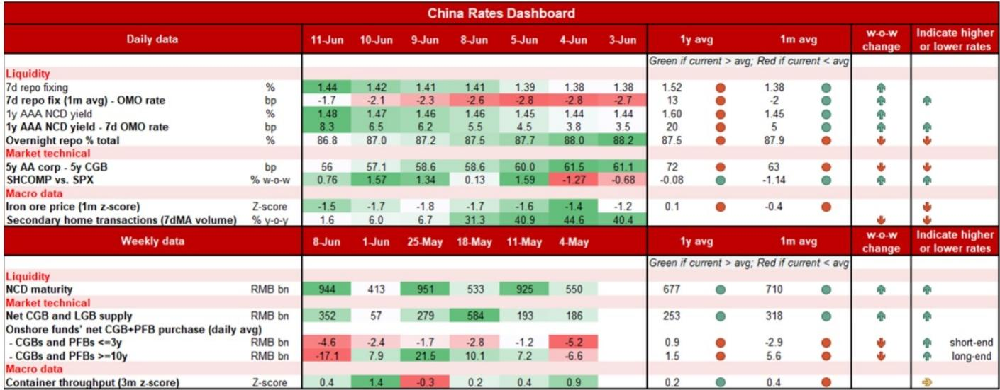
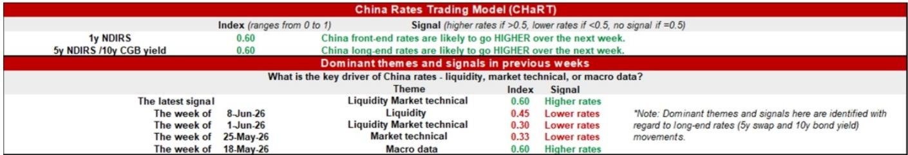

# NOM：中国利率市场真正被低估的风险不是降息预期，而是流动性正常化的传导加速

过去两个月，中国债券市场经历了一轮罕见的“先涨后跌”行情。5月末，各期限利率下行4-6个基点，市场一度沉浸在“宽松延续”的叙事中。但进入6月，利率迅速反弹约4-5个基点，将此前涨幅几乎全部回吐。

市场参与者习惯性地将这一切归因于央行降息或政策信号。但NOM最新发布的这份中国利率策略报告，提供了一个更值得警惕的判断框架：真正驱动利率走向的，不是降息与否，而是一套被市场低估的流动性正常化机制正在加速运转。这份报告的核心主张是，过去几个月支撑债市极度宽松的流动性环境正在系统性逆转，而这一过程才刚刚开始。

NOM明确提出，维持做空3年期NDIRS的头寸，目标看向1.60%。这个判断并非基于对经济数据的乐观，而是基于对流动性供给结构、债券发行节奏以及机构行为三重变量的拆解。以下是我们从这份研报中提炼出的五个核心洞察。

## 1. 央行已经在悄悄收紧中期流动性，而市场直到6月才反应过来

市场对央行操作的关注，往往集中在7天逆回购利率或MLF利率是否调整。但NOM指出，真正重要的变化发生在“中期货币政策工具”的净投放上。

数据显示，今年1-2月，央行通过MLF、买断式逆回购、国债净买入等工具，累计净投放流动性约2.05万亿元，远超历史均值。这解释了为什么一季度市场流动性极度充裕。但从3月开始，情况逆转：3月净回笼200亿元，4月净回笼560亿元，5月净回笼850亿元。到了6月5日，央行又通过3个月期买断式逆回购净回笼300亿元。结果就是，截至6月初，今年以来的累计中期净投放已降至仅140亿元，远低于2020-2025年约1.1万亿元的平均水平。

这个数字意味着什么？意味着过去两个月支撑债市上涨的“流动性充裕”基础，其实已经在逐步被抽走。但市场对此反应滞后——隔夜利率DR001在5月中旬就开始上行，而7天回购利率DR007和1年期NCD收益率直到6月5日才开始显著反弹。NOM的判断是，这种滞后恰恰说明，市场对流动性正常化的定价还不够充分。

这里有一个关键信号值得注意：6月3日和4日，央行连续两日暂停逆回购操作。上一次暂停还要追溯到2024年8月。NOM的解读是，央行并非要制造紧缩，而是在传递一个清晰的信号——当市场资金已经足够便宜时，它不会再主动注入更多流动性。这个信号的意义，可能比一次降息或加息更大。

## 2. 政府债券供给将在三季度集中放量，这是流动性最直接的“抽水机”

流动性收紧的另一面，是供给端即将到来的压力。NOM的数据显示，截至5月底，国债和地方债的净融资进度仅完成全年额度的35%。虽然国债发行节奏略快于历史同期，但地方债的发行明显偏慢——前五个月的完成比例低于2021-2025年38%的平均水平。

5月政府债券净供给尤其低，这恰好与当月流动性极度充裕形成共振，也是推动基金大规模买入长久期债券的重要原因之一。但NOM预计，6月国债和地方债的月净供给将从5月的890亿元上升至约1000亿元，三季度进一步升至约1300亿元，四季度回落至约900亿元。

这个节奏意味着什么？三季度将是供给压力最大的时期。当大量债券集中发行，银行体系需要吸收这些供给，流动性自然收紧。更重要的是，财政支出加速本身也可能改善经济增长预期，从而进一步压低债市的避险需求。

对投资者而言，这里有一个容易被忽视的因果关系：不是经济数据好转导致利率上行，而是债券供给本身通过流动性渠道推高了利率。这个逻辑在二季度可能比基本面更重要。

## 3. 存单市场已经发出明确信号：银行负债成本正在上升

NCD（同业存单）市场的变化，往往是银行体系流动性状况的“温度计”。NOM观察到，自2025年6月以来，月度NCD净发行多数时间为负值，原因是央行此前持续注入中期流动性，银行无需通过NCD市场主动负债。但5月，这一趋势逆转——月净NCD供给自去年10月以来首次转正。

如果看周度数据，信号更加清晰：5月18日和6月1日当周，净供给均为正值。这意味着，随着央行中期净投放减少，银行开始重新通过NCD市场补充负债。而接下来两周，NCD到期量分别高达9400-9600亿元和7300亿元，到期续作压力将推动NCD收益率进一步上行。

NOM的判断是，NCD收益率的上行压力已经形成，并且在未来几周内只会加剧。这不仅仅是银行间市场的事情——NCD收益率上行会传导至债券市场的短端定价，进而影响整个利率曲线的形态。

## 4. 基金已经开始减持长债，但“买跌”力量可能限制利率上行空间

供给压力和流动性收紧，最终会体现在机构行为上。NOM的持仓数据显示，在4-5月大量积累超长久期国债和政策性银行债后，6月以来基金已经开始减持。第一周，基金还在加仓10年以上品种，同时净卖出前端和中段；到了本周，卖出已经蔓延至后端，基金大量抛售10年期政策性银行债。

但这里有一个重要的对冲力量：保险机构。数据显示，保险机构本周明显增加了对30年期国债的买入。这与它们的历史操作模式一致——在市场抛售时加仓，在上涨时减仓。NOM认为，如果30年期国债收益率升至2.25%，保险的买入需求将进一步增强，从而对收益率上行形成一定封顶。

此外，目前10年期与30年期国债的利差约为49个基点，处于较宽水平。这一利差本身为30年期品种提供了缓冲，也意味着长端的上行空间可能不如短端那么直接。

NOM的结论是：在信用需求和零售数据等经济指标出现实质性改善之前，或者流动性收紧的幅度远超当前预期之前，利率曲线不太可能出现显著陡峭化。因此，他们更倾向于通过3年期NDIRS而非5年期来押注利率上行。

## 5. 报告尚未完全回答的关键问题：流动性收紧的“二阶效应”会如何扩散？

NOM的这份报告在流动性、供给和需求三个维度上提供了非常清晰的框架，但有一个问题尚未完全展开：流动性正常化对信用债市场、对实体经济融资成本、对股市风险偏好的传导路径是什么？

报告提到，央行通过OMO操作的节奏和信号意义，更多是在“传递意图”而非“制造紧缩”。但市场对信号的反应往往是非线性的。当DR007和1年期NCD收益率持续上行，银行的负债成本上升是否会推动贷款利率上行？企业债的信用利差是否会走阔？这些二阶效应目前仍难以量化，但值得密切关注。

另一个悬而未决的问题是：基金的减持行为能否持续？报告指出，如果10年期和30年期国债收益率分别达到1.75%和2.25%的关键水平，可能会触发“逢低买入”的买盘。这意味着，利率上行的空间可能并非无限，而是被机构行为设置了“天花板”。但这个天花板是否牢固，取决于后续的流动性收紧速度和供给压力是否超出预期。

对于读者来说，理解NOM的框架比记住一个目标利率更重要。流动性的正常化不是一次性的政策事件，而是一个持续的过程。当前市场可能仍处于这个过程的早期阶段，后续的每一个数据点——OMO操作频率、NCD发行量、债券供给节奏、基金持仓变化——都可能成为新的定价催化剂。

---

以上是基于NOM这份报告的深度解读。报告原文中还有更多关于中国利率交易模型（CHaRT）的细节，以及不同期限NDIRS的仓位管理策略，这些内容在本文中未能完全展开。如果你希望进一步讨论流动性收紧对信用债和权益市场的传导路径，或者想了解NOM在更久远期限上的交易建议，欢迎来我们的星球微信群继续交流。那里有更完整的研报原文和更深入的讨论。

Personal reading notes and learning share only. Not investment advice.

