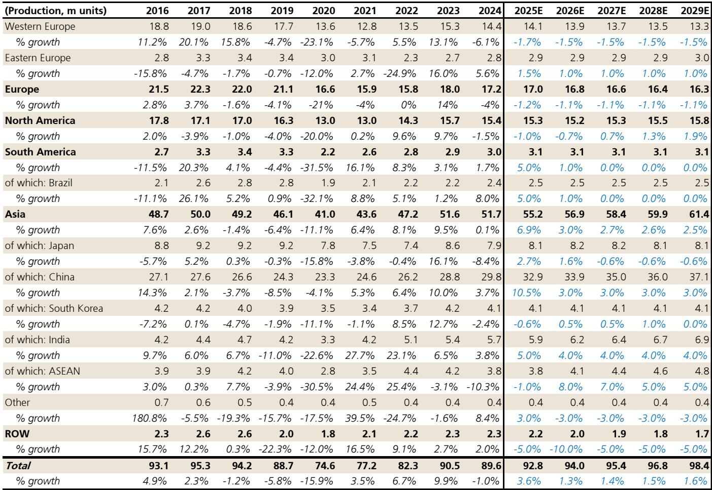
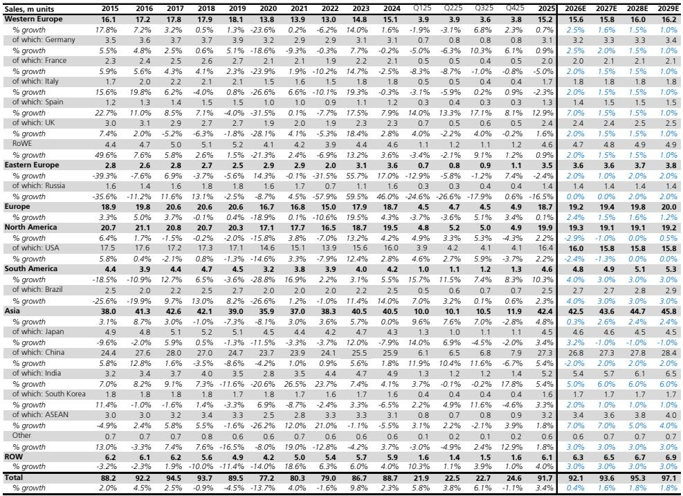
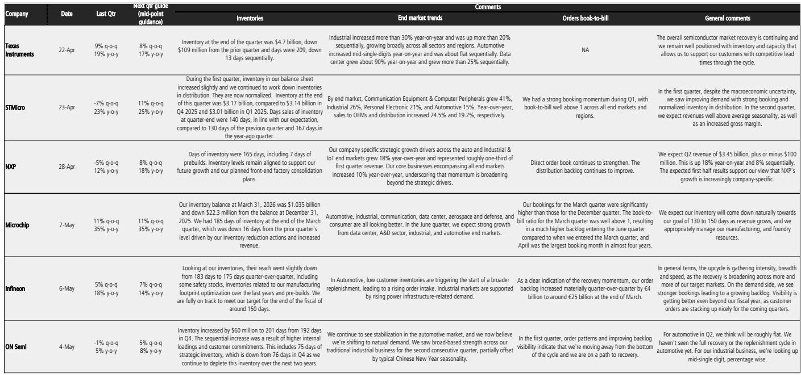

# The Analog Semiconductor Recovery Is Real, But The Easy Money Has Already Been Made

The automotive and industrial semiconductor cycle has turned decisively positive. After more than two years of destocking, negative year-over-year comparisons, and cautious commentary from management teams, the data now confirms that revenue growth has resumed. Q1 2026 analog semiconductor revenues grew 20% year-over-year, and consensus expects Q2 to deliver 21% growth. The industrial segment has been even stronger, with Q1 revenues up 26% year-over-year. These are not marginal improvements. They represent a genuine cyclical recovery.

Yet the critical question for investors is not whether the cycle is improving. It is whether the market has already priced in that improvement. Analog semiconductor stocks now trade at approximately 30x forward 12-month P/E, compared to their 10-year average of 19x. The valuation expansion has been dramatic. The discount to broader semiconductor capital equipment stocks has narrowed from roughly 17% a year ago to near parity. The recovery thesis is well understood. The question is what comes next.

This report argues that the analog semiconductor cycle still has room to run through 2027, driven by the end of destocking, improving pricing, and industrial AI demand. However, the risk-reward profile has shifted. The headwinds from China's slowing auto market, the potential for inventory corrections in the second half of 2026, and the elevated valuation multiple all demand a more selective approach. The days of broad-based beta exposure are over. This is now a stock-picker's market.

## The Cycle Is Broadening Beyond Automotive, But Industrial Is The Real Engine

The narrative around this recovery has centered on automotive semiconductors, which suffered the deepest downturn and have the most visible restocking story. Automotive semiconductor revenues grew 7.8% year-over-year in Q1 2026, the first quarter of clear growth in over two years. Consensus expects 9% growth in Q2. For the full year 2026, the estimate is 10% growth, accelerating to 14% in 2027. These figures are driven primarily by the normalization of inventory levels after a prolonged destocking phase that ran from mid-2024 through early 2026.

But the automotive story, while real, is not the most interesting part of this cycle. The industrial segment has surprised to the upside. Industrial semiconductor revenues grew 26% year-over-year in Q1 2026, and the full-year 2026 growth estimate has been revised upward from approximately 16% to 25%. For 2027, the estimate has moved from 10% to 16%. The driver is not a broad industrial recovery. It is AI. Several major analog companies have lifted guidance and cited increasing visibility into AI-related demand for industrial end-markets. This is a meaningful structural shift, not just a cyclical bounce.

The implication is that the recovery is becoming more differentiated. Automotive is a restocking story with a finite duration. Industrial AI demand has the potential to be more sustained. Investors need to distinguish between companies that are simply benefiting from the cycle and those that are gaining structural exposure to higher-growth segments. Companies with strong AI industrial exposure are likely to command premium valuations even after the cycle peaks.

## Pricing Power Has Returned, But It Is Concentrated In Specific Pockets

One of the most important developments in the current cycle is the return of pricing power. After several quarters of expectations for low single-digit price declines in 2026, the data now points to flat or even slightly positive pricing. The latest distributor tracker data shows pricing up 2% month-over-month and 9% year-over-year. Several major analog companies, including Texas Instruments, Infineon, and NXP, have increased pricing in Q1 2026, citing inflation costs.

This matters because pricing is the highest-margin lever in the semiconductor business model. A shift from declining to stable or rising prices can have an outsized impact on earnings, even if unit volumes are only growing modestly. The fact that pricing is turning positive suggests that supply-demand dynamics are tighter than many expected.

However, the pricing recovery is not uniform. The tightest conditions are in AI-related products, where demand is outstripping supply. In broader markets, the picture is more mixed. There is still lingering oversupply in certain commodity analog products, and demand remains uneven across end-markets. The conditions do not resemble the COVID-era shortage, and they should not be expected to. Pricing power is real, but it is concentrated. Companies with high exposure to AI-related industrial and automotive applications are in a stronger position than those reliant on general-purpose analog products.

This concentration of pricing power has direct implications for stock selection. Investors should favor companies with proprietary product portfolios that serve AI-enabled industrial automation, power management for data centers, and advanced automotive systems. Companies that compete primarily on price in commoditized analog markets will see less benefit from the pricing tailwind.

## The China Auto Market Is The Most Underappreciated Risk In The Thesis

The bullish case for automotive semiconductors rests heavily on the assumption that the restocking cycle will drive sustained revenue growth through 2027. That assumption is reasonable for Europe and North America, where production is recovering and inventory levels are normalizing. But China, which accounts for approximately 20-30% of global automotive semiconductor demand, presents a material downside risk that is not fully reflected in consensus estimates.

January-to-May retail sales data in China show year-to-date declines of 15-20% for the overall auto market and 10-15% for EVs. This is a significant deterioration. Chinese auto production was a key source of strength through 2025, with the market growing approximately 7% year-over-year. The slowdown in 2026 is real and accelerating. If this trend persists, it raises the risk of an inventory correction in the second half of 2026, as automakers and their suppliers adjust to weaker end-demand.

The risk is compounded by the fact that global semiconductor companies are losing share to domestic Chinese players. When accounting for potential share loss, the estimate for global incumbents' automotive semiconductor revenues in China is essentially flat in 2026, compared to 8% growth in the rest of the world. This is before any potential inventory correction. If a correction does materialize, the China exposure of companies like Infineon (30% of revenue from China), Renesas (31%), and Texas Instruments (21%) becomes a direct headwind.

The market is not pricing this risk adequately. The consensus automotive semiconductor growth estimates of 10% for 2026 and 14% for 2027 assume a smooth recovery. If China deteriorates further, those estimates will need to be revised downward. Investors with exposure to companies with high China revenue concentration should stress-test their assumptions for a scenario where China auto production declines 5-10% in 2026.

## The Valuation Multiple Leaves Little Room For Error

The most straightforward argument for caution is valuation. Analog semiconductor stocks are trading at approximately 30x forward 12-month P/E, compared to a 10-year average of 19x. This is a 58% premium to the historical average. Even if one argues that the cycle justifies above-average multiples, the current level implies that much of the recovery is already priced in.

The valuation expansion has been driven by two factors: the cyclical recovery itself, and a rotation into analog names as investors seek exposure to the industrial AI theme. Both factors are now fully reflected in prices. For the market to sustain these multiples, the recovery needs to exceed current expectations. That is possible, particularly if industrial AI demand continues to accelerate. But it is not the base case.

The risk is that any negative surprise--whether from China, from a slower-than-expected restocking pace, or from a broader macroeconomic slowdown--could trigger a multiple compression that offsets the earnings growth. At 30x earnings, stocks do not need bad news to underperform. They only need news that is less good than expected.

This does not mean that investors should avoid the sector entirely. It means that the bar for stock selection is higher. Companies that can deliver above-consensus earnings growth, gain market share, or demonstrate structural exposure to high-growth end-markets can still generate attractive returns. Companies that are simply riding the cycle will likely disappoint.

## What The Report Does Not Fully Answer: The Duration And Shape Of The Industrial AI Cycle

The report provides strong evidence that industrial AI demand is becoming a meaningful driver for analog semiconductor companies. Multiple companies have lifted guidance and cited increased visibility. The full-year 2026 industrial growth estimate has been revised upward significantly. But the report does not fully address the question of how sustainable this demand is.

Industrial AI is not a single end-market. It encompasses factory automation, robotics, power management for AI data centers, and a range of other applications. Some of these are likely to be structural growth stories that persist for years. Others may be pull-forwards of demand as companies rush to invest in AI capabilities. The report's estimates extend to 2027, but the shape of the cycle beyond that is unclear.

The key analytical question is whether industrial AI demand for analog semiconductors follows a classic S-curve adoption pattern, with sustained multi-year growth, or whether it resembles a demand spike that normalizes after an initial investment wave. The answer has profound implications for valuation. If industrial AI is a structural growth driver, then 30x earnings may be justified for companies with strong exposure. If it is a cyclical spike, then current multiples will prove unsustainable.

Investors should look for companies that provide specific disclosure on the proportion of their industrial revenue that is AI-related, and that can demonstrate that their products are designed into platforms with multi-year lifecycles. Companies that can show recurring revenue streams from AI applications are more likely to sustain their valuations.

## A Decision Framework For Navigating The Analog Semiconductor Cycle

For investors trying to position themselves in this environment, a structured decision framework is essential. The following questions can help differentiate between companies that are well-positioned and those that are vulnerable.

First, assess the end-market mix. Companies with high exposure to industrial AI applications have a structural tailwind that extends beyond the cycle. Companies that are primarily automotive-dependent are more exposed to the China risk and the finite duration of the restocking cycle.

Second, evaluate the pricing power. Companies that have proprietary products in tight supply-demand segments can sustain or increase prices. Companies in commoditized analog markets will see less benefit and may face margin pressure when the cycle turns.

Third, stress-test the China exposure. For companies with more than 20% of revenue from China, assume a scenario where China auto production declines and local share loss accelerates. What does that do to the growth trajectory? If the answer is negative, the stock is pricing in too much optimism.

Fourth, compare the valuation to the earnings trajectory. At 30x earnings, a company needs to deliver at least 15-20% earnings growth per year to generate an attractive return. Can the company deliver that growth without relying on multiple expansion? If the growth is coming primarily from the cycle rather than from structural factors, the risk of disappointment is high.

Fifth, consider the balance sheet and capital allocation. Companies that can return capital to shareholders through dividends and buybacks provide a cushion if the cycle peaks sooner than expected. Companies that need to invest heavily in capacity may face margin pressure if demand softens.

## The Full Picture Requires More Than A Summary

This article has laid out the case for continued recovery in analog semiconductors, the risks that are not fully priced, and the framework for stock selection. But the full analysis requires the data that supports these conclusions: the detailed revenue growth trajectories by end-market, the inventory days trends for both semiconductor companies and OEMs, the pricing data from distributor trackers, and the company-level guidance comparisons.

The original report contains charts that show the sequential and year-over-year revenue growth for the analog semiconductor peer group, the inventory days trends that confirm the end of destocking, and the breakdown of automotive semiconductor revenue by region. These charts provide the empirical foundation for the arguments made here. Without them, the analysis is incomplete.

Join the community to read the full report and review the original charts.

*This article is for learning and discussion only and does not constitute investment advice.*

Personal reading notes and learning share only. Not investment advice.

