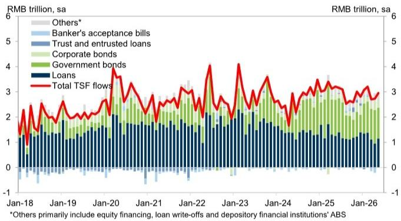
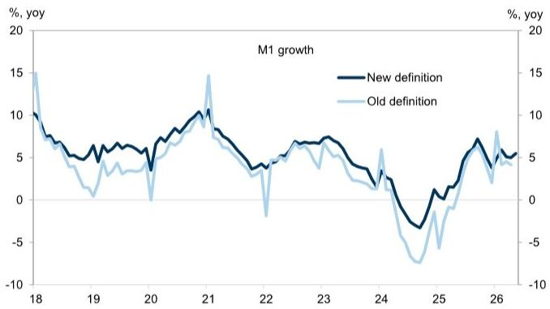

# GS：五月信贷超预期，但真正的信号藏在结构里

市场对五月金融数据的初步解读，多数停留在“总量超预期”这个层面。新增社融2.03万亿，新增人民币贷款5200亿，双双高于GS和彭博的预测值。如果只看这些数字，似乎可以得出“宽信用正在见效”的乐观结论。

但GS这份研报的核心判断恰恰相反：**总量超预期不是复苏信号，而是结构性疲弱的又一次确认。**

原因在于，数据超预期主要来自银行信贷的供给端发力，而非实体融资需求的真实回暖。当一份信贷报告需要用“票据融资大幅增加”和“中长期企业贷款收缩”来解释时，决策者应当警惕的不是流动性不足，而是信用传导机制中的梗阻。

这份研报最有价值的洞察，不是告诉读者信贷数据超预期了，而是拆解了“为什么超预期反而令人担忧”。对于关注中国经济周期和资产定价的投资者而言，理解这种结构性的分化，远比记住一个总量数字重要。

## 1. 真正支撑总量的不是企业投资意愿，而是银行在“填表”

五月新增人民币贷款5200亿，高于GS预测的4000亿和彭博一致预期的4500亿。表面看是银行放贷意愿增强，但细拆结构会发现，这更像是银行在监管和考核压力下的被动行为。

企业贷款是五月信贷的主要支撑，新增6400亿，高于去年同期的5300亿。但关键在于构成：票据融资贡献了5570亿，短期贷款1000亿，而中长期企业贷款反而净减少200亿。去年同期，中长期企业贷款是净增3300亿。

这个对比意味着什么？中长期贷款通常对应企业的资本开支、设备投资和扩张计划，是衡量真实融资需求的核心指标。当这个指标从净增3300亿转为净减200亿，而票据融资大幅飙升时，最合理的解释是：企业没有投资意愿，银行只能用低成本票据融资来“填满”信贷额度。

票据融资本质上是银行间的一种短期资金安排，与实体经济活动的关联度较低。它的增加往往反映的是银行在完成信贷投放指标，而不是企业有真实的融资需求。GS研报虽然没有直接点明这一点，但数据本身已经给出了清晰的信号。

对于投资者而言，这意味着：**如果下一阶段票据融资占比继续上升，而中长期贷款持续疲弱，那么信贷总量对经济增长的领先意义将进一步削弱。**

## 2. 居民部门正在去杠杆，这是比企业更值得关注的信号

五月居民贷款存量净减少1410亿，而去年同期是净增加540亿。这个对比的幅度，比企业贷款的结构变化更令人担忧。

居民贷款的收缩，在逻辑上可以归因于两个因素：一是房地产市场的持续低迷导致按揭需求不足，二是消费信心的疲弱使得信用卡和消费贷款需求下降。GS研报没有展开讨论具体原因，但数据本身已经表明，居民部门正在主动或被动地去杠杆。

从宏观角度看，居民去杠杆与企业的短期融资行为构成了一个相互强化的负反馈循环：居民收入预期不稳，减少消费和购房，导致企业收入下降、投资意愿减弱；企业投资收缩又进一步影响就业和居民收入。信贷数据中的居民贷款收缩，正是这个循环在金融层面的映射。

对于资产定价而言，居民贷款的趋势比企业贷款更具前瞻性。因为居民信贷直接关联消费和房地产市场，而这两个领域是中国经济内循环的核心驱动力。如果居民贷款在接下来的几个月继续收缩，那么市场对经济复苏的预期可能需要进一步下修。

## 3. M1回升背后是财政发力，不是企业现金流改善

五月M1同比增速从4月的5.0%回升至5.5%，M2则持平于8.6%。乍看之下，M1回升似乎意味着企业活期存款增加，是企业经营现金流改善的信号。

但GS研报提供了一个关键的补充视角：五月财政存款增加7100亿，比去年同期少了约1700亿。这意味着财政支出节奏比去年更快，而这很可能是M1回升的主要驱动力。

这个判断的逻辑链条是：财政支出加快，资金从国库转入企业和居民账户，增加了活期存款，从而推高了M1。如果剔除财政因素，M1的改善幅度可能远没有数据显示的那么显著。

对于投资者而言，这个区分至关重要。由财政驱动的M1回升，其持续性和对经济的支撑力度，远不如由企业自发经营改善驱动的M1回升。一旦财政支出节奏放缓，M1增速可能再次回落。因此，不能将五月M1的回升解读为企业端复苏的信号。

## 4. 社融结构的“此消彼长”揭示了一个尚未被充分定价的风险

五月社融存量同比增速从7.8%微降至7.7%，但经过季节调整后的环比年化增速从8.0%降至7.2%。这个环比放缓的幅度，比同比数据所暗示的更为明显。

从社融的构成看，信贷和表外融资的改善，部分被政府债券和企业债券的拖累所抵消。GS在图表中展示了一个清晰的趋势：信贷投放的环比改善，并没有转化为社融增速的全面回升。

这里存在一个尚未被市场充分讨论的风险：**如果政府债券发行节奏在下半年放缓，而企业债券融资继续疲弱，那么社融增速可能面临更大的下行压力。** 政府债券是2023年以来社融的主要支撑，一旦这个支撑减弱，而信贷和表外融资无法完全弥补缺口，社融增速的放缓可能会加速。

对于债券投资者而言，这意味着信用利差的走势可能需要重新评估。如果社融增速持续放缓，而信贷结构依然以短期融资为主，那么信用风险的定价逻辑可能需要从“总量宽松”转向“结构分化”。

## 5. 报告没有完全回答的关键问题：信贷需求何时才会真正改善？

GS这份研报清晰地指出了问题所在，但对于“信贷需求何时才会真正改善”这个问题，并没有给出明确的答案。这并非报告的缺陷，而是当前经济环境下，任何预测都面临高度不确定性的体现。

从逻辑上推演，信贷需求的改善需要满足几个条件：一是房地产市场的企稳，二是居民收入预期的修复，三是企业投资回报率的回升。目前这三个条件都不具备。五月的数据表明，政策层面可能仍在通过银行体系维持信贷供给，但需求端并未响应。

这里有一个值得投资者持续跟踪的观察框架：**关注中长期企业贷款和居民贷款的边际变化，而不是总量数据。** 只有当这两个指标同时出现连续两个月的环比改善，才能初步判断信贷需求正在回暖。在此之前，任何基于总量数据的乐观解读都可能是误导性的。

## 6. 对决策者的观察框架：从“量”到“价”再到“结构”

基于GS这份研报的分析逻辑，我们可以提炼出一个三层观察框架：

第一层是“量”：关注社融和信贷的同比、环比增速。这是最基础的指标，但也是最容易产生误读的指标。五月的数据就说明，只看总量会得出与事实相反的结论。

第二层是“价”：关注利率和融资成本的变化。如果信贷需求真实回暖，利率应该上行；如果利率持续下行而信贷量增加，更可能是供给驱动而非需求驱动。GS研报没有讨论利率，但这个逻辑是自洽的。

第三层是“结构”：关注贷款期限、借款主体和资金用途的分布。这是最核心的观察维度。中长期贷款占比、居民贷款变化、票据融资占比，这三个指标比任何总量数据都更能反映经济的真实融资需求。

对于资产配置而言，这个框架可以帮助投资者区分“政策驱动的流动性”和“市场驱动的复苏”。前者对应的是债券市场的配置机会，后者对应的是权益市场的盈利改善。当前的数据指向的是前者，而非后者。

---

五月信贷数据是一面镜子，照出的不是经济的复苏，而是政策与市场之间的张力。银行在努力放贷，但企业和居民在谨慎观望。这种张力何时能够打破，取决于需求端的修复速度，而这恰恰是当前最具不确定性的变量。

GS这份研报的价值，在于它没有停留在“超预期”的简单叙事里，而是深入拆解了数据背后的行为逻辑。对于认真追踪中国宏观经济的读者来说，理解这种结构性分化，远比记住一个总量数字更有意义。

关于信贷结构变化的二阶影响、不同行业融资需求的差异、以及政策可能的应对路径，这些议题在报告中都有涉及但未完全展开。欢迎来星球微信群继续讨论，我们将围绕这份研报的未尽议题做进一步的深度拆解。

Personal reading notes and learning share only. Not investment advice.

