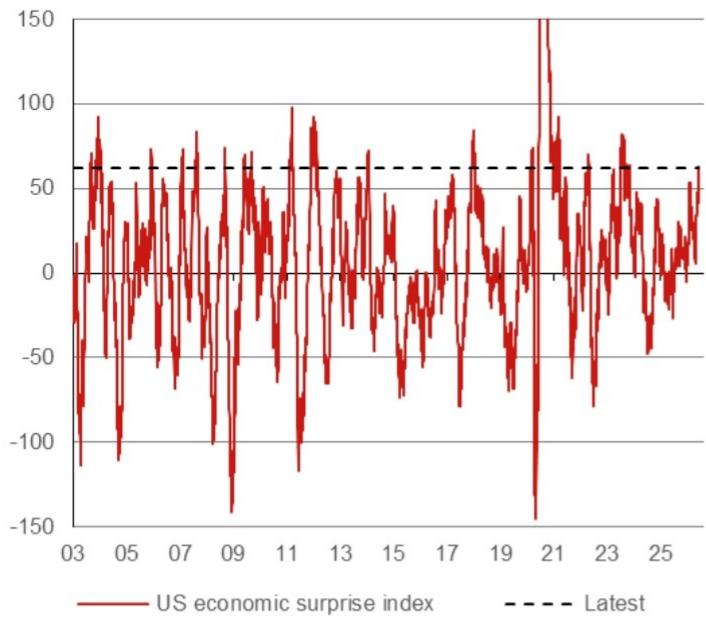
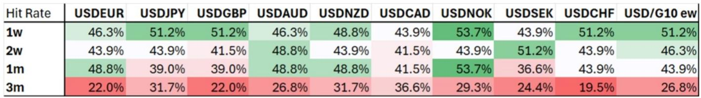
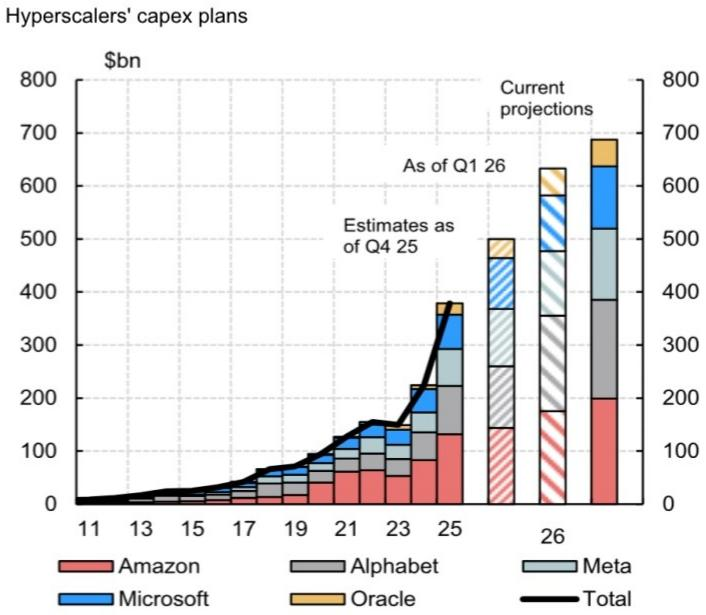

# NOM：美元多头共识已达峰值，历史规律指向未来三个月大概率走弱

当前市场对美元的共识有多强？NOM最新外汇策略报告给出了一个值得警惕的答案：当“美国例外论”成为客户会议和媒体高频词时，美元多头头寸正在逼近一个危险的临界点。

这份研报的核心判断并非否定美元近期的强势逻辑——美国数据持续超预期、利率重新定价、资本流入加速，这些支撑因素仍然存在。但NOM提出了一个反直觉的历史规律：当美国经济惊喜指数突破60这一阈值后，美元在未来三个月下跌的概率高达75%。当前该指数正处于近三年高位，这意味着市场可能站在美元情绪周期的拐点。

更关键的是，NOM识别出三个可能触发美元逆转的具体风险点：7月美国就业数据的季节性残留效应、新任美联储主席沃什可能释放鸽派信号、以及AI驱动的科技股叙事面临成本质疑。这些因素尚未被市场充分定价，但它们正在积累。

对于持有美元敞口的投资者而言，当前需要关注的不是美元还能涨多少，而是什么会打破这个共识。

## 1. 经济惊喜指数已达历史极端区间，美元后续回报历史规律指向弱势

NOM的核心论据建立在一个简洁而有力的统计规律上。报告追溯了美国经济惊喜指数过去23年的全部历史，发现该指数突破60水平共出现41次。当考察随后三个月的美元表现时，结果呈现出高度一致的负面特征：美元兑G10等权重指数的平均回报为-1.8%，而“命中率”——即美元走弱的概率——高达73.2%。

这个规律在分货币对层面同样显著。美元兑欧元、英镑、澳元、新西兰元、挪威克朗和瑞典克朗在三个月窗口期的平均跌幅均超过1.5%，命中率在63%至80%之间。即使是对美元相对抗跌的加元和日元，三个月平均回报也分别为-1.2%和-0.7%。

NOM进一步指出，如果将阈值提高到70，美元在所有表现窗口期的回报都变得更加一致地为负。这意味着当前水平——惊喜指数在60附近徘徊——正处于从正面转向负面的“临界点”附近。

需要强调的是，这个历史规律并非经济基本面的直接反映，而是市场情绪和定价的滞后效应。当数据惊喜达到极端水平时，市场已经充分甚至过度定价了这些好消息，后续边际上的数据改善空间收窄，而任何不及预期的数据都会触发多头平仓。这正是NOM所说的“惊喜的惊喜”——好消息本身可能成为美元反转的催化剂。

## 2. 美元多头仓位尚未到极端水平，但非美货币空头积累已构成不对称风险

从持仓结构看，当前美元多头并非历史极值。CFTC非商业持仓数据显示，美元净多头占未平仓合约的比例约为8%，远低于2025年初的27%。这似乎表明市场尚未过度拥挤。

但NOM提醒，更值得关注的是非美货币的空头积累。英镑、日元、加元、瑞士法郎等G10货币的空头头寸都在显著增加，尤其是英镑和日元，净空头占比分别达到32%和37%。这种“全面做空非美”的持仓结构，实际上构成了一个不对称的风险场景：一旦美元出现回调迹象，这些空头头寸的集中平仓将放大美元的下跌幅度。

这与2025年初的情况形成对比——当时美元多头更为极端，但非美空头相对分散，因此美元调整时非美货币的反弹幅度相对温和。当前的结构意味着，如果触发因素出现，美元的下行速度可能比历史均值更快。

报告还提到，中东地缘政治局势的缓和预期——尤其是特朗普关于“周末签署协议”的表态——可能成为美元回调的短期催化剂。在当前的持仓结构下，任何地缘政治风险的下降都会削弱美元的避险溢价，而空头回补压力会进一步放大这一效果。

## 3. 三个尚未被市场充分定价的尾部风险

NOM明确列出了三个可能打破当前美元共识的具体风险，这些风险并非小概率事件，而是有明确时间窗口和触发条件的潜在催化剂。

第一个风险是美国就业数据的季节性残留效应。过去三年，7月非农就业数据均出现显著的下行意外，而2026年7月的数据将于8月7日公布。在连续三次非农超预期之后，如果这一模式重现，将直接冲击“美国劳动力市场再加速”的叙事。NOM指出，近期周度初请失业金数据已经显示出一些季节性残留迹象，这增加了7月数据不及预期的概率。

第二个风险是美联储主席沃什的政策立场。作为新上任的美联储主席，沃什被认为处于FOMC中偏鸽派的一端。如果他能利用劳动力市场走弱的迹象释放鸽派信号，可能会抑制市场对加息重新定价的预期。NOM认为，沃什与FOMC其他成员的互动方式是一个“巨大的不确定性来源”，而市场目前尚未充分定价这种政策路径变化的可能性。

第三个风险来自科技和AI叙事。AI资本支出对GDP的拉动在毛额上可能达到2个百分点，但NOM注意到一个关键变化：越来越多的AI消费企业开始对成本提出质疑，而科技公司正通过股权融资而非现金流来支撑资本支出。Oracle在6月11日宣布超预期资本支出后股价下跌，就是一个信号。如果AI叙事从“增长故事”转向“成本压力故事”，可能通过财富效应和金融条件收紧两条路径对美元形成负面冲击。

这三个风险中，任何一个单独出现都可能只是短期扰动，但如果叠加发生——例如7月就业数据意外下行，叠加沃什鸽派表态，再叠加AI股回调——将构成一个完整的美元逆转叙事。

## 4. 报告尚未完全回答的关键问题：美元反转的幅度与持续性

尽管NOM的逻辑链条清晰，但这份报告留下了一个关键问题：如果美元确实在未来三个月走弱，调整幅度会有多大？持续多久？

从历史数据看，当惊喜指数突破60后，三个月平均跌幅约为1.8%，但这个数字掩盖了很大的离散度。在2009年和2022年，美元在类似场景下反而大幅走强，分别上涨17.5%和8.5%，这与当时全球金融环境（欧债危机、美联储激进加息）密切相关。这说明历史规律并非机械的，需要结合当前的宏观背景判断。

报告没有充分展开的一个维度是：如果美元走弱，哪些货币最可能受益？从历史命中率看，美元兑瑞士法郎和英镑的三个月弱势概率最高（分别为80.5%和78%），但这两个货币本身面临各自的宏观挑战——瑞士央行的干预风险、英国财政可持续性担忧。相比之下，欧元和日元虽然历史命中率略低，但当前的估值和基本面可能提供更好的风险收益比。

此外，报告提到“美国例外论”可能见顶，但并未深入分析“非美国例外论”是否成立。如果欧洲、日本和中国的经济数据同样走弱，美元的下行空间可能有限。这需要投资者结合其他地区的宏观数据进行交叉验证。

## 5. 投资者的观察框架：从“美元还能涨多少”转向“逆转信号何时出现”

基于NOM的逻辑，投资者可以建立一个三层观察框架来跟踪美元反转的概率。

第一层是数据信号。7月非农就业数据（8月7日公布）是近期最重要的观察窗口。如果数据低于预期，将直接检验“美国例外论”叙事的韧性。同时，周度初请失业金数据可以作为前瞻指标，如果持续上升，将增加非农不及预期的概率。

第二层是政策信号。关注沃什在7月FOMC会议前后的公开讲话，特别是对劳动力市场和通胀前景的评估。如果他开始强调“数据依赖”或“耐心”，将被市场解读为鸽派信号。此外，关注FOMC内部是否有成员开始公开质疑加息定价的合理性。

第三层是市场信号。美元指数是否有效跌破关键技术水平（例如100日均线或前期低点），以及非美货币空头头寸是否开始减少。如果CFTC数据显示英镑和日元空头开始平仓，将确认美元反转趋势的形成。

这三个层次的信号不需要同时出现。任何一个层面的变化都可能触发市场的连锁反应，尤其是在当前持仓结构不对称的背景下。对于持有美元多头敞口的投资者，建议密切跟踪这三个维度的变化，并考虑在信号出现时调整头寸。

---

美元多头共识已经形成，但历史规律和持仓结构都指向一个不对称的风险场景。NOM这份报告的价值不在于预测美元一定下跌，而在于提供了一个清晰的逻辑框架，帮助投资者识别“什么会打破共识”。接下来的几周，就业数据和政策信号将给出答案。

欢迎来星球微信群里继续讨论，我们会持续跟踪这些关键信号的变化，并分享更多未在公开报告中展开的分析框架和图表。

Personal reading notes and learning share only. Not investment advice.

