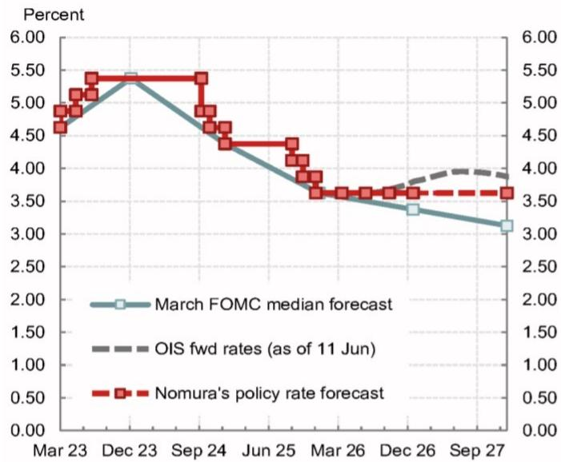
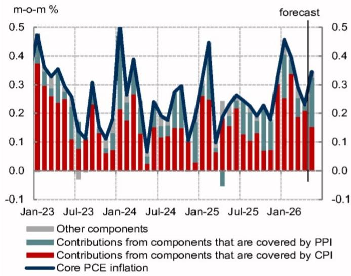
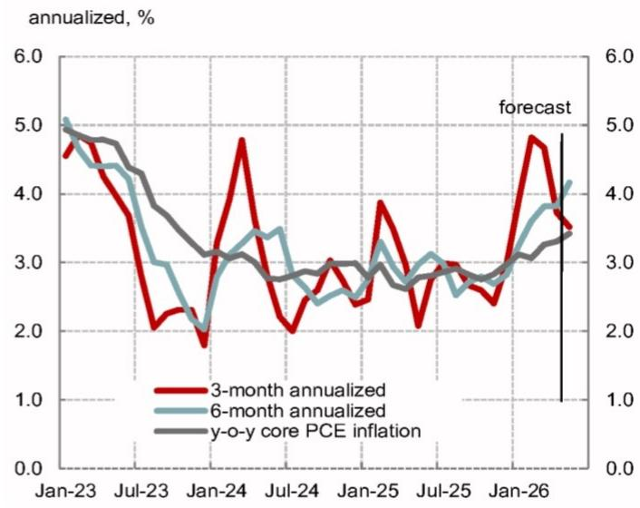
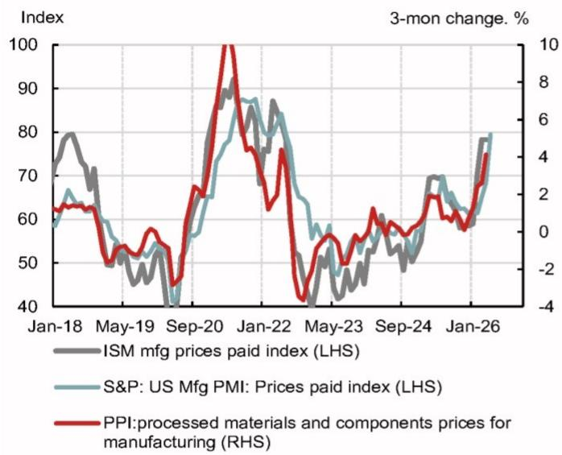
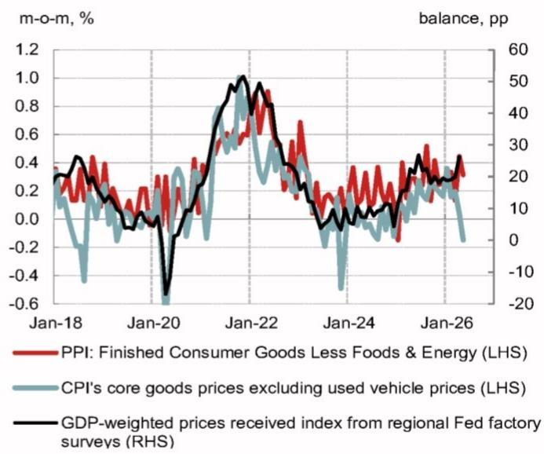
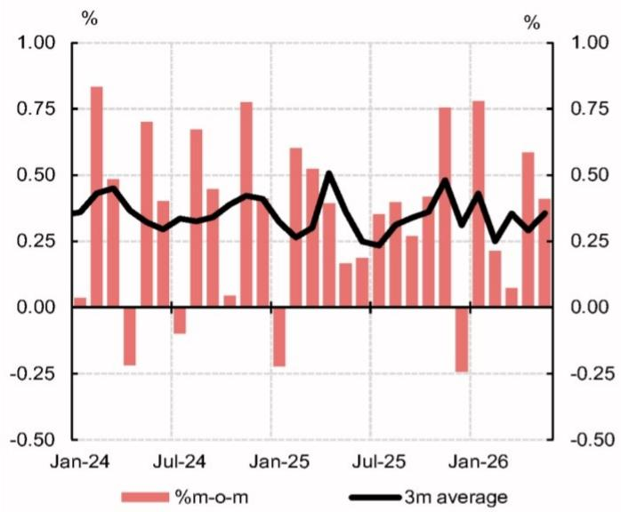
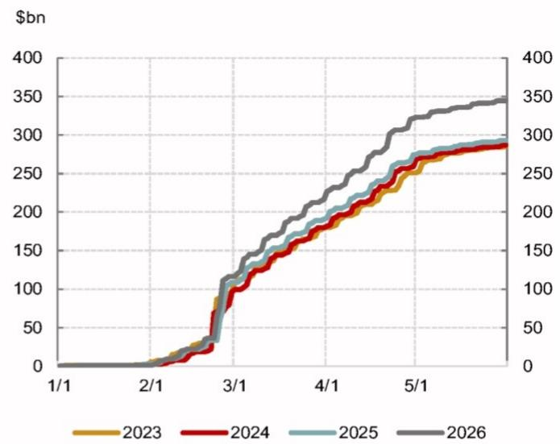
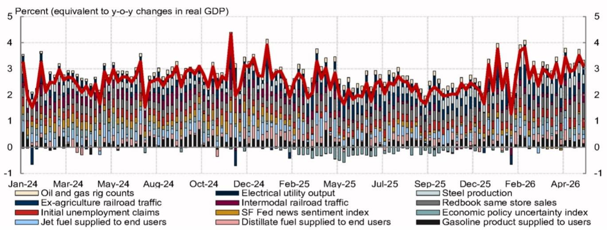

## US Economic Weekly

Economics - North America

## Chair Transplant

- We expect the Fed to remain on hold at the June FOMC meeting. The meeting statement will likely drop the easing bias, and we expect the dot plot medians to show rates on hold through the end of 2027.  
- We think Chair Warsh will decline to submit his own economic and policy projections. In his first press conference, Warsh may continue to downplay the usefulness of forward guidance, while hinting at a future case for rate cuts.  
- CPI and PPI inflation data point to an acceleration in core PCE inflation to $0.345\%$ m-o-m or $3.426\%$ y-o-y in May. Pipeline price pressures measured by PPI data continued to grow and point to an upside risk to the inflation outlook.

## We expect the Fed to remain on hold and remove an easing bias

The Fed will likely keep the policy rate on hold for the fourth consecutive meeting at the June FOMC meeting. Since the April meeting, economic indicators show growing inflation risks, while labor markets have stabilized with some signs of acceleration.

Fig. 1: The Fed will likely keep the policy rate on hold  

line chart

| Date   | March FOMC median forecast | OIS fwd rates (as of 11 Jun) | NOM's policy rate forecast |
|--------|----------------------------|------------------------------|-------------------------------|
| Mar 23 | 4.80                       | 4.80                         | 4.80                          |
| Dec 23 | 5.40                       | 5.40                         | 5.40                          |
| Sep 24 | 4.80                       | 4.80                         | 4.80                          |
| Jun 25 | 4.40                       | 4.40                         | 4.40                          |
| Mar 26 | 3.80                       | 3.80                         | 3.80                          |
| Dec 26 | 3.60                       | 3.60                         | 3.60                          |
| Sep 27 | 3.20                       | 3.80                         | 3.60                          |

Source: FRB, Bloomberg, NOM

## Research Analysts

## North America Economics

## Aichi Amemiya - NSI

aichi.amemiya@NOM.com

+1 212 667 9347

## Jeremy Schwartz - NSI

jeremy.schwartz@NOM.com

+1 212 667 9637

## Ruchir Sharma - NSI

ruchir.sharma@NOM.com

+1 212 667 9186

## Jacklyn Goloborodsky - NSI

jacklyn.goloborodsky@NOM.com

+1 212 298 4739

## Global Economics

## David Seif - NSI

david.seif@NOM.com

+1 212 667 9180

Fig. 2: We expect Chair Warsh to acknowledge the current hawkish macroeconomic environment, but make a case for policy easing in the medium term

<table><tr><td>Tool</td><td>Key assumptions</td></tr><tr><td colspan="2">Policy rate</td></tr><tr><td>2026</td><td>No rate cuts, EOP 3.625%</td></tr><tr><td>2027</td><td>No rate cuts, EOP 3.625%</td></tr><tr><td>Terminal</td><td>3.50 - 3.75%</td></tr><tr><td colspan="2">Balance sheet policy</td></tr><tr><td>Size</td><td>Reserve management purchases of $10bn/month. The NY Fed is actively managing reserve management purchases in response to seasonal liquidity demand and market conditions. We expect balance sheet growth to average $20bn per month in the medium term.</td></tr><tr><td>Composition</td><td>MBS rundown to continue, with proceeds reinvested into Treasuries. Both reinvestments and eventual reserve management purchases will be skewed towards Treasury bills.</td></tr></table>

Source: FRB, NOM

We expect the post-meeting policy statement will remove the easing bias from the forward guidance language with unanimous support. Fedspeak has turned more hawkish recently, with several FOMC participants explicitly discussing the possibility of a rate hike. That being said, a dovish faction on the Committee remains cautiously optimistic about the inflation outlook and sees policy as moderately restrictive.

Revisions to the economic projections will likely be concentrated in the inflation outlook. We expect the median inflation projection for both the headline PCE and core PCE price indices will rise over the near term (Fig. 3). We expect policymakers will make a mark-to-market adjustment to their unemployment rate projections for 2026 and 2027, reflecting recent strength in labor markets. We expect real GDP growth projections will remain unchanged from the March meeting.

Fig. 3: We expect the median inflation projection for both headline PCE and core PCE price indices to rise over the near term NOM's forecast for the June 2026 Summary of Economic Projections

<table><tr><td></td><td></td><td>2026</td><td>2027</td><td>2028</td><td>Longer-run</td></tr><tr><td rowspan="2">Change in real GDP</td><td>Jun-26</td><td>2.4</td><td>2.3</td><td>2.1</td><td>2.0</td></tr><tr><td>Mar-26</td><td>2.4</td><td>2.3</td><td>2.1</td><td>2.0</td></tr><tr><td rowspan="2">Unemployment rate</td><td>Jun-26</td><td>4.3</td><td>4.2</td><td>4.2</td><td>4.2</td></tr><tr><td>Mar-26</td><td>4.4</td><td>4.3</td><td>4.2</td><td>4.2</td></tr><tr><td rowspan="2">PCE inflation</td><td>Jun-26</td><td>3.6</td><td>2.2</td><td>2.0</td><td>2.0</td></tr><tr><td>Mar-26</td><td>2.7</td><td>2.2</td><td>2.0</td><td>2.0</td></tr><tr><td rowspan="2">Core PCE inflation</td><td>Jun-26</td><td>3.2</td><td>2.3</td><td>2.0</td><td></td></tr><tr><td>Mar-26</td><td>2.7</td><td>2.2</td><td>2.0</td><td></td></tr><tr><td colspan="6">Projected appropriate policy path: Median</td></tr><tr><td rowspan="2"></td><td>Jun-26</td><td>3.625</td><td>3.625</td><td>3.375</td><td>3.250</td></tr><tr><td>Mar-26</td><td>3.375</td><td>3.125</td><td>3.125</td><td>3.125</td></tr></table>

Source: FRB, Haver, NOM

We do not expect Chair Warsh to submit interest rate projections for the dot plot, consistent with his past criticisms of Fed forward guidance (Fig. 4). Such an omission would reduce the total number of dots to 18 from 19. Warsh cannot unilaterally eliminate any aspects of the summary of economic projections, but there is a precedent for participants declining to submit forecasts.

We expect the median dots for 2026 and 2027 will rise to $3.625\%$ , indicating no change from the current rate level for the next one and a half years. Given that most officials have discussed multiple scenarios, it is difficult to gauge individual dots for 2026, but we expect that 4-5 dots will indicate a rate hike, 7-9 dots will correspond to no changes, and 4-6 dots will be consistent with rate cuts. We expect the median 2028 dot to be $3.375\%$ , consistent with one rate cut, and the longer-run median dot (a proxy of the neutral rate of interest) to be revised up to $3.250\%$ from $3.125\%$ , as the FOMC participants' characterization of the policy stance suggests an upward revision to their estimate of neutral rate.

Fig. 4: We think Warsh will decline to submit his interest rate projections for the dot plot, which is consistent with his past criticisms of Fed forward guidance  
NOM's expectation for policymakers' 2026 dots

<table><tr><td>%</td><td colspan="2">2026 dot as of June (NOM&#x27;s expectation)</td><td></td></tr><tr><td>3.875</td><td>Goolsbee</td><td>One rate hike</td><td>1</td></tr><tr><td>3.875</td><td>Schmid</td><td>One rate hike</td><td>2</td></tr><tr><td>3.875</td><td>Hammack</td><td>One rate hike</td><td>3</td></tr><tr><td>3.875</td><td>Musalem</td><td>One rate hike</td><td>4</td></tr><tr><td>3.875</td><td>Logan</td><td>One rate hike</td><td>5</td></tr><tr><td>3.625</td><td>Collins</td><td>No more rate cuts</td><td>6</td></tr><tr><td>3.625</td><td>Barkin</td><td>No more rate cuts</td><td>7</td></tr><tr><td>3.625</td><td>Kashkari</td><td>No more rate cuts</td><td>8</td></tr><tr><td>3.625</td><td>Barr</td><td>No more rate cuts</td><td>9</td></tr><tr><td>3.625</td><td>Venable</td><td>No more rate cuts</td><td>10</td></tr><tr><td>3.625</td><td>Cook</td><td>No more rate cuts</td><td>11</td></tr><tr><td>3.625</td><td>Waller</td><td>No more rate cuts</td><td>12</td></tr><tr><td>3.375</td><td>Jefferson</td><td>One more rate cut</td><td>13</td></tr><tr><td>3.375</td><td>Powell</td><td>One more rate cut</td><td>14</td></tr><tr><td>3.375</td><td>Daly</td><td>One more rate cut</td><td>15</td></tr><tr><td>3.375</td><td>Paulson</td><td>One more rate cut</td><td>16</td></tr><tr><td>3.375</td><td>Williams</td><td>One more rate cut</td><td>17</td></tr><tr><td>3.125</td><td>Bowman</td><td>Two more rate cuts</td><td>18</td></tr><tr><td>3.125</td><td>Warsh</td><td>Two more rate cuts</td><td>19</td></tr></table>

Source: FRB, NOM

In the press conference, we think Warsh is unlikely to call for an immediate rate cut given the current hawkish macroeconomic environment. However, we think Warsh could make a case for policy easing in the medium term, suggesting that a pause in easing is largely driven by uncertainty around the Iran war. As he did at his confirmation hearing, we expect Warsh to reiterate his view that AI will boost productivity and lead to disinflation. Warsh may also characterize currently elevated inflation as a temporary phenomenon due to the Iran war.

Warsh may continue to downplay the usefulness of core PCE inflation and instead propose alternative inflation measures. He may also discuss the possibility of balance sheet reduction, possibly laying out a roadmap or timeframe for a smaller balance sheet. In addition, he could discuss how he might make changes to the Fed's communication strategy.

## May CPI and PPI reports point to an acceleration in core PCE inflation

Incorporating CPI and PPI data, we forecast core PCE inflation of $0.345\%$ m-o-m in May from $0.23\%$ in April. This would translate into y-o-y core PCE inflation of $3.426\%$ , the highest reading since October 2023.

Fig. 5: Core PCE inflation likely accelerated in May, driven by components derived from PPI data  
Decomposition of m-o-m core PCE inflation by data source  

bar-line hybrid chart

| Date | Other components (m-o-m %) | Contributions from components that are covered by PPI (m-o-m %) | Contributions from components that are covered by CPI (m-o-m %) | Core PCE inflation (m-o-m %) |
|---|---|---|---|---|
| Jan-23 | 0.05 | 0.15 | 0.25 | 0.45 |
| Jul-23 | -0.05 | 0.05 | 0.10 | 0.20 |
| Jan-24 | 0.05 | 0.15 | 0.25 | 0.50 |
| Jul-24 | 0.05 | 0.10 | 0.15 | 0.25 |
| Jan-25 | 0.05 | 0.15 | 0.25 | 0.45 |
| Jul-25 | 0.05 | 0.10 | 0.15 | 0.25 |
| Jan-26 | 0.05 | 0.15 | 0.25 | 0.45 |
forecast
(m o-m %)

Source: BLS, BEA, Haver, NOM

Fig. 6: Y-o-y core PCE inflation likely rose to $3.4\%$ in May  

line chart

| Date    | 3-month annualized | 6-month annualized | y-o-y core PCE inflation |
|---------|--------------------|--------------------|--------------------------|
| Jan-23  | 4.8                | 5.0                | 5.0                      |
| Jul-23  | 2.0                | 3.0                | 4.0                      |
| Jan-24  | 4.8                | 3.5                | 3.0                      |
| Jul-24  | 2.0                | 3.5                | 2.8                      |
| Jan-25  | 3.8                | 3.0                | 3.0                      |
| Jul-25  | 2.5                | 3.0                | 2.8                      |
| Jan-26  | 4.8                | 4.0                | 3.5                      |
| forecast| forecast           | forecast           | forecast                 |

Source: BEA, Haver, NOM

Core CPI inflation moderated to $0.208\%$ m-o-m from $0.376\%$ in April. Core CPI goods inflation turned negative for the first time since May 2025. The tariff impact appears to have continued to wane, while inflationary pressures from global shortages of semiconductors on consumer electronics diminished. We expect core PCE goods inflation also turned negative in May. By contrast, Core CPI service inflation remained resilient. Rent-related components remained elevated, and supercore CPI components continued to increase at a decent pace. Transportation service prices (e.g., airline fares and auto insurance prices) were volatile.

Compared with our expectations, PCE-relevant PPI data were mixed, as the strength in portfolio management and investment advice prices was partially offset by an unexpected decline in domestic airline fares. CPI and PPI data suggest that supercore PCE inflation likely accelerated to 0.5% m-o-m, the highest since January 2026. Backward revisions to PPI data suggest that January core PCE inflation will likely be revised up, while March and April core PCE inflation will likely be revised down.

Details of PPI data for manufacturers' production costs and selling prices indicate upward pressure on core goods inflation in the coming months. Production costs for US manufacturers kept growing as PPI's processed materials and components for manufacturing continued to increase, in line with the recent increase in factory surveys' prices paid indices (Fig. 7).

Despite the softness in core CPI goods prices, manufacturers continued to pass higher hosts on to their consumers, as PPI for finished consumer goods excluding food and energy increased in May (Fig. 8). Regional manufacturing surveys' prices received indices also point to pass-through of higher costs into consumer product prices.

Fig. 7: Recent business surveys' show firming of prices  
Manufacturing prices paid index vs. PPI's input costs for manufacturing  

line chart

| Date   | ISM mfg prices paid index (LHS) | S&P: US Mfg PMI: Prices paid index (LHS) | PPI: processed materials and components prices for manufacturing (RHS) |
|--------|----------------------------------|---------------------------------------------|---------------------------------------------------------------|
| Jan-18 | 75                               | 65                                          | 60                                                            |
| May-19 | 50                               | 45                                          | 55                                                            |
| Sep-20 | 90                               | 85                                          | 100                                                           |
| Jan-22 | 85                               | 80                                          | 70                                                            |
| May-23 | 40                               | 35                                          | 45                                                            |
| Sep-24 | 65                               | 60                                          | 65                                                            |
| Jan-26 | 80                               | 75                                          | 70                                                            |

Source: BLS, ISM, S&P, Haver, NOM

Fig. 8: PPI's finished consumer goods prices excluding food and energy continued to increase in May, suggesting pass-through of higher costs into consumer goods prices  

line chart

| Date    | PPI: Finished Consumer Goods Less Foods & Energy (LHS) | CPI's core goods prices excluding used vehicle prices (LHS) | GDP-weighted prices received index from regional Fed factory surveys (RHS) |
|---------|--------------------------------------------------------|---------------------------------------------------------------|--------------------------------------------------------------------------|
| Jan-18  | ~0.3                                                   | ~0.2                                                          | ~20                                                                      |
| Jan-20  | ~0.1                                                   | ~-0.6                                                         | ~-20                                                                     |
| Jan-22  | ~1.0                                                   | ~1.0                                                          | ~50                                                                      |
| Jan-24  | ~0.2                                                   | ~-0.4                                                         | ~0                                                                       |
| Jan-26  | ~0.4                                                   | ~0.2                                                          | ~20                                                                      |

Source: BLS, BEA, NY Fed, Philly Fed, Dallas Fed, KC Fed, Haver, NOM

## Data next week

We expect retail sales rose $0.5\%$ m-o-m in May, as gasoline spending remained strong and motor vehicle sales picked up. Strong payroll income growth and higher tax refunds from the OBBBA have supported spending thus far, despite inflationary headwinds from the Iran war (Fig. 9 & Fig. 10).

Fig. 9: Strong payroll income growth has supported spending  
Aggregate private payroll income  

bar-line hybrid chart

| Month   | %m-o-m | 3m average |
|---------|--------|----------|
| Jan-24  | 0.85   | 0.35     |
| Feb-24  | 0.48   | 0.38     |
| Mar-24  | -0.18  | 0.32     |
| Apr-24  | 0.70   | 0.30     |
| May-24  | 0.40   | 0.31     |
| Jun-24  | -0.10  | 0.33     |
| Jul-24  | 0.68   | 0.34     |
| Aug-24  | 0.45   | 0.36     |
| Sep-24  | 0.78   | 0.39     |
| Oct-24  | -0.15  | 0.37     |
| Nov-24  | 0.60   | 0.35     |
| Dec-24  | 0.52   | 0.36     |
| Jan-25  | -0.18   | 0.34     |
| Feb-25  | 0.58   | 0.38     |
| Mar-25  | 0.40   | 0.45     |
| Apr-25  | 0.18   | 0.25     |
| May-25  | 0.35   | 0.28     |
| Jun-25  | 0.40   | 0.30     |
| Jul-25  | 0.25   | 0.27     |
| Aug-25  | 0.38   | 0.31     |
| Sep-25  | 0.28   | 0.33     |
| Oct-25  | 0.78   | 0.39     |
| Nov-25  | -0.18   | 0.36     |
| Dec-25  | -0.15   | 0.38     |
| Jan-26  | -0.18   | 0.40     |
| Feb-26  | -0.15   | 0.37     |
| Mar-26  | -0.18   | 0.39     |
| Apr-26  | -0.15   | 0.36     |
| May-26  | -0.18   | 0.38     |
| Jun-26  | -0.15   | 0.37     |
| Jul-26  | -0.18   | 0.39     |
| Aug-26  | -0.15   | 0.36     |
| Sep-26  | -0.18   | 0.38     |
| Oct-26  | -0.15   | 0.37     |
| Nov-26  | -0.18   | 0.39     |
| Dec-26  | -0.15   | 0.36     |

Source: BLS, Haver, NOM

Fig. 10: Higher tax refunds appeared to offset the sentiment and cashflow drag from higher gasoline prices  
YTD tax refunds  

line chart

| Date  | 2023  | 2024  | 2025  | 2026  |
|-------|-------|-------|-------|-------|
| 1/1   | 0     | 0     | 0     | 0     |
| 2/1   | 0     | 0     | 0     | 0     |
| 3/1   | 100   | 100   | 100   | 100   |
| 4/1   | 200   | 200   | 200   | 200   |
| 5/1   | 280   | 280   | 280   | 350   |

Source: US Treasury, Bloomberg, Haver, NOM

We expect industrial production growth slowed to 0.2% m-o-m in May and manufacturing production was flat. Core manufacturing (i.e., manufacturing excluding motor vehicles and parts production) likely grew 0.3%. Manufacturing surveys scheduled for release next week (the Empire State and Philly Fed surveys) are likely to point to increased production, while prices paid and received indices will remain elevated, in line with the May PPI report.

Separately, we continue to expect housing data next week to show a pickup in activity in Q2. We expect single-family housing starts ticked up, while volatile multifamily starts fell.

Pending home sales likely rose. The NAHB Housing Market Index likely remained unchanged from May, as mortgage rates ticked down, while rising building material costs and elevated uncertainty weighed on builder sentiment.

## Q2 GDP tracking

We have revised our Q2 GDP tracking estimate to $2.4\%$ q-o-q ar from $2.3\%$ last week. Our estimate for real final sales to private domestic purchasers now stands at $2.7\%$ from $2.6\%$ previously. Inflation data this week led to a slightly smaller GDP contribution from real personal consumption. A downside surprise in defense outlays in May weighed on government spending, which was offset by strength in net exports and residential investment, as the April trade balance and May existing home sales had a positive impact on our tracking estimate.

Fig. 11: NOM's inflation forecasts

<table><tr><td rowspan="2"></td><td colspan="2">Headline PCE</td><td colspan="3">Core PCE</td><td colspan="2">Headline CPI</td><td colspan="3">Core CPI</td><td>CPI NSA</td></tr><tr><td>m/m %</td><td>y/y %</td><td>m/m %</td><td>y/y %</td><td>qtrly, y/y %</td><td>m/m %</td><td>y/y %</td><td>m/m %</td><td>y/y %</td><td>qtrly, y/y %</td><td>Index</td></tr><tr><td>Jan-25</td><td>0.35</td><td>2.61</td><td>0.31</td><td>2.78</td><td></td><td>0.43</td><td>3.00</td><td>0.43</td><td>3.26</td><td></td><td>317.671</td></tr><tr><td>Feb-25</td><td>0.40</td><td>2.71</td><td>0.45</td><td>2.97</td><td></td><td>0.23</td><td>2.82</td><td>0.25</td><td>3.12</td><td></td><td>319.082</td></tr><tr><td>Mar-25</td><td>0.02</td><td>2.36</td><td>0.10</td><td>2.67</td><td>2.81</td><td>0.03</td><td>2.39</td><td>0.07</td><td>2.79</td><td>3.08</td><td>319.799</td></tr><tr><td>Apr-25</td><td>0.17</td><td>2.28</td><td>0.19</td><td>2.61</td><td></td><td>0.16</td><td>2.31</td><td>0.24</td><td>2.78</td><td></td><td>320.795</td></tr><tr><td>May-25</td><td>0.18</td><td>2.46</td><td>0.23</td><td>2.78</td><td></td><td>0.10</td><td>2.35</td><td>0.13</td><td>2.79</td><td></td><td>321.465</td></tr><tr><td>Jun-25</td><td>0.29</td><td>2.59</td><td>0.26</td><td>2.81</td><td>2.74</td><td>0.25</td><td>2.67</td><td>0.23</td><td>2.93</td><td>2.82</td><td>322.561</td></tr><tr><td>Jul-25</td><td>0.17</td><td>2.61</td><td>0.25</td><td>2.86</td><td></td><td>0.23</td><td>2.70</td><td>0.31</td><td>3.06</td><td></td><td>323.048</td></tr><tr><td>Aug-25</td><td>0.26</td><td>2.75</td><td>0.22</td><td>2.91</td><td></td><td>0.35</td><td>2.92</td><td>0.31</td><td>3.11</td><td></td><td>323.976</td></tr><tr><td>Sep-25</td><td>0.26</td><td>2.79</td><td>0.19</td><td>2.83</td><td>2.87</td><td>0.30</td><td>3.01</td><td>0.22</td><td>3.02</td><td>3.06</td><td>324.800</td></tr><tr><td>Oct-25</td><td>0.19</td><td>2.71</td><td>0.23</td><td>2.75</td><td></td><td>0.03</td><td>2.76</td><td>0.11</td><td>2.81</td><td></td><td>324.372</td></tr><tr><td>Nov-25</td><td>0.22</td><td>2.82</td><td>0.18</td><td>2.83</td><td></td><td>0.22</td><td>2.74</td><td>0.08</td><td>2.63</td><td></td><td>324.122</td></tr><tr><td>Dec-25</td><td>0.33</td><td>2.88</td><td>0.33</td><td>2.97</td><td>2.85</td><td>0.30</td><td>2.68</td><td>0.23</td><td>2.64</td><td>2.69</td><td>324.054</td></tr><tr><td>Jan-26</td><td>0.36</td><td>2.89</td><td>0.46</td><td>3.12</td><td></td><td>0.17</td><td>2.39</td><td>0.30</td><td>2.50</td><td></td><td>325.252</td></tr><tr><td>Feb-26</td><td>0.40</td><td>2.88</td><td>0.40</td><td>3.06</td><td></td><td>0.27</td><td>2.41</td><td>0.22</td><td>2.46</td><td></td><td>326.785</td></tr><tr><td>Mar-26</td><td>0.70</td><td>3.59</td><td>0.29</td><td>3.26</td><td>3.15</td><td>0.87</td><td>3.26</td><td>0.20</td><td>2.60</td><td>2.53</td><td>330.213</td></tr><tr><td>Apr-26</td><td>0.40</td><td>3.83</td><td>0.23</td><td>3.31</td><td></td><td>0.64</td><td>3.81</td><td>0.38</td><td>2.75</td><td></td><td>333.020</td></tr><tr><td>May-26</td><td>0.476</td><td>4.131</td><td>0.345</td><td>3.426</td><td></td><td>0.47</td><td>4.25</td><td>0.21</td><td>2.85</td><td></td><td>335.123</td></tr><tr><td>Jun-26</td><td>0.10</td><td>3.94</td><td>0.25</td><td>3.41</td><td>3.38</td><td>-0.02</td><td>3.94</td><td>0.26</td><td>2.85</td><td>2.81</td><td>335.285</td></tr><tr><td>Jul-26</td><td>0.17</td><td>3.93</td><td>0.21</td><td>3.37</td><td></td><td>0.15</td><td>3.88</td><td>0.22</td><td>2.75</td><td></td><td>335.576</td></tr><tr><td>Aug-26</td><td>0.21</td><td>3.88</td><td>0.20</td><td>3.35</td><td></td><td>0.23</td><td>3.74</td><td>0.22</td><td>2.66</td><td></td><td>336.084</td></tr><tr><td>Sep-26</td><td>0.22</td><td>3.83</td><td>0.20</td><td>3.36</td><td>3.36</td><td>0.25</td><td>3.66</td><td>0.22</td><td>2.66</td><td>2.69</td><td>336.693</td></tr><tr><td>Oct-26</td><td>0.16</td><td>3.79</td><td>0.22</td><td>3.35</td><td></td><td>0.11</td><td>3.74</td><td>0.22</td><td>2.77</td><td></td><td>336.495</td></tr><tr><td>Nov-26</td><td>0.22</td><td>3.79</td><td>0.21</td><td>3.38</td><td></td><td>0.24</td><td>3.73</td><td>0.22</td><td>2.91</td><td></td><td>336.210</td></tr><tr><td>Dec-26</td><td>0.25</td><td>3.71</td><td>0.21</td><td>3.26</td><td>3.33</td><td>0.30</td><td>3.69</td><td>0.22</td><td>2.90</td><td>2.86</td><td>336.010</td></tr><tr><td>Jan-27</td><td>0.20</td><td>3.55</td><td>0.25</td><td>3.05</td><td></td><td>0.18</td><td>3.71</td><td>0.27</td><td>2.87</td><td></td><td>337.323</td></tr><tr><td>Feb-27</td><td>0.11</td><td>3.26</td><td>0.20</td><td>2.86</td><td></td><td>0.05</td><td>3.50</td><td>0.20</td><td>2.85</td><td></td><td>338.236</td></tr><tr><td>Mar-27</td><td>0.21</td><td>2.75</td><td>0.20</td><td>2.76</td><td>2.89</td><td>0.21</td><td>2.86</td><td>0.20</td><td>2.85</td><td>2.86</td><td>339.667</td></tr><tr><td>Apr-27</td><td>0.15</td><td>2.50</td><td>0.20</td><td>2.73</td><td></td><td>0.12</td><td>2.32</td><td>0.19</td><td>2.66</td><td></td><td>340.749</td></tr><tr><td>May-27</td><td>0.17</td><td>2.19</td><td>0.20</td><td>2.59</td><td></td><td>0.14</td><td>1.97</td><td>0.19</td><td>2.65</td><td></td><td>341.722</td></tr><tr><td>Jun-27</td><td>0.16</td><td>2.25</td><td>0.20</td><td>2.53</td><td>2.62</td><td>0.13</td><td>2.12</td><td>0.19</td><td>2.57</td><td>2.63</td><td>342.410</td></tr><tr><td>Jul-27</td><td>0.18</td><td>2.26</td><td>0.19</td><td>2.52</td><td></td><td>0.17</td><td>2.14</td><td>0.19</td><td>2.54</td><td></td><td>342.769</td></tr><tr><td>Aug-27</td><td>0.20</td><td>2.25</td><td>0.19</td><td>2.50</td><td></td><td>0.20</td><td>2.12</td><td>0.18</td><td>2.50</td><td></td><td>343.216</td></tr><tr><td>Sep-27</td><td>0.21</td><td>2.24</td><td>0.19</td><td>2.48</td><td>2.50</td><td>0.23</td><td>2.12</td><td>0.18</td><td>2.47</td><td>2.50</td><td>343.817</td></tr><tr><td>Oct-27</td><td>0.15</td><td>2.23</td><td>0.19</td><td>2.45</td><td></td><td>0.11</td><td>2.12</td><td>0.18</td><td>2.43</td><td></td><td>343.615</td></tr><tr><td>Nov-27</td><td>0.21</td><td>2.23</td><td>0.18</td><td>2.43</td><td></td><td>0.23</td><td>2.12</td><td>0.18</td><td>2.38</td><td></td><td>343.325</td></tr><tr><td>Dec-27</td><td>0.25</td><td>2.22</td><td>0.18</td><td>2.40</td><td>2.43</td><td>0.29</td><td>2.13</td><td>0.18</td><td>2.34</td><td>2.38</td><td>343.151</td></tr></table>

Note: Oct and Nov CPI refers to NOM's estimate.  
Source: BLS, Haver, NOM

## Data Preview

## The week ahead

We expect the FOMC to hold rates steady at the June meeting and signal no cuts.

Industrial production (Monday): We expect industrial production growth slowed to $0.2\%$ m-o-m in May following a $0.7\%$ increase in April. Manufacturing production was likely flat in May as motor vehicles and parts production declined, offsetting an increase in other components.

Core manufacturing (i.e. manufacturing excluding motor vehicles and parts production) likely remained strong and grew $0.3\%$ m-o-m. Manufacturing surveys suggest production rose in the month, and aggregate employment in the sector improved. Volatile components were mixed in May, as a strong increase in mining production was somewhat offset by weakening utilities production.

NAHB housing market index (Monday): We expect the NAHB Housing Market Index remained subdued at 37 in June, essentially unchanged from May. Mortgage rates ticked up during the survey reference period, and elevated uncertainty coupled with rising building material costs likely continued to weigh on builder sentiment.

Import prices (Tuesday): We expect import prices remained elevated in May as crude oil prices continued to be driven up by the Iran war. Ex-petroleum import prices likely moderated due to the lagged effect of a weaker dollar. Note, the scope of BLS's import prices excludes tariffs.

Housing starts (Tuesday): We expect housing starts slowed to 1445k in May from 1465k in April. Volatile multifamily starts likely fell, reversing a sharp increase in April, while single-family starts likely ticked up. Lead indicators (including building permits and home sales) suggest activity is likely to pick up in Q2 following a slowdown in Q1. Building permits likely edged down slightly to 1415k from 1423k in April, driven by a slowdown in multifamily permits.

Retail sales (Wednesday): We expect retail sales rose $0.5\%$ m-o-m in May following a $0.5\%$ advance in April. Gasoline sales remained strong, while motor vehicle sales also picked up in the month. Strong payroll income growth and higher tax refunds from the OBBBA have supported spending thus far, despite headwinds from the Iran war.

We expect nominal “control” retail sales growth slowed to 0.4% m-o-m from 0.5% previously. Food services sales likely slowed and building material sales likely fell in May.

Pending home sales (Wednesday): We expect pending home sales rose $0.9\%$ m-o-m, down from $1.4\%$ m-o-m in April. Weekly data from Redfin suggest home sales remained strong.

FOMC meeting (Wednesday): The Fed will likely keep the policy rate on hold for the fourth straight meeting next week. We expect the Committee to remove the easing bias from the policy statement with unanimous support.

The median projections for the federal funds rate will likely show no changes in the policy rate for 2026 and 2027, followed by one rate cut in 2028. We expect the median longer-run projection to be revised slightly higher.

Chair Warsh is unlikely to submit his own economic and policy projections, downplaying the benefit of providing forward guidance. He may acknowledge the current hawkish macroeconomic environment, but will likely make a case for policy easing in the medium term.

Jobless claims (Thursday): Initial and continuing jobless claims continued to rise this week, but remain relatively subdued. Initial jobless claims are now closer to their recent pattern of a pickup in summer months.

Fig. 12: Forecasts for economic indicators released during the week of 15 June

<table><tr><td colspan="2">Monday 15 June</td><td>Units</td><td>Period</td><td>Prev 2</td><td>Prev 1</td><td>Last</td><td>NOM</td><td>Consensus</td></tr><tr><td>8.30</td><td>Empire State survey</td><td>Index</td><td>Jun</td><td>-0.2</td><td>11.0</td><td>19.6</td><td>n.a.</td><td>n.a.</td></tr><tr><td>9.15</td><td>Industrial production</td><td>% m-o-m</td><td>May</td><td>0.6</td><td>-0.3</td><td>0.7</td><td>0.2</td><td>0.2</td></tr><tr><td>10.00</td><td>NAHB housing market index</td><td>Index</td><td>Jun</td><td>38</td><td>34</td><td>37</td><td>37</td><td>37</td></tr><tr><td colspan="9">Tuesday 16 June</td></tr><tr><td>8.30</td><td>Import prices</td><td>% m-o-m</td><td>May</td><td>1.0</td><td>0.9</td><td>1.9</td><td>n.a.</td><td>n.a.</td></tr><tr><td>8.30</td><td>Import prices ex-petroleum</td><td>% m-o-m</td><td>May</td><td>0.9</td><td>0.0</td><td>0.7</td><td>n.a.</td><td>n.a.</td></tr><tr><td>8.30</td><td>Housing starts</td><td>000s</td><td>May</td><td>1346</td><td>1507</td><td>1465</td><td>1445</td><td>1440</td></tr><tr><td>8.30</td><td>Housing starts</td><td>% m-o-m</td><td>May</td><td>-2.8</td><td>12.0</td><td>-2.8</td><td>-1.4</td><td>-1.7</td></tr><tr><td>8.30</td><td>Building permits</td><td>000s</td><td>May</td><td>1540</td><td>1363</td><td>1423</td><td>1415</td><td>1403</td></tr><tr><td>8.30</td><td>Building permits</td><td>% m-o-m</td><td>May</td><td>10.6</td><td>-11.5</td><td>4.4</td><td>-0.6</td><td>-1.4</td></tr><tr><td>13.00</td><td>20-yr Bond auction</td><td>$bn</td><td></td><td></td><td></td><td></td><td>13</td><td></td></tr><tr><td colspan="9">Wednesday 17 June</td></tr><tr><td>7.00</td><td>Mortgage applications</td><td>% w-o-w</td><td>12-Jun</td><td>-8.5</td><td>-2.5</td><td>10.8</td><td>n.a.</td><td>n.a.</td></tr><tr><td>8.30</td><td>Retail sales</td><td>% m-o-m</td><td>May</td><td>0.9</td><td>1.6</td><td>0.5</td><td>0.5</td><td>0.4</td></tr><tr><td>8.30</td><td>Retail sales ex-autos</td><td>% m-o-m</td><td>May</td><td>0.9</td><td>1.9</td><td>0.7</td><td>n.a.</td><td>0.3</td></tr><tr><td>8.30</td><td>Retail sales &quot;control&quot;</td><td>% m-o-m</td><td>May</td><td>0.9</td><td>0.8</td><td>0.5</td><td>0.4</td><td>n.a.</td></tr><tr><td>10.00</td><td>Pending home sales</td><td>% m-o-m</td><td>May</td><td>2.5</td><td>1.7</td><td>1.4</td><td>0.9</td><td>n.a.</td></tr><tr><td>14.00</td><td>FOMC meeting</td><td></td><td>Jun</td><td></td><td></td><td></td><td></td><td></td></tr><tr><td>14.00</td><td>FOMC rate decision (upper bound)</td><td>%</td><td>Jun</td><td>3.75</td><td>3.75</td><td>3.75</td><td>3.75</td><td>3.75</td></tr><tr><td>14.00</td><td>FOMC rate decision (lower bound)</td><td>%</td><td>Jun</td><td>3.50</td><td>3.50</td><td>3.50</td><td>3.50</td><td>3.50</td></tr><tr><td>14.00</td><td>FOMC interest on reserves (IOR)</td><td>%</td><td>Jun</td><td>3.65</td><td>3.65</td><td>3.65</td><td>3.65</td><td>3.65</td></tr><tr><td>14.00</td><td>FOMC Median Rate Forecast: Current Yr</td><td>%</td><td>Jun</td><td>3.625</td><td>3.625</td><td>3.375</td><td>3.625</td><td>3.625</td></tr><tr><td>14.00</td><td>FOMC Median Rate Forecast: Next Yr</td><td>%</td><td>Jun</td><td>3.375</td><td>3.375</td><td>3.125</td><td>3.625</td><td>3.625</td></tr><tr><td>14.00</td><td>FOMC Median Rate Forecast: +2 Yrs</td><td>%</td><td>Jun</td><td>3.125</td><td>3.125</td><td>3.125</td><td>3.375</td><td>3.375</td></tr><tr><td>14.00</td><td>FOMC Median Rate Forecast: Long-Run</td><td>%</td><td>Jun</td><td>3.000</td><td>3.000</td><td>3.125</td><td>3.250</td><td>3.125</td></tr><tr><td colspan="9">Thursday 18 June</td></tr><tr><td>8.30</td><td>Initial jobless claims</td><td>000s</td><td>13-Jun</td><td>212</td><td>225</td><td>229</td><td>n.a.</td><td>n.a.</td></tr><tr><td>8.30</td><td>Continuing jobless claims</td><td>000s</td><td>6-Jun</td><td>1785</td><td>1771</td><td>1795</td><td>n.a.</td><td>n.a.</td></tr><tr><td>8.30</td><td>Philly Fed survey</td><td>Index</td><td>Jun</td><td>18.1</td><td>26.7</td><td>-0.4</td><td>n.a.</td><td>n.a.</td></tr><tr><td>13.00</td><td>5-yr TIPS auction</td><td>$bn</td><td></td><td></td><td></td><td></td><td>24</td><td></td></tr></table>

Friday 19 June  
Juneteenth - Markets Closed  
Note: Eastern Daylight Time (EDT). All NOM forecasts are modal.  
Source: Haver, Bloomberg, NOM

## US Economic Outlook

We expect the Fed to stay on hold indefinitely due to diminished political pressure, elevated inflation, and hawkish Fedspeak.

Economic activity: Growth momentum has accelerated, supported by easing tariff uncertainty, fiscal stimulus from the One Big Beautiful Bill Act, and the lagged impact of Fed rate cuts amid easy financial conditions. Business investment appears to be broadening beyond the AI sector. Higher tax refunds and strong payroll income growth have supported consumer spending thus far, despite headwinds from the Iran war. A broad range of indicators point to resilience and tentative signs of reacceleration in the labor market. We expect the unemployment rate will decline, reaching $4.1\%$ by year-end. We think that the US economy remains relatively insulated from the crude oil price shock due to the Iran war given the small share of energy-goods consumption in household spending, as well as domestic energy production.

Inflation: Core inflation remains well above the Fed's $2\%$ target, and we believe risks are skewed to the upside. We forecast Q4 2026 core PCE inflation of $3.3\%$ y-o-y. We expect tariff price pressures will diminish in the coming quarters. However, this will likely be offset by new price pressures driven by supply shortages caused by AI (memory chips, electricity, etc.) along with spillovers from higher energy prices. Wage growth seems to have moderated gradually, but remains higher than the level consistent with the Fed's $2\%$ inflation goal, which is likely to lead to stickiness in supercore service inflation. We expect rent disinflation to continue, but at a very gradual pace.

Policy: We expect the Fed to remain on hold indefinitely. Fed Chair Warsh likely remains motivated to ease policy, but recent elevated inflation readings and hawkish Fedspeak suggest he may not be able to convince the majority of the Fed to support rate cuts. Moreover, support among Fed officials for an easing bias has begun to wane. While hikes appear unlikely in the near term, the Fed's hesitance to respond to tentative signs of inflation pressure raises the risk that they may end up "behind the curve," needing to hike quickly to re-establish credibility. The balance of risks is tilted towards tightening at this moment. On tariffs, wider Section 122 exemptions, lower tariff rates, and a greater focus on affordability suggest limited further escalation in US trade policy.

Risks: Further escalation of geopolitical risks could lead to a tightening of financial conditions and worsening of the fiscal outlook. Increased political pressures on individual FOMC participants could undermine the Fed's credibility, soliciting sharp market reactions. A bust of the AI boom could lead to material corrections in asset valuations. A continued shortage of memory chips and supply chain disruption due to a protracted Iran war could lead to a second round of goods price increases.

Fig. 13: United States: Details of the forecast

<table><tr><td rowspan="2">%</td><td rowspan="2"></td><td rowspan="2">1Q25</td><td rowspan="2">2Q25</td><td rowspan="2">3Q25</td><td rowspan="2">4Q25</td><td rowspan="2">1Q26</td><td rowspan="2">2Q26</td><td rowspan="2">3Q26</td><td rowspan="2">4Q26</td><td rowspan="2">1Q27</td><td rowspan="2">2Q27</td><td rowspan="2">3Q27</td><td rowspan="2">4Q27</td><td colspan="3">% y-o-y</td><td colspan="3">% Q4/Q4</td></tr><tr><td>2025</td><td>2026</td><td>2027</td><td>2025</td><td>2026</td><td>2027</td></tr><tr><td></td><td>q-o-q</td><td></td><td></td><td></td><td></td><td></td><td></td><td></td><td></td><td></td><td></td><td></td><td></td><td></td><td></td><td></td><td></td><td></td><td></td></tr><tr><td rowspan="2">Real GDP</td><td>(%, a.r.)</td><td>-0.6</td><td>3.8</td><td>4.4</td><td>0.5</td><td>1.6</td><td>2.7</td><td>2.1</td><td>1.9</td><td>1.9</td><td>1.9</td><td>1.6</td><td>1.6</td><td>2.1</td><td>2.2</td><td>1.9</td><td>2.0</td><td>2.1</td><td>1.8</td></tr><tr><td>(%)</td><td>-0.2</td><td>0.9</td><td>1.1</td><td>0.1</td><td>0.4</td><td>0.7</td><td>0.5</td><td>0.5</td><td>0.5</td><td>0.5</td><td>0.4</td><td>0.4</td><td></td><td></td><td></td><td></td><td></td><td></td></tr><tr><td>Personal consumption</td><td>(%, a.r.)</td><td>0.6</td><td>2.5</td><td>3.5</td><td>1.9</td><td>1.4</td><td>1.7</td><td>1.9</td><td>1.8</td><td>1.7</td><td>1.7</td><td>1.5</td><td>1.5</td><td>2.6</td><td>2.0</td><td>1.7</td><td>2.1</td><td>1.7</td><td>1.8</td></tr><tr><td>Nonresidential fixed invest</td><td>(%, a.r.)</td><td>9.5</td><td>7.3</td><td>3.2</td><td>2.4</td><td>10.1</td><td>9.9</td><td>4.5</td><td>3.6</td><td>3.4</td><td>3.1</td><td>2.5</td><td>2.5</td><td>4.1</td><td>6.4</td><td>3.7</td><td>5.6</td><td>7.0</td><td>5.3</td></tr><tr><td>Residential fixed invest</td><td>(%, a.r.)</td><td>-1.0</td><td>-5.1</td><td>-7.1</td><td>-1.7</td><td>-6.3</td><td>2.5</td><td>3.2</td><td>3.0</td><td>2.8</td><td>2.8</td><td>2.5</td><td>2.5</td><td>-2.2</td><td>-2.1</td><td>2.8</td><td>-3.8</td><td>0.5</td><td>2.9</td></tr><tr><td>Government expenditure</td><td>(%, a.r.)</td><td>-1.0</td><td>-0.1</td><td>2.2</td><td>-5.6</td><td>4.4</td><td>3.2</td><td>0.9</td><td>0.9</td><td>0.9</td><td>0.9</td><td>0.9</td><td>0.9</td><td>1.1</td><td>1.0</td><td>1.1</td><td>-1.2</td><td>2.4</td><td>1.5</td></tr><tr><td>Exports</td><td>(%, a.r.)</td><td>0.2</td><td>-1.8</td><td>9.6</td><td>-3.2</td><td>13.1</td><td>6.3</td><td>2.3</td><td>2.3</td><td>2.3</td><td>2.3</td><td>2.2</td><td>2.1</td><td>1.6</td><td>5.2</td><td>2.5</td><td>1.1</td><td>5.9</td><td>3.3</td></tr><tr><td>Imports</td><td>(%, a.r.)</td><td>38.0</td><td>-29.3</td><td>-4.4</td><td>-1.0</td><td>21.1</td><td>15.2</td><td>3.5</td><td>3.3</td><td>2.8</td><td>2.5</td><td>2.3</td><td>2.0</td><td>2.7</td><td>5.2</td><td>3.5</td><td>-1.9</td><td>10.5</td><td>6.1</td></tr><tr><td>Contributions to GDP:</td><td></td><td></td><td></td><td></td><td></td><td></td><td></td><td></td><td></td><td></td><td></td><td></td><td></td><td></td><td></td><td></td><td></td><td></td><td></td></tr><tr><td>Final sales</td><td>(pp., a.r.)</td><td>-3.2</td><td>7.3</td><td>4.5</td><td>0.3</td><td>1.5</td><td>1.9</td><td>2.0</td><td>1.8</td><td>1.8</td><td>1.8</td><td>1.6</td><td>1.6</td><td>2.2</td><td>2.2</td><td>1.8</td><td>2.1</td><td>1.9</td><td>1.7</td></tr><tr><td>Net trade</td><td>(pp., a.r.)</td><td>-4.7</td><td>4.8</td><td>1.6</td><td>-0.2</td><td>-1.3</td><td>-1.3</td><td>-0.2</td><td>-0.2</td><td>-0.1</td><td>-0.1</td><td>-0.1</td><td>0.0</td><td>-0.2</td><td>-0.2</td><td>-0.2</td><td>0.4</td><td>-0.7</td><td>-0.1</td></tr><tr><td>Inventories</td><td>(pp., a.r.)</td><td>2.6</td><td>-3.4</td><td>-0.1</td><td>0.1</td><td>0.1</td><td>0.8</td><td>0.2</td><td>0.1</td><td>0.1</td><td>0.1</td><td>0.1</td><td>0.0</td><td>-0.1</td><td>0.0</td><td>0.2</td><td>-0.1</td><td>0.2</td><td>0.1</td></tr><tr><td></td><td>As noted</td><td></td><td></td><td></td><td></td><td></td><td></td><td></td><td></td><td></td><td></td><td></td><td></td><td></td><td></td><td></td><td></td><td></td><td></td></tr><tr><td>Unemployment rate</td><td>(%)</td><td>4.1</td><td>4.2</td><td>4.3</td><td>4.5</td><td>4.3</td><td>4.3</td><td>4.2</td><td>4.1</td><td>4.0</td><td>3.9</td><td>3.9</td><td>3.9</td><td>4.3</td><td>4.2</td><td>3.9</td><td></td><td></td><td></td></tr><tr><td>Nonfarm payrolls</td><td>(000s)</td><td>20</td><td>34</td><td>23</td><td>-39</td><td>68</td><td>75</td><td>90</td><td>120</td><td>100</td><td>90</td><td>90</td><td>90</td><td>10</td><td>88</td><td>90</td><td></td><td></td><td></td></tr><tr><td>Housing starts</td><td>(000s, a.r.)</td><td>1401</td><td>1354</td><td>1346</td><td>1323</td><td>1419</td><td>1410</td><td>1430</td><td>1420</td><td>1400</td><td>1390</td><td>1390</td><td>1380</td><td>1356</td><td>1420</td><td>1390</td><td></td><td></td><td></td></tr><tr><td>Consumer prices</td><td>(%, y-o-y)</td><td>2.7</td><td>2.5</td><td>2.9</td><td>2.7</td><td>2.7</td><td>3.9</td><td>3.7</td><td>3.7</td><td>3.3</td><td>2.1</td><td>2.2</td><td>2.1</td><td>2.7</td><td>3.5</td><td>2.4</td><td></td><td></td><td></td></tr><tr><td>Core CPI</td><td>(%, y-o-y)</td><td>3.1</td><td>2.8</td><td>3.1</td><td>2.7</td><td>2.5</td><td>2.8</td><td>2.7</td><td>2.9</td><td>2.9</td><td>2.6</td><td>2.5</td><td>2.4</td><td>2.9</td><td>2.7</td><td>2.6</td><td></td><td></td><td></td></tr><tr><td>PCE Deflator</td><td>(%, y-o-y)</td><td>2.6</td><td>2.4</td><td>2.7</td><td>2.8</td><td>3.1</td><td>3.9</td><td>3.8</td><td>3.7</td><td>3.1</td><td>2.3</td><td>2.3</td><td>2.2</td><td>2.6</td><td>3.6</td><td>2.5</td><td></td><td></td><td></td></tr><tr><td>Core PCE</td><td>(%, y-o-y)</td><td>2.8</td><td>2.7</td><td>2.9</td><td>2.9</td><td>3.1</td><td>3.4</td><td>3.3</td><td>3.3</td><td>2.9</td><td>2.6</td><td>2.5</td><td>2.4</td><td>2.8</td><td>3.3</td><td>2.6</td><td></td><td></td><td></td></tr><tr><td>Federal budget</td><td>(% GDP)</td><td></td><td></td><td></td><td></td><td></td><td></td><td></td><td></td><td></td><td></td><td></td><td></td><td>-5.8</td><td>-6.4</td><td>-6.4</td><td></td><td></td><td></td></tr><tr><td>Current account balance</td><td>(% GDP)</td><td></td><td></td><td></td><td></td><td></td><td></td><td></td><td></td><td></td><td></td><td></td><td></td><td>-3.7</td><td>-3.7</td><td>-3.4</td><td></td><td></td><td></td></tr><tr><td>Fed securities portfolio</td><td>($trn)</td><td>6.32</td><td>6.24</td><td>6.19</td><td>6.15</td><td>6.27</td><td>6.36</td><td>6.42</td><td>6.48</td><td>6.54</td><td>6.60</td><td>6.66</td><td>6.72</td><td>6.15</td><td>6.48</td><td>6.72</td><td></td><td></td><td></td></tr><tr><td>Fed funds target midpoint</td><td>(%)</td><td>4.375</td><td>4.375</td><td>4.125</td><td>3.625</td><td>3.625</td><td>3.625</td><td>3.625</td><td>3.625</td><td>3.625</td><td>3.625</td><td>3.625</td><td>3.625</td><td>3.625</td><td>3.625</td><td>3.625</td><td></td><td></td><td></td></tr><tr><td>TSY 2-year note</td><td>(%)</td><td>3.89</td><td>3.72</td><td>3.60</td><td>3.47</td><td>3.79</td><td>4.15</td><td>4.15</td><td>4.10</td><td>4.10</td><td>4.05</td><td>4.00</td><td>3.95</td><td>3.47</td><td>4.10</td><td>3.95</td><td></td><td></td><td></td></tr><tr><td>TSY 5-year note</td><td>(%)</td><td>3.96</td><td>3.79</td><td>3.74</td><td>3.73</td><td>3.92</td><td>4.30</td><td>4.30</td><td>4.25</td><td>4.25</td><td>4.25</td><td>4.20</td><td>4.20</td><td>3.73</td><td>4.25</td><td>4.20</td><td></td><td></td><td></td></tr><tr><td>TSY 10-year note</td><td>(%)</td><td>4.23</td><td>4.24</td><td>4.16</td><td>4.18</td><td>4.30</td><td>4.60</td><td>4.60</td><td>4.60</td><td>4.60</td><td>4.60</td><td>4.55</td><td>4.50</td><td>4.18</td><td>4.60</td><td>4.50</td><td></td><td></td><td></td></tr></table>

Note: The unemployment rate is a quarterly average as a percentage of the labor force. Nonfarm payrolls are average monthly changes during the period. Inflation measures and calendar year GDP are year-over-year percent changes. The Fed securities portfolio is end-of-period. The annual interest rate forecasts are end-of-period. Housing starts are period averages. Numbers in bold are actual values. Table reflects data available as of 12 June 2026. All NOM forecasts are modal Source: BEA, BLS, Census Bureau, FRB, Haver, NOM

## Week in Review

Fig. 14: Weekly data tracker and its decomposition  

bar-line hybrid

| Jan-24 | 3.5 | 1.8 | 1.7 | 0.9 | 0.8 | 0.7 | 0.6 | 0.5 | 0.4 | 0.3 | 0.2 | 0.1 | 0.0 |
| --- | --- | --- | --- | --- | --- | --- | --- | --- | --- | --- | --- | --- | --- |
| Mar-24 | 3.0 | 1.9 | 1.8 | 0.8 | 0.7 | 0.6 | 0.5 | 0.4 | 0.3 | 0.2 | 0.1 | 0.0 | -0.1 |
| May-24 | 3.2 | 2.1 | 1.9 | 0.7 | 0.6 | 0.5 | 0.4 | 0.3 | 0.2 | 0.1 | 0.0 | -0.1 | -0.2 |
| Aug-24 | 3.1 | 2.3 | 2.1 | 0.6 | 0.5 | 0.4 | 0.3 | 0.2 | 0.1 | 0.0 | -0.1 | -0.2 | -0.3 |
| Oct-24 | 3.3 | 2.5 | 2.3 | 0.5 | 0.4 | 0.3 | 0.2 | 0.1 | 0.0 | -0.1 | -0.2 | -0.3 | -0.4 |
| Feb-25 | 3.4 | 2.6 | 3.8 | 0.6 | 0.5 | 0.4 | 0.3 | 0.2 | 0.1 | 0.0 | -0.1 | -0.2 | -0.3 |
| May-25 | 3.5 | 2.7 | 3.9 | 0.5 | 0.4 | 0.3 | 0.2 | 0.1 | 0.0 | -0.1 | -0.2 | -0.3 | -0.4 |
| Jul-25 | 3.3 | 2.8 | 3.7 | 0.4 | 0.3 | 0.2 | 0.1 | 0.0 | -0.1 | -0.2 | -0.3 | -0.4 | -0.5 |
| Sep-25 | 3.6 | 2.9 | 3.8 | 0.3 | 0.2 | 0.1 | 0.0 | -0.1 | -0.2 | -0.3 | -0.4 | -0.5 | -0.6 |
| Dec-25 | 3.7 | 3.0 | 4 | 0 | 0 | 0 | 0 | 0 | 0 | 0 | 0 | 0 | 0 |
| Feb-26 | 3 | 3 | 4 | -1 | 1 | 1 | 1 | 1 | 1 | 1 | 1 | 1 | 1 |
| Apr-26 | 3 | 3 | 3 | 1 | 1 | 1 | 1 | 1 | 1 | 1 | 1 | 1 | 1 |

Note: We estimate a latent factor that contributes the most to the total variance of 13 daily and weekly US indicators covering industrial and consumer sectors via principal component analysis (i.e., the first principal component). We calibrate this factor to track four-quarter changes in real GDP. Source: AAR, Baker Hughes, DOL, EIA, EEI, MBA, PolicyUncertainty, Redbook Research, SF Fed, Haver Analytics, NOM

First Insights - May CPI suggests an acceleration in core PCE inflation while core goods inflation moderated

Economic Insights - US: Monthly Inflation Monitor

First Insights - US: PPI data suggest May core PCE inflation likely accelerated with upstream cost escalations

Policy Watch - June FOMC Preview

Fig. 15: Economic Data Calendar

<table><tr><td></td><td>Mon 15 June</td><td>Tue 16 June</td><td>Wed 17 June</td><td>Thu 18 June</td><td>Fri 19 June</td></tr><tr><td rowspan="3">North America</td><td>USIndustrial production (May)% m-o-m 0.7, 0.2, 0.2</td><td>USHousing starts (May)000s 1465, 1445, 1440</td><td>USFOMC rate decision (upper)(Jun) % 3.75, 3.75, 3.75</td><td>USPhilly Fed survey (Jun)Index -0.4, n.a., n.a.</td><td>USJuneteenthMarkets Closed</td></tr><tr><td>USNAHB housing mkt. ind. (Jun)Index 37, 37, 37</td><td>USBuilding permits (May)000s 1423, 1415, 1403</td><td>USRetail sales (May)% m-o-m 0.5, 0.5, 0.4</td><td></td><td></td></tr><tr><td>USEmpire State survey (Jun)Index 19.6, n.a., n.a.</td><td>USImport prices% m-o-m 1.9, n.a., n.a.</td><td>USRetail sales &quot;control&quot; (May)% m-o-m 0.5, 0.4, n.a.</td><td></td><td></td></tr><tr><td>Europe (ex-UK)</td><td>EUR Industrial product. (Apr)% m-o-m 0.2, 0.0, n.a.</td><td>GER ZEW Expectations (Jun)Index -10.2, -1.2, n.a.GER ZEW Current (Jun)Index -77.8, -78.1, n.a.</td><td>Riksbank Policy Rate% 1.75, 1.75, n.a.ECB Wage TrackerSWE Inflation Expectations</td><td>SNB Policy Rate% 0.00, 0.00, n.a.Norges Bank Policy Rate% 4.25, 4.25, n.a.EUR Construction output (Apr)% m-o-m 0.8, n.a., n.a.</td><td>GER Producer prices (May)% m-o-m 1.2, n.a., n.a.</td></tr><tr><td>United Kingdom</td><td>Rightmove House Px (Jun)% y-o-y -0.3, n.a., n.a.</td><td></td><td>CPI (May)% y-o-y 2.8, 2.8, n.a.Core CPI (May)% y-o-y 2.5, 2.5, n.a.Services CPI (May)% y-o-y 3.2, 3.5, n.a.RPI (May)% y-o-y 3.0, 3.1, n.a.PPI Output (May)% m-o-m 1.4, 0.3, n.a.</td><td>BoE Bank Rate% 3.75, 3.75, n.a.Makerfield by-electionAverage Weekly Earnings 3Mths (Apr)% y-o-y 4.1, 4.0, n.a.Unemployment Rate 3Mths (Apr)% 5.0, 5.1, n.a.Payrolls m/m (May)k -100, -20, n.a.</td><td>GfK Consumer Conf. (Jun)Index -23, -22, n.a.PSNB ex (May)GBP bn 24.3, 17.7, n.a.CGNCR-ex (May)GBP bn 15.5, 15.1, n.a.Retail Sales Ex Fuel (May)% m-o-m -0.4, 0.2, n.a.</td></tr><tr><td rowspan="4">CEEMEA</td><td>TürkiyeIndustrial output (Apr)%y-o-y -1.1, n.a., n.a.</td><td>Czech RPPI (May)% y-o-y 1.0, n.a., n.a.</td><td rowspan="4">S. AfricaCPI (May)% y-o-y 4.0, n.a., 4.7S. AfricaCPI Core (May)% y-o-y 3.6, n.a., 3.8</td><td rowspan="4">Czech RPolicy rate decision% 3.50, n.a., 3.63</td><td rowspan="4">TürkiyeReal sector confidence (Jun)Index 101, n.a, n.a.TürkiyeCapacity Utilization (Jun)% 74.2, n.a, n.a.</td></tr><tr><td>PolandCPI (May)% y-o-y 3.1, n.a., n.a.</td><td>TürkiyeRetail trade (Apr)%y-o-y 21.2, n.a., n.a.</td></tr><tr><td>TürkiyeBudget Balance (May)TRYbn -338.7, n.a, n.a.</td><td>IsraelGDP (1Q P)%y-o-y -3.3, n.a, n.a</td></tr><tr><td>IsraelCPI (May)%y-o-y 1.9, n.a, 2.1</td><td>PolandCPI Core (May)% y-o-y 3.0, n.a., 3.1</td></tr><tr><td rowspan="2">Japan</td><td rowspan="2">Tertiary industry activity index (Apr)% m-o-m -0.2, 0.3, n.a.</td><td>BOJ policy meeting(15-16 Jun)</td><td>Exports (May)% y-o-y 14.8, 17.3, n.a.</td><td></td><td rowspan="2">All-Japan Core CPI (May)% y-o-y 1.4, 1.5, n.a.BOJ MPM Minutes (27-28 Apr)</td></tr><tr><td>BOJ governor&#x27;s regular press conference</td><td>Machinery orders (Apr)% m-o-m -9.4, 2.8, n.a.</td><td></td></tr><tr><td>Asia ex-Japan</td><td>IndiaExports (May)% y-o-y 13.8, 8.9, n.a.</td><td>ChinaRetail sales (May)% y-o-y 0.2, -1.0, -0.5ChinaIndustrial production (May)% y-o-y 4.1, 4.1, 4.3AustraliaRBA policy meeting (Jun)% 4.35, 4.35, 4.35</td><td>SingaporeNODX (May)% y-o-y 24.5, 30.9, 30.8</td><td>TaiwanCBC policy rate (Jun)% 2.000, 2.125, 2.000New ZealandReal GDP (Q1)% y-o-y 1.3, 1.1, 1.0PhilippinesBSP policy meeting (Jun)% 4.50, 4.75, 4.75IndonesiaBI rate (Jun)% 5.50, 5.50, 5.75</td><td>MalaysiaExports (May)% y-o-y 36.9, 29.7, 29.5MalaysiaCPI (May)% y-o-y 1.9, 2.1, 2.1</td></tr></table>

Source: Bloomberg, Reuters, NOM Global Economics.

## Appendix A-1

This report has been produced by NOM Securities International, Inc.(NSI), US.

See Disclaimers for NOM Group entity details.

## Analyst Certification

We, Aichi Amemiya, Jeremy Schwartz, Ruchir Sharma, Jacklyn Goloborodsky and David Seif, hereby certify (1) that the views expressed in this Research report accurately reflect our personal views about any or all of the subject securities or issuers referred to in this Research report, (2) no part of our compensation was, is or will be directly or indirectly related to the specific recommendations or views expressed in this Research report and (3) no part of our compensation is tied to any specific investment banking transactions performed by NOM Securities International, Inc., NOM International plc or any other NOM Group company.

## Important Disclosures

## Online availability of research and conflict-of-interest disclosures

NOM Group research is available on www.NOMnow.com/research, Bloomberg, Capital IQ, Factset, LSEG.

Important disclosures may be read at http://go.NOMnow.com/research/m/Disclosures or requested from NOM Securities International, Inc. If you have any difficulties with the website, please email grpsupport@NOM.com for help.

The analysts responsible for preparing this report have received compensation based upon various factors including the firm's total revenues, a portion of which is generated by Investment Banking activities. Unless otherwise noted, the non-US analysts listed at the front of this report are not registered/qualified as research analysts under FINRA rules, may not be associated persons of NSI, and may not be subject to FINRA Rule 2241 restrictions on communications with covered companies, public appearances, and trading securities held by a research analyst account.

NOM Global Financial Products Inc. (NGFP) NOM Derivative Products Inc. (NDP) and NOM International plc. (NIplc) are registered with the Commodities Futures Trading Commission and the National Futures Association (NFA) as swap dealers. NGFP, NDPI, and NIplc are generally engaged in the trading of swaps and other derivative products, any of which may be the subject of this report.

## Disclaimers

This publication contains material that has been prepared by the NOM Group entity identified on page 1 and, if applicable, with the contributions of one or more NOM Group entities whose employees and their respective affiliations are specified on page 1 or identified elsewhere in this publication. The term "NOM Group" used herein refers to NOM Holdings, Inc. and its affiliates and subsidiaries including: (a) NOM Securities Co., Ltd. ('NSC') Tokyo, Japan, (b) NOM Financial Products Europe GmbH ('NFPE'), Germany, (c) NOM International plc ('NIplc'), UK, (d) NOM Securities International, Inc. ('NSI'), New York, US, (e) NOM International (Hong Kong) Ltd. ('NIHK'), Hong Kong, (f) NOM Financial Investment (Korea) Co., Ltd. ('NFIK'), Korea (Information on NOM analysts registered with the Korea Financial Investment Association ('KOFIA') can be found on the KOFIA Intranet at http://dis.kofia.or.kr, (g) NOM Singapore Ltd. ('NSL'), Singapore (Registration number 197201440E, regulated by the Monetary Authority of Singapore) (h) NOM Australia Ltd. ('NAL'), Australia (ABN 48 003 032 513), regulated by the Australian Securities and Investment Commission ('ASIC') and holder of an Australian financial services licence number 246412, (i) NOM Securities Malaysia Sdn. Bhd. ('NSM'), Malaysia, (j) NIHK, Taipei Branch ('NITB'), Taiwan, (k) NOM Financial Advisory and Securities (India) Private Limited ('NFASL'), Mumbai, India (Registered Address: Ceejay House, Level 11, Plot F, Shivsagar Estate, Dr. Annie Besant Road, Worli, Mumbai- 400 018, India; Tel: 91 22 4037 4037, Fax: 91 22 4037 4111; CIN No: U74140MH2007PTC169116, SEBI Registration No. for Stock Broking activities : INZ000255633; SEBI Registration No. for Merchant Banking : INM000011419; SEBI Registration No. for Research: INH000001014 - Compliance Officer: Ms. Pratiksha Tondwalkar, 91 22 40374904, grievance email: investorgrievancesra@NOM.com Webpage: LINK

For reports with respect to Indian public companies or authored by India-based NFASL research analysts: (i) Investment in securities markets is subject to market risks. Read all the related documents carefully before investing. (ii) Registration granted by SEBI, and certification from NISM in no way guarantee performance of the intermediary or provide any assurance of returns to investors. (iii) NFASL terms and conditions for availing research services is disclosed on NFASL webpage.

(I) NOM Fiduciary Research & Consulting Co., Ltd. ('NFRC') Tokyo, Japan. (m) NOM Orient International Securities Co., Ltd ("NOI"), is a majority owned joint venture amongst NOM Group, Orient International (Holding) Co., Ltd, and Shanghai Huangpu Investment Holding (Group) Co., Ltd. In accordance with the laws of the People's Republic of China ("PRC", excluding Hong Kong, Macau and Taiwan, for the purpose of this document), NOI is licensed in the PRC to provide securities research and investment recommendations and it operates independently from the other members of the NOM Group; in particular, NOI's interests in PRC securities are not disclosed to, or aggregated with the holdings of, any other NOM Group entities and the interests in PRC securities of other NOM Group entities are not disclosed to, or aggregated with the holdings of, NOI. An individual name printed next to NOI on the front page of a research report indicates that individual is employed by NOI to provide research assistance to NIHK under a research partnership agreement. 'NSFSPL' next to an employee's name on the front page of a research report indicates that the individual is employed by NOM Structured Finance Services Private Limited to provide assistance to certain NOM entities under inter-company agreements. 'Verdhana' next to an individual's name on the front page of a research report indicates that the individual is employed by PT Verdhana Sekuritas Indonesia ('Verdhana') to provide research assistance to NIHK under a research partnership agreement and neither Verdhana nor such individual is licensed outside of Indonesia.

THIS MATERIAL IS: (I) FOR YOUR PRIVATE INFORMATION, AND WE ARE NOT SOLICITING ANY ACTION BASED UPON IT; (II) NOT TO BE CONSTRUED AS AN OFFER TO SELL OR A SOLICITATION OF AN OFFER TO BUY ANY SECURITIES IN ANY JURISDICTION WHERE SUCH OFFER OR SOLICITATION WOULD BE ILLEGAL; AND (III) OTHER THAN DISCLOSURES RELATING TO THE NOM GROUP, BASED UPON INFORMATION FROM SOURCES THAT WE CONSIDER RELIABLE, BUT HAS NOT BEEN INDEPENDENTLY VERIFIED BY NOM GROUP.

Other than disclosures relating to the NOM Group, the NOM Group does not warrant, represent or undertake, express or implied, that the document is fair, accurate, complete, correct, reliable or fit for any particular purpose or merchantable, and to the maximum extent permissible by law and/or regulation, does not accept liability (in negligence or otherwise, and in whole or in part) for any act (or decision not to act) resulting from use of this document and related data. To the maximum extent permissible by law and/or regulation, all warranties and other assurances by the NOM Group are hereby excluded and the NOM Group shall have no liability (in negligence or otherwise, and in whole or in part) for any loss howsoever arising from the use, misuse, or distribution of this material or the information contained in this material or otherwise arising in connection therewith.

Opinions or estimates expressed are current opinions as of the original publication date appearing on this material and the information, including the opinions and estimates contained herein, are subject to change without notice. The NOM Group, however, expressly disclaims any obligation, and therefore is under no duty, to update or revise this document. Any comments or statements made herein are those of the author(s) and may differ from views held by other parties within NOM Group. Clients should consider whether any advice or recommendation in this report is suitable for their particular circumstances and, if appropriate, seek professional advice, including tax advice. The NOM Group does not provide tax advice.

The NOM Group, and/or its officers, directors, employees and affiliates, may, to the extent permitted by applicable law and/or regulation, deal as principal, agent, or otherwise, or have long or short positions in, or buy or sell, the securities, commodities or instruments, or options or other derivative instruments based thereon, of issuers or securities mentioned herein. The NOM Group companies may also act as market maker or liquidity provider (within the meaning of applicable regulations in the UK) in the financial instruments of the issuer. Where the activity of market maker is carried out in accordance with the definition given to it by specific laws and regulations of the US or other jurisdictions, this will be separately disclosed within the specific issuer disclosures.

This document may contain information obtained from third parties, including, but not limited to, ratings from credit ratings agencies such as Standard & Poor's. The NOM Group hereby expressly disclaims all representations, warranties or undertakings of originality, fairness, accuracy, completeness, correctness, merchantability or fitness for a particular purpose with respect to any of the information obtained from third parties contained in this material or otherwise arising in connection therewith, and shall not be liable (in negligence or otherwise, and in whole or in part) for any direct, indirect, incidental, exemplary, compensatory, punitive, special or consequential damages, costs, expenses, legal fees, or losses (including lost income or profits and opportunity costs) in connection with any use or misuse of any of the information obtained from third parties contained in this material or otherwise arising in connection therewith. Reproduction and distribution of third-party content in any form is prohibited except with the prior written permission of the related third-party. Third-party content providers do not, express or implied, guarantee the fairness, accuracy, completeness, correctness, timeliness or availability of any information, including ratings, and are not in any way responsible for any errors or omissions (negligent or otherwise), regardless of the cause, or for the results obtained from the use or misuse of such content. Third-party content providers give no express or implied warranties, including, but not limited to, any warranties of merchantability or fitness for a particular purpose or use. Third-party content providers shall not be liable (in negligence or otherwise, and in whole or in part) for any direct, indirect, incidental, exemplary, compensatory, punitive, special or consequential damages, costs, expenses, legal fees, or losses (including lost income or profits and opportunity costs) in connection with any use or misuse of their content, including ratings. Credit ratings are statements of opinions and are not statements of fact or recommendations to purchase hold or sell securities. They do not address the suitability of securities or the suitability of securities for investment purposes, and should not be relied on as investment advice. Any MSCI sourced information in this document is the exclusive property of MSCI Inc. ('MSCI'). Without prior written permission of MSCI, this information and any other MSCI intellectual property may not be duplicated, reproduced, re-disseminated, redistributed or used, in whole or in part, for any purpose whatsoever, including creating any financial products and any indices. This information is provided on an "as is" basis. The user assumes the entire risk of any use made of this information. MSCI, its affiliates and any third party involved in, or related to, computing or compiling the information hereby expressly disclaim all representations, warranties or undertakings of originality, fairness, accuracy,

completeness, correctness, merchantability or fitness for a particular purpose with respect to any of this material or the information contained in this material or otherwise arising in connection therewith. Without limiting any of the foregoing, in no event shall MSCI, any of its affiliates or any third party involved in, or related to, computing or compiling the information have any liability (in negligence or otherwise, and in whole or in part) for any damages of any kind. MSCI and the MSCI indexes are services marks of MSCI and its affiliates.

The intellectual property rights and any other rights, in Russell/NOM Japan Equity Index belong to NOM Fiduciary Research & Consulting Co., Ltd. ("NFRC") and FTSE Russell ("Russell"). NFRC and Russell do not guarantee fairness, accuracy, completeness, correctness, reliability, usefulness, marketability, merchantability or fitness of the Index, and do not account for business activities or services that any index user and/or its affiliates undertakes with the use of the Index.

Investors should consider this document as only a single factor in making their investment decision and, as such, the report should not be viewed as identifying or suggesting all risks, direct or indirect, that may be associated with any investment decision. NOM Group produces a number of different types of research product including, among others, fundamental analysis and quantitative analysis; recommendations contained in one type of research product may differ from recommendations contained in other types of research product, whether as a result of differing time horizons, methodologies or otherwise. The NOM Group publishes research product in a number of different ways including the posting of product on the NOM Group portals and/or distribution directly to clients. Different groups of clients may receive different products and services from the research department depending on their individual requirements.

Figures presented herein may refer to past performance or simulations based on past performance which are not reliable indicators of future or likely performance. Where the information contains an expectation, projection or indication of future performance and business prospects, such forecasts may not be a reliable indicator of future or likely performance. Moreover, simulations are based on models and simplifying assumptions which may oversimplify and not reflect the future distribution of returns. Any figure, strategy or index created and published for illustrative purposes within this document is not intended for “use” as a “benchmark” as defined by the European Benchmark Regulation.

Certain securities are subject to fluctuations in exchange rates that could have an adverse effect on the value or price of, or income derived from, the investment.

With respect to Fixed Income Research: Recommendations fall into two categories: tactical, which typically last up to three months; or strategic, which typically last from 6-12 months. However, trade recommendations may be reviewed at any time as circumstances change. 'Stop loss' levels for trades are also provided; which, if hit, closes the trade recommendation automatically. Prices and yields shown in recommendations are taken at the time of submission for publication and are based on either indicative Bloomberg, LSEG or NOM prices and yields at that time. The prices and yields shown are not necessarily those at which the trade recommendation can be implemented.

The securities described herein may not have been registered under the US Securities Act of 1933 (the '1933 Act'), and, in such case, may not be offered or sold in the US or to US persons unless they have been registered under the 1933 Act, or except in compliance with an exemption from the registration requirements of the 1933 Act. Unless governing law permits otherwise, any transaction should be executed via a NOM entity in your home jurisdiction.

This document has been approved for distribution in the UK as investment research by NIplc. NIplc is authorised by the Prudential Regulation Authority and regulated by the Financial Conduct Authority and the Prudential Regulation Authority. NIplc is a member of the London Stock Exchange. This document does not constitute a personal recommendation within the meaning of applicable regulations in the UK, or take into account the particular investment objectives, financial situations, or needs of individual investors. This document is intended only for investors who are 'eligible counterparties' or 'professional clients' for the purposes of applicable regulations in the UK, and may not, therefore, be redistributed to persons who are 'retail clients' for such purposes.

This document has been approved for distribution in the European Economic Area as investment research by NOM Financial Products Europe GmbH ("NFPE"). NFPE is a company organized as a limited liability company under German law registered in the Commercial Register of the Court of Frankfurt/Main under HRB 110223. NFPE is authorized and regulated by the German Federal Financial Supervisory Authority (BaFin).

This document has been approved by NIHK, which is regulated by the Hong Kong Securities and Futures Commission, for distribution in Hong Kong by NIHK. This document is intended only for investors who are 'professional investors' for the purposes of applicable regulations in Hong Kong and may not, therefore, be redistributed to persons who are not 'professional investors' for such purposes.

This document has been approved for distribution in Australia by NAL, which is authorized and regulated in Australia by the ASIC. This document has also been approved for distribution in Malaysia by NSM.

In Singapore, this document has been distributed by NSL, an exempt financial adviser as defined under the Financial Advisers Act (Chapter 110), among other things, and regulated by the Monetary Authority of Singapore. NSL may distribute this document produced by its foreign affiliates pursuant to an arrangement under Regulation 32C of the Financial Advisers Regulations. This document is intended for accredited, expert or institutional investors as defined by the Securities and Futures Act (Chapter 289). Where the recipient of this document is not an accredited, expert or institutional investor, NSL accepts legal responsibility for the contents of this document in respect of such recipient only to the extent required by law. Recipients of this document in Singapore should contact NSL in respect of matters arising from, or in connection with, this document. THIS DOCUMENT IS INTENDED FOR GENERAL CIRCULATION. IT DOES NOT TAKE INTO ACCOUNT THE SPECIFIC INVESTMENT OBJECTIVES, FINANCIAL SITUATION OR PARTICULAR NEEDS OF ANY PARTICULAR PERSON. RECIPIENTS SHOULD TAKE INTO ACCOUNT THEIR SPECIFIC INVESTMENT OBJECTIVES, FINANCIAL SITUATION OR PARTICULAR NEEDS BEFORE MAKING A COMMITMENT TO PURCHASE ANY SECURITIES, INCLUDING SEEKING ADVICE FROM AN INDEPENDENT FINANCIAL ADVISER REGARDING THE SUITABILITY OF THE INVESTMENT, UNDER A SEPARATE ENGAGEMENT, AS THE RECIPIENT DEEMS FIT. Unless prohibited by the provisions of Regulation S of the 1933 Act, this material is distributed in the US, by NSI, a US-registered broker-dealer, which accepts responsibility for its contents in accordance with the provisions of Rule 15a-6, under the US Securities Exchange Act of 1934. The entity that prepared this document permits its separately operated affiliates within the NOM Group to make copies of such documents available to their clients.

This document has not been approved for distribution to persons other than ‘Authorised Persons’, ‘Exempt Persons’ or ‘Institutions’ (as defined by the Capital Markets Authority) in the Kingdom of Saudi Arabia (‘Saudi Arabia’) or a ‘Market Counterparty’ or a ‘Professional Client’ (as defined by the Dubai Financial Services Authority) in the United Arab Emirates (‘UAE’) or a ‘Market Counterparty’ or a ‘Business Customer’ (as defined by the Qatar Financial Centre Regulatory Authority) in the State of Qatar (‘Qatar’) by NOM Saudi Arabia, NIplc or any other member of the NOM Group, as the case may be. Neither this document nor any copy thereof may be taken or transmitted or distributed, directly or indirectly, by any person other than those authorised to do so into Saudi Arabia or in the UAE or in Qatar or to any person other than ‘Authorised Persons’, ‘Exempt Persons’ or ‘Institutions’ located in Saudi Arabia or a ‘Market Counterparty’ or a ‘Professional Client’ in the UAE or a ‘Market Counterparty’ or a ‘Business Customer’ in Qatar. Any failure to comply with these restrictions may constitute a violation of the laws of the UAE or Saudi Arabia or Qatar.

For report with reference of TAIWAN public companies or authored by Taiwan based research analyst:

THIS DOCUMENT IS SOLELY FOR REFERENCE ONLY. You should independently evaluate the investment risks and are solely responsible for your investment decisions. NO PORTION OF THE REPORT MAY BE REPRODUCED OR QUOTED BY THE PRESS OR ANY OTHER PERSON WITHOUT WRITTEN AUTHORIZATION FROM NOM GROUP. Pursuant to Operational Regulations Governing Securities Firms Recommending Trades in Securities to Customers and/or other applicable laws or regulations in Taiwan, you are prohibited to provide the reports to others (including but not limited to related parties, affiliated companies and any other third parties) or engage in any activities in connection with the reports which may involve conflicts of interests. INFORMATION ON SECURITIES / INSTRUMENTS NOT EXECUTABLE BY NOM INTERNATIONAL (HONG KONG) LTD., TAIPEI BRANCH IS FOR INFORMATIONAL PURPOSES ONLY AND IS NOT BE CONSTRUED AS A RECOMMENDATION OR A SOLICITATION TO TRADE IN SUCH SECURITIES / INSTRUMENTS.

This material may not be distributed in Indonesia or passed on within the territory of the Republic of Indonesia or to persons who are Indonesian citizens (wherever they are domiciled or located) or entities of or residents in Indonesia in a manner which constitutes a public offering under the laws of the Republic of Indonesia. The securities mentioned in this document may not be offered or sold in Indonesia or to persons who are citizens of Indonesia (wherever they are domiciled or located) or entities of or residents in Indonesia in a manner which constitutes a public offering under the laws of the Republic of Indonesia.

An individual name printed next to NOI on the front page of a research report indicates that this document is a translation of a research report issued by NOI in the PRC. In all other cases, this document is prepared by NOM Group or its subsidiary or affiliate (collectively, “Offshore Issuers”) that is not licensed in the PRC to provide securities research. This research report is not approved or intended to be circulated in the PRC. The A-share related analysis (if any) is not produced for any persons located or incorporated in the PRC. The recipients should not rely on any information contained in this research report in making investment decisions and Offshore Issuers take no responsibility in this regard. NO PART OF THIS MATERIAL MAY BE (I) COPIED, PHOTOCOPIED, REPRODUCED OR DUPLICATED IN ANY FORM, BY ANY MEANS; OR (II) REDISSEMINATED, REPUBLISHED OR REDISTRIBUTED WITHOUT THE PRIOR WRITTEN CONSENT OF A MEMBER OF THE NOM GROUP. If this document has been distributed by electronic transmission, such as e-mail, then such transmission cannot be guaranteed to be secure or error-free as information could be intercepted, corrupted, lost, destroyed, arrive late or incomplete, or contain viruses. The sender therefore does not accept liability (in negligence or otherwise, and in whole or in part) for any errors or omissions in the contents of this document, which may arise as a result of electronic transmission. If verification is required, please request a hard-copy version.

## NOM Securities Co., Ltd.

Financial instruments firm registered with the Kanto Local Finance Bureau (registration No. 142)

Member associations: Japan Securities Dealers Association; Investment Management Association of Japan; The Financial Futures Association of Japan; Type II Financial Instruments Firms Association; and Japan Security Token Offering Association.

The NOM Group manages conflicts with respect to the production of research through its compliance policies and procedures (including, but not limited to, Conflicts of Interest, Chinese Wall and Confidentiality policies) as well as through the maintenance of Chinese Walls and employee training.

Additional information regarding the methodologies or models used in the production of any investment recommendations contained within this document is available upon request by contacting the Research Analysts of NOM listed on the front page. Disclosures information is available upon request and disclosure information is available at the NOM Disclosure web page:

http://go.NOMnow.com/research/m/Disclosures

Copyright © 2026 NOM Securities International, Inc., US. All rights reserved.