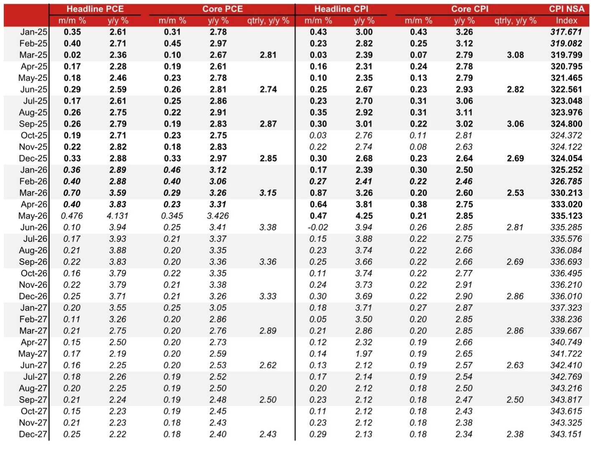
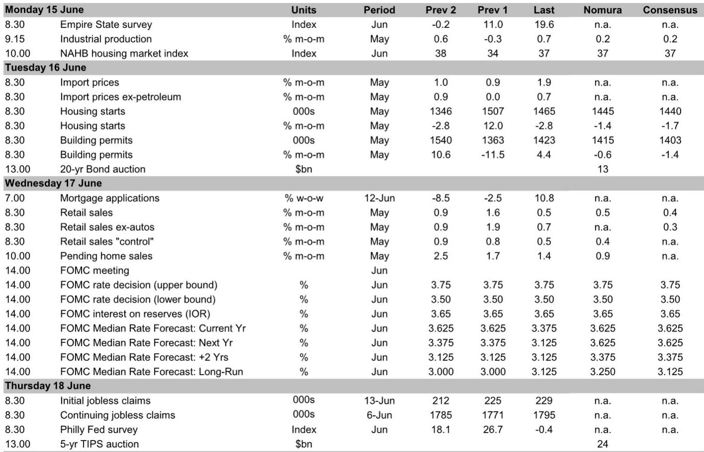
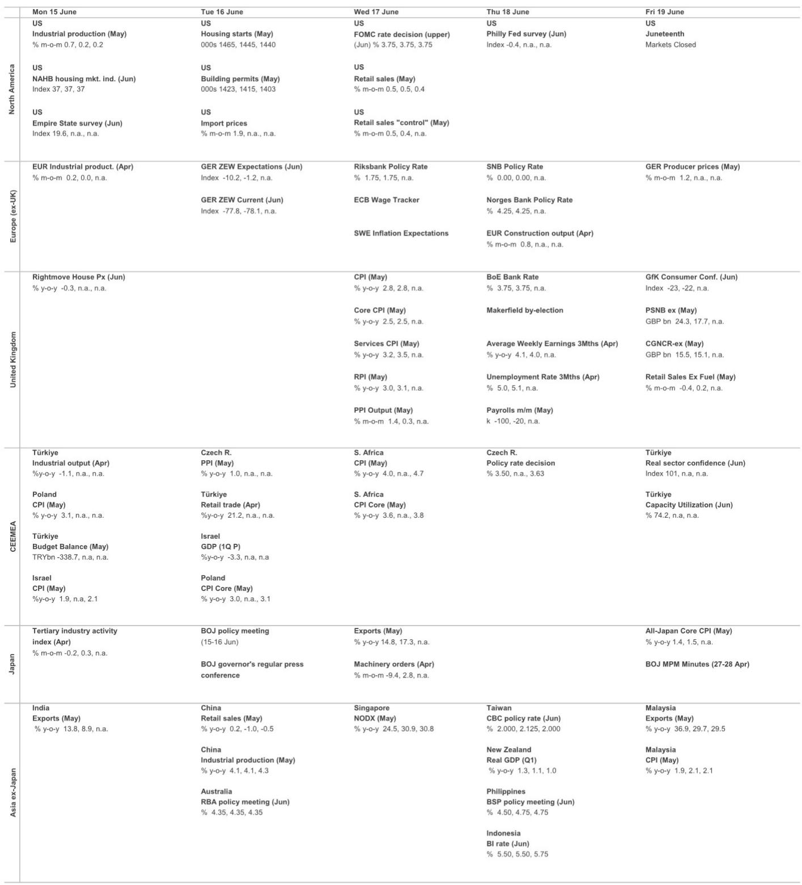

# The Fed Is Preparing to Pause Through 2027 — But the Real Story Is What Warsh Will Say, Not What the Dots Show

The June FOMC meeting is shaping up to be one of the most consequential in recent memory, not because the Federal Reserve will change rates, but because it will signal a fundamental shift in how it communicates policy. Based on a detailed analysis from a leading global investment bank, the central bank is expected to hold rates steady for the fourth consecutive meeting, remove its easing bias, and project no rate cuts through the end of 2027. The median dot for 2026 and 2027 is expected to rise to 3.625%, effectively locking in the current rate level for the next eighteen months. This is not a pause. This is a declaration that the easing cycle is over before it ever really began.

Yet the most important variable in this meeting is not the rate path itself, but the behavior of Chair Warsh. The report suggests Warsh will likely decline to submit his own economic projections, reducing the total number of dots from 19 to 18. This would be a symbolic but powerful move — a signal that forward guidance, as the market has come to rely on it, is being downgraded. In his first press conference, Warsh is expected to downplay the usefulness of core PCE inflation, hint at alternative inflation measures, and lay the groundwork for a future case for rate cuts that he cannot justify today. The market is not prepared for this level of communication disruption.

Meanwhile, the inflation data is not cooperating. The May CPI and PPI reports point to a core PCE inflation reading of 0.345% month-over-month, translating to 3.426% year-over-year — the highest since October 2023. Pipeline price pressures are growing, not receding. The report identifies upside risks to the inflation outlook from producer costs that continue to rise. This creates a tension: the data says inflation is accelerating, but the new Chair's rhetoric may begin to pivot toward medium-term easing. Investors who focus only on the dots will miss the real signal.

The strategic question for any serious investor is not whether the Fed will cut in 2026. It is whether the Fed's communication framework is about to become less predictable, less transparent, and more dependent on the personal views of a Chair who has been openly skeptical of forward guidance. If Warsh succeeds in shifting the Fed's communication strategy, the entire playbook for interpreting FOMC meetings will need to be rewritten.

## The Dot Plot Is About to Become Less Useful — And That Is Exactly the Point

The report's most striking forecast is that Warsh will not submit his own interest rate projections. This is not a procedural footnote. It is a deliberate signal. Warsh has historically criticized the Fed's forward guidance as overly prescriptive and market-distorting. By declining to participate in the dot plot, he is effectively saying that the projections are not as binding or as meaningful as the market assumes.

The consequence is a dot plot with 18 rather than 19 dots, but more importantly, a dot plot that loses its status as a collective forecast. If the Chair does not submit dots, the median becomes less representative. The market will have to guess whether the remaining dots reflect a genuine committee consensus or a holdover from the previous regime. The report expects 4-5 dots to indicate a rate hike, 7-9 dots to correspond to no change, and 4-6 dots to be consistent with rate cuts. That is a wide distribution — and without the Chair's dot, the central tendency becomes ambiguous.

For investors, this means the dot plot is no longer a reliable anchor for rate expectations. The report implicitly warns that the market may over-interpret the median while under-appreciating the dispersion. If Warsh uses his press conference to reiterate his view that AI will boost productivity and lead to disinflation, and if he characterizes current inflation as a temporary phenomenon driven by the Iran war, he will be laying the groundwork for a narrative that contradicts the dots. The dots say no cuts until 2028. Warsh may say cuts are coming sooner than the dots imply. Which signal will the market trust?

The answer is not obvious. The report does not resolve this tension, but it forces the reader to confront it. The Fed is entering a period where its internal communication is fragmented. The dots say one thing. The Chair may say another. The data says something else entirely. Investors who rely on any single signal will be caught off guard.

## Core PCE Inflation Is Accelerating, but the Composition Matters More Than the Headline

The report forecasts May core PCE inflation at 3.426% year-over-year, the highest since October 2023. This is not a temporary blip. The decomposition shows that components derived from PPI data are driving the acceleration, not just volatile CPI categories. Producer prices for finished consumer goods excluding food and energy continued to rise in May, suggesting that manufacturers are passing higher costs through to consumers. Regional manufacturing surveys confirm this: prices received indices are firming.

This matters because it challenges the narrative that inflation is being driven by one-off factors like tariffs or energy shocks. The report notes that tariff impacts appear to have waned, and semiconductor-related inflationary pressures have diminished. Yet core goods inflation from the producer side is still rising. That suggests structural cost pressures — labor, transportation, raw materials — are embedding themselves into the pricing chain.

At the same time, core services inflation remains resilient. Rent-related components are elevated, and supercore PCE inflation likely accelerated to 0.5% month-over-month in May, the highest since January 2026. Transportation services, including airline fares and auto insurance, remain volatile. The report does not claim that inflation is becoming entrenched, but it does show that the disinflationary momentum from late 2024 and early 2025 has stalled.

For the Fed, this creates a dilemma. If inflation is accelerating at the same time that the new Chair is signaling medium-term easing, the credibility of the inflation target comes into question. The report suggests that Warsh may try to resolve this by proposing alternative inflation measures or by arguing that current inflation is temporary. But the data does not support that argument yet. The report's own forecast shows core PCE inflation remaining above 3% through 2026. That is not transitory.

## The Report Raises a Critical Question It Cannot Fully Answer: What Happens When the Fed's Internal Consensus Breaks Down?

One of the most valuable contributions of this report is that it identifies a structural uncertainty that the market is not pricing. The report shows a committee that is deeply divided: some members want to hike, most want to hold, and a minority wants to cut. The new Chair is in the cutting camp, based on his past views, but he cannot act on those views now because of the Iran war and elevated inflation.

The report does not — and cannot — tell us what happens when the Chair's personal views diverge from the committee median over an extended period. Historically, the Fed has managed dissent through consensus-building and careful communication. But Warsh has signaled that he does not believe in the value of forward guidance. He has criticized the dot plot. He has suggested that the Fed should communicate less, not more. If he follows through on these views, the committee may become less cohesive, and the market may lose its most important source of policy clarity.

This is a second-order implication that the report gestures toward but does not fully explore. What happens if Warsh uses his press conference to openly question the usefulness of core PCE inflation? What happens if he suggests that the balance sheet should be reduced more aggressively? What happens if he lays out a roadmap for a smaller balance sheet without committee consensus? These are not hypotheticals. The report explicitly states that Warsh may discuss all of these topics.

Investors should prepare for a regime shift in how the Fed communicates. The dots may still be published, but they will matter less. The press conference will matter more. The Chair's personal views will matter more. And the committee's internal divisions will become more visible. The report does not tell you how to trade this shift, but it gives you the framework to anticipate it.

## A Decision Framework for Interpreting the June FOMC Meeting

For readers who want to translate this analysis into actionable judgment, the report provides the raw material for a structured decision framework. The key is to separate what the Fed does from what it says, and to recognize that the two may diverge.

First, assess the rate decision. The report expects a hold, and that is the base case. Any deviation would be a major surprise. But the rate decision is the least informative part of the meeting.

Second, evaluate the statement. The report expects the easing bias to be removed. That is a hawkish signal, but it is also expected. The question is whether the removal is unanimous. If there is dissent, it reveals the depth of the dovish faction.

Third, analyze the dots. The report expects the median to show no cuts through 2027. But the distribution matters more than the median. If the number of dots indicating a rate hike increases, the committee is more hawkish than expected. If the number of dots indicating cuts increases, the committee is more dovish. And if Warsh does not submit a dot, the median becomes unreliable.

Fourth, watch the press conference. This is where the real signal will come from. If Warsh downplays the usefulness of core PCE, proposes alternative measures, or hints at medium-term easing, he is signaling that the Fed's communication strategy is changing. If he emphasizes data dependence and avoids forward guidance, he is confirming that the dot plot is becoming less relevant.

Fifth, cross-reference with inflation data. The report shows core PCE accelerating. If the May data confirms this, and if Warsh still argues for medium-term easing, the market will have to decide which signal to follow. The report does not resolve this tension, but it forces the reader to recognize that the tension exists.

Finally, consider the balance sheet. The report notes that Warsh may discuss a roadmap for a smaller balance sheet. This is a potential wild card. If the Fed signals faster balance sheet reduction, it would be a tightening move that does not show up in the fed funds rate. The market may miss this signal if it is focused only on the dots.

## Why This Report Matters More Than the Market Realizes

The market is currently pricing a path that is broadly consistent with the report's base case: no cuts in 2026, and a gradual easing beginning in 2027. But the market is not pricing the communication disruption that the report describes. It is not pricing the possibility that the dot plot becomes less reliable, or that the Chair's personal views begin to diverge from the committee, or that the Fed's internal consensus fractures.

This is the gap that makes the full report valuable. The report does not just tell you what the Fed will do. It tells you what the Fed will say, how it will say it, and why the way it says it matters more than usual. It identifies the specific mechanisms — the declining dot, the alternative inflation measures, the balance sheet roadmap — that could change how the market interprets every FOMC meeting going forward.

The report also leaves several meaningful open questions. Will Warsh succeed in changing the Fed's communication strategy, or will the committee resist? Will the market adjust to a less transparent Fed, or will it demand clarity and punish ambiguity? Will the inflation data force Warsh to abandon his medium-term easing narrative, or will he find a way to reconcile the data with his views? These questions are not answered in the report, but they are raised in a way that makes the reader want to dig deeper.

For serious investors, the June FOMC meeting is not about the rate decision. It is about whether the Fed's communication framework is about to become less predictable, less transparent, and more dependent on the personal views of a Chair who has been openly skeptical of forward guidance. The report gives you the tools to interpret that shift. The rest is up to you.

Join the community to read the full report and review the original charts.

*This article is for learning and discussion only and does not constitute investment advice.*

Personal reading notes and learning share only. Not investment advice.

