## U.S. Healthcare Services

# US HC Svcs: The Policy Prescription - Healthcare Policy After the 2026 Midterms and the Road to 2028

Lance Wilkes

+1 917 344 8501

lance.wilkes@bernsteinsg.com

As we near July, the midterm elections and their impact on the market increases. In this note we outline our outlook for the midterms, healthcare policy direction after the midterms, and an early look at 2028 election cycle.

At this distance, based on the latest polls, it looks likely that Democrats will take control of the House, while the Senate remains a toss-up. What this means for policy - Democrats' main focus would likely be reversing declines in Medicaid and Marketplace enrollment. Policy outcomes should be broadly similar whether Democrats win just the House or both chambers of Congress, as both would likely require compromise to pass legislation and avoid vetoes. Some policies proposals will be political devises to contrast healthcare positioning in advance of the 2028 election.

Stock implications of the Midterms - A Democratic flip of the House would likely benefit Medicaid-focused insurers and hospitals by increasing the chances of restoring Medicaid funding and ACA enhanced subsidies. A potential method would involve delaying implementation of certain features of the elements OBBBA as part of a compromise during 27/28. This would reduce risk pool shifts which have worsened MLRs for Medicaid MCOs, stabilize Medicaid enrollment, and also mitigate some growth in bad debt at hospitals. We see actions against MA plans or PBMs as much less likely over this time period given the major policies enacted in these areas over the past few years.

2028 Politics and Policy, our early thoughts - While it is very early to identify front-runners, in the note we outline current likely candidates. Our main focus is on which policies are likely to be impacted by the 2028 election. We see policies as likely focusing on 1) coverage and reducing uninsured rates, 2) affordability, and 3) areas like vertical integration and AI. Overall, we see the policy environment as potential more positive for safety net MCOs and relatively neutral for the overall MCO, PBM complex. We see Medicare of All as unlikely to become policy, but expect that a Medicare For All candidate(s) will be featured within the Democratic primary and this may cause some volatility during 2027. We expect the most substantive changes might be in the areas of vertical integration restrictions.

We are hosting a teach-in next Thursday (6/18 at 11am ET) on Optum Health and value based care (Click here to register). This session will cover the Optum Health's business model and portfolio of businesses, clinical model and value proposition, an economic model for Optum Health looking at relevant subsegments, the outlook for margin recovery and growth, turnaround strategies and areas of policy focus.

Our recent Medicare Advantage teach-in addressed policy aspects and outlook for this line. Here is the recap note on the teach-in (US Healthcare Services: A summary of our teach in on Medicare Advantage), along with the REPLAY and Slides.

BERNSTEIN TICKER TABLE

<table><tr><td rowspan="2">Ticker</td><td rowspan="2">Rating</td><td colspan="3">11 Jun 2026</td><td colspan="2">TTMRel.</td><td colspan="4">Adjusted EPS</td><td colspan="3">Adjusted P/E (x)</td></tr><tr><td>Cur</td><td>Closing Price</td><td>Price Target</td><td>Target Perf.</td><td>Cur</td><td>2025A</td><td>2026E</td><td>2027E</td><td>2025A</td><td>2026E</td><td>2027E</td><td></td></tr><tr><td>AGL (agilon health)</td><td>M</td><td>USD</td><td>116.16</td><td>86.00</td><td>89.4%</td><td>USD</td><td>(24.46)</td><td>(4.81)</td><td>(4.52)</td><td>(4.7)</td><td>(24.2)</td><td>(25.7)</td><td></td></tr><tr><td>CNC (Centene)</td><td>O</td><td>USD</td><td>63.54</td><td>68.00</td><td>(8.0)%</td><td>USD</td><td>2.08</td><td>3.38</td><td>4.23</td><td>30.5</td><td>18.8</td><td>15.0</td><td></td></tr><tr><td>CI (Cigna)</td><td>O</td><td>USD</td><td>294.84</td><td>371.00</td><td>(29.3)%</td><td>USD</td><td>29.84</td><td>30.38</td><td>33.00</td><td>9.9</td><td>9.7</td><td>8.9</td><td></td></tr><tr><td>CVS (CVS)</td><td>O</td><td>USD</td><td>100.48</td><td>106.00</td><td>28.7%</td><td>USD</td><td>6.75</td><td>7.37</td><td>8.14</td><td>14.9</td><td>13.6</td><td>12.3</td><td></td></tr><tr><td>ELV (Elevance)</td><td>O</td><td>USD</td><td>399.18</td><td>424.00</td><td>(19.4)%</td><td>USD</td><td>30.30</td><td>26.93</td><td>28.88</td><td>13.2</td><td>14.8</td><td>13.8</td><td></td></tr><tr><td>HCA (HCA)</td><td>M</td><td>USD</td><td>378.51</td><td>413.00</td><td>(20.9)%</td><td>USD</td><td>28.21</td><td>30.44</td><td>33.14</td><td>13.4</td><td>12.4</td><td>11.4</td><td></td></tr><tr><td>HUM (Humana)</td><td>O</td><td>USD</td><td>368.69</td><td>425.00</td><td>34.1%</td><td>USD</td><td>16.60</td><td>9.12</td><td>15.41</td><td>22.2</td><td>40.4</td><td>23.9</td><td></td></tr><tr><td>MOH (Molina)</td><td>O</td><td>USD</td><td>193.20</td><td>208.00</td><td>(57.0)%</td><td>USD</td><td>11.03</td><td>5.35</td><td>9.65</td><td>17.5</td><td>36.1</td><td>20.0</td><td></td></tr><tr><td>UNH (UNH)</td><td>O</td><td>USD</td><td>405.55</td><td>492.00</td><td>4.5%</td><td>USD</td><td>16.35</td><td>18.86</td><td>21.99</td><td>24.8</td><td>21.5</td><td>18.4</td><td></td></tr><tr><td>SPX</td><td></td><td></td><td>7,394.30</td><td></td><td></td><td></td><td></td><td></td><td></td><td></td><td></td><td></td><td></td></tr></table>

O - Outperform, M - Market-Perform, U - Underperform, NR - Not Rated, CS - Coverage Suspended  
Source: Bloomberg, Bernstein estimates and analysis.

## INVESTMENT IMPLICATIONS

We rate AGL Market-Perform with a target price of \$86, CNC Outperform with a target price of \$68, CI Outperform with a target price of \$371, CVS Outperform with a target price of \$106, ELV Outperform with a target price of \$424, HCA Market-Perform with a target price of \$413, HUM Outperform with a target price of \$425, MOH Outperform with a target price of \$208, and UNH Outperform with a target price of \$492.

## DETAILS

As we near July, the midterm elections and their impact on the market increases. In this note we outline our outlook for the midterms, healthcare policy direction after the midterms, and an early look at 2028 election cycle.

We believe the prospects of a potential Democratic victory in the House are modestly reflected in improved recent Medicaid stock performance (e.g. CNC and MOH), although this is not the sole catalyst. We note that hospitals would also be presumed beneficiaries of some of these potential policies and this does not seem to be providing much support to hospital stock prices yet.

## OUTLOOK FOR MIDTERMS

The political outlook, based on polls, suggests a Democratic flip of the House in the mid-terms, with around a 50/50 chance of flipping the Senate. This is a very volatile political environment with the current Iran conflict contributing to the volatility. Commentators expect a Democratic pickup of 15-20+ seats as the more likely range, although this is less than a traditional wave election. We are currently interpreting polarization of seats, coupled with redistricting as reducing the amount of turnover one might see in other wave type mid-terms. Likewise, the Senate is less certain to flip given that it will require two states which went 10+% for Trump to flip Democratic (OH, TX, AK etc.).

## Trump's approval ratings

Trump approval ratings now stands at 40.2, a minor recovery from the lowest rating in his second term of 39.5 few days ago. The current rating has now slipped below the approval rating Trump had during his first term for the same days in the office. For historical context, Trump's approval rating is slightly below Obama at this point in his second term (43.1%) and above Bush (37.3%). Obama lost 13 seats, while Bush lost 32 seats during those $2^{\text{nd}}$ mid-term.

EXHIBIT 1: Trump's approval rating  
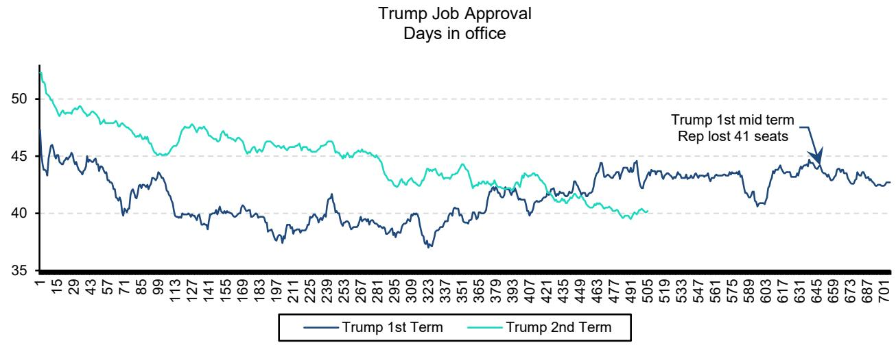

line chart

| Date | Trump 1st Term | Trump 2nd Term |
|------|----------------|----------------|
| 1    | ~52            | ~53            |
| 15   | ~46            | ~48            |
| 29   | ~45            | ~47            |
| 43   | ~44            | ~46            |
| 57   | ~43            | ~45            |
| 71   | ~42            | ~44            |
| 85   | ~41            | ~43            |
| 99   | ~40            | ~42            |
| 113  | ~39            | ~41            |
| 127  | ~38            | ~40            |
| 141  | ~37            | ~39            |
| 155  | ~36            | ~38            |
| 169  | ~35            | ~37            |
| 183  | ~34            | ~36            |
| 197  | ~33            | ~35            |
| 211  | ~32            | ~34            |
| 225  | ~31            | ~33            |
| 239  | ~30            | ~32            |
| 253  | ~29            | ~31            |
| 267  | ~28            | ~30            |
| 281  | ~27            | ~29            |
| 295  | ~26            | ~28            |
| 309  | ~25            | ~27            |
| 323  | ~24            | ~26            |
| 337  | ~23            | ~25            |
| 351  | ~22            | ~24            |
| 365  | ~21            | ~23            |
| 379  | ~20            | ~22            |
| 393  | ~19            | ~21            |
| 407  | ~18            | ~20            |
| 421  | ~17            | ~19            |
| 435  | ~16            | ~18            |
| 449  | ~15            | ~17            |
| 463  | ~14            | ~16            |
| 477  | ~13            | ~15            |
| 491  | ~12            | ~14            |
| 505  | ~11            | ~13            |
| 519  | ~10            | ~12            |
| 533  | ~9             | ~11            |
| 547  | ~8             | ~10            |
| 561  | ~7             | ~9             |
| 575  | ~6             | ~8             |
| 589  | ~5             | ~7             |
| 603  | ~4             | ~6             |
| 617  | ~3             | ~5             |
| 631  | ~2             | ~4             |
| 645  | -              | -              |
| 659  | -              | -              |
| 673  | -              | -              |
| 687  | -              | -              |
| 701  | -              | -              |

Source: RCP, Bloomberg, Bernstein analysis

## 2026 Midterm House elections

Republicans are expected to lose control of the House (Exhibit 5), as Republican currently have a small 5 seat edge (based on '24 vote) and the history of seat losses during midterms for the President's party. Redistricting complicates the equation, but most prediction markets expect Democrats to take control of the House. The margin of potential victory is less important in the House, but prediction markets expect around 15 seats. While this would seem a smaller pickup than other time periods given the President's low approval ratings, we see around 200 seats as roughly a floor for Republicans, based on polls, and therefore would not expect a much larger pickup by Democrats.

EXHIBIT 2: Change in House seats in mid-term elections for President's party  
Changes in House seats during Mid-term elections for President's party  
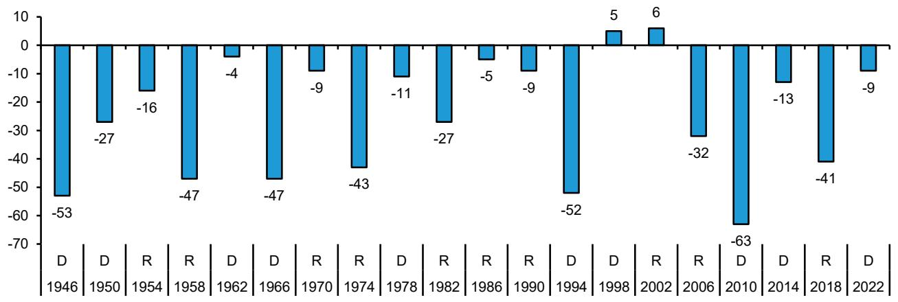

bar chart

| Year | Category | Value |
| :--- | :--- | :--- |
| 1946 | D | -53 |
| 1946 | R | -27 |
| 1950 | D | -16 |
| 1950 | R | -47 |
| 1954 | D | -4 |
| 1954 | R | -9 |
| 1958 | D | -43 |
| 1958 | R | -27 |
| 1962 | D | -5 |
| 1962 | R | -9 |
| 1966 | D | -52 |
| 1966 | R | -63 |
| 1970 | D | 5 |
| 1970 | R | 6 |
| 1974 | D | -32 |
| 1974 | R | -41 |
| 1978 | D | -13 |
| 1978 | R | -9 |
| 1982 | D | -52 |
| 1982 | R | -27 |
| 1986 | D | -5 |
| 1986 | R | -9 |
| 1990 | D | -52 |
| 1990 | R | -5 |
| 1994 | D | 5 |
| 1994 | R | 6 |
| 1998 | D | 5 |
| 1998 | R | 6 |
| 2002 | D | -32 |
| 2002 | R | -41 |
| 2006 | D | -47 |
| 2006 | R | -47 |
| 2010 | D | -47 |
| 2010 | R | -47 |
| 2014 | D | -4 |
| 2014 | R | -9 |
| 2018 | D | -47 |
| 2018 | R | -47 |
| 2022 | D | -43 |
The chart displays the absolute values of the bars for each category (D or R) in the table below. The x-axis is labeled with the year (e.g., '1946', '1950', etc.), and the y-axis is labeled with the corresponding numerical values. There are no labels for the data series.

Source: Ballotpedia, US election results, Bernstein analysis

EXHIBIT 3: Chance to Win House Majority  
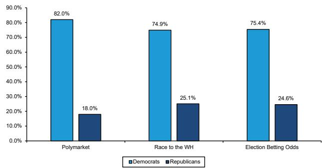

bar chart

| Category | Democrats (%) | Republicans (%) |
| :--- | :--- | :--- |
| Polymarket | 82.0 | 18.0 |
| Race to the WH | 74.9 | 25.1 |
| Election Betting Odds | 75.4 | 24.6 |

Source: Polymarket, Race to the WH, Election Betting Odds, and Bernstein Analysis

EXHIBIT 4: Midterm House Seats Projection  
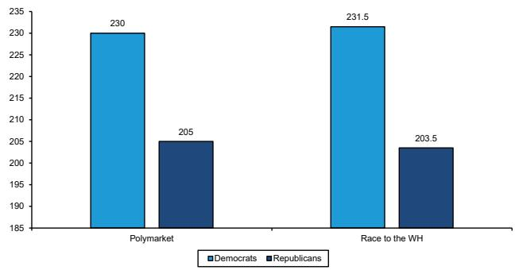

bar chart

| Category | Democrats | Republicans |
| :--- | :--- | :--- |
| Polymarket | 230 | 205 |
| Race to the WH | 231.5 | 203.5 |

Source: Polymarket, Race to the WH, Election Betting Odds, and Bernstein Analysis

EXHIBIT 5: Prediction market on who will will the US House?  
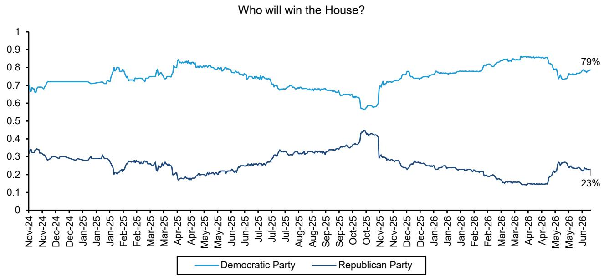

line chart

| Date    | Democratic Party | Republican Party |
|---------|------------------|------------------|
| Jun-26  | 79%              | 23%              |

Source: Kalshi, Bernstein analysis

## 2026 Midterm Senate elections

35 Senate seats are up for election in 2026, including 33 regularly scheduled seats and 2 special elections. The two special elections are Marco Rubio (FL) and J.D. Vance (OH). Out of the 35, Democrats control 13 and Republicans have 22 seats currently. ME and NC are the states expected to most likely swing Dem, given ME voting for Harris in 24 and NC retirement of Tillis and a strong candidate in former Governor Cooper. The next two states are less likely, with OH and TX the more probable toss-ups. Movement of these states would signify a strong blue wave, which certainly is possible, but will be difficult to call all the way up to the election given that both states went for Trump by over 10 points. Currently, we see Republicans holding 50-51 seats, but 49 or lower is a possibility.

Prediction markets, such as Polymarket and Election Betting Odds, are predicting Republicans as slight favorites to retain their majority while Race to the WH has slight odds on Democrats gaining a majority. Kalshi has the most favorable odds for Republicans to retain the Senate, at 57%. Senate seat projections are closely contested as well, with most prediction markets expecting 51 Republican seats and 49 Democratic.

EXHIBIT 6: Senate - Key races for 2026 midterms

<table><tr><td rowspan="2">State</td><td rowspan="2">Party in Control of reelection seat</td><td rowspan="2">Incumbent running for Senate?</td><td colspan="3">Margin of Victory for President</td><td rowspan="2">Margin for Senate Elections</td></tr><tr><td></td><td></td><td></td></tr><tr><td colspan="3">Republican seats most at risk:</td><td>2024</td><td>2020</td><td>2016</td><td>2020</td></tr><tr><td>ME</td><td>Republican</td><td>Yes - Susan Collins</td><td>D +6.9%</td><td>D +9%</td><td>D +3%</td><td>R +8.6%</td></tr><tr><td>NC</td><td>Republican</td><td>No - Thom Tillis</td><td>R +3.2%</td><td>R +1.34%</td><td>R +3.7%</td><td>R +1.8%</td></tr><tr><td>OH</td><td>Republican</td><td>Yes - Jon Husted</td><td>R +11.2%</td><td>R +8.0%</td><td>R +8.5%</td><td>R +6.1%</td></tr><tr><td>IA</td><td>Republican</td><td>No - Joni Ernst</td><td>R +13.2%</td><td>R +8.2%</td><td>R +9.4%</td><td>R +6.5%</td></tr><tr><td>TX</td><td>Republican</td><td>Yes - John Cornyn</td><td>R +13.7%</td><td>R +5.6%</td><td>R +9.0%</td><td>R +9.6%</td></tr><tr><td colspan="7">Democratic seats to watch:</td></tr><tr><td>MI</td><td>Democrats</td><td>No - Gary Peters</td><td>R +1.4%</td><td>D +2.8%</td><td>R +0.2%</td><td>D +1.7%</td></tr><tr><td>GA</td><td>Democrats</td><td>Yes - Jon Ossoff</td><td>R +2.2%</td><td>D +0.2%</td><td>R +5.1%</td><td>D +1.2%</td></tr><tr><td>NH</td><td>Democrats</td><td>No - Jeanne Shaheen</td><td>D +2.8%</td><td>D +7.4%</td><td>D +0.4%</td><td>D +15.6%</td></tr></table>

Source: Ballotpedia, Bernstein analysis

EXHIBIT 7: Chance to Win Senate Majority  
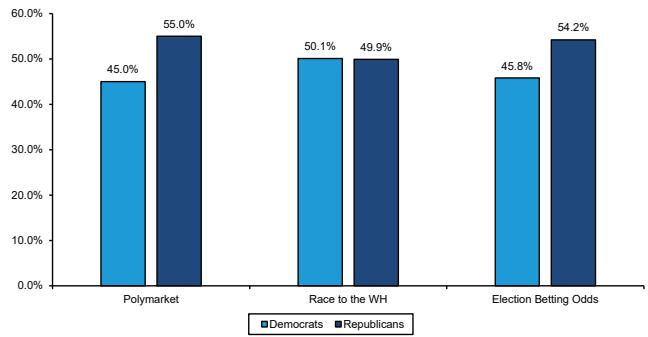

bar chart

| Category | Democrats (%) | Republicans (%) |
| :--- | :--- | :--- |
| Polymarket | 45.0 | 55.0 |
| Race to the WH | 50.1 | 49.9 |
| Election Betting Odds | 45.8 | 54.2 |

Source: Polymarket, Race to the WH, Election Betting Odds, and Bernstein Analysis

EXHIBIT 8: Midterm Senate Seats Projection  
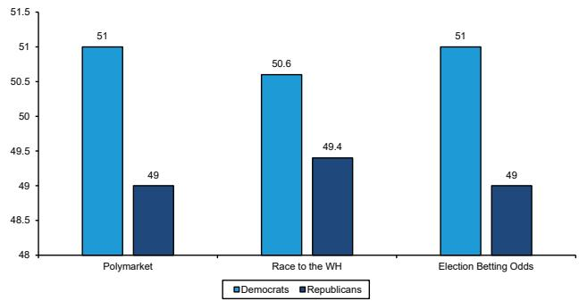

bar chart

| Category | Democrats | Republicans |
| :--- | :--- | :--- |
| Polymarket | 51 | 49 |
| Race to the WH | 50.6 | 49.4 |
| Election Betting Odds | 51 | 49 |

Source: Polymarket, Race to the WH, Election Betting Odds, and Bernstein Analysis

EXHIBIT 9: Prediction market on who will win the US Senate  
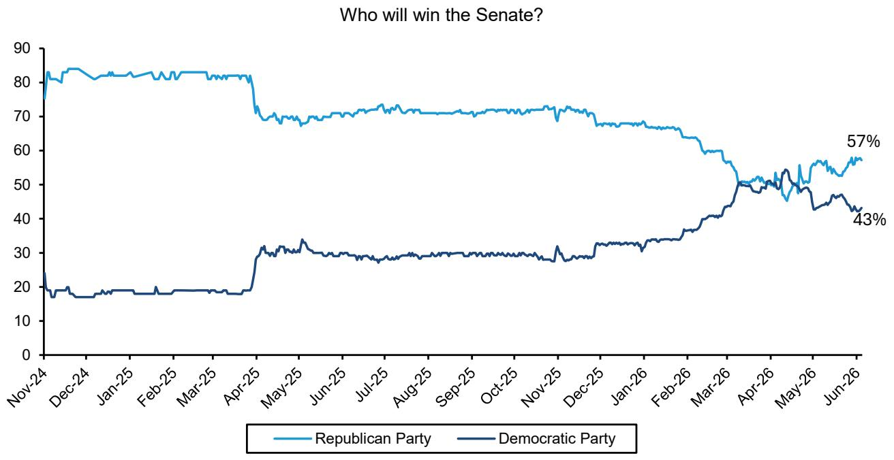

line chart

| Date    | Republican Party | Democratic Party |
|---------|------------------|------------------|
| Jun-26  | 57%              | 43%              |

Source: Kalshi, Bernstein analysis

## POLICY IMPLICATIONS FROM MIDTERMS

The Democrats are making Medicaid and Marketplace cuts as a central theme in their campaigns, and we expect efforts to reverse these policies as a major focus for Democrats. The Senate Finance Committee led by Senator Wyden and several Senate Democrats released a letter in which they announced the healthcare reforms and policy changes they would go after.

Reversing Republican cost increases – Aimed at reversing the health care cuts enacted by Republicans which included refusal to extend premium tax credits. Democrats plan to restore the ACA safety net funding and develop policies to make enrollment easy and coverage affordable. They also mentioned intention to control annual spikes in deductibles and out-of-pocket expenses, introduce policies to enhance access to coverage for low-income population for non-expanded states via Medicare-type choices, eliminating junk insurance plans, and eliminating surprise tax bills.

Simpler access to insurance – Democrats will develop polices which will make getting insurance a one-stop shop. Their goal it to protect people from losing out on coverage due to costs or red tape. Policies will also be made for simplifying and standardizing plans for easy comparison for consumers.

Addressing corporate greed - They also mentioned holding “Big Insurance” accountable for practices which delay or deny access to care, making sure funds are used towards driving patient satisfaction and quality of care, eliminating the role of middlemen, and lowering the costs for consumers.

Our take: The first priority will be re-establishment of the enhanced Marketplace subsidies. These provide a clean policy and Republicans were in favor of a compromise during the recent showdown on this issue. We see funding for this type of improved subsidy which is tied to availability to HSA's or expansion / increased flexibility on Bronze plans as a potential solution. This could still retain some of the reforms such as no zero dollar premium plans to combat fraud.

Medicaid moderation policies will be a focus but may be more difficult to find a compromise position. Republicans are likely to oppose provider tax / state directed payments policies which allow for states to provide less of the net costs of Medicaid. Work requirement refinements are a likely area of potential compromise, but full repeal of work requirements seems less likely. We see the most likely compromise position on Medicaid as being agreements to delay implementation of certain components. We see delays in implementation of provider tax safe harbor phase downs as a very likely target for compromise. This also is less effective of a pure political item, so it may be a more likely compromise item.

We expect the other major policy areas of focus to be more in the form of investigations and committee hearings, as opposed to likely compromise legislation. These would include hearing on drug pricing and vertical integration.

How can Democrats accomplish policy changes without a change in the Presidency? If Democrats have control of at least the House, they can leverage several critical must-pass bills to force legislation in case they win the House in the upcoming midterms. One example is the annual funding bill or series of bills, which could provide Democrats some leverage to extract a compromise. Another opportunity is the debt ceiling is another major must pass legislation event that might arise in mid-2027 with negotiations starting in early 2027. The OBBBA set the US debt ceiling in July 2025 at \$41.1 trillion. Currently, the national debt is likely to be over \$38 trillion by March 2026. The limit is likely to be reached in 2027 and without any “extraordinary measures” by the Treasury department, there can be a risk of default which puts pressure on the government to raise the ceiling. The Reconciliation bill could diminish some of this leverage, but we expect there will still be some must-pass bills which provide Democrats the opportunity to extract some compromises.

If Democrats have both the House and Senate, they are in a position to pass bills which President would need to veto or negotiate. This scenario is more likely to accomplish compromise policies, so prospects of a Senate victory by Democrats would likely be seen as more positive for Medicaid MCO and hospital stocks.

EXHIBIT 10: ACA favorability as per KFF Health Tracking Polls  
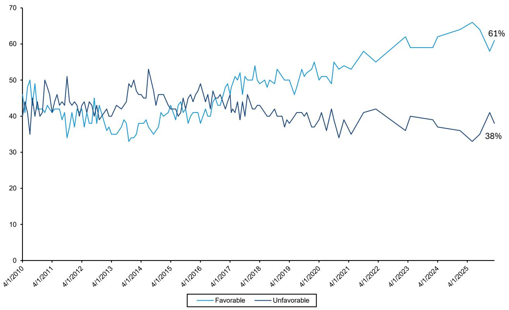

line chart

| Date     | Favorable | Unfavorable |
| -------- | --------- | ----------- |
| 4/1/2025 | 61%       | 38%         |

Source: KFF Health Tracking Polls, Bernstein analysis

## Stock Implications from Midterms

A Democratic flip of the House or House/Senate would have positive implications for Medicaid names (CNC, MOH) and hospitals (HCA). In our view, Democratic Representative would push to restore Medicaid funding and ACA Exchange enhanced subsidies to prior levels. A Democratic majority in the House would decrease the likelihood of further Medicaid funding pressure and increase likelihood of the restoration of Medicaid and Marketplace funding. Hospitals would benefit from a reduction in uninsured patients and the resulting decrease in uncompensated care and bad debt expense.

Historically, MA has been supported by Republican administrations and restricted by Democratic administrations, but we do not see MA being a policy point for Democrats during this cycle. We expect midterm results to be largely neutral to MA names (UNH, HUM).

In our view, the recent PBM reform (both PBM bill and FTC settlements) are clearing the policy hurdles for CI, CVS, and UNH. The PBMs have changed their business models and have largely removed the policy overhang moving forward. We do not view a Democratic flip of the House and/or Senate as a major threat to PBMs.

## 2028 ELECTION - WAY TOO EARLY THOUGHTS

## Potential leading candidates

The 2028 election will be most impacted by the Presidential nominees and ultimate winner. We would expect that the most potential stock impact from a Medicare for All candidate on the Democratic side. We will discuss policy outlook below. We would expect the Democratic primary season to kick off in early 2027, similar to 2019, with Democrats eager to confront President Trump's policies and gain the mantle of leadership, particularly if Democrats take control of both the House and Senate. For Republicans, we would expect more of a stealth primary season during 2027, with actual campaigning kick off later in 2027.

Currently, prediction markets and polling suggests that the front-runners for the Democratic are Newsom, Harris, Buttigieg and Ocasio-Cortez. This list likely does not reflect a governor or outsider candidate or two that may gain traction during the pre-primary period. We would note that Ocasio-Cortez is the major Medicare For All candidate among the front-runners, while others leading candidates are more likely to focus on restoring and enhancing the ACA framework.

On the Republican side Vance and Rubio are the front-runners currently, but political commentators have cited DeSantis, possibly Trump Jr and another outsider (to the current Administration) candidate to be among the front-runners. These candidates are likely to range from populist to conservative Republican, and we would expect many of the Trump healthcare policy priorities to carry through to the next Republican nominee. The areas of potential change seem more likely on the populist side. We are watching for proposals on break-ups or restrictions on vertical integration as we see populists as possibly becoming the Trust Busters of the 21 $^{st}$ century. We also could see expansion of safety net for the working class becoming a Republican proposal, especially from the JD Vance wing. We see employment uncertainty due to AI as being a potential issue for each party, and could see health insurance portability and/or expansion of Marketplace/ICHRA as being prominent themes.

EXHIBIT 11: 2028 Presidential nomination polls

<table><tr><td colspan="10">2028 Presidential nomination</td></tr><tr><td>Democrats</td><td>Harris</td><td>Newsom</td><td>Buttigieg</td><td>Ocasio-Cortez</td><td>Kelly</td><td>Shapiro</td><td>Beshear</td><td>Pritzker</td><td>Whitmer</td></tr><tr><td>RCP Polling Average</td><td>27.1</td><td>17.9</td><td>13</td><td>11.9</td><td>6.5</td><td>6.3</td><td>4.2</td><td>3.8</td><td>2.3</td></tr><tr><td>Republicans</td><td>Vance</td><td>Rubio</td><td>Trump Jr.</td><td>DeSantis</td><td>Kennedy Jr.</td><td>Haley</td><td>Carlson</td><td>Cruz</td><td>Ramaswamy</td></tr><tr><td>RCP Polling Average</td><td>38.3</td><td>24.1</td><td>9.3</td><td>8.8</td><td>4</td><td>4</td><td>3.3</td><td>2.8</td><td>2.5</td></tr></table>

Source: RCP, Bernstein analysis

## Policy focus for 2028 election (early thoughts)

We see health insurance coverage access and funding as an important element of the 2028 election policies. We expect recent Trump policies will have increased uninsured rates toward 9+% by 2028, with elimination of enhanced Marketplace subsidies and Medicaid work requirements visible examples.

We expect Democratic candidates will focus on three versions of coverage expansion - 1) restoring peak ACA coverage, 2) expanding off existing programs to achieve universal coverage, 3) Medicare for All.

The Restoration of Peak ACA Coverage would likely be achieved through the return of enhanced subsidies in Marketplace, coupled with elimination of work requirements for Medicaid and reduced verification policies. The full proposal could attempt to increase Marketplace coverage back to 24m people while COVID era Medicaid policies could drive Medicaid enrollment back toward 92m, a net increase of 25 million between the two programs. This would likely require mainly federal funding, so a repeal of provider tax restrictions could be apt of this, or a restructuring of the program to allow for consistent but more generous federal funding across all programs. One area to watch of rin this category would be Democrats seeking to restrain spending by differentiating between for profit and not for profit hospitals and providers in state directed payments, perhaps with a requirement that hospitals participate in Medicaid.

Universal coverage is a theoretical policy position which might build off the Peak ACA proposal above. Our expectation is that this type of proposal would broaden and expand access to the Marketplace by allowing small employers to buy into Marketplace, allow employees and dependents to have portability of employer health insurance which could allow for Marketplace coverage, and tie Marketplace reimbursement to government reimbursement rates (e.g. 120% of Medicare reimbursement.) This would be similar to the public option approach in Colorado, which created a “public option” which is provided by MCOs and achieves these aims above.

This universal coverage objective might also be a Republican policy focus in 2028 as Republicans seek to solidify their shift to a workers party. We think employer health insurance portability and easier access to Marketplace are policies they may target, with ICHRA being an important vehicle or early version of a new model. We see employment uncertainty in the era of AI job losses (or concerns about potential job losses), as a theme which both parties will seek to address.

We see Medicare for All as less likely than in prior cycles. Medicare Advantage is more firmly entrenched, now representing \~55% of Medicare enrollment vs. \~1/3 during earlier reform debates. Additionally, public sentiment has shifted more favorably towards ACA, which we believe makes the elimination of the ACA framework, along with employer health insurance, a less likely attractive policy aim. We expect a Democratic push to restore the uninsured rate to around the 5% level, from what we see could drift towards a potential 9% by 2028.

The Democratic shift in priorities from Medicare for All to expansion and accessibility of coverage through ACA can be observed in the shifting platforms of Democratic candidates. For example, Sherrod Brown (D-OH) served as a US representative from 1993-2007 and a US Senator from 2007-2025. He is currently challenging incumbent Jon Husted (R-OH) for the US Senate position in the Senate special election in Ohio. Rep. Brown was a proponent of Medicare for All early in his career, co-sponsoring the Expanded Medicare for All Act in 2006. His position moderated in subsequent years. In 2019, he pushed back against Medicare for All and co-introduced the Medicare at 50 Act which keeps ACA and private insurance intact but allows buy-in to Medicare for ages 50-64. He also co-introduced the CHOICE Act, an initiative which would add a publicly operated health insurance option to the Affordable Care Act's individual marketplaces. It would create a public health insurance option subject to the same requirements that apply to other plans offered on Affordable Care Act exchanges, and it would offer the same tax credits available to individual marketplace consumers.

EXHIBIT 12: Uninsured rate in the US  

bar chart

US Uninsured rate
| Year | Uninsured Rate (%) |
| :--- | :--- |
| 1987 | 11 |
| 1988 | 12 |
| 1989 | 12 |
| 1990 | 12 |
| 1991 | 13 |
| 1992 | 13 |
| 1993 | 13 |
| 1994 | 13 |
| 1995 | 13 |
| 1996 | 13 |
| 1997 | 13 |
| 1998 | 13 |
| 1999 | 13 |
| 2000 | 12 |
| 2001 | 13 |
| 2002 | 13 |
| 2003 | 13 |
| 2004 | 13 |
| 2005 | 14 |
| 2006 | 14 |
| 2007 | 14 |
| 2008 | 14 |
| 2009 | 15 |
| 2010 | 16 |
| 2011 | 15 |
| 2012 | 14 |
| 2013 | 14 |
| 2014 | 11 |
| 2015 | 9 |
| 2016 | 9 |
| 2017 | 9 |
| 2018 | 9 |
| 2019 | 10 |
| 2020 | 9 |
| 2021 | 9 |
| 2022 | 8 |
| 2023 | 7 |
| 2024 | 8 |

Source: NHE, FRED, Bernstein analysis

The other major areas of policy focus are likely to be consumer affordability, the deficit and the costs of entitlement programs, and vertical integration.

In terms of consumer affordability we see drug pricing and hospital prices as the major areas of focus. MA overcoming has been largely addressed by v28 and recent other rate adjustments, and we expect this to be less of an issue by 2028. Likewise, we see PBM reform as having effectively addressed most PBM issues, and thus the focus will shift to drug pricing perhaps contrasting those costs with non-US prices. Solutions may attempt to address the core cost problems and focus on solutions such as value-based care and AI to increase supply of providers and reduce unit costs. More likely, policy proposals will focus on reducing out of pocket expenses for consumers (which will increase the need for MCO and VBC methods to address cost trends). Out of pocket limits could be for specific categories like drug spending / MFN and even specific products like GLP1s. Also, we could see interest in expanding out of pocket limits in employer health insurance to address the growth of high deductible plans. This could fuel the shift to defined contribution type health coverage which leverages Marketplace.

Entitlement program cost is an issue, but it is less likely to be a major poetical topic for 2028. The most powerful approaches which could be introduced could include mandatory enrollment in MA for those turning 65, but at a reduced payment level, and block grants to states for Medicaid. Medicare for All will also be proposed for this topic, with two major issues - converting all reimbursement to Medicare levels would destabilize the entire hospital / provider sector and the hidden tax of high reimbursement by employers would become an explicit tax which taxpayers would see. We see the more likely solutions being the reform of Medicare to be a MA only program going forward with existing members grandfathered, and this taking place as part of Medicare reform when the trust fund runs out. Likewise, further reform of Medicaid federal vs state funding is likely to take place during a broader reform of coverage and to be included, not to be the driver of that reform.

We see vertical integration as the sneaky issue which might gain traction on both sides of the aisle in 2028. We see the most natural issue as being dividing insurer vs provider - meaning PBMs and dispensing pharmacy being separated and then managed care companies and care providers including value-based care companies, as being separated. The PBM / specialty pharmacy split is being tested at a state level and could be more readily implemented at a federal level, likely through a series of spin-offs of the major specialty pharmacies. The split of MCOs and providers is more difficult, in particular due to the fully integrated models like Kaiser Permanente. We see the operational splits of UNH/Optum Health, CVS/Oak Street and Minute Clinic, and Humana / Centerwell Provider as being achievable as those providers are topically servicing multiple MCOs.

We see the more likely way this would be achieved is through new regulation to “stack MLRs” or treat margins achieved in subsidiaries as counting toward minimum MLRs. This policy is illogical, in that it penalizes MCOs while separate companies would still be able to earn margins at each level of the business model. Nonetheless, this approach would cause MCOs to divest or spin out subsidiary businesses. We see the three main categories of businesses as being MCO, cost containment businesses including PBM, and providers such as value-based care, physician practices and hospitals. We see cost containment businesses as naturally being coupled with MCOs, but this type of policy could cause the separation of these functions.

We see UNH and CI as being well situated for this policy direction because the units to be separated are large and leading players in their sectors. We see emerging businesses such as Oak street, Centerweel provider, ELV PBM (CarelonRx) as beng negatively impacted as they would become standalone competitors without the benefit of the larger MCO.

## 2028 Senate Election

We would note that the 2028 Senate map is better positioned for Republicans - both parties have 4-5 seats which are in competitive or somewhat competitive markets. Democrats have 4 seats which they will defend which went for President Trump in the 2024 election, while Republicans do not have seat among these most competitive states which had gone for Harris in 2024. That said, it would seem that WI and NC would be the Republican seats most at risk, while GA, PA, AZ and NV would be the Democratic seats most at risk.

The outcome of the Senate in 2028 is important in that the biggest policy changes would occur with a sweep of House, Senate and Presidency. It would seem policy would be more likely to occur after 2028, the filibuster is more likely to be ended or changed in 2028 given stated Democratic desires to end the filibuster and the likelihood that both Republican and Democratic centrists are the most at risk candidates in 2026 and 2028.

EXHIBIT 13: 2028 Key Senate elections

<table><tr><td rowspan="2">State</td><td rowspan="2">Senate 2028Pre-election incumbent</td><td rowspan="2">Party</td><td rowspan="2">Margin of victory Senate 2022, %</td><td rowspan="2">Margin of victory Presidential election 2024, %</td><td colspan="5">State Presidential voting</td></tr><tr><td>2008</td><td>2012</td><td>2016</td><td>2020</td><td>2024</td></tr><tr><td>Nevada</td><td>Catherine Cortez Masto</td><td>D</td><td>0.8%</td><td>R +3.10%</td><td>D</td><td>D</td><td>D</td><td>D</td><td>R</td></tr><tr><td>Wisconsin</td><td>Ron Johnson</td><td>R</td><td>1.0%</td><td>R +0.86%</td><td>D</td><td>D</td><td>R</td><td>D</td><td>R</td></tr><tr><td>Georgia</td><td>Raphael Warnock</td><td>D</td><td>2.8%</td><td>R +2.20%</td><td>R</td><td>R</td><td>R</td><td>D</td><td>R</td></tr><tr><td>North Carolina</td><td>Ted Budd</td><td>R</td><td>3.2%</td><td>R +3.21%</td><td>D</td><td>R</td><td>R</td><td>R</td><td>R</td></tr><tr><td>Arizona</td><td>Mark Kelly</td><td>D</td><td>4.9%</td><td>R +5.5%</td><td>R</td><td>R</td><td>R</td><td>D</td><td>R</td></tr><tr><td>Pennsylvania</td><td>John Fetterman</td><td>D</td><td>4.9%</td><td>R +1.71%</td><td>D</td><td>D</td><td>R</td><td>D</td><td>R</td></tr><tr><td>Ohio</td><td>J.D. Vance</td><td>R</td><td>6.1%</td><td>R +11.2%</td><td>D</td><td>D</td><td>R</td><td>R</td><td>R</td></tr><tr><td>Alaska</td><td>Lisa Murkowski</td><td>R</td><td>6.3%</td><td>R +13.1%</td><td>R</td><td>R</td><td>R</td><td>R</td><td>R</td></tr><tr><td>New Hampshire</td><td>Maggie Hassan</td><td>D</td><td>9.1%</td><td>D +2.78%</td><td>D</td><td>D</td><td>D</td><td>D</td><td>D</td></tr><tr><td>Utah</td><td>Mike Lee</td><td>R</td><td>10.4%</td><td>R +21.6%</td><td>R</td><td>R</td><td>R</td><td>R</td><td>R</td></tr></table>

Source: Ballotpedia, Bernstein analysis

Healthcare cost is a significant concern for voters. A May 2026 study by KFF found that voters are equally concerned about healthcare costs and transportation costs, which was higher than concerns around groceries, utilities, and rent. Voters trust Democrats to address the costs of prescription drugs and healthcare over Republicans (33% to 26% and 37% to 26%, respectively). Healthcare reform, economy, and inflation continue to be major factors to voters. In a December 2025 survey, immigration was the highest agenda item followed by the economy, health care reform, cost of living, and inflation.

EXHIBIT 14: Cost concerns  
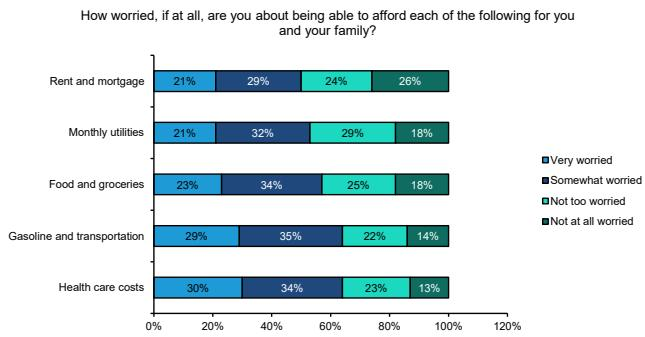

bar chart

| Category                  | Very worried | Somewhat worried | Not too worried | Not at all worried |
| ------------------------- | ------------ | ---------------- | --------------- | ------------------ |
| Rent and mortgage         | 21%          | 29%              | 24%             | 26%                |
| Monthly utilities          | 21%          | 32%              | 29%             | 18%                |
| Food and groceries        | 23%          | 34%              | 25%             | 18%                |
| Gasoline and transportation | 29%          | 35%              | 22%             | 14%                |
| Health care costs         | 30%          | 34%              | 23%             | 13%                |

Source: KFF 2026 study, Bernstein analysis

EXHIBIT 15: Healthcare cost concerns  
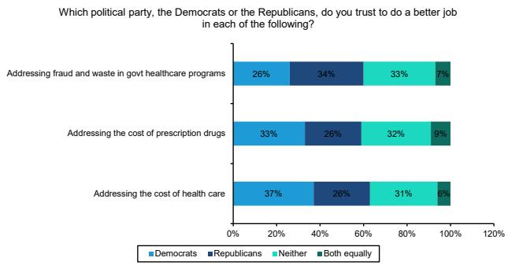

stacked bar chart

Which political party, the Democrats or the Republicans, do you trust to do a better job in each of the following?
| Issue | Democrats (%) | Republicans (%) | Neither (%) | Both equally (%) |
|---|---|---|---|---|
| Addressing fraud and waste in govt healthcare programs | 26 | 34 | 33 | 7 |
| Addressing the cost of prescription drugs | 33 | 26 | 32 | 9 |
| Addressing the cost of health care | 37 | 26 | 31 | 6 |

Source: KFF 2026 study, Bernstein analysis

EXHIBIT 16: Dec 2025 survey of top 10 public concerns -% of respondents mentioning each issue  
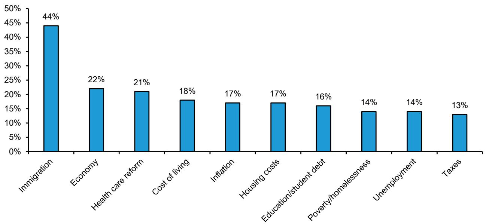

bar chart

| Category | Value (%) |
| :--- | :--- |
| Immigration | 44 |
| Economy | 22 |
| Health care reform | 21 |
| Cost of living | 18 |
| Inflation | 17 |
| Housing costs | 17 |
| Education/student debt | 16 |
| Poverty/homelessness | 14 |
| Unemployment | 14 |
| Taxes | 13 |

Source: AP - NORC Center for Public Affairs Research at Univ of Chicago, Bernstein analysis

Stock implications - We expect MCOs will see volatility as Medicare For All is raised as a potential policy, but any progress by non-Medicare For All candidates and/or moderation in the application would be positives for MCOs. The Sherrod Brown example above is an interesting case study of how candidates may evolve in the 2028 era when ACA coverage has been rolled back and thus progress to reattain past coverage levels may be more politically acceptable. We would see Medicaid/Marketplace MCOs and to a lesser extent hospitals as well positioned for these expansions of coverage policies.

Vertical integration and “Too big” policy focus - we believe that UNH would actually perform better in a policy environment which required the separation of provider and insurance businesses, and thus see it as a long term beneficiary, although it would see volatility initially. We would see VBC and AI as major opportunities for a standalone Optum. We also see CI as performing well in that environment, with the specialty pharmacy being separable and value enhancing without major earnings power challenges. Conversely, we see ELV as being negatively impacted if the potential to a value-based care business is no longer a cross-sale or synergistic opportunity. Likewise, CVS would see a high degree of disentanglement in this scenario and would be more pressured.

## UPCOMING 2026 TEACH-INS

OptumHealth 6/18 at 11am ET Click here to register

Specialty Pharmacy 7/16 at 11am ET Click here to register

Medicaid Managed Care 7/30 at 11am ET Click here to register

PBM & Employer self-insured 8/20 at 11am ET Click here to register

OptumInsights 8/27 at 11am ET Click here to register

## I. REQUIRED DISCLOSURES

References to "Bernstein" or the "Firm" in these disclosures relate to the following entities: Bernstein Institutional Services LLC (April 1, 2024 onwards), Bernstein & Co., LLC (pre April 1, 2024), Bernstein Autonomous LLP, BSG France S.A. (April 1, 2024 onwards), Bernstein (Hong Kong) Limited 盛博香港有限公司, Bernstein (Canada) Limited, Bernstein (India) Private Limited (SEBI registration no. INH000006378), Bernstein (Singapore) Private Limited, Bernstein Japan KK (サンフォード・C・バーンスタイン株式会社) and analysts employed by SG Africa Technologies & Services to produce Bernstein under a Global Services Agreement in place between Bernstein and SG.

Bernstein is part of a joint venture between SG (SG) and AllianceBernstein, L.P. (AB). Unless specifically noted otherwise, for purposes of these disclosures, references to Bernstein's “affiliates” relate to both SG and AB and their respective affiliates.

## VALUATION METHODOLOGY

This research publication covers six or more companies. For valuation methodology and other company disclosures:

Please visit: https://bernstein-autonomous.bluematrix.com/sellside/Disclosures.action.

Or, you can also write to the Director of Compliance, Bernstein Institutional Services LLC, 245 Park Avenue, New York, NY 10167.

## RISKS

This research publication covers six or more companies. For risks and other company disclosures:

Please visit: https://bernstein-autonomous.bluematrix.com/sellside/Disclosures.action.

Or, you can also write to the Director of Compliance, Bernstein Institutional Services LLC, 245 Park Avenue, New York, NY 10167.

## RATINGS DEFINITIONS, BENCHMARKS AND DISTRIBUTION

## EQUITY RATINGS DEFINITIONS

## Bernstein brand

The Bernstein brand rates stocks based on forecasts of relative performance for the next 12 months versus the S&P 500 for stocks listed on the U.S. and Canadian exchanges, versus the Bloomberg Europe Developed Markets Large and Mid Cap Price Return Index EUR (EDME) for stocks listed on the European exchanges and emerging markets exchanges outside of the Asia Pacific region, versus the Bloomberg Japan Large and Mid Cap Price Return Index USD (JPL) for stocks listed on the Japanese exchanges, and versus the Bloomberg Asia ex-Japan Large and Mid Cap Price Return Index (ASIAX) for stocks listed on the Asian (ex-Japan) exchanges -unless otherwise specified.

The Bernstein brand has three categories of ratings:

- Outperform: Stock will outpace the market index by more than 15 pp  
• Market-Perform: Stock will perform in line with the market index to within +/-15 pp  
• Underperform: Stock will trail the performance of the market index by more than 15 pp

Coverage Suspended: Coverage of a company under the Bernstein brand has been suspended. Ratings and price targets are suspended temporarily, are no longer current, and should therefore not be relied upon.

Not Rated: A rating assigned when the stock cannot be accurately valued, or the performance of the company accurately predicted, at the present time. The covering analyst may continue to publish research reports on the company to update investors on events and developments.

Not Covered (NC) denotes companies that are not under coverage.

Bernstein brand stock ratings are based on a 12-month time horizon.

## Autonomous brand – common stocks

The Autonomous brand rates common stocks as indicated below. As our benchmarks we use the Bloomberg Europe 500 Banks And Financial Services Index (BEBANKS) and Bloomberg Europe Dev Mkt Financials Large and Mid Cap Price Ret Index EUR (EDMFI) index for developed European banks and Payments, the Bloomberg Europe 500 Insurance Index (BEINSUR) for European insurers, the S&P 500 and S&P Financials for US banks and Payments coverage, S5LIFE for US Insurance, the S&P Insurance Select Industry (SPSIINS) for US Non-Life Insurers coverage, and the Bloomberg Emerging Markets Financials Large, Mid and Small Cap Price Return Index (EMLSF) for emerging market banks and insurers and Payments. Ratings are stated relative to the sector (not the market).

The Autonomous brand has three categories of common stock ratings:

- Outperform (OP): Stock will outpace the relevant index by more than 10 pp  
- Neutral (N): Stock will perform in line with the market index to within +/-10 pp  
- Underperform (UP): Stock will trail the performance of the relevant index by more than 10 pp

Coverage Suspended: Coverage of a company under the Autonomous research brand has been suspended. Ratings and price targets are suspended temporarily, are no longer current, and should therefore not be relied upon.

Not Rated: A rating assigned when the stock cannot be accurately valued, or the performance of the company accurately predicted, at the present time. The covering analyst may continue to publish research reports on the company to update investors on events and developments.

Those denoted as ‘Feature’ (e.g., Feature Outperform FOP, Feature Under Outperform FUP) are our core ideas.

Not Covered (NC) denotes companies that are not under coverage.

Autonomous brand common stock ratings are based on a 12-month time horizon.

## Autonomous brand – preferred stocks

The Autonomous brand has three categories of preferred stock ratings:

- Outperform (OP): The total return of the preferred instrument is expected to outperform preferred securities of other issuers operating in similar sectors or rating categories over the next six months.  
- Neutral (N): The total return of the preferred instrument is expected to perform in line with preferred securities of other issuers operating in similar sectors or rating categories over the next six months.  
- Underperform (UP): The total return of the preferred instrument is expected to underperform preferred securities of other issuers operating in similar sectors or rating categories over the next six months.

Autonomous preferred stock ratings are based on a 6-month time horizon.

## AUTONOMOUS CREDIT RESEARCH

Where this report contains investment recommendations for credit instruments, as defined in article 3(1)(35) of the Market Abuse Regulation, the information below is presented to comply with its disclosure requirements.

The report may also include reference(s) to published opinions by other Autonomous or Bernstein analysts covering the equity securities of the issuer(s) referenced herein. Please note an investment recommendation for credit instruments published by the author(s) of this report may differ from the published view of the analyst covering equity securities for the issuer(s) contained in this report and vice versa.

## CREDIT RATINGS DEFINITIONS

The Autonomous brand has three categories of credit ratings:

\- Credit Outperform (C-OP): The total return of the Reference Credit Instrument is expected to outperform the credit spread of bonds of other issuers operating in similar sectors or rating categories over the next six months.

- Credit Neutral (C-N): The total return of the Reference Credit Instrument is expected to perform in line with the credit spread of bonds of other issuers operating in similar sectors or rating categories over the next six months.  
- Credit Underperform (C-UP): The total return of the Reference Credit Instrument is expected to underperform the credit spread of bonds of other issuers operating in similar sectors or rating categories over the next six months.

Autonomous credit ratings are based on a 6-month time horizon.

A list of all investment recommendations produced by the author(s) of this report alongside credit ratings history are available upon request.

It is at the sole discretion of the Firm as to when to initiate, update and cease research coverage. The Firm has established, maintains and relies on information barriers to control the flow of information contained in one or more areas (i.e. the private side) within the Firm, and into other areas, units, groups or affiliates (i.e. public side) of the Firm

DISTRIBUTION OF EQUITY RATINGS/INVESTMENT BANKING SERVICES

<table><tr><td>Equity Rating</td><td>Market Abuse Regulation (MAR) and FINRA Rating Category</td><td>Global Rating Distribution</td><td>Investment Banking Relationships*</td></tr><tr><td>Outperform</td><td>BUY</td><td>51.1%</td><td>16.5%</td></tr><tr><td>Market-Perform (Bernstein Brand) Neutral (Autonomous Brand)</td><td>HOLD</td><td>36.3%</td><td>17.8%</td></tr><tr><td>Underperform</td><td>SELL</td><td>12.6%</td><td>14.9%</td></tr></table>

\* These figures represent the percentage of companies within each equity rating category for which affiliates of Bernstein have provided investment banking services within the previous 12 months.  
As of March 31, 2026. All figures are updated quarterly.

Prior to April 1, 2024, Bernstein & Co., LLC. issued the ratings and price target information in the graph(s) below for the following companies: Centene Corp, Cigna Group, CVS Health Corp, Elevance Health, HCA Healthcare Inc, Humana Inc and UnitedHealth Group Inc.

## PRICE CHARTS/ RATINGS AND PRICE TARGET HISTORY

This research publication covers six or more companies. For price chart and other company disclosures, please visit https://bernstein-autonomous.bluematrix.com/sellside/Disclosures.action or you can write to the Director of Compliance, Bernstein Institutional Services LLC, 245 Park Avenue, New York, NY 10167.

## CONFLICTS OF INTEREST

SG and/or its affiliates beneficially own 1% or more of a class of common equity securities of the following company: Centene Corp.

Bernstein Autonomous LLP or BSG France SA, beneficially, has either a net long or short position of 0.5% or more of the total issued share capital of a class of common equity securities of the following MiFID eligible securities: UnitedHealth Group Inc.

An affiliate of Bernstein has received compensation for non-investment banking securities-related products or services in the previous twelve months from the following clients: UnitedHealth Group Inc.

Bernstein and/or affiliates have received compensation for non-investment banking securities-related products or services in the previous twelve months from the following clients: UnitedHealth Group Inc.

Certain affiliates of Bernstein act as market maker or liquidity provider in the equities securities of: agilon health, Centene Corp, Cigna Group, CVS Health Corp, Elevance Health, HCA Healthcare Inc, Humana Inc and UnitedHealth Group Inc.

Certain affiliates of Bernstein act as market maker or liquidity provider in the debt securities of: Cigna Group, CVS Health Corp and Humana Inc.

## OTHER MATTERS

The legal entity(ies) employing the analyst(s) listed in this report, and their location, can be determined by the country code of their phone number, as follows:

+1 Bernstein Institutional Services LLC; New York, New York, USA

+44 Bernstein Autonomous LLP; London UK

+212 SG Africa Technologies & Services; Casablanca, Morocco

+33 BSG France S.A.; Paris, France

+34 BSG France S.A.; Madrid, Spain

+41 Bernstein Autonomous LLP; Geneva, Switzerland

+49 BSG France S.A.; Frankfurt, Germany

+91 Bernstein (India) Private Limited; Mumbai, India

+852 Bernstein (Hong Kong) Limited 盛博香港有限公司; Hong Kong, China

+65 Bernstein (Singapore) Private Limited; Singapore

+81 Bernstein Japan KK; Tokyo, Japan

Where this report has been prepared by research analyst(s) employed by a non-US affiliate, such analyst(s), is/are (unless otherwise expressly noted below) not registered as associated persons of Bernstein Institutional Services LLC or any other SEC-registered broker-dealer and are not licensed or qualified as research analysts with FINRA. Accordingly, such analyst(s) may not be subject to FINRA's restrictions regarding (among other things) communications by research analysts with a subject company, interactions between research analysts and investment banking personnel, participation by research analysts in solicitation and marketing activities relating to investment banking transactions, public appearances by research analysts, and trading securities held by a research analyst account.

Where this report has been prepared by research analyst(s) employed by SG Africa Technologies & Services (part of the SG group of companies), it has been prepared on behalf of a Bernstein company under a Global Services Agreement in place between Bernstein and SG.

## CERTIFICATION

Each research analyst listed in this report, who is primarily responsible for the preparation of the content of this report, certifies that all of the views expressed in this publication accurately reflect that analyst's personal views about any and all of the subject securities or issuers and that no part of that analyst's compensation was, is, or will be, directly or indirectly, related to the specific recommendations or views in this publication.

## II. ADDITIONAL GLOBAL CONFLICT DISCLOSURES

It is at the sole discretion of the Firm as to when to initiate, update and cease research coverage. The Firm has established, maintains and relies on information barriers to control the flow of information contained in one or more areas (i.e., the private side) within the Firm, and into other areas, units, groups or affiliates (i.e., public side) of the Firm.

## III. OTHER IMPORTANT INFORMATION AND DISCLOSURES

Separate branding is maintained for “Bernstein” and “Autonomous” research products.

\- Bernstein produces a number of different types of research products including, among others, fundamental analysis and quantitative analysis under both the “Autonomous” and “Bernstein” brands. Recommendations contained within one type of research product may differ from recommendations contained within other types of research products, whether as a result of differing time horizons, methodologies or otherwise. Furthermore, views or recommendations within a research product issued under one brand may differ from views or recommendations under the same type of research product issued under the other brand. The Research Ratings System for the two brands and other information related to those Rating Systems are included in the previous section.

\- Autonomous operates as a separate business unit within the following entities: Bernstein Institutional Services LLC, Bernstein Autonomous LLP, Bernstein (Hong Kong) Limited 盛博香港有限公司 and Bernstein (India) Private Limited. For information relating to “Autonomous” branded products (including certain Sales materials) please visit: www.autonomous.com. For information relating to Bernstein branded products please visit: www.bernsteinresearch.com.

Analysts are compensated based on aggregate contributions to the research franchise as measured by account penetration, productivity and proactivity of investment ideas. No analysts are compensated based on performance in, or contributions to, generating investment banking revenues.

This report has been produced by an independent analyst as defined in Article 3 (1)(34)(i) of EU 596/2014 Market Abuse Regulation (“MAR”) and the same article of MAR as it forms part of United Kingdom domestic law by virtue of the European Union (Withdrawal) Act 2018.

To our readers in the United States: Bernstein Institutional Services LLC, a broker-dealer registered with the U.S. Securities and Exchange Commission (“SEC”) and a member of the U.S. Financial Industry Regulatory Authority, Inc. (“FINRA”) is distributing this publication in the United States and accepts responsibility for its contents. Where this material contains an analysis of debt product(s), such material is intended only for institutional investors and is not subject to the US independence and disclosure standards applicable to debt research prepared for retail investors.

Bernstein Institutional Services LLC may act as principal for its own account or as agent for another person (including an affiliate) in sales or purchases of any security which is a subject of this report. This report does not purport to meet the objectives or needs of any specific individuals, entities or accounts.

To our readers in Canada: If this publication pertains to a Canadian domiciled company, it is being distributed in Canada by Bernstein (Canada) Limited, which is licensed and regulated by the Canadian Investment Regulatory Organization. If the publication pertains to a non-Canadian domiciled company, it is being distributed by Bernstein Institutional Services LLC, which is licensed and regulated by both the SEC and FINRA, into Canada under the International Dealers Exemption.

This document may not be passed onto any person in Canada unless that person qualifies as "permitted client" as defined in Section 1.1 of NI 31-103.

To our readers in Brazil: This report has been prepared by Bernstein Institutional Services LLC, and Banco BTG Pactual S.A. ("BTG") is responsible for the distribution of this report in Brazil.

To readers in the United Kingdom: This publication has been issued or approved for issue in the United Kingdom by Bernstein Autonomous LLP, authorised and regulated by the Financial Conduct Authority and located at 60 London Wall, London EC2M 5SH, +44 (0)20-7170-5000. Registered in England & Wales No OC343985.

This document is for distribution only to persons who (i) have professional experience in matters relating to investments falling within Article 19(5) of the Financial Services and Markets Act 2000 (Financial Promotion) Order 2005 (as amended, the “Financial Promotion Order”), (ii) are persons falling within Article 49(2)(a) to (d) (“high net worth companies, unincorporated associations, etc.”) of the Financial Promotion Order, (iii) are outside the United Kingdom, or (iv) are persons to whom an invitation or inducement to engage in investment activity (within the meaning of section 21 of the FSMA) in connection with the issue or sale of any securities may otherwise lawfully be communicated or caused to be communicated (all such persons together being referred to as “relevant persons”). This document is directed only at relevant persons and must not be acted on or relied on by persons who are not relevant persons. Any investment or investment activity to which this document relates is available only to relevant persons and will be engaged in only with relevant persons.

To our readers in the member states of the EEA: This publication is being distributed by BSG France SA, which is authorised and regulated by the Autorité de Contrôle Prudentiel et de Résolution (ACPR) and Autorité des Marchés Financiers (AMF).

To our readers in Hong Kong: This publication is being distributed in Hong Kong by Bernstein (Hong Kong) Limited 盛博香港有限公司, which is licensed and regulated by the Hong Kong Securities and Futures Commission (Central Entity No. AXC846) to carry out Type 4 (Advising on Securities) regulated activities and subject to the licensing conditions mentioned in the SFC Public Register (https://www.sfc.hk/publicregWeb/corp/AXC846/details)). This publication is solely for professional investors, as defined in the Securities and Futures Ordinance (Cap. 571). The purpose of this report is solely to provide an analysis of the issuers referred to in this report and is not intended for any purpose contrary to the laws of Hong Kong.

To our readers in Singapore: This publication is being distributed in Singapore by Bernstein (Singapore) Private Limited, only to accredited investors or institutional investors, as defined in the Securities and Futures Act 2001 of Singapore ("SFA"). Recipients in Singapore should contact Bernstein (Singapore) Private Limited in respect of matters arising from, or in connection with, this publication. Bernstein (Singapore) Private Limited is regulated by the Monetary Authority of Singapore and licensed under the SFA as a capital markets services licence holder for dealing in capital markets products that are securities and collective investment schemes and an exempt financial adviser for advising on, issuing and promulgating analyses and reports on securities. Bernstein (Singapore) Private Limited is registered in Singapore with Company Registration No. 20213710W and located at 8 Marina Boulevard, #12-01, Marina Bay Financial Centre, Singapore 018981, +65-6326-7000.

To our readers in the People's Republic of China: The securities referred to in this document are not being offered or sold and may not be offered or sold, directly or indirectly, in the People's Republic of China (for such purposes, not including the Hong Kong and Macau Special Administrative Regions or Taiwan, the “PRC”) in contravention of any applicable laws of the PRC.

This document does not constitute an offer to sell or the solicitation of an offer to buy any securities in the PRC to any person to whom it is unlawful to make the offer or solicitation in the PRC.

We do not represent that this document may be lawfully distributed, or that any securities may be lawfully offered, in compliance with any applicable registration or other requirements in the PRC, or pursuant to an exemption available thereunder, or assume any responsibility for facilitating any such distribution or offering. In particular, no action has been taken by us which would permit a public offering of any securities or distribution of this document in the PRC. Accordingly, the securities are not being offered or sold within the PRC by means of this document or any other document. Neither this document nor any advertisement or other offering material may be distributed or published in the PRC, except under circumstances that will result in compliance with any applicable laws and regulations.

To our readers in Japan: This publication is being distributed in Japan by Bernstein Japan KK (サンフォード・C・バーンスタイン株式会社), which is registered in Japan as a Financial Instruments Business Operator with the Kanto Local Finance Bureau (registration number: The Director-General of Kanto Local Finance Bureau (FIBO) No.3387) and regulated by the Financial Services Agency. It is also a member of Investment Management Association of Japan. This publication is solely for qualified institutional investors in Japan only, as defined in Article 2, paragraph (3), items (i) of the Financial Instruments and Exchange Act.

For the institutional client readers in Japan who have been granted access to the Bernstein website by Daiwa Group Inc. ("Daiwa"), your access to this document should not be construed as meaning that Bernstein is providing you with investment advice for any purposes. Whilst Bernstein has prepared this document, your relationship is, and will remain with, Daiwa, and Bernstein has neither any contractual relationship with you nor any obligations towards you.

To our readers in Australia: Bernstein (Hong Kong) Limited 盛博香港有限公司 is responsible for distributing research in Australia. It is regulated by the Securities and Exchange Commission under U.S. laws, by the Financial Conduct Authority under U.K. laws, which differs from Australian laws. Bernstein (Hong Kong) Limited 盛博香港有限公司 is exempt from the requirement to hold an Australian financial services license under the Corporations Act 2001 in respect of the provision of the following financial services to wholesale clients:

• providing financial product advice;  
• dealing in a financial product;  
• making a market for a financial product; and  
• providing a custodial or depository service.

To our readers in India: This publication is being distributed in India by Bernstein (India) Private Limited (SCB India) which is licensed and regulated by Securities and Exchange Board of India ("SEBI") as a research analyst entity under the SEBI (Research Analyst) Regulations, 2014, having registration no. INH000006378 and as a stock broker having registration no. INZ000213537. SCB India is currently engaged in the business of providing research and stock broking services. Please refer to www.bernsteinresearch.in for more information.

\- SCB India is a Private limited company incorporated under the Companies Act, 2013, on April 12, 2017 bearing corporate identification number U65999MH2017FTC293762, and registered office at Level 3A, 4th Floor, First International Financial Centre, Plot Nos C-54 and C-55, G Block, Near CBI Office, Bandra Kurla Complex, Bandra (East), Mumbai 400098,

Maharashtra, India (Phone No: +91-22-68421401).

\- For details of Associates (i.e., affiliates/group companies) of SCB India, kindly email MUM-BERNSTEIN-InCompliance@bernsteinsg.com.

• SCB India does not have any disciplinary history as on the date of this report.

\- Except as noted above, SCB India and/or its Associates (i.e., affiliates/group companies), the Research Analysts authoring this report, and their relatives

• do not have any financial interest in the subject company  
• do not have actual/beneficial ownership of one percent or more in securities of the subject company;  
• is not engaged in any investment banking activities for Indian companies, as such;  
• have not managed or co-managed a public offering in the past twelve months for any Indian companies;

\- have not received any compensation for investment banking services or merchant banking services from the subject company in the past 12 months;

• have not received compensation for brokerage services from the subject company in the past twelve months;

\- have not received any compensation or other benefits from the subject company or third party related to the specific recommendations or views in this report; and

\- do not currently, but may in the future, act as a market maker in the financial instruments of the companies covered in the report.

• do not have any conflict of interest in the subject company as of the date of this report.

\- Except as noted above, the subject company has not been a client of SCB India during twelve months preceding the date of distribution of this research report. Neither SCB India nor its Associates (i.e., affiliates/group companies) have received compensation for products or services other than investment banking, merchant banking or brokerage services from the subject company in the past twelve months.

\- The principal research analyst(s) who prepared this report, members of the analysts' team, and members of their households are not an officer, director, employee or advisory board member of the companies covered in the report.

\- Our Compliance officer / Grievance officer is Ms. Rupal Talati, who can be reached at +91-22-68421451, or MUM-BERNSTEIN-InCompliance@bernsteinsg.com / Scbin-investorgrievance@bernsteinsg.com

\- The Research investor charter and Terms & Conditions of SCB India are available on its website and may be accessed at Bernstein (India) Private Limited (https://bernsteinresearch.in/) for your reference.

\- Disclaimer: Registration granted by SEBI, and certification from NISM, is in no way a guarantee of performance of the intermediary or provide any assurance of returns to investors. Investments in securities market are subject to market risks. Read all the related documents carefully before investing.

To our readers in Switzerland: This document is provided in Switzerland by or through Bernstein Autonomous LLP, and is provided only to qualified investors as defined in article 10 of the Swiss Collective Investment Scheme Act (“CISA”) and related provisions of the Collective Investment Scheme Ordinance and in strict compliance with applicable Swiss law and regulations. The products mentioned in this document may not be suitable for all types of investors. This document is based on the Directives on the Independence of Financial Research issued by the Swiss Bankers Association (SBA) in January 2008.

To our readers in the Middle East: Bernstein Autonomous LLP, DIFC branch has its principal office at Gate Village 06, DIFC, Dubai, UAE. Bernstein Autonomous LLP, DIFC branch is regulated by the Dubai Financial Services Authority (DFSA) with the registration number CL10040 and is provisioned for Arranging Deals in Investments and Advising on Financial Products. All communications and services are directed at Professional Clients and Market Counterparties only (as defined in the DFSA rulebook). Persons other than Professional Clients and Market Counterparties, such as Retail Clients, are not the intended

recipients of our communications or services.

## LEGAL

All research publications are disseminated to our clients through posting on the firm's password protected websites, bernsteinresearch.com and autonomous.com. Certain, but not all, research publications are also made available to clients through third-party vendors or redistributed to clients through alternate electronic means as a convenience.

This publication has been published and distributed in accordance with the Firm's policy for management of conflicts of interest in investment research, a copy of which is available from Bernstein Institutional Services LLC, Director of Compliance, 245 Park Avenue, New York, NY 10167. Additional disclosures and information regarding Bernstein's business are available on our website www.bernsteinresearch.com.

The securities described herein may not be eligible for sale in all jurisdictions or to certain categories of investors where that permission profile is not consistent with the licenses held by the entities noted herein. This document is for distribution only as may be permitted by law. This publication is not directed to, or intended for distribution to or use by, any person or entity who is a citizen or resident of, or located in any locality, state, country or other jurisdiction where such distribution, publication, availability or use would be contrary to law or regulation or which would subject any of the entities referenced herein or any of their subsidiaries or affiliates to any registration or licensing requirement within such jurisdiction. This publication is based upon public sources we believe to be reliable, but no representation is made by us that the publication is accurate or complete. We do not undertake to advise you of any change in the reported information or in the opinions herein. This publication was prepared and issued by entity referred to herein for distribution to eligible counterparties or professional clients. This publication is not an offer to buy or sell any security, and it does not constitute investment, legal or tax advice. The investments referred to herein may not be suitable for you. Investors must make their own investment decisions in consultation with their professional advisors in light of their specific circumstances. The value of investments may fluctuate, and investments that are denominated in foreign currencies may fluctuate in value as a result of exposure to exchange rate movements. Information about past performance of an investment is not necessarily a guide to, indicator of, or assurance of, future performance.

This report is directed to and intended only for our clients who are “eligible counterparties”, “professional clients”, “institutional investors” and/or “professional investors” as defined by the aforementioned regulators, and must not be redistributed to retail clients as defined by the aforementioned regulators. Retail clients who receive this report should note that the services of the entities noted herein are not available to them and should not rely on the material herein to make an investment decision. The result of such act will not hold the entities noted herein liable for any loss thus incurred as the entities noted herein are not registered/authorised/licensed to deal with retail clients and will not enter into any contractual agreement/arrangement with retail clients. This report is provided subject to the terms and conditions of any agreement that the clients may have entered into with the entities noted herein. All research reports are disseminated on a simultaneous basis to eligible clients through electronic publication to our client portal.

The information in this report was prepared by Bernstein solely for the internal business use of our clients. Clients may store, display, analyze, reformat and print the information in this report for this limited use only. Clients may not copy, alter, create derivative works, resell, reverse engineer, commercially exploit, share or distribute any part of the information contained herein for any purpose without Bernstein's express written consent. These restrictions include extracting data or using the content to develop indices or other products. Further, you may not use this report, or any portion of this report, to train or finetune any third-party machine learning or artificial intelligence system, or as a prompt or input into any such system. You also may not, without Bernstein's express written consent, do any of the foregoing in connection with your own internal machine learning or artificial intelligence system.

Bernstein may use artificial intelligence tools in the preparation of its materials. Any such materials are reviewed by Bernstein's research analysts prior to publication.

This report has been prepared for information purposes only and is based on current public information that we consider reliable, but the entities noted herein do not warrant or represent (express or implied) as to the sources of information or data contained herein are accurate, complete, not misleading or as to its fitness for the purpose intended even though the entities noted herein rely on reputable or trustworthy data providers, it should not be relied upon as such. Opinions expressed are the author(s)' current opinions as of the date appearing on the material only and we do not undertake to advise you of any change in the reported information or in the opinions herein.

Any references to SG herein are purely factual, based upon publicly available information, and included for comparative purposes only. They do not constitute an opinion or recommendation with respect to the securities of SG.

This publication was prepared and issued by the entity referred to herein for distribution to eligible counterparties or professional clients. The information in this report is intended for general circulation and does not constitute an offer to buy or sell any security, investment, legal or tax advice nor a personal recommendation, as defined by any of the aforementioned regulators. It does not take into account the particular investment objectives, financial situations, or needs of individual investors. The report has not been reviewed by any of the aforementioned regulators and does not represent any official recommendation from the aforementioned regulators. The investments referred to herein may not be suitable for you. Investors must make their own investment decisions in consultation with advice sought from a financial adviser regarding the suitability of the investment product, taking into account the specific investment objectives, financial situation or particular needs of any recipient of the recommendation, before the recipient makes a commitment to purchase the investment product.

The analysis contained herein is based on numerous assumptions. Different assumptions could result in materially different results. The information in this report does not constitute, or form part of, any offer to sell or issue, or any offer to purchase or subscribe for shares, or to induce engagement in any other investment activity. The value of any securities or financial instruments mentioned in this report may fluctuate subject to market conditions. Information about past performance of an investment is not necessarily a guide to, indicative of, or assurance of future performance. Estimates of future performance mentioned by the research analyst in this report are based on assumptions that may not be realized due to unforeseen factors like market volatility/fluctuation. In relation to securities or financial instruments denominated in a foreign currency other than the clients' home currency, movements in exchange rates will have an effect on the value, either favorable or unfavorable. Before acting on any recommendations in this report, recipients should consider the appropriateness of investing in the subject securities or financial instruments mentioned in this report and, if necessary, seek independent professional advice.

The securities described herein may not be eligible for sale in all jurisdictions or to certain categories of investors where that permission profile is not consistent with the licenses held by the entities noted herein. This document is for distribution only as may be permitted by law. It is not directed to, or intended for distribution to or use by, any person or entity who is a citizen or resident of or located in any locality, state, country or other jurisdiction where such distribution, publication, availability or use would be contrary to law or regulation or would subject the entities noted herein to any regulation or licensing requirement within such jurisdiction.

Source: Bloomberg Index Services Limited. BLOOMBERG® is a trademark and service mark of Bloomberg Finance L.P. and its affiliates (collectively “Bloomberg”). Bloomberg or Bloomberg’s licensors own all proprietary rights in the Bloomberg Indices. Neither Bloomberg nor Bloomberg’s licensors approves or endorses this material, or guarantees the accuracy or completeness of any information herein, or makes any warranty, express or implied, as to the results to be obtained therefrom and, to the maximum extent allowed by law, neither shall have any liability or responsibility for injury or damages arising in connection therewith.

No part of this material may be reproduced, distributed or transmitted or otherwise made available without prior consent of the entities noted herein. Copyright Bernstein Institutional Services LLC Bernstein Autonomous LLP, BSG France S.A., Bernstein (Hong Kong) Limited 盛博香港有限公司, Bernstein (Canada) Limited, Bernstein (India) Private Limited (SEBI registration no. INH000006378), Bernstein (Singapore) Private Limited and Bernstein Japan KK (サンフォード・C・バーンスタイン株式会社). All rights reserved. The trademarks and service marks contained herein are the property of their respective owners. Any unauthorized use or disclosure is strictly prohibited. The entities noted herein may pursue legal action if the unauthorized use results in any defamation and/or reputational risk to the entities noted herein and research published under the Bernstein and Autonomous brands.