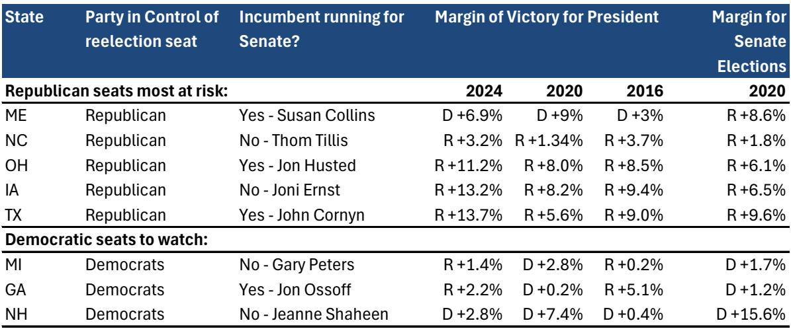
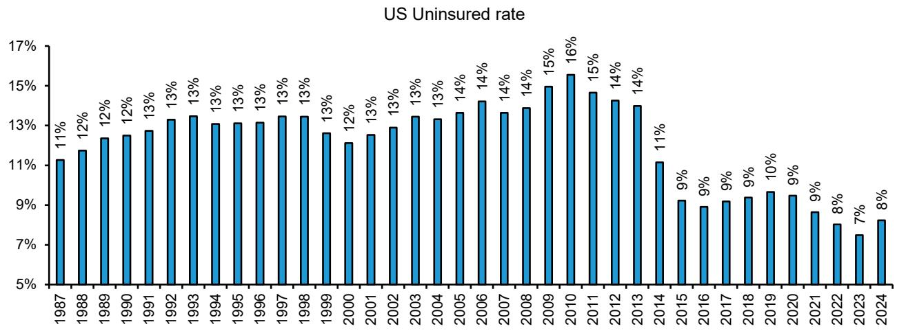
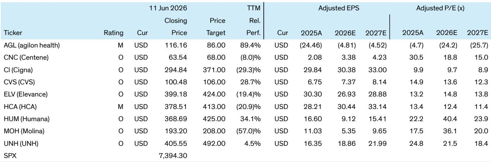

# Bernstein：医疗保健政策的下一个拐点不在2028，而在2026中期选举

市场对医疗保健板块的关注，大多集中在2028年总统大选可能带来的政策摇摆上。但Bernstein这份最新研报提出了一个更紧迫的判断：真正影响资产定价的政策拐点，可能出现在2026年中期选举之后，而非四年后的大选周期。

这份报告的核心洞察在于：如果民主党在2026年拿下众议院，医疗保健政策的方向将发生实质性转变——从削减Medicaid和 Marketplace注册，转向恢复覆盖率和扩大保障。而这一转变对Medicaid导向的保险公司和医院的影响，远比市场当前定价所反映的要深远。

研报同时指出，尽管特朗普的民调支持率已降至第二任期内最低点，但众议院的席位争夺并非一边倒。Bernstein的分析框架显示，共和党在众议院仍有约200个席位的“地板”，这意味着民主党的席位增长可能不如历史典型的中期选举那样剧烈。正是这种“有限但关键”的转变，让政策博弈变得更加微妙——妥协的可能性上升，极端政策的概率下降。

对于投资者而言，这不仅仅是一次政治预测。它直接关系到Medicaid管理式医疗组织的风险池变化、坏账趋势、以及垂直整合监管的走向。Bernstein的评级表已经透露出信号：Centene、Molina、Humana等安全网MCO均获得“跑赢大盘”评级，而医院股HCA仅为“与大盘持平”。

以下是我们从这份报告中提炼出的五个关键层次，每一个都指向一个尚未被市场充分定价的变量。

## 1. 民主党重掌众议院将扭转Medicaid削减，但医院的定价尚未反映这一预期

Bernstein的分析指出，民主党若拿下众议院，首要政策目标将是恢复Medicaid资金和ACA增强补贴。这意味着此前因共和党政策导致的Medicaid注册下降和风险池恶化，有望得到缓解。对于Medicaid MCO而言，这直接关系到医疗损失率的改善和注册人数的稳定。

但研报特别强调了一个市场盲点：医院板块。虽然医院同样是这些政策的潜在受益者——坏账减少、未补偿护理负担下降——但当前医院股的股价表现并未体现出这一预期。Bernstein认为，这种定价偏差可能为投资者提供了机会窗口，前提是中期选举结果符合预测。

这一判断的深层含义在于：市场的注意力过度集中在Medicaid MCO上，而对医院端的影响尚未形成共识。如果民主党获胜，医院板块的估值重估可能比保险板块更具弹性，因为当前的预期差更大。

## 2. 参议院的不确定性意味着政策路径需要妥协，而非激进变革

研报对参议院的预测更加谨慎。虽然民主党有50%的概率拿下参议院，但需要赢得俄亥俄、得克萨斯等特朗普领先超过10个百分点的州，难度显著高于众议院。Bernstein的基准情景是共和党保持50-51席。

这种“众议院蓝、参议院红”的分裂格局，对政策的影响是决定性的。研报明确指出，无论民主党赢得一院还是两院，最终政策都需要妥协才能通过立法并避免否决。这意味着，极端政策——如对Medicare Advantage或PBM的严厉监管——在2027-2028年期间发生的概率较低。

这一判断对投资者的启示是：不要过度炒作“颠覆性政策”的风险。市场可能高估了民主党在医疗保健领域的行动能力，而低估了两党在扩大覆盖率和控制成本方面达成有限共识的可能性。

## 3. 2028年大选的政策焦点将从“废除”转向“限制”，垂直整合成为最大变量

Bernstein对2028年选举周期的早期分析，揭示了政策焦点的转移。与过去围绕“Medicare for All”的激进辩论不同，下一轮政策讨论将更加务实：覆盖率和降低未参保率、可负担性、以及垂直整合与AI监管。

研报特别指出，虽然“Medicare for All”不太可能成为实际政策，但支持该主张的候选人将在民主党初选中占据重要位置，这可能在2027年引发市场波动。然而，最实质性的变化可能出现在垂直整合限制领域。Bernstein认为，这是未来几年最值得关注的监管方向，因为它直接影响到联合健康、信诺等大型综合医疗企业的商业模式。

这一判断意味着：投资者需要开始关注医疗保健行业的反垄断风险，尤其是大型保险公司与医疗服务提供者之间的整合趋势。这不仅是政治议题，更是行业竞争格局的结构性变量。

## 4. 报告尚未完全回答的关键问题：Medicaid风险池改善的幅度与时间线

Bernstein的框架在逻辑上自洽，但有一个关键变量尚未充分展开：政策落地到风险池改善之间的传导机制和时滞。

民主党恢复Medicaid资金和ACA补贴，理论上会改善Medicaid MCO的风险池，因为更多健康个体将重新进入保险池，降低医疗损失率。但这一过程需要时间——注册周期、费率调整、以及医疗利用模式的变化，都可能影响改善的幅度和速度。

研报对Centene和Molina的盈利预测显示，2026-2027年的每股收益增长路径相对清晰，但市场对这一改善的定价是否充分，仍取决于具体政策的实施细节。例如，恢复资金是通过直接拨款还是通过延迟OBAMACARE某些条款的实施？不同的政策路径将对风险池产生不同的影响。

这一未解问题，恰恰是投资者需要深入跟踪的核心变量。政策方向明确，但传导路径的细节决定了资产定价的精确性。

## 5. 投资者需要建立“政策情景”思维，而非“政策方向”思维

Bernstein这份报告最值得借鉴的，不是它对中期选举的预测，而是它的分析框架：将政治概率转化为资产定价的输入变量，而非单纯的背景噪音。

具体而言，投资者需要建立三个层次的情景分析：

第一，众议院民主党胜选情景。这一情景下，Medicaid MCO和医院将直接受益，但受益程度取决于政策妥协的深度。Centene和Molina的估值修复可能最快，而医院股的弹性更大但确定性更低。

第二，参议院也民主党胜选情景。这一情景下，政策空间更大，但市场可能高估了激进变革的概率。Bernstein的分析表明，即使民主党横扫两院，妥协仍然是主旋律。

第三，共和党保住众议院情景。这一情景下，当前政策方向将延续，Medicaid MCO面临持续压力，但Medicare Advantage和PBM的监管风险也将降低。

真正的投资机会，不在于赌哪一个情景会实现，而在于理解不同情景下资产定价的偏差，并在市场共识形成之前建立相应的头寸。

---

Bernstein的这份研报，在政治与市场的交叉点上提供了难得的清晰度。但它也留下了一些值得继续探讨的问题：Medicaid风险池改善的具体路径是什么？垂直整合限制的监管框架将如何演变？2027年“Medicare for All”候选人的初选表现会引发多大的市场波动？

这些问题，正是我们社群持续讨论的焦点。我们欢迎对医疗保健政策与投资交叉领域感兴趣的读者，加入我们的星球微信群，一起追踪这些关键变量的演变，并在市场定价偏差出现时做出更及时的判断。

Personal reading notes and learning share only. Not investment advice.

