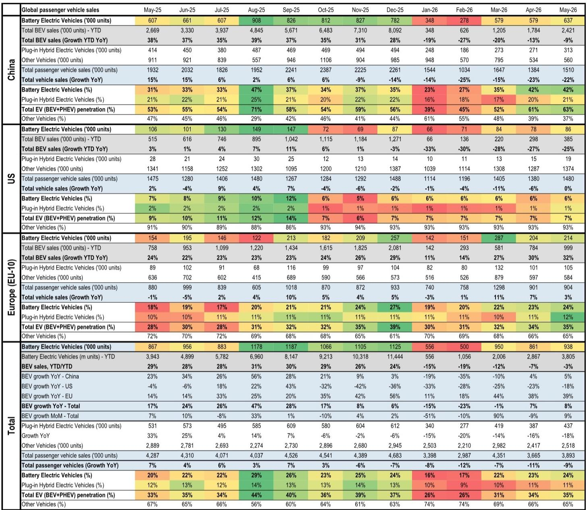
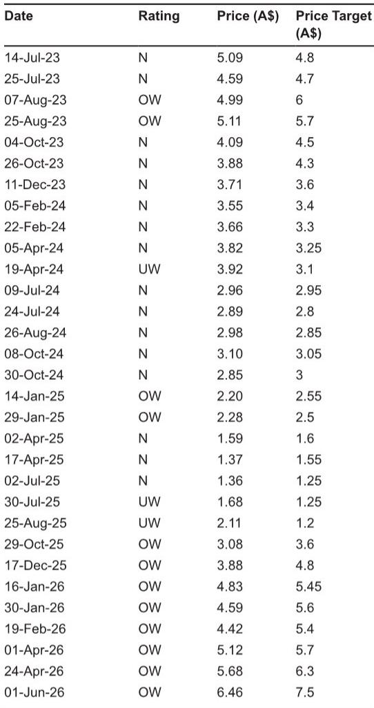

# Global BEV Sales Are Recovering, But the Real Story Is a Three-Tier Market That Demands a Differentiated Lithium Strategy

The global battery electric vehicle (BEV) market is not a single narrative. In May 2026, combined BEV sales across China, the EU-10, and the United States reached 938,000 units, a 9% month-over-month increase and an 8% year-over-year gain. On the surface, this looks like a steady, if unspectacular, recovery from the first-quarter trough. Yet the year-to-date figure remains 3% below the same period in 2025, and the regional divergences are so stark that any aggregated view obscures more than it reveals. China is running at a 42% BEV penetration rate, the EU-10 is accelerating on the back of policy support and affordable models, and the United States is stuck at 6% penetration with year-to-date sales down 25%. This is not a global market. It is three distinct markets operating under different demand drivers, policy regimes, and consumer adoption curves.

For investors and strategists in the lithium and battery supply chain, the implication is clear: a one-size-fits-all demand forecast is no longer sufficient. The price of spodumene, the upstream lithium feedstock, will increasingly be determined by which region's demand profile dominates the marginal tonne. The report from a global investment bank points to modest upward pressure on spodumene prices, supported by continued strength in the energy storage system (ESS) market and a supply time lag. But the real strategic question is whether the current recovery in BEV sales is durable enough to absorb the next wave of lithium supply, or whether the market is heading toward a structural surplus that only a sustained European and Chinese demand acceleration can close.

The data from May 2026 offers a critical window into this question. It reveals not just a recovery, but a rebalancing of the global EV market that has profound implications for lithium pricing, battery supply chain strategy, and regional investment decisions. The following analysis unpacks the regional dynamics, draws out the second-order effects for lithium markets, and identifies the analytical gaps that remain open for serious investors.

## China's BEV Market Has Crossed a Structural Threshold, But the Mix Shift Toward PHEVs Creates a Lithium Demand Puzzle

China's BEV penetration rate held steady at 42% in May 2026, matching April's level and representing a dramatic recovery from the January trough of 23%. Total EV penetration, including plug-in hybrids, reached 63%, the highest since August 2025. On a year-to-date basis, Chinese BEV sales are still down 9% versus the same period in 2025, but the monthly trajectory is clearly upward. The May figure of 637,000 units represents a 10% month-over-month gain and a 5% year-over-year increase.

The headline numbers are encouraging, but the composition of Chinese EV sales warrants a more nuanced interpretation. Plug-in hybrid electric vehicle (PHEV) sales in May reached 313,000 units, representing 21% of total passenger vehicle sales and 33% of total EV sales. This is not a temporary blip. PHEV penetration in China has been remarkably stable in the 20-22% range over the past year, even as BEV penetration has swung from 23% to 42%. The persistence of PHEV demand suggests that a significant segment of Chinese consumers still values the range flexibility that hybrids offer, even as battery costs decline and charging infrastructure expands.

For lithium demand, this matters enormously. A typical BEV battery pack contains roughly 50-70 kilograms of lithium carbonate equivalent (LCE), while a PHEV pack contains only 10-20 kilograms. If the Chinese market is settling into a pattern where roughly one-third of EV sales are PHEVs, the lithium intensity of each incremental EV sale is lower than a pure BEV scenario would imply. The report's observation that total EV penetration reached 63% is impressive, but the lithium demand per vehicle is diluted by the PHEV share.

The strategic implication is that China's lithium demand growth may be structurally slower than the BEV penetration headline suggests. Investors who model lithium demand based solely on BEV penetration rates risk overestimating the volume of lithium required to support China's electrification trajectory. The question that remains open is whether the PHEV share will compress as battery costs continue to fall and charging infrastructure improves, or whether it represents a lasting consumer preference that will cap lithium demand growth in the world's largest EV market.

## The EU-10 Is the Strongest Demand Engine, Driven by Policy and Affordable Models, But Its Sustainability Depends on Macroeconomic Conditions

The EU-10 region delivered the most impressive performance in May 2026. BEV sales reached 214,000 units, up 5% month-over-month and a remarkable 39% year-over-year. Year-to-date sales are up 32% versus the same period in 2025, and BEV penetration climbed to 24% from 23% in April and from 18% in May 2025. Total EV penetration, including PHEVs, reached 35%.

The report attributes this strength to "country-level subsidy schemes and affordable mass EVs penetrating the market." This is a critical distinction. Unlike the US market, where BEV adoption remains concentrated among premium models and early adopters, the European market is seeing genuine mass-market penetration. The combination of purchase subsidies, emissions regulations, and a growing roster of affordable BEV models from both European and Asian manufacturers is driving adoption among price-sensitive consumers.

The sustainability of this trend depends on several factors that the report does not fully address. First, the macroeconomic backdrop in Europe remains uncertain. If consumer confidence weakens or interest rates remain elevated, the demand for big-ticket purchases like vehicles could soften, even with subsidies in place. Second, the subsidy schemes themselves are not permanent. Several European countries have already begun to phase out or reduce purchase incentives, and the impact of any further reductions could be significant. Third, the affordable mass-market models that are driving adoption today may face margin pressure as competition intensifies, potentially slowing the pace of new model introductions.

For lithium markets, the European demand trajectory is the most important variable outside of China. The EU-10 accounted for roughly 23% of global BEV sales in May, and its year-to-date growth rate of 32% is the highest among the three major regions. If this pace continues, Europe will absorb a growing share of global lithium supply, potentially offsetting any weakness from the US market. However, the report's data shows that European BEV penetration, while rising, is still well below China's level. The region has room to grow, but the path to higher penetration is not automatic. It depends on policy continuity, macroeconomic stability, and the continued availability of affordable models.

## The US Market Remains a Structural Drag, and Its Stagnation Creates a Two-Speed Global Market That Complicates Lithium Pricing

The US BEV market is the most concerning data point in the report. May sales of 86,000 units represent a 10% month-over-month rebound from April, but year-to-date sales are down 25% versus the same period in 2025. BEV penetration has been stuck at 6% for six consecutive months, from December 2025 through May 2026. This is not a temporary slowdown. It is a structural plateau.

The contrast with China and Europe could not be starker. While China has seen BEV penetration oscillate between 23% and 42% over the past year, and Europe has climbed from 18% to 24%, the US has remained flat. The reasons are well understood: limited affordable model availability, an underdeveloped charging infrastructure outside of coastal urban centers, and a political environment that has created uncertainty around future emissions regulations and federal incentives. What the report confirms is that none of these headwinds are abating.

For lithium markets, the US stagnation creates a two-speed global demand environment. China and Europe are driving growth, while the US is effectively a dead weight on global BEV sales. The year-to-date global BEV sales decline of 3% is entirely attributable to the US market's 25% drop. Without the US drag, global BEV sales would be comfortably positive year-to-date.

This has two implications for lithium pricing. First, the global market is becoming increasingly dependent on two regions for demand growth. Any policy or economic shock that affects either China or Europe would have an outsized impact on lithium demand. Second, the US market's stagnation means that a significant portion of global lithium supply is being directed toward regions where demand growth is already strong, potentially creating localized supply tightness even if the global market appears balanced. The report's view of "modest upward pressure in spodumene prices" is consistent with this interpretation, but it also implies that the market is vulnerable to any demand disappointment from China or Europe.

## What the Report Does Not Fully Answer: The Interaction Between BEV and ESS Demand, and the Timing of the Next Supply Wave

The report notes that "with the continued strength in the ESS market and the supply time lag, we see modest upward pressure in spodumene prices from here." This is a reasonable near-term assessment, but it leaves several important questions unanswered.

First, the report does not quantify the relative contribution of ESS versus BEV demand to the lithium market balance. ESS demand has been a significant growth driver for lithium in recent years, driven by grid-scale battery storage deployments and behind-the-meter residential storage. If ESS demand continues to grow at a faster pace than BEV demand, it could absorb excess lithium supply that might otherwise depress prices. However, if ESS demand growth slows, the market could quickly move into surplus.

Second, the report does not specify the timing or magnitude of the next wave of lithium supply. The "supply time lag" that supports current prices is a temporary phenomenon. Several large-scale lithium projects are in development across Australia, South America, and Africa, and the timing of their commissioning will be critical. If new supply comes online faster than demand growth, the modest upward pressure on prices could reverse quickly.

Third, the report does not address the potential for lithium substitution or recycling to alter the demand picture. As battery technology evolves, some manufacturers are exploring chemistries that reduce or eliminate lithium content. While these technologies are not yet commercially significant, they represent a long-term risk to lithium demand growth that is not captured in current forecasts.

These open questions are not criticisms of the report, which provides an excellent snapshot of current market conditions. Rather, they highlight the analytical challenges that investors face in a market where the key variables are subject to significant uncertainty. The report's top pick in the lithium space, PLS, reflects a view that the current dynamics favor established producers with low-cost operations and strong balance sheets. But the sustainability of this view depends on outcomes that are inherently difficult to predict.

## A Decision Framework for Lithium Investors: Four Scenarios for the Next 12-18 Months

For investors trying to navigate the lithium market, the report's data can be organized into a decision framework based on two key variables: the trajectory of global BEV demand and the timing of new supply additions.

**Scenario 1: Strong BEV demand, delayed supply.** This is the most favorable scenario for lithium prices. If Chinese BEV penetration continues to rise toward 50%, European growth remains above 30% year-to-date, and the US market shows signs of recovery, while new supply projects face delays, spodumene prices could see more than modest upward pressure. In this scenario, producers with low-cost assets and proven execution track records would be the primary beneficiaries.

**Scenario 2: Strong BEV demand, on-time supply.** This scenario would see prices stabilize or decline modestly as new supply absorbs demand growth. The market would remain balanced, but the upside for lithium equities would be limited. Investors would need to focus on producers with the lowest cost curves and the strongest balance sheets to weather any margin compression.

**Scenario 3: Weak BEV demand, delayed supply.** This is a mixed scenario. Prices would be supported by supply constraints, but demand weakness would cap any upside. The market would be characterized by low volumes and stable but unexciting prices. Producers with high-cost operations would face pressure, while low-cost producers would maintain healthy margins.

**Scenario 4: Weak BEV demand, on-time supply.** This is the most bearish scenario. A combination of slowing demand and increasing supply would push the market into surplus, putting significant downward pressure on prices. High-cost producers would be forced to curtail production, and the lithium equity market would face a prolonged period of underperformance.

The current data points toward Scenario 1 or 2, depending on one's view of supply timing. The report's emphasis on the supply time lag suggests a bias toward Scenario 1 in the near term. However, the US market's stagnation and the PHEV mix shift in China are warning signs that demand growth may not be as robust as the headline numbers suggest. Investors should monitor monthly BEV sales data, project commissioning announcements, and ESS deployment figures to assess which scenario is unfolding.

## Join the Community to Read the Full Report and Review the Original Charts

The data and analysis presented here are drawn from a detailed report by a global investment bank's metals and mining research team. The full report includes granular monthly sales data for each region, historical penetration rate charts, and detailed breakdowns of vehicle sales by powertrain type. It also contains the team's specific price forecasts and investment recommendations, including their top pick in the lithium space.

For serious investors who want to build their own view on the lithium market, the original charts and data tables are essential. They allow you to test your own assumptions about demand growth, supply timing, and regional dynamics, rather than relying solely on the report's conclusions. The report also includes analysis of the ESS market and its interaction with BEV demand, which is a critical piece of the puzzle that is only briefly touched on in this article.

Join the community to read the full report and review the original charts. The data will give you the foundation you need to make informed decisions in a market that is becoming increasingly complex and regionally differentiated.

*This article is for learning and discussion only and does not constitute investment advice.*

Personal reading notes and learning share only. Not investment advice.

