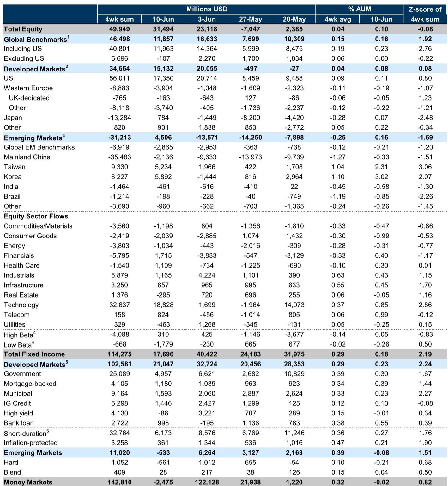
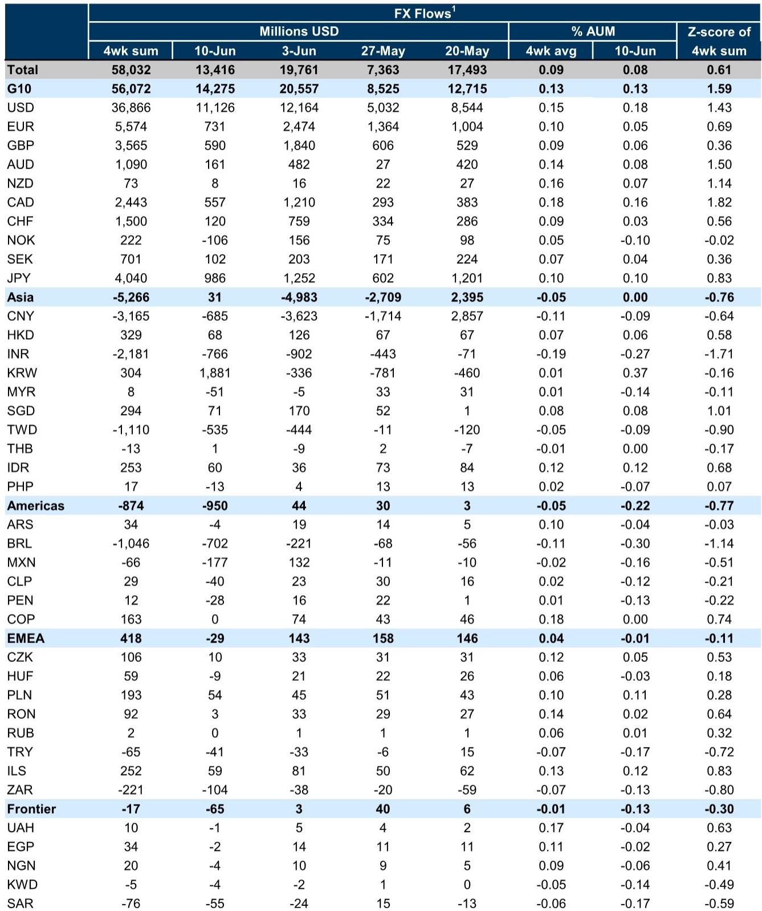
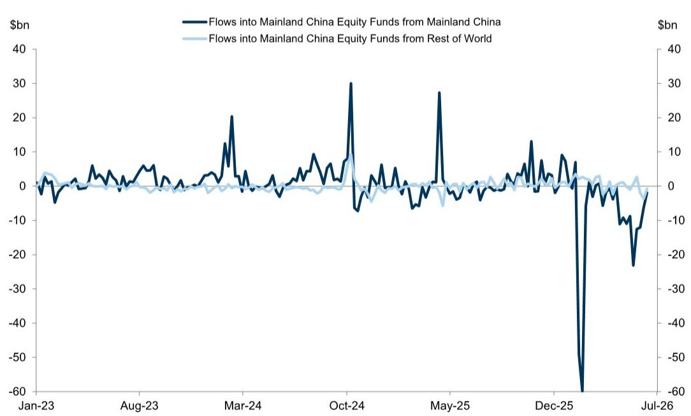

# The Great Divergence: Global Capital Is Voting Against the Narrative of Synchronized Recovery

The most important story in global markets this week is not the absolute volume of inflows into equities and fixed income, but the brutal selectivity of where that capital is going. Global equity funds absorbed $31 billion in the week ending June 10, accelerating from $23 billion the prior week, and fixed income funds continued their remarkable run of inflows. Yet beneath these headline totals lies a pattern that confounds the consensus view of a broadly improving global economy: capital is fleeing the world's second-largest economy, rotating aggressively into technology above all else, and signaling that the much-anticipated rotation into value and cyclicals remains a promise unkept. For investors constructing portfolios for the second half of the year, the data argues that the market is pricing not a synchronized global recovery, but a deeply uneven one where a handful of winners absorb the vast majority of risk appetite.

The divergence is not subtle. Mainland China equity funds saw net outflows even as Taiwan and Korea funds drove emerging market inflows. Within sectors, technology funds captured the largest net inflows while consumer goods funds continued to bleed. In fixed income, the preference for short-duration and inflation-protected bonds suggests that investors are hedging against uncertainty rather than betting on a smooth normalization path. Money market fund assets declined by $2 billion, but this modest reduction hardly signals a confident rotation into risk assets. It looks more like a cautious repositioning within a defensive framework.

This is not a market telling a simple story of "risk on." It is a market making precise, sometimes contradictory bets that reveal a sophisticated skepticism about the durability of current economic conditions. The report's data offers a rare window into the actual positioning decisions of institutional capital, and the picture it paints demands a rethinking of several widely held investment narratives.

## The Technology Trade Is Not a Growth Bet; It Is a Defensive Consensus Against Broad Economic Uncertainty

The dominance of technology fund inflows is the single most striking feature of this week's data, but its implications are widely misunderstood. On the surface, $31 billion into global equity funds with technology as the leading sector recipient appears to confirm the narrative of AI-driven optimism and structural growth. However, the context provided by the sector-level data tells a different story. Technology inflows are occurring against a backdrop of persistent outflows from consumer goods, mixed performance in cyclicals excluding technology, and only modest interest in financials and energy.

This pattern suggests that investors are not making a broad bet on economic expansion. They are making a narrow bet on a specific set of companies that appear insulated from the macroeconomic headwinds that threaten other sectors. Technology, particularly the subset of companies tied to artificial intelligence and cloud infrastructure, has become a defensive consensus in its own right. When investors are uncertain about inflation trajectories, central bank policy divergence, and geopolitical risks, they gravitate toward the asset class that has demonstrated pricing power, margin resilience, and secular demand independent of the business cycle.

The cumulative year-to-date data on sector flows reinforces this interpretation. Industrials and infrastructure have also attracted significant inflows, but these are thematic bets tied to government spending and reshoring narratives rather than broad cyclical conviction. The absence of enthusiasm for financials and the outright rejection of consumer goods indicate that the market is not pricing a traditional late-cycle boom. Instead, capital is clustering around stories that promise to work regardless of what the macro environment delivers. This is the behavior of a market that has learned to distrust the economic data and is instead hedging its bets through concentrated thematic exposure.

## The China Divergence Reveals a Structural Reassessment That Goes Beyond Trade Tensions

Perhaps the most analytically consequential finding in this report is the stark divergence within emerging market equity flows. Taiwan and Korea equity funds drove the net inflows into emerging markets, while global EM benchmark funds and Mainland China equity funds saw net outflows. This is not a simple risk-off move within EM. It is a sophisticated differentiation that reflects a fundamental reassessment of China's role in global portfolios.

The cumulative year-to-date flows by region make the scale of this divergence unmistakable. Korea has seen cumulative inflows of 44% of AUM year-to-date, Taiwan 17%, and Brazil 25%. Mainland China, by contrast, has seen cumulative outflows of negative 24% of AUM. This is not a temporary tactical adjustment. It is a structural portfolio rebalancing that has been underway for months and shows no sign of reversing.

The implications extend far beyond China itself. For decades, the dominant EM investment framework treated China as the anchor of the asset class, the largest weight in benchmarks and the primary driver of EM performance. That framework is breaking down. Capital is rotating toward markets that offer exposure to the global technology supply chain (Taiwan and Korea) or commodity cycles (Brazil) while reducing exposure to the Chinese domestic economy. This suggests that the investment community has concluded that China's growth model faces structural headwinds that cannot be resolved by policy stimulus alone. The question this raises for global allocators is whether the EM asset class itself needs to be redefined, or whether the China weight in benchmarks has become a liability rather than an opportunity.

## Fixed Income Flows Are Betting Against the Soft Landing Narrative Even as Equity Markets Appear Complacent

The fixed income data in this report contains a warning that equity markets may be ignoring. Global fixed income funds saw inflows of $17.7 billion in the week, with the four-week sum reaching an extraordinary $114 billion. Within this, short-duration bond funds and inflation-protected bond funds have seen sustained inflows. This is not the behavior of investors who believe the soft landing has been achieved.

Short-duration positioning is a classic hedge against uncertainty. It suggests that investors want yield but are unwilling to lock in duration risk because they fear a policy error or a resumption of inflationary pressure. The sustained demand for inflation-protected bonds reinforces this interpretation: investors are not convinced that the inflation battle has been won, and they are paying for insurance against a second wave.

The divergence between equity and fixed income signals is striking. Equity flows, however concentrated, still suggest risk appetite. Fixed income flows suggest a defensive posture that is inconsistent with a confident economic outlook. This creates a tension that will eventually have to resolve. Either the equity market is too optimistic, and fixed income investors are correctly pricing continued uncertainty, or fixed income investors are overly cautious, and a rotation out of short-duration and inflation-protected products will provide a tailwind for broader risk assets. The data alone cannot tell us which side is right, but it does tell us that the two largest asset classes are operating on fundamentally different assumptions about the future.

## The Hungary Bond Story Is a Microcosm of a Larger Shift That Most Investors Are Underestimating

The report's chart of the week focuses on Hungary bond inflows, which have increased meaningfully since the start of the year. The analysis connects this to the prospects of Euro adoption and a shift in economic policy that argues for gradual yield convergence to the Euro Area. This is a small story in terms of absolute flows, but it is analytically significant because it illustrates a pattern that may be replicating across other peripheral markets.

The mechanism at work is the reassessment of political and policy risk. When a country signals a credible commitment to institutional alignment with a larger, more stable economic bloc, the risk premium embedded in its assets compresses. This is not unique to Hungary. Similar dynamics are visible in parts of Latin America and Asia where policy credibility is improving. The report's data on cross-border FX flows, which shows strong net demand for USD and KRW while INR, BRL, and CNY saw net outflows, suggests that capital is making increasingly fine distinctions between countries based on policy credibility rather than simple growth rates.

For global fixed income investors, this implies that the next phase of the cycle may be defined by convergence trades rather than broad carry trades. The opportunity lies not in buying the highest-yielding markets indiscriminately, but in identifying those where political and policy shifts are likely to compress risk premia. The Hungary story is a test case. If it continues to work, it will attract attention to similar opportunities in other markets that have been overlooked.

## What the Report Does Not Yet Answer: The Sustainability of Technology Inflows and the Risk of Crowded Positioning

For all its richness, this week's data leaves several critical questions unresolved. The most pressing is whether the technology inflow momentum is sustainable or whether it has become a crowded trade that is vulnerable to a sharp reversal. The year-to-date cumulative flows into technology sector funds are positive but not extreme relative to the sector's weight in global markets. However, the pace of inflows has accelerated, and the concentration of capital in a narrow set of names within the sector raises the risk that any disappointment in earnings or guidance could trigger a disproportionate outflow.

A second unresolved question concerns the relationship between equity and fixed income flows. If fixed income investors are correct to be cautious, and economic conditions deteriorate, would technology equities prove as defensive as the current inflow pattern assumes? The historical record suggests that technology outperforms in low-growth, low-rate environments but underperforms sharply when growth disappoints and liquidity tightens. The current configuration of flows implies that investors expect a Goldilocks scenario where growth is sufficient to support earnings but not strong enough to trigger a hawkish policy response. That is a narrow path, and the data does not tell us whether it is the right one.

Finally, the report does not fully explain the divergence within EM between Korea and Taiwan on one hand and Mainland China on the other. Is this a cyclical shift driven by relative valuation and earnings momentum, or is it a structural repricing that will persist for years? The answer has profound implications for portfolio construction, but the weekly flow data can only show us the direction of travel, not the destination.

## A Decision Framework for Interpreting Weekly Flow Data: Distinguish Signal from Noise by Focusing on Cumulative Trends and Cross-Asset Consistency

For readers who want to use this data to inform their own investment decisions, a disciplined framework is essential. Weekly flow data is noisy and subject to reversals. The key is to focus on what is persistent and what is consistent across asset classes.

First, prioritize cumulative flows over weekly snapshots. The four-week sum and year-to-date cumulative figures are far more informative than any single week's data. They reveal trends that have survived the noise of individual weeks and are more likely to reflect genuine conviction rather than tactical positioning.

Second, look for cross-asset consistency. When equity and fixed income flows are telling the same story, the signal is strong. When they diverge, as they do this week, the divergence itself is the signal. It indicates that the market is uncertain about the macro outlook and that capital is hedging rather than committing.

Third, differentiate between countries and sectors based on policy credibility and structural exposure rather than growth rates alone. The China outflows and Korea/Taiwan inflows are not about relative GDP growth. They are about which economies offer exposure to structural themes that are independent of the domestic cycle.

Fourth, pay attention to the tails. The Hungary bond story is small in absolute terms, but it represents a type of convergence trade that may become more important as the cycle matures. The most profitable opportunities often emerge in the overlooked corners of the flow data.

Finally, treat the data as a starting point for questions, not as a source of answers. The weekly flow data tells us what capital is doing. It does not tell us whether that capital is right. The most valuable insight is not the direction of flows but the assumptions that are embedded in them. Challenge those assumptions, and you will find the real opportunity.

---

The patterns in this week's data are too consistent and too consequential to ignore. They point to a market that is making precise, selective bets that reflect a sophisticated understanding of the risks ahead. But the data can only take us so far. The full report contains the charts, tables, and historical context that make these trends actionable.

Join the community to read the full report and review the original charts.

*This article is for learning and discussion only and does not constitute investment advice.*

Personal reading notes and learning share only. Not investment advice.

