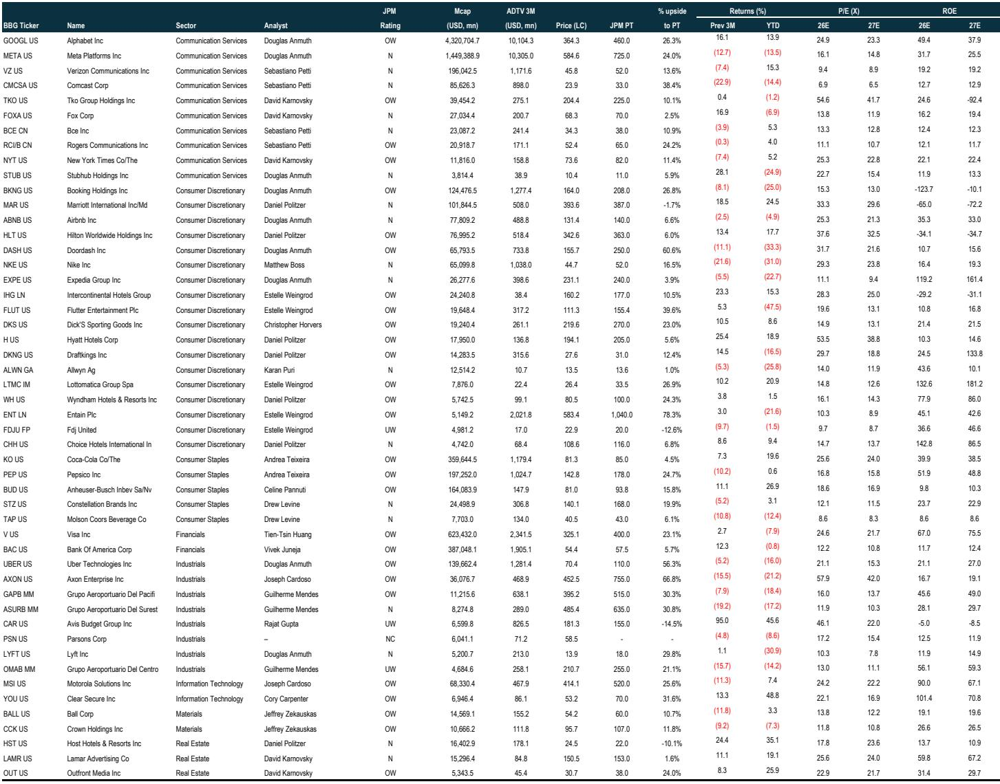
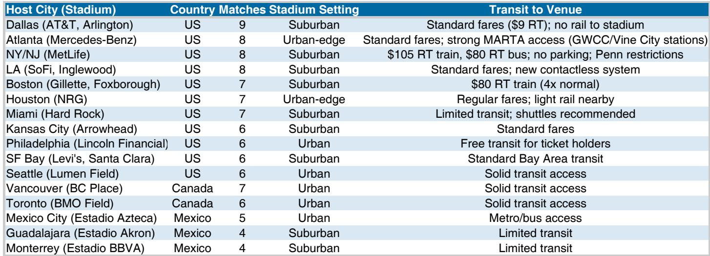
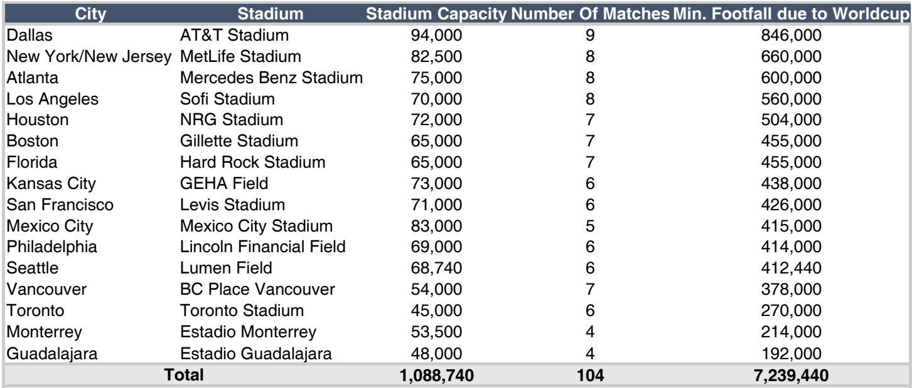

# The 2026 World Cup Is Not Just a Sporting Event — It Is a Structural Demand Shock That Markets Are Underpricing

The 2026 FIFA World Cup will be the largest single-sport event in history, with 48 nations, 104 matches, and an estimated 6.5 million attendees across 16 host cities in the United States, Canada, and Mexico. Early ticket demand has already reached 500 million requests for approximately 7 million available seats — an oversubscription ratio of roughly 70 times. Event-related expenditures are projected at $14 billion, contributing an estimated $17.2 billion to U.S. GDP alone. For the first time since 1994, the tournament returns to North America, and the structural expansion from 32 to 48 teams has fundamentally altered the scale of economic impact.

Yet equity markets have not priced this in. Since the start of 2024, the basket of likely beneficiaries has underperformed the S&P 500 Equal-Weight index by a meaningful margin. Sentiment is depressed by macro uncertainty, geopolitical risk, and growing concerns about the low-end consumer. That gap between the approaching catalyst and current market pricing is precisely where the strategic opportunity lies.

This is not a tourism forecast. It is a call to recognize that the 2026 World Cup represents a concentrated, multi-sector demand shock — one that is large enough to create measurable revenue and earnings dislocations across ticketing, lodging, rideshare, advertising, apparel, and car rentals. The question is not whether the spending will occur. The question is which companies are structurally positioned to capture it, and why the market is currently offering a discount on that exposure.

The following analysis draws on a detailed institutional research report to build a decision framework for investors. It does not summarize the report. It extends its logic, identifies what remains unanswered, and provides a lens through which to evaluate the opportunity.

## The Scale of the 2026 Tournament Creates a New Class of Beneficiaries That Go Beyond Traditional Hospitality

The expansion from 32 to 48 teams and from 64 to 104 matches is not incremental. It is structural. More matches mean more travel, more lodging nights, more rideshare trips, more food delivery orders, more advertising inventory, and more secondary ticket transactions. The U.S. alone hosts 78 of the 104 matches across 11 cities, many of which are sprawl markets that require car rental or rideshare for intra-city mobility.

The economic projections are specific and sector-anchored. Accommodation and food services are expected to generate $2.4 billion in value-added gains. Real estate follows at $2.0 billion, wholesale and retail at roughly $1.5 billion. Within lodging, the research estimates $910 million in incremental U.S. hotel room revenue, translating to 30 to 40 basis points of RevPAR growth. Host-city RevPAR is expected to increase by 7 to 25 percent during June and July 2026.

But the more interesting insight lies outside traditional hospitality. The advertising opportunity is projected at $5 billion in incremental global spending, with 73 percent flowing to digital channels — roughly $4 billion. That is a concentrated windfall for digital advertising platforms. Similarly, rideshare gross bookings are expected to increase by $377 million, and food delivery by $73 million. These are not rounding errors. They are material revenue events for companies that operate at scale in these verticals.

The structural implication is that the 2026 World Cup will not merely lift all boats. It will create winners that are not obvious from a simple macro tourism lens. The key exposures — secondary ticketing, digital advertising, rideshare, food delivery, and car rental — are all tied to behavioral shifts that the tournament expansion amplifies. Investors who limit their focus to hotels and airlines are missing the larger part of the opportunity.

## Host-Country Equity Returns Are Historically Positive, but the U.S. Ecosystem Is Uniquely Positioned to Capture Economic Value

Historical data on host-country equity performance around recent World Cups is mixed but directionally supportive. Qatar returned approximately 10 percent relative to the MSCI ACWI in 2022, Russia returned 5.4 percent in 2018, and Brazil declined 19.5 percent in 2014. The median host-country return sits at roughly 10 percent in the year of hosting.

The 2026 case is different in three important ways. First, the U.S. economy has a far more developed tourism ecosystem than Qatar or Russia. Hotel infrastructure, transportation networks, digital payment systems, and advertising markets are already operating at global scale. The absorption capacity is high, meaning that incremental spending translates more directly into revenue rather than being constrained by supply bottlenecks.

Second, the tournament spans three countries and 16 cities, creating a multi-node demand pattern that benefits a wider range of companies. A match in Seattle, a match in Mexico City, and a match in Toronto each generate distinct spending profiles. This geographic dispersion reduces single-point risk and broadens the set of beneficiaries.

Third, the U.S. equity market is deep and liquid enough that the World Cup spending effect can be captured through sector-level and stock-level exposure. In smaller host economies, the equity market may not have sufficient public company representation to reflect the economic impact. In the U.S., the opposite is true. The beneficiaries are publicly traded, analyst-covered, and investable.

The implication is clear: the historical median return of 10 percent is a floor, not a ceiling, for the 2026 host-country effect. The structural advantages of the North American ecosystem suggest that the equity market impact could be larger and more sustained than prior cycles.

## The Current Market Disconnect Between Low Sentiment and a High-Conviction Catalyst Creates a Tactical Entry Point

Despite the magnitude of the approaching catalyst, market sentiment toward World Cup beneficiaries is notably low. The macro backdrop is challenging. Geopolitical uncertainty persists. Concerns about the low-end consumer have weighed on consumer discretionary and travel-related stocks. The basket of beneficiaries has underperformed since the start of 2024, even as the tournament draws closer.

This is not unusual in event-driven investing. Markets often discount uncertainty more heavily than they discount known catalysts, especially when the catalyst is 18 to 24 months away. But the asymmetry is compelling. The spending is largely pre-committed through ticket sales, sponsorship agreements, and broadcast rights. The risk is not that the spending fails to materialize. The risk is that it is already priced in — and the evidence suggests it is not.

The research report recommends a tactical long position in the 2026 World Cup Beneficiaries Basket, which includes secondary ticketing, lodging, rideshare and food delivery, advertising, apparel, and car rental companies. For investors seeking medium-term exposure, the report also highlights a basket of World Cup sponsors, which have demonstrated strong relative performance through the past two events.

The strategic logic is straightforward. When a known catalyst of this size is met with market skepticism, the entry point improves. The question is not whether to invest in the theme. The question is which exposures offer the best risk-reward and how to size the position relative to other macro risks.

## What the Report Does Not Fully Answer: The Substitution Effect and the Risk of Cannibalization

The report is rigorous in identifying beneficiaries, but it is less explicit about one critical risk: the substitution effect. If consumers reallocate spending from concerts, entertainment, and non-host-city travel to focus on the World Cup, the net economic impact may be smaller than the gross spending figures suggest.

This is not a trivial concern. The $14 billion in event-related expenditures does not account for the possibility that some of that spending would have occurred anyway in other forms. A family that spends $5,000 on a World Cup trip may cancel a summer vacation to a non-host city. A company that buys World Cup advertising may reduce its digital marketing budget in other periods.

The report acknowledges this risk in passing, noting that weaker tourism revenue could result if consumers forego concerts, entertainment, and non-host-city travel. But it does not quantify the potential offset. For investors, this is a meaningful analytical gap. The true economic impact of the World Cup is the incremental spending it generates, not the total spending it attracts. Without a clear estimate of substitution, the upside case may be overstated.

There are also risks related to U.S. immigration policy and geopolitical headwinds. The tournament spans three countries, and any tightening of border policies could reduce cross-border travel. Similarly, geopolitical tensions could dampen international fan attendance. These are tail risks, but they are real, and they are not fully modeled in the base-case projections.

Investors should therefore treat the spending estimates as gross figures and apply their own discount for substitution and policy risk. The opportunity is real, but it is not risk-free.

## A Decision Framework for Investors: How to Evaluate and Size World Cup Exposure

The following framework translates the report's analysis into actionable investment decisions. It is designed to help investors move from thematic conviction to portfolio implementation.

First, determine your time horizon. For tactical investors seeking to capture the pre-event sentiment shift, the 12-to-18-month window before the tournament is the most attractive entry period. The research suggests that market sentiment is likely to improve as the event approaches, creating a tactical tailwind. For medium-term investors, the sponsor basket offers a more diversified exposure that has historically outperformed during the event window itself.

Second, prioritize sectors with the highest incremental revenue capture. Digital advertising and secondary ticketing offer the most direct exposure to World Cup spending, with minimal substitution risk. Advertising is largely incremental — companies increase marketing spend during major events rather than reallocating it. Secondary ticketing captures the excess demand above face-value ticket supply. Both sectors have high operating leverage, meaning that incremental revenue flows disproportionately to profit.

Third, be selective within lodging. The report estimates 30 to 40 basis points of RevPAR growth for U.S. hotels, but this is an industry average. Host-city hotels will see far greater impact, while non-host-city hotels may see negative spillover if consumers cancel alternative travel plans. Investors should favor lodging companies with concentrated exposure to host cities and avoid broad-based hotel REITs with diversified geographic footprints.

Fourth, monitor the substitution risk. The best hedge against substitution is to invest in companies that benefit from World Cup spending regardless of where the spending comes from. Digital advertising platforms, payment processors, and rideshare companies capture spending that is genuinely incremental. By contrast, airlines and non-host-city hotels face higher substitution risk.

Fifth, size the position relative to macro uncertainty. The World Cup theme is not a hedge against recession or geopolitical risk. It is a tactical alpha opportunity that works best when the macro environment is stable or improving. Investors should size the position accordingly, treating it as a complement to core holdings rather than a replacement.

## The Full Report Contains the Data and Charts That Make This Thesis Investable

This article has laid out the strategic argument for why the 2026 World Cup represents a structural demand shock that markets are underpricing. But the full institutional report contains the specific basket compositions, performance lookback charts, host-country return analysis, and sector-level revenue estimates that allow investors to build conviction and execute trades.

The charts alone — including the performance comparison of the beneficiaries basket versus the S&P 500 Equal-Weight index and the host-country equity return analysis — provide visual evidence of the opportunity. Without them, the thesis remains abstract. With them, it becomes a testable investment hypothesis.

Join the community to read the full report and review the original charts.

*This article is for learning and discussion only and does not constitute investment advice.*

Personal reading notes and learning share only. Not investment advice.

