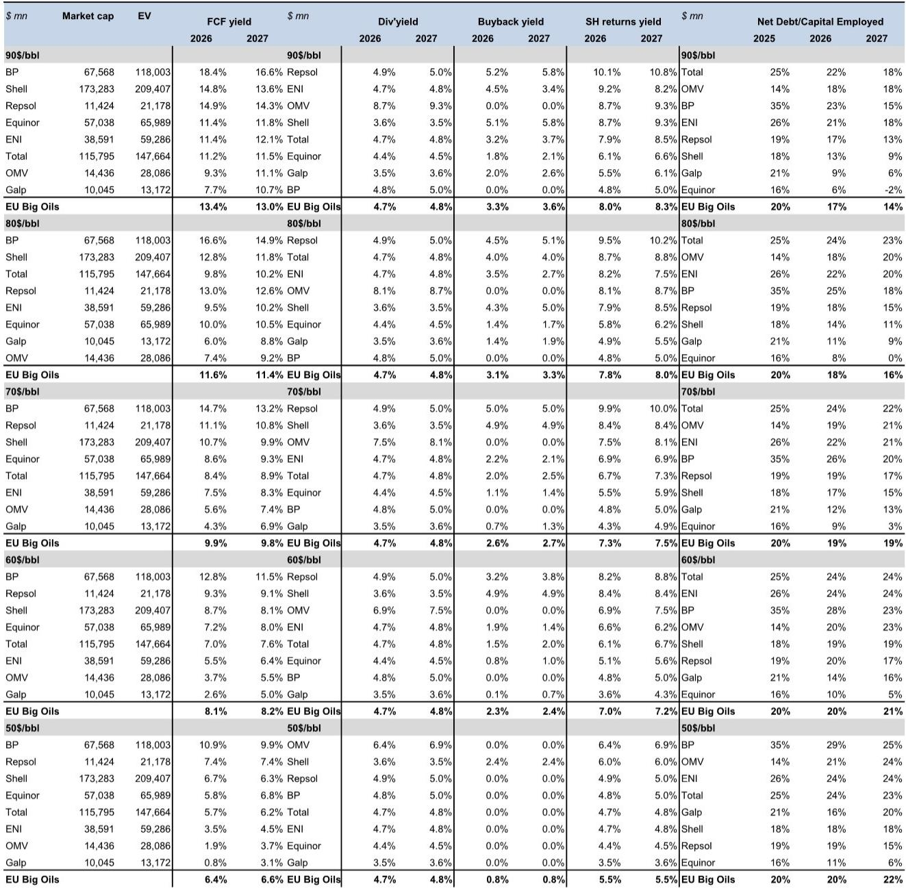
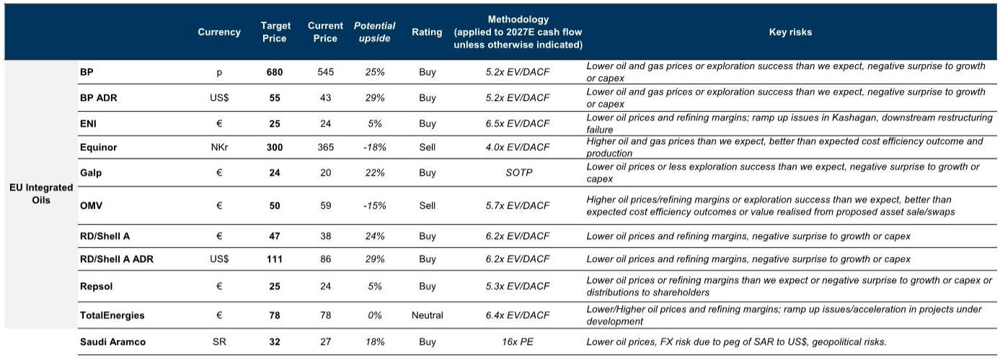
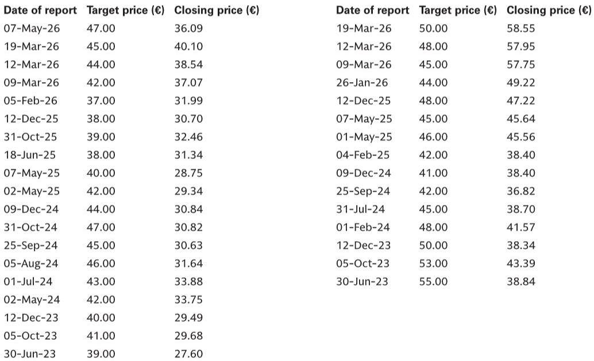

# GS：欧洲石油巨头隐含的长期油价远低于市场共识，这才是真正的价值锚点

当市场目光聚焦于美伊和谈可能带来的霍尔木兹海峡重新开放，并因此推动布伦特油价下跌时，一个更深层的定价问题被忽略了：欧洲上市石油巨头（EU Big Oils）的当前股价，究竟在反映什么样的长期油价预期？GS最新发布的研报给出了一个令人意外的答案——这些公司的估值所隐含的长期油价，远低于当前市场共识和远期期货所暗示的水平。这并非一个简单的“便宜还是贵”的判断，而是指向了一个关于资产定价、股东回报和地缘政治风险重新定价的核心分歧。

这份报告的核心判断是：欧洲石油巨头的估值已经消化了显著低于市场预期的长期油价，这为投资者提供了一个不对称的风险收益窗口。但前提是，投资者需要理解这种“隐含定价”背后的结构性假设，并识别出哪些公司能够在低油价环境中依然保持强劲的现金流和股东回报能力。

## 1. 市场定价的长期油价仅为每桶60美元，远低于共识与远期

GS采用了一个简洁但有力的框架：求解欧洲石油巨头在实现8%的自由现金流收益率（FCF yield）时，所对应的2026-2029年平均布伦特油价。结果令人瞩目——这一隐含价格仅为每桶60美元。这与此期间彭博共识预期的每桶78美元、GS自己的预测每桶77美元，以及远期期货价格每桶79美元相比，存在约20美元的显著折价。

换句话说，市场对欧洲石油公司的定价，并非建立在对当前高油价持续性的乐观假设上，而是已经提前、且相当充分地计入了油价回归到接近页岩油边际成本的水平。这意味着，如果未来油价能够维持在每桶70美元甚至更高的水平，这些公司的实际现金流和股东回报将显著高于当前市场所预期的。

这个发现的核心含义在于：投资者对欧洲石油股的“价值陷阱”担忧，可能恰恰是误解了市场已经完成的风险定价。市场不是在为“高油价红利”买单，而是在为“长期低油价环境下的生存和回报能力”定价。任何超出每桶60美元的油价情景，都可能带来超预期的回报。

## 2. 油价每变动10美元，自由现金流收益率呈现不对称弹性

GS的压力测试揭示了另一个关键洞察：欧洲石油巨头的自由现金流收益率对油价的敏感性，在油价下行区间表现出不对称的韧性。在每桶90美元、80美元、70美元、60美元和50美元的六大油价情景下，2026年整个板块的自由现金流收益率依次为13.4%、11.6%、9.9%、8.1%和6.4%。

即使油价跌至每桶50美元，板块整体的自由现金流收益率仍能维持在6.4%的水平。这背后的原因是，这些公司经过多年的成本优化和资本纪律，其盈亏平衡点已经大幅下降。更重要的是，在每桶60美元的隐含定价水平上，8.1%的自由现金流收益率已经为股东回报提供了坚实的底部支撑。这意味着，即使油价在未来几年内持续承压，这些公司依然有能力维持甚至提高分红和回购，除非油价跌至每桶50美元以下。

这一分析对资产定价的启示是：欧洲石油股的估值底线比市场普遍认为的要坚实得多。投资者不应仅关注油价绝对水平的变化，而应关注公司现金流对油价下行的“免疫能力”。那些成本结构更优、资产组合更多元的公司，其估值下行风险实际上已经被充分定价。

## 3. 股东总回报的底部在油价每桶60美元处得到确认

与自由现金流收益率相对应，GS也测算了在不同油价情景下，欧洲石油巨头的股东总回报收益率（股息加回购）。在每桶90美元时，总回报收益率可达8.0%；即使在每桶60美元时，也有7.0%。值得注意的是，从每桶90美元降至60美元，总回报收益率仅下降了1个百分点，表现出极高的稳定性。

这种稳定性主要来自两个结构性因素：一是这些公司普遍承诺了基于绝对金额或固定比例的分红和回购计划，而非与油价挂钩的浮动政策；二是许多公司正在利用当前的高油价窗口去杠杆，从而在油价下行时拥有更大的财务灵活性来维持股东回报。例如，BP在此次研报中被特别提及，因其拥有强劲的财务去杠杆能力和来自交易利润的潜在上行空间。

对于高净值投资者和产业决策者而言，这意味着欧洲石油股正在演变为一种“类债券”的收益型资产，其现金流和回报对宏观油价波动的敏感度正在系统性下降。在利率环境可能趋于稳定的背景下，这种高且相对稳定的现金回报，具备显著的相对价值。

## 4. 报告尚未完全回答的关键问题：地缘政治溢价的重置何时发生

尽管GS的分析框架极具说服力，但报告本身并未深入探讨一个核心问题：市场隐含的每桶60美元长期油价，是否已经充分计入了霍尔木兹海峡潜在重新开放带来的地缘政治风险溢价重置？

目前，市场对美伊和谈的乐观情绪正在压低布伦特油价，但GS的隐含定价分析是基于当前股价倒推的，而非对未来地缘政治事件的预测。如果霍尔木兹海峡真的重新开放，全球石油供给的增加可能会在短期内将油价推向甚至低于每桶60美元的水平。然而，报告的分析表明，即使在这一极端情景下，欧洲石油公司的自由现金流收益率仍能维持在6.4%左右，这远高于许多其他行业的平均水平。

但这里仍有一个未解的问题：市场对地缘政治风险的定价是一次性完成，还是需要经历一个反复确认的过程？如果油价在未来几个月内快速跌破每桶60美元，这些公司的估值可能会面临短期压力，但其长期股东回报的吸引力反而会进一步增强。这个矛盾本身就构成了一个值得深入探讨的交易主题。

## 5. 投资者的观察框架：从油价预测转向公司层面的结构性优势

基于GS的研究，投资者应该建立一个新的观察框架，而不是继续纠缠于对油价的短期预测。这个框架包含三个层次：

第一，关注公司的盈亏平衡点。那些拥有更低成本、更长寿命资产的油田项目，以及更灵活的资本开支计划的公司，将拥有更强的下行保护。GS特别提到了Galp，因其拥有最长的石油储量寿命。

第二，关注股东回报的可持续性，而非绝对水平。在每桶60美元的油价下，哪些公司依然能够维持甚至提高分红和回购？GS的数据显示，BP、Repsol和Galp在这一维度上表现突出。Repsol还受益于欧洲紧张的航空燃油市场和美洲的石油产量增长。

第三，关注资产负债表的质量。在油价下行周期中，低杠杆率意味着公司不需要被迫削减资本开支或股东回报。GS的净债务/资本占用比率分析显示，Equinor和Galp在低油价情景下的去杠杆能力最强。

这一框架的核心主张是：投资欧洲石油股，应从“赌油价方向”转变为“评估公司在低油价环境下的生存和回报能力”。那些能够将规模优势转化为议价权、将成本优势转化为现金流韧性的公司，才是当前估值水平下真正的价值所在。

## 结语：当市场定价了最坏情景，剩下的就是验证

GS的这份研报提供了一个清晰的定价锚点：欧洲石油巨头的估值已经隐含了每桶60美元的长期油价。这意味着，投资者面临的风险不再是“油价会不会跌”，而是“油价会不会比市场预期的更差”。从目前的分析来看，除非出现全球性深度衰退导致油价长期低于每桶50美元，否则这些公司的股东回报前景依然稳健。

当然，报告的框架本身也有其局限性。它假设了8%的自由现金流收益率是一个合理的定价水平，但未充分讨论如果市场风险偏好发生变化，这个“合理收益率”本身是否会调整。此外，对于各家公司具体的交易利润、炼化利润和天然气定价等因素的敏感性分析，报告并未完全展开，这些细节恰恰是区分不同公司表现的关键。

这些未解的问题，恰恰是深入探讨的价值所在。欢迎来知识星球的微信群里继续讨论，我们可以一起拆解GS报告中那些没有完全展开的图表和假设，看看哪些公司的结构性优势被市场低估了。

Personal reading notes and learning share only. Not investment advice.

