JAPAN WEEKLY KICKSTART

# AGM update; yuutai correction protection

## Summary of the week

TOPIX: 3,881.96 (-1.7%) / NK225: 66,020.04 (-0.9%)

■ Top sectors: Insurance, Real Estate  
■ Bottom sectors: Non-Ferrous Metals, Communications

In this week's Japan Weekly Kickstart we focus on the current AGM season in Japan. As can be seen in Exhibit 1 below, the peak period for AGMs is 23-26 June in terms of the number of companies holding meetings. In Japan Portfolio Strategy: Finding multiple ways to win again: CY2026 1H corporate governance playbook (13 February 2026), we screened for companies that were in the bottom decile for AGM approval ratings during the CY2025 AGM season. So far, 10 out of 12 companies in the screen saw improvements in their approval rating this year (Exhibit 5).

Low AGM approval screen: Since the last AGM season, CY2025 low AGM approval rating screen outperformed the TOPIX by 13ppts until the start of the Iran conflict (Exhibit 4). However, they have not participated so far in the AI-driven rally since April. We believe that low AGM approvals are a strong predictor of shareholder-friendly activity going into the following year's AGM.

Yuutai-related stock performance since 3 June confirms their defensive qualities: Since we published Japan Portfolio Strategy: Unequal equities - How do stocks with shareholder benefits perform during major market corrections? (3 June 2026), our yuutai plus dividends screen (Exhibit 8) has out-performed our no yuutai, no dividends screen (Exhibit 9) by 12ppts, and has out-performed TOPIX by 4ppts (Exhibit 6).

Domestic demand defensives outperformed AI and Tech: The best-performing indices during this week's correction included Food and Beverage (+3% wow) and Retail (+3% wow), while worst-performers included System Integrators (-7% wow) and Apple Supply Chain (-6% wow).

Domestic Institutions and Individuals were net buyers, Foreigners were net sellers: According to the latest data from the TSE, for the week 1-5 June, Domestic institutions and Individuals net bought ¥214bn and ¥298bn of TSE Prime cash equities respectively, while Foreigners net sold -¥65bn.

Bruce Kirk, CFA

+81(3)4587-9950 | bruce.kirk@gs.com

GS Japan Co., Ltd.

Julius Chan

+81(3)4587-1789 | julius.chan@gs.com

GS Japan Co., Ltd.

## 2026 AGM schedule

Exhibit 1: Mar FY-end companies AGM schedule by number of companies  
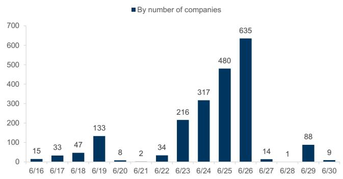

bar chart

| Date | By number of companies |
|---|---|
| 6/16 | 15 |
| 6/17 | 33 |
| 6/18 | 47 |
| 6/19 | 133 |
| 6/20 | 8 |
| 6/21 | 2 |
| 6/22 | 34 |
| 6/23 | 216 |
| 6/24 | 317 |
| 6/25 | 480 |
| 6/26 | 635 |
| 6/27 | 14 |
| 6/28 | 1 |
| 6/29 | 88 |
| 6/30 | 9 |

Source: JPX

Exhibit 2: Mar FY-end companies AGM schedule by market cap  
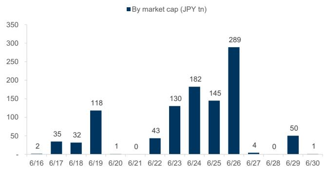

bar chart

| Date | By market cap (JPY tn) |
|---|---|
| 6/16 | 2 |
| 6/17 | 35 |
| 6/18 | 32 |
| 6/19 | 118 |
| 6/20 | 1 |
| 6/21 | 0 |
| 6/22 | 43 |
| 6/23 | 130 |
| 6/24 | 182 |
| 6/25 | 145 |
| 6/26 | 289 |
| 6/27 | 4 |
| 6/28 | 0 |
| 6/29 | 50 |
| 6/30 | 1 |

Exhibit 3: Concentration of AGM for peak day increased slightly  
% of companies

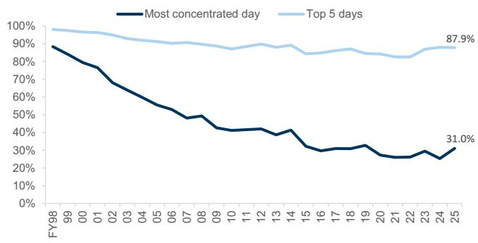

line chart

| Fiscal Year | Most concentrated day | Top 5 days |
| ----------- | --------------------- | ---------- |
| FY98        | 90%                   | 98%        |
| 25          | 31.0%                 | 87.9%      |

Source: JPX

Exhibit 4: Since the 2025 AGM season, low approval screen outperformed until the start of the Iran war, but remains a laggard as the market focused on AI themes  
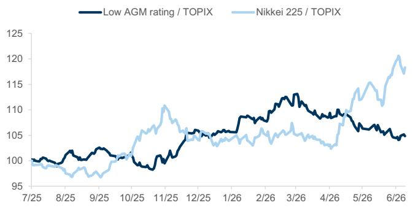

line chart

| Date   | Low AGM rating / TOPIX | Nikkei 225 / TOPIX |
|--------|------------------------|--------------------|
| 7/25   | 100                    | 100                |
| 8/25   | 100                    | 100                |
| 9/25   | 100                    | 100                |
| 10/25  | 100                    | 100                |
| 11/25  | 100                    | 110                |
| 12/25  | 105                    | 105                |
| 1/26   | 105                    | 105                |
| 2/26   | 110                    | 105                |
| 3/26   | 110                    | 105                |
| 4/26   | 105                    | 105                |
| 5/26   | 105                    | 115                |
| 6/26   | 105                    | 120                |

Source: FactSet, Data compiled by GS Global Investment Research

Exhibit 5: So far, 10 out of 12 companies in the low 2025 AGM approval screen saw improvement in approval rating this year

Data as of Jun 10, 2026

<table><tr><td rowspan="2">Ticker</td><td rowspan="2">Name</td><td rowspan="2">Sector</td><td rowspan="2">6M ADTV ($ mn)</td><td rowspan="2">Mcap (¥ bn)</td><td colspan="2">2025 Approval</td><td colspan="3">2026 Approval</td></tr><tr><td>Rating (%)</td><td>Fiscal Year end</td><td>Rating (%)</td><td>pt chg (%)</td><td>AGM date</td></tr><tr><td>6302</td><td>SUMITOMO HEAVY IND</td><td>Machinery</td><td>27</td><td>597</td><td>62.3</td><td>12/2024</td><td>70.6</td><td>+8.3</td><td>2026/3/27</td></tr><tr><td>7752</td><td>RICOH CO</td><td>Electric Appliances</td><td>20</td><td>831</td><td>64.0</td><td>03/2025</td><td></td><td></td><td>2026/6/23</td></tr><tr><td>8306</td><td>MITSUBISHI UFJ FIN</td><td>Banks</td><td>794</td><td>37,775</td><td>65.2</td><td>03/2025</td><td></td><td></td><td>2026/6/26</td></tr><tr><td>8316</td><td>SUMITOMO MITSUI FG</td><td>Banks</td><td>501</td><td>23,834</td><td>68.9</td><td>03/2025</td><td></td><td></td><td>2026/6/26</td></tr><tr><td>5844</td><td>KYOTO FINANCIAL GR</td><td>Banks</td><td>31</td><td>1,354</td><td>69.4</td><td>03/2025</td><td></td><td></td><td>2026/6/26</td></tr><tr><td>2579</td><td>COCA-COLA BOTTLERS</td><td>Foods</td><td>20</td><td>665</td><td>69.6</td><td>12/2024</td><td>83.6</td><td>+14.0</td><td>2026/3/26</td></tr><tr><td>6971</td><td>KYOCERA CORP</td><td>Electric Appliances</td><td>99</td><td>5,048</td><td>69.8</td><td>03/2025</td><td></td><td></td><td>2026/6/25</td></tr><tr><td>8630</td><td>SOMPO HOLDINGS INC</td><td>Insurance</td><td>98</td><td>5,742</td><td>70.3</td><td>03/2025</td><td></td><td></td><td>2026/6/22</td></tr><tr><td>5938</td><td>LIXIL CORPORATION</td><td>Metal Products</td><td>24</td><td>500</td><td>71.4</td><td>03/2025</td><td></td><td></td><td>2026/6/18</td></tr><tr><td>8308</td><td>RESONA HOLDINGS</td><td>Banks</td><td>114</td><td>4,935</td><td>71.9</td><td>03/2025</td><td></td><td></td><td>2026/6/24</td></tr><tr><td>2432</td><td>DENA CO LTD</td><td>Information &amp; Communication</td><td>31</td><td>325</td><td>72.0</td><td>03/2025</td><td></td><td></td><td>2026/6/27</td></tr><tr><td>8830</td><td>SUMITOMO RLTY&amp;DEV</td><td>Real Estate</td><td>84</td><td>3,267</td><td>73.0</td><td>03/2025</td><td></td><td></td><td>2026/6/26</td></tr><tr><td>3769</td><td>GMO PAYMENT GATEWA</td><td>Information &amp; Communication</td><td>18</td><td>600</td><td>73.1</td><td>09/2025</td><td></td><td></td><td>2026/12</td></tr><tr><td>5201</td><td>AGC INC</td><td>Glass &amp; Ceramics Products</td><td>59</td><td>1,509</td><td>73.7</td><td>12/2024</td><td>77.6</td><td>+3.9</td><td>2026/3/27</td></tr><tr><td>6471</td><td>NSK LTD</td><td>Machinery</td><td>21</td><td>550</td><td>74.5</td><td>03/2025</td><td></td><td></td><td>2026/6/25</td></tr><tr><td>4768</td><td>OTSUKA CORP</td><td>Information &amp; Communication</td><td>29</td><td>1,113</td><td>74.9</td><td>12/2024</td><td>na</td><td>na</td><td>2026/3/27</td></tr><tr><td>7276</td><td>KOITO MFG CO LTD</td><td>Electric Appliances</td><td>16</td><td>858</td><td>75.8</td><td>03/2025</td><td></td><td></td><td>2026/6/26</td></tr><tr><td>2160</td><td>GNI GROUP LTD</td><td>Pharmaceutical</td><td>25</td><td>153</td><td>76.3</td><td>12/2024</td><td>78.0</td><td>+1.7</td><td>2026/3/26</td></tr><tr><td>6278</td><td>UNION TOOL CO</td><td>Machinery</td><td>29</td><td>442</td><td>76.5</td><td>12/2024</td><td>80.3</td><td>+3.8</td><td>2026/3/26</td></tr><tr><td>9202</td><td>ANA HOLDINGS INC</td><td>Air Transportation</td><td>54</td><td>1,367</td><td>77.0</td><td>03/2025</td><td></td><td></td><td>2026/6/26</td></tr><tr><td>6861</td><td>KEYENCE CORP</td><td>Electric Appliances</td><td>344</td><td>17,727</td><td>77.1</td><td>03/2025</td><td></td><td></td><td>2026/6/12</td></tr><tr><td>3994</td><td>MONEY FORWARD INC</td><td>Information &amp; Communication</td><td>24</td><td>223</td><td>77.1</td><td>11/2024</td><td>89.4</td><td>+12.3</td><td>2026/2/26</td></tr><tr><td>3350</td><td>METAPLANET INC</td><td>Wholesale Trade</td><td>68</td><td>293</td><td>77.3</td><td>12/2024</td><td>89.3</td><td>+12.1</td><td>2026/3/25</td></tr><tr><td>8267</td><td>AEON CO LTD</td><td>Retail Trade</td><td>111</td><td>3,961</td><td>77.8</td><td>02/2025</td><td>94.0</td><td>+16.3</td><td>2026/5/27</td></tr><tr><td>4502</td><td>TAKEDA PHARMACEUTI</td><td>Pharmaceutical</td><td>162</td><td>8,068</td><td>77.9</td><td>03/2025</td><td></td><td></td><td>2026/6/24</td></tr><tr><td>3659</td><td>NEXON CO LTD</td><td>Information &amp; Communication</td><td>45</td><td>1,750</td><td>77.9</td><td>12/2024</td><td>75.2</td><td>-2.7</td><td>2026/3/25</td></tr><tr><td>7012</td><td>KAWASAKI HEAVY IND</td><td>Transportation Equipment</td><td>367</td><td>2,401</td><td>78.8</td><td>03/2025</td><td></td><td></td><td>2026/6/25</td></tr><tr><td>7014</td><td>NAMURA SHIPBUILDING</td><td>Transportation Equipment</td><td>47</td><td>237</td><td>79.1</td><td>03/2025</td><td></td><td></td><td>2026/6/23</td></tr><tr><td>1963</td><td>JGC HLDGS CORP</td><td>Construction</td><td>38</td><td>618</td><td>79.3</td><td>03/2025</td><td></td><td></td><td>2026/6/26</td></tr><tr><td>7013</td><td>IHI CORPORATION</td><td>Machinery</td><td>433</td><td>2,641</td><td>79.7</td><td>03/2025</td><td></td><td></td><td>2026/6/24</td></tr><tr><td>4506</td><td>SUMITOMO PHARMA CO</td><td>Pharmaceutical</td><td>157</td><td>637</td><td>79.9</td><td>03/2025</td><td></td><td></td><td>2026/6/25</td></tr><tr><td>5714</td><td>DOWA HOLDINGS</td><td>Nonferrous Metals</td><td>40</td><td>558</td><td>80.7</td><td>03/2025</td><td></td><td></td><td>2026/6/24</td></tr><tr><td>8750</td><td>DAI-ICHI LIFE HOLD</td><td>Insurance</td><td>84</td><td>6,397</td><td>80.8</td><td>03/2025</td><td></td><td></td><td>2026/6/22</td></tr><tr><td>5830</td><td>IYOGIN HOLDINGS IN</td><td>Banks</td><td>18</td><td>953</td><td>81.0</td><td>03/2025</td><td></td><td></td><td>2026/6/26</td></tr><tr><td>5711</td><td>MITSUBISHI MATERLS</td><td>Nonferrous Metals</td><td>55</td><td>588</td><td>81.0</td><td>03/2025</td><td></td><td></td><td>2026/6/23</td></tr><tr><td>4755</td><td>RAKUTEN GROUP INC</td><td>Services</td><td>73</td><td>1,571</td><td>81.0</td><td>12/2024</td><td>76.6</td><td>-4.5</td><td>2026/3/27</td></tr><tr><td>8227</td><td>SHIMAMURA CO</td><td>Retail Trade</td><td>19</td><td>750</td><td>81.1</td><td>02/2025</td><td>94.1</td><td>+13.0</td><td>2026/5/15</td></tr><tr><td>8359</td><td>HACHIJUNI NAGANO</td><td>Banks</td><td>19</td><td>1,151</td><td>81.4</td><td>03/2025</td><td></td><td></td><td>2026/6/26</td></tr><tr><td>1801</td><td>TAISEI CORP</td><td>Construction</td><td>103</td><td>2,209</td><td>81.7</td><td>03/2025</td><td></td><td></td><td>2026/6/23</td></tr><tr><td>4324</td><td>DENTSU GROUP INC</td><td>Services</td><td>31</td><td>830</td><td>81.9</td><td>12/2024</td><td>86.9</td><td>+5.1</td><td>2026/3/27</td></tr><tr><td>8411</td><td>MIZUHO FINL GP</td><td>Banks</td><td>460</td><td>18,600</td><td>82.0</td><td>03/2025</td><td></td><td></td><td>2026/6/26</td></tr></table>

Source: Company filings, FactSet, Data compiled by GS Global Investment Research

## Unequal Equities?

Exhibit 6: Y+D screen has outperformed NYND screen by 12ppt since June 3rd ...  
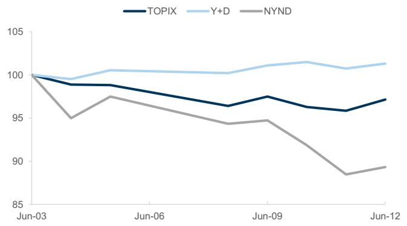

line chart

| Date   | TOPIX | Y+D  | NYND |
|--------|-------|------|------|
| Jun-03 | 100   | 100  | 100  |
| Jun-06 | 99    | 101  | 97   |
| Jun-09 | 97    | 101  | 95   |
| Jun-12 | 97    | 102  | 89   |

Source: FactSet, GS Global Investment Research

Exhibit 7: ... and SMID Y+D has outperformed SMID NYND by 7ppts in the same period  
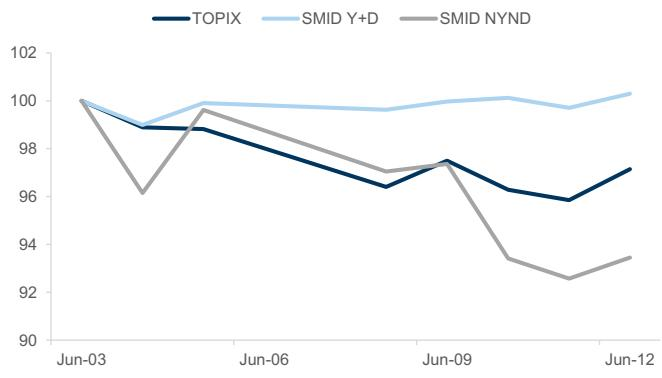

line chart

| Date   | TOPIX | SMID Y+D | SMID NYND |
|--------|-------|----------|-----------|
| Jun-03 | 100   | 100      | 100       |
| Jun-06 | 98    | 100      | 99        |
| Jun-09 | 97    | 100      | 97        |
| Jun-12 | 97    | 100      | 93        |

Source: FactSet, Data compiled by GS Global Investment Research

## Exhibit 8: Yuutai + Dividend Screen

Data as of May 1, 2026. Highlighted names indicate the SMID Y+D screen

<table><tr><td rowspan="2">Ticker</td><td rowspan="2">Company Name</td><td rowspan="2">GICS Sector</td><td rowspan="2">Quoted Price(JPY)</td><td colspan="2">SortedSize and Liquidity</td><td colspan="2">&gt;0Valuations</td></tr><tr><td>Mkt Cap(JPY bn)</td><td>6M ADTV(US$ mn)</td><td>FY1 P/E(x)</td><td>FY0 P/B(x)</td></tr><tr><td colspan="8">No yuutai + No dividend screen</td></tr><tr><td>9501</td><td>TOKYO ELEC POWER H</td><td>Utilities</td><td>613</td><td>984.6</td><td>337.9</td><td>-2.3</td><td>0.4</td></tr><tr><td>4324</td><td>DENTSU GROUP INC</td><td>Communication Services</td><td>2,967</td><td>788.6</td><td>30.9</td><td>9.5</td><td>2.1</td></tr><tr><td>4506</td><td>SUMITOMO PHARMA CO</td><td>Health Care</td><td>1,730</td><td>776.9</td><td>173.9</td><td>7.3</td><td>2.3</td></tr><tr><td>4385</td><td>MERCARI INC</td><td>Consumer Discretionary</td><td>3855.0</td><td>636.2</td><td>42.1</td><td>23.8</td><td>6.4</td></tr><tr><td>6753</td><td>SHARP CORP</td><td>Consumer Discretionary</td><td>582</td><td>378.8</td><td>14.1</td><td>6.7</td><td>1.4</td></tr><tr><td>4194</td><td>VISIONAL INC</td><td>Industrials</td><td>7,429</td><td>298.8</td><td>14.6</td><td>17.2</td><td>4.4</td></tr><tr><td>6366</td><td>CHIYODA CORP</td><td>Industrials</td><td>1,023</td><td>266.3</td><td>51.0</td><td>6.6</td><td>8.0</td></tr><tr><td>6670</td><td>MCJ CO LTD</td><td>Information Technology</td><td>2,183</td><td>222.2</td><td>9.0</td><td>14.4</td><td>2.0</td></tr><tr><td>6707</td><td>SANKEN ELECTRIC CO</td><td>Information Technology</td><td>9,663</td><td>202.2</td><td>6.5</td><td>-21.5</td><td>1.6</td></tr><tr><td>3697</td><td>SHIFT INC</td><td>Information Technology</td><td>649</td><td>173.7</td><td>39.7</td><td>14.5</td><td>4.2</td></tr><tr><td>2160</td><td>GNI GROUP LTD</td><td>Health Care</td><td>3,020</td><td>168.4</td><td>24.3</td><td>60.8</td><td>3.3</td></tr><tr><td>4443</td><td>SANSAN INC</td><td>Information Technology</td><td>1,250</td><td>158.5</td><td>13.3</td><td>27.8</td><td>10.6</td></tr><tr><td>4592</td><td>SANBIO COMPANY LTD</td><td>Health Care</td><td>1,970</td><td>153.7</td><td>17.7</td><td>-53.5</td><td>11.5</td></tr><tr><td>4587</td><td>PEPTIDREAM INC</td><td>Health Care</td><td>1,167</td><td>151.7</td><td>9.2</td><td>8.9</td><td>2.9</td></tr><tr><td>3103</td><td>UNITIKA LTD</td><td>Consumer Discretionary</td><td>2,382</td><td>137.6</td><td>112.8</td><td>6.9</td><td>4.1</td></tr><tr><td>4478</td><td>FREEE K K</td><td>Information Technology</td><td>2,274</td><td>135.7</td><td>10.2</td><td>113.1</td><td>6.9</td></tr><tr><td>3993</td><td>PKSHA TECHNOLOGY I</td><td>Information Technology</td><td>3,280</td><td>104.8</td><td>7.8</td><td>33.2</td><td>3.0</td></tr><tr><td>9519</td><td>RENOVA INC</td><td>Utilities</td><td>1,111</td><td>101.4</td><td>5.5</td><td>63.9</td><td>0.8</td></tr><tr><td>5253</td><td>COVER CORPORATION</td><td>Communication Services</td><td>1,435</td><td>94.2</td><td>13.9</td><td>15.8</td><td>4.7</td></tr><tr><td>6330</td><td>TOYO ENG CORP</td><td>Industrials</td><td>2,268</td><td>87.5</td><td>103.5</td><td>23.9</td><td>3.1</td></tr><tr><td>4565</td><td>NXERA PHARMA CO LT</td><td>Health Care</td><td>952</td><td>86.2</td><td>5.2</td><td>15.1</td><td>1.4</td></tr><tr><td>6993</td><td>DAIKOKUYA HOLDINGS</td><td>Financials</td><td>112</td><td>82.9</td><td>23.4</td><td>124.4</td><td>15.5</td></tr><tr><td>4588</td><td>ONCOLYS BIOPHARMA</td><td>Health Care</td><td>2,717</td><td>79.6</td><td>27.0</td><td>na</td><td>19.9</td></tr><tr><td>4480</td><td>MEDLEY INC</td><td>Health Care</td><td>2,261</td><td>74.0</td><td>5.3</td><td>30.3</td><td>4.7</td></tr><tr><td>4259</td><td>EXAWIZARDS INC</td><td>Information Technology</td><td>720</td><td>69.6</td><td>7.5</td><td>59.5</td><td>13.5</td></tr><tr><td>5202</td><td>NIPPON SHEET GLASS</td><td>Industrials</td><td>480</td><td>68.3</td><td>10.6</td><td>-68.6</td><td>0.5</td></tr><tr><td>6613</td><td>QD LASER INC</td><td>Information Technology</td><td>1,419</td><td>59.5</td><td>40.6</td><td>-149.4</td><td>12.1</td></tr><tr><td>4894</td><td>CUORIPS INC</td><td>Health Care</td><td>6,630</td><td>54.9</td><td>11.2</td><td>-55.9</td><td>11.7</td></tr><tr><td>6521</td><td>OXIDE CORPORATION</td><td>Information Technology</td><td>4,680</td><td>54.3</td><td>13.1</td><td>90.3</td><td>11.5</td></tr><tr><td>6232</td><td>ACSL LTD</td><td>Information Technology</td><td>2,502</td><td>47.9</td><td>16.9</td><td>-60.4</td><td>27.4</td></tr><tr><td>4593</td><td>HEALIOS KK</td><td>Health Care</td><td>333</td><td>45.0</td><td>8.0</td><td>-9.3</td><td>7.9</td></tr><tr><td>3905</td><td>DATASECTION INC</td><td>Information Technology</td><td>1,474</td><td>43.9</td><td>13.0</td><td>15.6</td><td>2.4</td></tr><tr><td>3315</td><td>NIPPON COKE &amp; ENGI</td><td>Energy</td><td>104</td><td>31.4</td><td>5.7</td><td>-3.7</td><td>0.9</td></tr><tr><td>6072</td><td>JIBANNET HOLDINGS</td><td>Industrials</td><td>1,041</td><td>24.1</td><td>10.2</td><td>133.5</td><td>16.3</td></tr><tr><td>2334</td><td>EOLE INC</td><td>Communication Services</td><td>502</td><td>20.9</td><td>5.6</td><td>-40.5</td><td>5.9</td></tr><tr><td>7794</td><td>EDP CORPORATION</td><td>Information Technology</td><td>1,297</td><td>20.1</td><td>10.2</td><td>-10.1</td><td>11.7</td></tr><tr><td>4579</td><td>RAQUALIA PHARMA</td><td>Health Care</td><td>794</td><td>19.4</td><td>6.5</td><td>-992.5</td><td>2.8</td></tr><tr><td>4888</td><td>STELLA PHARMA CORP</td><td>Health Care</td><td>525</td><td>18.4</td><td>7.0</td><td>na</td><td>7.4</td></tr><tr><td>5707</td><td>TOHO ZINC CO LTD</td><td>Materials</td><td>1,173</td><td>16.6</td><td>15.4</td><td>6.0</td><td>1.5</td></tr><tr><td>3656</td><td>KLAB INC</td><td>Communication Services</td><td>207</td><td>16.5</td><td>19.3</td><td>690.0</td><td>1.5</td></tr><tr><td>8918</td><td>LAND CO LTD</td><td>Real Estate</td><td>10</td><td>15.5</td><td>12.1</td><td>16.7</td><td>1.7</td></tr><tr><td>4446</td><td>LINK-U GROUP INC</td><td>Communication Services</td><td>716</td><td>10.1</td><td>5.0</td><td>58.2</td><td>3.9</td></tr><tr><td>6522</td><td>ASTERISK INC</td><td>Information Technology</td><td>1,182</td><td>9.5</td><td>7.9</td><td>135.9</td><td>5.3</td></tr><tr><td>4564</td><td>ONCOTHERAPY SCIENC</td><td>Health Care</td><td>23</td><td>9.2</td><td>10.6</td><td>-10.0</td><td>4.3</td></tr><tr><td>4597</td><td>SOLASIA PHARMA K K</td><td>Health Care</td><td>32</td><td>8.7</td><td>8.8</td><td>-8.0</td><td>4.8</td></tr><tr><td>7375</td><td>REFINVERSE GROUP I</td><td>Industrials</td><td>1,853</td><td>6.2</td><td>7.4</td><td>31.0</td><td>29.3</td></tr></table>

Source: FactSet, GS Global Investment Research

Exhibit 9: No Yuutai + No Dividend Screen  
Data as of May 1, 2026. Highlighted names indicate the SMID NYND screen

<table><tr><td rowspan="2">Ticker</td><td rowspan="2">Company Name</td><td rowspan="2">GICS Sector</td><td rowspan="2">Quoted Price(JPY)</td><td colspan="2">SortedSize and Liquidity</td><td colspan="2">&gt;0Valuations</td></tr><tr><td>Mkt Cap(JPY bn)</td><td>6M ADTV(US$ mn)</td><td>FY1 P/E(x)</td><td>FY0 P/B(x)</td></tr><tr><td colspan="8">No yuutai + No dividend screen</td></tr><tr><td>9501</td><td>TOKYO ELEC POWER H</td><td>Utilities</td><td>613</td><td>984.6</td><td>337.9</td><td>-2.3</td><td>0.4</td></tr><tr><td>4324</td><td>DENTSU GROUP INC</td><td>Communication Services</td><td>2,967</td><td>788.6</td><td>30.9</td><td>9.5</td><td>2.1</td></tr><tr><td>4506</td><td>SUMITOMO PHARMA CO</td><td>Health Care</td><td>1,730</td><td>776.9</td><td>173.9</td><td>7.3</td><td>2.3</td></tr><tr><td>4385</td><td>MERCARI INC</td><td>Consumer Discretionary</td><td>3855.0</td><td>636.2</td><td>42.1</td><td>23.8</td><td>6.4</td></tr><tr><td>6753</td><td>SHARP CORP</td><td>Consumer Discretionary</td><td>582</td><td>378.8</td><td>14.1</td><td>6.7</td><td>1.4</td></tr><tr><td>4194</td><td>VISIONAL INC</td><td>Industrials</td><td>7,429</td><td>298.8</td><td>14.6</td><td>17.2</td><td>4.4</td></tr><tr><td>6366</td><td>CHIYODA CORP</td><td>Industrials</td><td>1,023</td><td>266.3</td><td>51.0</td><td>6.6</td><td>8.0</td></tr><tr><td>6670</td><td>MCJ CO LTD</td><td>Information Technology</td><td>2,183</td><td>222.2</td><td>9.0</td><td>14.4</td><td>2.0</td></tr><tr><td>6707</td><td>SANKEN ELECTRIC CO</td><td>Information Technology</td><td>9,663</td><td>202.2</td><td>6.5</td><td>-21.5</td><td>1.6</td></tr><tr><td>3697</td><td>SHIFT INC</td><td>Information Technology</td><td>649</td><td>173.7</td><td>39.7</td><td>14.5</td><td>4.2</td></tr><tr><td>2160</td><td>GNI GROUP LTD</td><td>Health Care</td><td>3,020</td><td>168.4</td><td>24.3</td><td>60.8</td><td>3.3</td></tr><tr><td>4443</td><td>SANSAN INC</td><td>Information Technology</td><td>1,250</td><td>158.5</td><td>13.3</td><td>27.8</td><td>10.6</td></tr><tr><td>4592</td><td>SANBIO COMPANY LTD</td><td>Health Care</td><td>1,970</td><td>153.7</td><td>17.7</td><td>-53.5</td><td>11.5</td></tr><tr><td>4587</td><td>PEPTIDREAM INC</td><td>Health Care</td><td>1,167</td><td>151.7</td><td>9.2</td><td>8.9</td><td>2.9</td></tr><tr><td>3103</td><td>UNITIKA LTD</td><td>Consumer Discretionary</td><td>2,382</td><td>137.6</td><td>112.8</td><td>6.9</td><td>4.1</td></tr><tr><td>4478</td><td>FREEE K K</td><td>Information Technology</td><td>2,274</td><td>135.7</td><td>10.2</td><td>113.1</td><td>6.9</td></tr><tr><td>3993</td><td>PKSHA TECHNOLOGY I</td><td>Information Technology</td><td>3,280</td><td>104.8</td><td>7.8</td><td>33.2</td><td>3.0</td></tr><tr><td>9519</td><td>RENOVA INC</td><td>Utilities</td><td>1,111</td><td>101.4</td><td>5.5</td><td>63.9</td><td>0.8</td></tr><tr><td>5253</td><td>COVER CORPORATION</td><td>Communication Services</td><td>1,435</td><td>94.2</td><td>13.9</td><td>15.8</td><td>4.7</td></tr><tr><td>6330</td><td>TOYO ENG CORP</td><td>Industrials</td><td>2,268</td><td>87.5</td><td>103.5</td><td>23.9</td><td>3.1</td></tr><tr><td>4565</td><td>NXERA PHARMA CO LT</td><td>Health Care</td><td>952</td><td>86.2</td><td>5.2</td><td>15.1</td><td>1.4</td></tr><tr><td>6993</td><td>DAIKOKUYA HOLDINGS</td><td>Financials</td><td>112</td><td>82.9</td><td>23.4</td><td>124.4</td><td>15.5</td></tr><tr><td>4588</td><td>ONCOLYS BIOPHARMA</td><td>Health Care</td><td>2,717</td><td>79.6</td><td>27.0</td><td>na</td><td>19.9</td></tr><tr><td>4480</td><td>MEDLEY INC</td><td>Health Care</td><td>2,261</td><td>74.0</td><td>5.3</td><td>30.3</td><td>4.7</td></tr><tr><td>4259</td><td>EXAWIZARDS INC</td><td>Information Technology</td><td>720</td><td>69.6</td><td>7.5</td><td>59.5</td><td>13.5</td></tr><tr><td>5202</td><td>NIPPON SHEET GLASS</td><td>Industrials</td><td>480</td><td>68.3</td><td>10.6</td><td>-68.6</td><td>0.5</td></tr><tr><td>6613</td><td>QD LASER INC</td><td>Information Technology</td><td>1,419</td><td>59.5</td><td>40.6</td><td>-149.4</td><td>12.1</td></tr><tr><td>4894</td><td>CUORIPS INC</td><td>Health Care</td><td>6,630</td><td>54.9</td><td>11.2</td><td>-55.9</td><td>11.7</td></tr><tr><td>6521</td><td>OXIDE CORPORATION</td><td>Information Technology</td><td>4,680</td><td>54.3</td><td>13.1</td><td>90.3</td><td>11.5</td></tr><tr><td>6232</td><td>ACSL LTD</td><td>Information Technology</td><td>2,502</td><td>47.9</td><td>16.9</td><td>-60.4</td><td>27.4</td></tr><tr><td>4593</td><td>HEALIOS KK</td><td>Health Care</td><td>333</td><td>45.0</td><td>8.0</td><td>-9.3</td><td>7.9</td></tr><tr><td>3905</td><td>DATASECTION INC</td><td>Information Technology</td><td>1,474</td><td>43.9</td><td>13.0</td><td>15.6</td><td>2.4</td></tr><tr><td>3315</td><td>NIPPON COKE &amp; ENGI</td><td>Energy</td><td>104</td><td>31.4</td><td>5.7</td><td>-3.7</td><td>0.9</td></tr><tr><td>6072</td><td>JIBANNET HOLDINGS</td><td>Industrials</td><td>1,041</td><td>24.1</td><td>10.2</td><td>133.5</td><td>16.3</td></tr><tr><td>2334</td><td>EOLE INC</td><td>Communication Services</td><td>502</td><td>20.9</td><td>5.6</td><td>-40.5</td><td>5.9</td></tr><tr><td>7794</td><td>EDP CORPORATION</td><td>Information Technology</td><td>1,297</td><td>20.1</td><td>10.2</td><td>-10.1</td><td>11.7</td></tr><tr><td>4579</td><td>RAQUALIA PHARMA</td><td>Health Care</td><td>794</td><td>19.4</td><td>6.5</td><td>-992.5</td><td>2.8</td></tr><tr><td>4888</td><td>STELLA PHARMA CORP</td><td>Health Care</td><td>525</td><td>18.4</td><td>7.0</td><td>na</td><td>7.4</td></tr><tr><td>5707</td><td>TOHO ZINC CO LTD</td><td>Materials</td><td>1,173</td><td>16.6</td><td>15.4</td><td>6.0</td><td>1.5</td></tr><tr><td>3656</td><td>KLAB INC</td><td>Communication Services</td><td>207</td><td>16.5</td><td>19.3</td><td>690.0</td><td>1.5</td></tr><tr><td>8918</td><td>LAND CO LTD</td><td>Real Estate</td><td>10</td><td>15.5</td><td>12.1</td><td>16.7</td><td>1.7</td></tr><tr><td>4446</td><td>LINK-U GROUP INC</td><td>Communication Services</td><td>716</td><td>10.1</td><td>5.0</td><td>58.2</td><td>3.9</td></tr><tr><td>6522</td><td>ASTERISK INC</td><td>Information Technology</td><td>1,182</td><td>9.5</td><td>7.9</td><td>135.9</td><td>5.3</td></tr><tr><td>4564</td><td>ONCOTHERAPY SCIENC</td><td>Health Care</td><td>23</td><td>9.2</td><td>10.6</td><td>-10.0</td><td>4.3</td></tr><tr><td>4597</td><td>SOLASIA PHARMA K K</td><td>Health Care</td><td>32</td><td>8.7</td><td>8.8</td><td>-8.0</td><td>4.8</td></tr><tr><td>7375</td><td>REFINVERSE GROUP I</td><td>Industrials</td><td>1,853</td><td>6.2</td><td>7.4</td><td>31.0</td><td>29.3</td></tr></table>

Source: FactSet, GS Global Investment Research

## Market Dashboard

Performance table

<table><tr><td>Sector / Thematic Index</td><td>1-week</td><td>1-month</td><td>3-month</td><td>6-month</td><td>52-week</td><td>YTD</td></tr><tr><td>Insurers</td><td>6%</td><td>7%</td><td>18%</td><td>26%</td><td>41%</td><td>23%</td></tr><tr><td>Food and Beverage</td><td>3%</td><td>0%</td><td>-2%</td><td>2%</td><td>7%</td><td>3%</td></tr><tr><td>Real Estate</td><td>3%</td><td>-11%</td><td>-15%</td><td>-8%</td><td>12%</td><td>-7%</td></tr><tr><td>Financials</td><td>3%</td><td>5%</td><td>15%</td><td>24%</td><td>57%</td><td>23%</td></tr><tr><td>Retail</td><td>3%</td><td>0%</td><td>-4%</td><td>0%</td><td>9%</td><td>0%</td></tr><tr><td>Consumer Staples</td><td>3%</td><td>-2%</td><td>-6%</td><td>-3%</td><td>1%</td><td>-4%</td></tr><tr><td>SPE</td><td>2%</td><td>8%</td><td>31%</td><td>61%</td><td>136%</td><td>53%</td></tr><tr><td>Travel</td><td>2%</td><td>-7%</td><td>-14%</td><td>-17%</td><td>-7%</td><td>-17%</td></tr><tr><td>Telcos</td><td>1%</td><td>1%</td><td>-3%</td><td>-4%</td><td>-2%</td><td>-5%</td></tr><tr><td>High Dividend Yield</td><td>0%</td><td>1%</td><td>3%</td><td>10%</td><td>24%</td><td>9%</td></tr><tr><td>Domestic Demand</td><td>0%</td><td>-6%</td><td>-7%</td><td>-4%</td><td>13%</td><td>-5%</td></tr><tr><td>Cosmetics and Personal Care</td><td>0%</td><td>-16%</td><td>-16%</td><td>-9%</td><td>-17%</td><td>-10%</td></tr><tr><td>Utilities</td><td>0%</td><td>-5%</td><td>-10%</td><td>-3%</td><td>45%</td><td>-3%</td></tr><tr><td>Consumer Discretionary</td><td>0%</td><td>2%</td><td>-1%</td><td>0%</td><td>30%</td><td>2%</td></tr><tr><td>Mega Banks</td><td>0%</td><td>8%</td><td>23%</td><td>29%</td><td>76%</td><td>29%</td></tr><tr><td>Brokers</td><td>0%</td><td>1%</td><td>7%</td><td>0%</td><td>47%</td><td>1%</td></tr><tr><td>PBR Between 1.0-2.0x</td><td>-1%</td><td>0%</td><td>9%</td><td>21%</td><td>55%</td><td>22%</td></tr><tr><td>PBR Below 1.0x</td><td>-1%</td><td>0%</td><td>3%</td><td>19%</td><td>48%</td><td>18%</td></tr><tr><td>Shippers</td><td>-1%</td><td>3%</td><td>-2%</td><td>21%</td><td>19%</td><td>18%</td></tr><tr><td>US Demand</td><td>-1%</td><td>-4%</td><td>0%</td><td>2%</td><td>30%</td><td>3%</td></tr><tr><td>Exporters</td><td>-1%</td><td>4%</td><td>23%</td><td>48%</td><td>155%</td><td>47%</td></tr><tr><td>Auto Components</td><td>-1%</td><td>2%</td><td>6%</td><td>5%</td><td>37%</td><td>6%</td></tr><tr><td>Materials</td><td>-2%</td><td>-5%</td><td>4%</td><td>34%</td><td>119%</td><td>31%</td></tr><tr><td>Autos</td><td>-2%</td><td>1%</td><td>-6%</td><td>-13%</td><td>6%</td><td>-13%</td></tr><tr><td>Construction</td><td>-2%</td><td>-18%</td><td>-18%</td><td>-5%</td><td>80%</td><td>-9%</td></tr><tr><td>PBR Above 4.0x</td><td>-2%</td><td>-2%</td><td>4%</td><td>16%</td><td>95%</td><td>16%</td></tr><tr><td>Pharma</td><td>-2%</td><td>-14%</td><td>-17%</td><td>-9%</td><td>0%</td><td>-9%</td></tr><tr><td>Health Care</td><td>-3%</td><td>-8%</td><td>-10%</td><td>-8%</td><td>-2%</td><td>-9%</td></tr><tr><td>China Demand</td><td>-3%</td><td>7%</td><td>33%</td><td>52%</td><td>105%</td><td>53%</td></tr><tr><td>EU Demand</td><td>-3%</td><td>1%</td><td>13%</td><td>35%</td><td>154%</td><td>36%</td></tr><tr><td>PBR Between 2.0-4.0x</td><td>-3%</td><td>-6%</td><td>4%</td><td>14%</td><td>73%</td><td>15%</td></tr><tr><td>Medical Devices</td><td>-3%</td><td>5%</td><td>4%</td><td>-9%</td><td>-5%</td><td>-8%</td></tr><tr><td>Trading Companies</td><td>-3%</td><td>-16%</td><td>-8%</td><td>10%</td><td>64%</td><td>11%</td></tr><tr><td>Industrials</td><td>-3%</td><td>-9%</td><td>1%</td><td>16%</td><td>62%</td><td>18%</td></tr><tr><td>Gaming</td><td>-4%</td><td>-5%</td><td>-13%</td><td>-17%</td><td>-18%</td><td>-17%</td></tr><tr><td>AI Beneficiaries</td><td>-4%</td><td>6%</td><td>46%</td><td>79%</td><td>255%</td><td>79%</td></tr><tr><td>Information Technology</td><td>-5%</td><td>11%</td><td>41%</td><td>69%</td><td>198%</td><td>67%</td></tr><tr><td>Energy</td><td>-5%</td><td>-11%</td><td>-17%</td><td>3%</td><td>65%</td><td>4%</td></tr><tr><td>Machinery</td><td>-5%</td><td>-12%</td><td>3%</td><td>14%</td><td>61%</td><td>20%</td></tr><tr><td>Defense</td><td>-5%</td><td>-10%</td><td>-13%</td><td>-4%</td><td>31%</td><td>2%</td></tr><tr><td>Factory Automation</td><td>-6%</td><td>-9%</td><td>26%</td><td>34%</td><td>67%</td><td>39%</td></tr><tr><td>Electronic Components</td><td>-6%</td><td>10%</td><td>58%</td><td>130%</td><td>397%</td><td>131%</td></tr><tr><td>Internet</td><td>-6%</td><td>-6%</td><td>0%</td><td>-6%</td><td>3%</td><td>-10%</td></tr><tr><td>Apple Supply Chain</td><td>-6%</td><td>25%</td><td>67%</td><td>82%</td><td>164%</td><td>88%</td></tr><tr><td>System Integrators</td><td>-7%</td><td>-3%</td><td>-4%</td><td>-25%</td><td>-15%</td><td>-25%</td></tr></table>

Source: FactSet, GS Global Investment Research

Best-Worst spread table

<table><tr><td>Sector / Thematic Index</td><td>1-week</td><td>1-month</td><td>3-month</td><td>6-month</td><td>52-week</td><td>YTD</td></tr><tr><td>PBR Above 4.0x</td><td>37%</td><td>151%</td><td>332%</td><td>773%</td><td>3872%</td><td>737%</td></tr><tr><td>SPE</td><td>31%</td><td>54%</td><td>82%</td><td>136%</td><td>239%</td><td>110%</td></tr><tr><td>Information Technology</td><td>31%</td><td>174%</td><td>342%</td><td>756%</td><td>3853%</td><td>712%</td></tr><tr><td>China Demand</td><td>31%</td><td>163%</td><td>327%</td><td>375%</td><td>594%</td><td>387%</td></tr><tr><td>PBR Between 2.0-4.0x</td><td>31%</td><td>78%</td><td>177%</td><td>242%</td><td>841%</td><td>227%</td></tr><tr><td>Industrials</td><td>31%</td><td>84%</td><td>103%</td><td>372%</td><td>560%</td><td>358%</td></tr><tr><td>Domestic Demand</td><td>31%</td><td>69%</td><td>87%</td><td>120%</td><td>290%</td><td>141%</td></tr><tr><td>AI Beneficiaries</td><td>30%</td><td>186%</td><td>333%</td><td>744%</td><td>3830%</td><td>701%</td></tr><tr><td>Exporters</td><td>29%</td><td>167%</td><td>342%</td><td>764%</td><td>3836%</td><td>721%</td></tr><tr><td>Internet</td><td>25%</td><td>37%</td><td>118%</td><td>96%</td><td>304%</td><td>100%</td></tr><tr><td>US Demand</td><td>24%</td><td>62%</td><td>79%</td><td>99%</td><td>319%</td><td>88%</td></tr><tr><td>Consumer Discretionary</td><td>23%</td><td>112%</td><td>83%</td><td>122%</td><td>404%</td><td>131%</td></tr><tr><td>PBR Between 1.0-2.0x</td><td>23%</td><td>168%</td><td>325%</td><td>358%</td><td>594%</td><td>367%</td></tr><tr><td>Electronic Components</td><td>20%</td><td>186%</td><td>342%</td><td>743%</td><td>3798%</td><td>697%</td></tr><tr><td>EU Demand</td><td>20%</td><td>88%</td><td>328%</td><td>760%</td><td>3836%</td><td>710%</td></tr><tr><td>PBR Below 1.0x</td><td>19%</td><td>56%</td><td>176%</td><td>217%</td><td>333%</td><td>203%</td></tr><tr><td>Apple Supply Chain</td><td>17%</td><td>154%</td><td>307%</td><td>355%</td><td>564%</td><td>363%</td></tr><tr><td>High Dividend Yield</td><td>17%</td><td>31%</td><td>58%</td><td>88%</td><td>85%</td><td>96%</td></tr><tr><td>Food and Beverage</td><td>16%</td><td>24%</td><td>42%</td><td>73%</td><td>63%</td><td>74%</td></tr><tr><td>Consumer Staples</td><td>16%</td><td>53%</td><td>55%</td><td>93%</td><td>82%</td><td>99%</td></tr><tr><td>Travel</td><td>15%</td><td>24%</td><td>29%</td><td>35%</td><td>40%</td><td>26%</td></tr><tr><td>Health Care</td><td>14%</td><td>61%</td><td>70%</td><td>53%</td><td>121%</td><td>56%</td></tr><tr><td>Pharma</td><td>14%</td><td>39%</td><td>33%</td><td>53%</td><td>117%</td><td>56%</td></tr><tr><td>Defense</td><td>13%</td><td>26%</td><td>37%</td><td>54%</td><td>95%</td><td>64%</td></tr><tr><td>Machinery</td><td>12%</td><td>48%</td><td>93%</td><td>113%</td><td>120%</td><td>112%</td></tr><tr><td>Factory Automation</td><td>11%</td><td>35%</td><td>57%</td><td>59%</td><td>109%</td><td>62%</td></tr><tr><td>Financials</td><td>11%</td><td>34%</td><td>44%</td><td>76%</td><td>140%</td><td>69%</td></tr><tr><td>Materials</td><td>11%</td><td>34%</td><td>90%</td><td>188%</td><td>860%</td><td>218%</td></tr><tr><td>Retail</td><td>9%</td><td>55%</td><td>62%</td><td>94%</td><td>134%</td><td>109%</td></tr><tr><td>Medical Devices</td><td>9%</td><td>28%</td><td>35%</td><td>33%</td><td>98%</td><td>35%</td></tr><tr><td>Trading Companies</td><td>9%</td><td>10%</td><td>31%</td><td>28%</td><td>78%</td><td>36%</td></tr><tr><td>Gaming</td><td>8%</td><td>25%</td><td>35%</td><td>53%</td><td>38%</td><td>48%</td></tr><tr><td>Construction</td><td>7%</td><td>15%</td><td>24%</td><td>36%</td><td>133%</td><td>53%</td></tr><tr><td>Auto Components</td><td>7%</td><td>16%</td><td>33%</td><td>72%</td><td>126%</td><td>67%</td></tr><tr><td>Telcos</td><td>6%</td><td>13%</td><td>20%</td><td>18%</td><td>26%</td><td>19%</td></tr><tr><td>System Integrators</td><td>6%</td><td>11%</td><td>13%</td><td>8%</td><td>30%</td><td>5%</td></tr><tr><td>Utilities</td><td>6%</td><td>19%</td><td>32%</td><td>44%</td><td>39%</td><td>39%</td></tr><tr><td>Cosmetics and Personal Care</td><td>5%</td><td>54%</td><td>47%</td><td>50%</td><td>46%</td><td>70%</td></tr><tr><td>Autos</td><td>5%</td><td>18%</td><td>25%</td><td>29%</td><td>52%</td><td>30%</td></tr><tr><td>Real Estate</td><td>5%</td><td>22%</td><td>18%</td><td>37%</td><td>75%</td><td>31%</td></tr><tr><td>Mega Banks</td><td>5%</td><td>2%</td><td>6%</td><td>6%</td><td>29%</td><td>6%</td></tr><tr><td>Energy</td><td>4%</td><td>15%</td><td>20%</td><td>37%</td><td>23%</td><td>33%</td></tr><tr><td>Insurers</td><td>4%</td><td>23%</td><td>26%</td><td>33%</td><td>39%</td><td>36%</td></tr><tr><td>Shippers</td><td>3%</td><td>7%</td><td>6%</td><td>12%</td><td>16%</td><td>12%</td></tr><tr><td>Brokers</td><td>3%</td><td>16%</td><td>20%</td><td>32%</td><td>31%</td><td>31%</td></tr></table>

Source: FactSet, GS Global Investment Research

## Strategy Focus

Exhibit 10: Our 3-/6-/12-month TOPIX targets are 4,100/4,200/4,400  
TOPIX  
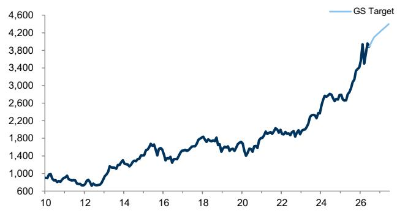

line chart

| Year | GS Target |
|------|-----------|
| 10   | 1,000     |
| 12   | 900       |
| 14   | 1,300     |
| 16   | 1,800     |
| 18   | 1,900     |
| 20   | 1,700     |
| 22   | 2,000     |
| 24   | 2,600     |
| 26   | 3,800     |
| 27   | 4,500     |

Source: FactSet, GS Global Investment Research

Exhibit 11: GS Top-down earnings forecast (TOPIX)  
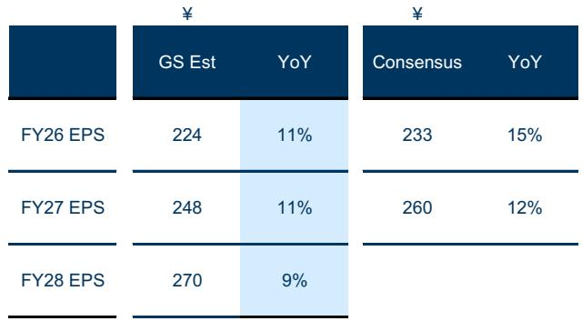

table

| Period | GS Est | YoY (%) |
| :--- | :--- | :--- |
| FY26 EPS | 224 | 11 |
| FY27 EPS | 248 | 11 |
| FY28 EPS | 270 | 9 |
| Consensus | 233 | 15 |
| YoY | 260 | 12 |

Our FY26-FY28 USD/JPY rate assumption is 157/154/150  
Source: I/B/E/S, Toyo Keizai, GS Global Investment Research

Exhibit 12: GS Global Equity Forecasts

<table><tr><td rowspan="2">Index</td><td rowspan="2">Price</td><td colspan="3">GS Target</td><td colspan="3">%-to Target</td></tr><tr><td>3M</td><td>6M</td><td>12M</td><td>3M</td><td>6M</td><td>12M</td></tr><tr><td>TOPIX</td><td>3,882</td><td>4,100</td><td>4,200</td><td>4,400</td><td>6%</td><td>8%</td><td>13%</td></tr><tr><td>S&amp;P500</td><td>7,394</td><td>7,600</td><td>8,000</td><td>8,300</td><td>3%</td><td>8%</td><td>12%</td></tr><tr><td>Stoxx Europe 600</td><td>622</td><td>640</td><td>645</td><td>660</td><td>3%</td><td>4%</td><td>6%</td></tr><tr><td>MXAPJ</td><td>856</td><td>980</td><td>1,030</td><td>1,080</td><td>15%</td><td>20%</td><td>26%</td></tr></table>

Notes: as of Jun.11 for foreign indices

Exhibit 13: Sector recommendation

<table><tr><td>Overweight</td><td>Underweight</td></tr><tr><td>Machinery</td><td>Electric Power &amp; Gas</td></tr><tr><td>IT &amp; Services</td><td>Foods</td></tr><tr><td>Banks</td><td>Pharmaceuticals</td></tr><tr><td>Electrical Appliance &amp; Precision</td><td>Transport &amp; Logistics</td></tr><tr><td>Steel &amp; Nonferrous</td><td></td></tr><tr><td colspan="2">Neutral</td></tr><tr><td>Construction &amp; Material</td><td>Automobiles &amp; Parts</td></tr><tr><td>Financials Ex Banks</td><td>Energy Resource</td></tr><tr><td>Raw Materials &amp; Chemicals</td><td>Real Estate</td></tr><tr><td>Commercial &amp; Wholesale</td><td></td></tr><tr><td>Retail</td><td></td></tr></table>

Source: FactSet, GS Global Investment Research.  
Source: GS Global Investment Research

Exhibit 14: GS top-down vs. consensus bottom-up estimates of FY2026 EPS growth  
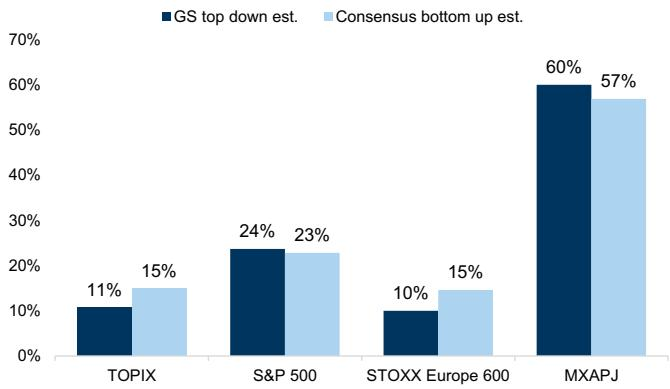

bar chart

| Index | GS top down est. (%) | Consensus bottom up est. (%) |
| :--- | :--- | :--- |
| TOPIX | 11 | 15 |
| S&P 500 | 24 | 23 |
| STOXX Europe 600 | 10 | 15 |
| MXAPJ | 60 | 57 |

Source: I/B/E/S, Toyo Keizai, MSCI, GS Global Investment Research

Exhibit 15: GS top-down vs. consensus bottom-up estimates of FY2027 EPS growth  
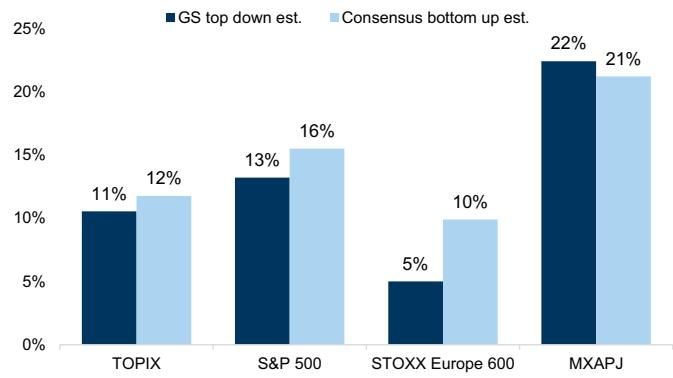

bar chart

| Index | GS top down est. (%) | Consensus bottom up est. (%) |
| :--- | :--- | :--- |
| TOPIX | 11 | 12 |
| S&P 500 | 13 | 16 |
| STOXX Europe 600 | 5 | 10 |
| MXAPJ | 22 | 21 |

Source: I/B/E/S, Toyo Keizai, MSCI, GS Global Investment Research

## Valuation/Performance

Exhibit 16: TOPIX 12-month forward P/E  
Consensus  
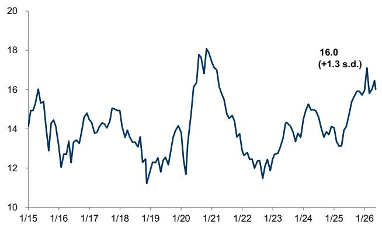

line chart

| Date   | Value |
|--------|-------|
| 1/26   | 16.0  |

Source: I/B/E/S, FactSet, GS Global Investment Research

Exhibit 17: TOPIX P/B  
Actual  
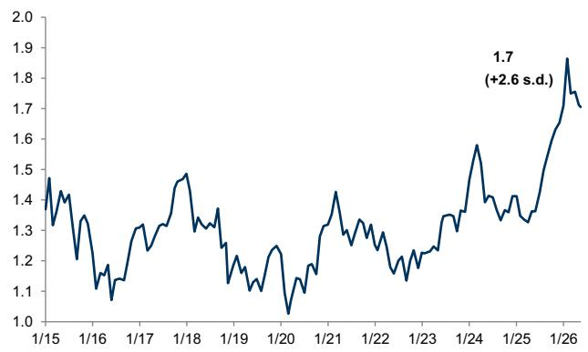

line chart

| Date   | Value |
|--------|-------|
| 1/26   | 1.7   |

Source: Toyo Keizai, FactSet, GS Global Investment Research

Exhibit 18: TOPIX  
Index  
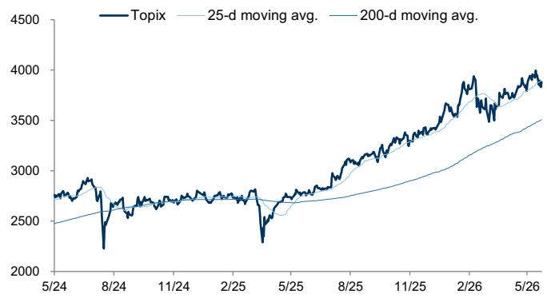

line chart

| Date   | Topix | 25-d moving avg. | 200-d moving avg. |
|--------|-------|------------------|-------------------|
| 5/24   | ~2800 | ~2700            | ~2500             |
| 8/24   | ~2300 | ~2600            | ~2600             |
| 11/24  | ~2700 | ~2700            | ~2700             |
| 2/25   | ~2800 | ~2700            | ~2700             |
| 5/25   | ~2300 | ~2600            | ~2700             |
| 8/25   | ~3000 | ~3000            | ~2800             |
| 11/25  | ~3500 | ~3300            | ~3000             |
| 2/26   | ~3900 | ~3700            | ~3300             |
| 5/26   | ~4000 | ~3900            | ~3500             |

Source: FactSet, GS Global Investment Research

Exhibit 19: Global equity indices  
Indexed, local currency  
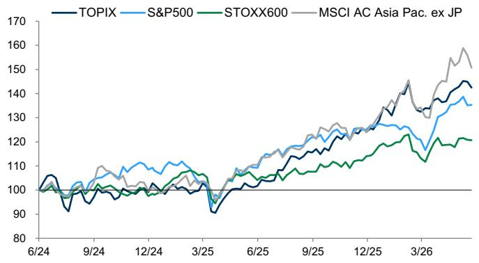

line chart

| Date   | TOPIX | S&P500 | STOXX600 | MSCI AC Asia Pac. ex JP |
|--------|-------|--------|----------|--------------------------|
| 6/24   | 105   | 102    | 101      | 103                      |
| 9/24   | 108   | 106    | 103      | 107                      |
| 12/24  | 110   | 108    | 105      | 109                      |
| 3/25   | 95    | 105    | 102      | 104                      |
| 6/25   | 115   | 112    | 108      | 113                      |
| 9/25   | 125   | 122    | 115      | 123                      |
| 12/25  | 135   | 132    | 120      | 133                      |
| 3/26   | 145   | 142    | 125      | 143                      |
| 6/26   | 148   | 145    | 128      | 147                      |

Source: FactSet, GS Global Investment Research

Exhibit 20: Major domestic indices performance

<table><tr><td colspan="2">As of Jun.12</td><td colspan="4">Price Return (%)</td><td colspan="2">% above/below</td></tr><tr><td></td><td>Index</td><td>1-wk</td><td>1-mo</td><td>3-mo</td><td>1-yr</td><td>25-d</td><td>200-d</td></tr><tr><td>TOPIX</td><td>3,882</td><td>-1.7</td><td>0.2</td><td>6.4</td><td>39.5</td><td>-0.3</td><td>10.7</td></tr><tr><td>NK225</td><td>66,020</td><td>-0.9</td><td>5.2</td><td>21.2</td><td>72.9</td><td>2.8</td><td>24.8</td></tr><tr><td>TOPIX100</td><td>2,653</td><td>-2.0</td><td>0.6</td><td>7.0</td><td>40.0</td><td>-0.3</td><td>11.0</td></tr><tr><td>TOPIX MID 400</td><td>3,939</td><td>-0.9</td><td>-0.3</td><td>5.7</td><td>39.2</td><td>-0.0</td><td>10.5</td></tr><tr><td>TOPIX Small</td><td>4,351</td><td>-1.6</td><td>-1.5</td><td>2.6</td><td>36.5</td><td>-1.2</td><td>8.0</td></tr><tr><td>TSE Prime</td><td>1,976</td><td>-3.0</td><td>-1.1</td><td>5.0</td><td>37.9</td><td>-1.6</td><td>9.3</td></tr><tr><td>TSE Standard</td><td>1,578</td><td>-3.1</td><td>-6.6</td><td>-7.0</td><td>15.8</td><td>-3.8</td><td>-0.2</td></tr><tr><td>TSE Growth</td><td>927</td><td>-5.4</td><td>-11.7</td><td>-6.0</td><td>-5.0</td><td>-8.2</td><td>-3.5</td></tr><tr><td>TSE REIT</td><td>1,796</td><td>2.5</td><td>-2.7</td><td>-8.4</td><td>1.6</td><td>-0.2</td><td>-7.5</td></tr><tr><td>TPX 500 Value</td><td>4,760</td><td>-1.4</td><td>1.5</td><td>7.2</td><td>51.8</td><td>0.1</td><td>13.2</td></tr><tr><td>TPX 500 Growth</td><td>4,377</td><td>-2.0</td><td>-0.9</td><td>6.0</td><td>28.0</td><td>-0.5</td><td>8.7</td></tr><tr><td>TPX Small Cap Value</td><td>6,528</td><td>-0.8</td><td>-0.0</td><td>4.1</td><td>47.9</td><td>-0.3</td><td>11.6</td></tr><tr><td>TPX Small Cap Growth</td><td>3,970</td><td>-2.5</td><td>-3.1</td><td>1.0</td><td>25.3</td><td>-2.2</td><td>4.5</td></tr></table>

Source: FactSet, GS Global Investment Research

Exhibit 21: Major overseas indices performance

<table><tr><td colspan="2">As of Jun.11</td><td colspan="4">Price Return (%)</td><td colspan="2">% above/below</td></tr><tr><td></td><td>Index</td><td>1-wk</td><td>1-mo</td><td>3-mo</td><td>1-yr</td><td>25-d</td><td>200-d</td></tr><tr><td colspan="8">US</td></tr><tr><td>S&amp;P 500</td><td>7,394</td><td>0.1</td><td>-0.3</td><td>9.1</td><td>22.8</td><td>-0.8</td><td>7.5</td></tr><tr><td>NASDAQ</td><td>25,810</td><td>0.4</td><td>-1.8</td><td>13.6</td><td>31.6</td><td>-1.9</td><td>10.3</td></tr><tr><td colspan="8">Europe</td></tr><tr><td>EURO STOXX 600</td><td>622</td><td>-0.2</td><td>1.4</td><td>3.2</td><td>12.7</td><td>0.3</td><td>4.9</td></tr><tr><td>FTSE 100</td><td>10,304</td><td>-0.6</td><td>0.3</td><td>-0.5</td><td>16.2</td><td>-0.4</td><td>3.2</td></tr><tr><td>DAX 30</td><td>24,210</td><td>-2.2</td><td>-0.6</td><td>2.4</td><td>1.1</td><td>-1.8</td><td>0.1</td></tr><tr><td colspan="8">Asia</td></tr><tr><td>MSCI AC AP ex JP</td><td>856</td><td>-3.3</td><td>-3.3</td><td>9.6</td><td>34.5</td><td>-20.0</td><td>-6.7</td></tr><tr><td>Hang Seng</td><td>24,249</td><td>-2.9</td><td>-8.2</td><td>-6.4</td><td>-0.5</td><td>-5.1</td><td>-6.8</td></tr><tr><td>CSI 300</td><td>4,722</td><td>-2.0</td><td>-4.6</td><td>0.4</td><td>21.3</td><td>-3.0</td><td>1.9</td></tr><tr><td>KOSPI</td><td>7,764</td><td>-4.9</td><td>-0.7</td><td>38.4</td><td>167.1</td><td>-1.6</td><td>55.9</td></tr><tr><td>Straits Times</td><td>4,988</td><td>-1.2</td><td>0.9</td><td>2.6</td><td>27.3</td><td>-0.5</td><td>6.0</td></tr></table>

Source: FactSet, GS Global Investment Research

## Flows/Positioning/Earnings Momentum

Exhibit 22: TSE net equity transaction by investor type ¥ billion  
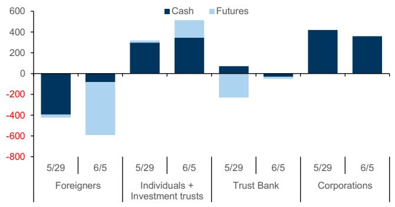

stacked bar chart

| Category | Period | Cash ($) | Futures ($) |
| :--- | :--- | :--- | :--- |
| Foreigners | 5/29 | -400 | -400 |
| Foreigners | 6/5 | -100 | -600 |
| Individuals + Investment trusts | 5/29 | 300 | 100 |
| Individuals + Investment trusts | 6/5 | 350 | 150 |
| Trust Bank | 5/29 | 80 | -200 |
| Trust Bank | 6/5 | -20 | -10 |
| Corporations | 5/29 | 420 | 0 |
| Corporations | 6/5 | 370 | 0 |

Source: JPX

Exhibit 23: TSE net equity transaction by investor type ¥ billion

<table><tr><td rowspan="2" colspan="2"></td><td colspan="4">Weekly</td><td colspan="4">Monthly</td><td rowspan="2">2026 YTD</td></tr><tr><td>5/15</td><td>5/22</td><td>5/29</td><td>6/05</td><td>2/26</td><td>3/26</td><td>4/26</td><td>5/26</td></tr><tr><td rowspan="4">Cash</td><td>Foreigners</td><td>557</td><td>461</td><td>-395</td><td>-81</td><td>2841</td><td>-2281</td><td>5696</td><td>1858</td><td>10390</td></tr><tr><td>Individuals + Investment</td><td>202</td><td>-102</td><td>299</td><td>344</td><td>-2410</td><td>1657</td><td>-543</td><td>-372</td><td>-1251</td></tr><tr><td>Trust Bank</td><td>-242</td><td>-210</td><td>71</td><td>-31</td><td>-2524</td><td>-1520</td><td>6</td><td>-434</td><td>-5472</td></tr><tr><td>Corporations</td><td>213</td><td>277</td><td>419</td><td>359</td><td>809</td><td>546</td><td>267</td><td>835</td><td>3561</td></tr><tr><td rowspan="4">Futures</td><td>Foreigners</td><td>-752</td><td>-43</td><td>-28</td><td>-510</td><td>1724</td><td>-1368</td><td>-2236</td><td>-909</td><td>-4970</td></tr><tr><td>Individuals + Investment</td><td>183</td><td>-33</td><td>20</td><td>169</td><td>288</td><td>150</td><td>379</td><td>19</td><td>850</td></tr><tr><td>Trust Bank</td><td>119</td><td>121</td><td>-231</td><td>-20</td><td>-18</td><td>945</td><td>401</td><td>17</td><td>1355</td></tr><tr><td>Corporations</td><td>51</td><td>-20</td><td>2</td><td>-5</td><td>-21</td><td>6</td><td>-18</td><td>36</td><td>-1</td></tr></table>

Source: JPX

Exhibit 24: Cumulative announced buyback
JPY tn, as of Jun 4 2026  
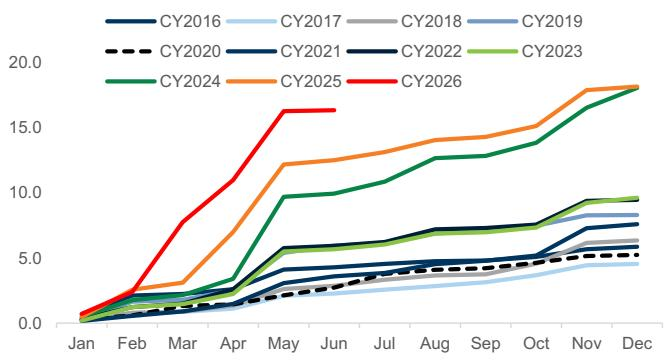

line chart

| Month | CY2016 | CY2017 | CY2018 | CY2019 | CY2020 | CY2021 | CY2022 | CY2023 | CY2024 | CY2025 | CY2026 |
|-------|--------|--------|--------|--------|--------|--------|--------|--------|--------|--------|--------|
| Jan   | 0.5    | 0.5    | 0.5    | 0.5    | 0.5    | 0.5    | 0.5    | 0.5    | 0.5    | 0.5    | 0.5    |
| Feb   | 1.0    | 1.0    | 1.0    | 1.0    | 1.0    | 1.0    | 1.0    | 1.0    | 1.0    | 1.0    | 1.0    |
| Mar   | 1.5    | 1.5    | 1.5    | 1.5    | 1.5    | 1.5    | 1.5    | 1.5    | 1.5    | 1.5    | 1.5    |
| Apr   | 2.0    | 2.0    | 2.0    | 2.0    | 2.0    | 2.0    | 2.0    | 2.0    | 2.0    | 2.0    | 2.0    |
| May   | 3.0    | 3.0    | 3.0    | 3.0    | 3.0    | 3.0    | 3.0    | 3.0    | 3.0    | 3.0    | 3.0    |
| Jun   | 4.0    | 4.0    | 4.0    | 4.0    | 4.0    | 4.0    | 4.0    | 4.0    | 4.0    | 4.0    | 4.0    |
| Jul   | 5.0    | 5.0    | 5.0    | 5.0    | 5.0    | 5.0    | 5.0    | 5.0    | 5.0    | 5.0    | 5.0    |
| Aug   | 6.0    | 6.0    | 6.0    | 6.0    | 6.0    | 6.0    | 6.0    | 6.0    | 6.0    | 6.0    | 6.0    |
| Sep   | 7.0    | 7.0    | 7.0    | 7.0    | 7.0    | 7.0    | 7.0    | 7.0    | 7.0    | 7.0    | 7.0    |
| Oct   | 8.0    | 8.0    | 8.0    | 8.0    | 8.0    | 8.0    | 8.0    | 8.0    | 8.0    | 8.0    | 8.0    |
| Nov   | 9.0    | 9.0    | 9.0    | 9.0    | 9.0    | 9.0    | 9.0    | 9.0    | 9.0    | 9.0    | 9.0    |
| Dec   | 18.0   | 18.0   | 18.0   | 18.0   | 18.0   | 18.0   | 18.0   | 18.0   | 18.0   | 18.0   | 18.0   |

Source: Nikkei Value Search, Data compiled by GS Global Investment Research

Exhibit 25: Margin transaction ¥ billions; Index  
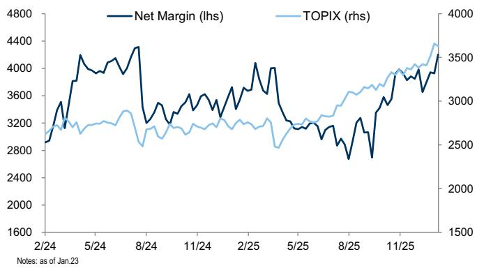

line chart

| Date   | Net Margin (lhs) | TOPIX (rhs) |
|--------|------------------|-------------|
| 2/24   | ~3200            | ~2800       |
| 5/24   | ~4000            | ~3000       |
| 8/24   | ~3200            | ~2800       |
| 11/24  | ~3600            | ~3000       |
| 2/25   | ~4000            | ~3200       |
| 5/25   | ~3200            | ~3000       |
| 8/25   | ~2800            | ~3200       |
| 11/25  | ~3600            | ~3500       |

Source: JPX

Exhibit 26: TOPIX earnings revision index
Indexed  
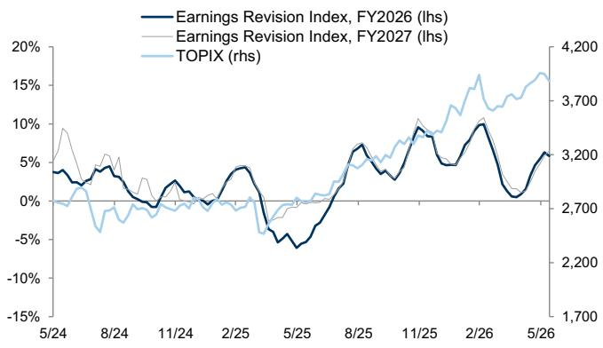

line chart

| Date   | Earnings Revision Index, FY2026 (lhs) | Earnings Revision Index, FY2027 (lhs) | TOPIX (rhs) |
|--------|----------------------------------------|----------------------------------------|-------------|
| 5/24   | ~3%                                    | ~10%                                   | ~2,700      |
| 8/24   | ~-5%                                   | ~-5%                                   | ~2,700      |
| 11/24  | ~-5%                                   | ~-5%                                   | ~2,700      |
| 2/25   | ~-5%                                   | ~-5%                                   | ~2,700      |
| 5/25   | ~-10%                                  | ~-5%                                   | ~2,700      |
| 8/25   | ~10%                                   | ~10%                                   | ~3,700      |
| 11/25  | ~15%                                   | ~15%                                   | ~3,700      |
| 2/26   | ~10%                                   | ~10%                                   | ~3,700      |
| 5/26   | ~6%                                    | ~6%                                    | ~3,700      |

Source: FactSet, GS Global Investment Research

Exhibit 27: Global earnings revision index indexed, FY2026  
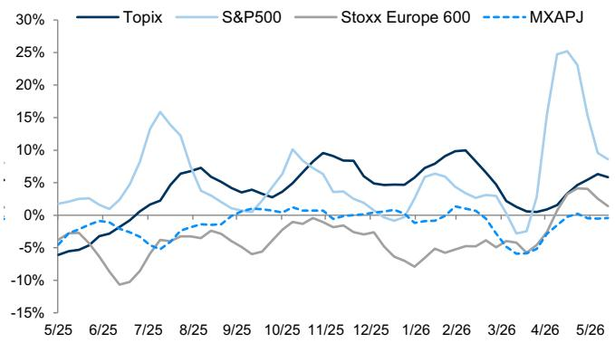

line chart

| Date   | Topix | S&P500 | Stoxx Europe 600 | MXAPJ |
|--------|-------|--------|------------------|-------|
| 5/25   | -5%   | 2%     | -5%              | -2%   |
| 6/25   | -3%   | 1%     | -8%              | -1%   |
| 7/25   | 0%    | 15%    | -10%             | -3%   |
| 8/25   | 7%    | 10%    | -5%              | -2%   |
| 9/25   | 4%    | 5%     | -3%              | -1%   |
| 10/25  | 3%    | 10%    | -2%              | 0%    |
| 11/25  | 8%    | 5%     | -1%              | 1%    |
| 12/25  | 6%    | 3%     | -2%              | 0%    |
| 1/26   | 4%    | 5%     | -5%              | -1%   |
| 2/26   | 10%   | 3%     | -3%              | 1%    |
| 3/26   | 3%    | -5%    | -2%              | -3%   |
| 4/26   | 1%    | 25%    | -1%              | -5%   |
| 5/26   | 6%    | 10%    | 2%               | -1%   |

Earnings forecast revision index = (no. of analyst upward revisions for past 1 mo. - no. of downward revisions) / Total no. of forecasts.  
Source: FactSet, GS Global Investment Research

## Style/Baskets

Exhibit 28: Style analysis: Value vs. Growth, Size  
MSCI Japan Value / MSCI Japan Growth, Topix Large 100 / Mid 400  
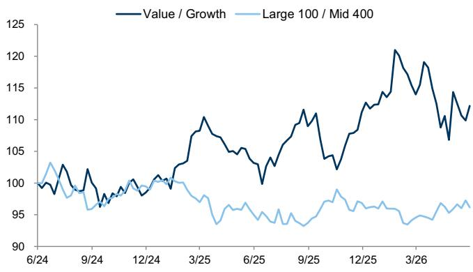

line chart

| Date   | Value / Growth | Large 100 / Mid 400 |
|--------|----------------|---------------------|
| 6/24   | 100            | 103                 |
| 9/24   | 98             | 96                  |
| 12/24  | 101            | 100                 |
| 3/25   | 110            | 97                  |
| 6/25   | 105            | 95                  |
| 9/25   | 110            | 94                  |
| 12/25  | 115            | 96                  |
| 3/26   | 120            | 95                  |
| 6/26   | 115            | 96                  |

Source: Bloomberg, GS Global Investment Research

Exhibit 29: Style analysis: Cyclical / Defensive  
Relative Performance  
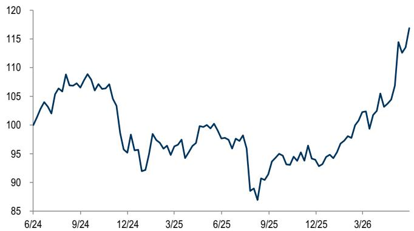

line chart

| Date   | Value |
|--------|-------|
| 6/24   | 100   |
| 9/24   | 108   |
| 12/24  | 95    |
| 3/25   | 98    |
| 6/25   | 100   |
| 9/25   | 87    |
| 12/25  | 95    |
| 3/26   | 105   |
| 6/26   | 115   |
| 9/26   | 118   |

Source: FactSet, GS Global Investment Research

Exhibit 30: Japan Portfolio Strategy Baskets performance

<table><tr><td rowspan="2">BBG Ticker</td><td rowspan="2">Name</td><td colspan="4">Performance %</td><td colspan="4">Topix Relative %</td></tr><tr><td>1w</td><td>1M</td><td>3M</td><td>YTD</td><td>1w</td><td>1M</td><td>3M</td><td>YTD</td></tr><tr><td>TPX</td><td>Topix Index (Tokyo)</td><td>-1.7</td><td>0</td><td>6</td><td>14</td><td></td><td></td><td></td><td></td></tr><tr><td colspan="10">Thematic Basket</td></tr><tr><td>GSJPDFSE</td><td>Defense</td><td>-6.3</td><td>-11</td><td>-12</td><td>4</td><td>-4.6</td><td>-11</td><td>-19</td><td>-10</td></tr><tr><td>GSJPCRTR</td><td>Critical Resources</td><td>-6.0</td><td>-15</td><td>-3</td><td>26</td><td>-4.3</td><td>-15</td><td>-9</td><td>12</td></tr><tr><td>GSJPCRTT</td><td>Critical Tech</td><td>-3.3</td><td>7</td><td>28</td><td>33</td><td>-1.6</td><td>7</td><td>22</td><td>19</td></tr><tr><td>GSJPCYCL</td><td>Japan Cyclicals</td><td>-3.3</td><td>-4</td><td>3</td><td>14</td><td>-1.6</td><td>-4</td><td>-4</td><td>0</td></tr><tr><td>GSJPDFSV</td><td>Japan Defensives</td><td>-1.3</td><td>-1</td><td>1</td><td>1</td><td>0.4</td><td>-1</td><td>-5</td><td>-12</td></tr><tr><td>GSJPMFOW</td><td>Foreign Funds Overweight</td><td>-1.8</td><td>1</td><td>7</td><td>13</td><td>-0.1</td><td>1</td><td>0</td><td>-1</td></tr><tr><td>GSJPMFUW</td><td>Foreign Funds Underweight</td><td>-0.1</td><td>-1</td><td>1</td><td>12</td><td>1.6</td><td>-1</td><td>-5</td><td>-2</td></tr><tr><td colspan="10">Regional Basket</td></tr><tr><td>GSJPINTR</td><td>International stocks</td><td>-5.1</td><td>9</td><td>29</td><td>36</td><td>-3.4</td><td>9</td><td>22</td><td>22</td></tr><tr><td>GSJPDOMS</td><td>Domestic-demand</td><td>-0.0</td><td>-1</td><td>-1</td><td>-5</td><td>1.7</td><td>-1</td><td>-8</td><td>-19</td></tr><tr><td>GSJPAMRC</td><td>America-exposed</td><td>-4.4</td><td>3</td><td>11</td><td>18</td><td>-2.7</td><td>3</td><td>5</td><td>4</td></tr><tr><td>GSJPEURP</td><td>Europe-exposed</td><td>-6.0</td><td>-1</td><td>9</td><td>14</td><td>-4.3</td><td>-2</td><td>3</td><td>0</td></tr><tr><td>GSJPASIA</td><td>Asia-exposed</td><td>-2.6</td><td>1</td><td>22</td><td>45</td><td>-0.9</td><td>1</td><td>15</td><td>31</td></tr><tr><td>GSJPCHCS</td><td>China-Consumption</td><td>1.1</td><td>0</td><td>2</td><td>9</td><td>2.8</td><td>0</td><td>-4</td><td>-5</td></tr><tr><td>GSJPCHID</td><td>China-Industrial</td><td>-2.9</td><td>6</td><td>26</td><td>49</td><td>-1.2</td><td>5</td><td>19</td><td>36</td></tr><tr><td colspan="10">FX/Oil Basket</td></tr><tr><td>GSJPFXW1</td><td>Weak yen</td><td>-3.1</td><td>-2</td><td>14</td><td>29</td><td>-1.4</td><td>-2</td><td>8</td><td>15</td></tr><tr><td>GSJPFXS1</td><td>Strong yen</td><td>-0.6</td><td>-0</td><td>-1</td><td>-12</td><td>1.1</td><td>-0</td><td>-8</td><td>-25</td></tr><tr><td>GSJPHOIL</td><td>High oil</td><td>-3.3</td><td>-11</td><td>-15</td><td>10</td><td>-1.6</td><td>-12</td><td>-21</td><td>-4</td></tr></table>

Source: Bloomberg, GS Global Investment Research

Exhibit 31: Strategy Baskets performance (1)  
TOPIX relative  
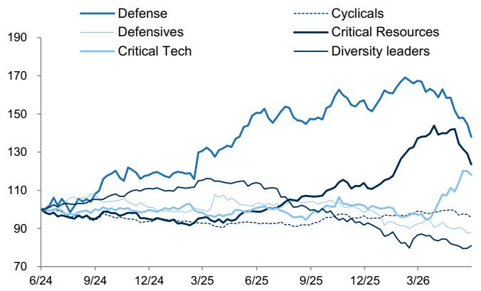

line chart

| Date | Defense | Defensives | Critical Tech | Critical Resources | Diversity leaders |
| --- | --- | --- | --- | --- | --- |
| 6/24 | 100 | 100 | 100 | 100 | 100 |
| 9/24 | 110 | 105 | 102 | 103 | 104 |
| 12/24 | 115 | 108 | 104 | 106 | 107 |
| 3/25 | 120 | 110 | 106 | 108 | 109 |
| 6/25 | 130 | 112 | 108 | 110 | 112 |
| 9/25 | 140 | 115 | 110 | 112 | 115 |
| 12/25 | 150 | 120 | 112 | 115 | 120 |
| 3/26 | 160 | 125 | 115 | 120 | 125 |
| 6/26 | 170 | 130 | 120 | 125 | 130 |
| 9/26 | 180 | 135 | 125 | 130 | 135 |
| 12/26 | 190 | 140 | 130 | 135 | 140 |
| 3/27 | 180 | 135 | 135 | 130 | 135 |
| 6/27 | 170 | 130 | 140 | 125 | 130 |
| 9/27 | 160 | 125 | 145 | 120 | 125 |
| 12/27 | 150 | 120 | 150 | 115 | 120 |
| 3/28 | 140 | 115 | 155 | 110 | 115 |
| 6/28 | 130 | 110 | 160 | 105 | 110 |
| 9/28 | 120 | 105 | 165 | 100 | 105 |
| 12/28 | 110 | 100 | 170 | 95 | 100 |
| 3/29 | 100 | 95 | 175 | 90 | 95 |
| 6/29 | 90 | 90 | 180 | 85 | 90 |
| 9/29 | 80 | 85 | 185 | 80 | 85 |
| 12/29 | 70 | 80 | 190 | 75 | 80 |
| 3/30 | 60 | 75 | 195 | 70 | 75 |
| 6/30 | 50 | 70 | 200 | 65 | 70 |
| 9/30 | 40 | 65 | 205 | 60 | 65 |
| 12/30 | 30 | 60 | 210 | 55 | 60 |
| 3/31 | 20 | 55 | 215 | 50 | 55 |
| 6/31 | 10 | 50 | 220 | 45 | 50 |
| 9/31 | - | - | - | - | - |
| End | - | - | - | - | - |
| Peak | - | - | - | - | - |
| End | - | - | - | - | - |
| Peak | - | - | - | - | - |
| End | - | - | - | - | - |
| Peak | - | - | - | - | - |

Source: Bloomberg, GS Global Investment Research

Exhibit 32: Strategy Baskets performance (2)  
TOPIX relative  
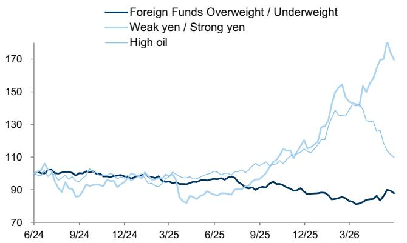

line chart

| Date   | Foreign Funds Overweight / Underweight | Weak yen / Strong yen | High oil |
|--------|----------------------------------------|------------------------|----------|
| 6/24   | ~100                                   | ~100                   | ~100     |
| 9/24   | ~100                                   | ~100                   | ~100     |
| 12/24  | ~100                                   | ~100                   | ~100     |
| 3/25   | ~100                                   | ~100                   | ~100     |
| 6/25   | ~100                                   | ~100                   | ~100     |
| 9/25   | ~100                                   | ~100                   | ~100     |
| 12/25  | ~100                                   | ~100                   | ~100     |
| 3/26   | ~100                                   | ~100                   | ~100     |
| 6/26   | ~95                                    | ~175                   | ~110     |

Source: Bloomberg, GS Global Investment Research

Exhibit 33: Strategy Baskets performance (3)  
TOPIX relative  
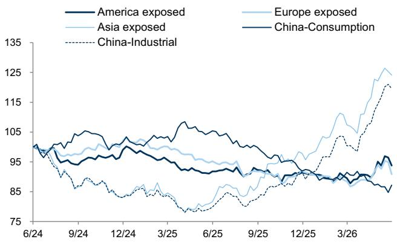

line chart

| Date   | America exposed | Asia exposed | Europe exposed | China-Consumption | China-Industrial |
|--------|-----------------|--------------|----------------|-------------------|-----------------|
| 6/24   | 98              | 98           | 98             | 98                | 98              |
| 9/24   | 95              | 95           | 95             | 95                | 95              |
| 12/24  | 97              | 97           | 97             | 97                | 97              |
| 3/25   | 96              | 96           | 96             | 96                | 96              |
| 6/25   | 94              | 94           | 94             | 94                | 94              |
| 9/25   | 92              | 92           | 92             | 92                | 92              |
| 12/25  | 90              | 90           | 90             | 90                | 90              |
| 3/26   | 88              | 88           | 88             | 88                | 88              |
| Final  | 90              | 125          | 125            | 125               | 125             |

Source: Bloomberg, GS Global Investment Research

## Sector Performance/Revisions/Valuations

Exhibit 34: Sector Performance (Topix Relative, 1-week, %)  
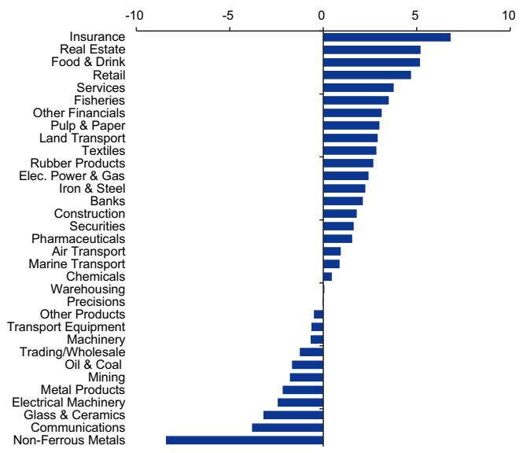

bar chart

| Sector | Value |
| :--- | :--- |
| Insurance | 7.5 |
| Real Estate | 6.0 |
| Food & Drink | 6.0 |
| Retail | 5.0 |
| Services | 4.0 |
| Fisheries | 3.5 |
| Other Financials | 3.0 |
| Pulp & Paper | 3.0 |
| Land Transport | 3.0 |
| Textiles | 3.0 |
| Rubber Products | 3.0 |
| Elec. Power & Gas | 2.5 |
| Iron & Steel | 2.5 |
| Banks | 2.5 |
| Construction | 2.0 |
| Securities | 2.0 |
| Pharmaceuticals | 2.0 |
| Air Transport | 1.5 |
| Marine Transport | 1.5 |
| Chemicals | 0.5 |
| Warehousing | 0.5 |
| Precisions | 0.5 |
| Other Products | -0.5 |
| Transport Equipment | -0.5 |
| Machinery | -0.5 |
| Trading/Wholesale | -1.0 |
| Oil & Coal | -1.5 |
| Mining | -2.0 |
| Metal Products | -2.5 |
| Electrical Machinery | -3.0 |
| Glass & Ceramics | -3.5 |
| Communications | -4.0 |
| Non-Ferrous Metals | -8.0 |

Source: FactSet, GS Global Investment Research

Exhibit 35: Sector earnings revision momentum/ranking
Past 1M, FY2026  
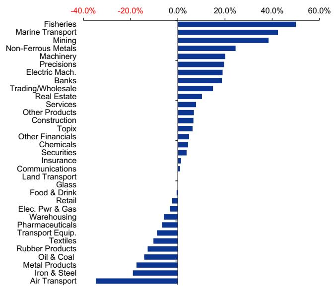

bar chart

| Sector | Value (%) |
| :--- | :--- |
| Fisheries | 50.0 |
| Marine Transport | 45.0 |
| Mining | 40.0 |
| Non-Ferrous Metals | 25.0 |
| Machinery | 20.0 |
| Precisions | 18.0 |
| Electric Mach. | 17.0 |
| Banks | 16.0 |
| Trading/Wholesale | 13.0 |
| Real Estate | 10.0 |
| Services | 8.0 |
| Other Products | 7.0 |
| Construction | 6.0 |
| Topix | 5.0 |
| Other Financials | 4.0 |
| Chemicals | 3.0 |
| Securities | 2.0 |
| Insurance | 1.0 |
| Communications | 0.5 |
| Land Transport | 0.3 |
| Glass | 0.2 |
| Food & Drink | -0.5 |
| Retail | -1.0 |
| Elec. Pwr & Gas | -1.5 |
| Warehousing | -2.0 |
| Pharmaceuticals | -2.5 |
| Transport Equip. | -3.0 |
| Textiles | -3.5 |
| Rubber Products | -4.0 |
| Oil & Coal | -4.5 |
| Metal Products | -5.0 |
| Iron & Steel | -5.5 |
| Air Transport | -60.0 |

Source: I/B/E/S, FactSet, GS Global Investment Research

Exhibit 36: Price performance, valuations, recurring profit growth and contribution

<table><tr><td rowspan="2">Sector</td><td colspan="4">Price Return (%)</td><td colspan="2">%-above / below average</td><td colspan="3">P/E (x)</td><td>P/B (x)</td><td>EV/ EBITDA (x)</td><td>Div Yield (%)</td><td>ROE (%)</td><td colspan="2">RP YoY Growth FY3/2026</td><td colspan="2">RP YoY Growth FY3/2027</td></tr><tr><td>1w</td><td>1M</td><td>3M</td><td>1Yr</td><td>25D</td><td>200D</td><td>FY1</td><td>FY2</td><td>NTM</td><td>FY0</td><td>FY1</td><td>FY1</td><td>FY1</td><td>YoY</td><td>Cntrb.</td><td>YoY</td><td>Cntrb.</td></tr><tr><td>Fisheries</td><td>1.8</td><td>5.5</td><td>-5.8</td><td>30.0</td><td>0</td><td>0</td><td>13.4</td><td>12.9</td><td>13.9</td><td>1.0</td><td>8.8</td><td>2.6</td><td>7.4</td><td>12.0</td><td>0.1</td><td>-0.9</td><td>-0.0</td></tr><tr><td>Mining</td><td>-3.5</td><td>-11.2</td><td>-19.1</td><td>69.9</td><td>-5</td><td>1</td><td>9.9</td><td>12.4</td><td>10.9</td><td>0.9</td><td>3.4</td><td>3.0</td><td>8.7</td><td>-8.6</td><td>-1.2</td><td>15.7</td><td>1.6</td></tr><tr><td>Construction</td><td>0.1</td><td>-13.7</td><td>-11.7</td><td>35.2</td><td>-3</td><td>-4</td><td>13.4</td><td>12.5</td><td>13.1</td><td>1.4</td><td>9.4</td><td>3.4</td><td>10.6</td><td>26.9</td><td>7.1</td><td>-0.4</td><td>-0.1</td></tr><tr><td>Food &amp; Drink</td><td>3.5</td><td>1.6</td><td>4.6</td><td>18.6</td><td>1</td><td>6</td><td>17.5</td><td>19.0</td><td>18.2</td><td>1.8</td><td>10.2</td><td>2.8</td><td>10.0</td><td>29.2</td><td>6.1</td><td>14.3</td><td>3.0</td></tr><tr><td>Textiles</td><td>1.1</td><td>-3.1</td><td>-0.4</td><td>20.4</td><td>0</td><td>4</td><td>14.8</td><td>15.8</td><td>15.1</td><td>1.0</td><td>7.4</td><td>2.8</td><td>6.9</td><td>13.6</td><td>0.3</td><td>78.3</td><td>1.3</td></tr><tr><td>Pulp &amp; Paper</td><td>1.3</td><td>-1.9</td><td>-7.3</td><td>23.9</td><td>-1</td><td>0</td><td>16.0</td><td>14.3</td><td>15.5</td><td>0.6</td><td>8.7</td><td>3.6</td><td>3.7</td><td>-7.1</td><td>-0.1</td><td>15.2</td><td>0.2</td></tr><tr><td>Chemicals</td><td>-1.2</td><td>0.4</td><td>8.6</td><td>36.6</td><td>0</td><td>14</td><td>18.7</td><td>17.4</td><td>18.3</td><td>1.6</td><td>8.9</td><td>2.2</td><td>8.3</td><td>-0.4</td><td>-0.2</td><td>20.9</td><td>7.0</td></tr><tr><td>Pharmaceuticals</td><td>-0.2</td><td>-5.9</td><td>-12.3</td><td>7.0</td><td>-4</td><td>-5</td><td>20.1</td><td>17.4</td><td>19.2</td><td>1.9</td><td>10.6</td><td>2.8</td><td>9.4</td><td>10.4</td><td>2.3</td><td>34.2</td><td>6.5</td></tr><tr><td>Oil &amp; Coal</td><td>-3.4</td><td>-8.9</td><td>-9.6</td><td>56.9</td><td>-4</td><td>2</td><td>10.3</td><td>10.5</td><td>10.3</td><td>0.9</td><td>6.4</td><td>2.9</td><td>8.4</td><td>83.8</td><td>3.9</td><td>30.8</td><td>2.1</td></tr><tr><td>Rubber Products</td><td>1.0</td><td>4.6</td><td>1.0</td><td>22.9</td><td>2</td><td>-0</td><td>12.2</td><td>11.3</td><td>11.7</td><td>1.1</td><td>5.4</td><td>3.5</td><td>9.2</td><td>6.3</td><td>0.5</td><td>22.7</td><td>1.4</td></tr><tr><td>Glass &amp; Ceramics</td><td>-4.9</td><td>4.4</td><td>22.7</td><td>94.1</td><td>1</td><td>31</td><td>21.0</td><td>18.9</td><td>20.2</td><td>1.6</td><td>9.2</td><td>2.0</td><td>7.6</td><td>57.4</td><td>3.0</td><td>7.1</td><td>0.5</td></tr><tr><td>Iron &amp; Steel</td><td>0.5</td><td>-0.2</td><td>-7.9</td><td>7.1</td><td>0</td><td>-6</td><td>12.0</td><td>9.5</td><td>11.2</td><td>0.6</td><td>6.7</td><td>4.0</td><td>4.8</td><td>-41.8</td><td>-4.8</td><td>75.9</td><td>4.0</td></tr><tr><td>Non-Ferrous Metals</td><td>-10.1</td><td>-24.1</td><td>3.6</td><td>257.2</td><td>-12</td><td>29</td><td>26.3</td><td>23.0</td><td>25.4</td><td>3.0</td><td>15.7</td><td>1.3</td><td>11.4</td><td>69.6</td><td>6.8</td><td>11.1</td><td>1.4</td></tr><tr><td>Metal Products</td><td>-3.9</td><td>1.0</td><td>20.3</td><td>38.2</td><td>2</td><td>18</td><td>20.0</td><td>18.2</td><td>19.4</td><td>1.1</td><td>7.6</td><td>2.9</td><td>5.5</td><td>-2.8</td><td>-0.1</td><td>-4.6</td><td>-0.2</td></tr><tr><td>Machinery</td><td>-2.4</td><td>-8.2</td><td>-5.2</td><td>40.0</td><td>-2</td><td>4</td><td>22.3</td><td>21.1</td><td>21.9</td><td>2.2</td><td>11.4</td><td>1.7</td><td>9.7</td><td>6.3</td><td>2.6</td><td>15.3</td><td>5.2</td></tr><tr><td>Electrical Machinery</td><td>-4.1</td><td>6.8</td><td>26.7</td><td>71.7</td><td>2</td><td>27</td><td>23.0</td><td>21.4</td><td>22.6</td><td>3.8</td><td>12.4</td><td>1.0</td><td>16.5</td><td>17.5</td><td>16.2</td><td>80.6</td><td>68.9</td></tr><tr><td>Transport Equipment</td><td>-2.3</td><td>-1.0</td><td>-14.0</td><td>6.4</td><td>-3</td><td>-10</td><td>14.5</td><td>10.3</td><td>13.1</td><td>0.9</td><td>9.3</td><td>3.6</td><td>6.1</td><td>-30.6</td><td>-35.2</td><td>21.6</td><td>13.5</td></tr><tr><td>Precisions</td><td>-1.7</td><td>1.9</td><td>3.2</td><td>30.3</td><td>-1</td><td>5</td><td>25.4</td><td>23.3</td><td>24.7</td><td>3.0</td><td>13.3</td><td>1.5</td><td>12.0</td><td>-1.7</td><td>-0.2</td><td>29.0</td><td>2.0</td></tr><tr><td>Other Products</td><td>-2.2</td><td>-3.9</td><td>-17.5</td><td>-18.8</td><td>-2</td><td>-17</td><td>21.6</td><td>20.3</td><td>21.1</td><td>2.1</td><td>10.7</td><td>2.1</td><td>9.9</td><td>20.9</td><td>2.6</td><td>8.9</td><td>1.1</td></tr><tr><td>Elec. Power &amp; Gas</td><td>0.7</td><td>-4.5</td><td>-9.0</td><td>41.8</td><td>-1</td><td>-2</td><td>9.4</td><td>8.1</td><td>9.1</td><td>0.7</td><td>10.2</td><td>2.6</td><td>7.0</td><td>4.2</td><td>1.0</td><td>-21.6</td><td>-4.4</td></tr><tr><td>Land Transport</td><td>1.2</td><td>-2.1</td><td>-6.7</td><td>7.1</td><td>-1</td><td>-6</td><td>13.0</td><td>12.2</td><td>12.8</td><td>1.0</td><td>9.4</td><td>2.4</td><td>8.0</td><td>-0.2</td><td>-0.1</td><td>0.4</td><td>0.1</td></tr><tr><td>Marine Transport</td><td>-0.8</td><td>2.2</td><td>-3.9</td><td>17.8</td><td>2</td><td>8</td><td>12.9</td><td>11.8</td><td>12.6</td><td>0.8</td><td>11.6</td><td>3.8</td><td>6.0</td><td>-57.4</td><td>-7.4</td><td>6.4</td><td>0.3</td></tr><tr><td>Air Transport</td><td>-0.8</td><td>2.4</td><td>-3.5</td><td>-4.1</td><td>1</td><td>-5</td><td>13.1</td><td>9.2</td><td>11.8</td><td>0.9</td><td>3.6</td><td>2.8</td><td>6.8</td><td>18.9</td><td>0.7</td><td>-35.5</td><td>-1.2</td></tr><tr><td>Warehousing</td><td>-1.6</td><td>-2.8</td><td>-3.4</td><td>18.2</td><td>-2</td><td>1</td><td>18.8</td><td>18.4</td><td>18.7</td><td>1.2</td><td>11.4</td><td>3.1</td><td>6.4</td><td>7.7</td><td>0.1</td><td>16.7</td><td>0.2</td></tr><tr><td>Communications</td><td>-5.5</td><td>2.0</td><td>15.0</td><td>20.3</td><td>-3</td><td>4</td><td>18.5</td><td>16.6</td><td>17.9</td><td>1.8</td><td>10.0</td><td>2.0</td><td>9.8</td><td>61.2</td><td>48.6</td><td>-33.6</td><td>-33.8</td></tr><tr><td>Trading/Wholesale</td><td>-3.0</td><td>-11.7</td><td>-7.1</td><td>49.2</td><td>-7</td><td>3</td><td>14.6</td><td>13.8</td><td>14.4</td><td>1.6</td><td>13.1</td><td>2.6</td><td>11.1</td><td>-1.7</td><td>-1.3</td><td>13.5</td><td>7.7</td></tr><tr><td>Retail</td><td>3.0</td><td>4.1</td><td>0.3</td><td>13.5</td><td>3</td><td>2</td><td>27.2</td><td>25.4</td><td>26.0</td><td>2.6</td><td>11.5</td><td>1.5</td><td>9.4</td><td>6.6</td><td>2.3</td><td>11.7</td><td>3.4</td></tr><tr><td>Banks</td><td>0.4</td><td>8.4</td><td>20.2</td><td>75.6</td><td>4</td><td>23</td><td>14.3</td><td>12.9</td><td>14.0</td><td>1.4</td><td>na</td><td>2.7</td><td>9.6</td><td>31.5</td><td>28.1</td><td>2.2</td><td>2.0</td></tr><tr><td>Securities</td><td>-0.1</td><td>4.5</td><td>6.1</td><td>42.2</td><td>2</td><td>3</td><td>10.3</td><td>9.4</td><td>10.0</td><td>1.1</td><td>na</td><td>4.0</td><td>10.4</td><td>32.7</td><td>3.7</td><td>-12.0</td><td>-1.4</td></tr><tr><td>Insurance</td><td>5.1</td><td>6.8</td><td>17.6</td><td>34.5</td><td>3</td><td>17</td><td>15.2</td><td>14.4</td><td>15.0</td><td>1.6</td><td>na</td><td>3.6</td><td>9.7</td><td>13.0</td><td>5.4</td><td>-13.3</td><td>-4.9</td></tr><tr><td>Other Financials</td><td>1.4</td><td>1.4</td><td>13.2</td><td>51.6</td><td>1</td><td>16</td><td>12.6</td><td>11.8</td><td>12.4</td><td>1.3</td><td>na</td><td>3.5</td><td>9.8</td><td>23.0</td><td>3.3</td><td>16.8</td><td>2.3</td></tr><tr><td>Real Estate</td><td>3.5</td><td>-9.2</td><td>-14.1</td><td>24.1</td><td>-0</td><td>-5</td><td>13.1</td><td>12.4</td><td>12.9</td><td>1.4</td><td>13.1</td><td>2.6</td><td>10.6</td><td>12.1</td><td>2.5</td><td>11.6</td><td>2.1</td></tr><tr><td>Services</td><td>2.1</td><td>19.8</td><td>22.5</td><td>12.9</td><td>6</td><td>12</td><td>21.6</td><td>19.4</td><td>20.7</td><td>1.6</td><td>9.3</td><td>1.5</td><td>7.4</td><td>11.7</td><td>3.3</td><td>33.5</td><td>8.2</td></tr><tr><td>TOPIX</td><td>-1.7</td><td>0.2</td><td>6.4</td><td>39.5</td><td>-0</td><td>10</td><td>17.8</td><td>16.1</td><td>17.3</td><td>1.7</td><td>10.7</td><td>2.1</td><td>9.6</td><td>11.0</td><td></td><td>12.7</td><td></td></tr></table>

Source: I/B/E/S, Toyo Keizai, FactSet, GS Global Investment Research

Performance table (by sector)

<table><tr><td>Sector / Thematic Index</td><td>1-week</td><td>1-month</td><td>3-month</td><td>6-month</td><td>52-week</td><td>YTD</td></tr><tr><td colspan="7">Consumer</td></tr><tr><td>Food and Beverage</td><td>3%</td><td>0%</td><td>-2%</td><td>2%</td><td>7%</td><td>3%</td></tr><tr><td>Retail</td><td>3%</td><td>0%</td><td>-4%</td><td>0%</td><td>9%</td><td>0%</td></tr><tr><td>Consumer Staples</td><td>3%</td><td>-2%</td><td>-6%</td><td>-3%</td><td>1%</td><td>-4%</td></tr><tr><td>Travel</td><td>2%</td><td>-7%</td><td>-14%</td><td>-17%</td><td>-7%</td><td>-17%</td></tr><tr><td>Cosmetics and Personal Care</td><td>0%</td><td>-16%</td><td>-16%</td><td>-9%</td><td>-17%</td><td>-10%</td></tr><tr><td>Consumer Discretionary</td><td>0%</td><td>2%</td><td>-1%</td><td>0%</td><td>30%</td><td>2%</td></tr><tr><td colspan="7">Financials</td></tr><tr><td>Insurers</td><td>6%</td><td>7%</td><td>18%</td><td>26%</td><td>41%</td><td>23%</td></tr><tr><td>Real Estate</td><td>3%</td><td>-11%</td><td>-15%</td><td>-8%</td><td>12%</td><td>-7%</td></tr><tr><td>Financials</td><td>3%</td><td>5%</td><td>15%</td><td>24%</td><td>57%</td><td>23%</td></tr><tr><td>Mega Banks</td><td>0%</td><td>8%</td><td>23%</td><td>29%</td><td>76%</td><td>29%</td></tr><tr><td>Brokers</td><td>0%</td><td>1%</td><td>7%</td><td>0%</td><td>47%</td><td>1%</td></tr><tr><td>Construction</td><td>-2%</td><td>-18%</td><td>-18%</td><td>-5%</td><td>80%</td><td>-9%</td></tr><tr><td colspan="7">Health Care</td></tr><tr><td>Pharma</td><td>-2%</td><td>-14%</td><td>-17%</td><td>-9%</td><td>0%</td><td>-9%</td></tr><tr><td>Health Care</td><td>-3%</td><td>-8%</td><td>-10%</td><td>-8%</td><td>-2%</td><td>-9%</td></tr><tr><td>Medical Devices</td><td>-3%</td><td>5%</td><td>4%</td><td>-9%</td><td>-5%</td><td>-8%</td></tr><tr><td colspan="7">Industrials</td></tr><tr><td>Utilities</td><td>0%</td><td>-5%</td><td>-10%</td><td>-3%</td><td>45%</td><td>-3%</td></tr><tr><td>Shippers</td><td>-1%</td><td>3%</td><td>-2%</td><td>21%</td><td>19%</td><td>18%</td></tr><tr><td>Auto Components</td><td>-1%</td><td>2%</td><td>6%</td><td>5%</td><td>37%</td><td>6%</td></tr><tr><td>Autos</td><td>-2%</td><td>1%</td><td>-6%</td><td>-13%</td><td>6%</td><td>-13%</td></tr><tr><td>Trading Companies</td><td>-3%</td><td>-16%</td><td>-8%</td><td>10%</td><td>64%</td><td>11%</td></tr><tr><td>Industrials</td><td>-3%</td><td>-9%</td><td>1%</td><td>16%</td><td>62%</td><td>18%</td></tr><tr><td>Energy</td><td>-5%</td><td>-11%</td><td>-17%</td><td>3%</td><td>65%</td><td>4%</td></tr><tr><td>Machinery</td><td>-5%</td><td>-12%</td><td>3%</td><td>14%</td><td>61%</td><td>20%</td></tr><tr><td>Factory Automation</td><td>-6%</td><td>-9%</td><td>26%</td><td>34%</td><td>67%</td><td>39%</td></tr><tr><td colspan="7">TMT</td></tr><tr><td>SPE</td><td>2%</td><td>8%</td><td>31%</td><td>61%</td><td>136%</td><td>53%</td></tr><tr><td>Telcos</td><td>1%</td><td>1%</td><td>-3%</td><td>-4%</td><td>-2%</td><td>-5%</td></tr><tr><td>Materials</td><td>-2%</td><td>-5%</td><td>4%</td><td>34%</td><td>119%</td><td>31%</td></tr><tr><td>Gaming</td><td>-4%</td><td>-5%</td><td>-13%</td><td>-17%</td><td>-18%</td><td>-17%</td></tr><tr><td>Information Technology</td><td>-5%</td><td>11%</td><td>41%</td><td>69%</td><td>198%</td><td>67%</td></tr><tr><td>Electronic Components</td><td>-6%</td><td>10%</td><td>58%</td><td>130%</td><td>397%</td><td>131%</td></tr><tr><td>Internet</td><td>-6%</td><td>-6%</td><td>0%</td><td>-6%</td><td>3%</td><td>-10%</td></tr><tr><td>Apple Supply Chain</td><td>-6%</td><td>25%</td><td>67%</td><td>82%</td><td>164%</td><td>88%</td></tr><tr><td>System Integrators</td><td>-7%</td><td>-3%</td><td>-4%</td><td>-25%</td><td>-15%</td><td>-25%</td></tr><tr><td colspan="7">Multi-Sector</td></tr><tr><td>High Dividend Yield</td><td>0%</td><td>1%</td><td>3%</td><td>10%</td><td>24%</td><td>9%</td></tr><tr><td>Domestic Demand</td><td>0%</td><td>-6%</td><td>-7%</td><td>-4%</td><td>13%</td><td>-5%</td></tr><tr><td>PBR Between 1.0-2.0x</td><td>-1%</td><td>0%</td><td>9%</td><td>21%</td><td>55%</td><td>22%</td></tr><tr><td>PBR Below 1.0x</td><td>-1%</td><td>0%</td><td>3%</td><td>19%</td><td>48%</td><td>18%</td></tr><tr><td>US Demand</td><td>-1%</td><td>-4%</td><td>0%</td><td>2%</td><td>30%</td><td>3%</td></tr><tr><td>Exporters</td><td>-1%</td><td>4%</td><td>23%</td><td>48%</td><td>155%</td><td>47%</td></tr><tr><td>PBR Above 4.0x</td><td>-2%</td><td>-2%</td><td>4%</td><td>16%</td><td>95%</td><td>16%</td></tr><tr><td>China Demand</td><td>-3%</td><td>7%</td><td>33%</td><td>52%</td><td>105%</td><td>53%</td></tr><tr><td>EU Demand</td><td>-3%</td><td>1%</td><td>13%</td><td>35%</td><td>154%</td><td>36%</td></tr><tr><td>PBR Between 2.0-4.0x</td><td>-3%</td><td>-6%</td><td>4%</td><td>14%</td><td>73%</td><td>15%</td></tr><tr><td>AI Beneficiaries</td><td>-4%</td><td>6%</td><td>46%</td><td>79%</td><td>255%</td><td>79%</td></tr><tr><td>Defense</td><td>-5%</td><td>-10%</td><td>-13%</td><td>-4%</td><td>31%</td><td>2%</td></tr></table>

Source: FactSet

Best-Worst spread table (by sector)

<table><tr><td>Sector / Thematic Index</td><td>1-week</td><td>1-month</td><td>3-month</td><td>6-month</td><td>52-week</td><td>YTD</td></tr><tr><td colspan="7">Consumer</td></tr><tr><td>Consumer Discretionary</td><td>23%</td><td>112%</td><td>83%</td><td>122%</td><td>404%</td><td>131%</td></tr><tr><td>Consumer Staples</td><td>16%</td><td>53%</td><td>55%</td><td>93%</td><td>82%</td><td>99%</td></tr><tr><td>Food and Beverage</td><td>16%</td><td>24%</td><td>42%</td><td>73%</td><td>63%</td><td>74%</td></tr><tr><td>Travel</td><td>15%</td><td>24%</td><td>29%</td><td>35%</td><td>40%</td><td>26%</td></tr><tr><td>Retail</td><td>9%</td><td>55%</td><td>62%</td><td>94%</td><td>134%</td><td>109%</td></tr><tr><td>Cosmetics and Personal Care</td><td>5%</td><td>54%</td><td>47%</td><td>50%</td><td>46%</td><td>70%</td></tr><tr><td colspan="7">Financials</td></tr><tr><td>Financials</td><td>11%</td><td>34%</td><td>44%</td><td>76%</td><td>140%</td><td>69%</td></tr><tr><td>Construction</td><td>7%</td><td>15%</td><td>24%</td><td>36%</td><td>133%</td><td>53%</td></tr><tr><td>Real Estate</td><td>5%</td><td>22%</td><td>18%</td><td>37%</td><td>75%</td><td>31%</td></tr><tr><td>Mega Banks</td><td>5%</td><td>2%</td><td>6%</td><td>6%</td><td>29%</td><td>6%</td></tr><tr><td>Insurers</td><td>4%</td><td>23%</td><td>26%</td><td>33%</td><td>39%</td><td>36%</td></tr><tr><td>Brokers</td><td>3%</td><td>16%</td><td>20%</td><td>32%</td><td>31%</td><td>31%</td></tr><tr><td colspan="7">Health Care</td></tr><tr><td>Health Care</td><td>14%</td><td>61%</td><td>70%</td><td>53%</td><td>121%</td><td>56%</td></tr><tr><td>Pharma</td><td>14%</td><td>39%</td><td>33%</td><td>53%</td><td>117%</td><td>56%</td></tr><tr><td>Medical Devices</td><td>9%</td><td>28%</td><td>35%</td><td>33%</td><td>98%</td><td>35%</td></tr><tr><td colspan="7">Industrials</td></tr><tr><td>Industrials</td><td>31%</td><td>84%</td><td>103%</td><td>372%</td><td>560%</td><td>358%</td></tr><tr><td>Machinery</td><td>12%</td><td>48%</td><td>93%</td><td>113%</td><td>120%</td><td>112%</td></tr><tr><td>Factory Automation</td><td>11%</td><td>35%</td><td>57%</td><td>59%</td><td>109%</td><td>62%</td></tr><tr><td>Trading Companies</td><td>9%</td><td>10%</td><td>31%</td><td>28%</td><td>78%</td><td>36%</td></tr><tr><td>Auto Components</td><td>7%</td><td>16%</td><td>33%</td><td>72%</td><td>126%</td><td>67%</td></tr><tr><td>Utilities</td><td>6%</td><td>19%</td><td>32%</td><td>44%</td><td>39%</td><td>39%</td></tr><tr><td>Autos</td><td>5%</td><td>18%</td><td>25%</td><td>29%</td><td>52%</td><td>30%</td></tr><tr><td>Energy</td><td>4%</td><td>15%</td><td>20%</td><td>37%</td><td>23%</td><td>33%</td></tr><tr><td>Shippers</td><td>3%</td><td>7%</td><td>6%</td><td>12%</td><td>16%</td><td>12%</td></tr><tr><td colspan="7">TMT</td></tr><tr><td>Information Technology</td><td>31%</td><td>174%</td><td>342%</td><td>756%</td><td>3853%</td><td>712%</td></tr><tr><td>SPE</td><td>31%</td><td>54%</td><td>82%</td><td>136%</td><td>239%</td><td>110%</td></tr><tr><td>Internet</td><td>25%</td><td>37%</td><td>118%</td><td>96%</td><td>304%</td><td>100%</td></tr><tr><td>Electronic Components</td><td>20%</td><td>186%</td><td>342%</td><td>743%</td><td>3798%</td><td>697%</td></tr><tr><td>Apple Supply Chain</td><td>17%</td><td>154%</td><td>307%</td><td>355%</td><td>564%</td><td>363%</td></tr><tr><td>Materials</td><td>11%</td><td>34%</td><td>90%</td><td>188%</td><td>860%</td><td>218%</td></tr><tr><td>Gaming</td><td>8%</td><td>25%</td><td>35%</td><td>53%</td><td>38%</td><td>48%</td></tr><tr><td>Telcos</td><td>6%</td><td>13%</td><td>20%</td><td>18%</td><td>26%</td><td>19%</td></tr><tr><td>System Integrators</td><td>6%</td><td>11%</td><td>13%</td><td>8%</td><td>30%</td><td>5%</td></tr><tr><td colspan="7">Multi-Sector</td></tr><tr><td>PBR Above 4.0x</td><td>37%</td><td>151%</td><td>332%</td><td>773%</td><td>3872%</td><td>737%</td></tr><tr><td>China Demand</td><td>31%</td><td>163%</td><td>327%</td><td>375%</td><td>594%</td><td>387%</td></tr><tr><td>PBR Between 2.0-4.0x</td><td>31%</td><td>78%</td><td>177%</td><td>242%</td><td>841%</td><td>227%</td></tr><tr><td>Domestic Demand</td><td>31%</td><td>69%</td><td>87%</td><td>120%</td><td>290%</td><td>141%</td></tr><tr><td>AI Beneficiaries</td><td>30%</td><td>186%</td><td>333%</td><td>744%</td><td>3830%</td><td>701%</td></tr><tr><td>Exporters</td><td>29%</td><td>167%</td><td>342%</td><td>764%</td><td>3836%</td><td>721%</td></tr><tr><td>US Demand</td><td>24%</td><td>62%</td><td>79%</td><td>99%</td><td>319%</td><td>88%</td></tr><tr><td>PBR Between 1.0-2.0x</td><td>23%</td><td>168%</td><td>325%</td><td>358%</td><td>594%</td><td>367%</td></tr><tr><td>EU Demand</td><td>20%</td><td>88%</td><td>328%</td><td>760%</td><td>3836%</td><td>710%</td></tr><tr><td>PBR Below 1.0x</td><td>19%</td><td>56%</td><td>176%</td><td>217%</td><td>333%</td><td>203%</td></tr><tr><td>High Dividend Yield</td><td>17%</td><td>31%</td><td>58%</td><td>88%</td><td>85%</td><td>96%</td></tr><tr><td>Defense</td><td>13%</td><td>26%</td><td>37%</td><td>54%</td><td>95%</td><td>64%</td></tr></table>

Source: FactSet

Top 10 performers in whole liquid universe

<table><tr><td>Bloomberg Tickers</td><td>Company Name</td><td>GICS Sector</td><td>1-week</td><td>1-month</td><td>3-month</td><td>6-month</td><td>52-week</td><td>YTD</td></tr><tr><td>8035 JT</td><td>TOKYO ELECTRON</td><td>Information Technology</td><td>14%</td><td>32%</td><td>77%</td><td>116%</td><td>172%</td><td>98%</td></tr><tr><td>2801 JT</td><td>KIKKOMAN CORP</td><td>Consumer Staples</td><td>13%</td><td>16%</td><td>24%</td><td>14%</td><td>25%</td><td>15%</td></tr><tr><td>9024 JT</td><td>SEIBU HOLDINGS INC</td><td>Industrials</td><td>13%</td><td>-20%</td><td>-28%</td><td>-36%</td><td>-26%</td><td>-30%</td></tr><tr><td>215A JT</td><td>TIMEE INC</td><td>Industrials</td><td>12%</td><td>9%</td><td>-7%</td><td>-10%</td><td>-28%</td><td>-5%</td></tr><tr><td>6525 JT</td><td>KOKUSAI ELECTRIC C</td><td>Information Technology</td><td>11%</td><td>44%</td><td>66%</td><td>84%</td><td>175%</td><td>62%</td></tr><tr><td>7735 JT</td><td>SCREEN HOLDINGS CO</td><td>Information Technology</td><td>10%</td><td>24%</td><td>50%</td><td>111%</td><td>161%</td><td>83%</td></tr><tr><td>6146 JT</td><td>DISCO CORPORATION</td><td>Information Technology</td><td>10%</td><td>10%</td><td>15%</td><td>64%</td><td>132%</td><td>66%</td></tr><tr><td>9602 JT</td><td>TOHO CO LTD</td><td>Information &amp; Communication</td><td>9%</td><td>-4%</td><td>-19%</td><td>-22%</td><td>-17%</td><td>-18%</td></tr><tr><td>6178 JT</td><td>JAPAN POST HOLD CO</td><td>Financials</td><td>9%</td><td>19%</td><td>30%</td><td>43%</td><td>72%</td><td>40%</td></tr><tr><td>7181 JT</td><td>JAPAN POST INSURAN</td><td>Financials</td><td>8%</td><td>-5%</td><td>1%</td><td>5%</td><td>40%</td><td>-2%</td></tr></table>

Source: FactSet

Bottom 10 performers in whole liquid universe

<table><tr><td>Bloomberg Tickers</td><td>Company Name</td><td>GICS Sector</td><td>1-week</td><td>1-month</td><td>3-month</td><td>6-month</td><td>52-week</td><td>YTD</td></tr><tr><td>5032 JT</td><td>ANYCOLOR INC</td><td>Communication Services</td><td>-23%</td><td>-20%</td><td>-37%</td><td>-52%</td><td>-53%</td><td>-53%</td></tr><tr><td>5805 JT</td><td>SWCC CORPORATION</td><td>Industrials</td><td>-18%</td><td>-36%</td><td>-14%</td><td>10%</td><td>80%</td><td>18%</td></tr><tr><td>6526 JT</td><td>SOCIONEXT INC</td><td>Information Technology</td><td>-17%</td><td>1%</td><td>29%</td><td>-1%</td><td>-9%</td><td>3%</td></tr><tr><td>5802 JT</td><td>SUMITOMO ELECTRIC</td><td>Consumer Discretionary</td><td>-16%</td><td>-14%</td><td>6%</td><td>65%</td><td>281%</td><td>73%</td></tr><tr><td>6479 JT</td><td>MINEBEA MITSUMI</td><td>Industrials</td><td>-15%</td><td>8%</td><td>52%</td><td>27%</td><td>104%</td><td>35%</td></tr><tr><td>6762 JT</td><td>TDK CORP</td><td>Information Technology</td><td>-15%</td><td>20%</td><td>63%</td><td>50%</td><td>127%</td><td>58%</td></tr><tr><td>5801 JT</td><td>FURUKAWA ELECTRIC</td><td>Industrials</td><td>-14%</td><td>-28%</td><td>37%</td><td>329%</td><td>518%</td><td>320%</td></tr><tr><td>3853 JT</td><td>ASTERIA CORPORATIO</td><td>Information Technology</td><td>-13%</td><td>19%</td><td>40%</td><td>72%</td><td>204%</td><td>82%</td></tr><tr><td>6965 JT</td><td>HAMAMATSU PHOTONIC</td><td>Information Technology</td><td>-13%</td><td>15%</td><td>21%</td><td>42%</td><td>56%</td><td>50%</td></tr><tr><td>9984 JT</td><td>SOFTBANK GROUP CO</td><td>Communication Services</td><td>-13%</td><td>8%</td><td>81%</td><td>45%</td><td>221%</td><td>47%</td></tr></table>

Source: FactSet

Top 10 overbought names in whole liquid universe

<table><tr><td>Bloomberg Tickers</td><td>Company Name</td><td>GICS Sector</td><td>1-week</td><td>1-month</td><td>3-month</td><td>6-month</td><td>52-week</td><td>YTD</td><td>RSI</td></tr><tr><td>6178 JT</td><td>JAPAN POST HOLD CO</td><td>Financials</td><td>9%</td><td>19%</td><td>30%</td><td>43%</td><td>72%</td><td>40%</td><td>78</td></tr><tr><td>8750 JT</td><td>DAI-ICHI LIFE HOLD</td><td>Financials</td><td>5%</td><td>17%</td><td>23%</td><td>38%</td><td>62%</td><td>35%</td><td>76</td></tr><tr><td>8795 JT</td><td>T&amp;D HOLDINGS INC</td><td>Financials</td><td>7%</td><td>18%</td><td>27%</td><td>35%</td><td>45%</td><td>30%</td><td>74</td></tr><tr><td>2801 JT</td><td>KIKKOMAN CORP</td><td>Consumer Staples</td><td>13%</td><td>16%</td><td>24%</td><td>14%</td><td>25%</td><td>15%</td><td>73</td></tr><tr><td>8035 JT</td><td>TOKYO ELECTRON</td><td>Information Technology</td><td>14%</td><td>32%</td><td>77%</td><td>116%</td><td>172%</td><td>98%</td><td>72</td></tr><tr><td>3099 JT</td><td>ISETAN MITSUKOSHI</td><td>Consumer Discretionary</td><td>6%</td><td>17%</td><td>31%</td><td>55%</td><td>64%</td><td>65%</td><td>70</td></tr><tr><td>285A JT</td><td>KIOXIA HLDGS CORP</td><td>Information Technology</td><td>4%</td><td>61%</td><td>285%</td><td>721%</td><td>3789%</td><td>678%</td><td>70</td></tr><tr><td>8316 JT</td><td>SUMITOMO MITSUI FG</td><td>Financials</td><td>3%</td><td>9%</td><td>25%</td><td>29%</td><td>77%</td><td>27%</td><td>68</td></tr><tr><td>8233 JT</td><td>TAKASHIMAYA CO</td><td>Consumer Discretionary</td><td>6%</td><td>10%</td><td>18%</td><td>25%</td><td>93%</td><td>30%</td><td>68</td></tr><tr><td>8725 JT</td><td>MS&amp;AD INS GP HLDGS</td><td>Financials</td><td>6%</td><td>4%</td><td>15%</td><td>24%</td><td>38%</td><td>25%</td><td>68</td></tr></table>

Source: FactSet

Top 10 oversold companies in whole liquid universe

<table><tr><td>Bloomberg Tickers</td><td>Company Name</td><td>GICS Sector</td><td>1-week</td><td>1-month</td><td>3-month</td><td>6-month</td><td>52-week</td><td>YTD</td><td>RSI</td></tr><tr><td>5032 JT</td><td>ANYCOLOR INC</td><td>Communication Services</td><td>-23%</td><td>-20%</td><td>-37%</td><td>-52%</td><td>-53%</td><td>-53%</td><td>23</td></tr><tr><td>9023 JT</td><td>TOKYO METRO CO LTD</td><td>Industrials</td><td>-3%</td><td>-12%</td><td>-17%</td><td>-15%</td><td>-21%</td><td>-15%</td><td>23</td></tr><tr><td>8031 JT</td><td>MITSUI &amp; CO</td><td>Industrials</td><td>-3%</td><td>-20%</td><td>-16%</td><td>6%</td><td>66%</td><td>5%</td><td>27</td></tr><tr><td>4784 JT</td><td>GMO INTERNET INC</td><td>Communication Services</td><td>-5%</td><td>-29%</td><td>-37%</td><td>-28%</td><td>-83%</td><td>-51%</td><td>27</td></tr><tr><td>4592 JT</td><td>SANBIO COMPANY LTD</td><td>Health Care</td><td>-5%</td><td>-41%</td><td>-40%</td><td>-27%</td><td>-66%</td><td>-29%</td><td>28</td></tr><tr><td>3692 JT</td><td>FFRI SECURITY INC</td><td>Information Technology</td><td>-6%</td><td>-34%</td><td>-38%</td><td>-35%</td><td>-13%</td><td>-33%</td><td>29</td></tr><tr><td>2875 JT</td><td>TOYO SUISAN KAISHA</td><td>Consumer Staples</td><td>-3%</td><td>-5%</td><td>-10%</td><td>-10%</td><td>7%</td><td>-8%</td><td>29</td></tr><tr><td>218A JT</td><td>LIBERAWARE CO LTD</td><td>Industrials</td><td>-11%</td><td>-31%</td><td>-34%</td><td>-18%</td><td>-42%</td><td>-17%</td><td>30</td></tr><tr><td>4523 JT</td><td>EISAI CO LTD</td><td>Health Care</td><td>0%</td><td>-20%</td><td>-22%</td><td>-17%</td><td>-8%</td><td>-19%</td><td>31</td></tr><tr><td>2768 JT</td><td>SOJITZ CORPORATION</td><td>Industrials</td><td>-2%</td><td>-14%</td><td>-19%</td><td>1%</td><td>46%</td><td>4%</td><td>32</td></tr></table>

Source: FactSet

Top 5 Performers (by sector)

<table><tr><td>Bloomberg Tickers</td><td>Company Name</td><td>Sector / Thematic Index</td><td>1-week</td><td>1-month</td><td>3-month</td><td>6-month</td><td>52-week</td><td>YTD</td></tr><tr><td colspan="9">Consumer</td></tr><tr><td>2801 JT</td><td>KIKKOMAN CORP</td><td>Consumer Staples</td><td>13%</td><td>16%</td><td>24%</td><td>14%</td><td>25%</td><td>15%</td></tr><tr><td>9024 JT</td><td>SEIBU HOLDINGS INC</td><td>Travel</td><td>13%</td><td>-20%</td><td>-28%</td><td>-36%</td><td>-26%</td><td>-30%</td></tr><tr><td>7309 JT</td><td>SHIMANO INC</td><td>Consumer Discretionary</td><td>7%</td><td>-2%</td><td>3%</td><td>0%</td><td>-20%</td><td>1%</td></tr><tr><td>3099 JT</td><td>ISETAN MITSUKOSHI</td><td>Consumer Discretionary</td><td>6%</td><td>17%</td><td>31%</td><td>55%</td><td>64%</td><td>65%</td></tr><tr><td>8233 JT</td><td>TAKASHIMAYA CO</td><td>Consumer Discretionary</td><td>6%</td><td>10%</td><td>18%</td><td>25%</td><td>93%</td><td>30%</td></tr><tr><td colspan="9">Financials</td></tr><tr><td>6178 JT</td><td>JAPAN POST HOLD CO</td><td>Financials</td><td>9%</td><td>19%</td><td>30%</td><td>43%</td><td>72%</td><td>40%</td></tr><tr><td>7181 JT</td><td>JAPAN POST INSURAN</td><td>Financials</td><td>8%</td><td>-5%</td><td>1%</td><td>5%</td><td>40%</td><td>-2%</td></tr><tr><td>8795 JT</td><td>T&amp;D HOLDINGS INC</td><td>Financials</td><td>7%</td><td>18%</td><td>27%</td><td>35%</td><td>45%</td><td>30%</td></tr><tr><td>8725 JT</td><td>MS&amp;AD INS GP HLDGS</td><td>Financials</td><td>6%</td><td>4%</td><td>15%</td><td>24%</td><td>38%</td><td>25%</td></tr><tr><td>5838 JT</td><td>RAKUTEN BANK LTD</td><td>Financials</td><td>6%</td><td>-15%</td><td>-14%</td><td>-25%</td><td>-29%</td><td>-24%</td></tr><tr><td colspan="9">Health Care</td></tr><tr><td>4502 JT</td><td>TAKEDA PHARMACEUTI</td><td>Health Care</td><td>3%</td><td>-2%</td><td>-10%</td><td>14%</td><td>16%</td><td>5%</td></tr><tr><td>2413 JT</td><td>M3 INC</td><td>Health Care</td><td>1%</td><td>20%</td><td>-3%</td><td>-22%</td><td>-20%</td><td>-24%</td></tr><tr><td>4568 JT</td><td>DAIICHI SANKYO COM</td><td>Health Care</td><td>0%</td><td>-8%</td><td>-11%</td><td>-26%</td><td>-31%</td><td>-25%</td></tr><tr><td>7741 JT</td><td>HOYA CORP</td><td>Health Care</td><td>0%</td><td>-5%</td><td>-5%</td><td>11%</td><td>55%</td><td>12%</td></tr><tr><td>4523 JT</td><td>EISAI CO LTD</td><td>Health Care</td><td>0%</td><td>-20%</td><td>-22%</td><td>-17%</td><td>-8%</td><td>-19%</td></tr><tr><td colspan="9">Industrials</td></tr><tr><td>9024 JT</td><td>SEIBU HOLDINGS INC</td><td>Industrials</td><td>13%</td><td>-20%</td><td>-28%</td><td>-36%</td><td>-26%</td><td>-30%</td></tr><tr><td>215A JT</td><td>TIMEE INC</td><td>Industrials</td><td>12%</td><td>9%</td><td>-7%</td><td>-10%</td><td>-28%</td><td>-5%</td></tr><tr><td>7911 JT</td><td>TOPPAN HOLDINGS IN</td><td>Industrials</td><td>5%</td><td>-19%</td><td>-10%</td><td>-11%</td><td>24%</td><td>-3%</td></tr><tr><td>9735 JT</td><td>SECOM CO</td><td>Industrials</td><td>4%</td><td>7%</td><td>9%</td><td>18%</td><td>22%</td><td>18%</td></tr><tr><td>4612 JT</td><td>NIPPON PAINT HLDGS</td><td>Materials</td><td>3%</td><td>2%</td><td>-4%</td><td>-3%</td><td>-10%</td><td>-4%</td></tr><tr><td colspan="9">TMT</td></tr><tr><td>8035 JT</td><td>TOKYO ELECTRON</td><td>Information Technology</td><td>14%</td><td>32%</td><td>77%</td><td>116%</td><td>172%</td><td>98%</td></tr><tr><td>6525 JT</td><td>KOKUSAI ELECTRIC C</td><td>Information Technology</td><td>11%</td><td>44%</td><td>66%</td><td>84%</td><td>175%</td><td>62%</td></tr><tr><td>7735 JT</td><td>SCREEN HOLDINGS CO</td><td>Information Technology</td><td>10%</td><td>24%</td><td>50%</td><td>111%</td><td>161%</td><td>83%</td></tr><tr><td>6146 JT</td><td>DISCO CORPORATION</td><td>Information Technology</td><td>10%</td><td>10%</td><td>15%</td><td>64%</td><td>132%</td><td>66%</td></tr><tr><td>6871 JT</td><td>MICRONICS JAPAN CO</td><td>Information Technology</td><td>5%</td><td>4%</td><td>40%</td><td>135%</td><td>228%</td><td>114%</td></tr><tr><td colspan="9">Multi-Sector</td></tr><tr><td>8035 JT</td><td>TOKYO ELECTRON</td><td>Exporters</td><td>14%</td><td>32%</td><td>77%</td><td>116%</td><td>172%</td><td>98%</td></tr><tr><td>2801 JT</td><td>KIKKOMAN CORP</td><td>US Demand</td><td>13%</td><td>16%</td><td>24%</td><td>14%</td><td>25%</td><td>15%</td></tr><tr><td>9024 JT</td><td>SEIBU HOLDINGS INC</td><td>Domestic Demand</td><td>13%</td><td>-20%</td><td>-28%</td><td>-36%</td><td>-26%</td><td>-30%</td></tr><tr><td>215A JT</td><td>TIMEE INC</td><td>Domestic Demand</td><td>12%</td><td>9%</td><td>-7%</td><td>-10%</td><td>-28%</td><td>-5%</td></tr><tr><td>6525 JT</td><td>KOKUSAI ELECTRIC C</td><td>Exporters</td><td>11%</td><td>44%</td><td>66%</td><td>84%</td><td>175%</td><td>62%</td></tr></table>

Source: FactSet

Bottom 5 Performers (by sector)

<table><tr><td></td><td>Company Name</td><td>Sector / Thematic Index</td><td>1-week</td><td>1-month</td><td>3-month</td><td>6-month</td><td>52-week</td><td>YTD</td></tr><tr><td colspan="9">Consumer</td></tr><tr><td>5802 JT</td><td>SUMITOMO ELECTRIC</td><td>Consumer Discretionary</td><td>-16%</td><td>-14%</td><td>6%</td><td>65%</td><td>281%</td><td>73%</td></tr><tr><td>6758 JT</td><td>SONY GROUP CORPORA</td><td>Consumer Discretionary</td><td>-8%</td><td>-10%</td><td>-5%</td><td>-21%</td><td>-13%</td><td>-18%</td></tr><tr><td>7259 JT</td><td>AISIN CORPORATION</td><td>Consumer Discretionary</td><td>-5%</td><td>-5%</td><td>-4%</td><td>-26%</td><td>27%</td><td>-22%</td></tr><tr><td>8136 JT</td><td>SANRIO CO LTD</td><td>Consumer Discretionary</td><td>-5%</td><td>1%</td><td>-21%</td><td>-16%</td><td>-35%</td><td>-12%</td></tr><tr><td>7211 JT</td><td>MITSUBISHI MOTOR C</td><td>Consumer Discretionary</td><td>-4%</td><td>-3%</td><td>-11%</td><td>-13%</td><td>-22%</td><td>-13%</td></tr><tr><td colspan="9">Financials</td></tr><tr><td>6330 JT</td><td>TOYO ENG CORP</td><td>Construction</td><td>-7%</td><td>-10%</td><td>-30%</td><td>-19%</td><td>175%</td><td>-38%</td></tr><tr><td>1803 JT</td><td>SHIMIZU CORP</td><td>Construction</td><td>-2%</td><td>-21%</td><td>-21%</td><td>-8%</td><td>55%</td><td>-8%</td></tr><tr><td>8473 JT</td><td>SBI HOLDINGS INC</td><td>Financials</td><td>-2%</td><td>-8%</td><td>-5%</td><td>-18%</td><td>28%</td><td>-16%</td></tr><tr><td>8411 JT</td><td>MIZUHO FINL GP</td><td>Financials</td><td>-2%</td><td>7%</td><td>23%</td><td>32%</td><td>90%</td><td>33%</td></tr><tr><td>8306 JT</td><td>MITSUBISHI UFJ FIN</td><td>Financials</td><td>-2%</td><td>8%</td><td>19%</td><td>27%</td><td>61%</td><td>27%</td></tr><tr><td colspan="9">Health Care</td></tr><tr><td>2160 JT</td><td>GNI GROUP LTD</td><td>Health Care</td><td>-11%</td><td>-22%</td><td>-20%</td><td>2%</td><td>-32%</td><td>4%</td></tr><tr><td>7733 JT</td><td>OLYMPUS CORP</td><td>Health Care</td><td>-8%</td><td>-8%</td><td>30%</td><td>-17%</td><td>-11%</td><td>-14%</td></tr><tr><td>6869 JT</td><td>SYSMEX CORP</td><td>Health Care</td><td>-6%</td><td>5%</td><td>0%</td><td>-4%</td><td>-43%</td><td>-9%</td></tr><tr><td>4592 JT</td><td>SANBIO COMPANY LTD</td><td>Health Care</td><td>-5%</td><td>-41%</td><td>-40%</td><td>-27%</td><td>-66%</td><td>-29%</td></tr><tr><td>7701 JT</td><td>SHIMADZU CORP</td><td>Medical Devices</td><td>-5%</td><td>6%</td><td>-4%</td><td>-15%</td><td>5%</td><td>-11%</td></tr><tr><td colspan="9">Industrials</td></tr><tr><td>5805 JT</td><td>SWCC CORPORATION</td><td>Industrials</td><td>-18%</td><td>-36%</td><td>-14%</td><td>10%</td><td>80%</td><td>18%</td></tr><tr><td>6479 JT</td><td>MINEBEA MITSUMI</td><td>Industrials</td><td>-15%</td><td>8%</td><td>52%</td><td>27%</td><td>104%</td><td>35%</td></tr><tr><td>5801 JT</td><td>FURUKAWA ELECTRIC</td><td>Industrials</td><td>-14%</td><td>-28%</td><td>37%</td><td>329%</td><td>518%</td><td>320%</td></tr><tr><td>6501 JT</td><td>HITACHI</td><td>Industrials</td><td>-12%</td><td>-2%</td><td>-4%</td><td>-7%</td><td>14%</td><td>-5%</td></tr><tr><td>6504 JT</td><td>FUJI ELECTRIC CO.</td><td>Industrials</td><td>-12%</td><td>-13%</td><td>19%</td><td>15%</td><td>103%</td><td>14%</td></tr><tr><td colspan="9">TMT</td></tr><tr><td>5032 JT</td><td>ANYCOLOR INC</td><td>Internet</td><td>-23%</td><td>-20%</td><td>-37%</td><td>-52%</td><td>-53%</td><td>-53%</td></tr><tr><td>6526 JT</td><td>SOCIONEXT INC</td><td>Information Technology</td><td>-17%</td><td>1%</td><td>29%</td><td>-1%</td><td>-9%</td><td>3%</td></tr><tr><td>5802 JT</td><td>SUMITOMO ELECTRIC</td><td>Apple Supply Chain</td><td>-16%</td><td>-14%</td><td>6%</td><td>65%</td><td>281%</td><td>73%</td></tr><tr><td>6479 JT</td><td>MINEBEA MITSUMI</td><td>Electronic Components</td><td>-15%</td><td>8%</td><td>52%</td><td>27%</td><td>104%</td><td>35%</td></tr><tr><td>6762 JT</td><td>TDK CORP</td><td>Information Technology</td><td>-15%</td><td>20%</td><td>63%</td><td>50%</td><td>127%</td><td>58%</td></tr><tr><td colspan="9">Multi-Sector</td></tr><tr><td>5032 JT</td><td>ANYCOLOR INC</td><td>PBR Above 4.0x</td><td>-23%</td><td>-20%</td><td>-37%</td><td>-52%</td><td>-53%</td><td>-53%</td></tr><tr><td>5805 JT</td><td>SWCC CORPORATION</td><td>Domestic Demand</td><td>-18%</td><td>-36%</td><td>-14%</td><td>10%</td><td>80%</td><td>18%</td></tr><tr><td>6526 JT</td><td>SOCIONEXT INC</td><td>China Demand</td><td>-17%</td><td>1%</td><td>29%</td><td>-1%</td><td>-9%</td><td>3%</td></tr><tr><td>5802 JT</td><td>SUMITOMO ELECTRIC</td><td>PBR Between 2.0-4.0x</td><td>-16%</td><td>-14%</td><td>6%</td><td>65%</td><td>281%</td><td>73%</td></tr><tr><td>6479 JT</td><td>MINEBEA MITSUMI</td><td>PBR Between 1.0-2.0x</td><td>-15%</td><td>8%</td><td>52%</td><td>27%</td><td>104%</td><td>35%</td></tr></table>

Source: FactSet

Top 5 overbought names (by sector)

<table><tr><td>Bloomberg Tickers</td><td>Company Name</td><td>Sector / Thematic Index</td><td>1-week</td><td>1-month</td><td>3-month</td><td>6-month</td><td>52-week</td><td>YTD</td><td>RSI</td></tr><tr><td colspan="10">Consumer</td></tr><tr><td>2801 JT</td><td>KIKKOMAN CORP</td><td>Consumer Staples</td><td>13%</td><td>16%</td><td>24%</td><td>14%</td><td>25%</td><td>15%</td><td>73</td></tr><tr><td>3099 JT</td><td>ISETAN MITSUKOSHI</td><td>Consumer Discretionary</td><td>6%</td><td>17%</td><td>31%</td><td>55%</td><td>64%</td><td>65%</td><td>70</td></tr><tr><td>8233 JT</td><td>TAKASHIMAYA CO</td><td>Consumer Discretionary</td><td>6%</td><td>10%</td><td>18%</td><td>25%</td><td>93%</td><td>30%</td><td>68</td></tr><tr><td>9983 JT</td><td>FAST RETAILING CO</td><td>Consumer Discretionary</td><td>2%</td><td>11%</td><td>24%</td><td>41%</td><td>71%</td><td>41%</td><td>63</td></tr><tr><td>9843 JT</td><td>NITORI HOLDINGS</td><td>Consumer Discretionary</td><td>1%</td><td>17%</td><td>-2%</td><td>-7%</td><td>-8%</td><td>-2%</td><td>60</td></tr><tr><td colspan="10">Financials</td></tr><tr><td>6178 JT</td><td>JAPAN POST HOLD CO</td><td>Financials</td><td>9%</td><td>19%</td><td>30%</td><td>43%</td><td>72%</td><td>40%</td><td>78</td></tr><tr><td>8750 JT</td><td>DAI-ICHI LIFE HOLD</td><td>Financials</td><td>5%</td><td>17%</td><td>23%</td><td>38%</td><td>62%</td><td>35%</td><td>76</td></tr><tr><td>8795 JT</td><td>T&amp;D HOLDINGS INC</td><td>Financials</td><td>7%</td><td>18%</td><td>27%</td><td>35%</td><td>45%</td><td>30%</td><td>74</td></tr><tr><td>8316 JT</td><td>SUMITOMO MITSUI FG</td><td>Financials</td><td>3%</td><td>9%</td><td>25%</td><td>29%</td><td>77%</td><td>27%</td><td>68</td></tr><tr><td>8725 JT</td><td>MS&amp;AD INS GP HLDGS</td><td>Financials</td><td>6%</td><td>4%</td><td>15%</td><td>24%</td><td>38%</td><td>25%</td><td>68</td></tr><tr><td colspan="10">Health Care</td></tr><tr><td>2413 JT</td><td>M3 INC</td><td>Health Care</td><td>1%</td><td>20%</td><td>-3%</td><td>-22%</td><td>-20%</td><td>-24%</td><td>63</td></tr><tr><td>4502 JT</td><td>TAKEDA PHARMACEUTI</td><td>Health Care</td><td>3%</td><td>-2%</td><td>-10%</td><td>14%</td><td>16%</td><td>5%</td><td>48</td></tr><tr><td>7741 JT</td><td>HOYA CORP</td><td>Health Care</td><td>0%</td><td>-5%</td><td>-5%</td><td>11%</td><td>55%</td><td>12%</td><td>47</td></tr><tr><td>6869 JT</td><td>SYSMEX CORP</td><td>Health Care</td><td>-6%</td><td>5%</td><td>0%</td><td>-4%</td><td>-43%</td><td>-9%</td><td>47</td></tr><tr><td>219A JT</td><td>HEARTSEED INC</td><td>Health Care</td><td>-3%</td><td>-14%</td><td>-14%</td><td>-17%</td><td>-47%</td><td>-11%</td><td>47</td></tr><tr><td colspan="10">Industrials</td></tr><tr><td>6098 JT</td><td>RECRUIT HLDGS CO L</td><td>Industrials</td><td>2%</td><td>38%</td><td>66%</td><td>30%</td><td>31%</td><td>22%</td><td>65</td></tr><tr><td>9147 JT</td><td>NIPPON EXPRESS HLD</td><td>Industrials</td><td>-2%</td><td>16%</td><td>38%</td><td>55%</td><td>83%</td><td>51%</td><td>62</td></tr><tr><td>9735 JT</td><td>SECOM CO</td><td>Industrials</td><td>4%</td><td>7%</td><td>9%</td><td>18%</td><td>22%</td><td>18%</td><td>62</td></tr><tr><td>3407 JT</td><td>ASAHI KASEI CORP</td><td>Materials</td><td>0%</td><td>2%</td><td>11%</td><td>28%</td><td>84%</td><td>29%</td><td>61</td></tr><tr><td>5332 JT</td><td>TOTO LTD</td><td>Industrials</td><td>-4%</td><td>11%</td><td>33%</td><td>78%</td><td>108%</td><td>77%</td><td>61</td></tr><tr><td colspan="10">TMT</td></tr><tr><td>8035 JT</td><td>TOKYO ELECTRON</td><td>Information Technology</td><td>14%</td><td>32%</td><td>77%</td><td>116%</td><td>172%</td><td>98%</td><td>72</td></tr><tr><td>285A JT</td><td>KIOXIA HLDGS CORP</td><td>Information Technology</td><td>4%</td><td>61%</td><td>285%</td><td>721%</td><td>3789%</td><td>678%</td><td>70</td></tr><tr><td>6971 JT</td><td>KYOCERA CORP</td><td>Information Technology</td><td>-1%</td><td>27%</td><td>45%</td><td>63%</td><td>115%</td><td>67%</td><td>67</td></tr><tr><td>7735 JT</td><td>SCREEN HOLDINGS CO</td><td>Information Technology</td><td>10%</td><td>24%</td><td>50%</td><td>111%</td><td>161%</td><td>83%</td><td>67</td></tr><tr><td>6146 JT</td><td>DISCO CORPORATION</td><td>Information Technology</td><td>10%</td><td>10%</td><td>15%</td><td>64%</td><td>132%</td><td>66%</td><td>65</td></tr><tr><td colspan="10">Multi-Sector</td></tr><tr><td>6178 JT</td><td>JAPAN POST HOLD CO</td><td>Domestic Demand</td><td>9%</td><td>19%</td><td>30%</td><td>43%</td><td>72%</td><td>40%</td><td>78</td></tr><tr><td>8750 JT</td><td>DAI-ICHI LIFE HOLD</td><td>PBR Between 1.0-2.0x</td><td>5%</td><td>17%</td><td>23%</td><td>38%</td><td>62%</td><td>35%</td><td>76</td></tr><tr><td>8795 JT</td><td>T&amp;D HOLDINGS INC</td><td>Domestic Demand</td><td>7%</td><td>18%</td><td>27%</td><td>35%</td><td>45%</td><td>30%</td><td>74</td></tr><tr><td>2801 JT</td><td>KIKKOMAN CORP</td><td>US Demand</td><td>13%</td><td>16%</td><td>24%</td><td>14%</td><td>25%</td><td>15%</td><td>73</td></tr><tr><td>8035 JT</td><td>TOKYO ELECTRON</td><td>Exporters</td><td>14%</td><td>32%</td><td>77%</td><td>116%</td><td>172%</td><td>98%</td><td>72</td></tr></table>

Source: FactSet

Top 5 oversold names (by sector)

<table><tr><td>Bloomberg Tickers</td><td>Company Name</td><td>Sector / Thematic Index</td><td>1-week</td><td>1-month</td><td>3-month</td><td>6-month</td><td>52-week</td><td>YTD</td><td>RSI</td></tr><tr><td colspan="10">Consumer</td></tr><tr><td>9023 JT</td><td>TOKYO METRO CO LTD</td><td>Travel</td><td>-3%</td><td>-12%</td><td>-17%</td><td>-15%</td><td>-21%</td><td>-15%</td><td>23</td></tr><tr><td>2875 JT</td><td>TOYO SUISAN KAISHA</td><td>Consumer Staples</td><td>-3%</td><td>-5%</td><td>-10%</td><td>-10%</td><td>7%</td><td>-8%</td><td>29</td></tr><tr><td>247A JT</td><td>AI ROBOTICS INC</td><td>Cosmetics and Personal Ca</td><td>-3%</td><td>-50%</td><td>-47%</td><td>-43%</td><td>-40%</td><td>-55%</td><td>33</td></tr><tr><td>3350 JT</td><td>METAPLANET INC</td><td>Consumer Discretionary</td><td>-1%</td><td>-29%</td><td>-38%</td><td>-48%</td><td>-86%</td><td>-43%</td><td>33</td></tr><tr><td>7203 JT</td><td>TOYOTA MOTOR CORP</td><td>Consumer Discretionary</td><td>-3%</td><td>-6%</td><td>-18%</td><td>-15%</td><td>6%</td><td>-17%</td><td>34</td></tr><tr><td colspan="10">Financials</td></tr><tr><td>1802 JT</td><td>OBAYASHI CORP</td><td>Construction</td><td>-1%</td><td>-17%</td><td>-20%</td><td>-5%</td><td>42%</td><td>-6%</td><td>36</td></tr><tr><td>1878 JT</td><td>DAITO TRUST CONST</td><td>Real Estate</td><td>5%</td><td>-13%</td><td>-15%</td><td>5%</td><td>-3%</td><td>3%</td><td>37</td></tr><tr><td>8830 JT</td><td>SUMITOMO RLTY&amp;DEV</td><td>Real Estate</td><td>1%</td><td>-27%</td><td>-25%</td><td>-9%</td><td>22%</td><td>-9%</td><td>37</td></tr><tr><td>1942 JT</td><td>KANDENKO CO LTD</td><td>Construction</td><td>-1%</td><td>-21%</td><td>-6%</td><td>18%</td><td>88%</td><td>15%</td><td>39</td></tr><tr><td>8473 JT</td><td>SBI HOLDINGS INC</td><td>Financials</td><td>-2%</td><td>-8%</td><td>-5%</td><td>-18%</td><td>28%</td><td>-16%</td><td>40</td></tr><tr><td colspan="10">Health Care</td></tr><tr><td>4592 JT</td><td>SANBIO COMPANY LTD</td><td>Health Care</td><td>-5%</td><td>-41%</td><td>-40%</td><td>-27%</td><td>-66%</td><td>-29%</td><td>28</td></tr><tr><td>4523 JT</td><td>EISAI CO LTD</td><td>Health Care</td><td>0%</td><td>-20%</td><td>-22%</td><td>-17%</td><td>-8%</td><td>-19%</td><td>31</td></tr><tr><td>4507 JT</td><td>SHIONOGI &amp; CO</td><td>Health Care</td><td>-3%</td><td>-7%</td><td>-19%</td><td>4%</td><td>13%</td><td>-2%</td><td>32</td></tr><tr><td>4578 JT</td><td>OTSUKA HLDGS CO</td><td>Health Care</td><td>-4%</td><td>-8%</td><td>-7%</td><td>10%</td><td>38%</td><td>15%</td><td>33</td></tr><tr><td>4506 JT</td><td>SUMITOMO PHARMA CO</td><td>Health Care</td><td>-4%</td><td>-17%</td><td>-25%</td><td>-39%</td><td>33%</td><td>-41%</td><td>37</td></tr><tr><td colspan="10">Industrials</td></tr><tr><td>8031 JT</td><td>MITSUI &amp; CO</td><td>Industrials</td><td>-3%</td><td>-20%</td><td>-16%</td><td>6%</td><td>66%</td><td>5%</td><td>27</td></tr><tr><td>218A JT</td><td>LIBERAWARE CO LTD</td><td>Industrials</td><td>-11%</td><td>-31%</td><td>-34%</td><td>-18%</td><td>-42%</td><td>-17%</td><td>30</td></tr><tr><td>2768 JT</td><td>SOJITZ CORPORATION</td><td>Industrials</td><td>-2%</td><td>-14%</td><td>-19%</td><td>1%</td><td>46%</td><td>4%</td><td>32</td></tr><tr><td>6016 JT</td><td>JAPAN ENGINE CORPO</td><td>Industrials</td><td>-5%</td><td>-35%</td><td>-37%</td><td>-44%</td><td>40%</td><td>-36%</td><td>32</td></tr><tr><td>7011 JT</td><td>MITSUBISHI HVY IND</td><td>Industrials</td><td>-7%</td><td>-20%</td><td>-25%</td><td>-15%</td><td>3%</td><td>-8%</td><td>33</td></tr><tr><td colspan="10">TMT</td></tr><tr><td>5032 JT</td><td>ANYCOLOR INC</td><td>Internet</td><td>-23%</td><td>-20%</td><td>-37%</td><td>-52%</td><td>-53%</td><td>-53%</td><td>23</td></tr><tr><td>4784 JT</td><td>GMO INTERNET INC</td><td>Internet</td><td>-5%</td><td>-29%</td><td>-37%</td><td>-28%</td><td>-83%</td><td>-51%</td><td>27</td></tr><tr><td>3692 JT</td><td>FFRI SECURITY INC</td><td>Information Technology</td><td>-6%</td><td>-34%</td><td>-38%</td><td>-35%</td><td>-13%</td><td>-33%</td><td>29</td></tr><tr><td>9697 JT</td><td>CAPCOM CO LTD</td><td>Gaming</td><td>-3%</td><td>-15%</td><td>-21%</td><td>-23%</td><td>-38%</td><td>-24%</td><td>33</td></tr><tr><td>6814 JT</td><td>FURUNO ELECTRIC CO</td><td>Information Technology</td><td>-11%</td><td>-15%</td><td>-17%</td><td>-30%</td><td>83%</td><td>-29%</td><td>34</td></tr><tr><td colspan="10">Multi-Sector</td></tr><tr><td>5032 JT</td><td>ANYCOLOR INC</td><td>-</td><td>-23%</td><td>-20%</td><td>-37%</td><td>-52%</td><td>-53%</td><td>-53%</td><td>23</td></tr><tr><td>9023 JT</td><td>TOKYO METRO CO LTD</td><td>Domestic Demand</td><td>-3%</td><td>-12%</td><td>-17%</td><td>-15%</td><td>-21%</td><td>-15%</td><td>23</td></tr><tr><td>8031 JT</td><td>MITSUI &amp; CO</td><td>PBR Between 1.0-2.0x</td><td>-3%</td><td>-20%</td><td>-16%</td><td>6%</td><td>66%</td><td>5%</td><td>27</td></tr><tr><td>4784 JT</td><td>GMO INTERNET INC</td><td>Domestic Demand</td><td>-5%</td><td>-29%</td><td>-37%</td><td>-28%</td><td>-83%</td><td>-51%</td><td>27</td></tr><tr><td>4592 JT</td><td>SANBIO COMPANY LTD</td><td>-</td><td>-5%</td><td>-41%</td><td>-40%</td><td>-27%</td><td>-66%</td><td>-29%</td><td>28</td></tr></table>

Source: FactSet

## Sector Dashboard

52-week Weekly Spread Charts  
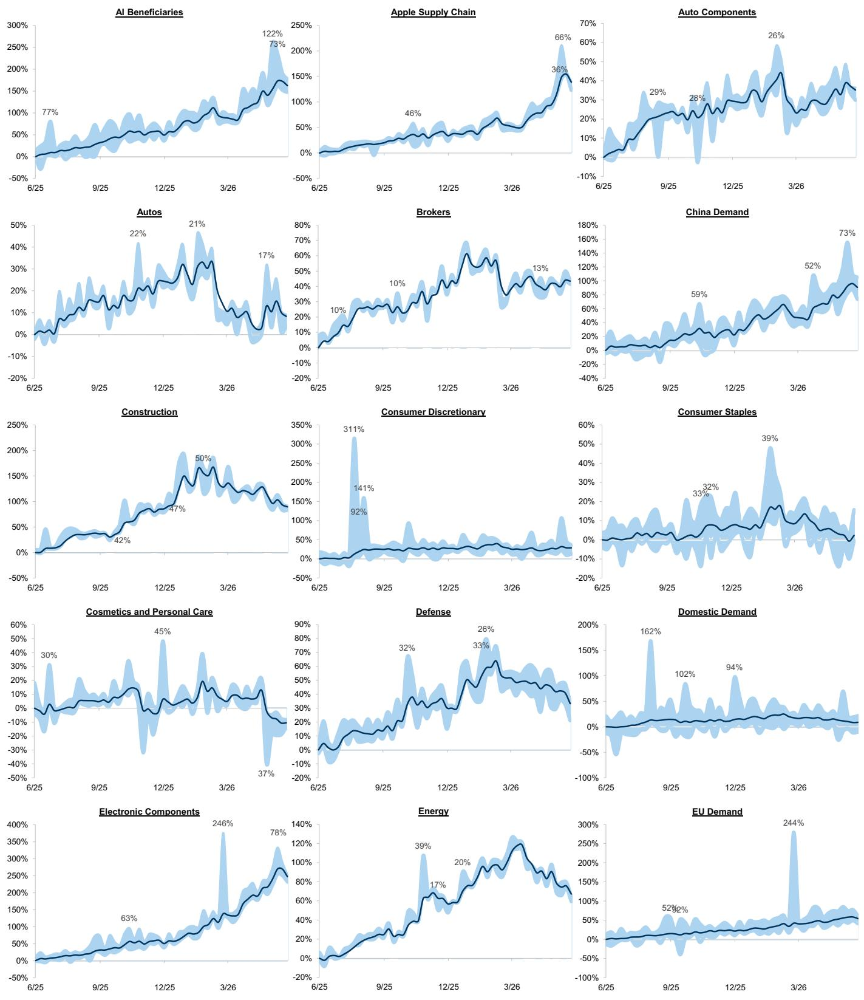  
Source: FactSet, Data compiled by GS Global Investment Research

52-week Weekly Spread Charts (cont.)  
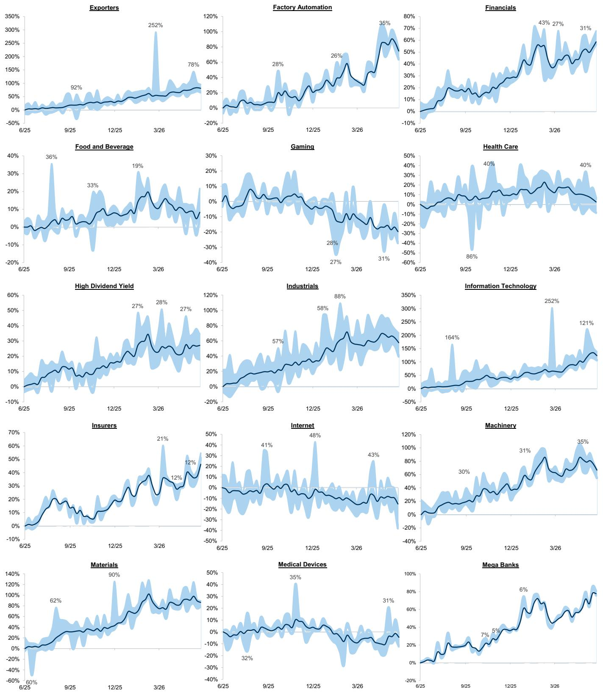  
Source: FactSet, Data compiled by GS Global Investment Research

52-week Weekly Spread Charts (cont.)  
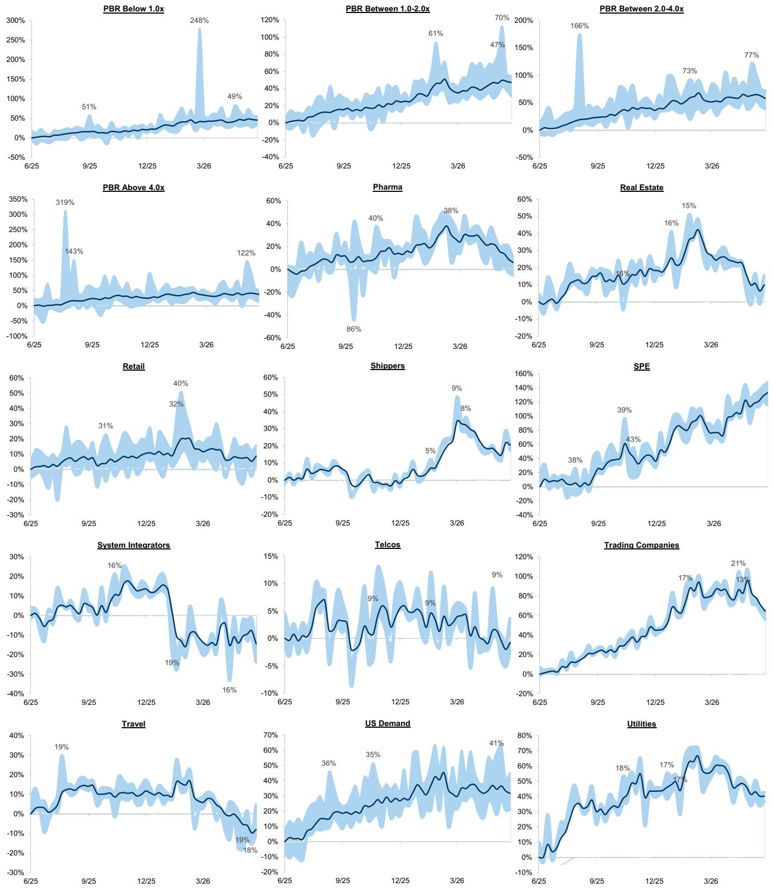  
Source: FactSet, Data compiled by GS Global Investment Research

Prices and returns are updated as of Jun 12, 2026, 3:30pm JST.

## Appendix One - Methodology

Our original analysis which has now been integrated into the Japan Weekly Kickstart format focuses on sector and thematic performance of the more liquid portion of the Japanese equities market. This is defined as any Japanese stocks that trade over US\$20mn adv. We believe that a significant number of our clients have liquidity constraints which require them to limit their stand-alone positions to this particular universe. By our calculations, there are 271 stocks in Japan that trade above this liquidity threshold as of Dec 17 2025.

We have sub-divided this universe into 45 equal weighted indices that focus on either MSCI-defined sectors and sub-sectors, or areas of thematic focus that stretch across multiple sectors (such as High Dividend Yield or Gaming). For these thematic indices, we have relied either on quantitative measures and/or GS Equity analyst input on component selection. We hope to expand the number of indices over time and would welcome client feedback on any areas of thematic interest we should focus on.

We track the performance of the equal-weighted sector, sub-sector and thematic indices over time and also measure the spread between the best-performing and the worst-performing stocks within the index. For example, Exhibit 37 illustrates both the volatility of the mean weekly performance in the liquid SPE index (the dark blue line), and the weekly Best-Worst spreads within the index (the light blue cloud).

Exhibit 37: SPE index 52 week equal-weighted cumulative weekly performance and best-worst spreads  
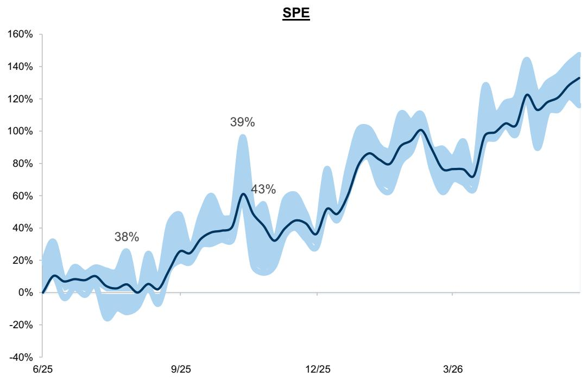

line chart

| Date   | Value |
|--------|-------|
| 6/25   | 38%   |
| 9/25   | 39%   |
| 12/25  | 43%   |

Source: FactSet, Data compiled by GS Global Investment Research

The criteria we have used in our analysis of the liquid Japanese equities market can be summarized as follows:

■ Total universe consists of Japanese stocks with a 6-month adv of over US\$20mn (271 stocks as of Dec 17 2025).  
■ The universe will be refreshed every year.  
■ Indices are all equal-weighted.  
■ Index component selection is based on MSCI sector and sub-sector definitions, quantitative factors and/or GS single-stock Equity Analyst guidance.  
■ The same stock can appear in multiple indices.  
The Best-Worst spread is based on the difference between the best performing and worst performing component within each index.  
The first 12 months of trading of any new listing are not included in the index performance.

We anticipate that the number of indices will be adjusted over time and would welcome any client feedback on other areas within the liquid Japan equities universe we should be focused on.

## Disclosure Appendix

## Reg AC

We, Bruce Kirk, CFA and Julius Chan, hereby certify that all of the views expressed in this report accurately reflect our personal views, which have not been influenced by considerations of the firm's business or client relationships.

Unless otherwise stated, the individuals listed on the cover page of this report are analysts in GS' Global Investment Research division.

Contributing Authors: Bruce Kirk, CFA GS Japan Co., Ltd., Julius Chan GS Japan Co., Ltd..

Unless otherwise stated, the individuals listed in the Contributing Authors disclosure of this report are analysts in GS' Global Investment Research division.

## Disclosures

## Other Disclosures

## Baskets

The ability to trade the basket(s) in this report will depend upon market conditions, including liquidity and borrow constraints at the time of trade.

## MSCI

All MSCI data used in this report is the exclusive property of MSCI, Inc. (MSCI). Without prior written permission of MSCI, this information and any other MSCI intellectual property may not be reproduced or redisseminated in any form and may not be used to create any financial instruments or products or any indices. This information is provided on an “as is” basis, and the user of this information assumes the entire risk of any use made of this information. Neither MSCI, any of its affiliates nor any third party involved in, or related to, computing or compiling the data makes any express or implied warranties or representations with respect to this information (or the results to be obtained by the use thereof), and MSCI, its affiliates and any such third party hereby expressly disclaim all warranties of originality, accuracy, completeness, merchantability or fitness for a particular purpose with respect to any of this information. Without limiting any of the foregoing, in no event shall MSCI, any of its affiliates or any third party involved in, or related to, computing or compiling the data have any liability for any direct, indirect, special, punitive, consequential or any other damages (including lost profits) even if notified of the possibility of such damages. MSCI and the MSCI indexes are service marks of MSCI and its affiliates. The Global Industry Classification Standard (GICS) were developed by and is the exclusive property of MSCI and Standard & Poor’s. GICS is a service mark of MSCI and S&P and has been licensed for use by The GS Group, Inc.

## Regulatory disclosures

## Disclosures required by United States laws and regulations

See company-specific regulatory disclosures above for any of the following disclosures required as to companies referred to in this report: manager or co-manager in a pending transaction; 1% or other ownership; compensation for certain services; types of client relationships; managed/co-managed public offerings in prior periods; directorships; for equity securities, market making and/or specialist role. GS trades or may trade as a principal in debt securities (or in related derivatives) of issuers discussed in this report.

The following are additional required disclosures: Ownership and material conflicts of interest: GS policy prohibits its analysts, professionals reporting to analysts and members of their households from owning securities of any company in the analyst's area of coverage. Analyst compensation: Analysts are paid in part based on the profitability of GS, which includes investment banking revenues. Analyst as officer or director: GS policy generally prohibits its analysts, persons reporting to analysts or members of their households from serving as an officer, director or advisor of any company in the analyst's area of coverage. Non-U.S. Analysts: Non-U.S. analysts may not be associated persons of GS & Co. LLC and therefore may not be subject to FINRA Rule 2241 or FINRA Rule 2242 restrictions on communications with a subject company, public appearances and trading in securities covered by the analysts.

## Additional disclosures required under the laws and regulations of jurisdictions other than the United States

The following disclosures are those required by the jurisdiction indicated, except to the extent already made above pursuant to United States laws and regulations. Australia: GS Australia Pty Ltd and its affiliates are not authorised deposit-taking institutions (as that term is defined in the Banking Act 1959 (Cth)) in Australia and do not provide banking services, nor carry on a banking business, in Australia. This research, and any access to it, is intended only for “wholesale clients” within the meaning of the Australian Corporations Act, unless otherwise agreed by GS. In producing research reports, members of Global Investment Research of GS Australia may attend site visits and other meetings hosted by the companies and other entities which are the subject of its research reports. In some instances the costs of such site visits or meetings may be met in part or in whole by the issuers concerned if GS Australia considers it is appropriate and reasonable in the specific circumstances relating to the site visit or meeting. To the extent that the contents of this document contains any financial product advice, it is general advice only and has been prepared by GS without taking into account a client’s objectives, financial situation or needs. A client should, before acting on any such advice, consider the appropriateness of the advice having regard to the client’s own objectives, financial situation and needs. A copy of certain GS Australia and New Zealand disclosure of interests and a copy of GS’ Australian Sell-Side Research Independence Policy Statement are available at: https://www.goldmansachs.com/disclosures/australia-new-zealand/index.html. Brazil: Disclosure information in relation to CVM Resolution n. 20 is available at https://www.gs.com/worldwide/brazil/area/gir/index.html. Where applicable, the Brazil-registered analyst primarily responsible for the content of this research report, as defined in Article 20 of CVM Resolution n. 20, is the first author named at the beginning of this report, unless indicated otherwise at the end of the text. Canada: This information is being provided to you for information purposes only and is not, and under no circumstances should be construed as, an advertisement, offering or solicitation by GS & Co. LLC for purchasers of securities in Canada to trade in any Canadian security. GS & Co. LLC is not registered as a dealer in any jurisdiction in Canada under applicable Canadian securities laws and generally is not permitted to trade in Canadian securities and may be prohibited from selling certain securities and products in certain jurisdictions in Canada. If you wish to trade in any Canadian securities or other products in Canada please contact GS Canada Inc., an affiliate of The GS Group Inc., or another registered Canadian dealer. Hong Kong: Further information on the securities of covered companies referred to in this research may be obtained on request from GS (Asia) L.L.C. India: Further information on the subject company or companies referred to in this research may be obtained from GS (India) Securities Private Limited, Research Analyst - SEBI Registration Number INH000001493, 10th Floor, Ascent-Worli, Sudam Kalu Ahire Marg, Worli, Mumbai-400 025, India, Corporate Identity Number U74140MH2006FTC160634, Phone +91 22 6616 9000, Fax +91 22 6616 9001. GS may beneficially own 1% or more of the securities (as such term is defined in clause 2 (h) the Indian Securities Contracts (Regulation) Act, 1956) of the subject company or companies referred to in this research report. Investment in securities market are subject to market risks. Read all the related documents carefully before investing. Registration granted by SEBI and certification from NISM in no way guarantee performance of the intermediary or provide any assurance of returns to investors. GS (India) Securities Private Limited compliance officer and investor grievance contact details can be found at:

https://www.goldmansachs.com/worldwide/india/documents/Grievance-Redressal-and-Escalation-Matrix.pdf, and a copy of the annual audit compliance report can be found at this link: https://publishing.gs.com/content/site/india-annual-compliance-report.html. Japan: See below. Korea: This research, and any access to it, is intended only for “professional investors” within the meaning of the Financial Services and Capital Markets Act, unless otherwise agreed by GS. Further information on the subject company or companies referred to in this research may be obtained from GS (Asia) L.L.C., Seoul Branch. New Zealand: GS New Zealand Limited and its affiliates are neither “registered banks” nor “deposit takers” (as defined in the Reserve Bank of New Zealand Act 1989) in New Zealand. This research, and any access to it, is intended for “wholesale clients” (as defined in the Financial Advisers Act 2008) unless otherwise agreed by GS. A copy of certain GS Australia and New Zealand disclosure of interests is available at: https://www.goldmansachs.com/disclosures/australia-new-zealand/index.html.

Russia: Research reports distributed in the Russian Federation are not advertising as defined in the Russian legislation, but are information and analysis not having product promotion as their main purpose and do not provide appraisal within the meaning of the Russian legislation on appraisal activity. Research reports do not constitute a personalized investment recommendation as defined in Russian laws and regulations, are not addressed to a specific client, and are prepared without analyzing the financial circumstances, investment profiles or risk profiles of clients. GS assumes no responsibility for any investment decisions that may be taken by a client or any other person based on this research report. Singapore: GS (Singapore) Pte. (Company Number: 198602165W), which is regulated by the Monetary Authority of Singapore, accepts legal responsibility for this research, and should be contacted with respect to any matters arising from, or in connection with, this research. Taiwan: This material is for reference only and must not be reprinted without permission. Investors should carefully consider their own investment risk. Investment results are the responsibility of the individual investor. United Kingdom: Persons who would be categorized as retail clients in the United Kingdom, as such term is defined in the rules of the Financial Conduct Authority, should read this research in conjunction with prior GS on the covered companies referred to herein and should refer to the risk warnings that have been sent to them by GS International. A copy of these risks warnings, and a glossary of certain financial terms used in this report, are available from GS International on request.

European Union and United Kingdom: Disclosure information in relation to Article 6 (2) of the European Commission Delegated Regulation (EU) (2016/958) supplementing Regulation (EU) No 596/2014 of the European Parliament and of the Council (including as that Delegated Regulation is implemented into United Kingdom domestic law and regulation following the United Kingdom's departure from the European Union and the European Economic Area) with regard to regulatory technical standards for the technical arrangements for objective presentation of investment recommendations or other information recommending or suggesting an investment strategy and for disclosure of particular interests or indications of conflicts of interest is available at https://www.gs.com/disclosures/europeanpolicy.html which states the European Policy for Managing Conflicts of Interest in Connection with Investment Research.

Japan: GS Japan Co., Ltd. is a Financial Instrument Dealer registered with the Kanto Financial Bureau under registration number Kinsho 69, and a member of Japan Securities Dealers Association, Financial Futures Association of Japan Type II Financial Instruments Firms Association, and Investment Management Association of Japan. Sales and purchase of equities are subject to commission pre-determined with clients plus consumption tax. See company-specific disclosures as to any applicable disclosures required by Japanese stock exchanges, the Japanese Securities Dealers Association or the Japanese Securities Finance Company.

## Global product; distributing entities

GS Global Investment Research produces and distributes research products for clients of GS on a global basis. Analysts based in GS offices around the world produce research on industries and companies, and research on macroeconomics, currencies, commodities and portfolio strategy. This research is disseminated in Australia by GS Australia Pty Ltd (ABN 21 006 797 897); in Brazil by GS do Brasil Corretora de Títulos e Valores Mobiliários S.A.; Public Communication Channel GS Brazil: 0800 727 5764 and / or contatogoldmanbrasil@gs.com. Available Weekdays (except holidays), from 9am to 6pm. Canal de Comunicação com o Público GS Brasil: 0800 727 5764 e/ou contatogoldmanbrasil@gs.com. Horário de funcionamento: segunda-feira à sexta-feira (exceto feriados), das 9h às 18h; in Canada by GS & Co. LLC; in Hong Kong by GS (Asia) L.L.C.; in India by GS (India) Securities Private Ltd.; in Japan by GS Japan Co., Ltd.; in the Republic of Korea by GS (Asia) L.L.C., Seoul Branch; in New Zealand by GS New Zealand Limited; in Russia by OOO GS; in Singapore by GS (Singapore) Pte. (Company Number: 198602165W); and in the United States of America by GS & Co. LLC. GS International has approved this research in connection with its distribution in the United Kingdom.

GS International (“GSI”), authorised by the Prudential Regulation Authority (“PRA”) and regulated by the Financial Conduct Authority (“FCA”) and the PRA, has approved this research in connection with its distribution in the United Kingdom.

European Economic Area: GS Bank Europe SE (“GSBE”) is a credit institution incorporated in Germany and, within the Single Supervisory Mechanism, subject to direct prudential supervision by the European Central Bank and in other respects supervised by German Federal Financial Supervisory Authority (Bundesanstalt für Finanzdienstleistungsaufsicht, BaFin) and Deutsche Bundesbank and disseminates research within the European Economic Area.

## General disclosures

This research is for our clients only. Other than disclosures relating to GS, this research is based on current public information that we consider reliable, but we do not represent it is accurate or complete, and it should not be relied on as such. The information, opinions, estimates and forecasts contained herein are as of the date hereof and are subject to change without prior notification. We seek to update our research as appropriate, but various regulations may prevent us from doing so. Other than certain industry reports published on a periodic basis, the large majority of reports are published at irregular intervals as appropriate in the analyst's judgment.

GS conducts a global full-service, integrated investment banking, investment management, and brokerage business. We have investment banking and other business relationships with a substantial percentage of the companies covered by Global Investment Research. GS & Co. LLC, the United States broker dealer, is a member of SIPC (https://www.sipc.org).

Our salespeople, traders, and other professionals may provide oral or written market commentary or trading strategies to our clients and principal trading desks that reflect opinions that are contrary to the opinions expressed in this research. Our asset management area, principal trading desks and investing businesses may make investment decisions that are inconsistent with the recommendations or views expressed in this research.

We and our affiliates, officers, directors, and employees will from time to time have long or short positions in, act as principal in, and buy or sell, the securities or derivatives, if any, referred to in this research, unless otherwise prohibited by regulation or GS policy.

The views attributed to third party presenters at GS arranged conferences, including individuals from other parts of GS, do not necessarily reflect those of Global Investment Research and are not an official view of GS.

Any third party referenced herein, including any salespeople, traders and other professionals or members of their household, may have positions in the products mentioned that are inconsistent with the views expressed by analysts named in this report.

This research is focused on investment themes across markets, industries and sectors. It does not attempt to distinguish between the prospects or performance of, or provide analysis of, individual companies within any industry or sector we describe.

Any trading recommendation in this research relating to an equity or credit security or securities within an industry or sector is reflective of the investment theme being discussed and is not a recommendation of any such security in isolation.

This research is not an offer to sell or the solicitation of an offer to buy any security in any jurisdiction where such an offer or solicitation would be illegal. It does not constitute a personal recommendation or take into account the particular investment objectives, financial situations, or needs of individual clients. Clients should consider whether any advice or recommendation in this research is suitable for their particular circumstances and, if appropriate, seek professional advice, including tax advice. The price and value of investments referred to in this research and the income from them may fluctuate. Past performance is not a guide to future performance, future returns are not guaranteed, and a loss of original capital may occur. Fluctuations in exchange rates could have adverse effects on the value or price of, or income derived from, certain investments.

Certain transactions, including those involving futures, options, and other derivatives, give rise to substantial risk and are not suitable for all investors. Investors should review current options and futures disclosure documents which are available from GS sales representatives or at https://www.theocc.com/about/publications/character-risks.jsp and https://www.goldmansachs.com/disclosures/cftc\_fcm\_disclosures. Transaction costs may be significant in option strategies calling for multiple purchase and sales of options such as spreads. Supporting documentation will be supplied upon request.

Differing Levels of Service provided by Global Investment Research: The level and types of services provided to you by GS Global Investment Research may vary as compared to that provided to internal and other external clients of GS, depending on various factors including your individual preferences as to the frequency and manner of receiving communication, your risk profile and investment focus and perspective (e.g., marketwide, sector specific, long term, short term), the size and scope of your overall client relationship with GS, and legal and regulatory constraints. As an example, certain clients may request to receive notifications when research on specific securities is published, and certain clients may request that specific data underlying analysts' fundamental analysis available on our internal client websites be delivered to them electronically through data feeds or otherwise. No change to an analyst's fundamental research views (e.g., ratings, price targets, or material changes to earnings estimates for equity securities), will be communicated to any client prior to inclusion of such information in a research report broadly disseminated through electronic publication to our internal client websites or through other means, as necessary, to all clients who are entitled to receive such reports.

All research reports are disseminated and available to all clients simultaneously through electronic publication to our internal client websites. Not all research content is redistributed to our clients or available to third-party aggregators, nor is GS responsible for the redistribution of our research by third party aggregators. For research, models or other data related to one or more securities, markets or asset classes (including related services) that may be available to you, please contact your GS representative or go to https://research.gs.com.

Disclosure information is also available at https://www.gs.com/research/hedge.html or from Research Compliance, 200 West Street, New York, NY 10282.

## © 2026 GS.

You are permitted to store, display, analyze, modify, reformat, and print the information made available to you via this service only for your own use. You may not resell or reverse engineer this information to calculate or develop any index for disclosure and/or marketing or create any other derivative works or commercial product(s), data or offering(s) without the express written consent of GS. You are not permitted to publish, transmit, or otherwise reproduce this information, in whole or in part, in any format to any third party without the express written consent of GS. This foregoing restriction includes, without limitation, using, extracting, downloading or retrieving this information, in whole or in part, to train or finetune a machine learning or artificial intelligence system, or to provide or reproduce this information, in whole or in part, as a prompt or input to any such system.