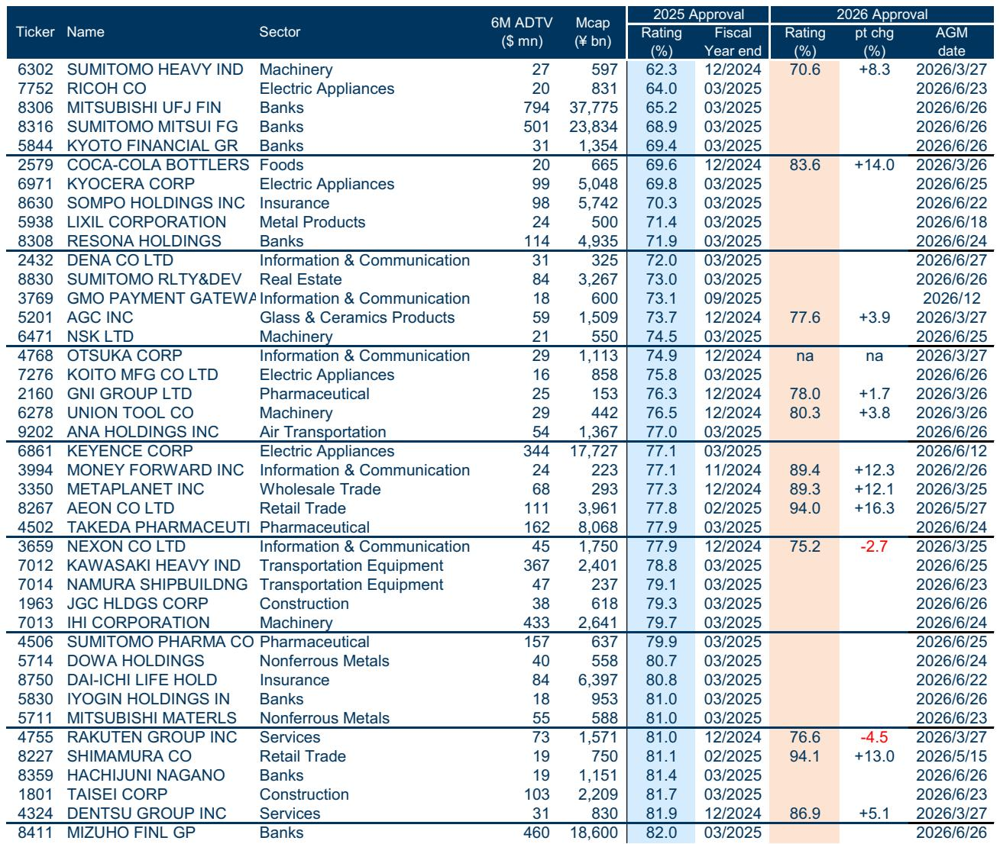
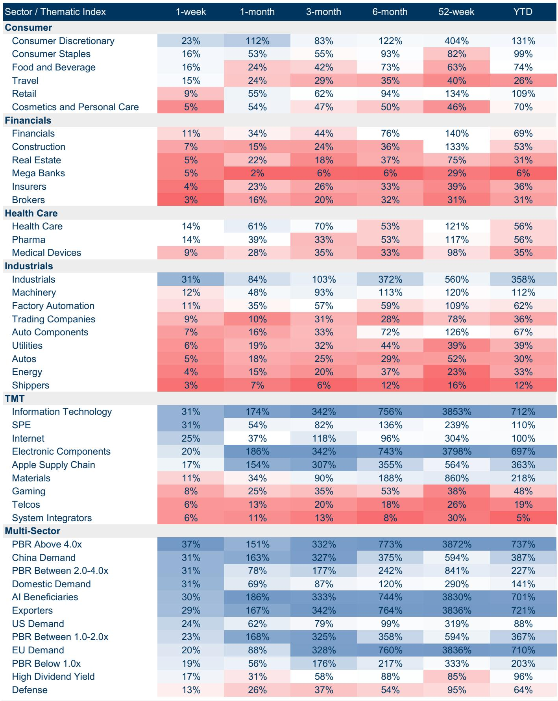
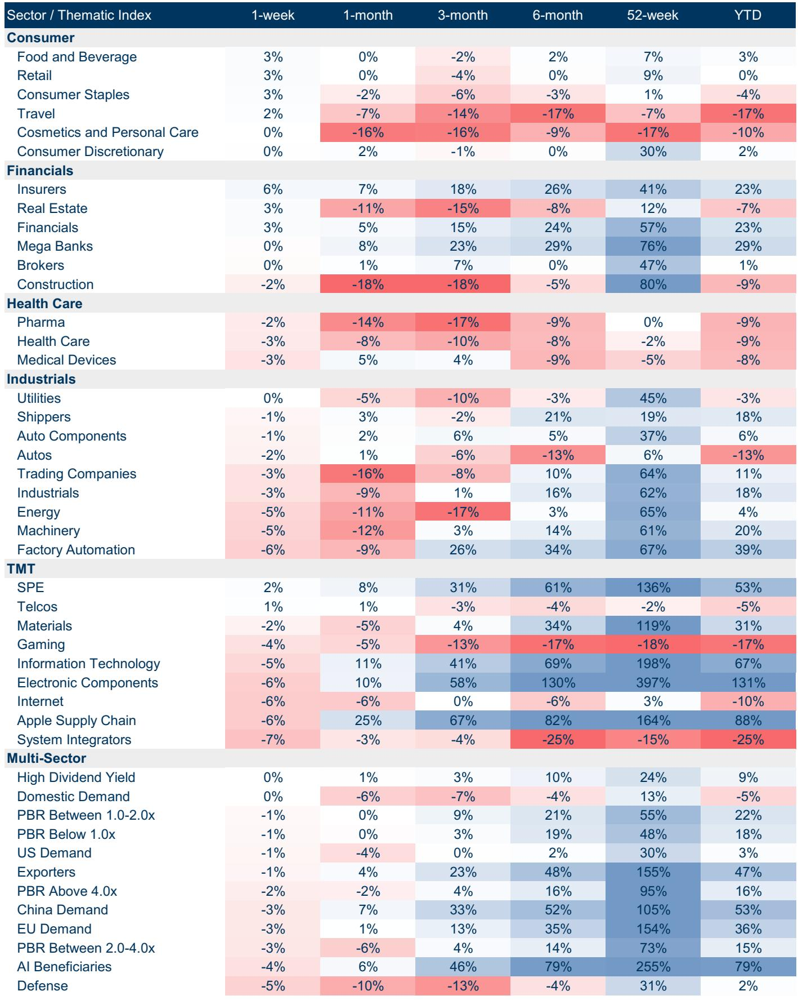

# Japan's AGM Season Reveals a Clear Strategy: Low Approval Ratings Are a Buy Signal for Shareholder Returns

The 2026 annual general meeting season in Japan is reaching its peak, with over 600 companies concentrated on a single day, June 26. For serious investors, this concentrated voting window is not a procedural formality but a critical data point that reveals which companies will deliver shareholder value over the next twelve months. The evidence is now compelling: companies that received the lowest approval ratings at their previous AGMs have consistently outperformed the TOPIX by 13 percentage points—until a geopolitical shock and a thematic rotation toward AI disrupted the pattern. This divergence is not a reason to abandon the strategy; it is precisely the moment to lean in.

The core argument of this analysis is straightforward. Low AGM approval ratings are not a sign of dysfunction to avoid; they are a powerful, underutilized predictor of future shareholder-friendly corporate action. When management faces embarrassment from low votes, the subsequent year almost always brings improved behavior. The data from the current season confirms this: ten out of twelve companies in the low-approval screen have already seen their ratings improve this year. The market, however, has temporarily forgotten this signal, creating a mispricing that strategic investors can exploit.

The current market context makes this argument even more urgent. Since early April, the AI-driven rally has bypassed these low-approval names entirely. The market has been chasing growth narratives rather than governance catalysts. Meanwhile, a separate but equally telling pattern has emerged: stocks offering "yuutai" (shareholder benefits) combined with dividends have outperformed those without either by 12 percentage points since early June, and have beaten the TOPIX by 4 points. This is not a coincidence. Both signals point to the same underlying reality: in a market correction, investors are rediscovering the value of tangible, management-committed shareholder returns.

The strategic question is not whether these signals work. They do. The question is how to position for the next phase, when the AI trade inevitably pauses and the market rotates back to fundamentals. The 2026 AGM season is providing the raw data for that rotation.

## Low AGM Approval Ratings Remain the Most Reliable Leading Indicator for Shareholder Activism, and the Current Season Confirms the Pattern

The logic is rooted in behavioral economics. Japanese management teams are acutely sensitive to the public embarrassment of a low shareholder vote. When a company lands in the bottom decile of approval ratings, the board knows that activist investors, proxy advisors, and the media are watching. The response is almost always predictable: increased buybacks, higher dividends, better capital allocation disclosure, and more direct engagement with institutional shareholders.

The data from the report is unambiguous. The screen of companies with the lowest AGM approval ratings from the 2025 season outperformed the TOPIX by 13 percentage points from July 2025 until the onset of the Iran conflict. That is a substantial alpha generation over nearly a full year. The subsequent underperformance is not a failure of the thesis; it is a function of a macro-driven thematic shift. The AI rally since April has been narrow, favoring large-cap technology and system integrators, while the low-approval names tend to be in more traditional sectors like machinery, banks, and materials.

What matters more is the current season's data. Of the twelve companies in the original low-approval screen, ten have already reported improved approval ratings this year. The improvements are not marginal. Coca-Cola Bottlers Japan saw its approval rating rise from 69.6% to 83.6%. AEON jumped from 77.8% to 94.0%. Money Forward went from 77.1% to 89.4%. These are not cosmetic changes; they represent genuine management responsiveness.

The two companies that saw declines—Nexon and Rakuten Group—are instructive exceptions. Nexon's rating fell from 77.9% to 75.2%, and Rakuten's from 81.0% to 76.6%. Both are in the information technology and services sectors, where governance concerns may be secondary to growth narratives. This suggests that the low-approval screen works best when the underlying business has the financial flexibility to respond to shareholder pressure. Companies with weak balance sheets or complex capital structures may struggle to translate low votes into action.

The so-what is clear. The market has temporarily priced these stocks as if the governance catalyst has expired. It has not. The improvements in approval ratings are the first step, but the real shareholder-friendly actions—buybacks, special dividends, asset sales—typically follow in the subsequent twelve months. The current underperformance is a buying opportunity for those willing to look past the AI hype.

## Shareholder Benefits and Dividends Provide a Defensive Anchor During Market Corrections, Revealing a Structural Preference for Tangible Returns

The second signal from the report is equally powerful but operates on a different time horizon. The "yuutai plus dividends" screen has outperformed the "no yuutai, no dividends" screen by 12 percentage points since June 3, and has beaten the TOPIX by 4 points. This is not a short-term anomaly; it is a structural pattern that becomes most visible during market stress.

The logic is intuitive but often overlooked. Yuutai—the practice of offering shareholders physical benefits such as discount coupons, free products, or services—is a uniquely Japanese expression of management commitment. It is a direct, non-financial signal that the company values its retail shareholder base. When combined with a cash dividend, it creates a dual commitment that is hard for management to reverse. During a market correction, when growth narratives become less credible, these tangible signals become disproportionately attractive.

The report shows that this effect is not limited to large caps. The small- and mid-cap version of the yuutai plus dividends screen outperformed its no-benefits counterpart by 7 percentage points in the same period. This is significant because SMID stocks are typically more volatile and less liquid. The fact that this defensive quality holds in the SMID space suggests that the signal is fundamental, not a function of index weight or institutional ownership.

The sector-level data reinforces this point. During the week of the correction, the best-performing sectors were Food and Beverage and Retail, both up 3% week-on-week. These are sectors where yuutai is most common. The worst performers were System Integrators and Apple Supply Chain, down 7% and 6% respectively. These are the high-growth, high-multiple names that had led the AI rally. The rotation out of AI and into domestic demand defensives is not just a tactical move; it reflects a deeper investor preference for companies that have already demonstrated a commitment to returning value to shareholders.

The so-what is that this defensive quality is not random. It is a direct consequence of management behavior. Companies that offer yuutai and dividends are signaling that they prioritize shareholder returns even when earnings are under pressure. During a correction, that signal becomes a valuation floor. The implication for portfolio construction is clear: in a market that is increasingly bifurcated between AI winners and everything else, the yuutai-dividend screen provides a systematic way to identify the stocks that will hold up best when the growth trade falters.

## The Report Does Not Fully Explain Why the Low-Approval Screen Failed to Capture the AI Rally, Nor Does It Address the Risk of a False Signal from Improved Ratings

For all its analytical rigor, the report leaves several critical questions unresolved. The most pressing is why the low-approval screen has underperformed since April, even as the underlying companies have improved their governance. The report attributes this to the AI-driven rally, but that explanation is incomplete. Why did the market choose to ignore a proven alpha signal? Is it because the AI theme is so dominant that it crowds out all other factors? Or is it because the low-approval names tend to be in sectors that are structurally disadvantaged in a technology-led market?

A deeper question concerns the sustainability of the improvement in approval ratings. The report shows that ten out of twelve companies have improved, but it does not analyze whether these improvements are likely to translate into actual shareholder returns. A company can raise its approval rating by making cosmetic changes to its AGM presentation or by appointing a token independent director. The real test is whether these companies will now follow through with buybacks, asset sales, or dividend increases. The report provides early evidence from a few names but does not yet have the data to confirm the full cycle.

There is also the risk of a false signal. If too many companies improve their ratings simply by gaming the system, the predictive power of the low-approval screen could decay. The market could learn to discount the signal, just as it has learned to discount earnings beats that are driven by one-time items. The report does not address whether the quality of the improvements is consistent across the screen, or whether some companies are simply meeting the minimum threshold to avoid embarrassment.

Finally, the report does not explore the interaction between the two screens. What happens when a company appears in both the low-approval screen and the yuutai-dividend screen? Is the combined signal stronger than either alone? The data hints at an answer—both screens have outperformed independently—but the report does not provide the cross-tabulation that would allow investors to prioritize one over the other. These are not flaws in the analysis; they are the natural boundaries of a timely report. But they are also the questions that the full report, with its deeper data and longer time series, is designed to answer.

## A Decision Framework for the Current Season: Three Questions Every Investor Must Ask Before the AGM Peak

The practical value of this analysis lies in its ability to inform immediate portfolio decisions. With the AGM peak on June 26, investors have a narrow window to act. The following framework translates the report's insights into actionable questions.

First, which low-approval companies from the 2025 season have not yet reported their 2026 ratings? The report lists 30 companies in the screen, but only 12 have current data. The remaining 18—including major names like Mitsubishi UFJ Financial Group, Sumitomo Mitsui Financial Group, Kyocera, and Sompo Holdings—will report their AGM results between June 22 and June 26. For these companies, the current approval rating is unknown. If they follow the pattern of the first 12, a significant improvement is likely. The market has not yet priced this in. An investor who buys before the AGM and holds through the announcement could capture the positive surprise.

Second, does the company have the financial capacity to act on a low rating? Not all low-approval companies are created equal. The report's screen includes banks with massive market capitalizations and strong cash flows, such as Mizuho Financial Group and Resona Holdings. It also includes smaller, more leveraged names like NSK and LIXIL. The low-approval signal is strongest when the company has the balance sheet to fund buybacks or dividends. Banks, in particular, are well-positioned because they generate consistent earnings and face regulatory pressure to improve capital efficiency. The sector's strong performance in the current correction—Insurance and Real Estate were the top sectors—suggests that financials are already benefiting from governance improvements.

Third, is the company in a sector that is likely to benefit from a rotation away from AI? The low-approval screen is heavily weighted toward banks, machinery, and materials. These are not the sectors that will lead the next AI-driven leg. But they are exactly the sectors that will benefit when the market rotates toward value, domestic demand, and governance catalysts. An investor who believes the AI rally is overextended should use the low-approval screen as a systematic way to identify value stocks with a near-term catalyst. The yuutai-dividend screen, meanwhile, provides a complementary tool for identifying defensive names that will hold up even if the correction deepens.

The framework is simple but powerful. Buy low-approval names before their AGM dates, prioritize companies with strong balance sheets and sector tailwinds, and use the yuutai-dividend screen as a hedge against further downside. This is not a speculative trade; it is a structured bet on a proven behavioral pattern.

## Join the Community to Read the Full Report and Review the Original Charts

The patterns described here are based on real-time data from the current AGM season, but the full analytical power of this approach requires access to the complete screen, the historical performance charts, and the detailed sector breakdowns. The report from which this analysis is drawn contains exhibits that show the exact timing of the AGM concentration, the performance of the low-approval screen against the TOPIX over two years, and the full list of companies in both the yuutai-dividend and no-benefits screens. These charts are not decorative; they are the raw material for building a portfolio that systematically exploits governance catalysts.

The unresolved questions raised in this analysis—the decay risk of the low-approval signal, the interaction between the two screens, the quality of the rating improvements—are precisely the topics that the full report addresses with deeper data and longer time horizons. For investors who want to move beyond the summary and into the implementation details, the original research is indispensable.

Join the community to read the full report and review the original charts.

*This article is for learning and discussion only and does not constitute investment advice.*

Personal reading notes and learning share only. Not investment advice.

