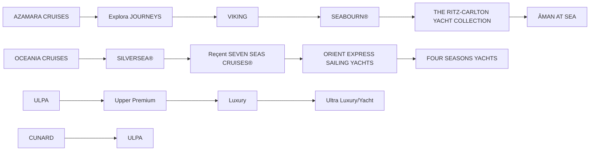

你是麦肯锡/投研风格的微信公众号财经文章主笔，擅长用金字塔原理把研报内容转化为“有主张、有层次、有洞察、但仍保留完整报告阅读欲望”的长文。

【目标】
- 基于下面的研报解析内容，写一篇微信公众号文章 Markdown。
- 风格：稳重、专业、克制、有洞察，像咨询公司合伙人写给高净值读者/产业决策者的研报导读。
- 长度：约 3000 字，允许上下浮动 15%。
- 不要使用 emoji。
- 可以基于报告内容做适度发散，但必须是从原文逻辑推出的判断，不要编造数据、公司动作或引用。
- 不要把研报所有正文内容讲完，要留下明确但自然的伏笔，让读者愿意加入社群阅读完整报告。

【金字塔原理写作原则】
1. 结论先行：文章开头先回答“这份报告最值得看的判断是什么”，而不是介绍背景。
2. 统领思想：全文只能服务一个主判断，避免变成摘要合集。
3. 纵向回答：每一层都要回答上一层提出的“为什么”或“所以呢”。
4. 横向 MECE：每个一级小节必须彼此独立、共同支撑主判断，避免重叠。
5. Synthesis over summary：不要复述报告段落，要提炼“这些事实合在一起意味着什么”。
6. So what：每个小节末尾必须落到对行业、公司、竞争格局、资产定价或读者观察框架的含义。
7. Action title：所有 `##` 小标题必须是“直接讲述洞察的完整句子”，不能是目录标签。

【标题与小标题硬性要求】
- `# 标题` 必须直接表达一个判断，例如“市场真正低估的不是需求，而是供给侧的再定价”。
- `# 标题` 必须包含报告机构的中文名称。已识别机构名：`Bernstein`。标题格式建议：`# Bernstein：一句主判断`。如果识别机构名为空，请从研报标题/正文中识别机构并使用中文名，例如GS、摩根斯坦利、HSBC、JPM、UBS、Citi、美国银行、BARC、DB、NOM。
- 机构名只要求出现在 `# 标题` 中，正文可以克制提及，不要为了重复机构名牺牲可读性。
- 禁止使用以下机械标题：
  - 一、核心判断
  - 二、真正重要的是结构性变量
  - 三、报告没有说透
  - 四、对读者的启发
  - 关键变化
  - 投资启示
  - 总结
- 所有 `##` 标题都要像麦肯锡报告里的 action title：读完标题就知道这一节结论。
- 小标题可以带序号，但序号后必须是一句洞察，例如：`## 1. 这轮变化真正考验的是企业能否把规模转化为议价权`。

【建议结构，但不要机械照抄标题】
1. `# 标题`：机构中文名 + 一句主判断，不超过 40 字。
2. 开头 4-6 段：直接给出主判断、为什么现在重要、报告提供了什么新信号。
3. 4-6 个 `##` 小节：每个小节标题都是洞察句，不是栏目名。
4. 至少一个小节讨论“报告尚未完全回答的关键问题”，但标题也要是洞察句。
5. 至少一个小节给出读者的观察框架，但不要命名为“对读者的启发”。
6. 文末自然承接未解问题，引导读者加入社群/微信群继续讨论。不要照抄固定话术，请基于本文未解问题每次重新写一段自然 CTA；语义可以参考：欢迎来星球微信群里继续讨论。
7. 在免责声明前，单独插入这张图片链接：``
8. 结尾只输出英文灰色免责声明：`
Personal reading notes and learning share only. Not investment advice.
`

【hook 要求】
- 不要硬插“加入社群”。
- hook 应该来自正文自然出现的未解问题，比如：关键假设尚未验证、竞争优势仍需拆解、图表背后的二阶影响没有展开。
- 文末 CTA 要像“顺着这些未解问题继续读完整报告/继续讨论”，不是广告口吻。
- CTA 必须每篇重新写，不能固定输出“加入社群，领取完整研报解读与原始图表”。可以类似“欢迎来星球微信群里继续讨论”。

【图片要求】
- 不要主动生成 MinerU 图片 markdown；系统会在文章生成后自动插入 MinerU 原始图片。
- 但文末免责声明前必须保留知识星球图片：``。

【内容边界】
- 只能基于研报原文和解析结果推导，不要编造数据、公司动作、引用。
- 遇到不确定内容，要用“这里仍需验证”“报告没有完全展开”等表达。
- 避免“震惊”“爆款”“一文看懂”等浮夸表达。
- 不要出现小红书话题标签。
- 不要出现 emoji。
- 不要隐藏报告机构名；标题必须出现机构中文名。正文如需概括来源，可写“这份Bernstein研报”或“该机构报告”，但不要编造机构观点以外的信息。
- 不要解释你的思考过程，不要输出多余说明。

【研报解析内容】
"""
## Global Hotels & Leisure

# Cruise: The Finer Tide of Life. Luxury Ocean Cruise Primer

Richard J. Clarke, FCA

+44 20 7676 6850

richard.clarke@bernsteinsg.com

Niall Mitchelson

+44 20 7676 7144

niall.mitchelson@bernsteinsg.com

Lasith Siriwardana

+44 20 7550 2191

lasith.siriwardana@bernsteinsg.com

While our long term view of the overall cruise industry is a constructive one, the Luxury segment faces the most pronounced demographic and structural demand tailwinds in cruise. An increasingly wealthy, higher-earning and older consumer with more leisure time is most impactful to the top end of the market, while slowing luxury hotel supply growth is a key tailwind. To play these structural trends, Viking is the only scaled pure play. Viking has carved out a powerful niche - differentiated from the opulent offerings of Regent or high-end hotel branded yachts. Viking's focus on 'the thinking person', with onboard historians and cultural enrichment are unique to the brand, driving a pricing premium and powerful brand moat. Demand drivers mean we expect it can comfortably keep up with supply growth, driving a compelling earnings algorithm riding on the rising luxury cruise tide.

All aboard - the strongest tailwinds in Cruise. There are 2 key demand drivers for the Luxury segment in cruise: (1) An older, wealthier, and higher-earning US consumer - Cruise is done by older consumers, but this is particularly true in Luxury, with an average age of 63. This demographic is set to continue to outgrow the US population, and has grown its share of wealth - almost 75% of US household wealth is held by those over 55. This is turbocharged by an increasingly disparate US income profile, with the top quartile seeing the most income growth, and the greatest increase in leisure time - supportive of Luxury travel spend. (2) A lack of luxury hotel supply - rising construction, labor, and financing costs have stalled high-end hotel development, and Luxury cruise can benefit and capture the spill-over in demand.

A vast horizon of differentiated options. While in the mainstream and premium brands often compete head to head, the Luxury segment features significantly more differentiation, and prices range from \$500 to high 5 figure sums per night. Ship size is a key determinant of how much consumers are willing to pay for a luxury cruise - yachts offered by luxury travel brands such as Orient Express and Aman with \~100 berths are priced in excess of \$5,000 per night, whilst cruises aboard \~1,000 berth ships are \~\$500 per night. However, brand power can buck this trend - Viking's unique product enables it to price materially higher than brands with similarly sized ships (i.e. Oceania).

Viking has the wind in its sails. Offering (1) A differentiated brand able to charge prices significantly higher than competitors driven by Viking's focus on enriching cruises, for an affluent customer segment (55+ North Americans); (2) Leading luxury cruise capacity growth, with Viking ships >50% of the segment's capacity growth through 2030, with growth allocated to higher yielding itineraries in Alaska / Scandinavia; (3) The design of Viking's ocean ships enable the brand to add capacity at a very low cost per berth - similar to the cost to mainstream brands (\~\$0.5m/berth) but with significantly higher yields.

Leaving branded yachts in its wake. The yacht experience is different to traditional luxury cruise; itineraries focus on locations which are difficult to access in for even small ship Luxury ocean liners (e.g. stops along the Croatian, Italian and French coastlines), feature large staterooms akin to luxury hotel rooms, and serve as a way to drive more touchpoints with their already established brands (Aman, Four Seasons, Orient Express). This is in sharp contrast to the Viking's ‘relaxed luxury’ approach - the focus on cultural enrichment rather than opulence means Viking competes for a very different customer base.

BERNSTEIN TICKER TABLE

<table><tr><td rowspan="2"></td><td colspan="4">10 Jun 2026</td><td>TTM</td><td colspan="4">Adjusted EPS</td><td colspan="3">Adjusted P/E (x)</td></tr><tr><td>Rating</td><td>Cur</td><td>Closing Price</td><td>Price Target</td><td>Rel. Perf.</td><td>Cur</td><td>2025A</td><td>2026E</td><td>2027E</td><td>2025A</td><td>2026E</td><td>2027E</td></tr><tr><td>CCL (Carnival)</td><td>M</td><td>USD</td><td>25.99</td><td>28.70</td><td>(11.5)%</td><td>USD</td><td>2.25</td><td>2.19</td><td>2.50</td><td>11.6</td><td>11.9</td><td>10.4</td></tr><tr><td>NCLH (Norwegian)</td><td>M</td><td>USD</td><td>17.92</td><td>18.00</td><td>(27.1)%</td><td>USD</td><td>2.11</td><td>1.64</td><td>1.94</td><td>8.5</td><td>10.9</td><td>9.2</td></tr><tr><td>RCL (Royal Caribbean)</td><td>O</td><td>USD</td><td>268.73</td><td>355.00</td><td>(20.4)%</td><td>USD</td><td>15.63</td><td>17.47</td><td>19.65</td><td>17.2</td><td>15.4</td><td>13.7</td></tr><tr><td>VIK (Viking)</td><td>O</td><td>USD</td><td>88.48</td><td>120.00</td><td>67.2%</td><td>USD</td><td>2.61</td><td>3.31</td><td>4.65</td><td>33.9</td><td>26.7</td><td>19.0</td></tr><tr><td>SPX</td><td></td><td></td><td>7,394.30</td><td></td><td></td><td></td><td></td><td></td><td></td><td></td><td></td><td></td></tr></table>

O - Outperform, M - Market-Perform, U - Underperform, NR - Not Rated, CS - Coverage Suspended  
Source: Bloomberg, Bernstein estimates and analysis.

## INVESTMENT IMPLICATIONS

We rate Viking and Royal Caribbean Outperform, and Carnival and Norwegian Market-Perform.

## Table Of Contents

The luxury cruise landscape....3

A range of luxury options....3

Ship size is a key determinant of price....3

The luxury cruise segment has seen little change....4

Differentiation in the luxury Cruise segment....5

Demand growth for luxury cruises....10

Demographic tailwinds to luxury cruise demand....10

Slow luxury hotel supply growth a tailwind....13

Supply growth in the luxury cruise segment....17

Cost of building luxury cruise ships....19

## DETAILS

## THE LUXURY CRUISE LANDSCAPE

## A RANGE OF LUXURY OPTIONS

Like all luxury industries, there is a range of levels of luxury across the higher-end cruise segment. These can be largely divided into three types, from the least to the most expensive:

- Mid-size ship luxury - cruises aboard ships with \~1,000 in capacity which sail to typical cruise destinations (i.e. Caribbean, Mediterranean, Alaska), with a focus on dining, service and relaxation. The main competitors in this space are Explora Journeys, Oceania and Viking (who carve our their own niche). These cruises are priced somewhere between \$300-700 per night.  
- Small-ship luxury - cruises aboard smaller 500-700 capacity ships. These cruises are generally all-inclusive and feature a greater focus on the destination, with smaller ships able to access ports which larger ships are unable to (i.e. Little Bay in Montserrat). The main competitors in this market are Silversea, Seabourn and Regent, owned by RCL, CCL and NCLH respectively. These cruises are priced between \$650-1,000 per night.  
- Yachts - cruises aboard yachts with high-quality interiors, varied dining options and excellent service. These yachts typically have capacity for 100-400 passengers and feature high-end onboard amenities such as restaurants, spas and on-ship pools. Sailings are generally shorter than traditional cruises and focus on yachting itineraries/locations like island hopping or sailing along the Amalfi Coast or French Riviera. This segment is so far dominated by hotel companies/brands (i.e. Accor with Orient Express Sailing Yachts, Aman at Sea, Four Seasons Yachts), with ship staterooms looking to emulate the experience of a luxury hotel stay at sea. These cruises can be extremely expensive, with prices in excess of \$5,000 per night.

## SHIP SIZE IS A KEY DETERMINANT OF PRICE

We find that customers are willing to pay exponentially more for cruises aboard smaller ships, with a cruise aboard Aman's 110 berth ship, Amangati, commanding a nightly price 10x greater than a Seabourn cruise aboard a ship 5x the size (Exhibit 4). Smaller ships generally offer more private and communal space/amenities per guest. Therefore, the connection between prices and ship capacity is unsurprising. We find that Viking greatly outperforms this pricing trend, with consumers willing to pay around twice what they would usually pay for cruises aboard \~1,000 berth ships, exhibiting Viking's significant differentiation and brand power.

## THE LUXURY CRUISE SEGMENT HAS SEEN LITTLE CHANGE

The mainstream cruise product has seen significant evolution in recent history, with an increased focus on the latest and largest ships and consumer appetite for private destinations. As a result, RCL is able to achieve significant premium on its latest Icon class ships and sailings that travel to its industry leading private destination, Perfect Day at CocoCay. In contrast, the luxury cruise segment remains broadly unchanged: ship hardware has not evolved materially, luxury cruises do not visit private destinations, and destination strategy remains focused on traditional cruise locations like the Caribbean, Mediterranean and Northern Europe.

EXHIBIT 1: Luxury cruise industry  

flowchart

Source: Bernstein analysis

EXHIBIT 2: Viking is priced at the lower end of the luxury cruise market, behind smaller-ship luxury brands such as Silversea, Seabourn and Regent. Nightly prices for sailings aboard yachts range well into the \$000s, with an Aman cruise starting at \~\$8,000 a night.  

bar chart

Average Nightly Cruise Price ($)
| Company | Average Nightly Cruise Price ($) |
| :--- | :--- |
| Azamara | ~300 |
| Oceania Cruises | ~400 |
| Explora Journeys | ~450 |
| Viking (Ocean) | ~650 |
| Crystal Cruises | ~650 |
| Silversea | ~750 |
| Seabourn | ~800 |
| Regent Seven Seas | ~950 |
| Ritz-Carlton Yacht Collection | ~1850 |
| Four Seasons | ~5250 |
| Orient Express | ~6400 |
| Aman | ~8050 |

Source: Company websites, Bernstein analysis & estimates

EXHIBIT 3: Viking and Oceania have the largest average ship capacity in the luxury cruise segment at \~950 berths, over double the size of the largest yacht operated by Ritz-Carlton Yacht Collection  
Average Ship Capacity  

bar chart

| Company | Sales |
| :--- | :--- |
| Oceania Cruises | ~950 |
| Viking (Ocean) | ~950 |
| Explora Journeys | ~900 |
| Azamara | ~750 |
| Regent Seven Seas | ~700 |
| Crystal Cruises | ~650 |
| Silversea | ~600 |
| Seabourn | ~550 |
| Ritz-Carlton Yacht Collection | ~400 |
| Four Seasons | ~200 |
| Orient Express | ~100 |
| Aman | ~100 |

Source: Company reports, Seatrade, Bernstein analysis

EXHIBIT 4: Customers are willing to pay significantly more for cruises aboard smaller ships, but Viking commands a price premium relative to its average ship size  
Cruise Price vs Ship Capacity  

scatterplot

| Company | Average Ship Capacity | Average Nightly Price (log axis) |
| --- | --- | --- |
| Aman | ~100 | ~8000 |
| Four Seasons | ~200 | ~5000 |
| Orient Express | ~100 | ~6000 |
| Ritz-Carlton Yacht Collection | ~400 | ~2000 |
| Seabourn | ~550 | ~800 |
| Silversea | ~580 | ~700 |
| Azamara | ~750 | ~300 |
| Crystal Cruises | ~680 | ~600 |
| Regent Seven Seas | ~700 | ~1000 |
| Explora Journeys | ~950 | ~400 |
| Oceania Cruises | ~950 | ~300 |
| Viking (Ocean) | ~950 | ~600 |

Source: Company reports & websites, Bernstein anlaysis

## DIFFERENTIATION IN THE LUXURY CRUISE SEGMENT

Luxury is not a homogeneous sector but houses many different sub categories, from Viking's mid-sized relaxed ships to the opulent yachts luxury hotels brands have launched.

How Viking differentiates itself from other luxury cruise brands

Viking is able to achieve a pricing premium by differentiating itself from the rest of the luxury ocean cruise industry and appealing to a customer demographic that continues to return to the brand. They achieve this through the following three things:

- Focus on the destination and enrichment - Unlike other luxury cruise bands which try and sell their on-ship experience, Viking focuses on selling the destination to “the thinking person”. Viking’s Ocean ships are almost identical with the only difference being that newer ships have slightly more capacity (\~70 berths), they do not specifically market the newest hardware. Instead the focus is on providing enriching shore excursions, on-ship lectures and a curated library onboard the ship to help passengers learn more about the destination they are traveling to (Exhibit 5). Other luxury brands focus on the all-inclusive on-ship experience (like Seabourn) or the quality of on-ship dining (like Oceania); although Viking excels in these aspects, it is not the defining feature of a Viking cruise.  
- Relaxed rather than opulent - The flavor of luxury Viking offers is less stuffy and opulent than other brands, instead focusing on quality service in a relaxed environment. Therefore, Viking does not focus on providing guests with champagne and caviar (which other brands like Seabourn emphasize in their marketing material) but instead provide a curated local dining experience. Furthermore, the design language of their ships follow a refined Scandinavian approach rather than traditional luxury.  
- Distancing itself from other cruise brands - Viking goes a long way to distance itself from practices elsewhere in the cruise industry that it believes guests may have an aversion to. Their marketing make an effect to distance the Viking product from mainstream cruise (“no children”, “no casinos”, “no umbrella drinks”), and emphasize where they differ from other luxury cruise brands (“no butlers/white gloves”, “no art auctions”) (Exhibit 6). Together, this likely attracts non-cruisers in Viking’s target customer demographic (55+, affluent North American) to the Viking brand and potentially into the cruise market itself.

Overall, Viking's product is well-loved by its guests (Exhibit 7) who continue to choose to cruise with Viking over other luxury competitors; $54\%$ of 2025 guests were repeat travelers with Viking. This strong brand contributes to the yield premium that Viking enjoys.

EXHIBIT 5: Viking's marketing material emphasises that the brand is “for the thinking person”, featuring shore excursions to museums/art galleries, onboard history/art lectures and onboard libraries  

natural_image

Interior and exterior views of a modern art gallery featuring paintings on red walls, a museum exhibit with visitors, and a cozy interior with bookshelves (no visible text or symbols)

EXHIBIT 6: They also make a point of being differentiated from the mainstream cruise lines (“no casinos”) and also other luxury cruise lines (“no butlers or white gloves”)  
Source: Viking marketing material, Bernstein analysis

## WHAT VIKING IS NOT

We do not try to be all things to all people

In addition to being known for all that we do, Viking stands apart for all that we do not do.

- No children under 18 Plus, guests on our ocean and expedition ships benefit from:  
- No nickel and diming
- No charge for alternative restaurants  
- No charge for Wi-Fi\*
- No charge for beer & wine
- No charge for use of launderettes  
at lunch & dinner
• No umbrella drinks
• No entrance fee for The Nordic Spa or Fitness Center  
- No photography sales
- No spa sales pressure  
- No art auctions  
- No inside staterooms  
- No smoking  
- No waiting in lines  
- No formal nights, butlers or white gloves  
\*Connection speed may vary; restrictions or incremental charges may apply

Source: Viking marketing material, Bernstein analysis

EXHIBIT 7: Viking's unique offering is well-loved by their customers, with an average review score ahead of the rest of the luxury segment  
Average guest review score - Luxury Ocean  

bar chart

| Category | Value |
| :--- | :--- |
| Silversea | 3.8 |
| Cunard Line | 3.8 |
| Seabourn Cruise Line | 4.0 |
| Regent Seven Seas Cruises | 3.8 |
| Viking Ocean Cruises | 4.4 |
| Azamara | 4.0 |
| Windstar Cruises | 4.1 |
RCL
CCL
NCLH
VIK
Other

Source: Cruise Critic, Bernstein analysis

## Hotel brands use yachts to carve out their own higher-end segment within luxury

Rather than building large cruise ships and using their brands alone to stand out from the competition, the luxury hotel brands have developed small (100-450 berth) yachts to differentiate themselves from the rest of the luxury cruise industry. The first hotel brand to do this was Ritz-Carlton with their Ritz-Carlton Yacht Collection. Their first ship, Evrima, was set to launch in 2020 but was delayed to October 2022 by the Covid pandemic. Since then Ritz-Carlton has launched two further vessels, and Four Seasons and Orient Express (which is a subsidiary of Accor) have launched their first ships this year. Aman, a luxury hotel brand, is launching their first yacht, the Amangati, next spring. These yachts provide a very different experience to traditional luxury cruises, with sleek modern designs and suites with private splash pools (Exhibit 8). Four Seasons markets the experience specifically as “A Luxury Yacht, Not a Luxury Cruise”.

These brands are unlikely to be competing for the same customers as the rest of the luxury cruise industry, instead attracting customers loyal to t

[中间内容因长度限制已省略]

ence system.

Bernstein may use artificial intelligence tools in the preparation of its materials. Any such materials are reviewed by Bernstein's research analysts prior to publication.

This report has been prepared for information purposes only and is based on current public information that we consider reliable, but the entities noted herein do not warrant or represent (express or implied) as to the sources of information or data contained herein are accurate, complete, not misleading or as to its fitness for the purpose intended even though the entities noted herein rely on reputable or trustworthy data providers, it should not be relied upon as such. Opinions expressed are the author(s)' current opinions as of the date appearing on the material only and we do not undertake to advise you of any change in the reported information or in the opinions herein.

Any references to SG herein are purely factual, based upon publicly available information, and included for comparative purposes only. They do not constitute an opinion or recommendation with respect to the securities of SG.

This publication was prepared and issued by the entity referred to herein for distribution to eligible counterparties or professional clients. The information in this report is intended for general circulation and does not constitute an offer to buy or sell any security, investment, legal or tax advice nor a personal recommendation, as defined by any of the aforementioned regulators. It does not take into account the particular investment objectives, financial situations, or needs of individual investors. The report has not been reviewed by any of the aforementioned regulators and does not represent any official recommendation from the aforementioned regulators. The investments referred to herein may not be suitable for you. Investors must make their own investment decisions in consultation with advice sought from a financial adviser regarding the suitability of the investment product, taking into account the specific investment objectives, financial situation or particular needs of any recipient of the recommendation, before the recipient makes a commitment to purchase the investment product.

The analysis contained herein is based on numerous assumptions. Different assumptions could result in materially different results. The information in this report does not constitute, or form part of, any offer to sell or issue, or any offer to purchase or subscribe for shares, or to induce engagement in any other investment activity. The value of any securities or financial instruments mentioned in this report may fluctuate subject to market conditions. Information about past performance of an investment is not necessarily a guide to, indicative of, or assurance of future performance. Estimates of future performance mentioned by the research analyst in this report are based on assumptions that may not be realized due to unforeseen factors like market volatility/fluctuation. In relation to securities or financial instruments denominated in a foreign currency other than the clients' home currency, movements in exchange rates will have an effect on the value, either favorable or unfavorable. Before acting on any recommendations in this report, recipients should consider the appropriateness of investing in the subject securities or financial instruments mentioned in this report and, if necessary, seek independent professional advice.

The securities described herein may not be eligible for sale in all jurisdictions or to certain categories of investors where that permission profile is not consistent with the licenses held by the entities noted herein. This document is for distribution only as may be permitted by law. It is not directed to, or intended for distribution to or use by, any person or entity who is a citizen or resident of or located in any locality, state, country or other jurisdiction where such distribution, publication, availability or use would be contrary to law or regulation or would subject the entities noted herein to any regulation or licensing requirement within such jurisdiction.

Source: Bloomberg Index Services Limited. BLOOMBERG® is a trademark and service mark of Bloomberg Finance L.P. and its affiliates (collectively “Bloomberg”). Bloomberg or Bloomberg’s licensors own all proprietary rights in the Bloomberg Indices. Neither Bloomberg nor Bloomberg’s licensors approves or endorses this material, or guarantees the accuracy or completeness of any information herein, or makes any warranty, express or implied, as to the results to be obtained therefrom and, to the maximum extent allowed by law, neither shall have any liability or responsibility for injury or damages arising in connection therewith.

No part of this material may be reproduced, distributed or transmitted or otherwise made available without prior consent of the entities noted herein. Copyright Bernstein Institutional Services LLC Bernstein Autonomous LLP, BSG France S.A., Bernstein (Hong Kong) Limited 盛博香港有限公司, Bernstein (Canada) Limited, Bernstein (India) Private Limited (SEBI registration no. INH000006378), Bernstein (Singapore) Private Limited and Bernstein Japan KK (サンフォード・C・バーンスタイン株式会社). All rights reserved. The trademarks and service marks contained herein are the property of their respective owners. Any unauthorized use or disclosure is strictly prohibited. The entities noted herein may pursue legal action if the unauthorized use results in any defamation and/or reputational risk to the entities noted herein and research published under the Bernstein and Autonomous brands.
"""
