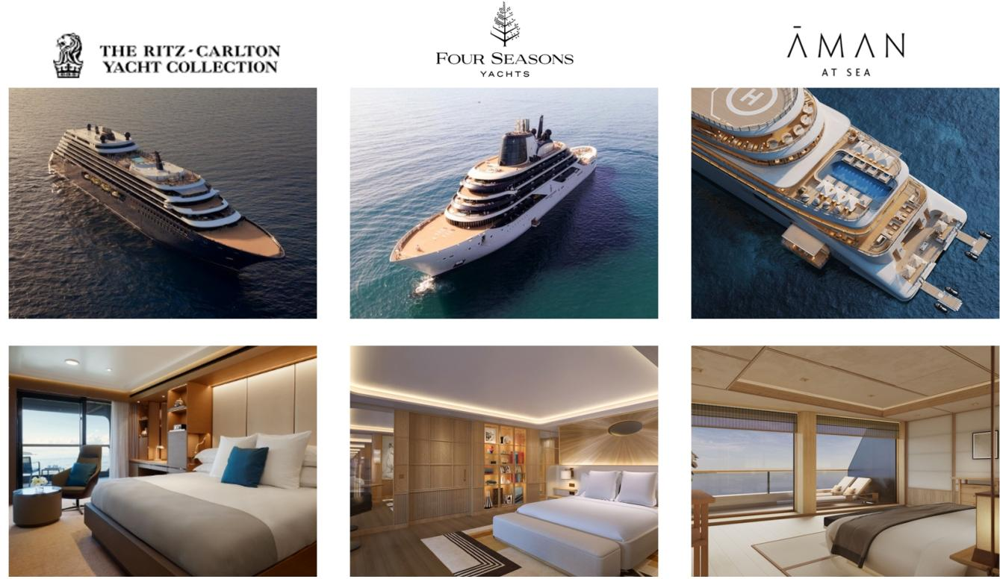
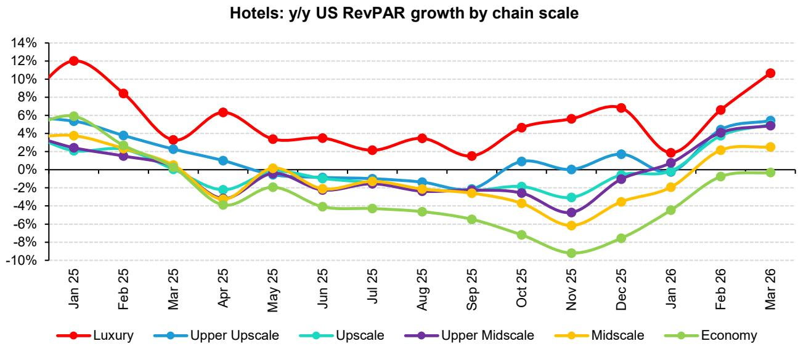
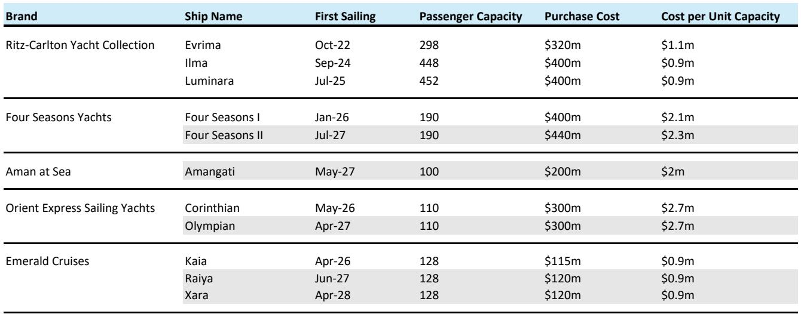

# Bernstein：邮轮市场的真正稀缺资产，不是船，是品牌定位的不可替代性

当大多数投资者还在用“运力增长”和“客单价”来理解邮轮行业时，一份来自Bernstein的深度报告提出了一个更值得追问的问题：在一个供给和需求都在结构性扩张的市场里，什么才是真正不可复制的护城河？

答案不是船队规模，不是航线数量，甚至不是豪华程度。答案是一种近乎反直觉的品牌定位——在奢华邮轮领域，真正跑赢的不是最贵的那个，而是最“不一样”的那个。

这份研报聚焦于一个长期被主流投资者忽视的细分赛道：奢华邮轮。Bernstein的判断很明确：奢华邮轮正站在邮轮行业最强的结构性需求风口上，而在这个细分市场中，只有一家公司具备“纯正标的”属性——Viking。但真正值得深思的，不是Viking的估值，而是它凭什么能在定价上跑赢船型规模相似的竞争对手，以及这种定价权的可持续性。

这不是一篇简单的“推荐买入”报告。它实际上在回答一个更深层的问题：当消费升级的故事不再新鲜，当“有钱人变多”变成共识，企业之间真正的差距，来自对“什么是奢华”的重新定义。

## 1. 奢华邮轮的需求动力，比主流邮轮更陡峭、更确定

Bernstein在报告中明确指出，奢华邮轮面临的两个核心需求驱动因素，在可预见的未来都不会逆转。

第一个因素是人口结构。邮轮消费本身就有明显的年龄倾向，而奢华邮轮尤甚——平均乘客年龄达到63岁。这一群体在美国人口中的占比正在持续扩大，更重要的是，他们的财富集中度也在上升。目前，美国55岁以上人群持有近75%的家庭财富。与此同时，美国收入分布的两极分化进一步加剧，收入最高四分位群体的收入增长最快，休闲时间也最多。这个群体是奢华旅游消费的核心客群。

第二个因素来自供给端。奢华酒店的新增供应正在放缓。建设成本、劳动力成本和融资成本的上升，已经拖慢了高端酒店的开发速度。这意味着，一部分原本流向奢华酒店的需求，将溢出到奢华邮轮市场。

这两个因素叠加，构成了一组罕见的“需求加速、供给受限”的定价环境。但问题在于，这种宏观利好是否足以支撑所有奢华邮轮品牌的增长？Bernstein的回答是：未必。宏观只是背景，真正的分化来自品牌能否抓住这个机会窗口。

## 2. 奢华邮轮不是同质化竞争，定价分层远比想象中剧烈

与主流邮轮市场不同，奢华邮轮内部存在显著的差异化。Bernstein的报告将奢华邮轮分为三个层级：中型船奢华（约1000客位）、小型船奢华（500-700客位）和游艇级（100-400客位）。每晚价格从300-700美元一路攀升至5000美元以上，甚至高达8000美元。

关键变量是船型大小。消费者愿意为更小的船支付指数级更高的价格。乘坐阿曼集团110客位游艇的每晚价格，是Seabourn一艘五倍大小船只的10倍。这背后的逻辑不难理解：更小的船意味着更高的私密性、更多的个人空间和更高的服务密度。

但这份报告真正有意思的发现是：Viking打破了这条定价曲线。在约1000客位的船型中，Viking的定价远高于同级别的Oceania，甚至接近小型船奢华品牌。消费者愿意为Viking支付约两倍于船型规模所“应得”的价格。这意味着，Viking的定价权并非来自硬件规模，而是来自品牌本身。

## 3. Viking的差异化，不是“更好”，而是“不同”

Bernstein用三个维度解释了Viking如何实现这种定价溢价。

第一，Viking卖的“不是船，是目的地”。其他奢华邮轮品牌强调船上体验——餐饮、服务、全包式享受。Viking则聚焦于“有思想的人”，通过船上历史学家、文化讲座和精心策划的岸上游览，让乘客在抵达目的地之前就已经开始“学习”。这种定位，本质上是在重新定义奢华邮轮的价值主张：不是被服务，而是被启发。

第二，Viking提供的是“放松的奢华”，而非“炫耀的奢华”。它不提供香槟和鱼子酱，不配备管家和白手套，不设赌场，不拍卖艺术品。它的设计语言是斯堪的纳维亚式的简约和克制。这种风格在吸引“非传统邮轮乘客”方面尤其有效——那些对主流邮轮文化有抵触心理的高净值消费者。

第三，Viking刻意与整个邮轮行业保持距离。它的营销材料明确列出“Viking不是什么”：没有18岁以下儿童，没有赌场，没有伞饮，没有摄影销售，没有艺术拍卖，没有正式晚宴。这种“减法”策略，实际上是在建立一种身份认同——Viking的乘客不是“邮轮游客”，而是“旅行者”。

这种差异化带来的结果是：2025年，Viking的重复乘客占比高达54%。口碑评分在奢华邮轮品牌中遥遥领先。品牌忠诚度直接转化为定价能力和复购率。

## 4. 供给增长的真正约束不在数量，而在成本结构

奢华邮轮的供给增长是有限的。Bernstein的测算显示，到2030年，Viking将贡献奢华邮轮市场超过50%的新增运力。但报告同时指出，Viking的船型设计使其能够以极低的每客位成本增加运力——每客位成本约为50万美元，与主流邮轮品牌相当，但收益显著更高。

这意味着，Viking在扩张时，不会像其他奢华品牌那样面临“规模稀释品质”的困境。它的船型标准化程度高，设计成熟，供应链稳定，因此边际扩张成本可控。而其他品牌，尤其是游艇级品牌，每客位成本可能高出数倍，且船型非标准化，扩张节奏受制于定制化造船周期。

这一成本优势，是Viking在供给端建立壁垒的关键。它不仅能跟上需求增长，还能在增长中保持利润率的稳定性。

## 5. 报告尚未完全回答的关键问题：游艇级品牌的竞争格局会如何演变

Bernstein的报告对游艇级品牌的定位进行了区分：它们与传统奢华邮轮不构成直接竞争。丽思卡尔顿、四季、东方快车、阿曼等品牌的游艇，更多是在延伸其已有的酒店品牌资产，吸引的是对“邮轮”概念有抵触但对“游艇”概念有兴趣的高净值客户。

但这里存在一个尚未被充分回答的问题：如果游艇级品牌的数量继续增加，它们是否会侵蚀传统奢华邮轮的高端客群？目前，游艇级品牌的定价远高于传统奢华邮轮，但两者的客群是否有重叠？当四季和阿曼的船队规模扩大后，它们是否会向下渗透，推出价格更低的船型？

另一个未解问题是：Viking的差异化定位是否具有长期可持续性？它的“有思想的人”定位，本质上依赖一个特定的文化语境——北美高知退休群体的价值观。如果这一群体的审美偏好发生变化，或者新一代高净值消费者对“文化 enrichment”的兴趣下降，Viking的品牌护城河是否会受到侵蚀？

这些问题，报告没有给出确定的答案，但它们恰恰是投资者需要持续跟踪的关键变量。

## 6. 观察框架：判断奢华邮轮品牌价值的三个维度

基于这份报告，我们可以提炼出一个评估奢华邮轮品牌价值的框架：

第一，看定价与船型的偏离度。如果品牌能够像Viking一样，在相似船型下获得显著高于行业均值的定价，说明品牌具有真正的差异化。如果定价完全由船型大小决定，则品牌溢价能力有限。

第二，看重复乘客率与口碑评分。奢华邮轮的本质是“体验型消费”，复购率和口碑是品牌忠诚度的直接体现。高复购率意味着获客成本低、客户生命周期价值高。

第三，看单位运力扩张成本。在需求增长确定的情况下，能够以低成本扩张运力的品牌，将享有更大的利润弹性。如果扩张成本过高，增长反而可能侵蚀利润率。

这三个维度，可以帮助投资者区分“结构性赢家”和“周期性跟随者”。

## 7. 顺着这些未解问题继续读完整报告

Bernstein这份报告的价值，不仅在于它给出了对Viking和皇家加勒比的“跑赢”评级，更在于它提供了一个理解奢华邮轮竞争逻辑的分析框架。报告中对船型成本、定价曲线、品牌定位的量化拆解，远比“买什么股票”更具参考意义。

但报告也有一些值得进一步探讨的盲区：游艇级品牌的扩张是否会对传统奢华邮轮形成价格锚定效应？Viking的“文化 enrichment”定位是否能在非北美市场复制？奢华邮轮对目的地港口基础设施的依赖，是否会在未来成为增长的隐性瓶颈？

这些问题的答案，藏在报告的细节数据、图表和假设中。如果你希望更深入地理解这些未解问题，欢迎来星球的微信群里继续讨论。我们会在群内分享完整的研报原文、关键图表，以及基于报告的进一步推演。

Personal reading notes and learning share only. Not investment advice.

