# Weekend Healthcare Pulse: Global medical imaging - AI Innovation from the land of Silicon Valley

Susannah Ludwig +41 582 723 127 susannah.ludwig@bernsteinsg.com

Courtney Breen +1 917 344 8407 courtney.breen@bernsteinsg.com

Lee Hambright +1 917 344 8429 lee.hambright@bernsteinsg.com

Nandan Kulkarni +91 22 6842 1436 nandan.kulkarni@bernsteinsg.com

Delphine Le Louet +33 1 42 13 92 93 delphine.le-louet@bernsteinsg.com

Rebecca Liang, Ph.D. +852 2123 2656 rebecca.liang@bernsteinsg.com

William Pickering, MD +1 917 344 8340 william.pickering@bernsteinsg.com

Justin Smith +44 20 7762 5899 justin.smith@bernsteinsg.com

Miki Sogi, Ph.D. +81 3 6777 6991 miki.sogi@bernsteinsg.com

Lance Wilkes +1 917 344 8501 lance.wilkes@bernsteinsg.com

Jeffrey Walch +1 917 344 8613 jeffrey.walch@bernsteinsg.com

As AI and machine learning excel at pattern recognition and anomaly detection, image analysis is one of the healthcare segments best suited for adoption. Over the past decade, leading imaging companies, major technology firms, and a growing number of start-ups have introduced AI-driven tools aimed at improving both the speed and accuracy of lesion detection. In today's Weekend Healthcare Pulse, we examine several prominent start-ups and recently IPO-listed players in radiology, focusing on how they are using AI to enhance clinical workflows and the competitive dynamics between these players and the incumbent OEMs.

By Susannah Ludwig, Estelle Pang and Richard Hombach

## RADIOLOGY IS THE MOST ADVANCED SUBMARKET FOR AI ADOPTION IN MEDTECH

Radiology is widely regarded as the most advanced submarket for AI adoption within medtech, primarily because it involves a pattern recognition problem applied to vast volumes of medical images, supported by highly structured and repeatable workflows. Radiologists routinely interpret thousands of images across modalities such as CT, MRI, and X-ray, making the specialty particularly amenable to algorithmic assistance. In this context, AI offers clear and measurable efficiency gains by helping clinicians manage rising scan volumes, reducing reporting workloads, and prioritizing time sensitive cases more effectively.

AI applications are already being embedded across multiple stages of the radiology workflow. These include image acquisition, workflow coordination, post-processing analysis, as well as follow-up management and training (Exhibit 1). In the long-term, there is potential in transforming radiology from a discipline of qualitative interpretation to one of quantitative analysis. This shift is often referred to as radiomics. But in imaging, and in medtech more broadly, AI's main impact in the near to medium-term will likely be more around speeding up workflows, increasing the efficiency of radiology suites, reducing errors, and improving the accuracy of

diagnosis.

EXHIBIT 1: AI application in Diagnostic Imaging

## AI IN DIAGNOSTIC IMAGING

## CENTRALIZED PLATFORM (IIOT)

## IMAGE ACQUISITION

• Patient positioning for MRI  
• Optimal use of contrast agents  
- Faster MRI scan times through under-sampling and reconstruction  
• Coordination of AI applications  
• Post-acquisition assessment prioritization  
• Information management / Treatment planning  
- Coordination of AI applications

Real time scan quality analysis

• Automatic labelling of anatomy (e.g. adjacent organs at risk)  
• Automatic identification of lesions  
• Additional measurements and metrics

## DIAGNOSTIC AIDS (CADx)

• Identifying areas of concern for further investigation (e.g. U/S for fatty liver disease)  
• Identifying aggressive forms of tumour (e.g. in prostate cancer)  
• Suggesting relevant elements of patient history or clinically similar historic cases

One highly skilled radiologist can only train a limited number of new radiologists in one location  
If the skilled radiologist trains an AI tool, then that AI tool can be used to train many more radiologists all over the world

Source: Bernstein analysis

## COVID-19 HAS BEEN A WAKE-UP CALL FOR HOSPITALS TO INVEST FOR EFFICIENCY

Prior to the pandemic, equipment and healthcare IT vendors often struggled to persuade hospitals to adopt new technologies. Many advanced software solutions were seen as useful but not essential, making it difficult to justify investment during procurement. This mindset shifted in 2020, when COVID-19 forced hospitals to rapidly expand ICU capacity and operate more efficiently to manage surging patient volumes. In the aftermath, radiology departments faced significant backlogs, with the pressure persisting as long-term trends continued to intensify. An aging population, as baby boomers move into higher-care years, is increasing demand for imaging services while ongoing staff shortages are pressuring capacity. As a result, the need for technologies that improve efficiency and streamline workflows in the radiology suite persists.

## AGING POPULATION SUSTAINING RADIOLOGY DEMAND

Demographic trends are set to provide a sustained tailwind for diagnostic imaging demand over the coming decade. Aging populations, in particular, are a primary driver, as older individuals typically require more frequent imaging procedures to manage chronic conditions and monitor disease progression. According to the World Bank, the population aged 65 and above is projected to grow at roughly +3% annually through 2030 in the US (Exhibit 2), while Europe is expected to see a growth rate of around +2% over the same period (Exhibit 3). As a result, the underlying demand for basic diagnostic imaging services is likely to remain robust in the medium-term, reinforcing the importance of workflow optimization solutions to help providers keep pace with rising volumes.

EXHIBIT 2: The U.S. senior population will grow at a 3% CAGR through 2030  
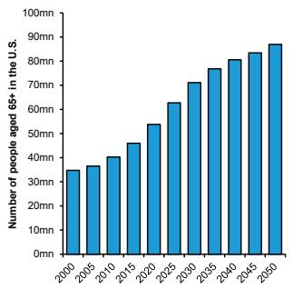

bar chart

| Year | Number of people aged 65+ in the U.S. |
| ---- | ------------------------------------- |
| 2000 | 35                                    |
| 2005 | 38                                    |
| 2010 | 40                                    |
| 2015 | 45                                    |
| 2020 | 55                                    |
| 2025 | 65                                    |
| 2030 | 75                                    |
| 2035 | 80                                    |
| 2040 | 85                                    |
| 2045 | 90                                    |
| 2050 | 95                                    |

Source: World Bank estimates (>2020), Bernstein analysis

EXHIBIT 3: The European senior population will grow at a 2% CAGR through 2030  
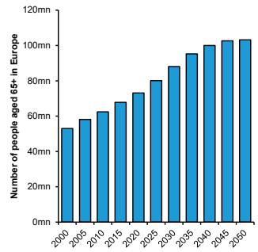

bar chart

| Year | Number of people aged 65+ in Europe |
| ---- | ----------------------------------- |
| 2000 | 50mn                                |
| 2005 | 58mn                                |
| 2010 | 63mn                                |
| 2015 | 68mn                                |
| 2020 | 74mn                                |
| 2025 | 80mn                                |
| 2030 | 88mn                                |
| 2035 | 94mn                                |
| 2040 | 99mn                                |
| 2045 | 102m                                |
| 2050 | 103m                                |

Source: World Bank estimates (>2020), Bernstein analysis

## AI CAN ALLEVIATE STAFFING SHORTAGES BY FREEING UP TIME FOR HOSPITAL STAFF

Labor shortages have been a persistent and structural challenge across healthcare systems, particularly in the United States, and continue to act as a key constraint on radiology throughput. According to the U.S. Health Resources and Services Administration's National Center for Health Workforce Analysis, supply growth of radiology physicians categories is expected to lag demand well into the 2030s. The gap between demand and supply is expected to reach -10% by 2034 (Exhibit 4). As a result, labor availability remains the primary bottleneck to improving imaging

volumes and reducing backlogs, meaning that efficiency gains will be critical to meeting growing demand.

EXHIBIT 4: The gap between U.S. demand and supply of physicians in radiology is expected to reach -10% by 2034  
Estimated supply and demand for radiology physicians (2024-2034E)  
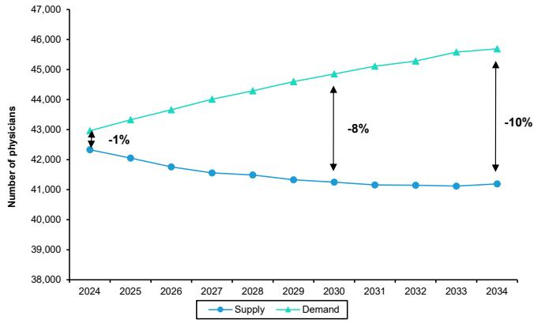

line chart

| Year | Supply | Demand |
|------|--------|--------|
| 2024 | 42,500 | 43,000 |
| 2030 | 41,500 | 45,000 |
| 2034 | 41,500 | 45,500 |

Source: Projection from the US Department of Health and Human Services, Health Resources and Services Administration, Bernstein analysis

AI driven workflow innovation represents one of the most promising levers for alleviating these pressures. Rather than replacing clinical roles, AI has the potential to augment staff productivity by automating repetitive and time intensive tasks across the care pathway. According to a McKinsey industry report, AI could free up to 48% of a medical equipment preparer's time, or 23% for a pharmacist (Exhibit 5). Applied to radiology, similar gains in areas such as image triage, documentation, and coordination could meaningfully expand effective capacity without requiring proportional increases in headcount, positioning AI as a critical enabler of more resilient and scalable imaging workflows in the years ahead.

EXHIBIT 5: AI could free up a significant amount of time for hospital staff  
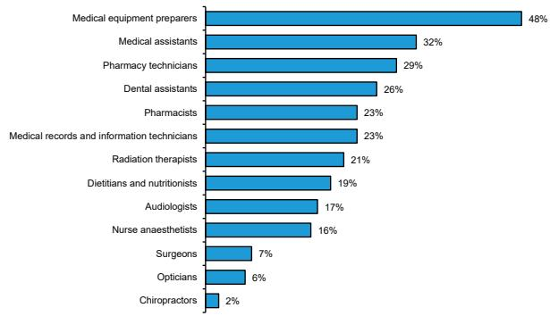

bar chart

| Category | Percentage (%) |
| :--- | :--- |
| Medical equipment preparers | 48 |
| Medical assistants | 32 |
| Pharmacy technicians | 29 |
| Dental assistants | 26 |
| Pharmacists | 23 |
| Medical records and information technicians | 23 |
| Radiation therapists | 21 |
| Dietitians and nutritionists | 19 |
| Audiologists | 17 |
| Nurse anaesthetists | 16 |
| Surgeons | 7 |
| Opticians | 6 |
| Chiropractors | 2 |

Source: McKinsey Global Institute, Bernstein analysis

## LONG WAIT TIMES DRIVING NEED FOR EFFICIENCY IMPROVEMENTS

Long wait times have emerged as one of the most visible and pressing consequences of the structural constraints facing radiology, reinforcing the urgency for workflow efficiency improvements. The deferral of non-urgent procedures during the COVID pandemic created a substantial backlog that healthcare systems have struggled to unwind, even as operations normalize. Despite efforts to expand capacity through incremental hiring and equipment upgrades in the post-pandemic period, waiting lists in many regions remain elevated. The NHS provides a particularly clear example of this dynamic: the number of patients in England waiting more than six weeks for a CT or MRI scan surged from approximately 8,000 pre-pandemic to around 80,000 in 2020, and remains persistently high at roughly 75,000 in 2025 (Exhibit 6).

This sustained backlog underscores a fundamental challenge: healthcare systems face finite labor pools and slow-moving capacity expansion cycles, making it difficult to materially increase throughput through conventional means alone. As a result, reducing wait times is increasingly dependent on improving productivity within existing labor resources. This requires enabling the same number of radiologists and imaging systems to handle greater volumes, which in turn necessitates faster image acquisition, streamlined workflows, and more efficient interpretation. AI-enabled solutions are particularly well positioned to address these bottlenecks by accelerating scan protocols, automating prioritization of urgent cases, and reducing reporting turnaround times. Efficiency gains driven by AI are not merely incremental improvements, but a critical lever for addressing systemic delays and ensuring timely patient access to diagnostic services.

EXHIBIT 6: The number of patients who had to wait at least six weeks for a CT or an MRI more than quadrupled between 2019 and 2020, and continues to be elevated compared to pre-pandemic  
Patients waiting six weeks or more for a MRI or CT scan at NHS  
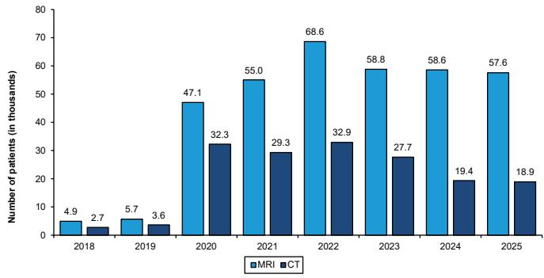

bar chart

| Year | MRI (in thousands) | CT (in thousands) |
| :--- | :--- | :--- |
| 2018 | 4.9 | 2.7 |
| 2019 | 5.7 | 3.6 |
| 2020 | 47.1 | 32.3 |
| 2021 | 55.0 | 29.3 |
| 2022 | 68.6 | 32.9 |
| 2023 | 58.8 | 27.7 |
| 2024 | 58.6 | 19.4 |
| 2025 | 57.6 | 18.9 |

Source: NHS website, Bernstein analysis

## HOW IS SILICON VALLEY STEPPING IN TO SOLVE THE PROBLEMS IN RADIOLOGY

## STARTUPS ARE ADVANCING IN AI-ENABLED SOFTWARE SOLUTIONS

Against the backdrop of mounting pressure on radiology departments, start-ups are stepping in to address these systemic inefficiencies through the development of advanced, AI-enabled software solutions. These firms are rethinking radiology workflows, from image acquisition to reporting and clinical decision support. By leveraging machine learning, automation, and cloud-based platforms, these technologies aim to streamline operations, reduce administrative burden, and enable radiologists to focus on higher-value clinical tasks. The following section highlights several leading startups at the forefront of this transformation, examining the specific challenges they target and the innovative approaches they are deploying to enhance efficiency across the radiology ecosystem.

## Radiology workflow

A typical radiology workflow follows a structured sequence that begins with patient registration, followed by the creation of an imaging order, scheduling, examinations, data archiving (typically in a Picture Archiving and Communication System (PACS)) and reporting review. (Exhibit 7).

EXHIBIT 7: A summary of radiology workflow  
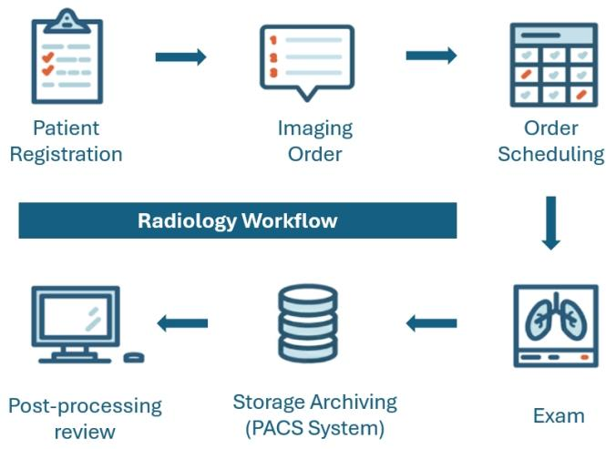

flowchart

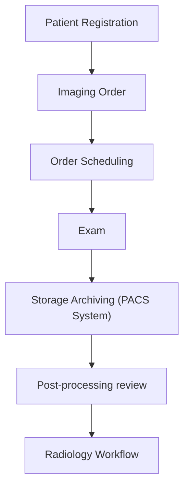

Source: Bernstein analysis

## Storage archiving solutions

In recent years, many of the radiology workflow solutions have focused on the storage and archiving phase, particularly within PACS and adjacent systems. The PACS stores images captured from scanners, organizes them by patient and exam, and makes them instantly available on diagnostic workstations and other

screens inside or outside the hospital. This stage serves as a critical central hub where imaging data is aggregated, retrieved, and prepared for interpretation. AI-enabled solutions are increasingly being deployed here to enhance data management, automate image prioritization, and pre-analyze scans before radiologist review.

## Aidoc (April 2026 Series E, \$520m valuation)

Aidoc is a privately held company, headquartered in Israel. The company's core focus is AI-enabled analysis of CT and X-ray scans, embedded into the radiology workflow via its aiOS and CARE platforms (Exhibit 8), which plug into PACS and hospital systems to run “always-on” image analysis, triage acute findings, and coordinate downstream care teams in areas such as stroke, PE, cardiology, and oncology. This positions Aidoc not just as a point solution but as an enterprise orchestration layer spanning multiple service lines and modalities, differentiating it from vendors that sell single-indication algorithms.

EXHIBIT 8: Aidoc's aiOS platform provides a unified user interface for accessing results from both Aidoc and third-party algorithms  

flowchart

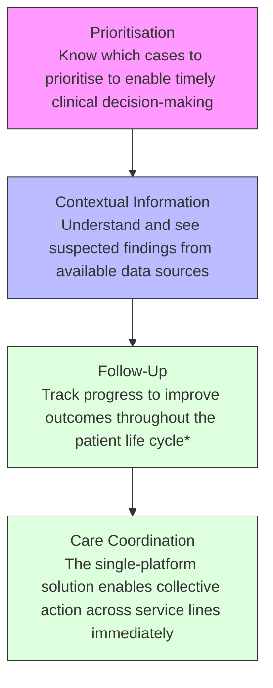

Source: Aidoc website, Bernstein analysis

## Viz.ai (April 2022 Series D, \$1.2bn valuation)

Viz.ai is a privately held company, headquartered in San Francisco, California. The company's main focus is AI-powered detection and workflow for acute neurovascular and cardiovascular conditions. Viz Radiology is the solution Viz.ai has specifically launched to integrate their software offerings into the radiology workflow. It acts as an enterprise informatics interface and care-coordination infrastructure which integrates with PACS to show AI-flagged cases, reshuffles worklists based on clinical urgency, and provides communication tools that allow radiologists to collaborate with neurology, cardiology, ED, and interventional team (Exhibit 9). This emphasis on speed-to-treatment is especially impactful in time-

sensitive conditions such as stroke, where its algorithms analyze CT images in real time and can significantly reduce the time from diagnosis to interventions.

EXHIBIT 9: Viz.ai radiology solutions  
AI-powered care coordination. At the center of clinical decision making.  
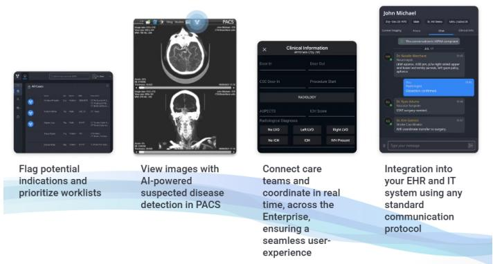

text_image

Flag potential
indications and
prioritize worklists
View images with
AI-powered
suspected disease
detection in PACS
Connect care
teams and
coordinate in real
time, across the
Enterprise,
ensuring a
seamless user-
experience
Integration into
your EHR and IT
system using any
standard
communication
protocol

Source: Viz.ai website, Bernstein analysis

## Rad AI (May 2025 Series C, \$525m valuation)

Rad AI i is a privately held company, headquartered in San Francisco, California. Its core focus is on streamlining radiology reporting. Rad AI Reporting integrates directly with radiologists' existing reporting systems and dictation workflows, using generative AI to auto-draft impressions, carry forward findings, and structure reports while allowing radiologists to dictate or edit in real time (Exhibit 10). The reporting system sits on top of PACS as the primary interface for text generation tied to imaging procedures.

EXHIBIT 10: Rad AI Reporting employs machine learning algorithms and generative AI (GenAI) to assist radiologists to create reports  
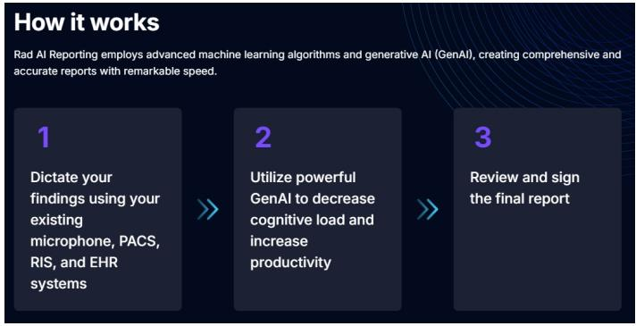

flowchart

Source: Rad AI website, Bernstein analysis

## Post-processing solutions

Post-processing solutions represent a critical layer after the acquisition of images. At this stage, raw imaging data is further processed, reconstructed, and analyzed to extract clinically meaningful insights that support radiologists in making diagnostic decisions. Traditionally, post-processing involved manual adjustments and review, but recent advances in AI have significantly expanded its capabilities. AI-enabled post-processing tools can automatically detect abnormalities, quantify disease burden, prioritize urgent cases, and generate decision support outputs, thereby improving both speed and consistency of interpretation.

## HeartFlow (\$2.5bn market cap)

HeartFlow is now a listed company, debuting on the Nasdaq in August, 2025. Its technology focuses on coronary CT angiography: HeartFlow takes CT images acquired in radiology, uploads them to a cloud platform, and applies computational fluid dynamics and AI to generate non-invasive fractional flow reserve (CT-FFR) maps (i.e. using CT and software to estimate how much blood gets pass any narrowings in the heart arteries, without having to put a catheter into the heart) that are returned to cardiologists and radiologists as decision-support overlays integrated with existing viewers and reporting systems (Exhibit 11). This means it sits as a post-processing layer hooked into imaging workflow rather than replacing PACS itself, changing the diagnostic pathway for stable coronary disease by reducing the need for invasive angiography.

EXHIBIT 11: HeatFlow is a clinically proven AI platform to support end-to-end CAD care  
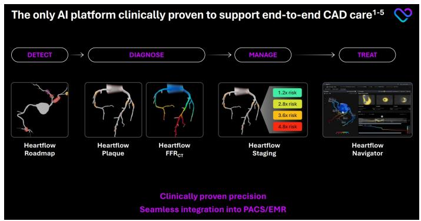

flowchart

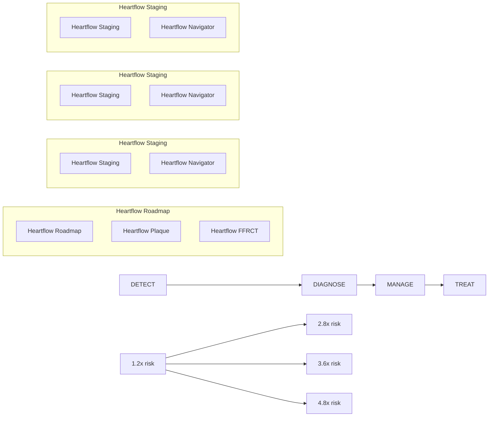

Source: HeartFlow January 2026 investor presentation, Bernstein analysis

## Infervision (July 2021 Series D, c.\$700m valuation)

Infervision is a privately held company, headquartered in Philadelphia, US and has a significant presence in Beijing, China, servicing as its global operations center. The company focuses on deep-learning-based detection and quantification of findings on CT and X-ray. InferRead is Infervision's flagship AI-powered medical imaging product suite, designed to support radiologists across multiple body regions, with a particular emphasis on lung CT and chest X-ray interpretation. At its core is InferRead Lung CT.AI, an FDA- and CE-cleared application that automatically performs lung segmentation, detects and labels pulmonary nodules, and now provides quantitative lung density analysis to flag conditions such as emphysema and interstitial lung disease (Exhibit 12).

EXHIBIT 12: InferRead is Infervision's multi-faceted medical imaging solution  
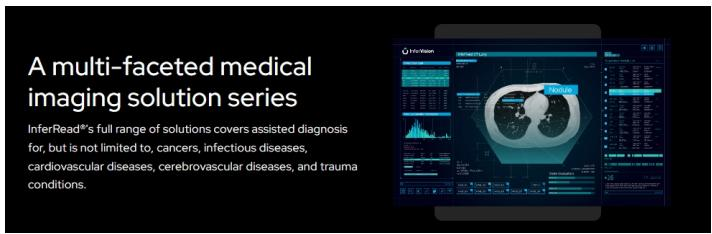

text_image

A multi-faceted medical imaging solution series
InferRead®'s full range of solutions covers assisted diagnosis for, but is not limited to, cancers, infectious diseases, cardiovascular diseases, cerebrovascular diseases, and trauma conditions.

Source: InferRead website, Bernstein analysis

## IMPLICATIONS ON THE COMPETITIVE LANDSCAPE FOR THE INCUMBENT OEMS

While the new generation of startup companies has emerged to help streamline radiology workstreams and improve throughput, the competitive dynamics of the industry remain heavily influenced by incumbent players. Large imaging companies such as Philips, Siemens Healthineers, and GE Healthcare continue to hold dominant positions due to their installed base, deep integration into clinical environments, and access to large scale patient data, which is only increasing as they grow long-term partnerships with hospitals. These advantages support the development of their own AI capabilities (see EU Medtech: AI in Medical Imaging & Radiotherapy - Getting Smarter... the Real Opportunities for Artificial Intelligence for further details) but also along with scale enable them to selectively acquire emerging technologies that complement their existing portfolios. Recent examples include Philips' December 2025 acquisition of SpectraWave, a company providing AI-assisted intravascular imaging and physiological assessment solutions (Exhibit 13), as well as GE Healthcare's February 2023 acquisition of Caption Health, integrating AI powered image guidance into its ultrasound portfolio.

Looking ahead, the market is likely to evolve into a hybrid structure in which established players maintain leadership while incorporating best in class innovations from startups either via partnership or in select cases, via acquisition. Meanwhile, the startup ecosystem is expected to remain fragmented, with specialized solutions addressing discrete workflow challenges and focused clinical areas.

EXHIBIT 13: SpectraWave provides AI-enabled, automated Imaging solutions  
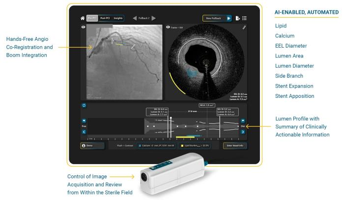

text_image

AI-ENABLED, AUTOMATED
Lipid
Calcium
EEL Diameter
Lumen Area
Lumen Diameter
Side Branch
Stent Expansion
Stent Apposition
Hands-Free Angio
Co-Registration and
Boom Integration
Lumen Profile with
Summary of Clinically
Actionable Information
Control of Image
Acquisition and Review
from Within the Sterile Field

Source: SpectraWave website, Bernstein analysis

## BERNSTEIN HEALTHCARE TEAM

natural_image

Portrait of a smiling woman with shoulder-length brown hair, wearing a black top (no text or symbols visible)

European Consumer Medical  
Technologies - Susannah  
Ludwig

+41 582 723 127,

susannah.ludwig@bernsteinsg.com Siemens Healthineers (SHL.GR)

Smith & Nephew (SN.LN)

  
US Biopharmaceuticals -  
Courtney Breen  
Coverage:

+1 917 344 8407,

courtney.breen@bernsteinsg.com

Alcon (ALC.SW)

Amplifon (AMP.IM)

Convatec (CTEC.LN)

Coloplast (COLOB.DC)

Carl Zeiss (AFX.GR)

Demant (DEMANT.DC)

GN Store Nord (GN.DC)

Sonova (SOON.SW)

Straumann (STMN.SW)

Philips (PHIA.NA)

Siemens Healthineers (SHL.GR)

Smith & Nephew (SN.LN)

Abbvie (ABBV.US)

Amgen (AMGN.US)

Bristol-Myers Squibb (BMY.US)

Eli Lilly (LLY.US)

Gilead Sciences (GILD.US)

Merck (MRK.US)

Moderna (MRNA.US)

Pfizer (PFE.US)

  
US Life Science Tools &  
Diagnostics - Eve Burstein

+1 917 344 8313,

eve.burstein@bernsteinsg.com

  
US Medical Devices - Lee  
Hambright  
Coverage:

Coverage temporarily

suspended as analyst went to

maternity leave

Agilent Technologies (A.US)

Avantor (AVTR.US)

Exact Sciences (EXAS.US)

Guardant Health (GH.US)

Illumina (ILMN.US)

Natera (NTRA.US)

Pacific Biosciences of California

(PACB.US)

Revvity (RVTY.US)

Thermo Fisher Scientific

(TMO.US)

Waters (WAT.US)

Abbott (ABT.US)

Boston Scientific (BSX.US)

DexCom (DXCM.US)

Edwards Lifesciences (EW.US)

Insulet (PODD.US)

Intuitive Surgical (ISRG.US)

Johnson & Johnson (JNJ.US)

+1 917 344 8429,

lee.hambright@bernsteinsg.com

Coverage:  
Coverage:  
  
India Healthcare - Nandan  
Kulkarni

+91 22 6842 1436,

nandan.kulkarni@bernsteinsg.com

Medtronic (MDT.US)

Stryker (SYK.US)

Tandem Diabetes Care

(TNDM.US)

Zimmer Biomet (ZBH.US)

Coverage:

Aurobindo Pharma (ARBP.IN)

Biocon (BIOS.IN)

Lupin (LPC.IN)

Mankind Pharma (MANKIND.IN)

Sun Pharma (SUNP.IN)

Zydus Lifescience

(ZYDUSLIF.IN)

  
European SMID-cap  
Healthcare - Delphine Le  
Louet

+33 1 42 13 92 93, delphine.le-

louet@bernsteinsg.com

Coverage:

Ambu (AMBUB.DC)

Eurofins Scientific (ERF.FP)

Getinge (GETIB.SS)

Gerresheimer (GXI.GY)

Sartorius AG (SRT3.GY)

Sartorius Stedim Biotech

(DIM.FP)

Tecan (TECN.SW)

  
China Pharma and Biotech -  
Rebecca Liang, Ph.D.

+852 2918 5704,

rebecca.liang@bernsteinsg.com

Coverage:

Akeso (9926.HK)

Beigene (ONC.US)

CSPC Pharmaceutical (1093.HK)

Hansoh Pharma (3692.HK)

Innovent Biologics (1801.HK)

Jiangsu Hengrui Medicine

(600276.CH)

Sino Biopharma (1177.HK)

Zai Lab (9688.HK)

  
US SMID-Cap Biotechnology -  
William Pickering, MD

+1 917 344 8340,

william.pickering@bernsteinsg.com

Coverage:

Allogene Therapeutics

(ALLO.US)

Alynlam Pharma (ALNY.US)

Arrowhead Pharma (ARWR.US)

Beam Therapeutics (BEAM.US)

Biogen (BIIB.US)

Biohaven (BHVN.US)

Biomarin Pharma (BMRN.US)

$^{1}$ Crispr Therapeutics (CRSP.US)

Intellia Therapeutics (NTLA.US)

Ionis Pharma (IONS.US)

Regeneron Pharma (REGN.US)

## European Biopharmaceuticals - Justin Smith

+44 20 7762 5899,
justin.smith@bernsteinsg.com

Japan Biopharma - Miki Sogi, Ph.D.

Vertex Pharma (VRTX.US)

## Coverage:

Argenx (ARGX.BB)

AstraZeneca (AZN.LN)

Euroapi (EAPI.FP)

Genmab (GMAB.DC)

Grifols (GRF.SQ)

GSK (GSK.LN)

Lonza (LONN.SW)

Merk (MRK.GR)

Novartis AG (NOVN.SW)

Novo Nordisk (NOVOB.DC)

Roche (ROG.SW)

Sanofi (SAN.FP)

Siegfried (SFZN.SE)

## Coverage:

Astellas Pharma (4503.JP)

Chugai Pharma (4519.JP)

Daiichi Sankyo (4568.JP)

Eisai (4523.JP)

Shionogi (4507.JP)

Takeda Pharma (4502.JP)

+81 3 6777 6991,

miki.sogi@bernsteinsg.com

## US Healthcare Services - Lance Wilkes

+1 917 344 8501,

lance.wilkes@bernsteinsg.com

## US SMID-Cap

## Biopharmaceuticals - Jeffrey Walch

+1 917 344 8613,

jeffrey.walch@bernsteinsg.co

## Coverage:

Agilon Health (AGL.US)

Centene (CNC.US)

Cigna (CI.US)

CVS Health (CVS.US)

Elevance Health (ELV.US)

HCA Healthcare (HCA.US)

Humana (HUM.US)

UnitedHealth (UNH.US)

## Coverage:

BioNTech SE (BNTX.US)

Incyte Corporation (INCY.US)

Jazz Pharmaceutical (JAZZ.US)

Neurocrine Biosciences (NBIX.US)

Nuvalent (NUVL.US)

Revolution Medicines
(RVMD.US)

Summit Therapeutics (SMMT.US)

BERNSTEIN TICKER TABLE

<table><tr><td rowspan="2">Ticker</td><td rowspan="2">Rating</td><td colspan="3">10 Jun 2026</td><td>TTMRel.</td><td colspan="4">Adjusted EPS</td><td colspan="3">Adjusted P/E (x)</td></tr><tr><td>Cur</td><td>Closing Price</td><td>Price Target</td><td>Perf.</td><td>Cur</td><td>2025A</td><td>2026E</td><td>2027E</td><td>2025A</td><td>2026E</td><td>2027E</td></tr><tr><td>SN/.LN (Smith &amp; Nephew)</td><td>M</td><td>GBp</td><td>1,160.50</td><td>1,170.00</td><td>(10.2)%</td><td>USD</td><td>1.01</td><td>1.09</td><td>1.22</td><td>15.4</td><td>14.2</td><td>12.8</td></tr><tr><td>SNN (Smith &amp; Nephew)</td><td>M</td><td>USD</td><td>30.90</td><td>31.85</td><td>(20.2)%</td><td>USD</td><td>2.03</td><td>2.19</td><td>2.43</td><td>15.3</td><td>14.1</td><td>12.7</td></tr><tr><td>PHIA.NA (Philips)</td><td>M</td><td>EUR</td><td>22.46</td><td>25.40</td><td>(4.5)%</td><td>EUR</td><td>1.56</td><td>1.57</td><td>1.74</td><td>14.4</td><td>14.3</td><td>12.9</td></tr><tr><td>PHG (Philips ADR)</td><td>M</td><td>USD</td><td>25.67</td><td>29.20</td><td>(14.1)%</td><td>USD</td><td>1.76</td><td>1.84</td><td>2.03</td><td>14.6</td><td>14.0</td><td>12.6</td></tr><tr><td>SHL.GR (Healthineers)</td><td>O</td><td>EUR</td><td>34.81</td><td>45.70</td><td>(38.7)%</td><td>EUR</td><td>2.38</td><td>2.27</td><td>2.56</td><td>14.6</td><td>15.3</td><td>13.6</td></tr><tr><td>ALC.SW (Alcon)</td><td>O</td><td>CHF</td><td>53.66</td><td>73.50</td><td>(40.5)%</td><td>USD</td><td>3.07</td><td>3.51</td><td>4.22</td><td>22.0</td><td>19.2</td><td>16.0</td></tr><tr><td>ALC (Alcon )</td><td>O</td><td>USD</td><td>66.11</td><td>93.90</td><td>(48.2)%</td><td>USD</td><td>3.07</td><td>3.51</td><td>4.22</td><td>21.6</td><td>18.8</td><td>15.7</td></tr><tr><td>AFX.GY (Carl Zeiss)</td><td>M</td><td>EUR</td><td>25.70</td><td>26.10</td><td>(73.4)%</td><td>EUR</td><td>1.92</td><td>1.56</td><td>1.79</td><td>13.4</td><td>16.5</td><td>14.4</td></tr><tr><td>STMN.SW (Straumann)</td><td>O</td><td>CHF</td><td>94.26</td><td>120.00</td><td>(28.6)%</td><td>CHF</td><td>2.99</td><td>3.15</td><td>3.68</td><td>31.5</td><td>30.0</td><td>25.6</td></tr><tr><td>AMP.IM (Amplifon)</td><td>M</td><td>EUR</td><td>10.54</td><td>9.85</td><td>(63.5)%</td><td>EUR</td><td>0.71</td><td>0.82</td><td>0.87</td><td>14.7</td><td>12.9</td><td>12.1</td></tr><tr><td>GN.DC (GN Store)</td><td>U</td><td>DKK</td><td>92.52</td><td>80.65</td><td>(24.2)%</td><td>DKK</td><td>(1.42)</td><td>(0.36)</td><td>1.00</td><td>(65.2)</td><td>(258.4)</td><td>92.1</td></tr><tr><td>DEMANT.DC (Demant)</td><td>O</td><td>DKK</td><td>253.80</td><td>267.00</td><td>(25.1)%</td><td>DKK</td><td>11.66</td><td>13.48</td><td>15.87</td><td>21.8</td><td>18.8</td><td>16.0</td></tr><tr><td>SOON.SW (Sonova)</td><td>O</td><td>CHF</td><td>203.20</td><td>248.00</td><td>(35.7)%</td><td>CHF</td><td>9.79</td><td>11.12</td><td>12.18</td><td>20.8</td><td>18.3</td><td>16.7</td></tr><tr><td>EDME</td><td></td><td></td><td>1,541.87</td><td></td><td></td><td></td><td></td><td></td><td></td><td></td><td></td><td></td></tr><tr><td>SPX</td><td></td><td></td><td>7,394.30</td><td></td><td></td><td></td><td></td><td></td><td></td><td></td><td></td><td></td></tr></table>

O - Outperform, M - Market-Perform, U - Underperform, NR - Not Rated, CS - Coverage Suspended Source: Bloomberg, Bernstein estimates and analysis.

## I. REQUIRED DISCLOSURES

References to "Bernstein" or the "Firm" in these disclosures relate to the following entities: Bernstein Institutional Services LLC (April 1, 2024 onwards), Bernstein & Co., LLC (pre April 1, 2024), Bernstein Autonomous LLP, BSG France S.A. (April 1, 2024 onwards), Bernstein (Hong Kong) Limited 盛博香港有限公司, Bernstein (Canada) Limited, Bernstein (India) Private Limited (SEBI registration no. INH000006378), Bernstein (Singapore) Private Limited, Bernstein Japan KK (サンフォード・C・バーンスタイン株式会社) and analysts employed by SG Africa Technologies & Services to produce Bernstein under a Global Services Agreement in place between Bernstein and SG.

Bernstein is part of a joint venture between SG (SG) and AllianceBernstein, L.P. (AB). Unless specifically noted otherwise, for purposes of these disclosures, references to Bernstein's “affiliates” relate to both SG and AB and their respective affiliates.

## VALUATION METHODOLOGY

This research publication covers six or more companies. For valuation methodology and other company disclosures:

Please visit: https://bernstein-autonomous.bluematrix.com/sellside/Disclosures.action.

Or, you can also write to the Director of Compliance, Bernstein Institutional Services LLC, 245 Park Avenue, New York, NY 10167.

## RISKS

This research publication covers six or more companies. For risks and other company disclosures:

Please visit: https://bernstein-autonomous.bluematrix.com/sellside/Disclosures.action.

Or, you can also write to the Director of Compliance, Bernstein Institutional Services LLC, 245 Park Avenue, New York, NY 10167.

## RATINGS DEFINITIONS, BENCHMARKS AND DISTRIBUTION

## EQUITY RATINGS DEFINITIONS

## Bernstein brand

The Bernstein brand rates stocks based on forecasts of relative performance for the next 12 months versus the S&P 500 for stocks listed on the U.S. and Canadian exchanges, versus the Bloomberg Europe Developed Markets Large and Mid Cap Price Return Index EUR (EDME) for stocks listed on the European exchanges and emerging markets exchanges outside of the Asia Pacific region, versus the Bloomberg Japan Large and Mid Cap Price Return Index USD (JPL) for stocks listed on the Japanese exchanges, and versus the Bloomberg Asia ex-Japan Large and Mid Cap Price Return Index (ASIAX) for stocks listed on the Asian (ex-Japan) exchanges -unless otherwise specified.

The Bernstein brand has three categories of ratings:

• Outperform: Stock will outpace the market index by more than 15 pp  
• Market-Perform: Stock will perform in line with the market index to within +/-15 pp  
• Underperform: Stock will trail the performance of the market index by more than 15 pp

Coverage Suspended: Coverage of a company under the Bernstein brand has been suspended. Ratings and price targets are suspended temporarily, are no longer current, and should therefore not be relied upon.

Not Rated: A rating assigned when the stock cannot be accurately valued, or the performance of the company accurately predicted, at the present time. The covering analyst may continue to publish research reports on the company to update investors on events and developments.

Not Covered (NC) denotes companies that are not under coverage.

Bernstein brand stock ratings are based on a 12-month time horizon.

## Autonomous brand – common stocks

The Autonomous brand rates common stocks as indicated below. As our benchmarks we use the Bloomberg Europe 500 Banks And Financial Services Index (BEBANKS) and Bloomberg Europe Dev Mkt Financials Large and Mid Cap Price Ret Index EUR (EDMFI) index for developed European banks and Payments, the Bloomberg Europe 500 Insurance Index (BEINSUR) for European insurers, the S&P 500 and S&P Financials for US banks and Payments coverage, S5LIFE for US Insurance, the S&P Insurance Select Industry (SPSIINS) for US Non-Life Insurers coverage, and the Bloomberg Emerging Markets Financials Large, Mid and Small Cap Price Return Index (EMLSF) for emerging market banks and insurers and Payments. Ratings are stated relative to the sector (not the market).

The Autonomous brand has three categories of common stock ratings:

- Outperform (OP): Stock will outpace the relevant index by more than 10 pp  
- Neutral (N): Stock will perform in line with the market index to within +/-10 pp  
• Underperform (UP): Stock will trail the performance of the relevant index by more than 10 pp

Coverage Suspended: Coverage of a company under the Autonomous research brand has been suspended. Ratings and price targets are suspended temporarily, are no longer current, and should therefore not be relied upon.

Not Rated: A rating assigned when the stock cannot be accurately valued, or the performance of the company accurately predicted, at the present time. The covering analyst may continue to publish research reports on the company to update investors on events and developments.

Those denoted as ‘Feature’ (e.g., Feature Outperform FOP, Feature Under Outperform FUP) are our core ideas.

Not Covered (NC) denotes companies that are not under coverage.

Autonomous brand common stock ratings are based on a 12-month time horizon.

## Autonomous brand – preferred stocks

The Autonomous brand has three categories of preferred stock ratings:

- Outperform (OP): The total return of the preferred instrument is expected to outperform preferred securities of other issuers operating in similar sectors or rating categories over the next six months.  
- Neutral (N): The total return of the preferred instrument is expected to perform in line with preferred securities of other issuers operating in similar sectors or rating categories over the next six months.  
- Underperform (UP): The total return of the preferred instrument is expected to underperform preferred securities of other issuers operating in similar sectors or rating categories over the next six months.

Autonomous preferred stock ratings are based on a 6-month time horizon.

## AUTONOMOUS CREDIT RESEARCH

Where this report contains investment recommendations for credit instruments, as defined in article 3(1)(35) of the Market Abuse Regulation, the information below is presented to comply with its disclosure requirements.

The report may also include reference(s) to published opinions by other Autonomous or Bernstein analysts covering the equity securities of the issuer(s) referenced herein. Please note an investment recommendation for credit instruments published by the author(s) of this report may differ from the published view of the analyst covering equity securities for the issuer(s) contained in this report and vice versa.

## CREDIT RATINGS DEFINITIONS

The Autonomous brand has three categories of credit ratings:

- Credit Outperform (C-OP): The total return of the Reference Credit Instrument is expected to outperform the credit spread of bonds of other issuers operating in similar sectors or rating categories over the next six months.  
- Credit Neutral (C-N): The total return of the Reference Credit Instrument is expected to perform in line with the credit spread of bonds of other issuers operating in similar sectors or rating categories over the next six months.  
- Credit Underperform (C-UP): The total return of the Reference Credit Instrument is expected to underperform the credit spread of bonds of other issuers operating in similar sectors or rating categories over the next six months.

Autonomous credit ratings are based on a 6-month time horizon.

A list of all investment recommendations produced by the author(s) of this report alongside credit ratings history are available upon request.

It is at the sole discretion of the Firm as to when to initiate, update and cease research coverage. The Firm has established, maintains and relies on information barriers to control the flow of information contained in one or more areas (i.e. the private side) within the Firm, and into other areas, units, groups or affiliates (i.e. public side) of the Firm

DISTRIBUTION OF EQUITY RATINGS/INVESTMENT BANKING SERVICES

<table><tr><td>Equity Rating</td><td>Market Abuse Regulation (MAR) and FINRA Rating Category</td><td>Global Rating Distribution</td><td>Investment Banking Relationships*</td></tr><tr><td>Outperform</td><td>BUY</td><td>51.1%</td><td>16.5%</td></tr><tr><td>Market-Perform (Bernstein Brand) Neutral (Autonomous Brand)</td><td>HOLD</td><td>36.3%</td><td>17.8%</td></tr><tr><td>Underperform</td><td>SELL</td><td>12.6%</td><td>14.9%</td></tr></table>

\* These figures represent the percentage of companies within each equity rating category for which affiliates of Bernstein have provided investment banking services within the previous 12 months.  
As of March 31, 2026. All figures are updated quarterly.

## PRICE CHARTS/ RATINGS AND PRICE TARGET HISTORY

This research publication covers six or more companies. For price chart and other company disclosures, please visit https://bernstein-autonomous.bluematrix.com/sellside/Disclosures.action or you can write to the Director of Compliance, Bernstein Institutional Services LLC, 245 Park Avenue, New York, NY 10167.

## CONFLICTS OF INTEREST

SG and/or affiliate(s) acted as Joint Bookrunner in Smith & Nephew PLC's bond issue (EUR500m, 12Y).

Bernstein and/or affiliates have received compensation for investment banking services in the past twelve months from Smith & Nephew PLC, Koninklijke Philips NV and Siemens Healthineers AG.

Bernstein and/or affiliates have received compensation for non-investment banking securities-related products or services in the previous twelve months from the following clients: Smith & Nephew PLC, Koninklijke Philips NV and Siemens Healthineers AG.

Bernstein and/or affiliates expect to receive or intend to seek compensation for investment banking services in the next three months from Smith & Nephew PLC and Siemens Healthineers AG.

Certain affiliates of Bernstein act as market maker or liquidity provider in the equities securities of: Smith & Nephew PLC, Koninklijke Philips NV, Siemens Healthineers AG, Alcon Inc, Straumann Holding AG, Amplifon SpA, GN Store Nord A/S, Demant A/S and Sonova Holding AG.

Bernstein and/or affiliates had an investment banking client relationship during the past twelve months with Smith & Nephew PLC, Koninklijke Philips NV and Siemens Healthineers AG.

Affiliates of Bernstein managed or co-managed in the past twelve months a public offering of securities of Smith & Nephew PLC and Koninklijke Philips NV.

Certain affiliates of Bernstein act as market maker or liquidity provider in the debt securities of: Koninklijke Philips NV and Siemens Healthineers AG.

## OTHER MATTERS

The legal entity(ies) employing the analyst(s) listed in this report, and their location, can be determined by the country code of their phone number, as follows:

+1 Bernstein Institutional Services LLC; New York, New York, USA

+44 Bernstein Autonomous LLP; London UK

+212 SG Africa Technologies & Services; Casablanca, Morocco

+33 BSG France S.A.; Paris, France

+34 BSG France S.A.; Madrid, Spain

+41 Bernstein Autonomous LLP; Geneva, Switzerland

+49 BSG France S.A.; Frankfurt, Germany

+91 Bernstein (India) Private Limited; Mumbai, India

+852 Bernstein (Hong Kong) Limited 盛博香港有限公司; Hong Kong, China

+65 Bernstein (Singapore) Private Limited; Singapore

+81 Bernstein Japan KK; Tokyo, Japan

Where this report has been prepared by research analyst(s) employed by a non-US affiliate, such analyst(s), is/are (unless otherwise expressly noted below) not registered as associated persons of Bernstein Institutional Services LLC or any other SEC-registered broker-dealer and are not licensed or qualified as research analysts with FINRA. Accordingly, such analyst(s) may not be subject to FINRA's restrictions regarding (among other things) communications by research analysts with a subject company, interactions between research analysts and investment banking personnel, participation by research analysts in solicitation and marketing activities relating to investment banking transactions, public appearances by research analysts, and trading securities held by a research analyst account.

Where this report has been prepared by research analyst(s) employed by SG Africa Technologies & Services (part of the SG group of companies), it has been prepared on behalf of a Bernstein company under a Global Services Agreement in place between Bernstein and SG.

## CERTIFICATION

Each research analyst listed in this report, who is primarily responsible for the preparation of the content of this report, certifies that all of the views expressed in this publication accurately reflect that analyst's personal views about any and all of the subject securities or issuers and that no part of that analyst's compensation was, is, or will be, directly or indirectly, related to the specific recommendations or views in this publication.

## II. ADDITIONAL GLOBAL CONFLICT DISCLOSURES

It is at the sole discretion of the Firm as to when to initiate, update and cease research coverage. The Firm has established, maintains and relies on information barriers to control the flow of information contained in one or more areas (i.e., the private side)

within the Firm, and into other areas, units, groups or affiliates (i.e., public side) of the Firm.

## III. OTHER IMPORTANT INFORMATION AND DISCLOSURES

Separate branding is maintained for “Bernstein” and “Autonomous” research products.

- Bernstein produces a number of different types of research products including, among others, fundamental analysis and quantitative analysis under both the “Autonomous” and “Bernstein” brands. Recommendations contained within one type of research product may differ from recommendations contained within other types of research products, whether as a result of differing time horizons, methodologies or otherwise. Furthermore, views or recommendations within a research product issued under one brand may differ from views or recommendations under the same type of research product issued under the other brand. The Research Ratings System for the two brands and other information related to those Rating Systems are included in the previous section.  
- Autonomous operates as a separate business unit within the following entities: Bernstein Institutional Services LLC, Bernstein Autonomous LLP, Bernstein (Hong Kong) Limited 盛博香港有限公司 and Bernstein (India) Private Limited. For information relating to “Autonomous” branded products (including certain Sales materials) please visit: www.autonomous.com. For information relating to Bernstein branded products please visit: www.bernsteinresearch.com.

Analysts are compensated based on aggregate contributions to the research franchise as measured by account penetration, productivity and proactivity of investment ideas. No analysts are compensated based on performance in, or contributions to, generating investment banking revenues.

This report has been produced by an independent analyst as defined in Article 3 (1)(34)(i) of EU 596/2014 Market Abuse Regulation (“MAR”) and the same article of MAR as it forms part of United Kingdom domestic law by virtue of the European Union (Withdrawal) Act 2018.

To our readers in the United States: Bernstein Institutional Services LLC, a broker-dealer registered with the U.S. Securities and Exchange Commission (“SEC”) and a member of the U.S. Financial Industry Regulatory Authority, Inc. (“FINRA”) is distributing this publication in the United States and accepts responsibility for its contents. Where this material contains an analysis of debt product(s), such material is intended only for institutional investors and is not subject to the US independence and disclosure standards applicable to debt research prepared for retail investors.

Bernstein Institutional Services LLC may act as principal for its own account or as agent for another person (including an affiliate) in sales or purchases of any security which is a subject of this report. This report does not purport to meet the objectives or needs of any specific individuals, entities or accounts.

To our readers in Canada: If this publication pertains to a Canadian domiciled company, it is being distributed in Canada by Bernstein (Canada) Limited, which is licensed and regulated by the Canadian Investment Regulatory Organization. If the publication pertains to a non-Canadian domiciled company, it is being distributed by Bernstein Institutional Services LLC, which is licensed and regulated by both the SEC and FINRA, into Canada under the International Dealers Exemption.

This document may not be passed onto any person in Canada unless that person qualifies as "permitted client" as defined in Section 1.1 of NI 31-103.

To our readers in Brazil: This report has been prepared by Bernstein Institutional Services LLC, and Banco BTG Pactual S.A. ("BTG") is responsible for the distribution of this report in Brazil.

To readers in the United Kingdom: This publication has been issued or approved for issue in the United Kingdom by Bernstein Autonomous LLP, authorised and regulated by the Financial Conduct Authority and located at 60 London Wall, London EC2M 5SH, +44 (0)20-7170-5000. Registered in England & Wales No OC343985.

This document is for distribution only to persons who (i) have professional experience in matters relating to investments falling within Article 19(5) of the Financial Services and Markets Act 2000 (Financial Promotion) Order 2005 (as amended, the “Financial Promotion Order”), (ii) are persons falling within Article 49(2)(a) to (d) (“high net worth companies, unincorporated associations, etc.”) of the Financial Promotion Order, (iii) are outside the United Kingdom, or (iv) are persons to whom an invitation or inducement to engage in investment activity (within the meaning of section 21 of the FSMA) in connection with the issue or sale of any securities may otherwise lawfully be communicated or caused to be communicated (all such persons together being referred to as “relevant persons"). This document is directed only at relevant persons and must not be acted on or relied on by persons who are not relevant persons. Any investment or investment activity to which this document relates is available only to relevant persons and will be engaged in only with relevant persons.

To our readers in the member states of the EEA: This publication is being distributed by BSG France SA, which is authorised and regulated by the Autorité de Contrôle Prudentiel et de Résolution (ACPR) and Autorité des Marchés Financiers (AMF).

To our readers in Hong Kong: This publication is being distributed in Hong Kong by Bernstein (Hong Kong) Limited 盛博香港有限公司, which is licensed and regulated by the Hong Kong Securities and Futures Commission (Central Entity No. AXC846) to carry out Type 4 (Advising on Securities) regulated activities and subject to the licensing conditions mentioned in the SFC Public Register (https://www.sfc.hk/publicregWeb/corp/AXC846/details)). This publication is solely for professional investors, as defined in the Securities and Futures Ordinance (Cap. 571). The purpose of this report is solely to provide an analysis of the issuers referred to in this report and is not intended for any purpose contrary to the laws of Hong Kong.

To our readers in Singapore: This publication is being distributed in Singapore by Bernstein (Singapore) Private Limited, only to accredited investors or institutional investors, as defined in the Securities and Futures Act 2001 of Singapore ("SFA"). Recipients in Singapore should contact Bernstein (Singapore) Private Limited in respect of matters arising from, or in connection with, this publication. Bernstein (Singapore) Private Limited is regulated by the Monetary Authority of Singapore and licensed under the SFA as a capital markets services licence holder for dealing in capital markets products that are securities and collective investment schemes and an exempt financial adviser for advising on, issuing and promulgating analyses and reports on securities. Bernstein (Singapore) Private Limited is registered in Singapore with Company Registration No. 20213710W and located at 8 Marina Boulevard, #12-01, Marina Bay Financial Centre, Singapore 018981, +65-6326-7000.

To our readers in the People's Republic of China: The securities referred to in this document are not being offered or sold and may not be offered or sold, directly or indirectly, in the People's Republic of China (for such purposes, not including the Hong Kong and Macau Special Administrative Regions or Taiwan, the “PRC”) in contravention of any applicable laws of the PRC.

This document does not constitute an offer to sell or the solicitation of an offer to buy any securities in the PRC to any person to whom it is unlawful to make the offer or solicitation in the PRC.

We do not represent that this document may be lawfully distributed, or that any securities may be lawfully offered, in compliance with any applicable registration or other requirements in the PRC, or pursuant to an exemption available thereunder, or assume any responsibility for facilitating any such distribution or offering. In particular, no action has been taken by us which would permit a public offering of any securities or distribution of this document in the PRC. Accordingly, the securities are not being offered or sold within the PRC by means of this document or any other document. Neither this document nor any advertisement or other offering material may be distributed or published in the PRC, except under circumstances that will result in compliance with any applicable laws and regulations.

To our readers in Japan: This publication is being distributed in Japan by Bernstein Japan KK (サンフォード・C・バーンスタイン株式会社), which is registered in Japan as a Financial Instruments Business Operator with the Kanto Local Finance Bureau (registration number: The Director-General of Kanto Local Finance Bureau (FIBO) No.3387) and regulated by the Financial Services Agency. It is also a member of Investment Management Association of Japan. This publication is solely for qualified institutional investors in Japan only, as defined in Article 2, paragraph (3), items (i) of the Financial Instruments and Exchange Act.

For the institutional client readers in Japan who have been granted access to the Bernstein website by Daiwa Group Inc. ("Daiwa"), your access to this document should not be construed as meaning that Bernstein is providing you with investment advice for any purposes. Whilst Bernstein has prepared this document, your relationship is, and will remain with, Daiwa, and Bernstein has neither any contractual relationship with you nor any obligations towards you.

To our readers in Australia: Bernstein (Hong Kong) Limited 盛博香港有限公司 is responsible for distributing research in Australia. It is regulated by the Securities and Exchange Commission under U.S. laws, by the Financial Conduct Authority under U.K. laws, which differs from Australian laws. Bernstein (Hong Kong) Limited 盛博香港有限公司 is exempt from the requirement to hold an Australian financial services license under the Corporations Act 2001 in respect of the provision of the following financial services to wholesale clients:

• providing financial product advice;

• dealing in a financial product;  
• making a market for a financial product; and  
• providing a custodial or depository service.

To our readers in India: This publication is being distributed in India by Bernstein (India) Private Limited (SCB India) which is licensed and regulated by Securities and Exchange Board of India ("SEBI") as a research analyst entity under the SEBI (Research Analyst) Regulations, 2014, having registration no. INH000006378 and as a stock broker having registration no. INZ000213537. SCB India is currently engaged in the business of providing research and stock broking services. Please refer to www.bernsteinresearch.in for more information.

- SCB India is a Private limited company incorporated under the Companies Act, 2013, on April 12, 2017 bearing corporate identification number U65999MH2017FTC293762, and registered office at Level 3A, 4th Floor, First International Financial Centre, Plot Nos C-54 and C-55, G Block, Near CBI Office, Bandra Kurla Complex, Bandra (East), Mumbai 400098, Maharashtra, India (Phone No: +91-22-68421401).  
- For details of Associates (i.e., affiliates/group companies) of SCB India, kindly email MUM-BERNSTEIN-InCompliance@bernsteinsg.com.  
• SCB India does not have any disciplinary history as on the date of this report.  
- Except as noted above, SCB India and/or its Associates (i.e., affiliates/group companies), the Research Analysts authoring this report, and their relatives

• do not have any financial interest in the subject company  
• do not have actual/beneficial ownership of one percent or more in securities of the subject company;  
- is not engaged in any investment banking activities for Indian companies, as such;  
• have not managed or co-managed a public offering in the past twelve months for any Indian companies;  
- have not received any compensation for investment banking services or merchant banking services from the subject company in the past 12 months;  
• have not received compensation for brokerage services from the subject company in the past twelve months;  
- have not received any compensation or other benefits from the subject company or third party related to the specific recommendations or views in this report; and  
- do not currently, but may in the future, act as a market maker in the financial instruments of the companies covered in the report.  
- do not have any conflict of interest in the subject company as of the date of this report.

- Except as noted above, the subject company has not been a client of SCB India during twelve months preceding the date of distribution of this research report. Neither SCB India nor its Associates (i.e., affiliates/group companies) have received compensation for products or services other than investment banking, merchant banking or brokerage services from the subject company in the past twelve months.  
- The principal research analyst(s) who prepared this report, members of the analysts' team, and members of their households are not an officer, director, employee or advisory board member of the companies covered in the report.  
- Our Compliance officer / Grievance officer is Ms. Rupal Talati, who can be reached at +91-22-68421451, or MUM-BERNSTEIN-InCompliance@bernsteinsg.com / Scbin-investorgrievance@bernsteinsg.com  
- The Research investor charter and Terms & Conditions of SCB India are available on its website and may be accessed at Bernstein (India) Private Limited (https://bernsteinresearch.in/) for your reference.

\- Disclaimer: Registration granted by SEBI, and certification from NISM, is in no way a guarantee of performance of the intermediary or provide any assurance of returns to investors. Investments in securities market are subject to market risks. Read all the related documents carefully before investing.

To our readers in Switzerland: This document is provided in Switzerland by or through Bernstein Autonomous LLP, and is provided only to qualified investors as defined in article 10 of the Swiss Collective Investment Scheme Act (“CISA”) and related provisions of the Collective Investment Scheme Ordinance and in strict compliance with applicable Swiss law and regulations. The products mentioned in this document may not be suitable for all types of investors. This document is based on the Directives on the Independence of Financial Research issued by the Swiss Bankers Association (SBA) in January 2008.

To our readers in the Middle East: Bernstein Autonomous LLP, DIFC branch has its principal office at Gate Village 06, DIFC, Dubai, UAE. Bernstein Autonomous LLP, DIFC branch is regulated by the Dubai Financial Services Authority (DFSA) with the registration number CL10040 and is provisioned for Arranging Deals in Investments and Advising on Financial Products. All communications and services are directed at Professional Clients and Market Counterparties only (as defined in the DFSA rulebook). Persons other than Professional Clients and Market Counterparties, such as Retail Clients, are not the intended recipients of our communications or services.

## LEGAL

All research publications are disseminated to our clients through posting on the firm's password protected websites, bernsteinresearch.com and autonomous.com. Certain, but not all, research publications are also made available to clients through third-party vendors or redistributed to clients through alternate electronic means as a convenience.

This publication has been published and distributed in accordance with the Firm's policy for management of conflicts of interest in investment research, a copy of which is available from Bernstein Institutional Services LLC, Director of Compliance, 245 Park Avenue, New York, NY 10167. Additional disclosures and information regarding Bernstein's business are available on our website www.bernsteinresearch.com.

The securities described herein may not be eligible for sale in all jurisdictions or to certain categories of investors where that permission profile is not consistent with the licenses held by the entities noted herein. This document is for distribution only as may be permitted by law. This publication is not directed to, or intended for distribution to or use by, any person or entity who is a citizen or resident of, or located in any locality, state, country or other jurisdiction where such distribution, publication, availability or use would be contrary to law or regulation or which would subject any of the entities referenced herein or any of their subsidiaries or affiliates to any registration or licensing requirement within such jurisdiction. This publication is based upon public sources we believe to be reliable, but no representation is made by us that the publication is accurate or complete. We do not undertake to advise you of any change in the reported information or in the opinions herein. This publication was prepared and issued by entity referred to herein for distribution to eligible counterparties or professional clients. This publication is not an offer to buy or sell any security, and it does not constitute investment, legal or tax advice. The investments referred to herein may not be suitable for you. Investors must make their own investment decisions in consultation with their professional advisors in light of their specific circumstances. The value of investments may fluctuate, and investments that are denominated in foreign currencies may fluctuate in value as a result of exposure to exchange rate movements. Information about past performance of an investment is not necessarily a guide to, indicator of, or assurance of, future performance.

This report is directed to and intended only for our clients who are “eligible counterparties”, “professional clients”, “institutional investors” and/or “professional investors” as defined by the aforementioned regulators, and must not be redistributed to retail clients as defined by the aforementioned regulators. Retail clients who receive this report should note that the services of the entities noted herein are not available to them and should not rely on the material herein to make an investment decision. The result of such act will not hold the entities noted herein liable for any loss thus incurred as the entities noted herein are not registered/ authorised/ licensed to deal with retail clients and will not enter into any contractual agreement/arrangement with retail clients. This report is provided subject to the terms and conditions of any agreement that the clients may have entered into with the entities noted herein. All research reports are disseminated on a simultaneous basis to eligible clients through electronic publication to our client portal.

The information in this report was prepared by Bernstein solely for the internal business use of our clients. Clients may store, display, analyze, reformat and print the information in this report for this limited use only. Clients may not copy, alter, create derivative works, resell, reverse engineer, commercially exploit, share or distribute any part of the information contained herein for any purpose without Bernstein's express written consent. These restrictions include extracting data or using the content to develop indices or other products. Further, you may not use this report, or any portion of this report, to train or finetune any thirdparty machine learning or artificial intelligence system, or as a prompt or input into any such system. You also may not, without Bernstein's express written consent, do any of the foregoing in connection with your own internal machine learning or artificial intelligence system.

Bernstein may use artificial intelligence tools in the preparation of its materials. Any such materials are reviewed by Bernstein's research analysts prior to publication.

This report has been prepared for information purposes only and is based on current public information that we consider reliable, but the entities noted herein do not warrant or represent (express or implied) as to the sources of information or data contained herein are accurate, complete, not misleading or as to its fitness for the purpose intended even though the entities noted herein rely on reputable or trustworthy data providers, it should not be relied upon as such. Opinions expressed are the author(s)' current opinions as of the date appearing on the material only and we do not undertake to advise you of any change in the reported information or in the opinions herein.

Any references to SG herein are purely factual, based upon publicly available information, and included for comparative purposes only. They do not constitute an opinion or recommendation with respect to the securities of SG.

This publication was prepared and issued by the entity referred to herein for distribution to eligible counterparties or professional clients. The information in this report is intended for general circulation and does not constitute an offer to buy or sell any security, investment, legal or tax advice nor a personal recommendation, as defined by any of the aforementioned regulators. It does not take into account the particular investment objectives, financial situations, or needs of individual investors. The report has not been reviewed by any of the aforementioned regulators and does not represent any official recommendation from the aforementioned regulators. The investments referred to herein may not be suitable for you. Investors must make their own investment decisions in consultation with advice sought from a financial adviser regarding the suitability of the investment product, taking into account the specific investment objectives, financial situation or particular needs of any recipient of the recommendation, before the recipient makes a commitment to purchase the investment product.

The analysis contained herein is based on numerous assumptions. Different assumptions could result in materially different results. The information in this report does not constitute, or form part of, any offer to sell or issue, or any offer to purchase or subscribe for shares, or to induce engagement in any other investment activity. The value of any securities or financial instruments mentioned in this report may fluctuate subject to market conditions. Information about past performance of an investment is not necessarily a guide to, indicative of, or assurance of future performance. Estimates of future performance mentioned by the research analyst in this report are based on assumptions that may not be realized due to unforeseen factors like market volatility/fluctuation. In relation to securities or financial instruments denominated in a foreign currency other than the clients' home currency, movements in exchange rates will have an effect on the value, either favorable or unfavorable. Before acting on any recommendations in this report, recipients should consider the appropriateness of investing in the subject securities or financial instruments mentioned in this report and, if necessary, seek independent professional advice.

The securities described herein may not be eligible for sale in all jurisdictions or to certain categories of investors where that permission profile is not consistent with the licenses held by the entities noted herein. This document is for distribution only as may be permitted by law. It is not directed to, or intended for distribution to or use by, any person or entity who is a citizen or resident of or located in any locality, state, country or other jurisdiction where such distribution, publication, availability or use would be contrary to law or regulation or would subject the entities noted herein to any regulation or licensing requirement within such jurisdiction.

Source: Bloomberg Index Services Limited. BLOOMBERG® is a trademark and service mark of Bloomberg Finance L.P. and its affiliates (collectively “Bloomberg”). Bloomberg or Bloomberg’s licensors own all proprietary rights in the Bloomberg Indices. Neither Bloomberg nor Bloomberg’s licensors approves or endorses this material, or guarantees the accuracy or completeness of any information herein, or makes any warranty, express or implied, as to the results to be obtained therefrom and, to the maximum extent allowed by law, neither shall have any liability or responsibility for injury or damages arising in connection therewith.

No part of this material may be reproduced, distributed or transmitted or otherwise made available without prior consent of the entities noted herein. Copyright Bernstein Institutional Services LLC Bernstein Autonomous LLP, BSG France S.A., Bernstein (Hong Kong) Limited 盛博香港有限公司, Bernstein (Canada) Limited, Bernstein (India) Private Limited (SEBI registration no. INH000006378), Bernstein (Singapore) Private Limited and Bernstein Japan KK (サンフォード・C・バーンスタイン株式会社). All rights reserved. The trademarks and service marks contained herein are the property of their respective owners. Any unauthorized use or disclosure is strictly prohibited. The entities noted herein may pursue legal action if the unauthorized use results in any defamation and/or reputational risk to the entities noted herein and research published under the Bernstein and Autonomous brands.