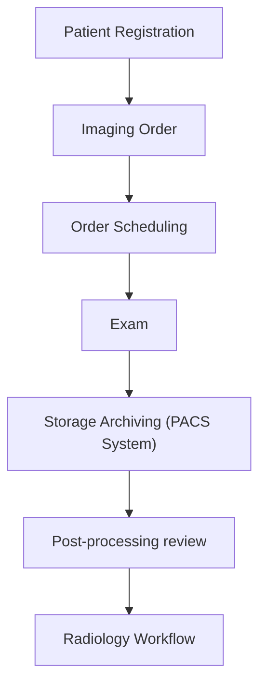
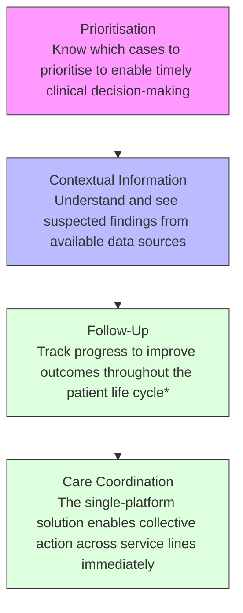

你是知乎商业/行业研究作者，擅长把英文/中文研报改写成适合知乎发布的长文。

【目标】
- 基于下面研报解析内容，生成一篇中文知乎文章。
- 风格接近微信公众号文章，但更适合知乎：论证更完整、语气更克制、有问题意识、有推理链条。
- 文章不需要把研报所有内容讲完，要留下继续阅读完整报告或加入社群讨论的空间。
- 目标长度：约 2200 字，允许上下浮动 20%。

【结构要求】
1. 第一行：知乎标题，直接讲观点，不要标题党，不要夸张极限词。
2. 开头 2-3 段：用一个真实问题或市场分歧切入，说明为什么这份报告值得看。
3. 正文按金字塔原则组织：先给核心判断，再展开 3-5 个支撑逻辑。
4. 每个小标题都要像观点句，不要写“核心判断”“支撑逻辑一”“对读者的启发”这种模板名。
5. 内容要比小红书更理性，比微信更像问答式分析，可以适度提出反问。
6. 结尾自然留下讨论空间，可使用这类表达：`完整报告里还有不少细节，适合放在社群里继续拆。`

【平台发布合规要求】
- 不要出现“投资建议”“买入”“卖出”“强烈推荐”“稳赚”“保本”“必涨”“抄底”“上车”“内幕”“翻倍”等金融操作或收益承诺表达。
- 不要写“非投资建议”“仅做学习交流”这种免责声明，也不要出现包含“投资”的免责声明。
- “投资”相关词尽量改成“投研”“研究”“观察”“学习参考”。
- 不要写“关注”“点赞”“求关注”“评论区留言”等直接互动诱导。
- 不要使用“爆款”“震惊”“必看”“必读”“最强”“最全”“唯一”“全网首发”等极限词。

【内容要求】
- 只能基于研报原文和解析内容推导，不要编造数据、页数、作者、结论或引用。
- 可以基于报告内容做适度发散，但必须明确哪些是报告内容，哪些是你的延展观察。
- 默认避免具体投行品牌名，比如“GS”“GS”，统一写作“投行研报”或使用 GS/JPM/MS 等缩写。
- 不要输出解释说明，只输出知乎文章正文。

【研报解析内容】
"""
# Weekend Healthcare Pulse: Global medical imaging - AI Innovation from the land of Silicon Valley

Susannah Ludwig +41 582 723 127 susannah.ludwig@bernsteinsg.com

Courtney Breen +1 917 344 8407 courtney.breen@bernsteinsg.com

Lee Hambright +1 917 344 8429 lee.hambright@bernsteinsg.com

Nandan Kulkarni +91 22 6842 1436 nandan.kulkarni@bernsteinsg.com

Delphine Le Louet +33 1 42 13 92 93 delphine.le-louet@bernsteinsg.com

Rebecca Liang, Ph.D. +852 2123 2656 rebecca.liang@bernsteinsg.com

William Pickering, MD +1 917 344 8340 william.pickering@bernsteinsg.com

Justin Smith +44 20 7762 5899 justin.smith@bernsteinsg.com

Miki Sogi, Ph.D. +81 3 6777 6991 miki.sogi@bernsteinsg.com

Lance Wilkes +1 917 344 8501 lance.wilkes@bernsteinsg.com

Jeffrey Walch +1 917 344 8613 jeffrey.walch@bernsteinsg.com

As AI and machine learning excel at pattern recognition and anomaly detection, image analysis is one of the healthcare segments best suited for adoption. Over the past decade, leading imaging companies, major technology firms, and a growing number of start-ups have introduced AI-driven tools aimed at improving both the speed and accuracy of lesion detection. In today's Weekend Healthcare Pulse, we examine several prominent start-ups and recently IPO-listed players in radiology, focusing on how they are using AI to enhance clinical workflows and the competitive dynamics between these players and the incumbent OEMs.

By Susannah Ludwig, Estelle Pang and Richard Hombach

## RADIOLOGY IS THE MOST ADVANCED SUBMARKET FOR AI ADOPTION IN MEDTECH

Radiology is widely regarded as the most advanced submarket for AI adoption within medtech, primarily because it involves a pattern recognition problem applied to vast volumes of medical images, supported by highly structured and repeatable workflows. Radiologists routinely interpret thousands of images across modalities such as CT, MRI, and X-ray, making the specialty particularly amenable to algorithmic assistance. In this context, AI offers clear and measurable efficiency gains by helping clinicians manage rising scan volumes, reducing reporting workloads, and prioritizing time sensitive cases more effectively.

AI applications are already being embedded across multiple stages of the radiology workflow. These include image acquisition, workflow coordination, post-processing analysis, as well as follow-up management and training (Exhibit 1). In the long-term, there is potential in transforming radiology from a discipline of qualitative interpretation to one of quantitative analysis. This shift is often referred to as radiomics. But in imaging, and in medtech more broadly, AI's main impact in the near to medium-term will likely be more around speeding up workflows, increasing the efficiency of radiology suites, reducing errors, and improving the accuracy of

diagnosis.

EXHIBIT 1: AI application in Diagnostic Imaging

## AI IN DIAGNOSTIC IMAGING

## CENTRALIZED PLATFORM (IIOT)

## IMAGE ACQUISITION

• Patient positioning for MRI  
• Optimal use of contrast agents  
- Faster MRI scan times through under-sampling and reconstruction  
• Coordination of AI applications  
• Post-acquisition assessment prioritization  
• Information management / Treatment planning  
- Coordination of AI applications

Real time scan quality analysis

• Automatic labelling of anatomy (e.g. adjacent organs at risk)  
• Automatic identification of lesions  
• Additional measurements and metrics

## DIAGNOSTIC AIDS (CADx)

• Identifying areas of concern for further investigation (e.g. U/S for fatty liver disease)  
• Identifying aggressive forms of tumour (e.g. in prostate cancer)  
• Suggesting relevant elements of patient history or clinically similar historic cases

One highly skilled radiologist can only train a limited number of new radiologists in one location  
If the skilled radiologist trains an AI tool, then that AI tool can be used to train many more radiologists all over the world

Source: Bernstein analysis

## COVID-19 HAS BEEN A WAKE-UP CALL FOR HOSPITALS TO INVEST FOR EFFICIENCY

Prior to the pandemic, equipment and healthcare IT vendors often struggled to persuade hospitals to adopt new technologies. Many advanced software solutions were seen as useful but not essential, making it difficult to justify investment during procurement. This mindset shifted in 2020, when COVID-19 forced hospitals to rapidly expand ICU capacity and operate more efficiently to manage surging patient volumes. In the aftermath, radiology departments faced significant backlogs, with the pressure persisting as long-term trends continued to intensify. An aging population, as baby boomers move into higher-care years, is increasing demand for imaging services while ongoing staff shortages are pressuring capacity. As a result, the need for technologies that improve efficiency and streamline workflows in the radiology suite persists.

## AGING POPULATION SUSTAINING RADIOLOGY DEMAND

Demographic trends are set to provide a sustained tailwind for diagnostic imaging demand over the coming decade. Aging populations, in particular, are a primary driver, as older individuals typically require more frequent imaging procedures to manage chronic conditions and monitor disease progression. According to the World Bank, the population aged 65 and above is projected to grow at roughly +3% annually through 2030 in the US (Exhibit 2), while Europe is expected to see a growth rate of around +2% over the same period (Exhibit 3). As a result, the underlying demand for basic diagnostic imaging services is likely to remain robust in the medium-term, reinforcing the importance of workflow optimization solutions to help providers keep pace with rising volumes.

EXHIBIT 2: The U.S. senior population will grow at a 3% CAGR through 2030  

bar chart

| Year | Number of people aged 65+ in the U.S. |
| ---- | ------------------------------------- |
| 2000 | 35                                    |
| 2005 | 38                                    |
| 2010 | 40                                    |
| 2015 | 45                                    |
| 2020 | 55                                    |
| 2025 | 65                                    |
| 2030 | 75                                    |
| 2035 | 80                                    |
| 2040 | 85                                    |
| 2045 | 90                                    |
| 2050 | 95                                    |

Source: World Bank estimates (>2020), Bernstein analysis

EXHIBIT 3: The European senior population will grow at a 2% CAGR through 2030  

bar chart

| Year | Number of people aged 65+ in Europe |
| ---- | ----------------------------------- |
| 2000 | 50mn                                |
| 2005 | 58mn                                |
| 2010 | 63mn                                |
| 2015 | 68mn                                |
| 2020 | 74mn                                |
| 2025 | 80mn                                |
| 2030 | 88mn                                |
| 2035 | 94mn                                |
| 2040 | 99mn                                |
| 2045 | 102m                                |
| 2050 | 103m                                |

Source: World Bank estimates (>2020), Bernstein analysis

## AI CAN ALLEVIATE STAFFING SHORTAGES BY FREEING UP TIME FOR HOSPITAL STAFF

Labor shortages have been a persistent and structural challenge across healthcare systems, particularly in the United States, and continue to act as a key constraint on radiology throughput. According to the U.S. Health Resources and Services Administration's National Center for Health Workforce Analysis, supply growth of radiology physicians categories is expected to lag demand well into the 2030s. The gap between demand and supply is expected to reach -10% by 2034 (Exhibit 4). As a result, labor availability remains the primary bottleneck to improving imaging

volumes and reducing backlogs, meaning that efficiency gains will be critical to meeting growing demand.

EXHIBIT 4: The gap between U.S. demand and supply of physicians in radiology is expected to reach -10% by 2034  
Estimated supply and demand for radiology physicians (2024-2034E)  

line chart

| Year | Supply | Demand |
|------|--------|--------|
| 2024 | 42,500 | 43,000 |
| 2030 | 41,500 | 45,000 |
| 2034 | 41,500 | 45,500 |

Source: Projection from the US Department of Health and Human Services, Health Resources and Services Administration, Bernstein analysis

AI driven workflow innovation represents one of the most promising levers for alleviating these pressures. Rather than replacing clinical roles, AI has the potential to augment staff productivity by automating repetitive and time intensive tasks across the care pathway. According to a McKinsey industry report, AI could free up to 48% of a medical equipment preparer's time, or 23% for a pharmacist (Exhibit 5). Applied to radiology, similar gains in areas such as image triage, documentation, and coordination could meaningfully expand effective capacity without requiring proportional increases in headcount, positioning AI as a critical enabler of more resilient and scalable imaging workflows in the years ahead.

EXHIBIT 5: AI could free up a significant amount of time for hospital staff  

bar chart

| Category | Percentage (%) |
| :--- | :--- |
| Medical equipment preparers | 48 |
| Medical assistants | 32 |
| Pharmacy technicians | 29 |
| Dental assistants | 26 |
| Pharmacists | 23 |
| Medical records and information technicians | 23 |
| Radiation therapists | 21 |
| Dietitians and nutritionists | 19 |
| Audiologists | 17 |
| Nurse anaesthetists | 16 |
| Surgeons | 7 |
| Opticians | 6 |
| Chiropractors | 2 |

Source: McKinsey Global Institute, Bernstein analysis

## LONG WAIT TIMES DRIVING NEED FOR EFFICIENCY IMPROVEMENTS

Long wait times have emerged as one of the most visible and pressing consequences of the structural constraints facing radiology, reinforcing the urgency for workflow efficiency improvements. The deferral of non-urgent procedures during the COVID pandemic created a substantial backlog that healthcare systems have struggled to unwind, even as operations normalize. Despite efforts to expand capacity through incremental hiring and equipment upgrades in the post-pandemic period, waiting lists in many regions remain elevated. The NHS provides a particularly clear example of this dynamic: the number of patients in England waiting more than six weeks for a CT or MRI scan surged from approximately 8,000 pre-pandemic to around 80,000 in 2020, and remains persistently high at roughly 75,000 in 2025 (Exhibit 6).

This sustained backlog underscores a fundamental challenge: healthcare systems face finite labor pools and slow-moving capacity expansion cycles, making it difficult to materially increase throughput through conventional means alone. As a result, reducing wait times is increasingly dependent on improving productivity within existing labor resources. This requires enabling the same number of radiologists and imaging systems to handle greater volumes, which in turn necessitates faster image acquisition, streamlined workflows, and more efficient interpretation. AI-enabled solutions are particularly well positioned to address these bottlenecks by accelerating scan protocols, automating prioritization of urgent cases, and reducing reporting turnaround times. Efficiency gains driven by AI are not merely incremental improvements, but a critical lever for addressing systemic delays and ensuring timely patient access to diagnostic services.

EXHIBIT 6: The number of patients who had to wait at least six weeks for a CT or an MRI more than quadrupled between 2019 and 2020, and continues to be elevated compared to pre-pandemic  
Patients waiting six weeks or more for a MRI or CT scan at NHS  

bar chart

| Year | MRI (in thousands) | CT (in thousands) |
| :--- | :--- | :--- |
| 2018 | 4.9 | 2.7 |
| 2019 | 5.7 | 3.6 |
| 2020 | 47.1 | 32.3 |
| 2021 | 55.0 | 29.3 |
| 2022 | 68.6 | 32.9 |
| 2023 | 58.8 | 27.7 |
| 2024 | 58.6 | 19.4 |
| 2025 | 57.6 | 18.9 |

Source: NHS website, Bernstein analysis

## HOW IS SILICON VALLEY STEPPING IN TO SOLVE THE PROBLEMS IN RADIOLOGY

## STARTUPS ARE ADVANCING IN AI-ENABLED SOFTWARE SOLUTIONS

Against the backdrop of mounting pressure on radiology departments, start-ups are stepping in to address these systemic inefficiencies through the development of advanced, AI-enabled software solutions. These firms are rethinking radiology workflows, from image acquisition to reporting and clinical decision support. By leveraging machine learning, automation, and cloud-based platforms, these technologies aim to streamline operations, reduce administrative burden, and enable radiologists to focus on higher-value clinical tasks. The following section highlights several leading startups at the forefront of this transformation, examining the specific challenges they target and the innovative approaches they are deploying to enhance efficiency across the radiology ecosystem.

## Radiology workflow

A typical radiology workflow follows a structured sequence that begins with patient registration, followed by the creation of an imaging order, scheduling, examinations, data archiving (typically in a Picture Archiving and Communication System (PACS)) and reporting review. (Exhibit 7).

EXHIBIT 7: A summary of radiology workflow  

flowchart

Source: Bernstein analysis

## Storage archiving solutions

In recent years, many of the radiology workflow solutions have focused on the storage and archiving phase, particularly within PACS and adjacent systems. The PACS stores images captured from scanners, organizes them by patient and exam, and makes them instantly available on diagnostic workstations and other

screens inside or outside the hospital. This stage serves as a critical central hub where imaging data is aggregated, retrieved, and prepared for interpretation. AI-enabled solutions are increasingly being deployed here to enhance data management, automate image prioritization, and pre-analyze scans before radiologist review.

## Aidoc (April 2026 Series E, \$520m valuation)

Aidoc is a privately held company, headquartered in Israel. The company's core focus is AI-enabled analysis of CT and X-ray scans, embedded into the radiology workflow via its aiOS and CARE platforms (Exhibit 8), which plug into PACS and hospital systems to run “always-on” image analysis, triage acute findings, and coordinate downstream care teams in areas such as stroke, PE, cardiology, and oncology. This positions Aidoc not just as a point solution but as an enterprise orchestration layer spanning multiple service lines and modalities, differentiating it from vendors that sell single-indication algorithms.

EXHIBIT 8: Aidoc's aiOS platform provides a unified user interface for accessing results from both Aidoc and third-party algorithms  

flowchart

Source: Aidoc website, Bernstein analysis

## Viz.ai (April 2022 Series D, \$1.2bn valuation)

Viz.ai is a privately held company, headquartered in San Francisco, California. The company's main focus is AI-powered detection and workflow for acute neurovascular and cardiovascular conditions. Viz Radiology is the solution Viz.ai has specifically launched to integrate their software offerings into the radiology workflow. It acts as an enterprise informatics interface and care-coordination infrastructure which integrates with PACS to show AI-flagged cases, reshuffles worklists based on clinical urgency, and provides communication tools that allow radiologists to collaborate with neurology, cardiology, ED, and interventional team (Exhibit 9). This emphasis on speed-to-treatment is especially impactful in time-

sensitive conditions such as stroke, where its algorithms analyze CT images in real time and can significantly reduce the time from diagnosis to interventions.

EXHIBIT 9: Viz.ai radiology solutions  
AI-powered care coordination. At the center of clinical decision making.  

text_image

Flag potential
indications and
prioritize worklists
View images with
AI-powered
suspected disease
detection in PACS
Connect care
teams and
coordinate in real
time, across the
Enterprise,
ensuring a
seamless user-
experience
Integration into
your EHR and IT
system using any
standard
communication
protocol

Source: Viz.ai website, Bernstein analysis

## Rad AI (May 2025 Series C, \$525m valuation)

Rad AI i is a privately held company, headquartered in San Francisco, California. Its core focus is on streamlining radiology reporting. Rad AI Reporting integrates directly with radiologists' existing reporting systems and dictation workflows, using generative AI to auto-draft impressions, carry forward findings, and structure reports while allowing radiologists to dictate or edit in real time (Exhibit 10). The reporting system sits on top of PACS as the primary interface for

[中间内容因长度限制已省略]

egoing in connection with your own internal machine learning or artificial intelligence system.

Bernstein may use artificial intelligence tools in the preparation of its materials. Any such materials are reviewed by Bernstein's research analysts prior to publication.

This report has been prepared for information purposes only and is based on current public information that we consider reliable, but the entities noted herein do not warrant or represent (express or implied) as to the sources of information or data contained herein are accurate, complete, not misleading or as to its fitness for the purpose intended even though the entities noted herein rely on reputable or trustworthy data providers, it should not be relied upon as such. Opinions expressed are the author(s)' current opinions as of the date appearing on the material only and we do not undertake to advise you of any change in the reported information or in the opinions herein.

Any references to SG herein are purely factual, based upon publicly available information, and included for comparative purposes only. They do not constitute an opinion or recommendation with respect to the securities of SG.

This publication was prepared and issued by the entity referred to herein for distribution to eligible counterparties or professional clients. The information in this report is intended for general circulation and does not constitute an offer to buy or sell any security, investment, legal or tax advice nor a personal recommendation, as defined by any of the aforementioned regulators. It does not take into account the particular investment objectives, financial situations, or needs of individual investors. The report has not been reviewed by any of the aforementioned regulators and does not represent any official recommendation from the aforementioned regulators. The investments referred to herein may not be suitable for you. Investors must make their own investment decisions in consultation with advice sought from a financial adviser regarding the suitability of the investment product, taking into account the specific investment objectives, financial situation or particular needs of any recipient of the recommendation, before the recipient makes a commitment to purchase the investment product.

The analysis contained herein is based on numerous assumptions. Different assumptions could result in materially different results. The information in this report does not constitute, or form part of, any offer to sell or issue, or any offer to purchase or subscribe for shares, or to induce engagement in any other investment activity. The value of any securities or financial instruments mentioned in this report may fluctuate subject to market conditions. Information about past performance of an investment is not necessarily a guide to, indicative of, or assurance of future performance. Estimates of future performance mentioned by the research analyst in this report are based on assumptions that may not be realized due to unforeseen factors like market volatility/fluctuation. In relation to securities or financial instruments denominated in a foreign currency other than the clients' home currency, movements in exchange rates will have an effect on the value, either favorable or unfavorable. Before acting on any recommendations in this report, recipients should consider the appropriateness of investing in the subject securities or financial instruments mentioned in this report and, if necessary, seek independent professional advice.

The securities described herein may not be eligible for sale in all jurisdictions or to certain categories of investors where that permission profile is not consistent with the licenses held by the entities noted herein. This document is for distribution only as may be permitted by law. It is not directed to, or intended for distribution to or use by, any person or entity who is a citizen or resident of or located in any locality, state, country or other jurisdiction where such distribution, publication, availability or use would be contrary to law or regulation or would subject the entities noted herein to any regulation or licensing requirement within such jurisdiction.

Source: Bloomberg Index Services Limited. BLOOMBERG® is a trademark and service mark of Bloomberg Finance L.P. and its affiliates (collectively “Bloomberg”). Bloomberg or Bloomberg’s licensors own all proprietary rights in the Bloomberg Indices. Neither Bloomberg nor Bloomberg’s licensors approves or endorses this material, or guarantees the accuracy or completeness of any information herein, or makes any warranty, express or implied, as to the results to be obtained therefrom and, to the maximum extent allowed by law, neither shall have any liability or responsibility for injury or damages arising in connection therewith.

No part of this material may be reproduced, distributed or transmitted or otherwise made available without prior consent of the entities noted herein. Copyright Bernstein Institutional Services LLC Bernstein Autonomous LLP, BSG France S.A., Bernstein (Hong Kong) Limited 盛博香港有限公司, Bernstein (Canada) Limited, Bernstein (India) Private Limited (SEBI registration no. INH000006378), Bernstein (Singapore) Private Limited and Bernstein Japan KK (サンフォード・C・バーンスタイン株式会社). All rights reserved. The trademarks and service marks contained herein are the property of their respective owners. Any unauthorized use or disclosure is strictly prohibited. The entities noted herein may pursue legal action if the unauthorized use results in any defamation and/or reputational risk to the entities noted herein and research published under the Bernstein and Autonomous brands.
"""
