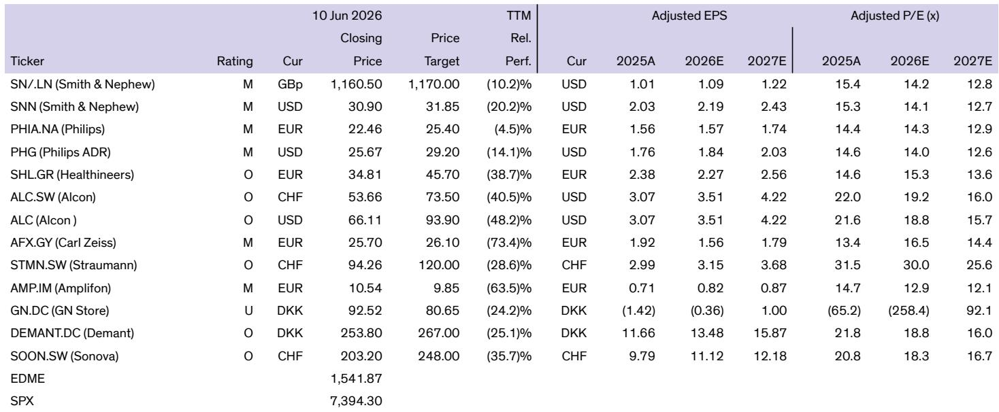
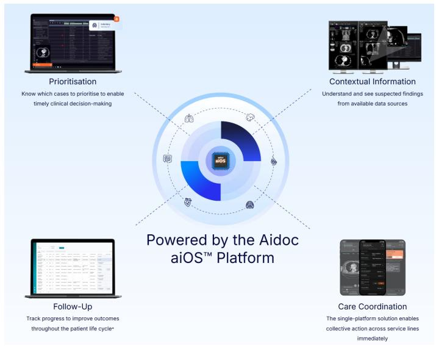

# AI in Radiology Is No Longer Experimental: It Is Becoming the Operational Backbone of Diagnostic Imaging

The conventional narrative around artificial intelligence in healthcare has long been one of cautious optimism, with radiology positioned as the most promising proving ground. That narrative has shifted. What was once a collection of experimental algorithms and pilot programs has matured into a commercially viable, operationally embedded layer of the radiology workflow. The question is no longer whether AI will transform diagnostic imaging, but which players will capture the value, how incumbents will respond, and whether the technology can scale from acute triage to full-spectrum clinical decision support.

A global investment bank report on the medical imaging AI landscape provides the analytical foundation for this argument. The report examines the structural pressures driving AI adoption, the competitive dynamics between established OEMs and a new wave of AI-native startups, and the specific workflow bottlenecks where AI is delivering measurable impact. This article extends that analysis into a strategic framework for understanding the market, identifying the unresolved questions that will determine the winners, and translating the report's insights into actionable decisions for investors, hospital administrators, and technology strategists.

The timing matters. COVID-19 acted as an accelerant, forcing hospitals to confront capacity constraints that had been building for years. The pandemic exposed the fragility of radiology workflows built on manual processes and finite labor pools. But the underlying drivers—aging populations, rising chronic disease prevalence, and persistent staffing shortages—were already in place and will intensify. AI is not a luxury add-on; it is becoming a necessary condition for maintaining access to diagnostic services in the face of structural demand growth.

## The Structural Case for AI in Radiology Rests on Three Irreversible Trends That Conventional Capacity Expansion Cannot Address

The argument for AI in radiology is not primarily about technological novelty. It is about a fundamental mismatch between demand growth and supply constraints that demographic trends and labor markets will only worsen. Three structural trends create the conditions for AI adoption that is not cyclical but secular.

First, the demographic tailwind is powerful and predictable. The population aged 65 and above in the United States is projected to grow at roughly 3 percent annually through 2030, with Europe seeing approximately 2 percent growth over the same period. Older individuals require more frequent imaging procedures to manage chronic conditions, monitor disease progression, and support treatment decisions. This is not a temporary surge; it is a multi-decade shift in the underlying demand curve for diagnostic services.

Second, the labor supply for radiology is structurally constrained and unlikely to keep pace. The gap between demand and supply of radiology physicians in the United States is projected to reach negative 10 percent by 2034. This shortfall reflects not only the time required to train specialists but also the retirement of the baby boomer generation of radiologists and the limited capacity of training programs to expand. The bottleneck is not equipment; it is human expertise.

Third, the post-COVID backlog has not been resolved and may never be fully unwound through conventional means. The number of patients in England waiting more than six weeks for a CT or MRI scan surged from approximately 8,000 pre-pandemic to around 80,000 in 2020, and remains at roughly 75,000 in 2025. This persistence is not a failure of operational management; it reflects the reality that healthcare systems cannot hire their way out of the problem fast enough. Productivity gains are the only scalable solution.

These three trends are mutually reinforcing. Demographic demand will continue to grow. Labor supply will lag. Backlogs will persist or worsen. The implication is clear: the value proposition for AI is not about replacing radiologists but about augmenting their capacity to handle greater volumes without proportional increases in headcount. This is the core economic argument that makes AI adoption not just desirable but necessary.

## The Most Valuable AI Applications Are Not Single-Indication Algorithms but Enterprise Workflow Orchestration Platforms

The early wave of AI in radiology focused on narrow, single-indication algorithms designed to detect specific pathologies such as intracranial hemorrhage, pulmonary embolism, or breast lesions. These tools demonstrated clinical utility but faced commercial limitations. They required integration into existing workflows, created alert fatigue when deployed in isolation, and struggled to demonstrate return on investment for hospitals running dozens of point solutions.

The market is now moving toward a different model: enterprise platforms that orchestrate multiple AI algorithms across the full radiology workflow, from image acquisition through reporting and care coordination. This shift represents a fundamental change in how value is created and captured.

Consider the workflow stages where AI can intervene. Image acquisition can be accelerated through automated patient positioning and optimized use of contrast agents, reducing scan times. Post-acquisition assessment can prioritize urgent cases by analyzing images in real time and flagging critical findings. Reporting can be streamlined through generative AI that auto-drafts impressions and structures reports. Care coordination can be improved by alerting downstream teams and facilitating communication between radiologists, neurologists, cardiologists, and emergency departments.

The companies that are gaining traction are those that integrate across these stages rather than solving a single problem in isolation. Aidoc, for example, has positioned its aiOS platform as an enterprise orchestration layer that runs always-on image analysis, triages acute findings, and coordinates downstream care teams across multiple service lines. Viz.ai has built a care-coordination infrastructure that integrates with PACS to reshuffle worklists based on clinical urgency and provides communication tools for multidisciplinary collaboration. Rad AI focuses on the reporting stage, using generative AI to automate documentation and reduce turnaround times.

The strategic insight is that the platform model creates network effects and switching costs that point solutions cannot replicate. Once a hospital integrates an enterprise AI platform into its PACS, reporting systems, and communication workflows, replacing that platform becomes disruptive and costly. The platform also accumulates data that can be used to improve algorithm performance and train new models, creating a competitive advantage that strengthens over time.

## The Competitive Dynamics Between AI-Native Startups and Incumbent OEMs Are More Complex Than a Simple Disruption Narrative Suggests

The natural framing for the AI in radiology market is a classic disruptor-incumbent battle: agile, AI-native startups challenging slow-moving, hardware-centric OEMs. This narrative captures part of the truth but misses the more nuanced strategic dynamics that will determine market outcomes.

The incumbent OEMs—the companies that manufacture CT, MRI, and X-ray systems—have several structural advantages. They control the hardware that generates the images, giving them privileged access to data and the ability to embed AI directly into acquisition workflows. They have established sales relationships with hospital systems, service contracts that create recurring revenue, and regulatory expertise built over decades. They can also bundle AI software with hardware purchases, making it easier for hospitals to adopt AI without separate procurement processes.

The startups, however, have advantages of their own. They are unencumbered by legacy product architectures and can build software-native platforms optimized for cloud deployment, interoperability, and continuous updates. They can focus on specific workflow pain points that incumbents have been slow to address. They also benefit from the venture capital ecosystem that provides funding for aggressive go-to-market strategies and talent acquisition.

The most likely outcome is not the displacement of incumbents by startups but a more complex competitive landscape in which both groups coexist, collaborate, and compete in different segments. Incumbents will likely acquire or partner with startups to fill gaps in their software capabilities. Startups will need to integrate with OEM hardware to achieve scale. The winners will be those that can navigate this interdependence while building proprietary advantages that are difficult for the other side to replicate.

One open question is whether the OEMs will succeed in building their own AI platforms internally or whether they will remain dependent on third-party software providers. Another is whether the startups can achieve sufficient scale to become independent platforms or whether they will ultimately be acquired by larger technology or healthcare companies. These questions have no clear answers yet, and the strategic choices made by both groups over the next two to three years will shape the market structure for the next decade.

## The Report Does Not Fully Resolve How AI Adoption Will Be Financed or How Reimbursement Models Will Evolve

The report provides a thorough analysis of the clinical and operational case for AI in radiology, but it leaves several critical financial questions unanswered. These questions are not peripheral; they will determine the pace and depth of adoption.

The first question is how hospitals will pay for AI solutions. The report documents the efficiency gains AI can deliver but does not fully address the budget constraints that hospital systems face. AI software is typically sold as a subscription or per-study fee, creating a recurring cost that must be justified against capital budgets already stretched by equipment purchases, facility upgrades, and labor costs. The return on investment calculation depends on assumptions about volume growth, labor savings, and reimbursement changes that are uncertain.

The second question is whether payers will adjust reimbursement to reflect AI-enabled workflows. If AI reduces the time required to interpret a scan, should the professional fee for radiologists decrease? Or should hospitals receive additional reimbursement for using AI to improve diagnostic accuracy and reduce errors? The answers to these questions will have a profound impact on the economics of AI adoption, but they remain unresolved in most markets.

The third question is how the cost of AI will be distributed across the healthcare value chain. Will hospitals bear the full cost, or will vendors share risk through outcome-based pricing models? Will payers reimburse for AI-assisted interpretations separately, or will AI costs be absorbed into existing procedure codes? The report does not provide definitive answers, and the lack of clarity creates uncertainty for both vendors and buyers.

These financial questions are not obstacles to adoption but rather variables that will determine which segments of the market develop fastest. Hospitals with higher volumes and more severe labor shortages will adopt AI regardless of reimbursement uncertainty because the operational necessity outweighs the financial risk. Smaller hospitals and outpatient imaging centers may wait for clearer reimbursement signals before making significant investments.

## A Decision Framework for Stakeholders: Four Strategic Questions That Should Guide Investment and Adoption Decisions

For readers who want to translate the report's analysis into actionable decisions, four strategic questions provide a useful framework. These questions apply to different stakeholders—investors, hospital administrators, technology vendors, and policymakers—but they share a common logic.

First, what is the primary bottleneck in the specific radiology workflow being addressed? The report makes clear that AI applications vary in their impact depending on whether the bottleneck is image acquisition, interpretation, reporting, or care coordination. A hospital struggling with reporting turnaround times should prioritize different solutions than one facing scanner throughput constraints. The decision framework begins with a precise diagnosis of the workflow constraint.

Second, what is the measurable return on investment, and how is it captured? The report documents efficiency gains but does not provide a standardized methodology for calculating ROI. Stakeholders need to model the specific savings in radiologist time, reduction in report turnaround, increase in scan volume, or improvement in diagnostic accuracy that a given AI solution will deliver. They also need to identify who captures the financial benefit—the radiology department, the hospital system, the payer, or the patient—and whether that alignment creates incentives for adoption.

Third, how does the AI solution integrate with existing systems and workflows? The report emphasizes that the most successful AI platforms are those that integrate with PACS, EHR, reporting systems, and communication tools. Stakeholders should evaluate not just the algorithm's clinical performance but also its interoperability, deployment complexity, and impact on existing workflows. A technically superior algorithm that requires manual data entry or disrupts established processes will face adoption resistance.

Fourth, what is the competitive moat, and how durable is it? The report identifies several startups with strong positions, but the durability of those positions depends on factors such as data advantages, network effects, regulatory approvals, and integration depth. Stakeholders should assess whether a given AI solution has proprietary data, algorithm performance that improves with scale, or integration that creates switching costs. Without a durable moat, competitive advantages may be temporary.

These four questions do not produce simple answers, but they provide a structured approach to evaluating a market that is still evolving. The stakeholders who ask these questions rigorously will be better positioned to identify opportunities and avoid pitfalls.

## The Full Report Contains Detailed Analysis of Specific Startups, Workflow Diagrams, and Competitive Positioning Charts That Cannot Be Captured in a Summary

The analysis presented in this article draws on the report's structural insights and strategic frameworks, but the report itself contains a level of detail that cannot be replicated in a summary. The report includes workflow diagrams that map AI applications to specific stages of the radiology process, competitive positioning charts that compare startups across multiple dimensions, and financial analyses of the market opportunity.

For readers who want to understand which specific companies are best positioned, how their technologies compare, and what the financial projections look like, the full report is essential. The charts alone provide visual representations of market dynamics that are difficult to convey in text. The detailed analysis of each startup's product, business model, and competitive positioning offers granular insights that support investment and partnership decisions.

The report also includes discussions of regulatory pathways, clinical validation studies, and adoption timelines that are critical for understanding the pace of market development. These details are not included in this article because the objective is to provide a strategic framework rather than a comprehensive summary. Readers who need the full picture should consult the original report.

Join the community to read the full report and review the original charts.

*This article is for learning and discussion only and does not constitute investment advice.*

Personal reading notes and learning share only. Not investment advice.

