Investor Presentation | Asia Pacific

China Outlook Amid AI And Energy Super Cycle

MS ASIA LIMITED+

Robin Xing

Chief China Economist

Robin.Xing@morganstanley.com

+852 2848-6511

text_image

Asia Summer School 2026

For analyst certification and other important disclosures, refer to the Disclosure Section, located at the end of this report.

## Economic Outlook

## A Two-speed Economy, Stable in Aggregate

Exports driving growth amid AI and energy capex super-cycle  
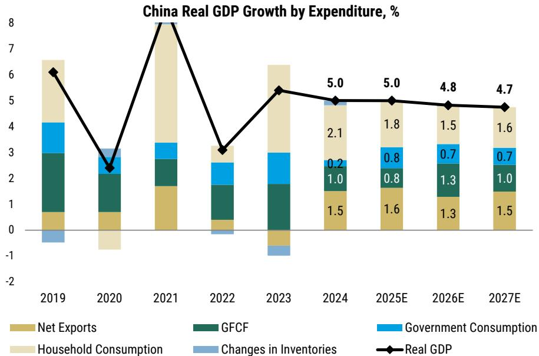

bar-line hybrid

China Real GDP Growth by Expenditure, %
| Year | Net Exports (%) | GFCF (%) | Government Consumption (%) | Household Consumption (%) | Changes in Inventories (%) | Real GDP (in %) |
| :--- | :--- | :--- | :--- | :--- | :--- | :--- |
| 2019 | 0.7 | 2.3 | 1.4 | 1.8 | -0.5 | 6.1 |
| 2020 | 0.7 | 1.4 | 0.5 | -0.8 | -0.3 | 2.4 |
| 2021 | 1.7 | 1.1 | 0.7 | 4.5 | -0.1 | 8.0 |
| 2022 | 0.3 | 1.4 | 1.0 | 0.3 | -0.2 | 3.1 |
| 2023 | -0.5 | 1.7 | 1.1 | 3.1 | -0.8 | 5.4 |
| 2024 | 1.5 | 1.0 | 0.2 | 2.1 | -0.1 | 5.0 |
| 2025E | 1.6 | 0.8 | 0.8 | 1.8 | -0.1 | 5.0 |
| 2026E | 1.3 | 1.3 | 0.7 | 1.5 | -0.1 | 4.8 |
| 2027E | 1.5 | 1.0 | 0.7 | 1.6 | -0.1 | 4.7 |

Inflation is rising but reflation is narrow  
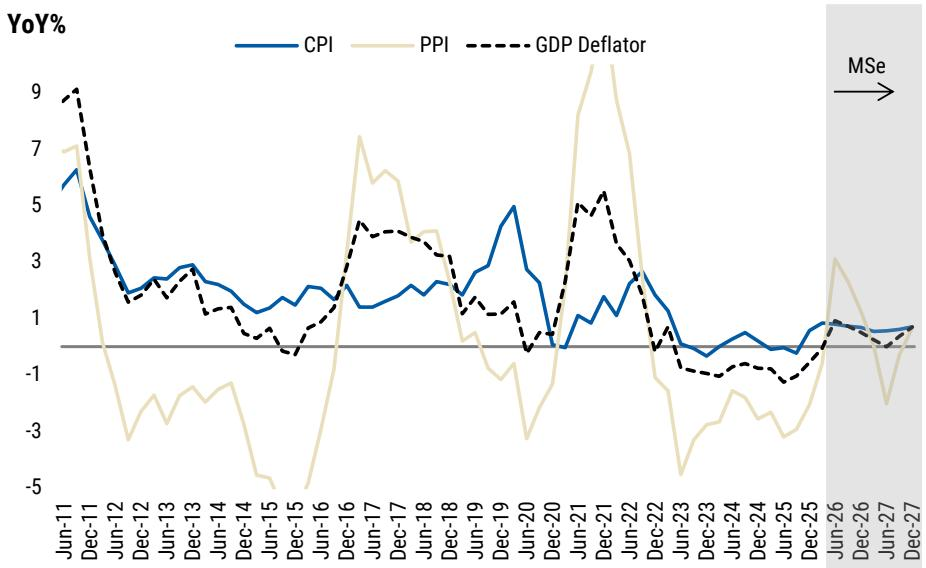

line chart

| Date    | CPI  | PPI  | GDP Deflator |
|---------|------|------|--------------|
| Jun-11  | 6.0  | 7.0  | 9.0          |
| Dec-11  | 5.5  | 6.5  | 8.5          |
| Jun-12  | 2.5  | -3.0 | 1.5          |
| Dec-12  | 2.0  | -2.5 | 1.0          |
| Jun-13  | 2.5  | -2.0 | 1.5          |
| Dec-13  | 3.0  | -1.5 | 2.0          |
| Jun-14  | 2.5  | -1.0 | 1.5          |
| Dec-14  | 2.0  | -0.5 | 1.0          |
| Jun-15  | 1.5  | -0.5 | 0.5          |
| Dec-15  | 1.0  | -0.5 | 0.0          |
| Jun-16  | 1.5  | -0.5 | -0.5         |
| Dec-16  | 2.0  | -1.0 | -1.0         |
| Jun-17  | 2.5  | -2.0 | -2.0         |
| Dec-17  | 3.0  | -3.0 | -3.0         |
| Jun-18  | 3.5  | -4.0 | -4.0         |
| Dec-18  | 4.0  | -5.0 | -5.0         |
| Jun-19  | 4.5  | -6.0 | -6.0         |
| Dec-19  | 5.0  | -7.0 | -7.0         |
| Jun-20  | 4.5  | -8.0 | -8.0         |
| Dec-20  | 3.0  | -9.0 | -9.0         |
| Jun-21  | 2.5  | -10.0| -10.0        |
| Dec-21  | 2.0  | -11.0| -11.0        |
| Jun-22  | 1.5  | -12.0| -12.0        |
| Dec-22  | 1.0  | -13.0| -13.0        |
| Jun-23  | 0.5  | -14.0| -14.0        |
| Dec-23  | 0.0  | -15.0| -15.0        |
| Jun-24  | -0.5 | -16.0| -16.0        |
| Dec-24  | -1.0 | -17.0| -17.0        |
| Jun-25  | -1.5 | -18.0| -18.0        |
| Dec-25  | -2.0 | -19.0| -19.0        |
| Jun-26  | -2.5 | -20.0| -20.0        |
| Dec-26  | -3.0 | -21.0| -21.0        |
| Jun-27  | -3.5 | -22.0| -22.0        |
| Dec-27  | -4.0 | -23.0| -23.0        |

Source: CEIC, MS estimates.

## Economic Outlook

## The Rising Asia Industrial Super-cycle...

Asia is likely to enter its strongest industrial cycle since the mid-2000s, not just an AI/tech story  
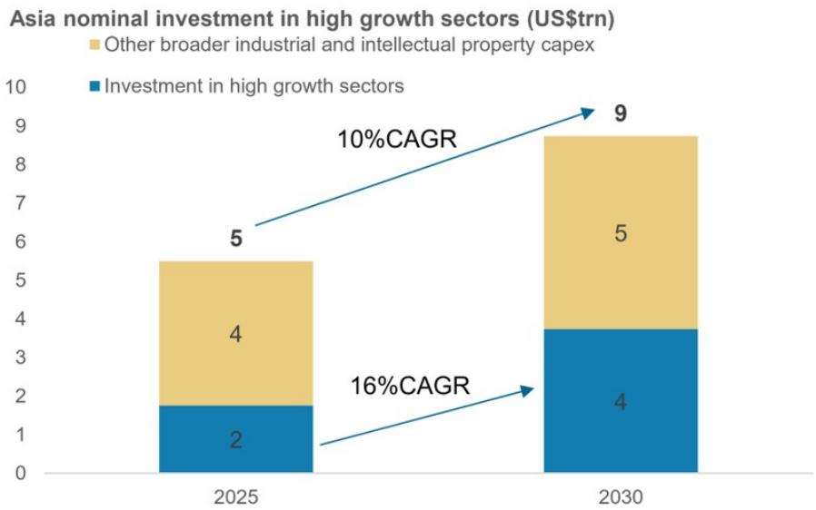

A sharp rise in Asia's non-tech exports since October 2025, which is broad-based across product segments  
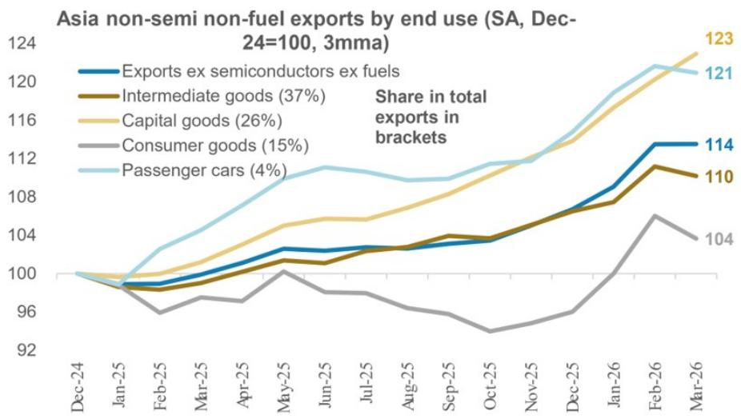

line chart

| Month    | Exports ex semiconductors ex fuels | Intermediate goods (37%) | Capital goods (26%) | Consumer goods (15%) | Passenger cars (4%) |
|----------|-------------------------------------|---------------------------|---------------------|----------------------|--------------------|
| Dec-24   | 100                                 | 100                       | 100                 | 100                  | 100                |
| Jan-25   | 99                                  | 99                        | 99                  | 98                   | 99                 |
| Feb-25   | 99                                  | 99                        | 99                  | 96                   | 100                |
| Mar-25   | 100                                 | 100                       | 100                 | 97                   | 102                |
| Apr-25   | 101                                 | 101                       | 102                 | 97                   | 106                |
| May-25   | 103                                 | 102                       | 104                 | 100                  | 110                |
| Jun-25   | 103                                 | 103                       | 105                 | 98                   | 112                |
| Jul-25   | 103                                 | 103                       | 105                 | 98                   | 112                |
| Aug-25   | 103                                 | 103                       | 106                 | 97                   | 112                |
| Sep-25   | 104                                 | 104                       | 108                 | 96                   | 112                |
| Oct-25   | 104                                 | 104                       | 109                 | 94                   | 112                |
| Nov-25   | 105                                 | 105                       | 110                 | 95                   | 114                |
| Dec-25   | 107                                 | 106                       | 112                 | 96                   | 116                |
| Jan-26   | 109                                 | 108                       | 114                 | 98                   | 118                |
| Feb-26   | 112                                 | 110                       | 116                 | 105                  | 122                |
| Mar-26   | 114                                 | 110                       | 123                 | 104                  | 121                |

Source: CEIC, MS estimates. Note: \*We exclude China's real estate capex given the structural decline in property demand. Capital goods are durable assets used by firms to produce other goods and services, such as computers, machinery and equipment, and transport equipment used in production. Intermediate goods are goods that are processed further or incorporated into final products. Intermediate goods include raw materials (e.g. crude oil, iron ore), processed materials (e.g. steel, chemicals), components and parts (e.g. electronic components, auto parts). We excluded semiconductors and fuels from intermediate goods.

## Economic Outlook

## ...Is Set to Benefit China's Exports, Anchoring Growth Momentum

China has a dominant share in global value-added across manufacturing sectors  
China's share in global value added in individual manufacturing sector  
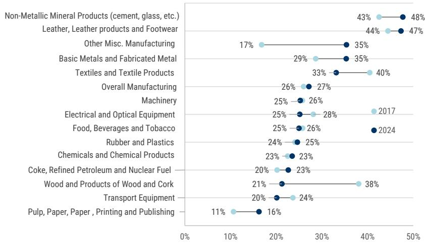

bar-line hybrid chart

| Category | 2017 (%) | 2024 (%) |
| :--- | :--- | :--- |
| Non-Metallic Mineral Products (cement, glass, etc.) | 43 | 48 |
| Leather, Leather products and Footwear | 44 | 47 |
| Other Misc. Manufacturing | 17 | 35 |
| Basic Metals and Fabricated Metal | 29 | 35 |
| Textiles and Textile Products | 33 | 40 |
| Overall Manufacturing | 26 | 27 |
| Machinery | 25 | 26 |
| Electrical and Optical Equipment | 25 | 28 |
| Food, Beverages and Tobacco | 25 | 26 |
| Rubber and Plastics | 24 | 25 |
| Chemicals and Chemical Products | 23 | 23 |
| Coke, Refined Petroleum and Nuclear Fuel | 20 | 23 |
| Wood and Products of Wood and Cork | 21 | 38 |
| Transport Equipment | 20 | 24 |
| Pulp, Paper, Paper, Printing and Publishing | 11 | 16 |

We expect China's global export market share to rise to 16.5% by 2030  
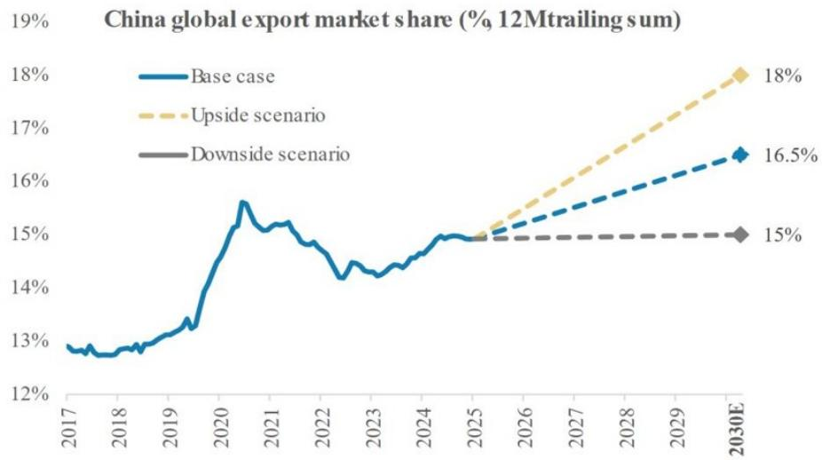

line chart

China global export market share (% 12Mtrailing sum)
| Year | Base case (%) | Upside scenario (%) | Downside scenario (%) |
| :--- | :--- | :--- | :--- |
| 2017 | 12.8 | - | - |
| 2018 | 12.9 | - | - |
| 2019 | 13.2 | - | - |
| 2020 | 15.6 | - | - |
| 2021 | 15.2 | - | - |
| 2022 | 14.3 | - | - |
| 2023 | 14.4 | - | - |
| 2024 | 14.8 | - | - |
| 2025 | 15.0 | 15.0 | 15.0 |
| 2026 | - | 15.3 | 15.0 |
| 2027 | - | 15.7 | 15.0 |
| 2028 | - | 16.2 | 15.0 |
| 2029 | - | 16.8 | 15.0 |
| 2030E | 16.5 | 18.0 | 15.0 |

Source: CEIC, MS estimates. For more details, see Asia Economics: Why China will widen its lead in global manufacturing exports (7 Dec 2025).

## Economic Outlook

## That Said, the Positive Spillover to the Broader Economy Could be Milder This Time

Employment may get less boost as the industrial sector becomes more capital intensive and automated  
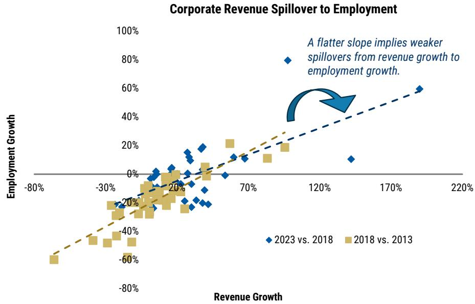

scatter plot

| Revenue Growth | Employment Growth | Comparison        |
| -------------- | ----------------- | ----------------- |
| -80%           | -60%              | 2018 vs. 2013     |
| -30%           | -40%              | 2018 vs. 2013     |
| 0%             | 0%                | 2018 vs. 2013     |
| 70%            | 20%               | 2018 vs. 2013     |
| 120%           | 40%               | 2018 vs. 2013     |
| 170%           | 60%               | 2018 vs. 2013     |
| 220%           | 80%               | 2018 vs. 2013     |

Reduced transmission effect of export strength to capex given pervasive excess capacity  
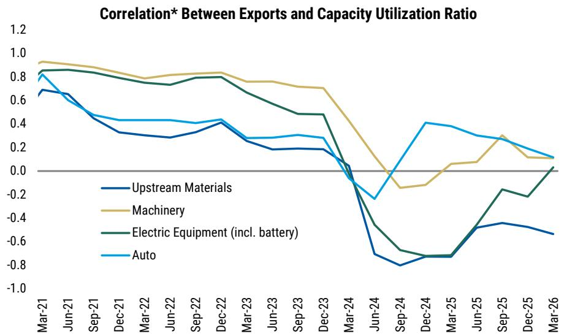  
Source: NBS, Economic Census, MS. Note: RHS: 3-year rolling correlation.

## Economic Outlook

## Domestic Demand is Still Lagging

Labor market slack is the key binding constraint  
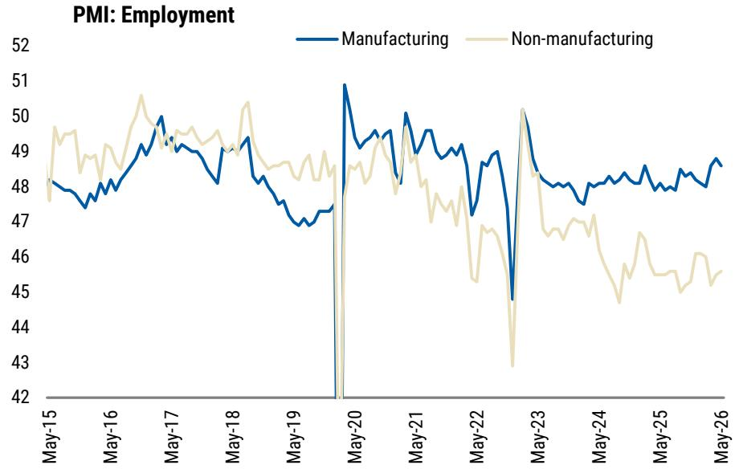

line chart

| Date   | Manufacturing | Non-manufacturing |
|--------|---------------|-------------------|
| May-15 | 48.0          | 49.0              |
| May-16 | 47.5          | 48.5              |
| May-17 | 49.5          | 50.5              |
| May-18 | 48.5          | 49.0              |
| May-19 | 47.0          | 48.0              |
| May-20 | 51.0          | 48.5              |
| May-21 | 49.0          | 48.0              |
| May-22 | 47.5          | 46.0              |
| May-23 | 45.0          | 43.0              |
| May-24 | 48.0          | 46.5              |
| May-25 | 48.5          | 45.5              |
| May-26 | 49.0          | 45.0              |

AI diffusion may add to the labor market stress  

text_image

Generative AI
—

text_image

Agentic AI
—

text_image

Physical AI
—

More entrenched youth unemployment

Erosion of middle-income wage stability

Higher structural displacement risk in the blue-collar service jobs

## Economic Outlook

## Housing: Ongoing Adjustment

Years of declining new starts have depleted the construction pipeline  
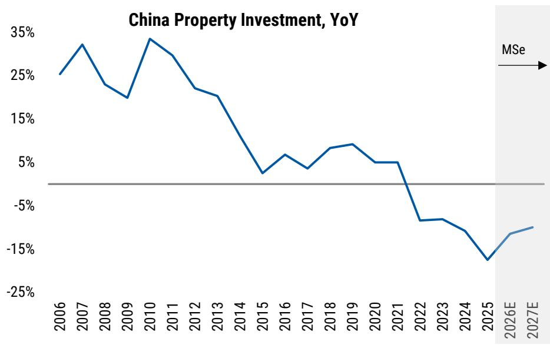

line chart

| Year   | Value  |
| ------ | ------ |
| 2006   | 25%    |
| 2007   | 35%    |
| 2008   | 25%    |
| 2009   | 15%    |
| 2010   | 35%    |
| 2011   | 30%    |
| 2012   | 25%    |
| 2013   | 20%    |
| 2014   | 10%    |
| 2015   | 0%     |
| 2016   | 5%     |
| 2017   | 0%     |
| 2018   | 5%     |
| 2019   | 5%     |
| 2020   | 5%     |
| 2021   | 5%     |
| 2022   | -10%   |
| 2023   | -5%    |
| 2024   | -10%   |
| 2025   | -15%   |
| 2026E  | -10%   |
| 2027E  | -5%    |

Broad housing prices still face headwinds  
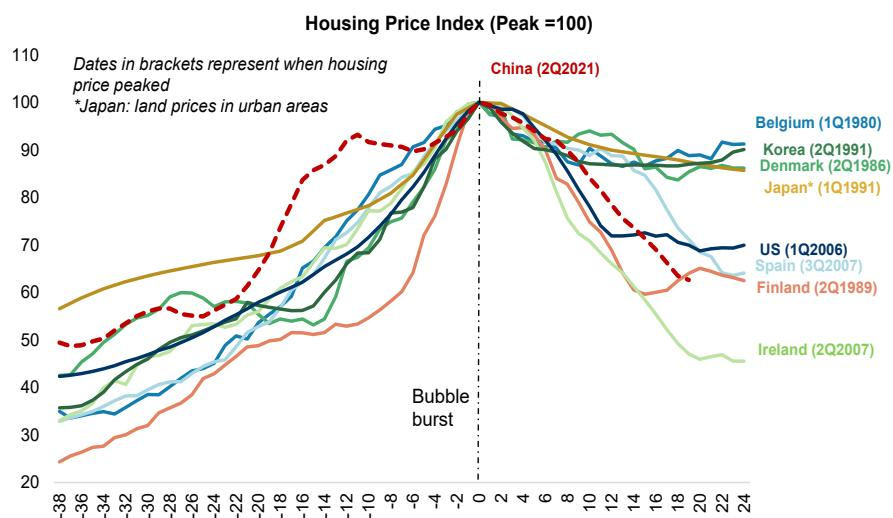

line chart

| Year | Belgium (1Q1980) | Korea (2Q1991) | Denmark (2Q1986) | Japan* (1Q1991) | US (1Q2006) | Spain (3Q2007) | Finland (2Q1989) | Ireland (2Q2007) |
|------|------------------|----------------|------------------|-----------------|-------------|----------------|------------------|------------------|
| 1938 | ~35              | ~35            | ~35              | ~55             | ~40         | ~35            | ~25              | ~35              |
| 1939 | ~38              | ~38            | ~38              | ~58             | ~42         | ~38            | ~28              | ~38              |
| 1940 | ~40              | ~40            | ~40              | ~60             | ~45         | ~40            | ~30              | ~40              |
| 1941 | ~42              | ~42            | ~42              | ~62             | ~48         | ~42            | ~32              | ~42              |
| 1942 | ~45              | ~45            | ~45              | ~65             | ~50         | ~45            | ~35              | ~45              |
| 1943 | ~48              | ~48            | ~48              | ~68             | ~52         | ~48            | ~38              | ~48              |
| 1944 | ~50              | ~50            | ~50              | ~70             | ~55         | ~50            | ~40              | ~50              |
| 1945 | ~52              | ~52            | ~52              | ~72             | ~58         | ~52            | ~42              | ~52              |
| 1946 | ~55              | ~55            | ~55              | ~75             | ~60         | ~55            | ~45              | ~55              |
| 1947 | ~58              | ~58            | ~58              | ~78             | ~62         | ~58            | ~48              | ~58              |
| 1948 | ~60              | ~60            | ~60              | ~80             | ~65         | ~60            | ~50              | ~60              |
| 1949 | ~62              | ~62            | ~62              | ~82             | ~68         | ~62            | ~52              | ~62              |
| 1950 | ~65              | ~65            | ~65              | ~85             | ~70         | ~65            | ~55              | ~65              |
| 1951 | ~68              | ~68            | ~68              | ~88             | ~72         | ~68            | ~58              | ~68              |
| 1952 | ~70              | ~70            | ~70              | ~90             | ~75         | ~70            | ~60              | ~70              |
| 1953 | ~72              | ~72            | ~72              | ~92             | ~78         | ~72            | ~62              | ~72              |
| 1954 | ~75              | ~75            | ~75              | ~95             | ~80         | ~75            | ~65              | ~75              |
| 1955 | ~78              | ~78            | ~78              | ~98             | ~82         | ~78            | ~68              | ~78              |
| 1956 | ~80              | ~80            | ~80              | ~100            | ~85         | ~80            | ~70              | ~80              |
| 1957 | ~82              | ~82            | ~82              | ~100            | ~88         | ~82            | ~72              | ~82              |
| 1958 | ~85              | ~85            | ~85              | ~100            | ~90         | ~85            | ~75              | ~85              |
| 1959 | ~88              | ~88            | ~88              | ~100            | ~92         | ~88            | ~78              | ~88              |
| 1960 | ~90              | ~90            | ~90              | ~100            | ~95         | ~90            | ~80              | ~90              |
| 1961 | ~92              | ~92            | ~92              | ~100            | ~98         | ~92            | ~82              | ~92              |
| 1962 | ~95              | ~95            | ~95              | ~100            | >100        | >95            | >95              | >100             |
| 1963 | >100             | >100           | >100             | >100            | >100        | >100           | >100             | >100             |
| 1964+          (bubble) - Bubble burst; Japan: land prices in urban areas; Belgium (1Q1980); Korea (2Q1991); Denmark (2Q1986); Japan* (1Q1991); US (1Q2006); Spain (3Q2007); Finland (2Q1989); Ireland (2Q2007)

Quarters before/after housing bubble burst  
Source: CEIC, Bingshan, BIS, MS estimates.

## Economic Outlook

## Housing: An Inflection or Another False Start?

Post-LNY rebound in housing sales may partly reflect the release of previously pent-up demand  
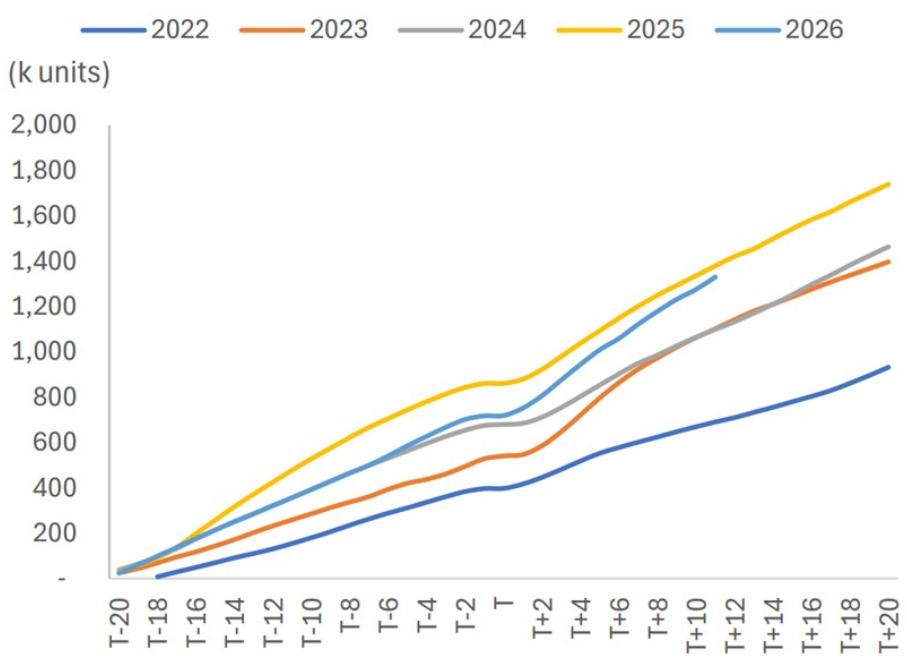

line chart

| Period | 2022 | 2023 | 2024 | 2025 | 2026 |
|--------|------|------|------|------|------|
| T-20   | ~50  | ~50  | ~50  | ~50  | ~50  |
| T-18   | ~100 | ~100 | ~100 | ~100 | ~100 |
| T-16   | ~150 | ~150 | ~150 | ~150 | ~150 |
| T-14   | ~200 | ~200 | ~200 | ~200 | ~200 |
| T-12   | ~250 | ~250 | ~250 | ~250 | ~250 |
| T-10   | ~300 | ~300 | ~300 | ~300 | ~300 |
| T-8    | ~350 | ~350 | ~350 | ~350 | ~350 |
| T-6    | ~400 | ~400 | ~400 | ~400 | ~400 |
| T-4    | ~450 | ~450 | ~450 | ~450 | ~450 |
| T-2    | ~500 | ~500 | ~500 | ~500 | ~500 |
| T      | ~550 | ~550 | ~550 | ~550 | ~550 |
| T+2    | ~600 | ~600 | ~600 | ~600 | ~600 |
| T+4    | ~700 | ~700 | ~700 | ~700 | ~700 |
| T+6    | ~800 | ~800 | ~800 | ~800 | ~800 |
| T+8    | ~900 | ~900 | ~900 | ~900 | ~900 |
| T+10   | ~1,350| ~1,350| ~1,350| ~1,350| ~1,350|
| T+12   | ~1,450| ~1,450| ~1,450| ~1,450| ~1,450|
| T+14   | ~1,550| ~1,550| ~1,550| ~1,550| ~1,550|
| T+16   | ~1,650| ~1,650| ~1,650| ~1,650| ~1,650|
| T+18   | ~1,750| ~1,750| ~1,750| ~1,750| ~1,750|
| T+20   | ~1,950| ~1,950| ~1,950| ~1,950| ~1,950|

A shift toward smaller lump-sum housing  
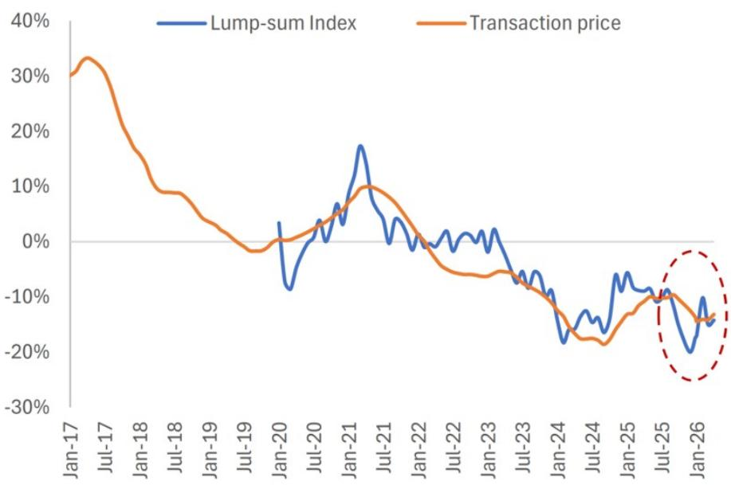

line chart

| Date   | Lump-sum Index | Transaction price |
|--------|----------------|--------------------|
| Jan-17 | ~30%           | ~30%               |
| Jul-17 | ~30%           | ~30%               |
| Jan-18 | ~15%           | ~15%               |
| Jul-18 | ~10%           | ~10%               |
| Jan-19 | ~5%            | ~5%                |
| Jul-19 | ~0%            | ~0%                |
| Jan-20 | ~5%            | ~5%                |
| Jul-20 | ~0%            | ~0%                |
| Jan-21 | ~15%           | ~10%               |
| Jul-21 | ~5%            | ~5%                |
| Jan-22 | ~0%            | ~0%                |
| Jul-22 | ~5%            | ~5%                |
| Jan-23 | ~0%            | ~0%                |
| Jul-23 | ~5%            | ~5%                |
| Jan-24 | ~-10%          | ~-10%              |
| Jul-24 | ~-15%          | ~-15%              |
| Jan-25 | ~-10%          | ~-10%              |
| Jul-25 | ~-15%          | ~-15%              |
| Jan-26 | ~-20%          | ~-20%              |

Source: CEIC, MS. Note: T stands for Chinese New Year week. For more details, see China Property: An Inflection or Another False Start? (18 May 2026).

## Economic Outlook

Housing: Majority of Indicators Show Limited Improvement

<table><tr><td></td><td>Indicators</td><td>March 2025</td><td>April 2026</td><td>Change</td><td>Note</td></tr><tr><td rowspan="9">Resident sentiment (% of respondents in AlphaWise survey)</td><td>Home price outlook of residents</td><td></td><td></td><td></td><td></td></tr><tr><td>- T1 cities</td><td>Net 39% expected decline</td><td>Net 46% expected decline</td><td>↓</td><td></td></tr><tr><td>- T2 cities</td><td>Net 45% expected decline</td><td>Net 48% expected decline</td><td>↓</td><td></td></tr><tr><td>Home purchase plans</td><td></td><td></td><td></td><td></td></tr><tr><td>- T1 cities</td><td>14% respondents</td><td>13% respondents</td><td>↓</td><td></td></tr><tr><td>- T2 cities</td><td>17% respondents</td><td>15% respondents</td><td>↓</td><td></td></tr><tr><td>Home disposal plan</td><td></td><td></td><td></td><td></td></tr><tr><td>- T1 cities</td><td>n/a</td><td>35% respondents</td><td></td><td></td></tr><tr><td>- T2 cities</td><td>n/a</td><td>39% respondents</td><td></td><td></td></tr><tr><td rowspan="24">Housing market health</td><td>Primary inventory level</td><td></td><td></td><td></td><td></td></tr><tr><td>- T1 cities (4 cities)</td><td>~18 months</td><td>&gt;23 months</td><td>↓</td><td></td></tr><tr><td>- T2 cities (27 cities)</td><td>~23 months</td><td>&gt;30 months</td><td>↓</td><td></td></tr><tr><td>Secondary listing volume</td><td></td><td></td><td></td><td></td></tr><tr><td>- T1 cities (4 cities)</td><td>457k units</td><td>435k units</td><td>↑</td><td>BJ / SH / GZ witnessed lower</td></tr><tr><td>- T2 cities (27 cities)</td><td>2.95mn units</td><td>2.98mn units</td><td>↓</td><td>63% cities witnessed higher</td></tr><tr><td>Cumulative home prices decline</td><td></td><td></td><td></td><td></td></tr><tr><td>- T1 cities (4 cities)</td><td>27%</td><td>37%</td><td>↑</td><td></td></tr><tr><td>- T2 cities (29 cities)</td><td>37%</td><td>45%</td><td>↑</td><td></td></tr><tr><td>Affordability (price to income ratio)</td><td></td><td></td><td></td><td></td></tr><tr><td>- T1 cities</td><td>~15x</td><td>~14x</td><td>↑</td><td></td></tr><tr><td>- T2 cities</td><td>~8x</td><td>~7x</td><td>↑</td><td></td></tr><tr><td>Rental rate index</td><td></td><td></td><td></td><td></td></tr><tr><td>- T1 cities (4 cities)</td><td>82.3</td><td>80.5</td><td>↓</td><td></td></tr><tr><td>- T2 cities (31 cities)</td><td>29.6</td><td>28.4</td><td>↓</td><td></td></tr><tr><td>Rental yields</td><td></td><td></td><td></td><td></td></tr><tr><td>- T1 cities (4 cities)</td><td>1.80%</td><td>1.95%</td><td>↑</td><td></td></tr><tr><td>- T2 cities (31 cities)</td><td>2.42%</td><td>2.62%</td><td>↑</td><td></td></tr><tr><td>Commercial mortgage rates</td><td></td><td></td><td></td><td></td></tr><tr><td>- T1 cities</td><td>3%+</td><td>3%+</td><td>→</td><td></td></tr><tr><td>- T2 cities</td><td>3%+</td><td>3%+</td><td>→</td><td></td></tr><tr><td>Minimum downpayment ratio</td><td></td><td></td><td></td><td></td></tr><tr><td>- T1 cities</td><td>15%</td><td>15%</td><td>→</td><td></td></tr><tr><td>- T2 cities</td><td>15%</td><td>15%</td><td>→</td><td></td></tr></table>

Source: CEIC, MS. For more details, see China Property: An Inflection or Another False Start? (18 May 2026).

## Economic Outlook

## Policy on Cruise Control

Augmented fiscal deficit will likely stay flat at 11.7% of GDP this year, with no supplementary budget in 2H  
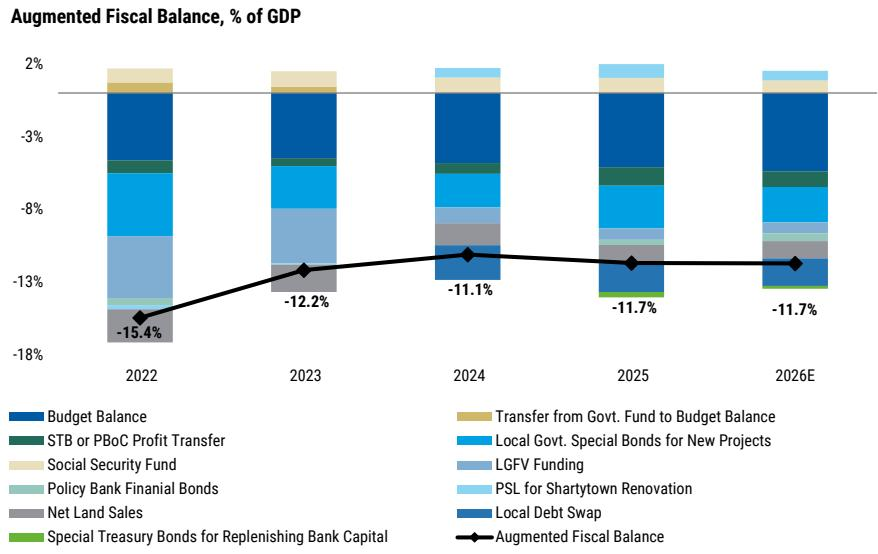

stacked bar chart

Augmented Fiscal Balance, % of GDP
| Year | Budget Balance (%) | STB or PBoC Profit Transfer (%) | Social Security Fund (%) | Policy Bank Financial Bonds (%) | Net Land Sales (%) | Special Treasury Bonds for Replenishing Bank Capital (%) | Local Govt. Special Bonds for New Projects (%) | LGFV Funding (%) | PSL for Shartytown Renovation (%) | Local Debt Swap (%) | Augmented Fiscal Balance (%) |
|---|---|---|---|---|---|---|---|---|---|---|---|
| 2022 | -1.5 | -0.8 | -0.3 | -0.4 | -0.7 | -1.2 | -1.8 | -1.9 | -0.1 | -1.6 | -15.4 |
| 2023 | -1.4 | -0.7 | -0.3 | -0.4 | -0.7 | -0.8 | -1.7 | -1.8 | -0.1 | -1.5 | -12.2 |
| 2024 | -1.3 | -0.6 | -0.3 | -0.4 | -0.7 | -0.9 | -1.6 | -1.7 | -0.1 | -1.4 | -11.1 |
| 2025 | -1.2 | -0.5 | -0.3 | -0.4 | -0.7 | -0.9 | -1.5 | -1.6 | -0.1 | -1.3 | -11.7 |
| 2026E | -1.1 | -0.4 | -0.3 | -0.4 | -0.7 | -0.9 | -1.4 | -1.5 | -0.1 | -1.2 | -11.7 |

Export resilience reduces urgency for additional countercyclical easing  
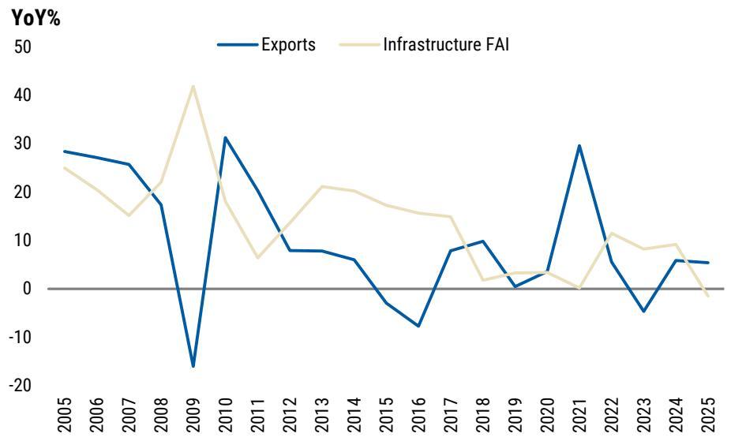

line chart

| Year | Exports | Infrastructure FAI |
|------|---------|---------------------|
| 2005 | 28.0    | 25.0                |
| 2006 | 27.0    | 22.0                |
| 2007 | 25.0    | 15.0                |
| 2008 | 18.0    | 20.0                |
| 2009 | -15.0   | 42.0                |
| 2010 | 31.0    | 18.0                |
| 2011 | 25.0    | 6.0                 |
| 2012 | 8.0     | 12.0                |
| 2013 | 8.0     | 21.0                |
| 2014 | 6.0     | 20.0                |
| 2015 | -5.0    | 18.0                |
| 2016 | -8.0    | 16.0                |
| 2017 | 8.0     | 15.0                |
| 2018 | 10.0    | 2.0                 |
| 2019 | 1.0     | 3.0                 |
| 2020 | 3.0     | 3.0                 |
| 2021 | 30.0    | 1.0                 |
| 2022 | 5.0     | 11.0                |
| 2023 | -5.0    | 8.0                 |
| 2024 | 6.0     | 9.0                 |
| 2025 | 5.0     | -2.0                |

Source: CEIC, Wind, MS estimates.

## Economic Outlook

## Geopolitical Tensions May Reinforce a Supply-centric Bias

## Five-year plan remains supply-centric

## Growth Target

\- Not Specified

## Consumption

• Commitments to boost consumption/GDP ratio

## Tech & Green Transition

## Clear numerical targets:

• R&D (5Y CAGR: >7%)  
• Labor productivity growth (>GDP growth)  
• Digital economy ( $\uparrow$ 2pp of GDP by 2030)  
• CO2 emissions per unit of GDP ( $\downarrow$ 17% by 2030 vs. 2025)  
• Additional target on non-fossil fuel consumption

## Economic rebalancing at a calibrated pace

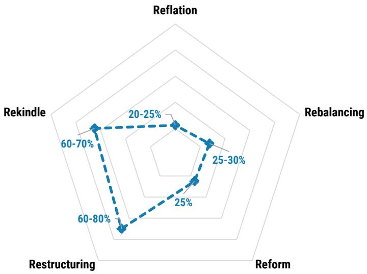

radar chart

| Category | Value (%) |
|---|---|
| Reflation | 20-25 |
| Rebalancing | 25-30 |
| Reform | 25 |
| Restructuring | 60-80 |
| Rekindle | 60-70 |

Source: CEIC, MS (E) estimates.

## Economic Outlook

## Reflation is Narrow

Ongoing surge in PPI is more supply-driven than demand  
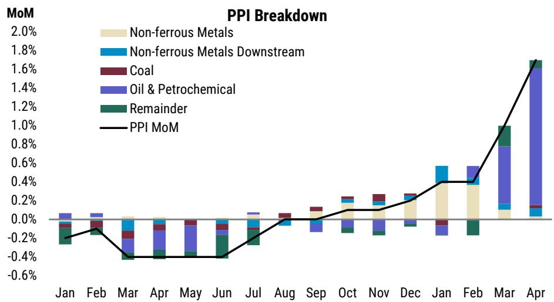

bar-line hybrid

PPI Breakdown
| Month | Non-ferrous Metals (%) | Non-ferrous Metals Downstream (%) | Coal (%) | Oil & Petrochemical (%) | Remainder (%) | PPI MoM |
|---|---|---|---|---|---|---|
| Jan | -0.1 | -0.05 | 0.05 | 0.05 | -0.2 | -0.15 |
| Feb | -0.1 | -0.05 | 0.05 | 0.05 | -0.25 | -0.1 |
| Mar | 0.05 | 0.1 | 0.1 | -0.15 | -0.4 | -0.35 |
| Apr | 0.05 | 0.05 | 0.1 | 0.2 | -0.35 | -0.35 |
| May | 0.05 | 0.05 | 0.05 | 0.25 | -0.35 | -0.35 |
| Jun | 0.05 | 0.05 | 0.05 | 0.1 | -0.35 | -0.35 |
| Jul | 0.05 | 0.1 | 0.05 | 0.1 | -0.25 | -0.2 |
| Aug | 0.05 | 0.05 | 0.1 | 0.1 | -0.1 | -0.1 |
| Sep | 0.1 | 0.1 | 0.15 | -0.15 | -0.15 | -0.1 |
| Oct | 0.15 | 0.1 | 0.15 | -0.15 | -0.15 | 0.1 |
| Nov | 0.15 | 0.15 | 0.2 | -0.15 | -0.15 | 0.1 |
| Dec | 0.25 | 0.15 | 0.15 | -0.15 | -0.15 | 0.2 |
| Jan | 0.4 | 0.25 | 0.15 | -0.25 | -0.25 | 0.4 |
| Feb | 0.4 | 0.25 | 0.15 | 0.6 | -0.25 | 0.4 |
| Mar | 0.15 | 0.15 | 0.15 | 1.25 | 0.35 | 1.7 |
| Apr | 0.15 | 0.15 | 0.15 | 1.8 | 1.7 | 2.25 |

For reflation to broaden, we would need to see:

(1) Continued investment slowdown in oversupplied sectors;  
(2) Persistent export strength; and  
(3) Most critically, a consumption pick-up.

Industrial profit growth remains narrowly concentrated in sectors related to global AI and green transition demand  
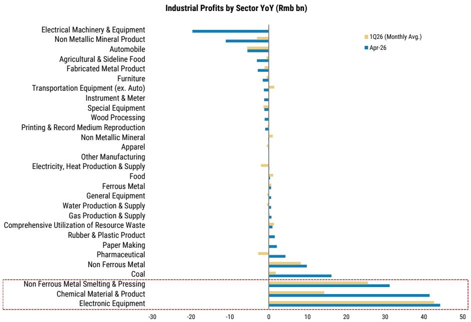

bar chart

Industrial Profits by Sector YoY (Rmb bn)
| Industry | 1Q26 (Monthly Avg.) (Rmb bn) | Apr-26 (Rmb bn) |
| :--- | :--- | :--- |
| Electrical Machinery & Equipment | -18.5 | -19.0 |
| Non Metallic Mineral Product | -1.5 | -10.0 |
| Automobile | -4.0 | -3.5 |
| Agricultural & Sideline Food | -2.5 | -2.0 |
| Fabricated Metal Product | -1.0 | -1.5 |
| Furniture | -1.5 | -1.0 |
| Transportation Equipment (ex. Auto) | 1.0 | 0.5 |
| Instrument & Meter | -0.5 | -0.5 |
| Special Equipment | -0.5 | -0.5 |
| Wood Processing | -0.5 | -0.5 |
| Printing & Record Medium Reproduction | -0.5 | -0.5 |
| Non Metallic Mineral | 1.0 | 0.5 |
| Apparel | -0.5 | -0.5 |
| Other Manufacturing | -0.5 | -0.5 |
| Electricity, Heat Production & Supply | -1.0 | -0.5 |
| Food | 0.5 | 0.5 |
| Ferrous Metal | -0.5 | -0.5 |
| General Equipment | -0.5 | -0.5 |
| Water Production & Supply | -0.5 | -0.5 |
| Gas Production & Supply | -0.5 | -0.5 |
| Comprehensive Utilization of Resource Waste | -0.5 | -0.5 |
| Rubber & Plastic Product | -0.5 | -0.5 |
| Paper Making | -0.5 | -0.5 |
| Pharmaceutical | -1.0 | 4.0 |
| Non Ferrous Metal | 8.0 | 9.0 |
| Coal | 1.0 | 16.0 |
| Non Ferrous Metal Smelting & Pressing | 26.0 | 31.0 |
| Chemical Material & Product | 14.0 | 41.0 |
| Electronic Equipment | 44.0 | 44.0 |

Source: CEIC, MS.

# Economic Outlook

## Industrial Policy: Lessons from the “Hefei Model”

Hefei's recipe for success: ecosystem planner, not blanket subsidy provider  
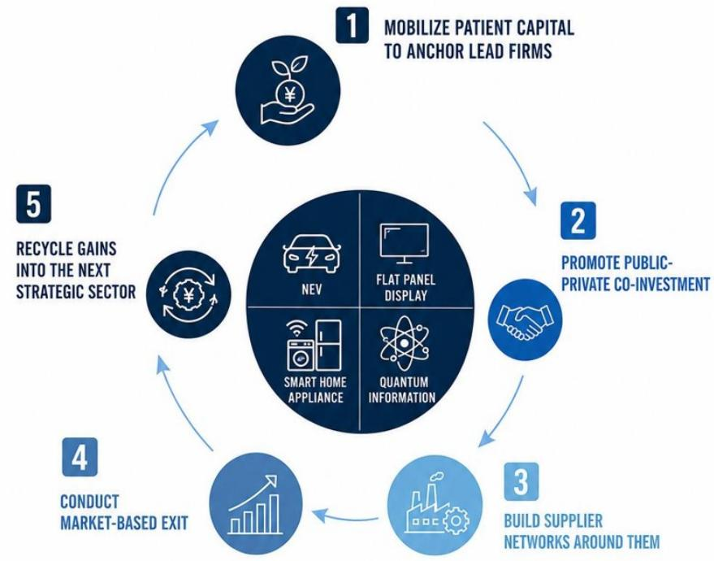

flowchart

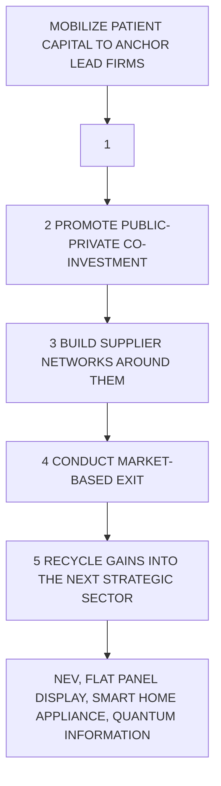
```mermaid
graph TD
  A["MOBILIZE PATIENT CAPITAL TO ANCHOR LEAD FIRMS"] --> B["1"]
  B --> C["2 PROMOTE PUBLIC-PRIVATE CO-INVESTMENT"]
  C --> D["3 BUILD SUPPLIER NETWORKS AROUND THEM"]
  D --> E["4 CONDUCT MARKET-BASED EXIT"]
  E --> F["5 RECYCLE GAINS INTO THE NEXT STRATEGIC SECTOR"]
  F --> G["NEV, FLAT PANEL DISPLAY, SMART HOME APPLIANCE, QUANTUM INFORMATION"]
```

The city has cultivated national and global champions in advanced manufacturing

#1&2 in China's Key Industries  
  
NEV

  
Flat Panel
Display

  
Smart Home Appliance

  
Quantum Information

Global leadership  

PV Inverter Shipments  
  
in the World

Color-sorting Machines  
  
in the World

Energy Storage Shipments  
  
in the World

DRAM Chip Production  
  
in the World  
Note: Ranking is based on local major companies

Source: MS

# Economic Outlook

## But Hefei Model Is Difficult to Replicate

Where does Hefei's success come from?

## ITS SUCCESS RELIED ON A RARE ALIGNMENT OF THREE FACTORS

## TIMING

Made bold early bets when strategic sectors were still fragmented.

## BOLD EARLY BETS

Committed significant patient capital to anchor future leaders.

## LOCAL INDUSTRIAL FIT

Matched investments with Hefei's industrial strengths and ecosystem.

A rare combination—not easy to replicate.

Even Hefei itself is not immune to overcapacity and deflation problems  
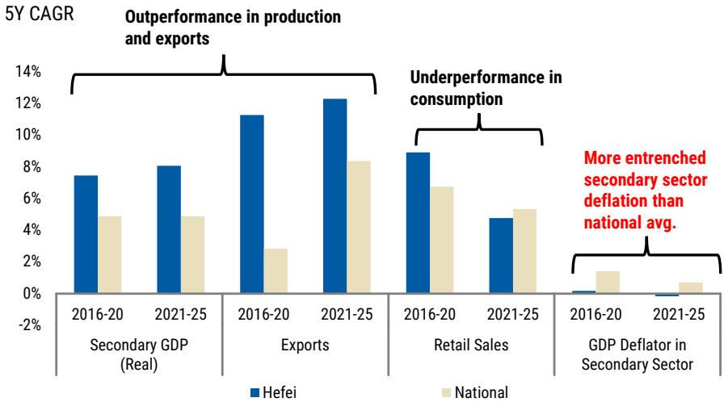

bar chart

5Y CAGR
| Category | Period | Hefei (%) | National (%) |
| :--- | :--- | :--- | :--- |
| Secondary GDP (Real) | 2016-20 | 7.5 | 4.8 |
| Secondary GDP (Real) | 2021-25 | 8.1 | 4.8 |
| Exports | 2016-20 | 11.3 | 2.8 |
| Exports | 2021-25 | 12.3 | 8.3 |
| Retail Sales | 2016-20 | 8.9 | 6.7 |
| Retail Sales | 2021-25 | 4.7 | 5.4 |
| GDP Deflator in Secondary Sector | 2016-20 | 0.3 | 1.4 |
| GDP Deflator in Secondary Sector | 2021-25 | 0.1 | 0.7 |
More entrenched secondary sector deflation than national avg.

If many regions imitate the same surface tools— large upfront government seed capital and buildup of industrial parks, and focus on the same frontier sectors, it may compound the overcapacity problem nationwide

## Economic Outlook

## Smarter Industrial Policy Alone May Not Narrow Supply-Demand Imbalances

Investment ex-property growth slowed from 2021-23's spike, but only at a modest pace  

line chart

| Year | GFCF (%) | GFCF ex-Property (%) |
|---|---|---|
| 2014 | 7.4 | 9.0 |
| 2015 | 5.5 | 8.0 |
| 2016 | 7.3 | 7.7 |
| 2017 | 6.3 | 7.3 |
| 2018 | 7.5 | 6.9 |
| 2019 | 5.8 | 4.5 |
| 2020 | 3.7 | 2.9 |
| 2021 | 2.5 | 2.5 |
| 2022 | 3.5 | 7.8 |
| 2023 | 4.6 | 7.5 |
| 2024 | 2.5 | 5.8 |
| 2025 | 2.0 | 4.7 |
| 2026E | 3.5 | 5.9 |
| 2027E | 2.9 | 4.4 |

The "baton" of investment has been passed from sectors with overcapacity to those with less oversupply, for now  
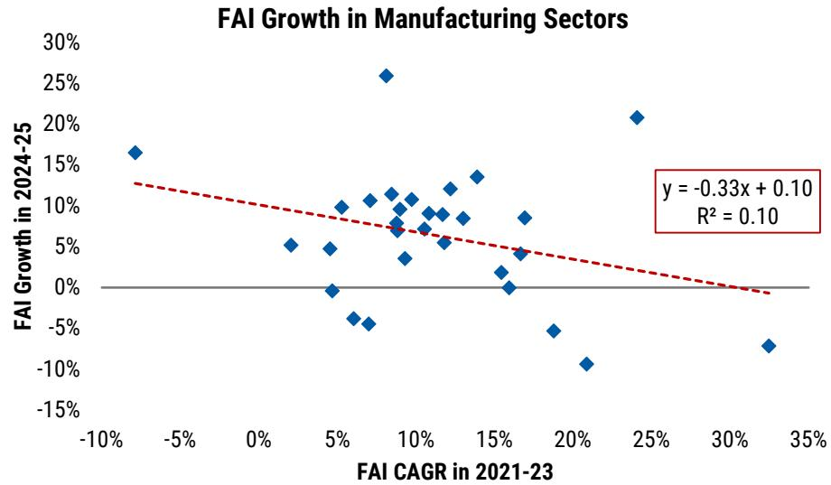

scatter plot

| FAI CAGR in 2021-23 | FAI Growth in 2024-25 |
| ------------------- | --------------------- |
| -8%                 | 16%                   |
| -5%                 | 5%                    |
| 0%                  | 0%                    |
| 5%                  | -5%                   |
| 10%                 | 10%                   |
| 15%                 | 14%                   |
| 20%                 | -10%                  |
| 25%                 | 21%                   |
| 30%                 | -7%                   |
| 35%                 | -10%                  |

## "National unified market" and anti-involution are right in direction, but challenging to implement:

- Top-down coordination unworkable; market mechanisms for specialization still weak  
- Local incentives misaligned  
• Tax system biases production

Source: CEIC, MS estimates

## Economic Outlook

## Reforms Are Needed to Alleviate the Overhang from Legacy Issues

## SOCIAL WELFARE REFORM

Strengthen the safety net to reduce precautionary savings and boost consumption.

natural_image

Blue line icon of a hand holding a shield with a checkmark, enclosed in a circle (no text or symbols)

natural_image

Blue line icon of a clipboard with bar chart and checkmark inside a circle (no text or symbols)

## CADRE EVALUATION REFORM

Reward outcomes that improve household well-being and the environment.

## Economic Rebalancing Reforms Needed

natural_image

Blue line icon of a classical building with columns inside a circle (no text or symbols)

## FISCAL SYSTEM REFORM

Shift to efficiency-linked direct taxes and fund public services, not projects.

Source: MS.

## Economic Outlook

## PBoC Unlikely to Rely on RMB Appreciation to Address Economic Imbalances

Modest CFETS RMB upside, USDCNY a function of USD moves  
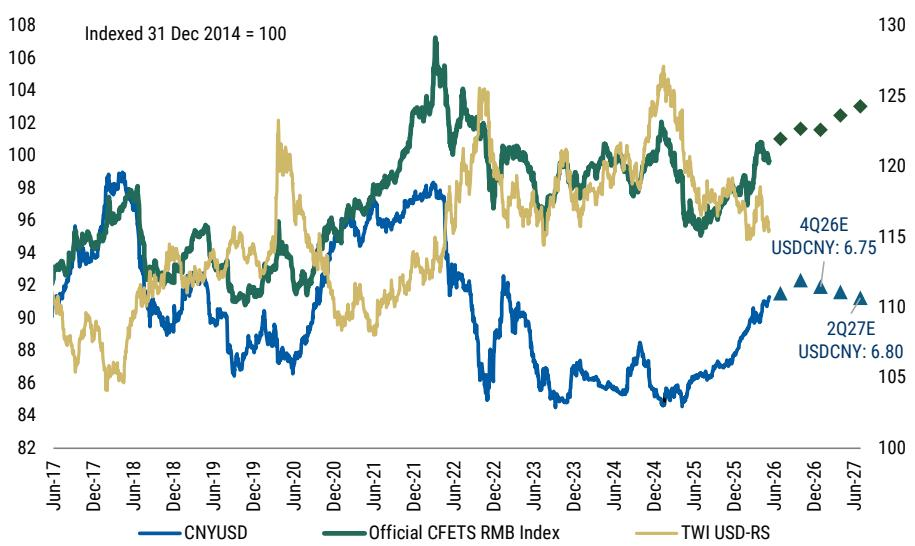

line chart

| Date     | CNYUSD | Official CFETS RMB Index | TWI USD-RS |
|----------|--------|---------------------------|------------|
| Jun-27   |        |                           |            |
| 4Q26E    |        |                           | 6.75       |
| 2Q27E    |        |                           | 6.80       |

How PBoC managed RMB moves in the past  
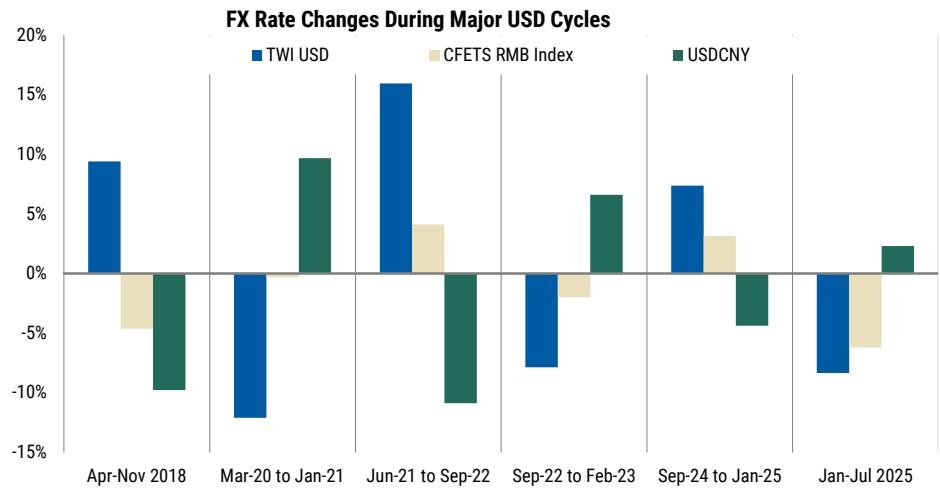

bar chart

FX Rate Changes During Major USD Cycles
| Period | TWI USD (%) | CFETS RMB Index (%) | USDCNY (%) |
| :--- | :--- | :--- | :--- |
| Apr-Nov 2018 | 9.4 | -4.3 | -9.6 |
| Mar-20 to Jan-21 | -12.7 | -0.3 | 9.7 |
| Jun-21 to Sep-22 | 15.9 | 4.1 | -10.8 |
| Sep-22 to Feb-23 | -7.6 | -1.8 | 6.5 |
| Sep-24 to Jan-25 | 7.4 | 3.2 | -4.5 |
| Jan-Jul 2025 | -8.5 | -6.1 | 2.3 |

Source: Bloomberg, CEIC, MS estimates.

## Outbound Investment

## China Tightens Outbound Investment Controls to Regulate Flows...

The regulation is not about acute capital flight pressure: RMB depreciation expectations have eased actually  
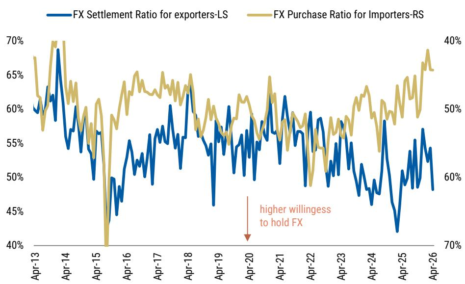

line chart

| Date   | FX Settlement Ratio for exporters-LS | FX Purchase Ratio for Importers-RS |
|--------|--------------------------------------|------------------------------------|
| Apr-13 | ~60%                                 | ~68%                               |
| Apr-14 | ~68%                                 | ~70%                               |
| Apr-15 | ~50%                                 | ~40%                               |
| Apr-16 | ~55%                                 | ~65%                               |
| Apr-17 | ~58%                                 | ~63%                               |
| Apr-18 | ~62%                                 | ~65%                               |
| Apr-19 | ~55%                                 | ~60%                               |
| Apr-20 | ~50%                                 | ~55%                               |
| Apr-21 | ~60%                                 | ~65%                               |
| Apr-22 | ~55%                                 | ~50%                               |
| Apr-23 | ~58%                                 | ~55%                               |
| Apr-24 | ~50%                                 | ~60%                               |
| Apr-25 | ~42%                                 | ~65%                               |
| Apr-26 | ~55%                                 | ~68%                               |

Our measure of monthly capital flows - more related to FX market equilibrium - have turned from outflows to inflows  
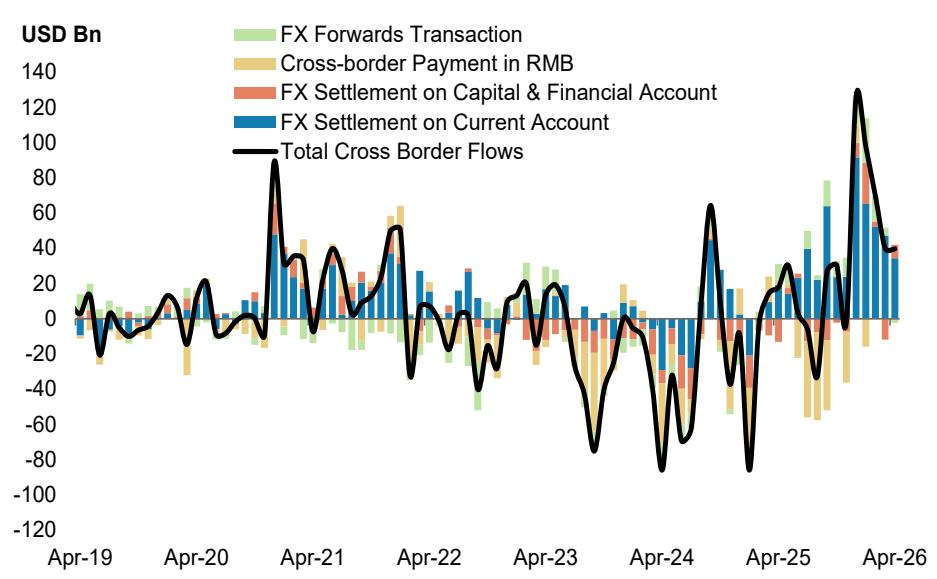

bar-line hybrid chart

| Date   | FX Forwards Transaction (USD Bn) | Cross-border Payment in RMB (USD Bn) | FX Settlement on Capital & Financial Account (USD Bn) | FX Settlement on Current Account (USD Bn) | Total Cross Border Flows (USD Bn) |
|--------|----------------------------------|--------------------------------------|-----------------------------------------------------|------------------------------------------|-----------------------------------|
| Apr-19 | ~10                              | ~-20                                 | ~-5                                                 | ~-5                                      | ~0                                |
| Apr-20 | ~15                              | ~-30                                 | ~-5                                                 | ~-5                                      | ~10                               |
| Apr-21 | ~40                              | ~40                                  | ~30                                                 | ~30                                      | ~90                               |
| Apr-22 | ~20                              | ~60                                  | ~20                                                 | ~20                                      | ~50                               |
| Apr-23 | ~30                              | ~20                                  | ~10                                                 | ~10                                      | ~15                               |
| Apr-24 | ~-50                             | ~-40                                 | ~-5                                                 | ~-5                                      | ~-80                              |
| Apr-25 | ~50                              | ~-60                                 | ~-5                                                 | ~-5                                      | ~30                               |
| Apr-26 | ~110                             | ~-40                                 | ~10                                                 | ~10                                      | ~130                              |

Source: CEIC, MS

## Outbound Investment

## ...Not to Shut Down Overseas Investment Channels

Mainland residents still have several legal routes to gain offshore securities exposure...

CHANNELS FOR OFFSHORE
SECURITIES EXPOSURE  
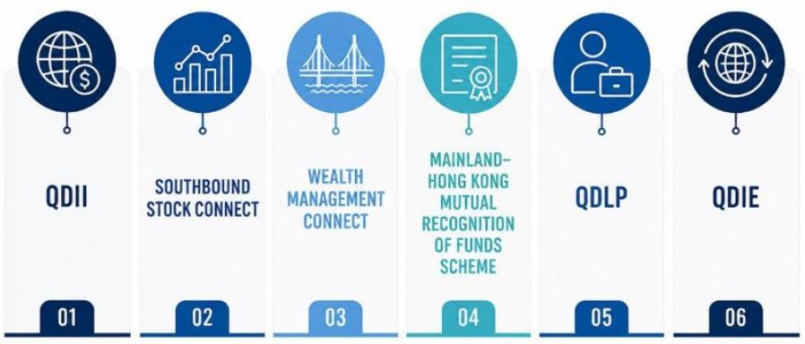

flowchart

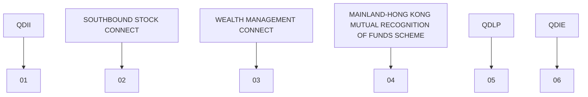
```mermaid
graph TD
  A["QDII"] --> B["01"]
  C["SOUTHBOUND STOCK CONNECT"] --> D["02"]
  E["WEALTH MANAGEMENT CONNECT"] --> F["03"]
  G["MAINLAND-HONG KONG MUTUAL RECOGNITION OF FUNDS SCHEME"] --> H["04"]
  I["QDLP"] --> J["05"]
  K["QDIE"] --> L["06"]
```

...albeit with various limitations such as insufficient quotas, product eligibility and regional restrictions etc.

line chart

| Date   | Approved QDII Quota (US$bn) |
|--------|-----------------------------|
| May-26 | 176.169                     |

Source: CEIC, MS

## Outbound Investment

## Implications: Near-term Support to RMB, Marginal Impact on Growth

## Regulatory impact on RMB and growth

## IMPACT ON RMB

NEAR-TERM SUPPORT, FLOW-BASED

  
Tighter capital controls

  
Less unmonitored outflow & narrowing informal channels

  
Lower FX demand from households & corporates

  
More current account surplus converted → Near-term RMB support

## IMPACT ON GROWTH

NEAR-TERM IMPACT LIKELY MARGINAL

  
More private savings kept onshore

  
Supports liquidity & asset prices

  
Lowers financing costs & eases financial conditions

  
Supports growth — if credit demand picks up

  
CONFIDENCE IMPROVES  
More borrowing, investment & stronger growth

## OUTCOME DEPENDS ON CONFIDENCE

  
CONFIDENCE REMAINS WEAK  
Funds sit in deposits, money-market products or government bonds, pressuring risk-free rates

## Tighter controls could reduce risk-adjusted return opportunities for domestic portfolio investors

China Outbound Investment Return, 2025  

bar chart

| Category | Value (%) |
| :--- | :--- |
| Direct Investment | 4.4 |
| Portfolio Investment | 9.4 |

## Outbound Investment

# China Will Likely Continue with Its Prevailing Capital Account Opening Approach

## Capital-Account Opening and RMB Internationalization: A Managed Symbiosis

Mutually Reinforcing. Selectively Opened. Strategically Balanced.

flowchart

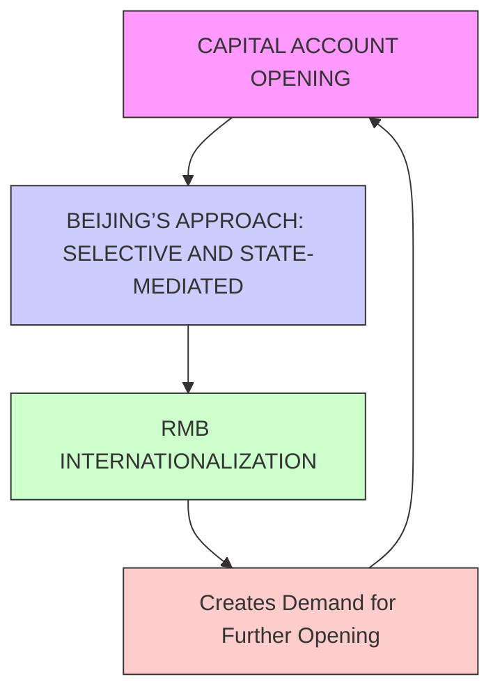
```mermaid
graph TD
  A["CAPITAL ACCOUNT OPENING"] --> B["BEIJING’S APPROACH: SELECTIVE AND STATE-MEDIATED"]
  B --> C["RMB INTERNATIONALIZATION"]
  C --> D["Creates Demand for Further Opening"]
  D --> A
    style A fill:#f9f,stroke:#333
    style B fill:#ccf,stroke:#333
    style C fill:#cfc,stroke:#333
    style D fill:#fcc,stroke:#333
```

Source: CEIC, MS

## US-China Relations

# "Limited Truce+": Modest Trade/Investment Measures, Selective Cooperation

## 1 Limited Deliverables

Outcomes here skewed more toward "Phase One" deal-style commitments.

## Key Deliverables

• U.S. tariff level on China capped at the Kuala Lumpur agreement level  
- Launch framework talks on reciprocal tariff reductions (each side: USD 30 billion or more)  
- Expand agricultural market access and purchases  
- Advance Boeing aircraft purchases and aviation cooperation  
• Establish board of trade and investment

## 2 Three Key Areas of Focus

Export Controls

Arms Sales to Taiwan

US-Iran Relations

## 3 Chips/Rare Earths Equilibrium

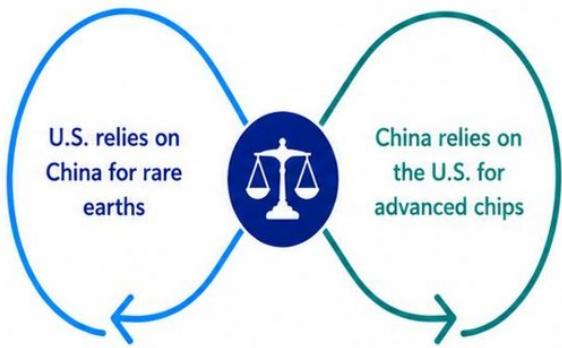

flowchart

```mermaid
graph LR
  A["U.S. relies on China for rare earths"] --> B["China relies on the U.S. for advanced chips"]
  B --> A
```

The U.S. lags China by several years in the rare earths value chain.

Similarly, China's capabilities in the AI supply chain lag the U.S. by several years.

→ Mirrored dependencies disincentivize either side from material escalation in the near term.

## US-China Relations

## Strategic Stability Underpinned by Chips/Rare Earths Equilibrium

China's global dominance in rare earths and lithium batteries  
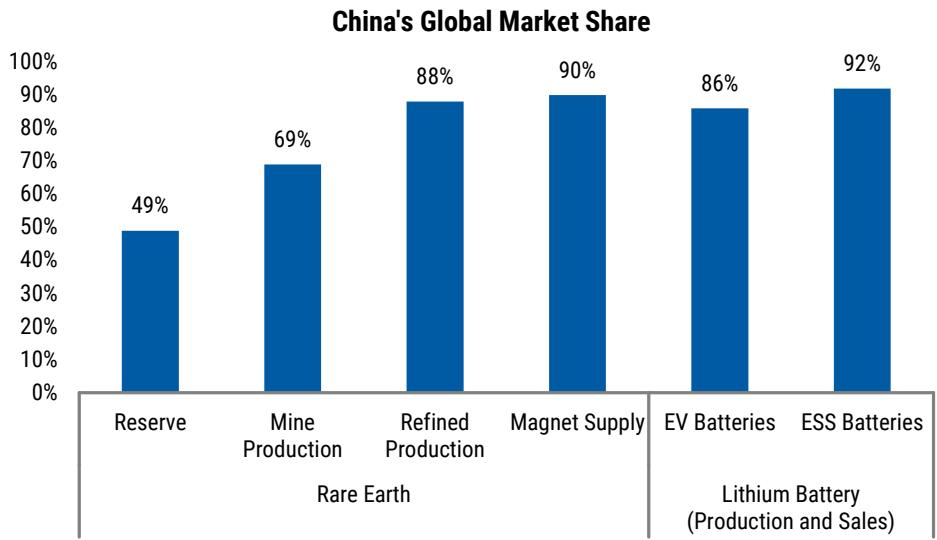

bar chart

China's Global Market Share
| Category | Value (%) |
| :--- | :--- |
| Reserve | 49 |
| Mine Production | 69 |
| Refined Production | 88 |
| Magnet Supply | 90 |
| EV Batteries | 86 |
| ESS Batteries | 92 |
Rare Earth Lithium Battery (Production and Sales)

How durable is China's dominance?  
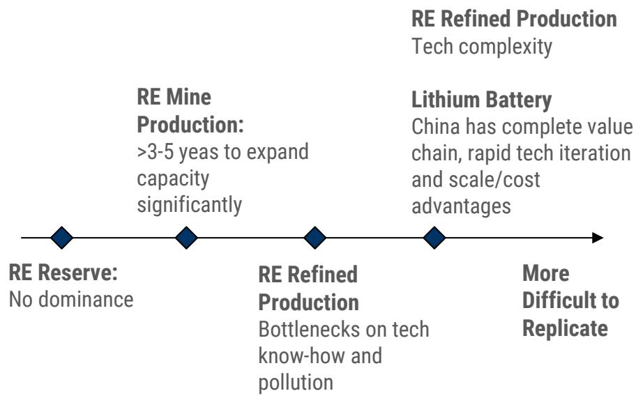

line chart

| Stage | Description |
|-------|-------------|
| RE Reserve: No dominance | |
| RE Mine Production: >3-5 years to expand capacity significantly | |
| RE Refined Production Bottlenecks on tech know-how and pollution | |
| RE Refined Production Tech complexity | Lithium Battery China has complete value chain, rapid tech iteration and scale/cost advantages |
| More Difficult to Replicate | |

Source: US Department of Energy, company data, EV tank, SNE, MS.

## Structural Opportunities

## Mapping Out MS's Four Global Themes and Investible Sub-Themes

<table><tr><td>Multipolar World</td><td>AI &amp; Tech Diffusion</td><td>Future of Energy</td><td>Societal Shifts</td></tr><tr><td>The Rise in Defense Spending</td><td>AI Enablers</td><td>Powering AI</td><td>Diabesity Ecosystem</td></tr><tr><td>Semiconductor Localization</td><td>AI Adopters</td><td>Nuclear Renaissance</td><td>AI &amp; Health Care</td></tr><tr><td>Critical Minerals</td><td>AI Infrastructure</td><td>Europe&#x27;s ‘Low Decarb Diet’</td><td>Smart Chemo</td></tr><tr><td></td><td>Humanoids</td><td>Power Grid Growth &amp; Evolution</td><td>Preparing for an Aging Pop&#x27;n</td></tr><tr><td></td><td>China&#x27;s AI Path</td><td>Clean Energy &amp; Storage</td><td>Japan Longevity</td></tr><tr><td></td><td>China&#x27;s Emerging Frontiers</td><td>Energy Security</td><td>Future of Food &amp; Beverages</td></tr><tr><td></td><td>Asia AI Adoption Leaders</td><td>Globalization of Natural Gas</td><td>AI Job Displacement &amp; Re-Skilling</td></tr><tr><td></td><td></td><td>Asia Climate Adaptation</td><td></td></tr></table>

Source: MS. For more details, see Asia Thematic Strategy: Investor Presentation: Playing Asia's Investment Super-Cycle and Competitive Reinvention (17 May 2026).

## Structural Opportunities

Asia's Competitive Reinvention: Core Themes and Thematic Opportunity  
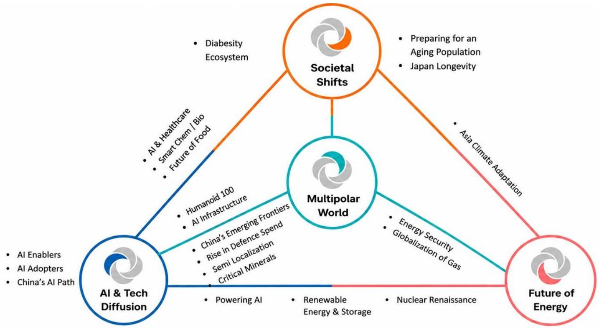

flowchart

Conceptual diagram linking societal shifts, multipolar world, and future of energy with key domains like AI & tech diffusion, space adaptation, and energy security.

## Asia's Capital Market and Governance Reforms

• Japan ROE & Productivity Journey

• China Anti-Involution Initiative

• New India and IndiaStack

• Korea Reform Renaissance

• Singapore Capital Market Reforms

• Asia Financial Acceleration

Source: MS. For more details, see Asia Thematic Strategy: Investor Presentation: Playing Asia's Investment Super-Cycle and Competitive Reinvention (17 May 2026).

## AI Diffusion

## China AI 2.0 – Entering a New Phase

flowchart

```mermaid
graph TD
  A["Infra --> Earnings"] --> B["AI hits P&L"]
  C["Compute --> Power"] --> D["Shifting bottleneck"]
  E["Models --> Physical AI"] --> F["Embodied AI"]
  G["What changed"] --> H["Commercialization at scale"]
  I["Still developing"] --> J["Advanced chips / EDA"]
  I --> K["2B monetization"]
  I --> L["Labor disruption risk"]
  M["China's Edge"] --> N["Speed of deployment"]
  M --> O["Cost efficiency"]
  M --> P["System integration"]
  M --> Q["Open-source platforms"]
    style A fill:#d4edda,stroke:#333
    style C fill:#d4edda,stroke:#333
    style E fill:#d4edda,stroke:#333
    style G fill:#d4edda,stroke:#333
    style M fill:#d4edda,stroke:#333
```

Source: MS.

## AI Diffusion

## AI Impact Broadening Out

51% of surveyed corporates are now AI enablers/adopters  
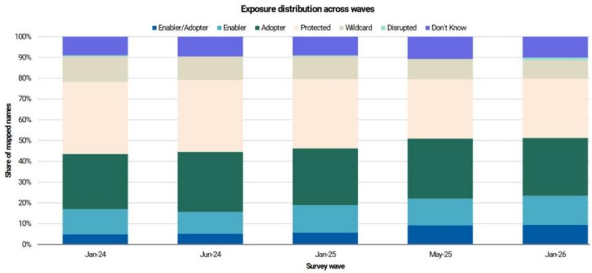

stacked bar chart

Exposure distribution across waves
| Survey wave | Enabler/Adopter (%) | Enabler (%) | Adopter (%) | Protected (%) | Wildcard (%) | Disrupted (%) | Don't Know (%) |
|---|---|---|---|---|---|---|---|
| Jan-24 | 5 | 13 | 27 | 38 | 13 | 10 | 9 |
| Jun-24 | 5 | 12 | 28 | 38 | 13 | 10 | 9 |
| Jan-25 | 5 | 13 | 27 | 38 | 13 | 10 | 9 |
| May-25 | 9 | 14 | 26 | 35 | 13 | 10 | 9 |
| Jan-26 | 9 | 14 | 26 | 35 | 10 | 10 | 9 |

IT, Utilities, and Materials see the most significant revenue growth from AI  
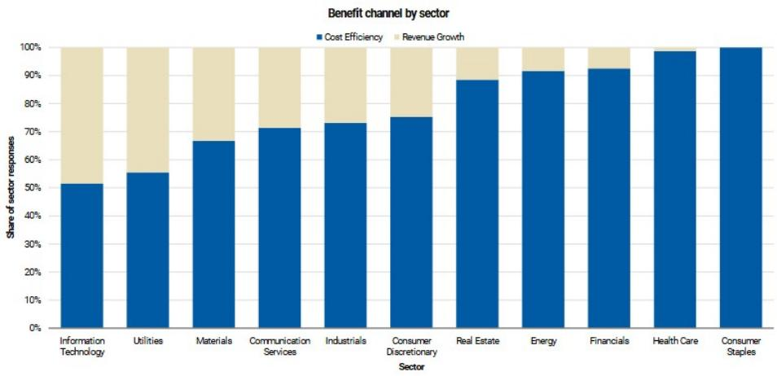

stacked bar chart

Benefit channel by sector
| Sector | Cost Efficiency (%) | Revenue Growth (%) |
|---|---|---|
| Information Technology | 51 | 48 |
| Utilities | 55 | 43 |
| Materials | 66 | 34 |
| Communication Services | 72 | 29 |
| Industrials | 73 | 28 |
| Consumer Discretionary Sector | 75 | 25 |
| Real Estate | 88 | 12 |
| Energy | 91 | 10 |
| Financials | 92 | 10 |
| Health Care | 97 | 0 |
| Consumer Staples | 99 | 0 |

Source: MS.

## AI Diffusion

## Key Developments in Strength #1: Power

## Power consumption shifting from training workload to inference...

## TRAINING

Hyperscalers

Academic research

Technology startups

POWER DEMAND

Stable

Predictable

## INFERENCE

Productive software

Autonomous driving

Entertainment users

Online searching

Advertising

POWER DEMAND

Frequent shocks and noises

Unpredictable

## ...making opportunities for the energy storage system (ESS)

Global ESS annual incremental deployment forecast for data centers  
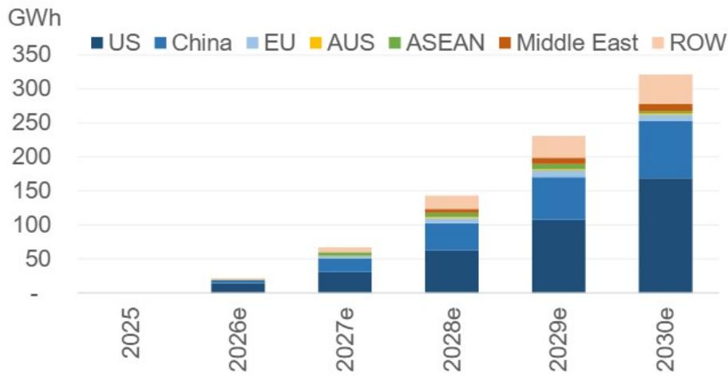

stacked bar chart

| Year | US (GWh) | China (GWh) | EU (GWh) | AUS (GWh) | ASEAN (GWh) | Middle East (GWh) | ROW (GWh) |
|---|---|---|---|---|---|---|---|
| 2025 | - | - | - | - | - | - | - |
| 2026e | 15 | 10 | 5 | 0 | 0 | 0 | 0 |
| 2027e | 30 | 20 | 10 | 5 | 5 | 0 | 5 |
| 2028e | 60 | 40 | 15 | 10 | 10 | 5 | 10 |
| 2029e | 105 | 65 | 15 | 10 | 10 | 10 | 20 |
| 2030e | 165 | 85 | 15 | 10 | 10 | 15 | 30 |

## AI Diffusion

## Key Developments in Strength #2: Humanoids

Our China Industrials team has revised its humanoid sales estimate to 28k units for 2026...

China Humanoid Sales ('k unit)  
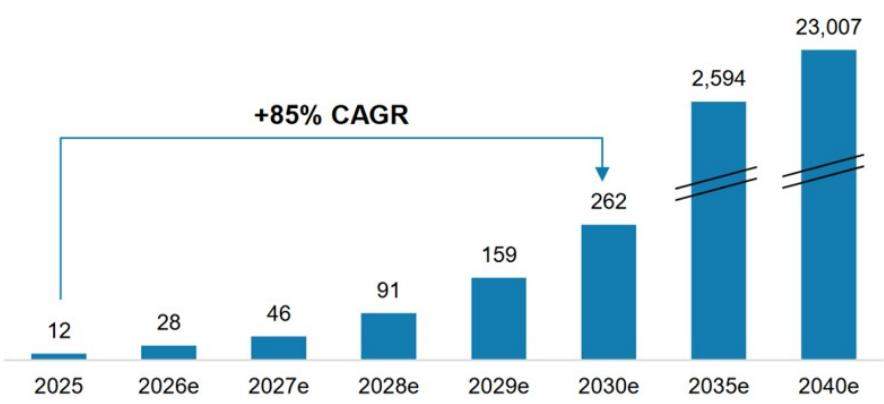

bar chart

| Year | Value |
|---|---|
| 2025 | 12 |
| 2026e | 28 |
| 2027e | 46 |
| 2028e | 91 |
| 2029e | 159 |
| 2030e | 262 |
| 2035e | 2,594 |
| 2040e | 23,007 |
+85% CAGR

...and expects humanoids to be eventually more capable, accomplished by an increasing degree of freedom

Humanoid Degree of Freedom (DoF) Trend  
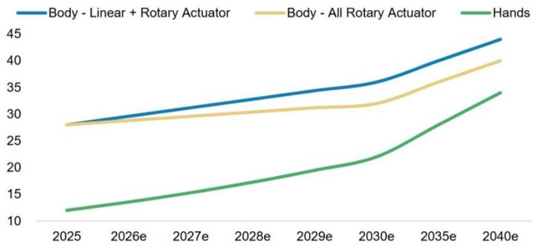

line chart

| Year   | Body - Linear + Rotary Actuator | Body - All Rotary Actuator | Hands |
| ------ | -------------------------------- | --------------------------- | ----- |
| 2025e  | 28.0                             | 28.0                        | 12.0  |
| 2026e  | 29.0                             | 29.0                        | 13.0  |
| 2027e  | 30.0                             | 30.0                        | 14.0  |
| 2028e  | 31.0                             | 31.0                        | 15.0  |
| 2029e  | 32.0                             | 32.0                        | 16.0  |
| 2030e  | 33.0                             | 33.0                        | 17.0  |
| 2035e  | 38.0                             | 37.0                        | 25.0  |
| 2040e  | 44.0                             | 40.0                        | 34.0  |

Source: MS estimates. For more details, see 2026 Outlook – Humanoids: Commercialization (21 January 2026).

## AI Diffusion

## Key Developments in Strength #3: Autonomous Driving

Our China Autos team expects L2+ smart driving penetration to reach 32% in 2026 and 50%+ in 2030 (vs. 25% in 2025)  
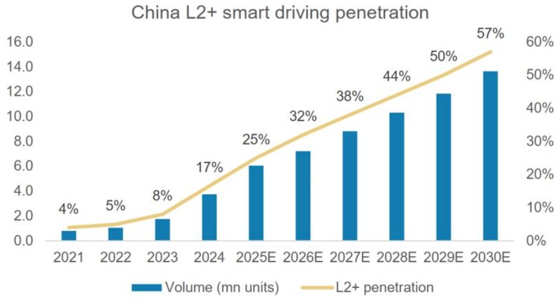

bar-line hybrid

China L2+ smart driving penetration
| Year | Volume (mn units) | L2+ penetration (%) |
| :--- | :--- | :--- |
| 2021 | 0.8 | 4 |
| 2022 | 1.0 | 5 |
| 2023 | 1.8 | 8 |
| 2024 | 3.8 | 17 |
| 2025E | 6.0 | 25 |
| 2026E | 7.2 | 32 |
| 2027E | 8.8 | 38 |
| 2028E | 10.2 | 44 |
| 2029E | 11.8 | 50 |
| 2030E | 13.6 | 57 |

China's robotaxi fleet size to reach 360-400k units by 2030, accounting for 8% of total taxi/ride-sharing fleet size  
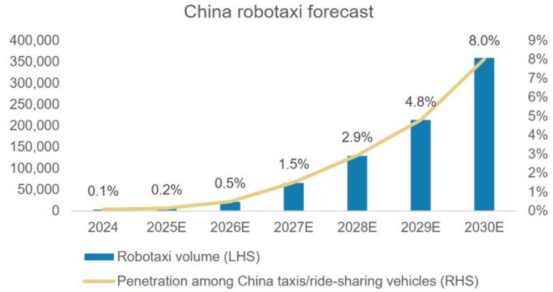

bar-line hybrid

China robotaxi forecast
| Year | Robotaxi volume (LHS) | Penetration among China taxis/ride-sharing vehicles (RHS) (%) |
| :--- | :--- | :--- |
| 2024 | ~1,000 | 0.1 |
| 2025E | ~5,000 | 0.2 |
| 2026E | ~25,000 | 0.5 |
| 2027E | ~70,000 | 1.5 |
| 2028E | ~130,000 | 2.9 |
| 2029E | ~210,000 | 4.8 |
| 2030E | ~360,000 | 8.0 |

Source: NT Times, MS estimates. For more details, see China AI 2.0 – Entering a New Phase (10 May 2026).

## AI Diffusion

## China AI Enabler

China AI chip self-sufficiency is likely to reach 86% in 2030  
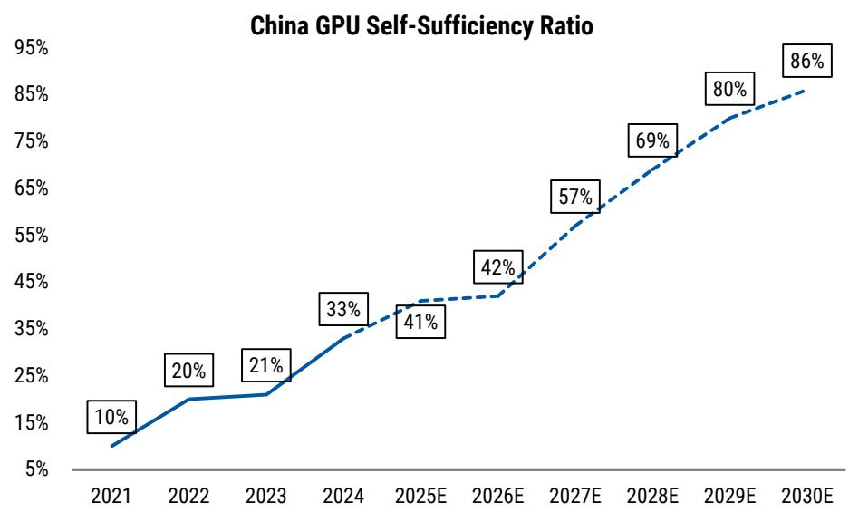

line chart

China GPU Self-Sufficiency Ratio
| Year | Self-Sufficiency Ratio (%) |
| :--- | :--- |
| 2021 | 10 |
| 2022 | 20 |
| 2023 | 21 |
| 2024 | 33 |
| 2025E | 41 |
| 2026E | 42 |
| 2027E | 57 |
| 2028E | 69 |
| 2029E | 80 |
| 2030E | 86 |

Relative strengths of US and China AI industries  
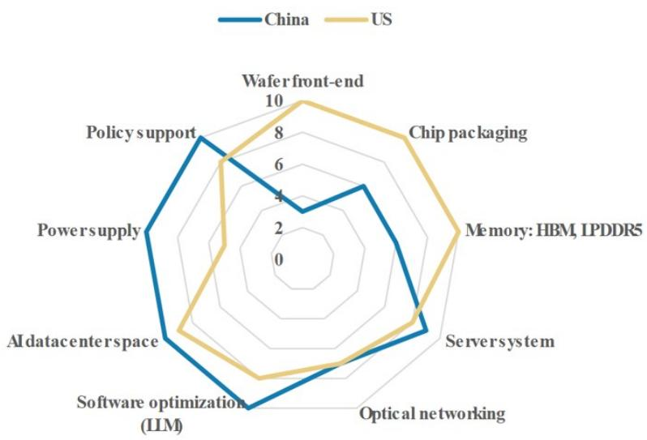

radar chart

| Category               | China | US   |
| ---------------------- | ----- | ---- |
| Wafer front-end        | 8     | 10   |
| Chip packaging         | 6     | 9    |
| Memory: HBM, IPDDR5    | 7     | 8    |
| Serversystem           | 8     | 7    |
| Optical networking      | 7     | 6    |
| Software optimization (LLM) | 9     | 7    |
| AI datacenterspace      | 8     | 6    |
| Powersupply            | 9     | 5    |
| Policy support         | 8     | 6    |

Source: Company data, MS estimates. For more details, see China AI 2.0 – Entering a New Phase (10 May 2026).

## AI Diffusion

## AI Impact: Lessons from the Five Innovation Waves

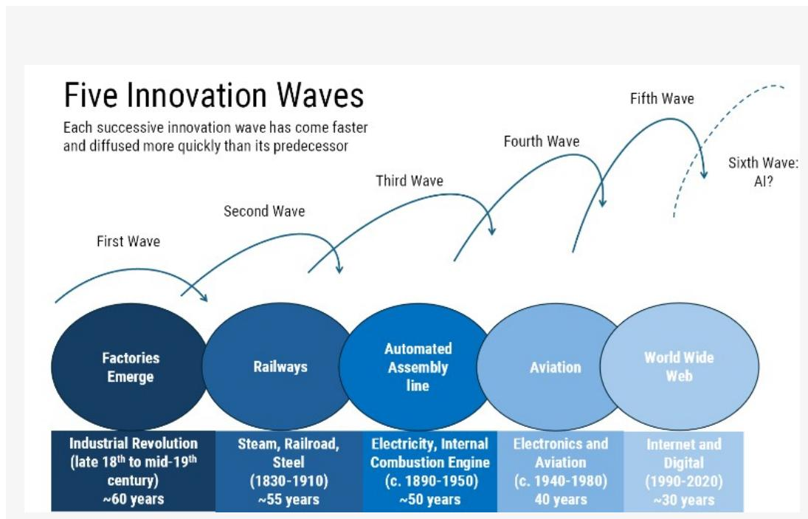

flowchart

```mermaid
graph LR
  A["First Wave"] --> B["Second Wave"]
  B --> C["Third Wave"]
  C --> D["Fourth Wave"]
  D --> E["Fifth Wave"]
  E --> F["Sixth Wave: AI?"]
    
    subgraph Industrial Revolution (late 18th to mid-19th century)
        A
        B
        C
        D
        E
        F
    end
    
    subgraph Railways
        B
        C
        D
        E
        F
    end
    
    subgraph Automated Assembly line
        B
        C
        D
        E
        F
    end
    
    subgraph Aviation
        B
        C
        D
        E
        F
    end
    
    subgraph World Wide Web
        B
        C
        D
        E
        F
    end
    
    %% Additional text notes that each successive innovation wave has come faster and diffused more quickly than its predecessor.
```

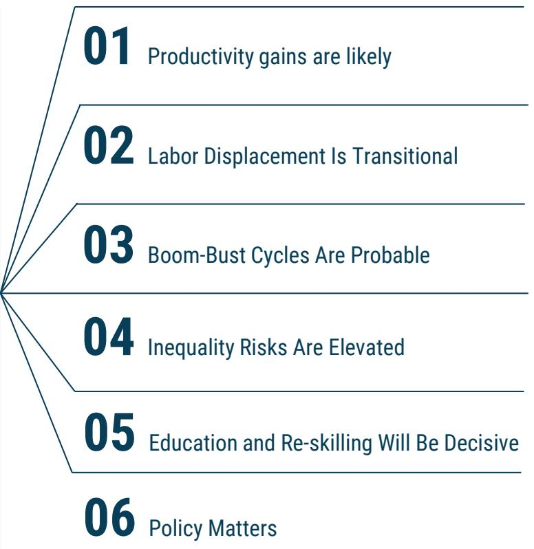

flowchart

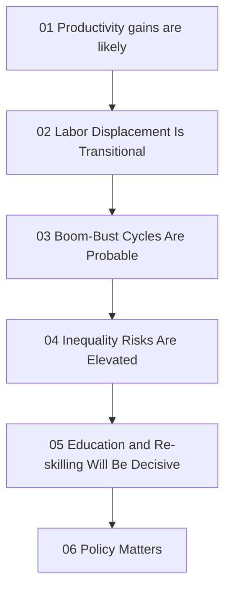
```mermaid
graph TD
  A["01 Productivity gains are likely"] --> B["02 Labor Displacement Is Transitional"]
  B --> C["03 Boom-Bust Cycles Are Probable"]
  C --> D["04 Inequality Risks Are Elevated"]
  D --> E["05 Education and Re-skilling Will Be Decisive"]
  E --> F["06 Policy Matters"]
```

Source: MS. For more details, kindly see Lessons from the Five Innovation Waves That Preceded AI (6 April 2026).

## AI Diffusion

## What Rapid AI Diffusion Means for China's Economy

AI's impact on China's GDP growth: Near-term neutral, long-term positive  
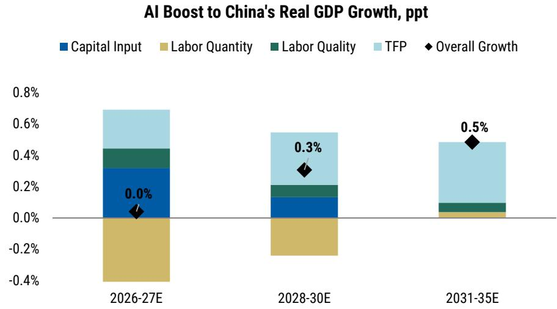

stacked bar chart

AI Boost to China's Real GDP Growth, ppt
| Period | Capital Input (%) | Labor Quantity (%) | Labor Quality (%) | TFP (%) | Overall Growth (%) |
| :--- | :--- | :--- | :--- | :--- | :--- |
| 2026-27E | 0.3 | -0.4 | 0.1 | 0.2 | 0.0 |
| 2028-30E | 0.1 | -0.2 | 0.05 | 0.3 | 0.3 |
| 2031-35E | 0.0 | 0.05 | 0.05 | 0.4 | 0.5 |

Hyperscalers to step up AI-related capex significantly in the next two years  
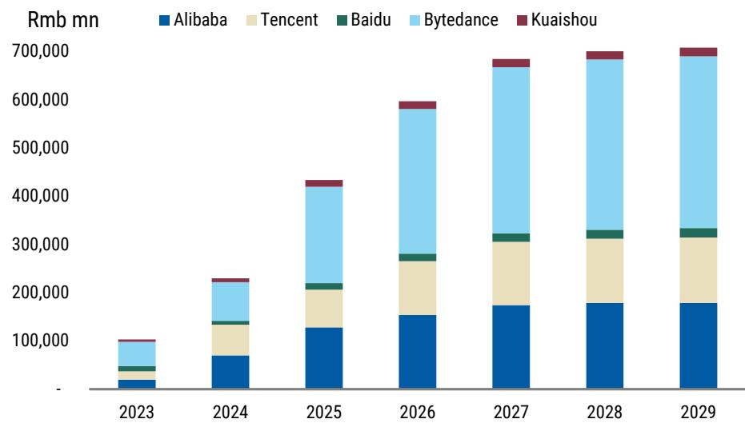

stacked bar chart

| Year | Alibaba | Tencent | Baidu | Bytedance | Kuaishou |
|------|---------|---------|-------|-----------|----------|
| 2023 | ~10,000 | ~5,000  | ~2,000 | ~30,000   | ~1,000   |
| 2024 | ~60,000 | ~40,000 | ~1,500 | ~70,000   | ~1,500   |
| 2025 | ~120,000 | ~60,000 | ~15,000 | ~180,000  | ~2,000   |
| 2026 | ~150,000 | ~80,000 | ~15,000 | ~250,000  | ~2,500   |
| 2027 | ~170,000 | ~90,000 | ~15,000 | ~350,000  | ~3,000   |
| 2028 | ~180,000 | ~100,000 | ~15,000 | ~450,000  | ~3,500   |
| 2029 | ~185,000 | ~110,000 | ~15,000 | ~550,000  | ~4,000   |

Source: CEIC, company data, MS estimates.

## AI Diffusion

## Positives Could be Offset by Near-term AI-induced Job Disruptions

China's job market is less exposed to AI diffusion than the US...  
Share of Employment by AI Exposure  
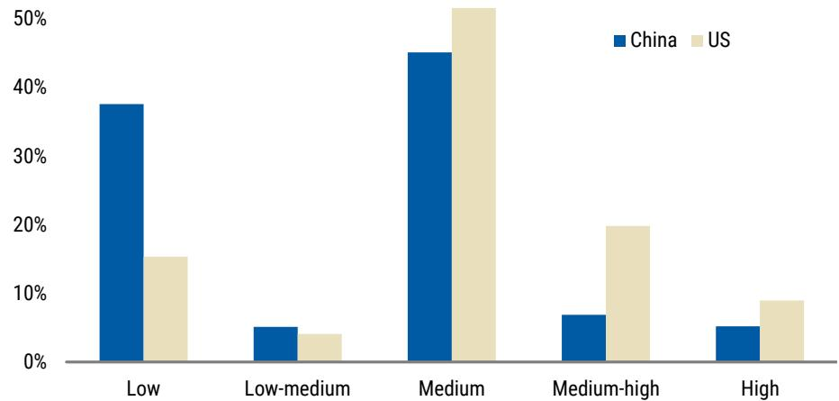

bar chart

| Category | China (%) | US (%) |
|---|---|---|
| Low | 37.5 | 15.2 |
| Low-medium | 5.0 | 4.0 |
| Medium | 45.0 | 51.0 |
| Medium-high | 6.8 | 19.8 |
| High | 5.0 | 9.0 |

...but weaker corporate earnings in China mean higher risk of AI-induced labor replacement  
Net Profit Margin of Listed Companies by Sector (2025)  
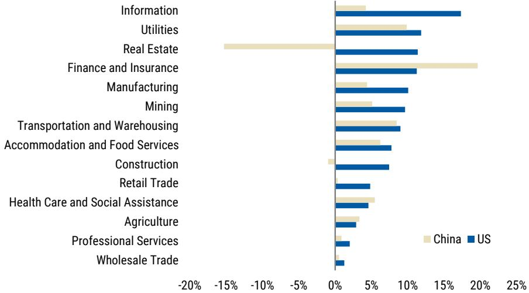

bar chart

| Sector | China (%) | US (%) |
| :--- | :--- | :--- |
| Information | 4.5 | 17.5 |
| Utilities | 10.0 | 12.0 |
| Real Estate | -16.0 | 11.5 |
| Finance and Insurance | 20.0 | 11.5 |
| Manufacturing | 4.5 | 10.5 |
| Mining | 5.0 | 10.0 |
| Transportation and Warehousing | 8.5 | 9.5 |
| Accommodation and Food Services | 6.5 | 8.0 |
| Construction | -0.5 | 7.5 |
| Retail Trade | 0.2 | 5.5 |
| Health Care and Social Assistance | 5.5 | 6.0 |
| Agriculture | 3.5 | 3.0 |
| Professional Services | 0.5 | 2.5 |
| Wholesale Trade | 0.2 | 1.5 |

## Why major technological breakthroughs tend to generate a J-curve in productivity

- Learning frictions  
- Process disruption  
• Investment in capital, skills and organizational change

## AI Diffusion

## What to Expect on Policy Mitigation

## 1. GUIDING PRINCIPLE

natural_image

Illustration of a balanced scale with two pans (no text or symbols)

Balance technological progress with labor-market stability

## 2. POLICY TILT

Higher-end, knowledge work

Greater labor flexibility to accelerate AI adoption

Labor-intensive
service sectors

More cautious approach to protect employment

## 3. POSSIBLE MITIGATING MEASURES

Upskilling & vocational training support

New high-tech & service jobs creation

Stronger social protection (unemployment, healthcare, pension for gig workers)

More calibrated automation in labor-intensive services

## Gradual Rebalancing

## Unlock China's Household Savings...

China's household saving rate remains elevated  
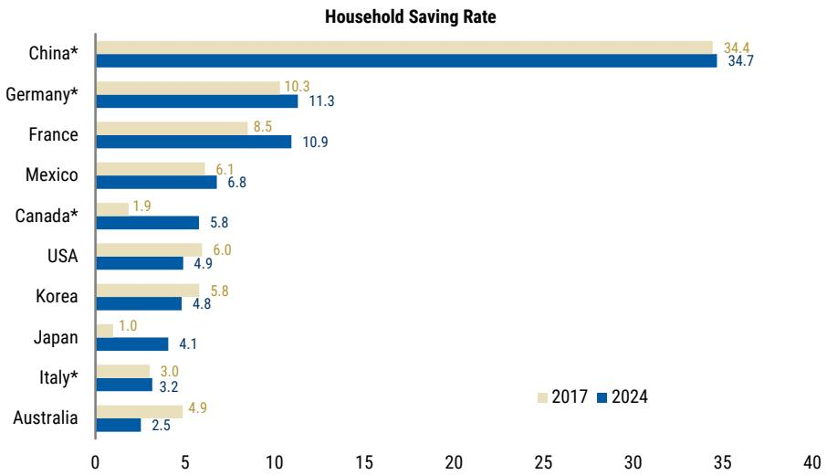

bar chart

Household Saving Rate
| Country | 2017 | 2024 |
| :--- | :--- | :--- |
| China* | 34.4 | 34.7 |
| Germany* | 10.3 | 11.3 |
| France | 8.5 | 10.9 |
| Mexico | 6.1 | 6.8 |
| Canada* | 1.9 | 5.8 |
| USA | 6.0 | 4.9 |
| Korea | 5.8 | 4.8 |
| Japan | 1.0 | 4.1 |
| Italy* | 3.0 | 3.2 |
| Australia | 4.9 | 2.5 |

\*2024 data for China, Germany, Canada and Italy. 2023 data for the others

A three-stage roadmap to unwind household savings  
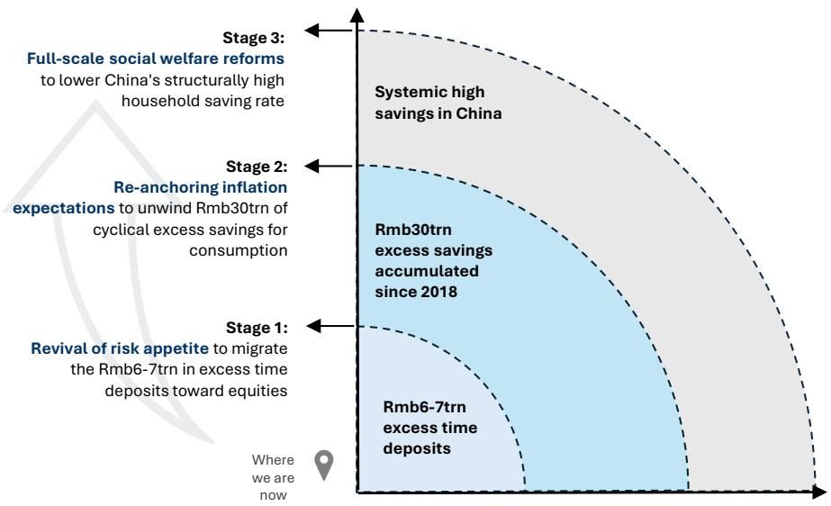

area chart

| Stage | Description                                      | Value |
|-------|--------------------------------------------------|-------|
| Stage 1 | Revival of risk appetite to migrate the Rmb6-7trn in excess time deposits toward equities | - |
| Stage 2 | Re-anchoring inflation expectations to unwind Rmb30trn of cyclical excess savings for consumption   | - |
| Stage 3 | Full-scale social welfare reforms to lower China's structurally high household saving rate | - |
| Systemic high savings in China | Rmb30trn excess savings accumulated since 2018 | - |
| Systemic high savings in China | Rmb6-7trn excess time deposits | - |

Source: Haver, OECD, MS.

## Gradual Rebalancing

## ...with Social Welfare Reform

Income redistribution toward lower-income households that exhibit a higher marginal propensity to consume  
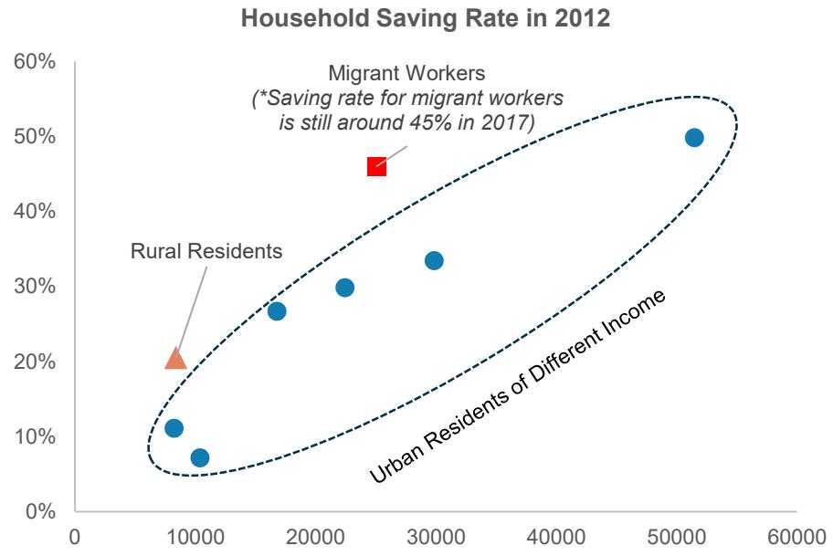

scatter plot

| Category              | X Value | Y Value |
| --------------------- | ------- | ------- |
| Rural Residents       | ~8000   | ~10%    |
| Urban Residents of Different Income | ~10000  | ~7%     |
| Urban Residents of Different Income | ~17000  | ~26%    |
| Urban Residents of Different Income | ~22000  | ~30%    |
| Urban Residents of Different Income | ~30000  | ~33%    |
| Urban Residents of Different Income | ~51000  | ~50%    |
| Migrant Workers (as % of total income) | ~25000  | ~45%    |

Provincial data show rising social welfare spending associated with higher consumption share in GDP  
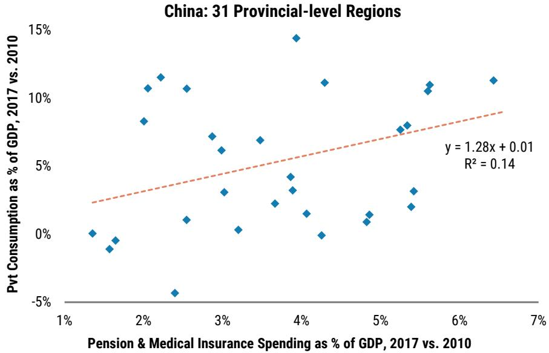

scatter plot

| Pension & Medical Insurance Spending as % of GDP, 2017 vs. 2010 | Pvt Consumption as % of GDP, 2017 vs. 2010 |
| ---------------------------------------------------------- | ------------------------------------------ |
| 1%                                                         | -5%                                        |
| 2%                                                         | 10%                                        |
| 3%                                                         | 7%                                         |
| 4%                                                         | 15%                                        |
| 5%                                                         | 8%                                         |
| 6%                                                         | 11%                                        |
| 7%                                                         | 12%                                        |

Source: CEIC, MS.

## Gradual Rebalancing

## Long-term Care Insurance to Enhance Social Security

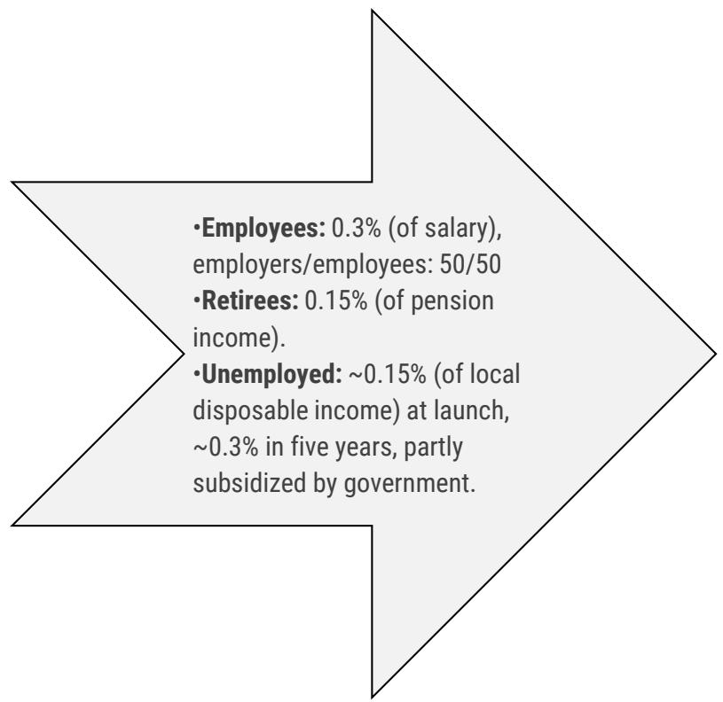

flowchart

| Category | Percentage | Count |
| -------- | ---------- | ----- |
| Employees | 0.3% (of salary), employers/employees: 50/50 | 50/50 |
| Retirees | 0.15% (of pension income). | 50/50 |
| Unemployed | ~0.15% (of local disposable income) at launch, ~0.3% in five years, partly subsidized by government. | 50/50 |
| Subsidiized | ~0.3% | five years, partly subsidized by government.

Long-term Care Insurance Contribution Breakdown (% Share)  
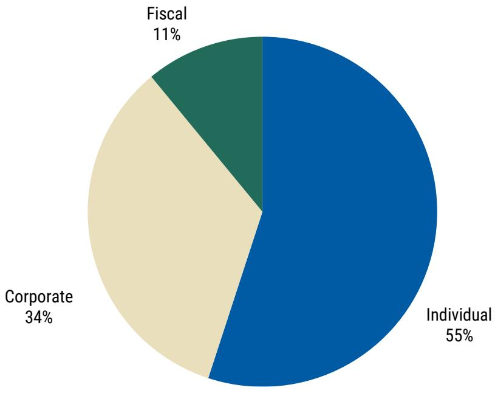

pie chart

| Category | Percentage (%) |
| :--- | :--- |
| Individual | 55 |
| Corporate | 34 |
| Fiscal | 11 |

Annual Total Contribution: \~Rmb100bn  
Source: Government website, MS.

## Gradual Rebalancing

## Fragmented Social Welfare System

Wide benefit gaps across social groups  
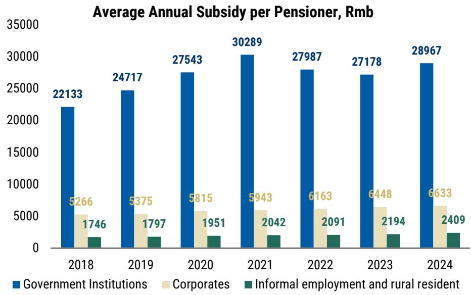

bar chart

Average Annual Subsidy per Pensioner, Rmb
| Year | Government Institutions (Rmb) | Corporates (Rmb) | Informal employment and rural resident (Rmb) |
| :--- | :--- | :--- | :--- |
| 2018 | 22133 | 5266 | 1746 |
| 2019 | 24717 | 5375 | 1797 |
| 2020 | 27543 | 5815 | 1951 |
| 2021 | 30289 | 5943 | 2042 |
| 2022 | 27987 | 6163 | 2091 |
| 2023 | 27178 | 6448 | 2194 |
| 2024 | 28967 | 6633 | 2409 |

Inequality reduced, yet redistributive power lags peers  
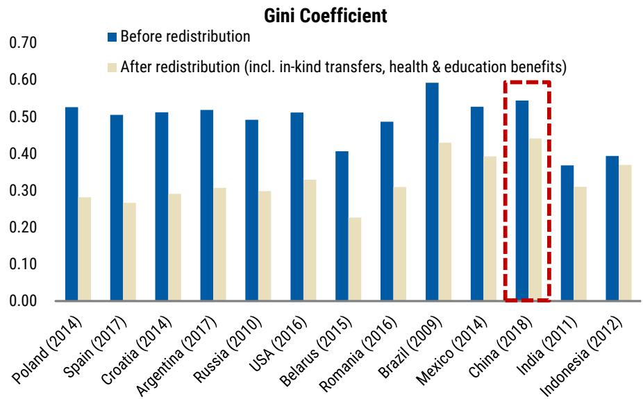

bar chart

Gini Coefficient
| Country (Year) | Before redistribution | After redistribution (incl. in-kind transfers, health & education benefits) |
| :--- | :--- | :--- |
| Poland (2014) | 0.53 | 0.28 |
| Spain (2017) | 0.51 | 0.26 |
| Croatia (2014) | 0.51 | 0.29 |
| Argentina (2017) | 0.52 | 0.31 |
| Russia (2010) | 0.49 | 0.30 |
| USA (2016) | 0.51 | 0.33 |
| Belarus (2015) | 0.41 | 0.23 |
| Romania (2016) | 0.49 | 0.31 |
| Brazil (2009) | 0.59 | 0.43 |
| Mexico (2014) | 0.53 | 0.39 |
| China (2018) | 0.54 | 0.44 |
| India (2011) | 0.37 | 0.31 |
| Indonesia (2012) | 0.39 | 0.37 |

Source: CEIC, World Bank, CEQ Institute, MS.

## Gradual Rebalancing

## Is Social Welfare Reform Financially Sustainable?

Reasonably lifting rural pension benefits would incur modest additional fiscal burden...  
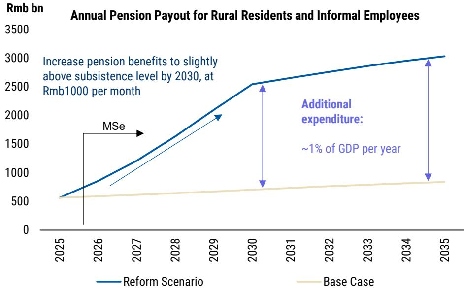

line chart

| Year | Reform Scenario | Base Case |
|------|-----------------|-----------|
| 2025 | MSe             | ~500      |
| 2026 | ~800            | ~550      |
| 2027 | ~1200           | ~600      |
| 2028 | ~1600           | ~650      |
| 2029 | ~2000           | ~700      |
| 2030 | ~2500           | ~750      |
| 2031 | ~2700           | ~800      |
| 2032 | ~2800           | ~850      |
| 2033 | ~2900           | ~900      |
| 2034 | ~3000           | ~950      |
| 2035 | ~3100           | ~1000     |

...but the system would become more underfunded over the long run  
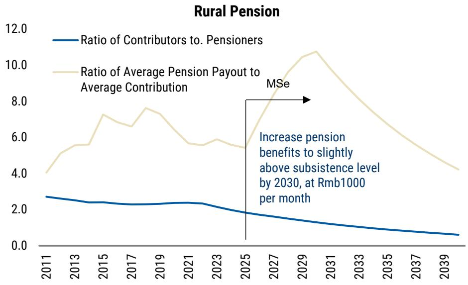

line chart

| Year | Ratio of Contributors to. Pensioners | Ratio of Average Pension Payout to Average Contribution |
|------|----------------------------------------|----------------------------------------------------------|
| 2011 | 2.7                                    | 4.0                                                      |
| 2013 | 2.5                                    | 5.5                                                      |
| 2015 | 2.4                                    | 7.3                                                      |
| 2017 | 2.3                                    | 6.5                                                      |
| 2019 | 2.3                                    | 7.7                                                      |
| 2021 | 2.3                                    | 5.7                                                      |
| 2023 | 2.3                                    | 5.8                                                      |
| 2025 | 1.8                                    | 5.5                                                      |
| 2027 | 1.5                                    | 8.0                                                      |
| 2029 | 1.2                                    | 10.8                                                     |
| 2031 | 1.0                                    | 9.5                                                      |
| 2033 | 0.8                                    | 8.0                                                      |
| 2035 | 0.7                                    | 6.5                                                      |
| 2037 | 0.6                                    | 5.5                                                      |
| 2039 | 0.5                                    | 4.5                                                      |

Source: CEIC, MS estimates.

## Disclosure Section

Information and opinions in MS were prepared or are disseminated by one or more of the following, which accept responsibility for its contents: MS Asia Limited, and/or MS Asia (Singapore) Pte. (Registration number 199206298Z) and/or MS Asia (Singapore) Securities Pte Ltd (Registration number 200008434H), regulated by the Monetary Authority of Singapore (which accepts legal responsibility for its contents and should be contacted with respect to any matters arising from, or in connection with, MS), and/or MS Taiwan Limited and/or MS & Co International plc, Seoul Branch, and/or MS Australia Limited (A.B.N. 67 003 734 576, holder of Australian financial services license No. 233742), and/or MS Wealth Management Australia Pty Ltd (A.B.N. 19 009 145 555, holder of Australian financial services license No. 240813, and/or MS India Company Private Limited having Corporate Identification No (CIN) U22990MH1998PTC115305, regulated by the Securities and Exchange Board of India ("SEBI") and holder of licenses as a Research Analyst (SEBI Registration No. INH000001105), Stock Broker (SEBI Stock Broker Registration No. INZ000244438), Merchant Banker (SEBI Registration No. INM000011203), and depository participant with National Securities Depository Limited (SEBI Registration No. IN-DP-NSDL-567-2021) having registered office at Altimus, Level 39 & 40, Pandurang Budhkar Marg, Worli, Mumbai 400018, India; Telephone no. +91-22-61181000; Compliance Officer Details: Mr. Tejarshi Hardas, Tel. No.: +91-22-61181000 or Email: tejarshi.hardas@morganstanley.com; Grievance officer details: Mr. Tejarshi Hardas, Tel. No.: +91-22-61181000 or Email: msic-compliance@morganstanley.com which accepts the responsibility for its contents and should be contacted with respect to any matters arising from, or in connection with, MS and their affiliates (collectively, "MS"). MS India Company Private Limited (MSICPL) may use AI tools in providing research services. All recommendations contained herein are made by the duly qualified research analysts;

For important disclosures, stock price charts and equity rating histories regarding companies that are the subject of this report, please see the MS Disclosure Website at www.morganstanley.com/eqr/disclosures/webapp/generalresearch, or contact your investment representative or MS at 1585 Broadway, (Attention: Research Management), New York, NY, 10036 USA.

For valuation methodology and risks associated with any recommendation, rating or price target referenced in this research report, please contact the Client Support Team as follows: US/Canada +1800 303-2495; Hong Kong +852 2848-5999; Latin America +1718 754-5444 (U.S.); London +44 (0)20-7425-8169; Singapore +65 6834-6860; Sydney +61(0)2-9770-1505; Tokyo +81(0)3-6836-9000. Alternatively you may contact your investment representative or MS at 1585 Broadway, (Attention: Research Management), New York, NY 10036 USA.

## Global Research Conflict Management Policy

MS has been published in accordance with our conflict management policy, which is available at www.morganstanley.com/institutional/research/conflictpolicies. A Portuguese version of the policy can be found at www.morganstanley.com.br

## Important Disclosures

MS is not acting as a municipal advisor and the opinions or views contained herein are not intended to be, and do not constitute, advice within the meaning of Section 975 of the Dodd-Frank Wall Street Reform and Consumer Protection Act. MS does not provide individually tailored investment advice. MS has been prepared without regard to the circumstances and objectives of those who receive it. MS recommends that investors independently evaluate particular investments and strategies, and encourages investors to seek the advice of a financial adviser. The appropriateness of an investment or strategy will depend on an investor's circumstances and objectives. The securities, instruments, or strategies discussed in MS may not be suitable for all investors, and certain investors may not be eligible to purchase or participate in some or all of them. MS is not an offer to buy or sell or the solicitation of an offer to buy or sell any security/instrument or to participate in any particular trading strategy. The value of and income from your investments may vary because of changes in interest rates, foreign exchange rates, default rates, prepayment rates, securities/instruments prices, market indexes, operational or financial conditions of companies or other factors. There may be time limitations on the exercise of options or other rights in securities/instruments transactions. Past performance is not necessarily a guide to future performance. Estimates of future performance are based on assumptions that may not be realized. If provided, and unless otherwise stated, the closing price on the cover page is that of the primary exchange for the subject company's securities/instruments.

The fixed income research analysts, strategists or economists principally responsible for the preparation of MS have received compensation based upon various factors, including quality, accuracy and value of research, firm profitability or revenues (which include fixed income trading and capital markets profitability or revenues), client feedback and competitive factors. Fixed Income Research analysts', strategists' or economists' compensation is not linked to investment banking or capital markets transactions performed by MS or the profitability or revenues of particular trading desks.

With the exception of information regarding MS, MS is based on public information. MS makes every effort to use reliable, comprehensive information, but we make no representation that it is accurate or complete. We have no obligation to tell you when opinions or information in MS change apart from when we intend to discontinue equity research coverage of a subject company. Facts and views presented in MS have not been reviewed by, and may not reflect information known to, professionals in other MS business areas, including investment banking personnel.

MS may make investment decisions that are inconsistent with the recommendations or views in this report.

To our readers based in Taiwan or trading in Taiwan securities/instruments: Information on securities/instruments that trade in Taiwan is distributed by MS Taiwan Limited ("MSTL"). Such information is for your reference only. The reader should independently evaluate the investment risks and is solely responsible for their investment decisions. MS may not be distributed to the public media or quoted or used by the public media without the express written consent of MS. Any non-customer reader within the scope of Article 7-1 of the Taiwan Stock Exchange Recommendation Regulations accessing and/or receiving MS is not permitted to provide MS to any third party (including but not limited to related parties, affiliated companies and any other third parties) or engage in any activities regarding MS which may create or give the appearance of creating a conflict of interest. Information on securities/instruments that do not trade in Taiwan is for informational purposes only and is not to be construed as a recommendation or a solicitation to trade in such securities/instruments. MSTL may not execute transactions for clients in these securities/instruments.

MS is not incorporated under PRC law and the research in relation to this report is conducted outside the PRC. MS does not constitute an offer to sell or the solicitation of an offer to buy any securities in the PRC. PRC investors shall have the relevant qualifications to invest in such securities and shall be responsible for obtaining all relevant approvals, licenses, verifications and/or registrations from the relevant governmental authorities themselves. Neither this report nor any part of it is intended as, or shall constitute, provision of any consultancy or advisory service of securities investment as defined under PRC law. Such information is provided for your reference only.

MS is disseminated in Brazil by MS C.T.V.M. S.A. located at Av. Brigadeiro Faria Lima, 3600, 6th floor, São Paulo - SP, Brazil; and is regulated by the Comissão de Valores Mobiliários; in Mexico by MS México, Casa de Bolsa, S.A. de C.V which is regulated by Comision Nacional Bancaria y de Valores. Paseo de los Tamarindos 90, Torre 1, Col. Bosques de las Lomas Floor 29, 05120 Mexico City; in Japan by MS MUFG Securities Co., Ltd. and, for Commodities related research reports only, MS Capital Group Japan Co., Ltd; in Hong Kong by MS Asia Limited (which accepts responsibility for its contents) and by MS Bank Asia Limited; in Singapore by MS Asia (Singapore) Pte. (Registration number 199206298Z) and/or MS Asia (Singapore) Securities Pte Ltd (Registration number 200008434H), regulated by the Monetary Authority of Singapore (which accepts legal responsibility for its contents and should be contacted with respect to any matters arising from, or in connection with, MS) and by MS Bank Asia Limited, Singapore Branch (Registration number T14FC0118); in Australia to "wholesale clients" within the meaning of the Australian Corporations Act by MS Australia Limited A.B.N. 67 003 734 576, holder of Australian financial services license No. 23374-2, which accepts responsibility for its contents; in Australia to "wholesale clients" and "retail clients" within the meaning of the Australian Corporations Act by MS Wealth Management Australia Pty Ltd (A.B.N. 19 009 145 555, holder of Australian financial services license No. 240813, which accepts responsibility for its contents; in Korea by MS & Co International plc, Seoul Branch; in India by MS India Company Private Limited having Corporate Identification No (CIN) U22990MH1998PTC115305, regulated by the Securities and Exchange Board of India ("SEBI") and holder of licenses as a Research Analyst (SEBI Registration No. INH000001105); Stock Broker (SEBI Stock Broker Registration No. INZ000244438), Merchant Banker (SEBI Registration No. INM000011203), and depository participant with National Securities Depository Limited (SEBI Registration No. IN-DP-NSDL-567-2021) having registered office at Altimus, Level 39 & 40, Pandurang Budhkar Marg, Worli, Mumbai 400018, India; Telephone no. +91-22-61181000; Compliance Officer Details: Mr. Tejarshi Hardas, Tel. No.: +91-22-61181000 or Email: tejarshi.hardas@morganstanley.com; Grievance officer details: Mr. Tejarshi Hardas, Tel. No.: +91-22-61181000 or Email: msic-compliance@morganstanley.com. MS India Company Private Limited (MSICPL) may use AI tools in providing research services. All recommendations contained herein are made by the duly qualified research analysts; in Canada by MS Canada Limited; in Germany and the European Economic Area where required by MS Europe S.E., regulated by Bundesanstalt fuer Finanzdienstleistungsaufsicht (BaFin) under the reference number 149169; in the United States by MS & Co. LLC, which accepts responsibility for its contents. MS & Co. International plc, authorized by the Prudential Regulation Authority and regulated by the Financial Conduct Authority and the Prudential Regulation Authority, disseminates in the UK research that it has prepared, and research which has been prepared by any of its affiliates, only to persons who (i) are investment professionals falling within Article 19(5) of the Financial Services and Markets Act 2000 (Financial Promotion) Order 2005 (as amended, the "Order"); (ii) are persons who are high net worth entities falling within Article 4.9(2)(a) to (d) of the Order; or (iii) are persons to whom an invitation or inducement to engage in investment activity (within the meaning of section 21 of the Financial Services and Markets Act 2000, as amended) may otherwise lawfully be communicated or caused to be communicated. RMB MS Proprietary Limited is a member of the JSE Limited and A2X (Pty) Ltd. RMB MS Proprietary Limited is a joint venture owned equally by MS International Holdings Inc. and RMB Investment Advisory (Proprietary) Limited, which is wholly owned by FirstRand Limited. The information in MS is being disseminated by MS Saudi Arabia, regulated by the Capital Market Authority in the Kingdom of Saudi Arabia, and is directed at Sophisticated investors only.

The trademarks and service marks contained in MS are the property of their respective owners. Third-party data providers make no warranties or representations relating to the accuracy, completeness, or timeliness of the data they provide and shall not have liability for any damages relating to such data. The Global Industry Classification Standard (GICS) was developed by and is the exclusive property of MSCI and S&P.

MS, or any portion thereof may not be reprinted, sold or redistributed without the written consent of MS.

Indicators and trackers referenced in MS may not be used as, or treated as, a benchmark under Regulation EU 2016/1011, or any other similar framework.

The information in MS is being communicated by MS & Co. International plc (DIFC Branch), regulated by the Dubai Financial Services Authority (the DFSA) or by MS & Co. International plc (ADGM Branch), regulated by the Financial Services Regulatory Authority Abu Dhabi (the FSRA), and is directed at Professional Clients only, as defined by the DFSA or the FSRA, respectively. The financial products or financial services to which this research relates will only be made available to a customer who we are satisfied meets the regulatory criteria of a Professional Client. A distribution of the different MS Research ratings or recommendations, in percentage terms for Investments in each sector covered, is available upon request from your sales representative.

The information in MS is being communicated by MS & Co. International plc (QFC Branch), regulated by the Qatar Financial Centre Regulatory Authority (the QFCRA), and is directed at business customers and market counterparties only and is not intended for Retail Customers as defined by the QFCRA.

As required by the Capital Markets Board of Turkey, investment information, comments and recommendations stated here, are not within the scope of investment advisory activity. Investment advisory service is provided exclusively to persons based on their risk and income preferences by the authorized firms. Comments and recommendations stated here are general in nature. These opinions may not fit to your financial status, risk and return preferences. For this reason, to make an investment decision by relying solely to this information stated here may not bring about outcomes that fit your expectations.

Registration granted by SEBI and certification from the National Institute of Securities Markets (NISM) in no way guarantee performance of the intermediary or provide any assurance of returns to investors. Investment in securities market are subject to market risks. Read all the related documents carefully before investing.

© 2026 MS