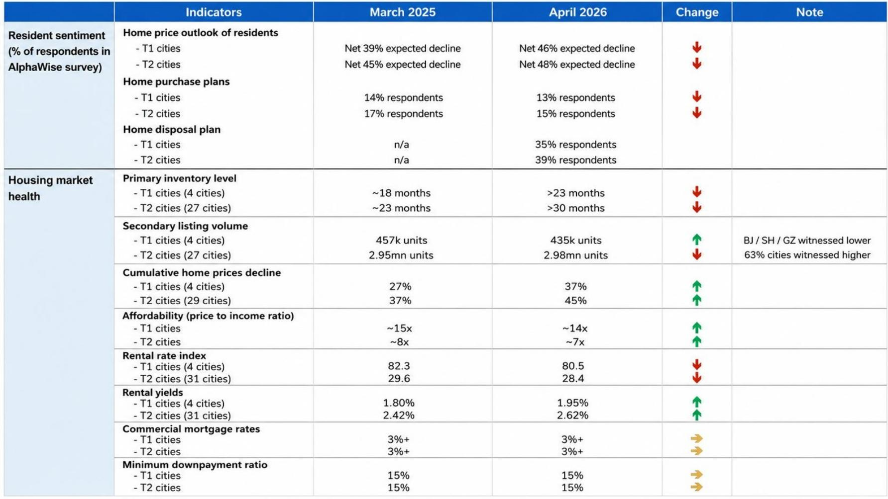
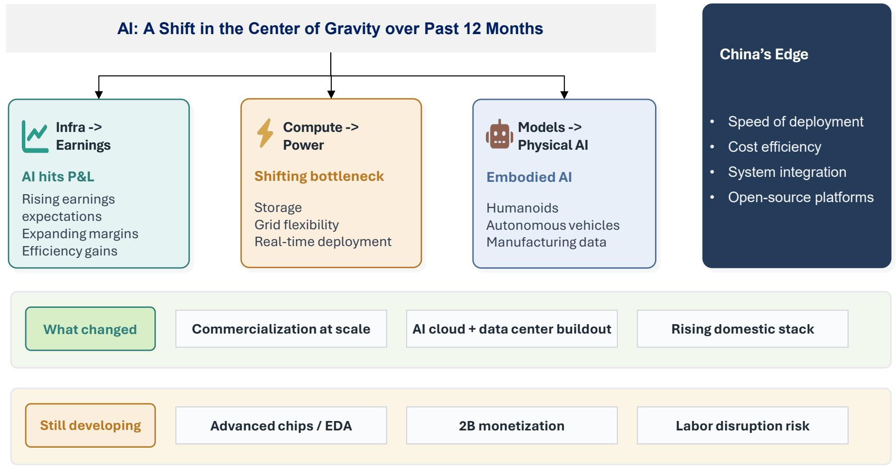
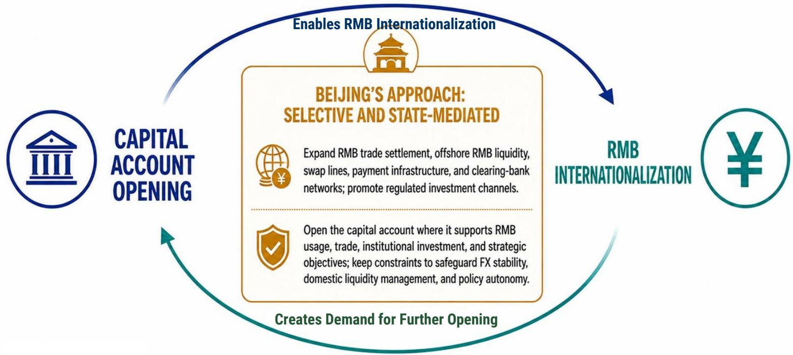

# China's AI and Energy Super Cycle Is Real, But It Will Not Rescue the Domestic Economy

The dominant narrative surrounding China's economic outlook has settled into a familiar pattern: the external sector is booming, driven by a once-in-a-generation industrial super cycle in artificial intelligence and energy, while the domestic economy remains stuck in a deflationary funk. A detailed analysis of a major investment bank's Asia-Pacific outlook confirms this two-speed reality, but the implications are far more strategic and less comforting than a simple "export good, domestic bad" summary. The core thesis is that the AI and energy capex super cycle is structurally real and will sustain China's export growth for years, yet its positive spillover to the broader domestic economy will be historically muted. This is not a temporary imbalance; it is a permanent structural shift that will reshape investment strategy, labor markets, and policy priorities.

Why does this matter now? Because the market is at an inflection point where the aggregate macro data—GDP growth hovering around 5%—masks a profound divergence beneath the surface. The report projects China's real GDP growth to decelerate from 5.0% in 2025 to 4.8% in 2026 and 4.7% in 2027. These headline numbers are stable enough to avoid panic, but the composition is alarming. Net exports are expected to contribute 1.6 percentage points to growth in 2025, while household consumption contributes only 1.8 points. The engine of growth is shifting decisively toward the external sector, and this is happening at a time when domestic demand is structurally weak.

The conventional wisdom has been that a strong export sector would eventually pull the domestic economy along through employment gains and corporate investment. This report challenges that transmission mechanism head-on. The data suggests that the industrial sector has become so capital-intensive and automated that export strength no longer translates into proportional job creation. Meanwhile, pervasive excess capacity means that even profitable exporters are reluctant to invest in new domestic capacity. The result is a decoupling: the export machine runs at full speed, but the domestic economy remains in a low-growth, low-inflation equilibrium.

This article will unpack the strategic logic of this two-speed economy, argue why the spillover effects will remain limited, and outline the key unresolved questions that investors must grapple with. The report provides the data; the interpretation is where the real value lies.

## The AI and Energy Super Cycle Is Not Just a Tech Story; It Is the Broadest Industrial Cycle Since the Mid-2000s

The most important insight from the report is that the current industrial upswing in Asia is not narrowly confined to semiconductors or AI hardware. The data shows a sharp, broad-based rise in Asia's non-tech exports since October 2025, with gains across intermediate goods, capital goods, consumer goods, and passenger cars. This is not a single-sector boom; it is a synchronized expansion across the entire manufacturing value chain.

The logic is straightforward. The AI super cycle requires massive investment in data centers, power infrastructure, and advanced manufacturing equipment. The energy super cycle—driven by the global transition to electrification and renewable energy—requires investment in grid infrastructure, battery production, and electric vehicle supply chains. These two cycles are reinforcing each other, creating demand for everything from basic metals and chemicals to sophisticated machinery and transport equipment. China, with its dominant share in global value-added across virtually every manufacturing sector, is the primary beneficiary.

The report shows that China's share in global manufacturing value-added has already increased from 26% in 2017 to 27% in 2024, with particularly strong gains in non-metallic mineral products (48%), leather and footwear (47%), and wood products (38%). These are not just high-tech sectors; they are broad-based manufacturing categories. The report projects China's global export market share to rise from 14.8% in 2024 to 16.5% by 2030 in the base case, and potentially as high as 18.0% in an upside scenario.

The strategic implication is clear: China's export competitiveness is not dependent on a single technology or sector. It is embedded in the entire manufacturing ecosystem. The AI and energy super cycle is providing a powerful tailwind, but the underlying structural advantage is China's ability to produce virtually everything at scale and competitive cost. This is a durable source of growth that will persist even as the specific drivers of the super cycle evolve.

## The Domestic Spillover Will Be Milder Because the Industrial Sector Has Become Capital-Intensive and Job-Light

This is the critical counterpoint to the export optimism. The report presents compelling evidence that the transmission from export strength to domestic economic vitality is broken. The scatter plot showing revenue growth versus employment growth for Chinese industrial firms reveals a stark pattern: revenue growth has been strong, but employment growth has been flat or negative. The correlation between export strength and domestic capital expenditure has also declined significantly over the past three years.

The mechanism is straightforward. Chinese manufacturers have invested heavily in automation and AI-driven production processes. The report explicitly notes that AI diffusion—including generative AI, agentic AI, and physical AI—is adding to labor market stress. The industrial sector is becoming more productive but less labor-intensive. When export orders surge, companies can increase output without hiring proportionally. The employment multiplier, which was the traditional channel through which export growth boosted domestic consumption, has been severely attenuated.

Furthermore, the pervasive excess capacity in Chinese manufacturing means that companies are reluctant to invest in new production facilities even when demand is strong. Why build a new factory when existing capacity is underutilized? The report's data on the 3-year rolling correlation between export strength and domestic capex shows a clear downward trend. The export boom is generating profits, but those profits are being retained, used to pay down debt, or reinvested in automation rather than capacity expansion. The domestic economy sees the financial benefit but not the employment or investment stimulus.

The strategic implication for investors is that China's export strength is a double-edged sword. It provides a floor under aggregate GDP growth and supports corporate profits in export-oriented sectors. But it also perpetuates the structural imbalance by allowing policymakers to delay the difficult reforms needed to revive domestic demand. The export sector can grow at 8-10% annually without generating commensurate domestic demand, leaving the broader economy stuck in a low-growth equilibrium.

## Housing Remains a Structural Drag, and Recent Rebound Signals Are Misleading

The report's housing analysis is particularly valuable because it cuts through the noise of recent data. There has been a post-Lunar New Year rebound in housing sales, which some market participants have interpreted as a sign of stabilization. The report treats this with appropriate skepticism, noting that the rebound may partly reflect the release of previously pent-up demand rather than a genuine recovery.

The structural data is sobering. Years of declining new starts have depleted the construction pipeline. The report shows that new housing starts have been declining for several years, and the pipeline of projects under construction is shrinking. This means that even if demand stabilizes, the supply response will be limited. The construction sector, which was a major driver of domestic employment and demand, will not recover to previous levels.

The historical comparison of housing price cycles is particularly instructive. The report plots the trajectory of real housing prices in China against the experience of other countries that experienced housing bubbles—Japan, the United States, Spain, Ireland, and others. The pattern is clear: China's housing price correction is following a trajectory that is broadly consistent with the historical experience of other bubble economies. The implication is that the adjustment is not over. The report does not provide a precise forecast for when prices will bottom, but the historical analogies suggest that the process takes years, not quarters.

The shift toward smaller lump-sum housing units is another important signal. The report's data shows that the transaction volume for smaller units has increased relative to larger units. This suggests that homebuyers are trading down, either because of affordability constraints or because they have less confidence in the long-term value of large properties. This is consistent with a market that is adjusting to lower expectations rather than recovering.

The strategic implication is that housing will remain a drag on domestic demand for the foreseeable future. The wealth effect from rising home prices, which was a major driver of Chinese household consumption for two decades, is now reversed. Households are saving more and spending less, partly because they are uncertain about the value of their largest asset. This is a structural headwind that will not be resolved by policy tweaks or interest rate cuts.

## The Report Leaves a Critical Question Unanswered: How Will Policymakers Bridge the Domestic Demand Gap?

The report is excellent at diagnosing the problem but necessarily limited in its ability to prescribe a solution. It identifies the key binding constraint: labor market slack. The employment sub-index for manufacturing and non-manufacturing has been trending downward, and AI diffusion is likely to exacerbate this trend. The report also highlights the more entrenched youth unemployment and the erosion of middle-income wage stability.

The report projects that government consumption will contribute 0.8 percentage points to GDP growth in 2025, up from 0.2 in 2024. This implies some fiscal expansion, but it is clearly not enough to offset the drag from housing and the muted domestic spillover from exports. The report does not provide a detailed analysis of what a sufficient fiscal stimulus would look like, nor does it assess the political or institutional constraints on such a stimulus.

This is the unresolved analytical question that should drive investor thinking. The export sector can sustain GDP growth at 4.5-5.0% for several more years, but that growth will be increasingly concentrated in capital-intensive, export-oriented industries. The domestic economy—household consumption, services employment, and small business activity—will lag. This creates a political and social challenge. How long can the government tolerate a two-speed economy where the benefits of growth are so unevenly distributed?

The answer to this question will determine the trajectory of policy. If the government accepts the two-speed economy as the new normal, then policy will focus on maintaining export competitiveness and managing the social consequences through targeted transfers and social safety net expansion. If the government decides that domestic demand must be revived, then a much larger fiscal stimulus—potentially including direct cash transfers to households—would be necessary. The report does not resolve this question, but it provides the framework for thinking about it.

## A Decision Framework for Investors: Three Scenarios for the Two-Speed Economy

The report's analysis can be translated into a practical decision framework for investors. The key variable is the policy response to the domestic demand gap. There are three plausible scenarios, each with different implications for asset allocation and sector positioning.

Scenario One: Policy Accommodation Without Structural Reform. In this scenario, the government continues to provide modest fiscal and monetary support, enough to keep GDP growth above 4.5% but not enough to revive domestic demand. The export sector continues to outperform, while domestic consumption and investment remain weak. This scenario favors export-oriented manufacturing, AI and energy infrastructure, and companies with strong global competitive positions. It is negative for domestic consumer discretionary, real estate, and financials exposed to the housing market. This is the base case implied by the report.

Scenario Two: A Major Fiscal Push Focused on Households. In this scenario, the government recognizes that the two-speed economy is unsustainable and implements a large-scale fiscal transfer program to boost household consumption. This could take the form of direct cash payments, tax cuts, or expanded social benefits. In this scenario, domestic consumption would recover, benefiting consumer staples, retail, and services. Export sectors would still perform well, but the relative outperformance would narrow. This scenario would be positive for the broader market but would require a significant shift in policy philosophy.

Scenario Three: A Negative Supply Shock or Trade Disruption. In this scenario, the export super cycle is interrupted by a global recession, trade war escalation, or a sharp decline in AI-related investment. The external engine stalls, and the domestic economy is too weak to compensate. GDP growth would fall below 4%, and the government would be forced into a crisis-response mode. This scenario is negative for virtually all sectors but would create opportunities for companies with strong balance sheets and pricing power.

The report does not explicitly endorse any of these scenarios, but the data suggests that Scenario One is the most likely. The government has shown a preference for gradual policy adjustment rather than bold stimulus. The export sector is strong enough to sustain growth without dramatic intervention. The risk is that the economy becomes trapped in a low-growth equilibrium where the structural imbalances become self-reinforcing.

Join the community to read the full report and review the original charts. The report contains detailed data on export market share by sector, housing price trajectories, and labor market indicators that are essential for building conviction on these scenarios. The analysis presented here is a starting point, not a conclusion. The unresolved questions about fiscal policy, labor market dynamics, and the sustainability of the export super cycle require ongoing monitoring and debate.

*This article is for learning and discussion only and does not constitute investment advice.*

Personal reading notes and learning share only. Not investment advice.

