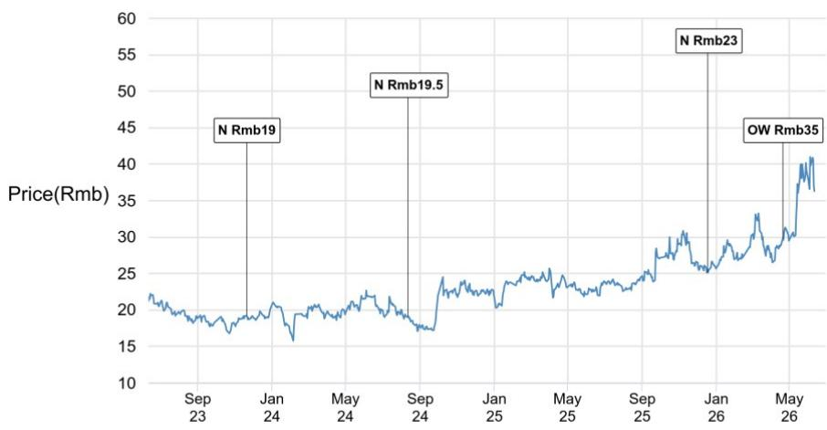
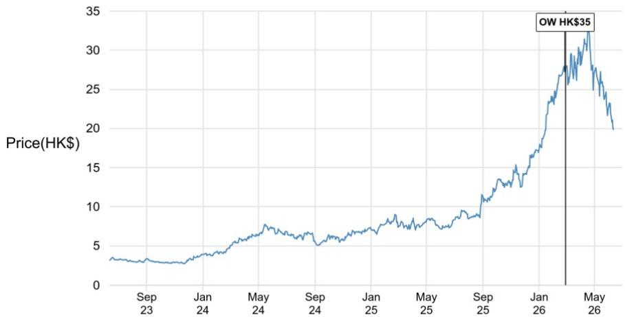
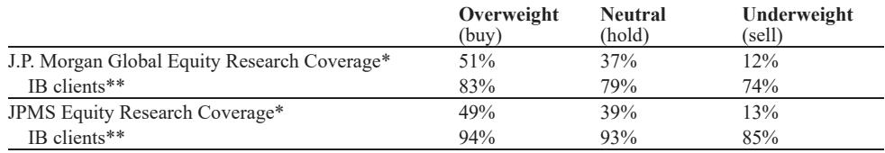

# JPM：中国电力设备在美渗透的拐点比市场预期的更快到来

这份JPM本周发布的研报，来自分析师团队在上海参加数据中心展和智慧能源展后的现场调研笔记。其核心判断不是关于中国电力设备市场的整体景气度——这已经被充分定价——而是关于一个正在发生但尚未被市场完全消化的结构性变化：中国电气设备供应商正在以超出预期的速度渗透美国数据中心供应链。

报告透露的信号是具体的、可验证的：部分中国企业的变压器交付周期是西方同行的四分之一到六分之一，美国数据中心客户已经开始实地考察中国工厂并下达订单，而更关键的是，这一轮渗透并非简单的价格战，而是建立在交期、定制化能力和逐步积累的认证基础之上。对于关注电力设备板块的投资者而言，真正需要回答的问题不是“中国设备能否进入美国”，而是“哪些企业能在这轮渗透中建立可持续的竞争优势，而不是仅仅享受一轮周期红利”。

## 1. 美国电气设备供应链的瓶颈正在为中国供应商打开一扇以前紧闭的门

研报中反复出现的核心事实是：美国电力设备市场的供需缺口正在为中国企业创造历史性的窗口期。一家输配电设备供应商的变压器交付周期为6至12个月，而西方同行需要2至3年。这不是微小的差距，这是决定数据中心能否按时上线的关键变量。

更值得关注的是，这并非个例。JPM的渠道调研显示，中国供应商在高压/低压设备领域的渗透率正在上升，驱动因素正是供应紧张和交期优势。数据中心的电力设备需求具有高度的时间敏感性——项目延迟意味着算力无法按时交付，这对云服务提供商（CSP）和大型互联网公司而言是巨大的机会成本。因此，当西方供应商的交付周期拉长至两年以上时，中国供应商的6个月交期就变得具有压倒性的吸引力。

但交期优势只是入场券。真正让这轮渗透不同于以往的是：美国客户正在主动评估中国供应商。报告明确提到，一些CSP今年早些时候已经访问了中国工厂并下达了订单。这意味着市场准入正在从被动接单转向主动认可。对于已经在美国市场有所布局的企业，如伊戈尔电气、安科瑞智能、上海电气和山东泰开，这轮窗口期的价值可能远超当前股价的反映。

## 2. 美国市场的利润率结构决定了这轮出海不是简单的产能转移

如果只是把中国市场的低价产品卖到美国，这轮渗透的可持续性将大打折扣。但报告揭示了一个更有利的经济学结构：美国市场的定价能力远强于中国。

一家供应商提到的数据是：美国市场的变压器毛利率可能达到30%至40%以上，而中国市场的毛利率仅在十几个百分点。同时，美国市场的平均售价（ASP）是中国市场的数倍，即使中国供应商的报价低于西方同行，其绝对利润水平仍然远高于国内。这种利润率差异意味着中国供应商有足够的空间进行产品升级、认证投入和本地化服务建设，从而形成正向循环。

但需要强调的是，这种利润率优势并非无条件的。报告指出，美国公用事业领域的渗透仍然有限，因为该领域对业绩记录、认证和采购名单准入有更严格的要求。目前中国供应商的主要切入点仍是数据中心，通过本地销售团队、EPC承包商和分销商渠道进入。这意味着，能够建立完整的美国本地化销售和服务体系的企业，将比单纯依赖出口的企业享有更持久的竞争优势。

## 3. 固态变压器（SST）正在成为下一代数据中心电力架构的关键变量，但商业化节奏仍有分歧

研报中关于固态变压器的内容值得单独拆解。伊顿在中国发布了面向AI数据中心的中压SST 2.0，采用10kV中压交流输入至800V直流输出的架构，单系统容量2.5MW，端到端效率98.5%，可用性超过99.999%。更重要的是，伊顿表示在中国有一个已运行超过一年的参考项目，这为产品验证提供了支撑。

但真正引发行业讨论的是特锐德与伊顿的战略合作。双方计划联合开发全预制数据中心电力解决方案，将伊顿的SST和中压直流能力与特锐德的高压预制舱系统结合，目标是为下一代AI数据中心构建220kV至800V直流的全链路架构。特锐德同时发布了“AI PowerHouse”系统级解决方案，宣称150天全站交付、20%的站端资本支出节省和30%的度电成本降低。

然而，SST在中国的采用前景仍然存在争议。部分行业参与者认为，随着AI机架密度上升，800V直流/SST将成为必要选择；另一些人则认为高密度需求仍然有限，交流架构在未来几年仍将是主流。SST目前的价格仍高于传统方案，尽管供应商预计随着规模扩Daiwa技术成熟，平均售价将下降，但大规模出货可能要到2027至2028年才会更加明朗。

这里的关键判断是：SST的产业化进程不仅取决于技术成熟度，更取决于AI数据中心的功率密度演进速度。如果高密度机架的需求如预期般爆发，SST将从“可选项”变为“必选项”，届时率先完成产品验证和客户积累的企业将占据先发优势。

## 4. 2027年美国数据中心需求将更加强劲，但供应链瓶颈可能成为制约因素

报告中最具前瞻性的判断来自一家企业提供的信息：其今年迄今为止已获得约10亿元人民币的美国数据中心相关输配电订单，但更大的AI数据中心采购周期尚未完全启动，许多项目仍处于管道中，受限于电力可用性、电网连接和长设备交期。

这意味着当前看到的订单可能只是冰山一角。一些示范项目已经在提前订购变压器，因为交期超过一年。展望未来，更多的数据中心并网项目和表后发电项目将推动更强劲的电气设备需求。但这里有一个隐含的风险：如果中国供应商的渗透速度跟不上需求爆发，美国市场可能面临更严重的设备短缺，从而推高价格并延长项目周期。

另一个值得注意的细节是，数据中心客户在关键组件上仍然倾向于选择全球领先的电气品牌，如施耐德、西门子和ABB，尤其是在高规格项目中。中国供应商的机会更多存在于成本敏感型项目或客户允许本地替代的场景。这意味着，中国企业的渗透将是一个渐进的过程，而非一夜之间的替代。

## 5. 报告尚未完全回答的关键问题：中国供应商的竞争优势能否从交期优势转化为品牌和认证壁垒

研报提供了丰富的渠道调研信息，但有一个问题始终没有完全展开：当西方供应商开始扩产、交期差距缩小时，中国企业的竞争优势还能持续吗？

从历史经验看，交期优势通常是周期性的。一旦供应链瓶颈缓解，客户可能会重新转向传统品牌。中国供应商要实现从“备选”到“首选”的跨越，需要在产品认证、本地化服务和品牌信任度上进行持续投入。报告提到，美国公用事业领域的渗透受限正是因为认证和采购名单门槛。如果中国供应商能够在这一领域取得突破，其竞争优势将更加持久。

另一个未解问题是：SST的商业化节奏是否会被中国市场的价格压力拖慢？中国供应商在SST领域的研发投入很高，但多数仍处于原型、样品或早期参考项目阶段。如果中国市场的价格竞争过于激烈，可能会压缩企业的研发投入空间，从而影响其在美国市场的竞争力。

## 6. 投资者的观察框架：从三个维度评估中国电力设备企业的美国市场价值

基于这份研报的逻辑，投资者在评估相关企业时，可以建立以下三个维度的分析框架：

第一，美国市场的收入占比和增长可见度。不仅是当前订单量，更重要的是订单的可持续性和客户结构。能够进入CSP直接采购名单的企业，其收入质量远高于通过分销商零星接单的企业。

第二，本地化能力。包括美国销售团队、售后服务网络、产品认证进度和本地制造布局。单纯依赖出口的企业在关税、合规和客户信任度方面面临更大的不确定性。

第三，技术差异化。在SST、HVDC和预制化解决方案等前沿领域有实质性布局的企业，更有可能在下一代数据中心电力架构中占据有利位置。特锐德的“AI PowerHouse”和伊顿的SST产品就是典型例子，但需要跟踪这些产品的实际订单和客户反馈。

这份JPM研报的价值在于，它提供了大量一手渠道信息，让投资者能够超越宏观叙事，看到具体的订单、交期和利润率数据。但正如报告所暗示的，中国电力设备在美渗透的故事才刚刚开始，真正的胜负手可能要在2027至2028年才能见分晓。

关于SST在不同数据中心架构下的技术经济性对比、中国供应商在美国公用事业领域的突破路径，以及特锐德与伊顿合作的具体条款和排他性安排，报告没有完全展开。这些细节恰恰是判断企业长期竞争力的关键。欢迎来星球微信群里继续讨论，我们会在社群中分享完整的研报原文和更深入的财务模型拆解。

Personal reading notes and learning share only. Not investment advice.

