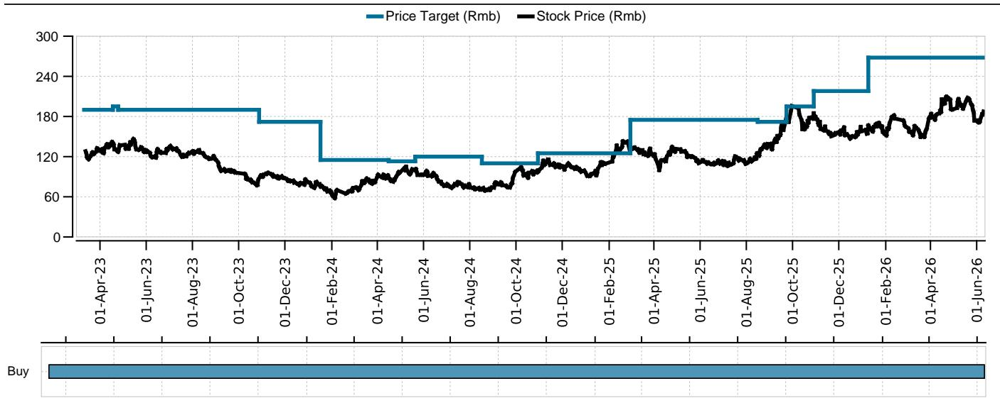
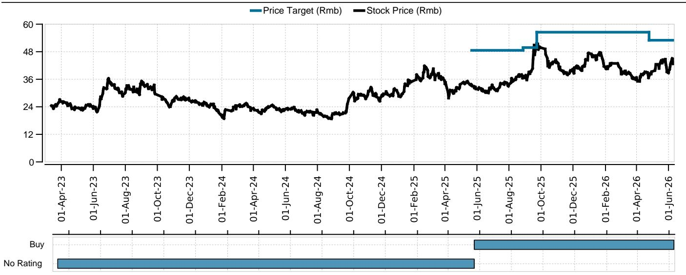
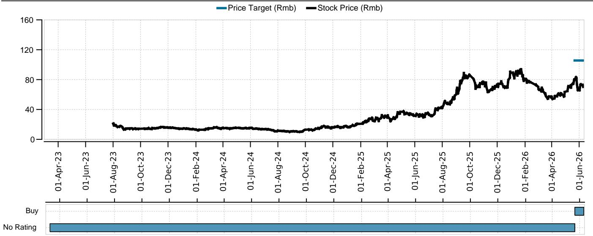

# UBS：人形机器人供应链的“确定性”正在从概念走向订单，但市场仍低估了传统业务的反转弹性

2026年6月10日，UBS在嘉兴举办了一场面向机构投资者的实地调研，走访了双环传动和荣泰电工两家公司，并与核心管理层进行了深度交流。这份调研纪要看似聚焦于两家零部件企业的季度经营更新，但其背后揭示了一个更深层的产业信号：中国汽车零部件供应链正在经历一轮“需求结构切换”的关键拐点。

市场目前的关注点高度集中在人形机器人这一新兴赛道上。这当然重要。但UBS这份报告最有价值的判断，并非机器人业务本身，而是“传统NEV业务正在环比改善，而欧洲市场渗透率提升正在为这些企业提供新的增长动量”。换句话说，人形机器人的故事是估值弹性，而传统业务的复苏才是安全边际的基石。

这份报告真正值得细读的地方在于：它提供了三家核心标的（科达利、双环传动、荣泰电工）在“新旧动能切换”这个时点上的微观证据。这不是一份宏观展望，而是一次带着订单和产能数据回来的实地验证。

## 1. 双环传动的NEV齿轮产能利用率突破90%，这是比机器人更重要的信号

双环传动在交流中披露了一个关键数字：Q2 2026 NEV齿轮出货量环比显著增长，产能利用率已超过90%。在汽车零部件行业，产能利用率一旦突破85%-90%的临界点，就意味着固定成本摊薄进入加速区间，毛利率将出现非线性改善。

这个数字的意义在于：它验证了UBS此前对国内NEV需求在二季度企稳回升的判断。过去几个季度，市场对NEV零部件企业的担忧主要集中在“价格战传导”和“产能过剩”上。双环传动90%以上的产能利用率，至少说明在齿轮这个细分领域，头部企业的产能消化能力远好于市场悲观假设。

更值得关注的是，双环传动正在将齿轮技术外溢到AIDC发电机领域，核心客户包括卡特彼勒和玉柴。管理层指引该业务将在2026年开始贡献收入。这意味着双环传动正在从单一汽车零部件供应商，向“汽车+数据中心+机器人”的多元驱动结构演变。这种技术外溢能力，是传统零部件企业估值体系重构的关键变量。

UBS报告没有完全展开的是：AIDC发电机齿轮的技术壁垒、毛利率水平、以及卡特彼勒的订单规模，目前仍缺乏公开数据支撑。这部分业务的能见度，将是判断双环传动长期估值中枢能否上移的核心。

## 2. 荣泰电工的精密丝杠已获PPAP批准，人形机器人从“样品”进入“订单”阶段

荣泰电工CEO在交流中给出的信息，可能是这份报告中最具“从0到1”意义的数据点：公司用于灵巧手和本体的精密丝杠，已获得某北美头部人形机器人制造商的PPAP批准，并在6月观察到订单开始爬坡。同时，泰国制造基地正在加速建设，为H2 2026的量产做准备。

PPAP（Production Part Approval Process）是汽车和高端制造业中极为严格的供应商准入流程。获得PPAP批准，意味着荣泰电工的丝杠产品在尺寸、材料、工艺、耐久性等方面都通过了客户的全套验证。这不再是“实验室样品”或“小批量试制”，而是拿到了进入量产供应链的正式门票。

UBS报告同时指出，荣泰电工正在向该北美客户送样更多产品，包括结构件。管理层对电机和减速器的进展也表示“按计划推进”。这意味着荣泰电工在机器人关节总成中的“零件渗透率”正在扩大，从单一丝杠向更多环节延伸。

但这里有一个需要持续验证的关键问题：订单爬坡的速度和规模。PPAP批准是必要条件，但不是充分条件。量产阶段的良率、成本控制、产能爬坡速度，才是决定荣泰电工能否真正从机器人业务中兑现利润的核心变量。UBS报告对此着墨不多，这部分信息只能通过后续季报和客户订单公告来持续跟踪。

## 3. 欧洲NEV渗透率提升，正在成为传统业务的“第二增长曲线”

UBS报告提到，欧洲市场NEV渗透率上升，有望为传统业务带来新的增长动能。荣泰电工管理层对此给出了更具体的支撑：欧洲NEV销售强劲，叠加特斯拉Semi Truck和Cybercab的新订单，正在拉动其云母热失控防护绝缘件业务。

这是一个容易被忽视的结构性变化。过去两年，市场对汽车零部件企业的海外业务预期，主要聚焦在“地缘政治风险”和“关税壁垒”上。但UBS调研揭示了一个相反的事实：欧洲NEV渗透率的提升，正在为具备全球交付能力的中国零部件企业创造增量订单。

双环传动的匈牙利工厂也在稳步爬坡，管理层设定了海外NEV齿轮出货量100万套的目标。这意味着中国零部件企业的“出海”逻辑，正在从“规避关税”升级为“贴近客户、参与当地供应链建设”。这种从“出口”到“本地化”的转变，将显著改变海外业务的盈利结构和估值逻辑。

UBS报告没有完全展开的是：欧洲NEV渗透率提升的可持续性，以及中国零部件企业在欧洲的产能扩张是否会引发新的竞争格局变化。这些问题的答案，将决定这一“第二增长曲线”的天花板在哪里。

## 4. 报告尚未完全回答的关键问题：机器人业务的利润兑现路径与竞争格局演变

尽管UBS报告提供了大量正面信号，但有两个关键问题目前仍处于“待验证”状态。

第一，机器人业务的利润兑现路径。无论是双环传动的定制化减速器，还是荣泰电工的精密丝杠，目前都处于“小批量爬坡”或“PPAP刚获批”的阶段。从PPAP批准到大规模量产，再到贡献正现金流，中间存在多个不确定性节点：良率、成本、产能建设进度、客户订单稳定性。UBS报告对这些环节的量化预测非常有限，这意味着市场对人形机器人业务的估值，目前更多是基于“可能性”而非“确定性”。

第二，竞争格局的演变。UBS报告提到了科达利、荣泰电工、双环传动以及执行器龙头是“最可能的人形机器人赢家”，但并未深入分析这些标的之间的竞争关系和差异化。如果人形机器人供应链最终走向“多家供应商共存”的格局，那么每家企业的利润空间和市场份额将取决于技术壁垒、成本优势和客户绑定深度。目前，这些差异化因素在报告中尚未被充分拆解。

## 5. 读者的观察框架：重新审视“安全边际”与“估值弹性”的关系

基于UBS这份调研报告，我们可以提炼出一个适用于当前时点的观察框架：将标的分为“传统业务提供安全边际”和“机器人业务提供估值弹性”两个维度，然后判断两者的匹配程度。

以UBS的首选标的科达利为例：其核心电池结构件业务增长稳健，机器人业务具有高能见度。这属于“安全边际”和“估值弹性”兼备的标的。双环传动和荣泰电工则处于“传统业务反转”与“机器人业务起步”的交汇点，估值逻辑的切换需要持续跟踪传统业务的盈利改善速度和机器人业务的订单兑现节奏。

对于产业决策者而言，这份报告传递的最重要信息是：人形机器人供应链的“确定性”正在从概念走向订单，但“大规模商业化”仍未到来。在这个阶段，选择那些“传统业务足够扎实、机器人业务有真实订单验证”的标的，比押注纯概念标的更具风险收益比。

UBS报告在结尾处给出了明确的个股偏好：科达利是首选，双环传动和荣泰电工紧随其后。但报告也坦诚地列出了每只标的的风险因素，包括NEV渗透率不及预期、海外扩张瓶颈、机器人商业化进度慢于预期等。这些风险提示，恰恰是投资者在构建仓位时需要反复权衡的维度。

人形机器人供应链的投资，正在从“讲故事”进入“验证故事”的阶段。UBS这份调研报告，提供了一份难得的实地验证数据。但故事的下半场，需要更多的订单、更多的产能数据、更多的利润兑现来书写。

欢迎来知识星球微信群中继续讨论：机器人供应链的订单追踪、传统业务反转的财务验证节点、以及UBS报告中未完全展开的竞争格局分析，都是值得深入拆解的话题。

Personal reading notes and learning share only. Not investment advice.

