CHINA EDUCATION MAY-26 TRACKER

# Learning tablet GMV growth pressured by high base, yet ASP upward trend sustained; Student visa decline narrowed

We summarize key findings from the May 2026 updates of our China Education tracker, including AI education apps, AI learning tablets, mobile user engagement, tutoring licenses, overseas study trends, and East Buy.

■ Mobile user engagement/learning center capacity: i) ByteDance: Doubao Study DAU growth accelerated to +146% yoy as of May-end and sustained the position of the 6th largest AI native app in China in terms of DAUs (Exhibit 1), while Gauth maintained its leadership with monthly billings +24% yoy to c.US\$1.1mn; ii) TAL: MAU growth for Xueersi.com decelerated to +10% yoy in May and Peiyou MAU maintained +19% yoy growth. On the other hand, offline non-academic tutoring licenses # continued the downward trend in May (Exhibit 18).  
AI learning tablets: Combined online GMV of 6 major learning device brands dropped -35% yoy in May (vs. -2% yoy in Apr) on major e-commerce platforms against the high base last year. TAL sold c.96k units for c.Rmb355mn GMV in May (-24% yoy), with ASP yoy decline narrowing to -4%. For TAL's 1QFY26 (May-Q), our tracked GMV dropped -1% yoy (vs. GSe of +11% yoy).  
- Overseas study: Student visas # granted to Chinese for Canada, Australia and UK combined dropped -9% yoy in 1Q26 (Exhibit 20), narrowing down vs. -22%/-16% yoy in 1Q25/2025.  
East Buy's GMV on Douyin grew +38% yoy/+7% mom to c.Rmb1.0bn in May (vs. +42% yoy in Apr), driven by new platforms' GMV +246% yoy (vs. -2% yoy decline for the original 3 platforms, Exhibit 27). East Buy app MAUs increased +38% yoy in May (vs. +42% yoy in Apr).

Within our China Education coverage, we are Buy rated on New Oriental (EDU/9901.HK, details in our recent upgrade note Up to Buy; Valuation too compelling to ignore) and TAL Education (TAL); New Oriental is trading at 11x CY26E P/E or 3x ex.cash, while TAL is trading at 12x CY26E P/E or 4x ex.cash. We are Sell on East Buy (1797.HK) and Offcn Education (002607.SZ).

Mobile user engagement: Doubao Study/Gauth continued scaling up in

Timothy Zhao

+852-2978-2673

timothy.zhao@gs.com

GS (Asia) L.L.C.

Ronald Keung, CFA

+852-2978-0856

ronald.keung@gs.com

GS (Asia) L.L.C.

Eunice Liu

+852-2978-7472 | eunice.liu@gs.com

GS (Asia) L.L.C.

Jason Sun

+852-2978-2616 | jinshi.sun@gs.com

GS (Asia) L.L.C.

## May; Peiyou app MAU steady growth vs. Xueersi.com growth moderated

## AI education apps

Exhibit 1: Doubao Study DAU growth accelerated to +146% yoy as of May-end and sustained the position of the 6th largest AI native app in China in terms of DAUs DAUs of major AI apps as of Apr-end  
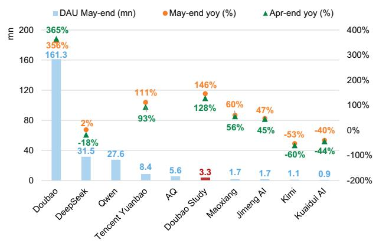

bar-line hybrid

| Company | DAU May-end (mn) | May-end yoy (%) | Apr-end yoy (%) |
| :--- | :--- | :--- | :--- |
| Doubao | 161.3 | 356 | 365 |
| DeepSeek | 31.5 | 2 | -18 |
| Qwen | 27.6 | | 93 |
| Tencent Yuanbao | 8.4 | 111 | |
| AQ | 5.6 | | 128 |
| Doubao Study | 3.3 | 146 | 60 |
| Maoxiang | 1.7 | | 56 |
| Jimeng AI | 1.7 | 47 | 45 |
| Kimi | 1.1 | -53 | -60 |
| Kuaidui AI | 0.9 | -40 | -44 |

Qwen: 75x/78x for Apr-end/May-end yoy growth  
Source: Questmobile, Data compiled by GS Global Investment Research

Exhibit 3: Gauth has outperformed global AI-native education peers in terms of MAUs
MAUs by AI education apps (mn)  
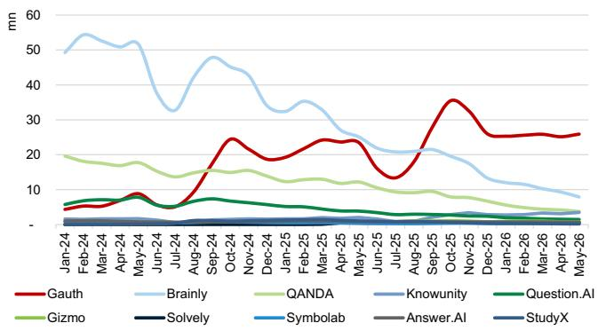

line chart

| Month | Gauth | Brainly | QANDA | Knowunity | Question.AI | Gizmo | Solvely | Symbolab | Answer.AI | StudyX |
| --- | --- | --- | --- | --- | --- | --- | --- | --- | --- | --- |
| Jan-24 | 5 | 50 | 20 | 5 | 5 | 18 | 5 | 5 | 5 | 5 |
| Feb-24 | 5 | 55 | 18 | 5 | 5 | 17 | 5 | 5 | 5 | 5 |
| Mar-24 | 5 | 53 | 17 | 5 | 5 | 16 | 5 | 5 | 5 | 5 |
| Apr-24 | 5 | 52 | 16 | 5 | 5 | 15 | 5 | 5 | 5 | 5 |
| May-24 | 8 | 33 | 15 | 5 | 5 | 14 | 5 | 5 | 5 | 5 |
| Jun-24 | 8 | 33 | 14 | 5 | 5 | 13 | 5 | 5 | 5 | 5 |
| Jul-24 | 8 | 33 | 14 | 5 | 5 | 13 | 5 | 5 | 5 | 5 |
| Aug-24 | 8 | 33 | 14 | 5 | 5 | 13 | 5 | 5 | 5 | 5 |
| Sep-24 | 8 | 33 | 14 | 5 | 5 | 13 | 5 | 5 | 5 | 5 |
| Oct-24 | 24 | 33 | 14 | 5 | 5 | 13 | 5 | 5 | 5 | 5 |
| Nov-24 | 20 | 33 | 14 | 5 | 5 | 13 | 5 | 5 | 5 | 5 |
| Dec-24 | 20 | 33 | 14 | 5 | 5 | 13 | 5 | 5 | 5 | 5 |
| Jan-25 | 20 | 33 | 14 | 5 | 5 | 13 | 5 | 5 | 5 | 5 |
| Feb-25 | 20 | 33 | 14 | 5 | 5 | 13 | 5 | 5 | 5 | 5 |
| Mar-25 | 20 | 33 | 14 | 5 | 5 | 13 | 5 | 5 | 5 | 5 |
| Apr-25 | 20 | 33 | 14 | 5 | 5 | 13 | 5 | 5 | 5 | 5 |
| May-25 | 20 | 33 | 14 | 5 | 5 | 13 | 5 | 5 | 5 | 5 |
| Jun-25 | 14 | 33 | 14 | 5 | 5 | 13 | 5 | 5 | 5 | 5 |
| Jul-25 | 14 | 33 | 14 | 5 | 5 | 13 | 5 | 5 | 5 | 5 |
| Aug-25 | 14 | 33 | 14 | 5 | 5 | 13 | 5 | 5 | 5 | 5 |
| Sep-25 | 14 | 33 | 14 | 5 | 5 | 13 | 5 | 5 | 5 | 5 |
| Oct-25 | 36 | 33 | 14 | 5 | 5 | 13 | 5 | 5 | 5 | 5 |
| Nov-25 | - | - | - | - | - | - | - | - | - | - |
| Dec-25 | - | - | - | - | - | - | - | - | - | - |
| Jan-26 | - | - | - | - | - | - | - | - | - | - |
| Feb-26 | - | - | - | - | - | - | - | - | - | - |
| Mar-26 | - | - | - | - | - | - | - | - | - | - |
| Apr-26 | - | - | - | - | - | - | - | - | - | - |
| May-26 | - | - | - | - | - | - | - | - | - | - |

Source: Sensor Tower, Data compiled by GS Global Investment Research

Exhibit 2: Doubao Study continued to expand time spent market share among major K-12 learning tool/study companion apps in May  
Time spent share among major K-12 learning tool/study companion apps  
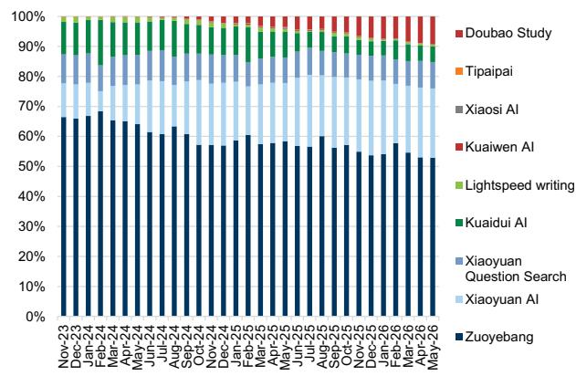  
Source: Questmobile, Data compiled by GS Global Investment Research

Exhibit 4: Gauth achieved c.US\$1.1mn billings with +24% yoy growth in May (vs. +35% yoy in Apr), bringing LTM billings to US\$13.2mn  
LTM billings by app (US\$ mn)  
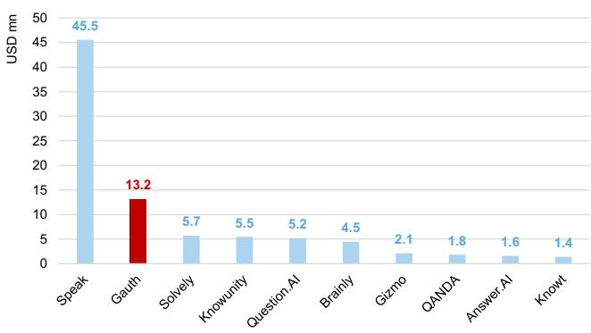

bar chart

| Category | Value (USD mm) |
|---|---|
| Speak | 45.5 |
| Gauth | 13.2 |
| Solvely | 5.7 |
| Knowunity | 5.5 |
| Question.AI | 5.2 |
| Brainly | 4.5 |
| Gizmo | 2.1 |
| OANDA | 1.8 |
| Answer.AI | 1.6 |
| Knowt | 1.4 |

Source: Sensor Tower, Data compiled by GS Global Investment Research

Exhibit 5: Gauth monthly billings per avg. DAU grew +39% yoy to US\$0.4 in May (vs. +49% yoy in Apr)  
Gauth monthly billings (US\$ mn) and monthly billings per avg. DAU (US\$)  
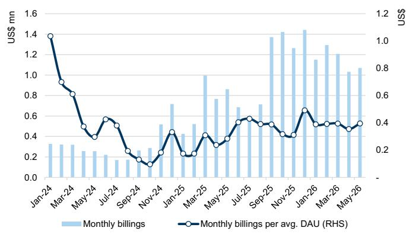

bar-line hybrid chart

| Month | Monthly billings (US$ mn) | Monthly billings per avg. DAU (RHS) |
|---|---|---|
| Jan-24 | 0.3 | 1.4 |
| Feb-24 | 0.3 | 1.0 |
| Mar-24 | 0.3 | 0.9 |
| Apr-24 | 0.25 | 0.8 |
| May-24 | 0.25 | 0.5 |
| Jun-24 | 0.25 | 0.4 |
| Jul-24 | 0.2 | 0.6 |
| Aug-24 | 0.15 | 0.55 |
| Sep-24 | 0.25 | 0.3 |
| Oct-24 | 0.15 | 0.15 |
| Nov-24 | 0.5 | 0.25 |
| Dec-24 | 0.7 | 0.4 |
| Jan-25 | 0.4 | 0.2 |
| Feb-25 | 0.5 | 0.2 |
| Mar-25 | 1.0 | 0.4 |
| Apr-25 | 0.75 | 0.3 |
| May-25 | 0.85 | 0.35 |
| Jun-25 | 0.7 | 0.55 |
| Jul-25 | 0.7 | 0.55 |
| Aug-25 | 0.7 | 0.5 |
| Sep-25 | 1.4 | 0.45 |
| Oct-25 | 1.3 | 0.4 |
| Nov-25 | 1.45 | 0.4 |
| Dec-25 | 1.3 | 0.65 |
| Jan-26 | 1.15 | 0.45 |
| Feb-26 | 1.3 | 0.45 |
| Mar-26 | 1.25 | 0.45 |
| Apr-26 | 1.1 | 0.4 |
| May-26 | 1.05 | 0.45 |
| Jun-26 | 1.1 | 0.45 |

Source: Sensor Tower, Data compiled by GS Global Investment Research

## K-12 tutoring user engagement

Online K-12 tutoring: MAU growth for non-academic tutoring platforms decelerated to +2% yoy in May (excluding Youdao with continued MAU yoy decline) vs. +6%/+14% yoy in Mar/Apr, while MAUs for not-for-profit subject tutoring platforms dropped -26% yoy in May (vs. -20%/-21% yoy in Mar/Apr).  
TAL's Xueersi.com MAU yoy growth decelerated in May: Among pure online education apps, MAU growth for Xueersi.com decelerated to +10% yoy in May (vs. +10%/+22% yoy in Mar/Apr). MAU growth of TAL Xueersi (for Peiyou enrichment learning course registration and Peiyou Online course attendance) maintained +19% yoy in May (vs. +26%/+19% yoy in Mar/Apr), while MAU for EDU (for course registration) dropped -8% yoy in May (vs. +6%/+6% yoy in Mar/Apr).

Exhibit 6: MAU growth of Xueersi.com grew +10% yoy in May (vs. +22% yoy in Apr)  
MAU yoy growth of major tutoring platforms (%)  
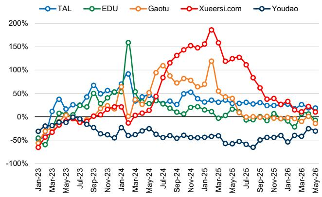

line chart

| Month   | TAL  | EDU  | Gaotu | Xueersi.com | Youdao |
|---------|------|------|-------|-------------|--------|
| Jan-23  | -50% | -75% | -75%  | -75%        | -25%   |
| Mar-23  | 40%  | 10%  | 10%   | -25%        | -25%   |
| May-23  | 60%  | 25%  | 25%   | -10%        | -25%   |
| Jul-23  | 70%  | 30%  | 30%   | -5%         | -25%   |
| Sep-23  | 80%  | 40%  | 40%   | 0%          | -25%   |
| Nov-23  | 90%  | 50%  | 50%   | 10%         | -30%   |
| Jan-24  | 100% | 160% | 60%   | -10%        | -35%   |
| Mar-24  | 80%  | 50%  | 40%   | 10%         | -35%   |
| May-24  | 60%  | 30%  | 30%   | 40%         | -35%   |
| Jul-24  | 50%  | 20%  | 20%   | 80%         | -35%   |
| Sep-24  | 40%  | 10%  | 10%   | 120%        | -35%   |
| Nov-24  | 30%  | 5%   | 5%    | 140%        | -35%   |
| Jan-25  | 20%  | 0%   | 120%  | 180%        | -35%   |
| Mar-25  | 10%  | -5%  | 60%   | 160%        | -35%   |
| May-25  | 5%   | -10% | 40%   | 140%        | -35%   |
| Jul-25  | 0%   | -15% | 20%   | 120%        | -35%   |
| Sep-25  | -5%  | -20% | 10%   | 80%         | -35%   |
| Nov-25  | -10% | -25% | -5%   | 40%         | -35%   |
| Jan-26  | -15% | -30% | -10%  | 20%         | -35%   |
| Mar-26  | -20% | -35% | -15%  | 10%         | -35%   |
| May-26  | -25% | -40% | -20%  | -5%         | -35%   |

Source: Questmobile, Data compiled by GS Global Investment Research

Exhibit 7: Xueersi.com and TAL still led MAU yoy growth within non-academic tutoring in May  
MAUs of major non-academic tutoring platforms (mn)  
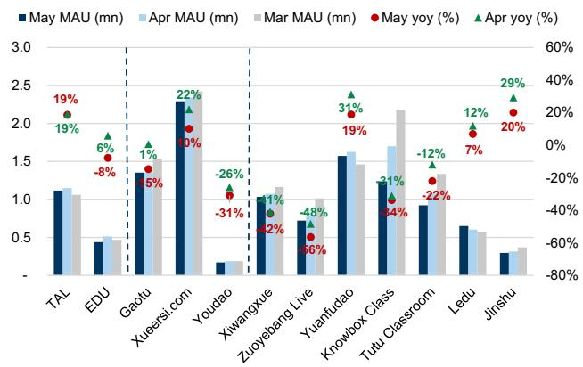

bar-line hybrid chart

| Company | May MAU (mn) (%) | Apr MAU (mn) (%) | Mar MAU (mn) (%) | May yoy (%) (%) | Apr yoy (%) (%) |
| :--- | :--- | :--- | :--- | :--- | :--- |
| TAL | 19 | 1.15 | 1.05 | 19 | 19 |
| EDU | -8 | 0.5 | 0.45 | 6 | 6 |
| Gaotu | 1 | 1.35 | 1.55 | 1 | 1 |
| Xueersi.com | 22 | 2.3 | 1.75 | 10 | 22 |
| Youdao | -31 | 0.25 | 0.2 | -26 | -26 |
| Xiwangxue | -42 | 1.05 | 1.15 | -42 | -42 |
| Zuoyebang Live | -48 | 0.75 | 1.0 | -48 | -48 |
| Yuanfudao | 19 | 1.6 | 1.45 | -34 | 31 |
| Knowbox Class | -34 | 1.25 | 2.15 | -22 | -12 |
| Tutu Classroom | -22 | 0.95 | 1.35 | 7 | 12 |
| Ledu | 7 | 0.65 | 0.55 | 20 | 20 |
| Jinshu | 29 | 0.35 | 0.35 | 20 | 29 |

Source: Questmobile, Data compiled by GS Global Investment Research

Exhibit 8: Not-for-profit subject tutoring platforms: Combined MAUs dropped -26% yoy in May (vs. -21% yoy in Apr)  
MAUs of not-for-profit subject tutoring platforms  
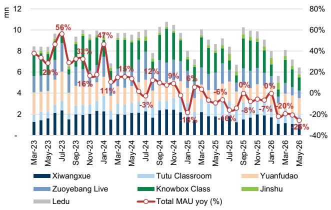

bar-line hybrid

| Month | Xiwangxue (mn) | Tutu Classroom (mn) | Yuanfudao (mn) | Zuoyebang Live (mn) | Knowbox Class (mn) | Jinshu (mn) | Ledu (mn) | Total MAU yoy (%) |
|---|---|---|---|---|---|---|---|---|
| Mar-23 | 1.5 | 1.8 | 1.9 | 1.7 | 4.0 | 0.0 | 0.0 | 20% |
| May-23 | 1.6 | 1.9 | 2.0 | 1.8 | 4.2 | 0.0 | 0.0 | 21% |
| Jul-23 | 2.0 | 2.1 | 2.2 | 2.0 | 4.5 | 0.0 | 0.0 | 56% |
| Sep-23 | 1.8 | 1.7 | 1.6 | 1.6 | 4.8 | 0.0 | 0.0 | 31% |
| Nov-23 | 1.9 | 1.8 | 1.7 | 1.7 | 4.9 | 0.0 | 0.0 | 16% |
| Jan-24 | 2.1 | 1.9 | 1.8 | 1.9 | 5.0 | 0.0 | 0.0 | 47% |
| Mar-24 | 1.7 | 1.6 | 1.5 | 1.5 | 4.8 | 0.0 | 0.0 | 11% |
| May-24 | 1.8 | 1.7 | 1.6 | 1.6 | 4.9 | 0.0 | 0.0 | 16% |
| Jul-24 | 2.0 | 1.8 | 1.7 | 1.7 | 5.0 | 0.0 | 0.0 | -3% |
| Sep-24 | 2.2 | 2.0 | 1.8 | 1.8 | 5.1 | 0.0 | 0.0 | 12% |
| Nov-24 | 2.3 | 2.1 | 1.9 | 1.9 | 5.2 | 0.0 | 0.0 | 9% |
| Jan-25 | 1.8 | 1.5 | 1.3 | 1.3 | 4.5 | -0.5 | -0.5 | -18% |
| Mar-25 | 2.0 | 1.6 | 1.4 | 1.4 | 4.6 | -0.5 | -0.5 | -6% |
| May-25 | 1.7 | 1.4 | 1.2 | 1.2 | 4.7 | -0.5 | -0.5 | -16% |
| Jul-25 | 1.6 | 1.3 | 1.1 | 1.1 | 4.8 | -0.5 | -0.5 | -8% |
| Sep-25 | 1.8 | 1.5 | 1.3 | 1.3 | 4.9 | -0.5 | -0.5 | -7% |
| Nov-25 | 2.0 | 1.6 | 1.4 | 1.4 | 5.0 | -0.5 | -0.5 | -20% |
| Jan-26 | 1.7 | 1.3 | 1.2 | 1.2 | 4.8 | -0.5 | -0.5 | -26% |
| Mar-26 | 1.5 | 1.2 | 1.1 | 1.1 | 4.7 | -0.5 | -0.5 | -36% |
| May-26 | -1.5 | -1.3 | -1.4 | -1.4 | -4.8 | -36% | -36% | -40% |
The chart displays a stacked bar chart with a line overlay showing the total annual year-over-year growth rate for each program from Mar-23 to May-26.

Source: Questmobile, Data compiled by GS Global Investment Research

Exhibit 9: Not-for-profit subject tutoring platforms: Total time spent dropped -33% yoy in May (vs. -21% yoy in Apr)  
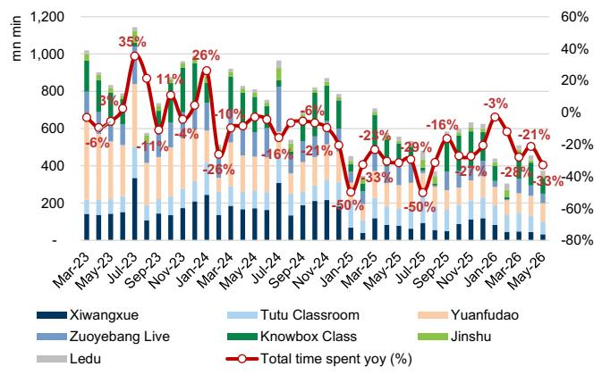

bar-line hybrid

| Month | Xiwangxue (mn min) | Tutu Classroom (mn min) | Yuanfudao (mn min) | Zuoyebang Live (mn min) | Knowbox Class (mn min) | Jinshu (mn min) | Ledu (mn min) | Total time spent yoy (%) |
|---|---|---|---|---|---|---|---|---|
| Mar-23 | 150 | 180 | 200 | 100 | 100 | 100 | 0 | -6% |
| May-23 | 140 | 170 | 210 | 90 | 90 | 100 | 0 | 3% |
| Jul-23 | 350 | 150 | 150 | 100 | 110 | 120 | 0 | 35% |
| Sep-23 | 150 | 160 | 180 | 100 | 100 | 100 | 0 | -11% |
| Nov-23 | 160 | 170 | 200 | 100 | 110 | 100 | 0 | -4% |
| Jan-24 | 220 | 180 | 220 | 100 | 120 | 110 | 0 | 26% |
| Mar-24 | 250 | 190 | 230 | 100 | 120 | 110 | 0 | -16% |
| May-24 | 240 | 180 | 220 | 100 | 110 | 100 | 0 | -26% |
| Jul-24 | 320 | 250 | 250 | 150 | 130 | 150 | 0 | -16% |
| Sep-24 | 280 | 260 | 240 | 150 | 130 | 140 | 0 | -6% |
| Nov-24 | 230 | 270 | 260 | 150 | 140 | 150 | 0 | -21% |
| Jan-25 | 80 | 350 | 350 | 150 | 140 | 140 | 0 | -50% |
| Mar-25 | 85 | 360 | 360 | 150 | 145 | 145 | 0 | -2% |
| May-25 | 85 | 365 | 365 | 155 | 145 | 145 | 0 | -33% |
| Jul-25 | 85 | 375 | 375 | 155 | 145 | 145 | 0 | -50% |
| Sep-25 | 85 | 385 | 385 | 165 | 145 | 145 | -3% | -16% |
| Nov-25 | 85 | 395 | 395 | 165 | 145 | 145 | -3% | -27% |
| Jan-26 | 85 | 405 | 405 | 175 | 145 | 145 | -3% | -3% |
| Mar-26 | 85 | 415 | 415 | 175 | 145 | 145 | -3% | -28% |
| May-26 | 85 | 425 | 425 | 185 | 145 | 145 | -3% | -33% |
Total time spent yoy (%)

Source: Questmobile, Data compiled by GS Global Investment Research

## AI learning tablets: TAL tablet GMV -35% yoy in May or flattish yoy in May-Q; ASP yoy decline continued narrowing

GMV: Combined GMV of 6 major learning device brands dropped -35% yoy or increased +46% mom in May (vs. -2% yoy/-47% mom in Apr) on Douyin/Taobao/Tmall/JD. By brand, GMV of (+) Yuanfudao increased +31% yoy in May, while (-) iFlytek/TAL/Xiaodu/BBK/Zuoyebang dropped -23%/-24%/-51%/-60%/-64% yoy.
Specifically, TAL sold c.96k units for c.Rmb355mn GMV on major eCommerce platforms in May, with -21% yoy/+99% mom for shipments and -24% yoy/+85% mom for GMV (vs. +20% yoy/-42% mom for GMV in Apr). ASP of TAL learning tablets saw the yoy decline narrowing to -4%, while decreasing -7% mom to c.Rmb3.7k in May due to 618 promotional campaigns (vs. -5% yoy/+6% mom in Apr). For TAL's 1QFY26 (May-Q), our tracked GMV dropped -1% yoy (below GSe of +11% yoy).

## Exhibit 10: TAL's learning tablets GMV dropped -24% yoy or increased +85% mom in May on major eCommerce platforms (vs. +20% yoy/-42% mom in Apr)

TAL's monthly online GMV on major eCommerce platforms

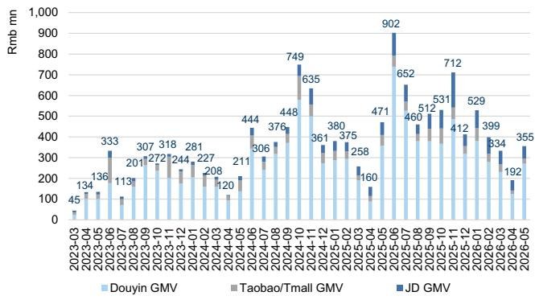  
Source: Moojing, Chanmama, Data compiled by GS Global Investment Research

## Exhibit 12: ASP of TAL's learning tablets saw the yoy decline narrowed to $-4\%$ yoy or $-7\%$ mom decline in May (vs. $-5\%$ yoy/+6% mom in Apr)

ASP trend of TAL's learning tablets on major eCommerce platforms

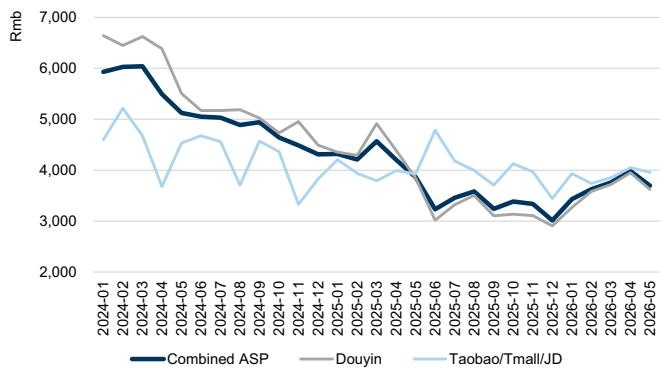

line chart

| Date    | Combined ASP | Douyin | Taobao/Tmall/JD |
|---------|--------------|--------|-----------------|
| 2024-01 | 6000         | 6800   | 4800            |
| 2024-02 | 6100         | 6900   | 5200            |
| 2024-03 | 6000         | 6700   | 4500            |
| 2024-04 | 5800         | 6500   | 3800            |
| 2024-05 | 5500         | 6300   | 4700            |
| 2024-06 | 5300         | 6100   | 4600            |
| 2024-07 | 5200         | 5900   | 4500            |
| 2024-08 | 5100         | 5800   | 4400            |
| 2024-09 | 5000         | 5700   | 4300            |
| 2024-10 | 4900         | 5600   | 4200            |
| 2024-11 | 4800         | 5500   | 4100            |
| 2024-12 | 4700         | 5400   | 4000            |
| 2025-01 | 4600         | 5300   | 3900            |
| 2025-02 | 4500         | 5200   | 3800            |
| 2025-03 | 4400         | 5100   | 3700            |
| 2025-04 | 4300         | 5000   | 3600            |
| 2025-05 | 4200         | 4900   | 3500            |
| 2025-06 | 4100         | 4800   | 3400            |
| 2025-07 | 4000         | 4700   | 3300            |
| 2025-08 | 3900         | 4600   | 3200            |
| 2025-09 | 3800         | 4500   | 3100            |
| 2025-10 | 3700         | 4400   | 3000            |
| 2025-11 | 3600         | 4300   | 2900            |
| 2025-12 | 3500         | 4200   | 2800            |
| 2026-01 | 3600         | 4300   | 2900            |
| 2026-02 | 3700         | 4400   | 3000            |
| 2026-03 | 3800         | 4500   | 3100            |
| 2026-04 | 3900         | 4600   | 3200            |
| 2026-05 | 4000         | 4700   | 3300            |

Source: Moojing, Chanmama, Data compiled by GS Global Investment Research

## Exhibit 11: For 1QFY27 (May-Q), TAL's learning tablets GMV dropped -1% yoy on major eCommerce platforms (vs. +20% yoy in 4QFY26)

TAL's quarterly online GMV on major eCommerce platforms

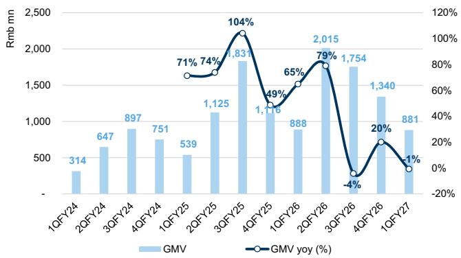

bar-line hybrid chart

| Quarter | GMV (Rmb mn) | GMV yoy (%) |
|---|---|---|
| 1QFY24 | 314 | |
| 2QFY24 | 647 | |
| 3QFY24 | 897 | |
| 4QFY24 | 751 | |
| 1QFY25 | 539 | 71 |
| 2QFY25 | 1,125 | 74 |
| 3QFY25 | 1,831 | 104 |
| 4QFY25 | 1,116 | 49 |
| 1QFY26 | 888 | 65 |
| 2QFY26 | 2,015 | 79 |
| 3QFY26 | 1,754 | -4 |
| 4QFY26 | 1,340 | 20 |
| 1QFY27 | 881 | -1 |

Source: Moojing, Chanmama, Data compiled by GS Global Investment Research

## Exhibit 13: We estimate TAL's learning tablet volume -21% yoy/+99% mom in May on major eCommerce platforms (vs. +27% yoy/-46% mom in Apr)

Monthly volume of TAL's learning tablets on major eCommerce platforms

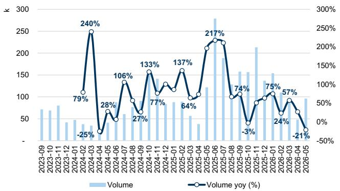

bar-line hybrid chart

| Date | Volume (k) | Volume yoy (%) |
|---|---|---|
| 2023-09 | 70 | |
| 2023-10 | 80 | |
| 2023-11 | 45 | |
| 2023-12 | 40 | |
| 2024-01 | 10 | 79 |
| 2024-02 | 10 | -25 |
| 2024-03 | 25 | 240 |
| 2024-04 | 30 | -25 |
| 2024-05 | 70 | 28 |
| 2024-06 | 55 | 50 |
| 2024-07 | 65 | 106 |
| 2024-08 | 55 | 27 |
| 2024-09 | 155 | 133 |
| 2024-10 | 135 | 77 |
| 2024-11 | 135 | 133 |
| 2024-12 | 135 | 137 |
| 2025-01 | 135 | 64 |
| 2025-02 | 155 | 100 |
| 2025-03 | 135 | 64 |
| 2025-04 | 125 | 100 |
| 2025-05 | 135 | 217 |
| 2025-06 | 285 | 217 |
| 2025-07 | 235 | 133 |
| 2025-08 | 165 | 74 |
| 2025-09 | 165 | -3 |
| 2025-10 | 165 | -3 |
| 2025-11 | 215 | 88 |
| 2025-12 | 165 | 75 |
| 2026-01 | 165 | 88 |
| 2026-02 | 165 | -3 |
| 2026-03 | 165 | -3 |
| 2026-04 | 95 | -19 |
| 2026-05 | 95 | -19 |

TAL's learning tablets total volume on Douyin is estimated by total GMV over ASP for TAL's major accounts on Douyin  
Source: Moojing, Chanmama, Data compiled by GS Global Investment Research

Exhibit 14: For 1QFY27 (May-Q), TAL's learning tablets volume increased +8% yoy on major eCommerce platforms (vs. +54% yoy in 4QFY26)  
Quarterly volume of TAL's learning tablets on major eCommerce platforms  
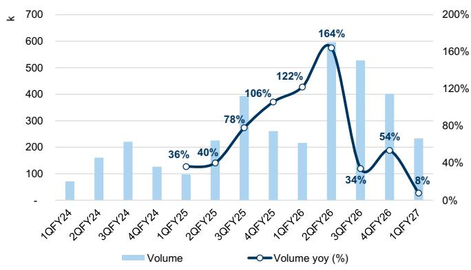

bar-line hybrid chart

| Quarter | Volume | Volume yoy (%) |
|---|---|---|
| 1QFY24 | 70 | - |
| 2QFY24 | 160 | - |
| 3QFY24 | 220 | - |
| 4QFY24 | 120 | - |
| 1QFY25 | 100 | 36 |
| 2QFY25 | 220 | 40 |
| 3QFY25 | 390 | 78 |
| 4QFY25 | 260 | 106 |
| 1QFY26 | 210 | 122 |
| 2QFY26 | 580 | 164 |
| 3QFY26 | 530 | 34 |
| 4QFY26 | 400 | 54 |
| 1QFY27 | 230 | 8 |

Source: Moojing, Chanmama, Data compiled by GS Global Investment Research

User engagement: MAUs of major education device brands grew +42% yoy/+4% mom to c.16.7mn in May (vs. +47% yoy/-6% mom in Apr). For TAL, MAUs of the Xueersi Smart app grew +100% yoy/+6% mom to c.3.6mn in May (vs. +117% yoy/-5% mom in Apr).

Exhibit 15: Active users of TAL and Zuoyebang learning tablets grew +100% yoy/+56% yoy in May (vs. +117% yoy/+70% yoy in Apr)  
MAUs of smart education device apps (mn)  
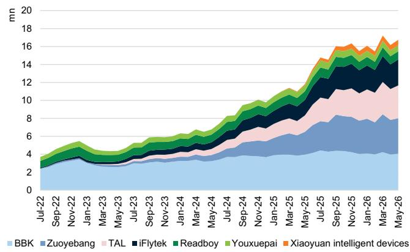

stacked bar chart

| Month | BBK (mn) | Zuoyebang (mn) | TAL (mn) | iFlytek (mn) | Readboy (mn) | Youxuepai (mn) | Xiaoyuan intelligent devices (mn) |
| --- | --- | --- | --- | --- | --- | --- | --- |
| Jul-22 | 3.0 | 1.5 | 1.0 | 1.0 | 1.0 | 1.0 | 1.0 |
| Sep-22 | 3.5 | 2.0 | 1.5 | 1.5 | 1.5 | 1.5 | 1.5 |
| Nov-22 | 4.0 | 2.5 | 2.0 | 2.0 | 2.0 | 2.0 | 2.0 |
| Jan-23 | 3.5 | 2.0 | 1.5 | 1.5 | 1.5 | 1.5 | 1.5 |
| Mar-23 | 3.0 | 1.5 | 1.0 | 1.0 | 1.0 | 1.0 | 1.0 |
| May-23 | 3.5 | 2.0 | 1.5 | 1.5 | 1.5 | 1.5 | 1.5 |
| Jul-23 | 4.0 | 2.5 | 2.0 | 2.0 | 2.0 | 2.0 | 2.0 |
| Sep-23 | 4.5 | 3.0 | 2.5 | 2.5 | 2.5 | 2.5 | 2.5 |
| Nov-23 | 5.0 | 3.5 | 3.0 | 3.0 | 3.0 | 3.0 | 3.0 |
| Jan-24 | 5.5 | 4.0 | 3.5 | 3.5 | 3.5 | 3.5 | 3.5 |
| Mar-24 | 6.0 | 4.5 | 4.0 | 4.0 | 4.0 | 4.0 | 4.0 |
| May-24 | 6.5 | 5.0 | 4.5 | 4.5 | 4.5 | 4.5 | 4.5 |
| Jul-24 | 7.0 | 5.5 | 5.0 | 5.0 | 5.0 | 5.0 | 5.0 |
| Sep-24 | 7.5 | 6.0 | 5.5 | 5.5 | 5.5 | 5.5 | 5.5 |
| Nov-24 | 8.0 | 6.5 | 6.0 | 6.0 | 6.0 | 6.0 | 6.0 |
| Jan-25 | 8.5 | 7.0 | 6.5 | 6.5 | 6.5 | 6.5 | 6.5 |
| Mar-25 | 9.0 | 7.5 | 7.0 | 7.0 | 7.0 | 7.0 | 7.0 |
| May-25 | 9.5 | 8.0 | 7.5 | 7.5 | 7.5 | 7.5 | 7.5 |
| Jul-25 | 10.0 | 8.5 | 8.0 | 8.0 | 8.0 | 8.0 | 8.0 |
| Sep-25 | 10.5 | 9.0 | 8.5 | 8.5 | 8.5 | 8.5 | 8.5 |
| Nov-25 | 11.0 | 9.5 | 9.0 | 9.0 | 9.0 | 9.0 | 9.0 |
| Jan-26e | 11.5 | 10.0 | 9.5 | 9.5 | 9.5 | 9.5 | 9.5 |

Source: Questmobile, Data compiled by GS Global Investment Research

Exhibit 16: For TAL, MAUs of the Xueersi Smart app grew +100% yoy/+6% mom to c.3.6mn in May (vs. +117% yoy/-5% mom in Apr)  
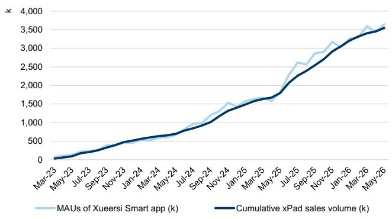

line chart

| Month    | MAUs of Xueersi Smart app (k) | Cumulative xPad sales volume (k) |
| -------- | ----------------------------- | -------------------------------- |
| Mar-23   | 0                             | 0                                |
| May-23   | 100                           | 100                              |
| Jul-23   | 200                           | 200                              |
| Sep-23   | 300                           | 300                              |
| Nov-23   | 400                           | 400                              |
| Jan-24   | 500                           | 500                              |
| Mar-24   | 600                           | 600                              |
| May-24   | 700                           | 700                              |
| Jul-24   | 800                           | 800                              |
| Sep-24   | 1,000                         | 1,000                            |
| Nov-24   | 1,500                         | 1,500                            |
| Jan-25   | 1,700                         | 1,700                            |
| Mar-25   | 1,800                         | 1,800                            |
| May-25   | 2,000                         | 2,000                            |
| Jul-25   | 2,500                         | 2,500                            |
| Sep-25   | 3,000                         | 3,000                            |
| Nov-25   | 3,200                         | 3,200                            |
| Jan-26   | 3,400                         | 3,400                            |
| Mar-26   | 3,600                         | 3,600                            |
| May-26   | 3,800                         | 3,800                            |

Source: Questmobile, Moojing, Data compiled by GS Global Investment Research

## After-school tutoring capacity: Non-academic tutoring licenses # continued to shrink mom in May

The number of non-academic tutoring institutions further dropped -0.2% mom to 117.3k in May (vs. -0.2% mom in Apr), while Grade 1-9 non-academic tutoring institutions count declined -0.2% mom in May (vs. -0.2% mom in Apr). For-profit offline non-academic tutoring licenses dropped -0.2% mom in May (vs. flat mom in Apr).

The number of subject tutoring institutions dropped -0.1% mom to 9,015 in May (vs. -0.4% mom in Apr), mainly driven by -0.2% mom of Grade 1-9 not-for-profit subject tutoring institutions vs. -0.1% mom of high school subject tutoring institutions.

Exhibit 17: Breakdown of after-school tutoring licenses (May 2026)

<table><tr><td></td><td>For-profit</td><td>Offline Not-for-profit</td><td>Subtotal</td><td>For-profit</td><td>Online Not-for-profit</td><td>Subtotal</td><td>For-profit</td><td>Total Not-for-profit</td><td>Subtotal</td><td>Not-for-profit %</td></tr><tr><td>Subject</td><td>2,373</td><td>6,603</td><td>8,976</td><td>1</td><td>38</td><td>39</td><td>2,374</td><td>6,641</td><td>9,015</td><td>74%</td></tr><tr><td>Pre-K</td><td>-</td><td>-</td><td>-</td><td>-</td><td>-</td><td>-</td><td>-</td><td>-</td><td>-</td><td>-</td></tr><tr><td>Grade 1-9</td><td>-</td><td>3,917</td><td>3,917</td><td>-</td><td>32</td><td>32</td><td>-</td><td>3,949</td><td>3,949</td><td>100%</td></tr><tr><td>High school</td><td>2,271</td><td>3,837</td><td>6,108</td><td>1</td><td>29</td><td>30</td><td>2,272</td><td>3,866</td><td>6,138</td><td>63%</td></tr><tr><td>Non-subject</td><td>102,734</td><td>14,607</td><td>117,341</td><td>13</td><td>-</td><td>13</td><td>102,747</td><td>14,607</td><td>117,354</td><td>12%</td></tr><tr><td>Pre-K</td><td>52,620</td><td>6,118</td><td>58,738</td><td>-</td><td>-</td><td>-</td><td>52,620</td><td>6,118</td><td>58,738</td><td>10%</td></tr><tr><td>Grade 1-9</td><td>97,835</td><td>12,298</td><td>110,133</td><td>13</td><td>-</td><td>13</td><td>97,848</td><td>12,298</td><td>110,146</td><td>11%</td></tr><tr><td>High school</td><td>35,007</td><td>4,620</td><td>39,627</td><td>5</td><td>-</td><td>5</td><td>35,012</td><td>4,620</td><td>39,632</td><td>12%</td></tr><tr><td>Total</td><td>105,107</td><td>21,210</td><td>126,317</td><td>14</td><td>38</td><td>52</td><td>105,121</td><td>21,248</td><td>126,369</td><td>17%</td></tr></table>

Source: MOE, Data compiled by GS Global Investment Research

Exhibit 18: The number of offline non-academic tutoring licenses further dropped -0.2% mom in May (vs. -0.2% mom in Apr)...  
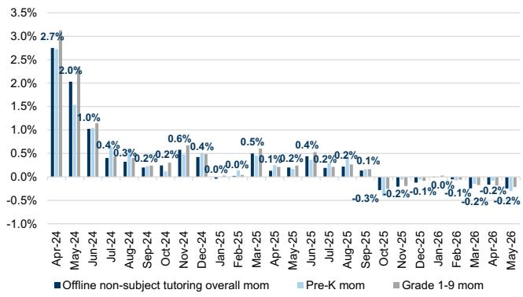

bar chart

| Month    | Offline non-subject tutoring overall mom | Pre-K mom | Grade 1-9 mom |
|----------|------------------------------------------|-----------|---------------|
| Apr-24   | 2.7%                                     |           |               |
| May-24   | 2.0%                                     |           |               |
| Jun-24   | 1.0%                                     |           |               |
| Jul-24   | 0.4%                                     |           |               |
| Aug-24   | 0.3%                                     |           |               |
| Sep-24   | 0.2%                                     |           |               |
| Oct-24   | 0.2%                                     |           |               |
| Nov-24   | 0.6%                                     |           |               |
| Dec-24   | 0.4%                                     |           |               |
| Jan-25   | 0.0%                                     |           |               |
| Feb-25   | 0.5%                                     |           |               |
| Mar-25   | 0.1%                                     |           |               |
| Apr-25   | 0.2%                                     |           |               |
| May-25   | 0.4%                                     |           |               |
| Jun-25   | 0.2%                                     |           |               |
| Jul-25   | 0.2%                                     |           |               |
| Aug-25   | 0.2%                                     |           |               |
| Sep-25   | 0.1%                                     |           |               |
| Oct-25   | -0.3%                                    |           |               |
| Nov-25   | -0.2%                                    |           |               |
| Dec-25   | -0.1%                                    |           |               |
| Jan-26   | 0.0%                                     |           |               |
| Feb-26   | -0.1%                                    |           |               |
| Mar-26   | -0.2%                                    |           |               |
| Apr-26   | -0.2%                                    |           |               |
| May-26   | -0.2%                                    |           |               |

Source: MOE

Exhibit 19: ...while offline licensed subject tutoring supply dropped -0.1% mom in May (vs. -0.4% mom in Apr)  
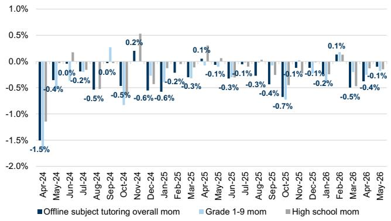

bar chart

| Month    | Offline subject tutoring overall mom | Grade 1-9 mom | High school mom |
|----------|--------------------------------------|---------------|-----------------|
| Apr-24   | -1.5%                                |               |                 |
| May-24   | 0.0%                                 | -0.4%         |                 |
| Jun-24   | -0.2%                                |               |                 |
| Jul-24   | -0.5%                                |               |                 |
| Aug-24   | 0.0%                                 |               |                 |
| Sep-24   | -0.5%                                |               |                 |
| Oct-24   | 0.2%                                 |               |                 |
| Nov-24   | -0.6%                                |               |                 |
| Dec-24   | -0.6%                                |               |                 |
| Jan-25   | -0.2%                                |               |                 |
| Feb-25   | -0.3%                                |               |                 |
| Mar-25   | 0.1%                                 |               |                 |
| Apr-25   | -0.1%                                |               |                 |
| May-25   | -0.3%                                |               |                 |
| Jun-25   | -0.1%                                |               |                 |
| Jul-25   | -0.3%                                |               |                 |
| Aug-25   | -0.4%                                |               |                 |
| Sep-25   | -0.7%                                |               |                 |
| Oct-25   | -0.1%                                |               |                 |
| Nov-25   | -0.1%                                |               |                 |
| Dec-25   | -0.2%                                |               |                 |
| Jan-26   | 0.1%                                 |               |                 |
| Feb-26   | -0.5%                                |               |                 |
| Mar-26   | -0.4%                                |               |                 |
| Apr-26   | -0.1%                                |               |                 |
| May-26   | -0.1%                                |               |                 |

Source: MOE

## Overseas study: Canada/Australia/UK student visas # combined dropped -9% yoy in 1Q26

Exhibit 20: Student visas # granted to Chinese for Canada, Australia, and UK combined dropped -9% yoy in 1Q26  
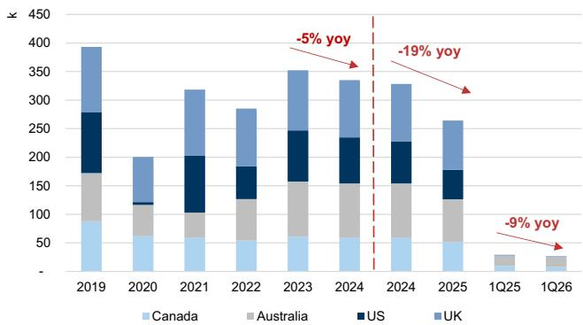

stacked bar chart

| Year   | Canada | Australia | US  | UK  |
|--------|--------|-----------|-----|-----|
| 2019   | 90     | 80        | 100 | 130 |
| 2020   | 60     | 40        | 70  | 80  |
| 2021   | 60     | 60        | 100 | 110 |
| 2022   | 50     | 80        | 70  | 100 |
| 2023   | 60     | 100       | 110 | 120 |
| 2024   | 60     | 100       | 110 | 110 |
| 2025   | 50     | 110       | 70  | 90  |
| 1Q25   | 10     | 10        | -   | -   |
| 1Q26   | 10     | -         | -   | -   |

2025 vs. 2024: US F-1 visa issuance data is compared for the Jan-Sep period of 2024/2025, while UK/Canada/Australia reflects full-year data for 2024/2025. 1Q26 vs. 1Q25: Data exclude the U.S.  
Source: US Department of State, Gov.uk, Canada.ca, Homeaffairs.gov.au, Data compiled by GS Global Investment Research

Exhibit 22: Canada student visas granted to Chinese dropped -34% yoy in Mar (vs. +29% yoy in Feb)  
Canada student permit holders from China  
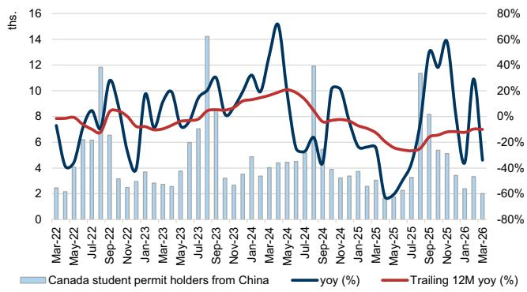

bar-line hybrid chart

| Date | Canada student permit holders from China (ths.) | yoy (%) | Trailing 12M yoy (%) |
|---|---|---|---|
| Mar-22 | 2 | -40 | 8 |
| May-22 | 3 | -35 | 7 |
| Jul-22 | 12 | 8 | -10 |
| Sep-22 | 6 | 10 | 10 |
| Nov-22 | 3 | -40 | 10 |
| Jan-23 | 3 | -35 | 7 |
| Mar-23 | 3 | -30 | 7 |
| May-23 | 4 | -35 | 7 |
| Jul-23 | 14 | 9 | 10 |
| Sep-23 | 3 | -10 | 10 |
| Nov-23 | 3 | -10 | 10 |
| Jan-24 | 5 | -5 | 10 |
| Mar-24 | 4 | -5 | 10 |
| May-24 | 4 | -5 | 10 |
| Jul-24 | 5 | -10 | 10 |
| Sep-24 | 12 | -40 | 5 |
| Nov-24 | 3 | -10 | 5 |
| Jan-25 | 3 | -10 | 5 |
| Mar-25 | 3 | -15 | 0 |
| May-25 | 1 | -60 | -10 |
| Jul-25 | 8 | -30 | -15 |
| Sep-25 | 5 | -10 | -10 |
| Nov-25 | 4 | -5 | -5 |
| Jan-26 | 3 | -10 | -5 |
| Mar-26 | 2 | -30 | -10 |

Source: Government of Canada

Exhibit 21: Chinese student visas issued by Australia declined -5% yoy in 1Q26, while those issued by the UK/Canada dropped -10%/-17% yoy  
% change of student visas # granted to Chinese  
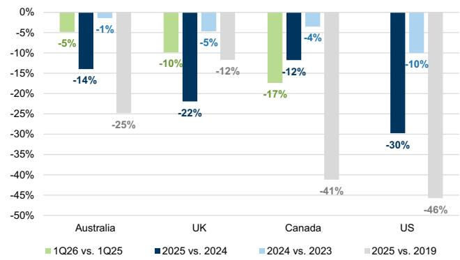

bar chart

| Country | 1Q26 vs. 1Q25 (%) | 2025 vs. 2024 (%) | 2024 vs. 2023 (%) | 2025 vs. 2019 (%) |
| :--- | :--- | :--- | :--- | :--- |
| Australia | -5 | -14 | -1 | -25 |
| UK | -10 | -22 | -5 | -12 |
| Canada | -17 | -12 | -4 | -41 |
| US | | -30 | -10 | -46 |

US F-1 visa issuance data is compared for the Jan-Sep period of 2019/2024/2025  
Source: US Department of State, Gov.uk, Canada.ca, Homeaffairs.gov.au, Data compiled by GS Global Investment Research

Exhibit 23: Australia student visas granted to Chinese increased +24% yoy in Apr (vs. -5% yoy in Mar)  
Australia student visas granted to Chinese  
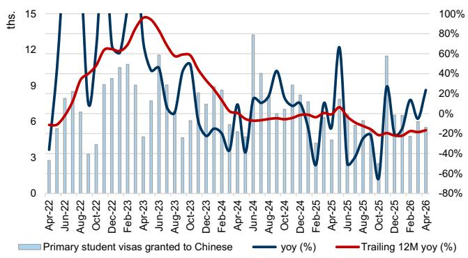

bar-line hybrid chart

| Month    | Primary student visas granted to Chinese (th.) | yoy (%) | Trailing 12M yoy (%) |
|----------|--------------------------------------------------|---------|----------------------|
| Apr-22   | 3                                                | 15      | -10                  |
| Jun-22   | 8                                                | 15      | -5                   |
| Aug-22   | 3                                                | 15      | 0                    |
| Oct-22   | 9                                                | 15      | 5                    |
| Dec-22   | 11                                               | 15      | 10                   |
| Feb-23   | 12                                               | 15      | 15                   |
| Apr-23   | 15                                               | 15      | 20                   |
| Jun-23   | 12                                               | 15      | 15                   |
| Aug-23   | 9                                                | 15      | 10                   |
| Oct-23   | 6                                                | 15      | 5                    |
| Dec-23   | 5                                                | 15      | 0                    |
| Feb-24   | 6                                                | 15      | -5                   |
| Apr-24   | 13                                               | 15      | -10                  |
| Jun-24   | 9                                                | 15      | -15                  |
| Aug-24   | 7                                                | 15      | -20                  |
| Oct-24   | 9                                                | 15      | -25                  |
| Dec-24   | 7                                                | 15      | -30                  |
| Feb-25   | 3                                                | 15      | -35                  |
| Apr-25   | 12                                               | 15      | -40                  |
| Jun-25   | 3                                                | 15      | -45                  |
| Aug-25   | 9                                                | 15      | -50                  |
| Oct-25   | 3                                                | 15      | -55                  |
| Dec-25   | 9                                                | 15      | -60                  |
| Feb-26   | 6                                                | 15      | -65                  |
| Apr-26   | 9                                                | 15      | -70                  |

Source: Australia Department of Education

Exhibit 24: UK student visas granted to Chinese dropped -10% yoy in 1Q26 (vs. -11% yoy in 4Q25)  
UK student permit holders from China  
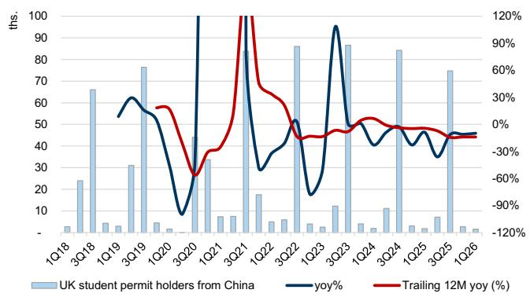

bar-line hybrid chart

| Quarter | UK student permit holders from China (th.) | yoy% (%) | Trailing 12M yoy (%) (%) |
|---|---|---|---|
| 1Q18 | 3 | - | - |
| 3Q18 | 24 | - | - |
| 1Q19 | 66 | 50 | - |
| 3Q19 | 30 | 60 | - |
| 1Q20 | 76 | 55 | 20 |
| 3Q20 | 45 | 8 | -30 |
| 1Q21 | 8 | 100 | 100 |
| 3Q21 | 18 | 95 | 60 |
| 1Q22 | 5 | 28 | -30 |
| 3Q22 | 86 | 50 | -10 |
| 1Q23 | 4 | 18 | -10 |
| 3Q23 | 87 | 95 | -5 |
| 1Q24 | 4 | 40 | 5 |
| 3Q24 | 84 | 40 | -5 |
| 1Q25 | 3 | 35 | -5 |
| 3Q25 | 74 | 35 | -5 |
| 1Q26 | 3 | 45 | -5 |

Source: Government of UK

Exhibit 25: Duolingo maintained its leading position among language learning apps in China by MAU in May, likely driven by non-English learning demand  
MAUs of major language learning apps in China  
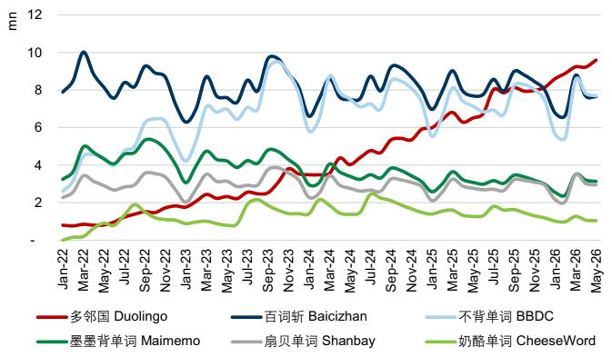

line chart

| Date    | 多邻国 Duolingo | 百词斩 Baicizhan | 不背单词 BBDC | 墨墨背单词 Maimemo | 扇贝单词 Shanbay | 奶酪单词 CheeseWord |
|---------|-----------------|-------------------|----------------|---------------------|------------------|----------------------|
| Jan-22  | 1.0             | 8.0               | 3.0            | 3.0                 | 2.0              | 1.0                  |
| Mar-22  | 1.5             | 10.0              | 4.0            | 4.5                 | 2.5              | 1.5                  |
| May-22  | 2.0             | 9.0               | 4.5            | 4.0                 | 3.0              | 2.0                  |
| Jul-22  | 2.5             | 8.5               | 5.0            | 4.5                 | 3.5              | 2.5                  |
| Sep-22  | 3.0             | 9.0               | 6.0            | 5.0                 | 4.0              | 3.0                  |
| Nov-22  | 3.5             | 8.0               | 4.0            | 3.5                 | 3.0              | 2.5                  |
| Jan-23  | 4.0             | 7.0               | 3.0            | 3.0                 | 2.5              | 2.0                  |
| Mar-23  | 4.5             | 8.0               | 4.0            | 3.5                 | 3.0              | 2.5                  |
| May-23  | 5.0             | 9.0               | 5.0            | 4.0                 | 3.5              | 3.0                  |
| Jul-23  | 5.5             | 10.0              | 6.0            | 4.5                 | 4.0              | 3.5                  |
| Sep-23  | 6.0             | 9.5               | 7.0            | 5.0                 | 4.5              | 4.0                  |
| Nov-23  | 6.5             | 8.5               | 6.0            | 4.5                 | 4.0              | 3.5                  |
| Jan-24  | 7.0             | 7.5               | 5.0            | 4.0                 | 3.5              | 3.0                  |
| Mar-24  | 7.5             | 8.0               | 6.0            | 4.5                 | 4.0              | 3.5                  |
| May-24  | 8.0             | 9.0               | 7.0            | 5.0                 | 4.5              | 4.0                  |
| Jul-24  | 8.5             | 8.5               | 6.5            | 4.5                 | 4.0              | 3.5                  |
| Sep-24  | 9.0             | 9.0               | 7.5            | 5.0                 | 4.5              | 4.0                  |
| Nov-24  | 9.5             | 8.5               | 6.5            | 4.5                 | 4.0              | 3.5                  |
| Jan-25  | 10.0            | 8.0               | 7.0            | 5.0                 | 4.5              | 4.0                  |
| Mar-25  | 10.5            | 9.0               | 7.5            | 4.5                 | 4.0              | 3.5                  |
| May-25  | 11.0            | 8.5               | 8.0            | 5.0                 | 4.5              | 4.0                  |
| Jul-25  | 11.5            | 9.0               | 7.5            | 4.5                 | 4.0              | 3.5                  |
| Sep-25  | 12.0            | 8.5               | 8.0            | 5.0                 | 4.5              | 4.0                  |
| Nov-25  | 12.5            | 9.0               | 7.5            | 4.5                 | 4.0              | 3.5                  |
| Jan-26  | 13.0            | 8.5               | 8.0            | 5.0                 | 4.5              | 4.0                  |
| Mar-26  | 13.5            | 9.0               | 7.5            | 4.5                 | 4.0              | 3.5                  |
| May-26  | 14.0            | 8.5               | 8.0            | 5.0                 | 4.5              | 4.0                  |

Source: Questmobile, Data compiled by GS Global Investment Research

East Buy: Douyin GMV increased +38% yoy/+7% mom in May driven by new platforms, while app MAUs grew +38% yoy

East Buy's GMV on Douyin grew +38% yoy/+7% mom to c.Rmb1.03bn in May (vs. +42% yoy/-10% mom in Apr). By platforms, East Buy GMV from new platforms grew +246% yoy in May (vs. +183% yoy in Apr), while GMV from the original platforms (including East Buy main, Beautiful Life and Private Label) dropped -2% yoy in May (vs. +7% yoy in Apr). By product, 1P private label GMV contributed 29% of total GMV in May (vs. 28% in Apr), according to data from Chanmama. For 2HFY26, our tracked East Buy GMV increased +40% yoy to c.Rmb5.67bn.  
Traffic and conversion: East Buy main channel saw -21% yoy/-8% mom decline in daily viewership, while gaining 5k followers in May; for the Beautiful Life channel, daily viewership dropped -11% yoy/-12% mom in May, while gaining 77k followers.  
East Buy app MAUs increased +38% yoy or dropped -7% mom in May (vs. +42% yoy/-1% mom in Apr).

## Exhibit 26: East Buy monthly GMV on Douyin grew +38% yoy/+7% mom to c.Rmb1.03bn in May (vs. +42% yoy/-10% mom in Apr)

East Buy monthly GMV on Douyin (Rmb mn)

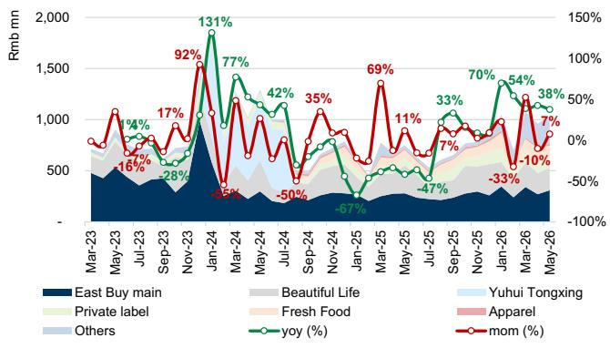

line chart

| Month | East Buy main | Beautiful Life | Private label | Fresh Food | Apparel | Others | mom (%) |
| --- | --- | --- | --- | --- | --- | --- | --- |
| Mar-23 | 500 | 100 | 100 | 100 | 100 | 100 | 100 |
| May-23 | 500 | 100 | 100 | 100 | 100 | 100 | 100 |
| Jul-23 | 500 | 100 | 100 | 100 | 100 | 100 | 100 |
| Sep-23 | 500 | 100 | 100 | 100 | 100 | 100 | 100 |
| Nov-23 | 500 | 100 | 100 | 100 | 100 | 100 | 100 |
| Jan-24 | 500 | 100 | 100 | 100 | 100 | 100 | 131 |
| Mar-24 | 500 | 100 | 100 | 100 | 100 | 100 | 77 |
| May-24 | 500 | 100 | 100 | 100 | 100 | 100 | 42 |
| Jul-24 | 500 | 100 | 100 | 100 | 100 | 100 | -50 |
| Sep-24 | 500 | 100 | 100 | 100 | 100 | 100 | 35 |
| Nov-24 | 500 | 100 | 100 | 100 | 100 | 100 | -67 |
| Jan-25 | 500 | 100 | 100 | 100 | 100 | 100 | 69 |
| Mar-25 | 500 | 100 | 100 | 100 | 100 | 100 | -47 |
| May-25 | 500 | 100 | 100 | 100 | 100 | 100 | -47 |
| Jul-25 | 500 | 100 | 100 | 100 | 100 | 100 | -47 |
| Sep-25 | 500 | 100 | 100 | 100 | 100 | 100 | -33 |
| Nov-25 | 500 | 100 | 100 | 100 | 100 | 100 | -33 |
| Jan-26 | 500 | 100 | 100 | 100 | 100 | 100 | -33 |
| Mar-26 | 500 | 100 | 100 | 100 | 100 | 100 | -33 |
| May-26 | 500 | 100 | 100 | 100 | 100 | 18 | -7 |
| Jun-26 | 500 | 18 | -33 | -33 | -33 | -33 | -7 |
| Jul-26 | -33 | -33 | -33 | -33 | -33 | -33 | -7 |
| Aug-26 | -33 | -33 | -33 | -33 | -33 | -33 | -7 |
| Sep-26 | -33 | -33 | -33 | -33 | -33 | -33 | -7 |
| Oct-26 | -33 | -33 | -33 | -33 | -33 | -33 | -7 |
| Nov-26 | -33 | -33 | -33 | -33 | -33 | -33 | -7 |
| Dec-26 | -33 | -33 | -33 | -33 | -33 | -33 | -7 |
| Jan-27 | -33 | -33 | -33 | -33 | -33 | -33 | -7 |
| Feb-27 | -33 | -33 | -33 | -33 | -33 | -33 | -7 |
| Mar-27 | -33 | -33 | -33 | -33 | -33 | -33 | -7 |
| Apr-27 | -33 | -33 | -33 | -33 | -33 | -33 | -7 |

Source: Chanmama, Data compiled by GS Global Investment Research

## Exhibit 28: East Buy's GMV from 1P products increased to $29\%$ in May (vs. $28\%$ in Apr)

East Buy's GMV by 1P/3P

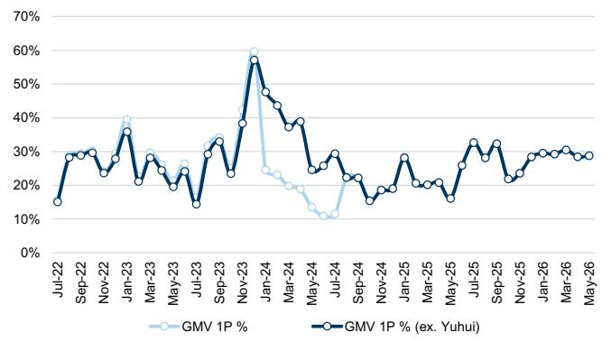

line chart

| Month    | GMV 1P % | GMV 1P % (ex. Yuhui) |
|----------|----------|----------------------|
| Jul-22   | 15%      | 15%                  |
| Sep-22   | 30%      | 30%                  |
| Nov-22   | 25%      | 25%                  |
| Jan-23   | 40%      | 35%                  |
| Mar-23   | 25%      | 25%                  |
| May-23   | 20%      | 20%                  |
| Jul-23   | 15%      | 15%                  |
| Sep-23   | 35%      | 30%                  |
| Nov-23   | 60%      | 55%                  |
| Jan-24   | 25%      | 45%                  |
| Mar-24   | 20%      | 40%                  |
| May-24   | 15%      | 25%                  |
| Jul-24   | 10%      | 20%                  |
| Sep-24   | 15%      | 15%                  |
| Nov-24   | 20%      | 20%                  |
| Jan-25   | 25%      | 25%                  |
| Mar-25   | 20%      | 20%                  |
| May-25   | 15%      | 15%                  |
| Jul-25   | 30%      | 30%                  |
| Sep-25   | 25%      | 25%                  |
| Nov-25   | 30%      | 30%                  |
| Jan-26   | 30%      | 30%                  |
| Mar-26   | 30%      | 30%                  |
| May-26   | 30%      | 30%                  |

Source: Chanmama, Data compiled by GS Global Investment Research

## Exhibit 27: East Buy GMV from new platforms grew +246% yoy in May (vs. +183% yoy in Apr), while GMV from the original platforms dropped -2% yoy in May (vs. +7% yoy in Apr)

East Buy GMV by original platforms and new platforms (Rmb mn)

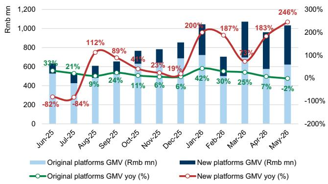

bar-line hybrid chart

| Month | Original platforms GMV (Rmb mn) | New platforms GMV (Rmb mn) | Original platforms GMV yoy (%) | New platforms GMV yoy (%) |
| :--- | :--- | :--- | :--- | :--- |
| Jun-25 | 580 | 33 | -82 | -84 |
| Jul-25 | 480 | 21 | 21 | -84 |
| Aug-25 | 600 | 9 | 9 | 112 |
| Sep-25 | 650 | 24 | 24 | 89 |
| Oct-25 | 750 | 11 | 11 | 41 |
| Nov-25 | 780 | 6 | 6 | 23 |
| Dec-25 | 850 | 6 | 6 | 19 |
| Jan-26 | 700 | 42 | 42 | 200 |
| Feb-26 | 700 | 30 | 30 | 187 |
| Mar-26 | 1050 | 25 | 25 | 73 |
| Apr-26 | 950 | 7 | 7 | 183 |
| May-26 | 1050 | -2 | -2 | 246 |

Original platforms refer to East Buy main, Beautiful Life and Private label platforms  
Source: Chanmama, Data compiled by GS Global Investment Research

## Exhibit 29: Avg. live viewers per stream by major Douyin accounts

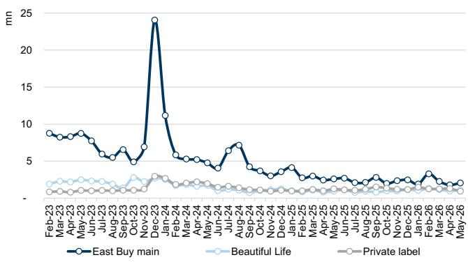

line chart

| Month    | East Buy main | Beautiful Life | Private label |
|----------|---------------|----------------|---------------|
| Feb-23   | 9             | 2              | 1             |
| Mar-23   | 8             | 2              | 1             |
| Apr-23   | 8             | 2              | 1             |
| May-23   | 8             | 2              | 1             |
| Jun-23   | 7             | 2              | 1             |
| Jul-23   | 6             | 2              | 1             |
| Aug-23   | 6             | 2              | 1             |
| Sep-23   | 5             | 2              | 1             |
| Oct-23   | 7             | 2              | 1             |
| Nov-23   | 24            | 2              | 1             |
| Dec-23   | 11            | 2              | 1             |
| Jan-24   | 6             | 2              | 1             |
| Feb-24   | 5             | 2              | 1             |
| Mar-24   | 5             | 2              | 1             |
| Apr-24   | 5             | 2              | 1             |
| May-24   | 4             | 2              | 1             |
| Jun-24   | 5             | 2              | 1             |
| Jul-24   | 7             | 2              | 1             |
| Aug-24   | 7             | 2              | 1             |
| Sep-24   | 5             | 2              | 1             |
| Oct-24   | 4             | 2              | 1             |
| Nov-24   | 3             | 2              | 1             |
| Dec-24   | 4             | 2              | 1             |
| Jan-25   | 3             | 2              | 1             |
| Feb-25   | 3             | 2              | 1             |
| Mar-25   | 3             | 2              | 1             |
| Apr-25   | 3             | 2              | 1             |
| May-25   | 3             | 2              | 1             |
| Jun-25   | 3             | 2              | 1             |
| Jul-25   | 3             | 2              | 1             |
| Aug-25   | 3             | 2              | 1             |
| Sep-25   | 3             | 2              | 1             |
| Oct-25   | 3             | 2              | 1             |
| Nov-25   | 3             | 2              | 1             |
| Dec-25   | 3             | 2              | 1             |
| Jan-26   | 3             | 2              | 1             |
| Feb-26   | 3             | 2              | 1             |
| Mar-26   | 3             | 2              | 1             |
| Apr-26   | 3             | 2              | 1             |
| May-26   | 3             | 2              | 1             |

Source: Chanmama, Data compiled by GS Global Investment Research

Exhibit 30: East Buy app MAUs increased +38% yoy or dropped -7% mom in May (vs. +42% yoy/-1% mom in Apr)  
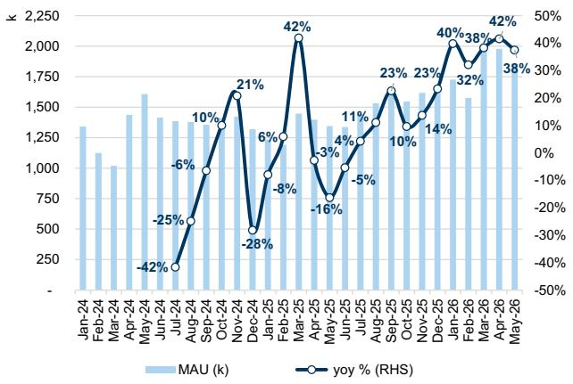

bar-line hybrid chart

| Month | MAU (k) | yoy % (%) |
|---|---|---|
| Jan-24 | 1350 | - |
| Feb-24 | 1120 | - |
| Mar-24 | 1020 | - |
| Apr-24 | 1450 | - |
| May-24 | 1630 | -42 |
| Jun-24 | 1420 | -25 |
| Jul-24 | 1380 | -6 |
| Aug-24 | 1390 | 10 |
| Sep-24 | 1450 | 10 |
| Oct-24 | 1600 | 21 |
| Nov-24 | 1350 | -28 |
| Dec-24 | 1300 | 6 |
| Jan-25 | 1350 | -8 |
| Feb-25 | 1450 | 42 |
| Mar-25 | 1380 | -3 |
| Apr-25 | 1350 | -16 |
| May-25 | 1380 | 4 |
| Jun-25 | 1450 | -5 |
| Jul-25 | 1550 | 11 |
| Aug-25 | 1600 | 14 |
| Sep-25 | 1700 | 23 |
| Oct-25 | 1650 | 10 |
| Nov-25 | 1680 | 14 |
| Dec-25 | 1700 | 23 |
| Jan-26 | 1600 | 40 |
| Feb-26 | 1650 | 38 |
| Mar-26 | 1750 | 38 |
| Apr-26 | 1800 | 42 |
| May-26 | 1850 | 38 |

Source: Questmobile, Data compiled by GS Global Investment Research

## Price Target Risks and Methodology - New Oriental Education & Technology

We are Buy rated. Our SOTP-based 12m target prices for EDU/9901.HK are US\$65/HK\$50, based on FY27E i) 13x EV/NOPAT on high-school tutoring; ii) 12x EV/NOPAT on other traditional business (including overseas test prep and consulting, college test prep, etc.) and new initiatives (including non-academic tutoring, learning solutions, tourism); iii) our target valuation of East Buy attributable to New Oriental; iv) US\$3.0bn net cash balance after excluding deferred revenue; and v) a 10% holdco discount. Key risks: 1) Industry TAM pressure from shrinking K12 demographics; 2) Pricing pressure due to competition and/or rising consumer discretionary attribute; 3) Further disruption to demand for overseas study; 4) AI disruption to learning scenarios; 5) Below-expected operating efficiency and margin improvement; 6) Regulatory changes in the education sector.

## Price Target Risks and Methodology - East Buy

We are Sell rated. Our 12-month target price of HK\$12.4 is based on a 15x target P/E multiple applied to our FY27E EPS, benchmarking average P/E multiples of China e-commerce platforms, and China F&B and household product brands. Key upside risks: Stronger East Buy GMV growth, faster ramp-up of new sales channels, above-expected launch of private-label products, support from parent company, success of new business development, improved shareholder returns.

## Price Target Risks and Methodology - TAL Education Group

We are Buy rated. Our SOTP-based 12m target price for TAL is US\$15.2, based on mid-CY26E/27E 1) 13x target EV/NOPAT for high school tutoring; 2) 19x target EV/NOPAT for enrichment learning and others; 3) 16x target EV/NOPAT for content solutions assuming normalized OPM of 5%; 4) US2.6bn net cash after excluding deferred revenue; and 5) a 10% holdco discount. Key risks: 1) weaker-than-expected offline capacity expansion; 2) regulatory changes in the education sector; 3) unsatisfactory product launch for smart learning tablets; and 4) challenges in exploring overseas business.

## Disclosure Appendix

## Reg AC

I, Timothy Zhao, hereby certify that all of the views expressed in this report accurately reflect my personal views about the subject company or companies and its or their securities. I also certify that no part of my compensation was, is or will be, directly or indirectly, related to the specific recommendations or views expressed in this report.

Unless otherwise stated, the individuals listed on the cover page of this report are analysts in GS' Global Investment Research division.

Contributing Authors: Timothy Zhao GS (Asia) L.L.C., Ronald Keung, CFA GS (Asia) L.L.C., Eunice Liu GS (Asia) L.L.C., Jason Sun GS (Asia) L.L.C..

Unless otherwise stated, the individuals listed in the Contributing Authors disclosure of this report are analysts in GS' Global Investment Research division.

## GS Factor Profile

The GS Factor Profile provides investment context for a stock by comparing key attributes to the market (i.e. our universe of rated stocks) and its sector peers. The four key attributes depicted are: Growth, Financial Returns, Multiple (e.g. valuation) and Integrated (a composite of Growth, Financial Returns and Multiple). Growth, Financial Returns and Multiple are calculated by using normalized ranks for specific metrics for each stock. The normalized ranks for the metrics are then averaged and converted into percentiles for the relevant attribute. The precise calculation of each metric may vary depending on the fiscal year, industry and region, but the standard approach is as follows:

Growth is based on a stock's forward-looking sales growth, EBITDA growth and EPS growth (for financial stocks, only EPS and sales growth), with a higher percentile indicating a higher growth company. Financial Returns is based on a stock's forward-looking ROE, ROCE and CROCI (for financial stocks, only ROE), with a higher percentile indicating a company with higher financial returns. Multiple is based on a stock's forward-looking P/E, P/B, price/dividend (P/D), EV/EBITDA, EV/FCF and EV/Debt Adjusted Cash Flow (DACF) (for financial stocks, only P/E, P/B and P/D), with a higher percentile indicating a stock trading at a higher multiple. The Integrated percentile is calculated as the average of the Growth percentile, Financial Returns percentile and (100% - Multiple percentile).

Financial Returns and Multiple use the GS analyst forecasts at the fiscal year-end at least three quarters in the future. Growth uses inputs for the fiscal year at least seven quarters in the future compared with the year at least three quarters in the future (on a per-share basis for all metrics).

For a more detailed description of how we calculate the GS Factor Profile, please contact your GS representative.

## M&A Rank

Across our global coverage, we examine stocks using an M&A framework, considering both qualitative factors and quantitative factors (which may vary across sectors and regions) to incorporate the potential that certain companies could be acquired. We then assign a M&A rank as a means of scoring companies under our rated coverage from 1 to 3, with 1 representing high (30%-50%) probability of the company becoming an acquisition target, 2 representing medium (15%-30%) probability and 3 representing low (0%-15%) probability. For companies ranked 1 or 2, in line with our standard departmental guidelines we incorporate an M&A component into our target price. M&A rank of 3 is considered immaterial and therefore does not factor into our price target, and may or may not be discussed in research.

## Quantum

Quantum is GS' proprietary database providing access to detailed financial statement histories, forecasts and ratios. It can be used for in-depth analysis of a single company, or to make comparisons between companies in different sectors and markets.

## Disclosures

## Rating and pricing information

East Buy (Sell, HK\$21.06), New Oriental Education & Technology (ADR) (Buy, \$45.20), New Oriental Education & Technology (H) (Buy, HK\$35.48) and TAL Education Group (Buy, \$9.34)

The rating(s) for East Buy, New Oriental Education & Technology (ADR), New Oriental Education & Technology (H) and TAL Education Group is/are relative to the other companies in its/their coverage universe: Autohome Inc. (ADR), Autohome Inc. (H), Beijing Sinnet Technology Co Ltd., East Buy, GDS Holdings (ADR), GDS Holdings (H), KE Holdings (ADR), KE Holdings (H), Kanzhun Ltd. (ADR), Kanzhun Ltd. (H), Kingsoft Cloud, Ming Yuan Cloud, New Oriental Education & Technology (ADR), New Oriental Education & Technology (H), Offcn Education Technology, Range Intelligent, SUNeVision Holdings, Shanghai Athub, TAL Education Group, Tuhu Car Inc., Tuya, VNET Group, Weibo Corp. (ADR), Weibo Corp. (H), Weimob, Xiaomi Corp.

## Company-specific regulatory disclosures

The following disclosures relate to relationships between The GS Group, Inc. (with its affiliates, “GS”) and companies covered by GS Global Investment Research and referred to in this research.

GS beneficially owned 1% or more of common equity (excluding positions managed by affiliates and business units not required to be aggregated under US securities law) as of the month end preceding this report: New Oriental Education & Technology (ADR) (\$45.20) and New Oriental Education & Technology (H) (HK\$35.48)

GS has received compensation for investment banking services in the past 12 months: TAL Education Group (\$9.34)

GS expects to receive or intends to seek compensation for investment banking services in the next 3 months: East Buy (HK\$21.06), New Oriental Education & Technology (ADR) (\$45.20), New Oriental Education & Technology (H) (HK\$35.48) and TAL Education Group (\$9.34)

GS has received compensation for non-investment banking services during the past 12 months: TAL Education Group (\$9.34)

GS had an investment banking services client relationship during the past 12 months with: East Buy (HK\$21.06), New Oriental Education & Technology (ADR) (\$45.20), New Oriental Education & Technology (H) (HK\$35.48) and TAL Education Group (\$9.34)

GS had a non-investment banking securities-related services client relationship during the past 12 months with: TAL Education Group (\$9.34)

GS had a non-securities services client relationship during the past 12 months with: TAL Education Group (\$9.34)

GS makes a market in the securities or derivatives thereof: New Oriental Education & Technology (ADR) (\$45.20), New Oriental Education & Technology (H) (HK\$35.48) and TAL Education Group (\$9.34)

## Distribution of ratings/investment banking relationships

GS Investment Research global Equity coverage universe

<table><tr><td rowspan="2"></td><td colspan="3">Rating Distribution</td><td colspan="3">Investment Banking Relationships</td></tr><tr><td>Buy</td><td>Hold</td><td>Sell</td><td>Buy</td><td>Hold</td><td>Sell</td></tr><tr><td>Global</td><td>50%</td><td>34%</td><td>16%</td><td>65%</td><td>60%</td><td>45%</td></tr></table>

As of April 1, 2026, GS Global Investment Research had investment ratings on 3,074 equity securities. GS assigns stocks as Buys and Sells on various regional Investment Lists; stocks not so assigned are deemed Neutral. Such assignments equate to Buy, Hold and Sell for the purposes of the above disclosure required by the FINRA Rules. See ‘Ratings, Coverage universe and related definitions’ below. The Investment Banking Relationships chart reflects the percentage of subject companies within each rating category for whom GS has provided investment banking services within the previous twelve months.

## Price target and rating history chart(s)

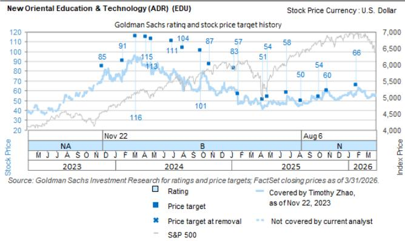

line chart

| Date | Stock Price | Index Price | Rating | Price Target | Price Target at Removal | S&P 500 | Covered by Timothy Zhao | Not Covered by Current Analyst |
| --- | --- | --- | --- | --- | --- | --- | --- | --- |
| Nov 22 |  |  |  |  |  |  |  |  |
| Feb 2024 |  |  |  |  |  |  |  |  |
| May 2024 |  |  |  |  |  |  |  |  |
| Aug 2024 |  |  |  |  |  |  |  |  |
| Nov 2024 |  |  |  |  |  |  |  |  |
| Feb 2025 |  |  |  |  |  |  |  |  |
| May 2025 |  |  |  |  |  |  |  |  |
| Aug 2025 |  |  |  |  |  |  |  |  |
| Nov 2025 |  |  |  |  |  |  |  |  |
| Feb 2026 |  |  |  |  |  |  |  |  |
| May 2026 |  |  |  |  |  |  |  |  |
| Aug 2026 |  |  |  |  |  |  |  |  |
| Nov 2026 |  |  |  |  |  |  |  |  |
| Feb 2027 |  |  |  |  |  |  |  |  |
| May 2027 |  |  |  |  |  |  |  |  |
| Aug 2027 |  |  |  |  |  |  |  |  |
| Nov 2027 |  |  |  |  |  |  |  |  |
| Feb 2028 |  |  |  |  |  |  |  |  |
| May 2028 |  |  |  |  |  |  |  |  |
| Aug 2028 |  |  |  |  |  |  |  |  |
| Nov 2028 |  |  |  |  |  |  |  |  |
| Feb 2029 |  |  |  |  |  |  |  |  |
| May 2029 |  |  |  |  |  |  |  |  |
| Aug 2029 |  |  |  |  |  |  |  |  |
| Nov 2029 |  |  |  |  |  |  |  |  |
| Feb 2030 |  |  |  |  |  |  |  |  |
| May 2030 |  |  |  |  |  |  |  |  |
| Aug 2030 |  |  |  |  |  |  |  |  |
| Nov 2030 |  |  |  |  |  |  |  |  |
| Feb 2031 |  |  |  |  |  |  |  |  |
| May 2031 |  |  |  |  |  |  |  |  |
| Aug 2031 |  |  |  |  |  |  |  |  |
| Nov 2031 |  |  |  |  |  |  |  |  |
| Feb 2032 |  |  |  |  |  |  |  |  |
| May 2032 |  |  |  |  |  |  |  |  |
| Aug 2032 |  |  |  |  |  |  |  |  |
| Nov 2032 |  |  |  |  |  |  |  |  |
| Feb 2033 |  |  |  |  |  |  |  |  |
| May 2033 |  |  |  |  |  |  |  |  |
| Aug 2033 |  |  |  |  |  |  |  |  |
| Nov 2033 |  |  |  |  |  |  |  |  |
| Feb 2034 |  |  |  |  |  |  |  |  |
| May 2034 |  |  |  |  |  |  |  |  |

The price targets shown should be considered in the context of all prior published GS, which may or may not have included price targets, as well as developments relating to the company, its industry and financial markets.

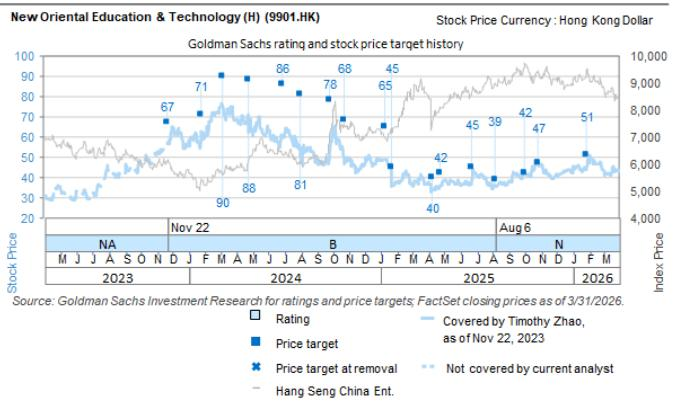

line chart

| Date | Stock Price | Index Price | Rating | Price Target |
| --- | --- | --- | --- | --- |
| Nov 22 | 90 | 67 | NA |  |
| Dec 22 | 88 | 71 |  |  |
| Jan 23 | 81 | 86 |  |  |
| Feb 23 | 78 | 86 |  |  |
| Mar 23 | 68 | 78 |  |  |
| Apr 23 | 65 | 68 |  |  |
| May 23 | 45 | 45 |  |  |
| Jun 23 | 39 | 39 |  |  |
| Jul 23 | 42 | 42 |  |  |
| Aug 23 | 47 | 47 |  |  |
| Sep 23 | 51 | 51 |  |  |
| Oct 23 |  |  |  |  |
| Nov 23 |  |  |  |  |
| Dec 23 |  |  |  |  |
| Jan 24 |  |  |  |  |
| Feb 24 |  |  |  |  |
| Mar 24 |  |  |  |  |
| Apr 24 |  |  |  |  |
| May 24 |  |  |  |  |
| Jun 24 |  |  |  |  |
| Jul 24 |  |  |  |  |
| Aug 24 |  |  |  |  |
| Sep 24 |  |  |  |  |
| Oct 24 |  |  |  |  |
| Nov 24 |  |  |  |  |
| Dec 24 |  |  |  |  |
| Jan 25 |  |  |  |  |
| Feb 25 |  |  |  |  |
| Mar 25 |  |  |  |  |
| Apr 25 |  |  |  |  |
| May 25 |  |  |  |  |
| Jun 25 |  |  |  |  |
| Jul 25 |  |  |  |  |
| Aug 25 |  |  |  |  |
| Sep 25 |  |  |  |  |
| Oct 25 |  |  |  |  |
| Nov 25 |  |  |  |  |
| Dec 25 |  |  |  |  |
| Jan 26 |  |  |  |  |
| Feb 26 |  |  |  |  |
| Mar 26 |  |  |  |  |
| Apr 26 |  |  |  |  |
| May 26 |  |  |  |  |
| Jun 26 |  |  |  |  |
| Jul 26 |  |  |  |  |
| Aug 26 |  |  |  |  |
| Sep 26 |  |  |  |  |
| Oct 26 |  |  |  |  |
| Nov 26 |  |  |  |  |
| Dec 26 |  |  |  |  |
| Jan 27 |  |  |  |  |
| Feb 27 |  |  |  |  |
| Mar 27 |  |  |  |  |
| Apr 27 |  |  |  |  |
| May 27 |  |  |  |  |
| Jun 27 |  |  |  |  |
| Jul 27 |  |  |  |  |
| Aug 27 |  |  |  |  |
| Sep 27 |  |  |  |  |
| Oct 27 |  |  |  |  |
| Nov 27 |  |  |  |  |
| Dec 27 |  |  |  |  |
| Jan 28 |  |  |  |  |
| Feb 28 |  |  |  |  |
| Mar 28 |  |  |  |  |
| Apr 28 |  |  |  |  |
| May 28 |  |  |  |  |
| Jun 28 |  |  |  |  |
| Jul 28 |  |  |  |  |
| Aug 28 |  |  |  |  |
| Sep 28 |  |  |  |  |
| Oct 28 |  |  |  |  |
| Nov 28 |  |  |  |  |
| Dec 28 |  |  |  |  |
| Jan 29 |  |  |  |  |
| Feb 29 |  |  |  |  |
| Mar 29 |  |  |  |  |
| Apr 29 |  |  |  |  |
| May 29 |  |  |  |  |
| Jun 29 |  |  |  |  |
| Jul 29 |  |  |  |  |
| Aug 29 |  |  |  |  |
| Sep 29 |  |  |  |  |
| Oct 29 |  |  |  |  |
| Nov 29 |  |  |  |  |

The price targets shown should be considered in the context of all prior published GS, which may or may not have included price targets, as well as developments relating to the company, its industry and financial markets.

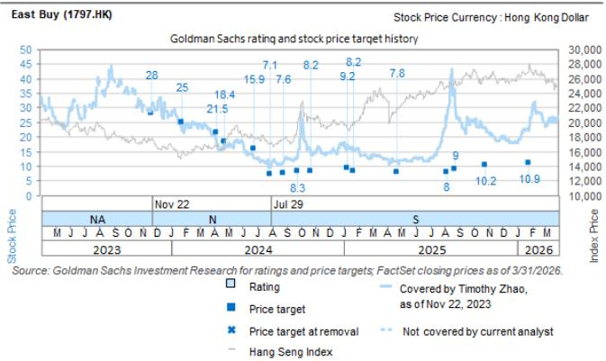

line chart

| Date | Stock Price | Rating | Price Target | Price Target at Removal | Hang Seng Index |
| --- | --- | --- | --- | --- | --- |
| Nov 22 | NA |  |  |  |  |
| Jun 22 | N |  |  |  |  |
| May 23 | N |  |  |  |  |
| Apr 23 | N |  |  |  |  |
| Mar 23 | N |  |  |  |  |
| Feb 23 | N |  |  |  |  |
| Jan 23 | N |  |  |  |  |
| Dec 23 | N |  |  |  |  |
| Nov 23 | N |  |  |  |  |
| Oct 23 | N |  |  |  |  |
| Sep 23 | N |  |  |  |  |
| Aug 23 | N |  |  |  |  |
| Jul 23 | N |  |  |  |  |
| Jun 23 | N |  |  |  |  |
| May 23 | N |  |  |  |  |
| Apr 23 | N |  |  |  |  |
| Mar 23 | N |  |  |  |  |
| Feb 23 | N |  |  |  |  |
| Jan 23 | N |  |  | 8.3 |  |
| Dec 23 | N |  |  |  |  |
| Nov 23 | N |  |  |  |  |
| Oct 23 | N |  |  |  |  |
| Sep 23 | N |  |  |  |  |
| Aug 23 | N |  |  |  |  |

The price targets shown should be considered in the context of all prior published GS, which may or may not have included price targets, as well as developments relating to the company, its industry and financial markets.

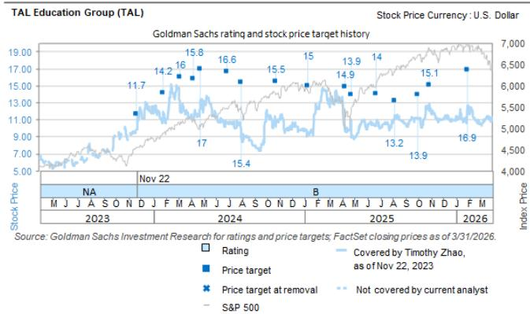

line chart

| Date       | Stock Price | Index Price | Rating | Price Target |
|------------|-------------|-------------|--------|--------------|
| Nov 22     | NA          | NA          | 11.7   | 15.8         |
|            |             |             |        | 16.6         |
|            |             |             |        | 15.5         |
|            |             |             |        | 15.0         |
|            |             |             |        | 13.9         |
|            |             |             |        | 14.9         |
|            |             |             |        | 14.0         |
|            |             |             |        | 13.2         |
|            |             |             |        | 13.9         |
|            |             |             |        | 15.1         |
|            |             |             |        | 16.9         |

The price targets shown should be considered in the context of all prior published GS, which may or may not have included price targets, as well as developments relating to the company, its industry and financial markets.

## Target price history table(s)

New Oriental Education & Technology (ADR) (EDU)

<table><tr><td>Date of report</td><td>Target price ($)</td><td>Closing price ($)</td></tr><tr><td>11-Jun-26</td><td>65.00</td><td>45.20</td></tr><tr><td>13-Apr-26</td><td>67.00</td><td>56.71</td></tr><tr><td>28-Jan-26</td><td>66.00</td><td>58.95</td></tr><tr><td>28-Oct-25</td><td>60.00</td><td>58.56</td></tr><tr><td>02-Oct-25</td><td>54.00</td><td>53.47</td></tr><tr><td>06-Aug-25</td><td>50.00</td><td>46.20</td></tr><tr><td>24-Jun-25</td><td>58.00</td><td>55.50</td></tr><tr><td>23-Apr-25</td><td>54.00</td><td>44.09</td></tr></table>

New Oriental Education & Technology (H) (9901.HK)

<table><tr><td>Date of report</td><td>Target price (HK$)</td><td>Closing price (HK$)</td></tr><tr><td>11-Jun-26</td><td>50.00</td><td>35.48</td></tr><tr><td>13-Apr-26</td><td>52.00</td><td>44.30</td></tr><tr><td>28-Jan-26</td><td>51.00</td><td>44.70</td></tr><tr><td>28-Oct-25</td><td>47.00</td><td>46.78</td></tr><tr><td>02-Oct-25</td><td>42.00</td><td>42.54</td></tr><tr><td>06-Aug-25</td><td>39.00</td><td>36.08</td></tr><tr><td>24-Jun-25</td><td>45.00</td><td>40.70</td></tr><tr><td>23-Apr-25</td><td>42.00</td><td>35.45</td></tr></table>

New Oriental Education & Technology (ADR) (EDU)

<table><tr><td>Date of report</td><td>Target price ($)</td><td>Closing price ($)</td></tr><tr><td>08-Apr-25</td><td>51.00</td><td>41.22</td></tr><tr><td>21-Jan-25</td><td>57.00</td><td>46.71</td></tr><tr><td>08-Jan-25</td><td>83.00</td><td>63.77</td></tr><tr><td>23-Oct-24</td><td>87.00</td><td>61.48</td></tr><tr><td>26-Sep-24</td><td>101.00</td><td>71.02</td></tr><tr><td>31-Jul-24</td><td>104.00</td><td>62.82</td></tr><tr><td>27-Jun-24</td><td>111.00</td><td>76.42</td></tr><tr><td>24-Apr-24</td><td>113.00</td><td>77.08</td></tr><tr><td>08-Apr-24</td><td>115.00</td><td>85.40</td></tr><tr><td>06-Mar-24</td><td>116.00</td><td>95.13</td></tr><tr><td>25-Jan-24</td><td>91.00</td><td>81.05</td></tr><tr><td>22-Nov-23</td><td>85.00</td><td>71.85</td></tr></table>

New Oriental Education & Technology (H) (9901.HK)

<table><tr><td>Date of report</td><td>Target price (HK$)</td><td>Closing price (HK$)</td></tr><tr><td>08-Apr-25</td><td>40.00</td><td>33.60</td></tr><tr><td>21-Jan-25</td><td>45.00</td><td>46.70</td></tr><tr><td>08-Jan-25</td><td>65.00</td><td>48.80</td></tr><tr><td>23-Oct-24</td><td>68.00</td><td>50.05</td></tr><tr><td>26-Sep-24</td><td>78.00</td><td>52.75</td></tr><tr><td>31-Jul-24</td><td>81.00</td><td>54.75</td></tr><tr><td>27-Jun-24</td><td>86.00</td><td>59.55</td></tr><tr><td>24-Apr-24</td><td>88.00</td><td>70.90</td></tr><tr><td>06-Mar-24</td><td>90.00</td><td>75.65</td></tr><tr><td>25-Jan-24</td><td>71.00</td><td>62.50</td></tr><tr><td>22-Nov-23</td><td>67.00</td><td>56.70</td></tr></table>

TAL Education Group (TAL)

<table><tr><td>Date of report</td><td>Target price ($)</td><td>Closing price ($)</td><td>Date of report</td><td>Target price (HK$)</td><td>Closing price (HK$)</td></tr><tr><td>23-Apr-26</td><td>15.20</td><td>10.91</td><td>22-Apr-26</td><td>12.40</td><td>27.86</td></tr><tr><td>29-Jan-26</td><td>16.90</td><td>12.70</td><td>13-Apr-26</td><td>11.10</td><td>28.54</td></tr><tr><td>30-Oct-25</td><td>15.10</td><td>12.91</td><td>28-Jan-26</td><td>10.90</td><td>22.10</td></tr><tr><td>02-Oct-25</td><td>13.90</td><td>11.26</td><td>28-Oct-25</td><td>10.20</td><td>22.74</td></tr><tr><td>06-Aug-25</td><td>13.20</td><td>11.18</td><td>25-Aug-25</td><td>9.00</td><td>31.62</td></tr><tr><td>24-Jun-25</td><td>14.00</td><td>11.01</td><td>06-Aug-25</td><td>8.00</td><td>25.86</td></tr><tr><td>24-Apr-25</td><td>13.90</td><td>8.93</td><td>23-Apr-25</td><td>7.80</td><td>12.00</td></tr><tr><td>08-Apr-25</td><td>14.90</td><td>9.78</td><td>21-Jan-25</td><td>8.20</td><td>16.18</td></tr><tr><td>08-Jan-25</td><td>15.00</td><td>9.53</td><td>08-Jan-25</td><td>9.20</td><td>17.30</td></tr><tr><td>24-Oct-24</td><td>15.50</td><td>10.50</td><td>23-Oct-24</td><td>8.20</td><td>15.56</td></tr><tr><td>01-Aug-24</td><td>15.40</td><td>9.08</td><td>26-Sep-24</td><td>8.30</td><td>14.42</td></tr><tr><td>27-Jun-24</td><td>16.60</td><td>10.65</td><td>27-Aug-24</td><td>7.60</td><td>11.90</td></tr><tr><td>25-Apr-24</td><td>17.00</td><td>13.35</td><td>30-Jul-24</td><td>7.10</td><td>9.73</td></tr><tr><td>08-Apr-24</td><td>15.80</td><td>11.07</td><td>26-Jun-24</td><td>15.90</td><td>12.76</td></tr><tr><td>06-Mar-24</td><td>16.00</td><td>12.00</td><td>24-Apr-24</td><td>18.40</td><td>17.62</td></tr><tr><td>25-Jan-24</td><td>14.20</td><td>11.94</td><td>08-Apr-24</td><td>21.50</td><td>17.70</td></tr><tr><td>22-Nov-23</td><td>11.70</td><td>9.85</td><td>25-Jan-24</td><td>25.00</td><td>24.20</td></tr><tr><td></td><td></td><td></td><td>22-Nov-23</td><td>28.00</td><td>30.50</td></tr></table>

East Buy (1797.HK)  
Price targets shown in table(s) are unadjusted for corporate actions.

## Regulatory disclosures

## Disclosures required by United States laws and regulations

See company-specific regulatory disclosures above for any of the following disclosures required as to companies referred to in this report: manager or co-manager in a pending transaction; 1% or other ownership; compensation for certain services; types of client relationships; managed/co-managed public offerings in prior periods; directorships; for equity securities, market making and/or specialist role. GS trades or may trade as a principal in debt securities (or in related derivatives) of issuers discussed in this report.

The following are additional required disclosures: Ownership and material conflicts of interest: GS policy prohibits its analysts, professionals reporting to analysts and members of their households from owning securities of any company in the analyst's area of coverage. Analyst compensation: Analysts are paid in part based on the profitability of GS, which includes investment banking revenues. Analyst as officer or director: GS policy generally prohibits its analysts, persons reporting to analysts or members of their households from serving as an officer, director or advisor of any company in the analyst's area of coverage. Non-U.S. Analysts: Non-U.S. analysts may not be associated persons of GS & Co. LLC and therefore may not be subject to FINRA Rule 2241 or FINRA Rule 2242 restrictions on communications with a subject company, public appearances and trading in securities covered by the analysts.

Distribution of ratings: See the distribution of ratings disclosure above. Price chart: See the price chart, with changes of ratings and price targets in prior periods, above, or, if electronic format or if with respect to multiple companies which are the subject of this report, on the GS website at https://www.gs.com/research/hedge.html.

## Additional disclosures required under the laws and regulations of jurisdictions other than the United States

The following disclosures are those required by the jurisdiction indicated, except to the extent already made above pursuant to United States laws and regulations. Australia: GS Australia Pty Ltd and its affiliates are not authorised deposit-taking institutions (as that term is defined in the Banking Act 1959 (Cth)) in Australia and do not provide banking services, nor carry on a banking business, in Australia. This research, and any access to it, is intended only for “wholesale clients” within the meaning of the Australian Corporations Act, unless otherwise agreed by GS. In producing research reports, members of Global Investment Research of GS Australia may attend site visits and other meetings hosted by the companies and other entities which are the subject of its research reports. In some instances the costs of such site visits or meetings may be met in part or in whole by the issuers concerned if GS Australia considers it is appropriate and reasonable in the specific circumstances relating to the site visit or meeting. To the extent that the contents of this document contains any financial product advice, it is general advice only and has been prepared by GS without taking into account a client’s objectives, financial situation or needs. A client should, before acting on any such

advice, consider the appropriateness of the advice having regard to the client's own objectives, financial situation and needs. A copy of certain GS Australia and New Zealand disclosure of interests and a copy of GS' Australian Sell-Side Research Independence Policy Statement are available at: https://www.goldmansachs.com/disclosures/australia-new-zealand/index.html. Brazil: Disclosure information in relation to CVM Resolution n. 20 is available at https://www.gs.com/worldwide/brazil/area/gir/index.html. Where applicable, the Brazil-registered analyst primarily responsible for the content of this research report, as defined in Article 20 of CVM Resolution n. 20, is the first author named at the beginning of this report, unless indicated otherwise at the end of the text. Canada: This information is being provided to you for information purposes only and is not, and under no circumstances should be construed as, an advertisement, offering or solicitation by GS & Co. LLC for purchasers of securities in Canada to trade in any Canadian security. GS & Co. LLC is not registered as a dealer in any jurisdiction in Canada under applicable Canadian securities laws and generally is not permitted to trade in Canadian securities and may be prohibited from selling certain securities and products in certain jurisdictions in Canada. If you wish to trade in any Canadian securities or other products in Canada please contact GS Canada Inc., an affiliate of The GS Group Inc., or another registered Canadian dealer. Hong Kong: Further information on the securities of covered companies referred to in this research may be obtained on request from GS (Asia) L.L.C. India: Further information on the subject company or companies referred to in this research may be obtained from GS (India) Securities Private Limited, Research Analyst - SEBI Registration Number INH000001493, 10th Floor, Ascent-Worli, Sudam Kalu Ahire Marg, Worli, Mumbai-400 025, India, Corporate Identity Number U74140MH2006FTC160634, Phone +91 22 6616 9000, Fax +91 22 6616 9001. GS may beneficially own 1% or more of the securities (as such term is defined in clause 2 (h) the Indian Securities Contracts (Regulation) Act, 1956) of the subject company or companies referred to in this research report. Investment in securities market are subject to market risks. Read all the related documents carefully before investing. Registration granted by SEBI and certification from NISM in no way guarantee performance of the intermediary or provide any assurance of returns to investors. GS (India) Securities Private Limited compliance officer and investor grievance contact details can be found at: https://www.goldmansachs.com/worldwide/india/documents/Grievance-Redressal-and-Escalation-Matrix.pdf, and a copy of the annual audit compliance report can be found at this link: https://publishing.gs.com/content/site/india-annual-compliance-report.html. Japan: See below. Korea: This research, and any access to it, is intended only for “professional investors” within the meaning of the Financial Services and Capital Markets Act, unless otherwise agreed by GS. Further information on the subject company or companies referred to in this research may be obtained from GS (Asia) L.L.C., Seoul Branch. New Zealand: GS New Zealand Limited and its affiliates are neither “registered banks” nor “deposit takers” (as defined in the Reserve Bank of New Zealand Act 1989) in New Zealand. This research, and any access to it, is intended for “wholesale clients” (as defined in the Financial Advisers Act 2008) unless otherwise agreed by GS. A copy of certain GS Australia and New Zealand disclosure of interests is available at: https://www.goldmansachs.com/disclosures/australia-new-zealand/index.html. Russia: Research reports distributed in the Russian Federation are not advertising as defined in the Russian legislation, but are information and analysis not having product promotion as their main purpose and do not provide appraisal within the meaning of the Russian legislation on appraisal activity. Research reports do not constitute a personalized investment recommendation as defined in Russian laws and regulations, are not addressed to a specific client, and are prepared without analyzing the financial circumstances, investment profiles or risk profiles of clients. GS assumes no responsibility for any investment decisions that may be taken by a client or any other person based on this research report. Singapore: GS (Singapore) Pte. (Company Number: 198602165W), which is regulated by the Monetary Authority of Singapore, accepts legal responsibility for this research, and should be contacted with respect to any matters arising from, or in connection with, this research. Taiwan: This material is for reference only and must not be reprinted without permission. Investors should carefully consider their own investment risk. Investment results are the responsibility of the individual investor. United Kingdom: Persons who would be categorized as retail clients in the United Kingdom, as such term is defined in the rules of the Financial Conduct Authority, should read this research in conjunction with prior GS on the covered companies referred to herein and should refer to the risk warnings that have been sent to them by GS International. A copy of these risks warnings, and a glossary of certain financial terms used in this report, are available from GS International on request.

European Union and United Kingdom: Disclosure information in relation to Article 6 (2) of the European Commission Delegated Regulation (EU) (2016/958) supplementing Regulation (EU) No 596/2014 of the European Parliament and of the Council (including as that Delegated Regulation is implemented into United Kingdom domestic law and regulation following the United Kingdom's departure from the European Union and the European Economic Area) with regard to regulatory technical standards for the technical arrangements for objective presentation of investment recommendations or other information recommending or suggesting an investment strategy and for disclosure of particular interests or indications of conflicts of interest is available at https://www.gs.com/disclosures/europeanpolicy.html which states the European Policy for Managing Conflicts of Interest in Connection with Investment Research.

Japan: GS Japan Co., Ltd. is a Financial Instrument Dealer registered with the Kanto Financial Bureau under registration number Kinsho 69, and a member of Japan Securities Dealers Association, Financial Futures Association of Japan Type II Financial Instruments Firms Association, and Investment Management Association of Japan. Sales and purchase of equities are subject to commission pre-determined with clients plus consumption tax. See company-specific disclosures as to any applicable disclosures required by Japanese stock exchanges, the Japanese Securities Dealers Association or the Japanese Securities Finance Company.

## Ratings, coverage universe and related definitions

Buy (B), Neutral (N), Sell (S) Analysts recommend stocks as Buys or Sells for inclusion on various regional Investment Lists. Being assigned a Buy or Sell on an Investment List is determined by a stock's total return potential relative to its coverage universe. Any stock not assigned as a Buy or a Sell on an Investment List with an active rating (i.e., a stock that is not Rating Suspended, Not Rated, Early-Stage Biotech, Coverage Suspended or Not Covered), is deemed Neutral. Each region manages Regional Conviction Lists, which are selected from Buy rated stocks on the respective region's Investment Lists and represent investment recommendations focused on the size of the total return potential and/or the likelihood of the realization of the return across their respective areas of coverage. The addition or removal of stocks from such Conviction Lists are managed by the Investment Review Committee or other designated committee in each respective region and do not represent a change in the analysts' investment rating for such stocks.

Total return potential represents the upside or downside differential between the current share price and the price target, including all paid or anticipated dividends, expected during the time horizon associated with the price target. Price targets are required for all covered stocks. The total return potential, price target and associated time horizon are stated in each report adding or reiterating an Investment List membership.

Coverage Universe: A list of all stocks in each coverage universe is available by primary analyst, stock and coverage universe at https://www.gs.com/research/hedge.html.

Not Rated (NR). The investment rating, target price and earnings estimates (where relevant) are removed pursuant to GS policy when GS is acting in an advisory capacity in a merger or in a strategic transaction involving this company, when there are legal, regulatory or policy constraints due to GS' involvement in a transaction, and in certain other circumstances. Early-Stage Biotech (ES). An investment rating and a target price are not assigned pursuant to GS policy when this company has neither a drug, treatment or medical device that has passed a Phase II clinical trial nor a license to distribute a post-Phase II drug, treatment or medical device. Rating Suspended (RS). GS has suspended the investment rating and price target for this stock, because there is not a sufficient fundamental basis for determining an investment rating or target price. The previous investment rating and target price, if any, are no longer in effect for this stock and should not be relied upon. Coverage Suspended (CS). GS has suspended coverage of this company. Not Covered (NC). GS does not cover this company.

## Global product; distributing entities

GS Global Investment Research produces and distributes research products for clients of GS on a global basis. Analysts based in GS offices around the world produce research on industries and companies, and research on macroeconomics, currencies, commodities and portfolio strategy. This research is disseminated in Australia by GS Australia Pty Ltd (ABN 21 006 797 897); in Brazil by GS do Brasil Corretora de Títulos e Valores Mobiliários S.A.; Public Communication Channel GS Brazil: 0800 727 5764 and / or contatogoldmanbrasil@gs.com. Available Weekdays (except holidays), from 9am to 6pm. Canal de Comunicação com o Público GS Brasil: 0800 727 5764 e/ou contatogoldmanbrasil@gs.com. Horário de funcionamento: segunda-feira à sexta-feira (exceto feriados), das 9h às 18h; in Canada by GS & Co. LLC; in Hong Kong by GS (Asia) L.L.C.; in India by GS (India) Securities Private Ltd.; in Japan by GS Japan Co., Ltd.; in the Republic of Korea by GS (Asia) L.L.C., Seoul Branch; in New Zealand by GS New Zealand Limited; in Russia by OOO GS; in Singapore by GS (Singapore) Pte. (Company Number: 198602165W); and in the United States of America by GS & Co. LLC. GS International has approved this research in connection with its distribution in the United Kingdom.

GS International (“GSI”), authorised by the Prudential Regulation Authority (“PRA”) and regulated by the Financial Conduct Authority (“FCA”) and the PRA, has approved this research in connection with its distribution in the United Kingdom.

European Economic Area: GS Bank Europe SE (“GSBE”) is a credit institution incorporated in Germany and, within the Single Supervisory Mechanism, subject to direct prudential supervision by the European Central Bank and in other respects supervised by German Federal Financial Supervisory Authority (Bundesanstalt für Finanzdienstleistungsaufsicht, BaFin) and Deutsche Bundesbank and disseminates research within the European Economic Area.

## General disclosures

This research is for our clients only. Other than disclosures relating to GS, this research is based on current public information that we consider reliable, but we do not represent it is accurate or complete, and it should not be relied on as such. The information, opinions, estimates and forecasts contained herein are as of the date hereof and are subject to change without prior notification. We seek to update our research as appropriate, but various regulations may prevent us from doing so. Other than certain industry reports published on a periodic basis, the large majority of reports are published at irregular intervals as appropriate in the analyst's judgment.

GS conducts a global full-service, integrated investment banking, investment management, and brokerage business. We have investment banking and other business relationships with a substantial percentage of the companies covered by Global Investment Research. GS & Co. LLC, the United States broker dealer, is a member of SIPC (https://www.sipc.org).

Our salespeople, traders, and other professionals may provide oral or written market commentary or trading strategies to our clients and principal trading desks that reflect opinions that are contrary to the opinions expressed in this research. Our asset management area, principal trading desks and investing businesses may make investment decisions that are inconsistent with the recommendations or views expressed in this research.

The analysts named in this report may have from time to time discussed with our clients, including GS salespersons and traders, or may discuss in this report, trading strategies that reference catalysts or events that may have a near-term impact on the market price of the equity securities discussed in this report, which impact may be directionally counter to the analyst's published price target expectations for such stocks. Any such trading strategies are distinct from and do not affect the analyst's fundamental equity rating for such stocks, which rating reflects a stock's return potential relative to its coverage universe as described herein.

We and our affiliates, officers, directors, and employees will from time to time have long or short positions in, act as principal in, and buy or sell, the securities or derivatives, if any, referred to in this research, unless otherwise prohibited by regulation or GS policy.

The views attributed to third party presenters at GS arranged conferences, including individuals from other parts of GS, do not necessarily reflect those of Global Investment Research and are not an official view of GS.

Any third party referenced herein, including any salespeople, traders and other professionals or members of their household, may have positions in the products mentioned that are inconsistent with the views expressed by analysts named in this report.

This research is not an offer to sell or the solicitation of an offer to buy any security in any jurisdiction where such an offer or solicitation would be illegal. It does not constitute a personal recommendation or take into account the particular investment objectives, financial situations, or needs of individual clients. Clients should consider whether any advice or recommendation in this research is suitable for their particular circumstances and, if appropriate, seek professional advice, including tax advice. The price and value of investments referred to in this research and the income from them may fluctuate. Past performance is not a guide to future performance, future returns are not guaranteed, and a loss of original capital may occur. Fluctuations in exchange rates could have adverse effects on the value or price of, or income derived from, certain investments.

Certain transactions, including those involving futures, options, and other derivatives, give rise to substantial risk and are not suitable for all investors. Investors should review current options and futures disclosure documents which are available from GS sales representatives or at https://www.theocc.com/about/publications/character-risks.jsp and https://www.goldmansachs.com/disclosures/cftc\_fcm\_disclosures. Transaction costs may be significant in option strategies calling for multiple purchase and sales of options such as spreads. Supporting documentation will be supplied upon request.

Differing Levels of Service provided by Global Investment Research: The level and types of services provided to you by GS Global Investment Research may vary as compared to that provided to internal and other external clients of GS, depending on various factors including your individual preferences as to the frequency and manner of receiving communication, your risk profile and investment focus and perspective (e.g., marketwide, sector specific, long term, short term), the size and scope of your overall client relationship with GS, and legal and regulatory constraints. As an example, certain clients may request to receive notifications when research on specific securities is published, and certain clients may request that specific data underlying analysts' fundamental analysis available on our internal client websites be delivered to them electronically through data feeds or otherwise. No change to an analyst's fundamental research views (e.g., ratings, price targets, or material changes to earnings estimates for equity securities), will be communicated to any client prior to inclusion of such information in a research report broadly disseminated through electronic publication to our internal client websites or through other means, as necessary, to all clients who are entitled to receive such reports.

All research reports are disseminated and available to all clients simultaneously through electronic publication to our internal client websites. Not all research content is redistributed to our clients or available to third-party aggregators, nor is GS responsible for the redistribution of our research by third party aggregators. For research, models or other data related to one or more securities, markets or asset classes (including related services) that may be available to you, please contact your GS representative or go to https://research.gs.com.

Disclosure information is also available at https://www.gs.com/research/hedge.html or from Research Compliance, 200 West Street, New York, NY 10282.

© 2026 GS.

You are permitted to store, display, analyze, modify, reformat, and print the information made available to you via this service only for your own use. You may not resell or reverse engineer this information to calculate or develop any index for disclosure and/or marketing or create any other derivative works or commercial product(s), data or offering(s) without the express written consent of GS. You are not permitted to publish, transmit, or otherwise reproduce this information, in whole or in part, in any format to any third party without the express written consent of GS. This foregoing restriction includes, without limitation, using, extracting, downloading or retrieving this information, in whole or in part, to train or finetune a machine learning or artificial intelligence system, or to provide or reproduce this information, in whole or in part, as a prompt or input to any such system.