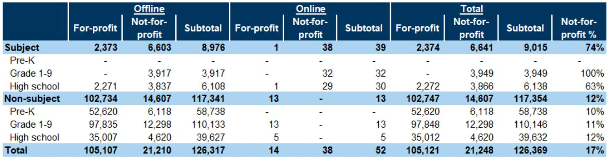
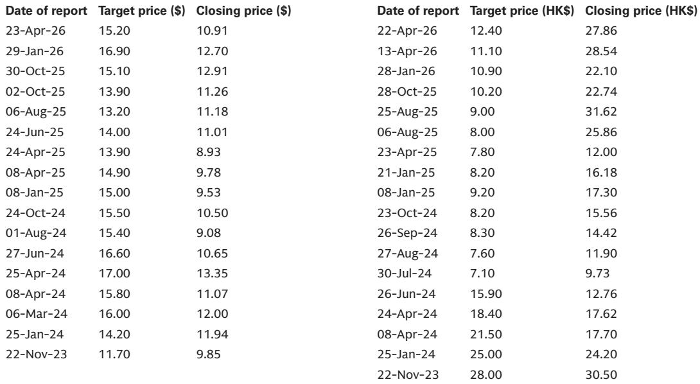

# China’s Education Sector Is Splitting Into Two Distinct Growth Engines: AI-Enabled Learning and Premium Hardware

The May 2026 tracker data from a global investment bank’s China Education coverage reveals a market that is no longer moving in a single direction. The headline numbers tell a story of deceleration: learning tablet GMV dropped 35% year-on-year, student visa issuance contracted 9%, and non-profit tutoring platform MAUs fell 26%. But beneath these aggregate figures lies a more nuanced and strategically important pattern. The Chinese education sector is bifurcating into two fundamentally different growth engines—AI-native applications that are scaling rapidly on user engagement and monetization, and premium hardware segments where average selling prices are proving resilient even as volumes normalize. This is not a sector in decline. It is a sector undergoing a structural reconfiguration that rewards companies with differentiated AI capabilities and pricing power, while punishing those reliant on volume-driven, commoditized models.

Why now matters is straightforward. The high base effects from the post-pandemic recovery cycle are now fully behind the market. The 35% GMV decline in learning tablets is not a signal of collapsing demand but rather a normalization against the extraordinary 65% growth recorded in the same period last year. The real story is what happens next: whether companies can sustain margin expansion through pricing power and AI-driven engagement, or whether they will be forced into a race to the bottom. The May data provides the first clear evidence that the winners are already separating themselves. Doubao Study’s DAU growth accelerated to 146% year-on-year, making it the sixth-largest AI native app in China. Gauth, the AI-powered tutoring app, generated approximately $1.1 million in monthly billings, up 24% year-on-year. Meanwhile, TAL’s learning tablet ASP decline narrowed to just 4%, even as volumes contracted. These are not coincidental data points. They are the early signals of a market where AI capability and brand premium are becoming the primary determinants of value creation.

## AI Education Apps Are Outperforming Traditional Tutoring Platforms on Both Engagement and Monetization

The most striking divergence in the May data is between AI-native education apps and legacy online tutoring platforms. Doubao Study’s DAU growth accelerated from 60% year-on-year in April to 146% in May, while its share of time spent among major K-12 learning tools continued to expand. Gauth, meanwhile, sustained its leadership position among global AI education apps with monthly billings of $1.1 million and a 39% year-on-year increase in billings per average DAU. These metrics matter because they demonstrate that AI education apps are not merely acquiring users—they are converting engagement into revenue at an accelerating rate.

Contrast this with the traditional tutoring platforms. The combined MAUs of non-profit subject tutoring platforms dropped 26% year-on-year in May, accelerating from a 21% decline in April. Even TAL’s Xueersi.com, which had been a standout performer, saw its MAU growth decelerate to 10% year-on-year from 22% in April. The implication is clear: the regulatory and competitive environment is compressing the addressable market for conventional tutoring, while AI-enabled tools are expanding their reach. The strategic question for investors is whether this divergence is cyclical or structural. The data suggests it is structural. AI apps are not just replacing tutoring hours; they are creating new use cases—homework assistance, test preparation, and personalized learning—that traditional platforms cannot replicate at the same cost structure.

## Learning Tablet Volume Normalization Masks a Sustained ASP Uptrend That Favors Premium Incumbents

The 35% year-on-year decline in combined online GMV for six major learning device brands appears alarming at first glance. But a closer examination reveals a more constructive picture. The decline is almost entirely volume-driven, with TAL’s unit shipments falling 21% year-on-year. Yet TAL’s ASP declined only 4% year-on-year, narrowing from a 5% decline in April. This is not a market in price collapse. It is a market where promotional intensity around the 618 shopping festival drove a 7% month-on-month ASP decline, but the year-on-year trend continues to improve.

The strategic implication is that learning tablets are becoming a premium category, not a commodity. TAL sold approximately 96,000 units for roughly 355 million RMB in GMV, implying an ASP of around 3,700 RMB. This is a meaningful price point that reflects the embedded AI capabilities and content ecosystems these devices offer. The fact that ASP declines are narrowing even as volumes normalize suggests that consumers are willing to pay for quality. For TAL specifically, the tracked GMV for its fiscal first quarter (May quarter) declined only 1% year-on-year, compared to the bank’s estimate of 11% growth. The miss is notable, but the resilience of ASPs provides a buffer. The open question is whether the volume recovery will materialize in the second half of the year, or whether the market has permanently shifted toward a lower-volume, higher-ASP equilibrium.

## Student Visa Recovery Is Real but Uneven, and the Composition of Demand Is Shifting Toward Higher-Value Destinations

Student visa issuance for Chinese students to Canada, Australia, and the UK combined declined 9% year-on-year in the first quarter of 2026. This is a significant improvement from the 22% decline in the first quarter of 2025 and the 16% decline for the full year 2025. The narrowing trend suggests that the post-pandemic recovery in overseas study demand is continuing, albeit at a slower pace than many had hoped.

But the aggregate figure masks an important compositional shift. The report does not break out the data by destination, but the pattern is consistent with broader trends: the UK has been gaining share relative to Australia and Canada, driven by shorter degree programs and more favorable visa policies. For education companies with exposure to overseas study consulting and test preparation, the implication is that the recovery is concentrated in higher-value segments. Students going to the UK tend to spend more on consulting services and test preparation than those going to other destinations. The narrowing of the decline is therefore more strategically significant than the absolute number suggests. It indicates that the structural demand for international education remains intact, even as geopolitical and economic headwinds persist.

## The Report Does Not Fully Answer How AI Monetization Will Scale Beyond the Current User Base

The May tracker provides compelling evidence that AI education apps are gaining users and generating revenue. But it leaves a critical question unanswered: how will these apps monetize their growing user bases beyond the current cohort of early adopters? Gauth’s monthly billings per average DAU of $0.4 represent a 39% year-on-year increase, but the absolute level remains modest. Doubao Study has 3.3 million DAUs but no disclosed monetization metrics. The report does not provide data on subscription conversion rates, average revenue per paying user, or churn rates for these AI apps.

This gap matters because the bull case for AI education depends on the assumption that engagement will translate into sustained revenue growth. The alternative scenario—that these apps face high churn rates or low willingness to pay among a predominantly young user base—would fundamentally change the investment thesis. The report’s data on time spent share and DAU growth is encouraging, but it is not sufficient to confirm that AI education is a large, profitable market. The next phase of analysis needs to focus on unit economics: customer acquisition costs, lifetime value, and the path to profitability for these AI-native platforms. Until that data is available, the AI education thesis remains compelling but unproven at scale.

## A Decision Framework for Investors: Map Education Companies Against Two Axes—AI Capability and Pricing Power

The May tracker data provides the empirical foundation for a simple but powerful decision framework. Investors should evaluate education companies along two dimensions: AI capability and pricing power. AI capability is measured by user engagement growth, time spent share, and monetization efficiency. Pricing power is measured by ASP trends, margin stability, and the ability to sustain premium positioning even during volume normalization.

Companies that score high on both axes—like TAL, with its narrowing ASP decline and its AI-powered learning tablet ecosystem—are positioned to generate superior risk-adjusted returns. Companies that score high on AI capability but low on pricing power—such as pure-play AI tutoring apps without hardware ecosystems—face the risk of margin compression as competition intensifies. Companies that score low on both axes—traditional tutoring platforms with declining MAUs and no AI differentiation—are likely to face structural headwinds.

The report’s ratings are consistent with this framework. TAL is rated Buy, with the stock trading at 12x CY26E P/E or 4x ex-cash. New Oriental is also rated Buy, trading at 11x CY26E P/E or 3x ex-cash. East Buy is rated Sell, reflecting its dependence on platform-driven GMV growth that is decelerating. The framework suggests that the market is already pricing in this bifurcation, but the May data provides an opportunity to reassess whether the divergence has further to run.

## The Next Phase of the Education Investment Story Will Be Defined by AI Monetization and Cross-Border Demand Recovery

The May 2026 tracker confirms that China’s education sector is past the peak of post-pandemic volatility. The high base effects are fading, and the underlying trends are becoming clearer. AI-native education apps are winning on engagement and monetization. Premium learning hardware is sustaining pricing power. Overseas study demand is recovering, albeit unevenly. The companies that can combine these three themes—AI capability, hardware ecosystem, and international exposure—are likely to emerge as the long-term winners.

But the report also leaves meaningful analytical questions open. How will AI education apps scale monetization beyond current levels? Will learning tablet volumes recover in the second half of the year, or is the market permanently smaller? Which overseas study destinations will drive the next leg of recovery? These questions cannot be answered with a single month of data. They require ongoing tracking of user engagement, pricing trends, and regulatory developments.

Join the community to read the full report and review the original charts.

*This article is for learning and discussion only and does not constitute investment advice.*

Personal reading notes and learning share only. Not investment advice.

