## Multi-Industry Capex Tracker

## Medium Term Capex Expectations Continue to Improve

We reflect on the latest trends in a core piece of our Multis toolkit – the Capex Tracker – where we conduct a bottom-up analysis of capex expectations, capturing €3.4tn of capex and c.4k companies across 34 different end and sub-end markets.

## Daniela Costa

+44 20 7774-8354

daniela.costa@gs.com

GS International

## Aditya Agarwal

+1 212 934-7448

aditya.a.agarwal@gs.com

GS India SPL

## Ines Lefranc

+44 20 7051-8710

ines.lefranc@gs.com

GS International

## Christian Hinderaker, CFA

+44 20 7774-7366

christian.hinderaker@gs.com

GS International

## Meihan Yang

+44 20 7051-6601

meihan.x.yang@gs.com

GS International

## Ope Otaniyi

+44 20 7051 6955

ope.otaniyi@gs.com

GS International

## Hollie Cooper

+44 20 7051-0956

hollie.cooper@gs.com

GS International

## Susmita Saha

+1 332 245-7701

susmita.saha@gs.com

GS India SPL

## Aayush Kandpal

+1 332 245-6142

aayush.kandpal@gs.com

GS India SPL

GS does and seeks to do business with companies covered in its research reports. As a result, investors should be aware that the firm may have a conflict of interest that could affect the objectivity of this report. Investors should consider this report as only a single factor in making their investment decision. For Reg AC certification and other important disclosures, see the Disclosure Appendix, or go to www.gs.com/research/hedge.html. Analysts employed by non-US affiliates are not registered/qualified as research analysts with FINRA in the U.S.

Table of Contents

<table><tr><td>Medium-term capex forecasts revised higher again, driven by tech and utilities</td><td>6</td></tr><tr><td>GS Capex Tracker by End Market</td><td>13</td></tr><tr><td>Appendix: Stock OSG vs Weighted Capex (&gt;50% RSQ)</td><td>59</td></tr><tr><td>Disclosure Appendix</td><td>61</td></tr></table>

## Our Capex Tracker has seen sizable upgrades in medium-term forecasts (2026E capex forecasts c.2pp up since our last update in March), pointing to a robust investment environment driven primarily by the technology and utilities sectors.

Through our bottom-up analysis capturing €3.4tn of capex across approximately 4,000 companies and 34 different end and sub-end markets, we expect 2026 capex to end well above historical trend growth (c.13% vs historical median of c.2%), while 2027 figures are also increasing (now at 12% vs 8% at the start of the year). We continue to see a highly favorable capex environment in the medium term in Tech, particularly in Datacenters (Buy on Schneider (on CL)) and Semiconductors (Buy VAT), as well as Utilities, specifically in power grids (Buy on Prysmian and Nexans).

In this update, we observe robust and positive moves wherein Capex CAGR growth across 2025-29E at c.9%, led by Datacenters at c.35% (a 6.5 pp increase in May-26 vs. Mar-26), Semiconductors at 23% (a +6.8 pp delta), and Oil and Gas at c.4% (a+3.5pp delta). Conversely, the most significant downgrades and cuts in medium-term capex expectations have occurred in sectors such as Chemicals, which saw a decline of -4.1 pp, and Construction Equipment, which fell by -4.0 pp. In absolute terms, Airports is projected to experience a negative absolute CAGR of -4% over the 2025–29E period.

We also highlight an increasing concentration of growth in a few structural areas related to Datacenters, Semis and Utilities, which represent c.39% of total capex in 2026E, compared to only 22% just four years ago in 2022. While these structural growth areas continue to anchor the aggregate outlook, we remain mindful of cyclical variations across other end markets. Specifically, in sectors like Telecom and Consumer, key investment indicators (such as capex-to-sales and capacity utilization) are currently running below their historical medians, signaling potential cyclical headwinds compared to the structural strength seen in tech and utilities.

## Our toolkit for picking stocks in multi-industry: Barometers, Screens and Capex Tracker

## BAROMETERS (short term)

c.1000 high frequency indicators

<table><tr><td colspan="2">Stock (61) data points</td><td>Region</td><td>52 2006</td><td>2Q 2006</td><td>3Q 2006</td><td>4Q 2006</td><td>1Q 2007</td><td>2Q 2007</td><td>3Q 2007</td></tr><tr><td>Germany Heavy Truck Sales</td><td>Europe</td><td></td><td>-25.6%</td><td>-53.4%</td><td>-10.3%</td><td>8.5%</td><td>9.7%</td><td>41.5%</td><td>10.2%</td></tr><tr><td>France Heavy Truck Sales</td><td>Europe</td><td></td><td>-28.6%</td><td>-52.4%</td><td>-8.1%</td><td>-3.0%</td><td>17.5%</td><td>55.5%</td><td>-1.1%</td></tr><tr><td>Italy Heavy Truck Sales</td><td>Europe</td><td></td><td>-11.1%</td><td>-52.4%</td><td>30.3%</td><td>11.1%</td><td>33.4%</td><td>121.7%</td><td>5.0%</td></tr><tr><td>Spain Heavy Truck Sales</td><td>Europe</td><td></td><td>-17.1%</td><td>-50.5%</td><td>5.1%</td><td>1.7%</td><td>32.4%</td><td>90.1%</td><td>8.0%</td></tr><tr><td>UK Heavy Truck Sales</td><td>Europe</td><td></td><td>-20.8%</td><td>-75.8%</td><td>-13.9%</td><td>-17.3%</td><td>-2.1%</td><td>155.8%</td><td>1.4%</td></tr><tr><td>Europe Heavy Truck Sales</td><td>Europe</td><td></td><td>-27.8%</td><td>-59.5%</td><td>-6.5%</td><td>-1.8%</td><td>18.0%</td><td>73.9%</td><td>13.8%</td></tr><tr><td>Germany Light Truck Sales</td><td>Europe</td><td></td><td>-10.7%</td><td>-38.7%</td><td>-2.9%</td><td>7.6%</td><td>8.2%</td><td>45.9%</td><td>-14.2%</td></tr><tr><td>France Light Truck Sales</td><td>Europe</td><td></td><td>-23.7%</td><td>-56.3%</td><td>5.5%</td><td>3.4%</td><td>41.9%</td><td>164.0%</td><td>-17.4%</td></tr><tr><td>Italy Light Truck Sales</td><td>Europe</td><td></td><td>-25.4%</td><td>-53.7%</td><td>12.3%</td><td>3.0%</td><td>30.2%</td><td>342.7%</td><td>-13.2%</td></tr><tr><td>Spain Light Truck Sales</td><td>Europe</td><td></td><td>31.1%</td><td>-56.5%</td><td>-4.8%</td><td>-3.5%</td><td>39.9%</td><td>285.5%</td><td>-30.5%</td></tr><tr><td>UK Light Truck Sales</td><td>Europe</td><td></td><td>-18.5%</td><td>-61.7%</td><td>5.8%</td><td>7.5%</td><td>36.5%</td><td>367.5%</td><td>-4.4%</td></tr><tr><td>Europe Light Truck Sales</td><td>Europe</td><td></td><td>-24.4%</td><td>-63.0%</td><td>-0.5%</td><td>-0.0%</td><td>31.7%</td><td>104.3%</td><td>-12.7%</td></tr><tr><td>Germany Medium Truck Sales</td><td>Europe</td><td></td><td>-22.9%</td><td>-70.1%</td><td>-7.9%</td><td>2.0%</td><td>8.9%</td><td>35.5%</td><td>3.7%</td></tr><tr><td>France Medium Truck Sales</td><td>Europe</td><td></td><td>-25.1%</td><td>-51.1%</td><td>-2.6%</td><td>-1.8%</td><td>20.0%</td><td>58.5%</td><td>-3.6%</td></tr><tr><td>Italy Medium Truck Sales</td><td>Europe</td><td></td><td>-11.4%</td><td>-51.0%</td><td>28.7%</td><td>0.0%</td><td>30.7%</td><td>52.5%</td><td>-1.1%</td></tr><tr><td>Spain Medium Truck Sales</td><td>Europe</td><td></td><td>-19.3%</td><td>-64.4%</td><td>-4.3%</td><td>8.2%</td><td>21.4%</td><td>75.9%</td><td>-10.7%</td></tr><tr><td>UK Medium Truck Sales</td><td>Europe</td><td></td><td>-17.5%</td><td>-74.1%</td><td>-8.4%</td><td>-16.1%</td><td>-5.0%</td><td>135.6%</td><td>-7.1%</td></tr><tr><td>Europe Medium Truck Sales</td><td>Europe</td><td></td><td>-28.3%</td><td>-67.2%</td><td>-4.6%</td><td>-2.6%</td><td>12.6%</td><td>64.1%</td><td>7.7%</td></tr><tr><td>Eurodollar Truck Traffic (Nyto)</td><td>Europe</td><td></td><td>-11.8%</td><td>-24.8%</td><td>-3.3%</td><td>4.5%</td><td>-21.0%</td><td>24.7%</td><td>-5.0%</td></tr><tr><td>Michelin North America Truck Tire (DE Estimates) (Nyto)</td><td>Europe</td><td></td><td>-20.3%</td><td>-58.7%</td><td>-8.0%</td><td>11.3%</td><td>22.2%</td><td>152.2%</td><td>13.3%</td></tr><tr><td>Michelin Europe Truck Tire Replacement (Nyto)</td><td>Europe</td><td></td><td>-0.3%</td><td>-33.7%</td><td>-0.7%</td><td>1.2%</td><td>17.0%</td><td>38.7%</td><td>0.0%</td></tr><tr><td>German Truck Tail Mileage TIDEA Averaged Worthy</td><td>Europe</td><td></td><td>111.8</td><td>102.3</td><td>111.0</td><td>110.4</td><td>115.3</td><td>118.0</td><td>114.0</td></tr><tr><td>North America Heavy Truck Sales</td><td>Europe</td><td></td><td>-25.8%</td><td>-61.0%</td><td>-31.7%</td><td>-3.7%</td><td>17.9%</td><td>65.8%</td><td>10.7%</td></tr><tr><td>Casa Truck Limited Index</td><td>USA</td><td></td><td>138.7</td><td>106.1</td><td>131.8</td><td>138.5</td><td>141.2</td><td>146.5</td><td>246.2</td></tr><tr><td>US PPI Heavy Truck Freight Manufacturing</td><td>USA</td><td></td><td>0.06%</td><td>0.06%</td><td>0.39%</td><td>1.12%</td><td>0.70%</td><td>1.12%</td><td>0.36%</td></tr><tr><td>Trucking Equipment (Nyto)</td><td>USA</td><td></td><td>-0.1%</td><td>-6.70%</td><td>-6.73%</td><td>-3.79%</td><td>-2.70%</td><td>3.30%</td><td>3.83%</td></tr><tr><td>Active Truck Utilization (%)</td><td>USA</td><td></td><td>83.17%</td><td>84.52%</td><td>90.35%</td><td>87.42%</td><td>99.20%</td><td>99.96%</td><td>100.00%</td></tr><tr><td>ATX Truck Turnage Index (NA, Nyto)</td><td>USA</td><td></td><td>2.9%</td><td>-9.8%</td><td>-0.0%</td><td>-2.0%</td><td>-3.9%</td><td>3.4%</td><td>-3.7%</td></tr><tr><td>The Case Shipment Index (Nyto)</td><td>USA</td><td></td><td>-8.7%</td><td>-71.4%</td><td>-7.5%</td><td>3.5%</td><td>7.6%</td><td>29.9%</td><td>14.0%</td></tr><tr><td>US intermodal volumes 12w RA (Nyto)</td><td>USA</td><td></td><td>-23.3%</td><td>-24.8%</td><td>4.6%</td><td>16.3%</td><td>18.5%</td><td>29.7%</td><td>8.7%</td></tr><tr><td>DAIT leads-to-truck ratio (Nyto)</td><td>USA</td><td></td><td>232.3%</td><td>219.7%</td><td>505.3%</td><td>455.3%</td><td>589.3%</td><td>540.6%</td><td>813.5%</td></tr><tr><td>Michelin North America Truck Tire (DE Estimates) (Nyto)</td><td>USA</td><td></td><td>-22.2%</td><td>-88.7%</td><td>-20.1%</td><td>-1.0%</td><td>-12.2%</td><td>158.0%</td><td>16.1%</td></tr><tr><td>Michelin North America Truck Tire Replacement Index (Nyto)</td><td>USA</td><td></td><td>-3.0%</td><td>-13.3%</td><td>0.3%</td><td>12.2%</td><td>11.7%</td><td>55.5%</td><td>15.5%</td></tr><tr><td>NA Class B Backing (Nyto)</td><td>USA</td><td></td><td>59.1%</td><td>-87.4%</td><td>-37.0%</td><td>18.7%</td><td>193.2%</td><td>174.5%</td><td>195.1%</td></tr><tr><td>NA Class B Solid (Nyto)</td><td>USA</td><td></td><td>-31.2%</td><td>-75.2%</td><td>-33.7%</td><td>-3.7%</td><td>14.5%</td><td>337.9%</td><td>4.8%</td></tr></table>

  
GS Barometer

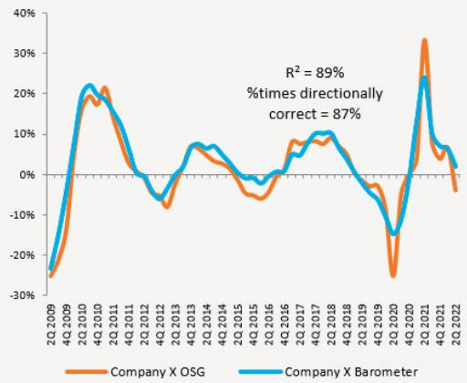

line chart

| Quarter | Company X OSG | Company X Barometer |
| --- | --- | --- |
| 2Q 2009 | -25% | -25% |
| 4Q 2009 | 15% | 20% |
| 1Q 2010 | 20% | 25% |
| 2Q 2010 | 15% | 20% |
| 3Q 2010 | 10% | 15% |
| 4Q 2010 | 5% | 10% |
| 1Q 2011 | 0% | 5% |
| 2Q 2011 | -5% | -5% |
| 3Q 2011 | -10% | -5% |
| 4Q 2011 | -5% | 0% |
| 1Q 2012 | 0% | 5% |
| 2Q 2012 | 5% | 10% |
| 3Q 2012 | 10% | 15% |
| 4Q 2012 | 5% | 10% |
| 1Q 2013 | 0% | 5% |
| 2Q 2013 | -5% | -5% |
| 3Q 2013 | -10% | -5% |
| 4Q 2013 | -5% | 0% |
| 1Q 2014 | 0% | 5% |
| 2Q 2014 | 5% | 10% |
| 3Q 2014 | 10% | 15% |
| 4Q 2014 | 5% | 10% |
| 1Q 2015 | 0% | 5% |
| 2Q 2015 | -5% | -5% |
| 3Q 2015 | -10% | -5% |
| 4Q 2015 | -5% | 0% |
| 1Q 2016 | 0% | 5% |
| 2Q 2016 | 5% | 10% |
| 3Q 2016 | 10% | 15% |
| 4Q 2016 | 5% | 10% |
| 1Q 2017 | 0% | 5% |
| 2Q 2017 | -5% | -5% |
| 3Q 2017 | -10% | -5% |
| 4Q 2017 | -5% | 0% |
| 1Q 2018 | 0% | 5% |
| 2Q 2018 | 5% | 10% |
| 3Q 2018 | 10% | 15% |
| 4Q 2018 | 5% | 10% |
| 1Q 2019 | 0% | 5% |
| 2Q 2019 | -5% | -5% |
| 3Q 2019 | -10% | -5% |
| 4Q 2019 | -5% | 0% |
| 1Q 2020 | -10% | -5% |
| 2Q 2020 | -5% | -5% |
| 3Q 2020 | -10% | -5% |
| 4Q 2020 | -5% | -5% |
| 1Q 2021 | -10% | -5% |
| 2Q 2021 | -5% | -5% |
| 3Q 2021 | -10% | -5% |
| 4Q 2021 | -5% | -5% |
| Q1 2022 | -10% | -5% |
| Q2 2022 | -5% | -5% |
| Q3 2022 | -10% | -5% |
| Q4 2022 | -5% | -5% |

## SCREENs (medium term)

## Screens on fundamentals, consensus, corporate actions, valuation and ESG

## Operational metrics

ROIC 2024

ROIC chg. 23-28

EPS CAGR 23-28

Cash returns 22-23

Avg. FCF/adj. EBIT 23-28

chg. WC days 24-26

## Valuation metrics

FCF yield 2024

Div. & Buyback yield 2024

PEG ratio

EV/EBIT vs 10y avg. prem./disc.

L12M price performance

RSI 30D

% of buy ratings

## GS vs consensus

2024 EBIT vs. Visible Alpha

consensus data

## Corporate actions

IRR under basic LBO

assumptions

SOTP valuations

## Screen on ESG

Governance Rank - Global

Operational Headline E&S Rank

Operational E&S Momentum Rank

Total E&S Disclosure %

Headline Controversy Rank

Governance Rank - Global

## Bull/Bear/Normalization scenarios

Peak/trough/normalized EV/Sales

Peak/trough/normalized EV/EBIT

Peak/trough/normalized P/B

  
Screens

<table><tr><td>Company</td><td>Ticker</td><td>Price</td><td>Closing Price</td><td>Day Chg</td><td>High</td><td>Low</td><td>Yld</td><td>P/E</td><td>MCap m</td><td></td><td></td><td></td><td></td><td></td></tr><tr><td>1</td><td>S&amp;P Global</td><td>276.91</td><td>234.71</td><td>-0.58</td><td>276.74</td><td>276.71</td><td>-0.58</td><td>-0.58</td><td>-0.58</td><td></td><td></td><td></td><td></td><td></td></tr><tr><td>2</td><td>MitsubishiUFJ</td><td>374.79</td><td>339.26</td><td>-0.58</td><td>374.79</td><td>374.79</td><td>-0.58</td><td>-0.58</td><td>-0.58</td><td></td><td></td><td></td><td></td><td></td></tr><tr><td>3</td><td>Nasdaq</td><td>162.06</td><td>146.24</td><td>-0.58</td><td>162.06</td><td>162.06</td><td>-0.58</td><td>-0.58</td><td>-0.58</td><td></td><td></td><td></td><td></td><td></td></tr><tr><td>4</td><td>China Mobile</td><td>394.72</td><td>376.42</td><td>-0.58</td><td>394.72</td><td>394.72</td><td>-0.58</td><td>-0.58</td><td>-0.58</td><td></td><td></td><td></td><td></td><td></td></tr><tr><td>5</td><td>Shanghai Hong Kong</td><td>164.23</td><td>139.26</td><td>-0.58</td><td>164.23</td><td>164.23</td><td>-0.58</td><td>-0.58</td><td>-0.58</td><td></td><td></td><td></td><td></td><td></td></tr><tr><td>6</td><td>Tencent Holdings</td><td>164.23</td><td>139.26</td><td>-0.58</td><td>164.23</td><td>164.23</td><td>-0.58</td><td>-0.58</td><td>-0.58</td><td></td><td></td><td></td><td></td><td></td></tr><tr><td>7</td><td>Daimler WWI</td><td>164.23</td><td>139.26</td><td>-0.58</td><td>164.23</td><td>164.23</td><td>-0.58</td><td>-0.58</td><td>-0.58</td><td></td><td></td><td></td><td></td><td></td></tr><tr><td>8</td><td>Haitai Froude SA</td><td>164.23</td><td>139.26</td><td>-0.58</td><td>164.23</td><td>164.23</td><td>-0.58</td><td>-0.58</td><td>-0.58</td><td></td><td></td><td></td><td></td><td></td></tr><tr><td rowspan="9">9</td><td rowspan="9">Suresa China Ltd. (HK)</td><td rowspan="9">164.23</td><td rowspan="9">139.26</td><td rowspan="9">-0.58</td><td rowspan="9">164.23</td><td rowspan="9">164.23</td><td rowspan="9">-0.58</td><td rowspan="9">-0.58</td><td rowspan="9">-0.58</td><td rowspan="9"></td><td rowspan="9"></td><td rowspan="7"></td><td rowspan="7"></td><td rowspan="7"></td></tr><tr></tr><tr></tr><tr></tr><tr></tr><tr></tr><tr></tr><tr><td rowspan="2"></td><td rowspan="2"></td><td rowspan="2"></td></tr><tr></tr><tr><td>10</td><td colspan="14">China Mobile Limited (HK) (US$)</td></tr><tr><td>11</td><td colspan="14">China Mobile Limited (HK) (US$)</td></tr><tr><td>12</td><td colspan="14">China Mobile Limited (HK) (US$)</td></tr><tr><td>13</td><td colspan="14">China Mobile Limited (HK) (US$)</td></tr><tr><td>14</td><td colspan="14">China Mobile Limited (HK) (US$)</td></tr><tr><td>15</td><td colspan="14">China Mobile Limited (HK) (US$)</td></tr><tr><td>16</td><td colspan="14">China Mobile Limited (HK) (US$)</td></tr><tr><td>17</td><td colspan="14">China Mobile Limited (HK) (US$)</td></tr><tr><td>18</td><td colspan="14">China Mobile Limited (HK) (US$)</td></tr><tr><td>19</td><td colspan="14">China Mobile Limited (HK) (US$)</td></tr><tr><td>20</td><td colspan="14">China Mobile Limited (HK) (US$)</td></tr><tr><td>21</td><td colspan="14">China Mobile Limited (HK) (US$)</td></tr><tr><td>22</td><td colspan="14">China Mobile Limited (HK) (US$)</td></tr><tr><td>23</td><td>China Mobile Limited (HK) (US$) (US$) - China Mobile Limited (HK) (US$) - China Mobile Limited (HK) (US$) - China Mobile Limited (HK) (US$) - China Mobile Limited (HK) (US$) - China Mobile Limited (HK) (US$) - China Mobile Limited (HK) (US$) - China Mobile Limited (HK) (US$) - China Mobile Limited (HK) (US$) - China Mobile Limited (HK) (US$) - China Mobile Limited (HK)(US$) - China Mobile Limited (HK)(US$) - China Mobile Limited (HK)(US$) - China Mobile Limited (HK)(US$) - China Mobile Limited (HK)(US$) - China Mobile Limited (HK)(US$) - China Mobile Limited (HK)(US$) - China Mobile Limited (HK)(US$) - China Mobile Limited (HK)(US$) - China Mobile Limited (HK)(US$) - China Mobile Limited(HK)(US$) - China Mobile Limited(HK)(US$) - China Mobile Limited(HK)(US$) - China Mobile Limited(HK)(US$) - China Mobile Limited(HK)(US$) - China Mobile Limited(HK)(US$) - China Mobile Limited(HK)(US$) - China Mobile Limited(HK)(US$) - China Mobile Limited(HK)(US$) - China Mobile Limited(HK)(US$) - China Mobile Limited(SK)(US$) - China Mobile Limited(HK)(US$) - China Mobile Limited(HK)(US$) - China Mobile Limited(HK)(US$) - China Mobile Limited(HK)(US$) - China Mobile Limited(HK)(US$) - China Mobile Limited(HK)(US$) - China Mobile Limited(HK)(US$) - China Mobile Limited(HK)(US$) - China Mobile Limited(HK)(US$) - China Mobile Limited( HK)(US$) - China Mobile Limited( HK)(US$) - China Mobile Limited( HK)(US$) - China Mobile Limited( HK)(US$) - China Mobile Limited( HK)(US$) - China Mobile Limited( HK)(US$) - China Mobile Limited( HK)(US$) - China Mobile Limited( HK)(US$) - China Mobile Limited( HK)(US$) - China Mobile Limited( HK)(US$) - China Mobile Limited( UK)(US$) - China Mobile Limited( UK)(US$) - China Mobile Limited( UK)(US$) - China Mobile Limited( UK)(US$) - China Mobile Limited( UK)(US$) - China Mobile Limited( UK)(US$) - China Mobile Limited( UK)(US$) - China Mobile Limited( UK)(US$) - China Mobile Limited( UK)(US$) - China Mobile Limited( UK)(US$) - China Mobile Limited( USK)(US$) - China Mobile Limited( USK)(US$) - China Mobile Limited( USK)(US$) - China Mobile Limited( USK)(US$) - China Mobile Limited( USK)(US$) - China Mobile Limited( USK)(US$) - China Mobile Limited( USK)(US$) - China Mobile Limited( USK)(US$) - China Mobile Limited( USK)(US$) - China Mobile Limited( USK](US$)- China Mobile Limited( USK)(US$)- China Mobile Limited( USK)(US$)- China Mobile Limited( USK)(US$)- China Mobile Limited( USK)(US$)- China Mobile Limited( USK)(US$)- China Mobile Limited( USK)(US$)- China Mobile Limited( USK)(US$)- China Mobile Limited( USK)(US$)- China Mobile Limited( USK)(US$)- China Mobile Limited( USK)(US$)- China Mobile Limited( USK).(US$()- China Mobile Limited( USK)(US$()- China Mobile Limited( USK)(US$()- China Mobile Limited( USK)(US$()- China Mobile Limited( USK)(US$()- China Mobile Limited( USK)(US$()- China Mobile Limited( USK)(US$()- China Mobile Limited( USK)(US$()- China Mobile Limited( USK)(US$()- China Mobile Limited( USK)(US$()- China Mobile Limited( USK)(US$()- China Mobile Limited( USK).(US$()- China Mobile Limited( USK)(US$()- China Mobile Limited( USK)(US$()- China Mobile Limited( USK)(US$()- China Mobile Limited( USK)(US$()- China Mobile Limited( USK)(US$()- China Mobile Limited( USK)(US$()- China Mobile Limited( USK)(US$()- China Mobile Limited( USK)(US$()- China Mobile Limited( USK)(US($)- ChinaMobileLimited( USK)(US$()- ChinaMobileLimited( USK)(US$()- ChinaMobileLimited( USK)(US$()- ChinaMobileLimited( USK)(US$()- ChinaMobileLimited( USK)(US$()- ChinaMobileLimited( USK)(US$()- ChinaMobileLimited( USK)(US$()- ChinaMobileLimited( USK)(US$()- ChinaMobileLimited( USK)(US$()- ChinaMobileLimited( USK)(US$()- ChinaMobileLimited( USK)(US($)- ChinaMobileLimited( USK)(US$()- ChinaMobileLimited( USK)(US$()- ChinaMobileLimited( USK)(US$()- ChinaMobileLimited( USK)(US$()- ChinaMobileLimited( USK)(US$()- ChinaMobileLimited( USK)(US$()- ChinaMobileLimited( USK)(US$()- ChinaMobileLimited( USK)(US$()- ChinaMobileLimited( USK)(US$()- ChinaMobileLtd(U.S.$)- ChineseMobileLtd(U.S.$)- ChineseMobileLtd(U.S.$)- ChineseMobileLtd(U.S.$)- ChineseMobileLtd(U.S.$)- ChineseMobileLtd(U.S.$)- ChineseMobileLtd(U.S.$)- ChineseMobileLtd(U.S.$)- ChineseMobileLtd(U.S.$)- ChineseMobileLtd(U.S.$)- ChineseMobileLtd(U.S.$)- ChineseMobileLtd(U.S.$)- ChineseMobileLtd(U.S.$)- ChineseMobileLtd(U.S.$)- ChineseMobileLtd(U.S.$)- ChineseMobile Ltd(U.S.$)- ChineseMobileLtd(U.S.$)- ChineseMobileLtd(U.S.$)- ChineseMobileLtd(U.S.$)- ChineseMobileLtd(U.S.$)- ChineseMobileLtd(U.S.$)- ChineseMobileLtd(U.S.$)- ChineseMobileLtd(U.S.$)- ChineseMobileLtd(U.S.$)- ChineseMobileLtd(U.S.$)- ChineseMobileLtd(U.S.$)- ChineseMobileLtd(U.S.$)- ChineseMobileLtd(U.S.$)- ChineseMobileLtd(U.S.$)- ChineseMobileLtd(U.s.$)- ChineseMobileLtd(U.s.$)- ChineseMobileLtd(U.s.$)- ChineseMobileLtd(U.s.$)- ChineseMobileLtd(U.s.$)- ChineseMobileLtd(U.s.$)- ChineseMobileLtd(U.s.$)- ChineseMobileLtd(U.s.$)- ChineseMobileLtd(U.s.$)- ChineseMobileLtd(U.s.$)- ChineseMobileLtd(U.s.$)- ChineseMobileLtd(U.s.$)- ChineseMobileLtd(U.s.$)- ChineseMobileLtd(U.s.$)- ChineseMobileLtd(U.s.$}- ChineseMobileLtd(U.s.$}- ChineseMobileLtd(U.s.$}- ChineseMobileLtd(U.s.$}- ChineseMobileLtd(U.s.$}- ChineseMobileLtd(U.s.$}- ChineseMobileLtd(U.s.$}- ChineseMobileLtd(U.s.$}- ChineseMobileLtd(U.s.$}- ChineseMobileLtd(U.s.$}- ChineseMobileLtd(U.s.$}- ChineseMobileLtd(U.s.$}- ChineseMobileLtd(U.s.$}- ChineseMobileLtd(U.s.$}- ChineseMobileLtd(U.s.$}- Chinese mobile Ltd(U.s.$}- Chinese mobile Ltd(U.s.$}- Chinese mobile Ltd(U.s.$}- Chinese mobile Ltd(U.s.$}- Chinese mobile Ltd(U.s.$}- Chinese mobile Ltd(U.s.$}- Chinese mobile Ltd(U.s.$}- Chinese mobile Ltd(U.s.$}- Chinese mobile Ltd(U.s.$}- Chinese mobile Ltd(U.s.$}- Chinese mobile Ltd(U.s.$}- Chinese mobile Ltd(U.s.$}- Chinese mobile Ltd(U.s.$}- Chinese mobile Ltd(U.s.$}- Chinese mobile Ltd(U.S.$}- Chinese mobile Ltd(U.s.$}- Chinese mobile Ltd(U.s.$}- Chinese mobile Ltd(U.s.$}- Chinese mobile Ltd(U.s.$}- Chinese mobile Ltd(U.s.$}- Chinese mobile Ltd(U.s.$}-Chinese mobile Ltd(U.s.$}-Chinese mobile Ltd(U.s.$}-Chinese mobile Ltd(U.s.$}-Chinese mobile Ltd(U.s.$}-Chinese mobile Ltd(U.s.$}-Chinese mobile Ltd(U.s.$}-Chinese mobile Ltd(U.s.$}-Chinese mobile Ltd(U.s.$}-Chinese mobile Ltd(U.s.$}-Chinese mobile Ltd(U.s.$}-Chinese mobile Ltd(U.s.$}-Chinese mobile Ltd(U.s.$}-Chinese mobile Ltd(U.s.$}-Chinese mobile Ltd(U.s.$}-Chinese mobile Inc-U.S.(\\$,\\$,\\$,\\$,\\$,\\$,\\$,\\$,\\$,\\$,\\$,\\$,\\$,\\$,\\$,\\$,\\$,\\$,\\$,\\$,\\$,\\$,\\$,\\$,\\$,\\$,\\$,\\$,\\$,\\$,\\$,\\$,\\$,\\$,\\$,\\$,\\$,\\$,\\$,\\$,\\$,\\$,\\$,\\&#x27;,\\,\\,\\,\\,\\,\\,\\,\\,\\,\\,\\,\\,\\,\\,\\,\\,\\,\\,\\,\\,\\,\\,\\,\\,\\,\\,\\,\\,\\,\\,\\,\\,\\,\\,\\,\\,\\,\\,\\,\\,\\,\\,\\,\\,\\,\\,\\,\\,\\,\\,\\,,\#\) 中国银行U.S.(\\$,\\&#x27;,U.S.(\\&#x27;,U.S.(\\)&#x27;,U.S.(\\)&#x27;,U.S.(\\)&#x27;,U.S.(\\)&#x27;,U.S.(\\)&#x27;,U.S.(\\)&#x27;,U.S.(\\)&#x27;,U.S.(\\)&#x27;,U.S.(\\)&#x27;,U.S.(\\)&#x27;,U.S.(\\)&#x27;,U.S.(\\)&#x27;,U.S.(\\)&#x27;,U.S.(\\)&#x27;,U.S.(\\)&#x27;,U.S.(\\)&#x27;,U.S.(\\)&#x27;,U.S.(\\)&#x27;,U.S.(\\)&#x27;,U.S.(\\)&#x27;,U.S.(\\&#x27;) 中国银行U.S.(\\&#x27;,U.S.(\\)&#x27;,U.S.(\\)&#x27;,U.S.(\\)&#x27;,U.S.(\\)&#x27;,U.S.(\\)&#x27;,U.S.(\\)&#x27;,U.S.(\\)&#x27;,U.S.(\\)&#x27;,U.S.(\\)&#x27;,U.S.(\\)&#x27;,U.S.(\\)&#x27;,U.S.(\\)&#x27;,U.S.(\\)&#x27;,U.S.(\\)&#x27;,U.S.(\\)&#x27;,U.S.(\\)&#x27;,U.S.(\\)&#x27;,U.S.(\\)&#x27;,U.S.(\\&#x27;), U.S.D., U.S.D., U.S.D., U.S.D., U.S.D., U.S.D., U.S.D., U.S.D., U.S.D., U.S.D., U.S.D., U.S.D., U.S.D., U.S.D., U.S.D., U.S.D., U.S.D., U.S.D., U.S.D., U.S.D., U.S.D., U.S.D., U.S.D., U.S.D., U.S.D., U.S.D%, U.S.D., U.S.D., U.S.D., U.S.D., U.S.D., U.S.D., U.S.D., U.S.D., U.S.D., U.S.D., U.S.D., U.S.D., U.S.D., U.S.D., U.S.D., U.S.D., U.S.D., U.S.D., U.S.D., U.S.D., U.S.D., U.S.D., U.S.D., U.S.D., U.S.D%. 中国银行U.S.(\\&#x27;,U.S.(\\)&#x27;,U.S.(\\)&#x27;,U.S.(\\)&#x27;,U.S.(\\)&#x27;,U.S.(\\)&#x27;,U.S.(\\)&#x27;,U.S.(\\)&#x27;,U.S.(\\)&#x27;,U.S.(\\)&#x27;,U.S.(\\)&#x27;,U.S.(\\)&#x27;,U.S.(\\)&#x27;,U.S.(\\)&#x27;,U.S.(\\)&#x27;,U.S.(\\)&#x27;,U.S.(\\)&#x27;,U.S.(\\)&#x27;,U.S.( \\&#x27; ) 中国银行U.S.(x),U.S.(x),U.S.(x),U.S.(x),U.S.(x),U.S.(x),U.S.(x),U.S.(x),U.S.(x),U.S.(x),U.S.(x),U.S.(x),U.S.(x),U.S.(x),U.S.(x),U.S.(x),U.T.\% 中国银行U.SH(x),U.SH(x),U.SH(x),U.SH(x),U.SH(x),U.SH(x),U.SH(x),U.SH(x),U.SH(x),U.SH(x),U.SH(x),U.SH(x),U.SH(x),U.SH(x),U.SH(x),U.SH(x),U.SH(x),U.SH(x),U.SH(x),U.SH(x),U.SH(x),U.SH(x),U.SH(x),U.SH(x),U.SH(x),U.SH(x). 中国银行U.SH(x),U.SH(x),U.SH(x),U.SH(x),U.SH(x),U.SH(x),U.SH(x),U.SH(x),U.SH(x),U.SH(x),U.SH(x),U.SH(x),U.SH(x),U.SH(x),U.SH(x),U.SH(x),U.SH(x),U.SH(x),U.SH(x),U.SH(x),U.SH(x),U.SH(x),U.SH(x),U.SH(x), U.SH(x), U.SH(x), U.SH(x), U.SH(x), U.SH(x), U.SH(x), U.SH(x), U.SH(x), U.SH(x), U.SH(x), U.SH(x), U.SH(x), U.SH(x), U.SH(x), U.SH(x), U.SH(x), U.SH(x), U.SH(x), U.SH(x), U.SH(x), U.SH(x), U.SH(x), U.SH(x). 中国银行U.SH(x),uS.A.M.L.L.L.L.L.L.L.L.L.L.L.L.L.L.L.L.L.L.L.L.L.L.L.L.L.L.L.L.L.L.L.L.L.L.L.L.L.L.L.L.L.L.L.L.L.L.L.L.L.L.L.L.L.L.L.L.L.L.L.L.L.L.L.L.L.L.L.L.L.L.L.L.L.L.L.L.L.L.L.L.L.L.L.L.L.L.L.L.L.L.L.L.L.L.L.L.L.L.L.L.I.U.U.U.U.U.U.U.U.U.U.U.U.U.U.U.U.U.U.U.U.U.U.U.U.U.U.U.U.U.U.U.U.U.U.U.U.U.U.U.U.U.U.U.U.U.U.U.U.U.U.U.U.U.U.U.U.U.U.U.U.U.U.U.U.U.U.U.U.U.U.U.U.U.U.U.U.U.U.U.U.U.U.U.U.U.U.U.U.U.U.U.U.U.U.U.U.U.U.U.U/U.A.A.A.A.A.A.A.A.A.A.A.A.A.A.A.A.A.A.A.A.A.A.A.A.A.A.A.A.A.A.A.A.A.A.A.A.A.A.A.A.A.A.A.A.A.A.A.A.A.A.A.A.A.A.A.A.A.A.A.A.A.A.A.A.A.A.A.A.A.A.A.A.A.A.A.A.A.A.A.A.A.A.A.A.A.A.A.A.A.A.A.A.A.A.A.A.A.A.A.A,A.B.C.C.C.C.C.C.C.C.C.C.C.C.C.C.C.C.C.C.C.C.C.C.C.C.C.C.C.C.C.C.C.C.C.C.C.C.C.C.C.C.C.C.C.C.C.C.C.C.C.C.C.C.C.C.C.C.C.C.C.C.C.C.C.C.C.C.C.C.C.C.C.C.C.C.C.C.C.C.C.C.C/C.G.P.E.O.F.O.F.O.F.O.F.O.F.O.F.O.F.O.F.O.F.O.F.O.F.O.F.O.F.O.F.O.F.O.F.O.F.O.F.O.F.O.F.O.F.O.F.O.F.O.F.O.F.O.F.O.F.O.F.O.F.O.F.O.F.O.F.O.F.O.F.O.F.O.F.O.F.O.F.O.F.O.F.O.F.O.F.O.F.O.F.O.F.O.F.O.F.O.F.O.F.O.F.O(F.) .#A.B.B.B.B.B.B.B.B.B.B.B.B.B.B.B.B.B.B.B.B.B.B.B.B.B.B.B.B.B.B.B.B.B.B.B.B.B.B.B.B.B.B.B.B.B.B.B.B.B.B.B.B.B.B.B.B.B.B.B.B.B.B.B.B.B.B.B.B.B.B.B.B.B.B.B.B.B.B.B.B.B.B.B.B.B.B.B.B.B.B.B.B.B.B.B.B.B.B.B.B[B].#A,B,B,B,B,B,B,B,B,B,B,B,B,B,B,B,B,B,B,B,B,B,B,B,B,B,B,B,B,B,B,B,B,B,B,B,B,B,B,B,B,B,B,B,B,B,B,B,B,B,B,B,B,B,B,B,B,B,B,B,B,B,B,B,B,B,B,B,B,B,B,B,B,B,B,B,B,B,B,B,B,B,B,B,B,B,B,B,B,B,B,B,B,B,BB(B).#A B B B B B B B B B B B B B B B B B B B B B B B B B B B B B B B B B B B B B B B B B B B B B B B B B B B B B B B B B B B B B B B B B B B B B B B B B B B B B B B B B B B B BB.#A #A #A #A #A #A #A #A #A #A #A #A #A #A #A #A #A #A #A #A #A #A #A #A #A #A #A #A #A #A #A #A #A #A #A #A #A #A #A #A #A #A #A #A #A #A #A #A #A #A #A# A A A A A A A A A A A A A A A A A A A A A A A A A A A A A A A A A A A A A A A A A A A A A A A A A A A A A A A A A A A A A A A A A A A A A A A A A A A A A A A A A A A A A A A A A A A A A A A A A A A C##C##C##C##C##C##C##C##C##C##C##C##C##C##C##C##C##C##C##C##C##C##C##C##C##C##C##C##C##C##C##C##C##C##C##C##C##C##C##C##C##C##C##C##C##C##C##C##C##C##C## C## C## C## C## C## C## C## C## C## C## C## C## C## C## C## C## C## C## C## C## C## C## C## C## C## C# C# C# C# C# C# C# C# C# C# C# C# C# C# C# C# C# C# C# C# C# C# C# C# C# C# C# C# C# C# C# C# C# C# C# C# C# C# C# C# C# C# C# C# C# C# C# C# C# C# C#
C######: 1999; 1999; 1999; 1999; 1999; 1999; 1999; 1999; 1999; 1999; 1999; 1999; 1999; 1999; 1999; 1999; 1999; 1989; 1989; 1989; 1989; 1989; 1989; 1989; 1989; 1989; 1989; 1989; 1989; 1989; 1989; 1989; 1989; 1989; 2000; 2000; 2000; 2000; 2000; 2000; 2000; 2000; 2000; 2000; 2000; 2000; 2000; 2000; 2000; 2000; 2000; 2#A D##
B a b d a b d a b d a b d a b d a b d a b d a b d a b d a b d a b d a b d a b d a b d a b d a b d a b d a b d a b d a b d a b d a b d a b d a b d a b d a b d a b d a b d a b d a b d a b d a b d a b d a b d e f f f f f f f f f f f f f f f f f f f f f f f f f f f f f f f f f f f f f f f f f f f f f f f f f f f f f f f f f f f f f f f f f f f f f f f f f f f f f f f f f f f f f f f f f f f f f f f t h x y y y y y y y y y y y y y y y y y y y y y y y y y y y y y y y y y y y y y y y y y y y y y y y y y y y y y y y y y y y y y y y y y y y y y y y y y y y y y y y y y y y y y y y y y y y y y y y yy %y %y %y %y %y %y %y %y %y %y %y %y %y %y %y %y %y %y %y %y %y %y %y %y %y %y %y %y %y %y %y %y %y %y %y %y %y %y %y %y %y %y %y %y %y %y %y %y %y %y%y %y %y %y %y %y %y %y %y %y %y %y %y %y %y %y %y %y %y %y %y %y %y %y %y %y %y %y %y %y %y %y %y %y %y %y %y %y %y %y %y %y %y %y %y %y %y %y %y %y %(p.p.p.p.p.p.p.p.p.p.p.p.p.p.p.p.p.p.p.p.p.p.p.p.p.p.p.p.p.p.p.p.p.p.p.p.p.p.p.p.p.p.p.p.p.p.p.p.p.p.p.p.p.p.p.p.p.p.p.p.p.p.p.p.p.p.p.p.p.p.p.p.p.p.p.p.p.p.p.p.p.p.p.p.p.p.p.p.p.p.p.p.p.p.p.p.p.p.p.p.p.c u P u T u X u Y u Y u Y u Y u Y u Y u Y u Y u Y u Y u Y u Y u Y u Y u Y u Y u Y u Y u Y u Y u Y u Y u Y u Y u Y u Y u Y u Y u Y u Y u Y u Y u Y u Y u Y u Y u Y u Y u Y u Y u Y u Y u Y u Y u Y u Y u Y u Y u Y u Y uY u x u x u x u x u x u x u x u x u x u x u x u x u x u x u x u x u x u x u x u x u x u x u x u x u x u x u x u x u x u x u x u x u x u x u x u x u x u x u x u x u x u x u x u x u x u x u x u x u x u x u ,u T p.u T ,u T p.u T ,u T p.u T ,u T p.u T ,u T p.u T ,u T p.u T ,u T p.u T ,u T p.u T ,u T p.u T ,u T p.u T ,u T p.u T ,u T p.u T ,u T p.u T ,u T p.u T ,u T p.u T ,u T p.u T ,u T p.u T ,u Tp.u T ,u T p.u T ,u T p.u T ,u T p.u T ,u T p.u T ,u T p.u T ,u T p.u T ,u T p.u T ,u T p.u T ,u T p.u T ,u T p.u T ,u T p.u T ,u T p.u T ,u T p.u T ,u T p.u T ,u T p.u T ,u T p.u T ,n ## ## ## ## ## ## ## ## ## ## ## ## ## ## ## ## ## ## ## ## ## ## ## ## ## ## ## ## ## ## ## ## ## ## ## ## ## ## ## ## ## ## ## ## ## ## ## ## ## ## ## ## ## ## ## ## ## ## ## ## ## ## ## ## ## ## ## ## ## ## ## ## ## ## ## ## ## ## ## ## ## ## ## ## ## ## ## ## ## ## ## ## ## ## ## ## ## ## ## ## ###</td><td></td><td></td><td></td><td></td><td></td><td></td><td></td><td></td><td></td><td></td><td></td><td></td><td></td></tr></table>

## Capex Tracker (long term)

GS Capex Tracker: 4000 companies, 5yr capex forecasts, 34 end and sub-end markets  
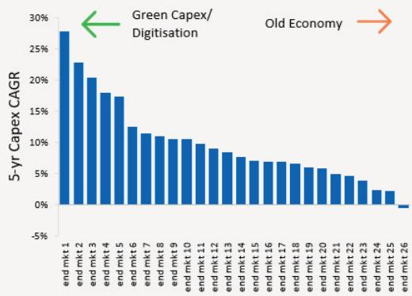

bar chart

| Period | 5-yr Capex CAGR (%) |
|---|---|
| end mkt 1 | 28 |
| end mkt 2 | 23 |
| end mkt 3 | 20.5 |
| end mkt 4 | 18 |
| end mkt 5 | 17.5 |
| end mkt 6 | 12.5 |
| end mkt 7 | 11.5 |
| end mkt 8 | 11 |
| end mkt 9 | 10.5 |
| end mkt 10 | 10.5 |
| end mkt 11 | 9.5 |
| end mkt 12 | 9 |
| end mkt 13 | 8.5 |
| end mkt 14 | 7.5 |
| end mkt 15 | 7 |
| end mkt 16 | 6.5 |
| end mkt 17 | 6.5 |
| end mkt 18 | 6 |
| end mkt 19 | 5.5 |
| end mkt 20 | 5 |
| end mkt 21 | 4.5 |
| end mkt 22 | 4 |
| end mkt 23 | 3.5 |
| end mkt 24 | 2 |
| end mkt 25 | 1.5 |
| end mkt 26 | -0.5 |
Green Capex/Digitisation Old Economy

  
GS Capex tracker and end market relationship

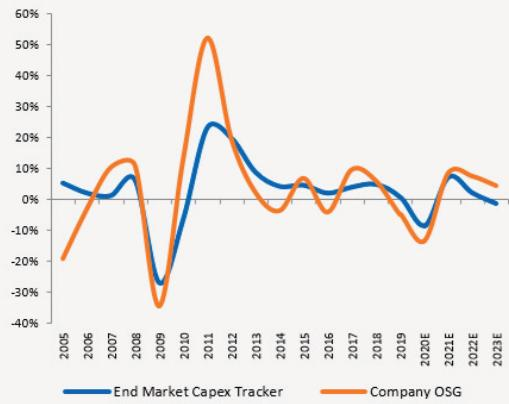

line chart

| Year   | End Market Capex Tracker | Company OSG |
| ------ | ------------------------ | ----------- |
| 2005   | ~5%                      | ~-20%       |
| 2006   | ~0%                      | ~10%        |
| 2007   | ~5%                      | ~15%        |
| 2008   | ~10%                     | ~10%        |
| 2009   | ~-30%                    | ~-40%       |
| 2010   | ~-10%                    | ~55%        |
| 2011   | ~25%                     | ~50%        |
| 2012   | ~20%                     | ~10%        |
| 2013   | ~10%                     | ~5%         |
| 2014   | ~5%                      | ~-5%        |
| 2015   | ~5%                      | ~5%         |
| 2016   | ~5%                      | ~-5%        |
| 2017   | ~5%                      | ~10%        |
| 2018   | ~5%                      | ~10%        |
| 2019   | ~-5%                     | ~-10%       |
| 2020E  | ~-10%                    | ~-15%       |
| 2021E  | ~5%                      | ~10%        |
| 2022E  | ~5%                      | ~10%        |
| 2023E  | ~0%                      | ~5%         |

10 factors to highlight from our capex tracker  
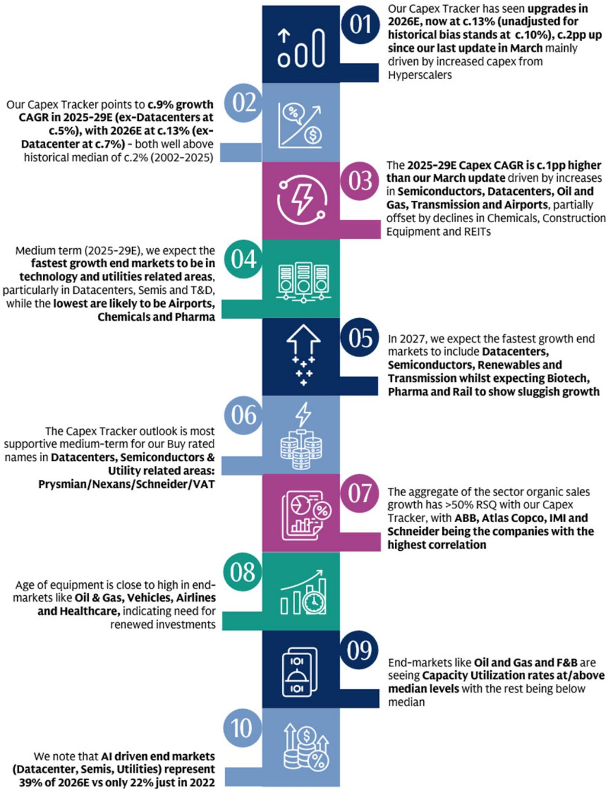  
Source: GS Global Investment Research

## Medium-term capex forecasts revised higher again, driven by tech and utilities

## For more details on our Company Profiles, please see the below note:

## Mapping our coverage - Company profiles

In this report, we provide company profiles for the 38 companies covered by the European Multi-Industry research team. We provide an overview of each company, including business or divisional descriptions, the company's competitive landscape, geographical sales exposure and end-market sales exposure.  
Competitive landscape compendium  
In this report, we analyse our European Multi-Industry coverage's main end-market and product competitive landscapes. We provide overall end-market/product category exposure for our coverage, global market shares (this year enhanced to reflect trends over time) and market size of each category, as well as an in-depth analysis of key global players for each.

Exhibit 1: We see robust and positive sequential Capex CAGR growth in Datacenters, Semiconductors, Renewables, Conventional Power Gen. and Transmission  
End Market Summary

<table><tr><td>End Market</td><td>Capex Growth CAGR 2025-29E (Adjusted)</td><td>Capex Growth CAGR 2025-29 Delta</td><td>Capex Growth CAGR 2025-29E (Unadjusted)</td><td>2026 Capex Growth</td><td>2026 Capex Growth Delta</td><td>2026 Capex Growth (Unadjusted)</td><td>Capex 2026E/Prior Peak%</td></tr><tr><td></td><td colspan="3">May-26 vs Mar-26</td><td colspan="4">May-26 vs Mar-26</td></tr><tr><td>Technology</td><td>29.4%</td><td>5.7 pp</td><td>22.7%</td><td>61.9%</td><td>9.0 pp</td><td>57.1%</td><td>162%</td></tr><tr><td>Datacenters</td><td>34.5%</td><td>6.5 pp</td><td>27.7%</td><td>78.8%</td><td>11.1 pp</td><td>74.0%</td><td>179%</td></tr><tr><td>Semiconductors</td><td>23.1%</td><td>6.8 pp</td><td>16.5%</td><td>41.1%</td><td>8.3 pp</td><td>36.3%</td><td>141%</td></tr><tr><td>Renewables and T&amp;D</td><td>17.0%</td><td>1.2 pp</td><td>9.3%</td><td>22.1%</td><td>0.3 pp</td><td>16.6%</td><td>122%</td></tr><tr><td>Transmission</td><td>15.8%</td><td>2.4 pp</td><td>8.1%</td><td>20.6%</td><td>4.7 pp</td><td>15.1%</td><td>121%</td></tr><tr><td>Conv. generation</td><td>15.0%</td><td>1.6 pp</td><td>7.4%</td><td>21.9%</td><td>1.2 pp</td><td>16.4%</td><td>122%</td></tr><tr><td>Healthcare</td><td>9.6%</td><td>0.0 pp</td><td>2.9%</td><td>3.7%</td><td>-2.6 pp</td><td>-1.2%</td><td>104%</td></tr><tr><td>General Industrial</td><td>8.9%</td><td>0.9 pp</td><td>4.3%</td><td>12.9%</td><td>1.8 pp</td><td>9.6%</td><td>113%</td></tr><tr><td>Ports</td><td>7.9%</td><td>1.5 pp</td><td>0.7%</td><td>2.7%</td><td>5.4 pp</td><td>-2.5%</td><td>71%</td></tr><tr><td>REIT</td><td>7.2%</td><td>-2.2 pp</td><td>-1.3%</td><td>2.7%</td><td>-6.5 pp</td><td>-3.5%</td><td>5%</td></tr><tr><td>Marine</td><td>6.3%</td><td>2.8 pp</td><td>0.0%</td><td>2.4%</td><td>8.8 pp</td><td>-2.2%</td><td>97%</td></tr><tr><td>LNG/Offshore</td><td>13.2%</td><td>0.0 pp</td><td>2.6%</td><td>10.2%</td><td>0.0 pp</td><td>2.5%</td><td>44%</td></tr><tr><td>Merchant</td><td>7.7%</td><td>0.0 pp</td><td>1.4%</td><td>3.1%</td><td>0.0 pp</td><td>-1.5%</td><td>103%</td></tr><tr><td>Cruise</td><td>1.6%</td><td>0.0 pp</td><td>-4.0%</td><td>-0.2%</td><td>0.0 pp</td><td>-4.8%</td><td>100%</td></tr><tr><td>Biotech</td><td>6.1%</td><td>0.2 pp</td><td>-0.8%</td><td>11.7%</td><td>5.8 pp</td><td>6.8%</td><td>10%</td></tr><tr><td>Pulp &amp; Paper</td><td>5.6%</td><td>0.3 pp</td><td>-1.6%</td><td>6.4%</td><td>3.4 pp</td><td>1.2%</td><td>104%</td></tr><tr><td>Mining</td><td>5.5%</td><td>-0.6 pp</td><td>-4.4%</td><td>11.7%</td><td>5.4 pp</td><td>4.6%</td><td>89%</td></tr><tr><td>Copper*</td><td>9.2%</td><td>3.0 pp</td><td>-0.6%</td><td>13.5%</td><td>2.3 pp</td><td>3.0%</td><td>107%</td></tr><tr><td>Retail</td><td>5.3%</td><td>0.2 pp</td><td>3.8%</td><td>8.3%</td><td>2.2 pp</td><td>7.3%</td><td>108%</td></tr><tr><td>Airlines</td><td>4.7%</td><td>0.8 pp</td><td>2.7%</td><td>11.6%</td><td>-0.7 pp</td><td>10.2%</td><td>88%</td></tr><tr><td>General Industrial (ex-Datacenter)</td><td>4.6%</td><td>-0.6 pp</td><td>0.0%</td><td>6.5%</td><td>0.7 pp</td><td>3.1%</td><td>100%</td></tr><tr><td>Constr. eqpmt</td><td>4.6%</td><td>-4.0 pp</td><td>-1.9%</td><td>-6.6%</td><td>-12.4 pp</td><td>-11.3%</td><td>55%</td></tr><tr><td>Oil and Gas</td><td>3.8%</td><td>3.5 pp</td><td>-2.7%</td><td>3.8%</td><td>2.8 pp</td><td>-1.0%</td><td>104%</td></tr><tr><td>Consumer</td><td>3.7%</td><td>0.0 pp</td><td>2.2%</td><td>5.4%</td><td>1.2 pp</td><td>4.3%</td><td>105%</td></tr><tr><td>Food and Beverage</td><td>3.7%</td><td>-0.7 pp</td><td>-0.6%</td><td>2.0%</td><td>-1.4 pp</td><td>-1.1%</td><td>97%</td></tr><tr><td>Beverage</td><td>4.5%</td><td>0.0 pp</td><td>0.2%</td><td>3.4%</td><td>0.0 pp</td><td>0.3%</td><td>95%</td></tr><tr><td>Food</td><td>3.1%</td><td>0.0 pp</td><td>-1.2%</td><td>1.0%</td><td>0.0 pp</td><td>-2.1%</td><td>93%</td></tr><tr><td>Dairy</td><td>2.3%</td><td>0.0 pp</td><td>-1.9%</td><td>-0.9%</td><td>0.0 pp</td><td>-4.0%</td><td>91%</td></tr><tr><td>Vehicles</td><td>3.6%</td><td>-1.1 pp</td><td>-0.7%</td><td>1.4%</td><td>-2.9 pp</td><td>-1.8%</td><td>100%</td></tr><tr><td>Rail</td><td>3.2%</td><td>2.2 pp</td><td>-0.5%</td><td>-2.7%</td><td>-1.4 pp</td><td>-5.4%</td><td>97%</td></tr><tr><td>Trucking</td><td>2.8%</td><td>-0.2 pp</td><td>4.5%</td><td>-1.4%</td><td>-0.3 pp</td><td>-0.1%</td><td>70%</td></tr><tr><td>Telecom</td><td>2.1%</td><td>-0.3 pp</td><td>-0.9%</td><td>1.6%</td><td>-0.4 pp</td><td>-0.5%</td><td>94%</td></tr><tr><td>Pharma</td><td>1.8%</td><td>0.9 pp</td><td>-5.0%</td><td>4.4%</td><td>6.5 pp</td><td>-0.5%</td><td>104%</td></tr><tr><td>Chemicals</td><td>1.6%</td><td>-4.1 pp</td><td>-5.7%</td><td>-0.5%</td><td>-2.1 pp</td><td>-5.7%</td><td>76%</td></tr><tr><td>Airports</td><td>-4.0%</td><td>2.7 pp</td><td>-1.4%</td><td>-16.7%</td><td>-5.4 pp</td><td>-14.8%</td><td>11%</td></tr></table>

\*Copper capex comparison is based on May-26 vs. Dec-25 1. LNG/Offshore, Merchant, Cruise, Food, Beverage and Dairy capex subsectors have been included for the first time in this update; therefore no comparison with prior updates is presented. 2. Adjusted capex reflects sector-specific cycle adjustments (upcycle, downcycle or through cycle assumptions). Unadjusted capex reflects YoY capex change without any cyclical adjustments.  
Source: Company data, Bloomberg, GS Global Investment Research

Exhibit 2: Trucks, O&G, Telecom and Consumer/F&B show favorable capex environment, although some have overcapacity constraints  
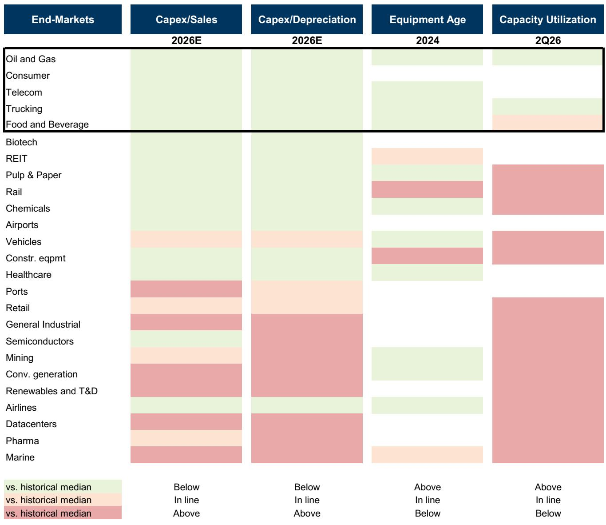

stacked bar chart

| Industry | Capex/Sales 2026E | Capex/Sales Below | Capex/Sales Above | Capex/Depreciation 2026E | Capex/Depreciation Above | Equipment Age 2024 | Equipment Age Below | Equipment Age Above | Equipment Age In line | Equipment Age Below | Capacity Utilization 2Q26 |
| --- | --- | --- | --- | --- | --- | --- | --- | --- | --- | --- | --- |
| Oil and Gas |  |  |  |  |  |  |  |  |  |  |  |
| Consumer |  |  |  |  |  |  |  |  |  |  |  |
| Telecom |  |  |  |  |  |  |  |  |  |  |  |
| Trucking |  |  |  |  |  |  |  |  |  |  |  |
| Food and Beverage |  |  |  |  |  |  |  |  |  |  |  |
| Biotech |  |  |  |  |  |  |  |  |  |  |  |

Ranking based on sum of the metrics (Green=3; Orange=2; Red=1); Equipment age data is sourced from the US Bureau of Economic Analysis (BEA) and is available through 2024

Source: GS Global Investment Research, US Bureau of Economic Analysis (BEA)

Exhibit 3: We see Renewables, Transmission, Datacenters and Semiconductors as structural growth areas  
GS Capex Tracker by end market  
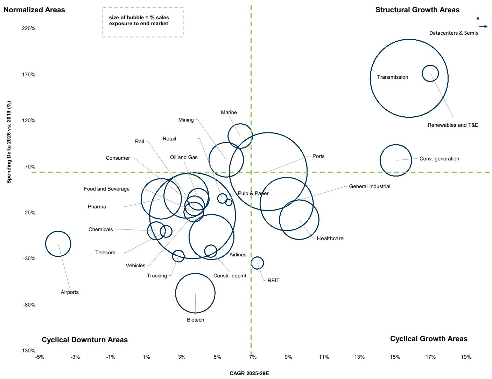

bubble chart

| Sector | Normalized Area | CAGR 2025-29E | Spending Delta 2026 vs. 2019 (%) |
|--------|-----------------|---------------|----------------------------------|
| Airports | Cyclical Downturn | -4% | -30% |
| Telecom | Cyclical Downturn | 1% | -25% |
| Chemicals | Cyclical Downturn | 2% | -20% |
| Pharmaceuticals | Cyclical Downturn | 3% | -15% |
| Food and Beverage | Cyclical Downturn | 4% | -10% |
| Pharmaceuticals | Cyclical Downturn | 5% | -5% |
| Automobiles | Cyclical Downturn | 6% | -10% |
| Vehicles | Cyclical Downturn | 7% | -15% |
| Trucking | Cyclical Downturn | 8% | -20% |
| Airlines | Cyclical Downturn | 9% | -25% |
| Biotech | Cyclical Downturn | 10% | -30% |
| Pulp & Paper | Cyclical Downturn | 11% | -35% |
| General Industrial | Cyclical Downturn | 12% | -40% |
| Healthcare | Cyclical Downturn | 13% | -45% |
| Pulp & Paper | Cyclical Downturn | 14% | -50% |
| Oil and Gas | Cyclical Downturn | 15% | -55% |
| Consumer | Cyclical Downturn | 16% | -60% |
| Rail | Cyclical Downturn | 17% | -65% |
| Retail | Cyclical Downturn | 18% | -70% |
| Mining | Cyclical Downturn | 19% | -75% |
| Marine | Cyclical Downturn | 20% | -80% |
| Ports | Cyclical Downturn | 21% | -85% |
| General Industrial | Cyclical Growth Areas | 13%–19% | -30%–70% |
| Datacenters & Semis | Structural Growth Areas | ~17%–19% | ~170%-220%, scaled by 100%. Bubble size indicates bubble size relative to end-market.

Source: Company data, Bloomberg, GS Global Investment Research

## Exhibit 4: We see a favorable capex environment in the medium term in Tech (Datacenters – Buy Schneider) and Utilities (Power grids– Buy Prysmian, Nexans)

Europe Multi-Industry Capex exposure

European Multi-Industry - Capex exposure  
We assess the European Multi-Industry coverage for how each company fits into our capex tracker. We rank the companies by their % of sales to each end market and the CAGR of the respective capex tracker

<table><tr><td>&lt;3% CAGR</td><td>3-5% CAGR</td><td>5-8% CAGR</td><td>&gt;8% CAGR</td></tr><tr><td></td><td colspan="3">End maket and top 5 exposed names (as a % of sales (CAGR 2025-29E)</td></tr><tr><td>Trucking (2.8%)</td><td>Airlines (4.7%)</td><td>Ports (7.9%)</td><td>Datacenters (34.5%)</td></tr><tr><td>Daimler Truck (100%), Traton (99%), Volvo (73%), Knorr (45%)</td><td>SKF (6%), Sandvik (3%)</td><td>Konecranes (28%)</td><td>Schneider (24%), Legrand (20%), Carel (18%), Halma (15%), ABB (6%), Prysmian (6%)</td></tr><tr><td>Telecom (2.1%)</td><td>Construction Equipment (4.6%)</td><td>REIT (7.2%)</td><td>Semiconductors (23.1%)</td></tr><tr><td>Prysmian (9%), Rexel (4%), NKT (2%)</td><td>Volvo (17%), CNHI (16%)</td><td>Assa Abloy (100%), Geberit (100%), Kone (100%), Schindler (100%), Legrand (80%), Signify (88%), Nexans (34%)</td><td>VAT (67%), Atlas Copco (16%), Smiths Group (4%), Siemens AG (3%), NIBE (3%)</td></tr><tr><td>Pharma (1.8%)</td><td>Oil &amp; Gas (3.8%)</td><td>Marine (6.3%)</td><td>Renewables and T&amp;D (17%)</td></tr><tr><td>Siemens (5%), Alfa Laval (4%), ABB (2%)</td><td>Smiths Group (21%), IMI (16%), Accelleron (10%), Alfa Laval (7%), Schneider Electric (7%)</td><td>Accelleron (57%), Wartsila (47%), Alfa laval (33%)</td><td>Nexans (41%), NKT (84%), Prysmian (43%), Schneider Electric (13%)</td></tr><tr><td>Chemicals (1.6%)</td><td>Consumer (3.7%), F&amp;B (3.7%)</td><td>Biotech (6.1%)</td><td>Conv. Generation (15%)</td></tr><tr><td>Atlas Copco (8%), ABB (6%), Alfa Laval (6%)</td><td>Ariston (85%), NIBE (78%), Alfa Laval (39%), Carel (29%)</td><td>Alfa Laval (3%)</td><td>Accelleron (30%), Wartsilla (29%), IMI (8%), Halma (7%), Konecranes (4%)</td></tr><tr><td>Airports (-4%)</td><td>Vehicles (3.6%)</td><td>Pulp &amp; Paper (5.6%)</td><td>Healthcare (9.6%)</td></tr><tr><td></td><td>SKF (20%), GVS (15%), Atlas (10%), Sandvik (6%), Siemens (6%), ABB (4%)</td><td>Konecranes (4%)</td><td>GVS (67%), Siemens (33%), Halma (25%)</td></tr><tr><td></td><td>Rail (3.2%)</td><td>Mining (5.5%)</td><td>General Industrial (8.9%)</td></tr><tr><td></td><td>Alstom (100%), Knorr (55%), Siemens (13%), SKF (6%), Accelleron (3%)</td><td>FLSmidth (100%), Epiroc (78%), Weir (77%), Metso (75%), Sandvik (51%)</td><td>SKF (47%), Atlas Copco (39%), IMI (31%), Sandvik (30%), Schneider Electric (23%)</td></tr><tr><td></td><td></td><td>Retail (5.3%)</td><td></td></tr><tr><td></td><td></td><td>Ariston (85%), NIBE (78%), Carel (29%)</td><td></td></tr></table>

Source: Company data, GS Global Investment Research

Exhibit 5: We expect 2026 capex to be well above the historical trend growth  
GS General Industrial Capex Tracker (4k companies, €3.1tn worth of capex)  
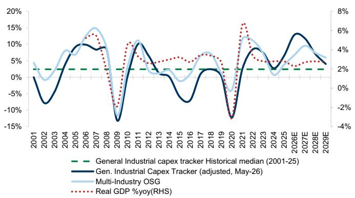

line chart

| Year | General Industrial Capex Tracker Historical median (2001-25) | Gen. Industrial Capex Tracker (adjusted, May-26) | Multi-Industry OSG | Real GDP %yoy(RHS) |
|------|---------------------------------------------------------------|-----------------------------------------------|-------------------|--------------------|
| 2001 | 3%                                                            | -5%                                           | 5%                | 2%                 |
| 2002 | 3%                                                            | -10%                                          | 0%                | 2%                 |
| 2003 | 3%                                                            | -5%                                           | 5%                | 2%                 |
| 2004 | 3%                                                            | 0%                                            | 10%               | 2%                 |
| 2005 | 3%                                                            | 5%                                            | 15%               | 2%                 |
| 2006 | 3%                                                            | 10%                                           | 15%               | 2%                 |
| 2007 | 3%                                                            | 15%                                           | 15%               | 2%                 |
| 2008 | 3%                                                            | -15%                                          | 0%                | -2%                |
| 2009 | 3%                                                            | -15%                                          | -15%              | -4%                |
| 2010 | 3%                                                            | -15%                                          | -15%              | -4%                |
| 2011 | 3%                                                            | -15%                                          | -15%              | -4%                |
| 2012 | 3%                                                            | -15%                                          | -15%              | -4%                |
| 2013 | 3%                                                            | -15%                                          | -15%              | -4%                |
| 2014 | 3%                                                            | -15%                                          | -15%              | -4%                |
| 2015 | 3%                                                            | -15%                                          | -15%              | -4%                |
| 2016 | 3%                                                            | -15%                                          | -15%              | -4%                |
| 2017 | 3%                                                            | -15%                                          | -15%              | -4%                |
| 2018 | 3%                                                            | -15%                                          | -15%              | -4%                |
| 2019 | 3%                                                            | -15%                                          | -15%              | -4%                |
| 2020 | 3%                                                            | -15%                                          | -15%              | -4%                |
| 2021 | 3%                                                            | -15%                                          | -15%              | -4%                |
| 2022 | 3%                                                            | -15%                                          | -15%              | -4%                |
| 2023 | 3%                                                            | -15%                                          | -15%              | -4%                |
| 2024E| 3%                                                            | -15%                                          | -15%              | -4%                |
| 2025E| 3%                                                            | -15%                                          | -15%              | -4%                |
| 2026E| 3%                                                            | -15%                                          | -15%              | -4%                |
| 2027E| 3%                                                            | -15%                                          | -15%              | -4%                |
| 2028E| 3%                                                            | -15%                                          | -15%              | -4%                |
| 2029E| 3%                                                            | -15%                                          | -15%              | -4%                |

Source: Company data, Bloomberg, GS Global Investment Research

Exhibit 6: US utilisation trends stronger, while Europe stays flat and China declines  
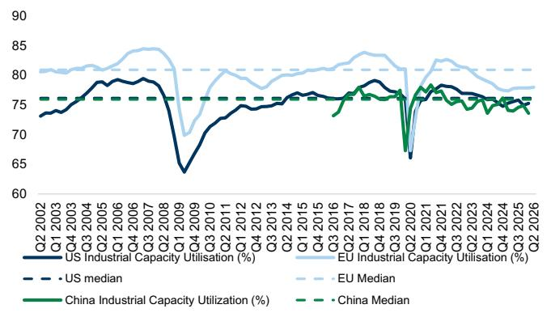

line chart

| Quarter | US Industrial Capacity Utilisation (%) | EU Industrial Capacity Utilisation (%) | US Median | EU Median | China Industrial Capacity Utilisation (%) | China Median |
| --- | --- | --- | --- | --- | --- | --- |
| Q2 2002 | 73.5 | 80.5 | 73.0 | 80.0 | 75.0 | 75.0 |
| Q1 2003 | 74.0 | 80.5 | 73.5 | 80.0 | 75.0 | 75.0 |
| Q4 2003 | 75.0 | 81.0 | 74.0 | 80.0 | 75.0 | 75.0 |
| Q1 2004 | 76.0 | 81.5 | 74.5 | 80.0 | 75.0 | 75.0 |
| Q2 2004 | 77.0 | 82.0 | 75.0 | 80.0 | 75.0 | 75.0 |
| Q3 2004 | 78.0 | 82.5 | 75.5 | 80.0 | 75.0 | 75.0 |
| Q4 2004 | 79.0 | 83.0 | 76.0 | 80.0 | 75.0 | 75.0 |
| Q1 2005 | 80.0 | 83.5 | 76.5 | 80.0 | 75.0 | 75.0 |
| Q2 2005 | 81.0 | 84.0 | 77.0 | 80.0 | 75.0 | 75.0 |
| Q3 2005 | 82.0 | 84.5 | 77.5 | 80.0 | 75.0 | 75.0 |
| Q4 2005 | 83.0 | 85.0 | 78.0 | 80.0 | 75.0 | 75.0 |
| Q1 2006 | 84.0 | 85.5 | 78.5 | 80.0 | 75.0 | 75.0 |
| Q2 2006 | 85.0 | 86.0 | 79.0 | 80.0 | 75.0 | 75.0 |
| Q3 2006 | 86.0 | 86.5 | 79.5 | 80.0 | 75.0 | 75.0 |
| Q4 2006 | 87.0 | 87.5 | 80.0 | 80.0 | 75.0 | 75.0 |
| Q1 2007 | 88.0 | 88.5 | 80.5 | 80.0 | 75.0 | 75.0 |
| Q2 2007 | 89.0 | 89.5 | 81.0 | 80.0 | 75.0 | 75.0 |
| Q3 2007 | 90.0 | 90.5 | 81.5 | 80.0 | 75.0 | 75.0 |
| Q4 2007 | 91.0 | 91.5 | 82.0 | 80.0 | 75.0 | 75.0 |
| Q1 2008 | 92.0 | 92.5 | 82.5 | 80.0 | 75.0 | 75.0 |
| Q2 2008 | 93.0 | 93.5 | 83.0 | 80.0 | 75.0 | 75.0 |
| Q3 2008 | 94.0 | 94.5 | 83.5 | 80.0 | 75.0 | 75.0 |
| Q4 2008 | 95.0 | 95.5 | 84.0 | 80.0 | 75.0 | 75.0 |
| Q1 2009 | 96.0 | 96.5 | 84.5 | 80.0 | 75.0 | 75.0 |
| Q2 2009 | 97.0 | 97.5 | 85.0 | 80.0 | 75.0 | 75.0 |
| Q3 2009 | 98.0 | 98.5 | 85.5 | 80.0 | 75.0 | 75.0 |
| Q4 2009 | 99.0 | 99.5 | 86.0 | 80.0 | 75.0 | 75.0 |
| Q1 2010 | 100.0 | 101.5 | 86.5 | 81.3 | - | - |
| Q2 2011 | - | - | - | - | - | - |
| Q3 2011 | - | - | - | - | - | - |
| Q4 2011 | - | - | - | - | - | - |
| Q1 2011* | - | - | - | - | - | - |
| Q2* | - | - | - | - | - | - |
| Q3* | - | - | - | - | - | - |
| Q4* | - | - | - | - | - | - |
| Q1* | - | - | - | - | - | - |
| Q2* | - | - | - | - | - | - |
| Q3* | - | - | - | - | - | - |
| Q4* | - | - | - | - | - | - |

Source: US Federal Reserve Bank, Eurostat, China NBS

Exhibit 7: Our economists forecast better industrial production levels in 2026/27 than 2025  
GDP and IP forecasts

<table><tr><td>Real GDP (yoy % chg)</td><td>2021</td><td>2022</td><td>2023</td><td>2024</td><td>2025</td><td>2026E</td><td>2027E</td><td>2028E</td><td>2029E</td></tr><tr><td>Europe</td><td>6.3%</td><td>3.7%</td><td>0.5%</td><td>0.9%</td><td>1.5%</td><td>0.3%</td><td>0.9%</td><td>1.3%</td><td>0.9%</td></tr><tr><td>US</td><td>6.2%</td><td>2.5%</td><td>2.9%</td><td>2.8%</td><td>2.1%</td><td>2.0%</td><td>2.0%</td><td>2.2%</td><td>2.3%</td></tr><tr><td>Japan</td><td>3.6%</td><td>1.3%</td><td>0.7%</td><td>-0.2%</td><td>1.1%</td><td>0.5%</td><td>1.0%</td><td>1.1%</td><td>1.0%</td></tr><tr><td>Asia</td><td>7.1%</td><td>3.4%</td><td>4.4%</td><td>4.4%</td><td>4.6%</td><td>4.4%</td><td>4.2%</td><td>4.2%</td><td>4.0%</td></tr><tr><td>World</td><td>6.6%</td><td>3.4%</td><td>2.8%</td><td>2.8%</td><td>2.8%</td><td>2.3%</td><td>2.7%</td><td>2.8%</td><td>2.7%</td></tr><tr><td>Developed Markets</td><td>6.1%</td><td>3.0%</td><td>1.8%</td><td>1.9%</td><td>1.8%</td><td>1.3%</td><td>1.6%</td><td>1.9%</td><td>1.7%</td></tr><tr><td>Emerging Markets</td><td>7.5%</td><td>3.8%</td><td>4.2%</td><td>4.2%</td><td>4.2%</td><td>3.7%</td><td>4.0%</td><td>4.0%</td><td>4.0%</td></tr><tr><td>BRICS</td><td>8.2%</td><td>3.2%</td><td>5.2%</td><td>5.0%</td><td>4.7%</td><td>4.3%</td><td>4.4%</td><td>4.4%</td><td>4.3%</td></tr><tr><td>Brazil</td><td>4.8%</td><td>3.0%</td><td>3.2%</td><td>3.4%</td><td>2.3%</td><td>2.2%</td><td>1.8%</td><td>2.3%</td><td>2.5%</td></tr><tr><td>India</td><td>9.4%</td><td>7.0%</td><td>6.8%</td><td>7.2%</td><td>7.5%</td><td>6.5%</td><td>7.1%</td><td>6.9%</td><td>6.8%</td></tr><tr><td>China</td><td>8.6%</td><td>3.1%</td><td>5.4%</td><td>5.0%</td><td>4.7%</td><td>4.3%</td><td>4.4%</td><td>4.4%</td><td>4.3%</td></tr></table>

<table><tr><td>Industrial Production (yoy % chg)</td><td>2021</td><td>2022</td><td>2023</td><td>2024</td><td>2025</td><td>2026E</td><td>2027E</td><td>2028E</td><td>2029E</td></tr><tr><td>Europe</td><td>10.7%</td><td>6.4%</td><td>-2.2%</td><td>-0.6%</td><td>1.0%</td><td>2.1%</td><td>3.9%</td><td>4.3%</td><td>4.3%</td></tr><tr><td>US</td><td>4.4%</td><td>1.7%</td><td>-0.2%</td><td>-0.6%</td><td>1.1%</td><td>3.2%</td><td>3.7%</td><td>3.2%</td><td>3.1%</td></tr><tr><td>Japan</td><td>5.8%</td><td>-0.1%</td><td>-1.2%</td><td>-2.6%</td><td>-0.3%</td><td>0.3%</td><td>0.9%</td><td>2.3%</td><td>2.8%</td></tr><tr><td>Asia</td><td>9.6%</td><td>2.9%</td><td>2.6%</td><td>4.3%</td><td>5.0%</td><td>4.5%</td><td>4.3%</td><td>4.0%</td><td>3.7%</td></tr><tr><td>World</td><td>7.5%</td><td>2.5%</td><td>1.1%</td><td>1.8%</td><td>3.1%</td><td>3.8%</td><td>4.0%</td><td>3.7%</td><td>3.5%</td></tr><tr><td>Developed Markets</td><td>4.8%</td><td>1.5%</td><td>-0.4%</td><td>-0.9%</td><td>1.1%</td><td>3.2%</td><td>3.4%</td><td>3.1%</td><td>3.0%</td></tr><tr><td>Emerging Markets</td><td>10.4%</td><td>3.7%</td><td>2.9%</td><td>4.7%</td><td>5.2%</td><td>4.4%</td><td>4.6%</td><td>4.2%</td><td>3.9%</td></tr><tr><td>BRICS</td><td>10.3%</td><td>3.7%</td><td>4.6%</td><td>5.4%</td><td>5.4%</td><td>4.9%</td><td>4.9%</td><td>4.6%</td><td>4.1%</td></tr><tr><td>India</td><td>12.7%</td><td>4.6%</td><td>5.8%</td><td>4.4%</td><td>3.9%</td><td>4.3%</td><td>5.1%</td><td>5.2%</td><td>5.3%</td></tr><tr><td>China</td><td>9.6%</td><td>3.6%</td><td>4.6%</td><td>5.8%</td><td>5.9%</td><td>5.1%</td><td>5.2%</td><td>4.7%</td><td>4.0%</td></tr></table>

Source: GS Global Investment Research

Exhibit 8: We see a concentration of growth in a small number of areas all related to datacenters, semis and utilities, now representing c.39% of total capex...  
End-market size implied by our Capex Tracker, 2026  
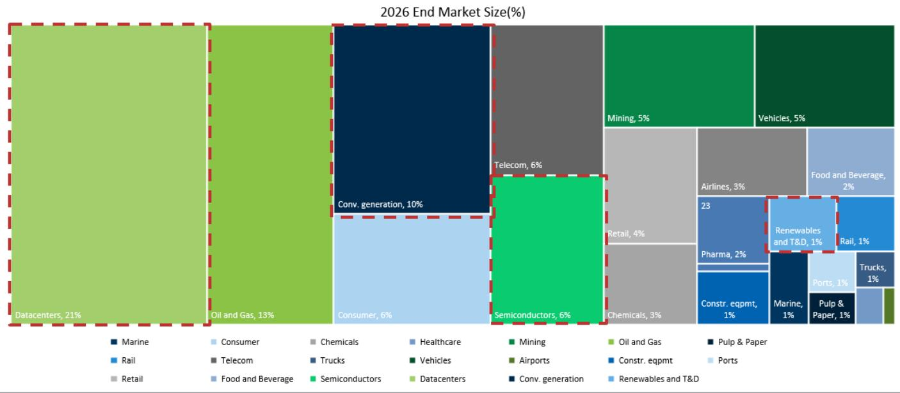

treemap chart

| Sector | Percentage |
| --- | --- |
| Datacenters | 21% |
| Oil and Gas | 13% |
| Consumer | 6% |
| Conv. generation | 10% |
| Telecom | 6% |
| Semiconductors | 6% |
| Mining | 5% |
| Vehicles | 5% |
| Food and Beverage | 2% |
| Airlines | 3% |
| Pharmaceuticals | 2% |
| Retail | 4% |
| Chemicals | 3% |
| Pharmaceuticals | 23 |
| Construction eqpmt | 1% |
| Renewables and T&D | 1% |
| Rail | 1% |
| Ports | 1% |
| Pulp & Paper | 1% |
| Datacenters | 21% |
| Oil and Gas | 13% |
| Consumer | 6% |
| Chemicals | 3% |
| Pharmaceuticals | 23 |
| Retail | 4% |
| Chemicals | 3% |
| Airports | 1% |
| Construction eqpmt | 1% |
| Pulp & Paper | 1% |
| Pulp & Paper | 1% |
| Datacenters | 21% |
| Oil and Gas | 13% |
| Consumer | 6% |
| Chemicals | 3% |
| Pharmaceuticals | 23 |
| Retail | 4% |
| Chemicals | 3% |
| Airports | 1% |
| Construction eqpmt | 1% |
| Pulp & Paper | 1% |

Source: Company data, GS Global Investment Research, Bloomberg

Exhibit 9: ....versus only 22% just 4 years ago  
End-Market Size implied by our Capex Tracker, 2022  
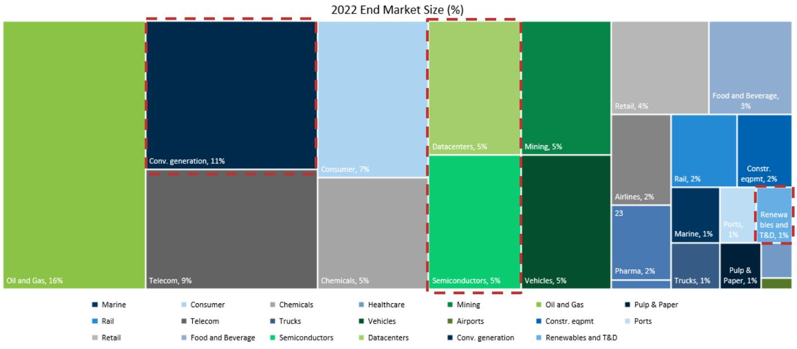

treemap chart

| Industry | Percentage |
| --- | --- |
| Oil and Gas | 16% |
| Conv. generation | 11% |
| Telecom | 9% |
| Consumer | 7% |
| Chemicals | 5% |
| Datacenters | 5% |
| Mining | 5% |
| Vehicles | 5% |
| Retail | 4% |
| Food and Beverage | 3% |
| Pulp & Paper | 2% |
| Rail | 2% |
| Airlines | 2% |
| Pharmaceuticals | 2% |
| Airports | 1% |
| Construction eqpmt | 1% |
| Ports | 1% |
| Renewable T&D | 1% |
| Pulp & Paper | 1% |
| Pharmaceuticals | 1% |
| Datacenters | 1% |
| Retail | 1% |
| Pharmaceuticals | 1% |
| Airports | 1% |
| Construction eqpmt | 1% |
| Ports | 1% |
| Renewable T&D | 1% |
| Pulp & Paper | 1% |
| Pharmaceuticals | 1% |
| Airports | 1% |
| Construction eqpmt | 1% |
| Ports | 1% |
| Renewable T&D | 1% |
| Pulp & Paper | 1% |
| Pharmaceuticals | 1% |
| Airports | 1% |
| Construction eqpmt | 1% |

Source: Company data, GS Global Investment Research, Bloomberg

## GS Capex Tracker by End Market

## A reminder of what our Capex Tracker offers...

CAPEX TRACKER (for full details, please see our deep dive in GS Capex Tracker: Light at the end of the capex tunnel, October 30, 2017).

We conduct bottom-up analysis of capex expectations for c.4k companies across 34 end markets (including sub sectors) - c.60% of our multi-industry coverage top line (ex-construction tracker).  
- Our analysis covers €3.4 tn of capex in 2026E.  
We look at the fundamentals of investment by end market: Physical need (capacity utilization, age of equipment, replacement demand); availability of funds to finance investment internally and externally (leverage, cash generation).  
We conduct in-depth analysis of the nuances in each end market (e.g., technology shifts, regional trends, regulatory drivers), near-term developments and company read-across (including top-line correlation).  
We adjust the capex trackers by accounting for the biases in capex estimates by consensus observed over the past c.20 years. We achieve this by looking at how estimates changed with respect to the actual reported numbers throughout the year in up, down and through cycles. We then apply the adjustment factor to the current capex estimates to arrive at the adjusted capex tracker.

## Exhibit 10: We continue to see capex growth in 2026/27 at historical highs

GS General Industrial Capex Tracker (c.4k companies, €3.4 tn of capex in 2026) (adjusted Throughcycle)\*

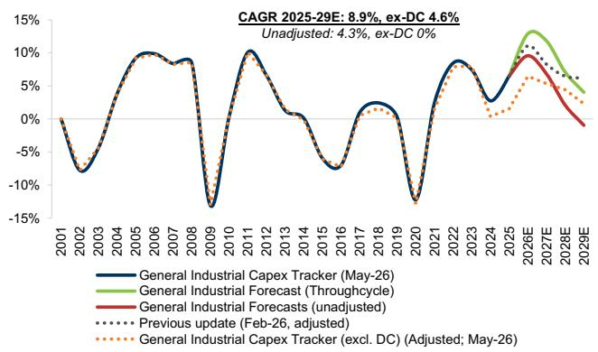

line chart

| Year | General Industrial Capex Tracker (May-26) | General Industrial Forecast (Throughcycle) | General Industrial Forecasts (unadjusted) | Previous update (Feb-26, adjusted) | General Industrial Capex Tracker (excl. DC) (Adjusted; May-26) |
|------|-------------------------------------------|---------------------------------------------|------------------------------------------|-------------------------------------|---------------------------------------------------------------|
| 2001 | 0%                                        | 0%                                          | 0%                                       | 0%                                  | 0%                                                            |
| 2002 | -8%                                       | -8%                                         | -8%                                      | -8%                                 | -8%                                                           |
| 2003 | -10%                                      | -10%                                        | -10%                                     | -10%                                | -10%                                                          |
| 2004 | 10%                                       | 10%                                         | 10%                                      | 10%                                 | 10%                                                           |
| 2005 | 10%                                       | 10%                                         | 10%                                      | 10%                                 | 10%                                                           |
| 2006 | 10%                                       | 10%                                         | 10%                                      | 10%                                 | 10%                                                           |
| 2007 | 10%                                       | 10%                                         | 10%                                      | 10%                                 | 10%                                                           |
| 2008 | 10%                                       | 10%                                         | 10%                                      | 10%                                 | 10%                                                           |
| 2009 | -15%                                      | -15%                                        | -15%                                     | -15%                                | -15%                                                          |
| 2010 | -15%                                      | -15%                                        | -15%                                     | -15%                                | -15%                                                          |
| 2011 | 10%                                       | 10%                                         | 10%                                      | 10%                                 | 10%                                                           |
| 2012 | 10%                                       | 10%                                         | 10%                                      | 10%                                 | 10%                                                           |
| 2013 | 0%                                        | 0%                                          | 0%                                       | 0%                                  | 0%                                                            |
| 2014 | -5%                                       | -5%                                         | -5%                                      | -5%                                 | -5%                                                           |
| 2015 | -8%                                       | -8%                                         | -8%                                      | -8%                                 | -8%                                                           |
| 2016 | -5%                                       | -5%                                         | -5%                                      | -5%                                 | -5%                                                           |
| 2017 | 2%                                        | 2%                                          | 2%                                       | 2%                                  | 2%                                                            |
| 2018 | 2%                                        | 2%                                          | 2%                                       | 2%                                  | 2%                                                            |
| 2019 | -15%                                      | -15%                                        | -15%                                     | -15%                                | -15%                                                          |
| 2020 | -15%                                      | -15%                                        | -15%                                     | -15%                                | -15%                                                          |
| 2021E| 8%                                        | 8%                                          | 8%                                       | 8%                                  | 8%                                                            |
| 2022E| 8%                                        | 8%                                          | 8%                                       | 8%                                  | 8%                                                            |
| 2023E| 4%                                        | 4%                                          | 4%                                       | 4%                                  | 4%                                                            |
| 2024E| 4%                                        | 4%                                          | 4%                                       | 4%                                  | 4%                                                            |
| 2025E| 6.7E+46                  | 6.7E+46                    | 6.7E+46                  | 6.7E+46                             | 6.7E+46                                                       |
| 2026E| 8.9E+46                  | 8.9E+46                    | 8.9E+46                  | 8.9E+46                             | 8.9E+46                                                       |
| 2027E| 6.7E+46                  | 6.7E+46                    | 6.7E+46                  | 6.7E+46                             | 6.7E+46                                                       |
| 2028E| 4.3E+46                  | 4.3E+46                    | 4.3E+46                  | 4.3E+46                             | 4.3E+46                                                       |
| 2029E| 2.3E+46                  | 2.3E+46                    | 2.3E+46                  | 2.3E+46                             | 2.3E+46                                                       |
The chart displays a line graph with five data series: General Industrial Capex Tracker (May-26), General Industrial Forecast (Throughcycle), General Industrial Forecasts (unadjusted), Previous update (Feb-26, adjusted), and General Industrial Capex Tracker (excl. DC) (Adjusted; May-26). The y-axis represents percentage change from baseline (from -15% to +15%), and the x-axis represents years from 2001 to 2029E. The CAGR is calculated as a compound of two years: CAGR=8.9%, with an adjusted value of +4.3%. The chart is saved as a PNG file named 'general_bar_chart.png'.

\*O&G/Mining/LNG adjustment: Upcycle  
Source: Company data, Bloomberg, GS Global Investment Research

## Exhibit 12: General Industrial Capex/Depreciation remains above median levels in 2026

General Industrial Capex/Depreciation

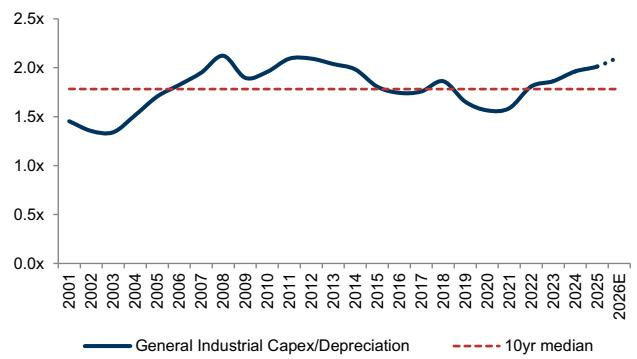

line chart

| Year | General Industrial Capex/Depreciation |
|------|----------------------------------------|
| 2001 | 1.4x                                   |
| 2002 | 1.3x                                   |
| 2003 | 1.4x                                   |
| 2004 | 1.5x                                   |
| 2005 | 1.7x                                   |
| 2006 | 1.8x                                   |
| 2007 | 1.9x                                   |
| 2008 | 2.1x                                   |
| 2009 | 1.9x                                   |
| 2010 | 2.0x                                   |
| 2011 | 2.1x                                   |
| 2012 | 2.1x                                   |
| 2013 | 2.0x                                   |
| 2014 | 1.9x                                   |
| 2015 | 1.8x                                   |
| 2016 | 1.7x                                   |
| 2017 | 1.8x                                   |
| 2018 | 1.9x                                   |
| 2019 | 1.8x                                   |
| 2020 | 1.7x                                   |
| 2021 | 1.6x                                   |
| 2022 | 1.7x                                   |
| 2023 | 1.8x                                   |
| 2024 | 1.9x                                   |
| 2025 | 2.0x                                   |
| 2026E| 2.1x                                   |

Source: Company data, Bloomberg, GS Global Investment Research

## Exhibit 11: General Industrial Capex/Sales remains slightly above median levels in 2026

General Industrial Capex/Sales

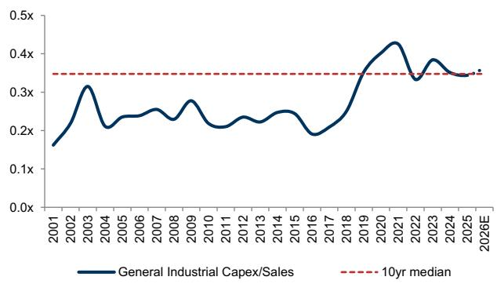

line chart

| Year | General Industrial Capex/Sales |
|------|--------------------------------|
| 2001 | 0.17x                          |
| 2002 | 0.25x                          |
| 2003 | 0.32x                          |
| 2004 | 0.21x                          |
| 2005 | 0.24x                          |
| 2006 | 0.25x                          |
| 2007 | 0.26x                          |
| 2008 | 0.24x                          |
| 2009 | 0.28x                          |
| 2010 | 0.23x                          |
| 2011 | 0.21x                          |
| 2012 | 0.23x                          |
| 2013 | 0.24x                          |
| 2014 | 0.25x                          |
| 2015 | 0.24x                          |
| 2016 | 0.19x                          |
| 2017 | 0.21x                          |
| 2018 | 0.25x                          |
| 2019 | 0.35x                          |
| 2020 | 0.41x                          |
| 2021 | 0.44x                          |
| 2022 | 0.34x                          |
| 2023 | 0.38x                          |
| 2024 | 0.36x                          |
| 2025 | 0.35x                          |
| 2026E| 0.35x                          |

Source: Company data, Bloomberg, GS Global Investment Research

## Exhibit 13: We expect 2026 to end 13% above the historical peak (2025)

GS General Industrial Capex Tracker (indexed)

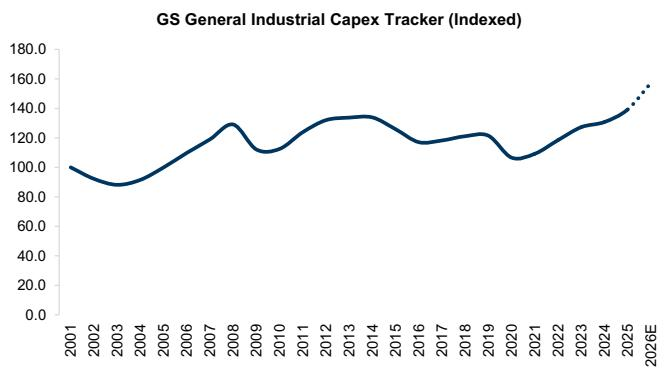

line chart

| Year | Value |
|------|-------|
| 2001 | 100.0 |
| 2002 | 95.0  |
| 2003 | 90.0  |
| 2004 | 95.0  |
| 2005 | 105.0 |
| 2006 | 115.0 |
| 2007 | 125.0 |
| 2008 | 130.0 |
| 2009 | 115.0 |
| 2010 | 120.0 |
| 2011 | 125.0 |
| 2012 | 130.0 |
| 2013 | 135.0 |
| 2014 | 135.0 |
| 2015 | 130.0 |
| 2016 | 125.0 |
| 2017 | 125.0 |
| 2018 | 125.0 |
| 2019 | 125.0 |
| 2020 | 115.0 |
| 2021 | 125.0 |
| 2022 | 135.0 |
| 2023 | 145.0 |
| 2024 | 155.0 |
| 2025 | 165.0 |
| 2026E| 175.0 |

Source: Company data, Bloomberg, GS Global Investment Research

Exhibit 14: Manufacturing capacity utilization slightly below history in EU and China  
Average Capacity Utilization (EU, China)  
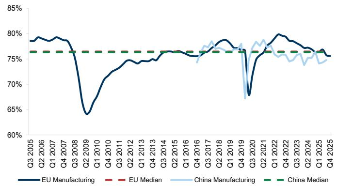

line chart

| Quarter | EU Manufacturing | EU Median | China Manufacturing | China Median |
|---------|------------------|-----------|---------------------|--------------|
| Q3 2005 | 79%              | 77%       | 77%                 | 76%          |
| Q2 2006 | 79%              | 77%       | 77%                 | 76%          |
| Q1 2007 | 79%              | 77%       | 77%                 | 76%          |
| Q4 2007 | 79%              | 77%       | 77%                 | 76%          |
| Q3 2008 | 79%              | 77%       | 77%                 | 76%          |
| Q2 2009 | 64%              | 77%       | 77%                 | 76%          |
| Q1 2010 | 68%              | 77%       | 77%                 | 76%          |
| Q4 2010 | 72%              | 77%       | 77%                 | 76%          |
| Q3 2011 | 74%              | 77%       | 77%                 | 76%          |
| Q2 2012 | 75%              | 77%       | 77%                 | 76%          |
| Q1 2013 | 75%              | 77%       | 77%                 | 76%          |
| Q4 2013 | 75%              | 77%       | 77%                 | 76%          |
| Q3 2014 | 76%              | 77%       | 77%                 | 76%          |
| Q2 2015 | 76%              | 77%       | 77%                 | 76%          |
| Q1 2016 | 76%              | 77%       | 77%                 | 76%          |
| Q4 2016 | 76%              | 77%       | 77%                 | 76%          |
| Q3 2017 | 78%              | 77%       | 78%                 | 76%          |
| Q2 2018 | 79%              | 77%       | 78%                 | 76%          |
| Q1 2019 | 80%              | 77%       | 80%                 | 76%          |
| Q4 2019 | 68%              | 77%       | 68%                 | 76%          |
| Q3 2020 | 80%              | 77%       | 80%                 | 76%          |
| Q2 2021 | 81%              | 77%       | 81%                 | 76%          |
| Q1 2022 | 80%              | 77%       | 80%                 | 76%          |
| Q4 2022 | 80%              | 77%       | 80%                 | 76%          |
| Q3 2023 | 80%              | 77%       | 80%                 | 76%          |
| Q2 2024 | 80%              | 77%       | 80%                 | 76%          |
| Q1 2025 | 80%              | 77%       | 80%                 | 76%          |
| Q4 2025 | 80%              | 77%       | 80%                 | 76%          |

China data till 3Q25  
Source: DG ECFIN, NBS

## Oil & Gas

Exhibit 15: We now expect +4% O&G capex growth from flat previously  
GS Oil & Gas Capex Tracker (255 companies, €450 bn of capex in 2026)  
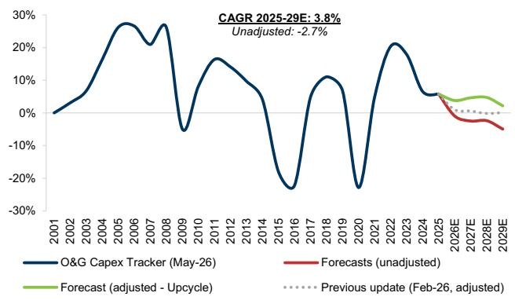

line chart

| Year | O&G Capex Tracker (May-26) | Forecasts (unadjusted) | Forecast (adjusted - Upcycle) | Previous update (Feb-26, adjusted) |
|------|-----------------------------|------------------------|-------------------------------|------------------------------------|
| 2001 | ~0%                         |                        |                               |                                    |
| 2002 | ~5%                         |                        |                               |                                    |
| 2003 | ~10%                        |                        |                               |                                    |
| 2004 | ~15%                        |                        |                               |                                    |
| 2005 | ~25%                        |                        |                               |                                    |
| 2006 | ~28%                        |                        |                               |                                    |
| 2007 | ~25%                        |                        |                               |                                    |
| 2008 | ~28%                        |                        |                               |                                    |
| 2009 | ~-5%                        |                        |                               |                                    |
| 2010 | ~15%                        |                        |                               |                                    |
| 2011 | ~18%                        |                        |                               |                                    |
| 2012 | ~15%                        |                        |                               |                                    |
| 2013 | ~10%                        |                        |                               |                                    |
| 2014 | ~5%                         |                        |                               |                                    |
| 2015 | ~-25%                       |                        |                               |                                    |
| 2016 | ~-30%                       |                        |                               |                                    |
| 2017 | ~10%                        |                        |                               |                                    |
| 2018 | ~12%                        |                        |                               |                                    |
| 2019 | ~10%                        |                        |                               |                                    |
| 2020 | ~-30%                       |                        |                               |                                    |
| 2021 | ~-25%                       |                        |                               |                                    |
| 2022 | ~20%                        |                        |                               |                                    |
| 2023 | ~15%                        |                        |                               |                                    |
| 2024E| ~5%                         |                        |                               |                                    |
| 2025E| ~3%                         |                        |                               |                                    |
| 2026E| ~1%                         |                        |                               |                                    |
| 2027E| ~-1%                        |                        |                               |                                    |
| 2028E| ~-3%                        |                        |                               |                                    |
| 2029E| ~-5%                        |                        |                               |                                    |
| CAGR 2025-29E: 3.8% Unadjusted: -2.7%

Source: Company data, Bloomberg, GS Global Investment Research

Exhibit 16: O&G Capex/Sales is expected to stabilize in 2026, but levels remain below the historical median O&G Capex/Sales  
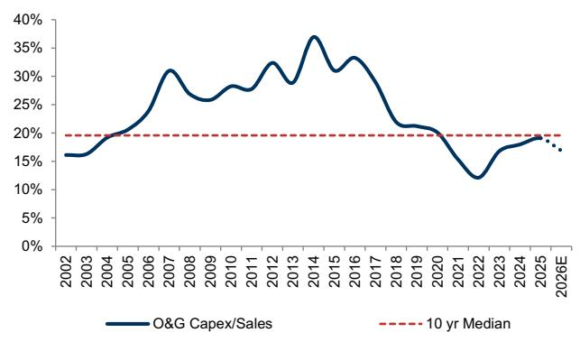

line chart

| Year | O&G Capex/Sales |
|------|-----------------|
| 2002 | 15%             |
| 2003 | 16%             |
| 2004 | 18%             |
| 2005 | 20%             |
| 2006 | 25%             |
| 2007 | 30%             |
| 2008 | 28%             |
| 2009 | 26%             |
| 2010 | 27%             |
| 2011 | 28%             |
| 2012 | 30%             |
| 2013 | 32%             |
| 2014 | 35%             |
| 2015 | 33%             |
| 2016 | 31%             |
| 2017 | 28%             |
| 2018 | 25%             |
| 2019 | 22%             |
| 2020 | 20%             |
| 2021 | 15%             |
| 2022 | 12%             |
| 2023 | 15%             |
| 2024 | 18%             |
| 2025 | 19%             |
| 2026E| 18%             |

Source: Company data, Bloomberg, GS Global Investment Research

Exhibit 17: O&G Capex/Depreciation is likely to remain well below median levels in 2026  
O&G Capex/Depreciation  
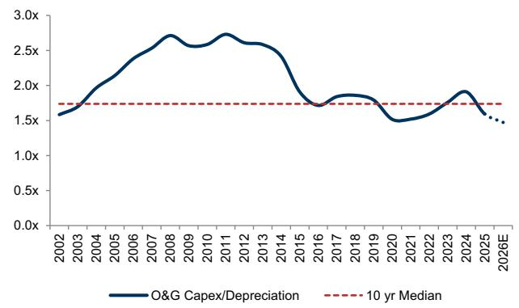

line chart

| Year | O&G Capex/Depreciation |
|------|------------------------|
| 2002 | 1.5x                   |
| 2003 | 1.7x                   |
| 2004 | 1.9x                   |
| 2005 | 2.1x                   |
| 2006 | 2.3x                   |
| 2007 | 2.5x                   |
| 2008 | 2.7x                   |
| 2009 | 2.6x                   |
| 2010 | 2.7x                   |
| 2011 | 2.6x                   |
| 2012 | 2.5x                   |
| 2013 | 2.4x                   |
| 2014 | 2.2x                   |
| 2015 | 1.8x                   |
| 2016 | 1.7x                   |
| 2017 | 1.8x                   |
| 2018 | 1.8x                   |
| 2019 | 1.7x                   |
| 2020 | 1.5x                   |
| 2021 | 1.6x                   |
| 2022 | 1.7x                   |
| 2023 | 1.8x                   |
| 2024 | 1.9x                   |
| 2025 | 1.7x                   |
| 2026E| 1.5x                   |

Source: Company data, Bloomberg, GS Global Investment Research

Exhibit 19: O&G equipment age is at peak levels
Average Age of O&G Equipment (US)  
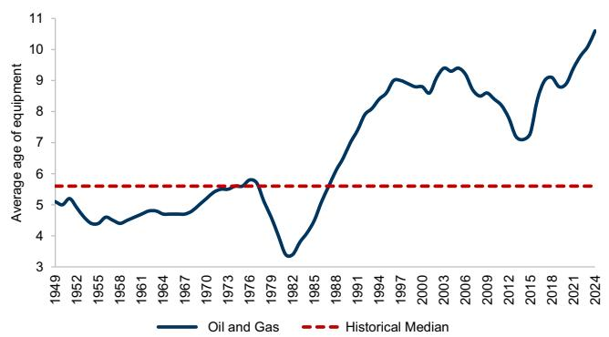

line chart

| Year | Average age of equipment |
| ---- | ------------------------ |
| 1949 | 5.0                      |
| 1952 | 4.5                      |
| 1955 | 4.3                      |
| 1958 | 4.6                      |
| 1961 | 4.7                      |
| 1964 | 4.8                      |
| 1967 | 4.9                      |
| 1970 | 5.2                      |
| 1973 | 5.5                      |
| 1976 | 5.8                      |
| 1979 | 5.0                      |
| 1982 | 3.5                      |
| 1985 | 4.5                      |
| 1988 | 6.0                      |
| 1991 | 7.5                      |
| 1994 | 8.5                      |
| 1997 | 9.0                      |
| 2000 | 8.8                      |
| 2003 | 9.2                      |
| 2006 | 8.5                      |
| 2009 | 8.0                      |
| 2012 | 7.0                      |
| 2015 | 7.5                      |
| 2018 | 8.5                      |
| 2021 | 9.0                      |
| 2024 | 10.5                     |

Source: US Bureau of Economic Analysis

Exhibit 18: We expect 2026 to end 4% above the historical peak (2025)  
GS O&G Capex Tracker (indexed)  
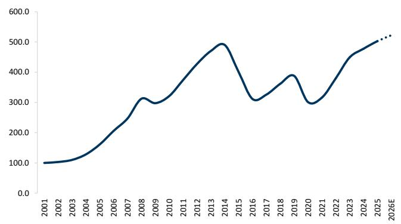

line chart

| Year | Value |
|------|-------|
| 2001 | 100.0 |
| 2002 | 110.0 |
| 2003 | 130.0 |
| 2004 | 160.0 |
| 2005 | 200.0 |
| 2006 | 240.0 |
| 2007 | 280.0 |
| 2008 | 310.0 |
| 2009 | 300.0 |
| 2010 | 330.0 |
| 2011 | 370.0 |
| 2012 | 420.0 |
| 2013 | 470.0 |
| 2014 | 500.0 |
| 2015 | 450.0 |
| 2016 | 310.0 |
| 2017 | 340.0 |
| 2018 | 380.0 |
| 2019 | 410.0 |
| 2020 | 310.0 |
| 2021 | 350.0 |
| 2022 | 410.0 |
| 2023 | 460.0 |
| 2024 | 490.0 |
| 2025 | 510.0 |
| 2026E | 530.0 |

Source: Company data, Bloomberg, GS Global Investment Research

Exhibit 20: O&G capacity utilization is slightly higher than median levels in US/EU and China  
Average Capacity Utilization (US, EU, China)  
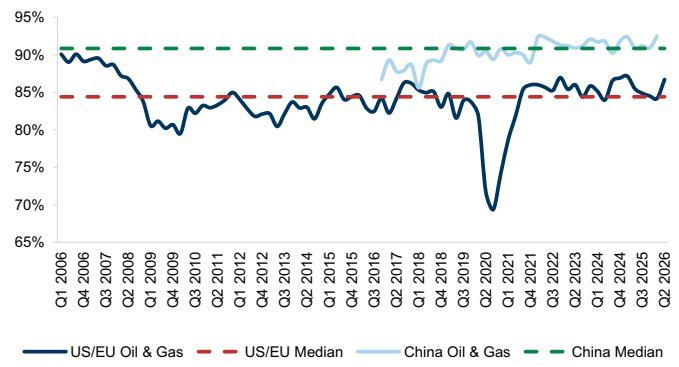

line chart

| Quarter | US/EU Oil & Gas | US/EU Median | China Oil & Gas | China Median |
|---------|-----------------|--------------|-----------------|--------------|
| Q1 2006 | 90%             | 85%          | 90%             | 90%          |
| Q4 2006 | 88%             | 85%          | 90%             | 90%          |
| Q3 2007 | 86%             | 85%          | 90%             | 90%          |
| Q2 2008 | 84%             | 85%          | 90%             | 90%          |
| Q1 2009 | 82%             | 85%          | 90%             | 90%          |
| Q4 2009 | 80%             | 85%          | 90%             | 90%          |
| Q3 2010 | 78%             | 85%          | 90%             | 90%          |
| Q2 2011 | 76%             | 85%          | 90%             | 90%          |
| Q1 2012 | 74%             | 85%          | 90%             | 90%          |
| Q4 2012 | 72%             | 85%          | 90%             | 90%          |
| Q3 2013 | 70%             | 85%          | 90%             | 90%          |
| Q2 2014 | 68%             | 85%          | 90%             | 90%          |
| Q1 2015 | 66%             | 85%          | 90%             | 90%          |
| Q4 2015 | 64%             | 85%          | 90%             | 90%          |
| Q3 2016 | 62%             | 85%          | 90%             | 90%          |
| Q2 2017 | 60%             | 85%          | 90%             | 90%          |
| Q1 2018 | 58%             | 85%          | 90%             | 90%          |
| Q4 2018 | 56%             | 85%          | 90%             | 90%          |
| Q3 2019 | 54%             | 85%          | 90%             | 90%          |
| Q2 2020 | 52%             | 85%          | 90%             | 90%          |
| Q1 2021 | 50%             | 85%          | 90%             | 90%          |
| Q4 2021 | 48%             | 85%          | 90%             | 90%          |
| Q3 2022 | 46%             | 85%          | 90%             | 90%          |
| Q2 2023 | 44%             | 85%          | 90%             | 90%          |
| Q1 2024 | 42%             | 85%          | 90%             | 90%          |
| Q4 2024 | 40%             | 85%          | 90%             | 90%          |
| Q3 2025 | 38%             | 85%          | 90%             | 90%          |
| Q2 2026 | 36%             | 85%          | 90%             | 90%          |

China data till 1Q26  
Source: Federal Reserve, DG ECFIN, NBS

## Technology

Exhibit 21: We see strong technology capex upgrades into 2026 and outer years  
GS Tech Capex Tracker (177 companies, €984 bn of capex in 2026)  
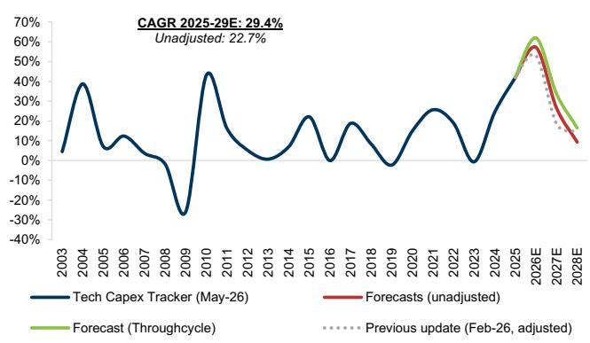

line chart

| Year | Tech Capex Tracker (May-26) | Forecasts (unadjusted) | Forecast (Throughcycle) | Previous update (Feb-26, adjusted) |
| --- | --- | --- | --- | --- |
| 2003 | ~5% | - | - | - |
| 2004 | ~40% | - | - | - |
| 2005 | ~10% | - | - | - |
| 2006 | ~5% | - | - | - |
| 2007 | ~0% | - | - | - |
| 2008 | ~-30% | - | - | - |
| 2009 | ~-35% | - | - | - |
| 2010 | ~45% | - | - | - |
| 2011 | ~15% | - | - | - |
| 2012 | ~5% | - | - | - |
| 2013 | ~0% | - | - | - |
| 2014 | ~5% | - | - | - |
| 2015 | ~25% | - | - | - |
| 2016 | ~5% | - | - | - |
| 2017 | ~15% | - | - | - |
| 2018 | ~5% | - | - | - |
| 2019 | ~0% | - | - | - |
| 2020 | ~5% | - | - | - |
| 2021 | ~15% | - | - | - |
| 2022 | ~5% | - | - | - |
| 2023 | ~0% | - | - | - |
| 2024 | ~5% | - | - | - |
| 2025E | ~45% | ~55% | ~60% | ~55% |
| 2026E | ~60% | ~65% | ~65% | ~60% |
| 2027E | ~45% | ~45% | ~45% | ~45% |
| 2028E | ~35% | ~35% | ~35% | ~35% |
| 2029E | ~30% | ~30% | ~30% | ~30% |
| 2030E | ~25% | ~25% | ~25% | ~25% |
| 2031E | ~20% | ~20% | ~20% | ~20% |
| 2032E | ~15% | ~15% | ~15% | ~15% |
| 2033E | ~10% | ~10% | ~10% | ~10% |
| 2034E | ~5% | ~5% | ~5% | ~5% |
| 2035E | ~0% | ~0% | ~0% | ~0% |
| 2036E | ~-5% | ~-5% | ~-5% | ~-5% |
| 2037E | ~-10% | ~-10% | ~-10% | ~-10% |
| 2038E | ~-15% | ~-15% | ~-15% | ~-15% |
| 2039E | ~-20% | ~-20% | ~-20% | ~-20% |
| 2040E | ~-25% | ~-25% | ~-25% | ~-25% |
| 2041E | ~-30% | ~-30% | ~-30% | ~-30% |
| 2042E | ~-35% | ~-35% | ~-35% | ~-35% |
| 2043E | ~-40% | ~-40% | ~-40% | ~-40% |
| 2044E | ~-45% | ~-45% | ~-45% | ~-45% |
| 2045E | ~-50% | ~-50% | ~-50% | ~-50% |
| 2046E | ~-55% | ~-55% | ~-55% | ~-55% |
| 2047E | ~-60% | ~-60% | ~-60% | ~-60% |
| 2048E | ~-65% | ~-65% | ~-65% | ~-65% |
| 2049E | ~-70% | ~-70% | ~-70% | ~-70% |
| 2050E | ~-75% | ~-75% | ~-75% | ~-75% |
| 2051E | ~-80% | ~-80% | ~-80% | ~-80% |
| 2052E | ~-85% | ~-85% | ~-85% | ~-85% |
| 2053E | ~-90% | ~-90% | ~-90% | ~-90% |
| 2054E | ~-95% | ~-95% | ~-95% | ~-95% |
| 2055E | ~-100% | ~-100% | ~-100% | ~-100% |
| 2056E | ~-105% | ~-105% | ~-105% | ~-105% |
| 2057E | ~-110% | ~-110% | ~-110% | ~-110% |
| 2058E | ~-115% | ~-115% | ~-115% | ~-115% |
| 2059E | ~-120% | ~-120% | ~-120% | ~-120% |
| 2060E | ~-125% | ~-125% | ~-125% | ~-125% |
| 2061E | ~-130% | ~-130% | ~-130% | ~-130% |
| 2062E | ~-135% | ~-135% | ~-135% | ~-135% |
| 2063E | ~-140% | ~-140% | ~-140% | ~-140% |
| 2064E | ~-145% | ~-145% | ~-145% | ~-145% |
| 2065E | ~-150% | ~-150% | ~-150% | ~-150% |
| 2066E | ~-155% | ~-155% | ~-155% | ~-155% |
| 2067E | ~-160% | ~-160% | ~-160% | ~-160% |
| 2068E | ~-165% | ~-165% | ~-165% | ~-165% |
| 2069E | (~1.8)% | (~1.8)% | (~1.8)% | (~1.8)% |
| 2070E | (~3.8)% | (~3.8)% | (~3.8)% | (~3.8)% |
| 2071E | (~6.8)% | (~6.8)% | (~6.8)% | (~6.8)% |
| 2072E | (~9.8)% | (~9.8)% | (~9.8)% | (~9.8)% |
| 2073E | (~13.8)% | (~13.8)% | (~13.8)% | (~13.8)% |
| 2074E | (~17.8)% | (~17.8)% | (~17.8)% | (~17.8)% |
| 2075E | (~21.8)% | (~21.8)% | (~21.8)% | (~21.8)% |
| 2076E | (~26.8)% | (~26.8)% | (~26.8)% | (~26.8)% |
| 2077E | (~31.8)% | (~31.8)% | (~31.8)% | (~31.8)% |
| 2078E | (~36.8)% | (~36.8)% | (~36.8)% | (~36.8)% |
| 2079E | (~41.8)% | (~41.8)% | (~41.8)% | (~41.8)% |
| 2080E | (~46.8)% | (~46.8)% | (~46.8)% | (~46.8)% |
| 2081E | (~49.8)% | (~49.8)% | (~49.8)% | (~49.8)% |
| 2082E | (~49.9)% | (~49.9)% | (~49.9)% | (~49.9)% |
| 2083E | (~49.9)% | (~49.9)% | (~49.9)% | (~49.9)% |
| 2084E | (~49.9)% | (~49.9)% | (~49.9)% | (~49.9)% |
| 2085E | (~49.9)% | (~49.9)% | (~49.9)% | (~49.9)% |
| 2086E | (~49.9)% | (~49.9)% | (~49.9)% | (~49.9)% |
| 2087E | (~49.9)% | (~49.9)% | (~49.9)% | (~49.9)% |
| 2088E | (~49.9)% | (~49.9)% | (~49.9)% | (~49.9)% |
| 2089E | (~49.9)% | (~49.9)% | (~49.9)% | (~49.9)% |
| 2090E | (~49.9)% | (~49.9)% | (~49.9)% | (~49.9)% |
| 2091E | (~49.9)% | (~49.9)% | (~49.9)% | (~49.9)% |
| 2092E | (~49.9)% | (~49.9)% | (~49.9)% | (~49.9)% |
| 2093E | (~49.9)% | (~49.9)% | (~49.9)% | (~49.9)% |
| 2094E | (~49.9)% | (~49.9)% | (~49.9)% | (~49.9)% |
| 2095E | (~49.9)% | (~49.9)% | (~49.9)% | (~49.9)% |
| 2096E | (~49.9)% | (~49.9)% | (~49.9)% | (~49.9)% |
| 2097E | (~49.9)% | (~49.9)% | (~49.9)% | (~49.9)% |

Source: Company data, Bloomberg, GS Global Investment Research

Exhibit 23: Tech Capex/Depreciation is likely to remain above median levels in 2026  
Tech Capex/Depreciation  
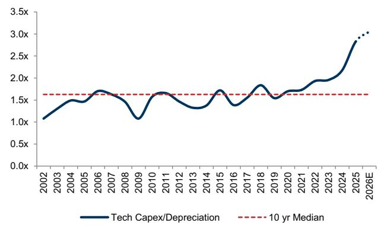

line chart

| Year | Tech Capex/Depreciation |
|------|--------------------------|
| 2002 | 1.0x                     |
| 2003 | 1.2x                     |
| 2004 | 1.4x                     |
| 2005 | 1.5x                     |
| 2006 | 1.7x                     |
| 2007 | 1.6x                     |
| 2008 | 1.4x                     |
| 2009 | 1.1x                     |
| 2010 | 1.6x                     |
| 2011 | 1.7x                     |
| 2012 | 1.5x                     |
| 2013 | 1.4x                     |
| 2014 | 1.6x                     |
| 2015 | 1.7x                     |
| 2016 | 1.4x                     |
| 2017 | 1.5x                     |
| 2018 | 1.8x                     |
| 2019 | 1.6x                     |
| 2020 | 1.7x                     |
| 2021 | 1.8x                     |
| 2022 | 1.9x                     |
| 2023 | 2.0x                     |
| 2024 | 2.2x                     |
| 2025 | 2.8x                     |
| 2026E| 3.0x                     |

Source: Company data, Bloomberg, GS Global Investment Research

Exhibit 22: Tech Capex/Sales remains well above median levels  
Tech Capex/Sales  
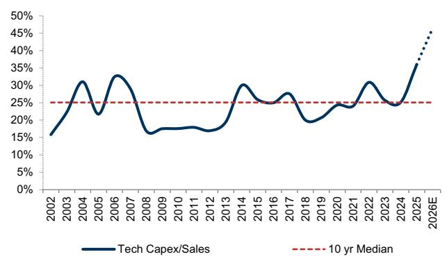

line chart

| Year | Tech Capex/Sales |
|------|------------------|
| 2002 | 15%              |
| 2003 | 25%              |
| 2004 | 30%              |
| 2005 | 25%              |
| 2006 | 35%              |
| 2007 | 30%              |
| 2008 | 15%              |
| 2009 | 15%              |
| 2010 | 15%              |
| 2011 | 15%              |
| 2012 | 15%              |
| 2013 | 15%              |
| 2014 | 30%              |
| 2015 | 25%              |
| 2016 | 25%              |
| 2017 | 25%              |
| 2018 | 20%              |
| 2019 | 25%              |
| 2020 | 25%              |
| 2021 | 30%              |
| 2022 | 25%              |
| 2023 | 25%              |
| 2024 | 35%              |
| 2025 | 45%              |
| 2026E| 45%              |

Source: Company data, Bloomberg, GS Global Investment Research

Exhibit 24: We expect 2026 to end 62% higher vs the historical peak (2025)  
GS Tech Capex Tracker (indexed)  
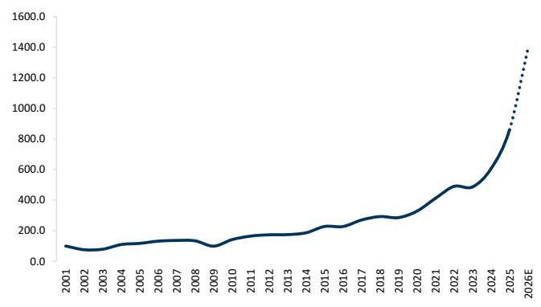

line chart

| Year | Value |
|------|-------|
| 2001 | ~100  |
| 2002 | ~80   |
| 2003 | ~90   |
| 2004 | ~110  |
| 2005 | ~120  |
| 2006 | ~130  |
| 2007 | ~140  |
| 2008 | ~130  |
| 2009 | ~110  |
| 2010 | ~150  |
| 2011 | ~170  |
| 2012 | ~180  |
| 2013 | ~190  |
| 2014 | ~210  |
| 2015 | ~230  |
| 2016 | ~250  |
| 2017 | ~280  |
| 2018 | ~300  |
| 2019 | ~310  |
| 2020 | ~350  |
| 2021 | ~450  |
| 2022 | ~500  |
| 2023 | ~480  |
| 2024 | ~600  |
| 2025 | ~850  |
| 2026E | ~1400 |

Source: Company data, Bloomberg, GS Global Investment Research

## Datacenters

Exhibit 25: We see datacenter capex growth rates remaining at double digits in 2026 and 2027  
GS Datacenter Capex Tracker (63 companies, €695 bn of capex in 2026)  
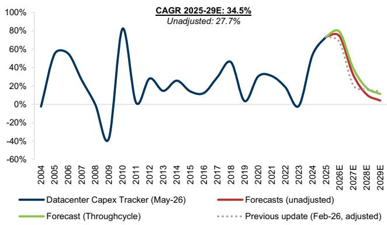

line chart

| Year | Datacenter Capex Tracker (May-26) | Forecasts (unadjusted) | Forecast (Throughcycle) | Previous update (Feb-26, adjusted) |
|------|-----------------------------------|------------------------|------------------------|------------------------------------|
| 2004 | ~0%                               | -                      | -                      | -                                  |
| 2005 | ~60%                              | -                      | -                      | -                                  |
| 2006 | ~50%                              | -                      | -                      | -                                  |
| 2007 | ~30%                              | -                      | -                      | -                                  |
| 2008 | ~-40%                             | -                      | -                      | -                                  |
| 2009 | ~80%                              | -                      | -                      | -                                  |
| 2010 | ~0%                               | -                      | -                      | -                                  |
| 2011 | ~30%                              | -                      | -                      | -                                  |
| 2012 | ~20%                              | -                      | -                      | -                                  |
| 2013 | ~15%                              | -                      | -                      | -                                  |
| 2014 | ~25%                              | -                      | -                      | -                                  |
| 2015 | ~15%                              | -                      | -                      | -                                  |
| 2016 | ~10%                              | -                      | -                      | -                                  |
| 2017 | ~45%                              | -                      | -                      | -                                  |
| 2018 | ~5%                               | -                      | -                      | -                                  |
| 2019 | ~35%                              | -                      | -                      | -                                  |
| 2020 | ~30%                              | -                      | -                      | -                                  |
| 2021 | ~25%                              | -                      | -                      | -                                  |
| 2022 | ~15%                              | -                      | -                      | -                                  |
| 2023 | ~-5%                              | -                      | -                      | -                                  |
| 2024E| ~75%                              | ~75%                   | ~80%                   | ~75%                               |
| 2025E| ~80%                              | ~80%                   | ~85%                   | ~80%                               |
| 2026E| ~75%                              | ~75%                   | ~85%                   | ~75%                               |
| 2027E| ~60%                              | ~60%                   | ~75%                   | ~65%                               |
| 2028E| ~40%                              | ~40%                   | ~60%                   | ~50%                               |
| 2029E| ~20%                              | ~20%                   | ~40%                   | ~30%                               |
| 2030E| ~10%                              | ~10%                   | ~20%                   | ~15%                               |
| 2031E| ~5%                               | ~5%                    | ~10%                   | ~10%                               |
| 2032E| ~-5%                              | ~-5%                   | ~-10%                  | ~-15%                              |
| 2033E| ~-15%                             | ~-15%                  | ~-15%                  | ~-20%                              |
| 2034E| ~-30%                             | ~-30%                  | ~-30%                  | ~-35%                              |
| 2035E| ~-45%                             | ~-45%                  | ~-45%                  | ~-45%                              |
| 2036E| ~-60%                             | ~-60%                  | ~-60%                  | ~-55%                              |
| 2037E| ~-75%                             | ~-75%                  | ~-75%                  | ~-65%                              |
| 2038E| ~-90%                             | ~-90%                  | ~-90%                  | ~-75%                              |
| 2039E| ~-105%                            | ~-105%                 | ~-105%                 | ~-85%                              |
| 2040E| ~-120%                            | ~-120%                 | ~-120%                 | ~-95%                              |
| 2041E| ~-135%                            | ~-135%                 | ~-135%                 | ~-105%                             |
| 2042E| ~-150%                            | ~-150%                 | ~-150%                 | ~-115%                             |
| 2043E| ~-165%                            | ~-165%                 | ~-165%                 | ~-125%                             |
| 2044E| ~-180%                            | ~-180%                 | ~-180%                 | ~-135%                             |
| 2045E| ~-195%                            | ~-195%                 | ~-195%                 | ~-145%                             |
| 2046E| ~-210%                            | ~-210%                 | ~-210%                 | ~-155%                             |
| 2047E| ~-225%                            | ~-225%                 | ~-225%                 | ~-165%                             |
| 2048E| ~-240%                            | ~-240%                 | ~-240%                 | ~-175%                             |
| 2049E| ~-255%                            | ~-255%                 | ~-255%                 | ~-185%                             |
| 2050E| ~-270%                            | ~-270%                 | ~-270%                 | ~-195%                             |
| 2051E| ~-285%                            | ~-285%                 | ~-285%                 | ~-205%                             |
| 2052E| ~-300%                            | ~-300%                 | ~-300%                 | ~-215%                             |
| 2053E| ~-315%                            | ~-315%                 | ~-315%                 | ~-225%                             |
| 2054E| ~-330%                            | ~-330%                 | ~-330%                 | ~-235%                             |
| 2055E| ~-345%                            | ~-345%                 | ~-345%                 | ~-245%                             |
| 2056E| ~-360%                            | ~-360%                 | ~-360%                 | ~-255%                             |
| 2057E| ~-375%                            | ~-375%                 | ~-375%                 | ~-265%                             |
| 2058E| ~-390%                            | ~-390%                 | ~-390%                 | ~-275%                             |
| 2059E| ~-405%                            | ~-405%                 | ~-405%                 | ~-285%                             |
| 2060E| ~-420%                            | ~-420%                 | ~-420%                 | ~-295%                             |
| 2061E| ~-435%                            | ~-435%                 | ~-435%                 | ~-305%                             |
| 2062E| ~-450%                            | ~-450%                 | ~-450%                 | ~-315%                             |
| 2063E| ~-465%                            | ~-465%                 | ~-465%                 | ~-325%                             |
| 2064E| ~-480%                            | ~-480%                 | ~-480%                 | ~-335%                             |
| 2065E| ~-495%                            | ~-495%                 | ~-495%                 | ~-345%                             |
| 2066E| ~-510%                            | ~-510%                 | ~-510%                 | ~-355%                             |
| 2067E| ~-525%                            | ~-525%                 | ~-525%                 | ~-365%                             |
| 2068E| ~-540%                            | ~-540%                 | ~-540%                 | ~-375%                             |
| 2069E| (~7.7%)                           | (~7.7%)                | (~7.7%)                 | (~7.7%)                             |
| 2070E| (~7.7%)                           | (~7.7%)                | (~7.7%)                 | (~7.7%)                             |
| 2071E| (~7.7%)                           | (~7.7%)                | (~7.7%)                 | (~7.7%)                             |
| 2072E| (~7.7%)                           | (~7.7%)                | (~7.7%)                 | (~7.7%)                             |
| 2073E| (~7.7%)                           | (~7.7%)                | (~7.7%)                 | (~7.7%)                             |
| 2074E| (~7.7%)                           | (~7.7%)                | (~7.7%)                 | (~7.7%)                             |
| 2075E| (~7.7%)                           | (~7.7%)                | (~7.7%)                 | (~7.7%)                             |
| 2076E| (~7.7%)                           | (~7.7%)                | (~7.7%)                 | (~7.7%)                             |
| 2077E| (~7.7%)                           | (~7.7%)                | (~7.7%)                 | (~7.7%)                             |
| 2078E| (~7.7%)                           | (~7.7%)                | (~7.7%)                 | (~7.7%)                             |
| 2079E| (~7.7%)                           | (~7.7%)                | (~7.7%)                 | (~7.7%)                             |
| 2080E| (~7.7%)                           | (~7.7%)                | (~7.7%)                 | (~7.7%)                             |
| 2081E| (~7.7%)                           | (~7.7%)                | (~7.7%)                 | (~7.7%)                             |
| 2082E| (~7.7%)                           | (~7.7%)                | (~7.7%)                 | (~7.7%)                             |
| 2083E| (~7.7%)                           | (~7.7%)                | (~7.7%)                 | (~7.7%)                             |
| 2084E| (~7.7%)                           | (~7.7%)                | (~7.7%)                 | (~7.7%)                             |
| 2085E| (~7.7%)                           | (~7.7%)                | (~7.7%)                 | (~7.7%)                             |
| 2086E| (~7.7%)                           | (~7.7%)                | (~7.7%)                 | (~7.7%)                             |
| 2087E| (~7.7%)                           | (~7.7%)                | (~7.7%)                 | (~7.<ecel><nl>

Source: Company data, Bloomberg, GS Global Investment Research

Exhibit 27: Datacenters Capex/Depreciation is expected to remain above median levels in 2026  
Datacenters Capex/Depreciation  
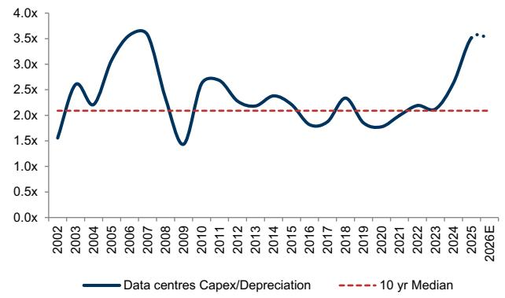

line chart

| Year | Data centres Capex/Depreciation |
|------|--------------------------------|
| 2002 | 1.5x                           |
| 2003 | 2.5x                           |
| 2004 | 2.2x                           |
| 2005 | 3.0x                           |
| 2006 | 3.5x                           |
| 2007 | 3.6x                           |
| 2008 | 2.5x                           |
| 2009 | 1.5x                           |
| 2010 | 2.7x                           |
| 2011 | 2.6x                           |
| 2012 | 2.4x                           |
| 2013 | 2.3x                           |
| 2014 | 2.4x                           |
| 2015 | 2.3x                           |
| 2016 | 1.8x                           |
| 2017 | 2.3x                           |
| 2018 | 2.4x                           |
| 2019 | 1.8x                           |
| 2020 | 1.9x                           |
| 2021 | 2.1x                           |
| 2022 | 2.2x                           |
| 2023 | 2.3x                           |
| 2024 | 2.5x                           |
| 2025 | 3.5x                           |
| 2026E| 3.6x                           |

Source: Company data, Bloomberg, GS Global Investment Research

Exhibit 26: Datacenters Capex/Sales remains well above median levels  
Datacenters Capex/Sales  
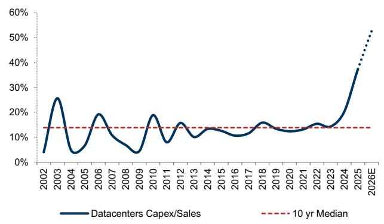

line chart

| Year | Datacenters Capex/Sales |
|------|--------------------------|
| 2002 | ~5%                      |
| 2003 | ~25%                     |
| 2004 | ~5%                      |
| 2005 | ~18%                     |
| 2006 | ~10%                     |
| 2007 | ~15%                     |
| 2008 | ~5%                      |
| 2009 | ~18%                     |
| 2010 | ~10%                     |
| 2011 | ~15%                     |
| 2012 | ~10%                     |
| 2013 | ~15%                     |
| 2014 | ~12%                     |
| 2015 | ~10%                     |
| 2016 | ~12%                     |
| 2017 | ~15%                     |
| 2018 | ~12%                     |
| 2019 | ~15%                     |
| 2020 | ~12%                     |
| 2021 | ~15%                     |
| 2022 | ~15%                     |
| 2023 | ~15%                     |
| 2024 | ~15%                     |
| 2025 | ~35%                     |
| 2026E| ~55%                     |

Source: Company data, Bloomberg, GS Global Investment Research

Exhibit 28: We expect 2026 to end 79% higher vs the historical peak (2025)  
GS Datacenters Capex Tracker (indexed)  
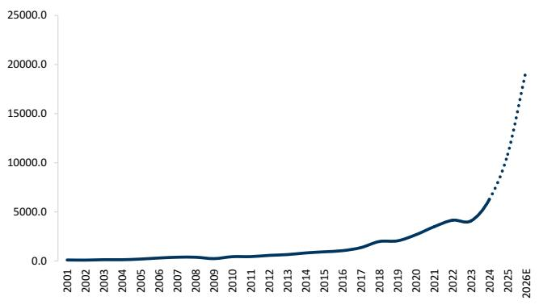

line chart

| Year | Value  |
|------|--------|
| 2001 | 0.0    |
| 2002 | 0.0    |
| 2003 | 0.0    |
| 2004 | 0.0    |
| 2005 | 0.0    |
| 2006 | 0.0    |
| 2007 | 0.0    |
| 2008 | 0.0    |
| 2009 | 0.0    |
| 2010 | 0.0    |
| 2011 | 0.0    |
| 2012 | 0.0    |
| 2013 | 0.0    |
| 2014 | 0.0    |
| 2015 | 0.0    |
| 2016 | 0.0    |
| 2017 | 1000.0 |
| 2018 | 2000.0 |
| 2019 | 3000.0 |
| 2020 | 4000.0 |
| 2021 | 5000.0 |
| 2022 | 6000.0 |
| 2023 | 7000.0 |
| 2024 | 15000.0|
| 2025 | 18000.0|
| 2026E| 19000.0|

Source: Company data, Bloomberg, GS Global Investment Research

Exhibit 29: Datacenters capacity utilization below median levels  
Average Capacity Utilization (US)  
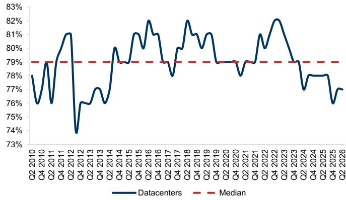

line chart

| Quarter | Datacenters |
| ------- | ----------- |
| Q2 2010 | 78%         |
| Q4 2010 | 76%         |
| Q2 2011 | 79%         |
| Q4 2011 | 81%         |
| Q2 2012 | 74%         |
| Q4 2012 | 76%         |
| Q2 2013 | 77%         |
| Q4 2013 | 76%         |
| Q2 2014 | 80%         |
| Q4 2014 | 79%         |
| Q2 2015 | 81%         |
| Q4 2015 | 82%         |
| Q2 2016 | 81%         |
| Q4 2016 | 79%         |
| Q2 2017 | 78%         |
| Q4 2017 | 80%         |
| Q2 2018 | 82%         |
| Q4 2018 | 81%         |
| Q2 2019 | 80%         |
| Q4 2019 | 79%         |
| Q2 2020 | 79%         |
| Q4 2020 | 78%         |
| Q2 2021 | 79%         |
| Q4 2021 | 81%         |
| Q2 2022 | 82%         |
| Q4 2022 | 81%         |
| Q2 2023 | 79%         |
| Q4 2023 | 77%         |
| Q2 2024 | 78%         |
| Q4 2024 | 79%         |
| Q2 2025 | 78%         |
| Q4 2025 | 76%         |
| Q2 2026 | 77%         |

Source: Company data, GS Global Investment Research

## Semiconductors

Exhibit 30: Semis capex has seen some upgrades in 2026  
GS Semiconductor Capex Tracker (39 companies, €200 bn of capex in 2026)  
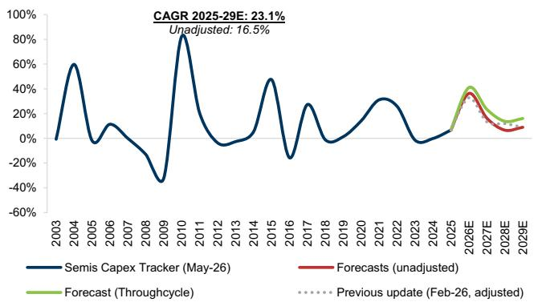

line chart

| Year | Semis Capex Tracker (May-26) | Forecasts (unadjusted) | Forecast (Throughcycle) | Previous update (Feb-26, adjusted) |
|------|------------------------------|------------------------|-------------------------|------------------------------------|
| 2003 | ~0%                          |                        |                         |                                    |
| 2004 | ~60%                         |                        |                         |                                    |
| 2005 | ~0%                          |                        |                         |                                    |
| 2006 | ~10%                         |                        |                         |                                    |
| 2007 | ~-10%                        |                        |                         |                                    |
| 2008 | ~-30%                        |                        |                         |                                    |
| 2009 | ~-40%                        |                        |                         |                                    |
| 2010 | ~80%                         |                        |                         |                                    |
| 2011 | ~20%                         |                        |                         |                                    |
| 2012 | ~-10%                        |                        |                         |                                    |
| 2013 | ~-5%                         |                        |                         |                                    |
| 2014 | ~5%                          |                        |                         |                                    |
| 2015 | ~45%                         |                        |                         |                                    |
| 2016 | ~-20%                        |                        |                         |                                    |
| 2017 | ~30%                         |                        |                         |                                    |
| 2018 | ~-5%                         |                        |                         |                                    |
| 2019 | ~5%                          |                        |                         |                                    |
| 2020 | ~15%                         |                        |                         |                                    |
| 2021 | ~30%                         |                        |                         |                                    |
| 2022 | ~35%                         |                        |                         |                                    |
| 2023 | ~-5%                         |                        |                         |                                    |
| 2024 | ~5%                          |                        |                         |                                    |
| 2025E| ~10%                         |                        |                         |                                    |
| 2026E| ~35%                        |                        |                         |                                    |
| 2027E| ~40%                       |                        |                         |                                    |
| 2028E| ~30%                       |                        |                         |                                    |
| 2029E| ~25%                       |                        |                         |                                    |
| Unadjusted: 16.5%: 23.1%

Source: Company data, Bloomberg, GS Global Investment Research

Exhibit 31: Semis Capex/Sales is expected to be below median levels in 2026  
Semiconductors Capex/Sales  
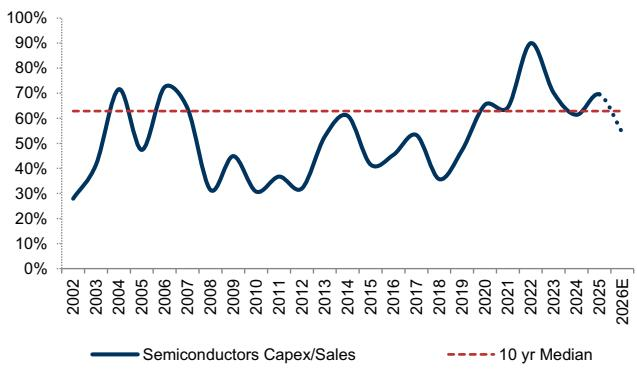

line chart

| Year | Semiconductors Capex/Sales |
|------|---------------------------|
| 2002 | ~28%                      |
| 2003 | ~45%                      |
| 2004 | ~70%                      |
| 2005 | ~50%                      |
| 2006 | ~75%                      |
| 2007 | ~65%                      |
| 2008 | ~30%                      |
| 2009 | ~45%                      |
| 2010 | ~35%                      |
| 2011 | ~30%                      |
| 2012 | ~35%                      |
| 2013 | ~55%                      |
| 2014 | ~65%                      |
| 2015 | ~45%                      |
| 2016 | ~55%                      |
| 2017 | ~50%                      |
| 2018 | ~35%                      |
| 2019 | ~45%                      |
| 2020 | ~65%                      |
| 2021 | ~65%                      |
| 2022 | ~90%                      |
| 2023 | ~75%                      |
| 2024 | ~65%                      |
| 2025 | ~65%                      |
| 2026E| ~60% (estimated)          |

Source: Company data, Bloomberg, GS Global Investment Research

Exhibit 32: Semis Capex/Depreciation is expected to remain above the median in 2026  
Semiconductors Capex/Depreciation  
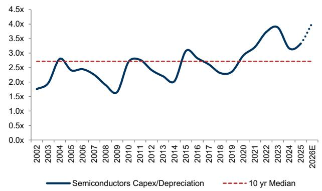

line chart

| Year | Semiconductors Capex/Depreciation |
|------|-----------------------------------|
| 2002 | 1.8x                              |
| 2003 | 2.0x                              |
| 2004 | 2.8x                              |
| 2005 | 2.4x                              |
| 2006 | 2.3x                              |
| 2007 | 2.1x                              |
| 2008 | 1.9x                              |
| 2009 | 1.6x                              |
| 2010 | 2.8x                              |
| 2011 | 2.7x                              |
| 2012 | 2.5x                              |
| 2013 | 2.3x                              |
| 2014 | 2.0x                              |
| 2015 | 3.1x                              |
| 2016 | 2.8x                              |
| 2017 | 2.6x                              |
| 2018 | 2.4x                              |
| 2019 | 2.5x                              |
| 2020 | 3.0x                              |
| 2021 | 3.5x                              |
| 2022 | 3.8x                              |
| 2023 | 4.0x                              |
| 2024 | 3.5x                              |
| 2025 | 3.8x                              |
| 2026E| 4.0x                              |

Source: Company data, Bloomberg, GS Global Investment Research

Exhibit 33: We expect 2026 to end 41% above vs the historical peak (2025)  
GS Semis Capex Tracker (indexed)  
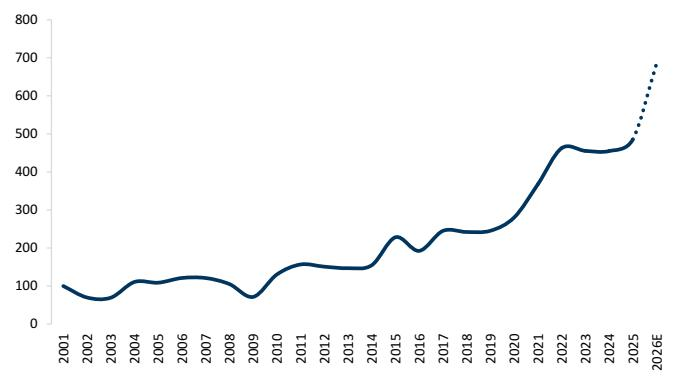

line chart

| Year | Value |
|------|-------|
| 2001 | 100   |
| 2002 | 80    |
| 2003 | 90    |
| 2004 | 110   |
| 2005 | 120   |
| 2006 | 130   |
| 2007 | 140   |
| 2008 | 130   |
| 2009 | 80    |
| 2010 | 150   |
| 2011 | 160   |
| 2012 | 155   |
| 2013 | 150   |
| 2014 | 160   |
| 2015 | 220   |
| 2016 | 190   |
| 2017 | 240   |
| 2018 | 230   |
| 2019 | 240   |
| 2020 | 280   |
| 2021 | 350   |
| 2022 | 470   |
| 2023 | 460   |
| 2024 | 470   |
| 2025 | 480   |
| 2026E| 700   |

Source: Company data, Bloomberg, GS Global Investment Research

Exhibit 34: Semis capacity utilization is below median levels Average Capacity Utilization  
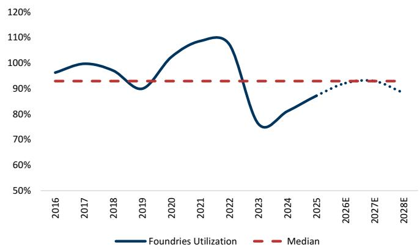

line chart

| Year   | Foundries Utilization |
| ------ | --------------------- |
| 2016   | ~95%                  |
| 2017   | ~100%                 |
| 2018   | ~98%                  |
| 2019   | ~90%                  |
| 2020   | ~105%                 |
| 2021   | ~110%                 |
| 2022   | ~110%                 |
| 2023   | ~75%                  |
| 2024   | ~80%                  |
| 2025   | ~85%                  |
| 2026E  | ~90%                  |
| 2027E  | ~90%                  |
| 2028E  | ~85%                  |

Source: Company data, GS Global Investment Research

## Power Generation

Exhibit 35: The energy transition and data center expected boom are contributing to high investments in power generation in medium term  
GS Conventional Power Generation Capex Tracker (115 companies, €350 bn of capex in 2026)  
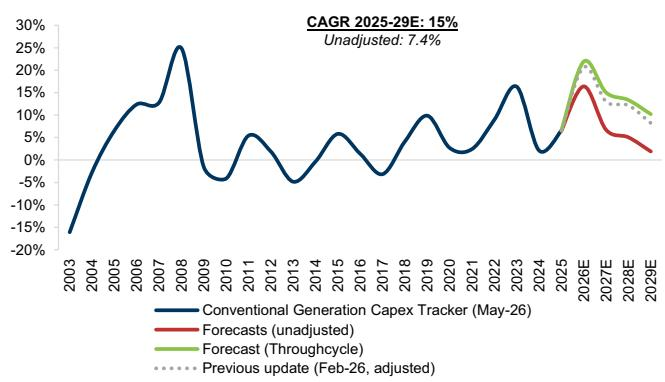

line chart

| Year | Conventional Generation Capex Tracker (May-26) | Forecasts (unadjusted) | Forecast (Throughcycle) | Previous update (Feb-26, adjusted) |
|------|-----------------------------------------------|------------------------|-------------------------|------------------------------------|
| 2003 | -18%                                          | -                      | -                       | -                                  |
| 2004 | -                                             | -                      | -                       | -                                  |
| 2005 | -                                             | -                      | -                       | -                                  |
| 2006 | -                                             | -                      | -                       | -                                  |
| 2007 | -                                             | -                      | -                       | -                                  |
| 2008 | 25%                                           | -                      | -                       | -                                  |
| 2009 | -                                             | -                      | -                       | -                                  |
| 2010 | -                                             | -                      | -                       | -                                  |
| 2011 | -                                             | -                      | -                       | -                                  |
| 2012 | -                                             | -                      | -                       | -                                  |
| 2013 | -                                             | -                      | -                       | -                                  |
| 2014 | -                                             | -                      | -                       | -                                  |
| 2015 | -                                             | -                      | -                       | -                                  |
| 2016 | -                                             | -                      | -                       | -                                  |
| 2017 | -                                             | -                      | -                       | -                                  |
| 2018 | -                                             | -                      | -                       | -                                  |
| 2019 | -                                             | -                      | -                       | -                                  |
| 2020 | -                                             | -                      | -                       | -                                  |
| 2021 | -                                             | -                      | -                       | -                                  |
| 2022 | -                                             | -                      | -                       | -                                  |
| 2023 | -                                             | -                      | -                       | -                                  |
| 2024E| 15%                                          | 15%                    | 20%                     | 15%                                |
| 2025E| 15%                                          | 15%                    | 20%                     | 15%                                |
| 2026E| 15%                                          | 15%                    | 20%                     | 15%                                |
| 2027E| 15%                                          | 15%                    | 15%                     | 15%                                |
| 2028E| 15%                                          | 15%                    | 15%                     | 15%                                |
| 2029E| 15%                                          | 15%                    | 15%                     | 15%                                |
| 2030E| 15%                                          | 15%                    | 15%                     | 15%                                |
| 2031E| 15%                                          | 15%                    | 15%                     | 15%                                |
| 2032E| 15%                                          | 15%                    | 15%                     | 15%                                |
| 2033E| 15%                                          | 15%                    | 15%                     | 15%                                |
| 2034E| 15%                                          | 15%                    | 15%                     | 15%                                |
| 2035E| 15%                                          | 15%                    | 15%                     | 15%                                |
| 2036E| 15%                                          | 15%                    | 15%                     | 15%                                |
| 2037E| 15%                                          | 15%                    | 15%                     | 15%                                |
| 2038E| 15%                                          | 15%                    | 15%                     | 15%                                |
| 2039E| 15%                                          | 15%                    | 15%                     | 15%                                |
| 2040E| 15%                                          | 15%                    | 15%                     | 15%                                |
| 2041E| 15%                                          | 15%                    | 15%                     | 15%                                |
| 2042E| 15%                                          | 15%                    | 15%                     | 15%                                |
| 2043E| 15%                                          | 15%                    | 15%                     | 15%                                |
| 2044E| 15%                                          | 15%                    | 15%                     | 15%                                |
| 2045E| 15%                                          | 15%                    | 15%                     | 15%                                |
| 2046E| 15%                                          | 15%                    | 15%                     | 15%                                |
| 2047E| 15%                                          | 15%                    | 15%                     | 15%                                |
| 2048E| 15%                                          | 15%                    | 15%                     | 15%                                |
| 2049E| 15%                                          | 15%                    | 15%                     | 15%                                |
| 2050E| 15%                                          | 15%                    | 15%                     | 15%                                |
| CAGR (2025-29E) : Unadjusted: +7.4%; Previous update: Feb-26, adjusted; Legend: Actual values for each year from Conventional Generation Capex Tracker (May-26) and Forecasts (unadjusted); Forecast (Throughcycle) and Previous update (Feb-26, adjusted) as legend categories.

Source: Company data, Bloomberg, GS Global Investment Research

Exhibit 37: Conventional Power Generation Capex/Depreciation is likely to remain above median levels in 2026  
Conventional Power Generation Capex/Depreciation  
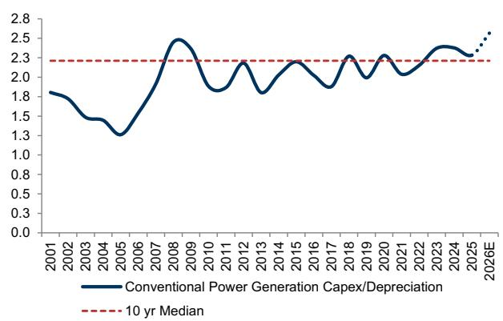

line chart

| Year | Conventional Power Generation Capex/Depreciation |
|------|--------------------------------------------------|
| 2001 | 1.8                                              |
| 2002 | 1.7                                              |
| 2003 | 1.5                                              |
| 2004 | 1.4                                              |
| 2005 | 1.3                                              |
| 2006 | 1.5                                              |
| 2007 | 1.8                                              |
| 2008 | 2.5                                              |
| 2009 | 2.4                                              |
| 2010 | 2.0                                              |
| 2011 | 1.9                                              |
| 2012 | 2.3                                              |
| 2013 | 1.9                                              |
| 2014 | 2.1                                              |
| 2015 | 2.3                                              |
| 2016 | 2.2                                              |
| 2017 | 2.1                                              |
| 2018 | 2.3                                              |
| 2019 | 2.2                                              |
| 2020 | 2.3                                              |
| 2021 | 2.1                                              |
| 2022 | 2.3                                              |
| 2023 | 2.4                                              |
| 2024 | 2.5                                              |
| 2025 | 2.4                                              |
| 2026E| 2.6                                              |

Source: Company data, Bloomberg, GS Global Investment Research

Exhibit 36: Conventional Power Generation Capex/Sales is likely to remain above median levels in 2026  
Conventional Power Generation Capex/Sales  
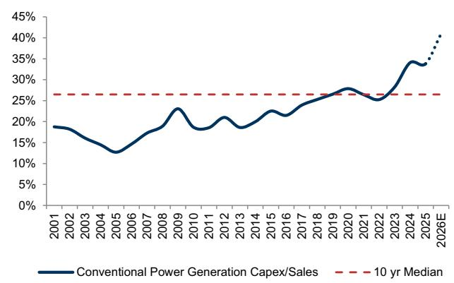

line chart

| Year | Conventional Power Generation Capex/Sales |
|------|-------------------------------------------|
| 2001 | 19%                                       |
| 2002 | 18%                                       |
| 2003 | 17%                                       |
| 2004 | 15%                                       |
| 2005 | 13%                                       |
| 2006 | 15%                                       |
| 2007 | 17%                                       |
| 2008 | 19%                                       |
| 2009 | 23%                                       |
| 2010 | 19%                                       |
| 2011 | 18%                                       |
| 2012 | 20%                                       |
| 2013 | 19%                                       |
| 2014 | 21%                                       |
| 2015 | 22%                                       |
| 2016 | 23%                                       |
| 2017 | 24%                                       |
| 2018 | 25%                                       |
| 2019 | 26%                                       |
| 2020 | 27%                                       |
| 2021 | 26%                                       |
| 2022 | 25%                                       |
| 2023 | 28%                                       |
| 2024 | 33%                                       |
| 2025 | 35%                                       |
| 2026E| 40%                                       |

Source: Company data, Bloomberg, GS Global Investment Research

Exhibit 38: We expect 2026 to end 22% above the historical peak (2025)  
GS Conventional Power Generation Capex Tracker (indexed)  
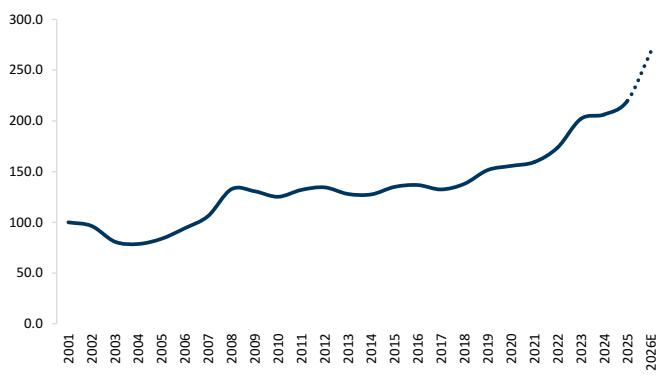

line chart

| Year  | Value |
|-------|-------|
| 2001  | 100.0 |
| 2002  | 95.0  |
| 2003  | 80.0  |
| 2004  | 85.0  |
| 2005  | 90.0  |
| 2006  | 100.0 |
| 2007  | 110.0 |
| 2008  | 135.0 |
| 2009  | 130.0 |
| 2010  | 125.0 |
| 2011  | 130.0 |
| 2012  | 135.0 |
| 2013  | 130.0 |
| 2014  | 135.0 |
| 2015  | 140.0 |
| 2016  | 135.0 |
| 2017  | 130.0 |
| 2018  | 145.0 |
| 2019  | 155.0 |
| 2020  | 160.0 |
| 2021  | 175.0 |
| 2022  | 195.0 |
| 2023  | 215.0 |
| 2024  | 235.0 |
| 2025E | 275.0 |
| 2026E | 285.0 |

Source: Company data, Bloomberg, GS Global Investment Research

Exhibit 39: The average age of utilities equipment looks extended vs history  
Average Age of Utilities Equipment (US)  
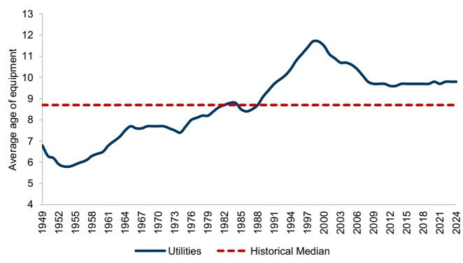

line chart

| Year | Average age of equipment |
| ---- | ------------------------ |
| 1949 | 6.5                      |
| 1952 | 5.8                      |
| 1955 | 6.0                      |
| 1958 | 6.5                      |
| 1961 | 7.0                      |
| 1964 | 7.5                      |
| 1967 | 7.8                      |
| 1970 | 7.7                      |
| 1973 | 7.5                      |
| 1976 | 8.0                      |
| 1979 | 8.5                      |
| 1982 | 8.8                      |
| 1985 | 8.5                      |
| 1988 | 9.0                      |
| 1991 | 10.0                     |
| 1994 | 11.0                     |
| 1997 | 12.0                     |
| 2000 | 11.5                     |
| 2003 | 10.5                     |
| 2006 | 10.0                     |
| 2009 | 9.5                      |
| 2012 | 9.5                      |
| 2015 | 9.5                      |
| 2018 | 9.5                      |
| 2021 | 9.5                      |
| 2024 | 9.5                      |

Source: US Bureau of Economic Analysis

Exhibit 40: Utilities utilization rate has been decreasing and is well below the median levels  
Average Capacity Utilization (US and EU)  
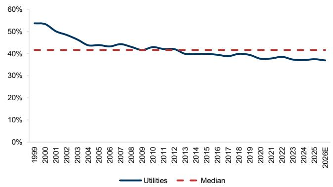

line chart

| Year | Utilities | Median |
|------|-----------|--------|
| 1999 | 54%       | 42%    |
| 2000 | 53%       | 42%    |
| 2001 | 51%       | 42%    |
| 2002 | 49%       | 42%    |
| 2003 | 47%       | 42%    |
| 2004 | 45%       | 42%    |
| 2005 | 44%       | 42%    |
| 2006 | 43%       | 42%    |
| 2007 | 44%       | 42%    |
| 2008 | 43%       | 42%    |
| 2009 | 42%       | 42%    |
| 2010 | 43%       | 42%    |
| 2011 | 42%       | 42%    |
| 2012 | 41%       | 42%    |
| 2013 | 40%       | 42%    |
| 2014 | 39%       | 42%    |
| 2015 | 39%       | 42%    |
| 2016 | 38%       | 42%    |
| 2017 | 39%       | 42%    |
| 2018 | 38%       | 42%    |
| 2019 | 37%       | 42%    |
| 2020 | 38%       | 42%    |
| 2021 | 37%       | 42%    |
| 2022 | 38%       | 42%    |
| 2023 | 37%       | 42%    |
| 2024 | 36%       | 42%    |
| 2025 | 37%       | 42%    |
| 2026E| 36%       | 42%    |

Source: SNL Energy, Company data, GS Global Investment Research, EIA

## Renewables and Transmission & Distribution

Exhibit 41: Energy transition spending remains a growth driver, though capex growth moderates in outer years  
GS Renewables Capex Tracker (15 companies, €43 bn of capex in 2026)  
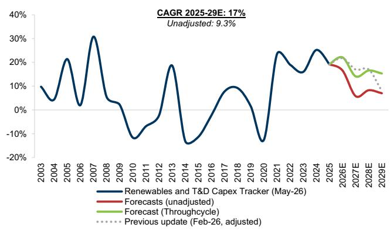

line chart

| Year | Renewables and T&D Capex Tracker (May-26) | Forecasts (unadjusted) | Forecast (Throughcycle) | Previous update (Feb-26, adjusted) |
| --- | --- | --- | --- | --- |
| 2003 | ~10% | - | - | - |
| 2004 | ~5% | - | - | - |
| 2005 | ~20% | - | - | - |
| 2006 | ~0% | - | - | - |
| 2007 | ~30% | - | - | - |
| 2008 | ~5% | - | - | - |
| 2009 | ~-10% | - | - | - |
| 2010 | ~-15% | - | - | - |
| 2011 | ~-10% | - | - | - |
| 2012 | ~-5% | - | - | - |
| 2013 | ~15% | - | - | - |
| 2014 | ~-15% | - | - | - |
| 2015 | ~-10% | - | - | - |
| 2016 | ~5% | - | - | - |
| 2017 | ~10% | - | - | - |
| 2018 | ~5% | - | - | - |
| 2019 | ~-15% | - | - | - |
| 2020 | ~-15% | - | - | - |
| 2021 | ~25% | - | - | - |
| 2022 | ~20% | - | - | - |
| 2023 | ~15% | - | - | - |
| 2024E | ~25% | ~15% | ~20% | ~15% |
| 2025E | ~20% | ~15% | ~15% | ~15% |
| 2026E | ~15% | ~10% | ~15% | ~15% |
| 2027E | ~10% | ~5% | ~15% | ~15% |
| 2028E | ~5% | ~5% | ~15% | ~15% |
| 2029E | ~5% | ~5% | ~15% | ~15% |
| 2030E | ~5% | ~5% | ~15% | ~15% |
| 2031E | ~5% | ~5% | ~15% | ~15% |
| 2032E | ~5% | ~5% | ~15% | ~15% |
| 2033E | ~5% | ~5% | ~15% | ~15% |
| 2034E | ~5% | ~5% | ~15% | ~15% |
| 2035E | ~5% | ~5% | ~15% | ~15% |
| 2036E | ~5% | ~5% | ~15% | ~15% |
| 2037E | ~5% | ~5% | ~15% | ~15% |
| 2038E | ~5% | ~5% | ~15% | ~15% |
| 2039E | ~5% | ~5% | ~15% | ~15% |
| 2040E | ~5% | ~5% | ~15% | ~15% |
| 2041E | ~5% | ~5% | ~15% | ~15% |
| 2042E | ~5% | ~5% | ~15% | ~15% |
| 2043E | ~5% | ~5% | ~15% | ~15% |
| 2044E | ~5% | ~5% | ~15% | ~15% |
| 2045E | ~5% | ~5% | ~15% | ~15% |
| 2046E | ~5% | ~5% | ~15% | ~15% |
| 2047E | ~5% | ~5% | ~15% | ~15% |
| 2048E | ~5% | ~5% | ~15% | ~15% |
| 2049E | ~5% | ~5% | ~15% | ~15% |
| 2050E | ~5% | ~5% | ~15% | ~15% |
| 2051E | ~5% | ~5% | ~15% | ~15% |
| 2052E | ~5% | ~5% | ~15% | ~15% |
| 2053E | ~5% | ~5% | ~15% | ~15% |
| 2054E | ~5% | ~5% | ~15% | ~15% |
| 2055E | ~5% | ~5% | ~15% | ~15% |
| 2056E | ~5% | ~5% | ~15% | ~15% |
| 2057E | ~5% | ~5% | ~15% | ~15% |
| 2058E | ~5% | ~5% | ~15% | ~15% |
| 2059E | ~5% | ~5% | ~15% | ~15% |
| 2060E | ~5% | ~5% | ~15% | ~15% |
| 2061E | ~5% | ~5% | ~15% | ~15% |
| 2062E | ~5% | ~5% | ~15% | ~15% |
| 2063E | ~5% | ~5% | ~15% | ~15% |
| 2064E | ~5% | ~5% | ~15% | ~15% |
| 2065E | ~5% | ~5% | ~15% | ~15% |
| 2066E | ~5% | ~5% | ~15% | ~15% |
| 2067E | ~5% | ~5% | ~15% | ~15% |
| 2068E | ~5% | ~5% | ~15% | ~15% |
| 2069E | ~5% | ~5% | ~15% | ~15% |
| 2070E | ~5% | ~5% | ~15% | ~15% |
| 2071E | ~5% | - | - | - |
| 2072E | - | - | - | - |
| 2073E | - | - | - | - |
| 2074E | - | - | - | - |
| 2075E | - | - | - | - |
| 2076E | - | - | - | - |
| 2077E | - | - | - | - |
| 2078E | - | - | - | - |
| 2079E | - | - | - | - |
| 2080E | - | - | - | - |
| 2081E | - | - | - | - |
| 2082E | - | - | - | - |
| 2083E | - | - | - | - |
| 2084E | - | - | - | - |
| 2085E | - | - | - | - |
| 2086E | - | - | - | - |
| 2087E | - | - | - | - |
| 2088E | - | - | - | - |
| 2089E | - | - | - | - |
| 2090E | - | - | - | - |
| 2091E | - | - | - | - |
| 2092E | - | - | - | - |
| 2093E | - | - | - | - |
| 2094E | - | - | - | - |
| 2095E | - | - | - | - |
| 2096E | - | - | - | - |
| 2097E | - | - | - | - |
| 2098E | - | - | - | - |
| 2099E | - | - | - | - |
| 2100E | - | - | - | - |

Source: Company data, Bloomberg, GS Global Investment Research

Exhibit 42: Renewables and T&D Capex/Sales is likely to be above all historical levels in 2026  
Renewables and T&D Capex/Sales  
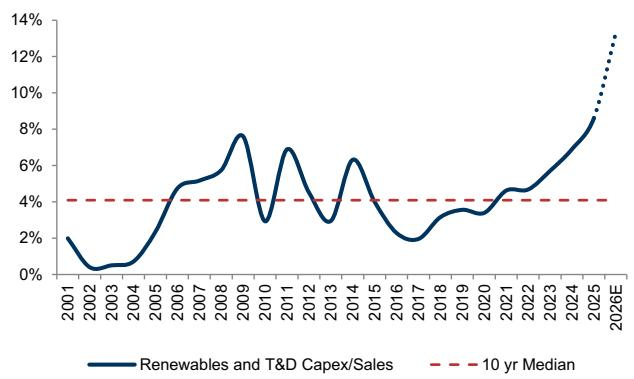

line chart

| Year | Renewables and T&D Capex/Sales |
|------|----------------------------------|
| 2001 | 2%                               |
| 2002 | 0%                               |
| 2003 | 0%                               |
| 2004 | 0%                               |
| 2005 | 2%                               |
| 2006 | 4%                               |
| 2007 | 5%                               |
| 2008 | 6%                               |
| 2009 | 8%                               |
| 2010 | 3%                               |
| 2011 | 7%                               |
| 2012 | 5%                               |
| 2013 | 3%                               |
| 2014 | 6%                               |
| 2015 | 4%                               |
| 2016 | 2%                               |
| 2017 | 3%                               |
| 2018 | 4%                               |
| 2019 | 4%                               |
| 2020 | 5%                               |
| 2021 | 5%                               |
| 2022 | 6%                               |
| 2023 | 7%                               |
| 2024 | 8%                               |
| 2025 | 9%                               |
| 2026E| 13%                              |

Source: Company data, Bloomberg, GS Global Investment Research

Exhibit 43: Renewables and T&D Capex/Depreciation is trending above median levels in 2026
Renewables and T&D Capex/Depreciation  
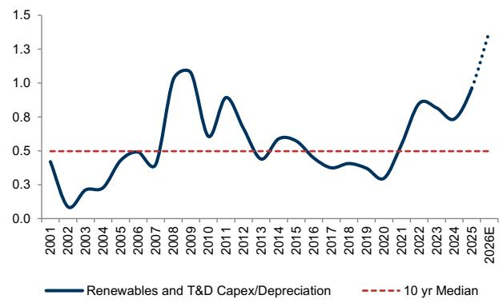

line chart

| Year | Renewables and T&D Capex/Depreciation |
|------|----------------------------------------|
| 2001 | 0.45                                   |
| 2002 | 0.15                                   |
| 2003 | 0.25                                   |
| 2004 | 0.30                                   |
| 2005 | 0.45                                   |
| 2006 | 0.50                                   |
| 2007 | 0.40                                   |
| 2008 | 1.15                                   |
| 2009 | 1.10                                   |
| 2010 | 0.65                                   |
| 2011 | 0.90                                   |
| 2012 | 0.75                                   |
| 2013 | 0.45                                   |
| 2014 | 0.65                                   |
| 2015 | 0.55                                   |
| 2016 | 0.45                                   |
| 2017 | 0.40                                   |
| 2018 | 0.35                                   |
| 2019 | 0.30                                   |
| 2020 | 0.35                                   |
| 2021 | 0.60                                   |
| 2022 | 0.85                                   |
| 2023 | 0.80                                   |
| 2024 | 0.75                                   |
| 2025 | 1.00                                   |
| 2026E| 1.40                                   |

Source: Company data, Bloomberg, GS Global Investment Research

## Transmission

## Exhibit 45: Transmission capex remains supported by grid modernization needs despite moderating growth

GS Transmission Capex Tracker (9 companies, €32 bn of capex in 2026)

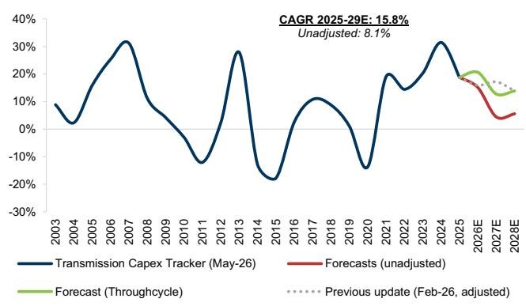

line chart

| Year | Transmission Capex Tracker (May-26) | Forecasts (unadjusted) | Forecast (Throughcycle) | Previous update (Feb-26, adjusted) |
|------|-------------------------------------|------------------------|------------------------|------------------------------------|
| 2028E | - | - | - | - |
| 2027E | - | - | - | - |
| 2026E | - | - | - | - |
| 2025E | - | - | - | - |
| 2024E | - | - | - | - |
| 2023E | - | - | - | - |
| 2022E | - | - | - | - |
| 2021E | - | - | - | - |
| 2020E | - | - | - | - |
| 2019E | - | - | - | - |
| 2018E | - | - | - | - |
| 2017E | - | - | - | - |
| 2016E | - | - | - | - |
| 2015E | - | - | - | - |
| 2014E | - | - | - | - |
| 2013E | - | - | - | - |
| 2012E | - | - | - | - |
| 2011E | - | - | - | - |
| 2010E | - | - | - | - |
| 2009E | - | - | - | - |
| 2008E | - | - | - | - |
| 2007E | - | - | - | - |
| 2006E | - | - | - | - |
| 2005E | - | - | - | - |
| 2004E | - | - | - | - |
| 2003E | - | - | - | - |
CAGR 2025-29E: 15.8%; Unadjusted: 8.1%

Source: Company data, Bloomberg, GS Global Investment Research

## Exhibit 44: We expect 2026 to end 22% above the historical peak (2025)

GS Renewables and T&D Capex Tracker (indexed)

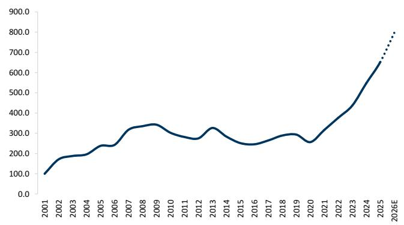

line chart

| Year | Value |
|------|-------|
| 2001 | 100.0 |
| 2002 | 150.0 |
| 2003 | 175.0 |
| 2004 | 200.0 |
| 2005 | 225.0 |
| 2006 | 250.0 |
| 2007 | 300.0 |
| 2008 | 350.0 |
| 2009 | 350.0 |
| 2010 | 325.0 |
| 2011 | 300.0 |
| 2012 | 275.0 |
| 2013 | 325.0 |
| 2014 | 300.0 |
| 2015 | 250.0 |
| 2016 | 250.0 |
| 2017 | 275.0 |
| 2018 | 300.0 |
| 2019 | 300.0 |
| 2020 | 250.0 |
| 2021 | 350.0 |
| 2022 | 450.0 |
| 2023 | 550.0 |
| 2024 | 650.0 |
| 2025 | 750.0 |
| 2026E | 850.0 |

Source: Company data, Bloomberg, GS Global Investment Research

## Exhibit 46: We expect 2026 to end 21% above the historical peak (2025)

GS Transmission Capex Tracker (indexed)

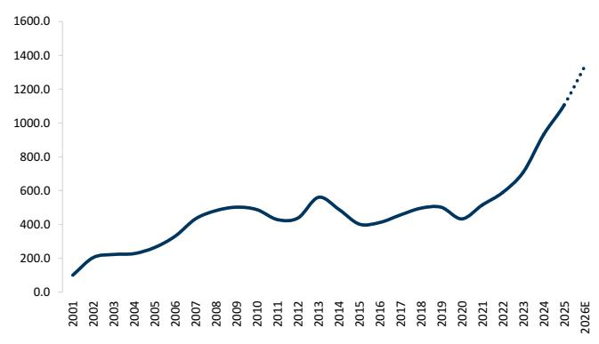

line chart

| Year  | Value |
|-------|-------|
| 2001  | 100.0 |
| 2002  | 200.0 |
| 2003  | 250.0 |
| 2004  | 300.0 |
| 2005  | 350.0 |
| 2006  | 450.0 |
| 2007  | 500.0 |
| 2008  | 550.0 |
| 2009  | 500.0 |
| 2010  | 450.0 |
| 2011  | 400.0 |
| 2012  | 450.0 |
| 2013  | 550.0 |
| 2014  | 500.0 |
| 2015  | 450.0 |
| 2016  | 400.0 |
| 2017  | 450.0 |
| 2018  | 500.0 |
| 2019  | 550.0 |
| 2020  | 450.0 |
| 2021  | 550.0 |
| 2022  | 650.0 |
| 2023  | 850.0 |
| 2024  | 1150.0 |
| 2025  | 1350.0 |
| 2026E | 1450.0 |

Source: Company data, Bloomberg, GS Global Investment Research

## Telecom

Exhibit 47: Telecom capex has seen slight downgrades in 2026  
GS Telecom Capex Tracker (114 companies, €201 bn of capex in 2026)  
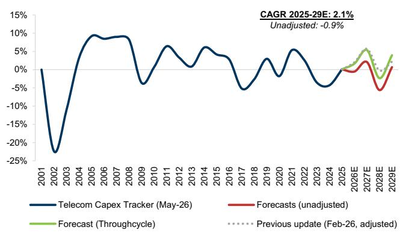

line chart

| Year | Telecom Capex Tracker (May-26) | Forecasts (unadjusted) | Forecast (Throughcycle) | Previous update (Feb-26, adjusted) |
|------|----------------------------------|------------------------|-------------------------|------------------------------------|
| 2001 | 0%                               |                        |                         |                                    |
| 2002 | -25%                             |                        |                         |                                    |
| 2003 |                          |                        |                         |                                    |
| 2004 |                          |                        |                         |                                    |
| 2005 |                          |                        |                         |                                    |
| 2006 |                          |                        |                         |                                    |
| 2007 |                          |                        |                         |                                    |
| 2008 |                          |                        |                         |                                    |
| 2009 |                          |                        |                         |                                    |
| 2010 |                          |                        |                         |                                    |
| 2011 |                          |                        |                         |                                    |
| 2012 |                          |                        |                         |                                    |
| 2013 |                          |                        |                         |                                    |
| 2014 |                          |                        |                         |                                    |
| 2015 |                          |                        |                         |                                    |
| 2016 |                          |                        |                         |                                    |
| 2017 |                          |                        |                         |                                    |
| 2018 |                          |                        |                         |                                    |
| 2019 |                          |                        |                         |                                    |
| 2020 |                          |                        |                         |                                    |
| 2021 |                          |                        |                         |                                    |
| 2022 |                          |                        |                         |                                    |
| 2023 |                          |                        |                         |                                    |
| 2024E|                          |                        |                         |                                    |
| 2025E|                          |                        |                         |                                    |
| 2026E|                          |                        |                         |                                    |
| 2027E|                          |                        |                         |                                    |
| 2028E|                          |                        |                         |                                    |
| 2029E|                          |                        |                         |                                    |
| CAGR 2025-29E: Unadjusted -0.9%

Source: Company data, GS Global Investment Research, Bloomberg

Exhibit 49: Telecom Capex/Depreciation is likely to be below median levels in 2026  
Telecom Capex/Depreciation  
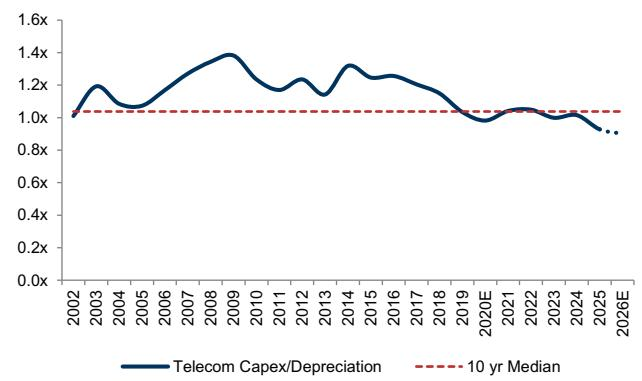

line chart

| Year   | Telecom Capex/Depreciation |
| ------ | -------------------------- |
| 2002   | 1.0x                       |
| 2003   | 1.2x                       |
| 2004   | 1.1x                       |
| 2005   | 1.1x                       |
| 2006   | 1.2x                       |
| 2007   | 1.3x                       |
| 2008   | 1.4x                       |
| 2009   | 1.4x                       |
| 2010   | 1.3x                       |
| 2011   | 1.2x                       |
| 2012   | 1.3x                       |
| 2013   | 1.2x                       |
| 2014   | 1.3x                       |
| 2015   | 1.3x                       |
| 2016   | 1.3x                       |
| 2017   | 1.3x                       |
| 2018   | 1.2x                       |
| 2019   | 1.1x                       |
| 2020E  | 1.0x                       |
| 2021   | 1.0x                       |
| 2022   | 1.0x                       |
| 2023   | 1.0x                       |
| 2024   | 1.0x                       |
| 2025   | 0.9x                       |
| 2026E  | 0.9x                       |

Source: Company data, Bloomberg, GS Global Investment Research

Exhibit 48: Telecom Capex/Sales is on track to remain well below median levels in 2026  
Telecom Capex/Sales  
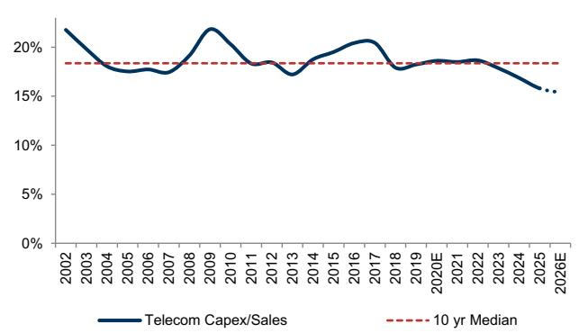

line chart

| Year   | Telecom Capex/Sales |
| ------ | ------------------- |
| 2002   | ~21%                |
| 2003   | ~19%                |
| 2004   | ~18%                |
| 2005   | ~17%                |
| 2006   | ~17%                |
| 2007   | ~17%                |
| 2008   | ~18%                |
| 2009   | ~21%                |
| 2010   | ~19%                |
| 2011   | ~18%                |
| 2012   | ~18%                |
| 2013   | ~17%                |
| 2014   | ~18%                |
| 2015   | ~19%                |
| 2016   | ~20%                |
| 2017   | ~19%                |
| 2018   | ~18%                |
| 2019   | ~18%                |
| 2020E  | ~18%                |
| 2021   | ~18%                |
| 2022   | ~18%                |
| 2023   | ~17%                |
| 2024   | ~16%                |
| 2025E  | ~15%                |
| 2026E  | ~15%                |

Source: Company data, Bloomberg, GS Global Investment Research

Exhibit 50: We expect 2026 to end 6% below the historical peak (2022)  
GS Telecom Capex Tracker (indexed)  
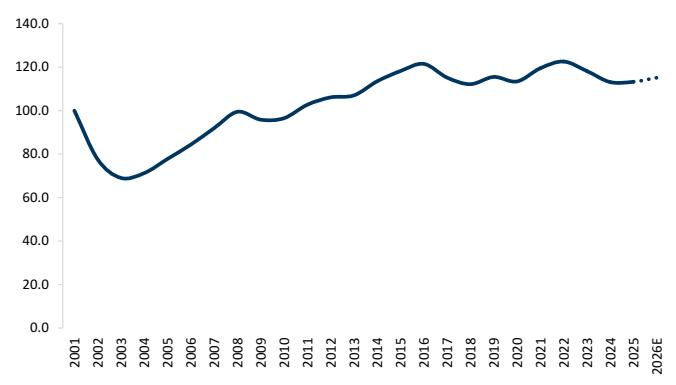

line chart

| Year | Value |
|------|-------|
| 2001 | 100.0 |
| 2002 | 80.0  |
| 2003 | 70.0  |
| 2004 | 75.0  |
| 2005 | 85.0  |
| 2006 | 95.0  |
| 2007 | 100.0 |
| 2008 | 105.0 |
| 2009 | 100.0 |
| 2010 | 105.0 |
| 2011 | 110.0 |
| 2012 | 115.0 |
| 2013 | 120.0 |
| 2014 | 125.0 |
| 2015 | 130.0 |
| 2016 | 135.0 |
| 2017 | 130.0 |
| 2018 | 125.0 |
| 2019 | 130.0 |
| 2020 | 135.0 |
| 2021 | 140.0 |
| 2022 | 145.0 |
| 2023 | 140.0 |
| 2024 | 135.0 |
| 2025 | 135.0 |
| 2026E | 135.0 |

Source: Company data, Bloomberg, GS Global Investment Research

Exhibit 51: US telecom equipment slightly above the historical median age  
Average Age of Telecom Equipment (US)  
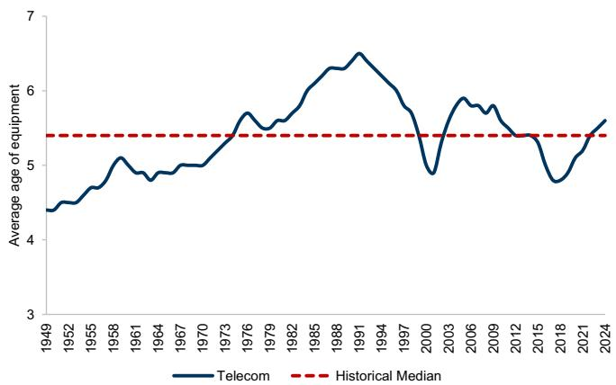

line chart

| Year | Telecom | Historical Median |
|------|---------|-------------------|
| 1949 | 4.4     | 5.4               |
| 1952 | 4.6     | 5.4               |
| 1955 | 4.8     | 5.4               |
| 1958 | 5.1     | 5.4               |
| 1961 | 4.9     | 5.4               |
| 1964 | 4.8     | 5.4               |
| 1967 | 5.0     | 5.4               |
| 1970 | 5.1     | 5.4               |
| 1973 | 5.3     | 5.4               |
| 1976 | 5.7     | 5.4               |
| 1979 | 5.6     | 5.4               |
| 1982 | 5.8     | 5.4               |
| 1985 | 6.0     | 5.4               |
| 1988 | 6.2     | 5.4               |
| 1991 | 6.5     | 5.4               |
| 1994 | 6.3     | 5.4               |
| 1997 | 5.8     | 5.4               |
| 2000 | 4.9     | 5.4               |
| 2003 | 5.8     | 5.4               |
| 2006 | 5.7     | 5.4               |
| 2009 | 5.6     | 5.4               |
| 2012 | 5.4     | 5.4               |
| 2015 | 5.3     | 5.4               |
| 2018 | 4.8     | 5.4               |
| 2021 | 5.2     | 5.4               |
| 2024 | 5.6     | 5.4               |

Source: US Bureau of Economic Analysis

## Consumer

Exhibit 52: Capex growth in Consumer is expected to remain positive but grow at a much slower rate than the first few years post covid  
GS Consumer Capex Tracker (490 companies, €205 bn of capex in 2026)  
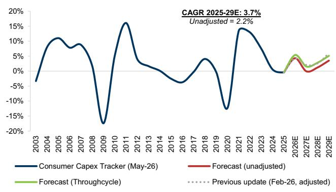

line chart

| Year | Consumer Capex Tracker (May-26) | Forecast (unadjusted) | Forecast (Throughcycle) | Previous update (Feb-26, adjusted) |
|------|----------------------------------|------------------------|--------------------------|-------------------------------------|
| 2003 | -4%                              | -                      | -                        | -                                   |
| 2004 | ~10%                             | -                      | -                        | -                                   |
| 2005 | ~11%                             | -                      | -                        | -                                   |
| 2006 | ~9%                              | -                      | -                        | -                                   |
| 2007 | ~8%                              | -                      | -                        | -                                   |
| 2008 | ~-18%                            | -                      | -                        | -                                   |
| 2009 | ~-15%                            | -                      | -                        | -                                   |
| 2010 | ~16%                             | -                      | -                        | -                                   |
| 2011 | ~15%                             | -                      | -                        | -                                   |
| 2012 | ~3%                              | -                      | -                        | -                                   |
| 2013 | ~1%                              | -                      | -                        | -                                   |
| 2014 | ~-1%                             | -                      | -                        | -                                   |
| 2015 | ~-3%                             | -                      | -                        | -                                   |
| 2016 | ~-5%                             | -                      | -                        | -                                   |
| 2017 | ~4%                              | -                      | -                        | -                                   |
| 2018 | ~5%                              | -                      | -                        | -                                   |
| 2019 | ~-13%                            | -                      | -                        | -                                   |
| 2020 | ~-15%                            | -                      | -                        | -                                   |
| 2021 | ~14%                             | -                      | -                        | -                                   |
| 2022E| ~13%                             | -                      | ~5%                      | ~5%                                 |
| 2023E| ~8%                              | -                      | ~3%                      | ~3%                                 |
| 2024E| ~0%                              | -                      | ~1%                      | ~1%                                 |
| 2025E| ~-1%                             | ~-1%                   | ~-1%                     | ~-1%                                |
| 2026E| ~-1%                             | ~-1%                   | ~-1%                     | ~-1%                                |
| 2027E| ~-1%                             | ~-1%                   | ~-1%                     | ~-1%                                |
| 2028E| ~-1%                             | ~-1%                   | ~-1%                     | ~-1%                                |
| 2029E| ~-1%                             | ~-1%                   | ~-1%                     | ~-1%                                |

Source: Company data, Bloomberg, GS Global Investment Research

Exhibit 54: Consumer Capex/Depreciation should remain slightly below median level in 2026  
Consumer Capex/Depreciation  
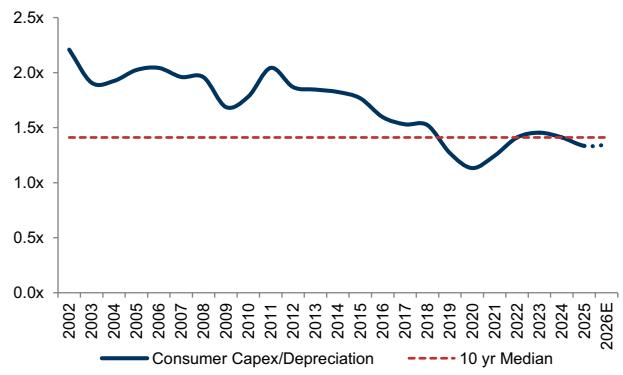

line chart

| Year | Consumer Capex/Depreciation |
|------|-----------------------------|
| 2002 | 2.2x                        |
| 2003 | 1.9x                        |
| 2004 | 2.0x                        |
| 2005 | 2.0x                        |
| 2006 | 2.0x                        |
| 2007 | 1.9x                        |
| 2008 | 1.8x                        |
| 2009 | 1.7x                        |
| 2010 | 1.8x                        |
| 2011 | 2.0x                        |
| 2012 | 1.9x                        |
| 2013 | 1.8x                        |
| 2014 | 1.8x                        |
| 2015 | 1.7x                        |
| 2016 | 1.6x                        |
| 2017 | 1.5x                        |
| 2018 | 1.4x                        |
| 2019 | 1.3x                        |
| 2020 | 1.1x                        |
| 2021 | 1.2x                        |
| 2022 | 1.3x                        |
| 2023 | 1.4x                        |
| 2024 | 1.4x                        |
| 2025 | 1.3x                        |
| 2026E| 1.3x                        |

Source: Company data, Bloomberg, GS Global Investment Research

Exhibit 53: Consumer Capex/Sales is expected slightly below median levels in 2026  
Consumer Capex/Sales  
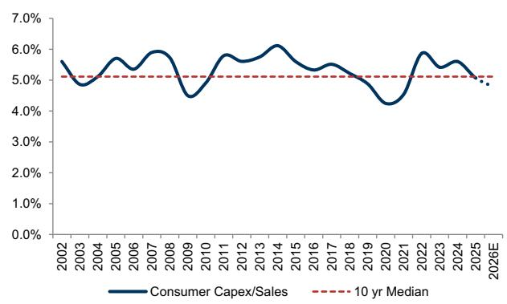

line chart

| Year | Consumer Capex/Sales |
|------|----------------------|
| 2002 | 5.5%                 |
| 2003 | 4.8%                 |
| 2004 | 5.2%                 |
| 2005 | 5.6%                 |
| 2006 | 5.3%                 |
| 2007 | 5.8%                 |
| 2008 | 5.6%                 |
| 2009 | 4.5%                 |
| 2010 | 5.0%                 |
| 2011 | 5.8%                 |
| 2012 | 5.6%                 |
| 2013 | 5.9%                 |
| 2014 | 6.1%                 |
| 2015 | 5.8%                 |
| 2016 | 5.5%                 |
| 2017 | 5.3%                 |
| 2018 | 5.1%                 |
| 2019 | 4.9%                 |
| 2020 | 4.3%                 |
| 2021 | 4.8%                 |
| 2022 | 5.9%                 |
| 2023 | 5.5%                 |
| 2024 | 5.7%                 |
| 2025 | 5.3%                 |
| 2026E| 4.9%                 |

Source: Company data, Bloomberg, GS Global Investment Research

Exhibit 55: We expect 2026 to end 5% above the historical peak (2024)  
GS Consumer Capex tracker (indexed)  
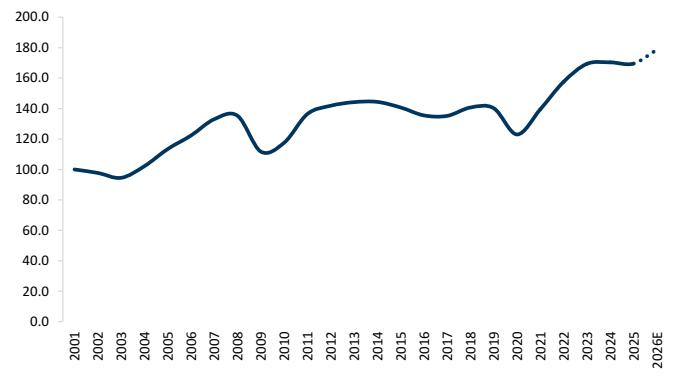

line chart

| Year | Value |
|------|-------|
| 2001 | 100.0 |
| 2002 | 98.0  |
| 2003 | 95.0  |
| 2004 | 105.0 |
| 2005 | 115.0 |
| 2006 | 125.0 |
| 2007 | 135.0 |
| 2008 | 138.0 |
| 2009 | 110.0 |
| 2010 | 120.0 |
| 2011 | 135.0 |
| 2012 | 140.0 |
| 2013 | 142.0 |
| 2014 | 143.0 |
| 2015 | 142.0 |
| 2016 | 138.0 |
| 2017 | 135.0 |
| 2018 | 140.0 |
| 2019 | 142.0 |
| 2020 | 125.0 |
| 2021 | 145.0 |
| 2022 | 160.0 |
| 2023 | 170.0 |
| 2024 | 172.0 |
| 2025 | 173.0 |
| 2026E | 178.0 |

Source: Company data, Bloomberg, GS Global Investment Research

## Retail

Exhibit 56: Retail capex has seen a modest increase this year but the current macro uncertainty challenges 2027  
GS Retail Capex Tracker (241 companies, €128 bn of capex in 2026)  
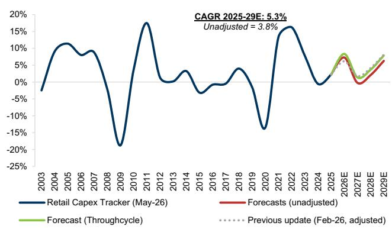

line chart

| Year | Retail Capex Tracker (May-26) | Forecasts (unadjusted) | Forecast (Throughcycle) | Previous update (Feb-26, adjusted) |
|------|-------------------------------|------------------------|------------------------|------------------------------------|
| 2003 | -3%                           | -                      | -                      | -                                  |
| 2004 | 10%                           | -                      | -                      | -                                  |
| 2005 | 12%                           | -                      | -                      | -                                  |
| 2006 | 8%                            | -                      | -                      | -                                  |
| 2007 | 10%                           | -                      | -                      | -                                  |
| 2008 | -15%                          | -                      | -                      | -                                  |
| 2009 | -20%                          | -                      | -                      | -                                  |
| 2010 | 18%                           | -                      | -                      | -                                  |
| 2011 | 15%                           | -                      | -                      | -                                  |
| 2012 | 0%                            | -                      | -                      | -                                  |
| 2013 | 2%                            | -                      | -                      | -                                  |
| 2014 | 4%                            | -                      | -                      | -                                  |
| 2015 | 0%                            | -                      | -                      | -                                  |
| 2016 | -2%                           | -                      | -                      | -                                  |
| 2017 | 4%                            | -                      | -                      | -                                  |
| 2018 | 5%                            | -                      | -                      | -                                  |
| 2019 | -15%                          | -                      | -                      | -                                  |
| 2020 | -15%                          | -                      | -                      | -                                  |
| 2021 | 16%                           | -                      | -                      | -                                  |
| 2022 | 18%                           | -                      | -                      | -                                  |
| 2023 | 15%                           | -                      | -                      | -                                  |
| 2024E| 0%                            | -                      | 8%                     | -                                  |
| 2025E| 5%                            | 5%                     | 8%                     | -                                  |
| 2026E| 8%                            | 8%                     | 8%                     | -                                  |
| 2027E| 5%                            | 5%                     | 5%                     | -                                  |
| 2028E| 8%                            | 8%                     | 8%                     | -                                  |
| 2029E| 10%                           | 10%                    | 10%                    | -                                  |
CAGR 2025-29E: 5.3%, Unadjusted = 3.8%

Source: Company data, Bloomberg, GS Global Investment Research

Exhibit 57: We expect 2026 to end 8% above the historical peak (2025)  
GS Retail Capex Tracker (indexed)  
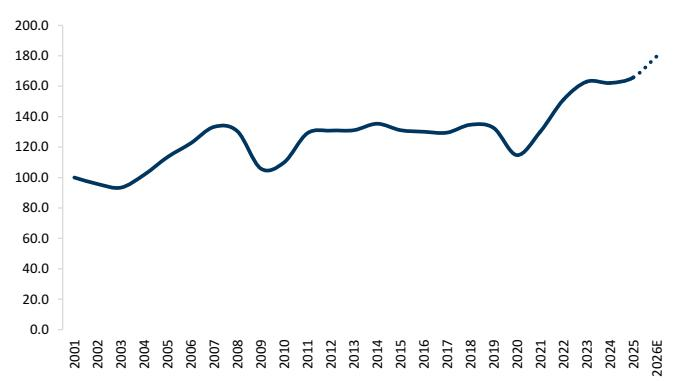

line chart

| Year | Value |
|------|-------|
| 2001 | 100.0 |
| 2002 | 95.0  |
| 2003 | 98.0  |
| 2004 | 105.0 |
| 2005 | 115.0 |
| 2006 | 125.0 |
| 2007 | 135.0 |
| 2008 | 130.0 |
| 2009 | 105.0 |
| 2010 | 115.0 |
| 2011 | 130.0 |
| 2012 | 132.0 |
| 2013 | 133.0 |
| 2014 | 135.0 |
| 2015 | 133.0 |
| 2016 | 132.0 |
| 2017 | 133.0 |
| 2018 | 135.0 |
| 2019 | 137.0 |
| 2020 | 115.0 |
| 2021 | 135.0 |
| 2022 | 155.0 |
| 2023 | 165.0 |
| 2024 | 168.0 |
| 2025 | 170.0 |
| 2026E| 185.0 |

Source: Company data, Bloomberg, GS Global Investment Research

Exhibit 58: Retail capacity utilization is below median levels in US, EU and China  
Average Capacity Utilization (US, EU, China)  
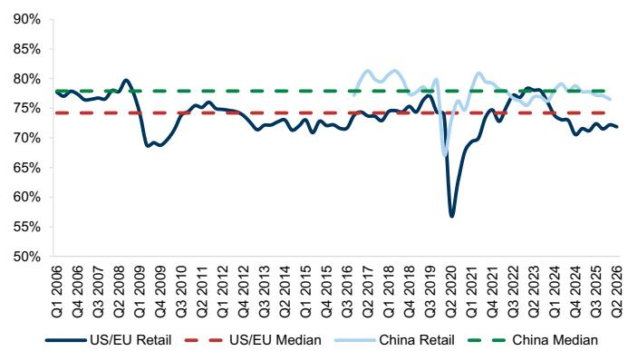

line chart

| Quarter | US/EU Retail | US/EU Median | China Retail | China Median |
| --- | --- | --- | --- | --- |
| Q1 2006 | 78% | 74% | 78% | 78% |
| Q2 2006 | 78% | 74% | 78% | 78% |
| Q3 2006 | 78% | 74% | 78% | 78% |
| Q4 2006 | 78% | 74% | 78% | 78% |
| Q1 2007 | 78% | 74% | 78% | 78% |
| Q2 2007 | 78% | 74% | 78% | 78% |
| Q3 2007 | 78% | 74% | 78% | 78% |
| Q4 2007 | 78% | 74% | 78% | 78% |
| Q1 2008 | 78% | 74% | 78% | 78% |
| Q2 2008 | 78% | 74% | 78% | 78% |
| Q3 2008 | 78% | 74% | 78% | 78% |
| Q4 2008 | 78% | 74% | 78% | 78% |
| Q1 2009 | 78% | 74% | 78% | 78% |
| Q2 2009 | 78% | 74% | 78% | 78% |
| Q3 2009 | 78% | 74% | 78% | 78% |
| Q4 2009 | 78% | 74% | 78% | 78% |
| Q1 2010 | 78% | 74% | 78% | 78% |
| Q2 2010 | 78% | 74% | 78% | 78% |
| Q3 2010 | 78% | 74% | 78% | 78% |
| Q4 2010 | 78% | 74% | 78% | 78% |
| Q1 2011 | 78% | 74% | 78% | 78% |
| Q2 2011 | 78% | 74% | 78% | 78% |
| Q3 2011 | 78% | 74% | 78% | 78% |
| Q4 2011 | 78% | 74% | 78% | 78% |
| Q1 2012 | 78% | 74% | 78% | 78% |
| Q2 2012 | 78% | 74% | 78% | 78% |
| Q3 2012 | 78% | 74% | 78% | 78% |
| Q4 2012 | 78% | 74% | 78% | 78% |
| Q1 2013 | 78% | 74% | 78% | 78% |
| Q2 2013 | 78% | 74% | 78% | 78% |
| Q3 2013 | 78% | 74% | 78% | 78% |
| Q4 2013 | 78% | 74% | 78% | 78% |
| Q1 2014 | 78% | 74% | 78% | 78% |
| Q2 2014 | 78% | 74% | 78% | 78% |
| Q3 2014 | 78% | 74% | 78% | 78% |
| Q4 2014 | 78% | 74% | 78% | 78% |
| Q1 2015 | 78% | 74% | 78% | 78% |
| Q2 2015 | 78% | 74% | 78% | 78% |
| Q3 2015 | 78% | 74% | 78% | 78% |
| Q4 2015 | 78% | 74% | 78% | 78% |
| Q1 2016 | 78% | 74% | 78% | 78% |
| Q2 2016 | 78% | 74% | 78% | 78% |
| Q3 2016 | 78% | 74% | 78% | 78% |
| Q4 2016 | 78% | 74% | 78% | 78% |
| Q1 2017 | 78% | 74% | 78% | 78% |
| Q2 2017 | 78% | 74% | 78% | 78% |
| Q3 2017 | 78% | 74% | 78% | 78% |
| Q4 2017 | 78% | 74% | 78% | 78% |
| Q1 2018 | 78% | 74% | 78% | 78% |
| Q2 2018 | 78% | 74% | 78% | 78% |
| Q3 2018 | 78% | 74% | 78% | 78% |
| Q4 2018 | 78% | 74% | 78% | 78% |
| Q1 2019 | - | - | - | - |
| Q2 2019 | - | - | - | - |
| Q3 2019 | - | - | - | - |
| Q4 2019 | - | - | - | - |
| Q1 2020 | - | - | - | - |
| Q2 2020 | - | - | - | - |
| Q3 2020 | - | - | - | - |
| Q4 2020 | - | - | - | - |
| Q1 2021* | - | - | - | - |
| Q2* | - | - | - | - |
| Q3* | - | - | - | - |
| Q4* | - | - | - | - |

China data till 1Q26  
Source: Federal Reserve, DG ECFIN, NBS

## Food & Beverage

Exhibit 59: Food & Beverage capex has seen some downgrades for medium-term capex vs our Feb update GS Food & Beverage Capex Tracker (213 companies, €71 bn of capex in 2026)  
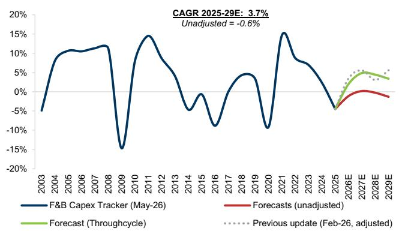

line chart

| Year | F&B Capex Tracker (May-26) | Forecasts (unadjusted) | Forecast (Throughcycle) | Previous update (Feb-26, adjusted) |
|------|-----------------------------|------------------------|-------------------------|------------------------------------|
| 2003 | -5%                         | -                      | -                       | -                                  |
| 2004 | ~10%                        | -                      | -                       | -                                  |
| 2005 | ~11%                        | -                      | -                       | -                                  |
| 2006 | ~11%                        | -                      | -                       | -                                  |
| 2007 | ~12%                        | -                      | -                       | -                                  |
| 2008 | ~12%                        | -                      | -                       | -                                  |
| 2009 | ~-15%                       | -                      | -                       | -                                  |
| 2010 | ~15%                        | -                      | -                       | -                                  |
| 2011 | ~14%                        | -                      | -                       | -                                  |
| 2012 | ~10%                        | -                      | -                       | -                                  |
| 2013 | ~5%                         | -                      | -                       | -                                  |
| 2014 | ~-5%                        | -                      | -                       | -                                  |
| 2015 | ~-10%                       | -                      | -                       | -                                  |
| 2016 | ~-15%                       | -                      | -                       | -                                  |
| 2017 | ~5%                         | -                      | -                       | -                                  |
| 2018 | ~5%                         | -                      | -                       | -                                  |
| 2019 | ~5%                         | -                      | -                       | -                                  |
| 2020 | ~-10%                       | -                      | -                       | -                                  |
| 2021 | ~15%                        | -                      | -                       | -                                  |
| 2022 | ~10%                        | -                      | -                       | -                                  |
| 2023 | ~5%                         | -                      | -                       | -                                  |
| 2024E| ~-5%                        | ~-5%                   | ~-5%                    | ~-5%                               |
| 2025E| ~-5%                        | ~-5%                   | ~-5%                    | ~-5%                               |
| 2026E| ~-5%                        | ~-5%                   | ~-5%                    | ~-5%                               |
| 2027E| ~-5%                        | ~-5%                   | ~-5%                    | ~-5%                               |
| 2028E| ~-5%                        | ~-5%                   | ~-5%                    | ~-5%                               |
| 2029E| ~-5%                        | ~-5%                   | ~-5%                    | ~-5%                               |

Source: Company data, Bloomberg, GS Global Investment Research

Exhibit 60: We expect 2026 to end 3% below the historical peak (2024)  
GS F&B Capex Tracker (indexed)  
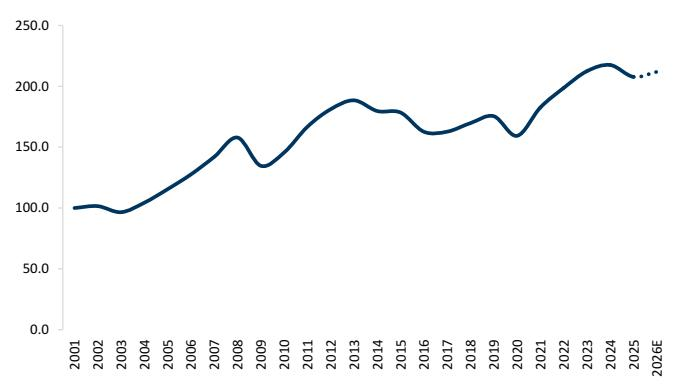

line chart

| Year | Value |
|------|-------|
| 2001 | 100.0 |
| 2002 | 102.0 |
| 2003 | 98.0  |
| 2004 | 105.0 |
| 2005 | 115.0 |
| 2006 | 130.0 |
| 2007 | 145.0 |
| 2008 | 155.0 |
| 2009 | 135.0 |
| 2010 | 145.0 |
| 2011 | 165.0 |
| 2012 | 185.0 |
| 2013 | 195.0 |
| 2014 | 185.0 |
| 2015 | 180.0 |
| 2016 | 175.0 |
| 2017 | 170.0 |
| 2018 | 175.0 |
| 2019 | 185.0 |
| 2020 | 165.0 |
| 2021 | 185.0 |
| 2022 | 205.0 |
| 2023 | 215.0 |
| 2024 | 225.0 |
| 2025 | 215.0 |
| 2026E | 218.0 |

Source: Company data, Bloomberg, GS Global Investment Research

Exhibit 61: F&B equipment age is slightly above historical median level  
Average Age of F&B Equipment (US)  
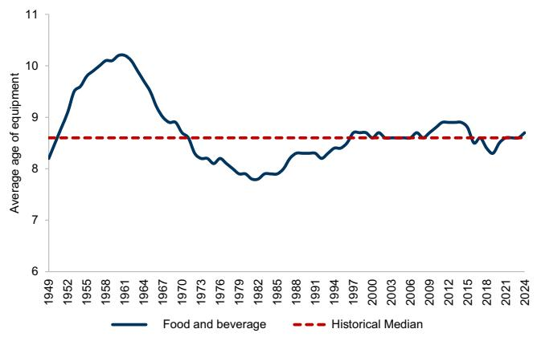

line chart

| Year | Average age of equipment |
| ---- | ------------------------ |
| 1949 | 8.2                      |
| 1952 | 9.5                      |
| 1955 | 10.0                     |
| 1958 | 10.2                     |
| 1961 | 10.3                     |
| 1964 | 10.1                     |
| 1967 | 9.5                      |
| 1970 | 8.8                      |
| 1973 | 8.2                      |
| 1976 | 8.0                      |
| 1979 | 7.8                      |
| 1982 | 7.7                      |
| 1985 | 7.9                      |
| 1988 | 8.2                      |
| 1991 | 8.3                      |
| 1994 | 8.4                      |
| 1997 | 8.6                      |
| 2000 | 8.5                      |
| 2003 | 8.6                      |
| 2006 | 8.7                      |
| 2009 | 8.8                      |
| 2012 | 8.9                      |
| 2015 | 8.7                      |
| 2018 | 8.3                      |
| 2021 | 8.5                      |
| 2024 | 8.6                      |

Source: US Bureau of Economic Analysis

Exhibit 62: F&B capacity utilization is declining but remains at median levels  
Average Capacity Utilization (US, EU)  
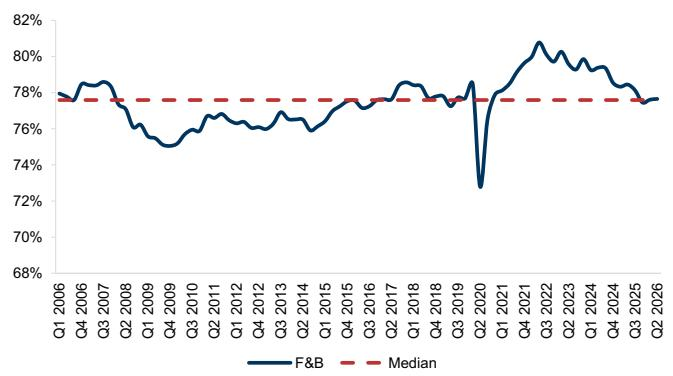

line chart

| Quarter | F&B   | Median |
|---------|-------|--------|
| Q1 2006 | 78%   | 77%    |
| Q4 2006 | 79%   | 77%    |
| Q3 2007 | 78%   | 77%    |
| Q2 2008 | 77%   | 77%    |
| Q1 2009 | 76%   | 77%    |
| Q4 2009 | 75%   | 77%    |
| Q3 2010 | 76%   | 77%    |
| Q2 2011 | 76%   | 77%    |
| Q1 2012 | 76%   | 77%    |
| Q4 2012 | 76%   | 77%    |
| Q3 2013 | 76%   | 77%    |
| Q2 2014 | 76%   | 77%    |
| Q1 2015 | 76%   | 77%    |
| Q4 2015 | 76%   | 77%    |
| Q3 2016 | 77%   | 77%    |
| Q2 2017 | 78%   | 77%    |
| Q1 2018 | 78%   | 77%    |
| Q4 2018 | 78%   | 77%    |
| Q3 2019 | 78%   | 77%    |
| Q2 2020 | 73%   | 77%    |
| Q1 2021 | 80%   | 77%    |
| Q4 2021 | 81%   | 77%    |
| Q3 2022 | 80%   | 77%    |
| Q2 2023 | 80%   | 77%    |
| Q1 2024 | 80%   | 77%    |
| Q4 2024 | 80%   | 77%    |
| Q3 2025 | 80%   | 77%    |
| Q2 2026 | 80%   | 77%    |

Source: Federal Reserve, DG ECFIN

## Food

Exhibit 63: Food capex shows sustained growth momentum beyond 2025  
GS Food Capex Tracker (116 companies, €32 bn of capex in 2026)  
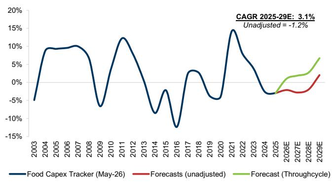

line chart

| Year | Food Capex Tracker (May-26) | Forecasts (unadjusted) | Forecast (Throughcycle) |
|------|-----------------------------|------------------------|------------------------|
| 2025 | -                           | -                      | -                      |
| 2026E | -                           | -                      | -                      |
| 2027E | -                           | -                      | -                      |
| 2028E | -                           | -                      | -                      |
| 2029E | -                           | -                      | -                      |

Source: Company data, Bloomberg, GS Global Investment Research

Exhibit 65: Food Capex/Depreciation is expected to be below median levels in 2026  
Food Capex/Depreciation  
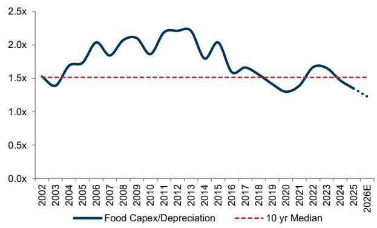

line chart

| Year | Food Capex/Depreciation |
|------|--------------------------|
| 2002 | 1.5x                     |
| 2003 | 1.4x                     |
| 2004 | 1.7x                     |
| 2005 | 1.8x                     |
| 2006 | 2.0x                     |
| 2007 | 1.9x                     |
| 2008 | 2.1x                     |
| 2009 | 2.0x                     |
| 2010 | 1.9x                     |
| 2011 | 2.2x                     |
| 2012 | 2.3x                     |
| 2013 | 2.2x                     |
| 2014 | 1.8x                     |
| 2015 | 2.0x                     |
| 2016 | 1.6x                     |
| 2017 | 1.7x                     |
| 2018 | 1.6x                     |
| 2019 | 1.5x                     |
| 2020 | 1.3x                     |
| 2021 | 1.4x                     |
| 2022 | 1.7x                     |
| 2023 | 1.6x                     |
| 2024 | 1.5x                     |
| 2025 | 1.4x                     |
| 2026E| 1.3x                     |

Source: Company data, Bloomberg, GS Global Investment Research

Exhibit 64: Food Capex/Sales is expected to be below median levels in 2026  
Food Capex/Sales  
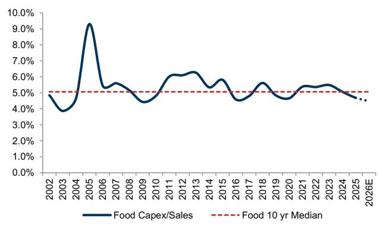

line chart

| Year | Food Capex/Sales |
|------|------------------|
| 2002 | 4.8%             |
| 2003 | 3.8%             |
| 2004 | 4.5%             |
| 2005 | 9.2%             |
| 2006 | 5.5%             |
| 2007 | 5.3%             |
| 2008 | 5.1%             |
| 2009 | 4.7%             |
| 2010 | 5.0%             |
| 2011 | 6.0%             |
| 2012 | 6.2%             |
| 2013 | 6.1%             |
| 2014 | 5.8%             |
| 2015 | 5.5%             |
| 2016 | 4.8%             |
| 2017 | 5.5%             |
| 2018 | 5.3%             |
| 2019 | 4.9%             |
| 2020 | 5.1%             |
| 2021 | 5.3%             |
| 2022 | 5.4%             |
| 2023 | 5.3%             |
| 2024 | 5.1%             |
| 2025 | 4.8%             |
| 2026E| 4.5%             |

Source: Company data, Bloomberg, GS Global Investment Research

Exhibit 66: We expect 2026 to end 7% below the historical peak (2013)  
GS Food Capex Tracker (indexed)  
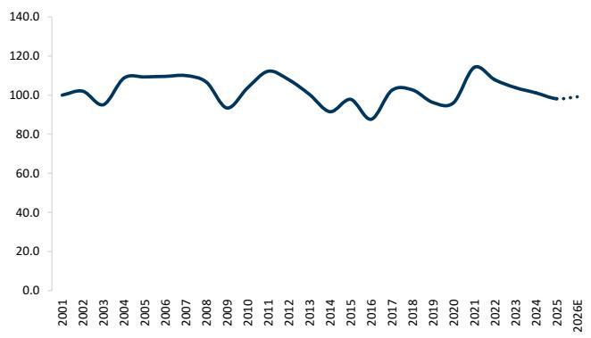

line chart

| Year  | Value |
|-------|-------|
| 2001  | 100.0 |
| 2002  | 102.0 |
| 2003  | 95.0  |
| 2004  | 110.0 |
| 2005  | 110.0 |
| 2006  | 110.0 |
| 2007  | 110.0 |
| 2008  | 108.0 |
| 2009  | 95.0  |
| 2010  | 105.0 |
| 2011  | 115.0 |
| 2012  | 110.0 |
| 2013  | 105.0 |
| 2014  | 95.0  |
| 2015  | 100.0 |
| 2016  | 88.0  |
| 2017  | 105.0 |
| 2018  | 102.0 |
| 2019  | 98.0  |
| 2020  | 95.0  |
| 2021  | 115.0 |
| 2022  | 110.0 |
| 2023  | 105.0 |
| 2024  | 102.0 |
| 2025E | 100.0 |
| 2026E | 98.0 |

Source: Company data, Bloomberg, GS Global Investment Research

## Beverage

Exhibit 67: Beverage investment outlook points to a 2025 trough and subsequent cyclical recovery  
GS Beverage Capex Tracker (69 companies, €34 bn of capex in 2026)  
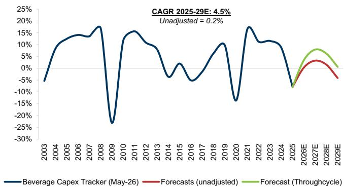

line chart

| Year | Beverage Capex Tracker (May-26) | Forecasts (unadjusted) | Forecast (Throughcycle) |
|------|----------------------------------|------------------------|-------------------------|
| 2003 | -5%                              | -                      | -                       |
| 2004 | ~10%                             | -                      | -                       |
| 2005 | ~12%                             | -                      | -                       |
| 2006 | ~13%                             | -                      | -                       |
| 2007 | ~14%                             | -                      | -                       |
| 2008 | ~18%                             | -                      | -                       |
| 2009 | ~-25%                            | -                      | -                       |
| 2010 | ~15%                             | -                      | -                       |
| 2011 | ~16%                             | -                      | -                       |
| 2012 | ~14%                             | -                      | -                       |
| 2013 | ~10%                             | -                      | -                       |
| 2014 | ~-5%                             | -                      | -                       |
| 2015 | ~5%                              | -                      | -                       |
| 2016 | ~-5%                             | -                      | -                       |
| 2017 | ~5%                              | -                      | -                       |
| 2018 | ~10%                             | -                      | -                       |
| 2019 | ~12%                             | -                      | -                       |
| 2020 | ~-15%                            | -                      | -                       |
| 2021 | ~18%                             | -                      | -                       |
| 2022 | ~15%                             | -                      | -                       |
| 2023 | ~13%                             | -                      | -                       |
| 2024 | ~10%                             | -                      | -                       |
| 2025E| ~-5%                             | ~-5%                   | ~-5%                    |
| 2026E| ~-5%                             | ~-5%                   | ~-5%                    |
| 2027E| ~-5%                             | ~-5%                   | ~-5%                    |
| 2028E| ~-5%                             | ~-5%                   | ~-5%                    |
| 2029E| ~-5%                             | ~-5%                   | ~-5%                    |

Source: Company data, Bloomberg, GS Global Investment Research

Exhibit 69: Beverage Capex/Depreciation is expected to be at median levels in 2026  
Beverage Capex/Depreciation  
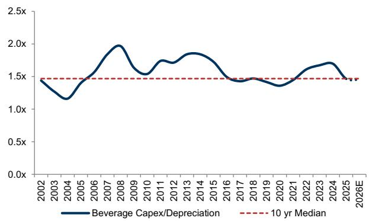

line chart

| Year | Beverage Capex/Depreciation |
|------|-----------------------------|
| 2002 | 1.4x                        |
| 2003 | 1.3x                        |
| 2004 | 1.1x                        |
| 2005 | 1.4x                        |
| 2006 | 1.6x                        |
| 2007 | 1.9x                        |
| 2008 | 2.0x                        |
| 2009 | 1.7x                        |
| 2010 | 1.5x                        |
| 2011 | 1.7x                        |
| 2012 | 1.8x                        |
| 2013 | 1.9x                        |
| 2014 | 1.8x                        |
| 2015 | 1.7x                        |
| 2016 | 1.5x                        |
| 2017 | 1.4x                        |
| 2018 | 1.4x                        |
| 2019 | 1.4x                        |
| 2020 | 1.3x                        |
| 2021 | 1.4x                        |
| 2022 | 1.5x                        |
| 2023 | 1.6x                        |
| 2024 | 1.7x                        |
| 2025 | 1.5x                        |
| 2026E| 1.4x                        |

Source: Company data, Bloomberg, GS Global Investment Research

Exhibit 68: Beverage Capex/Sales is expected to be slightly below median levels in 2026  
Beverage Capex/Sales  
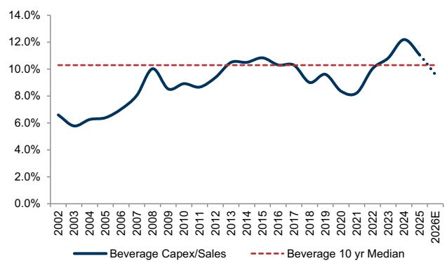

line chart

| Year | Beverage Capex/Sales |
|------|----------------------|
| 2002 | 6.5%                 |
| 2003 | 6.0%                 |
| 2004 | 6.5%                 |
| 2005 | 7.0%                 |
| 2006 | 7.5%                 |
| 2007 | 8.5%                 |
| 2008 | 10.0%                |
| 2009 | 8.5%                 |
| 2010 | 9.0%                 |
| 2011 | 9.5%                 |
| 2012 | 10.0%                |
| 2013 | 10.5%                |
| 2014 | 10.5%                |
| 2015 | 11.0%                |
| 2016 | 10.5%                |
| 2017 | 10.5%                |
| 2018 | 10.0%                |
| 2019 | 9.5%                 |
| 2020 | 8.5%                 |
| 2021 | 9.0%                 |
| 2022 | 10.0%                |
| 2023 | 11.0%                |
| 2024 | 12.5%                |
| 2025 | 11.5%                |
| 2026E| 10.5%                |

Source: Company data, Bloomberg, GS Global Investment Research

Exhibit 70: We expect 2026 to end 5% below the historical peak (2024)  
GS Beverage Capex Tracker (indexed)  
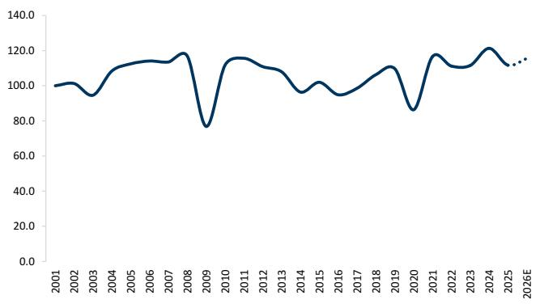

line chart

| Year | Value |
|------|-------|
| 2001 | 100.0 |
| 2002 | 102.0 |
| 2003 | 95.0  |
| 2004 | 108.0 |
| 2005 | 112.0 |
| 2006 | 114.0 |
| 2007 | 116.0 |
| 2008 | 120.0 |
| 2009 | 78.0  |
| 2010 | 116.0 |
| 2011 | 118.0 |
| 2012 | 116.0 |
| 2013 | 114.0 |
| 2014 | 108.0 |
| 2015 | 104.0 |
| 2016 | 98.0  |
| 2017 | 102.0 |
| 2018 | 108.0 |
| 2019 | 112.0 |
| 2020 | 86.0  |
| 2021 | 120.0 |
| 2022 | 116.0 |
| 2023 | 118.0 |
| 2024 | 124.0 |
| 2025 | 116.0 |
| 2026E| 118.0 |

Source: Company data, Bloomberg, GS Global Investment Research

## Dairy

Exhibit 71: Dairy capex expected to decline from 2025 highs and stabilize thereafter
GS Dairy Capex Tracker (28 companies, €5 bn of capex in 2026)  
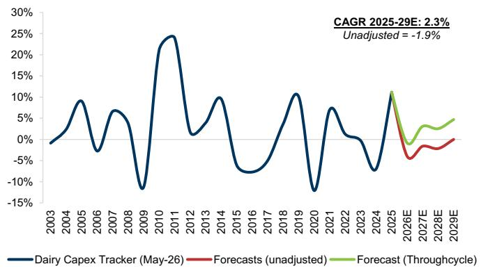

line chart

| Year | Dairy Capex Tracker (May-26) | Forecasts (unadjusted) | Forecast (Throughcycle) |
|------|------------------------------|------------------------|------------------------|
| 2025E | ~10% | ~-5% | ~10% |
| 2026E | ~-5% | ~-5% | ~-5% |
| 2027E | ~-5% | ~-5% | ~-5% |
| 2028E | ~-5% | ~-5% | ~-5% |
| 2029E | ~-5% | ~-5% | ~-5% |

Source: Company data, Bloomberg, GS Global Investment Research

Exhibit 73: Dairy Capex/Depreciation is expected to be below median levels in 2026
Dairy Capex/Depreciation  
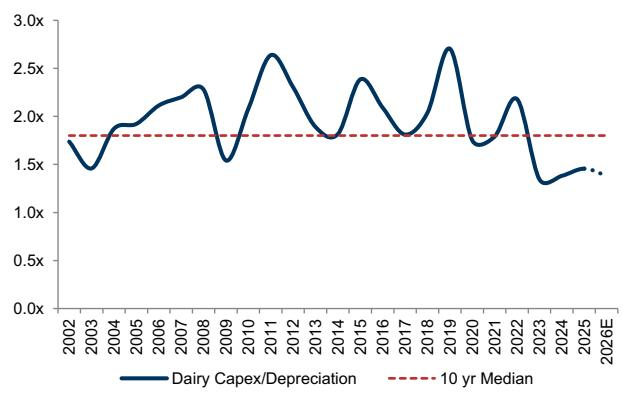

line chart

| Year | Dairy Capex/Depreciation |
|------|--------------------------|
| 2002 | 1.7x                     |
| 2003 | 1.5x                     |
| 2004 | 1.8x                     |
| 2005 | 1.9x                     |
| 2006 | 2.0x                     |
| 2007 | 2.1x                     |
| 2008 | 2.3x                     |
| 2009 | 1.5x                     |
| 2010 | 2.0x                     |
| 2011 | 2.6x                     |
| 2012 | 2.4x                     |
| 2013 | 1.8x                     |
| 2014 | 1.7x                     |
| 2015 | 2.4x                     |
| 2016 | 2.0x                     |
| 2017 | 1.8x                     |
| 2018 | 2.0x                     |
| 2019 | 2.7x                     |
| 2020 | 1.7x                     |
| 2021 | 1.8x                     |
| 2022 | 2.2x                     |
| 2023 | 1.3x                     |
| 2024 | 1.4x                     |
| 2025 | 1.5x                     |
| 2026E| 1.4x                     |

Source: Company data, Bloomberg, GS Global Investment Research

Exhibit 72: Dairy Capex/Sales is expected to be below median levels in 2026
Dairy Capex/Sales  
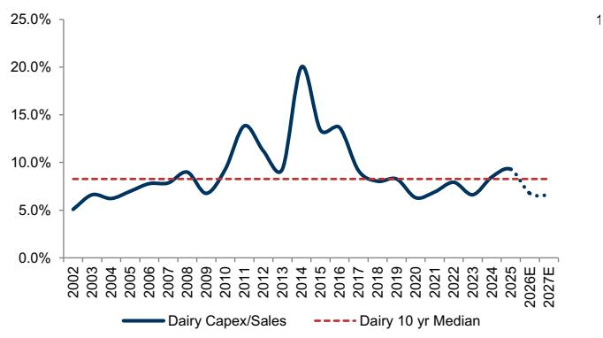

line chart

| Year | Dairy Capex/Sales |
|------|-------------------|
| 2002 | ~5.0%             |
| 2003 | ~6.5%             |
| 2004 | ~7.0%             |
| 2005 | ~7.5%             |
| 2006 | ~8.0%             |
| 2007 | ~8.5%             |
| 2008 | ~9.0%             |
| 2009 | ~7.0%             |
| 2010 | ~9.5%             |
| 2011 | ~13.5%            |
| 2012 | ~11.0%            |
| 2013 | ~9.0%             |
| 2014 | ~20.0%            |
| 2015 | ~13.5%            |
| 2016 | ~13.0%            |
| 2017 | ~10.0%            |
| 2018 | ~8.5%             |
| 2019 | ~8.0%             |
| 2020 | ~6.5%             |
| 2021 | ~7.5%             |
| 2022 | ~8.0%             |
| 2023 | ~7.0%             |
| 2024 | ~8.5%             |
| 2025 | ~9.5%             |
| 2026E| ~8.5%             |
| 2027E| ~7.0%             |

Source: Company data, Bloomberg, GS Global Investment Research

Exhibit 74: We expect 2026 to end 9% below the historical peak (2014)
GS Dairy Capex Tracker (indexed)  
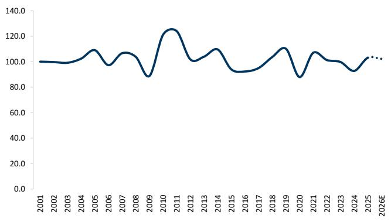

line chart

| Year | Value |
|------|-------|
| 2001 | 100.0 |
| 2002 | 100.0 |
| 2003 | 100.0 |
| 2004 | 105.0 |
| 2005 | 110.0 |
| 2006 | 95.0  |
| 2007 | 105.0 |
| 2008 | 100.0 |
| 2009 | 85.0  |
| 2010 | 125.0 |
| 2011 | 130.0 |
| 2012 | 105.0 |
| 2013 | 110.0 |
| 2014 | 115.0 |
| 2015 | 95.0  |
| 2016 | 95.0  |
| 2017 | 100.0 |
| 2018 | 110.0 |
| 2019 | 115.0 |
| 2020 | 85.0  |
| 2021 | 110.0 |
| 2022 | 105.0 |
| 2023 | 105.0 |
| 2024 | 95.0  |
| 2025 | 105.0 |
| 2026E | 105.0 |

Source: Company data, Bloomberg, GS Global Investment Research

## Vehicles

Exhibit 75: Vehicles Capex growth seems set to recover medium term from lows of 2025, but saw further downgrades in 2026  
GS Vehicles Capex Tracker (106 companies, €171 bn of capex in 2026)  
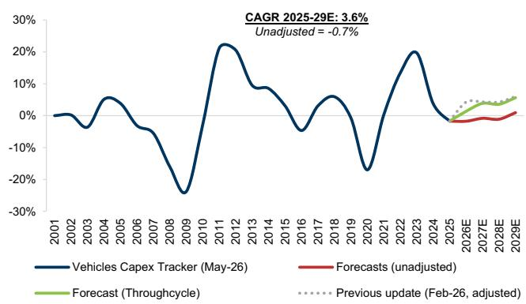

line chart

| Year | Vehicles Capex Tracker (May-26) | Forecasts (unadjusted) | Forecast (Throughcycle) | Previous update (Feb-26, adjusted) |
|------|----------------------------------|------------------------|-------------------------|------------------------------------|
| 2001 | ~0%                              | -                      | -                       | -                                  |
| 2002 | ~-5%                             | -                      | -                       | -                                  |
| 2003 | ~5%                              | -                      | -                       | -                                  |
| 2004 | ~10%                             | -                      | -                       | -                                  |
| 2005 | ~5%                              | -                      | -                       | -                                  |
| 2006 | ~-5%                             | -                      | -                       | -                                  |
| 2007 | ~-10%                            | -                      | -                       | -                                  |
| 2008 | ~-25%                            | -                      | -                       | -                                  |
| 2009 | ~-30%                            | -                      | -                       | -                                  |
| 2010 | ~-15%                            | -                      | -                       | -                                  |
| 2011 | ~25%                             | -                      | -                       | -                                  |
| 2012 | ~20%                             | -                      | -                       | -                                  |
| 2013 | ~15%                             | -                      | -                       | -                                  |
| 2014 | ~10%                             | -                      | -                       | -                                  |
| 2015 | ~5%                              | -                      | -                       | -                                  |
| 2016 | ~-5%                             | -                      | -                       | -                                  |
| 2017 | ~5%                              | -                      | -                       | -                                  |
| 2018 | ~10%                             | -                      | -                       | -                                  |
| 2019 | ~-15%                            | -                      | -                       | -                                  |
| 2020 | ~-20%                            | -                      | -                       | -                                  |
| 2021 | ~-15%                            | -                      | -                       | -                                  |
| 2022 | ~15%                             | -                      | -                       | -                                  |
| 2023 | ~20%                             | -                      | -                       | -                                  |
| 2024E| ~5%                              | ~-5%                   | ~-5%                    | ~-5%                               |
| 2025E| ~-5%                             | ~-5%                   | ~-5%                    | ~-5%                               |
| 2026E| ~-5%                             | ~-5%                   | ~-5%                    | ~-5%                               |
| 2027E| ~-5%                             | ~-5%                   | ~-5%                    | ~-5%                               |
| 2028E| ~-5%                             | ~-5%                   | ~-5%                    | ~-5%                               |
| 2029E| ~-5%                             | ~-5%                   | ~-5%                    | ~-5%                               |
| 2030E| ~-5%                             | ~-5%                   | ~-5%                    | ~-5%                               |
CAGR 2025-29E: 3.6%, Unadjusted = -0.7%

Source: Company data, Bloomberg, GS Global Investment Research

Exhibit 77: Vehicles Capex/Depreciation is seen declining to median levels in 2026  
Vehicle Capex/Depreciation  
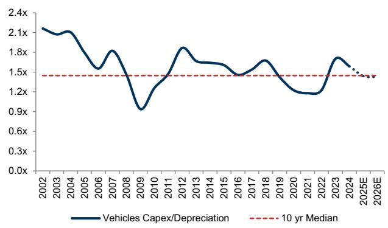

line chart

| Year | Vehicles Capex/Depreciation |
|------|-----------------------------|
| 2002 | 2.1x                        |
| 2003 | 2.1x                        |
| 2004 | 2.1x                        |
| 2005 | 1.8x                        |
| 2006 | 1.5x                        |
| 2007 | 1.8x                        |
| 2008 | 1.5x                        |
| 2009 | 0.9x                        |
| 2010 | 1.3x                        |
| 2011 | 1.5x                        |
| 2012 | 1.8x                        |
| 2013 | 1.7x                        |
| 2014 | 1.6x                        |
| 2015 | 1.5x                        |
| 2016 | 1.5x                        |
| 2017 | 1.6x                        |
| 2018 | 1.7x                        |
| 2019 | 1.5x                        |
| 2020 | 1.3x                        |
| 2021 | 1.2x                        |
| 2022 | 1.3x                        |
| 2023 | 1.8x                        |
| 2024E| 1.5x                       |
| 2025E| 1.5x                       |
| 2026E| 1.5x                       |

Source: Company data, Bloomberg, GS Global Investment Research

Exhibit 76: Vehicles Capex/Sales is expected to be at median levels in 2026  
Vehicles Capex/Sales  
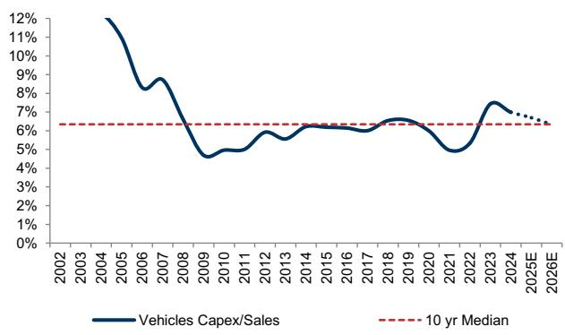

line chart

| Year | Vehicles Capex/Sales |
|------|----------------------|
| 2002 | 12%                  |
| 2003 | 11%                  |
| 2004 | 10%                  |
| 2005 | 9%                   |
| 2006 | 8%                   |
| 2007 | 7%                   |
| 2008 | 6%                   |
| 2009 | 5%                   |
| 2010 | 5%                   |
| 2011 | 5%                   |
| 2012 | 6%                   |
| 2013 | 6%                   |
| 2014 | 6%                   |
| 2015 | 6%                   |
| 2016 | 6%                   |
| 2017 | 6%                   |
| 2018 | 6%                   |
| 2019 | 6%                   |
| 2020 | 5%                   |
| 2021 | 5%                   |
| 2022 | 6%                   |
| 2023 | 7%                   |
| 2024E| 7%                   |
| 2025E| 6.5%                 |
| 2026E| 6.5%                 |

Source: Company data, Bloomberg, GS Global Investment Research

Exhibit 78: We expect 2026 to end 1% below the historical peak (2024)  
GS Vehicles Capex Tracker (Indexed)  
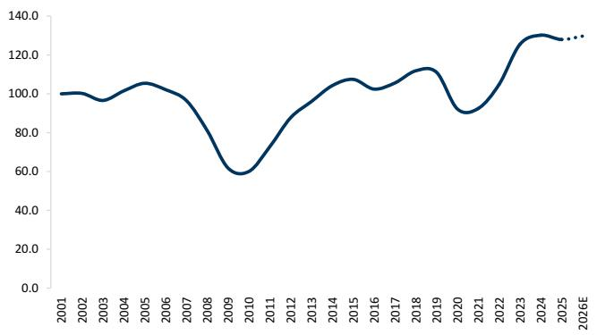

line chart

| Year | Value |
|------|-------|
| 2001 | 100.0 |
| 2002 | 100.0 |
| 2003 | 98.0  |
| 2004 | 105.0 |
| 2005 | 107.0 |
| 2006 | 105.0 |
| 2007 | 100.0 |
| 2008 | 85.0  |
| 2009 | 60.0  |
| 2010 | 65.0  |
| 2011 | 75.0  |
| 2012 | 90.0  |
| 2013 | 100.0 |
| 2014 | 105.0 |
| 2015 | 110.0 |
| 2016 | 105.0 |
| 2017 | 110.0 |
| 2018 | 115.0 |
| 2019 | 115.0 |
| 2020 | 95.0  |
| 2021 | 105.0 |
| 2022 | 115.0 |
| 2023 | 130.0 |
| 2024 | 135.0 |
| 2025 | 133.0 |
| 2026E| 135.0 |

Source: Company data, Bloomberg, GS Global Investment Research

Exhibit 79: Vehicle age in the US is at an all-time high  
Average Age of Vehicle Equipment (US)  
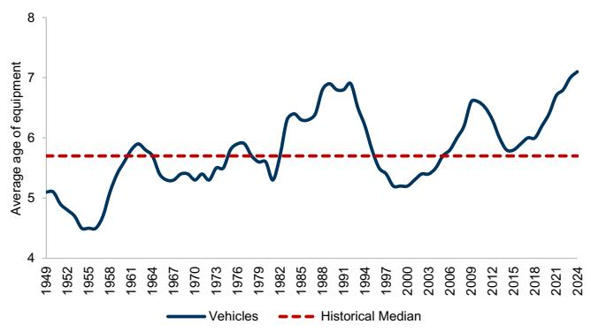

line chart

| Year | Average age of equipment |
| ---- | ------------------------ |
| 1949 | 5.0                      |
| 1952 | 4.5                      |
| 1955 | 4.3                      |
| 1958 | 4.6                      |
| 1961 | 5.8                      |
| 1964 | 5.5                      |
| 1967 | 5.3                      |
| 1970 | 5.4                      |
| 1973 | 5.6                      |
| 1976 | 5.8                      |
| 1979 | 5.5                      |
| 1982 | 6.3                      |
| 1985 | 6.5                      |
| 1988 | 6.8                      |
| 1991 | 6.9                      |
| 1994 | 6.5                      |
| 1997 | 5.2                      |
| 2000 | 5.3                      |
| 2003 | 5.5                      |
| 2006 | 6.0                      |
| 2009 | 6.6                      |
| 2012 | 6.0                      |
| 2015 | 5.8                      |
| 2018 | 6.0                      |
| 2021 | 6.5                      |
| 2024 | 7.0                      |

Source: US Bureau of Economic Analysis

## Mining

Exhibit 81: Mining Capex saw a meaningful rise in 2026, with moderation in the outer years  
GS Mining Capex Tracker (174 companies, €184 bn of capex in 2026)  
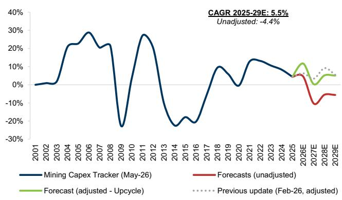

line chart

| Year | Mining Capex Tracker (May-26) | Forecasts (unadjusted) | Forecast (adjusted - Upcycle) | Previous update (Feb-26, adjusted) |
|------|-------------------------------|------------------------|-------------------------------|------------------------------------|
| 2001 | ~0%                           |                        |                               |                                    |
| 2002 | ~0%                           |                        |                               |                                    |
| 2003 | ~0%                           |                        |                               |                                    |
| 2004 | ~20%                          |                        |                               |                                    |
| 2005 | ~25%                          |                        |                               |                                    |
| 2006 | ~30%                          |                        |                               |                                    |
| 2007 | ~25%                          |                        |                               |                                    |
| 2008 | ~20%                          |                        |                               |                                    |
| 2009 | ~-25%                         |                        |                               |                                    |
| 2010 | ~10%                          |                        |                               |                                    |
| 2011 | ~30%                          |                        |                               |                                    |
| 2012 | ~25%                          |                        |                               |                                    |
| 2013 | ~-15%                         |                        |                               |                                    |
| 2014 | ~-25%                         |                        |                               |                                    |
| 2015 | ~-20%                         |                        |                               |                                    |
| 2016 | ~-15%                         |                        |                               |                                    |
| 2017 | ~-10%                         |                        |                               |                                    |
| 2018 | ~10%                          |                        |                               |                                    |
| 2019 | ~5%                           |                        |                               |                                    |
| 2020 | ~0%                           |                        |                               |                                    |
| 2021 | ~15%                          |                        |                               |                                    |
| 2022 | ~15%                          |                        |                               |                                    |
| 2023 | ~10%                          |                        |                               |                                    |
| 2024E| ~5%                           |                        |                               |                                    |
| 2025E| ~5%                           |                        |                               |                                    |
| 2026E| ~5%                           |                        |                               |                                    |
| 2027E| ~5%                           |                        |                               |                                    |
| 2028E| ~5%                           |                        |                               |                                    |
| 2029E| ~5%                           |                        |                               |                                    |
CAGR 2025-29E: 5.5%; Unadjusted: -4.4%

Source: Company data, Bloomberg, GS Global Investment Research

Exhibit 80: Vehicles capacity utilization is below the median level  
Average Capacity Utilization (US, EU, China)  
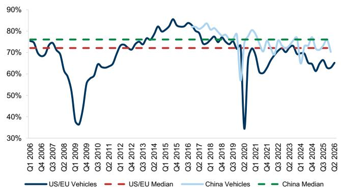

line chart

| Quarter | US/EU Vehicles | China Vehicles | US/EU Median | China Median |
|---------|----------------|----------------|--------------|--------------|
| Q1 2006 | ~75%           | ~75%           | ~73%         | ~75%         |
| Q4 2006 | ~75%           | ~75%           | ~73%         | ~75%         |
| Q3 2007 | ~75%           | ~75%           | ~73%         | ~75%         |
| Q2 2008 | ~75%           | ~75%           | ~73%         | ~75%         |
| Q1 2009 | ~35%           | ~75%           | ~73%         | ~75%         |
| Q4 2009 | ~55%           | ~75%           | ~73%         | ~75%         |
| Q3 2010 | ~65%           | ~75%           | ~73%         | ~75%         |
| Q2 2011 | ~65%           | ~75%           | ~73%         | ~75%         |
| Q1 2012 | ~70%           | ~75%           | ~73%         | ~75%         |
| Q4 2012 | ~75%           | ~75%           | ~73%         | ~75%         |
| Q3 2013 | ~75%           | ~75%           | ~73%         | ~75%         |
| Q2 2014 | ~80%           | ~75%           | ~73%         | ~75%         |
| Q1 2015 | ~85%           | ~75%           | ~73%         | ~75%         |
| Q4 2015 | ~85%           | ~75%           | ~73%         | ~75%         |
| Q3 2016 | ~80%           | ~75%           | ~73%         | ~75%         |
| Q2 2017 | ~80%           | ~75%           | ~73%         | ~75%         |
| Q1 2018 | ~80%           | ~75%           | ~73%         | ~75%         |
| Q4 2018 | ~80%           | ~75%           | ~73%         | ~75%         |
| Q3 2019 | ~80%           | ~75%           | ~73%         | ~75%         |
| Q2 2020 | ~35%           | ~80%           | ~73%         | ~75%         |
| Q1 2021 | ~70%           | ~80%           | ~73%         | ~75%         |
| Q4 2021 | ~65%           | ~80%           | ~73%         | ~75%         |
| Q3 2022 | ~65%           | ~80%           | ~73%         | ~75%         |
| Q2 2023 | ~65%           | ~80%           | ~73%         | ~75%         |
| Q1 2024 | ~65%           | ~80%           | ~73%         | ~75%         |
| Q4 2024 | ~65%           | ~80%           | ~73%         | ~75%         |
| Q3 2025 | ~65%           | ~80%           | ~73%         | ~75%         |
| Q2 2026 | ~65%           | ~80%           | ~73%         | ~75%         |

China data till 3Q25  
Source: Federal Reserve, DG ECFIN, NBS

Exhibit 82: Mining Capex/Sales is expected to remain at the median level in 2026  
Mining Capex/Sales  
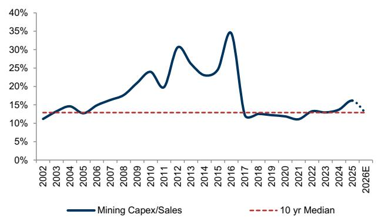

line chart

| Year | Mining Capex/Sales |
|------|---------------------|
| 2002 | ~11%                |
| 2003 | ~13%                |
| 2004 | ~14%                |
| 2005 | ~13%                |
| 2006 | ~15%                |
| 2007 | ~16%                |
| 2008 | ~18%                |
| 2009 | ~20%                |
| 2010 | ~23%                |
| 2011 | ~25%                |
| 2012 | ~30%                |
| 2013 | ~28%                |
| 2014 | ~25%                |
| 2015 | ~23%                |
| 2016 | ~35%                |
| 2017 | ~12%                |
| 2018 | ~13%                |
| 2019 | ~13%                |
| 2020 | ~13%                |
| 2021 | ~13%                |
| 2022 | ~13%                |
| 2023 | ~13%                |
| 2024 | ~14%                |
| 2025 | ~15%                |
| 2026E| ~14%                |

Source: Company data, Bloomberg, GS Global Investment Research

Exhibit 83: Mining Capex/Depreciation is expected above median levels in 2026  
Mining Capex/Depreciation  
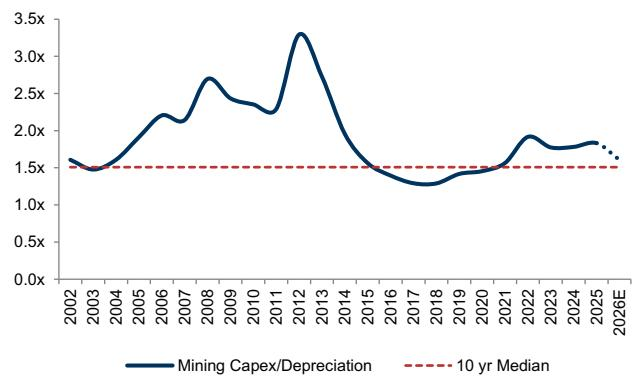

line chart

| Year | Mining Capex/Depreciation |
|------|---------------------------|
| 2002 | 1.6x                      |
| 2003 | 1.5x                      |
| 2004 | 1.7x                      |
| 2005 | 2.0x                      |
| 2006 | 2.2x                      |
| 2007 | 2.1x                      |
| 2008 | 2.7x                      |
| 2009 | 2.4x                      |
| 2010 | 2.3x                      |
| 2011 | 2.2x                      |
| 2012 | 3.3x                      |
| 2013 | 2.8x                      |
| 2014 | 2.0x                      |
| 2015 | 1.6x                      |
| 2016 | 1.4x                      |
| 2017 | 1.3x                      |
| 2018 | 1.4x                      |
| 2019 | 1.5x                      |
| 2020 | 1.6x                      |
| 2021 | 1.8x                      |
| 2022 | 1.9x                      |
| 2023 | 1.8x                      |
| 2024 | 1.9x                      |
| 2025 | 1.8x                      |
| 2026E| 1.7x                      |

Source: Company data, Bloomberg, GS Global Investment Research

Exhibit 85: Mining equipment age is above the long-run average  
Average Age of Mining Equipment (US)  
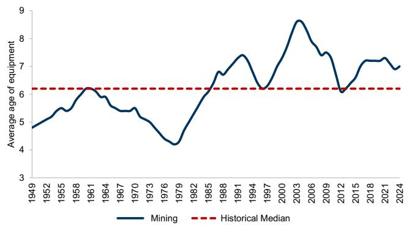

line chart

| Year | Mining | Historical Median |
|------|--------|-------------------|
| 1949 | 4.8    | 6.0               |
| 1952 | 5.2    | 6.0               |
| 1955 | 5.5    | 6.0               |
| 1958 | 5.8    | 6.0               |
| 1961 | 6.2    | 6.0               |
| 1964 | 5.8    | 6.0               |
| 1967 | 5.5    | 6.0               |
| 1970 | 5.3    | 6.0               |
| 1973 | 5.0    | 6.0               |
| 1976 | 4.5    | 6.0               |
| 1979 | 4.2    | 6.0               |
| 1982 | 5.0    | 6.0               |
| 1985 | 6.0    | 6.0               |
| 1988 | 6.8    | 6.0               |
| 1991 | 7.2    | 6.0               |
| 1994 | 7.5    | 6.0               |
| 1997 | 6.2    | 6.0               |
| 2000 | 7.5    | 6.0               |
| 2003 | 8.5    | 6.0               |
| 2006 | 7.8    | 6.0               |
| 2009 | 7.5    | 6.0               |
| 2012 | 6.2    | 6.0               |
| 2015 | 7.0    | 6.0               |
| 2018 | 7.2    | 6.0               |
| 2021 | 7.3    | 6.0               |
| 2024 | 7.0    | 6.0               |

Source: US Bureau of Economic Analysis

Exhibit 84: We expect 2026 to end 11% below the historical peak (2012)  
GS Mining Capex Tracker (indexed)  
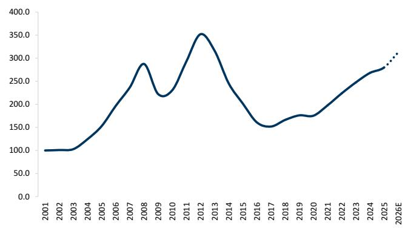

line chart

| Year | Value |
|------|-------|
| 2001 | 100.0 |
| 2002 | 100.0 |
| 2003 | 100.0 |
| 2004 | 150.0 |
| 2005 | 200.0 |
| 2006 | 250.0 |
| 2007 | 300.0 |
| 2008 | 350.0 |
| 2009 | 250.0 |
| 2010 | 250.0 |
| 2011 | 350.0 |
| 2012 | 350.0 |
| 2013 | 350.0 |
| 2014 | 350.0 |
| 2015 | 350.0 |
| 2016 | 350.0 |
| 2017 | 350.0 |
| 2018 | 350.0 |
| 2019 | 350.0 |
| 2020 | 350.0 |
| 2021 | 350.0 |
| 2022 | 350.0 |
| 2023 | 350.0 |
| 2024 | 350.0 |
| 2025 | 350.0 |
| 2026E | 350.0 |

Source: Company data, Bloomberg, GS Global Investment Research

Exhibit 86: Mining capacity utilization has been on a downward trend  
Average Capacity Utilization (US, China)  
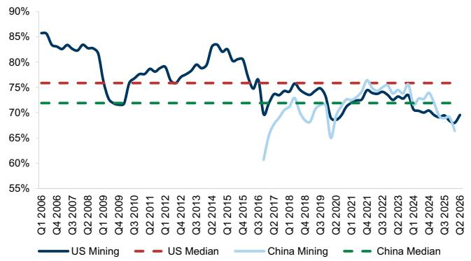

line chart

| Quarter | US Mining | China Mining | US Median | China Median |
|---------|-----------|--------------|-----------|--------------|
| Q1 2006 | 85%       | -            | 75%       | 72%          |
| Q4 2006 | -         | -            | 75%       | 72%          |
| Q3 2007 | -         | -            | 75%       | 72%          |
| Q2 2008 | -         | -            | 75%       | 72%          |
| Q1 2009 | -         | -            | 75%       | 72%          |
| Q4 2009 | -         | -            | 75%       | 72%          |
| Q3 2010 | -         | -            | 75%       | 72%          |
| Q2 2011 | -         | -            | 75%       | 72%          |
| Q1 2012 | -         | -            | 75%       | 72%          |
| Q4 2012 | -         | -            | 75%       | 72%          |
| Q3 2013 | -         | -            | 75%       | 72%          |
| Q2 2014 | -         | -            | 75%       | 72%          |
| Q1 2015 | -         | -            | 75%       | 72%          |
| Q4 2015 | -         | -            | 75%       | 72%          |
| Q3 2016 | -         | -            | 75%       | 72%          |
| Q2 2017 | -         | -            | 75%       | 72%          |
| Q1 2018 | -         | -            | 75%       | 72%          |
| Q4 2018 | -         | -            | 75%       | 72%          |
| Q3 2019 | -         | -            | 75%       | 72%          |
| Q2 2020 | -         | -            | 75%       | 72%          |
| Q1 2021 | -         | -            | 75%       | 72%          |
| Q4 2021 | -         | -            | 75%       | 72%          |
| Q3 2022 | -         | -            | 75%       | 72%          |
| Q2 2023 | -         | -            | 75%       | 72%          |
| Q1 2024 | -         | -            | 75%       | 72%          |
| Q4 2024 | -         | -            | 75%       | 72%          |
| Q3 2025 | -         | -            | 75%       | 72%          |
| Q2 2026 | -         | -            | 75%       | 72%          |

China data till 1Q26  
Source: Federal Reserve, NBS

## Copper

Exhibit 87: We are seeing copper capex upgrades into 2026 and outer years  
GS Mining Capex Tracker (26 companies, €42 bn of capex in 2026)  
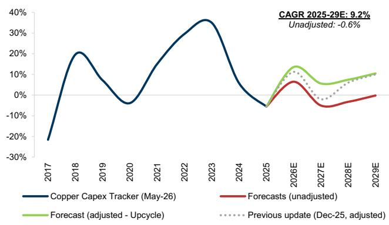

line chart

| Year   | Copper Capex Tracker (May-26) | Forecasts (unadjusted) | Forecast (adjusted - Upcycle) | Previous update (Dec-25, adjusted) |
|--------|-------------------------------|------------------------|-------------------------------|------------------------------------|
| 2017   | -20%                          | -                      | -                             | -                                  |
| 2018   | 20%                           | -                      | -                             | -                                  |
| 2019   | 10%                           | -                      | -                             | -                                  |
| 2020   | -5%                           | -                      | -                             | -                                  |
| 2021   | 15%                           | -                      | -                             | -                                  |
| 2022   | 30%                           | -                      | -                             | -                                  |
| 2023   | 35%                           | -                      | -                             | -                                  |
| 2024   | 10%                           | -                      | -                             | -                                  |
| 2025   | -5%                           | -                      | -                             | -                                  |
| 2026E  | -                             | 5%                     | 10%                           | 10%                                |
| 2027E  | -                             | -5%                    | 5%                            | 5%                                 |
| 2028E  | -                             | -                      | 10%                           | 10%                                |
| 2029E  | -                             | 0%                     | 15%                           | 15%                                |

Source: Company data, GS Global Investment Research, Visible Alpha Consensus Data

## Chemicals

Exhibit 89: Chemicals capex has been cut for outer years GS Chemicals Capex Tracker (98 companies, €90 bn of capex in 2026)  
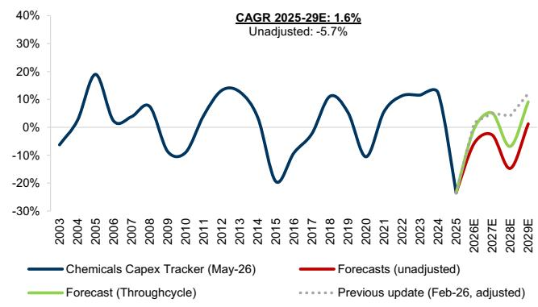

line chart

| Year | Chemicals Capex Tracker (May-26) | Forecasts (unadjusted) | Forecast (Throughcycle) | Previous update (Feb-26, adjusted) |
|------|----------------------------------|------------------------|------------------------|------------------------------------|
| 2025E | -20% | -10% | -5% | -5.7% |
| 2026E | -10% | -5% | 0% | 0% |
| 2027E | 0% | 5% | 5% | 5% |
| 2028E | 5% | 10% | 10% | 10% |
| 2029E | 10% | 15% | 15% | 15% |

Source: Company data, Bloomberg, GS Global Investment Research

Exhibit 88: We expect 2026 to end 7% above the historical peak (2024)  
GS Copper Capex Tracker (indexed)  
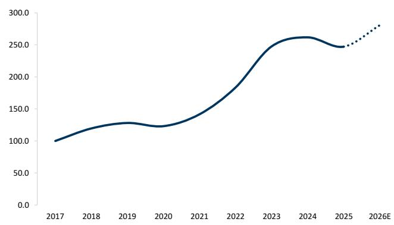

line chart

| Year   | Value |
| ------ | ----- |
| 2017   | 100.0 |
| 2018   | 120.0 |
| 2019   | 130.0 |
| 2020   | 125.0 |
| 2021   | 140.0 |
| 2022   | 180.0 |
| 2023   | 250.0 |
| 2024   | 260.0 |
| 2025   | 250.0 |
| 2026E  | 280.0 |

Source: Company data, Bloomberg, GS Global Investment Research

Exhibit 90: Chemicals Capex/Sales is falling below median levels in 2026  
Chemicals Capex/Sales  
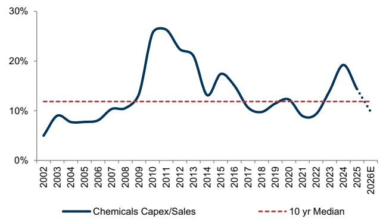

line chart

| Year | Chemicals Capex/Sales |
|------|------------------------|
| 2002 | ~5%                    |
| 2003 | ~9%                    |
| 2004 | ~8%                    |
| 2005 | ~8%                    |
| 2006 | ~9%                    |
| 2007 | ~10%                   |
| 2008 | ~11%                   |
| 2009 | ~13%                   |
| 2010 | ~26%                   |
| 2011 | ~25%                   |
| 2012 | ~23%                   |
| 2013 | ~21%                   |
| 2014 | ~13%                   |
| 2015 | ~17%                   |
| 2016 | ~15%                   |
| 2017 | ~12%                   |
| 2018 | ~10%                   |
| 2019 | ~12%                   |
| 2020 | ~13%                   |
| 2021 | ~9%                    |
| 2022 | ~10%                   |
| 2023 | ~14%                   |
| 2024 | ~19%                   |
| 2025 | ~15%                   |
| 2026E| ~10%                   |

Source: Company data, Bloomberg, GS Global Investment Research

Exhibit 91: Chemicals Capex/Depreciation is trending below median levels in 2026  
Chemicals Capex/Depreciation  
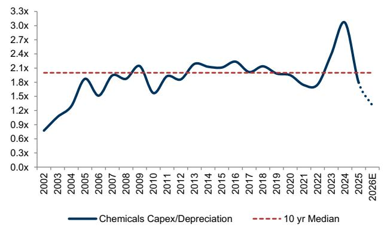

line chart

| Year | Chemicals Capex/Depreciation |
|------|------------------------------|
| 2002 | 0.8x                         |
| 2003 | 1.0x                         |
| 2004 | 1.2x                         |
| 2005 | 1.8x                         |
| 2006 | 1.5x                         |
| 2007 | 1.9x                         |
| 2008 | 1.8x                         |
| 2009 | 2.1x                         |
| 2010 | 1.5x                         |
| 2011 | 1.8x                         |
| 2012 | 2.1x                         |
| 2013 | 2.2x                         |
| 2014 | 2.1x                         |
| 2015 | 2.3x                         |
| 2016 | 2.1x                         |
| 2017 | 2.2x                         |
| 2018 | 2.1x                         |
| 2019 | 1.9x                         |
| 2020 | 1.8x                         |
| 2021 | 1.7x                         |
| 2022 | 1.8x                         |
| 2023 | 2.5x                         |
| 2024 | 3.1x                         |
| 2025E| 1.8x                         |
| 2026E| 1.3x                         |

Source: Company data, Bloomberg, GS Global Investment Research

Exhibit 93: Age of Chemical equipment in the US is above history  
Average Age of Chemical Equipment (US)  
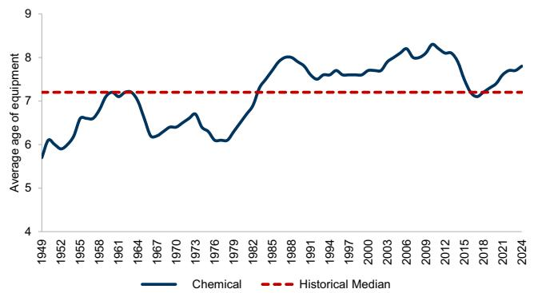

line chart

| Year | Chemical | Historical Median |
|------|----------|-------------------|
| 1949 | 5.8      | 7.2               |
| 1952 | 6.0      | 7.2               |
| 1955 | 6.5      | 7.2               |
| 1958 | 6.8      | 7.2               |
| 1961 | 7.2      | 7.2               |
| 1964 | 7.0      | 7.2               |
| 1967 | 6.2      | 7.2               |
| 1970 | 6.4      | 7.2               |
| 1973 | 6.6      | 7.2               |
| 1976 | 6.0      | 7.2               |
| 1979 | 6.2      | 7.2               |
| 1982 | 7.0      | 7.2               |
| 1985 | 7.8      | 7.2               |
| 1988 | 8.0      | 7.2               |
| 1991 | 7.8      | 7.2               |
| 1994 | 7.6      | 7.2               |
| 1997 | 7.6      | 7.2               |
| 2000 | 7.8      | 7.2               |
| 2003 | 8.0      | 7.2               |
| 2006 | 8.2      | 7.2               |
| 2009 | 8.4      | 7.2               |
| 2012 | 8.2      | 7.2               |
| 2015 | 7.0      | 7.2               |
| 2018 | 7.2      | 7.2               |
| 2021 | 7.6      | 7.2               |
| 2024 | 7.8      | 7.2               |

Source: US Bureau of Economic Analysis

Exhibit 92: We expect 2026 to end 24% below the historical peak (2024)  
GS Chemicals Capex Tracker (indexed)  
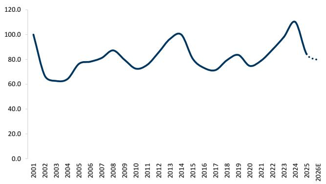

line chart

| Year | Value |
| ---- | ----- |
| 2001 | 100.0 |
| 2002 | 65.0  |
| 2003 | 63.0  |
| 2004 | 65.0  |
| 2005 | 78.0  |
| 2006 | 80.0  |
| 2007 | 85.0  |
| 2008 | 88.0  |
| 2009 | 75.0  |
| 2010 | 72.0  |
| 2011 | 78.0  |
| 2012 | 85.0  |
| 2013 | 95.0  |
| 2014 | 100.0 |
| 2015 | 85.0  |
| 2016 | 75.0  |
| 2017 | 72.0  |
| 2018 | 80.0  |
| 2019 | 85.0  |
| 2020 | 75.0  |
| 2021 | 80.0  |
| 2022 | 85.0  |
| 2023 | 95.0  |
| 2024 | 110.0 |
| 2025E | 85.0 |
| 2026E | 80.0 |

Source: Company data, Bloomberg, GS Global Investment Research,

Exhibit 94: Chemicals capacity utilization is below median levels  
Average Capacity Utilization (US, EU, China)  
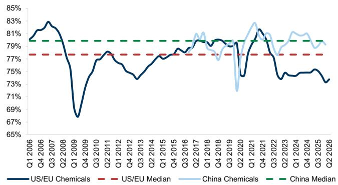

line chart

| Quarter | US/EU Chemicals | US/EU Median | China Chemicals | China Median |
|---------|-----------------|--------------|-----------------|--------------|
| Q1 2006 | 81%             | 77%          | -               | 79%          |
| Q4 2006 | 83%             | 77%          | -               | 79%          |
| Q3 2007 | 81%             | 77%          | -               | 79%          |
| Q2 2008 | 75%             | 77%          | -               | 79%          |
| Q1 2009 | 68%             | 77%          | -               | 79%          |
| Q4 2009 | 75%             | 77%          | -               | 79%          |
| Q3 2010 | 78%             | 77%          | -               | 79%          |
| Q2 2011 | 79%             | 77%          | -               | 79%          |
| Q1 2012 | 78%             | 77%          | -               | 79%          |
| Q4 2012 | 75%             | 77%          | -               | 79%          |
| Q3 2013 | 73%             | 77%          | -               | 79%          |
| Q2 2014 | 75%             | 77%          | -               | 79%          |
| Q1 2015 | 76%             | 77%          | -               | 79%          |
| Q4 2015 | 78%             | 77%          | -               | 79%          |
| Q3 2016 | 80%             | 77%          | -               | 79%          |
| Q2 2017 | 81%             | 77%          | -               | 79%          |
| Q1 2018 | 80%             | 77%          | -               | 79%          |
| Q4 2018 | 81%             | 77%          | -               | 79%          |
| Q3 2019 | 80%             | 77%          | -               | 79%          |
| Q2 2020 | 75%             | 77%          | -               | 79%          |
| Q1 2021 | 83%             | 77%          | -               | 79%          |
| Q4 2021 | 81%             | 77%          | -               | 79%          |
| Q3 2022 | 75%             | 77%          | -               | 79%          |
| Q2 2023 | 76%             | 77%          | -               | 79%          |
| Q1 2024 | 81%             | 77%          | -               | 79%          |
| Q4 2024 | 80%             | 77%          | -               | 79%          |
| Q3 2025 | 81%             | 77%          | -               | 79%          |
| Q2 2026 | 80%             | 77%          | -               | 79%          |

China data till 1Q26  
Source: Federal Reserve, DG ECFIN, NBS

## Airlines

Exhibit 95: Airlines capex remains in line with our previous Feb update  
GS Airlines Capex Tracker (107 companies, €89 bn of capex in 2026)  
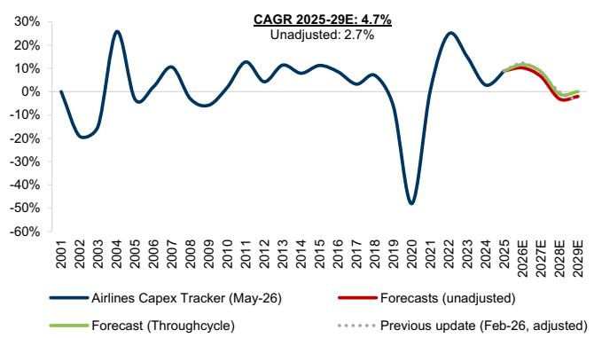

line chart

| Year | Airlines Capex Tracker (May-26) | Forecasts (unadjusted) | Forecast (Throughcycle) | Previous update (Feb-26, adjusted) |
|------|----------------------------------|------------------------|-------------------------|------------------------------------|
| 2001 | ~0%                              |                        |                         |                                    |
| 2002 | ~-20%                            |                        |                         |                                    |
| 2003 | ~-15%                            |                        |                         |                                    |
| 2004 | ~25%                             |                        |                         |                                    |
| 2005 | ~-5%                             |                        |                         |                                    |
| 2006 | ~10%                             |                        |                         |                                    |
| 2007 | ~5%                              |                        |                         |                                    |
| 2008 | ~-5%                             |                        |                         |                                    |
| 2009 | ~-10%                            |                        |                         |                                    |
| 2010 | ~10%                             |                        |                         |                                    |
| 2011 | ~15%                             |                        |                         |                                    |
| 2012 | ~10%                             |                        |                         |                                    |
| 2013 | ~5%                              |                        |                         |                                    |
| 2014 | ~10%                             |                        |                         |                                    |
| 2015 | ~5%                              |                        |                         |                                    |
| 2016 | ~0%                              |                        |                         |                                    |
| 2017 | ~5%                              |                        |                         |                                    |
| 2018 | ~10%                             |                        |                         |                                    |
| 2019 | ~-50%                            |                        |                         |                                    |
| 2020 | ~-50%                            |                        |                         |                                    |
| 2021 | ~25%                             |                        |                         |                                    |
| 2022E| ~15%                             |                        |                         |                                    |
| 2023E| ~5%                              |                        |                         |                                    |
| 2024E| ~10%                             |                        |                         |                                    |
| 2025E| ~15%                             |                        |                         |                                    |
| 2026E| ~10%                             |                        |                         |                                    |
| 2027E| ~5%                              |                        |                         |                                    |
| 2028E| ~0%                              |                        |                         |                                    |
| 2029E| ~-5%                             |                        |                         |                                    |
| CAGR 2025-29E: 4.7% Unadjusted: 2.7%

Source: Company data, Bloomberg, GS Global Investment Research

Exhibit 97: Airlines Capex/Depreciation is seen below median levels in 2026  
Airlines Capex/Depreciation  
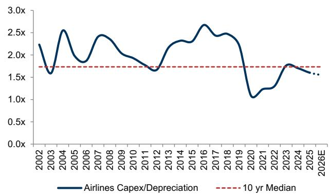

line chart

| Year | Airlines Capex/Depreciation |
|------|-----------------------------|
| 2002 | 2.3x                        |
| 2003 | 1.6x                        |
| 2004 | 2.5x                        |
| 2005 | 1.9x                        |
| 2006 | 2.4x                        |
| 2007 | 2.3x                        |
| 2008 | 2.1x                        |
| 2009 | 1.9x                        |
| 2010 | 1.8x                        |
| 2011 | 1.7x                        |
| 2012 | 1.6x                        |
| 2013 | 2.1x                        |
| 2014 | 2.3x                        |
| 2015 | 2.4x                        |
| 2016 | 2.7x                        |
| 2017 | 2.5x                        |
| 2018 | 2.4x                        |
| 2019 | 2.3x                        |
| 2020 | 1.0x                        |
| 2021 | 1.3x                        |
| 2022 | 1.4x                        |
| 2023 | 1.8x                        |
| 2024 | 1.7x                        |
| 2025 | 1.6x                        |
| 2026E| 1.5x                        |

Source: Company data, Bloomberg, GS Global Investment Research

Exhibit 96: Airlines Capex/Sales is expected to fall below the median levels in 2026  
Airlines Capex/Sales  
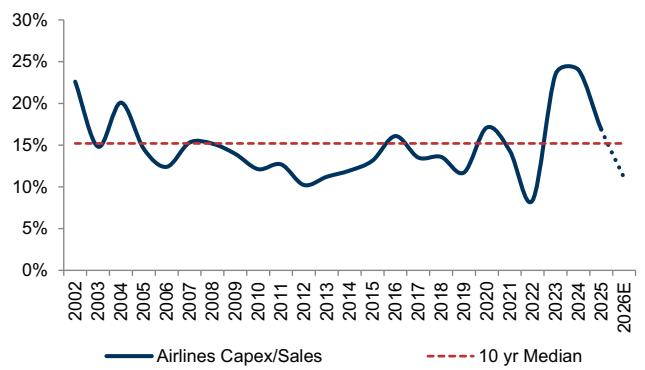

line chart

| Year | Airlines Capex/Sales |
|------|----------------------|
| 2002 | 23%                  |
| 2003 | 15%                  |
| 2004 | 20%                  |
| 2005 | 15%                  |
| 2006 | 13%                  |
| 2007 | 15%                  |
| 2008 | 15%                  |
| 2009 | 14%                  |
| 2010 | 13%                  |
| 2011 | 12%                  |
| 2012 | 10%                  |
| 2013 | 11%                  |
| 2014 | 12%                  |
| 2015 | 13%                  |
| 2016 | 16%                  |
| 2017 | 15%                  |
| 2018 | 14%                  |
| 2019 | 13%                  |
| 2020 | 17%                  |
| 2021 | 15%                  |
| 2022 | 8%                   |
| 2023 | 24%                  |
| 2024 | 25%                  |
| 2025 | 18%                  |
| 2026E| 12%                  |

Source: Company data, Bloomberg, GS Global Investment Research

Exhibit 98: We expect 2026 to end 12% below the historical peak (2018)  
GS Airlines Capex Tracker (indexed)  
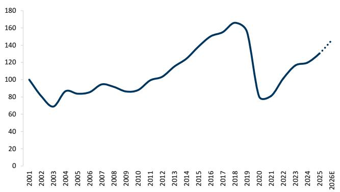

line chart

| Year | Value |
|------|-------|
| 2001 | 100   |
| 2002 | 80    |
| 2003 | 70    |
| 2004 | 90    |
| 2005 | 85    |
| 2006 | 90    |
| 2007 | 95    |
| 2008 | 90    |
| 2009 | 85    |
| 2010 | 90    |
| 2011 | 100   |
| 2012 | 110   |
| 2013 | 120   |
| 2014 | 130   |
| 2015 | 140   |
| 2016 | 150   |
| 2017 | 160   |
| 2018 | 165   |
| 2019 | 160   |
| 2020 | 80    |
| 2021 | 90    |
| 2022 | 110   |
| 2023 | 120   |
| 2024 | 130   |
| 2025 | 140   |
| 2026E| 150   |

Source: Company data, Bloomberg, GS Global Investment Research

Exhibit 99: The age of Airlines equipment is at all-time highs  
Average Age of Airline Equipment (US)  
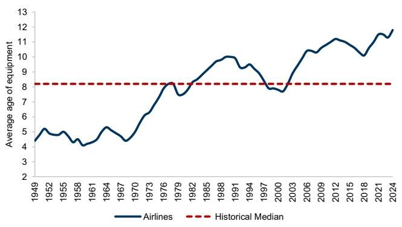

line chart

| Year | Average age of equipment |
| ---- | ------------------------ |
| 1949 | 4.5                      |
| 1952 | 5.0                      |
| 1955 | 4.8                      |
| 1958 | 4.2                      |
| 1961 | 4.0                      |
| 1964 | 5.0                      |
| 1967 | 4.5                      |
| 1970 | 5.5                      |
| 1973 | 6.5                      |
| 1976 | 8.0                      |
| 1979 | 7.5                      |
| 1982 | 8.5                      |
| 1985 | 9.5                      |
| 1988 | 10.0                     |
| 1991 | 9.5                      |
| 1994 | 9.0                      |
| 1997 | 8.0                      |
| 2000 | 7.5                      |
| 2003 | 8.5                      |
| 2006 | 10.0                     |
| 2009 | 10.5                     |
| 2012 | 11.0                     |
| 2015 | 10.5                     |
| 2018 | 10.0                     |
| 2021 | 11.5                     |
| 2024 | 12.0                     |

Source: US Bureau of Economic Analysis

## Pharma

## Exhibit 101: Our pharma capex expectations for 2026 have increased sharply vs previous update

GS Pharma Capex Tracker (124 companies, €58 bn of capex in 2026)

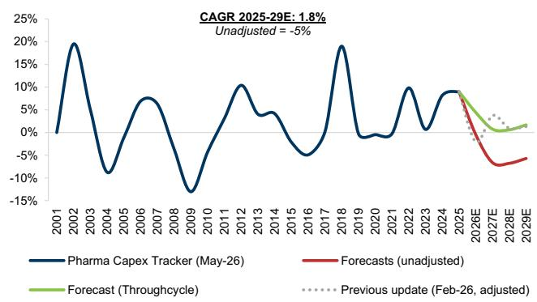

line chart

| Year | Pharma Capex Tracker (May-26) | Forecasts (unadjusted) | Forecast (Throughcycle) | Previous update (Feb-26, adjusted) |
| --- | --- | --- | --- | --- |
| 2001 | ~0% |  |  |  |
| 2002 | ~20% |  |  |  |
| 2003 | ~-10% |  |  |  |
| 2004 | ~-15% |  |  |  |
| 2005 | ~-5% |  |  |  |
| 2006 | ~7% |  |  |  |
| 2007 | ~5% |  |  |  |
| 2008 | ~-10% |  |  |  |
| 2009 | ~-15% |  |  |  |
| 2010 | ~-5% |  |  |  |
| 2011 | ~10% |  |  |  |
| 2012 | ~15% |  |  |  |
| 2013 | ~5% |  |  |  |
| 2014 | ~0% |  |  |  |
| 2015 | ~-5% |  |  |  |
| 2016 | ~-10% |  |  |  |
| 2017 | ~-5% |  |  |  |
| 2018 | ~18% |  |  |  |
| 2019 | ~-5% |  |  |  |
| 2020 | ~-5% |  |  |  |
| 2021 | ~-5% |  |  |  |
| 2022 | ~10% |  |  |  |
| 2023 | ~5% |  |  |  |
| 2024 | ~-5% |  |  |  |
| 2025E | ~10% | ~8% | ~8% | ~8% |
| 2026E | ~8% | ~5% | ~5% | ~5% |
| 2027E | ~5% | ~-5% | ~-5% | ~-5% |
| 2028E | ~3% | ~-7% | ~-7% | ~-7% |
| 2029E | ~1% | ~-8% | ~-8% | ~-8% |
| 2030E | ~0.5% | ~-9% | ~-9% | ~-9% |
| 2031E | ~0.5% | ~-9.5% | ~-9.5% | ~-9.5% |
| 2032E | ~0.5% | ~-9.5% | ~-9.5% | ~-9.5% |
| 2033E | ~0.5% | ~-9.5% | ~-9.5% | ~-9.5% |
| 2034E | ~0.5% | ~-9.5% | ~-9.5% | ~-9.5% |
| 2035E | ~0.5% | ~-9.5% | ~-9.5% | ~-9.5% |
| 2036E | ~0.5% | ~-9.5% | ~-9.5% | ~-9.5% |
| 2037E | ~0.5% | ~-9.5% | ~-9.5% | ~-9.5% |
| 2038E | ~0.5% | ~-9.5% | ~-9.5% | ~-9.5% |
| 2039E | ~0.5% | ~-9.5% | ~-9.5% | ~-9.5% |
| 2040E | ~0.5% | ~-9.5% | ~-9.5% | ~-9.5% |
| 2041E | ~0.5% | ~-9.5% | ~-9.5% | ~-9.5% |
| 2042E | ~0.5% | ~-9.5% | ~-9.5% | ~-9.5% |
| 2043E | ~0.5% | ~-9.5% | ~-9.5% | ~-9.5% |
| 2044E | ~0.5% | ~-9.5% | ~-9.5% | ~-9.5% |
| 2045E | ~0.5% | ~-9.5% | ~-9.5% | ~-9.5% |
| 2046E | ~0.5% | ~-9.5% | ~-9.5% | ~-9.5% |
| 2047E | ~0.5% | ~-9.5% | ~-9.5% | ~-9.5% |
| 2048E | ~0.5% | ~-9.5% | ~-9.5% | ~-9.5% |
| 2049E | ~0.5% | ~-9.5% | ~-9.5% | ~-9.5% |
| 2050E | ~0.5% | ~-9.5% | ~-9.5% | ~-9.5% |
| 2051E | ~0.5% | ~-9.5% | ~-9.5% | ~-9.5% |
| 2052E | ~0.5% | ~-9.5% | ~-9.5% | ~-9.5% |
| 2053E | ~0.5% | ~-9.5% | ~-9.5% | ~-9.5% |
| 2054E | ~0.5% | ~-9.5% | ~-9.5% | ~-9.5% |
| 2055E | ~0.5% | ~-9.5% | ~-9.5% | ~-9.5% |
| 2056E | ~0.5% | ~-9.5% | ~-9.5% | ~-9.5% |
| 2057E | ~0.5% | ~-9.5% | ~-9.5% | ~-9.5% |
| 2058E | ~0.5% | ~-9.5% | ~-9.5% | ~-9.5% |
| 2059E | ~0.5% | ~-9.5% | ~-9.5% | ~-9.5% |
| 2060E | ~0.5% | < -7.777777777777777> | < -7.777777777777777> | < -7.777777777777777> |
| 2061E | > -7.777777777777778> | < -8333333333333333> | < -8333333333333333> | < -8333333333333333> |
| 2062E | > -8333333333333334> | < -8666666666666666> | < -8666666666666666> | < -8666666666666666> |
| 2063E | > -8666666666666666> | < -8888888888888888> | < -8888888888888888> | < -8888888888888888> |
| 2064E | > -8888888888888888> | < -9111111111111111> | < -9111111111111111> | < -9111111111111111> |
| 2065E | > -8888888888888888> | < -9444444444444444> | < -9444444444444444> | < -944444444444444> |
| 2066E | > -8888888888888888> | < -9766666666666666> | < -9766666666666666> | < -976666666666666> |
| 2067E | > -8888888888888888> | < -10111111111111111> | < -10111111111111111> | < -101111111111111> |
| 2068E | > -8888888888888888> | < -1244444444444444> | < -1244444444444444> | < -1244444444444 |

Source: Company data, Bloomberg, GS Global Investment Research

Exhibit 100: Airlines capacity utilization is increasing and approaching median levels  
Average Capacity Utilization (US)  
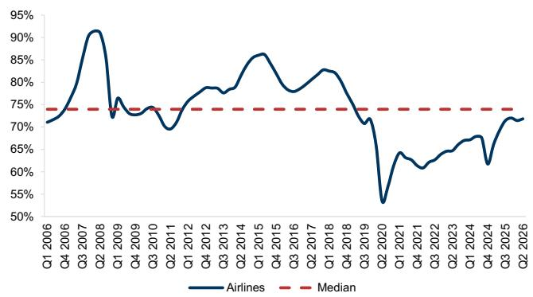

line chart

| Quarter | Airlines |
| ------- | -------- |
| Q1 2006 | 70%      |
| Q4 2006 | 75%      |
| Q3 2007 | 90%      |
| Q2 2008 | 75%      |
| Q1 2009 | 70%      |
| Q4 2009 | 75%      |
| Q3 2010 | 70%      |
| Q2 2011 | 75%      |
| Q1 2012 | 75%      |
| Q4 2012 | 75%      |
| Q3 2013 | 75%      |
| Q2 2014 | 85%      |
| Q1 2015 | 85%      |
| Q4 2015 | 80%      |
| Q3 2016 | 85%      |
| Q2 2017 | 80%      |
| Q1 2018 | 85%      |
| Q4 2018 | 80%      |
| Q3 2019 | 75%      |
| Q2 2020 | 55%      |
| Q1 2021 | 65%      |
| Q4 2021 | 60%      |
| Q3 2022 | 65%      |
| Q2 2023 | 65%      |
| Q1 2024 | 65%      |
| Q4 2024 | 65%      |
| Q3 2025 | 70%      |
| Q2 2026 | 75%      |

Source: Federal Reserve

## Exhibit 102: Pharma Capex/Sales is expected to be at median levels in 2026

Pharma Capex/Sales

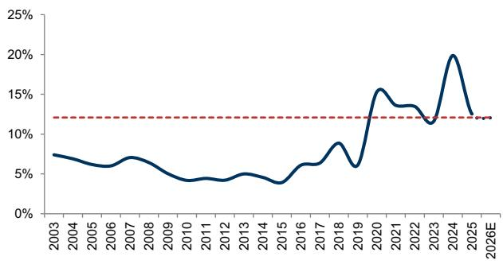

line chart

| Year | Value |
|------|-------|
| 2003 | ~7%   |
| 2004 | ~6%   |
| 2005 | ~5.5% |
| 2006 | ~6%   |
| 2007 | ~7%   |
| 2008 | ~6%   |
| 2009 | ~5%   |
| 2010 | ~4.5% |
| 2011 | ~4.5% |
| 2012 | ~4.5% |
| 2013 | ~4.5% |
| 2014 | ~4.5% |
| 2015 | ~4%   |
| 2016 | ~6%   |
| 2017 | ~7%   |
| 2018 | ~9%   |
| 2019 | ~6%   |
| 2020 | ~15%  |
| 2021 | ~13%  |
| 2022 | ~13%  |
| 2023 | ~11%  |
| 2024 | ~20%  |
| 2025 | ~12%  |
| 2026E| ~12%  |

Source: Company data, Bloomberg, GS Global Investment Research

Exhibit 103: Pharma Capex/Depreciation is above the median levels in 2026 but decelerating  
Pharma Capex/Depreciation  
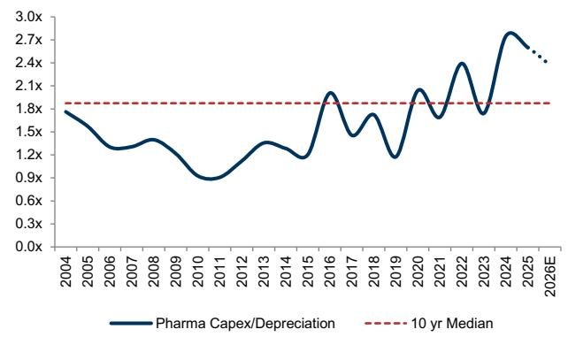

line chart

| Year | Pharma Capex/Depreciation |
|------|---------------------------|
| 2004 | 1.8x                      |
| 2005 | 1.6x                      |
| 2006 | 1.4x                      |
| 2007 | 1.3x                      |
| 2008 | 1.4x                      |
| 2009 | 1.2x                      |
| 2010 | 0.9x                      |
| 2011 | 1.0x                      |
| 2012 | 1.1x                      |
| 2013 | 1.3x                      |
| 2014 | 1.2x                      |
| 2015 | 1.4x                      |
| 2016 | 2.1x                      |
| 2017 | 1.5x                      |
| 2018 | 1.8x                      |
| 2019 | 1.2x                      |
| 2020 | 2.1x                      |
| 2021 | 1.8x                      |
| 2022 | 2.4x                      |
| 2023 | 1.8x                      |
| 2024 | 2.7x                      |
| 2025 | 2.5x                      |
| 2026E| 2.4x                      |

Source: Company data, Bloomberg, GS Global Investment Research

Exhibit 104: We expect 2025 to end 4% above the historical peak (2025)  
GS Pharma Capex Tracker (indexed)  
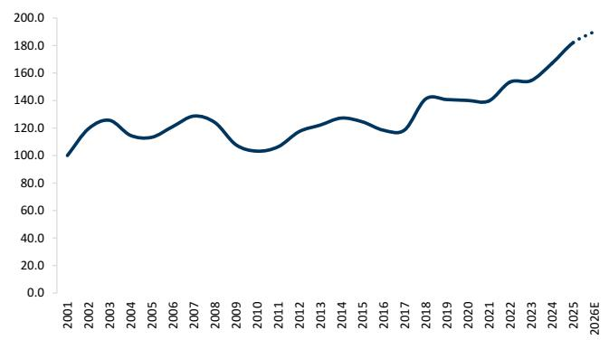

line chart

| Year | Value |
|------|-------|
| 2001 | 100.0 |
| 2002 | 125.0 |
| 2003 | 128.0 |
| 2004 | 115.0 |
| 2005 | 120.0 |
| 2006 | 128.0 |
| 2007 | 130.0 |
| 2008 | 125.0 |
| 2009 | 115.0 |
| 2010 | 105.0 |
| 2011 | 110.0 |
| 2012 | 118.0 |
| 2013 | 125.0 |
| 2014 | 130.0 |
| 2015 | 128.0 |
| 2016 | 125.0 |
| 2017 | 120.0 |
| 2018 | 145.0 |
| 2019 | 148.0 |
| 2020 | 145.0 |
| 2021 | 155.0 |
| 2022 | 158.0 |
| 2023 | 165.0 |
| 2024 | 175.0 |
| 2025 | 185.0 |
| 2026E | 195.0 |

Source: Company data, Bloomberg, GS Global Investment Research

Exhibit 105: Pharma capacity utilization in EU is recovering but well below the median  
Average Capacity Utilization (EU, China)  
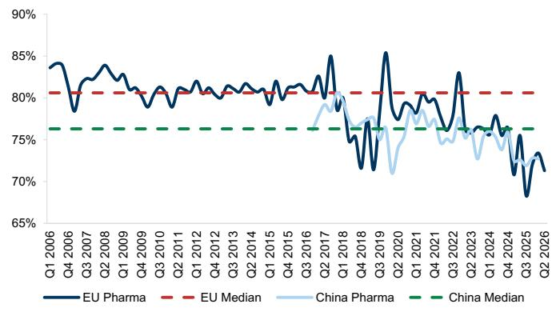

line chart

| Quarter | EU Pharma | EU Median | China Pharma | China Median |
|---------|-----------|-----------|--------------|--------------|
| Q1 2006 | 84%       | 80%       | -            | 76%          |
| Q4 2006 | 83%       | 80%       | -            | 76%          |
| Q3 2007 | 84%       | 80%       | -            | 76%          |
| Q2 2008 | 83%       | 80%       | -            | 76%          |
| Q1 2009 | 82%       | 80%       | -            | 76%          |
| Q4 2009 | 81%       | 80%       | -            | 76%          |
| Q3 2010 | 80%       | 80%       | -            | 76%          |
| Q2 2011 | 81%       | 80%       | -            | 76%          |
| Q1 2012 | 80%       | 80%       | -            | 76%          |
| Q4 2012 | 81%       | 80%       | -            | 76%          |
| Q3 2013 | 80%       | 80%       | -            | 76%          |
| Q2 2014 | 81%       | 80%       | -            | 76%          |
| Q1 2015 | 80%       | 80%       | -            | 76%          |
| Q4 2015 | 81%       | 80%       | -            | 76%          |
| Q3 2016 | 82%       | 80%       | -            | 76%          |
| Q2 2017 | 85%       | 80%       | -            | 76%          |
| Q1 2018 | 84%       | 80%       | -            | 76%          |
| Q4 2018 | 83%       | 80%       | -            | 76%          |
| Q3 2019 | 85%       | 80%       | -            | 76%          |
| Q2 2020 | 84%       | 80%       | -            | 76%          |
| Q1 2021 | 83%       | 80%       | -            | 76%          |
| Q4 2021 | 82%       | 80%       | -            | 76%          |
| Q3 2022 | 83%       | 80%       | -            | 76%          |
| Q2 2023 | 84%       | 80%       | -            | 76%          |
| Q1 2024 | 83%       | 80%       | -            | 76%          |
| Q4 2024 | 82%       | 80%       | -            | 76%          |
| Q3 2025 | 81%       | 80%       | -            | 76%          |
| Q2 2026 | 79%       | 80%       | -            | 76%          |

China data till 1Q26  
Source: DG ECFIN, NBS

## Construction Equipment

## Exhibit 106: We expect Construction Equipment capex has seen steady cuts for 2026 on rates uncertainty

GS Construction Equipment Capex Tracker (46 companies, €46 bn of capex in 2026)

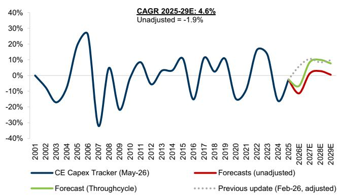

line chart

| Year | CE Capex Tracker (May-26) | Forecasts (unadjusted) | Forecast (Throughcycle) | Previous update (Feb-26, adjusted) |
|------|---------------------------|------------------------|-------------------------|------------------------------------|
| 2001 | ~0%                       |                        |                         |                                    |
| 2002 | ~-10%                     |                        |                         |                                    |
| 2003 | ~-20%                     |                        |                         |                                    |
| 2004 | ~-15%                     |                        |                         |                                    |
| 2005 | ~-5%                      |                        |                         |                                    |
| 2006 | ~30%                      |                        |                         |                                    |
| 2007 | ~-30%                     |                        |                         |                                    |
| 2008 | ~5%                       |                        |                         |                                    |
| 2009 | ~-20%                     |                        |                         |                                    |
| 2010 | ~10%                      |                        |                         |                                    |
| 2011 | ~5%                       |                        |                         |                                    |
| 2012 | ~0%                       |                        |                         |                                    |
| 2013 | ~5%                       |                        |                         |                                    |
| 2014 | ~10%                      |                        |                         |                                    |
| 2015 | ~15%                      |                        |                         |                                    |
| 2016 | ~-15%                     |                        |                         |                                    |
| 2017 | ~10%                      |                        |                         |                                    |
| 2018 | ~5%                       |                        |                         |                                    |
| 2019 | ~10%                      |                        |                         |                                    |
| 2020 | ~-15%                     |                        |                         |                                    |
| 2021 | ~-10%                     |                        |                         |                                    |
| 2022 | ~15%                      |                        |                         |                                    |
| 2023 | ~10%                      |                        |                         |                                    |
| 2024 | ~-15%                     |                        |                         |                                    |
| 2025E| ~-5%                      | ~-5%                   | ~-5%                    | ~-5%                               |
| 2026E| ~-10%                     | ~-10%                  | ~-10%                   | ~-10%                              |
| 2027E| ~-5%                      | ~-5%                   | ~-5%                    | ~-5%                               |
| 2028E| ~0%                       | ~0%                    | ~0%                     | ~0%                                |
| 2029E| ~5%                       | ~5%                    | ~5%                     | ~5%                                |
| Unadjusted | -1.9%                   |                        |                         |                                    |
CAGR 2025-29E: 4.6%, Unadjusted = -1.9%.

Source: Company data, Bloomberg, GS Global Investment Research

## Exhibit 108: Construction Equipment Capex/Depreciation is seen below median levels in 2026

Construction Equipment Capex/Depreciation

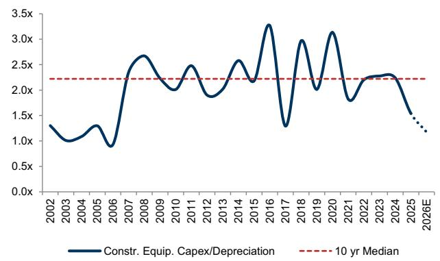

line chart

| Year | Constr. Equip. Capex/Depreciation |
|------|-----------------------------------|
| 2002 | 1.3x                              |
| 2003 | 1.0x                              |
| 2004 | 1.3x                              |
| 2005 | 1.0x                              |
| 2006 | 0.9x                              |
| 2007 | 2.5x                              |
| 2008 | 2.7x                              |
| 2009 | 2.4x                              |
| 2010 | 2.1x                              |
| 2011 | 2.5x                              |
| 2012 | 2.3x                              |
| 2013 | 2.1x                              |
| 2014 | 2.5x                              |
| 2015 | 2.3x                              |
| 2016 | 3.3x                              |
| 2017 | 1.3x                              |
| 2018 | 3.0x                              |
| 2019 | 2.1x                              |
| 2020 | 3.1x                              |
| 2021 | 1.8x                              |
| 2022 | 2.3x                              |
| 2023 | 2.3x                              |
| 2024 | 2.3x                              |
| 2025 | 1.5x                              |
| 2026E| 1.2x                              |

Source: Company data, Bloomberg, GS Global Investment Research

## Exhibit 107: Construction Equipment Capex/Sales is seen below median levels in 2026

Construction Equipment Capex/Sales

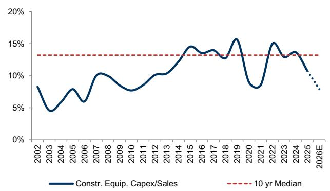

line chart

| Year | Constr. Equip. Capex/Sales |
|------|---------------------------|
| 2002 | ~8%                       |
| 2003 | ~4%                       |
| 2004 | ~7%                       |
| 2005 | ~6%                       |
| 2006 | ~10%                      |
| 2007 | ~11%                      |
| 2008 | ~10%                      |
| 2009 | ~8%                       |
| 2010 | ~7%                       |
| 2011 | ~8%                       |
| 2012 | ~9%                       |
| 2013 | ~10%                      |
| 2014 | ~12%                      |
| 2015 | ~14%                      |
| 2016 | ~13%                      |
| 2017 | ~14%                      |
| 2018 | ~13%                      |
| 2019 | ~15%                      |
| 2020 | ~8%                       |
| 2021 | ~15%                      |
| 2022 | ~13%                      |
| 2023 | ~14%                      |
| 2024 | ~13%                      |
| 2025 | ~11%                      |
| 2026E| ~8%                       |

Source: Company data, Bloomberg, GS Global Investment Research

## Exhibit 109: We expect 2026 to end 45% below the historical peak (2006)

GS CE Capex Tracker (indexed)

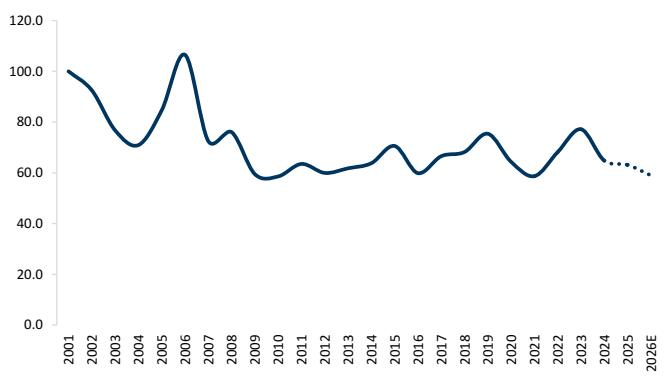

line chart

| Year | Value |
|------|-------|
| 2001 | 100.0 |
| 2002 | 95.0  |
| 2003 | 85.0  |
| 2004 | 75.0  |
| 2005 | 85.0  |
| 2006 | 105.0 |
| 2007 | 75.0  |
| 2008 | 78.0  |
| 2009 | 65.0  |
| 2010 | 60.0  |
| 2011 | 62.0  |
| 2012 | 60.0  |
| 2013 | 61.0  |
| 2014 | 63.0  |
| 2015 | 70.0  |
| 2016 | 60.0  |
| 2017 | 65.0  |
| 2018 | 75.0  |
| 2019 | 78.0  |
| 2020 | 65.0  |
| 2021 | 60.0  |
| 2022 | 65.0  |
| 2023 | 78.0  |
| 2024 | 65.0  |
| 2025 | 63.0  |
| 2026E| 60.0  |

Source: Company data, Bloomberg, GS Global Investment Research

Exhibit 110: Construction equipment age is declining, implying less need for investment  
Average Age of Construction Equipment (US)  
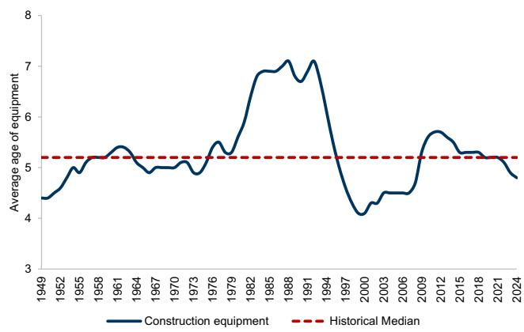

line chart

| Year | Construction equipment | Historical Median |
|------|------------------------|--------------------|
| 1949 | 4.5                    | 5.2                |
| 1952 | 5.0                    | 5.2                |
| 1955 | 5.2                    | 5.2                |
| 1958 | 5.3                    | 5.2                |
| 1961 | 5.4                    | 5.2                |
| 1964 | 5.1                    | 5.2                |
| 1967 | 5.0                    | 5.2                |
| 1970 | 5.0                    | 5.2                |
| 1973 | 5.0                    | 5.2                |
| 1976 | 5.5                    | 5.2                |
| 1979 | 5.3                    | 5.2                |
| 1982 | 6.0                    | 5.2                |
| 1985 | 6.8                    | 5.2                |
| 1988 | 7.0                    | 5.2                |
| 1991 | 7.1                    | 5.2                |
| 1994 | 6.0                    | 5.2                |
| 1997 | 4.0                    | 5.2                |
| 2000 | 4.2                    | 5.2                |
| 2003 | 4.5                    | 5.2                |
| 2006 | 4.6                    | 5.2                |
| 2009 | 5.7                    | 5.2                |
| 2012 | 5.8                    | 5.2                |
| 2015 | 5.3                    | 5.2                |
| 2018 | 5.2                    | 5.2                |
| 2021 | 5.1                    | 5.2                |
| 2024 | 4.8                    | 5.2                |

Source: US Bureau of Economic Analysis

## Rail

Exhibit 112: We have seen capex being trimmed for rail over recent months, but still expect outer years to see a growth recovery on the back of stimulus programs  
GS Rail Capex Tracker (41 companies, €38 bn of capex in 2026)  
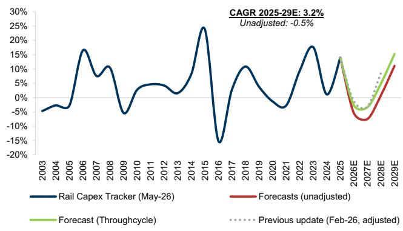  
Source: Company data, Bloomberg, GS Global Investment Research

Exhibit 111: Construction Equipment capacity utilization is recovering but well below the median level  
Average Capacity Utilization (US, EU, China)  
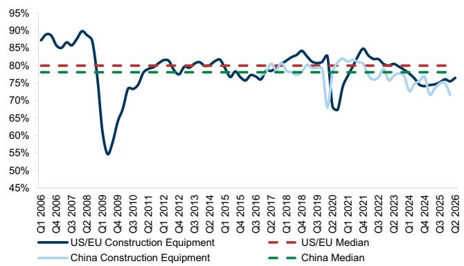

line chart

| Quarter | US/EU Construction Equipment | China Construction Equipment | US/EU Median | China Median |
|---------|-------------------------------|------------------------------|--------------|--------------|
| Q1 2006 | ~88%                          | ~80%                         | ~80%         | ~78%         |
| Q4 2006 | ~89%                          | ~80%                         | ~80%         | ~78%         |
| Q3 2007 | ~90%                          | ~80%                         | ~80%         | ~78%         |
| Q2 2008 | ~89%                          | ~80%                         | ~80%         | ~78%         |
| Q1 2009 | ~55%                          | ~80%                         | ~80%         | ~78%         |
| Q4 2009 | ~75%                          | ~80%                         | ~80%         | ~78%         |
| Q3 2010 | ~78%                          | ~80%                         | ~80%         | ~78%         |
| Q2 2011 | ~80%                          | ~80%                         | ~80%         | ~78%         |
| Q1 2012 | ~81%                          | ~80%                         | ~80%         | ~78%         |
| Q4 2012 | ~82%                          | ~80%                         | ~80%         | ~78%         |
| Q3 2013 | ~81%                          | ~80%                         | ~80%         | ~78%         |
| Q2 2014 | ~82%                          | ~80%                         | ~80%         | ~78%         |
| Q1 2015 | ~81%                          | ~80%                         | ~80%         | ~78%         |
| Q4 2015 | ~79%                          | ~80%                         | ~80%         | ~78%         |
| Q3 2016 | ~78%                          | ~80%                         | ~80%         | ~78%         |
| Q2 2017 | ~79%                          | ~80%                         | ~80%         | ~78%         |
| Q1 2018 | ~81%                          | ~80%                         | ~80%         | ~78%         |
| Q4 2018 | ~83%                          | ~80%                         | ~80%         | ~78%         |
| Q3 2019 | ~82%                          | ~80%                         | ~80%         | ~78%         |
| Q2 2020 | ~67%                          | ~81%                         | ~80%         | ~78%         |
| Q1 2021 | ~75%                          | ~81%                         | ~80%         | ~78%         |
| Q4 2021 | ~85%                          | ~81%                         | ~80%         | ~78%         |
| Q3 2022 | ~83%                          | ~81%                         | ~80%         | ~78%         |
| Q2 2023 | ~79%                          | ~79%                         | ~80%         | ~78%         |
| Q1 2024 | ~76%                          | ~79%                         | ~80%         | ~78%         |
| Q4 2024 | ~74%                          | ~79%                         | ~80%         | ~78%         |
| Q3 2025 | ~75%                          | ~79%                         | ~80%         | ~78%         |
| Q2 2026 | ~76%                          | ~79%                         | ~80%         | ~78%         |

China data till 1Q26  
Source: Federal Reserve, DG ECFIN, NBS

Exhibit 113: Rail Capex/Sales remains slightly below median levels in 2026  
Rail Capex/Sales  
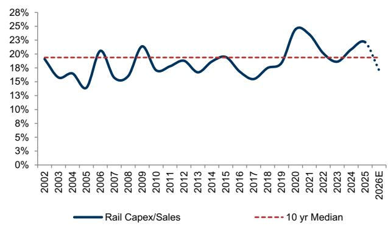

line chart

| Year | Rail Capex/Sales |
|------|------------------|
| 2002 | 19%              |
| 2003 | 17%              |
| 2004 | 15%              |
| 2005 | 13%              |
| 2006 | 21%              |
| 2007 | 15%              |
| 2008 | 17%              |
| 2009 | 21%              |
| 2010 | 18%              |
| 2011 | 19%              |
| 2012 | 18%              |
| 2013 | 17%              |
| 2014 | 19%              |
| 2015 | 20%              |
| 2016 | 18%              |
| 2017 | 15%              |
| 2018 | 17%              |
| 2019 | 19%              |
| 2020 | 25%              |
| 2021 | 23%              |
| 2022 | 20%              |
| 2023 | 19%              |
| 2024 | 21%              |
| 2025 | 23%              |
| 2026E| 18%              |

Source: Company data, Bloomberg, GS Global Investment Research

Exhibit 114: Rail Capex/Depreciation is seen below median levels in 2026  
Rail Capex/Depreciation  
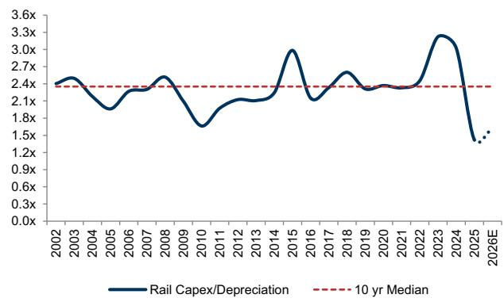

line chart

| Year | Rail Capex/Depreciation |
|------|--------------------------|
| 2002 | 2.4x                     |
| 2003 | 2.5x                     |
| 2004 | 2.3x                     |
| 2005 | 2.1x                     |
| 2006 | 2.4x                     |
| 2007 | 2.5x                     |
| 2008 | 2.6x                     |
| 2009 | 2.4x                     |
| 2010 | 1.8x                     |
| 2011 | 2.1x                     |
| 2012 | 2.2x                     |
| 2013 | 2.3x                     |
| 2014 | 2.4x                     |
| 2015 | 3.0x                     |
| 2016 | 2.3x                     |
| 2017 | 2.5x                     |
| 2018 | 2.7x                     |
| 2019 | 2.4x                     |
| 2020 | 2.4x                     |
| 2021 | 2.4x                     |
| 2022 | 2.5x                     |
| 2023 | 3.3x                     |
| 2024 | 3.1x                     |
| 2025 | 1.5x                     |
| 2026E| 1.5x                     |

Source: Company data, Bloomberg, GS Global Investment Research

Exhibit 116: Average age of US rail equipment is well below the historical median  
Average Age of Rail Equipment (US)  
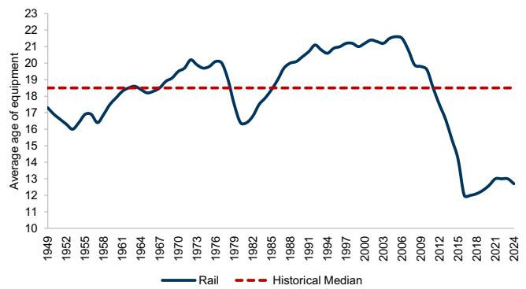

line chart

| Year | Average age of equipment |
| ---- | ------------------------ |
| 1949 | 17.5                     |
| 1952 | 16.0                     |
| 1955 | 16.5                     |
| 1958 | 17.0                     |
| 1961 | 18.0                     |
| 1964 | 18.5                     |
| 1967 | 19.0                     |
| 1970 | 20.0                     |
| 1973 | 20.5                     |
| 1976 | 20.0                     |
| 1979 | 16.5                     |
| 1982 | 17.5                     |
| 1985 | 19.0                     |
| 1988 | 20.0                     |
| 1991 | 20.5                     |
| 1994 | 21.0                     |
| 1997 | 21.0                     |
| 2000 | 21.5                     |
| 2003 | 21.5                     |
| 2006 | 21.0                     |
| 2009 | 20.0                     |
| 2012 | 18.0                     |
| 2015 | 14.0                     |
| 2018 | 12.0                     |
| 2021 | 13.0                     |
| 2024 | 13.5                     |

Source: US Bureau of Economic Analysis

Exhibit 115: We expect 2026 to end 3% below the historical peak (2025)  
GS Rail Capex Tracker (indexed)  
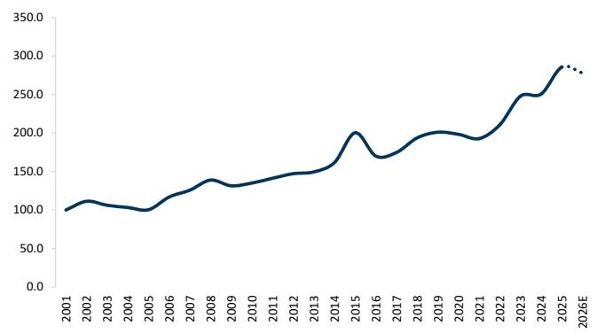

line chart

| Year  | Value |
|-------|-------|
| 2001  | 100.0 |
| 2002  | 110.0 |
| 2003  | 105.0 |
| 2004  | 100.0 |
| 2005  | 95.0  |
| 2006  | 110.0 |
| 2007  | 120.0 |
| 2008  | 135.0 |
| 2009  | 130.0 |
| 2010  | 135.0 |
| 2011  | 145.0 |
| 2012  | 150.0 |
| 2013  | 155.0 |
| 2014  | 165.0 |
| 2015  | 200.0 |
| 2016  | 175.0 |
| 2017  | 185.0 |
| 2018  | 195.0 |
| 2019  | 200.0 |
| 2020  | 195.0 |
| 2021  | 205.0 |
| 2022  | 230.0 |
| 2023  | 245.0 |
| 2024  | 255.0 |
| 2025  | 285.0 |
| 2026E | 295.0 |

Source: Company data, Bloomberg, GS Global Investment Research

Exhibit 117: Rail utilization rates are below, but close to, historical levels  
Average Capacity Utilization (US)  
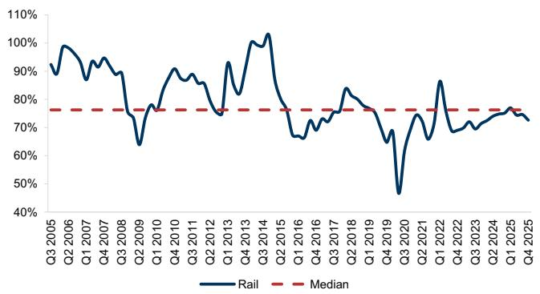

line chart

| Quarter | Rail  | Median |
|---------|-------|--------|
| Q3 2005 | 90%   | 78%    |
| Q2 2006 | 95%   | 78%    |
| Q1 2007 | 92%   | 78%    |
| Q4 2007 | 90%   | 78%    |
| Q3 2008 | 85%   | 78%    |
| Q2 2009 | 65%   | 78%    |
| Q1 2010 | 75%   | 78%    |
| Q4 2010 | 85%   | 78%    |
| Q3 2011 | 90%   | 78%    |
| Q2 2012 | 85%   | 78%    |
| Q1 2013 | 95%   | 78%    |
| Q4 2013 | 100%  | 78%    |
| Q3 2014 | 105%  | 78%    |
| Q2 2015 | 90%   | 78%    |
| Q1 2016 | 65%   | 78%    |
| Q4 2016 | 75%   | 78%    |
| Q3 2017 | 85%   | 78%    |
| Q2 2018 | 80%   | 78%    |
| Q1 2019 | 75%   | 78%    |
| Q4 2019 | 65%   | 78%    |
| Q3 2020 | 45%   | 78%    |
| Q2 2021 | 75%   | 78%    |
| Q1 2022 | 85%   | 78%    |
| Q4 2022 | 70%   | 78%    |
| Q3 2023 | 75%   | 78%    |
| Q2 2024 | 78%   | 78%    |
| Q1 2025 | 75%   | 78%    |
| Q4 2025 | 72%   | 78%    |

Source: FTR

## REITs

Exhibit 118: REITs capex forecasts show lower spending in 2026  
REIT Capex Tracker (130 companies, €37 bn of capex in 2026)  
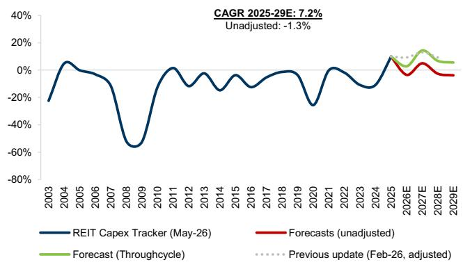

line chart

| Year | REIT Capex Tracker (May-26) | Forecasts (unadjusted) | Forecast (Throughcycle) | Previous update (Feb-26, adjusted) |
|------|-----------------------------|------------------------|-------------------------|------------------------------------|
| 2025 | ~10%                        | ~5%                    | ~10%                    | ~10%                               |
| 2026E | ~5%                         | ~0%                    | ~15%                    | ~10%                               |
| 2027E | ~0%                         | ~-5%                   | ~15%                    | ~10%                               |
| 2028E | ~-5%                        | ~-10%                  | ~10%                    | ~10%                               |
| 2029E | ~-10%                       | ~-15%                  | ~5%                     | ~10%                               |

Source: Company data, Bloomberg, GS Global Investment Research

Exhibit 120: REIT Capex/Depreciation is expected to remain below median levels in 2026  
REIT Capex/Depreciation  
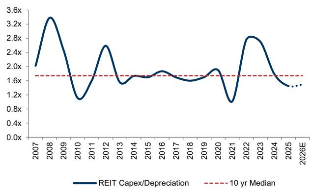

line chart

| Year   | REIT Capex/Depreciation |
| ------ | ------------------------ |
| 2007   | 2.0x                     |
| 2008   | 3.4x                     |
| 2009   | 2.5x                     |
| 2010   | 1.2x                     |
| 2011   | 1.8x                     |
| 2012   | 2.6x                     |
| 2013   | 1.6x                     |
| 2014   | 1.8x                     |
| 2015   | 1.8x                     |
| 2016   | 1.9x                     |
| 2017   | 1.8x                     |
| 2018   | 1.7x                     |
| 2019   | 1.8x                     |
| 2020   | 2.0x                     |
| 2021   | 1.0x                     |
| 2022   | 2.8x                     |
| 2023   | 2.6x                     |
| 2024   | 1.8x                     |
| 2025   | 1.5x                     |
| 2026E  | 1.5x                     |

Source: Company data, Bloomberg, GS Global Investment Research

Exhibit 119: REIT Capex/Sales is seen well below median levels  
REIT Capex/Sales  
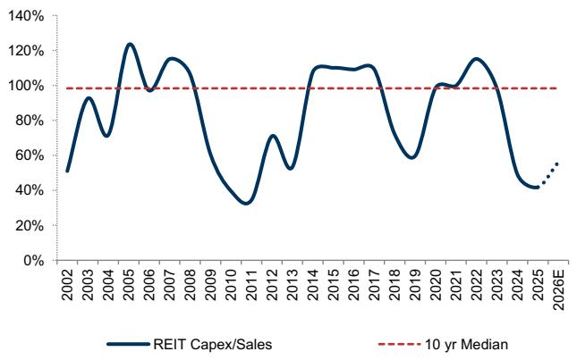

line chart

| Year | REIT Capex/Sales |
|------|------------------|
| 2002 | ~50%             |
| 2003 | ~90%             |
| 2004 | ~70%             |
| 2005 | ~125%            |
| 2006 | ~100%            |
| 2007 | ~115%            |
| 2008 | ~105%            |
| 2009 | ~60%             |
| 2010 | ~40%             |
| 2011 | ~30%             |
| 2012 | ~70%             |
| 2013 | ~50%             |
| 2014 | ~110%            |
| 2015 | ~110%            |
| 2016 | ~110%            |
| 2017 | ~110%            |
| 2018 | ~80%             |
| 2019 | ~60%             |
| 2020 | ~100%            |
| 2021 | ~105%            |
| 2022 | ~115%            |
| 2023 | ~105%            |
| 2024 | ~60%             |
| 2025 | ~45%             |
| 2026E| ~55%             |

Source: Company data, Bloomberg, GS Global Investment Research

Exhibit 121: We expect 2026 to end 95% below the historical peak (2002)  
GS REIT Capex Tracker (Indexed)  
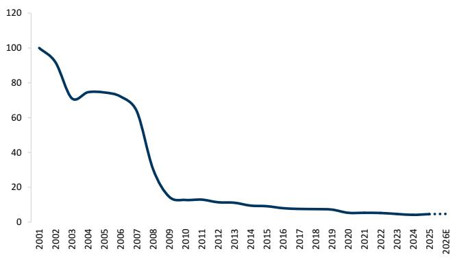

line chart

| Year | Value |
| ---- | ----- |
| 2001 | 100   |
| 2002 | 95    |
| 2003 | 70    |
| 2004 | 75    |
| 2005 | 75    |
| 2006 | 70    |
| 2007 | 65    |
| 2008 | 30    |
| 2009 | 15    |
| 2010 | 15    |
| 2011 | 15    |
| 2012 | 15    |
| 2013 | 15    |
| 2014 | 15    |
| 2015 | 15    |
| 2016 | 15    |
| 2017 | 15    |
| 2018 | 15    |
| 2019 | 15    |
| 2020 | 15    |
| 2021 | 15    |
| 2022 | 15    |
| 2023 | 15    |
| 2024 | 15    |
| 2025 | 15    |
| 2026E | 15   |

Source: Company data, Bloomberg, GS Global Investment Research

Exhibit 122: The age of real REIT assets is around the historical levels  
Average Age of real estate assets (US)  
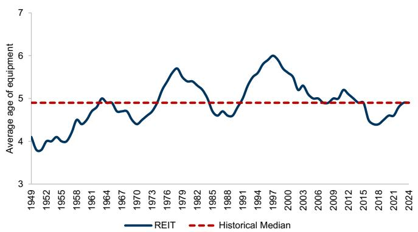

line chart

| Year | REIT | Historical Median |
|------|------|-------------------|
| 1949 | 4.0  | 5.0               |
| 1952 | 3.8  | 5.0               |
| 1955 | 4.0  | 5.0               |
| 1958 | 4.2  | 5.0               |
| 1961 | 4.5  | 5.0               |
| 1964 | 5.0  | 5.0               |
| 1967 | 4.8  | 5.0               |
| 1970 | 4.5  | 5.0               |
| 1973 | 4.8  | 5.0               |
| 1976 | 5.5  | 5.0               |
| 1979 | 5.8  | 5.0               |
| 1982 | 5.5  | 5.0               |
| 1985 | 5.0  | 5.0               |
| 1988 | 4.8  | 5.0               |
| 1991 | 5.2  | 5.0               |
| 1994 | 5.8  | 5.0               |
| 1997 | 6.0  | 5.0               |
| 2000 | 5.8  | 5.0               |
| 2003 | 5.5  | 5.0               |
| 2006 | 5.2  | 5.0               |
| 2009 | 5.0  | 5.0               |
| 2012 | 5.2  | 5.0               |
| 2015 | 4.8  | 5.0               |
| 2018 | 4.5  | 5.0               |
| 2021 | 4.8  | 5.0               |
| 2024 | 5.0  | 5.0               |

Source: US Bureau of Economic Analysis

## Marine

Exhibit 123: Marine capex shows slight increase going into 2026  
GS Marine Capex Tracker (32 companies, €34 bn capex in 2026)  
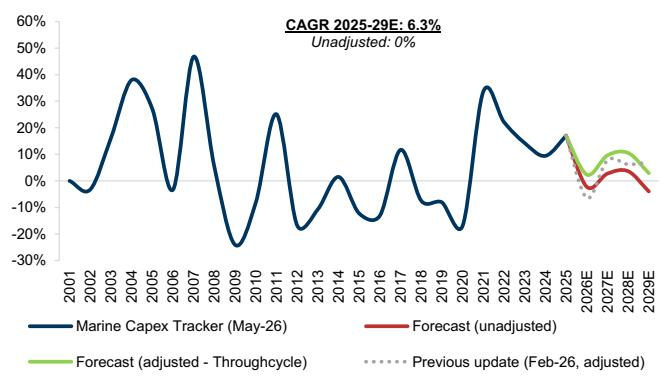

line chart

| Year | Marine Capex Tracker (May-26) | Forecast (unadjusted) | Forecast (adjusted - Throughcycle) | Previous update (Feb-26, adjusted) |
|------|-------------------------------|------------------------|-------------------------------------|-------------------------------------|
| 2025E | ~15%                          | ~5%                    | ~10%                                | ~5%                                 |
| 2028E | ~10%                          | ~0%                    | ~5%                                 | ~0%                                 |
| 2029E | ~5%                           | ~-5%                   | ~0%                                 | ~-5%                                |

Source: Company data, Bloomberg, GS Global Investment Research

Exhibit 125: Marine Capex/Depreciation is seen slightly above median levels in 2026  
Marine Capex/Depreciation  
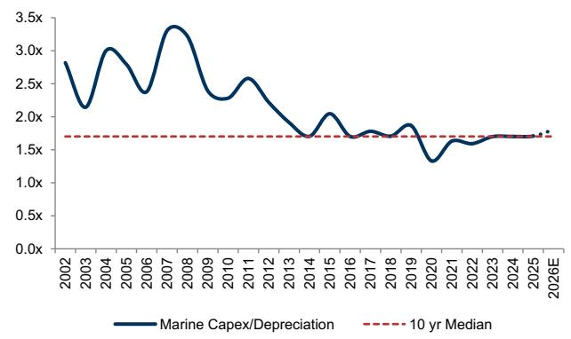

line chart

| Year | Marine Capex/Depreciation |
|------|---------------------------|
| 2002 | 2.8x                      |
| 2003 | 2.1x                      |
| 2004 | 3.0x                      |
| 2005 | 2.4x                      |
| 2006 | 3.4x                      |
| 2007 | 3.2x                      |
| 2008 | 2.3x                      |
| 2009 | 2.5x                      |
| 2010 | 2.6x                      |
| 2011 | 2.4x                      |
| 2012 | 2.2x                      |
| 2013 | 1.8x                      |
| 2014 | 1.7x                      |
| 2015 | 2.0x                      |
| 2016 | 1.8x                      |
| 2017 | 1.7x                      |
| 2018 | 1.8x                      |
| 2019 | 1.9x                      |
| 2020 | 1.3x                      |
| 2021 | 1.6x                      |
| 2022 | 1.7x                      |
| 2023 | 1.7x                      |
| 2024 | 1.7x                      |
| 2025 | 1.7x                      |
| 2026E| 1.8x                      |

Source: Company data, Bloomberg, GS Global Investment Research

Exhibit 124: Marine Capex/Sales is expected to remain above median levels in 2026  
Marine Capex/Sales  
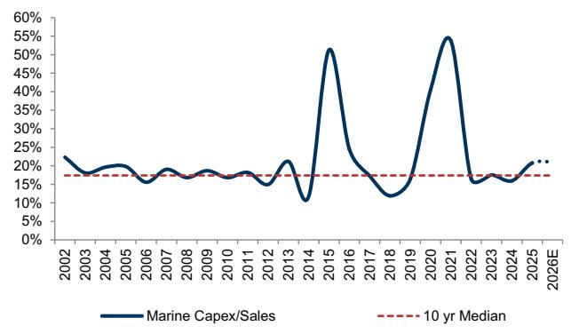

line chart

| Year | Marine Capex/Sales |
|------|---------------------|
| 2026E | 20% |

Source: Company data, Bloomberg, GS Global Investment Research

Exhibit 126: We expect 2026 to end 3% below the historical peak (2008) as the last peak was characterized by significant overcapacity  
GS Marine Capex Tracker (indexed)  
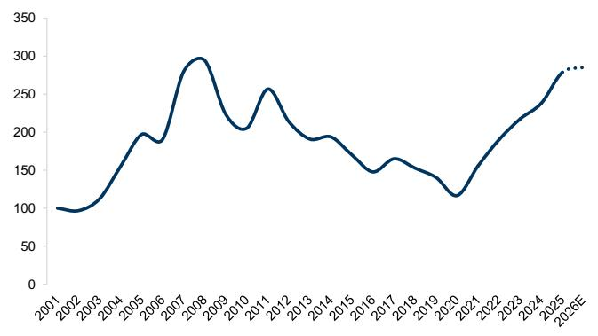

line chart

| Year | Value |
|------|-------|
| 2001 | 100   |
| 2002 | 95    |
| 2003 | 110   |
| 2004 | 140   |
| 2005 | 180   |
| 2006 | 190   |
| 2007 | 280   |
| 2008 | 300   |
| 2009 | 250   |
| 2010 | 210   |
| 2011 | 260   |
| 2012 | 230   |
| 2013 | 200   |
| 2014 | 190   |
| 2015 | 180   |
| 2016 | 150   |
| 2017 | 160   |
| 2018 | 155   |
| 2019 | 145   |
| 2020 | 120   |
| 2021 | 150   |
| 2022 | 180   |
| 2023 | 210   |
| 2024 | 240   |
| 2025 | 270   |
| 2026E| 285   |

Source: Company data, Bloomberg, GS Global Investment Research

Exhibit 127: Marine equipment average age is slightly above historical levels  
Average age of marine equipment (US)  
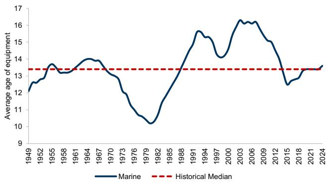

line chart

| Year | Average age of equipment |
| ---- | ------------------------ |
| 1949 | 12.0                     |
| 1952 | 12.5                     |
| 1955 | 13.5                     |
| 1958 | 13.0                     |
| 1961 | 13.5                     |
| 1964 | 14.0                     |
| 1967 | 13.5                     |
| 1970 | 13.0                     |
| 1973 | 12.0                     |
| 1976 | 11.0                     |
| 1979 | 10.5                     |
| 1982 | 10.0                     |
| 1985 | 11.5                     |
| 1988 | 13.0                     |
| 1991 | 15.5                     |
| 1994 | 15.0                     |
| 1997 | 14.0                     |
| 2000 | 14.5                     |
| 2003 | 16.0                     |
| 2006 | 16.5                     |
| 2009 | 15.5                     |
| 2012 | 14.0                     |
| 2015 | 12.5                     |
| 2018 | 13.0                     |
| 2021 | 13.5                     |
| 2024 | 13.5                     |

Source: US Bureau of Economic Analysis (BEA)

## Cruise

Exhibit 129: Cruise capex remains resilient following 2025 investment peak  
GS Marine Capex Tracker (4 companies, €10 bn capex in 2026)  
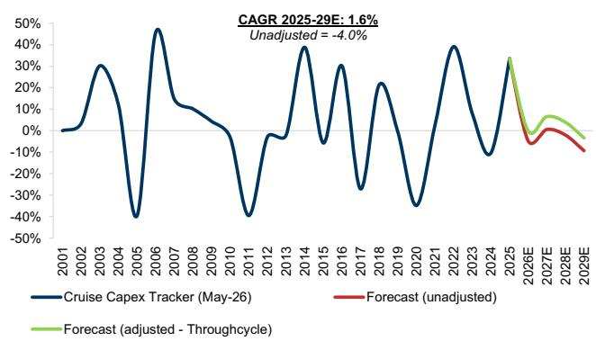

line chart

| Year | Cruise Capex Tracker (May-26) | Forecast (unadjusted) | Forecast (adjusted - Throughcycle) |
|------|-------------------------------|------------------------|-------------------------------------|
| 2001 | ~0%                           |                        |                                     |
| 2002 | ~30%                          |                        |                                     |
| 2003 | ~10%                          |                        |                                     |
| 2004 | ~-40%                         |                        |                                     |
| 2005 | ~45%                          |                        |                                     |
| 2006 | ~10%                          |                        |                                     |
| 2007 | ~5%                           |                        |                                     |
| 2008 | ~-5%                          |                        |                                     |
| 2009 | ~-10%                         |                        |                                     |
| 2010 | ~-40%                         |                        |                                     |
| 2011 | ~-10%                         |                        |                                     |
| 2012 | ~-5%                          |                        |                                     |
| 2013 | ~35%                          |                        |                                     |
| 2014 | ~-5%                          |                        |                                     |
| 2015 | ~30%                          |                        |                                     |
| 2016 | ~-30%                         |                        |                                     |
| 2017 | ~25%                          |                        |                                     |
| 2018 | ~-30%                         |                        |                                     |
| 2019 | ~-10%                         |                        |                                     |
| 2020 | ~-35%                         |                        |                                     |
| 2021 | ~35%                          |                        |                                     |
| 2022 | ~-10%                         |                        |                                     |
| 2023 | ~35%                          |                        |                                     |
| 2024 | ~-15%                         |                        |                                     |
| 2025E| ~35%                          | ~-5%                   | ~35%                                |
| 2026E|                       | ~-10%                  | ~35%                                |
| 2027E|                       | ~-15%                  | ~35%                                |
| 2028E|                       | ~-15%                  | ~35%                                |
| 2029E|                       | ~-15%                  | ~35%                                |

Source: Company data, Bloomberg, GS Global Investment Research

Exhibit 128: Marine capacity utilization is slightly below median levels  
Average Capacity Utilization  
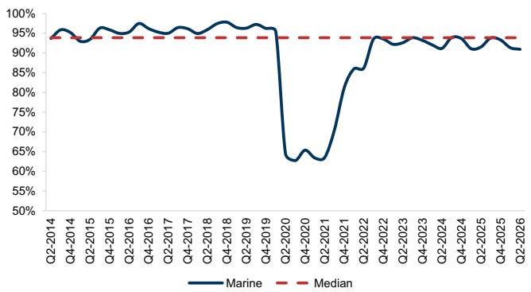

line chart

| Quarter   | Marine |
| --------- | ------ |
| Q2-2014   | 95%    |
| Q4-2014   | 94%    |
| Q2-2015   | 93%    |
| Q4-2015   | 94%    |
| Q2-2016   | 95%    |
| Q4-2016   | 96%    |
| Q2-2017   | 95%    |
| Q4-2017   | 94%    |
| Q2-2018   | 95%    |
| Q4-2018   | 96%    |
| Q2-2019   | 95%    |
| Q4-2019   | 94%    |
| Q2-2020   | 63%    |
| Q4-2020   | 65%    |
| Q2-2021   | 63%    |
| Q4-2021   | 85%    |
| Q2-2022   | 94%    |
| Q4-2022   | 93%    |
| Q2-2023   | 94%    |
| Q4-2023   | 93%    |
| Q2-2024   | 94%    |
| Q4-2024   | 93%    |
| Q2-2025   | 94%    |
| Q4-2025   | 93%    |
| Q2-2026   | 93%    |

Source: Clarksons

Exhibit 130: Cruise Capex/Sales is expected to remain at median levels in 2026  
Cruise Capex/Sales  
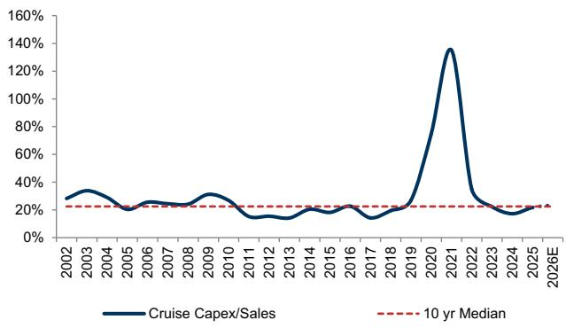

line chart

| Year | Cruise Capex/Sales |
|------|---------------------|
| 2002 | ~30%                |
| 2003 | ~35%                |
| 2004 | ~25%                |
| 2005 | ~20%                |
| 2006 | ~25%                |
| 2007 | ~25%                |
| 2008 | ~25%                |
| 2009 | ~30%                |
| 2010 | ~25%                |
| 2011 | ~20%                |
| 2012 | ~15%                |
| 2013 | ~15%                |
| 2014 | ~20%                |
| 2015 | ~20%                |
| 2016 | ~25%                |
| 2017 | ~15%                |
| 2018 | ~20%                |
| 2019 | ~30%                |
| 2020 | ~80%                |
| 2021 | ~135%               |
| 2022 | ~30%                |
| 2023 | ~25%                |
| 2024 | ~20%                |
| 2025 | ~25%                |
| 2026E| ~25%                |

Source: Company data, Bloomberg, GS Global Investment Research

Exhibit 131: Cruise Capex/Depreciation is seen above median levels in 2026  
Cruise Capex/Depreciation  
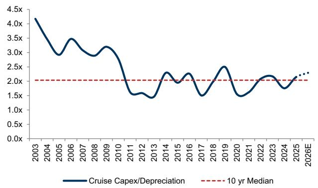

line chart

| Year | Cruise Capex/Depreciation |
|------|---------------------------|
| 2003 | 4.2x                      |
| 2004 | 3.8x                      |
| 2005 | 3.5x                      |
| 2006 | 3.7x                      |
| 2007 | 3.4x                      |
| 2008 | 3.2x                      |
| 2009 | 3.1x                      |
| 2010 | 2.8x                      |
| 2011 | 2.5x                      |
| 2012 | 2.3x                      |
| 2013 | 2.1x                      |
| 2014 | 2.4x                      |
| 2015 | 2.2x                      |
| 2016 | 2.3x                      |
| 2017 | 2.1x                      |
| 2018 | 2.4x                      |
| 2019 | 2.5x                      |
| 2020 | 2.3x                      |
| 2021 | 2.1x                      |
| 2022 | 2.2x                      |
| 2023 | 2.3x                      |
| 2024 | 2.1x                      |
| 2025 | 2.2x                      |
| 2026E| 2.3x                      |

Source: Company data, Bloomberg, GS Global Investment Research

Exhibit 132: We expect 2026 to end 1% below the historical peak (2009)  
GS Cruise Capex Tracker (indexed)  
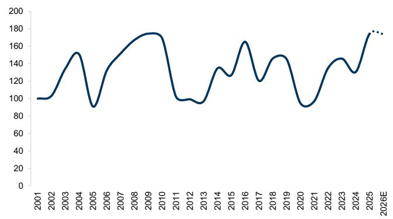

line chart

| Year | Value |
|------|-------|
| 2001 | 100   |
| 2002 | 105   |
| 2003 | 130   |
| 2004 | 155   |
| 2005 | 90    |
| 2006 | 135   |
| 2007 | 150   |
| 2008 | 165   |
| 2009 | 175   |
| 2010 | 175   |
| 2011 | 100   |
| 2012 | 98    |
| 2013 | 95    |
| 2014 | 135   |
| 2015 | 130   |
| 2016 | 165   |
| 2017 | 120   |
| 2018 | 145   |
| 2019 | 145   |
| 2020 | 90    |
| 2021 | 95    |
| 2022 | 135   |
| 2023 | 145   |
| 2024 | 135   |
| 2025 | 175   |
| 2026E| 175   |

Source: Company data, Bloomberg, GS Global Investment Research

Exhibit 133: Cruise capacity utilization is at the median levels  
Average Capacity Utilization  
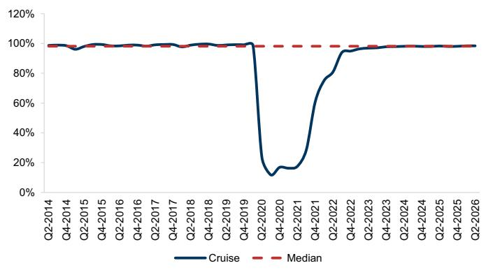

line chart

| Quarter   | Cruise | Median |
| --------- | ------ | ------ |
| Q2-2014   | 100%   | 100%   |
| Q4-2014   | 100%   | 100%   |
| Q2-2015   | 100%   | 100%   |
| Q4-2015   | 100%   | 100%   |
| Q2-2016   | 100%   | 100%   |
| Q4-2016   | 100%   | 100%   |
| Q2-2017   | 100%   | 100%   |
| Q4-2017   | 100%   | 100%   |
| Q2-2018   | 100%   | 100%   |
| Q4-2018   | 100%   | 100%   |
| Q2-2019   | 100%   | 100%   |
| Q4-2019   | 100%   | 100%   |
| Q2-2020   | 10%    | 100%   |
| Q4-2020   | 15%    | 100%   |
| Q2-2021   | 30%    | 100%   |
| Q4-2021   | 65%    | 100%   |
| Q2-2022   | 95%    | 100%   |
| Q4-2022   | 95%    | 100%   |
| Q2-2023   | 95%    | 100%   |
| Q4-2023   | 95%    | 100%   |
| Q2-2024   | 95%    | 100%   |
| Q4-2024   | 95%    | 100%   |
| Q2-2025   | 95%    | 100%   |
| Q4-2025   | 95%    | 100%   |
| Q2-2026   | 95%    | 100%   |

Source: Clarksons

## Merchant

Exhibit 134: Merchant capex expected to trough in 2026 before recovering and moderating thereafter  
GS Merchant Capex Tracker (22 companies, €23 bn capex in 2026)  
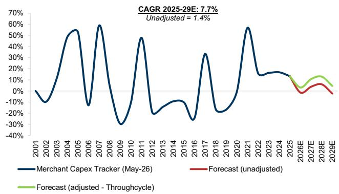

line chart

| Year | Merchant Capex Tracker (May-26) | Forecast (unadjusted) | Forecast (adjusted - Throughcycle) |
|------|----------------------------------|------------------------|-------------------------------------|
| 2029E | - | - | - |
| 2028E | - | - | - |
| 2027E | - | - | - |
| 2026E | - | - | - |
| 2025E | - | - | - |
| 2024E | - | - | - |
| 2023E | - | - | - |
| 2022E | - | - | - |
| 2021E | - | - | - |
| 2020E | - | - | - |
| 2019E | - | - | - |
| 2018E | - | - | - |
| 2017E | - | - | - |
| 2016E | - | - | - |
| 2015E | - | - | - |
| 2014E | - | - | - |
| 2013E | - | - | - |
| 2012E | - | - | - |
| 2011E | - | - | - |
| 2010E | - | - | - |
| 2009E | - | - | - |
| 2008E | - | - | - |
| 2007E | - | - | - |
| 2006E | - | - | - |
| 2005E | - | - | - |
| 2004E | - | - | - |
| 2003E | - | - | - |
| 2002E | - | - | - |
| 2001E | - | - | - |

Source: Company data, Bloomberg, GS Global Investment Research

Exhibit 136: Merchant Capex/Depreciation is seen slightly above median levels in 2026  
Merchant Capex/Depreciation  
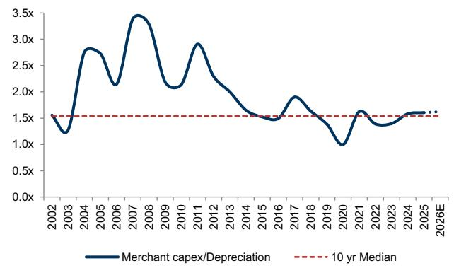

line chart

| Year | Merchant capex/Depreciation |
|------|-----------------------------|
| 2002 | 1.5x                        |
| 2003 | 1.2x                        |
| 2004 | 2.8x                        |
| 2005 | 2.1x                        |
| 2006 | 3.4x                        |
| 2007 | 2.9x                        |
| 2008 | 2.1x                        |
| 2009 | 2.9x                        |
| 2010 | 2.1x                        |
| 2011 | 1.5x                        |
| 2012 | 1.5x                        |
| 2013 | 1.5x                        |
| 2014 | 1.5x                        |
| 2015 | 1.5x                        |
| 2016 | 1.9x                        |
| 2017 | 1.5x                        |
| 2018 | 1.5x                        |
| 2019 | 1.0x                        |
| 2020 | 1.6x                        |
| 2021 | 1.5x                        |
| 2022 | 1.5x                        |
| 2023 | 1.5x                        |
| 2024 | 1.5x                        |
| 2025 | 1.5x                        |
| 2026E| 1.5x                        |

Source: Company data, Bloomberg, GS Global Investment Research

Exhibit 135: Merchant Capex/Sales is expected to remain above median levels in 2026  
Merchant Capex/Sales  
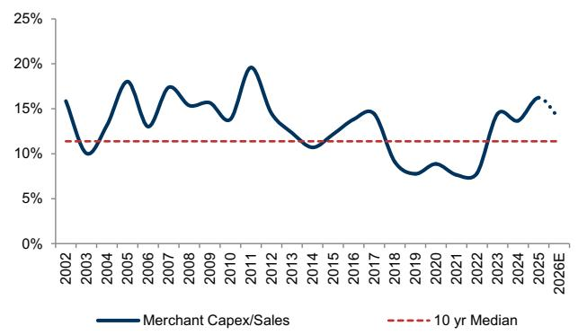

line chart

| Year | Merchant Capex/Sales |
|------|----------------------|
| 2002 | 16%                  |
| 2003 | 10%                  |
| 2004 | 18%                  |
| 2005 | 13%                  |
| 2006 | 17%                  |
| 2007 | 15%                  |
| 2008 | 16%                  |
| 2009 | 15%                  |
| 2010 | 14%                  |
| 2011 | 20%                  |
| 2012 | 14%                  |
| 2013 | 12%                  |
| 2014 | 11%                  |
| 2015 | 13%                  |
| 2016 | 15%                  |
| 2017 | 14%                  |
| 2018 | 8%                   |
| 2019 | 7%                   |
| 2020 | 9%                   |
| 2021 | 8%                   |
| 2022 | 7%                   |
| 2023 | 15%                  |
| 2024 | 14%                  |
| 2025 | 16%                  |
| 2026E| 15%                  |

Source: Company data, Bloomberg, GS Global Investment Research

Exhibit 137: We expect 2026 to end 3% above the historical peak (2025)  
GS Merchant Capex Tracker (indexed)  
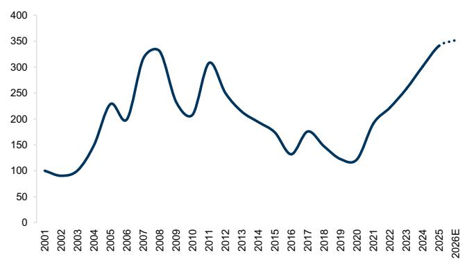

line chart

| Year  | Value |
|-------|-------|
| 2001  | 100   |
| 2002  | 90    |
| 2003  | 100   |
| 2004  | 150   |
| 2005  | 230   |
| 2006  | 200   |
| 2007  | 330   |
| 2008  | 340   |
| 2009  | 250   |
| 2010  | 210   |
| 2011  | 310   |
| 2012  | 250   |
| 2013  | 220   |
| 2014  | 200   |
| 2015  | 180   |
| 2016  | 130   |
| 2017  | 180   |
| 2018  | 150   |
| 2019  | 130   |
| 2020  | 120   |
| 2021  | 180   |
| 2022  | 220   |
| 2023  | 260   |
| 2024  | 300   |
| 2025  | 340   |
| 2026E | 350   |

Source: Company data, Bloomberg, GS Global Investment Research

Exhibit 138: Merchant capacity utilization is slightly below median levels  
Average Capacity Utilization  
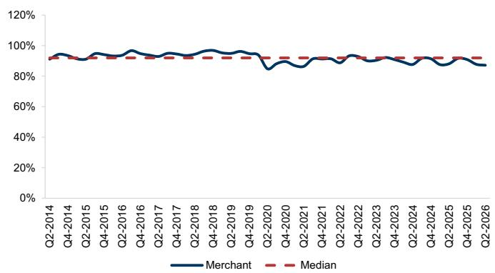

line chart

| Quarter   | Merchant | Median |
| --------- | -------- | ------ |
| Q2-2014   | 95%      | 95%    |
| Q4-2014   | 95%      | 95%    |
| Q2-2015   | 95%      | 95%    |
| Q4-2015   | 95%      | 95%    |
| Q2-2016   | 95%      | 95%    |
| Q4-2016   | 95%      | 95%    |
| Q2-2017   | 95%      | 95%    |
| Q4-2017   | 95%      | 95%    |
| Q2-2018   | 95%      | 95%    |
| Q4-2018   | 95%      | 95%    |
| Q2-2019   | 95%      | 95%    |
| Q4-2019   | 95%      | 95%    |
| Q2-2020   | 85%      | 95%    |
| Q4-2020   | 90%      | 95%    |
| Q2-2021   | 90%      | 95%    |
| Q4-2021   | 90%      | 95%    |
| Q2-2022   | 90%      | 95%    |
| Q4-2022   | 90%      | 95%    |
| Q2-2023   | 90%      | 95%    |
| Q4-2023   | 90%      | 95%    |
| Q2-2024   | 90%      | 95%    |
| Q4-2024   | 90%      | 95%    |
| Q2-2025   | 90%      | 95%    |
| Q4-2025   | 90%      | 95%    |
| Q2-2026   | 85%      | 95%    |

Source: Clarksons

## LNG/Offshore

Exhibit 139: LNG/Offshore capex expected to flatten during the outer years  
GS LNG/Offshore Capex Tracker (6 companies, €2 bn capex in 2026)  
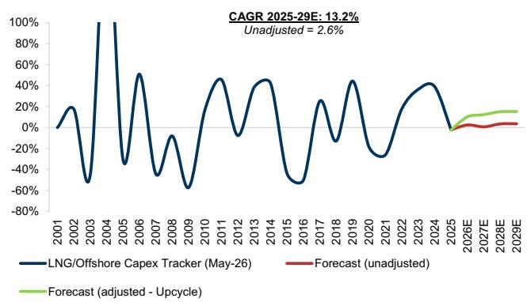

line chart

| Year | LNG/Offshore Capex Tracker (May-26) | Forecast (unadjusted) | Forecast (adjusted - Upcycle) |
|------|-------------------------------------|------------------------|-------------------------------|
| 2001 | ~0%                                 |                        |                               |
| 2002 | ~20%                                |                        |                               |
| 2003 | ~-60%                               |                        |                               |
| 2004 | ~100%                               |                        |                               |
| 2005 | ~-40%                               |                        |                               |
| 2006 | ~50%                                |                        |                               |
| 2007 | ~-40%                               |                        |                               |
| 2008 | ~-60%                               |                        |                               |
| 2009 | ~-40%                               |                        |                               |
| 2010 | ~40%                                |                        |                               |
| 2011 | ~50%                                |                        |                               |
| 2012 | ~-20%                               |                        |                               |
| 2013 | ~40%                                |                        |                               |
| 2014 | ~50%                                |                        |                               |
| 2015 | ~-60%                               |                        |                               |
| 2016 | ~-40%                               |                        |                               |
| 2017 | ~30%                                |                        |                               |
| 2018 | ~-20%                               |                        |                               |
| 2019 | ~40%                                |                        |                               |
| 2020 | ~-30%                               |                        |                               |
| 2021 | ~-20%                               |                        |                               |
| 2022 | ~30%                                |                        |                               |
| 2023 | ~40%                                |                        |                               |
| 2024E| ~40%                                |                        | ~15%                          |
| 2025E| ~-10%                               |                        | ~15%                          |
| 2026E| ~-5%                                |                        | ~15%                          |
| 2027E| ~-5%                                |                        | ~15%                          |
| 2028E| ~-5%                                |                        | ~15%                          |
| 2029E| ~-5%                                |                        | ~15%                          |

Source: Company data, Bloomberg, GS Global Investment Research

Exhibit 140: LNG Capex/Sales is expected to remain above median levels in 2026  
LNG Capex/Sales  
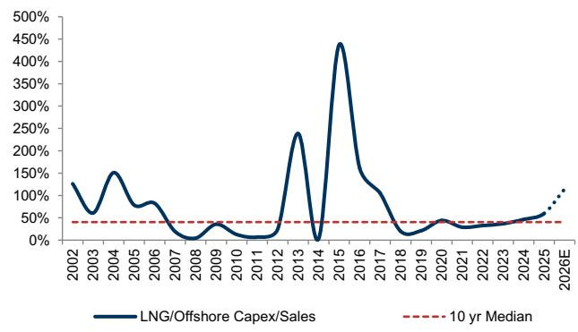

line chart

| Year | LNG/Offshore Capex/Sales |
|------|--------------------------|
| 2002 | ~130%                    |
| 2003 | ~70%                     |
| 2004 | ~150%                    |
| 2005 | ~90%                     |
| 2006 | ~80%                     |
| 2007 | ~10%                     |
| 2008 | ~15%                     |
| 2009 | ~30%                     |
| 2010 | ~20%                     |
| 2011 | ~15%                     |
| 2012 | ~10%                     |
| 2013 | ~230%                    |
| 2014 | ~10%                     |
| 2015 | ~440%                    |
| 2016 | ~150%                    |
| 2017 | ~100%                    |
| 2018 | ~50%                     |
| 2019 | ~40%                     |
| 2020 | ~50%                     |
| 2021 | ~40%                     |
| 2022 | ~40%                     |
| 2023 | ~40%                     |
| 2024 | ~50%                     |
| 2025 | ~60%                     |
| 2026E| ~110%                    |

Source: Company data, Bloomberg, GS Global Investment Research

Exhibit 141: LNG Capex/Depreciation is seen slightly above median levels in 2026  
LNG Capex/Depreciation  
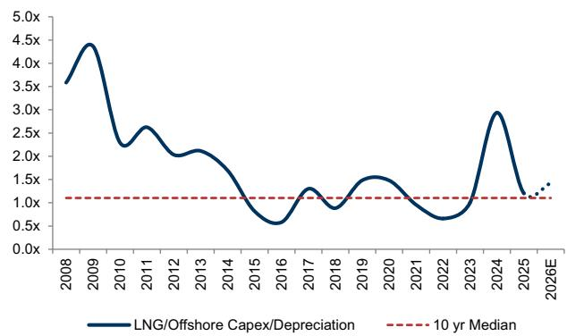

line chart

| Year | LNG/Offshore Capex/Depreciation |
|------|----------------------------------|
| 2008 | 3.5x                             |
| 2009 | 4.5x                             |
| 2010 | 2.5x                             |
| 2011 | 2.7x                             |
| 2012 | 2.3x                             |
| 2013 | 2.1x                             |
| 2014 | 1.8x                             |
| 2015 | 1.5x                             |
| 2016 | 0.5x                             |
| 2017 | 1.3x                             |
| 2018 | 1.0x                             |
| 2019 | 1.5x                             |
| 2020 | 1.3x                             |
| 2021 | 1.0x                             |
| 2022 | 0.8x                             |
| 2023 | 1.0x                             |
| 2024 | 3.0x                             |
| 2025 | 1.5x                             |
| 2026E| 1.5x                             |

Source: Company data, Bloomberg, GS Global Investment Research

Exhibit 142: We expect 2026 to end 56% below the historical peak (2006)  
GS Marine Capex Tracker (indexed)  
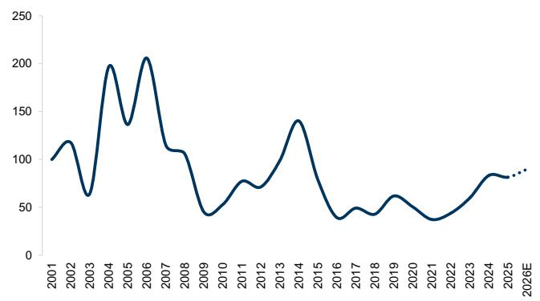

line chart

| Year | Value |
|------|-------|
| 2001 | 100   |
| 2002 | 120   |
| 2003 | 60    |
| 2004 | 200   |
| 2005 | 140   |
| 2006 | 210   |
| 2007 | 110   |
| 2008 | 105   |
| 2009 | 45    |
| 2010 | 55    |
| 2011 | 75    |
| 2012 | 70    |
| 2013 | 110   |
| 2014 | 140   |
| 2015 | 80    |
| 2016 | 40    |
| 2017 | 50    |
| 2018 | 45    |
| 2019 | 65    |
| 2020 | 55    |
| 2021 | 35    |
| 2022 | 45    |
| 2023 | 60    |
| 2024 | 85    |
| 2025 | 80    |
| 2026E| 90    |

Source: Company data, Bloomberg, GS Global Investment Research

## Ports

Exhibit 143: Ports capex is broadly unchanged vs our last update in February  
GS Ports Capex Tracker (37 companies, €23 bn of capex in 2026)  
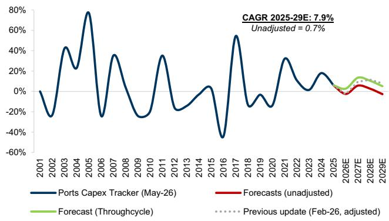

line chart

| Year | Ports Capex Tracker (May-26) | Forecasts (unadjusted) | Forecast (Throughcycle) | Previous update (Feb-26, adjusted) |
|------|-------------------------------|------------------------|-------------------------|------------------------------------|
| 2001 | ~0%                           | -                      | -                       | -                                  |
| 2002 | ~-30%                         | -                      | -                       | -                                  |
| 2003 | ~40%                          | -                      | -                       | -                                  |
| 2004 | ~20%                          | -                      | -                       | -                                  |
| 2005 | ~80%                          | -                      | -                       | -                                  |
| 2006 | ~-30%                         | -                      | -                       | -                                  |
| 2007 | ~35%                          | -                      | -                       | -                                  |
| 2008 | ~-30%                         | -                      | -                       | -                                  |
| 2009 | ~-35%                         | -                      | -                       | -                                  |
| 2010 | ~35%                          | -                      | -                       | -                                  |
| 2011 | ~-30%                         | -                      | -                       | -                                  |
| 2012 | ~-20%                         | -                      | -                       | -                                  |
| 2013 | ~-15%                         | -                      | -                       | -                                  |
| 2014 | ~-10%                         | -                      | -                       | -                                  |
| 2015 | ~5%                           | -                      | -                       | -                                  |
| 2016 | ~-50%                         | -                      | -                       | -                                  |
| 2017 | ~55%                          | -                      | -                       | -                                  |
| 2018 | ~-15%                         | -                      | -                       | -                                  |
| 2019 | ~-10%                         | -                      | -                       | -                                  |
| 2020 | ~-5%                          | -                      | -                       | -                                  |
| 2021 | ~35%                          | -                      | -                       | -                                  |
| 2022 | ~-5%                          | -                      | -                       | -                                  |
| 2023 | ~-10%                         | -                      | -                       | -                                  |
| 2024E| ~-5%                          | ~-5%                   | ~-5%                    | ~-5%                               |
| 2025E| ~-10%                         | ~-10%                  | ~-10%                   | ~-10%                              |
| 2026E| ~-15%                         | ~-15%                  | ~-15%                   | ~-15%                              |
| 2027E| ~-15%                         | ~-15%                  | ~-15%                   | ~-15%                              |
| 2028E| ~-15%                         | ~-15%                  | ~-15%                   | ~-15%                              |
| 2029E| ~-15%                         | ~-15%                  | ~-15%                   | ~-15%                              |
CAGR 2025-29E: 7.9%; Unadjusted = 0.7%

Source: Company data, Bloomberg, GS Global Investment Research

Exhibit 145: Ports Capex/Depreciation is falling to median levels in 2026  
Ports Capex/Depreciation  
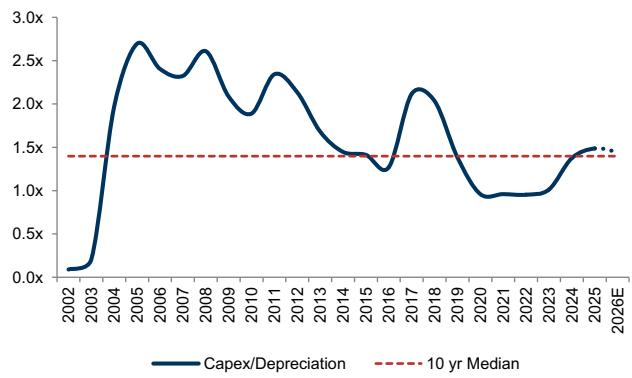

line chart

| Year | Capex/Depreciation |
|------|---------------------|
| 2002 | 0.0x                |
| 2003 | 0.5x                |
| 2004 | 2.0x                |
| 2005 | 2.8x                |
| 2006 | 2.5x                |
| 2007 | 2.3x                |
| 2008 | 2.6x                |
| 2009 | 2.4x                |
| 2010 | 2.0x                |
| 2011 | 2.3x                |
| 2012 | 2.1x                |
| 2013 | 1.8x                |
| 2014 | 1.5x                |
| 2015 | 1.4x                |
| 2016 | 1.3x                |
| 2017 | 2.2x                |
| 2018 | 2.0x                |
| 2019 | 1.5x                |
| 2020 | 1.0x                |
| 2021 | 1.0x                |
| 2022 | 1.0x                |
| 2023 | 1.1x                |
| 2024 | 1.3x                |
| 2025 | 1.5x                |
| 2026E| 1.5x                |

Source: Company data, Bloomberg, GS Global Investment Research

Exhibit 144: Ports Capex/Sales is rising above median levels in 2026  
Ports Capex/Sales  
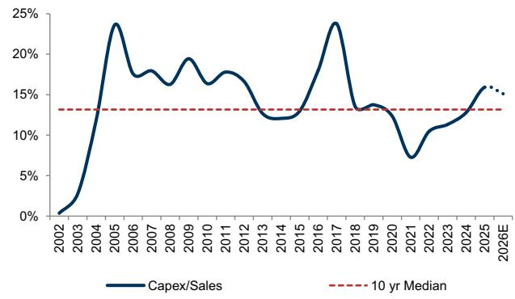

line chart

| Year | Capex/Sales |
|------|-------------|
| 2002 | ~0%         |
| 2003 | ~5%         |
| 2004 | ~15%        |
| 2005 | ~24%        |
| 2006 | ~18%        |
| 2007 | ~17%        |
| 2008 | ~16%        |
| 2009 | ~19%        |
| 2010 | ~17%        |
| 2011 | ~18%        |
| 2012 | ~16%        |
| 2013 | ~14%        |
| 2014 | ~13%        |
| 2015 | ~13%        |
| 2016 | ~18%        |
| 2017 | ~24%        |
| 2018 | ~13%        |
| 2019 | ~14%        |
| 2020 | ~13%        |
| 2021 | ~7%         |
| 2022 | ~10%        |
| 2023 | ~12%        |
| 2024 | ~14%        |
| 2025 | ~16%        |
| 2026E| ~15%        |

Source: Company data, Bloomberg, GS Global Investment Research

Exhibit 146: We expect 2026 to end 30% below the historical peak (2008)  
GS Ports Capex Tracker (indexed)  
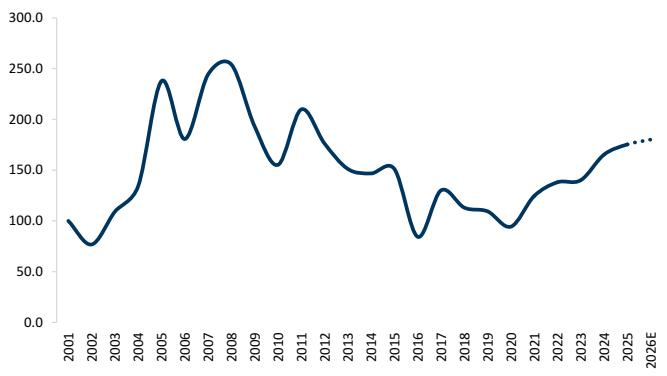

line chart

| Year | Value |
|------|-------|
| 2001 | 100.0 |
| 2002 | 75.0  |
| 2003 | 110.0 |
| 2004 | 130.0 |
| 2005 | 240.0 |
| 2006 | 180.0 |
| 2007 | 250.0 |
| 2008 | 260.0 |
| 2009 | 200.0 |
| 2010 | 155.0 |
| 2011 | 210.0 |
| 2012 | 180.0 |
| 2013 | 160.0 |
| 2014 | 150.0 |
| 2015 | 155.0 |
| 2016 | 85.0  |
| 2017 | 130.0 |
| 2018 | 115.0 |
| 2019 | 110.0 |
| 2020 | 95.0  |
| 2021 | 135.0 |
| 2022 | 145.0 |
| 2023 | 155.0 |
| 2024 | 175.0 |
| 2025 | 185.0 |
| 2026E | 195.0 |

Source: Company data, GS Global Investment Research, Bloomberg

## Trucking

Exhibit 147: Trucking capex downgrades seem to have bottomed out and we see a pick-up into 2026  
GS Truck Capex Tracker (35 companies, €17 bn of capex in 2026)  
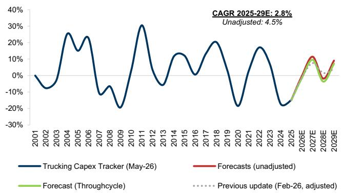

line chart

| Year | Trucking Capex Tracker (May-26) | Forecasts (unadjusted) | Forecast (Throughcycle) | Previous update (Feb-26, adjusted) |
|------|----------------------------------|------------------------|------------------------|------------------------------------|
| 2025E | - | - | - | - |
| 2026E | - | - | - | - |
| 2027E | - | - | - | - |
| 2028E | - | - | - | - |
| 2029E | - | - | - | - |

Source: Company data, Bloomberg, GS Global Investment Research

Exhibit 149: Trucking Capex/Depreciation is seen below median levels in 2026  
Trucking Capex/Depreciation  
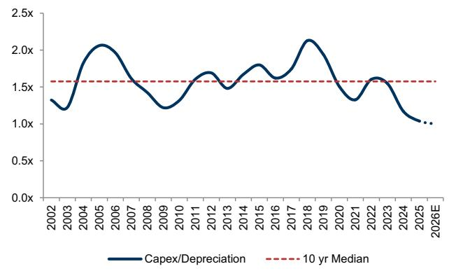

line chart

| Year | Capex/Depreciation |
|------|---------------------|
| 2002 | 1.3x                |
| 2003 | 1.2x                |
| 2004 | 1.8x                |
| 2005 | 2.1x                |
| 2006 | 2.0x                |
| 2007 | 1.7x                |
| 2008 | 1.5x                |
| 2009 | 1.3x                |
| 2010 | 1.4x                |
| 2011 | 1.6x                |
| 2012 | 1.7x                |
| 2013 | 1.5x                |
| 2014 | 1.6x                |
| 2015 | 1.7x                |
| 2016 | 1.6x                |
| 2017 | 1.7x                |
| 2018 | 2.1x                |
| 2019 | 1.9x                |
| 2020 | 1.6x                |
| 2021 | 1.4x                |
| 2022 | 1.6x                |
| 2023 | 1.5x                |
| 2024 | 1.3x                |
| 2025 | 1.1x                |
| 2026E| 1.0x                |

Source: Company data, Bloomberg, GS Global Investment Research

Exhibit 148: Trucking Capex/Sales remains below median levels in 2026  
Trucking Capex/Sales  
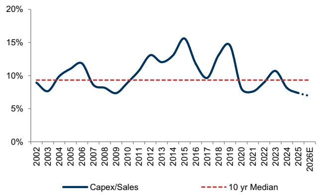

line chart

| Year | Capex/Sales |
|------|-------------|
| 2002 | ~9%         |
| 2003 | ~8%         |
| 2004 | ~10%        |
| 2005 | ~11%        |
| 2006 | ~12%        |
| 2007 | ~10%        |
| 2008 | ~8%         |
| 2009 | ~7%         |
| 2010 | ~9%         |
| 2011 | ~11%        |
| 2012 | ~13%        |
| 2013 | ~12%        |
| 2014 | ~14%        |
| 2015 | ~16%        |
| 2016 | ~14%        |
| 2017 | ~10%        |
| 2018 | ~15%        |
| 2019 | ~14%        |
| 2020 | ~8%         |
| 2021 | ~9%         |
| 2022 | ~10%        |
| 2023 | ~11%        |
| 2024 | ~9%         |
| 2025 | ~7%         |
| 2026E| ~6%         |

Source: Company data, Bloomberg, GS Global Investment Research

Exhibit 150: We expect 2026 to end 31% below the historical peak (2023)  
GS Trucking Capex tracker (indexed)  
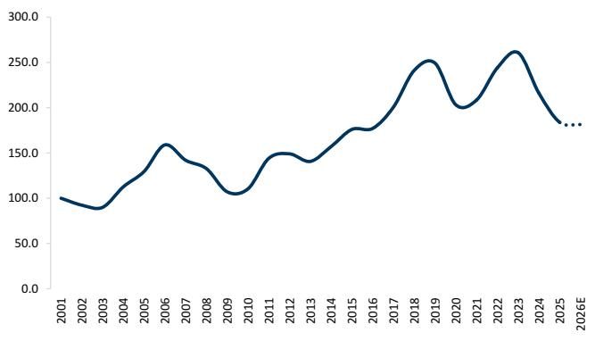

line chart

| Year  | Value |
|-------|-------|
| 2001  | 100.0 |
| 2002  | 95.0  |
| 2003  | 90.0  |
| 2004  | 110.0 |
| 2005  | 130.0 |
| 2006  | 160.0 |
| 2007  | 140.0 |
| 2008  | 130.0 |
| 2009  | 110.0 |
| 2010  | 120.0 |
| 2011  | 145.0 |
| 2012  | 150.0 |
| 2013  | 145.0 |
| 2014  | 160.0 |
| 2015  | 175.0 |
| 2016  | 185.0 |
| 2017  | 210.0 |
| 2018  | 250.0 |
| 2019  | 255.0 |
| 2020  | 200.0 |
| 2021  | 225.0 |
| 2022  | 255.0 |
| 2023  | 265.0 |
| 2024  | 230.0 |
| 2025E | 185.0 |
| 2026E | 185.0 |

Source: Company data, Bloomberg GS Global Investment Research, Bloomberg

Exhibit 151: Trucking equipment in the US is older than the historical median  
Average Age of Truck Equipment (US)  
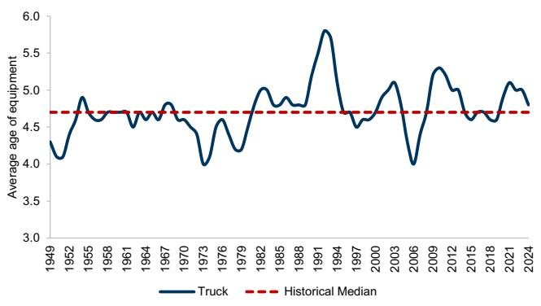

line chart

| Year | Average age of equipment |
| ---- | ------------------------ |
| 1949 | 4.2                      |
| 1952 | 4.8                      |
| 1955 | 4.7                      |
| 1958 | 4.7                      |
| 1961 | 4.7                      |
| 1964 | 4.7                      |
| 1967 | 4.8                      |
| 1970 | 4.6                      |
| 1973 | 4.0                      |
| 1976 | 4.6                      |
| 1979 | 4.2                      |
| 1982 | 5.0                      |
| 1985 | 4.9                      |
| 1988 | 4.8                      |
| 1991 | 5.8                      |
| 1994 | 4.7                      |
| 1997 | 4.5                      |
| 2000 | 4.7                      |
| 2003 | 5.1                      |
| 2006 | 4.0                      |
| 2009 | 5.3                      |
| 2012 | 5.0                      |
| 2015 | 4.7                      |
| 2018 | 4.6                      |
| 2021 | 5.1                      |
| 2024 | 4.8                      |

Source: US Bureau of Economic Analysis

## Pulp & Paper

Exhibit 153: The Capex Tracker indicates Pulp & Paper investments are set to pick up in the medium term  
GS Pulp & Paper Capex Tracker (40 companies, €18 bn of capex in 2026)  
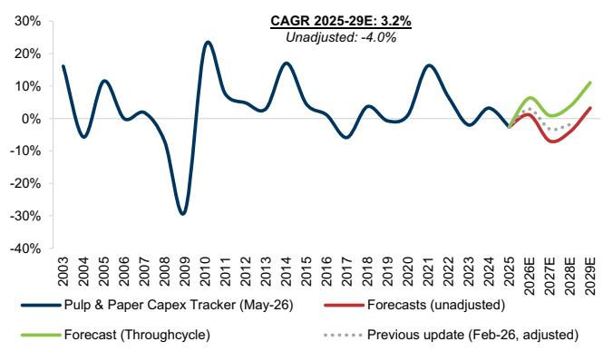

line chart

| Year | Pulp & Paper Capex Tracker (May-26) | Forecasts (unadjusted) | Forecast (Throughcycle) | Previous update (Feb-26, adjusted) |
|------|-------------------------------------|------------------------|------------------------|------------------------------------|
| 2003 | ~18%                                | -                      | -                      | -                                  |
| 2004 | ~-5%                                | -                      | -                      | -                                  |
| 2005 | ~12%                                | -                      | -                      | -                                  |
| 2006 | ~2%                                 | -                      | -                      | -                                  |
| 2007 | ~-5%                                | -                      | -                      | -                                  |
| 2008 | ~-30%                               | -                      | -                      | -                                  |
| 2009 | ~-30%                               | -                      | -                      | -                                  |
| 2010 | ~25%                                | -                      | -                      | -                                  |
| 2011 | ~10%                                | -                      | -                      | -                                  |
| 2012 | ~5%                                 | -                      | -                      | -                                  |
| 2013 | ~18%                                | -                      | -                      | -                                  |
| 2014 | ~15%                                | -                      | -                      | -                                  |
| 2015 | ~5%                                 | -                      | -                      | -                                  |
| 2016 | ~-5%                                | -                      | -                      | -                                  |
| 2017 | ~5%                                 | -                      | -                      | -                                  |
| 2018 | ~0%                                 | -                      | -                      | -                                  |
| 2019 | ~-5%                                | -                      | -                      | -                                  |
| 2020 | ~-5%                                | -                      | -                      | -                                  |
| 2021 | ~18%                                | -                      | -                      | -                                  |
| 2022 | ~15%                                | -                      | -                      | -                                  |
| 2023 | ~-5%                                | -                      | -                      | -                                  |
| 2024E| ~-5%                                | ~-5%                   | ~5%                    | ~-5%                               |
| 2025E| ~-5%                                | ~-5%                   | ~5%                    | ~-5%                               |
| 2026E| ~-5%                                | ~-5%                   | ~5%                    | ~-5%                               |
| 2027E| ~-5%                                | ~-5%                   | ~5%                    | ~-5%                               |
| 2028E| ~-5%                                | ~-5%                   | ~5%                    | ~-5%                               |
| 2029E| ~-5%                                | ~-5%                   | ~10%                   | ~-5%                               |
CAGR 2025-29E: 3.2%, Unadjusted: -4.0%

Source: Company data, Bloomberg, GS Global Investment Research

Exhibit 152: Truck capacity utilization is above median levels  
North America Active Truck Utilization (\%, SA)  
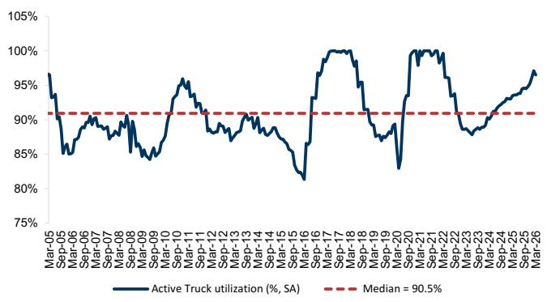

line chart

| Date    | Active Truck utilization (%, SA) |
|---------|----------------------------------|
| Mar-05  | 98%                              |
| Sep-05  | 85%                              |
| Mar-06  | 90%                              |
| Sep-06  | 88%                              |
| Mar-07  | 87%                              |
| Sep-07  | 89%                              |
| Mar-08  | 86%                              |
| Sep-08  | 84%                              |
| Mar-09  | 83%                              |
| Sep-09  | 85%                              |
| Mar-10  | 96%                              |
| Sep-10  | 94%                              |
| Mar-11  | 92%                              |
| Sep-11  | 90%                              |
| Mar-12  | 88%                              |
| Sep-12  | 86%                              |
| Mar-13  | 89%                              |
| Sep-13  | 90%                              |
| Mar-14  | 87%                              |
| Sep-14  | 85%                              |
| Mar-15  | 83%                              |
| Sep-15  | 81%                              |
| Mar-16  | 82%                              |
| Sep-16  | 95%                              |
| Mar-17  | 100%                             |
| Sep-17  | 98%                              |
| Mar-18  | 96%                              |
| Sep-18  | 94%                              |
| Mar-19  | 92%                              |
| Sep-19  | 88%                              |
| Mar-20  | 85%                              |
| Sep-20  | 90%                              |
| Mar-21  | 100%                             |
| Sep-21  | 98%                              |
| Mar-22  | 96%                              |
| Sep-22  | 94%                              |
| Mar-23  | 92%                              |
| Sep-23  | 90%                              |
| Mar-24  | 92%                              |
| Sep-24  | 94%                              |
| Mar-25  | 96%                              |
| Sep-25  | 98%                              |
| Mar-26  | 100%                             |

Source: FTR Intelligence, GS Global Investment Research

Exhibit 154: Pulp & Paper Capex/Sales is likely to fall to median levels in 2026  
Pulp & Paper Capex/Sales  
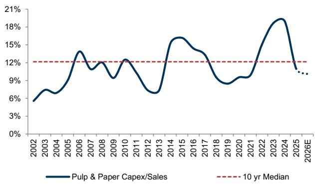

line chart

| Year | Pulp & Paper Capex/Sales |
|------|--------------------------|
| 2002 | 6%                       |
| 2003 | 7%                       |
| 2004 | 8%                       |
| 2005 | 10%                      |
| 2006 | 14%                      |
| 2007 | 12%                      |
| 2008 | 13%                      |
| 2009 | 11%                      |
| 2010 | 13%                      |
| 2011 | 12%                      |
| 2012 | 10%                      |
| 2013 | 8%                       |
| 2014 | 16%                      |
| 2015 | 15%                      |
| 2016 | 14%                      |
| 2017 | 13%                      |
| 2018 | 11%                      |
| 2019 | 9%                       |
| 2020 | 10%                      |
| 2021 | 12%                      |
| 2022 | 15%                      |
| 2023 | 18%                      |
| 2024 | 19%                      |
| 2025 | 12%                      |
| 2026E| 10%                      |

Source: Company data, Bloomberg, GS

Exhibit 155: Capex/Depreciation for Pulp & Paper is seen slightly below median levels in 2026  
Pulp & Paper Capex/Depreciation  
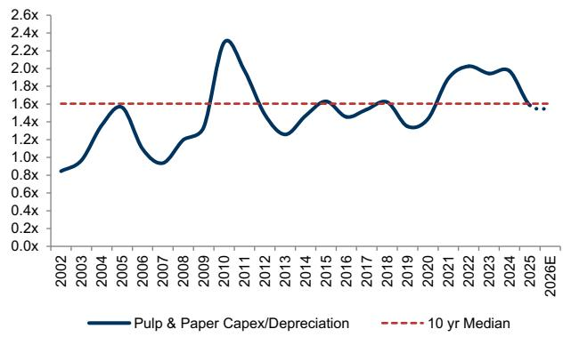

line chart

| Year | Pulp & Paper Capex/Depreciation |
|------|----------------------------------|
| 2002 | 0.9x                             |
| 2003 | 1.0x                             |
| 2004 | 1.5x                             |
| 2005 | 1.6x                             |
| 2006 | 1.3x                             |
| 2007 | 1.0x                             |
| 2008 | 1.2x                             |
| 2009 | 1.4x                             |
| 2010 | 2.4x                             |
| 2011 | 2.2x                             |
| 2012 | 1.8x                             |
| 2013 | 1.5x                             |
| 2014 | 1.6x                             |
| 2015 | 1.7x                             |
| 2016 | 1.6x                             |
| 2017 | 1.7x                             |
| 2018 | 1.6x                             |
| 2019 | 1.5x                             |
| 2020 | 1.6x                             |
| 2021 | 2.0x                             |
| 2022 | 2.1x                             |
| 2023 | 2.0x                             |
| 2024 | 2.1x                             |
| 2025 | 1.9x                             |
| 2026E| 1.6x                             |

Source: Company data, Bloomberg, GS Global Investment Research

Exhibit 157: Pulp & Paper equipment age is well above median levels  
Average age of Pulp & Paper equipment (US)  
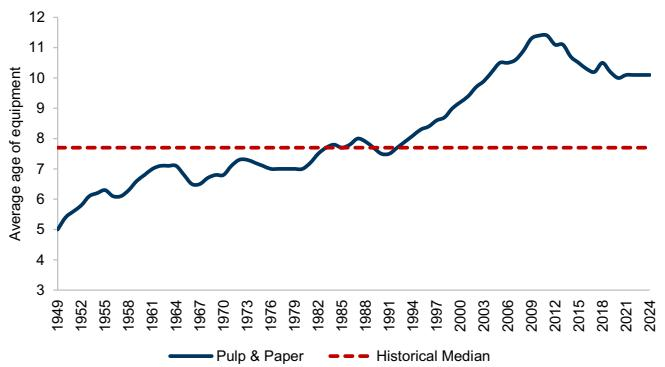

line chart

| Year | Average age of equipment |
| ---- | ------------------------ |
| 1949 | 5.0                      |
| 1952 | 6.0                      |
| 1955 | 6.5                      |
| 1958 | 6.0                      |
| 1961 | 7.0                      |
| 1964 | 7.5                      |
| 1967 | 7.0                      |
| 1970 | 7.5                      |
| 1973 | 7.0                      |
| 1976 | 7.5                      |
| 1979 | 7.0                      |
| 1982 | 7.5                      |
| 1985 | 8.0                      |
| 1988 | 7.5                      |
| 1991 | 7.0                      |
| 1994 | 8.0                      |
| 1997 | 8.5                      |
| 2000 | 9.0                      |
| 2003 | 10.0                     |
| 2006 | 10.5                     |
| 2009 | 11.0                     |
| 2012 | 11.5                     |
| 2015 | 11.0                     |
| 2018 | 10.5                     |
| 2021 | 10.0                     |
| 2024 | 10.0                     |

Source: US Bureau of Economic Analysis (BEA)

Exhibit 156: We expect 2026 to end at 4% above the historical peak (2024)  
GS Pulp & Paper Capex Tracker (indexed)  
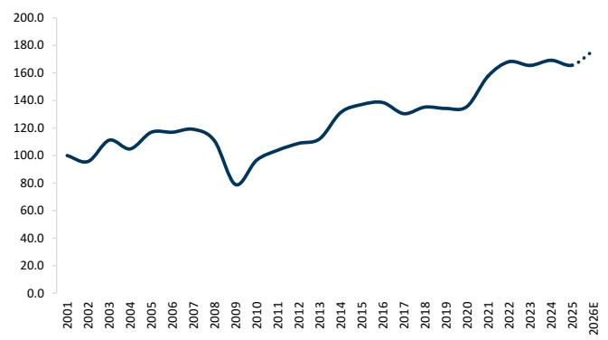

line chart

| Year | Value |
|------|-------|
| 2001 | 100.0 |
| 2002 | 95.0  |
| 2003 | 110.0 |
| 2004 | 105.0 |
| 2005 | 115.0 |
| 2006 | 118.0 |
| 2007 | 120.0 |
| 2008 | 115.0 |
| 2009 | 80.0  |
| 2010 | 95.0  |
| 2011 | 105.0 |
| 2012 | 110.0 |
| 2013 | 115.0 |
| 2014 | 130.0 |
| 2015 | 135.0 |
| 2016 | 138.0 |
| 2017 | 135.0 |
| 2018 | 138.0 |
| 2019 | 135.0 |
| 2020 | 145.0 |
| 2021 | 165.0 |
| 2022 | 170.0 |
| 2023 | 168.0 |
| 2024 | 170.0 |
| 2025 | 168.0 |
| 2026E | 175.0 |

Source: Company data, Bloomberg, GS Global Investment Research

Exhibit 158: Pulp and Paper capacity utilization is well below median levels  
Average Capacity Utilization (US, EU)  
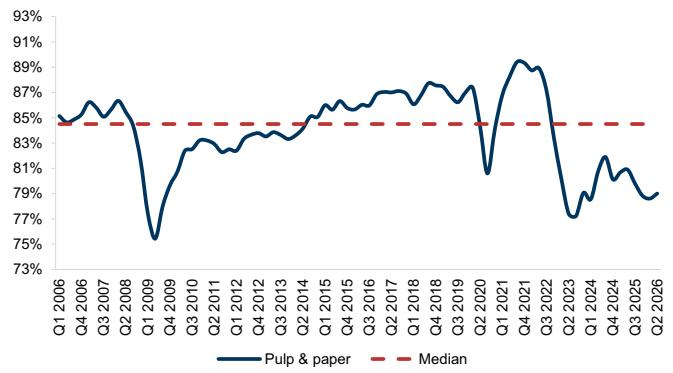

line chart

| Quarter | Pulp & paper | Median |
| ------- | ------------ | ------ |
| Q1 2006 | 85%          | 85%    |
| Q4 2006 | 86%          | 85%    |
| Q3 2007 | 87%          | 85%    |
| Q2 2008 | 85%          | 85%    |
| Q1 2009 | 75%          | 85%    |
| Q4 2009 | 80%          | 85%    |
| Q3 2010 | 83%          | 85%    |
| Q2 2011 | 84%          | 85%    |
| Q1 2012 | 85%          | 85%    |
| Q4 2012 | 84%          | 85%    |
| Q3 2013 | 85%          | 85%    |
| Q2 2014 | 86%          | 85%    |
| Q1 2015 | 87%          | 85%    |
| Q4 2015 | 87%          | 85%    |
| Q3 2016 | 87%          | 85%    |
| Q2 2017 | 87%          | 85%    |
| Q1 2018 | 87%          | 85%    |
| Q4 2018 | 87%          | 85%    |
| Q3 2019 | 87%          | 85%    |
| Q2 2020 | 81%          | 85%    |
| Q1 2021 | 89%          | 85%    |
| Q4 2021 | 90%          | 85%    |
| Q3 2022 | 89%          | 85%    |
| Q2 2023 | 77%          | 85%    |
| Q1 2024 | 79%          | 85%    |
| Q4 2024 | 81%          | 85%    |
| Q3 2025 | 79%          | 85%    |
| Q2 2026 | 79%          | 85%    |

Source: Federal Reserve, DG ECFIN

## Healthcare

Exhibit 159: Our Healthcare Capex Tracker has seen upgrades in medium term  
GS Healthcare Capex Tracker (40 companies, €12 bn of capex in 2026)  
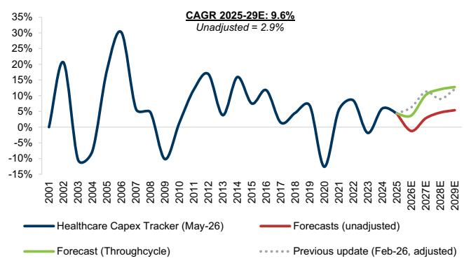

line chart

| Year | Healthcare Capex Tracker (May-26) | Forecasts (unadjusted) | Forecast (Throughcycle) | Previous update (Feb-26, adjusted) |
|------|-----------------------------------|------------------------|-------------------------|------------------------------------|
| 2001 | ~0%                               | -                      | -                       | -                                  |
| 2002 | ~20%                              | -                      | -                       | -                                  |
| 2003 | ~-10%                             | -                      | -                       | -                                  |
| 2004 | ~-15%                             | -                      | -                       | -                                  |
| 2005 | ~30%                              | -                      | -                       | -                                  |
| 2006 | ~5%                               | -                      | -                       | -                                  |
| 2007 | ~15%                              | -                      | -                       | -                                  |
| 2008 | ~-10%                             | -                      | -                       | -                                  |
| 2009 | ~-15%                             | -                      | -                       | -                                  |
| 2010 | ~15%                              | -                      | -                       | -                                  |
| 2011 | ~18%                              | -                      | -                       | -                                  |
| 2012 | ~5%                               | -                      | -                       | -                                  |
| 2013 | ~15%                              | -                      | -                       | -                                  |
| 2014 | ~18%                              | -                      | -                       | -                                  |
| 2015 | ~15%                              | -                      | -                       | -                                  |
| 2016 | ~10%                              | -                      | -                       | -                                  |
| 2017 | ~5%                               | -                      | -                       | -                                  |
| 2018 | ~8%                               | -                      | -                       | -                                  |
| 2019 | ~5%                               | -                      | -                       | -                                  |
| 2020 | ~-15%                             | -                      | -                       | -                                  |
| 2021 | ~8%                               | -                      | -                       | -                                  |
| 2022 | ~5%                               | -                      | -                       | -                                  |
| 2023 | ~-5%                              | -                      | -                       | -                                  |
| 2024 | ~5%                               | -                      | -                       | -                                  |
| 2025E| ~5%                               | ~-5%                   | ~5%                     | ~5%                                |
| 2026E| ~5%                               | ~-5%                   | ~10%                    | ~10%                               |
| 2027E| ~5%                               | ~5%                    | ~12%                    | ~12%                               |
| 2028E| ~5%                               | ~5%                    | ~13%                    | ~13%                               |
| 2029E| ~5%                               | ~5%                    | ~13%                    | ~13%                               |
CAGR 2025-29E: 9.6%; Unadjusted = 2.9%; Previous update (Feb-26, adjusted)

Source: Company data, Bloomberg, GS Global Investment Research

Exhibit 161: Healthcare Capex/Depreciation is seen below median levels in 2026  
Healthcare Capex/Depreciation  
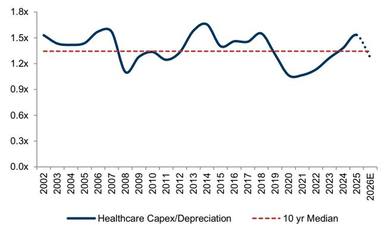

line chart

| Year | Healthcare Capex/Depreciation |
|------|-------------------------------|
| 2002 | 1.5x                          |
| 2003 | 1.4x                          |
| 2004 | 1.4x                          |
| 2005 | 1.5x                          |
| 2006 | 1.6x                          |
| 2007 | 1.5x                          |
| 2008 | 1.1x                          |
| 2009 | 1.3x                          |
| 2010 | 1.3x                          |
| 2011 | 1.3x                          |
| 2012 | 1.4x                          |
| 2013 | 1.6x                          |
| 2014 | 1.7x                          |
| 2015 | 1.5x                          |
| 2016 | 1.5x                          |
| 2017 | 1.5x                          |
| 2018 | 1.5x                          |
| 2019 | 1.4x                          |
| 2020 | 1.1x                          |
| 2021 | 1.1x                          |
| 2022 | 1.2x                          |
| 2023 | 1.3x                          |
| 2024 | 1.4x                          |
| 2025 | 1.5x                          |
| 2026E| 1.3x                          |

Source: Company data, Bloomberg, GS Global Investment Research

Exhibit 160: Healthcare Capex/Sales to remain below median levels in 2026  
Healthcare Capex/Sales  
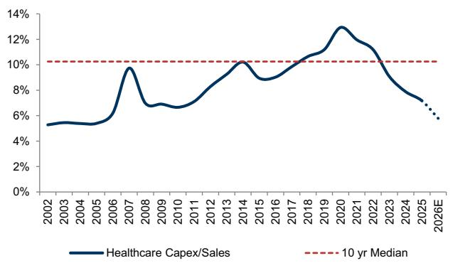

line chart

| Year | Healthcare Capex/Sales |
|------|------------------------|
| 2002 | 5.0%                   |
| 2003 | 5.0%                   |
| 2004 | 5.0%                   |
| 2005 | 5.0%                   |
| 2006 | 6.0%                   |
| 2007 | 10.0%                  |
| 2008 | 7.0%                   |
| 2009 | 7.0%                   |
| 2010 | 7.0%                   |
| 2011 | 7.5%                   |
| 2012 | 8.5%                   |
| 2013 | 9.5%                   |
| 2014 | 10.5%                  |
| 2015 | 9.5%                   |
| 2016 | 10.0%                  |
| 2017 | 10.5%                  |
| 2018 | 11.0%                  |
| 2019 | 11.5%                  |
| 2020 | 13.0%                  |
| 2021 | 12.5%                  |
| 2022 | 11.5%                  |
| 2023 | 10.5%                  |
| 2024 | 9.5%                   |
| 2025 | 8.5%                   |
| 2026E| 7.5%                   |

Source: Company data, Bloomberg, GS Global Investment Research

Exhibit 162: We expect 2026 to end 4% above the historical peak (2025)  
GS Healthcare Capex Tracker (Indexed)  
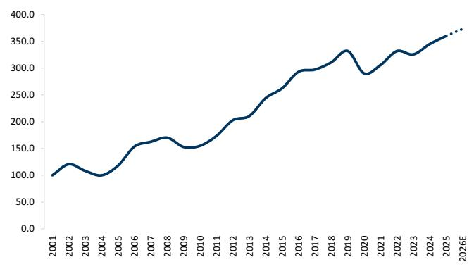

line chart

| Year  | Value |
|-------|-------|
| 2001  | 100.0 |
| 2002  | 120.0 |
| 2003  | 110.0 |
| 2004  | 105.0 |
| 2005  | 125.0 |
| 2006  | 155.0 |
| 2007  | 165.0 |
| 2008  | 175.0 |
| 2009  | 160.0 |
| 2010  | 170.0 |
| 2011  | 185.0 |
| 2012  | 205.0 |
| 2013  | 215.0 |
| 2014  | 240.0 |
| 2015  | 260.0 |
| 2016  | 295.0 |
| 2017  | 305.0 |
| 2018  | 325.0 |
| 2019  | 335.0 |
| 2020  | 295.0 |
| 2021  | 315.0 |
| 2022  | 335.0 |
| 2023  | 330.0 |
| 2024  | 355.0 |
| 2025  | 375.0 |
| 2026E | 385.0 |

Source: Company data, Bloomberg, GS Global Investment Research

Exhibit 163: The age of Healthcare equipment in the US has been increasing for more than a decade
Average Age of Healthcare Equipment (US)  
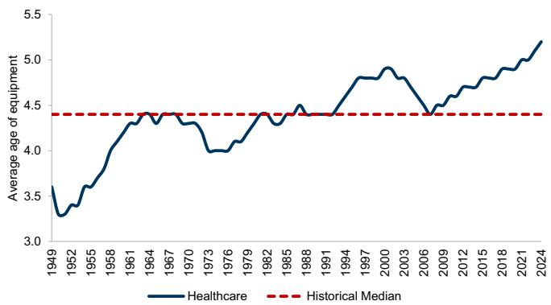

line chart

| Year | Average age of equipment |
| ---- | ------------------------ |
| 1949 | 3.5                      |
| 1952 | 3.3                      |
| 1955 | 3.6                      |
| 1958 | 3.8                      |
| 1961 | 4.2                      |
| 1964 | 4.4                      |
| 1967 | 4.3                      |
| 1970 | 4.2                      |
| 1973 | 4.0                      |
| 1976 | 4.1                      |
| 1979 | 4.3                      |
| 1982 | 4.4                      |
| 1985 | 4.5                      |
| 1988 | 4.4                      |
| 1991 | 4.4                      |
| 1994 | 4.8                      |
| 1997 | 4.9                      |
| 2000 | 4.8                      |
| 2003 | 4.7                      |
| 2006 | 4.4                      |
| 2009 | 4.6                      |
| 2012 | 4.7                      |
| 2015 | 4.8                      |
| 2018 | 4.9                      |
| 2021 | 5.0                      |
| 2024 | 5.2                      |

Source: Bureau of Economic Analysis

## Airports

Exhibit 164: Airport capex is expected to see a weak 2026 GS Airports Capex Tracker (14 companies, €5 bn of capex in 2026)  
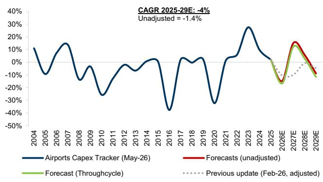

line chart

| Year | Airports Capex Tracker (May-26) | Forecasts (unadjusted) | Forecast (Throughcycle) | Previous update (Feb-26, adjusted) |
|------|----------------------------------|------------------------|-------------------------|------------------------------------|
| 2004 | ~10%                             |                        |                         |                                    |
| 2005 | ~-10%                            |                        |                         |                                    |
| 2006 | ~15%                             |                        |                         |                                    |
| 2007 | ~10%                             |                        |                         |                                    |
| 2008 | ~-15%                            |                        |                         |                                    |
| 2009 | ~-5%                             |                        |                         |                                    |
| 2010 | ~-30%                            |                        |                         |                                    |
| 2011 | ~-10%                            |                        |                         |                                    |
| 2012 | ~-5%                             |                        |                         |                                    |
| 2013 | ~0%                              |                        |                         |                                    |
| 2014 | ~5%                              |                        |                         |                                    |
| 2015 | ~0%                              |                        |                         |                                    |
| 2016 | ~-40%                            |                        |                         |                                    |
| 2017 | ~5%                              |                        |                         |                                    |
| 2018 | ~0%                              |                        |                         |                                    |
| 2019 | ~5%                              |                        |                         |                                    |
| 2020 | ~-30%                            |                        |                         |                                    |
| 2021 | ~5%                              |                        |                         |                                    |
| 2022 | ~10%                             |                        |                         |                                    |
| 2023 | ~30%                             |                        |                         |                                    |
| 2024E| ~10%                             |                        |                         |                                    |
| 2025E| ~5%                              |                        |                         |                                    |
| 2026E| ~-15%                            |                        |                         |                                    |
| 2027E| ~15%                             |                        |                         |                                    |
| 2028E| ~10%                             |                        |                         |                                    |
| 2029E| ~5%                              |                        |                         |                                    |
| Unadjusted = -1.4%

Source: Company data, Bloomberg, GS Global Investment Research

Exhibit 165: Airport Capex/Sales is seen below median levels in 2026  
Airports Capex/Sales  
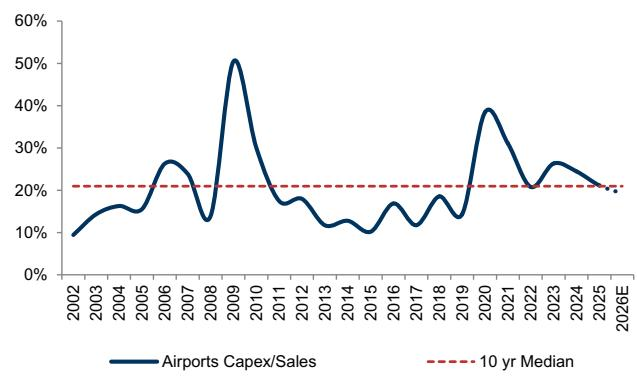

line chart

| Year | Airports Capex/Sales |
|------|----------------------|
| 2002 | ~10%                 |
| 2003 | ~15%                 |
| 2004 | ~18%                 |
| 2005 | ~16%                 |
| 2006 | ~25%                 |
| 2007 | ~28%                 |
| 2008 | ~13%                 |
| 2009 | ~51%                 |
| 2010 | ~35%                 |
| 2011 | ~18%                 |
| 2012 | ~17%                 |
| 2013 | ~15%                 |
| 2014 | ~13%                 |
| 2015 | ~12%                 |
| 2016 | ~15%                 |
| 2017 | ~13%                 |
| 2018 | ~18%                 |
| 2019 | ~15%                 |
| 2020 | ~40%                 |
| 2021 | ~35%                 |
| 2022 | ~25%                 |
| 2023 | ~28%                 |
| 2024 | ~26%                 |
| 2025 | ~24%                 |
| 2026E| ~21%                 |

Source: Company data, Bloomberg, GS Global Investment Research

Exhibit 166: Airport Capex/Depreciation is expected to drop below median levels in 2026  
Airports Capex/Depreciation  
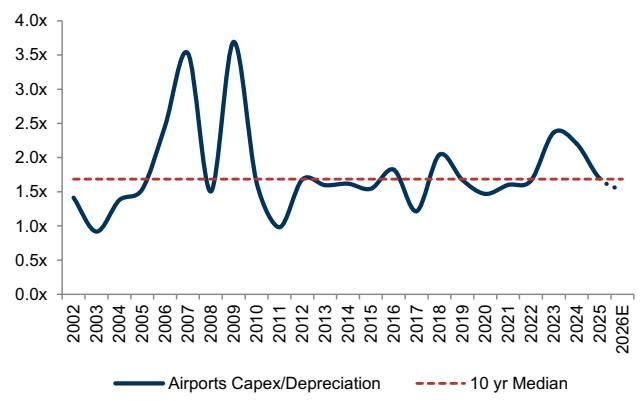

line chart

| Year | Airports Capex/Depreciation |
|------|-----------------------------|
| 2002 | 1.4x                        |
| 2003 | 0.9x                        |
| 2004 | 1.3x                        |
| 2005 | 1.5x                        |
| 2006 | 2.8x                        |
| 2007 | 3.5x                        |
| 2008 | 1.5x                        |
| 2009 | 3.7x                        |
| 2010 | 1.8x                        |
| 2011 | 1.0x                        |
| 2012 | 1.7x                        |
| 2013 | 1.6x                        |
| 2014 | 1.6x                        |
| 2015 | 1.7x                        |
| 2016 | 1.8x                        |
| 2017 | 1.3x                        |
| 2018 | 2.1x                        |
| 2019 | 1.6x                        |
| 2020 | 1.5x                        |
| 2021 | 1.6x                        |
| 2022 | 1.7x                        |
| 2023 | 2.4x                        |
| 2024 | 2.3x                        |
| 2025 | 1.7x                        |
| 2026E| 1.6x                        |

Source: Company data, Bloomberg, GS Global Investment Research

## Biotech

## Exhibit 168: Biotech capex to see downgrades during the medium term

GS Biotech Capex Tracker (157 companies, €6 bn of capex in 2026)

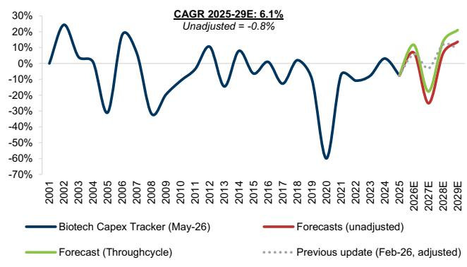

line chart

| Year | Biotech Capex Tracker (May-26) | Forecasts (unadjusted) | Forecast (Throughcycle) | Previous update (Feb-26, adjusted) |
|------|----------------------------------|------------------------|------------------------|------------------------------------|
| 2001 | ~0%                              | -                      | -                      | -                                  |
| 2002 | ~25%                             | -                      | -                      | -                                  |
| 2003 | ~5%                              | -                      | -                      | -                                  |
| 2004 | ~-30%                            | -                      | -                      | -                                  |
| 2005 | ~20%                             | -                      | -                      | -                                  |
| 2006 | ~-30%                            | -                      | -                      | -                                  |
| 2007 | ~-10%                            | -                      | -                      | -                                  |
| 2008 | ~-30%                            | -                      | -                      | -                                  |
| 2009 | ~-10%                            | -                      | -                      | -                                  |
| 2010 | ~-5%                             | -                      | -                      | -                                  |
| 2011 | ~10%                             | -                      | -                      | -                                  |
| 2012 | ~-10%                            | -                      | -                      | -                                  |
| 2013 | ~-5%                             | -                      | -                      | -                                  |
| 2014 | ~-10%                            | -                      | -                      | -                                  |
| 2015 | ~-5%                             | -                      | -                      | -                                  |
| 2016 | ~-10%                            | -                      | -                      | -                                  |
| 2017 | ~-5%                             | -                      | -                      | -                                  |
| 2018 | ~-10%                            | -                      | -                      | -                                  |
| 2019 | ~-60%                            | -                      | -                      | -                                  |
| 2020 | ~-10%                            | -                      | -                      | -                                  |
| 2021 | ~-5%                             | -                      | -                      | -                                  |
| 2022 | ~-10%                            | -                      | -                      | -                                  |
| 2023 | ~-5%                             | -                      | -                      | -                                  |
| 2024 | ~-10%                            | -                      | -                      | -                                  |
| 2025E| ~-5%                             | ~-30%                  | ~-10%                  | ~-5%                               |
| 2026E| ~-10%                            | ~-10%                  | ~-5%                   | ~-10%                              |
| 2027E| ~-5%                             | ~-30%                  | ~-10%                  | ~-5%                               |
| 2028E| ~10%                             | ~-10%                  | ~-5%                   | ~-10%                              |
| 2029E| ~15%                             | ~-5%                   | ~5%                    | ~-5%                               |
| 2030E| ~20%                             | ~5%                    | ~10%                   | ~5%                                |
| 2031E| ~25%                             | ~10%                   | ~15%                   | ~10%                               |
| 2032E| ~30%                             | ~15%                   | ~20%                   | ~15%                               |
| 2033E| ~35%                             | ~20%                   | ~25%                   | ~20%                               |
| 2034E| ~40%                             | ~25%                   | ~30%                   | ~25%                               |
| 2035E| ~45%                             | ~30%                   | ~35%                   | ~30%                               |
| 2036E| ~50%                             | ~35%                   | ~40%                   | ~35%                               |
| 2037E| ~55%                             | ~40%                   | ~45%                   | ~40%                               |
| 2038E| ~60%                             | ~45%                   | ~50%                   | ~45%                               |
| 2039E| ~65%                             | ~50%                   | ~55%                   | ~50%                               |
| 2040E| ~70%                             | ~55%                   | ~60%                   | ~55%                               |
| 2041E| ~75%                             | ~60%                   | ~65%                   | ~60%                               |
| 2042E| ~80%                             | ~65%                   | ~70%                   | ~65%                               |
| 2043E| ~85%                             | ~70%                   | ~75%                   | ~70%                               |
| 2044E| ~90%                             | ~75%                   | ~80%                   | ~75%                               |
| 2045E| ~95%                             | ~80%                   | ~85%                   | ~80%                               |
| 2046E| ~100%                            | ~85%                   | ~90%                   | ~85%                               |
| 2047E| ~105%                            | ~90%                   | ~95%                   | ~90%                               |
| 2048E| ~110%                            | ~95%                   | ~100%                  | ~95%                               |
| 2049E| ~115%                            | ~100%                  | ~105%                  | ~100%                              |
| 2050E| ~120%                            | ~105%                  | ~110%                  | ~105%                              |
| 2051E| ~125%                            | ~110%                  | ~115%                  | ~110%                              |
| 2052E| ~130%                            | ~115%                  | ~120%                  | ~115%                              |
| 2053E| ~135%                            | ~120%                  | ~125%                  | ~120%                              |
| 2054E| ~140%                            | ~125%                  | ~130%                  | ~125%                              |
| 2055E| ~145%                            | ~130%                  | ~135%                  | ~130%                              |
| 2056E| ~150%                            | ~135%                  | ~140%                  | ~135%                              |
| 2057E| ~155%                            | ~140%                  | ~145%                  | ~140%                              |
| 2058E| ~160%                            | ~145%                  | ~150%                  | ~145%                              |
| 2059E| ~165%                            | ~150%                  | ~155%                  | ~150%                              |
| 2060E| ~170%                            | ~155%                  | ~160%                  | ~155%                              |
| 2061E| ~175%                            | ~160%                  | ~165%                  | ~160%                              |
| 2062E| ~180%                            | ~165%                  | ~170%                  | ~165%                              |
| 2063E| ~185%                            | ~170%                  | ~175%                  | ~170%                              |
| 2064E| ~190%                            | ~175%                  | ~180%                  | ~175%                              |
| 2065E| ~195%                            | ~180%                  | ~185%                  | ~180%                              |
| 2066E| ~200%                            | ~185%                  | ~190%                  | ~185%                              |
| 2067E| ~205%                            | ~190%                  | ~195%                  | ~190%                              |
| 2068E| ~210%                            | ~195%                  | ~200%                  | ~195%                              |
| 2069E| ~215%                            | ~200%                  | ~205%                  | ~200%                              |
| 2070E| ~220%                            | ~205%                  | ~210%                  | ~205%                              |
| 2071E| ~225%                            | ~210%                  | ~215%                  | ~210%                              |
| 2072E| ~230%                            | ~215%                  | ~220%                  | ~215%                              |
| 2073E| ~235%                            | ~220%                  | ~225%                  | ~220%                              |
| 2074E| ~240%                            | ~225%                  | ~230%                  | ~225%                              |
| 2075E| ~245%                            | ~230%                  | ~235%                  | ~230%                              |
| 2076E| ~250%                            | ~235%                  | ~240%                  | ~235%                              |
| 2077E| ~255%                            | ~240%                  | ~245%                  | ~240%                              |
| 2078E| ~260%                            | ~245%                  | ~250%                  | ~245%                              |
| 2079E| (~-6%)                           | (~-6%)                 | (~-6%)                 | (~-6%)                              |
| 2080E| (~-7%)                           | (~-7%)                 | (~-7%)                 | (~-7%)                              |
| 2081E| (~-8%)                           | (~-8%)                 | (~-8%)                 | (~-8%)                              |
| 2082E| (~-9%)                           | (~-9%)                 | (~-9%)                 | (~-9%)                              |
| 2083E| (~-1.3%)                         | (~-1.3%)               | (~-1.3%)               | (~-1.3%)                             |
| 2084E| (~-1.6%)                         | (~-1.6%)               | (~-1.6%)               | (~-1.6%)                             |
| 2085E| (~-1.9%)                         | (~-1.9%)               | (~-1.9%)               | (~-1.9%)                             |
| 2086E| (~-2.3%)                         | (~-2.3%)               | (~-2.3%)               | (~-2.3%)                             |
| 2087E| (~-3.8%)                         | (~-3.8%)               | (~-3.8%)               | (~-3.8%)                             |
| 2088E| (~-4.3%)                         | (~-4.3%)               | (~-4.3%)               | (~-4.3%)                             |
| 2089E| (~-4.8%)                         | (~-4.8%)               | (~-4.8%)               | (~-4.8%)                             |
| 2090E| (~-6%)                           | (~-6%)                 | (~-6%)                 | (~-6%)                              |
| 2091E| (~-7%)                           | (~-7%)                 | (~-7%)                 | (~-7%)                              |
| 2092E| (~-8%)                           | (~-8%)                 | (~-8%)                 | (~-8%)                              |
| 2093E| (~-9%)                           | (~-9%)                 | (~-9%)                 | (~-9%)                              |
| 2094E| (~-9.8%)                         | (~-9.8%)               | (~-9.8%)               | (~-9.8%)                             |
| 2095E| (~-9.9%)                         | (~-9.9%)               | (~-9.9%)               | (~-9.9%)                             |
| 2096E| (~-9.9%)                         | (~-9.9%)               | (~-9.9%)               | (~-9.9%)                             |
| 2097E| (~-9.9%)                         | (~-9.9%)               | (~-9.9%)               | (~-9.9%)                             |
| 2098E| (~-9.9%)                         | (~-9.9%)               | (~-9.9%)               | (~-9.9%)                             |
| 2099E| (~-9.9%)                         | (~-9.9%)               | (~-9.9%)               | (~-9.9%)                             |
| 21<fcel>CAGR: 6.1%; Unadjusted = -<ecel><ecel><ecel><ecel><nl>

Source: Company data, Bloomberg, GS Global Investment Research

Exhibit 167: We expect 2026 to end 90% below the historical peak (2002)  
GS Airport Capex Tracker (indexed)  
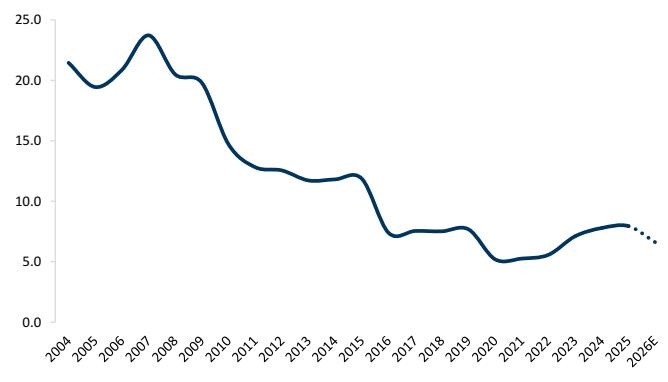

line chart

| Year  | Value |
|-------|-------|
| 2004  | 21.5  |
| 2005  | 19.5  |
| 2006  | 21.0  |
| 2007  | 23.5  |
| 2008  | 20.5  |
| 2009  | 19.5  |
| 2010  | 15.0  |
| 2011  | 13.0  |
| 2012  | 12.5  |
| 2013  | 12.0  |
| 2014  | 11.5  |
| 2015  | 12.0  |
| 2016  | 7.0   |
| 2017  | 7.5   |
| 2018  | 7.5   |
| 2019  | 7.5   |
| 2020  | 5.0   |
| 2021  | 5.5   |
| 2022  | 6.0   |
| 2023  | 7.0   |
| 2024  | 7.5   |
| 2025  | 8.0   |
| 2026E | 7.5   |

Source: Company data, Bloomberg, GS Global Investment Research

## Exhibit 169: Biotech Capex/Sales is seen below median levels in 2026

Biotech Capex/Sales

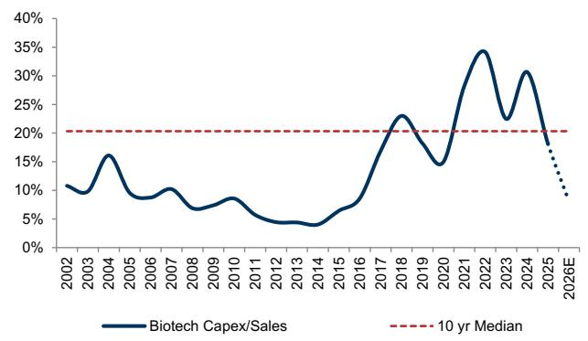

line chart

| Year | Biotech Capex/Sales |
|------|---------------------|
| 2002 | ~10%                |
| 2003 | ~12%                |
| 2004 | ~16%                |
| 2005 | ~10%                |
| 2006 | ~8%                 |
| 2007 | ~10%                |
| 2008 | ~7%                 |
| 2009 | ~8%                 |
| 2010 | ~9%                 |
| 2011 | ~7%                 |
| 2012 | ~5%                 |
| 2013 | ~4%                 |
| 2014 | ~4%                 |
| 2015 | ~5%                 |
| 2016 | ~8%                 |
| 2017 | ~15%                |
| 2018 | ~23%                |
| 2019 | ~15%                |
| 2020 | ~14%                |
| 2021 | ~35%                |
| 2022 | ~33%                |
| 2023 | ~23%                |
| 2024 | ~31%                |
| 2025 | ~18%                |
| 2026E| ~9%                 |

Source: Company data, Bloomberg, GS Global Investment Research

Exhibit 170: Biotech Capex/Depreciation is expected to be below median levels in 2026  
Biotech Capex/Depreciation  
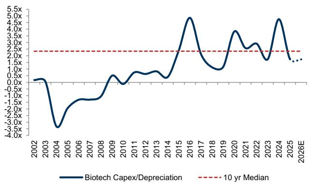

line chart

| Year | Biotech Capex/Depreciation |
|------|-----------------------------|
| 2002 | 0.0x                        |
| 2003 | -0.5x                       |
| 2004 | -3.5x                       |
| 2005 | -1.5x                       |
| 2006 | -1.0x                       |
| 2007 | -0.5x                       |
| 2008 | 0.5x                        |
| 2009 | 1.0x                        |
| 2010 | 0.5x                        |
| 2011 | 1.0x                        |
| 2012 | 1.5x                        |
| 2013 | 1.0x                        |
| 2014 | 0.5x                        |
| 2015 | 3.0x                        |
| 2016 | 5.0x                        |
| 2017 | 3.5x                        |
| 2018 | 2.5x                        |
| 2019 | 3.5x                        |
| 2020 | 4.0x                        |
| 2021 | 3.5x                        |
| 2022 | 3.0x                        |
| 2023 | 2.5x                        |
| 2024 | 4.5x                        |
| 2025 | 3.5x                        |
| 2026E| 2.0x                        |

Source: Company data, Bloomberg, GS Global Investment Research

Exhibit 171: We expect 2026 to end 90% below the historical peak (2004)  
GS Biotech Capex Tracker (indexed)  
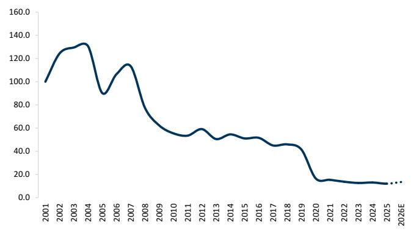

line chart

| Year  | Value |
|-------|-------|
| 2001  | 100.0 |
| 2002  | 125.0 |
| 2003  | 130.0 |
| 2004  | 135.0 |
| 2005  | 90.0  |
| 2006  | 115.0 |
| 2007  | 110.0 |
| 2008  | 75.0  |
| 2009  | 65.0  |
| 2010  | 55.0  |
| 2011  | 50.0  |
| 2012  | 55.0  |
| 2013  | 50.0  |
| 2014  | 55.0  |
| 2015  | 50.0  |
| 2016  | 45.0  |
| 2017  | 45.0  |
| 2018  | 45.0  |
| 2019  | 45.0  |
| 2020  | 15.0  |
| 2021  | 15.0  |
| 2022  | 15.0  |
| 2023  | 15.0  |
| 2024  | 15.0  |
| 2025E | 15.0  |
| 2026E | 15.0  |

Source: Company data, Bloomberg, GS Global Investment Research

## Appendix: Stock OSG vs Weighted Capex (>50% RSQ)

We analyze our coverage for how each company compares to our Capex Tracker. For this, we map the organic sales growth of each company against the Capex tracker weighted by the company's end market exposure. We show the companies which have an R-square of more than $50\%$ below.

Exhibit 172: ABB OSG vs Capex Tracker (R-Square: 63%)  
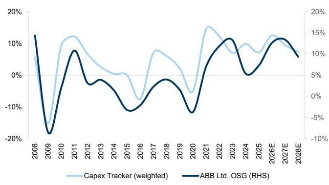

line chart

| Year   | Capex Tracker (weighted) | ABB Ltd. OSG (RHS) |
|--------|--------------------------|--------------------|
| 2008   | ~5%                      | ~13%               |
| 2009   | ~-15%                    | ~-20%              |
| 2010   | ~10%                     | ~5%                |
| 2011   | ~12%                     | ~8%                |
| 2012   | ~5%                      | ~-2%               |
| 2013   | ~0%                      | ~-5%               |
| 2014   | ~-2%                     | ~-8%               |
| 2015   | ~-5%                     | ~-10%              |
| 2016   | ~-8%                     | ~-12%              |
| 2017   | ~8%                      | ~-2%               |
| 2018   | ~5%                      | ~-5%               |
| 2019   | ~-5%                     | ~-8%               |
| 2020   | ~-10%                    | ~-12%              |
| 2021   | ~15%                     | ~5%                |
| 2022   | ~12%                     | ~10%               |
| 2023   | ~8%                      | ~5%                |
| 2024   | ~10%                     | ~-5%               |
| 2025E  | ~12%                     | ~10%               |
| 2026E  | ~10%                     | ~12%               |
| 2027E  | ~8%                      | ~10%               |
| 2028E  | ~5%                      | ~8%                |

Source: Company data, Bloomberg, GS Global Investment Research

Exhibit 173: Alfa Laval OSG vs Capex Tracker (R-Square: 53%)  
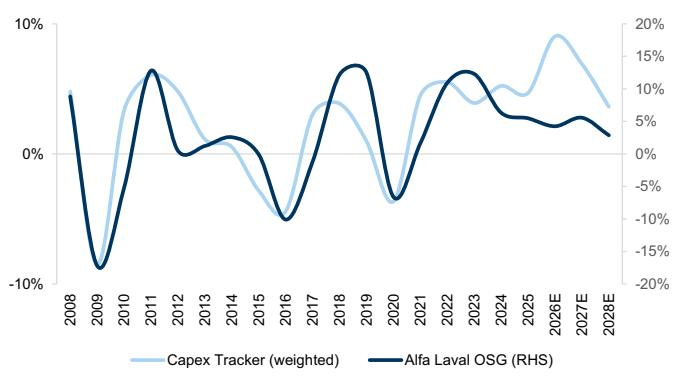

line chart

| Year   | Capex Tracker (weighted) | Alfa Laval OSG (RHS) |
|--------|--------------------------|----------------------|
| 2008   | ~5%                      | ~5%                  |
| 2009   | ~-10%                    | ~-10%                |
| 2010   | ~5%                      | ~5%                  |
| 2011   | ~10%                     | ~10%                 |
| 2012   | ~5%                      | ~5%                  |
| 2013   | ~0%                      | ~0%                  |
| 2014   | ~-5%                     | ~-5%                 |
| 2015   | ~-10%                    | ~-10%                |
| 2016   | ~-5%                     | ~-5%                 |
| 2017   | ~5%                      | ~5%                  |
| 2018   | ~10%                     | ~10%                 |
| 2019   | ~5%                      | ~5%                  |
| 2020   | ~-5%                     | ~-5%                 |
| 2021   | ~5%                      | ~5%                  |
| 2022   | ~10%                     | ~10%                 |
| 2023   | ~5%                      | ~5%                  |
| 2024   | ~10%                     | ~10%                 |
| 2025E  | ~15%                     | ~15%                 |
| 2026E  | ~10%                     | ~10%                 |
| 2027E  | ~5%                      | ~5%                  |
| 2028E  | ~0%                      | ~0%                  |

Source: Company data, Bloomberg, GS Global Investment Research

Exhibit 174: Atlas Copco OSG vs Capex Tracker (R-Square: 76%)  
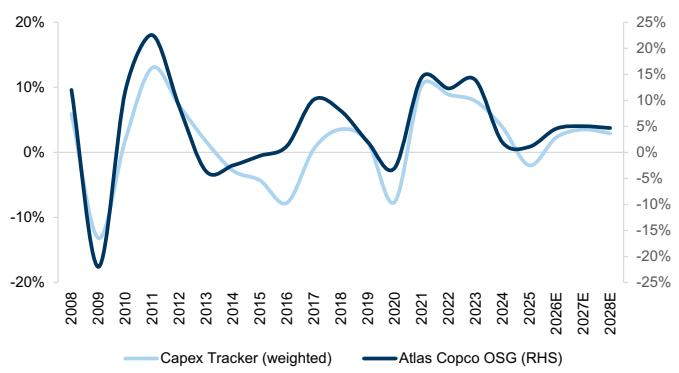

line chart

| Year   | Capex Tracker (weighted) | Atlas Copco OSG (RHS) |
|--------|--------------------------|------------------------|
| 2008   | ~10%                     | ~10%                   |
| 2009   | ~-15%                    | ~-20%                  |
| 2010   | ~15%                     | ~20%                   |
| 2011   | ~12%                     | ~18%                   |
| 2012   | ~5%                      | ~5%                    |
| 2013   | ~-5%                     | ~-5%                   |
| 2014   | ~-5%                     | ~-5%                   |
| 2015   | ~-5%                     | ~-5%                   |
| 2016   | ~-10%                    | ~0%                    |
| 2017   | ~5%                      | ~10%                   |
| 2018   | ~5%                      | ~5%                    |
| 2019   | ~-5%                     | ~-5%                   |
| 2020   | ~-10%                    | ~-5%                   |
| 2021   | ~10%                     | ~15%                   |
| 2022   | ~10%                     | ~15%                   |
| 2023   | ~5%                      | ~10%                   |
| 2024   | ~-5%                     | ~5%                    |
| 2025E  | ~-5%                     | ~5%                    |
| 2026E  | ~5%                      | ~5%                    |
| 2027E  | ~5%                      | ~5%                    |
| 2028E  | ~5%                      | ~5%                    |

Source: Company data, Bloomberg, GS Global Investment Research

Exhibit 175: IMI OSG vs Capex Tracker (R-Square: 65%)  
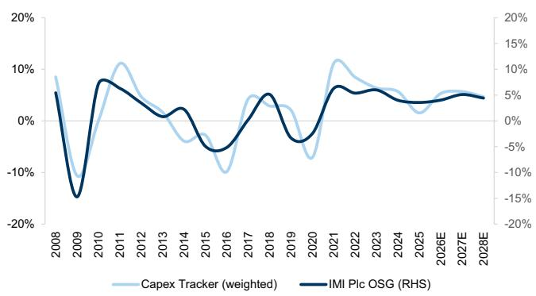

line chart

| Year   | Capex Tracker (weighted) | IMI Plc OSG (RHS) |
|--------|--------------------------|-------------------|
| 2008   | ~10%                     | ~5%               |
| 2009   | ~-15%                    | ~-15%             |
| 2010   | ~10%                     | ~5%               |
| 2011   | ~15%                     | ~5%               |
| 2012   | ~5%                      | ~5%               |
| 2013   | ~0%                      | ~0%               |
| 2014   | ~-5%                     | ~-5%              |
| 2015   | ~-10%                    | ~-10%             |
| 2016   | ~-5%                     | ~-5%              |
| 2017   | ~5%                      | ~5%               |
| 2018   | ~0%                      | ~0%               |
| 2019   | ~-5%                     | ~-5%              |
| 2020   | ~-10%                    | ~-10%             |
| 2021   | ~10%                     | ~5%               |
| 2022   | ~5%                      | ~5%               |
| 2023   | ~5%                      | ~5%               |
| 2024   | ~5%                      | ~5%               |
| 2025E  | ~5%                      | ~5%               |
| 2026E  | ~5%                      | ~5%               |
| 2027E  | ~5%                      | ~5%               |
| 2028E  | ~5%                      | ~5%               |

Source: Company data, Bloomberg, GS Global Investment Research

Exhibit 176: Schneider OSG vs Capex Tracker (R-Square: 60%)  
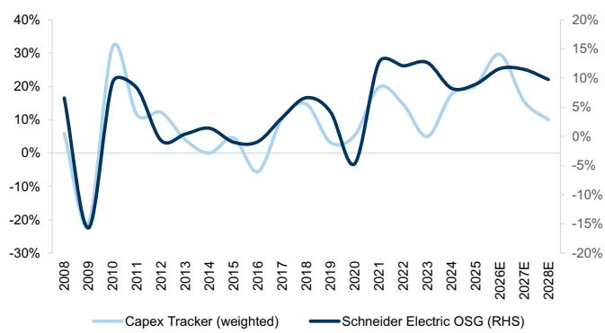

line chart

| Year   | Capex Tracker (weighted) | Schneider Electric OSG (RHS) |
|--------|--------------------------|------------------------------|
| 2008   | ~7%                      | ~18%                         |
| 2009   | ~-20%                    | ~-25%                        |
| 2010   | ~35%                     | ~25%                         |
| 2011   | ~15%                     | ~20%                         |
| 2012   | ~10%                     | ~5%                          |
| 2013   | ~5%                      | ~0%                          |
| 2014   | ~0%                      | ~5%                          |
| 2015   | ~5%                      | ~0%                          |
| 2016   | ~-5%                     | ~5%                          |
| 2017   | ~5%                      | ~10%                         |
| 2018   | ~15%                     | ~15%                         |
| 2019   | ~5%                      | ~10%                         |
| 2020   | ~-5%                     | ~-5%                         |
| 2021   | ~20%                     | ~30%                         |
| 2022   | ~15%                     | ~35%                         |
| 2023   | ~5%                      | ~30%                         |
| 2024   | ~15%                     | ~25%                         |
| 2025E  | ~30%                     | ~30%                         |
| 2026E  | ~25%                     | ~35%                         |
| 2027E  | ~15%                     | ~30%                         |
| 2028E  | ~10%                     | ~25%                         |

Source: Company data, Bloomberg, GS Global Investment Research

Exhibit 177: SKF OSG vs Capex Tracker (R-Square: 60%)  
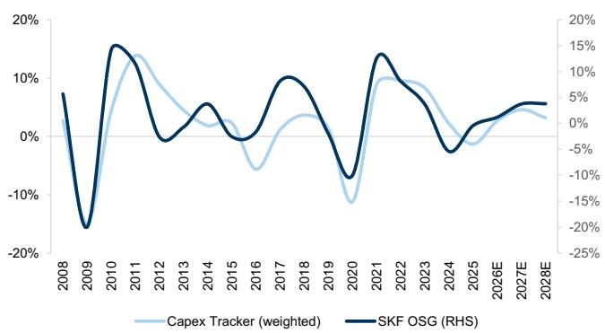

line chart

| Year   | Capex Tracker (weighted) | SKF OSG (RHS) |
|--------|--------------------------|---------------|
| 2008   | ~3%                      | ~7%           |
| 2009   | ~-15%                    | ~-18%         |
| 2010   | ~12%                     | ~16%          |
| 2011   | ~14%                     | ~14%          |
| 2012   | ~10%                     | ~-2%          |
| 2013   | ~5%                      | ~-1%          |
| 2014   | ~3%                      | ~5%           |
| 2015   | ~-5%                     | ~-2%          |
| 2016   | ~-10%                    | ~-5%          |
| 2017   | ~3%                      | ~10%          |
| 2018   | ~5%                      | ~10%          |
| 2019   | ~-5%                     | ~-5%          |
| 2020   | ~-15%                    | ~-10%         |
| 2021   | ~10%                     | ~14%          |
| 2022   | ~8%                      | ~10%          |
| 2023   | ~5%                      | ~5%           |
| 2024   | ~-5%                     | ~-5%          |
| 2025E  | ~-2%                     | ~-2%          |
| 2026E  | ~3%                      | ~3%           |
| 2027E  | ~5%                      | ~5%           |
| 2028E  | ~3%                      | ~5%           |

Source: Company data, Bloomberg, GS Global Investment Research

## Disclosure Appendix

## Reg AC

We, Daniela Costa, Christian Hinderaker, CFA, Ope Otaniyi, Susmita Saha, Aditya Agarwal, Meihan Yang, Hollie Cooper, Aayush Kandpal and Ines Lefranc, hereby certify that all of the views expressed in this report accurately reflect our personal views about the subject company or companies and its or their securities. We also certify that no part of our compensation was, is or will be, directly or indirectly, related to the specific recommendations or views expressed in this report.

Unless otherwise stated, the individuals listed on the cover page of this report are analysts in GS' Global Investment Research division.

Contributing Authors: Daniela Costa GS International, Christian Hinderaker, CFA GS International, Ope Otaniyi GS International, Susmita Saha GS India SPL, Aditya Agarwal GS India SPL, Meihan Yang GS International, Hollie Cooper GS International, Aayush Kandpal GS India SPL, Ines Lefranc GS International.

Unless otherwise stated, the individuals listed in the Contributing Authors disclosure of this report are analysts in GS' Global Investment Research division.

## GS Factor Profile

The GS Factor Profile provides investment context for a stock by comparing key attributes to the market (i.e. our universe of rated stocks) and its sector peers. The four key attributes depicted are: Growth, Financial Returns, Multiple (e.g. valuation) and Integrated (a composite of Growth, Financial Returns and Multiple). Growth, Financial Returns and Multiple are calculated by using normalized ranks for specific metrics for each stock. The normalized ranks for the metrics are then averaged and converted into percentiles for the relevant attribute. The precise calculation of each metric may vary depending on the fiscal year, industry and region, but the standard approach is as follows:

Growth is based on a stock's forward-looking sales growth, EBITDA growth and EPS growth (for financial stocks, only EPS and sales growth), with a higher percentile indicating a higher growth company. Financial Returns is based on a stock's forward-looking ROE, ROCE and CROCI (for financial stocks, only ROE), with a higher percentile indicating a company with higher financial returns. Multiple is based on a stock's forward-looking P/E, P/B, price/dividend (P/D), EV/EBITDA, EV/FCF and EV/Debt Adjusted Cash Flow (DACF) (for financial stocks, only P/E, P/B and P/D), with a higher percentile indicating a stock trading at a higher multiple. The Integrated percentile is calculated as the average of the Growth percentile, Financial Returns percentile and (100% - Multiple percentile).

Financial Returns and Multiple use the GS analyst forecasts at the fiscal year-end at least three quarters in the future. Growth uses inputs for the fiscal year at least seven quarters in the future compared with the year at least three quarters in the future (on a per-share basis for all metrics).

For a more detailed description of how we calculate the GS Factor Profile, please contact your GS representative.

## M&A Rank

Across our global coverage, we examine stocks using an M&A framework, considering both qualitative factors and quantitative factors (which may vary across sectors and regions) to incorporate the potential that certain companies could be acquired. We then assign a M&A rank as a means of scoring companies under our rated coverage from 1 to 3, with 1 representing high (30%-50%) probability of the company becoming an acquisition target, 2 representing medium (15%-30%) probability and 3 representing low (0%-15%) probability. For companies ranked 1 or 2, in line with our standard departmental guidelines we incorporate an M&A component into our target price. M&A rank of 3 is considered immaterial and therefore does not factor into our price target, and may or may not be discussed in research.

## Quantum

Quantum is GS' proprietary database providing access to detailed financial statement histories, forecasts and ratios. It can be used for in-depth analysis of a single company, or to make comparisons between companies in different sectors and markets.

## Disclosures

## Other disclosures

## Clarkson Research Services Limited (CRSL)

Clarkson Research Services Limited (CRSL) have not reviewed the context of any of the statistics or information contained in the commentaries and all statistics and information were obtained by GS & Co. from standard CRSL published sources. Furthermore, CRSL have not carried out any form of due diligence exercise on the information, as would be the case with finance raising documentation such as Initial Public Offerings (IPOs) or Bond Placements. Therefore reliance on the statistics and information contained within the commentaries will be for the risk of the party relying on the information and CRSL does not accept any liability whatsoever for relying on the statistics or information. Insofar as the statistical and graphical market information comes from CRSL, CRSL points out that such information is drawn from the CRSL database and other sources. CRSL has advised that: (i) some information in CRSL's database is derived from estimates or subjective judgments; and (ii) the information in the database of other maritime data collection agencies may differ from the information in CRSL's database; and (iii) whilst CRSL has taken reasonable care in the compilation of that statistical and graphical information and believes it to be accurate and correct, data compilation is subject to limited audit and validation procedures and may accordingly contain errors; and (iv) CRSL, its agents, officers and employees do not accept liability for any loss suffered in consequence of reliance on such information or in any other manner; and (v) the provision of such information does not obviate any need to make appropriate further enquiries; and (vi) the provision of such information is not an endorsement of any commercial policies and/or any conclusions by CRSL; and (vii) shipping is a variable and cyclical business and any forecasting concerning it cannot be very accurate.

## Rating and pricing information

Nexans (Buy, €146.60), Prysmian (Buy, €142.95), Schneider Electric (Buy, €264.30) and VAT Group (Buy, SFr654.20)

The rating(s) for ABB Ltd., Accelleron Industries Ltd., Alfa Laval, Alstom, Ariston Holding, Assa Abloy B, Atlas Copco, CNH Industrial, Carel Industries SpA, Daimler Truck Holding, Epiroc, FLSmidth & Co., GVS, Geberit Holding, IMI Plc, Konecranes, Legrand, Metso, NIBE Industrier AB, NKT A/S, Nexans, Prysmian, Rexel S.A., SKF, Sandvik, Schindler Holding, Schneider Electric, Siemens AG, Signify NV, Traton, VAT Group, Volvo Group, Wartsila and Weir Group is/are relative to the other companies in its/their coverage universe: ABB Ltd., Accelleron Industries Ltd., Addtech AB, Alfa Laval, Alstom, Ariston Holding, Assa Abloy B, Atlas Copco, CNH Industrial, Carel Industries SpA, Daimler Truck Holding, Electrolux AB, Epiroc, FLSmidth & Co., GVS, Geberit Holding, Halma Plc, IMI Plc, Indutrade AB, Knorr Bremse, Konecranes, Legrand, Lifco AB, Metso, NIBE Industrier AB, NKT A/S, Nexans, Prysmian, Rational AG, Rexel S.A., SEB SA, SKF, Sandvik, Schindler Holding, Schneider Electric, Siemens AG, Signify NV, Traton, Trelleborg AB, VAT Group, Volvo Group, Wartsila, Weir Group

## Company-specific regulatory disclosures

Compendium report: please see disclosures at https://www.gs.com/research/hedge.html. Disclosures applicable to the companies included in this compendium can be found in the latest relevant published research

## Distribution of ratings/investment banking relationships

GS Investment Research global Equity coverage universe

<table><tr><td rowspan="2"></td><td colspan="3">Rating Distribution</td><td colspan="3">Investment Banking Relationships</td></tr><tr><td>Buy</td><td>Hold</td><td>Sell</td><td>Buy</td><td>Hold</td><td>Sell</td></tr><tr><td>Global</td><td>50%</td><td>34%</td><td>16%</td><td>65%</td><td>60%</td><td>45%</td></tr></table>

As of April 1, 2026, GS Global Investment Research had investment ratings on 3,074 equity securities. GS assigns stocks as Buys and Sells on various regional Investment Lists; stocks not so assigned are deemed Neutral. Such assignments equate to Buy, Hold and Sell for the purposes of the above disclosure required by the FINRA Rules. See ‘Ratings, Coverage universe and related definitions’ below. The Investment Banking Relationships chart reflects the percentage of subject companies within each rating category for whom GS has provided investment banking services within the previous twelve months.

## Price target and rating history chart(s)

Compendium report: please see disclosures at https://www.gs.com/research/hedge.html. Disclosures applicable to the companies included in this compendium can be found in the latest relevant published research

Target price history table(s)

<table><tr><td colspan="3">GVS (GVS.MI)</td><td colspan="3">VAT Group (VACN.S)</td></tr><tr><td>Date of report</td><td>Target price (€)</td><td>Closing price (€)</td><td>Date of report</td><td>Target price (SFr)</td><td>Closing price (SFr)</td></tr><tr><td>20-Apr-26</td><td>4.70</td><td>4.20</td><td>29-Apr-26</td><td>703.00</td><td>579.20</td></tr><tr><td>21-Jan-26</td><td>5.30</td><td>4.07</td><td>14-Apr-26</td><td>551.00</td><td>551.80</td></tr><tr><td>22-Sep-25</td><td>5.60</td><td>4.71</td><td>17-Mar-26</td><td>505.00</td><td>514.80</td></tr><tr><td>30-Apr-25</td><td>6.10</td><td>4.28</td><td>20-Jan-26</td><td>468.00</td><td>505.00</td></tr><tr><td>11-Oct-24</td><td>7.00</td><td>6.64</td><td>14-Jan-26</td><td>411.00</td><td>434.60</td></tr><tr><td>10-Jun-24</td><td>6.50</td><td>7.29</td><td>15-Dec-25</td><td>376.00</td><td>392.50</td></tr><tr><td>17-Jan-24</td><td>5.00</td><td>5.53</td><td>20-Oct-25</td><td>371.00</td><td>338.20</td></tr><tr><td>12-Sep-23</td><td>4.90</td><td>5.29</td><td>08-Oct-25</td><td>392.00</td><td>360.40</td></tr><tr><td>28-Jun-23</td><td>4.70</td><td>5.56</td><td>01-Sep-25</td><td>308.00</td><td>268.60</td></tr><tr><td></td><td></td><td></td><td>27-Jun-25</td><td>301.00</td><td>341.20</td></tr><tr><td></td><td></td><td></td><td>02-May-25</td><td>284.00</td><td>299.50</td></tr><tr><td></td><td></td><td></td><td>08-Apr-25</td><td>309.00</td><td>269.60</td></tr><tr><td></td><td></td><td></td><td>01-Apr-25</td><td>306.00</td><td>316.40</td></tr><tr><td></td><td></td><td></td><td>16-Jan-25</td><td>335.00</td><td>341.60</td></tr><tr><td></td><td></td><td></td><td>18-Dec-24</td><td>363.00</td><td>357.90</td></tr></table>

Geberit Holding (GEBN.S)

<table><tr><td>Date of report</td><td>Target price (SFr)</td><td>Closing price (SFr)</td><td>Date of report</td><td>Target price ($)</td><td>Closing price ($)</td></tr><tr><td>12-May-26</td><td>561.00</td><td>510.80</td><td>05-Jun-26</td><td>11.50</td><td>10.75</td></tr><tr><td>06-Apr-26</td><td>619.00</td><td>530.20</td><td>11-May-26</td><td>10.50</td><td>10.97</td></tr><tr><td>20-Jan-26</td><td>657.00</td><td>601.60</td><td>12-Mar-26</td><td>12.00</td><td>10.75</td></tr><tr><td>12-Nov-25</td><td>661.00</td><td>646.20</td><td>14-Jan-26</td><td>13.00</td><td>10.83</td></tr><tr><td>09-Jul-25</td><td>641.00</td><td>613.60</td><td>12-Sep-25</td><td>10.50</td><td>10.97</td></tr><tr><td>29-May-25</td><td>661.00</td><td>608.20</td><td>15-Jul-25</td><td>11.50</td><td>13.12</td></tr><tr><td>08-Apr-25</td><td>615.00</td><td>523.60</td><td>29-May-25</td><td>12.50</td><td>12.65</td></tr><tr><td>17-Mar-25</td><td>597.00</td><td>580.20</td><td>08-Apr-25</td><td>13.50</td><td>10.32</td></tr><tr><td>22-Jan-25</td><td>614.00</td><td>500.80</td><td>18-Feb-25</td><td>13.00</td><td>13.30</td></tr><tr><td>07-Jan-25</td><td>632.00</td><td>513.60</td><td>27-Nov-24</td><td>12.50</td><td>12.54</td></tr><tr><td>06-Nov-24</td><td>609.00</td><td>514.60</td><td>08-Oct-24</td><td>13.00</td><td>10.98</td></tr><tr><td>17-Oct-24</td><td>598.00</td><td>524.60</td><td>19-Sep-24</td><td>15.00</td><td>10.95</td></tr><tr><td>08-Oct-24</td><td>580.00</td><td>530.80</td><td>04-Jul-24</td><td>15.60</td><td>9.92</td></tr><tr><td>02-Sep-24</td><td>571.00</td><td>543.60</td><td>04-Jun-24</td><td>16.60</td><td>10.25</td></tr><tr><td>21-May-24</td><td>579.00</td><td>558.20</td><td>13-Mar-24</td><td>17.50</td><td>12.28</td></tr><tr><td>22-Mar-24</td><td>509.00</td><td>535.40</td><td>17-Jan-24</td><td>19.00</td><td>11.42</td></tr><tr><td>23-Jan-24</td><td>522.00</td><td>495.30</td><td>01-Dec-23</td><td>17.57</td><td>11.18</td></tr><tr><td>03-Jan-24</td><td>548.00</td><td>517.40</td><td>11-Oct-23</td><td>15.90</td><td>12.15</td></tr><tr><td>20-Nov-23</td><td>497.00</td><td>477.80</td><td>04-Sep-23</td><td>16.95</td><td>13.83</td></tr><tr><td>24-Aug-23</td><td>493.00</td><td>444.80</td><td>05-Jul-23</td><td>16.78</td><td>14.34</td></tr><tr><td>19-Jul-23</td><td>548.00</td><td>474.10</td><td></td><td></td><td></td></tr></table>

CNH Industrial (CNH)

Schneider Electric (SCHN.PA)

<table><tr><td>Date of report</td><td>Target price (€)</td><td>Closing price (€)</td></tr><tr><td>07-May-26</td><td>316.00</td><td>275.20</td></tr><tr><td>01-Apr-26</td><td>302.00</td><td>239.95</td></tr><tr><td>09-Mar-26</td><td>322.00</td><td>245.15</td></tr><tr><td>11-Jan-26</td><td>294.00</td><td>235.45</td></tr><tr><td>31-Oct-25</td><td>278.00</td><td>246.10</td></tr><tr><td>08-Oct-25</td><td>250.00</td><td>248.80</td></tr><tr><td>01-Jul-25</td><td>249.00</td><td>222.35</td></tr><tr><td>02-May-25</td><td>237.00</td><td>215.80</td></tr><tr><td>08-Apr-25</td><td>269.00</td><td>192.34</td></tr><tr><td>13-Mar-25</td><td>280.00</td><td>225.10</td></tr><tr><td>07-Jan-25</td><td>214.00</td><td>253.05</td></tr><tr><td>19-Nov-24</td><td>190.00</td><td>239.00</td></tr><tr><td>26-Aug-24</td><td>184.00</td><td>226.00</td></tr><tr><td>12-May-24</td><td>176.00</td><td>234.00</td></tr><tr><td>03-Apr-24</td><td>167.00</td><td>206.20</td></tr><tr><td>13-Mar-24</td><td>165.00</td><td>213.70</td></tr><tr><td>17-Jan-24</td><td>155.00</td><td>175.32</td></tr><tr><td>13-Nov-23</td><td>151.00</td><td>160.74</td></tr><tr><td>11-Oct-23</td><td>146.00</td><td>157.26</td></tr><tr><td>21-Aug-23</td><td>151.00</td><td>154.86</td></tr></table>

Metso (METSO.HE)

<table><tr><td>Date of report</td><td>Target price (€)</td><td>Closing price (€)</td></tr><tr><td>23-Apr-26</td><td>18.60</td><td>15.27</td></tr><tr><td>13-Apr-26</td><td>18.20</td><td>16.37</td></tr><tr><td>20-Feb-26</td><td>18.10</td><td>16.91</td></tr><tr><td>16-Jan-26</td><td>17.60</td><td>16.38</td></tr><tr><td>03-Nov-25</td><td>15.10</td><td>14.08</td></tr><tr><td>09-Jul-25</td><td>12.40</td><td>11.42</td></tr><tr><td>28-Apr-25</td><td>11.80</td><td>9.33</td></tr><tr><td>18-Feb-25</td><td>12.50</td><td>11.19</td></tr><tr><td>10-Jan-25</td><td>8.90</td><td>8.75</td></tr><tr><td>28-Oct-24</td><td>8.80</td><td>8.92</td></tr><tr><td>17-Sep-24</td><td>9.00</td><td>8.73</td></tr><tr><td>25-Jul-24</td><td>9.40</td><td>9.02</td></tr><tr><td>05-Jul-24</td><td>9.80</td><td>10.00</td></tr><tr><td>20-Feb-24</td><td>9.40</td><td>10.05</td></tr><tr><td>17-Jan-24</td><td>8.80</td><td>9.06</td></tr><tr><td>02-Aug-23</td><td>10.00</td><td>10.17</td></tr></table>

IMI Plc (IMI.L)

<table><tr><td>Date of report</td><td>Target price (£)</td><td>Closing price (£)</td></tr><tr><td>21-Jan-26</td><td>2,560</td><td>2,672</td></tr><tr><td>01-Dec-25</td><td>2,330</td><td>2,450</td></tr><tr><td>27-May-25</td><td>2,120</td><td>1,948</td></tr><tr><td>16-Jan-25</td><td>2,220</td><td>1,877</td></tr><tr><td>21-May-24</td><td>2,150</td><td>1,900</td></tr><tr><td>17-Jan-24</td><td>2,020</td><td>1,608</td></tr><tr><td>20-Jul-23</td><td>1,780</td><td>1,625</td></tr></table>

Volvo Group (VOLVb.ST)

<table><tr><td>Date of report</td><td>Target price (Skr)</td><td>Closing price (Skr)</td></tr><tr><td>26-May-26</td><td>395.00</td><td>320.60</td></tr><tr><td>29-Apr-26</td><td>396.00</td><td>318.20</td></tr><tr><td>14-Apr-26</td><td>364.00</td><td>322.80</td></tr><tr><td>25-Mar-26</td><td>363.00</td><td>303.80</td></tr><tr><td>10-Feb-26</td><td>374.00</td><td>343.40</td></tr><tr><td>07-Jan-26</td><td>333.00</td><td>305.00</td></tr><tr><td>24-Oct-25</td><td>267.00</td><td>260.50</td></tr><tr><td>08-Sep-25</td><td>298.00</td><td>274.10</td></tr><tr><td>25-Jun-25</td><td>297.00</td><td>258.40</td></tr><tr><td>05-Jun-25</td><td>307.00</td><td>263.10</td></tr><tr><td>29-May-25</td><td>306.00</td><td>267.20</td></tr><tr><td>16-Apr-25</td><td>350.00</td><td>253.10</td></tr><tr><td>08-Apr-25</td><td>364.00</td><td>236.80</td></tr><tr><td>25-Mar-25</td><td>378.00</td><td>310.50</td></tr><tr><td>21-Feb-25</td><td>391.00</td><td>328.10</td></tr><tr><td>22-Jan-25</td><td>352.00</td><td>287.70</td></tr><tr><td>07-Jan-25</td><td>340.00</td><td>285.10</td></tr><tr><td>06-Nov-24</td><td>318.00</td><td>278.40</td></tr><tr><td>08-Oct-24</td><td>338.00</td><td>270.70</td></tr><tr><td>26-Aug-24</td><td>336.00</td><td>268.50</td></tr><tr><td>04-Jul-24</td><td>382.00</td><td>268.60</td></tr><tr><td>15-May-24</td><td>383.00</td><td>286.90</td></tr><tr><td>03-Apr-24</td><td>360.00</td><td>287.60</td></tr><tr><td>08-Feb-24</td><td>359.00</td><td>260.90</td></tr><tr><td>17-Jan-24</td><td>341.00</td><td>246.65</td></tr><tr><td>02-Nov-23</td><td>315.00</td><td>221.85</td></tr><tr><td>07-Aug-23</td><td>295.00</td><td>230.25</td></tr></table>

Ariston Holding (ARIS.MI)

<table><tr><td>Date of report</td><td>Target price (€)</td><td>Closing price (€)</td></tr><tr><td>06-Mar-26</td><td>4.70</td><td>4.05</td></tr><tr><td>21-Jan-26</td><td>5.30</td><td>4.50</td></tr><tr><td>12-May-25</td><td>5.20</td><td>4.67</td></tr><tr><td>25-Oct-24</td><td>4.40</td><td>4.03</td></tr><tr><td>09-May-24</td><td>6.00</td><td>5.07</td></tr></table>

Sandvik (SAND.ST)

<table><tr><td>Date of report</td><td>Target price (Skr)</td><td>Closing price (Skr)</td></tr><tr><td>01-May-26</td><td>330.00</td><td>383.10</td></tr><tr><td>08-Apr-26</td><td>325.00</td><td>393.30</td></tr><tr><td>14-Jan-26</td><td>290.00</td><td>323.70</td></tr><tr><td>24-Oct-25</td><td>264.00</td><td>287.50</td></tr><tr><td>08-Oct-25</td><td>235.00</td><td>271.40</td></tr></table>

Ariston Holding (ARIS.MI)

<table><tr><td>Date of report</td><td>Target price (€)</td><td>Closing price (€)</td></tr><tr><td>23-Apr-24</td><td>6.60</td><td>4.74</td></tr><tr><td>17-Jan-24</td><td>8.00</td><td>6.06</td></tr><tr><td>20-Nov-23</td><td>7.80</td><td>5.86</td></tr><tr><td>30-Oct-23</td><td>8.10</td><td>5.24</td></tr><tr><td>08-Aug-23</td><td>9.50</td><td>7.65</td></tr><tr><td>05-Jul-23</td><td>11.90</td><td>9.56</td></tr></table>

Sandvik (SAND.ST)

<table><tr><td>Date of report</td><td>Target price (Skr)</td><td>Closing price (Skr)</td></tr><tr><td>18-Jul-25</td><td>210.00</td><td>237.20</td></tr><tr><td>02-Jul-25</td><td>188.00</td><td>223.00</td></tr><tr><td>02-May-25</td><td>166.00</td><td>204.40</td></tr><tr><td>08-Apr-25</td><td>177.00</td><td>177.95</td></tr><tr><td>07-Feb-25</td><td>198.00</td><td>228.20</td></tr><tr><td>07-Jan-25</td><td>179.00</td><td>204.50</td></tr><tr><td>06-Nov-24</td><td>174.00</td><td>210.00</td></tr><tr><td>08-Oct-24</td><td>175.00</td><td>218.80</td></tr><tr><td>09-Sep-24</td><td>178.00</td><td>201.60</td></tr><tr><td>03-Jun-24</td><td>152.00</td><td>225.40</td></tr><tr><td>03-Apr-24</td><td>153.00</td><td>237.30</td></tr><tr><td>17-Jan-24</td><td>157.00</td><td>205.90</td></tr><tr><td>26-Oct-23</td><td>156.00</td><td>188.60</td></tr><tr><td>07-Aug-23</td><td>166.00</td><td>207.30</td></tr></table>

Accelleron Industries Ltd. (ACLN.S)

<table><tr><td>Date of report</td><td>Target price (SFr)</td><td>Closing price (SFr)</td></tr><tr><td>19-Mar-26</td><td>77.00</td><td>75.90</td></tr><tr><td>14-Jan-26</td><td>67.00</td><td>63.00</td></tr><tr><td>08-Oct-25</td><td>59.00</td><td>64.65</td></tr><tr><td>16-Jul-25</td><td>52.00</td><td>64.65</td></tr><tr><td>09-Jul-25</td><td>41.00</td><td>56.15</td></tr><tr><td>29-May-25</td><td>39.40</td><td>48.32</td></tr><tr><td>08-Apr-25</td><td>42.40</td><td>37.60</td></tr><tr><td>25-Mar-25</td><td>44.90</td><td>44.22</td></tr><tr><td>07-Jan-25</td><td>44.60</td><td>45.40</td></tr><tr><td>08-Oct-24</td><td>42.00</td><td>45.18</td></tr><tr><td>04-Sep-24</td><td>41.50</td><td>42.80</td></tr><tr><td>04-Jul-24</td><td>36.40</td><td>36.32</td></tr><tr><td>10-Apr-24</td><td>33.10</td><td>34.98</td></tr><tr><td>17-Jan-24</td><td>29.10</td><td>26.84</td></tr><tr><td>12-Sep-23</td><td>27.80</td><td>23.96</td></tr><tr><td>22-Jun-23</td><td>24.70</td><td>21.54</td></tr></table>

NIBE Industrier AB (NIBEb.ST)

<table><tr><td>Date of report</td><td>Target price (Skr)</td><td>Closing price (Skr)</td></tr><tr><td>19-May-26</td><td>34.00</td><td>39.98</td></tr><tr><td>16-Mar-26</td><td>32.50</td><td>33.98</td></tr><tr><td>21-Jan-26</td><td>33.00</td><td>35.40</td></tr><tr><td>17-Nov-25</td><td>32.50</td><td>32.86</td></tr><tr><td>07-Oct-25</td><td>33.40</td><td>36.38</td></tr><tr><td>05-Mar-25</td><td>32.40</td><td>41.24</td></tr><tr><td>03-Feb-25</td><td>32.00</td><td>43.50</td></tr><tr><td>25-Oct-24</td><td>35.00</td><td>51.78</td></tr><tr><td>30-Jul-24</td><td>36.00</td><td>46.97</td></tr><tr><td>17-May-24</td><td>38.00</td><td>53.96</td></tr><tr><td>16-Apr-24</td><td>43.00</td><td>49.54</td></tr></table>

Assa Abloy B (ASSAb.ST)

<table><tr><td>Date of report</td><td>Target price (Skr)</td><td>Closing price (Skr)</td></tr><tr><td>11-May-26</td><td>377.00</td><td>345.40</td></tr><tr><td>14-Apr-26</td><td>375.00</td><td>368.40</td></tr><tr><td>09-Feb-26</td><td>390.00</td><td>392.20</td></tr><tr><td>14-Jan-26</td><td>365.00</td><td>358.90</td></tr><tr><td>24-Oct-25</td><td>356.00</td><td>361.70</td></tr><tr><td>08-Oct-25</td><td>324.00</td><td>332.80</td></tr><tr><td>21-Jul-25</td><td>326.00</td><td>318.90</td></tr><tr><td>19-Jun-25</td><td>292.00</td><td>294.20</td></tr><tr><td>02-May-25</td><td>300.00</td><td>299.40</td></tr><tr><td>08-Apr-25</td><td>336.00</td><td>268.10</td></tr><tr><td>18-Feb-25</td><td>354.00</td><td>333.90</td></tr><tr><td>07-Jan-25</td><td>369.00</td><td>324.90</td></tr><tr><td>06-Nov-24</td><td>352.00</td><td>333.60</td></tr><tr><td>08-Oct-24</td><td>341.00</td><td>334.70</td></tr><tr><td>29-Jul-24</td><td>325.00</td><td>318.40</td></tr><tr><td>04-Jul-24</td><td>322.00</td><td>299.00</td></tr><tr><td>15-May-24</td><td>323.00</td><td>316.60</td></tr><tr><td>03-Apr-24</td><td>310.00</td><td>306.40</td></tr><tr><td>04-Mar-24</td><td>301.00</td><td>295.00</td></tr><tr><td>17-Jan-24</td><td>321.00</td><td>280.40</td></tr><tr><td>15-Nov-23</td><td>303.00</td><td>259.80</td></tr><tr><td>07-Aug-23</td><td>280.00</td><td>246.60</td></tr></table>

Schindler Holding (SCHP.S)

<table><tr><td>Date of report</td><td>Target price (SFr)</td><td>Closing price (SFr)</td></tr><tr><td>28-Apr-26</td><td>281.00</td><td>273.20</td></tr><tr><td>10-Apr-26</td><td>272.00</td><td>271.20</td></tr><tr><td>14-Jan-26</td><td>265.00</td><td>306.00</td></tr><tr><td>06-Nov-25</td><td>264.00</td><td>284.60</td></tr><tr><td>04-Sep-25</td><td>248.00</td><td>299.80</td></tr><tr><td>09-Jul-25</td><td>233.00</td><td>291.60</td></tr><tr><td>22-May-25</td><td>234.00</td><td>299.00</td></tr><tr><td>08-Apr-25</td><td>248.00</td><td>262.80</td></tr><tr><td>11-Mar-25</td><td>245.00</td><td>282.60</td></tr><tr><td>07-Jan-25</td><td>232.00</td><td>249.60</td></tr><tr><td>01-Nov-24</td><td>229.00</td><td>253.60</td></tr><tr><td>08-Oct-24</td><td>208.00</td><td>246.20</td></tr><tr><td>27-Aug-24</td><td>210.00</td><td>229.40</td></tr><tr><td>03-Jul-24</td><td>206.00</td><td>227.00</td></tr><tr><td>03-Apr-24</td><td>208.00</td><td>227.00</td></tr><tr><td>01-Mar-24</td><td>206.00</td><td>233.30</td></tr><tr><td>17-Jan-24</td><td>199.00</td><td>204.10</td></tr><tr><td>09-Nov-23</td><td>215.00</td><td>192.15</td></tr><tr><td>11-Oct-23</td><td>219.00</td><td>186.20</td></tr><tr><td>25-Aug-23</td><td>232.00</td><td>193.70</td></tr><tr><td>10-Jul-23</td><td>224.00</td><td>198.30</td></tr></table>

ABB Ltd. (ABBN.S)

<table><tr><td>Date of report</td><td>Target price (SFr)</td><td>Closing price (SFr)</td></tr><tr><td>29-Apr-26</td><td>72.00</td><td>76.68</td></tr><tr><td>09-Mar-26</td><td>63.00</td><td>65.28</td></tr><tr><td>11-Jan-26</td><td>61.00</td><td>60.16</td></tr><tr><td>06-Nov-25</td><td>58.00</td><td>56.58</td></tr><tr><td>08-Oct-25</td><td>56.00</td><td>58.94</td></tr><tr><td>06-Aug-25</td><td>54.00</td><td>52.48</td></tr><tr><td>01-Jul-25</td><td>49.00</td><td>46.69</td></tr><tr><td>02-May-25</td><td>48.00</td><td>45.19</td></tr><tr><td>10-Feb-25</td><td>56.00</td><td>50.08</td></tr><tr><td>07-Jan-25</td><td>53.00</td><td>49.48</td></tr><tr><td>04-Oct-24</td><td>52.00</td><td>49.15</td></tr><tr><td>29-Jul-24</td><td>53.00</td><td>47.77</td></tr><tr><td>04-Jul-24</td><td>48.00</td><td>50.52</td></tr><tr><td>30-Apr-24</td><td>49.00</td><td>44.89</td></tr><tr><td>17-Jan-24</td><td>44.00</td><td>36.10</td></tr><tr><td>06-Nov-23</td><td>45.00</td><td>31.09</td></tr><tr><td>11-Oct-23</td><td>48.00</td><td>33.38</td></tr><tr><td>21-Aug-23</td><td>50.00</td><td>32.45</td></tr></table>

Legrand (LEGD.PA)

<table><tr><td>Date of report</td><td>Target price (€)</td><td>Closing price (€)</td></tr><tr><td>12-May-26</td><td>156.00</td><td>152.15</td></tr><tr><td>01-Apr-26</td><td>138.00</td><td>138.35</td></tr><tr><td>25-Feb-26</td><td>144.00</td><td>154.80</td></tr><tr><td>11-Jan-26</td><td>126.00</td><td>126.50</td></tr><tr><td>17-Nov-25</td><td>146.00</td><td>130.00</td></tr><tr><td>08-Oct-25</td><td>148.00</td><td>146.95</td></tr><tr><td>18-Aug-25</td><td>137.00</td><td>133.50</td></tr><tr><td>01-Jul-25</td><td>120.00</td><td>111.05</td></tr><tr><td>29-May-25</td><td>112.00</td><td>107.25</td></tr><tr><td>08-Apr-25</td><td>121.00</td><td>90.22</td></tr><tr><td>19-Feb-25</td><td>122.00</td><td>109.60</td></tr><tr><td>19-Nov-24</td><td>108.00</td><td>96.04</td></tr><tr><td>08-Oct-24</td><td>113.00</td><td>101.85</td></tr><tr><td>03-Aug-24</td><td>112.00</td><td>93.90</td></tr><tr><td>12-May-24</td><td>110.00</td><td>103.35</td></tr><tr><td>22-Apr-24</td><td>112.00</td><td>94.98</td></tr><tr><td>03-Apr-24</td><td>101.00</td><td>96.28</td></tr><tr><td>23-Feb-24</td><td>103.00</td><td>90.18</td></tr><tr><td>17-Jan-24</td><td>98.00</td><td>89.28</td></tr><tr><td>15-Nov-23</td><td>95.00</td><td>86.54</td></tr><tr><td>10-Jul-23</td><td>97.00</td><td>88.40</td></tr></table>

Siemens AG (SIEGn.DE)

<table><tr><td>Date of report</td><td>Target price (€)</td><td>Closing price (€)</td></tr><tr><td>15-May-26</td><td>290.00</td><td>259.60</td></tr><tr><td>14-Apr-26</td><td>235.00</td><td>237.25</td></tr><tr><td>02-Apr-26</td><td>245.00</td><td>213.35</td></tr><tr><td>09-Mar-26</td><td>286.00</td><td>221.10</td></tr><tr><td>14-Jan-26</td><td>264.00</td><td>259.05</td></tr><tr><td>21-Nov-25</td><td>246.00</td><td>219.15</td></tr><tr><td>08-Oct-25</td><td>267.00</td><td>245.25</td></tr><tr><td>08-Sep-25</td><td>262.00</td><td>230.65</td></tr><tr><td>01-Jul-25</td><td>232.00</td><td>215.65</td></tr><tr><td>02-Jun-25</td><td>225.00</td><td>213.65</td></tr><tr><td>21-Feb-25</td><td>228.00</td><td>221.45</td></tr><tr><td>29-Nov-24</td><td>200.00</td><td>183.16</td></tr><tr><td>08-Oct-24</td><td>204.00</td><td>180.18</td></tr><tr><td>04-Sep-24</td><td>211.00</td><td>166.72</td></tr><tr><td>23-May-24</td><td>217.00</td><td>177.18</td></tr><tr><td>03-Apr-24</td><td>220.00</td><td>176.54</td></tr><tr><td>13-Mar-24</td><td>227.00</td><td>183.90</td></tr><tr><td>17-Jan-24</td><td>226.00</td><td>158.94</td></tr><tr><td>28-Nov-23</td><td>217.00</td><td>151.42</td></tr><tr><td>11-Oct-23</td><td>222.00</td><td>138.24</td></tr><tr><td>01-Sep-23</td><td>225.00</td><td>137.50</td></tr><tr><td>30-Jun-23</td><td>248.00</td><td>152.54</td></tr></table>

Carel Industries SpA (CRLI.MI)

<table><tr><td>Date of report</td><td>Target price (€)</td><td>Closing price (€)</td></tr><tr><td>19-May-26</td><td>34.00</td><td>31.90</td></tr><tr><td>02-Apr-26</td><td>25.40</td><td>23.75</td></tr><tr><td>21-Jan-26</td><td>23.60</td><td>23.30</td></tr><tr><td>26-Nov-25</td><td>22.90</td><td>24.40</td></tr><tr><td>07-Oct-25</td><td>21.50</td><td>22.70</td></tr><tr><td>11-Nov-24</td><td>16.90</td><td>17.84</td></tr><tr><td>25-Oct-24</td><td>18.10</td><td>18.52</td></tr><tr><td>14-May-24</td><td>18.60</td><td>17.06</td></tr><tr><td>25-Apr-24</td><td>21.60</td><td>18.04</td></tr><tr><td>17-Jan-24</td><td>26.80</td><td>22.50</td></tr><tr><td>03-Nov-23</td><td>27.30</td><td>20.59</td></tr><tr><td>01-Sep-23</td><td>29.10</td><td>25.45</td></tr></table>

Iveco Group (IVG.MI)

<table><tr><td>Date of report</td><td>Target price (€)</td><td>Closing price (€)</td></tr><tr><td>02-Jul-25</td><td>19.50</td><td>11.78</td></tr><tr><td>05-Jun-25</td><td>20.20</td><td>12.13</td></tr><tr><td>08-Apr-25</td><td>18.80</td><td>9.07</td></tr><tr><td>14-Feb-25</td><td>19.40</td><td>10.96</td></tr><tr><td>22-Jan-25</td><td>13.80</td><td>7.55</td></tr><tr><td>07-Jan-25</td><td>13.10</td><td>6.70</td></tr><tr><td>27-Nov-24</td><td>14.30</td><td>6.42</td></tr><tr><td>08-Oct-24</td><td>16.00</td><td>6.37</td></tr><tr><td>05-Aug-24</td><td>16.10</td><td>5.92</td></tr></table>

SKF (SKFb.ST)

<table><tr><td>Date of report</td><td>Target price (Skr)</td><td>Closing price (Skr)</td></tr><tr><td>11-May-26</td><td>217.00</td><td>235.30</td></tr><tr><td>14-Apr-26</td><td>213.00</td><td>242.70</td></tr><tr><td>04-Feb-26</td><td>211.00</td><td>243.00</td></tr><tr><td>19-Jan-26</td><td>237.00</td><td>249.40</td></tr><tr><td>14-Jan-26</td><td>251.00</td><td>249.80</td></tr><tr><td>11-Nov-25</td><td>243.00</td><td>241.00</td></tr><tr><td>08-Oct-25</td><td>246.00</td><td>239.50</td></tr><tr><td>04-Aug-25</td><td>258.00</td><td>224.10</td></tr><tr><td>20-Jun-25</td><td>229.00</td><td>207.40</td></tr></table>

Iveco Group (IVG.MI)

<table><tr><td>Date of report</td><td>Target price (€)</td><td>Closing price (€)</td></tr><tr><td>03-Apr-24</td><td>16.60</td><td>9.86</td></tr><tr><td>07-Mar-24</td><td>14.50</td><td>8.42</td></tr><tr><td>10-Jan-24</td><td>13.20</td><td>6.13</td></tr><tr><td>08-Oct-23</td><td>13.00</td><td>6.26</td></tr><tr><td>24-Aug-23</td><td>13.50</td><td>5.83</td></tr><tr><td>14-Jul-23</td><td>11.80</td><td>5.93</td></tr><tr><td>21-Jun-23</td><td>11.60</td><td>5.59</td></tr></table>

SKF (SKFb.ST)

<table><tr><td>Date of report</td><td>Target price (Skr)</td><td>Closing price (Skr)</td></tr><tr><td>02-May-25</td><td>215.00</td><td>190.90</td></tr><tr><td>08-Apr-25</td><td>252.00</td><td>167.95</td></tr><tr><td>07-Feb-25</td><td>270.00</td><td>217.90</td></tr><tr><td>07-Jan-25</td><td>272.00</td><td>214.40</td></tr><tr><td>06-Nov-24</td><td>261.75</td><td>206.20</td></tr><tr><td>08-Oct-24</td><td>237.50</td><td>196.00</td></tr><tr><td>30-Aug-24</td><td>219.00</td><td>194.25</td></tr><tr><td>04-Jul-24</td><td>248.00</td><td>212.40</td></tr><tr><td>22-May-24</td><td>249.00</td><td>231.90</td></tr><tr><td>03-Apr-24</td><td>253.00</td><td>222.50</td></tr><tr><td>12-Feb-24</td><td>244.00</td><td>209.80</td></tr><tr><td>17-Jan-24</td><td>239.00</td><td>189.05</td></tr><tr><td>13-Nov-23</td><td>220.00</td><td>182.95</td></tr><tr><td>11-Oct-23</td><td>233.00</td><td>184.70</td></tr><tr><td>07-Aug-23</td><td>237.00</td><td>191.10</td></tr></table>

Alfa Laval (ALFA.ST)

<table><tr><td>Date of report</td><td>Target price (Skr)</td><td>Closing price (Skr)</td></tr><tr><td>19-May-26</td><td>554.00</td><td>543.60</td></tr><tr><td>23-Mar-26</td><td>534.00</td><td>508.80</td></tr><tr><td>09-Feb-26</td><td>500.00</td><td>510.40</td></tr><tr><td>11-Jan-26</td><td>522.00</td><td>492.30</td></tr><tr><td>10-Nov-25</td><td>473.00</td><td>445.70</td></tr><tr><td>08-Oct-25</td><td>449.00</td><td>448.40</td></tr><tr><td>04-Aug-25</td><td>433.00</td><td>419.70</td></tr><tr><td>24-Jun-25</td><td>401.00</td><td>393.00</td></tr><tr><td>29-May-25</td><td>391.00</td><td>412.30</td></tr><tr><td>18-Feb-25</td><td>450.00</td><td>474.50</td></tr><tr><td>07-Jan-25</td><td>424.00</td><td>465.90</td></tr><tr><td>06-Nov-24</td><td>399.00</td><td>467.00</td></tr><tr><td>22-Aug-24</td><td>371.00</td><td>460.20</td></tr><tr><td>03-May-24</td><td>325.00</td><td>470.00</td></tr><tr><td>29-Feb-24</td><td>297.00</td><td>389.70</td></tr><tr><td>17-Jan-24</td><td>320.00</td><td>366.80</td></tr><tr><td>01-Dec-23</td><td>308.00</td><td>391.50</td></tr><tr><td>11-Oct-23</td><td>297.00</td><td>374.20</td></tr><tr><td>07-Aug-23</td><td>290.00</td><td>382.90</td></tr></table>

Nexans (NEXS.PA)

<table><tr><td>Date of report</td><td>Target price (€)</td><td>Closing price (€)</td></tr><tr><td>27-May-26</td><td>172.00</td><td>161.00</td></tr><tr><td>14-Apr-26</td><td>141.00</td><td>133.30</td></tr><tr><td>25-Feb-26</td><td>138.00</td><td>122.40</td></tr><tr><td>11-Jan-26</td><td>135.00</td><td>125.60</td></tr><tr><td>23-Oct-25</td><td>139.00</td><td>122.60</td></tr><tr><td>08-Oct-25</td><td>141.00</td><td>129.00</td></tr><tr><td>03-Sep-25</td><td>143.00</td><td>128.30</td></tr><tr><td>11-Jul-25</td><td>125.00</td><td>110.60</td></tr><tr><td>29-May-25</td><td>112.00</td><td>101.00</td></tr><tr><td>21-Feb-25</td><td>114.00</td><td>106.30</td></tr><tr><td>10-Feb-25</td><td>102.00</td><td>92.50</td></tr><tr><td>16-Jan-25</td><td>116.00</td><td>93.90</td></tr><tr><td>07-Jan-25</td><td>119.00</td><td>103.50</td></tr><tr><td>19-Dec-24</td><td>122.00</td><td>104.20</td></tr><tr><td>11-Nov-24</td><td>127.00</td><td>120.90</td></tr><tr><td>08-Oct-24</td><td>125.00</td><td>128.60</td></tr><tr><td>19-Aug-24</td><td>117.00</td><td>117.40</td></tr><tr><td>04-Jul-24</td><td>114.00</td><td>111.20</td></tr><tr><td>18-Jun-24</td><td>118.00</td><td>104.40</td></tr><tr><td>12-May-24</td><td>117.00</td><td>108.60</td></tr><tr><td>08-Apr-24</td><td>108.00</td><td>99.45</td></tr><tr><td>17-Jan-24</td><td>97.00</td><td>81.70</td></tr><tr><td>27-Nov-23</td><td>100.00</td><td>71.15</td></tr><tr><td>21-Aug-23</td><td>116.00</td><td>73.15</td></tr><tr><td>30-Jun-23</td><td>114.00</td><td>79.35</td></tr></table>

Konecranes (KCRA.HE)

<table><tr><td>Date of report</td><td>Target price (€)</td><td>Closing price (€)</td></tr><tr><td>14-Apr-26</td><td>34.00</td><td>30.58</td></tr><tr><td>10-Feb-26</td><td>106.00</td><td>30.63</td></tr><tr><td>14-Jan-26</td><td>104.00</td><td>32.22</td></tr><tr><td>07-Nov-25</td><td>100.00</td><td>27.62</td></tr><tr><td>31-Oct-25</td><td>104.00</td><td>28.53</td></tr><tr><td>01-Sep-25</td><td>95.00</td><td>24.50</td></tr><tr><td>02-May-25</td><td>60.00</td><td>19.85</td></tr><tr><td>08-Apr-25</td><td>70.00</td><td>17.18</td></tr><tr><td>18-Feb-25</td><td>71.00</td><td>23.50</td></tr><tr><td>07-Jan-25</td><td>63.00</td><td>21.02</td></tr><tr><td>06-Sep-24</td><td>61.00</td><td>19.22</td></tr><tr><td>04-Jun-24</td><td>59.00</td><td>17.33</td></tr></table>

Alstom (ALSO.PA)

<table><tr><td>Date of report</td><td>Target price (€)</td><td>Closing price (€)</td></tr><tr><td>03-Jun-26</td><td>16.50</td><td>17.26</td></tr><tr><td>17-Apr-26</td><td>18.50</td><td>16.64</td></tr><tr><td>11-Jan-26</td><td>21.50</td><td>25.55</td></tr><tr><td>09-Dec-25</td><td>19.50</td><td>23.93</td></tr><tr><td>29-May-25</td><td>18.00</td><td>20.34</td></tr><tr><td>07-Jan-25</td><td>18.50</td><td>21.32</td></tr><tr><td>14-Nov-24</td><td>18.00</td><td>22.04</td></tr><tr><td>26-Jul-24</td><td>16.00</td><td>18.00</td></tr><tr><td>18-Jun-24</td><td>15.00</td><td>16.11</td></tr><tr><td>18-Apr-24</td><td>14.00</td><td>14.24</td></tr><tr><td>17-Jan-24</td><td>12.50</td><td>10.70</td></tr><tr><td>16-Nov-23</td><td>13.50</td><td>11.86</td></tr></table>

Konecranes (KCRA.HE)

<table><tr><td>Date of report</td><td>Target price (€)</td><td>Closing price (€)</td></tr><tr><td>29-Feb-24</td><td>52.00</td><td>15.87</td></tr><tr><td>17-Jan-24</td><td>46.00</td><td>12.86</td></tr><tr><td>07-Aug-23</td><td>40.00</td><td>10.55</td></tr></table>

Alstom (ALSO.PA)

<table><tr><td>Date of report</td><td>Target price (€)</td><td>Closing price (€)</td></tr><tr><td>10-Oct-23</td><td>14.00</td><td>12.88</td></tr><tr><td>16-Aug-23</td><td>24.00</td><td>24.05</td></tr><tr><td>11-Jul-23</td><td>22.50</td><td>24.40</td></tr></table>

Weir Group (WEIR.L)

<table><tr><td>Date of report</td><td>Target price (£)</td><td>Closing price (£)</td></tr><tr><td>14-May-26</td><td>2,840</td><td>2,508</td></tr><tr><td>01-May-26</td><td>3,050</td><td>2,600</td></tr><tr><td>13-Apr-26</td><td>3,340</td><td>3,078</td></tr><tr><td>10-Mar-26</td><td>3,210</td><td>3,024</td></tr><tr><td>16-Jan-26</td><td>3,000</td><td>3,088</td></tr><tr><td>06-Nov-25</td><td>2,900</td><td>2,904</td></tr><tr><td>02-May-25</td><td>2,570</td><td>2,312</td></tr><tr><td>08-Apr-25</td><td>2,520</td><td>2,048</td></tr><tr><td>10-Jan-25</td><td>2,580</td><td>2,206</td></tr><tr><td>20-Nov-24</td><td>2,480</td><td>2,102</td></tr><tr><td>06-Nov-24</td><td>2,410</td><td>2,132</td></tr><tr><td>05-Jul-24</td><td>2,340</td><td>1,973</td></tr><tr><td>17-Jan-24</td><td>2,370</td><td>1,800</td></tr></table>

Smiths Group (SMIN.L)

<table><tr><td>Date of report</td><td>Target price (£)</td><td>Closing price (£)</td></tr><tr><td>20-May-25</td><td>2,550</td><td>2,144</td></tr><tr><td>25-Mar-25</td><td>2,430</td><td>2,020</td></tr><tr><td>12-Mar-25</td><td>2,510</td><td>1,962</td></tr><tr><td>31-Jan-25</td><td>2,390</td><td>2,066</td></tr><tr><td>23-Jan-25</td><td>2,170</td><td>1,915</td></tr><tr><td>15-Jan-25</td><td>2,150</td><td>1,740</td></tr><tr><td>13-Nov-24</td><td>2,130</td><td>1,681</td></tr><tr><td>01-Nov-24</td><td>2,080</td><td>1,542</td></tr><tr><td>26-Mar-24</td><td>2,250</td><td>1,690</td></tr><tr><td>11-Mar-24</td><td>2,220</td><td>1,611.5</td></tr><tr><td>17-Jan-24</td><td>2,240</td><td>1,658.5</td></tr><tr><td>16-Nov-23</td><td>2,220</td><td>1,635</td></tr><tr><td>18-Sep-23</td><td>2,180</td><td>1,674.5</td></tr></table>

Atlas Copco (ATCOa.ST)

<table><tr><td>Date of report</td><td>Target price (Skr)</td><td>Closing price (Skr)</td></tr><tr><td>11-May-26</td><td>181.00</td><td>180.05</td></tr><tr><td>18-Mar-26</td><td>172.00</td><td>169.80</td></tr><tr><td>05-Feb-26</td><td>184.00</td><td>187.35</td></tr><tr><td>08-Oct-25</td><td>186.00</td><td>171.00</td></tr><tr><td>04-Aug-25</td><td>184.00</td><td>145.60</td></tr><tr><td>18-Jun-25</td><td>185.00</td><td>149.50</td></tr><tr><td>29-May-25</td><td>181.00</td><td>157.05</td></tr><tr><td>08-Apr-25</td><td>205.00</td><td>141.60</td></tr><tr><td>07-Feb-25</td><td>202.00</td><td>183.65</td></tr><tr><td>07-Jan-25</td><td>214.00</td><td>175.05</td></tr><tr><td>06-Nov-24</td><td>208.00</td><td>177.75</td></tr><tr><td>08-Oct-24</td><td>220.00</td><td>193.85</td></tr><tr><td>25-Jul-24</td><td>221.00</td><td>183.15</td></tr><tr><td>17-May-24</td><td>216.00</td><td>197.75</td></tr><tr><td>07-Feb-24</td><td>189.00</td><td>168.70</td></tr><tr><td>07-Aug-23</td><td>198.00</td><td>146.80</td></tr></table>

Epiroc (EPIRa.ST)

<table><tr><td>Date of report</td><td>Target price (Skr)</td><td>Closing price (Skr)</td></tr><tr><td>14-May-26</td><td>315.00</td><td>272.60</td></tr><tr><td>13-Apr-26</td><td>230.00</td><td>254.20</td></tr><tr><td>27-Jan-26</td><td>215.00</td><td>252.40</td></tr><tr><td>16-Jan-26</td><td>211.00</td><td>228.70</td></tr><tr><td>10-Nov-25</td><td>198.00</td><td>198.10</td></tr><tr><td>08-Apr-25</td><td>205.00</td><td>176.90</td></tr><tr><td>10-Jan-25</td><td>215.00</td><td>191.80</td></tr><tr><td>23-Jul-24</td><td>210.00</td><td>198.95</td></tr><tr><td>05-Jul-24</td><td>216.00</td><td>209.70</td></tr><tr><td>05-Apr-24</td><td>217.00</td><td>213.60</td></tr><tr><td>18-Mar-24</td><td>215.00</td><td>203.30</td></tr><tr><td>13-Nov-23</td><td>230.00</td><td>183.10</td></tr><tr><td>06-Sep-23</td><td>245.00</td><td>220.10</td></tr></table>

Rexel S.A. (RXL.PA)

<table><tr><td>Date of report</td><td>Target price (€)</td><td>Closing price (€)</td></tr><tr><td>11-Feb-26</td><td>40.00</td><td>37.65</td></tr><tr><td>14-Jan-26</td><td>38.00</td><td>33.81</td></tr><tr><td>15-Oct-25</td><td>34.00</td><td>28.81</td></tr><tr><td>08-Oct-25</td><td>31.00</td><td>28.40</td></tr><tr><td>29-Jul-25</td><td>28.00</td><td>27.53</td></tr><tr><td>02-May-25</td><td>27.00</td><td>24.80</td></tr><tr><td>07-Mar-25</td><td>30.00</td><td>27.38</td></tr><tr><td>07-Jan-25</td><td>28.00</td><td>24.93</td></tr><tr><td>16-Oct-24</td><td>27.00</td><td>25.50</td></tr><tr><td>19-Aug-24</td><td>26.00</td><td>22.61</td></tr><tr><td>12-May-24</td><td>30.00</td><td>27.98</td></tr><tr><td>26-Oct-23</td><td>29.00</td><td>18.77</td></tr><tr><td>11-Oct-23</td><td>30.00</td><td>20.69</td></tr><tr><td>21-Aug-23</td><td>31.00</td><td>21.03</td></tr></table>

NKT A/S (NKT.CO)

<table><tr><td>Date of report</td><td>Target price (Dkr)</td><td>Closing price (Dkr)</td></tr><tr><td>21-May-26</td><td>809.00</td><td>1,098.00</td></tr><tr><td>18-Mar-26</td><td>719.00</td><td>810.00</td></tr><tr><td>14-Jan-26</td><td>483.00</td><td>811.50</td></tr><tr><td>09-Dec-25</td><td>536.00</td><td>789.00</td></tr><tr><td>08-Oct-25</td><td>470.00</td><td>721.50</td></tr><tr><td>21-Aug-25</td><td>445.00</td><td>609.50</td></tr><tr><td>11-Jul-25</td><td>403.00</td><td>530.50</td></tr><tr><td>18-Jun-25</td><td>397.00</td><td>493.80</td></tr><tr><td>08-Apr-25</td><td>433.00</td><td>459.20</td></tr><tr><td>26-Feb-25</td><td>423.00</td><td>524.00</td></tr><tr><td>10-Feb-25</td><td>443.00</td><td>463.40</td></tr><tr><td>07-Jan-25</td><td>503.00</td><td>513.50</td></tr><tr><td>19-Dec-24</td><td>512.00</td><td>510.00</td></tr><tr><td>22-Nov-24</td><td>527.00</td><td>556.00</td></tr><tr><td>08-Oct-24</td><td>518.00</td><td>630.00</td></tr><tr><td>19-Aug-24</td><td>512.00</td><td>640.00</td></tr><tr><td>17-Jul-24</td><td>501.00</td><td>584.50</td></tr></table>

Rexel S.A. (RXL.PA)

<table><tr><td>Date of report</td><td>Target price (€)</td><td>Closing price (€)</td></tr></table>

NKT A/S (NKT.CO)

<table><tr><td>Date of report</td><td>Target price (Dkr)</td><td>Closing price (Dkr)</td></tr><tr><td>18-Jun-24</td><td>548.00</td><td>560.00</td></tr><tr><td>08-Apr-24</td><td>509.00</td><td>606.50</td></tr><tr><td>17-Jan-24</td><td>424.00</td><td>464.80</td></tr><tr><td>14-Nov-23</td><td>394.00</td><td>382.20</td></tr><tr><td>25-Aug-23</td><td>350.00</td><td>370.00</td></tr><tr><td>18-Jul-23</td><td>371.00</td><td>381.40</td></tr></table>

KONE Corp. (KNEBV.HE)

<table><tr><td>Date of report</td><td>Target price (€)</td><td>Closing price (€)</td></tr><tr><td>10-Feb-26</td><td>50.00</td><td>59.84</td></tr><tr><td>14-Jan-26</td><td>45.00</td><td>62.26</td></tr><tr><td>06-Nov-25</td><td>44.00</td><td>58.54</td></tr><tr><td>04-Sep-25</td><td>43.00</td><td>55.02</td></tr><tr><td>22-May-25</td><td>42.00</td><td>56.30</td></tr><tr><td>08-Apr-25</td><td>47.00</td><td>47.82</td></tr><tr><td>11-Mar-25</td><td>46.00</td><td>53.70</td></tr><tr><td>01-Nov-24</td><td>41.00</td><td>50.42</td></tr><tr><td>10-Oct-24</td><td>39.00</td><td>51.52</td></tr><tr><td>27-Aug-24</td><td>38.00</td><td>47.52</td></tr><tr><td>16-May-24</td><td>40.00</td><td>51.14</td></tr><tr><td>03-Apr-24</td><td>38.00</td><td>43.15</td></tr><tr><td>17-Jan-24</td><td>40.00</td><td>42.50</td></tr><tr><td>25-Aug-23</td><td>42.00</td><td>41.95</td></tr><tr><td>07-Aug-23</td><td>43.00</td><td>44.81</td></tr><tr><td>10-Jul-23</td><td>41.00</td><td>46.35</td></tr></table>

Traton (8TRA.DE)

<table><tr><td>Date of report</td><td>Target price (€)</td><td>Closing price (€)</td></tr><tr><td>26-May-26</td><td>34.00</td><td>33.72</td></tr><tr><td>13-Apr-26</td><td>33.10</td><td>33.08</td></tr><tr><td>25-Mar-26</td><td>33.60</td><td>31.16</td></tr><tr><td>12-Mar-26</td><td>35.50</td><td>31.52</td></tr><tr><td>21-Jan-26</td><td>32.10</td><td>31.32</td></tr><tr><td>14-Jan-26</td><td>31.20</td><td>30.80</td></tr><tr><td>07-Jan-26</td><td>31.80</td><td>32.24</td></tr><tr><td>09-Dec-25</td><td>30.90</td><td>28.70</td></tr><tr><td>14-Oct-25</td><td>27.20</td><td>26.16</td></tr><tr><td>08-Oct-25</td><td>27.00</td><td>26.80</td></tr><tr><td>08-Sep-25</td><td>28.70</td><td>30.90</td></tr><tr><td>02-Jul-25</td><td>27.20</td><td>28.40</td></tr><tr><td>29-May-25</td><td>29.10</td><td>31.22</td></tr><tr><td>16-Apr-25</td><td>27.30</td><td>26.64</td></tr><tr><td>08-Apr-25</td><td>31.60</td><td>27.42</td></tr><tr><td>22-Jan-25</td><td>32.40</td><td>28.05</td></tr><tr><td>07-Jan-25</td><td>30.80</td><td>29.25</td></tr><tr><td>27-Nov-24</td><td>35.50</td><td>28.10</td></tr><tr><td>15-Oct-24</td><td>31.80</td><td>29.70</td></tr><tr><td>26-Aug-24</td><td>28.80</td><td>29.85</td></tr><tr><td>04-Jul-24</td><td>29.60</td><td>31.00</td></tr><tr><td>03-May-24</td><td>29.50</td><td>32.50</td></tr><tr><td>03-Apr-24</td><td>26.00</td><td>33.30</td></tr><tr><td>17-Jan-24</td><td>22.90</td><td>22.36</td></tr><tr><td>02-Nov-23</td><td>21.90</td><td>18.71</td></tr><tr><td>11-Oct-23</td><td>19.80</td><td>19.40</td></tr><tr><td>21-Jun-23</td><td>19.30</td><td>19.05</td></tr></table>

Signify NV (LIGHT.AS)

<table><tr><td>Date of report</td><td>Target price (€)</td><td>Closing price (€)</td></tr><tr><td>11-May-26</td><td>21.00</td><td>20.54</td></tr><tr><td>03-Feb-26</td><td>24.00</td><td>19.40</td></tr><tr><td>14-Jan-26</td><td>26.00</td><td>20.72</td></tr><tr><td>29-Jul-25</td><td>25.00</td><td>21.02</td></tr><tr><td>09-Jul-25</td><td>23.00</td><td>22.30</td></tr><tr><td>02-May-25</td><td>24.00</td><td>18.96</td></tr><tr><td>08-Apr-25</td><td>28.00</td><td>17.93</td></tr><tr><td>29-Jan-25</td><td>29.00</td><td>21.18</td></tr><tr><td>31-Jul-24</td><td>34.00</td><td>22.90</td></tr><tr><td>04-Jul-24</td><td>37.00</td><td>24.72</td></tr><tr><td>12-May-24</td><td>38.00</td><td>27.18</td></tr><tr><td>17-Jan-24</td><td>44.00</td><td>29.14</td></tr><tr><td>02-Nov-23</td><td>40.00</td><td>25.75</td></tr></table>

FLSmidth & Co. (FLS.CO)

<table><tr><td>Date of report</td><td>Target price (Dkr)</td><td>Closing price (Dkr)</td></tr><tr><td>13-Apr-26</td><td>585.00</td><td>527.00</td></tr><tr><td>20-Feb-26</td><td>575.00</td><td>546.00</td></tr><tr><td>16-Jan-26</td><td>555.00</td><td>519.00</td></tr><tr><td>27-May-25</td><td>430.00</td><td>377.00</td></tr><tr><td>28-Apr-25</td><td>340.00</td><td>304.00</td></tr><tr><td>10-Jan-25</td><td>375.00</td><td>350.60</td></tr><tr><td>05-Jul-24</td><td>320.00</td><td>340.00</td></tr><tr><td>17-Jan-24</td><td>280.00</td><td>259.60</td></tr><tr><td>25-Sep-23</td><td>295.00</td><td>306.40</td></tr><tr><td>07-Aug-23</td><td>280.00</td><td>327.00</td></tr></table>

Daimler Truck Holding (DTGGe.DE)

<table><tr><td>Date of report</td><td>Target price (€)</td><td>Closing price (€)</td></tr><tr><td>26-May-26</td><td>45.00</td><td>41.68</td></tr><tr><td>10-Apr-26</td><td>43.00</td><td>44.30</td></tr><tr><td>25-Mar-26</td><td>45.00</td><td>41.40</td></tr></table>

Prysmian (PRY.MI)

<table><tr><td>Date of report</td><td>Target price (€)</td><td>Closing price (€)</td></tr><tr><td>27-May-26</td><td>161.00</td><td>146.50</td></tr><tr><td>14-Apr-26</td><td>126.00</td><td>122.00</td></tr><tr><td>06-Mar-26</td><td>110.00</td><td>99.10</td></tr></table>

Daimler Truck Holding (DTGGe.DE)

<table><tr><td>Date of report</td><td>Target price (€)</td><td>Closing price (€)</td></tr><tr><td>20-Jan-26</td><td>40.00</td><td>40.00</td></tr><tr><td>07-Jan-26</td><td>37.00</td><td>39.90</td></tr><tr><td>14-Oct-25</td><td>33.00</td><td>33.90</td></tr><tr><td>08-Oct-25</td><td>35.00</td><td>34.71</td></tr><tr><td>20-May-25</td><td>40.00</td><td>39.95</td></tr><tr><td>16-Apr-25</td><td>39.00</td><td>33.93</td></tr><tr><td>08-Apr-25</td><td>40.00</td><td>32.56</td></tr><tr><td>25-Mar-25</td><td>41.00</td><td>38.25</td></tr><tr><td>22-Jan-25</td><td>44.00</td><td>39.58</td></tr><tr><td>15-Oct-24</td><td>40.00</td><td>35.95</td></tr><tr><td>26-Aug-24</td><td>39.00</td><td>34.57</td></tr><tr><td>04-Jul-24</td><td>46.00</td><td>36.50</td></tr><tr><td>10-May-24</td><td>48.00</td><td>41.49</td></tr><tr><td>03-Apr-24</td><td>50.00</td><td>45.66</td></tr><tr><td>24-Jan-24</td><td>47.00</td><td>32.35</td></tr><tr><td>17-Jan-24</td><td>46.00</td><td>31.26</td></tr><tr><td>20-Nov-23</td><td>43.00</td><td>29.38</td></tr><tr><td>16-Oct-23</td><td>42.00</td><td>31.20</td></tr><tr><td>17-Aug-23</td><td>43.00</td><td>33.48</td></tr></table>

Prysmian (PRY.MI)

<table><tr><td>Date of report</td><td>Target price (€)</td><td>Closing price (€)</td></tr><tr><td>14-Jan-26</td><td>105.00</td><td>89.26</td></tr><tr><td>31-Oct-25</td><td>102.00</td><td>89.82</td></tr><tr><td>08-Oct-25</td><td>99.00</td><td>91.18</td></tr><tr><td>11-Sep-25</td><td>90.00</td><td>79.24</td></tr><tr><td>30-Jun-25</td><td>67.00</td><td>60.04</td></tr><tr><td>08-Apr-25</td><td>64.00</td><td>41.82</td></tr><tr><td>19-Aug-24</td><td>73.00</td><td>61.30</td></tr><tr><td>17-Jul-24</td><td>70.00</td><td>61.70</td></tr><tr><td>08-Apr-24</td><td>63.00</td><td>49.15</td></tr><tr><td>17-Jan-24</td><td>60.00</td><td>40.15</td></tr><tr><td>27-Nov-23</td><td>59.00</td><td>34.94</td></tr><tr><td>21-Aug-23</td><td>61.00</td><td>34.54</td></tr><tr><td>30-Jun-23</td><td>59.00</td><td>38.28</td></tr></table>

Wartsila (WRT1V.HE)

<table><tr><td>Date of report</td><td>Target price (€)</td><td>Closing price (€)</td></tr><tr><td>04-Jun-26</td><td>34.00</td><td>36.12</td></tr><tr><td>18-Feb-26</td><td>26.30</td><td>36.54</td></tr><tr><td>14-Jan-26</td><td>23.10</td><td>32.97</td></tr><tr><td>09-Dec-25</td><td>20.20</td><td>30.39</td></tr><tr><td>08-Oct-25</td><td>17.70</td><td>24.66</td></tr><tr><td>02-May-25</td><td>15.50</td><td>16.58</td></tr><tr><td>08-Apr-25</td><td>16.80</td><td>14.69</td></tr><tr><td>07-Jan-25</td><td>16.10</td><td>17.67</td></tr><tr><td>06-Nov-24</td><td>15.40</td><td>17.79</td></tr><tr><td>31-Jul-24</td><td>14.10</td><td>19.06</td></tr><tr><td>04-Jun-24</td><td>12.40</td><td>19.05</td></tr><tr><td>29-Feb-24</td><td>10.80</td><td>14.30</td></tr><tr><td>17-Jan-24</td><td>9.50</td><td>13.21</td></tr><tr><td>01-Dec-23</td><td>9.00</td><td>12.83</td></tr><tr><td>07-Aug-23</td><td>8.15</td><td>11.08</td></tr><tr><td>22-Jun-23</td><td>7.18</td><td>10.27</td></tr></table>

Price targets shown in table(s) are unadjusted for corporate actions.

## Regulatory disclosures

## Disclosures required by United States laws and regulations

See company-specific regulatory disclosures above for any of the following disclosures required as to companies referred to in this report: manager or co-manager in a pending transaction; 1% or other ownership; compensation for certain services; types of client relationships; managed/co-managed public offerings in prior periods; directorships; for equity securities, market making and/or specialist role. GS trades or may trade as a principal in debt securities (or in related derivatives) of issuers discussed in this report.

The following are additional required disclosures: Ownership and material conflicts of interest: GS policy prohibits its analysts, professionals reporting to analysts and members of their households from owning securities of any company in the analyst's area of coverage. Analyst compensation: Analysts are paid in part based on the profitability of GS, which includes investment banking revenues. Analyst as officer or director: GS policy generally prohibits its analysts, persons reporting to analysts or members of their households from serving as an officer, director or advisor of any company in the analyst's area of coverage. Non-U.S. Analysts: Non-U.S. analysts may not be associated persons of GS & Co. LLC and therefore may not be subject to FINRA Rule 2241 or FINRA Rule 2242 restrictions on communications with a subject company, public appearances and trading in securities covered by the analysts.

Distribution of ratings: See the distribution of ratings disclosure above. Price chart: See the price chart, with changes of ratings and price targets in prior periods, above, or, if electronic format or if with respect to multiple companies which are the subject of this report, on the GS website at https://www.gs.com/research/hedge.html.

## Additional disclosures required under the laws and regulations of jurisdictions other than the United States

The following disclosures are those required by the jurisdiction indicated, except to the extent already made above pursuant to United States laws and regulations. Australia: GS Australia Pty Ltd and its affiliates are not authorised deposit-taking institutions (as that term is defined in the Banking Act 1959 (Cth)) in Australia and do not provide banking services, nor carry on a banking business, in Australia. This research, and any access to it, is intended only for “wholesale clients” within the meaning of the Australian Corporations Act, unless otherwise agreed by GS. In producing research reports, members of Global Investment Research of GS Australia may attend site visits and other meetings hosted by the companies and other entities which are the subject of its research reports. In some instances the costs of such site visits or meetings may be met in part or in whole by the issuers concerned if GS Australia considers it is appropriate and reasonable in the specific circumstances relating to the site visit or meeting. To the extent that the contents of this document contains any financial product advice, it is general advice only and has been prepared by GS without taking into account a client’s objectives, financial situation or needs. A client should, before acting on any such advice, consider the appropriateness of the advice having regard to the client’s own objectives, financial situation and needs. A copy of certain GS Australia and New Zealand disclosure of interests and a copy of GS’ Australian Sell-Side Research Independence Policy Statement are available at: https://www.goldmansachs.com/disclosures/australia-new-zealand/index.html. Brazil: Disclosure information in relation to CVM Resolution n. 20 is available at https://www.gs.com/worldwide/brazil/area/gir/index.html. Where applicable, the Brazil-registered analyst primarily responsible for the content of this research report, as defined in Article 20 of CVM Resolution n. 20, is the first author named at the beginning of this report, unless indicated otherwise at the end of the text. Canada: This information is being provided to you for information purposes only and is not, and under no circumstances should be construed as, an advertisement, offering or solicitation by GS & Co. LLC for purchasers of securities in Canada to trade in any Canadian security. GS & Co. LLC is not registered as a dealer in any jurisdiction in Canada under applicable Canadian securities laws and generally is not permitted to trade in Canadian securities and may be prohibited from selling certain securities and products in certain jurisdictions in Canada. If you wish to trade in any Canadian securities or other products in Canada please contact GS Canada Inc., an affiliate of The GS Group Inc., or another registered Canadian dealer. Hong Kong: Further information on the securities of covered companies referred to in this research may be obtained on request from GS (Asia) L.L.C. India: Further information on the subject company or companies referred to in this research may be obtained from GS (India) Securities Private Limited, Research Analyst - SEBI Registration Number INH000001493, 10th Floor, Ascent-Worli, Sudam Kalu Ahire Marg, Worli, Mumbai-400 025, India, Corporate Identity Number U74140MH2006FTC160634, Phone +91 22 6616 9000, Fax +91 22 6616 9001. GS may beneficially own 1% or more of the securities (as such term is defined in clause 2 (h) the Indian Securities Contracts (Regulation) Act, 1956) of the subject company or companies referred to in this research report. Investment in securities market are subject to market risks. Read all the related documents carefully before investing. Registration granted by SEBI and certification from NISM in no way guarantee performance of the intermediary or provide any assurance of returns to investors. GS (India) Securities Private Limited compliance officer and investor grievance contact details can be found at: https://www.goldmansachs.com/worldwide/india/documents/Grievance-Redressal-and-Escalation-Matrix.pdf, and a copy of the annual audit compliance report can be found at this link: https://publishing.gs.com/content/site/india-annual-compliance-report.html. Japan: See below. Korea: This research, and any access to it, is intended only for “professional investors” within the meaning of the Financial Services and Capital Markets Act, unless otherwise agreed by GS. Further information on the subject company or companies referred to in this research may be obtained from GS (Asia) L.L.C., Seoul Branch. New Zealand: GS New Zealand Limited and its affiliates are neither “registered banks” nor “deposit takers” (as defined in the Reserve Bank of New Zealand Act 1989) in New Zealand. This research, and any access to it, is intended for “wholesale clients” (as defined in the Financial Advisers Act 2008) unless otherwise agreed by GS. A copy of certain GS Australia and New Zealand disclosure of interests is available at: https://www.goldmansachs.com/disclosures/australia-new-zealand/index.html. Russia: Research reports distributed in the Russian Federation are not advertising as defined in the Russian legislation, but are information and analysis not having product promotion as their main purpose and do not provide appraisal within the meaning of the Russian legislation on appraisal activity. Research reports do not constitute a personalized investment recommendation as defined in Russian laws and regulations, are not addressed to a specific client, and are prepared without analyzing the financial circumstances, investment profiles or risk profiles of clients. GS assumes no responsibility for any investment decisions that may be taken by a client or any other person based on this research report. Singapore: GS (Singapore) Pte. (Company Number: 198602165W), which is regulated by the Monetary Authority of Singapore, accepts legal responsibility for this research, and should be contacted with respect to any matters arising from, or in connection with, this research. Taiwan: This material is for reference only and must not be reprinted without permission. Investors should carefully consider their own investment risk. Investment results are the responsibility of the individual investor. United Kingdom: Persons who would be categorized as retail clients in the United Kingdom, as such term is defined in the rules of the Financial Conduct Authority, should read this research in conjunction with prior GS on the covered companies referred to herein and should refer to the risk warnings that have been sent to them by GS International. A copy of these risks warnings, and a glossary of certain financial terms used in this report, are available from GS International on request.

European Union and United Kingdom: Disclosure information in relation to Article 6 (2) of the European Commission Delegated Regulation (EU) (2016/958) supplementing Regulation (EU) No 596/2014 of the European Parliament and of the Council (including as that Delegated Regulation is implemented into United Kingdom domestic law and regulation following the United Kingdom's departure from the European Union and the European Economic Area) with regard to regulatory technical standards for the technical arrangements for objective presentation of investment recommendations or other information recommending or suggesting an investment strategy and for disclosure of particular interests or indications of conflicts of interest is available at https://www.gs.com/disclosures/europeanpolicy.html which states the European Policy for Managing Conflicts of Interest in Connection with Investment Research.

Japan: GS Japan Co., Ltd. is a Financial Instrument Dealer registered with the Kanto Financial Bureau under registration number Kinsho 69, and a member of Japan Securities Dealers Association, Financial Futures Association of Japan Type II Financial Instruments Firms Association, and Investment Management Association of Japan. Sales and purchase of equities are subject to commission pre-determined with clients plus consumption tax. See company-specific disclosures as to any applicable disclosures required by Japanese stock exchanges, the Japanese Securities Dealers Association or the Japanese Securities Finance Company.

## Ratings, coverage universe and related definitions

Buy (B), Neutral (N), Sell (S) Analysts recommend stocks as Buys or Sells for inclusion on various regional Investment Lists. Being assigned a Buy or Sell on an Investment List is determined by a stock's total return potential relative to its coverage universe. Any stock not assigned as a Buy or a Sell on an Investment List with an active rating (i.e., a stock that is not Rating Suspended, Not Rated, Early-Stage Biotech, Coverage Suspended or Not Covered), is deemed Neutral. Each region manages Regional Conviction Lists, which are selected from Buy rated stocks on the respective region's Investment Lists and represent investment recommendations focused on the size of the total return potential and/or the likelihood of the realization of the return across their respective areas of coverage. The addition or removal of stocks from such Conviction Lists are managed by the Investment Review Committee or other designated committee in each respective region and do not represent a change in the analysts' investment rating for such stocks.

Total return potential represents the upside or downside differential between the current share price and the price target, including all paid or anticipated dividends, expected during the time horizon associated with the price target. Price targets are required for all covered stocks. The total return potential, price target and associated time horizon are stated in each report adding or reiterating an Investment List membership.

Coverage Universe: A list of all stocks in each coverage universe is available by primary analyst, stock and coverage universe at https://www.gs.com/research/hedge.html.

Not Rated (NR). The investment rating, target price and earnings estimates (where relevant) are removed pursuant to GS policy when GS is acting in an advisory capacity in a merger or in a strategic transaction involving this company, when there are legal, regulatory or policy constraints due to GS' involvement in a transaction, and in certain other circumstances. Early-Stage Biotech (ES). An investment rating and a target price are not assigned pursuant to GS policy when this company has neither a drug, treatment or medical device that has passed a Phase II clinical trial nor a license to distribute a post-Phase II drug, treatment or medical device. Rating Suspended (RS). GS has suspended the investment rating and price target for this stock, because there is not a sufficient fundamental basis for determining an investment rating or target price. The previous investment rating and target price, if any, are no longer in effect for this stock and should not be relied upon. Coverage Suspended (CS). GS has suspended coverage of this company. Not Covered (NC). GS does not cover this company.

## Global product; distributing entities

GS Global Investment Research produces and distributes research products for clients of GS on a global basis. Analysts based in GS offices around the world produce research on industries and companies, and research on macroeconomics, currencies, commodities and portfolio strategy. This research is disseminated in Australia by GS Australia Pty Ltd (ABN 21 006 797 897); in Brazil by GS do Brasil Corretora de Títulos e Valores Mobiliários S.A.; Public Communication Channel GS Brazil: 0800 727 5764 and / or contatogoldmanbrasil@gs.com. Available Weekdays (except holidays), from 9am to 6pm. Canal de Comunicação com o Público GS Brasil: 0800 727 5764 e/ou contatogoldmanbrasil@gs.com. Horário de funcionamento: segunda-feira à sexta-feira (exceto feriados), das 9h às 18h; in Canada by GS & Co. LLC; in Hong Kong by GS (Asia) L.L.C.; in India by GS (India) Securities Private Ltd.; in Japan by GS Japan Co., Ltd.; in the Republic of Korea by GS (Asia) L.L.C., Seoul Branch; in New Zealand by GS New Zealand Limited; in Russia by OOO GS; in Singapore by GS (Singapore) Pte. (Company Number: 198602165W); and in the United States of America by GS & Co. LLC. GS International has approved this research in connection with its distribution in the United Kingdom.

GS International (“GSI”), authorised by the Prudential Regulation Authority (“PRA”) and regulated by the Financial Conduct Authority (“FCA”) and the PRA, has approved this research in connection with its distribution in the United Kingdom.

European Economic Area: GS Bank Europe SE (“GSBE”) is a credit institution incorporated in Germany and, within the Single Supervisory Mechanism, subject to direct prudential supervision by the European Central Bank and in other respects supervised by German Federal Financial Supervisory Authority (Bundesanstalt für Finanzdienstleistungsaufsicht, BaFin) and Deutsche Bundesbank and disseminates research within the European Economic Area.

## General disclosures

This research is for our clients only. Other than disclosures relating to GS, this research is based on current public information that we consider reliable, but we do not represent it is accurate or complete, and it should not be relied on as such. The information, opinions, estimates and forecasts contained herein are as of the date hereof and are subject to change without prior notification. We seek to update our research as appropriate, but various regulations may prevent us from doing so. Other than certain industry reports published on a periodic basis, the large majority of reports are published at irregular intervals as appropriate in the analyst's judgment.

GS conducts a global full-service, integrated investment banking, investment management, and brokerage business. We have investment banking and other business relationships with a substantial percentage of the companies covered by Global Investment Research. GS & Co. LLC, the United States broker dealer, is a member of SIPC (https://www.sipc.org).

Our salespeople, traders, and other professionals may provide oral or written market commentary or trading strategies to our clients and principal trading desks that reflect opinions that are contrary to the opinions expressed in this research. Our asset management area, principal trading desks and investing businesses may make investment decisions that are inconsistent with the recommendations or views expressed in this research.

The analysts named in this report may have from time to time discussed with our clients, including GS salespersons and traders, or may discuss in this report, trading strategies that reference catalysts or events that may have a near-term impact on the market price of the equity securities discussed in this report, which impact may be directionally counter to the analyst's published price target expectations for such stocks. Any such trading strategies are distinct from and do not affect the analyst's fundamental equity rating for such stocks, which rating reflects a stock's return potential relative to its coverage universe as described herein.

We and our affiliates, officers, directors, and employees will from time to time have long or short positions in, act as principal in, and buy or sell, the securities or derivatives, if any, referred to in this research, unless otherwise prohibited by regulation or GS policy.

The views attributed to third party presenters at GS arranged conferences, including individuals from other parts of GS, do not necessarily reflect those of Global Investment Research and are not an official view of GS.

Any third party referenced herein, including any salespeople, traders and other professionals or members of their household, may have positions in the products mentioned that are inconsistent with the views expressed by analysts named in this report.

This research is not an offer to sell or the solicitation of an offer to buy any security in any jurisdiction where such an offer or solicitation would be illegal. It does not constitute a personal recommendation or take into account the particular investment objectives, financial situations, or needs of individual clients. Clients should consider whether any advice or recommendation in this research is suitable for their particular circumstances and, if appropriate, seek professional advice, including tax advice. The price and value of investments referred to in this research and the income from them may fluctuate. Past performance is not a guide to future performance, future returns are not guaranteed, and a loss of original capital may occur. Fluctuations in exchange rates could have adverse effects on the value or price of, or income derived from, certain investments.

Certain transactions, including those involving futures, options, and other derivatives, give rise to substantial risk and are not suitable for all investors. Investors should review current options and futures disclosure documents which are available from GS sales representatives or at https://www.theocc.com/about/publications/character-risks.jsp and https://www.goldmansachs.com/disclosures/cftc\_fcm\_disclosures. Transaction costs may be significant in option strategies calling for multiple purchase and sales of options such as spreads. Supporting documentation will be supplied upon request.

Differing Levels of Service provided by Global Investment Research: The level and types of services provided to you by GS Global Investment Research may vary as compared to that provided to internal and other external clients of GS, depending on various factors including your individual preferences as to the frequency and manner of receiving communication, your risk profile and investment focus and perspective (e.g., marketwide, sector specific, long term, short term), the size and scope of your overall client relationship with GS, and legal and regulatory constraints. As an example, certain clients may request to receive notifications when research on specific securities is published, and certain clients may request that specific data underlying analysts' fundamental analysis available on our internal client websites be delivered to them electronically through data feeds or otherwise. No change to an analyst's fundamental research views (e.g., ratings, price targets, or material changes to earnings estimates for equity securities), will be communicated to any client prior to inclusion of such information in a research report broadly disseminated through electronic publication to our internal client websites or through other means, as necessary, to all clients who are entitled to receive such reports.

All research reports are disseminated and available to all clients simultaneously through electronic publication to our internal client websites. Not all research content is redistributed to our clients or available to third-party aggregators, nor is GS responsible for the redistribution of our research by third party aggregators. For research, models or other data related to one or more securities, markets or asset classes (including related services) that may be available to you, please contact your GS representative or go to https://research.gs.com.

Disclosure information is also available at https://www.gs.com/research/hedge.html or from Research Compliance, 200 West Street, New York, NY 10282.

## © 2026 GS.

You are permitted to store, display, analyze, modify, reformat, and print the information made available to you via this service only for your own use. You may not resell or reverse engineer this information to calculate or develop any index for disclosure and/or marketing or create any other derivative works or commercial product(s), data or offering(s) without the express written consent of GS. You are not permitted to publish, transmit, or otherwise reproduce this information, in whole or in part, in any format to any third party without the express written consent of GS. This foregoing restriction includes, without limitation, using, extracting, downloading or retrieving this information, in whole or in part, to train or finetune a machine learning or artificial intelligence system, or to provide or reproduce this information, in whole or in part, as a prompt or input to any such system.