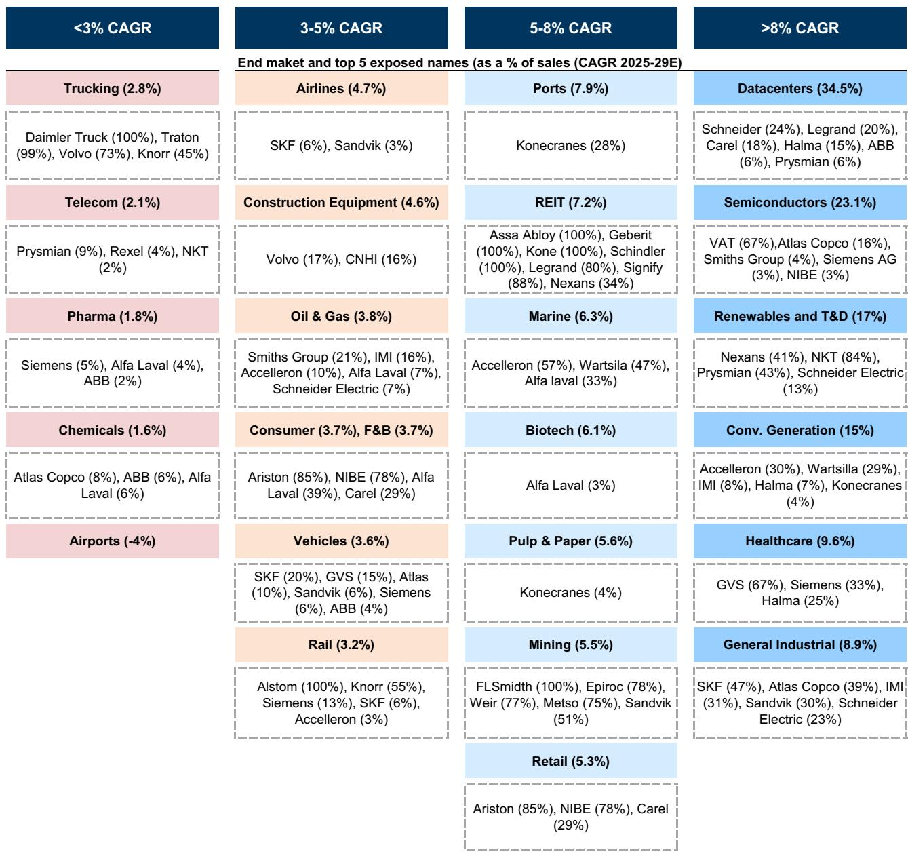
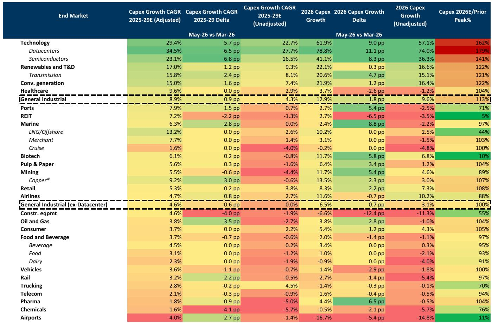

# GS：资本开支的“结构性集中”正在重塑全球工业投资逻辑

全球资本开支正在经历一场罕见的双重分化。一方面，总量数据持续向好，2026年预期增速高达13%，远超历史中位数2%的水平；另一方面，增长几乎完全由数据中心、半导体和电力公用事业三个领域驱动，这三个领域在总资本开支中的占比已从2022年的22%跃升至2026年的39%。这份GS最新发布的跨行业资本开支追踪报告（Capex Tracker）揭示了一个核心判断：市场当前低估的不是资本开支总量的韧性，而是增长结构高度集中所带来的供应链定价权转移和周期性风险错配。

这份报告覆盖了约4000家公司、34个终端和子终端市场，追踪规模高达3.4万亿欧元的资本开支计划。其结论并非简单的“资本开支强劲”，而是指向一个更深刻的产业格局变化：少数几个结构性增长领域正在吸收越来越多的投资资源，而传统周期性行业正在被挤出。这种集中度达到历史极值，意味着投资者需要重新评估哪些环节真正享有议价能力，哪些资产可能面临需求透支后的回调风险。

## 1. 资本开支增长的结构性集中已达到历史极值，传统周期行业正被系统性挤出

报告最值得关注的数字不是总量增速，而是增长分布的变化。2026年预期资本开支增速为13%，2027年预期为12%，均显著高于历史趋势。但拆解来看，增长贡献高度集中：数据中心2025-2029年复合增速约为35%，半导体约为23%，油气约为4%。与此同时，化学品和工程机械领域的资本开支预期分别下调了4.1和4.0个百分点，机场领域的复合增速甚至为-4%。

这意味着，全球资本开支的增量几乎全部来自少数几个与AI、能源转型相关的领域。传统制造业、化工、建筑设备等行业的投资预期正在收缩。这种结构性集中并非短期现象——从2022年到2026年，数据中心、半导体和电力公用事业三个领域在总资本开支中的占比翻了一倍，从22%升至39%。换句话说，全球工业投资的“马太效应”正在加速：赢家通吃的逻辑从消费互联网蔓延到了重资产投资领域。

对于投资者而言，这意味着不能再将资本开支视为一个整体性指标。总量的乐观掩盖了结构性的分化。那些处于资本开支集中领域的上游供应商——尤其是提供电力设备、冷却系统、特种气体、精密零部件的公司——可能享有持续的需求溢价和定价权。而那些依赖传统周期行业订单的企业，则面临需求增量不足、竞争加剧的风险。

## 2. 数据中心和半导体是资本开支增长的双引擎，但供应链的瓶颈正在从芯片转向电力与散热

报告明确指出，数据中心和半导体是资本开支增长最快的两个领域，复合增速分别达到35%和23%。GS在报告中直接点名了施耐德电气（Schneider Electric）和VAT Group作为买入标的，前者是数据中心电力基础设施的核心供应商，后者是半导体真空阀门领域的全球龙头。

但这份报告更深层的含义在于，资本开支的流向正在揭示供应链瓶颈的迁移。过去两年，市场关注的焦点是AI芯片的产能和供应。然而，随着数据中心建设规模的指数级扩张，瓶颈正在从芯片本身转向配套的电力、散热和基础设施。一个数据中心的生命周期中，电力成本占比高达30%-40%，而冷却系统的能耗又在其中占据相当比例。这意味着，电力设备和热管理领域的资本开支增长可能比半导体设备更具持续性。

报告还提到，电力公用事业领域的资本开支增长同样强劲，特别是电网建设。这并非偶然。数据中心的高密度用电需求正在倒逼全球电网升级，而新能源并网同样需要大规模的电网投资。Prysmian和Nexans这两家电缆制造商被GS列为买入标的，正是这一逻辑的直接体现。

对于产业决策者而言，这意味着供应链的“卡脖子”环节正在从芯片制造向电力基础设施迁移。那些能够提供高效电力转换、散热和电网互联技术的公司，可能在未来几年享有结构性增长红利。

## 3. 结构性增长领域与周期性行业的背离正在扩大，两者面临完全不同的风险类型

报告中最具洞察力的部分，是对结构性增长领域和周期性行业的对比分析。数据中心、半导体和电力公用事业属于结构性增长，其需求驱动力来自AI部署、电气化和能源转型，相对独立于宏观经济周期。而电信、消费品、化工、工程机械等领域，则属于周期性行业，其资本开支高度依赖GDP增长、利率水平和产能利用率。

报告特别指出，电信和消费品行业的几个关键投资指标——如资本开支占销售比例和产能利用率——目前均低于历史中位数。这意味着这些行业可能面临需求疲软和投资不足的双重压力。化工和工程机械的资本开支预期下调，更是直接反映了全球制造业景气度的回落。

这种背离意味着，投资者需要对两类资产采用完全不同的估值框架。对于结构性增长领域的公司，市场愿意给予更高的估值溢价，因为其增长确定性更强。但对于周期性行业的公司，即使估值看起来便宜，也可能面临“价值陷阱”——需求持续低迷导致盈利无法兑现。报告的数据显示，2026年资本开支预期增速高达13%，但这一数字主要由少数领域拉动，对于大部分传统工业企业而言，实际可获得的订单增量可能远低于这一数字。

## 4. 报告尚未完全回答的关键问题：资本开支集中度达到极值后，是否存在回调风险

尽管报告呈现了清晰的结构性增长逻辑，但有一个关键问题尚未得到充分讨论：当资本开支的集中度达到历史极值时，是否存在系统性回调的风险？

从历史经验看，资本开支集中度的快速上升往往伴随着过度投资的风险。当大量资本涌入少数几个领域时，产能建设速度可能超过实际需求增速，导致供给过剩、回报率下降。数据中心和半导体领域目前正处于这一阶段。虽然AI需求增长迅速，但数据中心建设的规模已经引发了对电力供应和碳排放的担忧。如果AI应用落地速度低于预期，或者能源成本上升超出预期，那么当前激进的资本开支计划可能面临修正。

此外，报告还隐含了一个尚未展开的讨论：资本开支集中度的上升，是否意味着全球产业链的脆弱性也在增加？当大部分投资集中在少数几个领域时，任何一个领域的需求波动都可能对整体经济产生更大的冲击。这种“鸡蛋放在一个篮子里”的风险，在报告中没有被量化评估。

对于读者而言，这些未解问题恰恰是继续深入研究的方向。报告的数据基础扎实，但其结论的可靠性取决于几个关键假设：AI需求增速能否持续、电力基础设施能否跟上、以及全球宏观经济是否会出现超预期下行。这些假设的验证，需要结合更广泛的宏观数据和产业调研。

## 5. 投资者的观察框架：从“资本开支总量”转向“资本开支结构”和“供应链议价权”

基于这份报告的逻辑，投资者可以建立一个新的观察框架，来评估不同公司的投资价值。

第一个维度是资本开支结构。投资者需要区分一家公司的收入增长来源是来自结构性增长领域还是周期性行业。那些收入中来自数据中心、半导体和电力公用事业占比高的公司，其增长确定性更强，估值可以给予溢价。而那些收入主要来自化工、工程机械、消费品等周期性行业的公司，即使当前估值便宜，也需要警惕需求下行的风险。

第二个维度是供应链议价权。在资本开支高度集中的领域，并不是所有参与者都能受益。真正能获得超额收益的，是那些在产品或服务上具有不可替代性的公司。例如，报告提到的施耐德电气和VAT Group，分别占据了数据中心电力基础设施和半导体真空阀门的关键位置。这些公司的产品具有技术壁垒和客户黏性，因此在需求扩张时能够获得定价权。相反，那些提供标准化产品的供应商，可能面临价格竞争和利润压缩。

第三个维度是资本开支的可持续性。投资者需要判断当前的资本开支计划是否具有长期合理性。报告的数据显示，2027年的资本开支预期也在上调，从年初的8%升至12%。但这一数字是否可持续，取决于AI应用的商业化进展和能源转型的政策支持。如果这些条件发生变化，资本开支增速可能从2028年开始放缓。

这份GS报告的核心价值，不在于给出了一个“看多”或“看空”的结论，而在于提供了一个精细化的分析框架。它提醒投资者，在资本开支总量向好的表象下，结构性的分化和集中正在重塑全球工业投资的格局。那些能够识别并把握这种结构性变化的人，将有机会在下一轮产业周期中获得先发优势。

报告的完整内容包含了更多关于各终端市场的细分数据、股票筛选工具和估值分析，这些细节对于做出具体的投资决策至关重要。如果你希望深入了解这些数据背后的逻辑，以及GS对特定公司的详细分析，欢迎来星球微信群里继续讨论。我们将围绕这份报告中的几个关键未解问题——包括资本开支集中度是否见顶、AI需求增速的验证节点、以及电力基础设施投资的潜在瓶颈——进行更深入的交流。

Personal reading notes and learning share only. Not investment advice.

