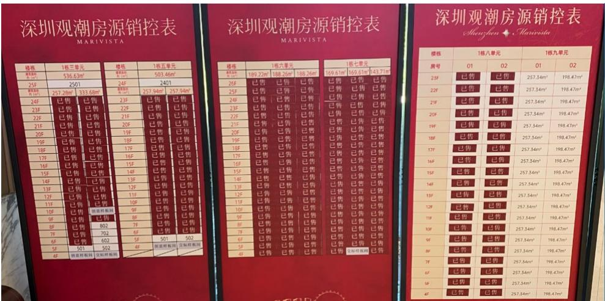
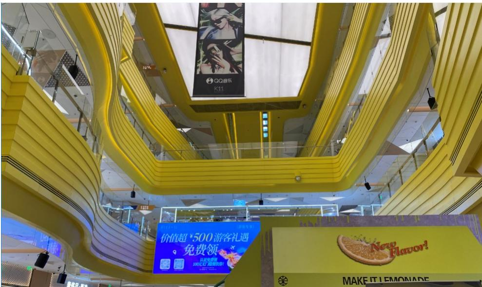
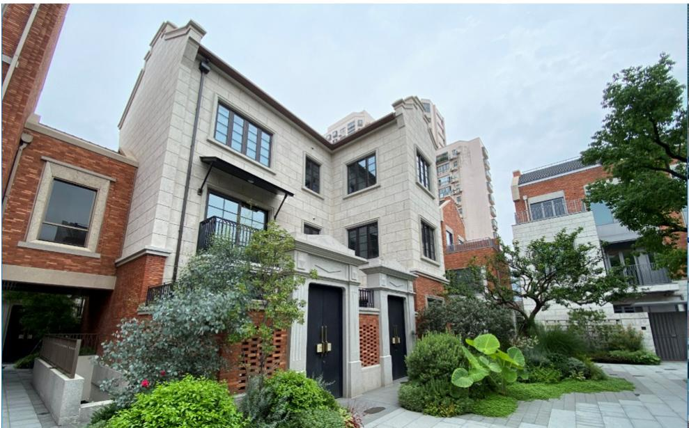
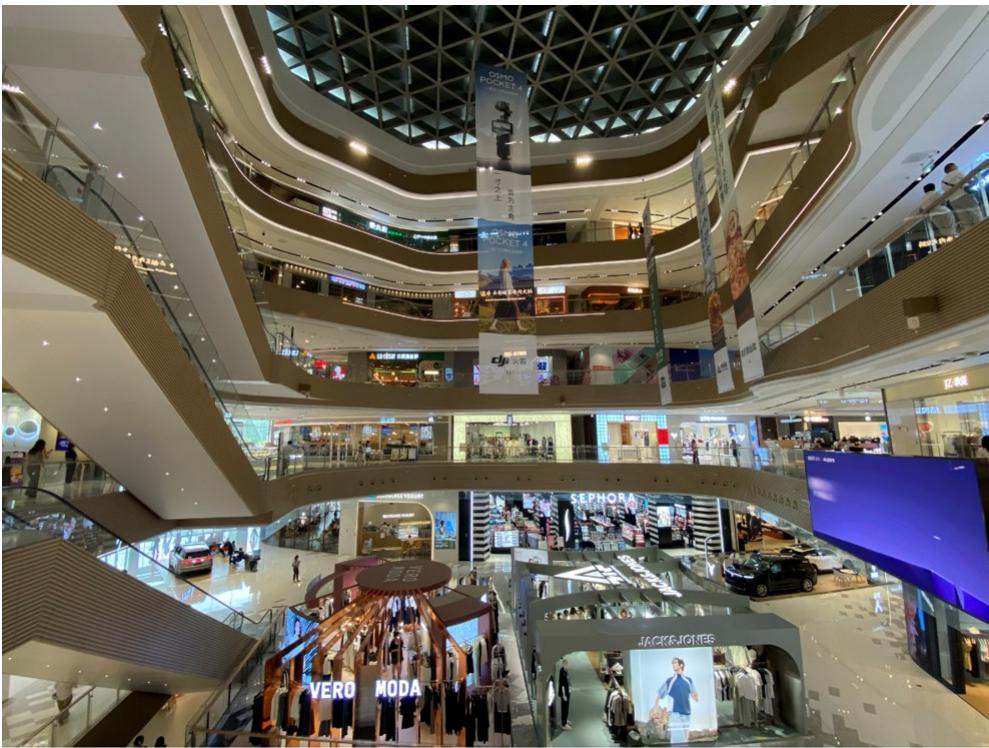

## China Property

Site visit note: A K-shaped recovery

Our property trip to Shenzhen and Shanghai last week revealed that the local housing markets are stabilizing in a K-shape. Luxury property sales are robust on the back of strong demand. Transaction volume for entry-level units has recovered, but the midrange segment remains soft. While China Property's recovery remains city-/segment-specific, we selectively prefer developers with IP transformation stories and credits with decent valuations. We stay OW on: (1) the Longfor curve (9-10%) due to its solid debt servicing ability; and (2) SHUION '29s (9%), as they are a proxy for Shanghai's luxury market recovery with declining maturities. Seazen has managed to handle refinancing so far, but we stay Neutral on the '28s, as we find valuation fair after the compression from a 19% yield to 13% YTD.

- Shenzhen housing market stabilizing in a K-shape: A Shenzhen property expert we met noted that the city's secondary housing market has stabilized in pricing/volume on the back of policy easing in 1H26. Nevertheless, there is a clear differentiation across pricing tiers and districts. Luxury home sales are robust, and entry-level transactions have recovered, but the midrange segment remains weak. Nanshan and Futian have outperformed, but other districts are softer. Primary sales are driven by premium projects, and affordable/entry-level unit transactions are shifting to the secondary market. The expert believes Shenzhen's large-scale rollout of affordable housing may weigh on the mass market's recovery in the next few years.  
- Polarization seen on the ground: Our channel checks in Shenzhen/Shanghai largely confirmed the expert's views. Luxury homes (>Rmb20mn) see robust sales on the back of limited supply and strong demand from young tech elites (a positive wealth effect from the AI/robotics boom). However, mass-market buyers remain price-sensitive due to concerns about job security, the wage outlook, etc. The IP projects we visited showed divergent performance, as well. While premium malls are solid on the back of property market stabilization/strong equity markets, mass-market malls diverge subject to their location, tenant mix, operating strategies, etc.  
- Seazen: IP transformation and REIT as new funding channel: Seazen aims to clear a majority of its DP inventories in three years, with no land acquisition plans in the near term. Management believes the retail market in tier-3/4 cities is more stable and less competitive, and it targets steady IP earnings growth with a focus on long-term competitiveness. Seazen sees Wanda as the key competitor in low-tier cities and noted limited competition from CR Mixc for now. It has managed to refinance maturities so far, thanks partly to a higher LTV for IP-backed loans, and it is exploring REIT as a new funding channel.  
- Stay selective, prefer Longfor curve and SHUION '29s: We are OW on the LNGFOR curve and SHUION '29s at a $>9\%$ yield. We appreciate: (1) Longfor's solid debt servicing ability (Rmb17bn accessible cash + Rmb5bn-10bn annual FCF vs. Rmb6bn-7bn annual maturities); and (2) Shui On as a proxy for Shanghai's luxury market recovery with declining maturities. Seazen has managed to refinance maturities, but we find the '28s fair at a $13\%$ yield.

## Asia Pacific Credit Research

Alvin Au AC

(852) 2800-8533

alvin.au@JPM.com

Soo Chong Lim

(852) 2800-7387

soochong.lim@JPM.com

JPM Securities (Asia Pacific) Limited

## Highlights from experts and companies

## Expert meeting with Director of Centraline Property Agency (Shenzhen)

- Stabilizing secondary pricing and volume: The average price for secondary homes in Shenzhen has dropped 43% from the 2020 peak, to Rmb46,103/sqm. However, it has recovered by >2% since Jan-26, indicating a price bottom. Transaction volume in the secondary market bottomed last year. It reached 56K units in 2025 (+3.2% yoy) and 31K in 5M26 (+4.5% yoy). Secondary transactions have outpaced primary home sales (38K/15K units in 2025/5M26, -21%/-21% yoy).  
- Driven by policy relaxation: There were three rounds of policy relaxation in 1H26: (1) VAT reduction on secondary home sales (lowered from 5% to 3% for units held for <2 years; full exemption after 2 years); (2) the downpayment for commercial properties lowered to 30%; and (3) the relaxation of home purchase restrictions (HPR) in core districts (SZ/non-SZ residents allowed to buy one extra unit) with a higher home provident fund loan limit. These policies have triggered a surge in total property transactions to >10K units in May (a 14-month high).  
- K-shaped recovery: Luxury homes (>Rmb20mn) see strong demand and robust sales on the back of tech elites and a positive wealth effect from the AI/robotics boom. Transactions for entry-level homes (\~Rmb3mn) have recovered after a sharp price drop over the past five years. The midrange segment (Rmb5bn-10mn) is under pressure, with the weakest performance. By district, Nanshan and Futian are the best performers in Shenzhen.  
- Shrinking primary market and land supply: Primary launches have declined for three consecutive years, with only 9,600 units launched in Shenzhen in 5M26 (-23% yoy). Land auctions have also slowed dramatically, with only three plots sold in 2026 YTD, leading to a product skew toward high-margin high-end products. National policies prohibit local governments from supplying new land if primary inventory months are above 10 (Shenzhen: 13.7). Land supply cannot improve materially if inventory months do not come down.  
- Primary vs. secondary market: Transactions are shifting toward the secondary market due to declining primary launches and new land supply. For the primary market, luxury/premium projects are driving sales. For the secondary market, affordable and entry-level homes dominate transactions.  
- Mass-market recovery weighed on by large-scale rollout of affordable housing: Shenzhen will roll out 200K-300K units of affordable housing over 2026E-30E. Affordable housing is priced at 50-70% of comparable commodity housing, and the large supply will weigh on pricing in the low-/mid-tier segment. Shenzhen rolled out 43K units of affordable housing in 2025, which is 1.2x new commodity housing supply (35K).  
- Stringent risk management: Shenzhen has no unfinished buildings since 2022, and $42\%$ of property transactions are on completed projects. Stricter escrow rules have also reduced unfinished building risk. Vanke's Shenzhen projects are now co-managed by SOEs (e.g., Shenzhen Metro). It has therefore maintained a decent sell-through rate and price stability for its projects.

## Company meeting with Seazen Holdings

\- Targets clearing most DP inventories in three years: Seazen is actively contracting the DP business with a focus on reducing inventories and debts. Current DP inventory stands at Rmb71bn. This includes: (1) Rmb2.6bn of undeveloped land (拟开发土地); (2) Rmb45.6bn of projects under construction (在建项目); and (3) Rmb22.9bn of completed, but unsettled/transferred projects (竣工未结转). There are also Rmb30bn of construction payables and Rmb10bn of tax payables. Sales are stable at Rmb1bn/month, mainly from existing projects with minimal new launches, and the developer targets clearing most DP inventories in three years, partly by repaying debt/payables with existing inventories. It has maintained a DP team, but has shifted its focus toward third-party construction service. Seazen has no land acquisition plan in 2026, but may participate in select opportunities in the future.

\- Investment Property a solid cash cow: Seazen's IP business is solid, with commercial operation revenue (rental income + property management fee) growing 3% yoy, to Rmb4.7bn in 4M26, on the back of a 7%/10% increase in tenant sales/foot traffic over the period. Compared to tier-1/2 cities, Seazen believes the consumption market in low-tier cities is: (1) more stable (family-centric, less policy-sensitive); and (2) less competitive (Wanda as the major competitor). Seazen is ramping up investments to improve mall quality and tenant mix, and is increasing the adoption of the fixed + turnover rent model to improve rental income (mostly fixed rent contracts now). It targets Rmb14.5bn in commercial operation revenue in 2026 (+4% yoy, 70%/50% gross/net margin), which more than covers its SG&A expenses (Rmb4bn), interest payments (Rmb3bn) and taxes (Rmb3bn).

\- Clear positioning to defend against competition from Wanda and CR Mixc: Seazen sees Wanda as the major IP competitor in tier-3/4 cities. Compared to Wanda, Seazen believes it has a better long-term strategy to cultivate mall competitiveness and shopping experience, instead of being focused on near-term profits for liquidity. Seazen sees a clear difference in positioning among IP players, which include CR Mixc (premium), Longfor (midrange focus in tier-1/2 cities) and Seazen (mass-focused on tier-3/4 cities). CR Mixc's expansion to lower-tier cities could be a potential challenge to Seazen, but management believes the former's near-term expansion would be constrained by heavy funding needs for mall buildup. Seazen can reposition its malls toward the mass market even in the face of CR Mixc's competition in certain cities, as well.

\- Higher LTV for IP-backed loans: Offshore debts are mainly in USD bonds (Rmb5bn-equivalent outstanding), and onshore debts are mainly in Wuyue Plaza-backed operating loans. Seazen has raised LTV for the IP-backed loans from 38% (2024) to 43% (2025), and recent new borrowings are made at 50% LTV. There are only Rmb2bn of remaining development loans due to a lack of new projects.

\- REIT the new financing channel: Seazen has launched a private REIT backed by Shanghai's Qingpu Wuyue Plaza. It owns 34% of the REIT (consolidated) and has raised Rmb400mn by disposing 66% of the mall (5-6% expected return, based on rental income). It has raised Rmb420mn of bank loans and Rmb400mn of equity funds from the Qingpu mall in total. Seazen will launch another private REIT project this year, and it aims to launch a public REIT with a Rmb2bn issuance later in 2026. It believes the REIT channel helps: (1) marginally improve liquidity; and (2) improve debt structure (replace debt with equity) on the back of Rmb120bn of IP assets.

## Site visits in Shenzhen and Shanghai

## Shenzhen

- Premium residential project: We visited Marivista (观潮), a high-end residential project in Bao'an Xin'an Street near Qianhai that is co-developed by CR Land and China Merchants Shekou. With pricing at Rmb140K-150K/sqm with a lump sum of Rmb20mn-100mn, sales are robust and every new batch launched is sold out in a few minutes, per the sales manager. Buyers are mainly Shenzhen locals (non-locals are restricted by home purchase restrictions) aged 30-40 working in industries such as tech, finance, AI/semiconductors, etc. These young elites have amassed wealth in recent years, and some of the sales manager's customers earn Rmb100mn per year. Buyers pay a 15-20% downpayment, and most borrow mortgages at a \~3% cost.  
- NWD K11 ECOAST: We visited New World's K11 ECOAST shopping mall in Nanshan, which opened in April 2025. Occupancy was decent, at $80 - 90\%$ (no disclosure on rents), but foot traffic was weak on Wednesday at lunch time. The tenant mix was broad across EV (Tesla, Nio), F&B, game stores, bicycle rental shops and artwork shops, and the seafront coffee shop was relatively popular. There are new office buildings under construction nearby, which could be positive for foot traffic in the future.

## Shanghai

- Premium residential projects: We visited: (1) COLI's Anlan Shanghai (安澜上海), a high-end residential/commercial complex in Xuhui CBD district; and (2) Shui On's premium Riverville (翠湖滨江) villa project in Yangpu district. Both projects price Rmb20mn to >Rmb100mn in lump sum per unit. Similar to Shenzhen, sales are fast, and the two projects we visited are nearly fully sold. Buyers are mainly Shanghai locals or from the nearby Yangtze River Delta, aged 30-40. There will be a lot of new office supply in the Xuhui CBD district in the next few years. Besides the commercial complex we visited, Hongkong Land will also complete the Westbund Central project in that area by 2028E.  
- IP: We visited Hang Lung's Plaza 66, a high-end luxury mall in Jing'an district, and Longfor's Paradisewalk shopping mall in Minhang, Shanghai.  
- Hang Lung Plaza 66 (恒隆广场): The mall enjoys unique positioning, with a high concentration of luxury brands in the city center area. Tenant sales were strong, at >10% yoy in 1Q26, driven partly by the promotion event of a major tenant in 1Q. The sales manager noted that the national tax refund policy for tourist purchases is supportive of foot traffic, but the impact on sales is limited. She also observed increased visitors from Korea, Taiwan (which benefited from the AI boom) and the Middle East.  
- Longfor Minghang Paradisewalk (龙湖闵行天街): Foot traffic was decent on a Thursday afternoon, and key tenants include fashion wear/sportswear (CK Jeans, North Face), F&B and consumer electronics (e.g., Xiaomi, Huawei). The sales manager noted that the mall targets business, family and students as customers, and sees Wanda as the key competitor in the region. She believes Wanda is more focused on near-term profits, but the mall focuses on cultivating a decent shopping experience with an optimal tenant mix.

Figure 1: Strong sell-through at Marivista (观潮) in Bao'an, Shenzhen  

text_image

深圳观潮房源销控表
MARIVISTA
深圳观潮房源销控表
MARIVISTA
模板
1栋三单元
楼栋
1栋五单元
建筑面积(m²)
536.6m²
建筑面积(m²)
503.46m²
25F
250
24F
2401
257.94m² 257.94m²
257.94m² 257.94m²
257.94m² 257.94m²
257.94m² 257.94m²
257.94m² 257.94m²
257.94m² 257.94m²
257.94m²
257.94m² 257.94m²
257.94m² 257.94m²
257.94m² 257.94m²
257.94m² 257.94m²
257.94m² 257.94m²
Mangzhou ◆ Marivista
模板
1栋六单元
1栋七单元
建筑面积(m²)
189.23m² 188.26m² 188.26m²
169.61m² 169.61m² 169.61m²
169.61m² 169.61m² 169.61m²
169.61m² 169.61m² 169.61m²
169.61m² 169.61m² 169.61m²
169.61m² 169.61n² 169.61n² 169.61n²
20F 已售 已售 已售 已售 已售 已售 已售
20F 已售 已售 已售 已售 已售 已售 已售
20F 已售 已售 已售 已售 已售 已售 已售
20F 已售 已售 已售 已售 已售 已售 已售 已售
20F 已售 已售 已售 已售 已售 已售 已售 已售
20F 已售 已售 已售 已售 已售 已售 已售 已售
20F 已售 已售 已售 已售 已售 已售工已售
20F 已售 已售 已售 已售 已售 已售 已售 已售
19F 已售 已售 18F 已售 已售 18F 已售 已售 18F 已售 已售 18F 已售
19F 已售 已售 17F 已售 已售 17F 已售 已售 17F 已售 已售 17F 已售
17F 已售 已售 16F 已售 已售 16F 已售 已售 16F 已售
16F 已售 已售 15F 已售 已售 15F 已售 已售 15F 已售
15F 已售 已售 14F 已售 已售 14F 已售 已售 14F 已售
14F 已售 已售 13F 已售 已售 13F 已售 已售 13F 已售
13F 已售 已售 12F 已售 已售 12F 已售 已售 12F 已售
12F 已售 已售 11F 已售 已售 11F 已售 已售 11F 巳告
11F 巳告 巳告 10F 巳告 巳告 10F 巳告 巳告 10F 巳告
10F 巳告 空间样板面积 SF
SF 巳告 空间样板面积 SF
SF 巳告 空间样板面积 SF
SF 巳告 空间样板面积 SF
SF 巳告 空间样板面积 SF
SF 巳告 空间样板面积 SF
SF 巳告 空间样板面积 SF
SF 巳告 空间样板面积 SF
SF 巳告 空间样板面积 SF
SF 巳告 智格样板面积 SF
SF 巳告 智格样板面积 SF
SF 巳告 智格样板面积 SF
SF 巳告 智格样板面积 SF
SF 巳告 智格样板面积 SF
SF 巳告 智格样板面积 SF
SF 巳告 智格样板面积 SF
SF 巳告 智格样板面积 SF
SF 巳告 智格样板面积 SF

Source: JPM. Note: 已售 = sold.

Figure 2: Neighborhood and school network near Marivista (观潮) in Bao'an, Shenzhen  

text_image

西安云游集团海洋学校
西安中宇集团海洋学校

Source: JPM.

Figure 3: NWD's K11 ECOAST shopping mall in Nanshan, Shenzhen  

text_image

QQ音乐
K11
价值超·500游客礼遇
免费领
New Flavor!
MAKE IT LEMONADE

Source: JPM.

Figure 4: NWD's K11 ECOAST shopping mall in Nanshan, Shenzhen  

natural_image

Interior view of a modern luxury shopping mall with a large decorative cake and a circular skylight, featuring a 'LUXBA' retail store sign (no readable text on main structure)

Source: JPM.

Figure 5: COLI's Anlan Shanghai (left) and HKL's Westbund Central project (right) in Xuhui, Shanghai  

natural_image

3D architectural model of a modern city with skyscrapers and road networks, no visible text or symbols

Source: JPM.

Figure 6: Shui On's Riverville villa project in Yangpu, Shanghai  

natural_image

Exterior view of a modern brick building with a decorative roof and glass balcony, surrounded by greenery and urban buildings in the background (no visible text or symbols)

Source: JPM.

Figure 7: Shui On's Riverville villa project in Yangpu, Shanghai  

natural_image

Exterior view of a modern multi-story residential building with brick walls, balconies, and landscaping (no signage or text visible)

Source: JPM.

Figure 8: Hang Lung Plaza 66 shopping mall in Jing'an, Shanghai  

text_image

给同一天生日的你
HONG KONG YU
Happy BIRTHDAY OF HONG KONG YU

Source: JPM.

Figure 9: Longfor Paradisewalk shopping mall in Minhang, Shanghai  

natural_image

Interior view of a modern multi-level shopping mall with escalators, retail displays, and visible store signage (no readable text in focus)

Source: JPM.

Analyst Certification: The Research Analyst(s) denoted by an “AC” on the cover of this report certifies (or, where multiple Research Analysts are primarily responsible for this report, the Research Analyst denoted by an “AC” on the cover or within the document individually certifies, with respect to each security or issuer that the Research Analyst covers in this research) that: (1) all of the views expressed in this report accurately reflect the Research Analyst’s personal views about any and all of the subject securities or issuers; and (2) no part of any of the Research Analyst's compensation was, is, or will be directly or indirectly related to the specific recommendations or views expressed by the Research Analyst(s) in this report. For all Korea-based Research Analysts listed on the front cover, if applicable, they also certify, as per KOFIA requirements, that the Research Analyst’s analysis was made in good faith and that the views reflect the Research Analyst’s own opinion, without undue influence or intervention.

All authors named within this report are Research Analysts who produce independent research unless otherwise specified. In Europe, Sector Specialists (Sales and Trading) may be shown on this report as contacts but are not authors of the report or part of the Research Department.

## Important Disclosures

• Market Maker/ Liquidity Provider: JPM is a market maker and/or liquidity provider in the financial instruments of/related to Shui On Land or related entities.  
- Manager or Co-manager: JPM acted as manager or co-manager in a public offering of securities or financial instruments (as such term is defined in Directive 2014/65/EU) of/for Shui On Land or related entities within the past 12 months.  
- Client: JPM currently has, or had within the past 12 months, the following entity(ies) as clients: Longfor Group, Seazen Group Ltd, Shui On Land or related entities.  
- Client/Investment Banking: JPM currently has, or had within the past 12 months, the following entity(ies) as investment banking clients: Shui On Land or related entities.  
- Client/Non-Investment Banking, Securities-Related: JPM currently has, or had within the past 12 months, the following entity(ies) as clients, and the services provided were non-investment-banking, securities-related: Longfor Group or related entities.  
- Client/Non-Securities-Related: JPM currently has, or had within the past 12 months, the following entity(ies) as clients, and the services provided were non-securities-related: Longfor Group or related entities.  
- Investment Banking Compensation Received: JPM has received in the past 12 months compensation for investment banking services from Shui On Land or related entities.  
- Potential Investment Banking Compensation: JPM expects to receive, or intends to seek, compensation for investment banking services in the next three months from Longfor Group, Shui On Land or related entities.  
• Non-Investment Banking Compensation Received: JPM has received compensation in the past 12 months for products or services other than investment banking from Longfor Group or related entities.  
- Debt Position: JPM may hold a position in the debt securities of Longfor Group, Seazen Group Ltd, Shui On Land or related entities, if any.

Company-Specific Disclosures: JPM does and seeks to do business with companies covered in its research reports. As a result, investors should be aware that the firm may have a conflict of interest that could affect the objectivity of this report. Investors should consider this report as only a single factor in making their investment decision. Important disclosures, including price charts and credit opinion history tables (if applicable), are available for compendium reports and all JPM-covered companies, and certain non-covered companies, by visiting https://www.jpmm.com/research/disclosures, calling 1-800-477-0406, or e-mailing research.disclosure.inquiries@JPM.com with your request.

## History of Investment Recommendations:

A history of JPM investment recommendations disseminated during the preceding 12 months can be accessed on the Research & Commentary page of http://www.JPMmarkets.com where you can also search by analyst name, sector or financial instrument.

Longfor Group - JPM Credit Opinion History

<table><tr><td></td><td>Date</td><td>Action</td><td>Rating/Designation</td><td>Ticker/ISIN</td></tr><tr><td>Issuer</td><td>11 Jan 18</td><td>Upgrade</td><td>Overweight</td><td>LNGFOR</td></tr><tr><td>3.375 '27 *</td><td>21 Aug 23</td><td>Initiate</td><td>Overweight</td><td>XS2098539815</td></tr><tr><td>3.85 '32</td><td>21 Nov 24</td><td>Initiate</td><td>Overweight</td><td>XS2098650414</td></tr><tr><td>3.875% '22</td><td>12 Sep 22</td><td>Terminate</td><td>Not Covered</td><td>XS1633950453</td></tr><tr><td>3.9% '23</td><td>24 Feb 23</td><td>Terminate</td><td>Not Covered</td><td>XS1743535228</td></tr><tr><td>3.95 '29</td><td>21 Aug 23</td><td>Initiate</td><td>Overweight</td><td>XS2033262895</td></tr><tr><td>4.5% '28</td><td>26 Mar 20</td><td>Upgrade</td><td>Overweight</td><td>XS1743535491</td></tr><tr><td>6.75% '23</td><td>11 Jan 18</td><td>Terminate</td><td>Not Covered</td><td>XS0877742105</td></tr><tr><td>6.875% '19</td><td>17 Feb 17</td><td>Terminate</td><td>Not Covered</td><td>XS0844323930</td></tr><tr><td>9.500% '16</td><td>29 Apr 15</td><td>Terminate</td><td>Not Covered</td><td>USG5635PAA78</td></tr></table>

Seazen Group Ltd - JPM Credit Opinion History

<table><tr><td></td><td>Date</td><td>Action</td><td>Rating/Designation</td><td>Ticker/ISIN</td></tr><tr><td>Issuer</td><td>13 Sep 24</td><td>Terminate</td><td>Not Covered</td><td>FUTLAN</td></tr><tr><td>Issuer</td><td>13 Jul 25</td><td>Initiate</td><td>Neutral</td><td>FUTLAN</td></tr><tr><td>Issuer</td><td>24 Sep 25</td><td>Upgrade</td><td>Overweight</td><td>FUTLAN</td></tr><tr><td>Issuer</td><td>04 Dec 25</td><td>Downgrade</td><td>Neutral</td><td>FUTLAN</td></tr><tr><td>11.88% &#x27;28 *</td><td>13 Jul 25</td><td>Initiate</td><td>Neutral</td><td>XS3099012406</td></tr><tr><td>11.88% &#x27;28 *</td><td>24 Sep 25</td><td>Upgrade</td><td>Overweight</td><td>XS3099012406</td></tr><tr><td>11.88% &#x27;28 *</td><td>04 Dec 25</td><td>Downgrade</td><td>Neutral</td><td>XS3099012406</td></tr><tr><td>10.25% &#x27;18</td><td>16 Sep 16</td><td>Terminate</td><td>Not Covered</td><td>USG3701AAA46</td></tr><tr><td>10.25% &#x27;19</td><td>29 Mar 17</td><td>Terminate</td><td>Not Covered</td><td>XS1086808570</td></tr><tr><td>4.5% &#x27;26</td><td>13 Jul 25</td><td>Initiate</td><td>Neutral</td><td>XS2290806285</td></tr><tr><td>4.5% &#x27;26</td><td>24 Sep 25</td><td>Upgrade</td><td>Overweight</td><td>XS2290806285</td></tr><tr><td>4.5% &#x27;26</td><td>04 Dec 25</td><td>Downgrade</td><td>Neutral</td><td>XS2290806285</td></tr><tr><td>4.5% &#x27;26</td><td>21 May 26</td><td>Terminate</td><td>Not Covered</td><td>XS2290806285</td></tr><tr><td>5% &#x27;20</td><td>07 Feb 20</td><td>Terminate</td><td>Not Covered</td><td>XS1565437057</td></tr><tr><td>6% &#x27;24</td><td>13 Sep 24</td><td>Terminate</td><td>Not Covered</td><td>XS2215175634</td></tr><tr><td>6.250% &#x27;17</td><td>11 Jan 18</td><td>Terminate</td><td>Not Covered</td><td>XS1318304166</td></tr><tr><td>6.45% &#x27;22</td><td>14 Sep 22</td><td>Terminate</td><td>Not Covered</td><td>XS2188034586</td></tr><tr><td>6.5% &#x27;20</td><td>18 Nov 20</td><td>Terminate</td><td>Not Covered</td><td>XS1877986718</td></tr><tr><td>7.5% &#x27;21</td><td>25 Feb 22</td><td>Terminate</td><td>Not Covered</td><td>XS1937623012</td></tr><tr><td>FTLNHD &#x27;27</td><td>24 Sep 25</td><td>Initiate</td><td>Overweight</td><td>XS3192214685</td></tr><tr><td>FTLNHD &#x27;27</td><td>04 Dec 25</td><td>Downgrade</td><td>Neutral</td><td>XS3192214685</td></tr></table>

Shui On Land - JPM Credit Opinion History

<table><tr><td></td><td>Date</td><td>Action</td><td>Rating/Designation</td><td>Ticker/ISIN</td></tr><tr><td>Issuer</td><td>31 May 26</td><td>Initiate</td><td>Overweight</td><td>SHUION</td></tr><tr><td>9.75% &#x27;29 *</td><td>31 May 26</td><td>Initiate</td><td>Overweight</td><td>XS3040578745</td></tr></table>

## \*Indicates representative/primary bond/instrument.

The table(s) above show the recommendation changes made by JPM Credit Research Analysts in the subject company and/or instruments over the past three years (or, if no recommendation changes were made during that period, the most recent change). Notes: Effective April 11, 2016, JPM changed its Credit Research Ratings System. Please see the Explanation of Credit Research Ratings below for the new definitions. The previous rating system no longer should be relied upon. For the history prior to April 11, 2016, please call 1-800-447-0406 or e-mail research.disclosure.inquiries@JPM.com.

## Explanation of Credit Research Valuation Methodology, Ratings and Risk to Ratings:

JPM uses a bond-level rating system that incorporates valuations (relative value) and our fundamental view on the security. Our fundamental credit view of an issuer is based on the company's underlying credit trends, overall creditworthiness and our opinion on whether the issuer will be able to service its debt obligations when they become due and payable. We analyze, among other things, the company's cash flow capacity and trends and standard credit ratios, such as gross and net leverage, interest coverage and liquidity ratios. We also analyze profitability, capitalization and asset quality, among other variables, when assessing financials. Analysts also rate the issuer, based on the rating of the benchmark or representative security. Unless we specify a different recommendation for the company's individual securities, an issuer recommendation applies to all of the bonds at the same level of the issuer's capital structure. We may also rate certain loans and preferred securities, as applicable. This report also sets out within it the material underlying assumptions used. We use the following ratings for bonds

(issues), issuers, loans, and preferred securities: Overweight (over the next three months, the recommended risk position is expected to outperform the relevant index, sector, or benchmark); Neutral (over the next three months, the recommended risk position is expected to perform in line with the relevant index, sector, or benchmark); and Underweight (over the next three months, the recommended risk position is expected to underperform the relevant index, sector, or benchmark). For CDS, we use the following rating system: Long Risk (over the next three months, the credit return on the recommended position is expected to exceed the relevant index, sector or benchmark); Neutral (over the next three months, the credit return on the recommended position is expected to match the relevant index, sector or benchmark); and Short Risk (over the next three months, the credit return on the recommended position is expected to underperform the relevant index, sector or benchmark).

JPM Credit Research Ratings Distribution, as of April 04, 2026

<table><tr><td></td><td>Overweight (buy)</td><td>Neutral (hold)</td><td>Underweight (sell)</td></tr><tr><td>Global Credit Research Universe*</td><td>27%</td><td>57%</td><td>16%</td></tr><tr><td>IB clients**</td><td>84%</td><td>84%</td><td>89%</td></tr></table>

\*Please note that the percentages may not add to 100% because of rounding.

\*\*Percentage of subject companies within each of the "Overweight," "Neutral" and "Underweight" categories for which JPM has provided investment banking services within the previous 12 months.

For purposes of FINRA ratings distribution rules only, our Overweight rating falls into a buy rating category; our Neutral rating falls into a hold rating category; and our Underweight rating falls into a sell rating category. The Credit Research Rating Distribution is at the issuer level. Issuers with an NR or an NC designation are not included in the table above. This information is current as of the end of the most recent calendar quarter.

Analysts' Compensation: The research analysts responsible for the preparation of this report receive compensation based upon various factors, including the quality and accuracy of research, client feedback, competitive factors, and overall firm revenues.

Registration of non-US Analysts: Unless otherwise noted, the non-US analysts listed on the front of this report are employees of non-US affiliates of JPM Securities LLC, may not be registered as research analysts under FINRA rules, may not be associated persons of JPM Securities LLC, and may not be subject to FINRA Rule 2241 or 2242 restrictions on communications with covered companies, public appearances, and trading securities held by a research analyst account.

## Other Disclosures

JPM is a marketing name for investment banking businesses of JPM Chase & Co. and its subsidiaries and affiliates worldwide.

UK MIFID FICC research unbundling exemption: UK clients should refer to UK MIFID Research Unbundling exemption for details of JPM's implementation of the FICC research exemption and guidance on relevant FICC research categorisation.

Any long form nomenclature for references to China; Hong Kong; Taiwan; and Macau within this research material are Mainland China; Hong Kong SAR (China); Taiwan (China); and Macau SAR (China).

JPM may, from time to time, write on issuers or securities targeted by economic or financial sanctions imposed or administered by the governmental authorities of the U.S., EU, UK or other relevant jurisdictions (Sanctioned Securities). Nothing in this report is intended to be read or construed as encouraging, facilitating, promoting or otherwise approving investment or dealing in such Sanctioned Securities. Clients should be aware of their own legal and compliance obligations when making investment decisions.

Any digital or crypto assets discussed in this research report are subject to a rapidly changing regulatory landscape. For relevant regulatory advisories on crypto assets, including bitcoin and ether, please see https://www.JPM.com/disclosures/cryptoasset-disclosure.

The author(s) of this research report may not be licensed to carry on regulated activities in your jurisdiction and, if not licensed, do not hold themselves out as being able to do so.

Exchange-Traded Funds (ETFs): JPM Securities LLC (“JPMS”) acts as authorized participant for substantially all U.S.-listed ETFs. To the extent that any ETFs are mentioned in this report, JPMS may earn commissions and transaction-based compensation in connection with the distribution of those ETF shares and may earn fees for performing other trade-related services, such as securities lending to short sellers of the ETF shares. JPMS may also perform services for the ETFs themselves, including acting as a broker or dealer to the ETFs. In addition, affiliates of JPMS may perform services for the ETFs, including trust, custodial, administration, lending, index calculation and/or maintenance and other services.

Options and Futures related research: If the information contained herein regards options- or futures-related research, such information is available only to persons who have received the proper options or futures risk disclosure documents. Please contact your JPM Representative or visit https://www.theocc.com/components/docs/riskstoc.pdf for a copy of the Option Clearing Corporation's Characteristics and Risks of Standardized Options or https://www.finra.org/sites/default/files/2020-08/Security\_Futures\_Risk\_Disclosure\_Statement\_2020.pdf for a copy of the Security Futures

Risk Disclosure Statement.

Changes to Interbank Offered Rates (IBORs) and other benchmark rates: Certain interest rate benchmarks are, or may in the future become, subject to ongoing international, national and other regulatory guidance, reform and proposals for reform. For more information, please consult: https://www.JPM.com/global/disclosures/interbank\_offered\_rates

Private Bank Clients: Where you are receiving research as a client of the private banking businesses offered by JPM Chase & Co. and its subsidiaries (“JPM Private Bank”), research is provided to you by JPM Private Bank and not by any other division of JPM, including, but not limited to, the JPM Corporate and Investment Bank and its Global Research division.

Legal entity responsible for the production and distribution of research: The legal entity identified below the name of the Reg AC Research Analyst who authored this material is the legal entity responsible for the production of this research. Where multiple Reg AC Research Analysts authored this material with different legal entities identified below their names, these legal entities are jointly responsible for the production of this research. Where more than one legal entity is listed under an analyst's name, the first legal entity is responsible for the production unless stated otherwise. Research Analysts from various JPM affiliates may have contributed to the production of this material but may not be licensed to carry out regulated activities in your jurisdiction (and do not hold themselves out as being able to do so). Unless otherwise stated below in the legal entity disclosures, this material has been distributed by the legal entity responsible for production, or where more than one legal entity is listed under the analyst's name, the first legal entity will be responsible for distribution. If you have any queries, please contact the relevant Research Analyst in your jurisdiction or the entity in your jurisdiction that has distributed this research material.

## Legal Entities Disclosures and Country-/Region-Specific Disclosures:

Argentina: JPM Chase Bank N.A Sucursal Buenos Aires is regulated by Banco Central de la República Argentina (“BCRA”- Central Bank of Argentina) and Comisión Nacional de Valores (“CNV”- Argentinian Securities Commission - ALYC y AN Integral N°51).

Australia: JPM Securities Australia Limited (“JPMSAL”) (ABN 61 003 245 234/AFS Licence No: 238066) is regulated by the Australian Securities and Investments Commission and is a Market Participant of ASX Limited, a Clearing and Settlement Participant of ASX Clear Pty Limited and a Clearing Participant of ASX Clear (Futures) Pty Limited. This material is issued and distributed in Australia by or on behalf of JPMSAL only to "wholesale clients" (as defined in section 761G of the Corporations Act 2001). A list of all financial products covered can be found by visiting https://www.jpmm.com/research/disclosures. JPM seeks to cover companies of relevance to the domestic and international investor base across all Global Industry Classification Standard (GICS) sectors, as well as across a range of market capitalisation sizes. If applicable, in the course of conducting public side due diligence on the subject company(ies), the Research Analyst team may at times perform such diligence through corporate engagements such as site visits, discussions with company representatives, management presentations, etc. Research issued by JPMSAL has been prepared in accordance with JPM Australia’s Research Independence Policy which can be found at the following link: JPM Australia - Research Independence Policy.

Brazil: Banco JPM S.A. is regulated by the Comissao de Valores Mobiliarios (CVM) and by the Central Bank of Brazil. Ombudsman JPM: 0800-7700847 / 0800-7700810 (For Hearing Impaired) / ouvidoria.jp.morgan@jpmchase.com.

Canada: JPM Securities Canada Inc. is a registered investment dealer, regulated by the Canadian Investment Regulatory Organization and the Ontario Securities Commission and is the participating member on Canadian exchanges. This material is distributed in Canada by or on behalf of JPM Securities Canada Inc.

Chile: Inversiones JPM Limitada is an unregulated entity incorporated in Chile.

China: JPM Securities (China) Company Limited has been approved by CSRC to conduct the securities investment consultancy business.

Colombia: Banco JPM Colombia S.A. is supervised by the Superintendencia Financiera de Colombia (SFC). Any reference in this material to products or services offered abroad by entities other than the Bank in Colombia is included exclusively for descriptive purposes. Such references do not constitute, and should not be construed as, promotional activity or the provision of financial products or services within Colombian territory, as defined under applicable Colombian regulation.

Dubai International Financial Centre (DIFC): JPM Chase Bank, N.A., Dubai Branch is regulated by the Dubai Financial Services Authority (DFSA) and its registered address is Dubai International Financial Centre - The Gate, West Wing, Level 3 and 9 PO Box 506551, Dubai, UAE. This material has been distributed by JPM Chase Bank, N.A., Dubai Branch to persons regarded as professional clients or market counterparties as defined under the DFSA rules.

European Economic Area (EEA): Unless specified to the contrary, research is distributed in the EEA by JPM SE (“JPM SE”), which is authorised as a credit institution by the Federal Financial Supervisory Authority (Bundesanstalt für Finanzdienstleistungsaufsicht, BaFin) and jointly supervised by the BaFin, the German Central Bank (Deutsche Bundesbank) and the European Central Bank (ECB). JPM SE is a company headquartered in Frankfurt with registered address at TaunusTurm, Taunustor 1, Frankfurt am Main, 60310, Germany. The material has been distributed in the EEA to persons regarded as professional investors (or equivalent) pursuant to Art. 4 para. 1 no. 10 and Annex II of MiFID II and its respective implementation in their home jurisdictions (“EEA professional investors”). This material must not be acted on or relied on by persons who are not EEA professional investors. Any investment or investment activity to which this material relates is only available to EEA relevant persons and will be engaged in only with EEA relevant persons.

Hong Kong: JPM Securities (Asia Pacific) Limited (CE number AAJ321) is regulated by the Hong Kong Monetary Authority and the

Securities and Futures Commission in Hong Kong, and JPM Broking (Hong Kong) Limited (CE number AAB027) is regulated by the Securities and Futures Commission in Hong Kong. JPM Chase Bank, N.A., Hong Kong Branch (CE Number AAL996) is regulated by the Hong Kong Monetary Authority and the Securities and Futures Commission, is organized under the laws of the United States with limited liability. Where the distribution of this material is a regulated activity in Hong Kong, the material is distributed in Hong Kong by or through JPM Securities (Asia Pacific) Limited and/or JPM Broking (Hong Kong) Limited.

India: JPM India Private Limited (Corporate Identity Number - U67120MH1992FTC068724), having its registered office at JPM Tower, Off. C.S.T. Road, Kalina, Santacruz - East, Mumbai – 400098, is registered with the Securities and Exchange Board of India (SEBI) as a 'Research Analyst' having registration number INH000001873. JPM India Private Limited is also registered with SEBI as a member of the National Stock Exchange of India Limited and the Bombay Stock Exchange Limited (SEBI Registration Number – INZ000239730) and as a Merchant Banker (SEBI Registration Number - MB/INM000002970). Telephone: 91-22-6157 3000, Facsimile: 91-22-6157 3990 and Website: http://www.jpmipl.com. JPM Chase Bank, N.A. - Mumbai Branch is licensed by the Reserve Bank of India (RBI) (Licence No. 53/Licence No. BY.4/94; SEBI - IN/CUS/014/ CDSL : IN-DP-CDSL-444-2008/ IN-DP-NSDL-285-2008/ INBI00000984/ INE231311239) as a Scheduled Commercial Bank in India, which is its primary license allowing it to carry on Banking business in India and other activities, which a Bank branch in India are permitted to undertake. For non-local research material, this material is not distributed in India by JPM India Private Limited. Compliance Officer: Ashutosh Sharma; ashutosh.j.sharma@jpmchase.com; +912261575002. Grievance Officer: Ramprasadh K, jpmipl.research.feedback@JPM.com; +912261573000. Registration granted by SEBI and certification from NISM in no way guarantee performance of the intermediary or provide any assurance of returns to investors. Please visit Terms and Conditions and Most Important Terms and Conditions (MITC). The annual Compliance audit report is available at http://www.jpmipl.com/#research.

Indonesia: PT JPM Sekuritas Indonesia is a member of the Indonesia Stock Exchange and is registered and supervised by the Otoritas Jasa Keuangan (OJK).

Korea: JPM Securities (Far East) Limited, Seoul Branch, is a member of the Korea Exchange (KRX). JPM Chase Bank, N.A., Seoul Branch, is licensed as a branch office of foreign bank (JPM Chase Bank, N.A.) in Korea. Both entities are regulated by the Financial Services Commission (FSC) and the Financial Supervisory Service (FSS). For non-macro research material, the material is distributed in Korea by or through JPM Securities (Far East) Limited, Seoul Branch.

Japan: JPM Securities Japan Co., Ltd. and JPM Chase Bank, N.A., Tokyo Branch are regulated by the Financial Services Agency in Japan.

Malaysia: This material is issued and distributed in Malaysia by JPM Securities (Malaysia) Sdn Bhd (18146-X), which is a Participating Organization of Bursa Malaysia Berhad and holds a Capital Markets Services License issued by the Securities Commission in Malaysia.

Mexico: JPM Casa de Bolsa, S.A. de C.V., JPM Grupo Financiero is member of the Mexican Stock Exchange (“Bolsa Mexicana de Valores”) and the Institutional Stock Exchange (“Bolsa Institucional de Valores”), and it is authorized to act as a broker dealer by the National Banking and Securities Exchange Commission (“Comisión Nacional Bancaria y de Valores”).

New Zealand: This material is issued and distributed by JPMSAL in New Zealand only to "wholesale clients" (as defined in the Financial Markets Conduct Act 2013). JPMSAL is registered as a Financial Service Provider under the Financial Service providers (Registration and Dispute Resolution) Act of 2008.

Philippines: JPM Securities Philippines Inc. is a Trading Participant of the Philippine Stock Exchange and a member of the Securities Clearing Corporation of the Philippines and the Securities Investor Protection Fund. It is regulated by the Securities and Exchange Commission.

Singapore: This material is issued and distributed in Singapore by or through JPM Securities Singapore Private Limited (JPMSS) [MDDI (P) 057/08/2025 and Co. Reg. No.: 199405335R], which is a member of the Singapore Exchange Securities Trading Limited, and/or JPM Chase Bank, N.A., Singapore branch (JPMCB Singapore), both of which are regulated by the Monetary Authority of Singapore. This material is issued and distributed in Singapore only to accredited investors, expert investors and institutional investors, as defined in Section 4A of the Securities and Futures Act, Cap. 289 (SFA). This material is not intended to be issued or distributed to any retail investors or any other investors that do not fall into the classes of “accredited investors,” “expert investors” or “institutional investors,” as defined under Section 4A of the SFA. Recipients of this material in Singapore are to contact JPMSS or JPMCB Singapore in respect of any matters arising from, or in connection with, the material.

South Africa: JPM Equities South Africa Proprietary Limited and JPM Chase Bank, N.A., Johannesburg Branch are members of the Johannesburg Securities Exchange and are regulated by the Financial Services Conduct Authority (FSCA).

Taiwan: JPM Securities (Taiwan) Limited is a participant of the Taiwan Stock Exchange (company-type) and regulated by the Taiwan Securities and Futures Bureau. Material relating to equity securities is issued and distributed in Taiwan by JPM Securities (Taiwan) Limited, subject to the license scope and the applicable laws and the regulations in Taiwan. To the extent that JPM Securities (Taiwan) Limited produces research materials on securities not listed on the Taiwan Stock Exchange or Taipei Exchange (“Non-Taiwan Listed Securities”), these materials shall not constitute securities recommendations for the purpose of applicable Taiwan regulations, and, for the avoidance of doubt, JPM Securities (Taiwan) Limited does not act as broker for Non-Taiwan Listed Securities. According to Paragraph 2, Article 7-1 of Operational Regulations Governing Securities Firms Recommending Trades in Securities to Customers (as amended or supplemented) and/or other applicable laws or regulations, please note that the recipient of this material is not permitted to engage in any activities in connection with the material that may give rise to conflicts of interests, unless otherwise disclosed in the “Important

Disclosures" in this material.

Thailand: This material is issued and distributed in Thailand by JPM Securities (Thailand) Ltd., which is a member of the Stock Exchange of Thailand and is regulated by the Ministry of Finance and the Securities and Exchange Commission. The registered address is 548 One City Center Building, 50th Floor, Ploenchit Road, Lymphini, Pathum Wan, Bangkok 10330.

UK: Research is produced in the UK by JPM Securities plc (“JPMS plc”) which is a member of the London Stock Exchange and is authorised by the Prudential Regulation Authority and regulated by the Financial Conduct Authority and the Prudential Regulation Authority or JPM Markets Limited (“JPMML Ltd”) which is authorised and regulated by the Financial Conduct Authority. Unless specified to the contrary, this material is distributed in the UK by JPMS plc and is directed in the UK only to: (a) persons having professional experience in matters relating to investments falling within article 19(5) of the Financial Services and Markets Act 2000 (Financial Promotion) (Order) 2005 (“the FPO”); (b) persons outlined in article 49 of the FPO (high net worth companies, unincorporated associations or partnerships, the trustees of high value trusts, etc.); or (c) any persons to whom this communication may otherwise lawfully be made; all such persons being referred to as "UK relevant persons". This material must not be acted on or relied on by persons who are not UK relevant persons. Any investment or investment activity to which this material relates is only available to UK relevant persons and will be engaged in only with UK relevant persons. A description of JPM EMEA’s policy for prevention and avoidance of conflicts of interest related to the production of Research can be found at the following link: JPM EMEA - Research Independence Policy.

U.S.: JPM Securities LLC (“JPMS”) is a member of the NYSE, FINRA, SIPC, and the NFA. JPM Chase Bank, N.A. is a member of the FDIC. Material published by non-U.S. affiliates is distributed in the U.S. by JPMS who accepts responsibility for its content.

General: Additional information is available upon request. The information in this material has been obtained from sources believed to be reliable. While all reasonable care has been taken to ensure that the facts stated in this material are accurate and that the forecasts, opinions and expectations contained herein are fair and reasonable, JPM Chase & Co. or its affiliates and/or subsidiaries (collectively JPM) make no representations or warranties whatsoever to the completeness or accuracy of the material provided, except with respect to any disclosures relative to JPM and the Research Analyst's involvement with the issuer that is the subject of the material. Accordingly, no reliance should be placed on the accuracy, fairness or completeness of the information contained in this material. There may be certain discrepancies with data and/or limited content in this material as a result of calculations, adjustments, translations to different languages, and/or local regulatory restrictions, as applicable. These discrepancies should not impact the overall investment analysis, views and/or recommendations of the subject company(ies) that may be discussed in the material. Artificial intelligence tools may have been used in the preparation of this material, including assisting in data analysis, pattern recognition, and content drafting for research material. JPM accepts no liability whatsoever for any loss arising from any use of this material or its contents, and neither JPM nor any of its respective directors, officers or employees, shall be in any way responsible for the contents hereof, apart from the liabilities and responsibilities that may be imposed on them by the relevant regulatory authority in the jurisdiction in question, or the regulatory regime thereunder. Opinions, forecasts or projections contained in this material represent JPM's current opinions or judgment as of the date of the material only and are therefore subject to change without notice. Periodic updates may be provided on companies/industries based on company-specific developments or announcements, market conditions or any other publicly available information. There can be no assurance that future results or events will be consistent with any such opinions, forecasts or projections, which represent only one possible outcome. Furthermore, such opinions, forecasts or projections are subject to certain risks, uncertainties and assumptions that have not been verified, and future actual results or events could differ materially. The value of, or income from, any investments referred to in this material may fluctuate and/or be affected by changes in exchange rates. All pricing is indicative as of the close of market for the securities discussed, unless otherwise stated. Past performance is not indicative of future results. Accordingly, investors may receive back less than originally invested. This material is not intended as an offer or solicitation for the purchase or sale of any financial instrument. The opinions and recommendations herein do not take into account individual client circumstances, objectives, or needs and are not intended as recommendations of particular securities, financial instruments or strategies to particular clients. This material may include views on structured securities, options, futures and other derivatives. These are complex instruments, may involve a high degree of risk and may be appropriate investments only for sophisticated investors who are capable of understanding and assuming the risks involved. The recipients of this material must make their own independent decisions regarding any securities or financial instruments mentioned herein and should seek advice from such independent financial, legal, tax or other adviser as they deem necessary. JPM may trade as a principal on the basis of the Research Analysts' views and research, and it may also engage in transactions for its own account or for its clients' accounts in a manner inconsistent with the views taken in this material, and JPM is under no obligation to ensure that such other communication is brought to the attention of any recipient of this material. Others within JPM, including Strategists, Sales staff and other Research Analysts, may take views that are inconsistent with those taken in this material. Employees of JPM not involved in the preparation of this material may have investments in the securities (or derivatives of such securities) mentioned in this material and may trade them in ways different from those discussed in this material. This material is not an advertisement for or marketing of any issuer, its products or services, or its securities in any jurisdiction.

Confidentiality and Security Notice: This transmission may contain information that is privileged, confidential, legally privileged, and/or exempt from disclosure under applicable law. If you are not the intended recipient, you are hereby notified that any disclosure, copying, distribution, or use of the information contained herein (including any reliance thereon) is STRICTLY PROHIBITED. Although this transmission and any attachments are believed to be free of any virus or other defect that might affect any computer system into which it is received and opened, it is the responsibility of the recipient to ensure that it is virus free and no responsibility is accepted by JPM Chase & Co., its subsidiaries and affiliates, as applicable, for any loss or damage arising in any way from its use. If you received this transmission in error, please immediately contact the sender and destroy the material in its entirety, whether in electronic or hard copy format. This message is subject to electronic monitoring: https://www.JPM.com/disclosures/email

MSCI: Certain information herein (“Information”) is reproduced by permission of MSCI Inc., its affiliates and information providers (“MSCI”) ©2026. No reproduction or dissemination of the Information is permitted without an appropriate license. MSCI MAKES NO EXPRESS OR IMPLIED WARRANTIES (INCLUDING MERCHANTABILITY OR FITNESS) AS TO THE INFORMATION AND DISCLAIMS ALL LIABILITY TO THE EXTENT PERMITTED BY LAW. No Information constitutes investment advice, except for any applicable Information from MSCI ESG Research. Subject also to msci.com/disclaimer

Sustainalytics: Certain information, data, analyses and opinions contained herein are reproduced by permission of Sustainalytics and: (1) includes the proprietary information of Sustainalytics; (2) may not be copied or redistributed except as specifically authorized; (3) do not constitute investment advice nor an endorsement of any product or project; (4) are provided solely for informational purposes; and (5) are not warranted to be complete, accurate or timely. Sustainalytics is not responsible for any trading decisions, damages or other losses related to it or its use. The use of the data is subject to conditions available at https://www.sustainalytics.com/legal-disclaimers. ©2026 Sustainalytics. All Rights Reserved.

"Other Disclosures" last revised May 16, 2026.

Copyright 2026 JPM Chase & Co. All rights reserved. This material or any portion hereof may not be reprinted, sold or redistributed without the written consent of JPM. It is strictly prohibited to use or share without prior written consent from JPM any research material received from JPM or an authorized third-party (“JPM Data”) in any third-party artificial intelligence (“AI”) systems or models when such JPM Data is accessible by a third-party.

Completed 11 Jun 2026 11:43 PM HKT

Disseminated 12 Jun 2026 07:30 AM HKT