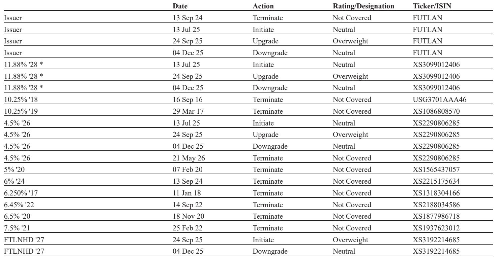
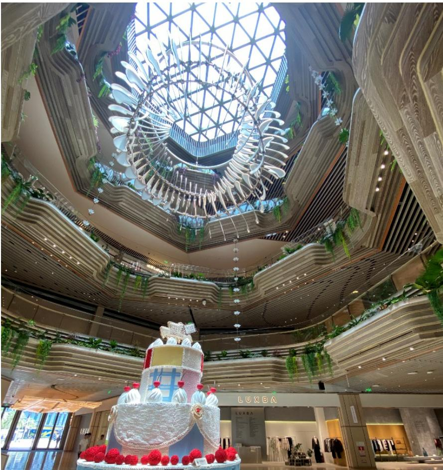
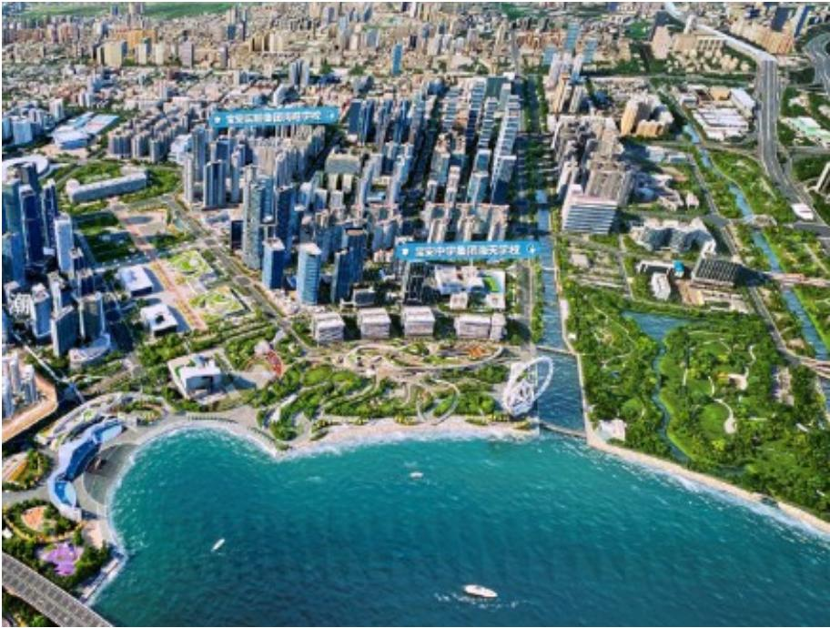

# China's Property Market Is Not Recovering — It Is Fracturing Into Three Separate Realities

The narrative that China's property market is staging a uniform recovery is misleading. A recent on-the-ground assessment of Shenzhen and Shanghai reveals something far more consequential: the market is undergoing a K-shaped bifurcation that separates luxury, mid-range, and entry-level segments into fundamentally different trajectories. Luxury homes above RMB 20 million are selling out within minutes, driven by tech wealth from the AI and robotics boom, while mid-range properties languish with weak demand and price-sensitive buyers paralyzed by job insecurity. This is not a recovery. It is a structural decoupling of asset classes within the same market, and it demands a complete rethinking of how investors should approach Chinese real estate credit.

The implications extend beyond housing. The same polarization is visible in commercial real estate, where premium malls in prime locations post double-digit sales growth while mass-market properties struggle depending on tenant mix and operating strategy. Developers are responding by transforming their business models — shifting from property development to investment property management, exploring REITs as new funding channels, and aggressively deleveraging. For credit investors, the key insight is clear: broad-based exposure to Chinese property is no longer a viable strategy. The only defensible approach is a highly selective, name-by-name, segment-by-segment allocation that rewards developers with demonstrable debt-service capacity and exposure to the luxury end of the K-curve.

This article translates the findings from a recent site visit report into a strategic framework for investors. It identifies which segments are investable, which are not, and — critically — what the report does not yet answer about the sustainability of this divergence.

## The K-Shape Is Not Cyclical — It Reflects a Permanent Wealth Stratification

The most important finding from the Shenzhen site visit is not that prices have stabilized, but that the stabilization is entirely driven by a narrow slice of the market. Secondary home prices in Shenzhen have dropped 43% from their 2020 peak, to RMB 46,103 per square meter, and have recovered only 2% since January 2026. That aggregate figure conceals the real story. Luxury homes above RMB 20 million are seeing robust demand from young tech elites in their 30s and 40s, many earning annual incomes of RMB 100 million or more. These buyers are paying 15-20% down payments and borrowing at roughly 3% mortgage costs. At the Marivista project in Bao'an, every new batch sells out in minutes.

At the other end of the spectrum, entry-level homes around RMB 3 million have seen transaction volumes recover after five years of sharp price declines. But the middle — units priced between RMB 5 million and RMB 10 million — remains the weakest segment. This is not a temporary phenomenon driven by policy timing. It reflects a structural shift in China's income and wealth distribution. The AI and robotics boom has created a concentrated cohort of high earners with enormous purchasing power, while the broader middle class faces stagnant wage growth, job security concerns, and the psychological weight of a prolonged property downturn. The mid-range buyer is neither wealthy enough to be indifferent to price nor desperate enough to buy at the bottom. They are stuck.

This K-shaped dynamic is reinforced by supply constraints. Primary launches in Shenzhen have declined for three consecutive years, with only 9,600 units launched in the first five months of 2026, down 23% year-on-year. Land auctions have slowed dramatically, with only three plots sold year-to-date. National policy prohibits local governments from supplying new land if primary inventory months exceed ten, and Shenzhen's current level is 13.7 months. The result is a supply skew toward high-margin, high-end products. Developers are rationally choosing to build luxury units because that is where demand exists and where margins can be protected. The mass market is being starved of new supply, which may eventually support prices, but in the near term it means the K-shape is self-reinforcing.

## Investment Property Is the New Anchor of Credit Quality, But Only for Select Developers

The report's channel checks reveal that the polarization extends to commercial real estate. Premium malls in prime locations — such as Hang Lung's Plaza 66 in Shanghai's Jing'an district — are posting tenant sales growth above 10% year-on-year in the first quarter of 2026, driven by luxury brand demand and increased tourist foot traffic from Korea, Taiwan, and the Middle East. In contrast, mass-market malls show divergent performance depending on location, tenant mix, and operating strategy. Longfor's Paradisewalk in Minhang, Shanghai, reported decent foot traffic, but the mall's positioning targets business travelers, families, and students — a broad but less affluent base than the luxury segment.

For developers, the strategic pivot is unmistakable. Seazen Holdings, for example, is actively contracting its development business, targeting the clearance of most of its RMB 71 billion in development property inventories within three years. It has no land acquisition plans for 2026. Instead, the company is focusing on its investment property portfolio, which generated RMB 4.7 billion in commercial operation revenue in the first four months of 2026, up 3% year-on-year, with tenant sales and foot traffic growing 7% and 10%, respectively. Seazen's management believes the consumption market in lower-tier cities is more stable and less competitive than in tier-1 and tier-2 cities, citing Wanda as the primary competitor rather than CR Mixc or Longfor.

This transformation has direct implications for credit analysis. Seazen has raised the loan-to-value ratio on its investment-property-backed loans from 38% in 2024 to 43% in 2025, with recent new borrowings at 50% LTV. It has also launched a private REIT backed by its Shanghai Qingpu Wuyue Plaza, raising RMB 400 million by disposing of 66% of the mall while retaining a 34% consolidated stake. The company plans another private REIT this year and a public REIT issuance of RMB 2 billion later in 2026. For credit investors, the key question is whether this REIT strategy represents a genuine improvement in debt structure — replacing debt with equity against a base of RMB 120 billion in investment property assets — or merely a liquidity band-aid.

The report's analysts are overweight on Longfor's curve at a 9-10% yield, citing solid debt servicing ability with RMB 17 billion in accessible cash and RMB 5-10 billion in annual free cash flow against only RMB 6-7 billion in annual maturities. They are also overweight on Shui On's 2029s at a 9% yield, viewing the company as a proxy for Shanghai's luxury market recovery with declining maturities. Seazen's 2028s, however, are rated neutral at a 13% yield, reflecting the view that valuation is fair after the yield compressed from 19% to 13% year-to-date.

## The Affordable Housing Overhang Is the Unresolved Risk for the Mass Market

The report raises a critical question that it does not fully answer: what happens to the mass market when Shenzhen's large-scale affordable housing rollout begins in earnest? The city plans to deliver 200,000 to 300,000 units of affordable housing between 2026 and 2030, priced at 50-70% of comparable commodity housing. In 2025 alone, Shenzhen rolled out 43,000 units of affordable housing, which was 1.2 times the new commodity housing supply of 35,000 units. If this pace continues, the affordable housing supply could significantly outstrip new commodity supply for years.

The report's expert from Centraline Property Agency noted that this rollout will weigh on mass-market pricing in the next few years. The logic is straightforward: affordable housing competes directly with entry-level and mid-range commodity housing. If the government is willing to supply units at half the market price, the demand for comparable commodity units will be suppressed. This is not a temporary policy measure; it is a structural shift in housing provision that could permanently cap price appreciation in the lower and middle segments of the market.

For investors, this creates a difficult analytical problem. The luxury segment is insulated from affordable housing competition because the price differential is too large. But the mid-range segment, which is already the weakest part of the K-shape, faces an additional headwind that is not yet fully priced into credit spreads. The report does not provide a quantitative estimate of the impact, but the direction is clear. If affordable housing supply grows as planned, the K-shape could become even more pronounced, with the middle segment compressing further toward the entry-level segment in terms of pricing power.

This also raises a second-order question about developer strategy. Seazen's focus on lower-tier cities may be a deliberate hedge against affordable housing risk in tier-1 markets. The company's management believes the consumption market in tier-3 and tier-4 cities is more stable and less policy-sensitive. But if affordable housing programs are expanded nationally, even lower-tier cities could face similar dynamics. The report does not address this scenario, and it is a gap that investors should monitor closely.

## A Decision Framework for Credit Investors in the K-Shaped Market

The report's findings can be translated into a practical decision framework for credit investors. The framework has three dimensions: segment exposure, developer business model, and debt structure sustainability.

First, segment exposure determines the demand backdrop. Luxury residential and premium commercial properties in top-tier city locations have structural demand support from concentrated tech wealth and limited supply. Entry-level residential has recovered on valuation grounds but faces affordable housing competition. Mid-range residential has no clear catalyst and is the most exposed to macro uncertainty. Investors should favor credits with direct exposure to luxury residential or premium commercial segments and avoid those with heavy mid-range exposure.

Second, the developer's business model determines cash flow stability. Developers that are successfully transforming from development-heavy to investment-property-heavy models have more predictable revenue streams and higher asset quality that supports secured financing. The ability to access REIT markets is a positive signal, as it provides an alternative funding channel and improves debt structure. Developers that remain dependent on development sales for cash flow are more exposed to the K-shaped demand risk.

Third, debt structure sustainability determines default risk. The report highlights the importance of accessible cash relative to near-term maturities, free cash flow generation, and the loan-to-value ratio on investment property collateral. Longfor's position — with accessible cash and FCF that is two to three times annual maturities — is clearly superior. Seazen's position — with a 43-50% LTV on IP-backed loans and an active REIT program — is improving but not yet proven at scale.

Using this framework, the report's overweight recommendations on Longfor and Shui On make strategic sense. Both have luxury exposure, strong cash positions, and declining maturity profiles. Seazen's neutral rating reflects the fair valuation after significant spread compression and the uncertainty around its transformation timeline. The framework also suggests that investors should be cautious about developers with heavy mid-range exposure in tier-1 cities, limited REIT access, and high near-term maturities relative to accessible cash.

## What the Report Does Not Answer — And Why That Matters

The report provides a valuable snapshot of on-the-ground conditions, but it leaves several important questions unresolved. First, how sustainable is the luxury demand driven by tech wealth? The AI and robotics boom has created a cohort of high earners, but this wealth is concentrated in a narrow set of companies and roles. If the tech cycle turns or if regulatory pressures on tech compensation resurface, luxury demand could weaken rapidly. The report does not stress-test this scenario.

Second, what is the refinancing risk for developers that are not yet in the REIT market? Seazen's experience shows that REIT access can improve liquidity and debt structure, but not every developer has a portfolio of investment properties large enough or high-quality enough to support a REIT issuance. For developers without this option, the funding environment remains constrained, and the report does not provide a comprehensive view of refinancing risk across the sector.

Third, how will the affordable housing rollout affect developer land banks in lower-tier cities? If affordable housing programs expand beyond tier-1 cities, developers like Seazen that are positioning in tier-3 and tier-4 markets could face unexpected competition. The report notes that Seazen sees limited competition from CR Mixc in lower-tier cities, but government-supplied affordable housing is a different competitive dynamic.

Finally, the report does not address the macroeconomic scenario. If China's economic growth slows further or if trade tensions escalate, the K-shape could become an L-shape for the mass market, with the luxury segment remaining buoyant only as long as tech wealth continues to grow. Investors need to form their own views on these macro risks and incorporate them into their credit analysis.

These open questions are not weaknesses of the report. They reflect the inherent uncertainty in a market that is undergoing structural transformation. The report's value lies in its granular, on-the-ground evidence of the K-shaped recovery and its identification of the specific credits that are best positioned to navigate this environment.

Join the community to read the full report and review the original charts.

*This article is for learning and discussion only and does not constitute investment advice.*

Personal reading notes and learning share only. Not investment advice.

