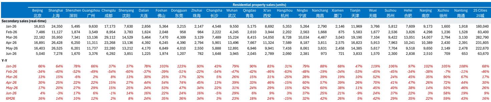
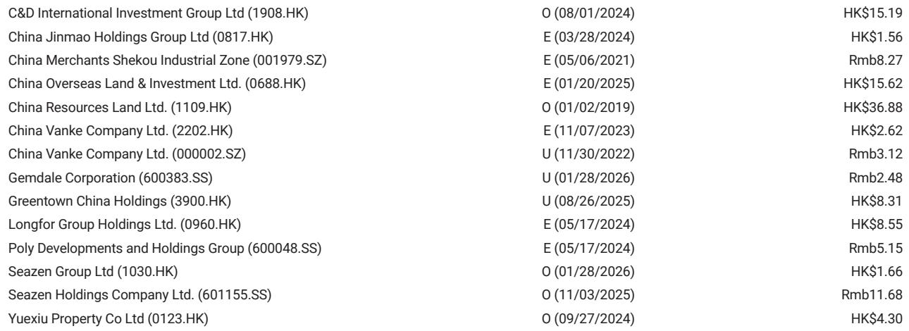
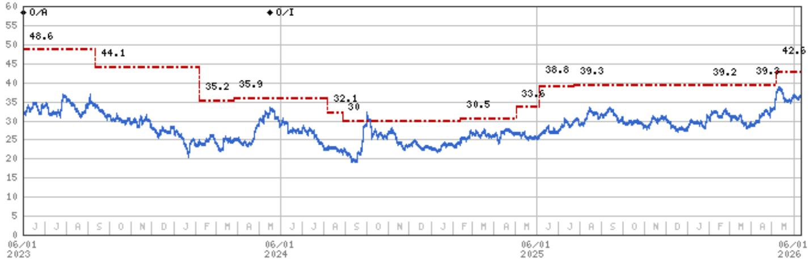

# 摩根斯坦利：市场对楼市“小阳春”的可持续性存在显著误判

在经历了3-4月超预期的二手房成交回暖后，市场情绪一度转向乐观。然而，摩根斯坦利最新发布的6月高频数据显示，这一轮复苏的动能正在迅速衰减。截至6月10日，25城二手房实时成交同比增速已从4月的30%骤降至9%，低能级二线城市甚至出现同比负增长。这并非一次简单的季节性回调，而是政策脉冲效应消退与积压需求释放完毕后的结构性回落。市场真正需要重新定价的，不是需求何时反弹，而是供给侧的出清速度与房价下行压力将持续多久。

为何这个判断在当前时点尤为重要？因为市场对“小阳春”的解读存在根本分歧。部分投资者将其视为周期拐点的前兆，而摩根斯坦利在5月发布的报告《An Inflection or Another False Start?》中已明确指出，3-4月的反弹更可能是积压需求的集中释放，而非基本面改善。如今6月数据进一步印证了这一判断，但股价自5月中旬以来已回调18%，而恒生指数同期仅下跌8%。这意味着，市场对房地产板块的风险定价仍不充分，尤其是在政策效果递减、二手房挂牌量未见显著收缩的背景下。

这份报告的核心贡献在于，它通过高频数据拆解了25个城市的成交结构，揭示了三个关键信号：第一，政策放松的边际效用正在递减，且城市间分化加剧；第二，低能级城市的二手房市场已率先转弱，这可能是一线城市的前瞻指标；第三，即便在一线城市内部，成交量与价格走势也出现背离。这些信号合在一起指向一个判断：2026年下半年，二手房成交同比增速可能转负，而房价将在2026-2027年持续承压，仅极少数库存去化较好的核心城市可能出现温和回升。

## 1. 政策脉冲效应正在快速衰减，低能级城市已率先“熄火”

摩根斯坦利的数据显示，25城二手房实时成交同比增速从4月的30%降至5月的26%，再到6月上旬的9%，下滑速度远超季节性因素所能解释。尤其值得关注的是，低能级二线城市——如南昌、佛山、南通、东莞、宁波、西安——的减速幅度最为明显。而天津、长沙、成都三城甚至已出现同比负增长。

这意味着什么？3-4月的成交放量，本质上是由政策放松（包括公积金贷款额度提升、房贷利率下调）与居民情绪短期修复共同驱动的。但政策对需求的刺激效果具有一次性特征：它能够加速积压需求的释放，却无法创造新的购买力。当这批“存量需求”消化完毕后，市场便回到了由收入预期、就业前景和房价预期决定的基本面轨道上。低能级城市之所以率先转弱，恰恰是因为这些城市的基本面支撑更为脆弱——人口流入放缓、产业基础薄弱、库存压力更大。

对投资者的含义在于：不能再用3-4月的高增速作为线性外推的依据。政策脉冲的衰减速度比市场预期的更快，而低能级城市的转弱可能是全市场成交下行的领先指标。

## 2. 政策放松后的城市分化揭示了一个关键变量：库存去化周期

报告特别指出，4月底政策放松的城市出现了显著分化：苏州和武汉的成交依然强劲，而广州、深圳、佛山则出现了两位数的环比减速。这并非随机分布，而是与各城市的库存水平和去化能力密切相关。

苏州和武汉的共同特征是什么？两者在过去两年经历了较大幅度的价格调整，二手房性价比已相对合理，且库存去化周期处于中等偏低水平。而广州、深圳虽然基本面更强，但二手房挂牌量持续攀升，导致买方议价能力增强，成交量难以持续放大。佛山则属于典型的低能级城市，政策放松难以对冲人口和产业基本面的弱势。

这一分化的核心启示是：在需求侧政策工具接近用尽的背景下，供给侧的去库存进度将成为决定城市房价走势的核心变量。摩根斯坦利在报告中也提到，一线城市可能因更快的去库存进度而出现温和的价格回升，但这一判断仍需验证——因为一线城市的二手房挂牌量仍在增加，价格下行压力并未解除。

## 3. 二手房挂牌量是比成交量更值得关注的先行指标

报告虽然没有直接给出25城的挂牌量数据，但通过成交增速的快速下滑，可以合理推断：在成交量收缩的同时，挂牌量并未同步减少。事实上，许多城市的二手房挂牌量仍在历史高位附近。这意味着供需关系正在进一步恶化——供给端没有收缩，而需求端已经疲软。

这是一个关键但容易被忽视的观察维度。在房地产下行周期中，成交量下降本身并不一定可怕，如果伴随的是挂牌量同步下降，说明市场正在出清。但如果成交量下降而挂牌量维持高位，则意味着卖方的去化压力在加大，房价下行的风险也在累积。当前的数据模式更接近后一种情况。

对于投资者而言，这意味着需要将关注焦点从“成交量何时反弹”转向“挂牌量何时见顶”。只有当挂牌量开始趋势性下降，市场才真正进入出清阶段。在此之前，任何基于成交量反弹的乐观判断都可能被证伪。

## 4. 报告尚未完全回答的关键问题：二手房价的下跌是否已经传导至新房市场

摩根斯坦利在报告中强调了二手房成交转弱对房价的传导机制，但并未充分展开一个关键问题：二手房价格的下跌是否已经系统性地传导至新房市场？从历史经验看，二手房价格通常是新房价格的领先指标。当二手房市场出现量价齐跌时，新房市场的去化压力会进一步加大，尤其是在开发商仍面临资金链压力的背景下。

目前新房市场的表现如何？报告没有提供直接数据，但我们可以从逻辑上推导：如果二手房成交转弱，意味着置换链条中的“卖旧买新”需求将受到抑制。同时，二手房价格下跌会压低新房的价格锚，使得开发商不得不以更大的折扣促销，从而进一步压缩利润率。这对高杠杆开发商而言是双重打击——既面临销售回款放缓，又面临资产减值压力。

这一问题之所以重要，是因为它直接关系到房地产板块的投资逻辑：如果新房市场尚未充分反映二手房的下行压力，那么当前板块的估值修复可能并不稳固。这也是摩根斯坦利在报告中维持“行业风险回报偏向下行”判断的核心原因之一。

## 5. 投资者的观察框架：6-8月是验证市场是否见底的关键窗口

摩根斯坦利在报告中建议，投资者应密切监测6-8月的五个关键指标：成交量、房价、二手房挂牌量、成交结构和租金回报率。这五个指标共同构成了判断市场是否见底的观察框架。

具体而言：第一，如果成交量在6-8月持续低于去年同期，且7-8月旺季不旺，则基本可以确认3-4月的反弹是假启动。第二，房价的月度环比变化比同比更具参考价值，环比跌幅如果持续扩大，说明市场仍在寻底。第三，二手房挂牌量如果出现趋势性下降，将是供给出清的积极信号。第四，成交结构的变化——比如刚需盘占比是否上升、改善盘是否缩量——可以反映需求端的真实结构。第五，租金回报率的变化则关系到持有资产的真实收益率，如果租金持续下降，将削弱房产作为资产类别的吸引力。

对于决策者而言，这五个指标提供了一个可操作的数据监测框架。在6-8月的数据出来之前，任何关于“市场见底”的判断都带有较大的不确定性。

---

以上讨论基于摩根斯坦利6月高频数据报告的公开内容。报告还包含25城逐月成交明细、估值方法与风险分析，以及摩根斯坦利对中国房地产板块的完整覆盖清单。如果您希望在第一时间获取完整研报解读、原始图表及后续数据跟踪，欢迎加入我们的知识星球微信群，与数百位行业决策者一起持续讨论。在星球里，我们还会定期分享其他顶级投行的独家解读，以及基于这些报告的实战推演。

Personal reading notes and learning share only. Not investment advice.

