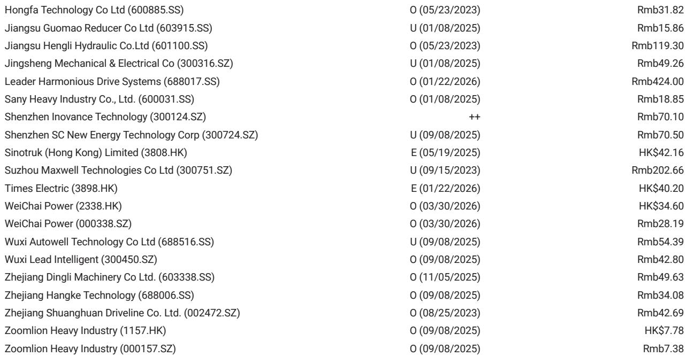
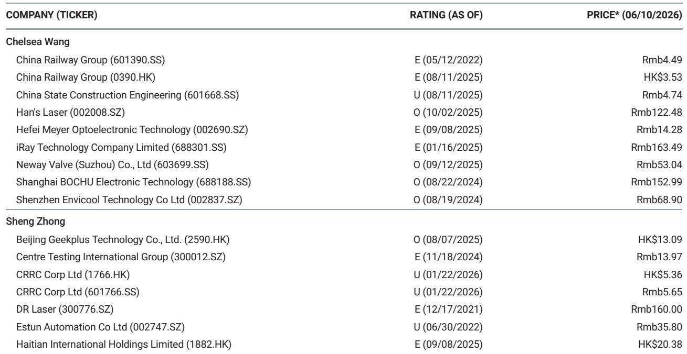
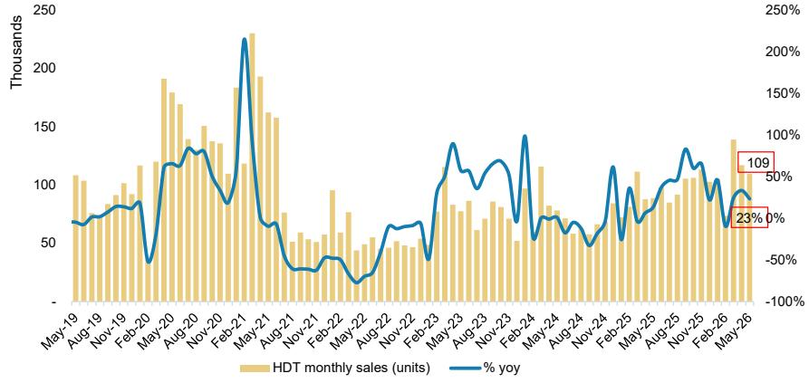

# 摩根斯坦利：重卡销量超预期背后，真正的分化信号才刚刚开始

2026年5月，中国重卡市场交出了一份超出预期的成绩单。中国汽车工业协会数据显示，当月重卡销售10.95万辆，同比增长23%，比行业研究机构CV World此前预测的10.3万辆高出约6个百分点。这份来自摩根斯坦利的月度数据追踪，表面上只是一次常规的行业销量更新，但如果我们把视线从单月数字上移开，转而审视前五个月的结构性变化，会发现一个更值得关注的判断正在浮现：市场对重卡行业的关注点，正在从“总量增长”转向“结构分化”，而后者对投资决策的含义，远比前者深刻。

2026年前五个月，中国重卡累计销售54.43万辆，同比增长23%。这个增速本身并不令人震惊——它更多反映的是去年同期低基数下的恢复性增长。真正值得追问的问题是：谁在增长？谁在丢失份额？增长的动力来自哪里？这些问题的答案，将直接决定未来12至18个月重卡行业竞争格局的走向。

这份报告的真正价值，不在于它告诉我们重卡卖了多少辆，而在于它揭示了行业内部正在发生的、投资者尚未充分定价的再分配过程。

## 1. 单月数据超预期，但真正值得关注的是市场份额的加速迁移

5月重卡销量超预期，表面上是一个好消息。但摩根斯坦利的数据显示，超预期的背后是几家欢喜几家愁。

中国重汽是5月最大的赢家。单月销售3.45万辆，同比增长41%，市场份额达到31.5%，同比提升3.9个百分点。这一表现背后有两个支撑：一是出口持续强劲，单月出口超过1.8万辆；二是在新能源重卡领域也处于领先位置。出口和新能源的双轮驱动，让中国重汽在行业整体复苏中跑出了加速度。

对比之下，陕汽的表现令人担忧。5月销售约1.5万辆，同比下滑3%，市场份额13.7%，同比下降3.7个百分点。前五个月累计市场份额也下降了1.2个百分点。在行业整体增长23%的背景下，陕汽的份额流失格外显眼。

北汽福田和徐工则实现了小幅的份额扩张。福田5月销售1.6万辆，同比增长37%，前五个月累计市场份额提升1.4个百分点。

这些数字放在一起，意味着什么？行业总量的增长是均匀的吗？不是。增长的果实正在被少数玩家集中收割。当市场从低谷恢复时，往往不是所有参与者都能分享复苏红利，而是强者恒强的格局在加速固化。这是投资者需要建立的第一层认知。

## 2. 出口已成为区分赢家与输家的关键变量，且这一趋势远未到头

中国重汽5月出口超过1.8万辆，占其单月销量的比重超过52%。这是一个值得反复咀嚼的数字。这意味着中国重汽已经不再是一家单纯的“国内重卡制造商”，而是一家业务重心正在向海外转移的全球化企业。

出口对于重卡企业的意义，不仅仅是多卖几辆车那么简单。海外市场的利润率通常高于国内市场，因为竞争格局更分散、定价权更强、品牌溢价空间更大。更重要的是，出口提供了国内周期波动的对冲。当国内基建投资放缓或排放标准切换导致需求波动时，海外市场可以充当稳定器。

摩根斯坦利的报告没有展开分析出口的结构，但这里有一个关键问题值得追问：中国重汽的出口是去了哪些市场？是一带一路沿线的基础设施建设需求，还是成熟市场的替换需求？不同市场的增长可持续性和利润率差异很大。如果出口主要流向新兴市场，那么地缘政治风险和汇率风险就是不可忽视的变量。报告没有给出答案，但这个问题本身就是投资者需要持续追踪的线索。

## 3. 新能源重卡的渗透率正在成为下一个区分维度，但数据缺口需要填补

报告提到中国重汽在新能源重卡领域处于领先位置，但没有给出具体的新能源渗透率数据。这恰恰是目前市场分析中最容易被忽略的盲区。

新能源重卡与传统燃油重卡的竞争逻辑完全不同。新能源重卡的核心竞争力在于电池成本、充电基础设施和运营效率，而非发动机技术或经销商网络。这意味着，今天在传统重卡领域领先的企业，未必能在新能源赛道上保持优势；反之亦然。

从行业趋势看，新能源重卡的渗透率正在从政策驱动转向经济性驱动。随着电池成本下降和换电站网络的完善，新能源重卡在短途运输、港口物流、矿山作业等场景下的全生命周期成本已经具备竞争力。这一变化将重塑重卡行业的竞争壁垒。

目前的问题在于，公开数据中新能源重卡的销量和市场份额信息仍然零散。摩根斯坦利的报告没有提供详细的月度新能源重卡数据，这使得投资者难以精确判断各企业在新能源赛道上的真实位置。这个数据缺口，可能就是超额收益的来源——谁能先于市场看清新能源渗透率的真实节奏，谁就能在资产定价上占据先机。

## 4. 前五个月的数据已经足够揭示，行业集中度正在加速提升

前五个月，中国重汽累计市场份额28.4%，同比提升0.3个百分点。看似微小的提升，在54.43万辆的总量中意味着超过1600辆的增量份额。与此同时，陕汽、东风等企业的份额在下降。一汽的份额也略有下滑。

行业集中度的变化往往是一个缓慢但不可逆的过程。当头部企业通过出口和新能源建立新的竞争壁垒时，二线企业的追赶难度会越来越大。规模效应、供应链议价能力、研发投入强度，这些因素会形成正反馈循环，让领先者的优势自我强化。

对于投资者而言，这意味着重卡行业的投资逻辑正在从“行业贝塔”转向“个股阿尔法”。过去几年，投资重卡行业更多是赌行业周期的方向和幅度。但未来，行业内部的差异化将越来越大。选对企业的回报，可能远超行业平均水平的增长。

## 5. 报告尚未完全回答的关键问题：增长的可持续性与利润质量

摩根斯坦利这份报告的核心价值在于数据的及时性和颗粒度，但它本质上是一份“快照”，而不是“深度透视”。有几个关键问题，报告没有回答，但投资者必须自己寻找答案。

第一个问题是增长的可持续性。5月销量超预期，有多少是政策刺激的短期效果，有多少是真实需求的恢复？如果下半年基数效应消退，增速是否会显著回落？报告没有给出前瞻性的预测。

第二个问题是利润质量。中国重汽的出口占比超过50%，但出口业务的利润率是否真的高于国内？如果出口市场存在价格竞争或渠道返利，那么高销量未必转化为高利润。同样，新能源重卡目前是否盈利？如果新能源业务仍处于投入期，那么市场份额的提升可能伴随着利润率的短期承压。

第三个问题是行业库存水平。销量超预期，是终端需求真实拉动，还是渠道补库存的结果？如果库存水平偏高，那么未来几个月的销量可能面临回调风险。

这些问题，正是完整报告的价值所在。摩根斯坦利的深度研报通常会包含对利润预测、估值模型和风险因素的详细分析，而这些内容在月度数据快报中是无法展开的。

## 6. 读者可以建立的观察框架：三个维度判断重卡企业的真实竞争力

基于摩根斯坦利这份报告提供的框架，投资者可以建立一个简洁但有效的观察体系，用来持续追踪重卡行业的竞争格局变化。

第一个维度是出口占比及其结构。出口占比越高、出口目的地越多元、出口产品的单价和利润率越高，企业的抗周期能力就越强。中国重汽目前在这个维度上领先，但其他企业是否在追赶？出口业务的毛利率数据何时能见底回升？这是需要持续跟踪的指标。

第二个维度是新能源渗透率。这个指标目前数据透明度低，但恰恰是最大的变量。投资者可以关注各企业的新能源重卡销量增速、电池采购策略、换电站合作网络等信息。谁能率先在新能源领域实现盈亏平衡，谁就可能在下一轮周期中占据主动。

第三个维度是市场份额的变化趋势。月度市场份额数据虽然波动大，但累计市场份额的趋势性变化更能反映企业的真实竞争力。如果一家企业的累计市场份额连续6个月以上处于上升通道，且出口和新能源业务也在同步改善，那么它的估值溢价可能就是合理的。

这三个维度合在一起，可以回答一个核心问题：这家企业是在吃行业周期的红利，还是在建立真正的竞争壁垒？前者的增长不可持续，后者的增长才有定价权。

---

这份摩根斯坦利的月度数据追踪，就像一张快照，定格了2026年5月中国重卡行业的一瞬间。但真正有价值的，不是快照本身，而是从快照中读出的趋势和信号。行业总量的增长固然令人欣慰，但结构分化的加速才是投资者需要真正关注的命题。

报告没有回答的问题还有很多：出口业务的真实利润率是多少？新能源重卡的渗透率何时会进入加速拐点？行业库存周期处于什么位置？这些问题的答案，藏在更深入的产业链调研和更详尽的财务数据分析中。如果你正在跟踪中国重卡行业的投资机会，欢迎来我们的星球微信群里继续讨论。我们会在群内分享摩根斯坦利的完整研报解读、原始图表数据，以及我们对上述未解问题的持续追踪与分析框架。在这里，我们不提供投资建议，但我们提供可以用于形成独立判断的思考工具。

Personal reading notes and learning share only. Not investment advice.

