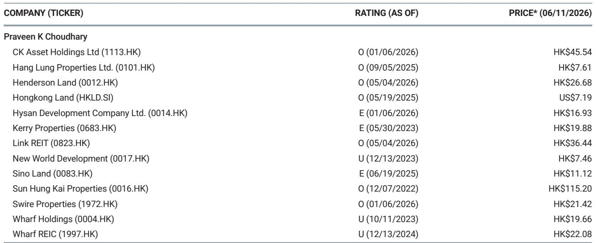
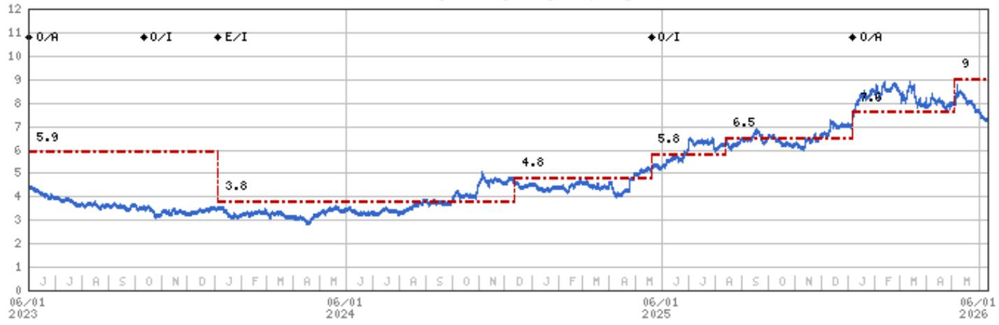
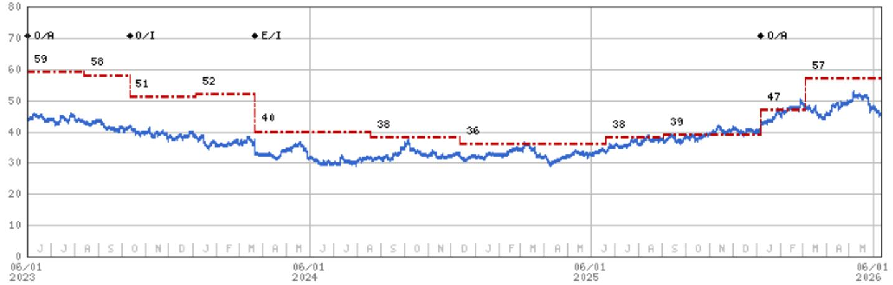

# 摩根斯坦利：香港地产市场真正被低估的不是住宅，而是写字楼的结构性拐点

这份由摩根斯坦利发布的香港地产研报，表面上是一次常规的行业专家电话会纪要。但如果我们把它放在2026年这个时间节点来读，会发现它传递了一个比“住宅销售回暖”远更重要的信号：香港甲级写字楼市场正在经历一个由供给端驱动的结构性拐点，而市场情绪对此的定价远未充分。

报告的核心价值不在于确认住宅市场“量价齐升”的已知事实，而在于揭示了两个被当前市场叙事忽略的关键变量：一是写字楼供给的未来路径已经锁定，二是学生公寓正在从边缘话题变成可规模化的新资产类别。理解这两个变量，才能理解摩根斯坦利为何在行业近期表现不佳、政策不确定性犹存的背景下，依然维持“Attractive”的行业评级。

这不仅仅是一份关于地产周期的报告。它是一份关于“资产稀缺性如何被重新定价”的底层逻辑推演。

## 1. 住宅库存的快速去化，正在改变开发商的定价权结构

报告中最直观的数据是：截至2026年第一季度，香港已完工住宅库存从2025年第一季度的28,000套峰值下降至20,000套，降幅达30%。与此同时，5月份住宅销售量同比增长44%，连续第15个月维持在5,000套以上。

这两个数据放在一起，揭示的不仅仅是需求回暖。它意味着开发商正在从“去库存压力下的价格竞争”转向“库存可控后的定价主动”。当库存从28,000套降至20,000套，市场已经从买方市场重新回到了卖方市场的边缘。

摩根斯坦利预测2026年全年住宅价格将上涨7%-10%，而截至目前的官方数据显示，年初至今已上涨约6%。如果这个预测成立，那么上半年6%的涨幅意味着下半年仍有约4%的上涨空间。但更值得关注的不是价格本身，而是这个价格走势背后的驱动因素从“政策刺激”切换到了“供需基本面”。

报告没有明确展开的是：库存下降30%的背后，有多少是主动去化，有多少是因为开发商刻意放缓了推盘节奏？这里仍需验证。但无论如何，库存水平的快速下降已经为开发商提供了更从容的定价空间，而这恰恰是过去两年市场最稀缺的东西。

## 2. 甲级写字楼正在经历一个罕见的“需求修复+供给封顶”双重窗口

如果说住宅市场是“已知的好转”，那么写字楼市场才是这份报告真正的洞察所在。

报告指出，中环和西九龙地区的甲级写字楼正在引领复苏，银行和金融业是需求的主力——2026年第一季度新租约中，银行与金融业占比高达61%。更关键的是，2026年至2029年间，全港甲级写字楼的新增供应总量仅为260万平方英尺。对于一个年净吸纳量连续保持正值的市场来说，这个供应量意味着什么？

意味着未来三年，核心区域的写字楼供给将进入一个事实上的“封顶期”。

摩根斯坦利援引戴德梁行的预测：大中环和核心中环的写字楼租金将在2026年分别上涨6%-8%。这个预测的底气就来自供给断档。当需求端的银行和金融业仍在扩张（无论是由于家族办公室涌入还是中资机构扩大布点），而供给端的新增面积几乎可以忽略不计时，租金上涨就从一个“可能”变成了“大概率”。

这里有一个容易被忽略的细节：报告中提到写字楼净吸纳量在2026年第一季度为21.7万平方英尺，仍然为正。在传统认知中，香港写字楼市场长期受困于高空置率，但这份数据表明，最坏的时刻可能已经过去。真正的问题不是需求不够，而是过去几年的供给释放过于集中。一旦供给端进入收缩期，租金弹性可能会超预期。

## 3. 学生公寓：一个被低估的“可规模化”新资产类别

报告在总结部分轻描淡写地提到了一句话：“学生公寓是一个新的机会，香港八所主要大学的学生与床位比例为3.4:1，床位数量大约相当于非本地学生数量的一半。”

这句话值得拆解。

3.4:1的学生床位比，意味着每3.4个学生只有1个床位可用。考虑到香港高校的非本地学生比例仍在上升通道中，这个缺口只会扩大而非缩小。报告给出的数据是“床位数量大约相当于非本地学生数量的一半”，这意味着至少有50%的非本地学生无法在校内住宿，必须寻求校外住房。

这是一个典型的“供需错配”机会。香港的土地供应紧张决定了大学不可能在短期内大幅扩建宿舍，而高租金和严格的租赁法规又使得传统的私人住房市场无法高效匹配学生需求。学生公寓作为一种介于“宿舍”和“普通租赁”之间的产品形态，恰好填补了这个空白。

但报告没有展开的是：学生公寓在香港面临的土地获取难度、改造成本以及收益率是否足以吸引机构资本。这里仍需验证。不过，从全球范围来看，学生公寓已经是成熟的可投资资产类别，英国、美国、澳大利亚都有大量案例。香港如果能够解决土地和规划层面的障碍，这个市场完全有可能在未来三到五年内从“边缘话题”变成“核心赛道”。

## 4. 报告尚未完全回答的关键问题：政策与利率的不确定性如何落地？

这份报告最坦诚的地方在于，它明确承认了三个不确定性来源：新的境外投资规则、股市波动以及利率路径的不确定性。报告的原话是“目前尚无实质影响”，但这恰恰是最需要警惕的表述。

“尚无实质影响”不等于“不会产生影响”。新的境外投资规则如果收紧，将直接影响内地资金流入香港住宅市场——而内地买家在过去几年一直是高端住宅市场的重要支撑。股市波动则会影响财富效应，进而抑制高端需求的释放。利率路径的不确定性更是直接决定了按揭成本和开发商的融资成本。

报告对这些变量采取了“观察但不预判”的姿态。这背后隐含的判断可能是：即便在最悲观的情景下，香港地产的估值（相对于NAV折让50%）也提供了足够的安全边际。但安全边际不等于没有下行风险。对于决策者来说，真正需要追问的是：如果利率维持高位的时间比预期更长，或者政策收紧的幅度超出预期，哪些公司的资产负债表最脆弱？哪些资产类别会最先受到冲击？

报告推荐了CK Asset、Hongkong Land和Swire Properties，理由是“可见的推盘、改善的利润率以及不断增长的股东总回报”。但这三个标的恰好都是现金流稳健、资产组合多元化的公司。这本身就是一个信号：摩根斯坦利的选择逻辑不是“博反弹”，而是“选防守”。

## 5. 观察框架：未来六个月的三个关键信号

对于希望跟踪这份报告逻辑的读者，建议关注以下三个指标，它们比房价指数更能说明市场的真实走向。

第一，写字楼净吸纳量是否能够持续为正。如果连续两个季度净吸纳量保持在20万平方英尺以上，并且主要驱动力仍然是银行和金融业，那么租金上涨的确定性将大幅提高。如果净吸纳量出现萎缩，则需要重新审视“需求修复”的假设。

第二，住宅库存是否继续下降。20,000套的库存水平已经接近历史低位，但如果开发商开始加速推盘，库存可能会重新累积。关键在于库存下降的速度是否快于市场预期。如果库存跌破15,000套，价格上行压力可能会加速。

第三，学生公寓领域是否有实质性的土地出让或项目规划。目前这个市场还处于“需求存在但供给缺失”的阶段。如果政府开始规划专门用于学生公寓的土地，或者有大型开发商宣布进入这一领域，那将是一个重要的结构性信号。如果没有任何动作，则说明这个市场目前还停留在概念阶段。

这三个信号分别对应供给端、库存端和新资产类别，覆盖了报告中最核心的三个判断。如果其中两个信号朝着积极方向发展，摩根斯坦利的“Attractive”评级就会显得更加坚实；如果三个信号都出现逆转，那么当前50%的NAV折让可能就不再是“安全边际”，而是“价值陷阱”。

---

这份报告揭示了一个有趣的悖论：市场越是关注住宅价格的短期波动，就越容易忽略写字楼供给端的结构性变化和新兴资产类别的长期价值。而恰恰是这些“非主流”的变量，可能在未来两到三年内重塑香港地产的投资逻辑。

报告中有许多数据图表和估值细节未能在此一一展开，比如不同公司的NAV折让比较、写字楼租金的历史走势以及学生公寓的全球可比案例。这些内容对于理解报告的完整推演链条至关重要。

如果您希望获取完整的研报原文、原始图表以及我们对上述未解问题的持续跟踪，欢迎来星球微信群里继续讨论。我们会在群内分享更详细的资产定价分析框架，并与关注香港市场的同行一起，持续验证这些判断的边界条件。

Personal reading notes and learning share only. Not investment advice.

