## Korea Renaissance

# Is the Household Asset Move to Equities Sustainable? Possibly

Korean household balance sheets are undergoing a major shift. Equity holdings are surging, as a long-standing bias towards cash fades. With property accumulation facing policy headwinds and the stock market set for positive catalysts, we see retail investors' participation in equities continuing.

## Key Takeaways

Household asset composition in Korea is undergoing a meaningful structural shift into risk assets, with equity holdings extending their sharp rise since 2025.  
Housing unaffordability and tight credit policy contrasted by stock-market reform measures are behind the transition to an alternative wealth-building vehicle.  
Both positive and negative economic implications are at play: wealth effect to help consumption, while high exposure to volatility risks the reverse effect.  
The tendencies of Korean retail investors toward equity investing appear to be evolving in a positive way, but leverage needs to be managed.  
We expect retail investor engagement to be sustained, but investors' expanded scope could be a double-edged sword. We raise our KOSPI target to 9,000.

## Table of Contents

Executive Summary

Our Report in Pictures

Korean Households' Asset Reallocation Has Been an Ongoing Trend

Can Strong Retail Participation in Equities Be Sustained? Leaning to Yes

Economic Implications of Household Asset Shift

Household Financial Assets – Scenario Analysis

Implications for the KOSPI and Positioning

Japan's Reform as Reference: Quicker Move amid Active Risk-Seeking in Korea

Appendix 1: Product Outline

Appendix 2: Property Market Measures

MS ASIA LIMITED+

## Kathleen Oh

Chief Korea/Taiwan Economist

Kathleen.Oh@morganstanley.com

+852 2848-7340

MS & CO. INTERNATIONAL PLC, SEOUL BRANCH+

## Joon Seok

Equity Analyst

Joon.Seok@morganstanley.com

+82 2 399-4934

## Heewon Choi

Equity Analyst

Heewon.Choi@morganstanley.com

+82 2 399-4836

## Minseo Kang

Research Associate

Minseo.Kang@morganstanley.com

+82 2 399-4816

MS INDIA COMPANY PRIVATE LIMITED+

## Shreya Singh

Economist

Shreya.Singh@morganstanley.com

+91 22 6995-1521

## Asia Summer School 2026

MS does and seeks to do business with companies covered in MS. As a result, investors should be aware that the firm may have a conflict of interest that could affect the objectivity of MS. Investors should consider MS as only a single factor in making their investment decision.

## For analyst certification and other important disclosures, refer to the Disclosure Section, located at the end of this report.

+= Analysts employed by non-U.S. affiliates are not registered with FINRA, may not be associated persons of the member and may not be subject to FINRA restrictions on communications with a subject company, public appearances and trading securities held by a research analyst account.

## Executive Summary

## Korean household assets have grown 91% since 2000 – but equities have not been prominent in the mix

Korea has shown the fastest expansion of household assets among major economies over the past quarter-century. However, the distinctive feature of Korea's wealth accumulation has been that the rise in real assets contributed the most to this surge, in contrast to the growth seen in DMs, which has been led by financial assets. With a heavy bias toward real estate and nearly half of financial assets held in cash and deposits, we see significant room for a rotation toward equity holdings this time.

## Korean households have recently shown a major shift in asset allocation — the proportion of equities has risen with a stronger bourse

After decades of accumulating wealth primarily through real estate, with a persistent bias toward cash and deposits, household equity holdings surged 48%Y in 2025, against a prior decade-long average increase of just 7.4%. This marks a striking inflection in Korean households' appetite for risk assets. We view this as directionally positive for long-term financial asset management, coupled with potential near-term risk factors.

## The tendencies of Korean retail investors toward equity investing appear to be evolving in a positive way

In our deep analysis published in July 2020 (link), we found retail investors to be seekers of volatility and chasers of themes with rather short-term investment horizons. However, we believe that overall retail investors have become smarter thanks to:

1. Improved access to higher quality information.  
2. AI providing a more level playing field through improved information access and analysis.  
3. Accumulated experience investing overseas.

## Critically, the equity wealth effect is likely more amplified and now more structurally embedded than in prior cycles

We believe the positive spillover from equity wealth gains to the real economy is likely to be both wider in breadth and more intense in magnitude compared to the pre-2020 period, given:

- the number of retail investors has increased to 14.5mn, 50% of total adult population, vs. 6.2mn, 21% of adult population, in 2019;  
- a notable jump in the size of equity balance at W662tn in 2025, up $58\%$ Y from W419tn in 2024; this is a 13.8x increase from W17.6tn in 2019; and  
- younger investor groups in their 20s and 30s have entered the investor base, who likely to have a high level of propensity to consume.

## We identify additional positive factors that are needed to sustain retail investor engagement over the medium/long term

- Enhanced confidence in local markets amid structural stories leading to higher sustainable ROE levels for the KOSPI.  
- Extended conditions of copious market liquidity.  
- Continued capital markets reform improving corporate governance and investor payouts.  
- Tax incentives including dividend tax reform and upgrades to the ISA program beginning June 2026.

Simultaneously, the government's real estate policy – which actively disincentivizes traditional real estate acquisition – is expected to persist for the next 3-4 years, providing a structural tailwind for the rotation into equities. Newfound FOMO (fear of missing out) for stocks instead of only real estate should lead to sustained participation by retail investors in the equity market.

## We're more bullish on the KOSPI

Raising our 12-month target to 9,000 from 8,500: Retail stickiness should provide support and also continue to act as ballast, assuming that the intertwining of super-cycles with reform remains intact.

Our bull case is raised to 10,500 from 10,000: In this scenario, AI diffusion charges forward and geopolitical risks normalize.

Our bear case is raised to 6,500 from 6,000: The key risk is extended geopolitical uncertainties with oil supply and prices becoming a drag.

## How to be positioned on the money move and wealth effect story?

- We believe retail investors should stick to the winners in Tech and Industrials...  
- ...but we see room for rising interest in Healthcare, which has tended to be an area of retail interest, yet stock prices have not moved despite improving fundamentals.  
- We also see department stores having more legs as a key beneficiary of the positive wealth effect.  
- We continue to like the securities business...  
- ...and also banks leveraged to both securities and credit card businesses – prefer SFG and KFG.

## Near-term risks exist around a new and acute balance sheet vulnerability to equity markets

Korean households are entering a period of elevated risk asset exposure. We flag:

1. Record-high equity holdings that could exceed 80% of GDP by 2027;  
2. A pre-existing household debt burden that leaves little room to absorb shocks; and  
3. A new BoK rate hiking cycle, which we currently expect to begin in July 2026 and run through 2027, implying a sustained period of tighter financial conditions.

Market volatility of a meaningful magnitude could trigger a consumption slowdown and amplified debt service stress across the household sector.

## We see Korea's transition as faster and larger in scale than Japan's retail wealth shift into equities

Both Japan and Korea are experiencing a structural, policy-driven shift in household asset allocation – away from cash and deposits (in Japan's case) and real estate and cash (in Korea's case) – toward equity investments. We observe a more proactive and higher-risk appetite among Korean investors vs. a gradual, albeit strong, increase in Japan. This is reflected in the rapid expansion in financial assets in the past decade in Korea – up 94% vs. +30% in Japan.

## Our Report in Pictures

Exhibit 1: Historically, Korean households have shown a heavy bias toward real assets over financial assets – marginal asset growth led mainly by real assets  
Korean households annual change in asset composition  
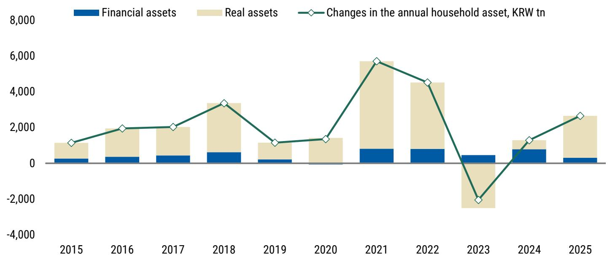

bar-line hybrid chart

| Year | Financial assets | Real assets | Changes in the annual household asset, KRW tn |
|------|------------------|-------------|-----------------------------------------------|
| 2015 | ~200             | ~1000       | ~1000                                         |
| 2016 | ~300             | ~1500       | ~1800                                         |
| 2017 | ~400             | ~1500       | ~1900                                         |
| 2018 | ~600             | ~2500       | ~3300                                         |
| 2019 | ~200             | ~800        | ~1100                                         |
| 2020 | ~300             | ~1300       | ~1300                                         |
| 2021 | ~800             | ~5500       | ~5700                                         |
| 2022 | ~800             | ~4500       | ~4400                                         |
| 2023 | ~400             | ~-3000      | ~-2200                                        |
| 2024 | ~700             | ~1200       | ~1300                                         |
| 2025 | ~300             | ~2500       | ~2600                                         |

Source: Korea Statistics, MS

Exhibit 2: Real estate assets across main and other residences composed 70% of total household assets while the size of total assets nearly doubled in the past decade  
Household asset breakdown by sub-category (2025)  
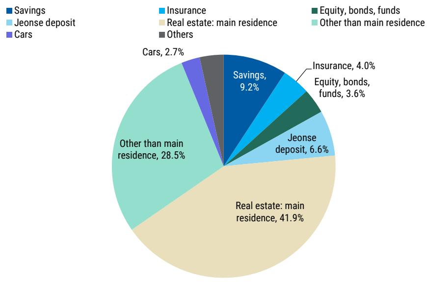

pie chart

| Category | Percentage (%) |
| :--- | :--- |
| Savings | 9.2 |
| Insurance | 4.0 |
| Equity, bonds, funds | 3.6 |
| Real estate: main residence | 41.9 |
| Other than main residence | 28.5 |
| Jeons deposit | 6.6 |
| Cars | 2.7 |
| Others | (unlabeled segment) |

Source: BoK, MS

Exhibit 3: Korean household assets nearly doubled during 2000-24; fastest among DMs  
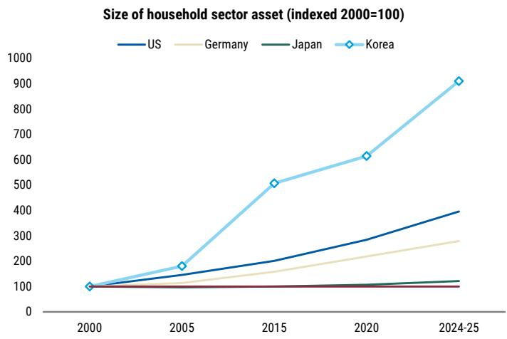

line chart

| Year   | US   | Germany | Japan | Korea |
| ------ | ---- | ------- | ----- | ----- |
| 2000   | 100  | 100     | 100   | 100   |
| 2005   | 150  | 120     | 100   | 180   |
| 2015   | 200  | 150     | 100   | 500   |
| 2020   | 280  | 220     | 100   | 620   |
| 2024-25| 400  | 280     | 120   | 920   |

Source: BoK, ESRI, Bundesbank, FRED, MS

Exhibit 5: The number of retail investors increased to 50% of total adult population vs. 21% in 2019  
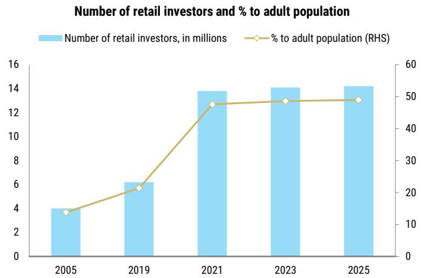

bar-line hybrid

Number of retail investors and % to adult population
| Year | Number of retail investors, in millions | % to adult population (RHS) |
| :--- | :--- | :--- |
| 2005 | 4 | 15 |
| 2019 | 6 | 23 |
| 2021 | 13.8 | 48 |
| 2023 | 14.1 | 49 |
| 2025 | 14.2 | 49 |

Source: Korea Securities Depository, MS

Exhibit 7: Historically, a 1% gain in the KOSPI implied a boost to consumption growth of approximately 0.03-0.035%p  
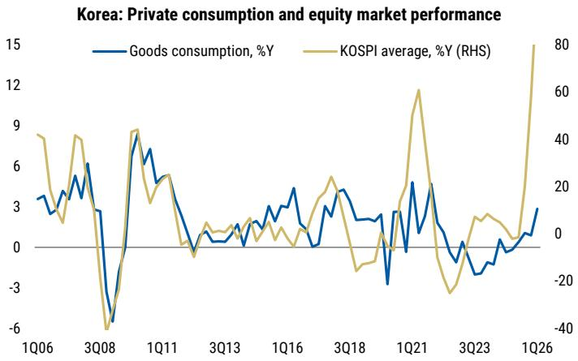

line chart

| Quarter | Goods consumption, %Y | KOSPI average, %Y (RHS) |
| ------- | --------------------- | ------------------------ |
| 1Q06    | ~3.5                  | ~80                      |
| 3Q08    | ~-6.0                 | ~-40                     |
| 1Q11    | ~9.0                  | ~60                      |
| 3Q13    | ~1.0                  | ~20                      |
| 1Q16    | ~3.0                  | ~20                      |
| 3Q18    | ~2.0                  | ~60                      |
| 1Q21    | ~5.0                  | ~120                     |
| 3Q23    | ~-2.0                 | ~-20                     |
| 1Q26    | ~3.0                  | ~80                      |

Source: Bloomberg, BoK, MS

Exhibit 4: Korea registered a rapid expansion in financial assets of +94% vs. 31% in Japan during 2015-25  
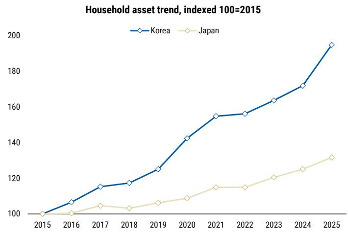

line chart

| Year | Korea | Japan |
|------|-------|-------|
| 2015 | 100   | 100   |
| 2016 | 108   | 100   |
| 2017 | 116   | 104   |
| 2018 | 118   | 103   |
| 2019 | 126   | 106   |
| 2020 | 143   | 109   |
| 2021 | 155   | 115   |
| 2022 | 156   | 115   |
| 2023 | 164   | 121   |
| 2024 | 172   | 126   |
| 2025 | 196   | 133   |

Source: BoJ, BoK, MS

Exhibit 6: 43% of retail investors are aged 40s or below, groups with a higher marginal propensity to consume  
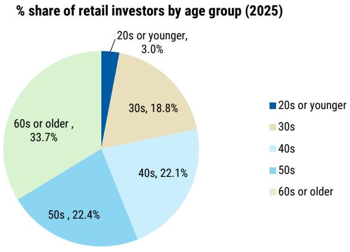

pie chart

% share of retail investors by age group (2025)
| Age Group | Share (%) |
|---|---|
| 20s or younger | 3.0 |
| 30s | 18.8 |
| 40s | 22.1 |
| 50s | 22.4 |
| 60s or older | 33.7 |

Source: Korea Securities Depository, MS

Exhibit 8: Along with goods consumption, services has shown a higher response to KOSPI performance in recent quarters  
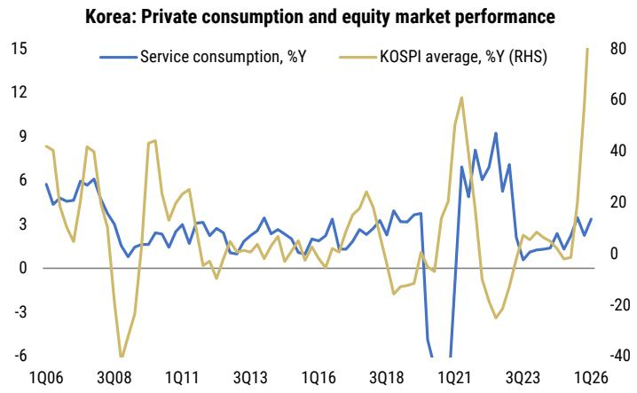

line chart

| Quarter | Service consumption, %Y | KOSPI average, %Y (RHS) |
| ------- | ------------------------ | ------------------------ |
| 1Q06    | ~5.5                     | ~80                      |
| 3Q08    | ~1.5                     | ~-60                     |
| 1Q11    | ~2.5                     | ~90                      |
| 3Q13    | ~2.0                     | ~-10                     |
| 1Q16    | ~2.5                     | ~-5                      |
| 3Q18    | ~3.0                     | ~60                      |
| 1Q21    | ~-6.0                    | ~-20                     |
| 3Q23    | ~9.0                     | ~-30                     |
| 1Q26    | ~3.0                     | ~80                      |

Source: Bloomberg, BoK, MS

Exhibit 9: KOSPI: Annualized volatility and share of retail trade value – retail investors still seek volatility and chase themes, but compared to previous cycles, they have better access to quality information, as well as experience in overseas investing  
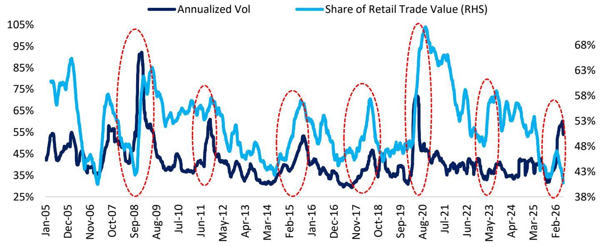

line chart

| Date    | Annualized Vol | Share of Retail Trade Value (RHS) |
|---------|----------------|-----------------------------------|
| Jan-05  | ~45%           | ~75%                              |
| Dec-05  | ~50%           | ~85%                              |
| Nov-06  | ~35%           | ~45%                              |
| Oct-07  | ~55%           | ~70%                              |
| Sep-08  | ~90%           | ~35%                              |
| Aug-09  | ~55%           | ~80%                              |
| Jul-10  | ~40%           | ~60%                              |
| Jun-11  | ~60%           | ~70%                              |
| May-12  | ~45%           | ~65%                              |
| Apr-13  | ~35%           | ~55%                              |
| Mar-14  | ~30%           | ~45%                              |
| Feb-15  | ~45%           | ~65%                              |
| Jan-16  | ~40%           | ~60%                              |
| Dec-16  | ~35%           | ~50%                              |
| Nov-17  | ~45%           | ~65%                              |
| Oct-18  | ~40%           | ~55%                              |
| Sep-19  | ~30%           | ~45%                              |
| Aug-20  | ~70%           | ~100%                             |
| Jul-21  | ~45%           | ~85%                              |
| Jun-22  | ~40%           | ~70%                              |
| May-23  | ~35%           | ~65%                              |
| Apr-24  | ~35%           | ~60%                              |
| Mar-25  | ~30%           | ~55%                              |
| Feb-26  | ~55%           | ~45%                              |

Source: WiseFN, MS

Exhibit 10: Compared to the 2020-21 cycle, we find that retail net buying has been less concentrated in the current up-cycle. We believe retail investors have become more controlled and tactical in approaching equity investment  
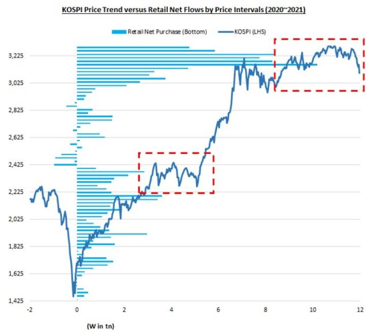

line chart

| Price Interval (W in tn) | Retail Net Purchase (Bottom) | KOSPI (LHS) |
| ------------------------ | ---------------------------- | ----------- |
| -2                       | ~3,225                       | ~3,225      |
| 0                        | ~1,425                       | ~1,425      |
| 2                        | ~2,425                       | ~2,425      |
| 4                        | ~3,025                       | ~3,025      |
| 6                        | ~3,225                       | ~3,225      |
| 8                        | ~3,225                       | ~3,225      |
| 10                       | ~3,225                       | ~3,225      |
| 12                       | ~3,225                       | ~3,225      |

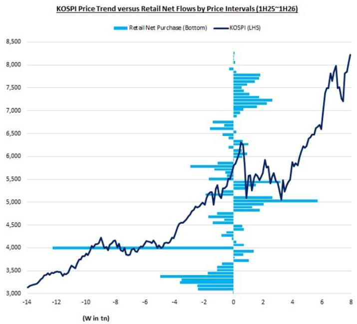

line chart

| Price Interval (1H25~1H26) | Retail Net Purchase (Bottom) | KOSPI (LHS) |
| -------------------------- | ---------------------------- | ----------- |
| -14                        | 3,000                        | 3,000       |
| -12                        | 3,500                        | 3,500       |
| -10                        | 3,750                        | 3,750       |
| -8                         | 4,000                        | 4,000       |
| -6                         | 4,250                        | 4,250       |
| -4                         | 4,500                        | 4,500       |
| -2                         | 4,750                        | 4,750       |
| 0                          | 5,000                        | 5,000       |
| 2                          | 5,250                        | 5,250       |
| 4                          | 5,500                        | 5,500       |
| 6                          | 5,750                        | 5,750       |
| 8                          | 6,000                        | 6,000       |

Source: WiseFN, MS

Exhibit 11: For all of our scenarios, we expect equity holdings' proportion of household financial assets to be on an upward trajectory – but much steeper for the bull case. Strong market fundamentals, copious liquidity, and the reform push should drive more retail money to equities  
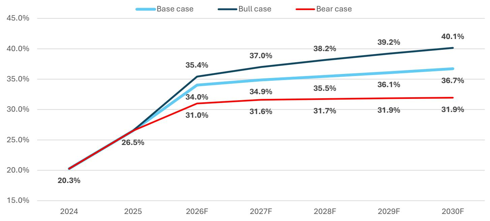

line chart

| Year | Base case (%) | Bull case (%) | Bear case (%) |
| :--- | :--- | :--- | :--- |
| 2024 | 20.3 | 20.3 | 20.3 |
| 2025 | 26.5 | 26.5 | 26.5 |
| 2026F | 34.0 | 35.4 | 31.0 |
| 2027F | 34.9 | 37.0 | 31.6 |
| 2028F | 35.5 | 38.2 | 31.7 |
| 2029F | 36.1 | 39.2 | 31.9 |
| 2030F | 36.7 | 40.1 | 31.9 |

Source: MS; (F) estimates

Exhibit 12: We raise our KOSPI target to 9,000 (from 8,500) with our new bull case being 10,500 and our bear case set at 6,500. We set our three- to six-month KOSPI trading band at 7,000-10,000.  
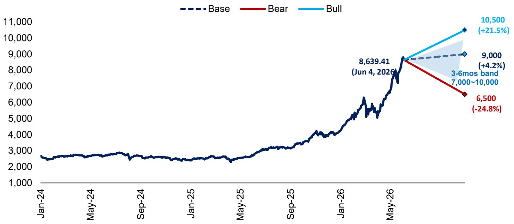

line chart

| Date       | Base    | Bear    | Bull    |
| ---------- | ------- | ------- | ------- |
| Jun 4, 2026 | 8,639.41 | -       | -       |
| 3-6mos band | -       | -       | 7,000~10,000 |
| -          | -       | -       | 9,000   |
| -          | -       | -       | 10,500  |
| -          | -       | -       | +21.5%  |
| -          | -       | -       | -21.5%  |
| -          | -       | -       | -24.8%  |

Source: MS Estimates.

# Korean Households' Asset Reallocation Has Been an Ongoing Trend

## Household asset growth has been fastest in Korea vs. DMs

Korean households have recorded the fastest growth in wealth vs. major advanced economies: In the past decade, the Korean household sector's wealth took a major jump up. In nominal terms, it nearly doubled to W15,455tn in 2024 (approximately US\$11tn) from W8,880tn in 2015. The sheer size has increased 80% during this time, with a CAGR of 6.3%, according to the BoK national balance sheet.

Compared to other economies, Korea's wealth accumulation stands out. Since 2000, households in the major economies have shown modest growth in their assets. In local currency terms, Korea's assets surged 91% – vs. 40\$ for the US, 28% for Germany, and 12% for Japan. In USD terms too, Korea's household asset growth jumped the fastest: 83% vs. <40% seen in rest of the major economies. The Korean equity market outperformed globally in 2025, with an outsized return of 75.63% for the KOSPI. Thus, we expect Korean households' total asset growth to accelerate this year vs. other markets.

## What drove this surge in household wealth, however, differs from other markets'

drivers: In terms of composition, Koreans historically have shown a bias to real assets vs. other types, with larger ownership in the housing market. For decades, households were heavily biased towards land, houses, or buildings. Over this period, the increase in real assets such as land and properties contributed 66% while financial assets (including cash, deposits, and financial products) contributed 34%. In the case of the US, roughly the opposite is true – 70% of household assets sit in financial assets.

In 2025, Koreans held a majority – over 75% – of their wealth in real assets. According to the BoK survey on household financial conditions, their average assets reached W566.7mn (approximately US\$400k) with financial assets composing 24.2% vs. real assets 75.8%. This leaves their equity holdings at just 9% of total assets. Not only that, within financial assets, cash and deposits consistently composed the largest share: 46%, vs. investments (25%) and pension and insurance (30%). This captures the conventional asset composition with a heavy bias toward assets perceived as "safer" over risk assets.

Exhibit 13: Household assets nearly doubled in the past decade  
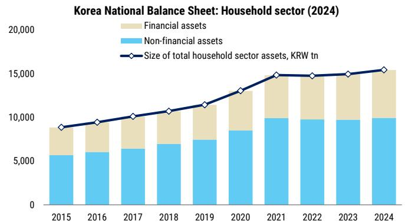

stacked bar chart

Korea National Balance Sheet: Household sector (2024)
| Year | Financial assets (in HKD) | Non-financial assets (in HKD) | Size of total household sector assets, KRW tn (in HKD) |
| :--- | :--- | :--- | :--- |
| 2015 | 4800 | 5600 | 9000 |
| 2016 | 4900 | 5800 | 9500 |
| 2017 | 5100 | 6300 | 10000 |
| 2018 | 5300 | 6900 | 10500 |
| 2019 | 5500 | 7400 | 11200 |
| 2020 | 6100 | 8400 | 13200 |
| 2021 | 6500 | 9800 | 15100 |
| 2022 | 6400 | 9700 | 14900 |
| 2023 | 6500 | 9700 | 15100 |
| 2024 | 6600 | 9800 | 15500 |

Source: BoK, MS

Exhibit 14: The growth was the fastest among major markets  
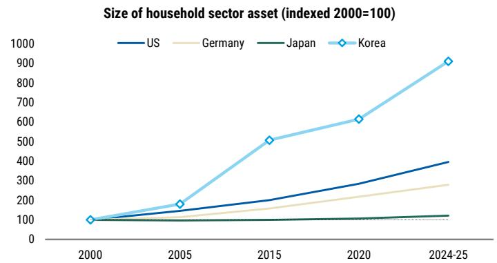

line chart

| Year   | US   | Germany | Japan | Korea |
| ------ | ---- | ------- | ----- | ----- |
| 2000   | 100  | 100     | 100   | 100   |
| 2005   | 150  | 120     | 100   | 180   |
| 2015   | 220  | 160     | 100   | 520   |
| 2020   | 300  | 220     | 120   | 620   |
| 2024-25| 400  | 280     | 130   | 920   |

Source: BoK, ESRI, Bundesbank, FRED, MS

Exhibit 15:  
Historically, most of the marginal asset growth has been led by growth in real assets  
Korean households annual change in asset composition  
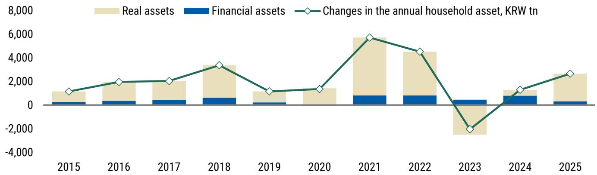

bar-line hybrid chart

| Year | Real assets | Financial assets | Changes in the annual household asset, KRW tn |
|------|-------------|------------------|-----------------------------------------------|
| 2015 | ~1,000      | ~100             | ~1,000                                        |
| 2016 | ~1,500      | ~100             | ~1,500                                        |
| 2017 | ~1,500      | ~100             | ~1,500                                        |
| 2018 | ~2,500      | ~100             | ~2,500                                        |
| 2019 | ~1,000      | ~50              | ~1,000                                        |
| 2020 | ~1,500      | ~50              | ~1,500                                        |
| 2021 | ~5,500      | ~1,00            | ~5,500                                        |
| 2022 | ~4,500      | ~1,00            | ~4,500                                        |
| 2023 | ~-3,000     | ~50              | ~-3,000                                       |
| 2024 | ~1,500      | ~1,00            | ~1,500                                        |
| 2025 | ~2,500      | ~1,00            | ~2,500                                        |

Source: Korea Statistics (2025 Household Financial Conditions Survey), MS

## Heavy bias toward real assets coming from lack of retirement safety net

One important aspect of the Korean household balance sheet is the pronounced bias toward real assets relative to an low share in retirement savings: While the share of real assets has remained consistently above 70% of total household assets, it is not merely primary residences driving this concentration – the share of additional (non-primary) residential property ownership in Korea has also exceeded trends observed in peer economies. Meanwhile, Korea's holdings of pension and insurance remain comparatively low. Historically, insurance and pension assets have stood at around 9-12% of total household assets (including both financial and non-financial assets), a stark contrast to 24.7% in Japan, 34% in the US, and 29.6% in Germany.

Exhibit 16: Real estate assets across main and other residences composed 67% of total household assets back in 2015  
Household asset breakdown by sub-category (2015)  
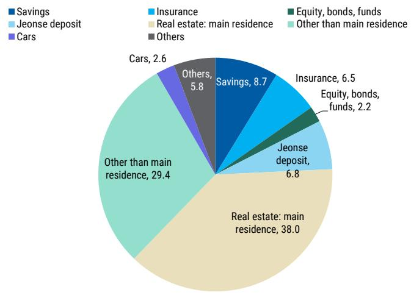

pie chart

| Category | Value |
|---|---|
| Savings | 8.7 |
| Insurance | 6.5 |
| Equity, bonds, funds | 2.2 |
| Jeons deposit | 6.8 |
| Real estate: main residence | 38.0 |
| Other than main residence | 29.4 |
| Cars | 2.6 |
| Others | 5.8 |

Source: BoK, MS

Exhibit 17: The share rose to 70% while the size of total assets nearly doubled in the past decade through 2025  
Household asset breakdown by sub-category (2025)  
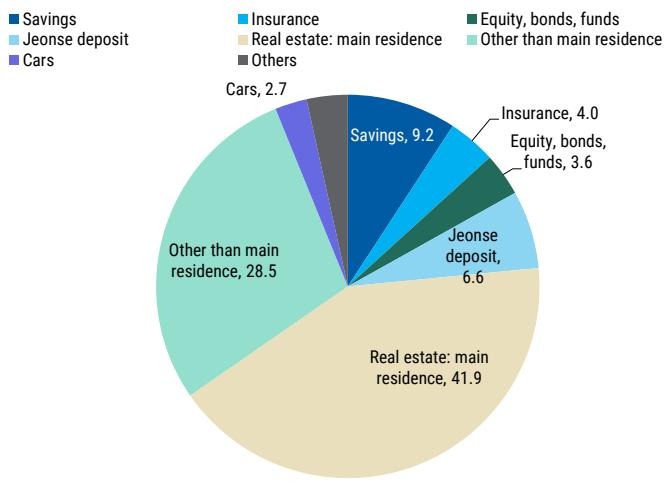

pie chart

| Category | Value |
|---|---|
| Savings | 9.2 |
| Insurance | 4.0 |
| Equity, bonds, funds | 3.6 |
| Jeonse deposit | 6.6 |
| Real estate: main residence | 41.9 |
| Other than main residence | 28.5 |
| Cars | 2.7 |
| Leonse deposit | 0.0 |
| Cars | 2.7 |

Source: BoK, MS

The US presents a particularly instructive contrast: While equities dominate the broader US household asset mix, retirement assets also constitute a substantial share of the balance sheet, with total retirement assets reaching US\$49.1tn, or roughly 34% of all financial assets as of end-2025. This dual concentration in both equities and retirement vehicles reflects a far more diversified financial asset mix within US households, and points to a considerably more solid structural foundation for post-retirement income security. In Korea, by contrast, the dominance of real assets, at 75.8% of total household assets crowds out the accumulation of diversified financial assets, leaving households with limited funded retirement buffers.

What this pattern reveals is that Korean households have concentrated their wealth accumulation not merely around the purchase of a primary residence, but more deliberately around real assets as investable channels – vehicles through which to generate returns or sustain cash flow, particularly in anticipation of retirement. The relatively early statutory retirement age of 60 in Korea compared to 67 and the US, Germany, Australia and 65 in Japan combined with a structurally less developed post-retirement income system have pushed many households to look toward monthly rental income (monthly rent or jeonse yield) as a primary source of living, which in turn has further reinforced the structural concentration in real assets.

## Real assets a de facto retirement savings instrument

In this sense, real estate in Korea has functioned as a de facto retirement savings instrument. It supplemented the income cliff and substituted for a funded pension system. As a result weak institutional retirement infrastructure ended up encouraging real asset accumulation, which in turn reduced the incentive to build diversified financial portfolios, leaving households with a balance sheet that is concentrated in real assets. This has significantly exposed household sector activities, including consumption, in the real economy to housing price cycles, while being illiquid in nature. In the meantime, rising property prices have widened the asset gap between income groups in the household sector resulting in a wider income inequality gap. For the wealthiest Koreans (top 1%), real estate comprised an even larger share (82.9%) of their wealth in 2025.

Exhibit 18: Korean households' real asset share exceeded trend compared to other economies  
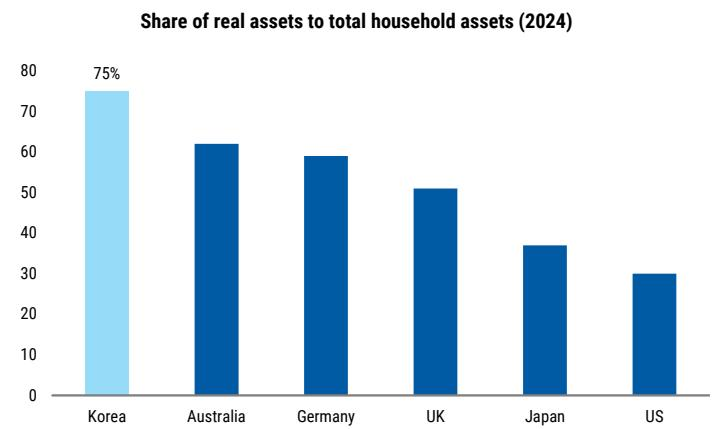

bar chart

Share of real assets to total household assets (2024)
| Country | Share of real assets to total household assets (%) |
| :--- | :--- |
| Korea | 75 |
| Australia | 62 |
| Germany | 59 |
| UK | 51 |
| Japan | 37 |
| US | 30 |

Source: BoK, ESRI, Bundesbank, FRED, MS

Exhibit 19: Real assets likely substituted for the low-funded pension and post-retirement income  
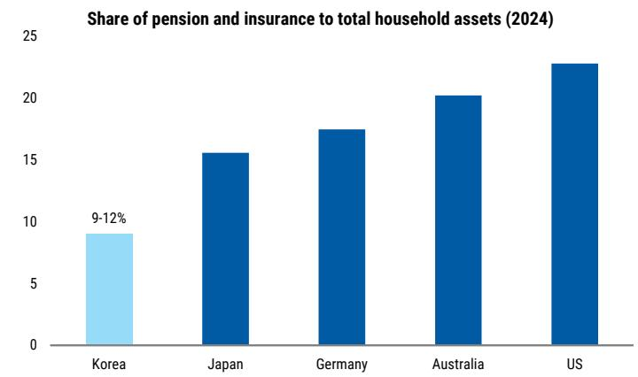

bar chart

Share of pension and insurance to total household assets (2024)
| Country | Share of pension and insurance to total household assets (2024) |
| :--- | :--- |
| Korea | 9-12% |
| Japan | 15.6 |
| Germany | 17.5 |
| Australia | 20.2 |
| US | 23.0 |

Source: BoK, ESRI, Bundesbank, FRED, MS

## Wealthier households are shifting faster from their concentrated holdings of real assets

One particular feature – this pronounced tilt toward real assets was not merely a broad structural feature of Korean household balance sheets...

...it was systematically more acute among higher-income cohorts: Disaggregating the Ministry of Data and Statistic's 2025 Survey of Household Finances and Living Conditions by income quintile reveals a striking feature in real asset concentration. The top 20% income group held 76.7% of their total assets in real assets, compared to just 26.6% for the bottom 20%, while middle-income households (the third quintile) held approximately 62% in real assets vs. 38% in financial assets.

Equally telling is the composition within real asset holdings across income groups: As household income rises, higher income groups clearly demonstrated a faster rise in the share of real estate held for investment purposes, rather than as a primary residence, relative to lower-income groups. Among the top 20%, investment real estate accounted for 37.3% of total assets, a share that narrows to roughly 20% for the top 40% and falls below 15% for mid-to lower-income households. This pattern is reinforced by data on the top 1% of Korean households, while primary residences accounted for only 25% as opposed to the pattern observed among lower-income groups, where the family home remains the dominant real asset.

Yet this long-entrenched bias toward real assets among wealthier households has shown signs of rotation in recent years: The pace of that rotation toward equity investment has been fastest at the top of the income distribution. Critically, the gains from the surge of equities in total financial assets in 2025 have been highly concentrated among wealthier households. The top income quintile derived 15.2% of total household income from returns on assets in 2025, compared to an all-household average of 8.3%. The income gap from asset returns widened considerably in 2025, with the share of return on assets in total household income climbing to 8.3%, up from below 6% previously, while labor and business income shares declined. This concentration is further underscored by the fact that the top 20% of households hold approximately 87% of all equities.

Exhibit 20: Wealthier households showed a stronger preference to holding real estate: 77% vs. medium-income of 66.8% vs. 26.5% for bottom income households

Household asset breakdown by income groups  
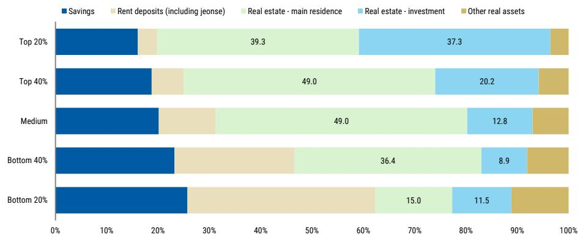

stacked bar chart

| Category | Savings (%) | Rent deposits (including jeonse) (%) | Real estate - main residence (%) | Real estate - investment (%) | Other real assets (%) |
| :--- | :--- | :--- | :--- | :--- | :--- |
| Top 20% | 16.0 | 4.0 | 39.3 | 37.3 | 3.0 |
| Top 40% | 18.0 | 5.0 | 49.0 | 20.2 | 4.0 |
| Medium | 19.0 | 7.0 | 49.0 | 12.8 | 5.0 |
| Bottom 40% | 23.0 | 15.0 | 36.4 | 8.9 | 5.0 |
| Bottom 20% | 26.0 | 22.0 | 15.0 | 11.5 | 10.0 |

Source: BoK, MS

## Surge in financial asset accumulation

## The overall trend hints that there could be room for a shift towards equity assets:

Since hitting the peak in 2024, the share of real assets has turned downward, to 75% from 78% in 2022. Meanwhile, the share of financial assets has climbed from the bottom of 22% to over 24% in 2024. During this period, households across income groups have seen a gain of around 12% in financial assets; the top 20% income quintile showed the most visible rise at 20%.

## In the past decade, the marginal growth in total assets came mostly from real assets:

Except for the year 2023, when the housing market faced a downturn, gains in household assets came mainly from the acquisition of land and properties. Since 2015 through 2025, the marginal increase in financial assets came to 28% of total gain in household assets. This long-term pattern in favoring real assets over financial assets indicates the pattern of not just purchasing a main residence but using properties as investment assets, acquiring second and other residences over financial products.

Hence, a rotation out of real assets into financial assets may not be as likely vs. rotation from safe financial assets in cash, deposits, and insurance and pension products.

## What came as a surprise is the trend change in financial assets over the past year:

During 2024-25, Korean households showed a significant jump in financial assets, with risk assets accounting for a dominant addition to total assets. The marginal annual increase of equities assets came to W535tn, to a total of W1,644tn. This far exceeded the combined increase in equity assets of W474tn during the previous decade (2015-24). It also marked the first year ever that the contribution from equity assets exceeded the rise in cash holdings within financial assets.

This led the share of equity holdings to reach the largest share within financial assets. It jumped to 26% in 2025 from 20% in 2024. At the same time, holdings of cash came down to 43.2% from 46.6%; pension and insurance holdings also came down to 26% from 28% during the same time. This is the largest incremental drop in the share of these two safe assets in a decade as opposed to the big 6ppt jump in equity assets.

Exhibit 21: Households showed the largest increase in equities holdings in 2025  
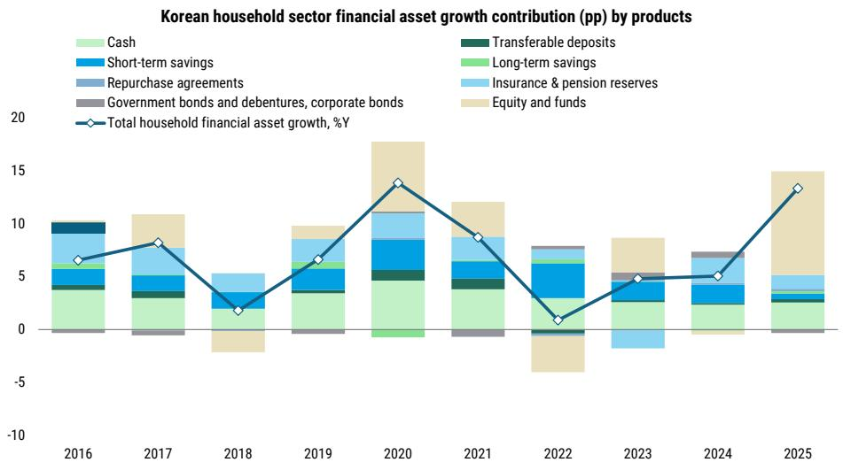

bar-line hybrid

Korean household sector financial asset growth contribution (pp) by products
| Year | Cash | Short-term savings | Long-term savings | Repurchase agreements | Government bonds and debentures, corporate bonds | Government bonds and debentures, corporate bonds | Equity and funds | Transferable deposits | Total household financial asset growth, %Y |
| :--- | :--- | :--- | :--- | :--- | :--- | :--- | :--- | :--- | :--- |
| 2016 | 3.5 | 1.5 | 0.5 | 0.5 | 0.5 | 0.5 | 0.5 | 1.0 | 6.5 |
| 2017 | 3.0 | 1.5 | 0.5 | 0.5 | 0.5 | 0.5 | 1.0 | 1.0 | 8.0 |
| 2018 | 3.0 | 1.5 | 0.5 | 0.5 | 0.5 | 0.5 | -2.0 | 0.5 | 1.5 |
| 2019 | 3.0 | 2.0 | 0.5 | 0.5 | 0.5 | 0.5 | 1.0 | 1.0 | 6.5 |
| 2020 | 4.0 | 3.0 | 1.0 | 1.0 | 1.0 | 1.0 | 17.0 | 1.0 | 14.0 |
| 2021 | 3.5 | 2.0 | 1.0 | 1.0 | 1.0 | 1.0 | 12.0 | 1.0 | 9.0 |
| 2022 | -0.5 | -0.5 | -0.5 | -0.5 | -0.5 | -0.5 | -4.0 | -0.5 | 1.0 |
| 2023 | 2.5 | 1.5 | 0.5 | -2.5 | -2.5 | -2.5 | 8.5 | 1.0 | 4.5 |
| 2024 | 2.5 | 1.5 | 1.0 | -1.5 | -1.5 | -1.5 | -1.5 | -1.5 | 4.5 |
| 2025 | 2.5 | 1.5 | 1.0 | -1.5 | -1.5 | -1.5 | 14.5 | -1.5 | 13.5 |
The chart displays stacked bars for each asset category and includes a line graph representing the total household financial asset growth over time.

Source: BoK, MS

## Ample room for asset reallocation into equities

Korean households' liquidity moving to equity investments: Retail products – including cash management accounts, money market funds, and money market deposit accounts – have shown an increase in growth, especially from 2022. They are at an historically high level, which could signify an initial stage of a shift in household liquidity to financial markets. Moreover, there has been a significant rise in customers' deposits and other short-term stand-by products which can quickly turn into liquidity for financial markets.

There is increasing evidence of Korean household liquidity moving toward equity-linked and short-term financial market instruments. Retail products including money market funds (MMF), money market deposit accounts (MMDA), and other short-term liquid vehicles have shown notable growth, particularly from 2022 onward.

The BoK's flow of funds data showed that MMDA balances have exhibited significant monthly swings. Monthly MMF trends show that MMF average balances reached historically elevated levels through 2025-26, with YoY changes exceeding 50-70%. In 1Q26, net assets of money market funds increased W41.2tn to W186.3tn. recording the largest quarterly increase since 2009.

Customer deposits and other short-term standby products have also shown a significant rise. Core deposits grew substantially through 2024, with transferable deposits showing large positive swings in multiple months.

This accumulation of liquid, near-market assets can be interpreted as an initial stage of household liquidity positioning for eventual deployment into financial markets.

Exhibit 22: Korean households made a big shift toward equities and investment funds from safe financial assets – cash, insurance, and pensions – in 2025

<table><tr><td colspan="7">Korean households and non-profit organization fund of flows</td></tr><tr><td></td><td>2020</td><td>2021</td><td>2022</td><td>2023</td><td>2024</td><td>2025</td></tr><tr><td>Total household asset, KRW tn</td><td>4,539.4</td><td>4,924.5</td><td>4,984.9</td><td>5,233.5</td><td>5,468.9</td><td>6,201.9</td></tr><tr><td>Cash and deposits</td><td>1,968.4</td><td>2,139.1</td><td>2,290.5</td><td>2,424.6</td><td>2,533.2</td><td>2,676.5</td></tr><tr><td>Insurance and pension</td><td>1,399.2</td><td>1,498.3</td><td>1,545.4</td><td>1,457.6</td><td>1,579.0</td><td>1,650.3</td></tr><tr><td>Equities and investment funds</td><td>989.2</td><td>1,133.2</td><td>982.3</td><td>1,141.4</td><td>1,109.3</td><td>1,644.3</td></tr><tr><td>Bonds</td><td>152.5</td><td>114.1</td><td>124.6</td><td>168.4</td><td>199.3</td><td>182.1</td></tr><tr><td>Others</td><td>30.1</td><td>39.8</td><td>42.0</td><td>41.6</td><td>48.1</td><td>48.7</td></tr><tr><td>% to total household asset</td><td>2020</td><td>2021</td><td>2022</td><td>2023</td><td>2024</td><td>2025</td></tr><tr><td>Cash and deposits</td><td>43.4</td><td>43.4</td><td>45.9</td><td>46.3</td><td>46.3</td><td>43.2</td></tr><tr><td>Insurance and pension</td><td>30.8</td><td>30.4</td><td>31.0</td><td>27.9</td><td>28.9</td><td>26.6</td></tr><tr><td>Equities and investment funds</td><td>21.8</td><td>23.0</td><td>19.7</td><td>21.8</td><td>20.3</td><td>26.5</td></tr><tr><td>Domestic equities</td><td>18.4</td><td>19.2</td><td>16.5</td><td>18.1</td><td>15.2</td><td>19.8</td></tr><tr><td>Foreign equities</td><td>0.9</td><td>1.6</td><td>1.3</td><td>1.7</td><td>2.7</td><td>3.4</td></tr><tr><td>Fund products</td><td>2.4</td><td>2.3</td><td>1.9</td><td>2.0</td><td>2.4</td><td>3.3</td></tr><tr><td>Bonds</td><td>3.4</td><td>2.3</td><td>2.5</td><td>3.2</td><td>3.6</td><td>2.9</td></tr><tr><td>Others</td><td>0.7</td><td>0.8</td><td>0.8</td><td>0.8</td><td>0.9</td><td>0.8</td></tr></table>

Source: BoK fund of flows data (2025), MS

# Can Strong Retail Participation in Equities Be Sustained?

# Leaning to Yes

## Some similarities to 2020\~2021 cycle; fundamentals were weaker and retail investors less mature during that period

There have been several cases of KOSPI bull markets driven by retail investors, but the most relevant should be the 2020\~2021 rally, which was driven by the following factors:

Exhibit 23: KOSPI: Annual Price Performance vs. Annual Cumulative Net Buying vs. Consensus OP Estimate Revisions

<table><tr><td>(%, Wtn)</td><td>2005</td><td>2006</td><td>2007</td><td>2008</td><td>2009</td><td>2010</td><td>2011</td><td>2012</td><td>2013</td><td>2014</td><td>2015</td></tr><tr><td>Price Perf.</td><td>54%</td><td>4%</td><td>32%</td><td>-41%</td><td>50%</td><td>22%</td><td>-11%</td><td>9%</td><td>1%</td><td>-5%</td><td>2%</td></tr><tr><td>Retail Flow</td><td>-8.1</td><td>-3.1</td><td>6.5</td><td>2.9</td><td>-2.0</td><td>-5.4</td><td>-1.9</td><td>-15.5</td><td>-5.6</td><td>-2.9</td><td>-0.5</td></tr><tr><td>Foreign Flow</td><td>-4.2</td><td>-11.5</td><td>-27.2</td><td>-34.6</td><td>30.4</td><td>21.4</td><td>-8.1</td><td>16.6</td><td>3.2</td><td>4.7</td><td>-4.3</td></tr><tr><td>OP Consensus Revision</td><td>-8%</td><td>-18%</td><td>6%</td><td>-23%</td><td>10%</td><td>-20%</td><td>30%</td><td>-13%</td><td>-18%</td><td>-25%</td><td>-7%</td></tr><tr><td>(%, Wtn)</td><td>2016</td><td>2017</td><td>2018</td><td>2019</td><td>2020</td><td>2021</td><td>2022</td><td>2023</td><td>2024</td><td>2025</td><td>2026YTD</td></tr><tr><td>Price Perf.</td><td>3%</td><td>22%</td><td>-17%</td><td>8%</td><td>31%</td><td>4%</td><td>-25%</td><td>19%</td><td>-10%</td><td>76%</td><td>105%</td></tr><tr><td>Retail Flow</td><td>-8.7</td><td>-9.3</td><td>7.0</td><td>-11.8</td><td>47.5</td><td>65.5</td><td>16.7</td><td>-13.8</td><td>-5.4</td><td>-26.4</td><td>68.6</td></tr><tr><td>Foreign Flow</td><td>10.9</td><td>6.3</td><td>-5.7</td><td>0.8</td><td>-24.5</td><td>-25.2</td><td>-7.2</td><td>11.3</td><td>1.3</td><td>-4.7</td><td>-115.7</td></tr><tr><td>OP Consensus Revision</td><td>0%</td><td>13%</td><td>-9%</td><td>-34%</td><td>-22%</td><td>23%</td><td>-10%</td><td>-20%</td><td>-3%</td><td>-4%</td><td>113%</td></tr></table>

Source: WiseFN, MS

## (1) Tech upcycle

The Tech sector, led by the chipmakers, rose strongly during this period thanks to a combination of a global semiconductor up-cycle, pandemic-driven demand for electronics, and improving memory chip fundamentals. There were expectations of longer-term demand growth fueled by the rise in hyperscale cloud providers, adoption of 5G smartphones, AI-related computing demand, and rising memory content per device. Memory prices recovered significantly from the downturn seen in 2019, boosting earnings expectations.

## (2) Copious liquidity

Liquid money supply growth had been in the mid-teens in preceding months, in response to global and domestic monetary easing. Historically, the money supply growth cycle from the start point to the end point usually lasts around 1-1.5 years and during this period retail participation has moved quite similarly. This implies that, for around 6-12 months, liquidity conditions should have supported retail participation.

## (3) Real estate market

Housing market showed strong price and transaction trends during 1Q20, but the transaction trend had weakened in preceding months with continued policy tightening taking place. Expectation of rate hikes together with a tightening property market policy led volume to decline in 2021.

## (4) Financial products

There were fewer alternative financial asset options owing to the spate of problems related to debt-linked funds (DLF), debt-linked securities (DLS), equity-linked securities (ELS) and privately placed funds. As complex investment products went out of favor, retail investors leaned more to vanilla investments, such as equities. We even saw affluent retail investors become more interested in stocks, mainly large-cap stocks.

## (5) Safety nets

Safety nets, including the short-selling ban, and the stock market stabilization fund and National Pension, provided comfort to retail investors, allowing them to be more aggressive investing in equities.

Exhibit 24: Residential Property Market Volume Growth vs. Retail Net Buying+Brokerage Deposits Growth Trend  
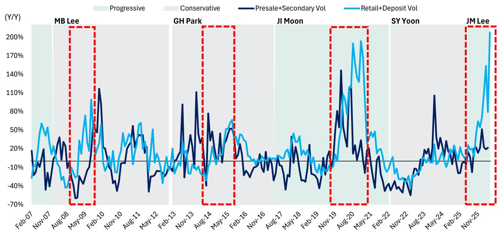

line chart

| Date | Progressive | Conservative | Presale+Secondary Vol | Retail+Deposit Vol |
| --- | --- | --- | --- | --- |
| Feb-07 | ~-10% | ~-10% | ~-10% | ~-10% |
| Nov-07 | ~-10% | ~-10% | ~-10% | ~-10% |
| Aug-08 | ~-10% | ~-10% | ~-40% | ~-40% |
| May-09 | ~-10% | ~-10% | ~-60% | ~-60% |
| Feb-10 | ~-10% | ~-10% | ~110% | ~110% |
| Nov-10 | ~-10% | ~-10% | ~-40% | ~-40% |
| Aug-11 | ~-10% | ~-10% | ~50% | ~50% |
| May-12 | ~-10% | ~-10% | ~-40% | ~-40% |
| Feb-13 | ~-10% | ~-10% | ~80% | ~80% |
| Nov-13 | ~-10% | ~-10% | ~40% | ~40% |
| Aug-14 | ~-10% | ~-10% | ~80% | ~80% |
| May-15 | ~-10% | ~-10% | ~50% | ~50% |
| Feb-16 | ~-10% | ~-10% | ~20% | ~20% |
| Nov-16 | ~-10% | ~-10% | ~-20% | ~-20% |
| Aug-17 | ~-10% | ~-10% | ~30% | ~30% |
| May-18 | ~-10% | ~-10% | ~40% | ~40% |
| Feb-19 | ~-10% | ~-10% | ~30% | ~30% |
| Nov-19 | ~-10% | ~-10% | ~80% | ~80% |
| Aug-20 | ~-10% | ~-10% | ~140% | ~140% |
| May-21 | ~-10% | ~-10% | ~20% | ~20% |
| Feb-22 | ~-10% | ~-10% | ~-40% | ~-40% |
| Nov-22 | ~-10% | ~-10% | ~-60% | ~-60% |
| Aug-23 | ~-10% | ~-10% | ~90% | ~90% |
| May-24 | ~-10% | ~-10% | ~20% | ~20% |
| Feb-25 | ~-10% | ~-10% | ~30% | ~30% |
| Nov-25 | ~-10% | ~-10% | ~50% | ~50% |
| Jun-26 | ~-10% | ~-10% | ~80% | ~80% |
| Mar-27 | ~-10% | ~-10% | ~90% | ~90% |
| Jan-28 | ~-10% | ~-10% | ~70% | ~70% |
| Dec-28 | ~-10% | ~-10% | ~50% | ~50% |
| Sep-29 | ~-10% | ~-10% | ~30% | ~30% |
| Jul-30 | ~-10% | ~-10% | ~20% | ~20% |

Source: MoLIT, KOFIA, MS

Exhibit 25: Liquid Money vs. Brokerage Customer Deposit Growth  
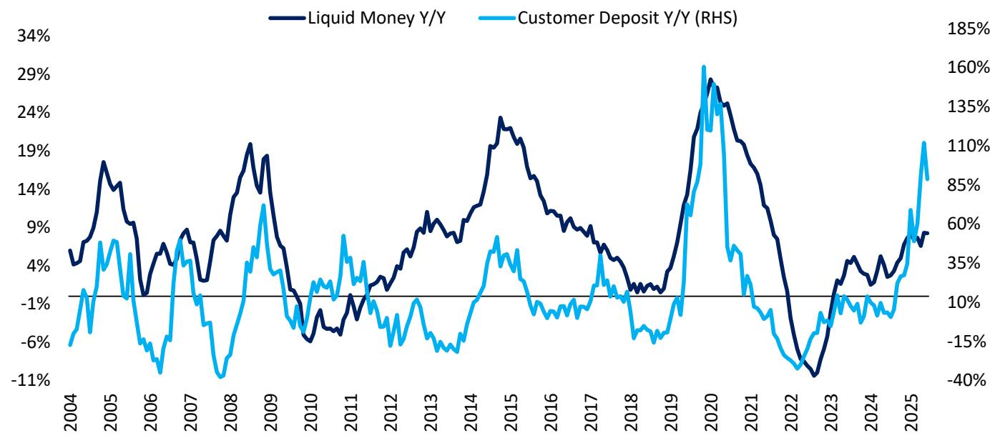

line chart

| Year | Liquid Money Y/Y | Customer Deposit Y/Y (RHS) |
|------|------------------|----------------------------|
| 2004 | ~4%              | ~-6%                       |
| 2005 | ~18%             | ~7%                        |
| 2006 | ~-1%             | ~-10%                      |
| 2007 | ~9%              | ~-1%                       |
| 2008 | ~19%             | ~-11%                      |
| 2009 | ~19%             | ~9%                        |
| 2010 | ~-6%             | ~-1%                       |
| 2011 | ~-6%             | ~-1%                       |
| 2012 | ~-6%             | ~-1%                       |
| 2013 | ~9%              | ~-1%                       |
| 2014 | ~14%             | ~-1%                       |
| 2015 | ~24%             | ~8%                        |
| 2016 | ~14%             | ~-1%                       |
| 2017 | ~9%              | ~-1%                       |
| 2018 | ~-6%             | ~-1%                       |
| 2019 | ~-6%             | ~-1%                       |
| 2020 | ~29%             | ~160%                      |
| 2021 | ~14%             | ~-15%                      |
| 2022 | ~-10%            | ~-40%                      |
| 2023 | ~-11%            | ~-15%                      |
| 2024 | ~4%              | ~-1%                       |
| 2025 | ~9%              | ~110%                      |

Source: BoK, KOFIA, MS

## Retail investors lacked maturity – many were beginners in the market

During the 2020\~2021 rally, retail investors had been very aggressive buying stocks in the 2,050\~2,400 KOSPI range and from 3,000\~3,200. The rally ended near the 3,300 level, slightly above the main buying level for retail investors, who were hence left with a bad taste in their mouths and a more cynical view towards domestic equities.

\- Note that there were only 6mn individuals investing in the domestic stock market in 2019; this grew to 9mn in 2020 and reached the 13mn mark in 1H21.

## If we think about why retail investors joined the rally later, we believe some of the reasons were:

1. Long-standing distrust in the domestic equity market;  
2. Continued preference for real estate despite tightening;  
3. Weaker access to quality information; and  
4. Herd tendency.

Exhibit 26: KOSPI Price Trend versus Retail Net Flows by Price Intervals (2020\~2021)  
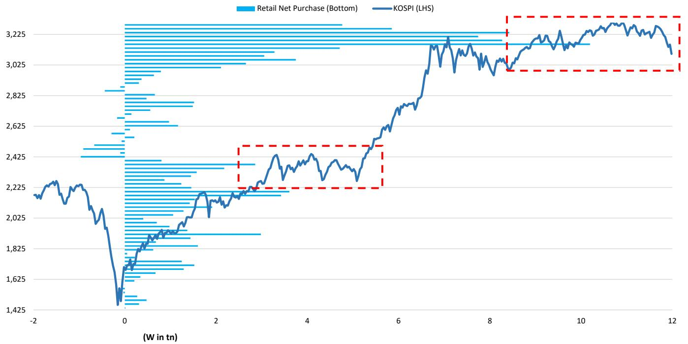

bar-line hybrid chart

| W (in tn) | Retail Net Purchase (Bottom) | KOSPI (LHS) |
| --------- | ---------------------------- | ----------- |
| -2        | 2,225                        | 2,225       |
| 0         | 1,425                        | 1,425       |
| 2         | 2,425                        | 2,425       |
| 4         | 3,025                        | 3,025       |
| 6         | 3,225                        | 3,225       |
| 8         | 3,225                        | 3,225       |
| 10        | 3,225                        | 3,225       |
| 12        | 3,225                        | 3,225       |

Source: WiseFN, MS

## Have retail investors changed? Yes, they are evolving but so are related risks

## What we saw in the 2020\~2021 cycle and in previous ones

In July 2020, we carried out a deep analysis of Korean retail investors and came to the conclusion that retail investors should be able to drive up the market – but more importantly, that retail investors' tendencies imply higher market volatility.

\- South Korea Strategy: Raising KOSPI Target to 2,300 on Retail Participation (12 Jul 2020)

Our key findings in this analysis were that retail investors tended to be seekers of volatility and chasers of themes.

## (1) We found that retail investors tend to be volatility seekers with a short-term trading tendency – that's still the case but overall holding periods appear longer:

History pointed to retail investors tending to be more active when beta trade opportunities appear, because they tend to seek out volatility. Combined with learnings from previous down-cycles, the conditions were ripe for a retail push. We believe retail investors are attracted to volatility because of the following traits: (1) higher sensitivity to news headlines, (2) bandwagon effect, and (3) confirmation bias.

- Our analysis showed a positive relationship between volatility and retail activity. Hence, small cap, healthcare and IT are key areas of activity.  
- During down-cycles, large-cap stocks show a steeper rise in volatility, leading to increased retail activity in large-cap stocks early on. The learning effect also comes into play here – recollection of previous cycles shows that beta trade

opportunities emerge during down-cycles.

What we are seeing now: While we do find that retail investors tend to be more active after volatility events and the preference for leveraged positions is on the increase – leveraged ETFs are getting more attention. We also find that the trading patterns are somewhat disparate. Older age groups (40 and above) tend to have longer holding periods; younger age groups (20s to 30s) have shorter holding periods.

Exhibit 27: KOSPI: Annualized Volatility and Share of Retail Trade Value  
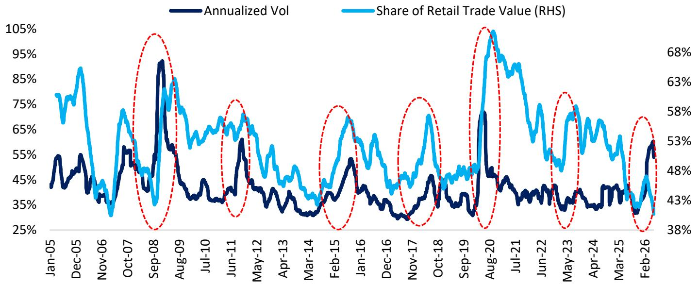

line chart

| Date    | Annualized Vol | Share of Retail Trade Value (RHS) |
|---------|----------------|-----------------------------------|
| Jan-05  | ~45%           | ~75%                              |
| Dec-05  | ~50%           | ~85%                              |
| Nov-06  | ~35%           | ~38%                              |
| Oct-07  | ~55%           | ~70%                              |
| Sep-08  | ~90%           | ~35%                              |
| Aug-09  | ~60%           | ~80%                              |
| Jul-10  | ~40%           | ~60%                              |
| Jun-11  | ~65%           | ~75%                              |
| May-12  | ~45%           | ~65%                              |
| Apr-13  | ~35%           | ~55%                              |
| Mar-14  | ~30%           | ~45%                              |
| Feb-15  | ~45%           | ~65%                              |
| Jan-16  | ~50%           | ~60%                              |
| Dec-16  | ~35%           | ~45%                              |
| Nov-17  | ~40%           | ~70%                              |
| Oct-18  | ~45%           | ~65%                              |
| Sep-19  | ~30%           | ~45%                              |
| Aug-20  | ~70%           | ~100%                             |
| Jul-21  | ~45%           | ~85%                              |
| Jun-22  | ~40%           | ~70%                              |
| May-23  | ~35%           | ~75%                              |
| Apr-24  | ~35%           | ~65%                              |
| Mar-25  | ~30%           | ~60%                              |
| Feb-26  | ~55%           | ~45%                              |

Source: WiseFN, MS

(2) Retail investors have a higher tendency to chase themes over fundamentals: In view of retail investors' higher sensitivity to positive newsflow, we believe they are more interested in thematic trades, especially when volatility starts to come down. During the 2020\~2021 cycle, the key thematic trades were (1) healthcare, as a result of COVID-19 and recent listings, (2) fintech and Internet, in response to the rise in the 'untact' (contactless) economy, and (3) clean environment-related stocks, reflecting new deal policies.

What we are seeing now: The bandwagon effect remains but the focus across the board is on the AI story with less dispersion of interest compared to 2020\~2021 cycle. Trading patterns were more emotional with certain sectors/stocks being held without consideration of a stop-loss mechanism even as share prices fell sharply in previous cycles. Rather than emotional attachment, we believe FOMO (fear of missing out) and also proliferation of market information are influencing retail investor proclivity.

Exhibit 28: Net Retail Flows by Sector (Consumer Discretionary + Tech)  
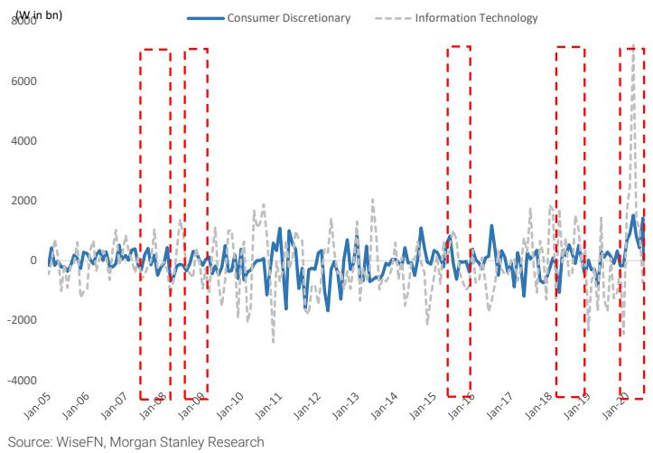

line chart

| Date    | Consumer Discretionary | Information Technology |
|---------|------------------------|------------------------|
| Jan-05  | ~0                     | ~0                     |
| Jan-06  | ~0                     | ~0                     |
| Jan-07  | ~0                     | ~0                     |
| Jan-08  | ~0                     | ~0                     |
| Jan-09  | ~0                     | ~0                     |
| Jan-10  | ~0                     | ~0                     |
| Jan-11  | ~0                     | ~0                     |
| Jan-12  | ~0                     | ~0                     |
| Jan-13  | ~0                     | ~0                     |
| Jan-14  | ~0                     | ~0                     |
| Jan-15  | ~0                     | ~0                     |
| Jan-16  | ~0                     | ~0                     |
| Jan-17  | ~0                     | ~0                     |
| Jan-18  | ~0                     | ~0                     |
| Jan-19  | ~0                     | ~0                     |
| Jan-20  | ~0                     | ~0                     |
| Jan-21  | ~0                     | ~0                     |

Exhibit 29: Net Retail Flows by Sector (Healthcare + Comm. Services)  
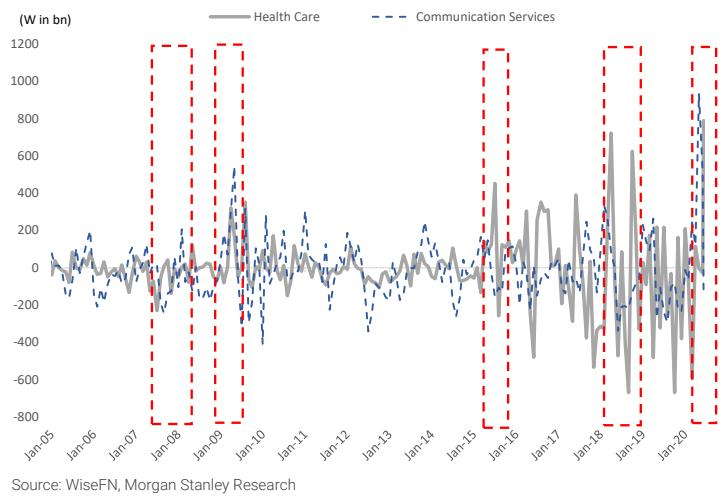

line chart

| Date   | Health Care | Communication Services |
|--------|-------------|------------------------|
| Jan-05 | ~0          | ~0                     |
| Jan-06 | ~0          | ~0                     |
| Jan-07 | ~0          | ~0                     |
| Jan-08 | ~0          | ~0                     |
| Jan-09 | ~0          | ~0                     |
| Jan-10 | ~300        | ~400                   |
| Jan-11 | ~0          | ~0                     |
| Jan-12 | ~0          | ~0                     |
| Jan-13 | ~0          | ~0                     |
| Jan-14 | ~0          | ~0                     |
| Jan-15 | ~0          | ~0                     |
| Jan-16 | ~400        | ~200                   |
| Jan-17 | ~300        | ~200                   |
| Jan-18 | ~700        | ~200                   |
| Jan-19 | ~600        | ~200                   |
| Jan-20 | ~800        | ~900                   |

## Why we believe tendencies have changed

We still believe that many retail investors remain volatility seekers and theme chasers, but we believe that in general retail investors have become astute, less risk-averse, and also more sensitive to FOMO.

(1) Improved access to quality information – fairer playing field: A key change is that the sheer number of individuals investing in the domestic equity market has grown significantly – more than 15mn people now have brokerage accounts and equity investing is now mainstream. With the increasing number of individual investors, the quality of brokerage platforms has improved, non-traditional information providers have proliferated, and AI has also made the playing field more equal between institutional and retail investors in terms of information accessibility and analytical capacity.

## (2) Experience investing overseas has provided better understanding of markets:

According to Korea Securities Depository and brokerage industry statistics, around 8\~9mn retail investors have experience investing in overseas equities, with the US being the main destination. More knowledge of global markets and trends combined with experience in investing in quality stocks appears to have given retail investors more confidence.

(3) FOMO spread to equities and not just real estate: FOMO was a trend that was more associated with the real estate market because in Korea, real estate was the key investment instrument to provide strong returns. Not owning stocks is being seen as more of a risk by individuals in the perspective of wealth accumulation and keeping up with social trends. We believe FOMO should be a trend that comes and goes depending on the performance of the market – but for now this will likely be an important reason to be investing in stocks.

The main investors in the stock market are individuals in their 50s and 60s, which makes sense because wealth levels should be higher for these households. According to reports (Edaily, June 3, 2026), a Korea Securities Depository report released in March on the shareholder status of listed companies with fiscal year-end in December 2025 showed that individuals in their 50s accounted for the largest proportion of retail shareholders – 23.1% as of the end of last year, followed by those in their 40s at 21.8%. In terms of the number of shares owned, investors in their 50s held 34.4% of all shares and those in their 60s held 26.6%, while investors in their 40s accounted for only 18.6%.

## How to look at increased leverage by retail investors – increased liquidity but also volatility

Households have an additional layer of liquidity through leverage: Margin lending by Korean retail investors has reached historically elevated levels in 2026. As of May 28, 2026, the balance had surpassed W37tn for the first time ever, growing nearly W10tn in 2026 alone from approximately W27tn at end-2025. This represents a steep acceleration from the start of the year: margin lending balances had already surged from W17.1tn at end-2025 to W32.8tn as of March 6, marking a 92% increase from end-2025 levels in just over two months.

On an average daily basis, the margin loan balance across all Korean securities firms reached W31.01tn in 1Q26, the first time it surpassed the W30tn threshold on an average basis, up 80% from two years ago and 20% from end-2025. This surge in margin lending is attributed to a debt-fueled investing frenzy by retail investors, driven by a booming local stock market.

However, margin lending risk is at a manageable level, though it does increase volatility – considering that as a percentage of total market cap, margin loans are actually lower than historical peak levels. Furthermore, the financial authorities continue to monitor the situation closely and there have been cases of brokers paring down margin lending to manage risk.

Exhibit 30: KOSPI + KOSDAQ: Margin Loan Balance  
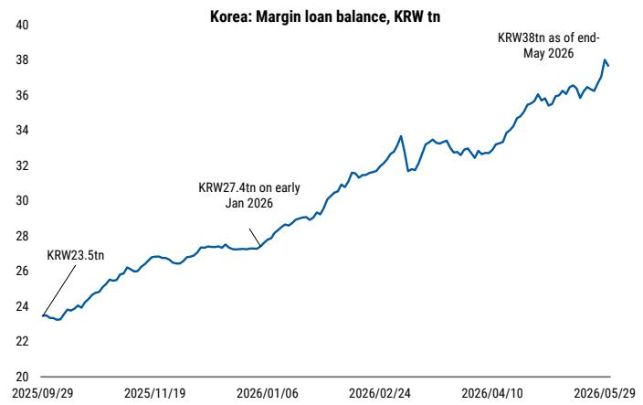

line chart

| Date       | KRW tn |
| ---------- | ------ |
| 09/29      | 23.5   |
| Jan 2026   | 27.4   |
| May 2026   | 38     |

Source: WiseFN, KOFIA, MS

Exhibit 31: KOSPI + KOSDAQ: Margin Loan Balance as a Percentage of Market Cap  
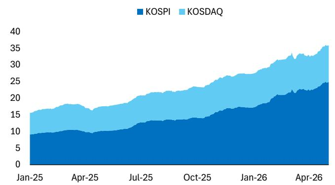

stacked bar chart

| Date   | KOSPI | KOSDAQ |
|--------|-------|--------|
| Jan-25 | 9     | 7      |
| Apr-25 | 10    | 8      |
| Jul-25 | 12    | 9      |
| Oct-25 | 14    | 10     |
| Jan-26 | 16    | 12     |
| Apr-26 | 24    | 16     |

Source: WiseFN, KOFIA, MS

Proliferation of ETFs – especially leveraged ETFs – is a double-edged sword. The impact of leveraged ETF proliferation on the KOSPI is a mix of higher liquidity, stronger momentum, and potentially much higher volatility, especially because the Korean equity market is unusually concentrated in a handful of stocks – namely, chipmakers.

- Note that leveraged ETFs mechanically increase exposure to the underlying index or stocks. When money flows into a 2x KOSPI ETF, the manager must buy futures, swaps, or constituent stocks to create the leverage.  
• Daily rebalancing is carried out for leveraged ETF targeting 2x exposure every day.

• If the market rises, it must buy more exposure near the close.  
- If the market falls, it must sell exposure near the close. Hence, this rebalancing need can amplify market moves.

ETFs are providing retail investors with more choice and also the possibility of higher returns through the investment in leveraged ETFs, but risks are also higher for individuals. In order to invest in leveraged ETFs, an individual needs to go through an official training course. Individuals in their 40s and 50s appear to be more active in leveraged ETFs.

\- According to media (Edaily, June 3, 2026), by age group, investors in their 40s accounted for the largest share in both the number of investors and the amount invested. There were 20,489 investors in their 40s, representing 28.9% of the total, and their investment amount reached W1.0225tn, accounting for 31.2% of total investments. The share of investors in their 50s was also similar, at 28.7% of all investors, but their total investment amount was W912.5bn, which was more than W100bn less than that of investors in their 40s.

Exhibit 32: Leveraged Domestic Equity ETF AUM Trend  
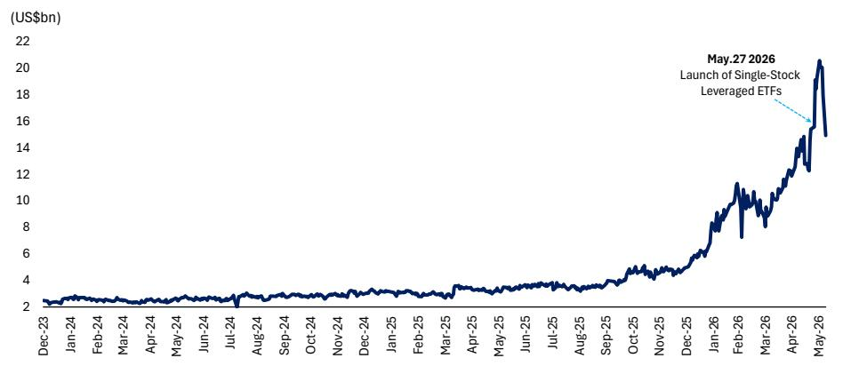

line chart

| Date       | Value (US$bn) |
| ---------- | ------------- |
| May.27 2026 | 21            |

Source: WiseFN, MS

No investment recommendation is made with respect to any of the ETFs or mutual funds referenced herein. Investors should not rely on the information included in making investment decisions with respect to those funds.

Household debt growth has turned around to approximately 4–5%Y since mid-2025 – but regulators are limiting bank retail loan growth to 1.5% for 2026. After two consecutive years of a deleveraging trend on the non-housing front, we have seen a slight pickup in unsecured retail lending, but it remains quite controlled. System loan growth is expected to be around 4–5% in 2026, driven primarily by corporate lending, with household loans expected to show limited growth under the government's debt management stance. When we compare current retail lending trends to the 2020\~2021 cycle, growth levels are quite low.

Several things collectively point to a structural shift in how Korean households are deploying incremental leverage toward financial markets rather than real estate:

• The surge in margin lending  
- The accumulation of liquid near-market instruments (e.g. leveraged ETFs)  
- The rebound in unsecured personal lending

Exhibit 33: Retail investors taking out unsecured loans to invest in equities but tighter regulatory control  
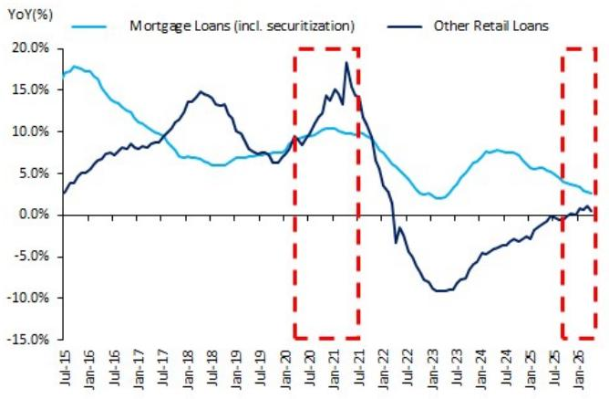

line chart

| Date   | Mortgage Loans (incl. securitization) | Other Retail Loans |
|--------|----------------------------------------|--------------------|
| Jul-15 | 17.0%                                  | 3.0%               |
| Jan-16 | 16.0%                                  | 6.0%               |
| Jul-16 | 14.0%                                  | 8.0%               |
| Jan-17 | 12.0%                                  | 9.0%               |
| Jul-17 | 10.0%                                  | 10.0%              |
| Jan-18 | 8.0%                                   | 14.0%              |
| Jul-18 | 7.0%                                   | 13.0%              |
| Jan-19 | 6.0%                                   | 8.0%               |
| Jul-19 | 7.0%                                   | 7.0%               |
| Jan-20 | 8.0%                                   | 8.0%               |
| Jul-20 | 9.0%                                   | 10.0%              |
| Jan-21 | 10.0%                                  | 18.0%              |
| Jul-21 | 9.0%                                   | 15.0%              |
| Jan-22 | 7.0%                                   | -5.0%              |
| Jul-22 | 5.0%                                   | -10.0%             |
| Jan-23 | 3.0%                                   | -10.0%             |
| Jul-23 | 4.0%                                   | -8.0%              |
| Jan-24 | 6.0%                                   | -6.0%              |
| Jul-24 | 7.0%                                   | -4.0%              |
| Jan-25 | 6.0%                                   | -2.0%              |
| Jul-25 | 5.0%                                   | 0.0%               |
| Jan-26 | 3.0%                                   | 1.0%               |

Source: Korea Exchange, MS

Exhibit 34: Meanwhile, mortgage debt growth has been slowing down amid tight credit control by the authorities  
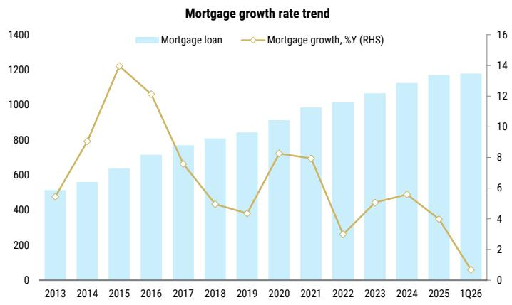

bar-line hybrid chart

Mortgage growth rate trend
| Year | Mortgage loan ($M) | Mortgage growth, %Y (%) |
| :--- | :--- | :--- |
| 2013 | 500 | 5.0 |
| 2014 | 550 | 8.0 |
| 2015 | 630 | 12.0 |
| 2016 | 710 | 10.5 |
| 2017 | 760 | 6.5 |
| 2018 | 800 | 4.5 |
| 2019 | 830 | 4.0 |
| 2020 | 900 | 7.5 |
| 2021 | 980 | 7.0 |
| 2022 | 1010 | 3.0 |
| 2023 | 1060 | 5.0 |
| 2024 | 1110 | 5.5 |
| 2025 | 1160 | 4.0 |
| 1Q26 | 1170 | 1.0 |

Source: BoK, MS

How the market moves from here is obviously the key, along with how effectively the financial authorities/brokers manage the risk pre-emptively.

## If the market enters a down-cycle, Korean households' balance sheet is already

stretched: Korea's level of household debt stands as one of the highest globally. Its credit balances reached W1,993.1tn in 1Q26, surpassing its historical high. Since 2002, Korea has never witnessed household sector deleveraging activities – although the health of the borrowers and credit conditions are closely monitored and managed, the sheer size of the debt remains a concern. The ratio of household debt to GDP stood at 89% in 2025, the fourth-highest globally after Switzerland, Australia, and Canada. While the government aims to reduce this ratio to 80% by 2030, this projected achievement largely reflects an expected increase in nominal GDP from the semiconductor boom, rather than actual debt reduction.

## What is different for 2026\~2027 vs. 2020\~2021 – a stronger fundamental narrative intertwined with reform push

As previously mentioned, there are powerful structural forces – both macro- and policy-related – together with changes to retail investment proclivity that appear to indicate proactive participation individuals in the domestic equity market. We think these factors need to be maintained in order for retail participation to be sustained on a mid/long-term basis, especially the capital market/governance reform story.

Investment thesis is more constructive on the strength of various super-cycles: There's no change to our thesis that key themes and reform are intertwined, which should lead to a higher sustainable ROE for the KOSPI, with oscillation between 5\~10% taking a step up to a range of 8\~15% on a sustainable basis. Refer to the below reports.

- Global Technology: Chipflation – Navigating A Memory Crisis (2 Jun 2026)  
• 2026 South Korea Mid-Year Outlook: Mettle to Sail Rough Seas (12 May 2026)

## Reform push should lead to narrowing of the valuation gap with EM and DM: The

Korean government's policy push on capital market/governance reform is now in its fifth innings (in baseball terms) as the government and ruling party have worked to keep their promise of quickly implementing reform policies. With the broad strokes done, we believe the government will now focus more on balancing policy, as both sticks and carrots are needed to encourage execution by companies.

Exhibit 35: KOSPI: Annual Total Shareholder Return Trend  
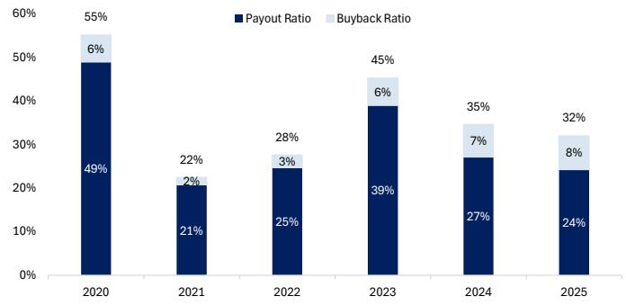

stacked bar chart

| Year | Payout Ratio (%) | Buyback Ratio (%) |
| :--- | :--- | :--- |
| 2020 | 49 | 6 |
| 2021 | 21 | 2 |
| 2022 | 25 | 3 |
| 2023 | 39 | 6 |
| 2024 | 27 | 7 |
| 2025 | 24 | 8 |
The chart displays two stacked segments: the lower dark blue portion represents the Payout Ratio, and the upper light blue portion represents the Buyback Ratio. The total values for each year are explicitly labeled above the bars.

Source: WiseFN, KRX, MS

Exhibit 36: Share of Interim Dividends out of Total Dividends  
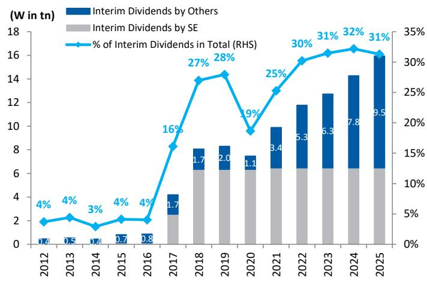

bar-line hybrid

| Year | Interim Dividends by Others (W in tn) | Interim Dividends by SE (W in tn) | % of Interim Dividends in Total (RHS) (%) |
|---|---|---|---|
| 2012 | 0.4 | 0.0 | 4 |
| 2013 | 0.5 | 0.0 | 4 |
| 2014 | 0.4 | 0.0 | 3 |
| 2015 | 0.7 | 0.0 | 4 |
| 2016 | 0.8 | 0.0 | 4 |
| 2017 | 1.7 | 2.5 | 16 |
| 2018 | 1.7 | 6.0 | 27 |
| 2019 | 2.0 | 6.0 | 28 |
| 2020 | 1.1 | 6.0 | 19 |
| 2021 | 3.4 | 6.5 | 25 |
| 2022 | 5.3 | 6.5 | 30 |
| 2023 | 6.3 | 6.5 | 31 |
| 2024 | 7.8 | 6.5 | 32 |
| 2025 | 9.5 | 6.5 | 31 |

Source: WiseFN, MS

Exhibit 37:  
KOSPI: ROE  
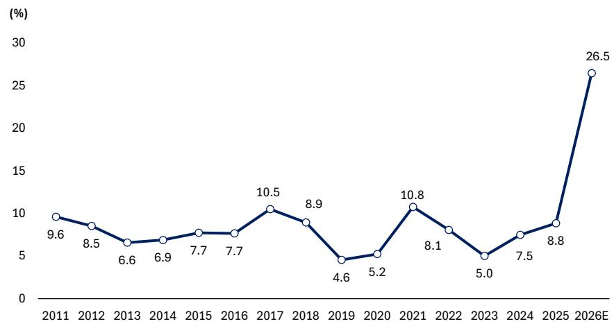

line chart

| Year | Value (%) |
|---|---|
| 2011 | 9.6 |
| 2012 | 8.5 |
| 2013 | 6.6 |
| 2014 | 6.9 |
| 2015 | 7.7 |
| 2016 | 7.7 |
| 2017 | 10.5 |
| 2018 | 8.9 |
| 2019 | 4.6 |
| 2020 | 5.2 |
| 2021 | 10.8 |
| 2022 | 8.1 |
| 2023 | 5.0 |
| 2024 | 7.5 |
| 2025 | 8.8 |
| 2026E | 26.5 |

Source: WiseFN, MS. E = WiseFN consensus estimates

Retail investors have generally not been avid fans of value stocks or financials, with dividend yields not being high enough to pique interest and policy being more of a drag than a catalyst. However, with capital market reform – notably dividend tax reform – and the pickup in market activity, we believe there should be a gradual buildup in interest from retail investors, particularly affluent retirees as cashflow generation becomes important.

\- YTD, the financial sector has seen net inflows from retail investors, albeit much smaller compared to the IT sector.

Exhibit 38: Annual retail fund flows into Banks, Insurers and Securities (2020\~2026 YTD)  
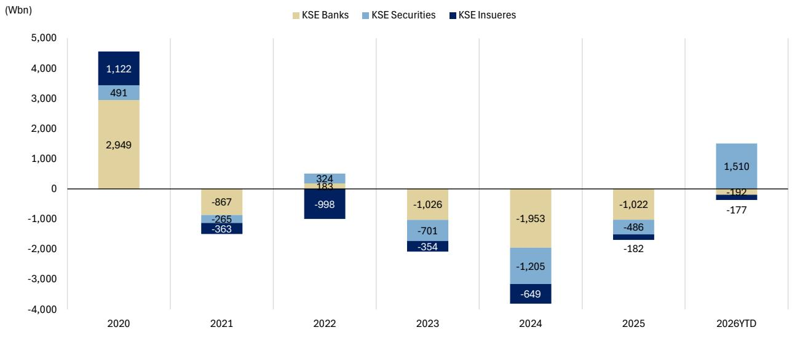

stacked bar chart

| Year | KSE Banks (Wbn) | KSE Securities (Wbn) | KSE Insueres (Wbn) |
| :--- | :--- | :--- | :--- |
| 2020 | 2,949 | 491 | 1,122 |
| 2021 | -867 | -265 | -363 |
| 2022 | -183 | 324 | -998 |
| 2023 | -1,026 | -701 | -354 |
| 2024 | -1,953 | -1,205 | -649 |
| 2025 | -1,022 | -486 | -182 |
| 2026YTD | -192 | 1,510 | -177 |

Source: WiseFN, MS, Data as of Jun 2, 2026

## Refer to Korea Renaissance: Korea's Corporate DNA Is Changing (17 Mar 2026)

Diversification of equity investing products through policy: The government has focused not only on policy initiatives related to capital market and governance reform but also measures to increase domestic liquidity. The government has expanded tax benefits for ISA (Individual Savings Accounts) and IRPs (Individual Retirement Pensions) while also planning changes to the pension framework rules to get more of the W501tn money into the capital market.

Refer to Appendix 1: Product Outline

Liquidity to remain copious: While we expect policy rate hikes to come from 2H26 and retail lending is being tightly controlled, market liquidity remains copious owing to less money moving into real estate, proactive fiscal policy, and rising wages.

Exhibit 39: Liquid Money vs. Brokerage Deposit Growth  
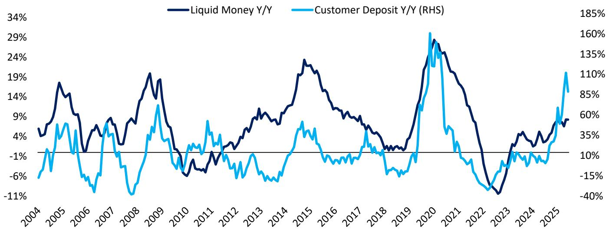

line chart

| Year | Liquid Money Y/Y | Customer Deposit Y/Y (RHS) |
|------|------------------|----------------------------|
| 2004 | ~4%              | ~-6%                       |
| 2005 | ~18%             | ~8%                        |
| 2006 | ~-1%             | ~-10%                      |
| 2007 | ~9%              | ~-6%                       |
| 2008 | ~19%             | ~-11%                      |
| 2009 | ~-1%             | ~9%                        |
| 2010 | ~-6%             | ~-1%                       |
| 2011 | ~-1%             | ~8%                        |
| 2012 | ~3%              | ~-1%                       |
| 2013 | ~9%              | ~-1%                       |
| 2014 | ~14%             | ~-1%                       |
| 2015 | ~24%             | ~8%                        |
| 2016 | ~14%             | ~-1%                       |
| 2017 | ~9%              | ~-1%                       |
| 2018 | ~-1%             | ~-1%                       |
| 2019 | ~-3%             | ~-6%                       |
| 2020 | ~29%             | ~160%                      |
| 2021 | ~24%             | ~85%                       |
| 2022 | ~-10%            | ~-40%                      |
| 2023 | ~-11%            | ~-15%                      |
| 2024 | ~4%              | ~-15%                      |
| 2025 | ~9%              | ~110%                      |

Source: BoK, KOFIA, MS

The government is pushing hard to control the Seoul Metro housing market: Korea's housing market, particularly in Seoul, is experiencing one of the most acute affordability crises in Asia. A combination of surging home prices, severely constrained supply, and an increasingly rigorous wave of demand-suppression policies targeting Seoul and the metropolitan area since 2025 has made homeownership progressively out of reach for ordinary households.

- Affordability has become an important issue with housing prices having surged in the past couple of years. Korea has one of the worst ratios of housing prices to income globally, exceeding 10.1 in 2026. This indicates that it takes 10.1 years of income earned to own a house – which remains a significant challenge for 50% of the population, with the home ownership rate of 50%. The mortgage-to-income ratio in Seoul stands at 154%, ranking 14th worldwide, highlighting the severe financial strain on homeowners.  
- The government's commitment to controlling housing prices in Seoul has been reinforced by the administration's staunch stance toward multi-homeowners, with policy beginning through demand suppression measures. The initial focus has been on demand-side measures such as tightening of retail lending rules, with more measures expected to follow such as an ownership tax hike in 2H26.

Exhibit 40: The pace of house transaction volume growth has slowed, especially in Seoul from end-2025  
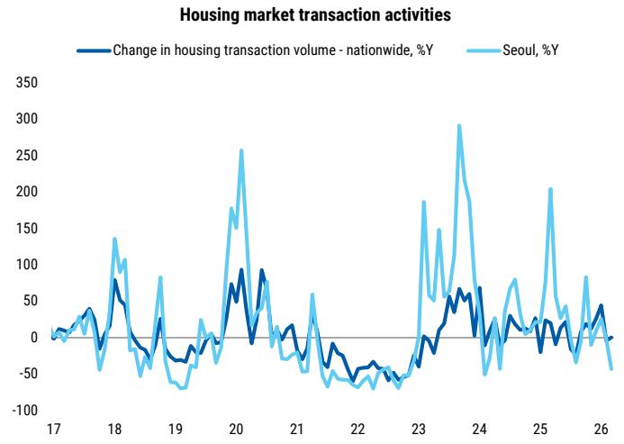

line chart

| Year | Change in housing transaction volume - nationwide, %Y | Seoul, %Y |
|------|--------------------------------------------------------|---------|
| 17   | ~0                                                     | ~0      |
| 18   | ~80                                                    | ~140    |
| 19   | ~-20                                                   | ~-60    |
| 20   | ~90                                                    | ~260    |
| 21   | ~-30                                                   | ~-40    |
| 22   | ~-50                                                   | ~-60    |
| 23   | ~-20                                                   | ~180    |
| 24   | ~60                                                    | ~290    |
| 25   | ~-10                                                   | ~200    |
| 26   | ~40                                                    | ~-50    |

Source: Korea Real Estate Board, MS

Exhibit 41: The share of speculative flows into Seoul's housing market has dropped to a three-year low  
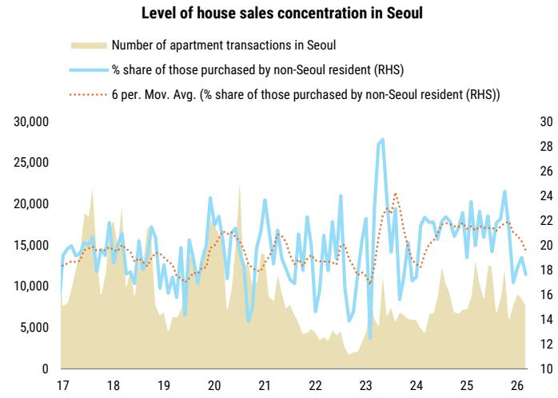

line chart

| Year | Number of apartment transactions in Seoul | % share of those purchased by non-Seoul resident (RHS) | 6 per. Mov. Avg. (% share of those purchased by non-Seoul resident (RHS)) |
|------|-------------------------------------------|--------------------------------------------------------|--------------------------------------------------------------------------|
| 17   | ~10,000                                   | ~14                                                    | ~18                                                                      |
| 18   | ~18,000                                   | ~16                                                    | ~20                                                                      |
| 19   | ~10,000                                   | ~14                                                    | ~18                                                                      |
| 20   | ~15,000                                   | ~18                                                    | ~20                                                                      |
| 21   | ~10,000                                   | ~14                                                    | ~18                                                                      |
| 22   | ~5,000                                    | ~12                                                    | ~16                                                                      |
| 23   | ~15,000                                   | ~28                                                    | ~24                                                                      |
| 24   | ~10,000                                   | ~16                                                    | ~22                                                                      |
| 25   | ~15,000                                   | ~18                                                    | ~22                                                                      |
| 26   | ~10,000                                   | ~14                                                    | ~20                                                                      |

Source: Korea Real Estate Board, MS

More balanced and tactical inflows from the retail segment: Compared to the 2020\~2021 cycle, we find that retail net buying has been less concentrated and ETFs are being more widely traded by retail investors, but concentration levels are also looking balanced (ETF flows partially booked in institutional fund flows). The key implication here is that retail fund flows appear to be more controlled and more tactical in nature compared to previous cycles.

\- Retail investors have been active net buyers of the KOSPI in the 7,000-7,800 range, with net inflow volumes being quite strong even while institutional net inflows have been the strong in the 5,000-6,500 range.

Exhibit 42: KOSPI Price Trend versus Retail Net Flows by Price Intervals (2H25\~1H26)  
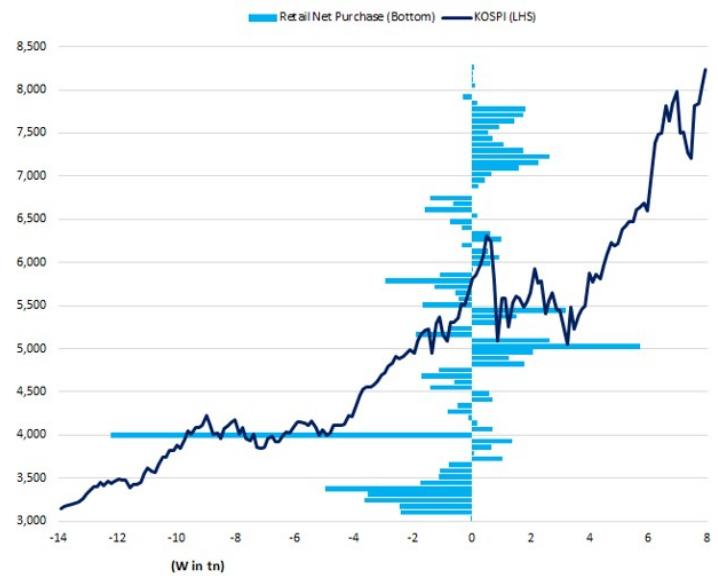

bar-line hybrid chart

| (W in tn) | Retail Net Purchase (Bottom) | KOSPI (LHS) |
| --------- | ---------------------------- | ----------- |
| -14       | 3,000                        | 3,000       |
| -12       | 3,500                        | 3,500       |
| -10       | 3,750                        | 3,750       |
| -8        | 4,000                        | 4,000       |
| -6        | 4,250                        | 4,250       |
| -4        | 4,500                        | 4,500       |
| -2        | 4,750                        | 4,750       |
| 0         | 5,000                        | 5,000       |
| 2         | 5,250                        | 5,250       |
| 4         | 5,500                        | 5,500       |
| 6         | 5,750                        | 5,750       |
| 8         | 6,000                        | 6,000       |

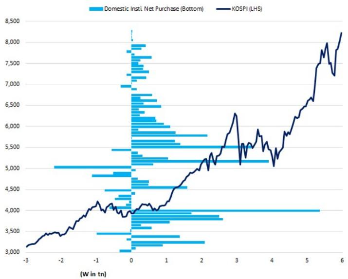

bar-line hybrid chart

| (W in tn) | Domestic Insti Net Purchase (Bottom) | KOSPI (LHS) |
| --------- | ------------------------------------ | ----------- |
| -3        | 3000                                 | 3000        |
| -2        | 3500                                 | 3500        |
| -1        | 4000                                 | 4000        |
| 0         | 8000                                 | 4000        |
| 1         | 5000                                 | 5000        |
| 2         | 4500                                 | 5500        |
| 3         | 4000                                 | 6500        |
| 4         | 3500                                 | 5000        |
| 5         | 3000                                 | 7000        |
| 6         | 2500                                 | 8500        |

Source: WiseFN, MS

According to our Asia Equity Strategy team (see here), historically when retail participation levels were high the forward returns were quite mixed as shown by the median net 3-month return since 2021. However, more recent trends are showing that retail flows have not been contrarian and have actually supported positive momentum. Of course, we will have to see how the full cycle plays out and also the sustainability of retail investors' staying power in domestic equities.

Exhibit 43: Korea Domestic Retail Activity vs. Forward Returns of MSCI Korea - Retail Flows Have Shifted from Contrarian in the past 5 years to Momentum-Reinforcing Since 2025  
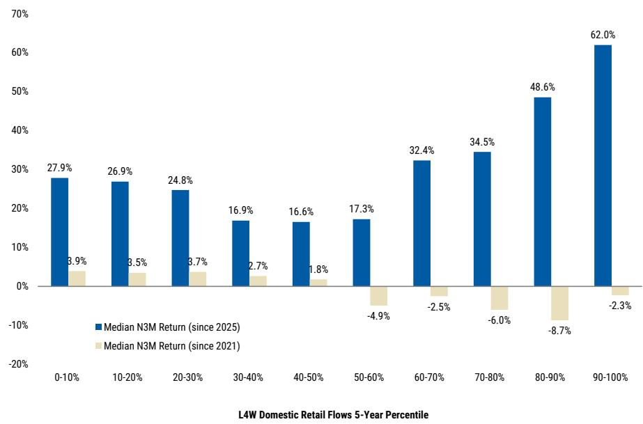

bar chart

L4W Domestic Retail Flows 5-Year Percentile
| L4W Domestic Retail Flows 5-Year Percentile | Median N3M Return (since 2025) (%) | Median N3M Return (since 2021) (%) |
| :--- | :--- | :--- |
| 0-10% | 27.9 | 3.9 |
| 10-20% | 26.9 | 3.5 |
| 20-30% | 24.8 | 3.7 |
| 30-40% | 16.9 | 2.7 |
| 40-50% | 16.6 | 1.8 |
| 50-60% | 17.3 | -4.9 |
| 60-70% | 32.4 | -2.5 |
| 70-80% | 34.5 | -6.0 |
| 80-90% | 48.6 | -8.7 |
| 90-100% | 62.0 | -2.3 |

Source: Bloomberg, Factset, MS; Note: Retail activity is measured by 5-year percentile of trailing 4-week retail flows.

## Economic Implications of Household Asset Shift

## Notable implications for consumption, financial stability, inflation and monetary policy

With the structural shift toward equity investments that we believe is underway, we see this transition carrying a wide range of positive and negative implications for the real economy. There are two layers to the household asset shift into equity holdings. First, a more observable reallocation of idle cash and standby real estate funds into equities, and second, over the longer term by a broader structural migration from real to financial assets.

Both transitions carry notable implications for consumption, financial stability, inflation as well as monetary policy, in our view. With the broadening of the investor base and scale-up in total equity holdings newly featured in the past 4-5 years that did not exist to the same degree pre-2020, we think the overall economic implications are likely more consequential for the wider macroeconomic landscape.

## Positive implications: (1) Amplified positive wealth effect

The shift toward financial assets could amplify the positive wealth effect. We believe the positive spillover from equity wealth gains to the real economy is likely to be both wider in breadth and more intense in magnitude compared to the pre-2020 period, given:

- the number of retail investors increased to 14.5mn in 2025, 50% of total adult population, vs. 6.2mn, 21% of adult population, in 2019;  
- a notable jump in the size of equity balance at W662tn in 2025, up 58%Y from W419tn in 2024; this is a 13.8x increase from W17.6tn in 2019; and  
- younger investor groups in their 20s and 30s have entered the investor base, who are likely to have a high level of propensity to consume.

Historically, a 1% gain in the KOSPI implies a boost to consumption growth of approximately 0.03-0.035%p. This is the second-highest correlation to consumption after labor income (coefficient of 0.81). The wealth effect from real estate gains (0.012ppt) was the least among these variables, given the illiquidity and poor transferability of property holdings.

By consumption category, the correlation between overall domestic household consumption growth and KOSPI gains has been relatively weak (R-squared: 0.20), while the correlation with durable goods consumption has been more stable (R-squared: 0.41). Durable goods account for just 10% of total domestic consumption, compared to 21.7% for non-durables and 59.4% for services.

We also find the historical trend past 20 years has been that its transmission to broader consumption uneven and concentrated at the top of the income distribution (see: South Korea Economics/Consumer: Increasing Wealth, Concentrated Effect). Luxury consumption appears more responsive to equity market gains than mass-market spending, as the primary beneficiaries of the wealth effect are affluent shareholders. This also resulted in services consumption responding more responsively to KOSPI moves in recent quarters.

At the same time, the intensity of the wealth effect looks to have deepened. Equity market deposits surpassed W100tn for the first time and total household equity holdings climbed to an all-time high of W1,644tn as of 2025, marking a 48.2%Y increase in 2025. With a larger share of household wealth now directly exposed to equity market performance, the transmission of market gains into consumption and income is structurally more meaningful than it was before the retail investor surge of post-2020.

## Plus, we see the younger retail investor cohorts making up more than 40% of the total investors whose groups tend to have a higher marginal propensity to consume.

According to Korea Securities Depository data as of 2025, those retail investors by age group show that 40s or younger groups make up 43% of total investors. Whilst those in their 50s make up the largest group with 22% by 10-year breakdown, we see that the younger 20s and 30s groups are increasingly entering the stock market, suggesting that future wealth effects could expand beyond the affluent top quintile that has historically captured the bulk of asset returns.

Exhibit 44: Historically, a 1% gain in the KOSPI implied a boost to consumption growth of approximately 0.03-0.035%p  
Korea: Private goods consumption and equity market performance  
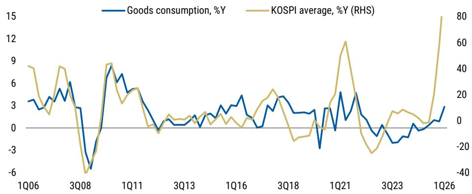

line chart

| Quarter | Goods consumption, %Y | KOSPI average, %Y (RHS) |
| ------- | --------------------- | ------------------------ |
| 1Q06    | ~3.5                  | ~80                      |
| 2Q06    | ~2.5                  | ~40                      |
| 3Q06    | ~6.0                  | ~90                      |
| 4Q06    | ~3.0                  | ~50                      |
| 1Q07    | ~-6.0                 | ~-40                     |
| 2Q07    | ~9.0                  | ~90                      |
| 3Q07    | ~6.5                  | ~60                      |
| 4Q07    | ~5.0                  | ~40                      |
| 1Q08    | ~3.0                  | ~20                      |
| 2Q08    | ~-3.0                 | ~-20                     |
| 3Q08    | ~-6.0                 | ~-40                     |
| 4Q08    | ~9.0                  | ~90                      |
| 1Q09    | ~7.0                  | ~70                      |
| 2Q09    | ~5.0                  | ~50                      |
| 3Q09    | ~3.0                  | ~30                      |
| 4Q09    | ~1.0                  | ~10                      |
| 1Q10    | ~2.0                  | ~20                      |
| 2Q10    | ~3.0                  | ~30                      |
| 3Q10    | ~4.0                  | ~40                      |
| 4Q10    | ~5.0                  | ~50                      |
| 1Q11    | ~6.0                  | ~60                      |
| 2Q11    | ~5.0                  | ~50                      |
| 3Q11    | ~3.0                  | ~30                      |
| 4Q11    | ~1.0                  | ~10                      |
| 1Q12    | ~2.0                  | ~20                      |
| 2Q12    | ~3.0                  | ~30                      |
| 3Q12    | ~4.0                  | ~40                      |
| 4Q12    | ~5.0                  | ~50                      |
| 1Q13    | ~6.0                  | ~60                      |
| 2Q13    | ~5.0                  | ~50                      |
| 3Q13    | ~3.0                  | ~30                      |
| 4Q13    | ~1.0                  | ~10                      |
| 1Q14    | ~2.0                  | ~20                      |
| 2Q14    | ~3.0                  | ~30                      |
| 3Q14    | ~4.0                  | ~40                      |
| 4Q14    | ~5.0                  | ~50                      |
| 1Q15    | ~6.0                  | ~60                      |
| 2Q15    | ~5.0                  | ~50                      |
| 3Q15    | ~3.0                  | ~30                      |
| 4Q15    | ~1.0                  | ~10                      |
| 1Q16    | ~2.0                  | ~20                      |
| 2Q16    | ~3.0                  | ~30                      |
| 3Q16    | ~4.0                  | ~40                      |
| 4Q16    | ~5.0                  | ~50                      |
| 1Q17    | ~6.0                  | ~60                      |
| 2Q17    | ~5.0                  | ~50                      |
| 3Q17    | ~3.0                  | ~30                      |
| 4Q17    | ~1.0                  | ~10                      |
| 1Q18    | ~2.0                  | ~20                      |
| 2Q18    | ~3.0                  | ~30                      |
| 3Q18    | ~4.0                  | ~40                      |
| 4Q18    | ~5.0                  | ~50                      |
| 1Q19    | ~6.0                  | ~60                      |
| 2Q19    | ~5.0                  | ~50                      |
| 3Q19    | ~3.0                  | ~30                      |
| 4Q19    | ~1.0                  | ~10                      |
| 1Q20    | ~2.0                  | ~20                      |
| 2Q20    | ~3.0                  | ~30                      |
| 3Q20    | ~4.0                  | ~40                      |
| 4Q20    | ~5.0                  | ~50                      |
| 1Q21    | ~6.0                  | ~60                      |
| 2Q21    | ~5.0                  | ~50                      |
| 3Q21    | ~3.0                  | ~30                      |
| 4Q21    | ~1.0                  | ~10                      |
| 1Q22    | ~2.0                  | ~20                      |
| 2Q22    | ~3.0                  | ~30                      |
| 3Q22    | ~4.0                  | ~40                      |
| 4Q22    | ~5.0                  | ~50                      |
| 1Q23    | ~6.0                  | ~60                      |
| 2Q23    | ~5.0                  | ~50                      |
| 3Q23    | ~3.0                  | ~30                      |
| 4Q23    | ~1.0                  | ~10                      |
| 1Q24    | ~2.0                  | ~20                      |
| 2Q24    | ~3.0                  | ~30                      |
| 3Q24    | ~4.0                  | ~40                      |
| 4Q24    | ~5.0                  | ~50                      |
| 1Q25    | ~6.0                  | ~60                      |
| 2Q25    | ~7.0                  | ~70                      |
| 3Q25    | ~8.0                  | ~80                      |
| 4Q25    | ~9.0                  | ~90                      |
| 1Q26    | ~15.0                 | -                        |

Source: Bloomberg, BoK, MS

Exhibit 45: Along with goods consumption, services has shown a higher response to KOSPI performance in recent quarters  
Korea: Services consumption and equity market performance  
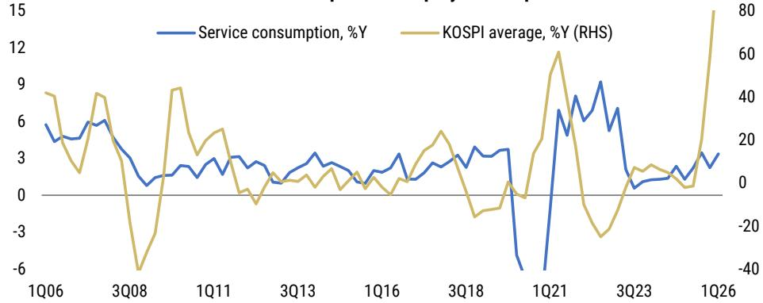

line chart

| Quarter | Service consumption, %Y | KOSPI average, %Y (RHS) |
| ------- | ------------------------ | ------------------------ |
| 1Q06    | ~5.5                     | ~80                      |
| 3Q08    | ~1.5                     | ~-60                     |
| 1Q11    | ~2.5                     | ~90                      |
| 3Q13    | ~2.0                     | ~20                      |
| 1Q16    | ~2.5                     | ~50                      |
| 3Q18    | ~3.0                     | ~-20                     |
| 1Q21    | ~-60                     | ~60                      |
| 3Q23    | ~1.0                     | ~-20                     |
| 1Q26    | ~3.0                     | ~80                      |

Source: Bloomberg, BoK, MS

## (2) Reduced systemic leverage and asset skewness to real estate; appeasing concerns on financial imbalance

Asset skewness in Korea has been a ongoing issue for financial stability and economic growth. Not just real estate comprising 75% of the household sector balance sheet, but on a wider economy-level across Korea's three major economic sectors, households, corporates and the public sector, there is a stark contrast in real estate concentration. Using the share of non-financial assets vs financial assets as a percentage of total assets comparison, the household sector is the most severely skewed toward real estate of any sector. The public and the corporate sector have a more balanced financial assets base with 72% and 82% of their book in financial assets.

This household-corporate divergence remains a key constraining factor to household consumption capacity as well as national efficiency of resources. Not only has private consumption remained constrained by elevated household debt levels, it also has a negative spillover leading to potential systemic implications as the heavy concentration of household wealth in illiquid real estate limits capital flows into productive corporate investment, constrains household liquidity, and amplifies the sensitivity of the economy to housing price cycles. By encouraging household asset transfer from real assets to equity investments, we expect household liquidity conditions to improve. In April 2026, local authorities formally set a target to reach the 80% level by 2030, which the government believes is crucial for restoring growth momentum and ensuring financial stability.

We think the economic rationale for this target is well-grounded. BoK research indicates that a 1%p rise in the household credit-to-GDP ratio (cumulative over three years) can lead to a 0.25-0.28%p decline in the GDP growth (cumulative over three years) after a 4-5 year lag (Financial Stability Report, December 2025). The good news is that due to the strong tech exports this year pushing the nominal GDP growth higher potentially over 10%p, which could bring the ratio below to 79% by end-2026. However, this is due to the size of the export deflator pushing up the denominator rather than due to de-leveraging. The target is likely set to a lower ratio considering the potential GDP growth fluctuations.

Exhibit 46: Korea's financial imbalance with high asset skewed in real estate by the household sector vs. corporates  
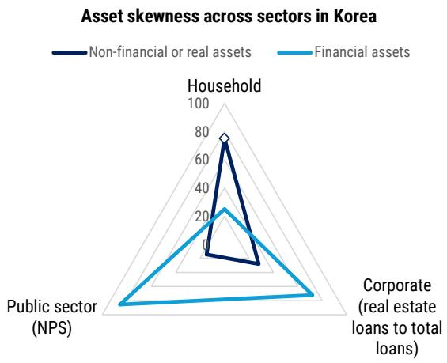

radar chart

| Sector | Non-financial or real assets | Financial assets |
| --- | --- | --- |
| Household | 80 | 30 |
| Corporate (real estate loans to total loans) | 20 | 60 |
| Public sector (NPS) | 10 | 70 |

Source: BoK National Balance Sheet (2024), MS

Exhibit 47: Local authorities target to lower Korea's household debt level to 80% of GDP by 2030 from 93% as of 2025  
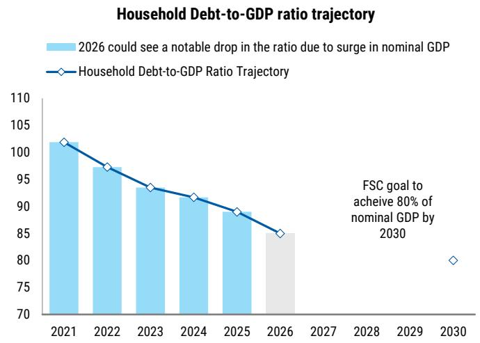  
Source: BoK, FSC, MS

## (3) Diversifying household income channels beyond labor and real asset returns

The shift to financial assets can also change the household income structure, which is highly labor income-dependent. Historically, Korea's household income structure has been dominated by labor income. Labor income accounted for 64% of total household income in 2025, while business income fell from 20% to 17.5% over the same period, highlighting the dominant role of labor activity and labor market as the primary income source.

We think this heavy dependence on a single income channel, labor, creates structural vulnerabilities that equity-based asset accumulation can help address. Securing diversified channels of household asset accumulation could lead to more stable income earning channels against the structural backdrop of an aging population that erodes the labor income base, a pension system with low replacement ratios, and a real estate-heavy balance sheet that constrains liquidity and amplifies leverage. This eventually could lead to stronger economic growth via a consumption recovery, which is secured by a broad-based and sustained income channels and outlook.

In particular, dividend income could offer a sustained income channel on top of pure return on investment. With the government's corporate reform on tackling on Korea's historically lower dividend payout ratios compared to advanced markets, and an average of around 25%, dividend income growth will likely provide a stable, long-term source of income to the household sector.

In fiscal 2025, 566 Korean corporates' total cash dividends reached a record W35.1tn, up 15.5%Y, extending the expansion trend for the 4th consecutive year. The average payout ratio for these companies rose to 39.8%, with the average dividend yield rising to 2.6%. As a result, household dividend income grew to W38.5tn, up from W33tn in 2023, which was prior to the government's reform on dividend payouts. At the same time, the size remains small at 2.55% of gross national disposable income, with more room to grow compared to other economies, such as in Japan (3-5%) and the US (6-9%).

Exhibit 48: Income breakdown across labor, financial and real asset returns show a heavy dependency on labor income  
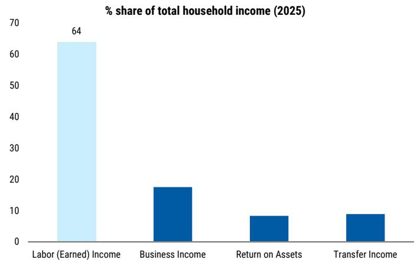

bar chart

% share of total household income (2025)
| Category | % share of total household income (%) |
| :--- | :--- |
| Labor (Earned) Income | 64 |
| Business Income | 18 |
| Return on Assets | 8 |
| Transfer Income | 9 |

Source: Korea Statistics, MS

Exhibit 49: Households' dividend income shows an up-trend, yet remains relatively low at 2.2% of total disposable income  
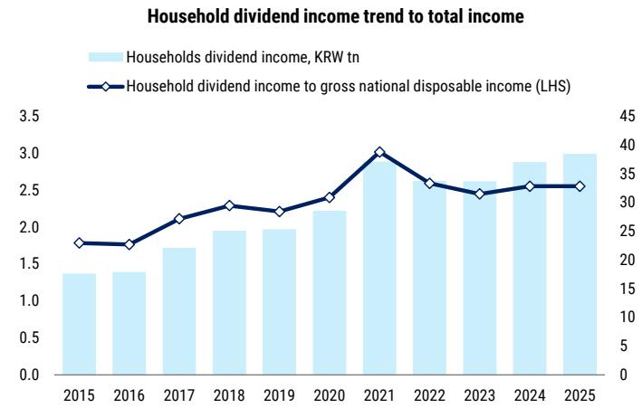

bar-line hybrid

Household dividend income trend to total income
| Year | Households dividend income, KRW tn (in KRW tn) | Household dividend income to gross national disposable income (LHS) |
| :--- | :--- | :--- |
| 2015 | 1.38 | 24 |
| 2016 | 1.39 | 24 |
| 2017 | 1.72 | 28 |
| 2018 | 1.96 | 30 |
| 2019 | 1.98 | 29 |
| 2020 | 2.21 | 31 |
| 2021 | 2.85 | 40 |
| 2022 | 2.58 | 35 |
| 2023 | 2.57 | 33 |
| 2024 | 2.87 | 34 |
| 2025 | 2.98 | 34 |

Source: BoK, MS

## Negative implications: (1) Heightened exposure to market volatility

As Korean households already carry a large debt burden, a period of elevated equity market exposure could stretch liquidity, slow consumption, and increase debt-service stress. While we view the structural shift in Korean household balance sheets towards equities as a long-term positive, it may also raise risks that were less prominent before 2020, when household equity investment was smaller in scale and scope. The record-high level of equity holdings warrants caution as the size of households' equity share could become disproportionate. The scale of equity asset accumulation within Korean household balance sheets reached a record high, W1,644tn as of 2025, or 61% of nominal GDP, a notable jump from the previous five-year trend of 45%. By 2027, we estimate that this is likely to grow to over 81% of nominal GDP. This would heighten household sensitivity to equity market volatility, which has been more elevated of late.

## (2) Risks around asymmetry in reverse wealth effect

We flag that higher market volatility likely suppresses household consumption more than the equivalent gains that stimulate it. Historically, Korea's equity market-driven wealth effect has been limited. Given the small share of active retail investors pre-2020, the wealth effect from equity gains was structurally weak in absolute terms. At the same time, historically households have held a strong bias towards assets viewed as less risky, which results in a lack of experience of in managing volatility.

In 2005-25, the correlation between overall consumption growth and KOSPI gains was relatively weak (R-squared: 0.20), but the correlation with durable goods consumption was more stable (0.41). However, historically, we calculate the wealth effect from equities has a coefficient of only 0.17 on consumption, compared to 0.81 for labor income. This is because in the past, households often perceived the gains from stocks as temporary windfalls rather than permanent income due to market volatility, which dampened the impact on consumption. We note that during periods of higher volatility, potential losses could be perceived as permanent shocks.

Exhibit 50: Size of equity assets held by households set to reach highest share, at 35%, of total financial assets  
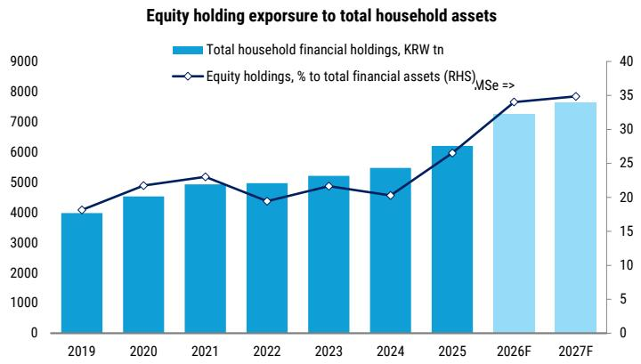

bar-line hybrid

Equity holding exposure to total household assets
| Year | Total household financial holdings, KRW tn | Equity holdings, % to total financial assets (RHS) |
| :--- | :--- | :--- |
| 2019 | 4000 | 18 |
| 2020 | 4500 | 23 |
| 2021 | 5000 | 25 |
| 2022 | 5000 | 20 |
| 2023 | 5200 | 23 |
| 2024 | 5500 | 21 |
| 2025 | 6200 | 28 |
| 2026F | 7300 | 35 |
| 2027F | 7600 | 36 |
MSe =>

Source: BoK, MS forecasts

Exhibit 51: This likely extends the size to over 80% of nominal GDP by 2027 vs. 61% in 2025 and 43% in 2024  
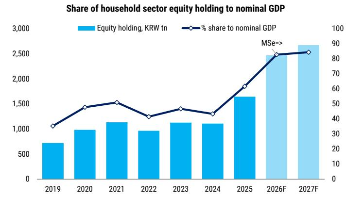

bar-line hybrid

| Year | Equity holding, KRW tn | % share to nominal GDP |
| :--- | :--- | :--- |
| 2019 | 730 | 35 |
| 2020 | 980 | 45 |
| 2021 | 1130 | 50 |
| 2022 | 960 | 42 |
| 2023 | 1130 | 45 |
| 2024 | 1110 | 43 |
| 2025 | 1640 | 65 |
| 2026F | 2480 | 85 |
| 2027F | 2700 | 88 |
MSe=>

Source: BoK, MS forecasts

## (3) Higher sensitivity to tighter financial conditions

Households' sensitivity to rising interest rates not only adds pressure to their already high leverage but also new loans for equity investments. Coupled with the pre-existing high level of household debt, it reached a record high of W1,993tn as of 1Q26, which was composed of 60% mortgages and the rest other loans and credit card debt. This recent shift toward equity investments also brings exposure the surge in margin lending. Margin lending balances, although at a manageable level currently, surged from KRW27.4tn at end-2025 to KRW37.7tn for the KOSPI and the KOSDAQ in early June 2026.

This high level of additional leverage directly increases sensitivity to tighter financial conditions. Given the structure of margin loans, further market declines could trigger forced selling as collateral values fall, potentially amplifying downside volatility in the equity market. Korea's equity market has recently shown acute sensitivity to global interest rate expectations, alongside its own rate-hiking cycle, which is expected in 2H26. Major local securities firms have already temporarily suspended new purchases through margin lending after exhausting their respective credit limits during the March 2026 correction.

In addition, Korean households' bias towards real assets, and the potential constraints created by large illiquid asset holdings, could increase pressure to cover debt service during periods of high market volatility. Coupled with the administration's restrictive credit policies and recent housing market regulations, we think household liquidity pressures could intensify, given the substantial debt tied to illiquid property assets. We see greater concern this time, as the economy has seen a rapid build-up in underlying inflation in recent months driven both by the supply and demand side forces. The BoK has signalled an imminent rate-hiking cycle on the way (see: BoK Review: All Signs Point to Hiking Path).

Exhibit 52: Households' sensitivity to rising interest rates adds pressure to their already high leverage  
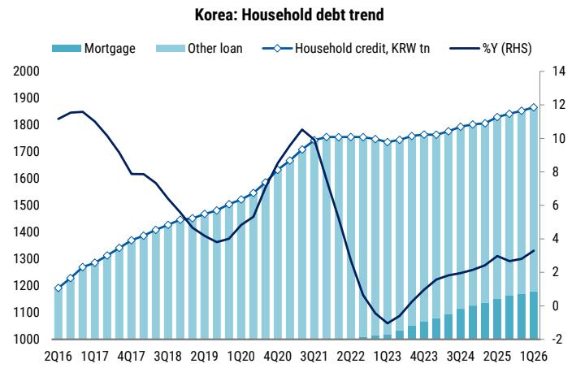

line chart

| Quarter | Mortgage | Other loan | Household credit, KRW tn | %Y (RHS) |
|---------|----------|------------|---------------------------|----------|
| 2Q16    | 1200     | 1200       | 1200                      | 14       |
| 1Q17    | 1300     | 1300       | 1300                      | 14       |
| 4Q17    | 1400     | 1400       | 1400                      | 12       |
| 3Q18    | 1500     | 1500       | 1500                      | 8        |
| 2Q19    | 1600     | 1600       | 1600                      | 6        |
| 1Q20    | 1700     | 1700       | 1700                      | 4        |
| 4Q20    | 1800     | 1800       | 1800                      | 8        |
| 3Q21    | 1900     | 1900       | 1900                      | 12       |
| 2Q22    | 2000     | 2000       | 2000                      | 4        |
| 1Q23    | 2100     | 2100       | 2100                      | -2       |
| 4Q23    | 2200     | 2200       | 2200                      | 0        |
| 3Q24    | 2300     | 2300       | 2300                      | 2        |
| 2Q25    | 2400     | 2400       | 2400                      | 3        |
| 1Q26    | 2500     | 2500       | 2500                      | 3        |

Source: BoK, MS

Exhibit 53: Amid persistent increase in mortgage loans, other loans turned around to an increase past 4 quarters  
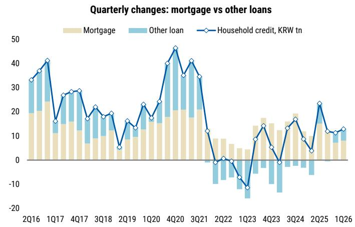

bar-line hybrid

Quarterly changes: mortgage vs other loans
| Quarter | Mortgage (KRW tn) | Other loan (KRW tn) | Household credit, KRW tn |
| :--- | :--- | :--- | :--- |
| 2Q16 | 33 | 14 | 19 |
| 1Q17 | 16 | 15 | 24 |
| 4Q17 | 28 | 10 | 28 |
| 3Q18 | 18 | 10 | 20 |
| 2Q19 | 5 | 10 | 16 |
| 1Q20 | 23 | 10 | 18 |
| 4Q20 | 46 | 15 | 30 |
| 3Q21 | 34 | 15 | 23 |
| 2Q22 | -1 | -10 | -1 |
| 1Q23 | -12 | -15 | -13 |
| 4Q23 | 14 | -5 | 14 |
| 3Q24 | 17 | -5 | 17 |
| 2Q25 | 23 | -5 | 23 |
| 1Q26 | 12 | 5 | 12 |

Source: BoK, MS

# Implications for CPI Inflation and Monetary Policy

## Amplified wealth effect to accelerate inflation build-up

The faster and more liquid nature of equity returns relative to real estate suggests a more direct pass-through to household income, with broader implications for inflation. As household equity wealth rises, we expect the first-round effect to appear among upper-income households through increased spending, particularly on durable goods and luxury items, adding demand-side inflationary pressure. KOSPI gains show a high correlation with durable goods consumption growth over the past 20 years, with durable goods consumption tracking KOSPI gains most closely among goods categories. The top 20% of Korean households hold approximately 87% of equities, which means the initial consumption impulse is concentrated at the upper end of the income distribution.

Critically, we also identify a second-round channel through services inflation. Personal services inflation, in particular, has shown a strong correlation with KOSPI movements over the past five years, with a lag of approximately 15-16 months. Compared with the broader 25-year historical analysis, the more recent five-year period, during which retail investor participation in the equity market increased significantly, shows a stronger and more durable correlation between equity market performance and services inflation.

As argued above, the structure of the wealth effect has evolved with the surge in retail investor participation, suggesting that equity-related wealth gains likely generate a more pronounced and immediate positive effect on consumption. This contrasts with wealth from real estate, where gains remain largely unrealized and require refinancing, linked to the household debt burden, or require a sale to convert them into consumption capacity.

## Effects on inflation near-term; financial stability long-term

These dynamics carry a two-layer implication for monetary policy, in our view. In the near term, the more immediate concern runs through the inflationary channel: an amplified wealth effect, rising household equity wealth, and the likely upward shift in household inflation expectations potentially intensifying the BoK's focus on price stability. We see that strong exports, coupled with a booming local equity market lifting domestic demand across investment and consumption, could see services inflation move beyond base case expectations. This is consistent with the BoK MPC's acknowledgment at its May 2026 meeting that the positive spillover from wealth effect has become stronger, one of the factors behind the pivot toward a tightening cycle, with the first rate hike now expected in July 2026.

Over the longer term, however, the household asset shift from real assets to financial assets carries a potentially stabilizing effect on financial imbalances. By redirecting household assets away from leveraged real estate holdings toward equity holdings, the shift could slow the pace of household debt accumulation. Even as the shift generates demand-pull inflationary pressure in the near term, it simultaneously reduces the systemic risks associated with the household debt, offering the BoK room to focus on its price stability mandate without the competing constraint of financial stability risks that at times have complicated its policy decisions.

Exhibit 54: Rising financial asset wealth passing through to household income likely implies inflationary pressure build-up; Our analysis shows that KOSPI move showed high correlation with a statistical lead of 15-18 months  
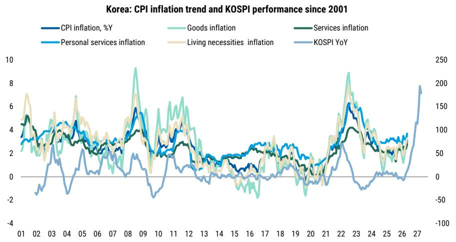

line chart

| Year | CPI inflation, %Y | Goods inflation | Services inflation | Personal services inflation | Living necessities inflation | KOSPI YoY |
|------|-------------------|-----------------|--------------------|------------------------------|-----------------------------|-----------|
| 01   | ~3.5              | ~3.0            | ~4.5               | ~4.0                         | ~6.5                        | ~-10      |
| 02   | ~3.0              | ~3.5            | ~4.0               | ~3.5                         | ~6.0                        | ~-5       |
| 03   | ~3.5              | ~4.0            | ~4.5               | ~4.0                         | ~6.5                        | ~-2       |
| 04   | ~4.0              | ~4.5            | ~5.0               | ~4.5                         | ~7.0                        | ~1        |
| 05   | ~4.5              | ~5.0            | ~5.5               | ~5.0                         | ~7.5                        | ~2        |
| 06   | ~5.0              | ~5.5            | ~6.0               | ~5.5                         | ~8.0                        | ~3        |
| 07   | ~5.5              | ~6.0            | ~6.5               | ~6.0                         | ~8.5                        | ~4        |
| 08   | ~6.0              | ~9.0            | ~7.0               | ~6.5                         | ~9.0                        | ~5        |
| 09   | ~6.5              | ~7.5            | ~6.5               | ~7.0                         | ~8.5                        | ~6        |
| 10   | ~7.0              | ~7.0            | ~6.0               | ~7.5                         | ~8.0                        | ~7        |
| 11   | ~7.5              | ~7.5            | ~6.5               | ~8.0                         | ~8.5                        | ~8        |
| 12   | ~8.0              | ~8.0            | ~7.0               | ~8.5                         | ~9.0                        | ~9        |
| 13   | ~8.5              | ~8.5            | ~7.5               | ~9.0                         | ~9.5                        | ~10       |
| 14   | ~9.0              | ~9.0            | ~8.0               | ~9.5                         | ~10.0                       | ~11       |
| 15   | ~9.5              | ~9.5            | ~8.5               | ~10.0                        | ~10.5                       | ~12       |
| 16   | ~10.0             | ~10.0           | ~9.0               | ~10.5                        | ~11.0                       | ~13       |
| 17   | ~10.5             | ~10.5           | ~9.5               | ~11.0                        | ~11.5                       | ~14       |
| 18   | ~11.0             | ~11.0           | ~10.0              | ~11.5                        | ~12.0                       | ~15       |
| 19   | ~11.5             | ~11.5           | ~10.5              | ~12.0                        | ~12.5                       | ~16       |
| 20   | ~12.0             | ~12.0           | ~11.0              | ~12.5                        | ~13.0                       | ~17       |
| 21   | ~12.5             | ~12.5           | ~11.5              | ~13.0                        | ~13.5                       | ~18       |
| 22   | ~13.0             | ~13.0           | ~12.0              | ~13.5                        | ~14.0                       | ~19       |
| 23   | ~13.5             | ~13.5           | ~12.5              | ~14.0                        | ~14.5                       | ~20       |
| 24   | ~14.0             | ~14.0           | ~13.0              | ~14.5                        | ~15.0                       | ~21       |
| 25   | ~14.5             | ~14.5           | ~13.5              | ~15.0                        | ~15.5                       | ~22       |
| 26   | ~15.0             | ~15.0           | ~14.0              | ~15.5                        | ~16.0                       | ~23       |
| 27   | ~8.0              | -               | -                  | -                            | -                           | -         |
The chart includes data series for CPI inflation, Goods inflation, Services inflation, Personal services inflation, Living necessities inflation, and KOSPI YoY over time.

Source: BoK, MS

## BoK hiking cycle to start July 2026 and persist through 2027

We assess the structural shift in Korean household assets towards equity investments as net inflationary in the near term. While the BoK noted limited wealth-effect transmission at its February 2026 post-meeting press conference, by the May 2026 meeting the MPC acknowledged that the positive spillover from the recent rise in households' financial assets had become stronger. Against this backdrop, the BoK is now pivoting towards a tightening cycle.

With growth rebounding and demand-driven inflation becoming the dominant concern, we expect the first rate hike in July 2026, initiating a hiking cycle that extends through 2027. The BoK's renewed confidence in fundamentals-driven growth and sustained inflation has prompted a shift in our view – from an incremental hiking cycle to an earlier and longer one. We see a total of 100bp in cumulative hikes over the cycle, with the first hike in July followed by October and two hikes in 1H27, taking the terminal rate to 3.5% by end-2Q27.

Exhibit 55: We expect a hiking cycle to start from July 2026 through mid-2027  
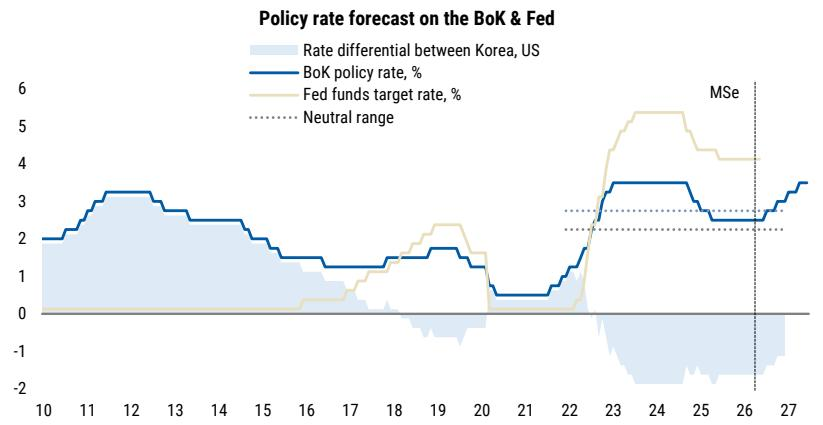

line chart

| Year | Rate differential between Korea, US | BoK policy rate, % | Fed funds target rate, % | Neutral range |
|------|------------------------------------|--------------------|--------------------------|---------------|
| 10   | ~2.0                               | ~2.0               | ~0.0                     | ~0.0          |
| 11   | ~2.5                               | ~2.5               | ~0.0                     | ~0.0          |
| 12   | ~3.0                               | ~3.0               | ~0.0                     | ~0.0          |
| 13   | ~2.8                               | ~2.8               | ~0.0                     | ~0.0          |
| 14   | ~2.5                               | ~2.5               | ~0.0                     | ~0.0          |
| 15   | ~2.0                               | ~2.0               | ~0.0                     | ~0.0          |
| 16   | ~1.5                               | ~1.5               | ~0.0                     | ~0.0          |
| 17   | ~1.2                               | ~1.2               | ~0.5                     | ~0.0          |
| 18   | ~1.0                               | ~1.0               | ~1.0                     | ~0.0          |
| 19   | ~1.5                               | ~1.5               | ~1.5                     | ~0.0          |
| 20   | ~1.0                               | ~1.0               | ~1.0                     | ~0.0          |
| 21   | ~0.5                               | ~0.5               | ~0.5                     | ~0.0          |
| 22   | ~1.0                               | ~1.0               | ~1.0                     | ~2.5          |
| 23   | ~3.5                               | ~3.5               | ~4.5                     | ~2.5          |
| 24   | ~3.5                               | ~3.5               | ~5.5                     | ~2.5          |
| 25   | ~3.0                               | ~3.0               | ~4.5                     | ~2.5          |
| 26   | ~2.5                               | ~2.5               | ~4.0                     | ~2.5          |
| 27   | ~3.5                               | ~3.5               | ~4.5                     | ~2.5          |

Source: BoK, MS forecasts

# Household Financial Assets – Scenario Analysis

## Retail investors expected to trade both domestic and overseas equities

## Retail inflow turning the tables for domestic equities

We had flagged domestic liquidity as a swing factor for 2026, especially how retail investors will participate in the domestic equity market. YTD we have seen strong retail inflows (+W68tn as of June 4), making an about-face vs. 2025 (-W26tn). Customer deposit balances have moved up – they peaked at around W132tn in early March before declining, but rebounded to W131.6tn as of end-May. Meanwhile, margin lending balances have continued to rise, reaching about W27.9tn for the KOSPI and W9.8tn for the KOSDAQ.

Exhibit 56: Customer Deposit Balance  
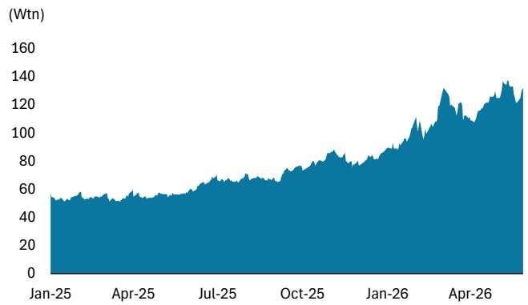

area chart

| Date   | Value (Wtn) |
|--------|-------------|
| Jan-25 | ~55         |
| Apr-25 | ~60         |
| Jul-25 | ~70         |
| Oct-25 | ~80         |
| Jan-26 | ~90         |
| Apr-26 | ~130        |

Source: WiseFN, KOFIA, MS

Exhibit 57: KOSPI + KOSDAQ: Margin Loan Balance  
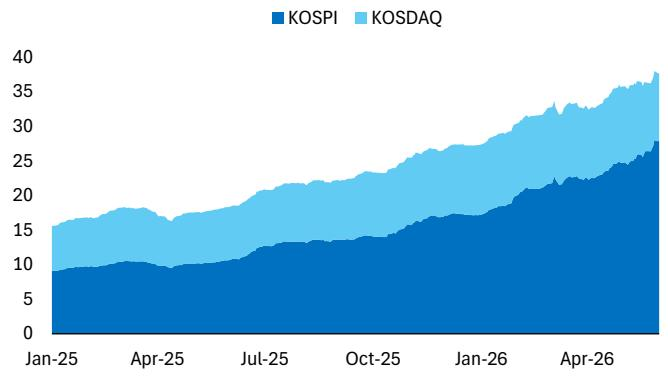

stacked bar chart

| Date   | KOSPI | KOSDAQ |
|--------|-------|--------|
| Jan-25 | 9     | 10     |
| Apr-25 | 10    | 12     |
| Jul-25 | 12    | 13     |
| Oct-25 | 14    | 15     |
| Jan-26 | 17    | 18     |
| Apr-26 | 25    | 28     |

Source: WiseFN, KOFIA, MS

ETFs are becoming the preferred method of trading for retail: ETF-related flows likely account for a meaningful portion of domestic institution flows, but the end clients are mostly retail. As of end-2024, the ETF balance was W167tn, with domestic equity-linked ETFs at W40tn, but this has grown considerably to W456tn and W212tn, respectively, as of May 7, 2026. It would appear that FOMO sentiment has been building up among domestic retail investors, and many have been using ETFs as a way of investing in the stock market.

\- Until now, ETFs have been mostly linked to either of the stock indices or to specific themes. However, from the end of May, single-stock ETFs – with Samsung Electronics and SK Hynix as underlying assets – were launched.

ETF flows have been one of the key drivers of the domestic equity market, spurred not only by local investors but also by overseas investors. ETFs can be a double-edged sword: on the way up they are a catalyst, but they could have the same effect on the way down. We will have to monitor the flows closely.

Exhibit 58: Domestic Equity ETF AUM Trend  
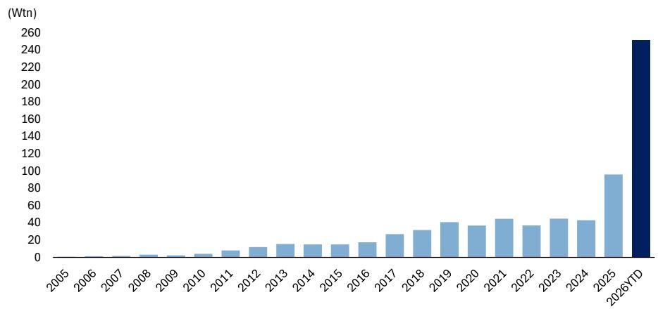

bar chart

| Year | Value (Wtn) |
| :--- | :--- |
| 2005 | 1 |
| 2006 | 1 |
| 2007 | 1 |
| 2008 | 3 |
| 2009 | 2 |
| 2010 | 4 |
| 2011 | 8 |
| 2012 | 13 |
| 2013 | 16 |
| 2014 | 15 |
| 2015 | 15 |
| 2016 | 18 |
| 2017 | 27 |
| 2018 | 32 |
| 2019 | 41 |
| 2020 | 36 |
| 2021 | 44 |
| 2022 | 36 |
| 2023 | 44 |
| 2024 | 43 |
| 2025 | 96 |
| 2026YTD | 250 |

Source: WiseFN, MS, Data as of Jun 2, 2026

## Overseas equity looks like a structural change as individuals build up portfolios

Retail investors' overseas equity holdings continue to show an upward trajectory. A decline in net buying in April quickly recovered in May to net inflows into overseas equity. However, cumulative net buying has declined in 2026 vs. 2025 with YTD net buying at US \$8.6bn as of end-May, down 38% Y/Y. We see this as a natural trend as wealth builds up in households, leading to a need to diversify portfolios. However, the government is trying to encourage the flow of household assets to remain in the domestic capital market.

\- The government introduced the RIA (Reshoring Investment Account) in March 2026 to incentivize overseas equity investors to participate in the domestic stock market. This has now entered phase 2 – phase 1 ended in May. According to media reports (ChosunBiz, April 29), the number of accounts reached 183,087, with total assets of around W1.25tn as of April 28 – still not a meaningful level relative to domestic investors' holdings of overseas equities.

Exhibit 59: Retail investors: monthly net buying of US equities  
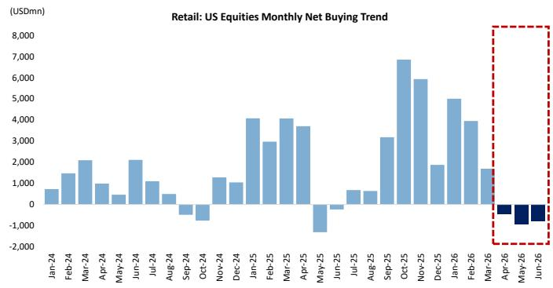

bar chart

| Month    | Net Buying (USDmn) |
| -------- | ------------------ |
| Jan-24   | 700                |
| Feb-24   | 1500               |
| Mar-24   | 2000               |
| Apr-24   | 1000               |
| May-24   | 500                |
| Jun-24   | 2000               |
| Jul-24   | 1000               |
| Aug-24   | 500                |
| Sep-24   | -500               |
| Oct-24   | -1000              |
| Nov-24   | 1200               |
| Dec-24   | 1000               |
| Jan-25   | 4000               |
| Feb-25   | 3000               |
| Mar-25   | 4000               |
| Apr-25   | 3500               |
| May-25   | -1000              |
| Jun-25   | -500               |
| Jul-25   | 700                |
| Aug-25   | 700                |
| Sep-25   | 3000               |
| Oct-25   | 7000               |
| Nov-25   | 6000               |
| Dec-25   | 1800               |
| Jan-26   | 5000               |
| Feb-26   | 4000               |
| Mar-26   | 1500               |
| Apr-26   | -500               |
| May-26   | -1000              |
| Jun-26   | -1000              |

Source: SEIBRO, MS, Data as of June 4, 2026

Exhibit 60: Retail investors: overseas equity holdings  
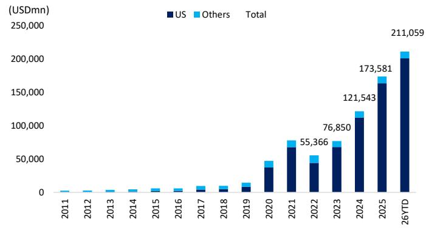

stacked bar chart

| Year | US (USDmn) | Others (USDmn) | Total (USDmn) |
| :--- | :--- | :--- | :--- |
| 2011 | 0 | 3000 | 0 |
| 2012 | 0 | 3000 | 0 |
| 2013 | 0 | 4000 | 0 |
| 2014 | 0 | 5000 | 0 |
| 2015 | 0 | 6000 | 0 |
| 2016 | 500 | 7000 | 0 |
| 2017 | 800 | 9000 | 0 |
| 2018 | 1000 | 11000 | 0 |
| 2019 | 12000 | 13000 | 0 |
| 2020 | 38000 | 15000 | 15000 |
| 2021 | 68000 | 18000 | 35000 |
| 2022 | 45000 | 16000 | 55366 |
| 2023 | 68000 | 14000 | 76850 |
| 2024 | 115000 | 15433 | 121543 |
| 2025 | 165000 | 173581 | 173581 |
| 26YTD | 211,059 | 14389 | 211,059 |

Source: SEIBRO, MS, Data as of June 4, 2026

## Current market narrative expected to keep retail investors in equities in 2026\~2027

With the aggregate market cap for the KOSPI and KOSDAQ at W6,632tn as of June 8,

2026 and leaning more to our bull case than our bear case, we assume that household equity holdings value should show a significant increase in 2026 vs. 2025. We assume a \~10ppt increase in the proportion of equity holdings in the next two years: from 26.5% as of 2025 to 34.9% by 2027, with most of the gains coming in 2026. The incremental increase of equity holdings is expected to be around W1,000tn with 2027 total equity holdings being around W2,700tn.

In our bull case – in which positive market sentiment, especially around the secular AI boom cycle is maintained and the reform push leads to meaningful progress from the corporate sector – we believe equity holdings would reach beyond W2,900tn by 2027, accounting for around 36.5% of financial assets.

For our bear case, we envisage weaker macro trends with the AI story having some bumps in the road; the reform policy is pushed out more aggressively, but the corporate sector response is muted. Not only would this mean that the KOSPI could be weaker, retail investors could also turn more conservative about putting money into equities.

Exhibit 61: Korea – Aggregate Household Financial Holdings Trend and Forecast (Base Case)

<table><tr><td>(KRW in trillions)</td><td>2019</td><td>2020</td><td>2021</td><td>2022</td><td>2023</td><td>2024</td><td>2025</td><td>2026F</td><td>2027F</td></tr><tr><td>Total household financial holdings</td><td>3,981.5</td><td>4,532.8</td><td>4,927.3</td><td>4,971.2</td><td>5,209.4</td><td>5,472.6</td><td>6,201.9</td><td>7,256.8</td><td>7,656.4</td></tr><tr><td>Currency &amp; Deposits</td><td>1,782.9</td><td>1,966.7</td><td>2,139.0</td><td>2,285.6</td><td>2,414.2</td><td>2,536.7</td><td>2,676.5</td><td>2,730.0</td><td>2,811.9</td></tr><tr><td>Insurance &amp; Pension Reserves</td><td>1,307.8</td><td>1,399.2</td><td>1,498.3</td><td>1,545.4</td><td>1,457.6</td><td>1,579.0</td><td>1,650.3</td><td>1,815.3</td><td>1,906.1</td></tr><tr><td>Securities other than Shares</td><td>141.5</td><td>148.0</td><td>117.3</td><td>133.2</td><td>168.6</td><td>199.6</td><td>182.1</td><td>192.1</td><td>217.1</td></tr><tr><td>Equities &amp; Equivalent</td><td>722.2</td><td>985.3</td><td>1,134.1</td><td>966.1</td><td>1,127.9</td><td>1,109.3</td><td>1,644.3</td><td>2,469.3</td><td>2,669.3</td></tr><tr><td>Others</td><td>27</td><td>34</td><td>39</td><td>41</td><td>41</td><td>48</td><td>49</td><td>50</td><td>52</td></tr><tr><td>(%)</td><td>2019</td><td>2020</td><td>2021</td><td>2022</td><td>2023</td><td>2024</td><td>2025</td><td>2026F</td><td>2027F</td></tr><tr><td>Currency &amp; deposits</td><td>44.8</td><td>43.4</td><td>43.4</td><td>46.0</td><td>46.3</td><td>46.4</td><td>43.2</td><td>37.6</td><td>36.7</td></tr><tr><td>Insurance &amp; pension reserves</td><td>32.8</td><td>30.9</td><td>30.4</td><td>31.1</td><td>28.0</td><td>28.9</td><td>26.6</td><td>25.0</td><td>24.9</td></tr><tr><td>Bond holdings</td><td>3.6</td><td>3.3</td><td>2.4</td><td>2.7</td><td>3.2</td><td>3.6</td><td>2.9</td><td>2.6</td><td>2.8</td></tr><tr><td>Equities &amp; Equivalent</td><td>18.1</td><td>21.7</td><td>23.0</td><td>19.4</td><td>21.7</td><td>20.3</td><td>26.5</td><td>34.0</td><td>34.9</td></tr></table>

Source: BoK fund of flows data (2025), MS (F) estimates

Exhibit 62: Household Equity Holdings – Base, Bull, and Bear Cases  
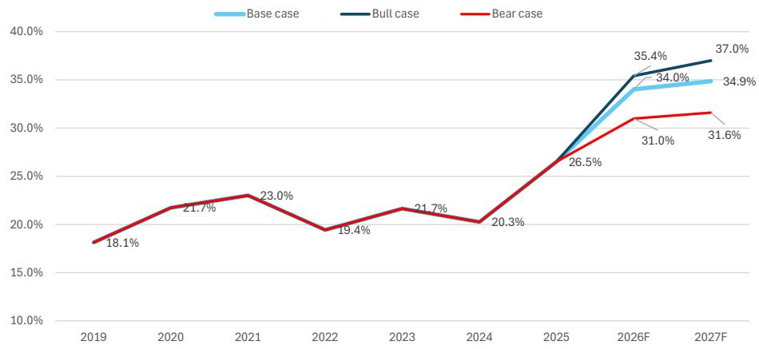

line chart

| Year | Base case (%) | Bull case (%) | Bear case (%) |
| :--- | :--- | :--- | :--- |
| 2019 | 18.1 | 18.1 | 18.1 |
| 2020 | 21.7 | 21.7 | 21.7 |
| 2021 | 23.0 | 23.0 | 23.0 |
| 2022 | 19.4 | 19.4 | 19.4 |
| 2023 | 21.7 | 21.7 | 21.7 |
| 2024 | 20.3 | 20.3 | 20.3 |
| 2025 | 26.5 | 26.5 | 26.5 |
| 2026F | 34.0 | 35.4 | 31.0 |
| 2027F | 34.9 | 37.0 | 31.6 |

Source: BoK fund of flows data (2025), MS (F) estimates

## Long-term sustainability depends more on policy path

Taking a reference from Japan's recent reform case and the pace of recent household fund flow patterns, we think Korean households will be incentivized to increase their equity holdings. In all of our scenarios, we have the proportion of equity holdings in total financial assets increasing, but the rate of change varies.

The more important question, however, is not whether a cyclical rally can boost brokerage earnings in the short term. It is whether this rally can become the starting point for a broader redistribution of household assets from property and deposits into longer-duration financial products. A durable expansion in domestic retail liquidity cannot rely solely on explosive capital gains from a narrow group of cyclical stocks. For retail participation to become structurally stickier, Korea needs a broader re-rating of quality companies, dividend stocks, and stable yield-oriented equities. In this sense, capital market reform, governance improvement, shareholder return policies, and tax incentives are not separate from the wealth effect. Rather, they are the conditions required to convert trading gains into long-term equity ownership.

We believe these are prerequisites for long-term sustainability of retail investors' participation in the equity market.

(1) The current rally likely needs to be sustained without a bear market (20% or greater correction) in order to build up retail investors' confidence in the domestic market. This means that the structural stories driving the market need to continue; also, more quality companies need to be available for investors.

(2) Capital market and governance reform needs to continue, with companies responding positively to the changes, albeit at a gradual rate. Minority shareholders are treated equally and companies are more friendly towards the market. At the end of the day, we would need to see total shareholder returns (dividend payout ratio + buyback ratio) continuing to narrow the gap with global markets.

\- Policy direction appears increasingly aligned with this objective. The Corporate Value-up framework was designed to encourage listed companies to improve valuations, strengthen communication with shareholders, and enhance shareholder returns. The Ministry of Economy and Finance's 2025 tax revisions also included separate taxation for dividend income from high-dividend companies, while the government has also discussed expanded ISA benefits to promote long-term domestic stock investment.

\- These measures matter because Korea's retail investor base has historically been more capital-gain-oriented and volatility-seeking than yield-oriented. Lower tax friction on dividends, stronger incentives for long holding periods, and broader use of ISA, pension savings, IRP, and retirement pension products could gradually shift retail behavior from short-term trading towards portfolio-based investing.

In our base case, we assume that households continue to allocate more of their financial assets to equities, with the market remaining buoyant, enabling aggregate equity value to be on an upward trajectory (CAGR of 5% for 2028\~2030). We do not discriminate as to whether money is invested into domestic or overseas equities.

\- We do not have KOSPI targets for the 2028\~2030 period. Thus, we have assumed \~5% increase in market cap for Korean equities with households allocating more of their money into equity and/or equity equivalent products.

In our bull case, we assume more money being allocated to equities as market conditions remain constructive, which also leads to stronger gains from existing holdings (CAGR of 7.5% for 2028\~2030).

In our bear case, we assume that money is not moving to equities in size – a more conservative stance is taken by investors. Gains are relatively weak (CAGR of 1.5% for 2028\~2030).

Exhibit 63: Household Financial Assets Growth Trajectory Forecasts

<table><tr><td></td><td>2023</td><td>2024</td><td>2025</td><td>2026F</td><td>2027F</td><td>2028F</td><td>2029F</td><td>2030F</td></tr><tr><td colspan="9">Base Case</td></tr><tr><td>Total household financial holdings, KRW tn</td><td>5,209.4</td><td>5,472.6</td><td>6,201.9</td><td>7,256.8</td><td>7,656.4</td><td>7,981.2</td><td>8,314.9</td><td>8,658.5</td></tr><tr><td>Currency &amp; Deposits</td><td>2,414.2</td><td>2,536.7</td><td>2,676.5</td><td>2,730.0</td><td>2,811.9</td><td>2,882.2</td><td>2,954.2</td><td>3,028.1</td></tr><tr><td>Insurance &amp; Pension Reserves</td><td>1,457.6</td><td>1,579.0</td><td>1,650.3</td><td>1,815.3</td><td>1,906.1</td><td>1,972.8</td><td>2,032.0</td><td>2,088.9</td></tr><tr><td>Securities other than Shares</td><td>168.6</td><td>199.6</td><td>182.1</td><td>192.1</td><td>217.1</td><td>242.1</td><td>272.1</td><td>302.1</td></tr><tr><td>Shares &amp; Other Equities</td><td>1,127.9</td><td>1,109.3</td><td>1,644.3</td><td>2,469.3</td><td>2,669.3</td><td>2,829.5</td><td>2,999.3</td><td>3,179.2</td></tr><tr><td>Others</td><td>41</td><td>48</td><td>49</td><td>50</td><td>52</td><td>55</td><td>57</td><td>60</td></tr><tr><td></td><td>2023</td><td>2024</td><td>2025</td><td>2026F</td><td>2027F</td><td>2028F</td><td>2029F</td><td>2030F</td></tr><tr><td colspan="9">Bull Case</td></tr><tr><td>Total household financial holdings, KRW tn</td><td>5,209.4</td><td>5,472.6</td><td>6,201.9</td><td>7,464.8</td><td>7,957.3</td><td>8,373.1</td><td>8,788.0</td><td>9,202.5</td></tr><tr><td>Currency &amp; Deposits</td><td>2,414.2</td><td>2,536.7</td><td>2,676.5</td><td>2,730.0</td><td>2,784.6</td><td>2,854.2</td><td>2,925.6</td><td>2,998.7</td></tr><tr><td>Insurance &amp; Pension Reserves</td><td>1,457.6</td><td>1,579.0</td><td>1,650.3</td><td>1,848.3</td><td>1,959.2</td><td>2,027.8</td><td>2,088.7</td><td>2,147.1</td></tr><tr><td>Securities other than Shares</td><td>168.6</td><td>199.6</td><td>182.1</td><td>192.1</td><td>217.1</td><td>242.1</td><td>272.1</td><td>302.1</td></tr><tr><td>Shares &amp; Other Equities</td><td>1,127.9</td><td>1,109.3</td><td>1,644.3</td><td>2,644.3</td><td>2,944.3</td><td>3,194.3</td><td>3,444.3</td><td>3,694.3</td></tr><tr><td>Others</td><td>41</td><td>48</td><td>49</td><td>50</td><td>52</td><td>55</td><td>57</td><td>60</td></tr><tr><td></td><td>2023</td><td>2024</td><td>2025</td><td>2026F</td><td>2027F</td><td>2028F</td><td>2029F</td><td>2030F</td></tr><tr><td colspan="9">Bear Case</td></tr><tr><td>Total household financial holdings, KRW tn</td><td>5,209.4</td><td>5,472.6</td><td>6,201.9</td><td>6,919.3</td><td>7,101.6</td><td>7,326.3</td><td>7,547.0</td><td>7,775.7</td></tr><tr><td>Currency &amp; Deposits</td><td>2,414.2</td><td>2,536.7</td><td>2,676.5</td><td>2,783.5</td><td>2,908.8</td><td>2,996.0</td><td>3,070.9</td><td>3,147.7</td></tr><tr><td>Insurance &amp; Pension Reserves</td><td>1,457.6</td><td>1,579.0</td><td>1,650.3</td><td>1,749.3</td><td>1,679.4</td><td>1,721.3</td><td>1,764.4</td><td>1,808.5</td></tr><tr><td>Securities other than Shares</td><td>168.6</td><td>199.6</td><td>182.1</td><td>192.1</td><td>217.1</td><td>230.0</td><td>250.0</td><td>275.0</td></tr><tr><td>Shares &amp; Other Equities</td><td>1,127.9</td><td>1,109.3</td><td>1,644.3</td><td>2,144.3</td><td>2,244.3</td><td>2,324.3</td><td>2,404.3</td><td>2,484.3</td></tr><tr><td>Others</td><td>41</td><td>48</td><td>49</td><td>50</td><td>52</td><td>55</td><td>57</td><td>60</td></tr><tr><td colspan="9">Equity Proportion</td></tr><tr><td></td><td>2023</td><td>2024</td><td>2025</td><td>2026F</td><td>2027F</td><td>2028F</td><td>2029F</td><td>2030F</td></tr><tr><td>Base case</td><td>21.7%</td><td>20.3%</td><td>26.5%</td><td>34.0%</td><td>34.9%</td><td>35.5%</td><td>36.1%</td><td>36.7%</td></tr><tr><td>Bull case</td><td>21.7%</td><td>20.3%</td><td>26.5%</td><td>35.4%</td><td>37.0%</td><td>38.2%</td><td>39.2%</td><td>40.1%</td></tr><tr><td>Bear case</td><td>21.7%</td><td>20.3%</td><td>26.5%</td><td>31.0%</td><td>31.6%</td><td>31.7%</td><td>31.9%</td><td>31.9%</td></tr><tr><td colspan="9">Total Household Financial Assets Growth</td></tr><tr><td></td><td>2023</td><td>2024</td><td>2025</td><td>2026F</td><td>2027F</td><td>2028F</td><td>2029F</td><td>2030F</td></tr><tr><td>Base Case</td><td>4.8%</td><td>5.1%</td><td>13.3%</td><td>17.0%</td><td>5.5%</td><td>4.2%</td><td>4.2%</td><td>4.1%</td></tr><tr><td>Bull Case</td><td></td><td></td><td></td><td>20.4%</td><td>6.6%</td><td>5.2%</td><td>5.0%</td><td>4.7%</td></tr><tr><td>Bear Case</td><td></td><td></td><td></td><td>11.6%</td><td>2.6%</td><td>3.2%</td><td>3.0%</td><td>3.0%</td></tr></table>

Source: BoK fund of flows data (2025), MS (F) estimates

## Implications for the KOSPI and Positioning

## Raising our 1H27 KOSPI target to 9,000 from 8,500

We raise our 12-month forward KOSPI target to 9,000 (from 8,500). We also raise our bull case to 10,500 (from 10,000) and our bear case to 6,500 (from 6,000).

- We set our 12-month forward EPS growth estimate at 90% (previously 100%). The increase in EPS growth is mostly driven by the Tech sector but also the Industrials sector.  
- KOSPI forward P/E valuation is currently at 7.1x. Reflecting this, we set our target P/E multiple at 8.0x (was 8.3x).

Exhibit 64: Scenario Analysis

<table><tr><td></td><td>KOSPI Target</td><td>Key assumptions</td><td>Retail activity2H26-1H27</td><td>Macro conditions</td><td>Monetary conditions</td><td>Real estate</td><td>PolicyCapital markets</td></tr><tr><td>Base Case</td><td>9,000</td><td>Target P/E: 8.0xEPS growth: 90%</td><td>Retail activity is sustained into 1H27 as the AI story continues boost to retail sentiment, with ETFs remaining the instrument of choice while corporate pension money is also more active in ETFs.</td><td>GDP Growth2026: 2.8%2027: 2.2%- Exports are strong with consumption also showing improved trends.</td><td>Policy Rate - end-2026:3.0%, end-2027: 3.5%We assume that monetary policy is on a tightening path.</td><td>Continued tightening path with property taxes being raised from 2027 with further tightening expected for retail lending.</td><td>- Reform policy continues to be pushed, including Capital Market Act reforms.- Memory and peripheral tech maintains positive direction towards our base case.- Proactive macro support policies, such as the Korea Growth Fund, continue.</td></tr><tr><td>Bull Case</td><td>10,500</td><td>Target P/E: 9.0xEPS growth: 100%</td><td>Retail activity is sustained as sentiment remains positive, but we see the domestic retail proportion of trading activity falling as we expect foreign net inflows to improve. Historically, we have seen bull markets show balanced activity between retail and foreign investors.</td><td>GDP Growth2026: 3.0%2027: 2.3%- In this case, we assume US growth accelerates faster on AI productivity boost, leading to faster growth for Korea&#x27;s exports.</td><td>Policy Rate - end-2026:3.0%, end-2027: 3.75%We assume that monetary policy is on a tightening path.</td><td>Same as base case.</td><td>- Reform policy is more proactively pushed forward with corporate sector more responsive.- AI diffusion strengthens as AI productivity gains become more discernible, boosting demand.- Proactive macro support, similar to the base case.</td></tr><tr><td>Bear Case</td><td>6,500</td><td>Target P/E: 6.5xEPS growth: 70%</td><td>Retail activity begins to slow from 2H26 as sentiment sours as the AI story shows signs of stress and a weaker-than-expected macro recovery. We expect retail outflows to be seen from 2H26 with the speed of reversion slower than in previous cases.</td><td>GDP Growth2026: 2.0%2027: 1.6%- Bear case assumes tensions re-escalate and the supply of oil from the Strait of Hormuz is shut off for many months, triggering broad-based demand destruction.</td><td>Policy Rate - end-2026:2.0%, end-2027: 2.0%BoK on an easing path as growth becomes a greater concern.</td><td>Similar to base case but housing prices show weaker trends than the base case.</td><td>- Reform policy drive slows down with corporate response more negative than expected.- AI capex push and/or other factors lead to weaker-than-expected memory demand with rate of change flattening out.- Macro conditions are weaker due to inflationary pressure from higher oil prices; we expect policy support to be more limited than in the base case.</td></tr></table>

Source: MS

Our bull case is 10,500: Our narrative for the bull case scenario reflects stronger earnings growth continuing for the Tech sector as well as broad-based earnings improvement across major cyclical sectors. We also expect domestic market liquidity conditions to be healthy with retail investors remaining active in the market. Our target P/E for the bull case assumes a further re-rating of the KOSPI ex-IT, supported by structural changes around a multipolar world and energy transition-linked opportunities, as well as solid execution of capital market reform initiatives.

Our bear case is 6,500: Our bear case narrative reflects tougher macro conditions, with increasing inflationary risks leading to rate hike pressures, while intensifying geopolitical risks weigh on consumer sentiment and commodity prices. Capital market reform efforts get little momentum amid political hurdles and competing priorities.

Exhibit 65: KOSPI Target and Bull and Bear Cases

<table><tr><td></td><td>MSCI Korea12m Fwd EPS</td><td>EPS Growth</td><td>Target 12m Fwd P/E</td><td>Target MSCI Korea Index</td><td>Upside</td><td>Implied Target for KOSPI</td><td>Implied ROE</td></tr><tr><td>Bull</td><td>390.9</td><td>100.0%</td><td>9.0x</td><td>3,499</td><td>22%</td><td>10,500</td><td>29.4%</td></tr><tr><td>Base</td><td>371.4</td><td>90.0%</td><td>8.0x</td><td>2,971</td><td>4%</td><td>9,000</td><td>27.9%</td></tr><tr><td>Bear</td><td>332.3</td><td>70.0%</td><td>6.5x</td><td>2,143</td><td>-25%</td><td>6,500</td><td>25.0%</td></tr></table>

Source: Datastream, WiseFN, MS Estimates

\- Based on our analysis and keeping all else equal, we estimate that the KOSPI could reach above 9,200 if both Samsung Electronics and SK hynix were to reach MS's price targets, and 10,000 if our analyst's bull case values were reached.

Exhibit 66: Impact on KOSPI linked to Samsung Electronics and SK Hynix Price Targets

<table><tr><td>KOSPI @SEC, Hynix Case Value(as of Jun 3, 2026)</td><td>SEC+Hynix Mkt Cap(Wtn)</td><td>KOSPI mkt cap(Wtn)</td><td>Upside/Downsideto KOSPI</td><td>KOSPI(index price)</td></tr><tr><td>Bull Case</td><td>4,928</td><td>7,945</td><td>13.6%</td><td>10,000</td></tr><tr><td>Base Case</td><td>4,325</td><td>7,342</td><td>5.0%</td><td>9,200</td></tr><tr><td>Bear Case</td><td>1,064</td><td>4,080</td><td>-41.6%</td><td>5,100</td></tr></table>

Source: WiseFN, MS. Note: Including market cap of SEC preferred shares (005935.KS)

Exhibit 67: KOSPI target, bull case, and bear case – three- to six-month range of 7,000\~10,000  
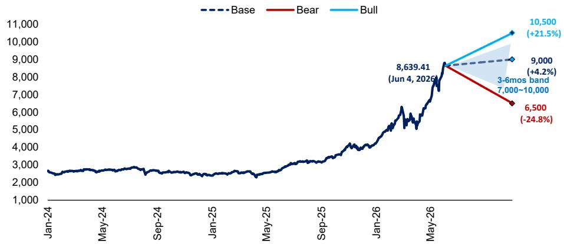

line chart

| Date       | Base    | Bear    | Bull     |
| ---------- | ------- | ------- | -------- |
| Jun 4, 2026 | 8,639.41 | 6,500   | 9,000    |
| 3-6mos band | 7,000   | -24.8%  | 10,500   |

Source: WiseFN, MS estimates

Exhibit 68: 2026 YTD Fund Flows by Investor Type and Price Performance

<table><tr><td>(%, Wbn)</td><td>KOSPI</td><td>IT</td><td>Materials</td><td>Industrials</td><td>Energy</td><td>Cons.Disc.</td><td>Financials</td><td>Healthcare</td><td>Comm.svcs.</td><td>Cons.Stp.</td><td>Utilities</td></tr><tr><td>Index wght</td><td>100%</td><td>66%</td><td>3%</td><td>16%</td><td>2%</td><td>6%</td><td>7%</td><td>5%</td><td>2%</td><td>1%</td><td>1%</td></tr><tr><td>2026 YTD Perf.</td><td>108.9%</td><td>203.7%</td><td>17.5%</td><td>55.8%</td><td>62.5%</td><td>58.5%</td><td>33.7%</td><td>-14.6%</td><td>4.2%</td><td>5.6%</td><td>-11.6%</td></tr><tr><td>2025 Perf.</td><td>75.6%</td><td>126.7%</td><td>28.9%</td><td>102.8%</td><td>45.7%</td><td>30.6%</td><td>53.2%</td><td>35.5%</td><td>18.1%</td><td>25.8%</td><td>86.2%</td></tr><tr><td>Foreigners Net Buying</td><td>-109,016</td><td>-94,771</td><td>1,106</td><td>3,358</td><td>2,068</td><td>-12,319</td><td>-3,104</td><td>3,243</td><td>-1,512</td><td>689</td><td>-331</td></tr><tr><td>Domestic Retail Net Buying</td><td>63,513</td><td>49,711</td><td>-2,159</td><td>-3,305</td><td>-1,719</td><td>9,663</td><td>1,048</td><td>-2,254</td><td>2,707</td><td>-584</td><td>1,106</td></tr><tr><td>Domestic Institution Net Buying</td><td>32,286</td><td>33,357</td><td>545</td><td>2,928</td><td>327</td><td>1,804</td><td>2,311</td><td>219</td><td>-1,354</td><td>-122</td><td>-726</td></tr><tr><td>Pension Funds Net Buying</td><td>-6,355</td><td>-2,255</td><td>264</td><td>-1,672</td><td>233</td><td>197</td><td>-1,392</td><td>-1,188</td><td>-710</td><td>-140</td><td>-430</td></tr></table>

Source: WiseFN, MS, Data as of Jun 2, 2026.

Exhibit 69: Korean Cycle Indicator  
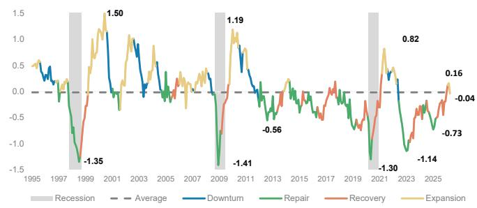

line chart

| Year | Recession | Average | Downturn | Repair | Recovery | Expansion |
| --- | --- | --- | --- | --- | --- | --- |
| 1995 |  |  |  |  |  |  |
| 1997 |  |  |  |  |  |  |
| 1999 |  |  |  | -1.35 |  |  |
| 2001 |  |  |  |  |  | 1.50 |
| 2003 |  |  |  |  |  |  |
| 2005 |  |  |  |  |  |  |
| 2007 |  |  |  |  |  |  |
| 2009 |  |  |  | -1.41 |  |  |
| 2011 |  |  |  |  |  | 1.19 |
| 2013 |  |  |  | -0.56 |  |  |
| 2015 |  |  |  |  |  |  |
| 2017 |  |  |  |  |  |  |
| 2019 |  |  |  |  |  |  |
| 2021 |  |  |  | -1.30 |  |  |
| 2023 |  |  |  | -1.14 |  |  |
| 2025 |  |  |  | -0.73 | -0.04 | 0.16 |

Source: MS

Exhibit 70: Korean Cycle Indicator vs. KOSPI  
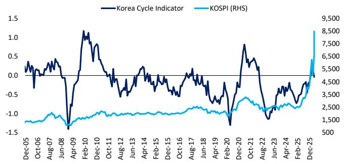

line chart

| Date    | Korea Cycle Indicator | KOSPI (RHS) |
|---------|------------------------|-------------|
| Dec-05  | ~0.3                   | ~1,500      |
| Oct-06  | ~0.2                   | ~1,400      |
| Aug-07  | ~0.4                   | ~1,300      |
| Jun-08  | ~-1.5                  | ~1,200      |
| Apr-09  | ~1.2                   | ~1,100      |
| Feb-10  | ~1.1                   | ~1,000      |
| Dec-10  | ~0.8                   | ~900        |
| Oct-11  | ~0.2                   | ~800        |
| Aug-12  | ~-0.2                  | ~700        |
| Jun-13  | ~0.3                   | ~600        |
| Apr-14  | ~0.1                   | ~500        |
| Feb-15  | ~-0.1                  | ~400        |
| Oct-16  | ~-0.3                  | ~300        |
| Aug-17  | ~-0.5                  | ~250        |
| Jun-18  | ~-0.7                  | ~200        |
| Apr-19  | ~-0.9                  | ~150        |
| Feb-20  | ~-1.2                  | ~100        |
| Dec-20  | ~0.8                   | ~80         |
| Oct-21  | ~0.4                   | ~60         |
| Aug-22  | ~-0.8                  | ~40         |
| Jun-23  | ~-1.0                  | ~30         |
| Apr-24  | ~-0.5                  | ~25         |
| Feb-25  | ~-0.2                  | ~20         |
| Dec-25  | ~0.5                   | ~15         |

Source: WiseFN, Bloomberg, MS

## What are retail investors likely to focus on?

## Expect retail investors to stick to the leaders

The KOSPI is up more than 80% YTD, and the key sectors that have outperformed are KOSPI IT and Industrials, which is where retail investors have shown more net buying activity. Among the top 10 sub-sectors where retail investors have made the strongest inflows are semiconductors, auto, construction, and securities.

The single stock leveraged ETFs for Samsung Electronics and SK Hynix have seen strong inflows from retail investors since launch on May 27, 2026, which points to continued focus by retail investors on the AI story, especially on chipmakers.

The auto sector has also seen strong interest for retail investors and fund flows have been strong for Hyundai Motors on the robotics theme.

Within the Industrials sector, there have been mixed retail fund flows, with only the construction sub-sector showing positive retail inflows.

Exhibit 71: Single Stock Leveraged ETFs

<table><tr><td rowspan="2">Leveraged ETF (%, Wbn)</td><td colspan="2">AUM</td><td rowspan="2">Trading Val.</td></tr><tr><td>Current</td><td>5/27/2026</td></tr><tr><td>Aggregate of 14 ETFs</td><td>7,259</td><td>4,323</td><td>10,990</td></tr><tr><td>KODEX SK Hynix Single Stock Leverage</td><td>2,248</td><td>1,602</td><td>2,971</td></tr><tr><td>TIGER SK Hynix Single Stock Leverage</td><td>1,677</td><td>746</td><td>1,643</td></tr><tr><td>KODEX Samsung Electronics Single Stock Leverage</td><td>1,852</td><td>1,154</td><td>3,439</td></tr><tr><td>TIGER Samsung Electronics Single Stock Leverage</td><td>956</td><td>596</td><td>2,600</td></tr><tr><td>ACE SK Hynix Single Stock Leverage</td><td>85</td><td>20</td><td>33</td></tr><tr><td>ACE Samsung Electronics Single Stock Leverage</td><td>108</td><td>20</td><td>94</td></tr><tr><td>RISE SK Hynix Single Stock Leverage</td><td>69</td><td>38</td><td>48</td></tr><tr><td>SOL SK Hynix Single Stock Leverage</td><td>77</td><td>53</td><td>31</td></tr><tr><td>PLUS Samsung Electronics Single Stock Leverage</td><td>33</td><td>18</td><td>13</td></tr><tr><td>RISE Samsung Electronics Single Stock Leverage</td><td>78</td><td>35</td><td>50</td></tr><tr><td>1Q Samsung Electronics Single Stock Leverage</td><td>18</td><td>10</td><td>18</td></tr><tr><td>KIWOOM Samsung Electronics Single Stock Leverage</td><td>15</td><td>10</td><td>21</td></tr><tr><td>1Q SK Hynix Single Stock Leverage</td><td>22</td><td>11</td><td>18</td></tr><tr><td>KIWOOM SK Hynix Single Stock Leverage</td><td>22</td><td>10</td><td>10</td></tr></table>

Source: Check Export, MS, Data as of June 2, 2026; No investment recommendation is made with respect to any of the ETFs or mutual funds referenced herein. Investors should not rely on the information included in making investment decisions with respect to those funds.

Exhibit 72: Sub-sector Performance

<table><tr><td>2026 YTD(%, Wtn)</td><td>YTD Perf.</td><td>2025 Perf.</td><td>YTD Foreign</td><td>YTD Retail</td><td>YTD Domestic Inst.</td></tr><tr><td>KOSPI</td><td>108.9%</td><td>75.6%</td><td>(109.0)</td><td>63.5</td><td>32.3</td></tr><tr><td>Hardware</td><td>334.2%</td><td>91.6%</td><td>(2.2)</td><td>0.8</td><td>1.4</td></tr><tr><td>Semiconductors</td><td>223.8%</td><td>165.8%</td><td>(95.8)</td><td>54.7</td><td>25.7</td></tr><tr><td>Applicance</td><td>128.7%</td><td>9.3%</td><td>0.6</td><td>(1.5)</td><td>2.0</td></tr><tr><td>Trading firm, Capital Goods</td><td>98.2%</td><td>139.2%</td><td>(0.2)</td><td>(2.4)</td><td>2.5</td></tr><tr><td>Automobiles</td><td>86.3%</td><td>36.3%</td><td>(14.6)</td><td>12.7</td><td>1.0</td></tr><tr><td>Insurance</td><td>84.3%</td><td>44.4%</td><td>0.0</td><td>(0.2)</td><td>0.1</td></tr><tr><td>Energy</td><td>68.6%</td><td>46.1%</td><td>2.0</td><td>(1.7)</td><td>0.3</td></tr><tr><td>Construction, Building Products</td><td>64.2%</td><td>48.0%</td><td>0.2</td><td>0.8</td><td>(1.0)</td></tr><tr><td>Machinery</td><td>55.9%</td><td>171.8%</td><td>2.1</td><td>(1.8)</td><td>0.6</td></tr><tr><td>Telecommunication Services</td><td>54.9%</td><td>13.2%</td><td>0.0</td><td>(0.4)</td><td>0.3</td></tr><tr><td>Securities</td><td>47.7%</td><td>70.3%</td><td>(1.9)</td><td>1.5</td><td>0.4</td></tr><tr><td>Retailing</td><td>47.7%</td><td>33.4%</td><td>0.7</td><td>(1.0)</td><td>0.3</td></tr><tr><td>Display</td><td>36.6%</td><td>21.4%</td><td>0.3</td><td>(0.2)</td><td>(0.1)</td></tr><tr><td>Steel</td><td>26.0%</td><td>21.3%</td><td>0.3</td><td>(0.6)</td><td>0.3</td></tr><tr><td>Chemicals</td><td>18.5%</td><td>29.4%</td><td>1.6</td><td>(1.3)</td><td>(0.4)</td></tr><tr><td>Software</td><td>18.2%</td><td>23.4%</td><td>(2.2)</td><td>2.7</td><td>(0.6)</td></tr><tr><td>Banks</td><td>17.4%</td><td>55.0%</td><td>(1.3)</td><td>(0.3)</td><td>1.8</td></tr><tr><td>Cosmetics, Apparel, Toys</td><td>14.8%</td><td>33.2%</td><td>1.8</td><td>(2.0)</td><td>0.1</td></tr><tr><td>Shipbuilding</td><td>13.1%</td><td>98.9%</td><td>1.0</td><td>(0.1)</td><td>0.1</td></tr><tr><td>Consumer Staples</td><td>9.5%</td><td>21.8%</td><td>0.5</td><td>(0.4)</td><td>(0.1)</td></tr><tr><td>Transportation</td><td>2.8%</td><td>20.5%</td><td>(0.3)</td><td>0.6</td><td>(0.3)</td></tr><tr><td>Nonferrous Metals, Forest Products</td><td>-2.2%</td><td>29.3%</td><td>(1.1)</td><td>0.4</td><td>0.2</td></tr><tr><td>HealthCare</td><td>-11.2%</td><td>21.1%</td><td>1.6</td><td>(0.3)</td><td>(1.3)</td></tr><tr><td>Utilities</td><td>-11.7%</td><td>87.6%</td><td>(0.3)</td><td>1.1</td><td>(0.7)</td></tr><tr><td>Hotel, Leisure Services</td><td>-20.6%</td><td>38.5%</td><td>(0.2)</td><td>0.1</td><td>0.0</td></tr><tr><td>Media, Education</td><td>-28.8%</td><td>46.7%</td><td>0.1</td><td>0.9</td><td>(0.9)</td></tr></table>

Source: WiseFN, MS. Note: Data as of June 2, 2026.

Exhibit 73: Fund Flows by Investor Type

<table><tr><td rowspan="2">(Wbn)</td><td colspan="3">After Outbreak of US-Iran Conflict</td><td colspan="3">-1D of US-Iran Conflict Since 2026</td><td colspan="3">2026 YTD</td></tr><tr><td>Foreign</td><td>Retail</td><td>Domestic Inst.</td><td>Foreign</td><td>Retail</td><td>Domestic Inst.</td><td>Foreign</td><td>Retail</td><td>Domestic Inst.</td></tr><tr><td>KOSPI</td><td>(88,105.2)</td><td>59,880.5</td><td>19,715.6</td><td>(20,910.6)</td><td>3,632.7</td><td>12,570.6</td><td>(109,015.7)</td><td>63,513.2</td><td>32,286.2</td></tr><tr><td>Energy</td><td>1,195.7</td><td>(702.7)</td><td>33.4</td><td>852.6</td><td>(1,045.9)</td><td>290.1</td><td>2,048.3</td><td>(1,748.6)</td><td>323.6</td></tr><tr><td>Chemicals</td><td>718.3</td><td>(306.8)</td><td>(502.1)</td><td>888.5</td><td>(1,019.6)</td><td>137.9</td><td>1,606.8</td><td>(1,326.4)</td><td>(364.3)</td></tr><tr><td>Nonferrous Metals,Forest Products</td><td>(945.1)</td><td>523.4</td><td>(97.0)</td><td>(144.3)</td><td>(86.7)</td><td>250.8</td><td>(1,089.3)</td><td>436.6</td><td>153.7</td></tr><tr><td>Steel</td><td>107.3</td><td>(247.4)</td><td>132.3</td><td>193.5</td><td>(338.0)</td><td>170.2</td><td>300.8</td><td>(585.4)</td><td>302.5</td></tr><tr><td>Construction,Building Products</td><td>(510.4)</td><td>1,634.5</td><td>(1,075.6)</td><td>682.7</td><td>(788.4)</td><td>80.9</td><td>172.3</td><td>846.1</td><td>(994.7)</td></tr><tr><td>Machinery</td><td>(306.0)</td><td>1,090.8</td><td>(485.0)</td><td>2,379.5</td><td>(2,891.4)</td><td>1,078.5</td><td>2,073.4</td><td>(1,800.6)</td><td>593.5</td></tr><tr><td>Shipbuilding</td><td>(1,657.2)</td><td>1,713.4</td><td>876.0</td><td>2,669.8</td><td>(1,842.1)</td><td>(773.8)</td><td>1,012.5</td><td>(128.8)</td><td>102.2</td></tr><tr><td>Trading firm,Capital Goods</td><td>(850.1)</td><td>(189.4)</td><td>1,008.2</td><td>665.9</td><td>(2,165.5)</td><td>1,530.7</td><td>(184.1)</td><td>(2,354.9)</td><td>2,538.9</td></tr><tr><td>Transportation</td><td>(360.9)</td><td>658.5</td><td>(315.5)</td><td>64.6</td><td>(105.5)</td><td>34.5</td><td>(296.3)</td><td>553.0</td><td>(280.9)</td></tr><tr><td>Automobiles</td><td>(8,906.4)</td><td>7,756.5</td><td>533.8</td><td>(5,741.5)</td><td>4,985.2</td><td>465.3</td><td>(14,647.9)</td><td>12,741.7</td><td>999.1</td></tr><tr><td>Cosmetics,Apparel,Toys</td><td>743.0</td><td>(744.6)</td><td>(16.5)</td><td>1,078.3</td><td>(1,207.7)</td><td>154.8</td><td>1,821.3</td><td>(1,952.3)</td><td>138.4</td></tr><tr><td>Hotel,Leisure Services</td><td>(209.2)</td><td>264.0</td><td>(55.8)</td><td>12.5</td><td>(115.2)</td><td>59.2</td><td>(196.7)</td><td>148.8</td><td>3.5</td></tr><tr><td>Media,Education</td><td>(486.9)</td><td>925.6</td><td>(417.9)</td><td>551.2</td><td>(1.1)</td><td>(506.3)</td><td>64.4</td><td>924.6</td><td>(924.2)</td></tr><tr><td>Retailing</td><td>459.4</td><td>(742.5)</td><td>265.8</td><td>236.6</td><td>(302.3)</td><td>69.8</td><td>695.9</td><td>(1,044.8)</td><td>335.5</td></tr><tr><td>Consumer Staples</td><td>441.0</td><td>(340.7)</td><td>(103.8)</td><td>64.8</td><td>(70.6)</td><td>(10.0)</td><td>505.7</td><td>(411.3)</td><td>(113.8)</td></tr><tr><td>HealthCare</td><td>(208.6)</td><td>1,084.3</td><td>(876.6)</td><td>1,850.0</td><td>(1,383.4)</td><td>(440.3)</td><td>1,641.4</td><td>(299.1)</td><td>(1,316.9)</td></tr><tr><td>Banks</td><td>(1,232.2)</td><td>375.3</td><td>765.0</td><td>(34.8)</td><td>(723.0)</td><td>1,010.5</td><td>(1,267.0)</td><td>(347.6)</td><td>1,775.4</td></tr><tr><td>Securities</td><td>(1,544.4)</td><td>1,579.5</td><td>(58.9)</td><td>(370.9)</td><td>(69.9)</td><td>465.6</td><td>(1,915.3)</td><td>1,509.7</td><td>406.7</td></tr><tr><td>Insurance</td><td>716.4</td><td>(555.7)</td><td>(181.6)</td><td>(680.8)</td><td>379.0</td><td>297.1</td><td>35.6</td><td>(176.7)</td><td>115.5</td></tr><tr><td>Software</td><td>(2,890.0)</td><td>2,762.8</td><td>(111.1)</td><td>728.5</td><td>(27.7)</td><td>(527.2)</td><td>(2,161.5)</td><td>2,735.1</td><td>(638.3)</td></tr><tr><td>Hardware</td><td>(2,413.6)</td><td>842.6</td><td>1,610.1</td><td>201.7</td><td>1.9</td><td>(204.5)</td><td>(2,211.9)</td><td>844.4</td><td>1,405.5</td></tr><tr><td>Semiconductors</td><td>(68,335.2)</td><td>40,723.2</td><td>18,418.6</td><td>(27,430.1)</td><td>13,930.5</td><td>7,291.0</td><td>(95,765.2)</td><td>54,653.7</td><td>25,709.7</td></tr><tr><td>Applicance</td><td>(292.5)</td><td>(365.2)</td><td>1,256.2</td><td>926.8</td><td>(1,110.2)</td><td>736.5</td><td>634.3</td><td>(1,475.4)</td><td>1,992.7</td></tr><tr><td>Display</td><td>213.8</td><td>(178.8)</td><td>(43.2)</td><td>88.3</td><td>(18.9)</td><td>(71.9)</td><td>302.1</td><td>(197.7)</td><td>(115.1)</td></tr><tr><td>Telecommunication Services</td><td>(168.2)</td><td>195.1</td><td>(32.4)</td><td>212.5</td><td>(558.5)</td><td>374.8</td><td>44.4</td><td>(363.4)</td><td>342.5</td></tr><tr><td>Utilities</td><td>(588.7)</td><td>1,151.2</td><td>(538.9)</td><td>260.5</td><td>(48.2)</td><td>(186.4)</td><td>(328.2)</td><td>1,103.0</td><td>(725.3)</td></tr></table>

Source: WiseFN, MS, Note: Data as of June 2, 2026.

## Healthcare: not a retail focus area now but could benefit from portfolio diversification

Korea's healthcare sector has historically attracted a high level of interest from retail investors because stocks in this sector tend to show strong share price movements when stories play out positively. Operational trends for the healthcare sector tend to have higher variability, while share prices have a strong correlation to events, such as orders, new product launches, and export growth.

Our healthcare sector analyst prefers Samsung Bio, Binex, GC Biopharma, PharmaResearch and L&C Bio, all of which have declined YTD (vs. KOSPI +91% as of 26 May) for non-fundamental reasons. However, we expect a sector rotation entering 2H26.

Exhibit 74: MS Coverage: Healthcare Overweight Stocks

<table><tr><td rowspan="2">Company</td><td rowspan="2">Ticker</td><td rowspan="2">MS Rating</td><td rowspan="2">Mkt. Cap (Wtn)</td><td rowspan="2">TP (KRW)</td><td rowspan="2">Close (KRW)</td><td colspan="4">Price Performance</td><td rowspan="2">12M Fwd P/B</td><td rowspan="2">12M Fwd P/E</td><td colspan="2">ROE (%)</td><td colspan="2">Dividend Yield(%)</td></tr><tr><td>YTD</td><td>3M</td><td>6M</td><td>12M</td><td>26E</td><td>27E</td><td>26E</td><td>27E</td></tr><tr><td colspan="16">Healthcare</td></tr><tr><td>SAMSUNG BIOLOGICS</td><td>207940.KS</td><td>Overweight</td><td>63.3</td><td>2,292,000</td><td>1,367,000</td><td>-19%</td><td>-23%</td><td>-17%</td><td>-10%</td><td>5.5</td><td>30.1</td><td>21.7</td><td>19.5</td><td>na</td><td>na</td></tr><tr><td>Celltrion</td><td>068270.KS</td><td>Overweight</td><td>41.7</td><td>248,000</td><td>187,900</td><td>4%</td><td>-21%</td><td>2%</td><td>21%</td><td>2.3</td><td>28.0</td><td>8.3</td><td>8.9</td><td>0.4</td><td>0.4</td></tr><tr><td>PharmaResearch</td><td>214450.KQ</td><td>Overweight</td><td>3.0</td><td>717,000</td><td>290,500</td><td>-28%</td><td>-17%</td><td>-31%</td><td>-39%</td><td>3.5</td><td>14.0</td><td>27.8</td><td>27.1</td><td>1.4</td><td>1.5</td></tr><tr><td>L&amp;C BIO</td><td>290650.KQ</td><td>Overweight</td><td>2.1</td><td>91,000</td><td>78,800</td><td>29%</td><td>-20%</td><td>25%</td><td>184%</td><td>7.0</td><td>65.9</td><td>5.0</td><td>17.3</td><td>0.1</td><td>0.1</td></tr><tr><td>GC Biopharma Corp.</td><td>006280.KS</td><td>Overweight</td><td>1.5</td><td>194,000</td><td>131,900</td><td>-17%</td><td>-22%</td><td>-4%</td><td>3%</td><td>1.2</td><td>23.5</td><td>6.4</td><td>4.0</td><td>1.2</td><td>1.2</td></tr><tr><td>Binex</td><td>053030.KQ</td><td>Overweight</td><td>0.3</td><td>17,400</td><td>8,500</td><td>-43%</td><td>-47%</td><td>-42%</td><td>-53%</td><td>1.6</td><td>1,111.3</td><td>-3.4</td><td>3.9</td><td>na</td><td>na</td></tr></table>

Source: WiseFN, MS, E=WiseFN Consensus Estimates, Data as of Jun 2, 2026

## Department stores: positive wealth effect + inbound travel = strength in luxury

We flagged department stores as a comeback story for 1H26, and despite the geopolitical risks, we believe that luxury consumption should remain a positive story – supported by the positive wealth effect from a strong bourse and record compensation levels.

Furthermore, Korea may become a more attractive destination for ASEAN and North Asian travelers with air fares on the rise and the weak won.

Retail investors have been net sellers of the retail sub-segment in 2026 YTD, but in the past we have seen a tendency for individuals to become interested in areas where they are directly experiencing positive trends.

• Hyundai Department Store: Too cheap to ignore; Upgrade to OW (24 Apr 2026)  
• S. Korea Consumer: 1Q26 Preview (10 Apr 2026)

Exhibit 75: Luxury sales growth at department stores  
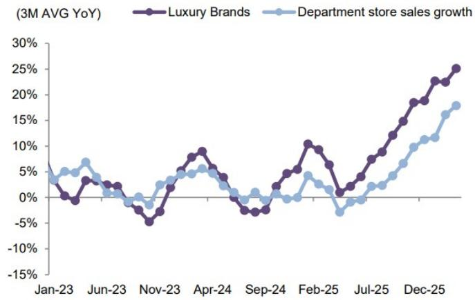

line chart

| Month   | Luxury Brands | Department store sales growth |
|---------|---------------|-------------------------------|
| Jan-23  | 5%            | 5%                            |
| Jun-23  | 0%            | 7%                            |
| Nov-23  | -5%           | 0%                            |
| Apr-24  | 9%            | 5%                            |
| Sep-24  | -3%           | 0%                            |
| Feb-25  | 10%           | 4%                            |
| Jul-25  | 3%            | 2%                            |
| Dec-25  | 25%           | 18%                           |

Source: MoTIR, MS.

Exhibit 76: Department stores – foreign spending  
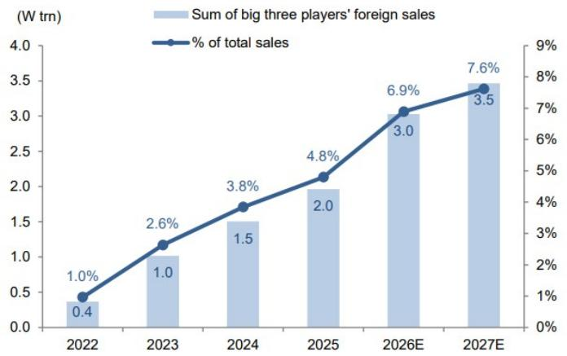

bar-line hybrid

| Year | Sum of big three players' foreign sales (W trn) | % of total sales (%) |
|---|---|---|
| 2022 | 0.4 | 1.0 |
| 2023 | 1.0 | 2.6 |
| 2024 | 1.5 | 3.8 |
| 2025 | 2.0 | 4.8 |
| 2026E | 3.0 | 6.9 |
| 2027E | 3.5 | 7.6 |

Source: Company Data, MS. E = MS estimates.

Exhibit 77:  
MS Coverage: Department Store Stocks

<table><tr><td rowspan="2">Company</td><td rowspan="2">Ticker</td><td rowspan="2">MS Rating</td><td rowspan="2">Mkt. Cap (Wtn)</td><td rowspan="2">TP (KRW)</td><td rowspan="2">Close (KRW)</td><td colspan="4">Price Performance</td><td rowspan="2">12M Fwd P/B</td><td rowspan="2">12M Fwd P/E</td><td colspan="2">ROE (%)</td><td colspan="2">Dividend Yield (%)</td></tr><tr><td>YTD</td><td>3M</td><td>6M</td><td>12M</td><td>26E</td><td>27E</td><td>26E</td><td>27E</td></tr><tr><td>Consumer</td><td></td><td></td><td></td><td></td><td></td><td></td><td></td><td></td><td></td><td></td><td></td><td></td><td></td><td></td><td></td></tr><tr><td>Shinsegae</td><td>004170.KS</td><td>Overweight</td><td>5.4</td><td>520,000</td><td>569,000</td><td>130%</td><td>54%</td><td>139%</td><td>233%</td><td>1.01</td><td>14.7</td><td>7.5</td><td>7.9</td><td>1.0</td><td>1.0</td></tr><tr><td>HYUNDAIDEPST</td><td>069960.KS</td><td>Overweight</td><td>2.6</td><td>120,000</td><td>121,800</td><td>37%</td><td>11%</td><td>24%</td><td>72%</td><td>0.53</td><td>9.3</td><td>5.7</td><td>6.3</td><td>1.9</td><td>2.0</td></tr><tr><td>LOTTE SHOPPING</td><td>023530.KS</td><td>Equal-Weight</td><td>4.4</td><td>145,000</td><td>154,100</td><td>113%</td><td>43%</td><td>107%</td><td>99%</td><td>0.28</td><td>11.5</td><td>2.3</td><td>2.6</td><td>2.8</td><td>2.9</td></tr><tr><td>HitShilla</td><td>008770.KS</td><td>Underweight</td><td>2.1</td><td>48,000</td><td>52,100</td><td>17%</td><td>9%</td><td>11%</td><td>5%</td><td>1.53</td><td>19.3</td><td>7.9</td><td>9.6</td><td>0.4</td><td>0.4</td></tr></table>

Source: WiseFN, MS, E=WiseFN Consensus Estimates, Data as of Jun 2, 2026

## Should we buy into Korean financials? Need to be selective

## A structural change for the financial sector; IB and WM key to sustainable ROE boost

Korea's recent equity market rally has revived debate around the “wealth effect” in a market where household balance sheets have historically been dominated by real estate rather than financial assets, which has led to financial companies being more focused on real-estate-linked businesses. We have been flagging (refer here) that Korean banks will have to wean themselves off real estate businesses and become more active in the capital markets space to be able to boost sustainable ROE.

For financial institutions, the implication from the money movement story is potentially meaningful. The first-order benefit of the equity rally is obvious: higher market turnover drives brokerage commission income, margin-loan interest, and platform traffic. But the more valuable bull case scenario is a second-order effect, where increased retail familiarity with equities and ETFs raises demand for broader WM services.

In that scenario, securities companies would benefit not only from execution fees but also from fund and ETF sales, wrap accounts, model portfolios, pension products, advisory fees, asset-based management fees, and potentially subscription-like digital services.

The earnings mix would therefore become less dependent on one-time upfront sales commissions and more exposed to recurring revenue linked to assets under management, assets under administration, and client retention. This is particularly important for Korean securities firms, whose earnings have historically been highly sensitive to market turnover, brokerage commission cycles, and episodic IB activity. A larger and more persistent WM revenue pool could help reduce this cyclicality and support a more stable fee-income base over the medium to long term.

The retirement pension channel could become one of the clearest areas of differentiation. As DC (Defined Contribution) and IRP (Individual Retirement Pension) assets grow relative to DB (Defined Benefit) and as more assets move from principal-guaranteed products into performance-linked products, the ability to provide credible long-term portfolios will matter more. Securities companies with strong ETF platforms, global asset allocation products, pension advisory tools, and digital onboarding should be better positioned to capture flows. Banks and insurers will also participate, but we think their advantages will differ. Banks have deposit relationships and broad retail distribution, while insurers have natural links to retirement, annuity, and protection products. The redistribution of household assets into financial products, therefore, has the potential to deepen competition not only among brokerages but across the entire financial holding-company structure.

Exhibit 78: S. Korea: Retirement Pension Market  
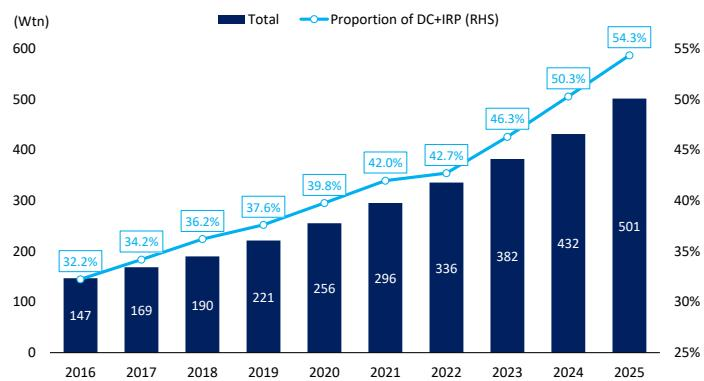

bar-line hybrid

| Year | Total (Wtn) | Proportion of DC+IRP (RHS) (%) |
| :--- | :--- | :--- |
| 2016 | 147 | 32.2 |
| 2017 | 169 | 34.2 |
| 2018 | 190 | 36.2 |
| 2019 | 221 | 37.6 |
| 2020 | 256 | 39.8 |
| 2021 | 296 | 42.0 |
| 2022 | 336 | 42.7 |
| 2023 | 382 | 46.3 |
| 2024 | 432 | 50.3 |
| 2025 | 501 | 54.3 |

Source: FSS, MS

Exhibit 79: Retirement Pension Reserves by Type of Invested Assets  
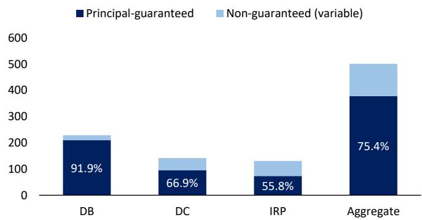

stacked bar chart

| Category | Principal-guaranteed (%) | Non-guaranteed (variable) (%) |
| :--- | :--- | :--- |
| DB | 91.9 | 20.6 |
| DC | 66.9 | 47.5 |
| IRP | 55.8 | 53.1 |
| Aggregate | 75.4 | 140.0 |

Source: FSS, MS

The money movement story should also change the competitive basis of the financial sector. In a trading-led market, brokerages compete mainly on commission pricing, margin rates, app convenience, and product access. In a WM-led market, the competitive edge shifts toward portfolio performance, product curation, retirement pension capability, tax-efficient account design, research content, digital engagement, and advisory quality. Daily market commentary, news curation, retirement simulation tools, ETF screeners, AI-based advisory, automated rebalancing, and better UI/UX (User Interface/User Experience) are not merely marketing tools; they become part of the client value proposition. We think the potential beneficiaries would be institutions that can convert episodic trading customers into long-term financial asset clients.

Exhibit 80: Financial Product/Services Mapping by Sophistication and Capability  
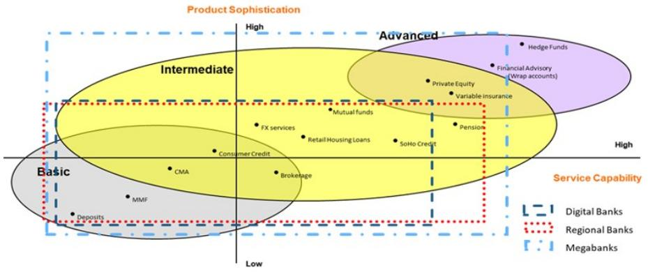

flowchart

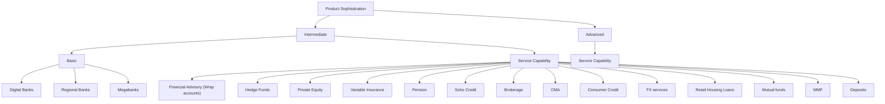
```mermaid
graph TD
  A["Product Sophistication"] --> B["Intermediate"]
  A --> C["Advanced"]
  B --> D["Basic"]
  B --> E["Service Capability"]
  C --> F["Service Capability"]
  D --> G["Digital Banks"]
  D --> H["Regional Banks"]
  D --> I["Megabanks"]
  E --> J["Financial Advisory (Wrap accounts)"]
  E --> K["Hedge Funds"]
  E --> L["Private Equity"]
  E --> M["Variable Insurance"]
  E --> N["Pension"]
  E --> O["Soho Credit"]
  E --> P["Brokerage"]
  E --> Q["CMA"]
  E --> R["Consumer Credit"]
  E --> S["FX services"]
  E --> T["Retail Housing Loans"]
  E --> U["Mutual funds"]
  E --> V["MMF"]
  E --> W["Deposits"]
```

Source: MS

## Still too early to say that a structural ROE boost is coming for the financial industry – but it's possible in the bull case

We believe it is too early to conclude that Korea's recent money movement to the capital markets and retail equity investment boom will necessarily translate into an expansion of sustainable ROE for the financial industry. The current rally has been powerful, but it is still partly cyclical and concentrated. Retail flows could reverse if market performance weakens, margin-driven participation could amplify volatility, and fee competition may remain intense if institutions fail to move beyond execution and product distribution.

The key indicators to monitor are therefore not only the KOSPI level or daily trading value, but also the composition and duration of retail assets: growth in DC and IRP performance-linked allocations, ETF holdings in pension and ISA accounts, dividend-stock ownership, recurring WM fee income, client asset retention, and the degree to which brokerages can shift from upfront sales economics to asset-based advisory economics.

Our bull case for Korean financials is that this transition broadens the sector's earnings base beyond corporate banking, mortgage lending, spread income, and episodic IB (Investment Banking) activity. A larger personal financial asset market would allow financial institutions to generate more capital-light fee income, improve operating leverage, and build more resilient client franchises. For securities firms in particular, a recurring WM revenue base could help reduce the historical cyclicality of earnings, while for diversified financial groups, stronger brokerage and WM subsidiaries could become more important drivers of consolidated ROE. If investors gain confidence that fee income is becoming more durable rather than merely bull-market-driven, the sector could deserve a higher valuation over time.

## Securities business still looks attractive

The near-term evidence is already visible in securities business earnings. In 1Q26, major Korean brokerages including ones owned by the banks reported record profits thanks to sharply higher market turnover, retail participation, margin lending, and financial product sales. 1Q26 earnings for the securities businesses came in much stronger than we expected with even the banking groups' securities operations showing higher-than-expected net profits. With the KOSPI up around 45\~50% QTD for 2Q26 and trading volumes remaining high, securities units should continue to see robust brokerage fee revenue growth with banks also benefiting from fee growth for their trust businesses.

The securities sub-sector was one of the key outperforming sub-sectors in 2026 owing to active trading by retail investors. However, the securities sub-sector has shown a sharp correction recently, down 26% from its May 6 peak as of June 9, amid a market rally that has been quite volatile and IB/WM earnings showing relatively more muted trends.

Exhibit 81: Korean Securities – 1Q26 Results (W bn)

<table><tr><td>1Q26 (Wbn)</td><td>NP</td><td>Note</td></tr><tr><td>KB Securities</td><td>348</td><td>Based on KFG&#x27;s Consolidated NP</td></tr><tr><td>Shinhan Inv&#x27;t</td><td>288</td><td>Shinhan Securities Standalone NP (Pre-Ownership Adjustment)</td></tr><tr><td>Hana Financial Inv&#x27;t</td><td>103</td><td>Based on HFG&#x27;s Consolidated NP</td></tr><tr><td>Mirae Securities</td><td>1,002</td><td>Consolidated NP</td></tr><tr><td>KIS</td><td>624</td><td>Based on KIH&#x27;s Consolidated NP (Excl. Korea Inv&#x27;t Mgmt. and etc.)</td></tr><tr><td>Kiwoom Securities</td><td>477</td><td>Consolidated NP</td></tr><tr><td>NH Inv&#x27;t</td><td>476</td><td>Based on NH Group&#x27;s Consolidated NP</td></tr><tr><td>Samsung Securities</td><td>451</td><td>Consolidated NP</td></tr></table>

Source: Company Report, MS

Exhibit 82: Total brokerage (including bonds, derivatives, funds, etc.) – trading value (W tn)

<table><tr><td>Company Name</td><td>2025</td><td>M/S(%)</td></tr><tr><td>Korea Investment &amp; Securities</td><td>8,812</td><td>20.0%</td></tr><tr><td>Kiwoom Securities</td><td>7,909</td><td>17.9%</td></tr><tr><td>Shinhan Securities</td><td>4,105</td><td>9.3%</td></tr><tr><td>Mirae Asset Securities</td><td>2,841</td><td>6.4%</td></tr><tr><td>NH Investment &amp; Securities</td><td>2,627</td><td>6.0%</td></tr><tr><td>Samsung Securities</td><td>2,013</td><td>4.6%</td></tr><tr><td>LS SECURITIES</td><td>1,820</td><td>4.1%</td></tr><tr><td>BNK Securities</td><td>1,618</td><td>3.7%</td></tr><tr><td>Yuanta Securities Korea</td><td>1,510</td><td>3.4%</td></tr><tr><td>KB Securities</td><td>1,300</td><td>2.9%</td></tr><tr><td>Kyobo Securities</td><td>1,097</td><td>2.5%</td></tr><tr><td>Hana Securities co.,Ltd.</td><td>1,047</td><td>2.4%</td></tr></table>

Source: FISIS, MS

Exhibit 83: Total brokerage (including bonds, derivatives, funds, etc.) – brokerage fee income (W bn)

<table><tr><td>Company Name</td><td>2025</td><td>M/S(%)</td></tr><tr><td>Mirae Asset Securities</td><td>1,011</td><td>12.8%</td></tr><tr><td>Kiwoom Securities</td><td>888</td><td>11.2%</td></tr><tr><td>Samsung Securities</td><td>812</td><td>10.3%</td></tr><tr><td>KB Securities</td><td>744</td><td>9.4%</td></tr><tr><td>NH Investment &amp; Securities</td><td>711</td><td>9.0%</td></tr><tr><td>Korea Investment &amp; Securities</td><td>609</td><td>7.7%</td></tr><tr><td>Shinhan Securities</td><td>563</td><td>7.1%</td></tr><tr><td>Daishin Securities</td><td>284</td><td>3.6%</td></tr><tr><td>Yuanta Securities Korea</td><td>251</td><td>3.2%</td></tr><tr><td>Hana Securities</td><td>238</td><td>3.0%</td></tr></table>

Source: FISIS, MS

Exhibit 84:
Screen of Listed Securities Companies (Top 5 by Market Cap)

<table><tr><td rowspan="2">Company</td><td rowspan="2">Ticker</td><td rowspan="2">MS Rating</td><td rowspan="2">Mkt. Cap (Wtn)</td><td rowspan="2">Close (KRW)</td><td colspan="4">Price Performance</td><td rowspan="2">12M Fwd P/B</td><td rowspan="2">12M Fwd P/E</td><td colspan="2">ROE (%)</td><td colspan="2">Dividend Yield (%)</td></tr><tr><td>YTD</td><td>3M</td><td>6M</td><td>12M</td><td>26E</td><td>27E</td><td>26E</td><td>27E</td></tr><tr><td>Securities</td><td></td><td></td><td></td><td></td><td></td><td></td><td></td><td></td><td></td><td></td><td></td><td></td><td></td><td></td></tr><tr><td>MIRAE ASSET SEC</td><td>006800.KS</td><td>N.C</td><td>34.6</td><td>57,800</td><td>149%</td><td>-19%</td><td>167%</td><td>272%</td><td>2.04</td><td>16.6</td><td>20.1</td><td>12.3</td><td>1.0</td><td>1.1</td></tr><tr><td>KIH</td><td>071050.KS</td><td>N.C</td><td>14.4</td><td>241,500</td><td>49%</td><td>-7%</td><td>48%</td><td>130%</td><td>0.96</td><td>5.7</td><td>20.9</td><td>17.3</td><td>4.5</td><td>4.7</td></tr><tr><td>NHIS</td><td>005940.KS</td><td>N.C</td><td>11.4</td><td>30,650</td><td>45%</td><td>-14%</td><td>45%</td><td>78%</td><td>1.06</td><td>7.7</td><td>15.6</td><td>13.5</td><td>5.9</td><td>5.8</td></tr><tr><td>SamsungSecu</td><td>016360.KS</td><td>N.C</td><td>10.8</td><td>120,600</td><td>60%</td><td>13%</td><td>49%</td><td>104%</td><td>1.13</td><td>6.9</td><td>18.7</td><td>15.7</td><td>5.3</td><td>5.5</td></tr><tr><td>KIWOOM</td><td>039490.KS</td><td>N.C</td><td>9.5</td><td>364,000</td><td>26%</td><td>-22%</td><td>31%</td><td>124%</td><td>1.14</td><td>6.2</td><td>21.9</td><td>18.2</td><td>4.4</td><td>4.6</td></tr></table>

Source: WiseFN, MS, E=WiseFN Consensus Estimates, Data as of Jun 2, 2026; Past performance is no guarantee of future results.

## Credit card and capital lending businesses set to benefit

When we see consumption increasing, especially on the luxury side, another key group of beneficiaries are financial companies linked to payment – namely, credit card issuers and also luxury car purchases with financing, which are generally provided by capital companies.

Samsung Card is a pure play on this theme, but we have an Underweight rating on the stock because we see limited upside from capital management, which is an important factor for financial stocks.

Our preference is with SFG, considering its number one position in terms of credit card usage market share and also because it is one of the top four players in the auto financing market.

Exhibit 85: 2026YTD Domestic Individual Credit Card Spending Market Share  
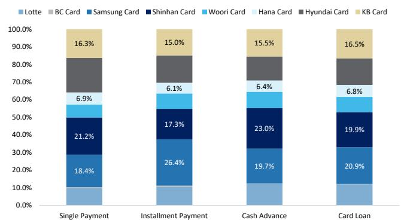

stacked bar chart

| Category | Lotte (%) | BC Card (%) | Samsung Card (%) | Shinhan Card (%) | Woori Card (%) | Hana Card (%) | Hyundai Card (%) | KB Card (%) |
| :--- | :--- | :--- | :--- | :--- | :--- | :--- | :--- | :--- |
| Single Payment | 10.0 | 18.4 | 21.2 | 15.0 | 6.9 | 0.0 | 30.0 | 16.3 |
| Installment Payment | 10.0 | 26.4 | 17.3 | 15.0 | 6.1 | 0.0 | 25.0 | 15.0 |
| Cash Advance | 12.0 | 19.7 | 23.0 | 15.0 | 6.4 | 0.0 | 20.0 | 15.5 |
| Card Loan | 12.0 | 20.9 | 19.9 | 15.0 | 6.8 | 0.0 | 25.0 | 16.5 |

Source: Source: Crefia, MS, Data as of Apr. 2026

Exhibit 86: Total Domestic Credit Sales and Growth Trend  
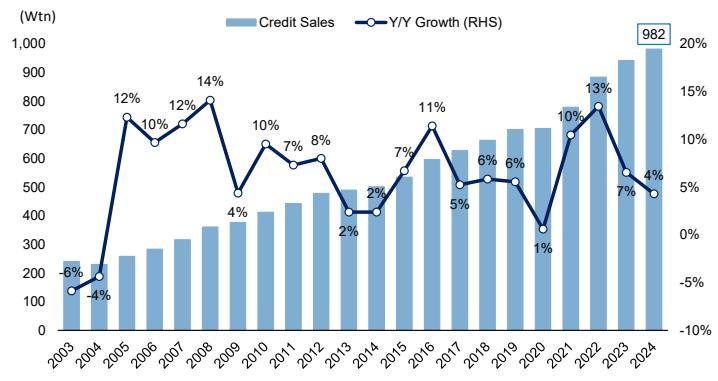

bar-line hybrid chart

| Year | Credit Sales (Wtn) | Y/Y Growth (%) |
| :--- | :--- | :--- |
| 2003 | 250 | -6 |
| 2004 | 230 | -4 |
| 2005 | 260 | 12 |
| 2006 | 280 | 10 |
| 2007 | 310 | 12 |
| 2008 | 360 | 14 |
| 2009 | 380 | 4 |
| 2010 | 410 | 10 |
| 2011 | 440 | 7 |
| 2012 | 480 | 8 |
| 2013 | 490 | 2 |
| 2014 | 500 | 2 |
| 2015 | 550 | 7 |
| 2016 | 600 | 11 |
| 2017 | 630 | 5 |
| 2018 | 660 | 6 |
| 2019 | 700 | 6 |
| 2020 | 710 | 1 |
| 2021 | 780 | 10 |
| 2022 | 890 | 13 |
| 2023 | 940 | 7 |
| 2024 | 982 | 4 |

Source: Crefia, MS, Data as of Apr. 2026

## Banks leveraged both to securities and credit card businesses should benefit; prefer SFG and KFG

All of the banks in our coverage are focused on the need to boost ROE and it remains the case that non-banking operations should be the differentiating factor between the banks. 1Q26 showed improved operational trends for SFG and KFG's securities businesses while for HFG results were weak.

We believe SFG has the most room to improve securities ops earnings in 2026 vs. 2025 due to a low base effect, while KFG is also heading towards W1tn+ NP for KB Securities for 2026.

Exhibit 87: MS Coverage: Order of Preference for Bank Stocks

<table><tr><td rowspan="2">Company</td><td rowspan="2">Ticker</td><td rowspan="2">MS Rating</td><td rowspan="2">Mkt. Cap (Wtn)</td><td rowspan="2">TP (KRW)</td><td rowspan="2">Close (KRW)</td><td colspan="4">Price Performance</td><td rowspan="2">12M Fwd P/B</td><td rowspan="2">12M Fwd P/E</td><td colspan="2">ROE (%)</td><td colspan="2">Dividend Yield (%)</td></tr><tr><td>YTD</td><td>3M</td><td>6M</td><td>12M</td><td>26E</td><td>27E</td><td>26E</td><td>27E</td></tr><tr><td>Banks</td><td></td><td></td><td></td><td></td><td></td><td></td><td></td><td></td><td></td><td></td><td></td><td></td><td></td><td></td><td></td></tr><tr><td>ShinhanGroup</td><td>055550.KS</td><td>Overweight</td><td>45.8</td><td>120,000</td><td>96,400</td><td>25%</td><td>-1%</td><td>18%</td><td>73%</td><td>0.7</td><td>8.1</td><td>9.3</td><td>9.4</td><td>3.1</td><td>3.5</td></tr><tr><td>KBFinancialGroup</td><td>105560.KS</td><td>Overweight</td><td>58.4</td><td>185,000</td><td>156,600</td><td>26%</td><td>-2%</td><td>19%</td><td>57%</td><td>0.8</td><td>8.7</td><td>10.5</td><td>10.4</td><td>3.0</td><td>3.3</td></tr><tr><td>HANAFINANCIALGR</td><td>086790.KS</td><td>Overweight</td><td>32.1</td><td>150,000</td><td>117,000</td><td>24%</td><td>-4%</td><td>20%</td><td>67%</td><td>0.7</td><td>7.1</td><td>9.6</td><td>9.6</td><td>4.0</td><td>4.3</td></tr><tr><td>KakaoBank</td><td>323410.KS</td><td>Equal-Weight</td><td>10.5</td><td>24,000</td><td>22,000</td><td>2%</td><td>-19%</td><td>0%</td><td>-9%</td><td>1.4</td><td>17.1</td><td>8.7</td><td>8.6</td><td>2.8</td><td>3.0</td></tr><tr><td>iBK</td><td>024110.KS</td><td>Underweight</td><td>16.2</td><td>21,000</td><td>20,350</td><td>-3%</td><td>-21%</td><td>-4%</td><td>32%</td><td>0.4</td><td>5.7</td><td>7.5</td><td>7.6</td><td>5.5</td><td>5.9</td></tr></table>

Source: WiseFN, MS, E=WiseFN Consensus Estimates, Data as of Jun 2, 2026

While the credit card business showed weaker-than-expected earnings in 1Q26 and credit card companies are also being affected by the retail credit tightening policy, we believe the increase in retail spending on the luxury side should be a positive factor. In 2026, we still believe the short-term lending businesses should provide ballast for group earnings despite weaker-than-expected 1Q26 results.

We see more earnings upside for Shinhan Card, in view of its strong linkages to department store spending and also because it as the largest share in the retail credit card market. KFG ranks right behind SFG in the credit card business on card usage market share.

Exhibit 88: Korean Banks – Earnings by Business Segment

<table><tr><td></td><td>(Wbn)</td><td>2020</td><td>2021</td><td>2022</td><td>2023</td><td>2024</td><td>2025</td><td>1Q26NP (Wbn)</td><td>2026ENP (Wbn)</td><td>Y/Y</td></tr><tr><td rowspan="7">SFG</td><td>Banking operations</td><td>2,078</td><td>2,513</td><td>3,068</td><td>3,073</td><td>3,706</td><td>3,789</td><td>1,161</td><td>3,901</td><td>3.0%</td></tr><tr><td>Short-term lenders (Card + Capital Co.)</td><td>767</td><td>950</td><td>945</td><td>925</td><td>689</td><td>585</td><td>177</td><td>673</td><td>15.1%</td></tr><tr><td>Credit card ops</td><td>607</td><td>675</td><td>641</td><td>621</td><td>572</td><td>477</td><td>115</td><td>508</td><td>6.5%</td></tr><tr><td>WM related subsidiaries (Insurers, Brokers + AM)</td><td>657</td><td>823</td><td>987</td><td>678</td><td>532</td><td>965</td><td>416</td><td>1,248</td><td>29.3%</td></tr><tr><td>Securities business</td><td>155</td><td>321</td><td>413</td><td>101</td><td>246</td><td>382</td><td>288</td><td>710</td><td>86.0%</td></tr><tr><td>Other subsidiaries + adjustment</td><td>-87</td><td>-266</td><td>-266</td><td>-307</td><td>-409</td><td>-367</td><td>-132</td><td>-346</td><td>-5.7%</td></tr><tr><td>Total</td><td>3,415</td><td>4,019</td><td>4,733</td><td>4,368</td><td>4,518</td><td>4,972</td><td>1,623</td><td>5,476</td><td>10.1%</td></tr><tr><td rowspan="7">KFG</td><td>Banking operations</td><td>2,298</td><td>2,591</td><td>2,996</td><td>3,262</td><td>3,252</td><td>3,862</td><td>1,101</td><td>3,954</td><td>2.4%</td></tr><tr><td>Short-term lenders (Card + Capital Co.)</td><td>466</td><td>629</td><td>596</td><td>538</td><td>625</td><td>565</td><td>180</td><td>592</td><td>4.7%</td></tr><tr><td>Credit card ops</td><td>325</td><td>419</td><td>379</td><td>351</td><td>403</td><td>330</td><td>108</td><td>375</td><td>13.6%</td></tr><tr><td>WM related subsidiaries (Insurers, Brokers + AM)</td><td>747</td><td>1,347</td><td>1,077</td><td>1,376</td><td>1,648</td><td>1,738</td><td>670</td><td>2,093</td><td>20.4%</td></tr><tr><td>Securities business</td><td>426</td><td>594</td><td>206</td><td>390</td><td>586</td><td>674</td><td>348</td><td>1,044</td><td>54.9%</td></tr><tr><td>Other subsidiaries + adjustment</td><td>-8</td><td>-204</td><td>-256</td><td>-543</td><td>-446</td><td>-322</td><td>-59</td><td>-259</td><td>-19.4%</td></tr><tr><td>Total</td><td>3,503</td><td>4,363</td><td>4,413</td><td>4,632</td><td>5,078</td><td>5,843</td><td>1,892</td><td>6,380</td><td>9.2%</td></tr><tr><td rowspan="7">HFG</td><td>Banking operations</td><td>2,010</td><td>2,570</td><td>3,169</td><td>3,477</td><td>3,356</td><td>3,748</td><td>1,104</td><td>3,936</td><td>5.0%</td></tr><tr><td>Short-term lenders (Card + Capital Co.)</td><td>332</td><td>523</td><td>490</td><td>388</td><td>338</td><td>271</td><td>101</td><td>322</td><td>18.9%</td></tr><tr><td>Credit card ops</td><td>155</td><td>251</td><td>192</td><td>171</td><td>222</td><td>218</td><td>48</td><td>173</td><td>-20.4%</td></tr><tr><td>WM related subsidiaries (Insurers, Brokers + AM)</td><td>518</td><td>624</td><td>220</td><td>-183</td><td>283</td><td>252</td><td>118</td><td>408</td><td>61.8%</td></tr><tr><td>Securities business</td><td>411</td><td>507</td><td>126</td><td>-271</td><td>225</td><td>212</td><td>103</td><td>365</td><td>72.3%</td></tr><tr><td>Other subsidiaries + adjustment</td><td>-223</td><td>-191</td><td>-254</td><td>-229</td><td>-239</td><td>-267</td><td>-113</td><td>-284</td><td>6.1%</td></tr><tr><td>Total</td><td>2,637</td><td>3,526</td><td>3,626</td><td>3,452</td><td>3,739</td><td>4,003</td><td>1,210</td><td>4,383</td><td>9.5%</td></tr></table>

Source: Company data, MS, E=Mogan Stanley Estimates

## Tweaking our sector allocation

We maintain our core overweight in sectors such as Industrials and IT, as we remain constructive on stories linked to our key global themes of AI Diffusion, Future of Energy, and Multipolar World.

We move Autos to equal-weight after a strong run for OEMs, especially for Hyundai Motor. However, we continue to like these stocks, given optionality linked to robotics and also group restructuring, which we believe needs time to materialize.

\- Korea Renaissance: Hyundai Motor Group: Laying Out a Blueprint (8 May 2026)

We move non-bank financials to overweight as we continue to see upside potential for the securities business; this also reflects our recent upgrade to Overweight on Samsung F&M.

• S. Korea Financials: In Waiting Mode (18 May 2026)  
- S. Korea Insurers: 1Q26 Wrap: Confidence Growing After 1Q; Upgrade SFM to OW (18 May 2026)

Exhibit 89: Sector Allocation  
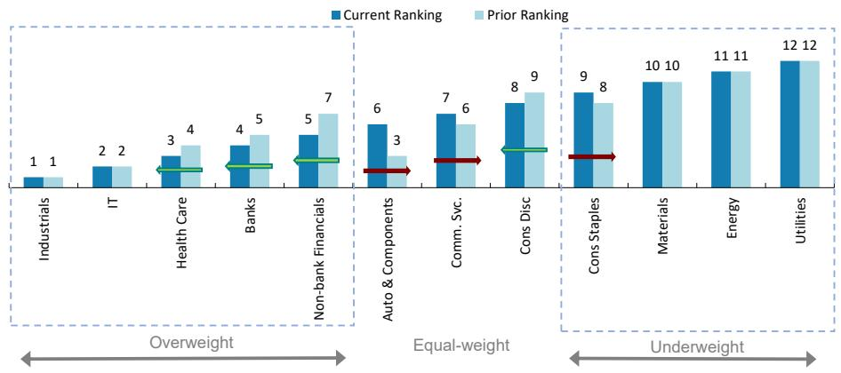

bar chart

| Category | Current Ranking | Prior Ranking |
| :--- | :--- | :--- |
| Industrials | 1 | 1 |
| IT | 2 | 2 |
| Health Care | 3 | 4 |
| Banks | 4 | 5 |
| Non-bank Financials | 5 | 7 |
| Auto & Components | 6 | 3 |
| Comm. Svc. | 7 | 6 |
| Cons Disc | 8 | 9 |
| Cons Staples | 9 | 8 |
| Materials | 10 | 10 |
| Energy | 11 | 11 |
| Utilities | 12 | 12 |
Overweight; Equal-weight; Underweight; Overweight; Equal-weight; Underweight

Source: MS

## Key risks to our market call

(1) AI capex cycle and demand disruption: There remain investor concerns about potential delays to data center build-up and also ROI for AI-linked businesses. If the AI build-out is delayed and/or computing growth shows a slower rate of change, there could be some volatility for IT stocks. To add, our Tech analyst, Shawn Kim, cautions that margin pressure is likely to persist in memory-consuming segments such as PC, mobile, and broader consumer supply chains. These end markets are unlikely to absorb higher memory costs, leading to demand destruction. Due to the concentration of the rally being high on select sectors, especially chipmakers, an AI downturn would be quite negative.  
(2) Global macro conditions turn weaker than expected because of high oil prices:

Trade tensions remain – but the bigger risk now is how oil/commodity prices will move. Korea looks better positioned relative to its Asian peers to weather the storm, but very high oil/commodity prices will negatively affect inflation and growth, which in turn could hurt corporate earnings.

(3) The government is unable to execute its policy agenda: The key risk is that the capital market/governance reform initiatives and other economic policies are not implemented.  
(4) Geopolitical tensions increase with neighboring countries: Geopolitical issues with Korea's neighboring countries have affected its equity market. If tensions should rise in the Asia-Pacific region, for whatever reason, we believe this could lead to a de-rating of Korean equities.  
(5) Domestic demand and the real estate market: Domestic demand weakens further

and a consumption recovery is delayed, while the housing market weakens significantly. A potential severe downturn in the Seoul Metro housing market could lead to problems, including construction sector liquidity issues and rising retail delinquencies.

## (6) Increased volatility due to wider breadth of participants and higher leverage levels:

We have seen participation in the equity market by domestic retail investors increase and the equity market has been supported by the positive inflows. However, there are investor concerns that retail leverage is very high and ETFs are becoming more of a factor in influencing market flows. Hence, any market correction could be more volatile because of such issues.

## Japan's Reform as Reference: Quicker Move amid Active Risk-Seeking in Korea

## Korean households are moving faster vs. Japan

Both Japan and Korea are experiencing a structural, policy-driven shift in household asset allocation – away from cash and deposits (in Japan's case) and real estate and cash (in Korea's case) – toward equity investments. While the two share a common reform philosophy, the specific reform designs, timelines, and household starting points differ meaningfully. For Japan, various market reforms that could affect households' asset allocation, including corporate governance, stewardship, and Tokyo Stock Exchange (TSE) reforms starting as early as 2014, along with the new NISA reform in 2024. For Korea, starting with the comprehensive capital markets reform in 2022, the Corporate Value-up (2024) and the latest KOSPI5000 initiatives have been the major market reform drivers.

- Speed: Korean household equity holdings surged 29.2% in 2025, pushing the equity share from 20.3% in 2024 to 26.5% of financial assets. At the same time, Japan's equity share has risen from 14.5% in 2015 to 21.6% in 2026.  
- Breadth: Nearly 50% of Korea's adult population now holds equities, 14.5mn, up from 15% a decade ago. In Japan, retail investors account for 25% of the total trading value on the TSE, up from roughly 18% to 20% in 2010. In terms of actual stock ownership, individuals hold 17.3% of the total value.  
- Policy intensity: Korea deployed aggressive, time-limited tax incentives, known as Returning Investment Accounts (RIA), which give capital gains tax exemptions for funds repatriated from overseas that are invested in local markets to accelerate the shift in equity investment. However, Japan's Nippon Individual Savings Account program (NISA), while successful, is a longer-term, more gradual initiative.  
- Market characterization: Korea's market has surged rapidly this year, largely driven by retail investors, particularly in the AI and semiconductor sectors. Japan's retail investor investment appears a more gradual process focused on lower-risk, value assets.

While the two economies share similar household asset structures, the differences also set them apart in terms of speed and scale of the asset shifts into equities.

## Similarities

- Cash holdings accounts make up the largest share of households financial assets.  
- Both have seen a 7ppt increase in their equities holdings in the past decade, including the investment trust portion for Japan.  
- Both have reduced their weighting in less volatile financial products, such as insurance and pensions since market reforms started.

Exhibit 90: Japanese households have shown stronger appetite for lower-risk assets vs. Korea; bias to cash remains higher  
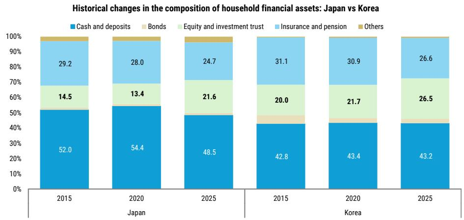

stacked bar chart

Historical changes in the composition of household financial assets: Japan vs Korea
| Country | Year | Cash and deposits (%) | Bonds (%) | Equity and investment trust (%) | Insurance and pension (%) | Others (%) |
| :--- | :--- | :--- | :--- | :--- | :--- | :--- |
| Japan | 2015 | 52.0 | 14.5 | 13.4 | 29.2 | 1.6 |
| Japan | 2020 | 54.4 | 13.4 | 13.4 | 28.0 | 1.6 |
| Japan | 2025 | 48.5 | 21.6 | 21.6 | 24.7 | 2.3 |
| Korea | 2015 | 42.8 | 20.0 | 21.7 | 31.1 | 0.0 |
| Korea | 2020 | 43.4 | 21.7 | 21.7 | 30.9 | 0.0 |
| Korea | 2025 | 43.2 | 26.5 | 26.5 | 26.6 | 0.0 |

Source: BoK, ESRI, MS

## Differences

- At the same time, in 2025 Korean households' holdings of equity assets remain more elevated compared to Japan at 26.5% vs. 21.6% in 2025 (including investment trusts).  
- Japan's bias toward cash and deposits still appears stronger than in Korea – with the cash share at 48.5% of total financial assets in Japan vs. 43.2% in Korea.  
- While Japan's households showed a decline in cash weighting (from 52% in 2015 to 48.5%), Korean households have shown little change (42.8% to 43.2%).

Korea and Japan are more conservative on investing in risk assets compared to the US; we see a closer DM-style move in Korea vs. Japan: Korean and Japanese households have conservative asset dynamics compared to other major economies. For example, compared to the US, where cash and deposit share comes to around 11% of total financial assets vs. 41% in equities and 26% in insurance and pension funds, as of 1Q25, both Korea and Japan hold notably more conservative portfolios with Japan at 48.5% cash holdings in 2025 followed by Korea at 43.2%.

However, in our base case for Korea, we see cash holdings falling below 40% in the next two years as equity holdings rise to 35% from 26.5% in 2025. We think this will set a trend for Korean households to move towards a DM-style asset composition where the proportion of higher-risk assets increases.

## Successful expansion of retail participation in NISA

Even with Japanese households' high cash holdings, we believe market reforms have been successful: Our analysts for Japan believe the nation's market reforms have led Japanese individuals to actively diversify their assets into stocks, bonds and alternative investments (see: Global Financials: Japan's Wealth Transition). Japan attracted flows via tax exemptions on financial returns via individual investment accounts, as well as creating policy-led funds for retail investors to participate. The key tool was via upgrading the previous NISA program into new NISA accounts, led by government incentives.

Upgraded in January 2024, NISA represented a significant shift in Japan's approach to encouraging household investment and long-term asset building. Under its Doubling Asset Income Plan, the new NISA system became permanent in 2024 with unlimited tax-free periods and increased investment limits, and it became structurally important as a distribution channel for investment trusts. NISA's share rose to around 25% of total subscriptions for publicly offered equity investment trusts in 2024. We assess that it promoted a major shift from Japan's traditional savings culture towards investments via means of individuals directly participating in financial investments via iDeCo (individual DCs) and corporate DCs (Defined Contribution).

Exhibit 91: Japan: Majority of contributions to annual increase in financial assets came from equity and investment trust holdings in 2025, following new NISA reforms  
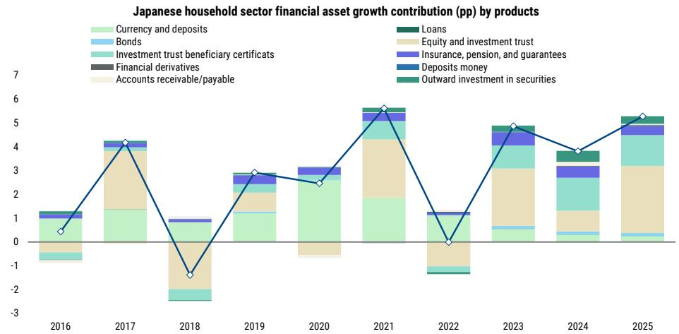

stacked bar chart

Japanese household sector financial asset growth contribution (pp) by products
| Year | Accounts receivable/payable | Financial derivatives | Insurance, pension, and guarantees | Loans | Equity and investment trust | Bonds | Currency and deposits | Investment trust beneficiary certificates | Outward investment in securities |
| :--- | :--- | :--- | :--- | :--- | :--- | :--- | :--- | :--- | :--- |
| 2016 | -0.7 | 0.3 | 0.2 | 0.1 | 0.4 | -0.3 | 0.8 | 0.1 | 0.1 |
| 2017 | -0.6 | 0.2 | 0.3 | 0.1 | 2.5 | -0.2 | 1.4 | 0.2 | 4.2 |
| 2018 | -2.3 | 0.1 | 0.1 | 0.1 | -1.5 | -0.4 | 0.9 | -0.1 | -1.5 |
| 2019 | 1.2 | 0.3 | 0.4 | 0.2 | 1.1 | -0.1 | 2.8 | 0.3 | 2.8 |
| 2020 | -0.6 | 0.1 | 0.3 | -0.3 | -0.5 | -0.6 | 2.5 | -0.1 | 2.5 |
| 2021 | 1.9 | 0.3 | 0.5 | 0.3 | 3.3 | -0.1 | 5.5 | 0.3 | 5.5 |
| 2022 | -1.3 | 0.1 | 0.1 | -0.1 | -0.8 | -0.3 | 1.2 | -0.1 | -0.1 |
| 2023 | 0.6 | 0.3 | 0.7 | 0.4 | 3.4 | -0.1 | 4.9 | 0.3 | 4.9 |
| 2024 | 0.3 | 0.2 | 0.8 | 0.5 | 1.4 | -0.1 | 3.7 | 0.3 | 3.7 |
| 2025 | 0.3 | 0.2 | 1.4 | 0.5 | 3.4 | -0.1 | 5.3 | 0.3 | 5.3 |
The chart displays a line graph connecting the stacked bars to the y-axis values for each category.

Source: BoJ, MS

As a result, the number of NISA accounts has nearly tripled in the past 10 years, further increasing to 28.4mn accounts in 2025 from 10mn in 2016. This is up 50% since the new NISA reforms started in 2024. The trajectory shows strong progress toward the government's goal to double asset incomes, where it has set a target of 34mn total accounts by the end of 2027. Alongside account growth, purchase amounts have also surged. Total NISA purchases reached approximately JPY71.4tn by end-2025, up from JPY52.6tn at end-2024 – an increase of approximately JPY19tn. This exceeded the government's 2027 target of JPY56tn in cumulative purchases.

Since the implementation of new NISA reforms, key structural changes have been observed, including:

1. Share of cash and deposits in total financial assets dropped below 50% in 2025, the first time since 2006.  
2. Share of equity holdings and investment trust exceeded 20% in the same period. In particular, most of the annual increase in Japanese households' financial assets in 2025 came from the rise in equity valuations amid a new inflow of funds, benefiting from the NISA reforms.  
3. Given its lifelong tax exemption up to JPY18mn, as well as offering an annual cap of JPY3.6mn and a monthly installment-based structure, we believe that incentives for a sustained inflow into equity assets are likely.

As Korea's ISA reforms have adopted a similar structure, we think they can support further sustained inflows into equities assets.

## Stronger appetite for retail equity investment in Korea vs. Japan

Overall, we gauge that Japan's reforms to encourage higher retail participation have had a significant impact, supported by government policies and a changing economic environment amid reflation. At the same time, we observe a more proactive and higher-risk appetite among Korean investors vs. a gradual, albeit strong, increase in Japan. This is reflected in the rapid expansion in financial assets in the past decade in Korea – up 94% vs. +30% in Japan.

Retail investor stock ownership: Despite an earlier start on market reforms with the new NISA in 2024, Japan's retail participation share has risen, but from a low base. Its individual investors accounted for 25% of trading value in 2025, the highest level in over a decade, but they made up only 17% of market ownership. Meanwhile in Korea, retail traders historically made up about 42-45% of total domestic exchange turnover, and the retail investor base has more than doubled in five years, to 14.2mn in 2024 from 6.9mn in 2019, or nearly half of the adult population (above age 15).

Intensity of retail participation: This growth has led retail transaction volumes to surge in Korea. In 2026, retail investors have been the largest net buyers in the Korean market, with approximately US\$15bn in inflows. On the other hand, Japanese retail investors have been net sellers of domestic stocks in 2025-26, offloading JPY3.8tn, despite a significant rally in Japanese equities. We think this contrarian behavior is indicative of the conservative nature of the domestic market in Japan.

More resources in Korea? Korean investors have significant cash in brokerage accounts, reaching W132tn this year, a record high. We believe this could be invested in equities. Margin lending balances have also continued to trend higher, indicating rising risk appetite. As of June 2026, customer deposits were up 60%, to W132tn, and margin lending balances up 70%, to W37.7tn, compared to August 2025.

Exhibit 92: The number of NISA accounts nearly tripled over the past 10 years, and is up 50% since the new NISA reforms  
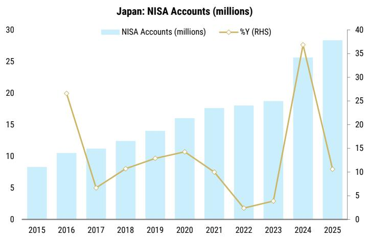

bar-line hybrid chart

Japan: NISA Accounts (millions)
| Year | NISA Accounts (millions) | %Y (RHS) |
| :--- | :--- | :--- |
| 2015 | 8.3 | |
| 2016 | 10.5 | 27.4 |
| 2017 | 11.2 | 5.3 |
| 2018 | 12.5 | 8.3 |
| 2019 | 14.0 | 9.7 |
| 2020 | 16.0 | 10.8 |
| 2021 | 17.6 | 7.9 |
| 2022 | 18.0 | 2.1 |
| 2023 | 18.8 | 3.4 |
| 2024 | 25.5 | 37.3 |
| 2025 | 28.5 | 10.6 |

Source: ESRI, MS

Exhibit 93: NISA reforms have helped the market rise since 2H25 amid strong corporate earnings performance in Japan  
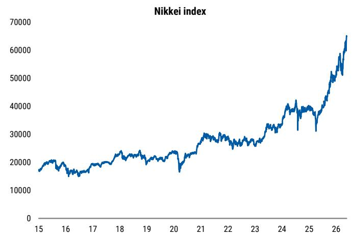

line chart

| Year | Nikkei index |
| ---- | ------------ |
| 15   | ~18000       |
| 16   | ~16000       |
| 17   | ~19000       |
| 18   | ~22000       |
| 19   | ~23000       |
| 20   | ~18000       |
| 21   | ~30000       |
| 22   | ~28000       |
| 23   | ~32000       |
| 24   | ~40000       |
| 25   | ~38000       |
| 26   | ~65000       |

Source: Bloomberg, MS

## Appendix 1: Product Outline

## (1) Expansion of ISA

The Korean government has been pursuing significant expansion of the Individual Savings Account (ISA) program since 2024 as part of its broader capital market reform agenda. These measures aim to incentivize retail investors to invest in the domestic equity market and ensure longer-term investment, particularly in response to the Korea discount and demographic challenges. These government policies aim to encourage long-term investment in the domestic stock market, facilitate asset accumulation for the public, and strengthen the role of capital markets in the Korean economy. The reforms are part of the government's broader domestic liquidity-linked measures to incentivize retail investors to invest in the domestic equity market and ensure longer-term investment.

Korea's ISA reform was inspired by Japan's new NISA reform, which was introduced to support the overall growth of financial assets held by households. Japan's NISA, after rule changes, led to a sharp increase in fund inflows and investment in domestic equities, which raised market hopes that Korea's ISA rule changes could have a similar effect.

Prior to 2024, the ISA maintained a conservative structure: an annual contribution limit of W20mn with a total limit of W100mn over five years. The current tax-exempt limit for investment gains is W2mn, assuming stocks are held for three years, with a separate tax rate of 9% applied to gains above the exempt limit.

However, a number of proposed reforms have gone through in 2024-26:

\- Increased contribution limits: The government has proposed raising the annual contribution limit from W20mn to W40mn, with the total contribution limit over five years rising from W100mn to W200mn. Another bill introduced in the National Assembly in April 2026 proposes an even higher annual limit of W60mn and a lifetime cap of W300mn.

\- Expanded tax-exempt limits: The government is likely to review the ISA tax-exempt limit from the current W2mn, based on proposed revisions that outline increasing the tax-exempt limit for interest and dividend income from W2mn to W5mn for the general accounts. Another bill in April 2026 proposed raising these limits to W6mn for general accounts and W12mn for low-income earners.

\- Progressive tax-exempt increases: A ruling party lawmaker, Lee Soyoung, has proposed an amendment to the Special Taxation Restriction Act that would add W1mn annually to the ISA tax-exempt limit for each year beyond the mandatory three-year holding period. Under this bill, investors holding an ISA for five years would see their tax-exempt limit rise to W4mn (W2mn existing + W2mn).

\- Lower tax rates: Another proposed bill suggests higher investment limits for ISAs and lowering tax rates from the current 9% to 5%, to incentivize longer-term investment into the domestic equity market.

\- Expanded eligibility: The government has proposed allowing individuals, subject to comprehensive financial income taxation, who were previously ineligible for existing ISAs, to join ISAs. However, they would not receive tax-free benefits, and a 14% separate taxation benefit would apply.

\- Multiple account allowance: The regulation limiting individuals to one ISA across all financial sectors is set to be abolished, allowing for multiple ISA accounts.

## New "Productive Finance ISA" or "Domestic Investment-Type ISA"

The Korean government introduced a new ISA variant in 2026, also referred to as "Domestic Investment-Type ISA" or "National Growth ISA," specifically designed to channel capital into domestic markets. This new ISA is designed with eligible investments limited to domestic stocks, domestic stock funds, the National Growth Fund, and Business Development Companies (BDCs), with investments in overseas Exchange-Traded Funds (ETFs) excluded. The new domestic-only ISA has an annual investment limit set at W40mn (total limit of W200mn) with a tax exemption limit of W10mn. It offers significantly expanded tax benefits compared to existing ISAs, providing dual benefits: an income tax deduction on the contribution amount and reduced taxes on interest and dividend income. There have also been discussions about potentially removing the tax-exempt limit entirely for the National Growth ISA.

## Eligible Investment Instruments Expansion

The Korean government is reviewing a proposal to include the National Growth Fund and Business Development Company (BDC) Fund as eligible investment instruments under the ISA scheme. The government is also considering granting enhanced tax incentives for investments in policy-driven funds such as the National Growth Fund and BDC Fund compared to conventional equity-type funds. Under the proposal, tax benefits would apply to both contributions and dividend income, with dividends from these funds potentially subject to separate taxation at a lower rate.

## Implementation Status and Challenges

Various measures to upgrade the ISA have been proposed by the Korean government since 2024, including raising the limit and increased tax benefits, together with allowing affluent retail consumers to have ISAs. However, the bill was not passed in 2024 as the opposition party was against lowering taxes for the affluent. The ISA upgrade measures requiring an Income Tax Act revision passed the National Assembly and the key date for Korea's ISA upgrade is June 22, 2026, when the new "Productive Finance ISA" is scheduled for launch. This follows years of legislative efforts that failed in 2024 and were revived as part of the government's 2026 economic growth strategy announced in January 2026.

## (2) Advancing IRP

The Individual Retirement Pension (IRP) system continues to be strengthened as the Korean government's primary long-term retirement savings vehicle. The most significant recent enhancement is the maintenance of an expanded tax-credit framework under which pension savings accounts and IRPs share a combined annual tax-credit contribution limit of W9mn, with pension savings accounts capped at W6mn and IRP contributions used to reach the overall ceiling. Depending on income level, contributors can receive tax credits of 13.2-16.5%, allowing annual tax savings of up to approximately W149mn.

Policymakers have also continued to emphasize retirement asset accumulation through tax-deferred investment growth within IRP accounts and by encouraging investors to transfer matured ISA assets into pension vehicles. Recent discussions have focused on further strengthening retirement adequacy rather than materially altering the structure.

## (3) Retirement pension system reform: transformation into investment funds

Korea's individual retirement pension system is undergoing a major transformation as part of the government's broader pension reform agenda. The Special Committee on Pension Reform, under the Lee administration is expected to continue revamping the national pension system (NPS) and restructure the current individual retirement pension to an investable fund.

The size of the fund reached W431tn as of end-2024, as large as nearly 30% of the NPS's total investment portfolio. The government aims to ramp up its capital markets reform by following up on the latest national pension reforms and proposing new retirement pension changes that can increase the income replacement ratio for retirees and liquidity for local financial markets.

Given the meaningful size of the retirement pension savings, if the funds are unlocked for investment, the asset allocation decision could have an impact on Korea's currency. Korea's corporate reforms could bring \~US\$15-30bn of foreign equity inflows, while NPS foreign investments may rise to \~US\$50bn in 2026. Combined, the two reforms could be positive for KOSPI but have a modest impact on Korea FX and rates (see Korea Reform

Renaissance: Asset Implications of Pension and Corporate Reforms).

## Shift from Defined Benefit to Defined Contribution

Ruling party lawmakers in Korea and the MoFE have been proposing to transform the mostly Defined Benefits-based individual retirement pension into a Defined Contribution plan. The government is looking to turn the pension into a plan based on contributions and investment performance, similar to the current system for the NPS.

## First, the government introduced a "Default Option" scheme for DC and IRP

retirement pensions in 2022: The Default Option scheme is a system in which employees pre-designate certain investment options so that their pensions can be invested in certain types of assets without detailed instructions. The scheme aims to improve the overall return of pension funds by encouraging investment in various types of assets in more convenient ways, as more than 80% of pension reserves have been invested in low-return assets with guarantees on principal.

This system automatically enrolls individuals in a pre-designated investment product if they fail to provide investment direction within six weeks after a product's maturity, and employees can change their default option at any time. Employers were required to establish these default fund options by July 11, 2023. While historically, a large portion of DC assets were in low-interest, principal-guaranteed products, the new system aims to diversify investments.

These default options are pre-approved by the Ministry of Employment and Labor and can include various products, including target date funds (TDFs) and principal-guaranteed options. Retirement pension providers are offering various default options, including those with allocations to stocks, bonds, and alternative assets like gold.

In 2025-26, Korea is moving towards a fund-type retirement pension system: We see efforts around making retirement pension plans mandatory for all workplaces, with the mandate being phased in based on company size, and with larger companies potentially being mandated first. Employers will be required to deposit severance benefits into externally managed retirement pension plans. This involves abolishing the existing severance pay system and unifying it under a retirement pension system managed by external financial institutions. The retirement pension system will also transition to a "fund-type" system, where pensions are pooled into a fund managed by a separate legal entity. The goal is to introduce competition among private entities managing these funds to boost investment returns.

## Poor Historical Performance and Reform Rationale

Given that only 5% of the retirement pensions are being managed, with the rest deposited in savings accounts or other guaranteed principal and interest products, the average return on assets for an individual fund was 2.91% pa between 2020-24, far below the NPS's 7.82% in the same period, or 2% vs. 5.5% over the past 10 years, respectively.

More recently, the NPS's return on investment has surged on the back of equity market outperformance. It further widened the gap with other funds and accelerated the call to transform other pensions into investable funds. In 2024, the NPS posted a record 15% investment return, generating W160tn in profits. The fund's assets surged to W1,213tn by end-2024, driven by a 34.3% return on overseas stocks, which offset a 6.9% loss in domestic equities.

In 2025, it achieved a record-breaking return of 18.82% (provisional, money-weighted return), generating W231.6tn in earnings. This was the best performance since the fund's establishment in 1988. Domestic equities were the highest-performing asset class, with an 82.4% return, driven by technology stocks (AI and semiconductors) and government policies. Overseas equities also performed strongly at +19.7%.

## Progress and Timeline

On October 13, 2025, at the parliamentary audit session, Finance Minister Koo Yun-Cheol indicated a willingness to lead individual retirement pensions' transformation into investable funds. There are six active submissions of amendment bills to current retirement legislation, supported by the government and ruling party lawmakers. The goal is to improve financial performance of the retirement pension by turning it into an investable fund. If achieved, it would supplement the NPS's low-income replacement ratio of 43% by providing an additional source of retirement pension funds, eventually enhancing household incomes post-retirement.

In 4Q25, the government created a task force to push for retirement pension reform. As a part of the KOSPI 5000 agenda, there are ongoing talks around a newly investable asset under the retirement fund that could also be used to help the domestic equity market via increasing asset allocation into local equities and/or bonds.

## (4) National Growth Fund

The National Growth Fund (officially known as the National Participation Growth Fund) launched for sales on May 22, 2026: It is designed to channel capital into hightech industries while also stimulating domestic equity market participation. It is part of the government's broader domestic liquidity-linked measures to incentivize retail investors to invest in the domestic equity market and ensure longer-term investment. The fund is backed by the government and offers retail investors tax breaks and a loss-protection buffer for investments in high-tech strategic sectors like AI, semiconductors, and biotech. Demand was high: its initial W600 billion allocation completely sold out, and the fund is officially scheduled to be established on June 12, 2026, with actual investments commencing on June 15, 2026.

Encouraging households to move from seeking interest-earning deposit-style asset management to shift toward investing in productive sectors, the government sees a new role of household funds as a strategic resource allocation. The fund operates through multiple mechanisms that directly and indirectly boost equity market investments. The goal is to redirect the flow of funds toward innovative sectors and strategic industries, and renewable energy sectors for the next five years including: AI, semiconductors, biotechnology, vaccines, robotics, hydrogen, secondary batteries, displays, future vehicles and defense (press release).

The fund complements other market reform measures, including the Corporate Value-Up Program, which was launched in February 2024 to address the Korea discount through voluntary corporate disclosures, governance improvements, and enhanced shareholder returns. The Korea Value-Up Index was launched in September 2024, composed of companies with strong profitability, shareholder returns, and valuation metrics (PBR, ROE), serving as a benchmark for institutional investors with associated ETFs.

## Fund Structure and Scale

The National Growth Fund plans to invest W150tn (approximately US\$110bn) over five years. The fund is composed of W75tn from a high-tech industry fund backed by the state-run Korea Development Bank (KDB) and another W7tn raised from financial services companies, pension funds, and individual investors. For 2026, the first year of its full operation, the National Growth Fund plans to invest over W30tn, with significant allocations including W6tn for AI, W4.2tn for semiconductors, and W3.1tn for mobility.

## Methods of financial support:

\- Direct equity investment: Participating as an equity investor in new corporate entities, plant construction projects, or providing funding for mergers and acquisitions (M&A) of tech companies; W15tn allocation.

\- Indirect equity investment: The high-tech strategic industry fund and private sector investment funds jointly create large-scale funds for equity investments, with W35tn allocated.

\- Infrastructure investment: Financing for projects like power grids, power generation, water supply facilities, and AI data centers that support advanced industries, with W50tn allocated.

\- Low-interest lending: Ultra-low-interest loans, typically in the 2% range, for large-scale facility investments and R&D projects, with W50tn allocated.

## Appendix 2: Property Market Measures

## Major real estate tightening measures in 2025-26:

- March 2025: The government announced Housing Market Stabilization Measures on March 19, designating major Seoul districts as Real-Estate Transaction Restriction Zones starting March 24, requiring pre-approval for apartment transactions.  
- June 2025: On June 27, the government rolled out strict lending policies that took effect on June 28, including a cap on mortgage loans at W600mn for Seoul and metropolitan areas, tighter monitoring on lending, and loan growth target caps for lenders set at 50%.  
- September 2025: On September 7, the government announced comprehensive real estate market measures focusing on supply expansion and demand control - plans to supply 270,000 housing units per year over the next five years, totaling 1.35mn units in the Seoul Metro area.  
- Demand-side measures included improving mortgage LTV caps in regulated areas from 50% to 40% and restricting mortgages for multi-home owners.  
- October 2025: The government unveiled the third and most comprehensive set of housing market measures on October 15. All 25 districts of Seoul and 12 additional areas in Gyeonggi Province were designated as speculative and land transaction permit zones.  
- Mortgage caps were tightened on a sliding scale: loans for homes priced between W1.5bn and W2.5bn were capped at W400mn, while those above W2.5bn were limited to W200mn.  
- February 2026: The focus shifted to revamping the tax framework for real estate, including not extending the grace period for punitive capital gains tax on multi-home owners and possibly raising home ownership taxes.  
- May 2026: The reinstatement of punitive capital gains tax surcharges for multi-homeowners in regulated zones, ended its temporary suspension on 9 May, which had been in effect for about four years.  
- 2H26 (possibly July): Beyond the capital gains tax restoration, the government is actively reviewing a broader overhaul of holding taxes (property tax and comprehensive real estate tax). The tax reforms are expected to be finalized and announced around July 2026.

## Disclosure Section

The information and opinions in MS were prepared or are disseminated by MS Asia Limited (which accepts the responsibility for its contents) and/or MS Asia (Singapore) Pte. (Registration number 199206298Z) and/or MS Asia (Singapore) Securities Pte Ltd (Registration number 200008434H), regulated by the Monetary Authority of Singapore (which accepts legal responsibility for its contents and should be contacted with respect to any matters arising from, or in connection with, MS), and/or MS Taiwan Limited and/or MS & Co International plc, Seoul Branch, and/or MS Australia Limited (A.B.N. 67 003 734 576, holder of Australian financial services license No. 233742, which accepts responsibility for its contents), and/or MS Wealth Management Australia Pty Ltd (A.B.N. 19 009 145 555, holder of Australian financial services license No. 240813, which accepts responsibility for its contents), and/or MS India Company Private Limited having Corporate Identification No (CIN) U22990MH1998PTC115305, regulated by the Securities and Exchange Board of India ("SEBI") and holder of licenses as a Research Analyst (SEBI Registration No. INH000001105); Stock Broker (SEBI Stock Broker Registration No. INZ000244438), Merchant Banker (SEBI Registration No. INM000011203), and depository participant with National Securities Depository Limited (SEBI Registration No. IN-DP-NSDL-567-2021) having registered office at Altimus, Level 39 & 40, Pandurang Budhkar Marg, Worli, Mumbai 400018, India; Telephone no. +91-22-61181000; Compliance Officer Details: Mr. Tejarshi Hardas, Tel. No.: +91-22-61181000 or Email: tejarshi.hardas@morganstanley.com; Grievance officer details: Mr. Tejarshi Hardas, Tel. No.: +91-22-61181000 or Email: msic-compliance@morganstanley.com which accepts the responsibility for its contents and should be contacted with respect to any matters arising from, or in connection with, MS, and their affiliates (collectively, "MS"). MS India Company Private Limited (MSICPL) may use AI tools in providing research services. All recommendations contained herein are made by the duly qualified research analysts.

For important disclosures, stock price charts and equity rating histories regarding companies that are the subject of this report, please see the MS Disclosure Website at www.morganstanley.com/eqr/disclosures/webapp/generalresearch, or contact your investment representative or MS at 1585 Broadway, (Attention: Research Management), New York, NY, 10036 USA.

For valuation methodology and risks associated with any recommendation, rating or price target referenced in this research report, please contact the Client Support Team as follows: US/Canada +1 800 303-2495; Hong Kong +852 2848-5999; Latin America +1 718 754-5444 (U.S.); London +44 (0)20-7425-8169; Singapore +65 6834-6860; Sydney +61 (0)2-9770-1505; Tokyo +81 (0)3-6836-9000. Alternatively you may contact your investment representative or MS at 1585 Broadway, (Attention: Research Management), New York, NY 10036 USA.

## Analyst Certification

The following analysts hereby certify that their views about the companies and their securities discussed in this report are accurately expressed and that they have not received and will not receive direct or indirect compensation in exchange for expressing specific recommendations or views in this report: Heewon Choi; Joon Seok.

## Global Research Conflict Management Policy

MS has been published in accordance with our conflict management policy, which is available at www.morganstanley.com/institutional/research/conflictpolicies. A Portuguese version of the policy can be found at www.morganstanley.com.br

## Important Regulatory Disclosures on Subject Companies

The analyst or strategist (or a household member) identified below owns the following securities (or related derivatives): Minseo Kang - Samsung Electronics(common or preferred stock). As of May 29, 2026, MS beneficially owned 1% or more of a class of common equity securities of the following companies covered in MS: Hotel Shilla, Hyundai Department Store, Kakao Bank Corp, KB Financial Group, L&C Bio Co Ltd, PharmaResearch Co Ltd, Shinhan Financial Group, Shinsegae, SK hynix, Woori Financial Group.

Within the last 12 months, MS managed or co-managed a public offering (or 144A offering) of securities of Samsung Electronics, SK hynix.

Within the last 12 months, MS has received compensation for investment banking services from SK hynix.

In the next 3 months, MS expects to receive or intends to seek compensation for investment banking services from Celltrion Inc, Hana Financial Group, Hotel Shilla, Hyundai Motor, Kakao Bank Corp, KB Financial Group, Samsung Electronics, Samsung Fire & Marine, Shinhan Financial Group, SK hynix.

Within the last 12 months, MS has received compensation for products and services other than investment banking services from Hana Financial Group, Hyundai Motor, Industrial Bank of Korea, KB Financial Group, Samsung Fire & Marine, Shinhan Financial Group, Woori Financial Group.

Within the last 12 months, MS has provided or is providing investment banking services to, or has an investment banking client relationship with, the following company: Celltrion Inc, Hana Financial Group, Hotel Shilla, Hyundai Motor, Kakao Bank Corp, KB Financial Group, Samsung Electronics, Samsung Fire & Marine, Shinhan Financial Group, SK hynix.

Within the last 12 months, MS has either provided or is providing non-investment banking, securities-related services to and/or in the past has entered into an agreement to provide services or has a client relationship with the following company: Hana Financial Group, Hyundai Motor, Industrial Bank of Korea, KB Financial Group, Samsung Fire & Marine, Shinhan Financial Group, Woori Financial Group.

MS & Co. LLC makes a market in the securities of Woori Financial Group.

The equity research analysts or strategists principally responsible for the preparation of MS have received compensation based upon various factors, including quality of research, investor client feedback, stock picking, competitive factors, firm revenues and overall investment banking revenues. Equity Research analysts' or strategists' compensation is not linked to investment banking or capital markets transactions performed by MS or the profitability or revenues of particular trading desks.

MS and its affiliates do business that relates to companies/instruments covered in MS, including market making, providing liquidity, fund management, commercial banking, extension of credit, investment services and investment banking. MS sells to and buys from customers the securities/instruments of companies covered in MS on a principal basis. MS may have a position in the debt of the Company or instruments discussed in this report. MS trades or may trade as principal in the debt securities (or in related derivatives) that are the subject of the debt research report.

Certain disclosures listed above are also for compliance with applicable regulations in non-US jurisdictions.

## STOCK RATINGS

MS uses a relative rating system using terms such as Overweight, Equal-weight, Not-Rated or Underweight (see definitions below). MS does not assign ratings of Buy, Hold or Sell to the stocks we cover. Overweight, Equal-weight, Not-Rated and Underweight are not the equivalent of buy, hold and sell. Investors should carefully read the definitions of all ratings used in MS. In addition, since MS contains more complete information concerning the analyst's views, investors should carefully read MS, in its entirety, and not infer the contents from the rating alone. In any case, ratings (or research) should not be used or relied upon as investment advice. An investor's decision to buy or sell a stock should depend on individual circumstances (such as the investor's existing holdings) and other considerations.

## Global Stock Ratings Distribution

(as of May 31, 2026)

The Stock Ratings described below apply to MS's Fundamental Equity Research and do not apply to Debt Research produced by the Firm.

For disclosure purposes only (in accordance with FINRA requirements), we include the category headings of Buy, Hold, and Sell alongside our ratings of Overweight, Equal-weight, Not-Rated and Underweight. MS does not assign ratings of Buy, Hold or Sell to the stocks we cover. Overweight, Equal-weight, Not-Rated and Underweight are not the equivalent of buy, hold, and sell but represent recommended relative weightings (see definitions below). To satisfy regulatory requirements, we correspond Overweight, our most positive stock rating, with a buy recommendation; we correspond Equal-weight and Not-Rated to hold and Underweight to sell recommendations, respectively.

<table><tr><td></td><td colspan="2">Coverage Universe</td><td colspan="3">Investment Banking Clients (IBC)</td><td colspan="2">Other Material Investment ServicesClients (MISC)</td></tr><tr><td>Stock RatingCategory</td><td>Count</td><td>% of Total</td><td>Count</td><td>% of Total IBC</td><td>% of RatingCategory</td><td>Count</td><td>% of Total OtherMISC</td></tr><tr><td>Overweight/Buy</td><td>1542</td><td>42%</td><td>465</td><td>51%</td><td>30%</td><td>707</td><td>43%</td></tr><tr><td>Equal-weight/Hold</td><td>1571</td><td>43%</td><td>369</td><td>40%</td><td>23%</td><td>723</td><td>44%</td></tr><tr><td>Not-Rated/Hold</td><td>3</td><td>0%</td><td>0</td><td>0%</td><td>0%</td><td>1</td><td>0%</td></tr><tr><td>Underweight/Sell</td><td>551</td><td>15%</td><td>86</td><td>9%</td><td>16%</td><td>201</td><td>12%</td></tr><tr><td>Total</td><td>3,667</td><td></td><td>920</td><td></td><td></td><td>1632</td><td></td></tr></table>

Data include common stock and ADRs currently assigned ratings. Investment Banking Clients are companies from whom MS received investment banking compensation in the last 12 months. Due to rounding off of decimals, the percentages provided in the "% of total" column may not add up to exactly 100 percent.

## Analyst Stock Ratings

Overweight (O). The stock's total return is expected to exceed the average total return of the analyst's industry (or industry team's) coverage universe, on a risk-adjusted basis, over the next 12-18 months.

Equal-weight (E). The stock's total return is expected to be in line with the average total return of the analyst's industry (or industry team's) coverage universe, on a risk-adjusted basis, over the next 12-18 months.

Not-Rated (NR). Currently the analyst does not have adequate conviction about the stock's total return relative to the average total return of the analyst's industry (or industry team's) coverage universe, on a risk-adjusted basis, over the next 12-18 months.

Underweight (U). The stock's total return is expected to be below the average total return of the analyst's industry (or industry team's) coverage universe, on a risk-adjusted basis, over the next 12-18 months.

Unless otherwise specified, the time frame for price targets included in MS is 12 to 18 months.

## Analyst Industry Views

Attractive (A): The analyst expects the performance of his or her industry coverage universe over the next 12-18 months to be attractive vs. the relevant broad market benchmark, as indicated below.

In-Line (I): The analyst expects the performance of his or her industry coverage universe over the next 12-18 months to be in line with the relevant broad market benchmark, as indicated below. Cautious (C): The analyst views the performance of his or her industry coverage universe over the next 12-18 months with caution vs. the relevant broad market benchmark, as indicated below. Benchmarks for each region are as follows: North America - S&P 500; Latin America - relevant MSCI country index or MSCI Latin America Index; Europe - MSCI Europe; Japan - TOPIX; Asia - relevant MSCI country index or MSCI sub-regional index or MSCI AC Asia Pacific ex Japan Index.

## Stock Price, Price Target and Rating History (See Rating Definitions)

Binex Co Ltd (053030.KQ) - As of 06/11/26 GMT in KRW Industry : S. Korea Healthcare  
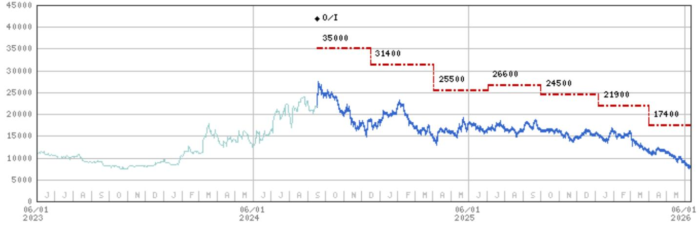

line chart

| Date       | Value  |
| ---------- | ------ |
| 06/01 2023 | 11000  |
| 06/01 2024 | 27000  |
| 06/01 2025 | 18000  |
| 06/01 2026 | 8000   |

Stock Rating History: 9/18/24 : 0/I  
Price Target History: 9/18/24 : 35000; 12/16/24 : 31400; 4/3/25 : 25500; 7/3/25 : 26600; 10/1/25 : 24500; 1/6/26 : 21900; 4/1/26 : 17400  
Source: MS Date Format : MM/DD/YY Price Target = No Price Target Assigned (NA)  
Stock Price (Not Covered by Current Analyst) — Stock Price (Covered by Current Analyst)  
Stock and Industry Ratings (abbreviations below) appear as ♦ Stock Rating/Industry View  
Stock Ratings: Overweight (O) Equal-weight (E) Underweight (U) Not-Rated (NR) No Rating Available (NA)  
Industry View: Attractive (A) In-line (I) Cautious (C) No Rating (NR)  
Effective January 13, 2014, the stocks covered by MS Asia Pacific will be rated relative to the analyst's industry (or industry team's) coverage.  
Effective January 13, 2014, the industry view benchmarks for MS Asia Pacific are as follows: relevant MSCI country index or MSCI sub-regional index or MSCI AC Asia Pacific ex Japan Index.

Celltrion Inc (068270.KS) - As of 06/11/26 GMT in KRW Industry : S. Korea Healthcare  
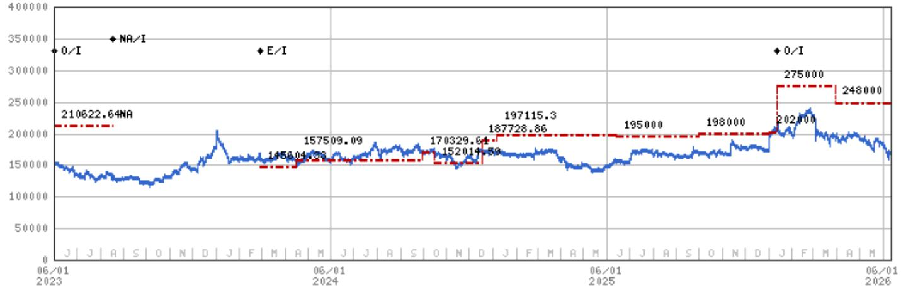

line chart

| Date       | Value     |
| ---------- | --------- |
| 06/01 2023 | 210622.64NA |
| 06/01 2024 | 157509.09  |
| 06/01 2024 | 170329.64  |
| 06/01 2024 | 152014.59  |
| 06/01 2024 | 187728.86  |
| 06/01 2024 | 197115.3   |
| 06/01 2024 | 195000    |
| 06/01 2024 | 198000    |
| 06/01 2024 | 202000    |
| 06/01 2024 | 275000    |
| 06/01 2024 | 248000    |

Stock Rating History: 6/1/21 : NA/NR; 9/8/21 : NA/NR; 10/27/21 : E/I; 5/18/23 : 0/I; 8/17/23 : NA/I; 2/29/24 : E/I; 1/12/26 : 0/I  
Price Target History: 10/27/21 : 198550.61; 2/14/22 : 152331.52; 5/13/22 : 144406.75; 7/20/22 : 160256.28; 10/6/22 : 159375.73;  
2/1/23 : 157509.09; 4/13/23 : 172161.09; 5/18/23 : 210622.64; 8/17/23 : NA; 2/29/24 : 145604.33; 4/16/24 : 157509.09;  
9/30/24 : 170329.61; 10/16/24 : 152014.59; 12/17/24 : 187728.86; 1/6/25 : 197115.3; 6/13/25 : 195000; 9/30/25 : 198000;  
1/2/26 : 202000; 1/12/26 : 275000; 3/31/26 : 248000  
Source: MS Date Format : MM/DD/YY Price Target = No Price Target Assigned (NA)  
Stock Price (Not Covered by Current Analyst) — Stock Price (Covered by Current Analyst)  
Stock and Industry Ratings (abbreviations below) appear as ♦ Stock Rating/Industry View  
Stock Ratings: Overweight (O) Equal-weight (E) Underweight (U) Not-Rated (NR) No Rating Available (NA)  
Industry View: Attractive (A) In-line (I) Cautious (C) No Rating (NR)  
Effective January 13, 2014, the stocks covered by MS Asia Pacific will be rated relative to the analyst's industry (or industry team's) coverage.  
Effective January 13, 2014, the industry view benchmarks for MS Asia Pacific are as follows: relevant MSCI country index or MSCI sub-regional index or MSCI AC Asia Pacific ex Japan Index.

GC Biopharma Corp. (006280.KS) - As of 06/11/26 GMT in KRW Industry : S. Korea Healthcare  
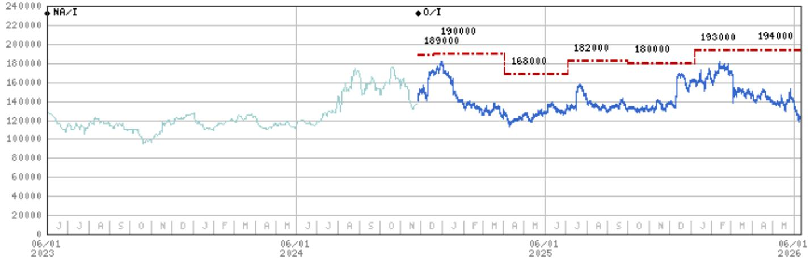

line chart

| Date       | Value   |
| ---------- | ------- |
| 06/01 2023 | NA/I    |
| 06/01 2024 | 189000  |
| 06/01 2025 | 168000  |
| 06/01 2026 | 194000  |

Stock Rating History: 6/1/21 : NA/NR; 9/8/21 : NA/NR; 10/27/21 : NA/I; 11/26/24 : 0/I  
Price Target History: 11/26/24 : 189000; 12/20/24 : 190000; 4/3/25 : 168000; 7/4/25 : 182000; 9/30/25 : 180000; 1/6/26 : 193000; 3/31/26 : 194000  
Source: MS Date Format : MM/DD/YY Price Target = No Price Target Assigned (NA)  
Stock Price (Not Covered by Current Analyst) — Stock Price (Covered by Current Analyst)  
Stock and Industry Ratings (abbreviations below) appear as ♦ Stock Rating/Industry View  
Stock Ratings: Overweight (O) Equal-weight (E) Underweight (U) Not-Rated (NR) No Rating Available (NA)  
Industry View: Attractive (A) In-line (I) Cautious (C) No Rating (NR)  
Effective January 13, 2014, the stocks covered by MS Asia Pacific will be rated relative to the analyst's industry (or industry team's) coverage.  
Effective January 13, 2014, the industry view benchmarks for MS Asia Pacific are as follows: relevant MSCI country index or MSCI sub-regional index or MSCI AC Asia Pacific ex Japan Index.

Hana Financial Group (086790.KS) - As of 06/11/26 GMT in KRW Industry : S. Korea Financials  
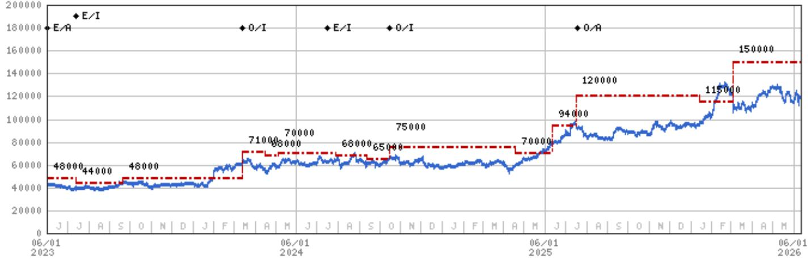

line chart

| Date       | Value   |
| ---------- | ------- |
| 06/01 2023 | 48000   |
|            | 44000   |
|            | 48000   |
|            | 71000   |
|            | 70000   |
|            | 68000   |
|            | 65000   |
|            | 75000   |
|            | 70000   |
|            | 94000   |
|            | 120000  |
|            | 115000  |
|            | 150000  |

Stock Rating History: 6/1/21 : 0/A; 5/16/23 : E/A; 7/14/23 : E/I; 3/14/24 : 0/I; 7/16/24 : E/I; 10/16/24 : 0/I; 7/19/25 : 0/A  
Price Target History: 5/26/21 : 56000; 11/5/21 : 58000; 2/28/22 : 62000; 7/4/22 : 50000; 5/16/23 : 48000; 7/14/23 : 44000;  
9/20/23 : 48000; 3/14/24 : 71000; 4/16/24 : 68000; 5/6/24 : 70000; 7/29/24 : 68000; 9/13/24 : 65000; 10/16/24 : 75000;  
4/18/25 : 70000; 6/12/25 : 94000; 7/16/25 : 120000; 1/13/26 : 115000; 3/3/26 : 150000  
Source: MS Date Format : MM/DD/YY Price Target = No Price Target Assigned (NA)  
Stock Price (Not Covered by Current Analyst) — Stock Price (Covered by Current Analyst)  
Stock and Industry Ratings (abbreviations below) appear as ♦ Stock Rating/Industry View  
Stock Ratings: Overweight (O) Equal-weight (E) Underweight (U) Not-Rated (NR) No Rating Available (NA)  
Industry View: Attractive (A) In-line (I) Cautious (C) No Rating (NR)  
Effective January 13, 2014, the stocks covered by MS Asia Pacific will be rated relative to the analyst's industry (or industry team's) coverage.  
Effective January 13, 2014, the industry view benchmarks for MS Asia Pacific are as follows: relevant MSCI country index or MSCI sub-regional index or MSCI AC Asia Pacific ex Japan Index.

Hotel Shilla (008770.KS) - As of 06/11/26 GMT in KRW Industry : S. Korea Consumer  
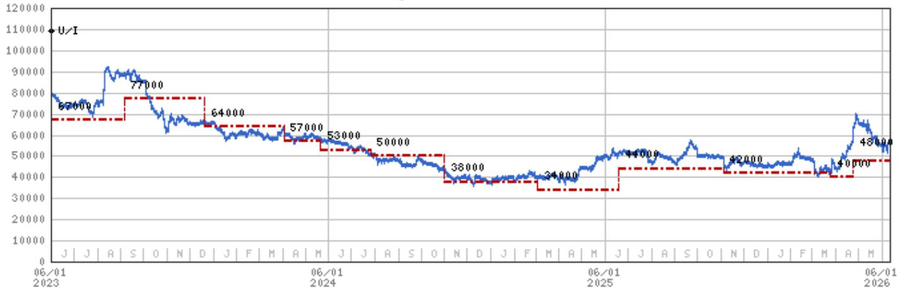

line chart

| Date       | Value   |
| ---------- | ------- |
| 06/01 2023 | 67000   |
|            | 77000   |
|            | 64000   |
|            | 57000   |
|            | 53000   |
|            | 50000   |
|            | 38000   |
|            | 34000   |
|            | 44000   |
|            | 42000   |
|            | 40000   |
|            | 48000   |

Stock Rating History: 6/1/21 : U/I  
Price Target History: 4/30/21 : 76000; 6/4/21 : 82000; 7/30/21 : 85000; 12/9/21 : 77000; 1/31/22 : 72000; 4/29/22 : 70000;  
10/28/22 : 65000; 5/17/23 : 67000; 9/5/23 : 77000; 12/20/23 : 64000; 4/3/24 : 57000; 5/21/24 : 53000; 7/26/24 : 50000;  
11/1/24 : 38000; 3/4/25 : 34000; 6/19/25 : 44000; 11/4/25 : 42000; 3/25/26 : 40000; 4/24/26 : 48000  
Source: MS Date Format : MM/DD/YY Price Target = No Price Target Assigned (NA)  
Stock Price (Not Covered by Current Analyst) — Stock Price (Covered by Current Analyst)  
Stock and Industry Ratings (abbreviations below) appear as ♦ Stock Rating/Industry View  
Stock Ratings: Overweight (O) Equal-weight (E) Underweight (U) Not-Rated (NR) No Rating Available (NA)  
Industry View: Attractive (A) In-line (I) Cautious (C) No Rating (NR)  
Effective January 13, 2014, the stocks covered by MS Asia Pacific will be rated relative to the analyst's industry (or industry team's) coverage.  
Effective January 13, 2014, the industry view benchmarks for MS Asia Pacific are as follows: relevant MSCI country index or MSCI sub-regional index or MSCI AC Asia Pacific ex Japan Index.

Hyundai Department Store (069960.KS) - As of 06/11/26 GMT in KRW Industry : S. Korea Consumer  
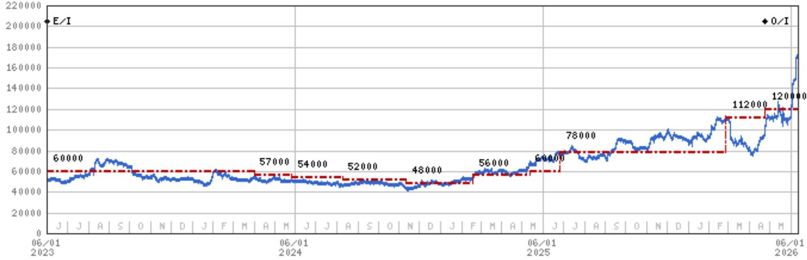

line chart

| Date       | Value   |
| ---------- | ------- |
| 06/01 2023 | 60000   |
| 06/01 2024 | 57000   |
| 06/01 2025 | 56000   |
| 06/01 2026 | 120000  |

Stock Rating History: 6/1/21 : E/I; 4/8/22 : 0/I; 2/15/23 : E/I; 4/24/26 : 0/I  
Price Target History: 5/7/21 : 92000; 10/6/21 : 85000; 4/8/22 : 92000; 5/10/22 : 96000; 8/11/22 : 86000; 11/8/22 : 78000;  
2/15/23 : 60000; 4/1/24 : 57000; 5/27/24 : 54000; 8/9/24 : 52000; 11/11/24 : 48000; 2/18/25 : 56000; 5/12/25 : 60000;  
6/26/25 : 78000; 2/25/26 : 112000; 4/24/26 : 120000  
Source: MS Date Format : MM/DD/YY Price Target = No Price Target Assigned (NA)  
Stock Price (Not Covered by Current Analyst) — Stock Price (Covered by Current Analyst)  
Stock and Industry Ratings (abbreviations below) appear as ♦ Stock Rating/Industry View  
Stock Ratings: Overweight (O) Equal-weight (E) Underweight (U) Not-Rated (NR) No Rating Available (NA)  
Industry View: Attractive (A) In-line (I) Cautious (C) No Rating (NR)  
Effective January 13, 2014, the stocks covered by MS Asia Pacific will be rated relative to the analyst's industry (or industry team's) coverage.  
Effective January 13, 2014, the industry view benchmarks for MS Asia Pacific are as follows: relevant MSCI country index or MSCI sub-regional index or MSCI AC Asia Pacific ex Japan Index.

Hyundai Motor (005380.KS) - As of 06/11/26 GMT in KRW Industry : S. Korea Autos & Shared Mobility  
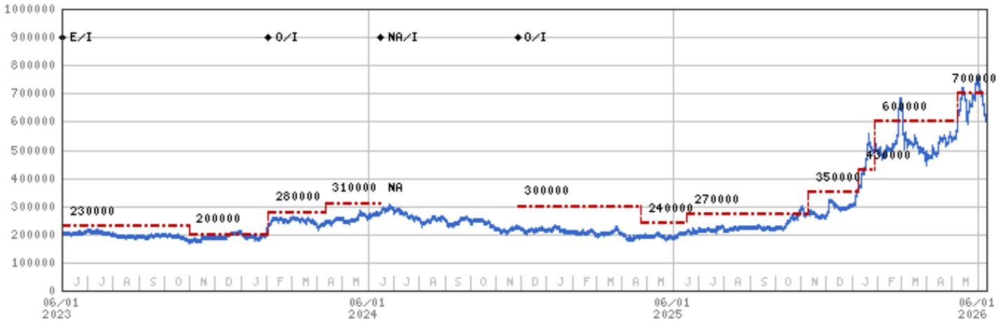

line chart

| Date       | Value   |
| ---------- | ------- |
| 06/01 2023 | 230000  |
|            | 200000  |
|            | 280000  |
|            | 310000  |
|            | NA      |
|            | 300000  |
|            | 240000  |
|            | 270000  |
|            | 350000  |
|            | 430000  |
|            | 600000  |
|            | 700000  |

Stock Rating History: 6/1/21 : E/I; 2/2/24 : 0/I; 6/16/24 : NA/I; 11/27/24 : 0/I  
Price Target History: 4/13/21 : 250000; 7/7/21 : 260000; 9/7/21 : 240000; 1/25/22 : 220000; 3/17/22 : 190000; 4/11/22 : 200000;  
4/26/22 : 210000; 7/8/22 : 200000; 7/22/22 : 210000; 9/15/22 : 220000; 10/24/22 : 180000; 1/10/23 : 170000; 1/26/23 : 180000;  
4/12/23 : 220000; 4/26/23 : 230000; 10/31/23 : 200000; 2/2/24 : 280000; 4/11/24 : 310000; 6/16/24 : NA; 11/27/24 : 300000;  
4/24/25 : 240000; 6/18/25 : 270000; 11/10/25 : 350000; 1/9/26 : 430000; 1/29/26 : 600000; 5/8/26 : 700000  
Source: MS Date Format : MM/DD/YY Price Target = No Price Target Assigned (NA)  
Stock Price (Not Covered by Current Analyst) — Stock Price (Covered by Current Analyst)  
Stock and Industry Ratings (abbreviations below) appear as ♦ Stock Rating/Industry View  
Stock Ratings: Overweight (O) Equal-weight (E) Underweight (U) Not-Rated (NR) No Rating Available (NA)  
Industry View: Attractive (A) In-line (I) Cautious (C) No Rating (NR)  
Effective January 13, 2014, the stocks covered by MS Asia Pacific will be rated relative to the analyst's industry (or industry team's) coverage.  
Effective January 13, 2014, the industry view benchmarks for MS Asia Pacific are as follows: relevant MSCI country index or MSCI sub-regional index or MSCI AC Asia Pacific ex Japan Index.

Industrial Bank of Korea (024110.KS) - As of 06/11/26 GMT in KRW Industry : S. Korea Financials  
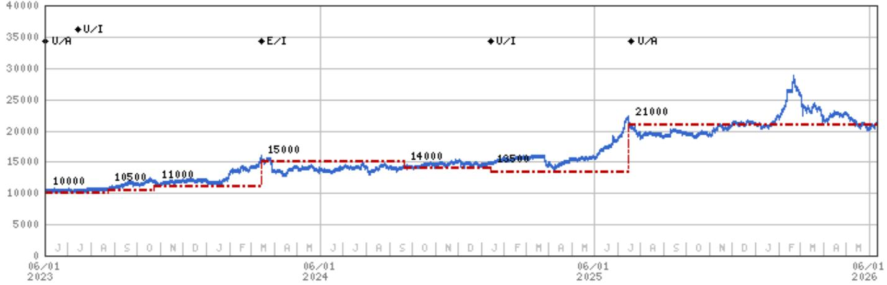

line chart

| Date       | Value  |
| ---------- | ------ |
| 06/01 2023 | 10000  |
| 06/01 2024 | 15000  |
| 06/01 2025 | 13500  |
| 06/01 2026 | 21000  |

Stock Rating History: 6/1/21 : U/A; 7/27/21 : E/A; 11/5/21 : O/A; 3/29/22 : E/A; 7/4/22 : U/A; 7/14/23 : U/I; 3/14/24 : E/I; 1/13/25 : U/I; 7/19/25 : U/A  
Price Target History: 5/26/21 : 11000; 7/27/21 : 12000; 11/5/21 : 14000; 2/28/22 : 14500; 3/29/22 : 12000; 7/4/22 : 10000; 8/23/23 : 10500; 10/24/23 : 11000; 3/14/24 : 15000; 9/20/24 : 14000; 1/13/25 : 13500; 7/16/25 : 21000  
Source: MS Date Format : MM/DD/YY Price Target = No Price Target Assigned (NA)  
Stock Price (Not Covered by Current Analyst) — Stock Price (Covered by Current Analyst)  
Stock and Industry Ratings (abbreviations below) appear as ♦ Stock Rating/Industry View  
Stock Ratings: Overweight (O) Equal-weight (E) Underweight (U) Not-Rated (NR) No Rating Available (NA)  
Industry View: Attractive (A) In-line (I) Cautious (C) No Rating (NR)  
Effective January 13, 2014, the stocks covered by MS Asia Pacific will be rated relative to the analyst's industry (or industry team's) coverage.  
Effective January 13, 2014, the industry view benchmarks for MS Asia Pacific are as follows: relevant MSCI country index or MSCI sub-regional index or MSCI AC Asia Pacific ex Japan Index.

Kakao Bank Corp (323410.KS) - As of 06/11/26 GMT in KRW Industry : S. Korea Financials  
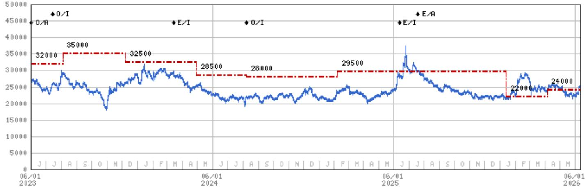

line chart

| Date       | Value   |
| ---------- | ------- |
| 06/01 2023 | 32000   |
|            | 35000   |
|            | 32500   |
|            | 28500   |
|            | 28000   |
|            | 29500   |
|            | 22000   |
|            | 24000   |

Stock Rating History: 10/12/21 : E/A; 5/16/23 : 0/A; 7/14/23 : 0/I; 3/14/24 : E/I; 8/8/24 : 0/I; 6/12/25 : E/I; 7/19/25 : E/A  
Price Target History: 10/12/21 : 65000; 2/28/22 : 55000; 7/4/22 : 36000; 11/2/22 : 22000; 5/16/23 : 32000; 8/4/23 : 35000;  
12/8/23 : 32500; 4/29/24 : 28500; 8/8/24 : 28000; 2/7/25 : 29500; 1/13/26 : 22000; 4/6/26 : 24000  
Source: MS Date Format : MM/DD/YY Price Target No Price Target Assigned (NA)  
Stock Price (Not Covered by Current Analyst) — Stock Price (Covered by Current Analyst)  
Stock and Industry Ratings (abbreviations below) appear as ♦ Stock Rating/Industry View  
Stock Ratings: Overweight (O) Equal-weight (E) Underweight (U) Not-Rated (NR) No Rating Available (NA)  
Industry View: Attractive (A) In-line (I) Cautious (C) No Rating (NR)  
Effective January 13, 2014, the stocks covered by MS Asia Pacific will be rated relative to the analyst's industry (or industry team's) coverage.  
Effective January 13, 2014, the industry view benchmarks for MS Asia Pacific are as follows: relevant MSCI country index or MSCI sub-regional index or MSCI AC Asia Pacific ex Japan Index.

KB Financial Group (105560.KS) - As of 06/11/26 GMT in KRW Industry : S. Korea Financials  
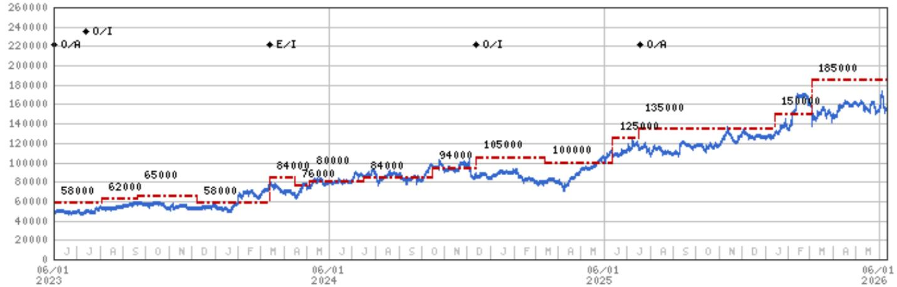

line chart

| Date       | Value   |
| ---------- | ------- |
| 06/01 2023 | 58000   |
| 06/01 2023 | 62000   |
| 06/01 2023 | 65000   |
| 06/01 2023 | 58000   |
| 06/01 2023 | 84000   |
| 06/01 2023 | 76000   |
| 06/01 2023 | 80000   |
| 06/01 2023 | 84000   |
| 06/01 2023 | 94000   |
| 06/01 2023 | 105000  |
| 06/01 2023 | 100000  |
| 06/01 2023 | 125000  |
| 06/01 2023 | 135000  |
| 06/01 2023 | 150000  |
| 06/01 2023 | 185000  |

Stock Rating History: 6/1/21 : 0/A; 7/14/23 : 0/I; 3/14/24 : E/I; 12/13/24 : 0/I; 7/19/25 : 0/A  
Price Target History: 5/26/21 : 72000; 2/22/22 : 75000; 7/4/22 : 62000; 5/16/23 : 58000; 8/4/23 : 62000; 9/20/23 : 65000;  
12/8/23 : 58000; 3/14/24 : 84000; 4/16/24 : 76000; 5/6/24 : 80000; 7/16/24 : 84000; 10/16/24 : 94000; 12/13/24 : 105000;  
3/14/25 : 100000; 6/12/25 : 125000; 7/16/25 : 135000; 1/13/26 : 150000; 3/3/26 : 185000  
Source: MS Date Format : MM/DD/YY Price Target = No Price Target Assigned (NA)  
Stock Price (Not Covered by Current Analyst) — Stock Price (Covered by Current Analyst)  
Stock and Industry Ratings (abbreviations below) appear as ♦ Stock Rating/Industry View  
Stock Ratings: Overweight (O) Equal-weight (E) Underweight (U) Not-Rated (NR) No Rating Available (NA)  
Industry View: Attractive (A) In-line (I) Cautious (C) No Rating (NR)  
Effective January 13, 2014, the stocks covered by MS Asia Pacific will be rated relative to the analyst's industry (or industry team's) coverage.  
Effective January 13, 2014, the industry view benchmarks for MS Asia Pacific are as follows: relevant MSCI country index or MSCI sub-regional index or MSCI AC Asia Pacific ex Japan Index.

L&C Bio Co Ltd (290650.KQ) - As of 06/11/26 GMT in KRW Industry : S. Korea Healthcare  
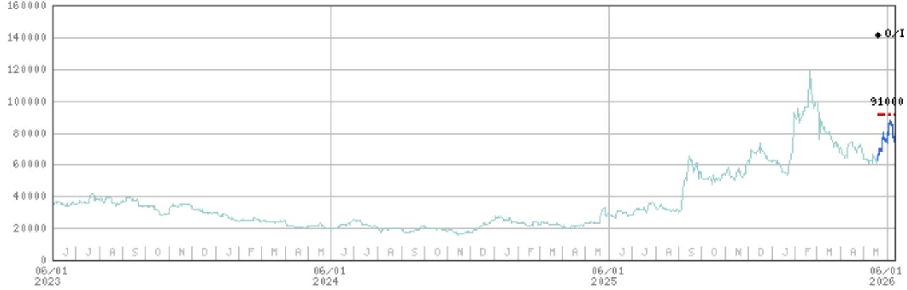

line chart

| Date       | Value  |
| ---------- | ------ |
| 06/01 2023 | 35000  |
| 06/01 2024 | 20000  |
| 06/01 2025 | 35000  |
| 06/01 2026 | 91000  |

Stock Rating History: 5/20/26 : 0/I  
Price Target History: 5/20/26 : 91000  
Source: MS Date Format : MM/DD/YY Price Target No Price Target Assigned (NA)  
Stock Price (Not Covered by Current Analyst) — Stock Price (Covered by Current Analyst)  
Stock and Industry Ratings (abbreviations below) appear as ♦ Stock Rating/Industry View  
Stock Ratings: Overweight (O) Equal-weight (E) Underweight (U) Not-Rated (NR) No Rating Available (NA)  
Industry View: Attractive (A) In-line (I) Cautious (C) No Rating (NR)  
Effective January 13, 2014, the stocks covered by MS Asia Pacific will be rated relative to the analyst's industry (or industry team's) coverage.  
Effective January 13, 2014, the industry view benchmarks for MS Asia Pacific are as follows: relevant MSCI country index or MSCI sub-regional index or MSCI AC Asia Pacific ex Japan Index.

Lotte Shopping (023530.KS) - As of 06/11/26 GMT in KRW
Industry : S. Korea Consumer  
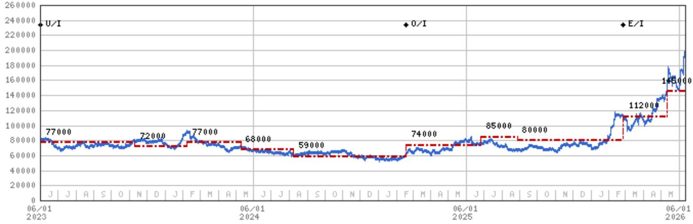

line chart

| Date       | Value   |
| ---------- | ------- |
| 06/01 2023 | 77000   |
| 06/01 2024 | 72000   |
| 06/01 2024 | 77000   |
| 06/01 2024 | 68000   |
| 06/01 2024 | 59000   |
| 06/01 2024 | 74000   |
| 06/01 2024 | 85000   |
| 06/01 2024 | 80000   |
| 06/01 2024 | 112000  |
| 06/01 2024 | 145000  |

Stock Rating History: 6/1/21 : U/I; 2/18/25 : 0/I; 2/25/26 : E/I  
Price Target History: 5/11/21 : 90000; 10/6/21 : 84000; 2/8/22 : 80000; 2/15/23 : 77000; 11/10/23 : 72000; 2/8/24 : 77000;  
5/10/24 : 68000; 8/8/24 : 59000; 2/18/25 : 74000; 6/26/25 : 85000; 8/27/25 : 80000; 2/25/26 : 112000; 5/11/26 : 145000  
Source: MS Date Format : MM/DD/YY Price Target No Price Target Assigned (NA)  
Stock Price (Not Covered by Current Analyst) — Stock Price (Covered by Current Analyst)  
Stock and Industry Ratings (abbreviations below) appear as ♦ Stock Rating/Industry View  
Stock Ratings: Overweight (O) Equal-weight (E) Underweight (U) Not-Rated (NR) No Rating Available (NA)  
Industry View: Attractive (A) In-line (I) Cautious (C) No Rating (NR)  
Effective January 13, 2014, the stocks covered by MS Asia Pacific will be rated relative to the analyst's industry (or industry team's) coverage.  
Effective January 13, 2014, the industry view benchmarks for MS Asia Pacific are as follows: relevant MSCI country index or MSCI sub-regional index or MSCI AC Asia Pacific ex Japan Index.

PharmaResearch Co Ltd (214450.KQ) - As of 06/11/26 GMT in KRW Industry : S. Korea Healthcare  
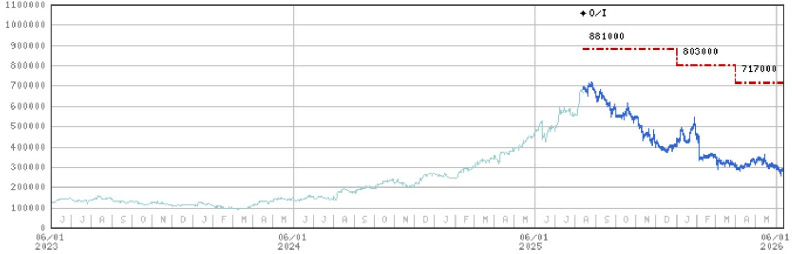

line chart

| Date       | Value   |
| ---------- | ------- |
| 06/01 2023 | 100000  |
| 06/01 2024 | 150000  |
| 06/01 2025 | 700000  |
| 06/01 2026 | 717000  |

Stock Rating History: 8/14/25 : 0/I  
Price Target History: 8/14/25 : 881000; 1/2/26 : 803000; 4/1/26 : 717000  
Source: MS Date Format: MM/DD/YY Price Target No Price Target Assigned (NA)  
Stock Price (Not Covered by Current Analyst) — Stock Price (Covered by Current Analyst)  
Stock and Industry Ratings (abbreviations below) appear as ♦ Stock Rating/Industry View  
Stock Ratings: Overweight (O) Equal-weight (E) Underweight (U) Not-Rated (NR) No Rating Available (NA)  
Industry View: Attractive (A) In-line (I) Cautious (C) No Rating (NR)  
Effective January 13, 2014, the stocks covered by MS Asia Pacific will be rated relative to the analyst's industry (or industry team's) coverage.  
Effective January 13, 2014, the industry view benchmarks for MS Asia Pacific are as follows: relevant MSCI country index or MSCI sub-regional index or MSCI AC Asia Pacific ex Japan Index.

Samsung Biologics Co Ltd (207940.KS) - As of 06/11/26 GMT in KRW Industry : S. Korea Healthcare  
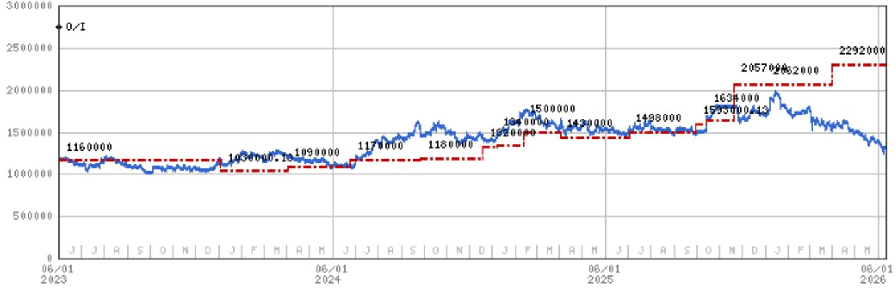

line chart

| Date       | Value     |
| ---------- | --------- |
| 06/01 2023 | 1160000   |
| 06/01 2024 | 1030000.13 |
| 06/01 2024 | 1090000   |
| 06/01 2024 | 1170000   |
| 06/01 2024 | 1180000   |
| 06/01 2024 | 1320000   |
| 06/01 2024 | 1500000   |
| 06/01 2024 | 1430000   |
| 06/01 2024 | 1498000   |
| 06/01 2024 | 1593000.13 |
| 06/01 2024 | 205700    |
| 06/01 2024 | 216200    |
| 06/01 2024 | 229200    |

Stock Rating History: 10/27/21 : 0/I  
Price Target History: 10/27/21 : 1160000; 1/20/22 : 1150000; 4/27/22 : 1110000; 6/23/22 : 1070000; 10/7/22 : 1100000;  
10/27/22 : 1130000; 4/13/23 : 1160000; 1/3/24 : 1030000.13; 4/2/24 : 1090000; 6/25/24 : 1170000; 9/27/24 : 1180000;  
12/19/24 : 1320000; 1/7/25 : 1340000; 2/11/25 : 1500000; 4/2/25 : 1430000; 7/3/25 : 1498000; 9/30/25 : 1593000.13;  
10/14/25 : 1634000; 11/21/25 : 2057000; 1/2/26 : 2062000; 4/1/26 : 2292000  
Source: MS Date Format : MM/DD/YY Price Target = No Price Target Assigned (NA)  
Stock Price (Not Covered by Current Analyst) — Stock Price (Covered by Current Analyst)  
Stock and Industry Ratings (abbreviations below) appear as ♦ Stock Rating/Industry View  
Stock Ratings: Overweight (O) Equal-weight (E) Underweight (U) Not-Rated (NR) No Rating Available (NA)  
Industry View: Attractive (A) In-line (I) Cautious (C) No Rating (NR)  
Effective January 13, 2014, the stocks covered by MS Asia Pacific will be rated relative to the analyst's industry (or industry team's) coverage.  
Effective January 13, 2014, the industry view benchmarks for MS Asia Pacific are as follows: relevant MSCI country index or MSCI sub-regional index or MSCI AC Asia Pacific ex Japan Index.

Samsung Card (029780.KS) - As of 06/11/26 GMT in KRW Industry : S. Korea Financials  
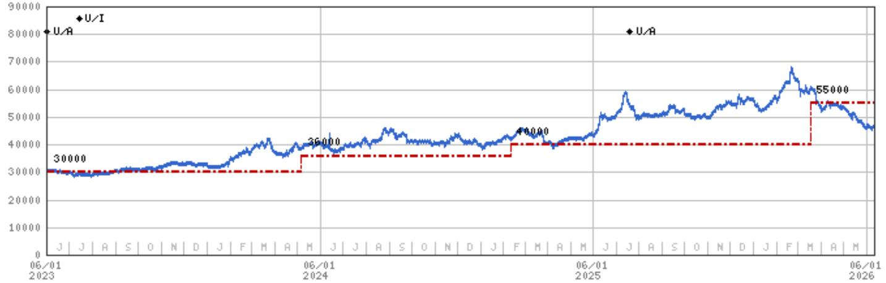

line chart

| Date       | Value   |
| ---------- | ------- |
| 06/01 2023 | 30000   |
| 06/01 2024 | 36000   |
| 06/01 2025 | 40000   |
| 06/01 2026 | 55000   |

Stock Rating History: 6/1/21 : 0/A; 11/5/21 : U/A; 7/14/23 : U/I; 7/19/25 : U/A  
Price Target History: 4/27/21 : 42000; 11/5/21 : 34000; 6/28/22 : 32000; 5/25/23 : 30000; 5/6/24 : 36000; 2/10/25 : 40000; 3/18/26 : 55000  
Source: MS Date Format : MM/DD/YY Price Target = No Price Target Assigned (NA)  
Stock Price (Not Covered by Current Analyst) — Stock Price (Covered by Current Analyst)  
Stock and Industry Ratings (abbreviations below) appear as ♦ Stock Rating/Industry View  
Stock Ratings: Overweight (O) Equal-weight (E) Underweight (U) Not-Rated (NR) No Rating Available (NA)  
Industry View: Attractive (A) In-line (I) Cautious (C) No Rating (NR)  
Effective January 13, 2014, the stocks covered by MS Asia Pacific will be rated relative to the analyst's industry (or industry team's) coverage.  
Effective January 13, 2014, the industry view benchmarks for MS Asia Pacific are as follows: relevant MSCI country index or MSCI sub-regional index or MSCI AC Asia Pacific ex Japan Index.

Samsung Electronics (005930.KS) - As of 06/11/26 GMT in KRW Industry : S. Korea Technology  
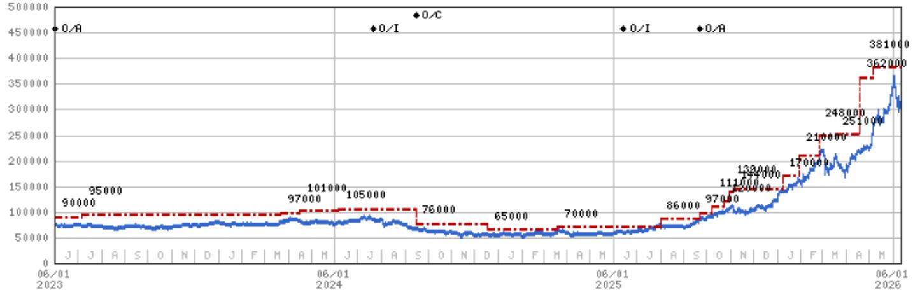

line chart

| Date       | Value   |
| ---------- | ------- |
| 06/01 2023 | 90000   |
| 06/01 2023 | 95000   |
| 06/01 2023 | 101000  |
| 06/01 2023 | 105000  |
| 06/01 2023 | 76000   |
| 06/01 2023 | 65000   |
| 06/01 2023 | 70000   |
| 06/01 2023 | 86000   |
| 06/01 2023 | 97000   |
| 06/01 2023 | 111000  |
| 06/01 2023 | 138000  |
| 06/01 2023 | 144000  |
| 06/01 2023 | 170000  |
| 06/01 2023 | 217000  |
| 06/01 2023 | 248000  |
| 06/01 2023 | 251000  |
| 06/01 2023 | 381000  |
| 06/01 2023 | 362000  |

Stock Rating History: 6/1/21 : 0/A; 7/19/21 : 0/I; 8/12/21 : 0/C; 10/4/22 : 0/A; 7/21/24 : 0/I; 9/15/24 : 0/C; 6/13/25 : 0/I; 9/21/25 : 0/A  
Price Target History: 5/18/21 : 93000; 6/8/21 : 98000; 8/12/21 : 89000; 9/15/21 : 95000; 12/3/21 : 97000; 3/18/22 : 95000;  
4/28/22 : 85000; 6/10/22 : 80000; 7/5/22 : 75000; 7/22/22 : 70000; 9/17/22 : 68000; 3/21/23 : 70000; 5/30/23 : 90000; 7/7/23 : 95000;  
3/22/24 : 97000; 4/16/24 : 101000; 6/6/24 : 105000; 9/15/24 : 76000; 12/18/24 : 65000; 3/19/25 : 70000; 8/1/25 : 86000;  
9/21/25 : 97000; 10/8/25 : 111000; 10/23/25 : 120000; 10/30/25 : 139000; 11/5/25 : 144000; 1/8/26 : 170000; 1/30/26 : 210000;  
2/24/26 : 248000; 3/18/26 : 251000; 4/19/26 : 362000; 5/6/26 : 381000  
Source: MS Date Format : MM/DD/YY Price Target = No Price Target Assigned (NA)  
Stock Price (Not Covered by Current Analyst) — Stock Price (Covered by Current Analyst)  
Stock and Industry Ratings (abbreviations below) appear as ♦ Stock Rating/Industry View  
Stock Ratings: Overweight (O) Equal-weight (E) Underweight (U) Not-Rated (NR) No Rating Available (NA)  
Industry View: Attractive (A) In-line (I) Cautious (C) No Rating (NR)  
Effective January 13, 2014, the stocks covered by MS Asia Pacific will be rated relative to the analyst's industry (or industry team's) coverage.  
Effective January 13, 2014, the industry view benchmarks for MS Asia Pacific are as follows: relevant MSCI country index or MSCI sub-regional index or MSCI AC Asia Pacific ex Japan Index.

Samsung Fire & Marine (000810.KS) - As of 06/11/26 GMT in KRW Industry : S. Korea Financials  
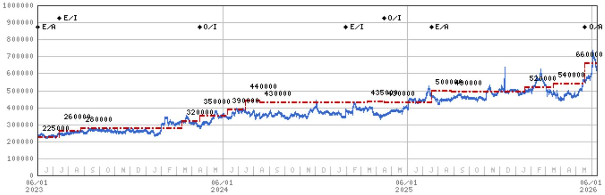

line chart

| Date       | Value   |
| ---------- | ------- |
| 06/01 2023 | 225000  |
|            | 260000  |
|            | 280000  |
|            | 320000  |
|            | 350000  |
|            | 390000  |
|            | 440000  |
|            | 430000  |
|            | 435000  |
|            | 50000   |
|            | 52000   |
|            | 54000   |
|            | 66000   |

Stock Rating History: 6/1/21 : E/A; 1/4/22 : NA/A; 10/28/22 : 0/A; 3/22/23 : E/A; 7/14/23 : E/I; 4/16/24 : 0/I; 1/31/25 : E/I; 4/16/25 : 0/I; 7/19/25 : E/A; 5/19/26 : 0/A  
Price Target History: 5/12/21 : 210000; 8/12/21 : 230000; 1/4/22 : NA; 10/28/22 : 230000; 12/1/22 : 240000; 3/22/23 : 225000;  
7/14/23 : 260000; 8/25/23 : 280000; 3/13/24 : 320000; 4/16/24 : 350000; 6/11/24 : 390000; 7/16/24 : 440000; 8/14/24 : 430000;  
3/13/25 : 435000; 4/16/25 : 430000; 7/19/25 : 500000; 8/27/25 : 490000; 1/20/26 : 520000; 3/18/26 : 540000; 5/19/26 : 660000  
Source: MS Date Format : MM/DD/YY Price Target = No Price Target Assigned (NA)  
Stock Price (Not Covered by Current Analyst) — Stock Price (Covered by Current Analyst)  
Stock and Industry Ratings (abbreviations below) appear as ♦ Stock Rating/Industry View  
Stock Ratings: Overweight (O) Equal-weight (E) Underweight (U) Not-Rated (NR) No Rating Available (NA)  
Industry View: Attractive (A) In-line (I) Cautious (C) No Rating (NR)  
Effective January 13, 2014, the stocks covered by MS Asia Pacific will be rated relative to the analyst's industry (or industry team's) coverage.  
Effective January 13, 2014, the industry view benchmarks for MS Asia Pacific are as follows: relevant MSCI country index or MSCI sub-regional index or MSCI AC Asia Pacific ex Japan Index.

Shinhan Financial Group (055550.KS) - As of 06/11/26 GMT in KRW Industry : S. Korea Financials  
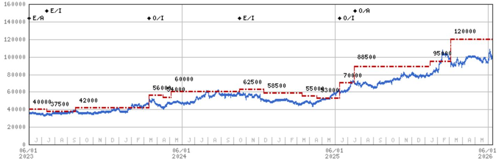

line chart

| Date       | Value   |
| ---------- | ------- |
| 06/01 2023 | 40000   |
| 06/01 2023 | 37500   |
| 06/01 2023 | 42000   |
| 06/01 2024 | 56000   |
| 06/01 2024 | 64000   |
| 06/01 2024 | 60000   |
| 06/01 2024 | 62500   |
| 06/01 2024 | 58500   |
| 06/01 2024 | 55000   |
| 06/01 2024 | 53000   |
| 06/01 2025 | 70000   |
| 06/01 2025 | 88500   |
| 06/01 2025 | 95000   |
| 06/01 2025 | 120000  |

Stock Rating History: 6/1/21 : 0/A; 5/16/23 : E/A; 7/14/23 : E/I; 3/14/24 : 0/I; 10/16/24 : E/I; 6/12/25 : 0/I; 7/19/25 : 0/A  
Price Target History: 5/26/21 : 54000; 11/5/21 : 46000; 2/28/22 : 52000; 7/4/22 : 50000; 3/8/23 : 42500; 5/16/23 : 40000;  
7/14/23 : 37500; 9/20/23 : 42000; 3/14/24 : 56000; 4/16/24 : 54000; 5/6/24 : 60000; 10/16/24 : 62500; 12/13/24 : 58500;  
3/14/25 : 55000; 4/18/25 : 53000; 6/12/25 : 70000; 7/16/25 : 88500; 1/13/26 : 95000; 3/3/26 : 120000  
Source: MS Date Format : MM/DD/YY Price Target = No Price Target Assigned (NA)  
Stock Price (Not Covered by Current Analyst) — Stock Price (Covered by Current Analyst)  
Stock and Industry Ratings (abbreviations below) appear as ♦ Stock Rating/Industry View  
Stock Ratings: Overweight (O) Equal-weight (E) Underweight (U) Not-Rated (NR) No Rating Available (NA)  
Industry View: Attractive (A) In-line (I) Cautious (C) No Rating (NR)  
Effective January 13, 2014, the stocks covered by MS Asia Pacific will be rated relative to the analyst's industry (or industry team's) coverage.  
Effective January 13, 2014, the industry view benchmarks for MS Asia Pacific are as follows: relevant MSCI country index or MSCI sub-regional index or MSCI AC Asia Pacific ex Japan Index.

Shinsegae (004170.KS) - As of 06/11/26 GMT in KRW Industry : S. Korea Consumer  
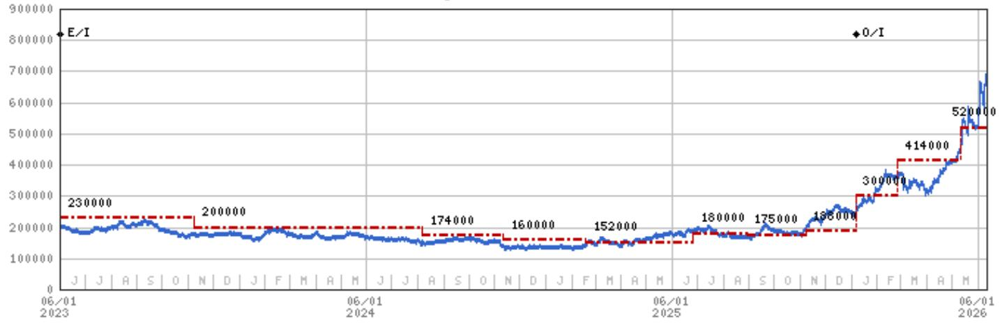

line chart

| Date       | Value   |
| ---------- | ------- |
| 06/01 2023 | 230000  |
| 06/01 2024 | 200000  |
| 06/01 2025 | 174000  |
| 06/01 2026 | 180000  |
| 06/01 2026 | 175000  |
| 06/01 2026 | 188000  |
| 06/01 2026 | 300000  |
| 06/01 2026 | 414000  |
| 06/01 2026 | 520000  |

Stock Rating History: 6/1/21 : 0/I; 2/15/23 : E/I; 1/6/26 : 0/I  
Price Target History: 5/12/21 : 380000; 6/4/21 : 400000; 8/10/22 : 370000; 11/7/22 : 320000; 2/15/23 : 230000; 11/6/23 : 200000; 8/7/24 : 174000; 11/11/24 : 160000; 2/18/25 : 152000; 6/26/25 : 180000; 8/29/25 : 175000; 11/7/25 : 188000; 1/6/26 : 300000; 2/25/26 : 414000; 5/12/26 : 520000  
Source: MS Date Format : MM/DD/YY Price Target = No Price Target Assigned (NA)  
Stock Price (Not Covered by Current Analyst) — Stock Price (Covered by Current Analyst)  
Stock and Industry Ratings (abbreviations below) appear as ♦ Stock Rating/Industry View  
Stock Ratings: Overweight (O) Equal-weight (E) Underweight (U) Not-Rated (NR) No Rating Available (NA)  
Industry View: Attractive (A) In-line (I) Cautious (C) No Rating (NR)  
Effective January 13, 2014, the stocks covered by MS Asia Pacific will be rated relative to the analyst's industry (or industry team's) coverage.  
Effective January 13, 2014, the industry view benchmarks for MS Asia Pacific are as follows: relevant MSCI country index or MSCI sub-regional index or MSCI AC Asia Pacific ex Japan Index.

SK hynix (000660.KS) - As of 06/11/26 GMT in KRW Industry : S. Korea Technology  
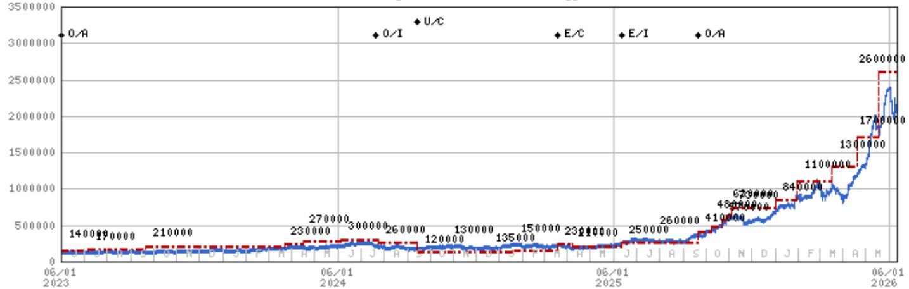

line chart

| Date       | Value     |
| ---------- | --------- |
| 06/01 2023 | 140000    |
| 06/01 2023 | 170000    |
| 06/01 2023 | 210000    |
| 06/01 2023 | 230000    |
| 06/01 2023 | 270000    |
| 06/01 2023 | 300000    |
| 06/01 2023 | 330000    |
| 06/01 2023 | 360000    |
| 06/01 2023 | 390000    |
| 06/01 2023 | 420000    |
| 06/01 2023 | 450000    |
| 06/01 2023 | 480000    |
| 06/01 2023 | 510000    |
| 06/01 2023 | 540000    |
| 06/01 2023 | 570000    |
| 06/01 2023 | 600000    |
| 06/01 2023 | 630000    |
| 06/01 2023 | 660000    |
| 06/01 2023 | 690000    |
| 06/01 2023 | 720000    |
| 06/01 2023 | 750000    |
| 06/01 2023 | 780000    |
| 06/01 2023 | 810000    |
| 06/01 2023 | 840000    |
| 06/01 2023 | 870000    |
| 06/01 2023 | 900000    |
| 06/01 2023 | 930000    |
| 06/01 2023 | 960000    |
| 06/01 2023 | 990000    |
| 17/11      | 1744444   |
| 17/11      | 1988888   |
| 17/11      | 2244888   |
| 17/11      | 2518888   |
| 17/11      | 2894888   |
| 17/11      | 3271888   |
| 17/11      | 3648888   |
| 17/11      | 4135888   |
| 17/11      | 4523888   |
| 17/11      | 4911888   |
| 17/11      | 5308888   |
| 17/11      | 5715888   |
| 17/11      | 6113888   |
| 17/11      | 6511888   |
| 17/11      | 7919888   |
| 17/11      | 9449888   |
| 17/11      | 11559888  |
| 17/11      | 14499888  |
| 17/11      | 17444448  |
| Jan        | -         |
| Feb        | -         |
| Mar        | -         |
| Apr        | -         |
| May        | -         |
| Jun        | -         |
| Jul        | -         |
| Aug        | -         |
| Sep        | -         |
| Oct        | -         |
| Nov        | -         |
| Dec        | -         |
| Jan        | -         |
| Feb        | -         |
| Mar        | -         |
| Apr        | -         |
| May        | -         |
| Jun        | -         |
| Jul        | -         |
| Aug        | -         |
| Sep        | -         |
| Oct        | -         |
| Nov        | -         |
| Dec        | -         |
| Jan        | -         |
| Feb        | -         |
|
| Mar        | -         |
| Apr        | -         |
| May        | -         |
| Jun        | -         |
| Jul        | -         |
| Aug        | -         |
| Sep        | -         |
| Oct        | -         |
| Nov        | -         |
| Dec        | -         |
| Jan        | -         |
| Feb        | -         |
| Mar        | -         |
| Apr        | -         |
| Jun        | -         |
| Jul        | -         |
| Aug        | -         |
| Sep        | -         |
| Oct        | -         |
| Nov        | -         |
| Dec        | -         |
| Jan        | -         |
| Feb        | -         |
| Mar        | -         |
| Apr        | -         |
| May        | -         |
| Jun        | -         |
| Jul        (end) | -       |
| Aug        (end) | -       |
| Sep        (end) | -       |
| Oct        (end) | -       |
| Nov        (end) | -       |
| Dec        (end) | -       |
| Jan        (end) | -       |
| Feb        (end) | -       |
| Mar        (end) | -       |
| Apr        (end) | -       |
| May        (end) | -       |
| Jun        (end) | -       |
| Jul        (end) | -       |
| Aug        (end) | -       |
| Sep        (end) | -       |
| Oct        (end) | -       |
| Nov        (end) | -       |
| Dec        (end) | -       |
| Jan        (end) | -       |
| Feb        (end) | -       |
| Mar        (end) | -       |
| Apr        (end) | -      |
| May        (end) | -      |
| Jun        (end) | -      |
| Jul        (end) | -      |
| Aug        (end) | -      |
| Sep        (end) | -      |
| Oct        (end) | -      |
| Nov        (end) | -      |
| Dec        (end) | -      |
| Jan        (end) | -      |
| Feb        (end) | -      |
| Mar        (end) | -      |
| Apr        (end) | -      |
| May        (end) | -      |
| Jun        (end) | -      |
| Jul        (end) | -      |
| Aug        (end) | -      |
| Sep        (end) | -      |
| Oct        (end) | -      |
| Nov        (end) | -      |
| Dec        (end) | -      |
| Jan        (end) | -     |
| Feb        (end) | -     |
| Mar        (end) | -     |
| Apr        (end) | -     |
| May        (end) | -     |
| Jun        (end) | -     |
| Jul        (end) | -     |
| Aug        (end) | -     |
| Sep        (end) | -     |
| Oct        (end) | -     |
| Nov        (end) | -     |
| Dec        (end) | -     |
| Jan        (end) | -     |
| Feb        (end) | -     |
| Mar        (end) | -     |
| Apr        (end) | -     |
| May        (end) | -     |
| Jun        (end) | -     |
| Jul        (end) | -     |
| Aug        (end) | -     |
| Sep        (end) | -     |
| Oct        (end) | -    |
| Nov        (end) | -     |
| Dec        (end) | -     |
| Jan        (end) | -     |
| Feb        (end) | -     |
| Mar        (end) | -     |
| Apr        (end) | -     |
| May        (end) | -     |
| Jun        (end) | -     |
| Jul        (end) | -     |
| Aug        (end) | -    |
| Sep        (end) | -     |
| Oct        (end) | -     |
| Nov        (end) | -     |
| Dec        (end) | -     |
| Jan        (end) | -     |
| Feb        (end) | -     |
| Mar        (end) | -     |
| Apr        (end) | -     |
| May        (end) | -     |
| Jun        (end) | -    |
|
| Jul        (end) | -     |
|
| Aug        (end) | -     |
|
| Sep        (end) | -     |
|
| Oct        (end) | -     |
|
| Nov        (end) | -     |
|
| Dec        (end) | -     |
|
Jan       (end)|

Stock Rating History: 6/1/21 : 0/A; 7/19/21 : 0/I; 8/12/21 : U/C; 12/3/21 : E/C; 2/11/22 : 0/C; 7/22/22 : E/C; 10/4/22 : 0/A; 7/21/24 : 0/I; 9/15/24 : U/C; 3/19/25 : E/C; 6/13/25 : E/I; 9/21/25 : 0/A  
Price Target History: 5/18/21 : 146000; 6/8/21 : 156000; 8/12/21 : 80000; 9/15/21 : 88000; 12/3/21 : 110000; 12/23/21 : 125000;  
1/24/22 : 130000; 1/28/22 : 136000; 2/11/22 : 155000; 3/18/22 : 150000; 4/27/22 : 130000; 6/10/22 : 120000; 7/5/22 : 110000;  
7/22/22 : 105000; 10/4/22 : 130000; 12/7/22 : 120000; 3/21/23 : 110000; 5/30/23 : 140000; 7/7/23 : 170000; 9/21/23 : 210000;  
3/22/24 : 230000; 4/16/24 : 270000; 6/6/24 : 300000; 7/25/24 : 260000; 9/15/24 : 120000; 10/24/24 : 130000; 12/18/24 : 135000;  
1/20/25 : 150000; 3/19/25 : 230000; 4/7/25 : 210000; 6/13/25 : 250000; 7/24/25 : 260000; 9/21/25 : 410000; 10/8/25 : 480000;  
10/23/25 : 570000; 10/29/25 : 630000; 11/5/25 : 730000; 1/2/26 : 840000; 1/30/26 : 1100000; 3/18/26 : 1300000; 4/19/26 : 1700000;  
5/18/26 : 2600000  
Source: MS Date Format : MM/DD/YY Price Target = No Price Target Assigned (NA)  
Stock Price (Not Covered by Current Analyst) — Stock Price (Covered by Current Analyst)  
Stock and Industry Ratings (abbreviations below) appear as ♦ Stock Rating/Industry View  
Stock Ratings: Overweight (O) Equal-weight (E) Underweight (U) Not-Rated (NR) No Rating Available (NA)  
Industry View: Attractive (A) In-line (I) Cautious (C) No Rating (NR)  
Effective January 13, 2014, the stocks covered by MS Asia Pacific will be rated relative to the analyst's industry (or industry team's) coverage.  
Effective January 13, 2014, the industry view benchmarks for MS Asia Pacific are as follows: relevant MSCI country index or MSCI sub-regional index or MSCI AC Asia Pacific ex Japan Index.

## Important Disclosures for MS Smith Barney LLC Customers

Important disclosures regarding any material conflict of interest that can reasonably be expected to have influenced MS Smith Barney LLC's choice of a third-party research provider or the subject company of a third-party research report, are available on the MS Wealth Management disclosure website at www.morganstanley.com/online/researchdisclosures. For MS specific disclosures, you may refer to https://www.morganstanley.com/eqr/disclosures/webapp/generalresearch.

Each MS report is reviewed and approved on behalf of MS Smith Barney LLC. This review and approval is conducted by the same person who reviews the research report on behalf of MS. This could create a conflict of interest.

## Other Important Disclosures

MS policy is to update research reports as and when the Research Analyst and Research Management deem appropriate, based on developments with the issuer, the sector, or the market that may have a material impact on the research views or opinions stated therein. In addition, certain Research publications are intended to be updated on a regular periodic basis (weekly/monthly/quarterly/annual) and will ordinarily be updated with that frequency, unless the Research Analyst and Research Management determine that a different publication schedule is appropriate based on current conditions.

MS is not acting as a municipal advisor and the opinions or views contained herein are not intended to be, and do not constitute, advice within the meaning of Section 975 of the Dodd-Frank Wall Street Reform and Consumer Protection Act.

MS produces an equity research product called a "Tactical Idea." Views contained in a "Tactical Idea" on a particular stock may be contrary to the recommendations or views expressed in research on the same stock. This may be the result of differing time horizons, methodologies, market events, or other factors. For all research available on a particular stock, please contact your sales representative or go to Matrix at http://www.morganstanley.com/matrix.

MS is provided to our clients through our proprietary research portal on Matrix and also distributed electronically by MS to clients. Certain, but not all, MS products are also made available to clients through third-party vendors or redistributed to clients through alternate electronic means as a convenience. For access to all available MS, please contact your sales representative or go to Matrix at http://www.morganstanley.com/matrix.

Any access and/or use of MS is subject to MS's Terms of Use (http://www.morganstanley.com/terms.html). By accessing and/or using MS, you are indicating that you have read and agree to be bound by our Terms of Use (http://www.morganstanley.com/terms.html). In addition you consent to MS processing your personal data and using cookies in accordance with our Privacy Policy and our Global Cookies Policy (http://www.morganstanley.com/privacy\_pledge.html), including for the purposes of setting your preferences and to collect readership data so that we can deliver better and more personalized service and products to you. To find out more information about how MS processes personal data, how we use cookies and how to reject cookies see our Privacy Policy and our Global Cookies Policy (http://www.morganstanley.com/privacy\_pledge.html). Please use the provided link to review the Terms and Conditions and Most Important Terms and Conditions for MS India Company Private Limited (https://www.morganstanley.com/assets/ pdfs/about-us-global-offices/india/Terms\_and\_conditions.pdf) and the following link to review the audit report (https://ny.matrix.ms.com/eqr/research/webapp/researchdocs/MSICPL\_Morgan\_Stanley\_Research\_Audit\_Report.pdf).

If you do not agree to our Terms of Use and/or if you do not wish to provide your consent to MS processing your personal data or using cookies please do not access our research. MS does not provide individually tailored investment advice. MS has been prepared without regard to the circumstances and objectives of those who receive it. MS recommends that investors independently evaluate particular investments and strategies, and encourages investors to seek the advice of a financial adviser. The appropriateness of an investment or strategy will depend on an investor's circumstances and objectives. The securities, instruments, or strategies discussed in MS may not be suitable for all investors, and certain investors may not be eligible to purchase or participate in some or all of them. MS is not an offer to buy or sell or the solicitation of an offer to buy or sell any security/instrument or to participate in any particular trading strategy. The value of and income from your investments may vary because of changes in interest rates, foreign exchange rates, default rates, prepayment rates, securities/instruments prices, market indexes, operational or financial conditions of companies or other factors. There may be time limitations on the exercise of options or other rights in securities/instruments transactions. Past performance is not necessarily a guide to future performance. Estimates of future performance are based on assumptions that may not be realized. If provided, and unless otherwise stated, the closing price on the cover page is that of the primary exchange for the subject company's securities/instruments.

The fixed income research analysts, strategists or economists principally responsible for the preparation of MS have received compensation based upon various factors, including quality, accuracy and value of research, firm profitability or revenues (which include fixed income trading and capital markets profitability or revenues), client feedback and competitive factors. Fixed Income Research analysts', strategists' or economists' compensation is not linked to investment banking or capital markets transactions performed by MS or the profitability or revenues of particular trading desks.

The "Important Regulatory Disclosures on Subject Companies" section in MS lists all companies mentioned where MS owns 1% or more of a class of common equity securities of the companies. For all other companies mentioned in MS, MS may have an investment of less than 1% in securities/instruments or derivatives of securities/instruments of companies and may trade them in ways different from those discussed in MS. Employees of MS not involved in the preparation of MS may have investments in securities/instruments or derivatives of securities/instruments of companies mentioned and may trade them in ways different from those discussed in MS. Derivatives may be issued by MS or associated persons.

With the exception of information regarding MS, MS is based on public information. MS makes every effort to use reliable, comprehensive information, but we make no representation that it is accurate or complete. We have no obligation to tell you when opinions or information in MS change apart from when we intend to discontinue equity research coverage of a subject company. Facts and views presented in MS have not been reviewed by, and may not reflect information known to, professionals in other MS business areas, including investment banking personnel.

MS personnel may participate in company events such as site visits and are generally prohibited from accepting payment by the company of associated expenses unless pre-approved by authorized members of Research management.

MS may make investment decisions that are inconsistent with the recommendations or views in this report.

To our readers based in Taiwan or trading in Taiwan securities/instruments: Information on securities/instruments that trade in Taiwan is distributed by MS Taiwan Limited ("MSTL"). Such information is for your reference only. The reader should independently evaluate the investment risks and is solely responsible for their investment decisions. MS may not be distributed to the public media or quoted or used by the public media without the express written consent of MS. Any non-customer reader within the scope of Article 7-1 of the Taiwan Stock Exchange Recommendation Regulations accessing and/or receiving MS is not permitted to provide MS to any third party (including but not limited to related parties, affiliated companies and any other third parties) or engage in any activities regarding MS which may create or give the appearance of creating a conflict of interest. Information on securities/instruments that do not trade in Taiwan is for informational purposes only and is not to be construed as a recommendation or a solicitation to trade in such securities/instruments. MSTL may not execute transactions for clients in these securities/instruments.

Certain information in MS was sourced by employees of the Shanghai Representative Office of MS Asia Limited for the use of MS Asia Limited. MS is not incorporated under PRC law and the research in relation to this report is conducted outside the PRC. MS does not constitute an offer to sell or the solicitation of an offer to buy any securities in the PRC. PRC investors shall have the relevant qualifications to invest in such securities and shall be responsible for obtaining all relevant approvals, licenses, verifications and/or registrations from the relevant governmental authorities themselves. Neither this report nor any part of it is intended as, or shall constitute, provision of any consultancy or advisory service of securities investment as defined under PRC law. Such information is provided for your reference only.

MS is disseminated in Brazil by MS C.T.V.M. S.A. located at Av. Brigadeiro Faria Lima, 3600, 6th floor, São Paulo - SP, Brazil; and is regulated by the Comissão de Valores Mobiliários; in Mexico by MS México, Casa de Bolsa, S.A. de C.V which is regulated by Comision Nacional Bancaria y de Valores. Paseo de los Tamarindos 90, Torre 1, Col. Bosques de las Lomas Floor 29, 05120 Mexico City; in Japan by MS MUFG Securities Co., Ltd. and, for Commodities related research reports only, MS Capital Group Japan Co., Ltd; in Hong Kong by MS Asia Limited (which accepts responsibility for its contents) and by MS Bank Asia Limited; in Singapore by MS Asia (Singapore) Pte. (Registration number 199206298Z) and/or MS Asia (Singapore) Securities Pte Ltd (Registration number 200008434H), regulated by the Monetary Authority of Singapore (which accepts legal responsibility for its contents and should be contacted with respect to any matters arising from, or in connection with, MS) and by MS Bank Asia Limited, Singapore Branch (Registration number T14FC0118J); in Australia to "wholesale clients" within the meaning of the Australian Corporations Act by MS Australia Limited A.B.N. 67 003 734 576, holder of Australian financial services license No. 233742, which accepts responsibility for its contents; in Australia to "wholesale clients" and "retail clients" within the meaning of the Australian Corporations Act by MS Wealth Management Australia Pty Ltd (A.B.N. 19 009 145 555, holder of Australian financial services license No. 240813, which accepts responsibility for its contents; in Korea by MS & Co International plc, Seoul Branch; in India by MS India Company Private Limited having Corporate Identification No (CIN) U22990MH1998PTC115305, regulated by the Securities and Exchange Board of India ("SEBI") and holder of licenses as a Research Analyst (SEBI Registration No. INH000001105); Stock Broker (SEBI Stock Broker Registration No. INZ000244438), Merchant Banker (SEBI Registration No. INM000011203), and depository participant with National Securities Depository Limited (SEBI Registration No. IN-DP-NSDL-567-2021) having registered office at Altimus, Level 39 & 40, Pandurang Budhkar Marg, Worli, Mumbai 400018, India; Telephone no. +91-22-61181000; Compliance Officer Details: Mr. Tejarshi Hardas, Tel. No.: +91-22-61181000 or Email: tejarshi.hardas@morganstanley.com; Grievance officer details: Mr. Tejarshi Hardas, Tel. No.: +91-22-61181000 or Email: msic-compliance@morganstanley.com. MS India Company Private Limited (MSICPL) may use AI tools in providing research services. All recommendations contained herein are made by the duly qualified research analysts; in Canada by MS Canada Limited; in Germany and the European Economic Area where required by MS Europe S.E., authorised and regulated by Bundesanstalt fuer Finanzdienstleistungsaufsicht (BaFin) under the reference number 149169; in the US by MS & Co. LLC, which accepts responsibility for its contents. MS & Co. International plc, authorized by the Prudential Regulation Authority and regulated by the Financial Conduct Authority and the Prudential Regulation Authority, disseminates in the UK research that it has prepared, and research which has been prepared by any of its affiliates, only to persons who (i) are investment professionals falling within Article 19(5) of the Financial Services and Markets Act 2000 (Financial Promotion) Order 2005 (as amended, the "Order"); (ii) are persons who are high net worth entities falling within Article 49(2)(a) to (d) of the Order; or (iii) are persons to whom an invitation or inducement to engage in investment activity (within the meaning of section

21 of the Financial Services and Markets Act 2000, as amended) may otherwise lawfully be communicated or caused to be communicated. RMB MS Proprietary Limited is a member of the JSE Limited and A2X (Pty) Ltd. RMB MS Proprietary Limited is a joint venture owned equally by MS International Holdings Inc. and RMB Investment Advisory (Proprietary) Limited, which is wholly owned by FirstRand Limited. The information in MS is being disseminated by MS Saudi Arabia, regulated by the Capital Market Authority in the Kingdom of Saudi Arabia, and is directed at Sophisticated investors only.

The information in MS is being communicated by MS & Co. International plc (DIFC Branch), regulated by the Dubai Financial Services Authority (the DFSA) or by MS & Co. International plc (ADGM Branch), regulated by the Financial Services Regulatory Authority Abu Dhabi (the FSRA), and is directed at Professional Clients only, as defined by the DFSA or the FSRA, respectively. The financial products or financial services to which this research relates will only be made available to a customer who we are satisfied meets the regulatory criteria of a Professional Client. A distribution of the different MS Research ratings or recommendations, in percentage terms for Investments in each sector covered, is available upon request from your sales representative.

The information in MS is being communicated by MS & Co. International plc (QFC Branch), regulated by the Qatar Financial Centre Regulatory Authority (the QFCRA), and is directed at business customers and market counterparties only and is not intended for Retail Customers as defined by the QFCRA.

As required by the Capital Markets Board of Turkey, investment information, comments and recommendations stated here, are not within the scope of investment advisory activity. Investment advisory service is provided exclusively to persons based on their risk and income preferences by the authorized firms. Comments and recommendations stated here are general in nature. These opinions may not fit to your financial status, risk and return preferences. For this reason, to make an investment decision by relying solely to this information stated here may not bring about outcomes that fit your expectations.

The following companies do business in countries which are generally subject to comprehensive sanctions programs administered or enforced by the U.S. Department of the Treasury's Office of Foreign Assets Control ("OFAC") and by other countries and multi-national bodies: Samsung Electronics.

The trademarks and service marks contained in MS are the property of their respective owners. Third-party data providers make no warranties or representations relating to the accuracy, completeness, or timeliness of the data they provide and shall not have liability for any damages relating to such data. The Global Industry Classification Standard (GICS) was developed by and is the exclusive property of MSCI and S&P.

MS, or any portion thereof may not be reprinted, sold or redistributed without the written consent of MS.

Indicators and trackers referenced in MS may not be used as, or treated as, a benchmark under Regulation EU 2016/1011, or any other similar framework.

The issuers and/or fixed income products recommended or discussed in certain fixed income research reports may not be continuously followed. Accordingly, investors should regard those fixed income research reports as providing stand-alone analysis and should not expect continuing analysis or additional reports relating to such issuers and/or individual fixed income products. MS may hold, from time to time, material financial and commercial interests regarding the company subject to the Research report.

Registration granted by SEBI and certification from the National Institute of Securities Markets (NISM) in no way guarantee performance of the intermediary or provide any assurance of returns to investors. Investment in securities market are subject to market risks. Read all the related documents carefully before investing.

The following authors are neither Equity Research Analysts/Strategists nor Fixed Income Research Analysts/Strategists and are not opining on or expressing recommendations on equity or fixed income securities: Shreya Singh; Kathleen Oh.

© 2026 MS