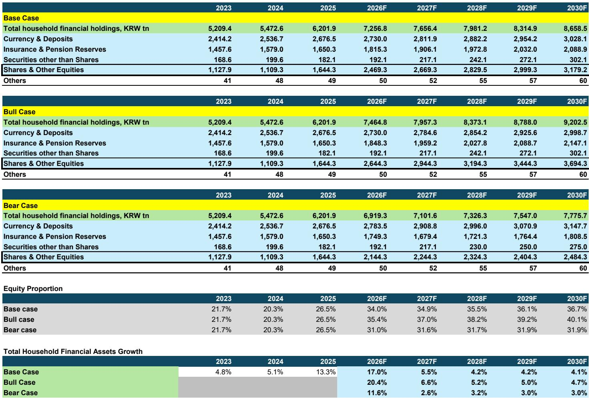
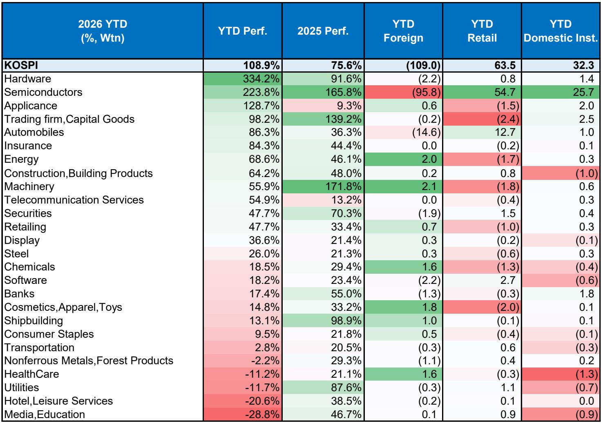
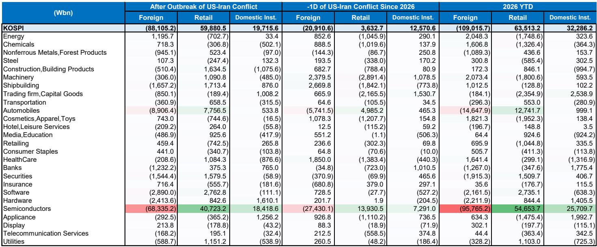

# 摩根斯坦利：韩国居民资产迁移到股票市场的趋势具有结构性，而非周期性

韩国正在经历一场深刻的居民资产负债表重构。过去二十五年间，韩国居民资产增长了91%，增速在主要经济体中位居前列。但真正值得关注的，不是总量增长，而是资产配置方向的根本性转变——从长达数十年的房地产与现金偏好，转向权益资产。摩根斯坦利在最新发布的研报中明确指出，这一转变具有可持续性，并将KOSPI的12个月目标从8500点上调至9000点，牛市情景上调至10500点。

这份报告的核心判断是：韩国居民资产向权益市场的迁移，不是一次短期的交易性行为，而是一个由政策、人口结构与市场改革共同驱动的结构性拐点。对于关注亚太资产配置的投资者而言，这可能是未来三到五年最重要的宏观叙事之一。

## 1. 居民资产配置的结构性拐点已经到来，但市场尚未充分定价其持续性

韩国居民长期以来将财富高度集中于房地产。截至2025年，主要住宅与其他房产合计占比超过70%，而股票、债券与基金的合计占比仅为3.6%。相比之下，近一半的金融资产仍以现金和存款形式持有。这种配置结构在过去二十年中几乎没有变化，直到2025年出现了显著拐点。

数据显示，2025年韩国居民权益资产持有量同比增长48%，而此前十年的平均增速仅为7.4%。这一跳跃并非偶然。报告指出，房地产政策的持续收紧——包括信贷限制与对多套房持有的税收惩罚——正在系统性地降低房地产作为财富储存工具的吸引力。与此同时，股票市场的改革措施、企业治理改善以及股东回报提升，正在为权益资产创造更具吸引力的制度环境。

这意味着，居民资金从房地产向权益市场的迁移，其驱动力不是短期的市场情绪，而是持续三到四年的政策方向。报告认为，这种“错失恐惧”已经从房地产转向股票，并且这种转变具有自我强化的特征：随着更多居民参与权益市场，财富效应的正向反馈将进一步巩固这一趋势。

## 2. 零售投资者的行为正在进化，这改变了市场的微观结构

市场对韩国零售投资者的传统印象是“追逐波动、短线交易、主题炒作”。摩根斯坦利在2020年的一份深度分析中确实得出了这一结论。但五年后的今天，报告认为情况已经发生了实质性变化。

变化来自三个层面。第一，信息的获取质量显著提高。第二，人工智能工具正在缩小信息不对称，为零售投资者提供了更平等的分析能力。第三，海外投资的实践经验积累，使得韩国零售投资者的交易行为更加成熟。

从数据上看，零售投资者在2020-2021年周期中的净买入高度集中，而当前周期的净买入分布更加分散。这意味着投资者不再盲目追逐单一主题，而是采取了更为战术性和控制性的投资策略。报告还注意到，零售投资者的数量已经增长到1450万人，占韩国成年人口的50%，而2019年这一比例仅为21%。

这些变化的意义在于：零售投资者不再只是市场的波动源，而是正在成为市场的稳定器。一个更加成熟、更具信息优势、更分散的零售投资者群体，将减少市场的极端波动，并为优质公司的估值提供更持续的支撑。

## 3. 财富效应的传导机制正在放大，但这也意味着更高的宏观风险

报告对财富效应的分析值得特别关注。历史数据显示，KOSPI每上涨1%，大约可以拉动商品消费增长0.03-0.035个百分点。但报告认为，当前的财富效应传导机制正在发生变化，其影响范围更广、强度更大。

原因有三。第一，参与者的基数已经大幅扩大——1450万零售投资者意味着财富效应对消费的渗透率远高于过往周期。第二，权益资产的持仓规模从2019年的17.6万亿韩元跃升至2025年的662万亿韩元，增长了13.8倍，这意味着股价变动对居民财富的影响力度显著提升。第三，新增投资者中，20-40岁年龄段的群体占零售投资者的43%，这一群体的边际消费倾向更高，财富效应对消费的传导效率因此更强。

但硬币的另一面是风险。报告明确指出，韩国居民正在进入一个风险资产敞口升高的时期，这带来了新的宏观脆弱性。到2027年，权益持仓可能超过GDP的80%。与此同时，韩国居民本就背负着较高的债务负担，这意味着缓冲空间有限。更值得警惕的是，报告预计韩国央行将在2026年7月启动加息周期，并持续到2027年。在金融条件收紧的背景下，如果市场出现有意义的波动，财富效应的反向传导——即消费放缓与债务压力加剧——可能同时发生。

## 4. 韩国与日本的对比揭示了一个关键变量：风险偏好的差异

报告将韩国与日本的居民资产迁移进行了对比，这一对比揭示了两个市场之间的本质差异。日本在经历了长期的通缩与低增长后，通过NISA等政策工具推动居民资产从现金和存款向权益转移，这一过程是渐进的，投资者行为相对保守。而韩国的转变则更加迅速和激进，投资者表现出更高的风险偏好。

这种差异体现在数据上：过去十年，韩国的金融资产增长了94%，而日本仅为30%。韩国的零售投资者不仅更早地拥抱了权益资产，而且在交易行为上更加主动。

这一对比对于理解两个市场的未来走势至关重要。日本的经验表明，政策驱动的资产配置转变可以持续多年，但速度较慢，对市场的冲击相对温和。韩国的路径则意味着，市场可能会经历更剧烈的资金流入，但也面临更大的波动风险。对于投资者而言，关键问题不是“韩国是否会复制日本”，而是“韩国的更快速度是否意味着更早面临调整压力”。

## 5. 报告尚未完全回答的关键问题：零售投资者行为的可持续性如何验证？

尽管报告对零售投资者的行为进化持积极态度，但一个关键问题仍然悬而未决：这种“更聪明”的投资行为是否能够在市场下跌周期中得到验证？目前的数据主要来自上涨周期，零售投资者的分散化买入和战术性操作在牛市中更容易保持理性。但一旦市场转向，2020-2021年周期中零售投资者表现出的“追逐波动”特征是否会重新出现？

报告提到了一个值得关注的信号：零售投资者的交易份额与市场波动率之间仍然存在正相关关系。这意味着，当市场波动加剧时，零售投资者的参与度仍然会上升。这种模式在2020年的疫情冲击中表现得尤为明显。问题在于，如果下一次波动是下行而非上行，零售投资者的行为模式是否会发生质变？

此外，报告提到了一个尚未充分展开的图表——零售投资者在海外市场的投资经验如何影响其本土行为。这是一个值得深挖的方向。如果韩国零售投资者通过海外投资积累了更丰富的风险管理经验，那么他们在本土市场的表现可能会更加稳健。但如果海外投资经验仅仅增加了杠杆操作的可能性，那么风险反而可能被放大。

## 6. 投资者需要建立一个新的观察框架：从“资金流向”到“行为质量”

基于报告的洞察，投资者可能需要调整自己的分析框架。传统的“资金流向”分析——即追踪零售投资者的净买入规模——虽然仍然重要，但已经不足以捕捉市场的结构性变化。更关键的是评估零售投资者的“行为质量”。

第一个观察维度是持仓集中度。如果零售投资者的持仓从少数热门主题向更广泛的行业分布，这通常意味着市场正在变得更加成熟。报告提到的零售投资者对医疗保健的兴趣上升，而该板块的基本面改善尚未被股价充分反映，就是一个值得关注的信号。

第二个观察维度是杠杆水平。报告明确指出了杠杆管理的重要性。如果零售投资者的融资买入比例保持温和，那么市场的回调风险也相对可控。反之，如果杠杆率快速上升，任何负面冲击都可能引发连锁反应。

第三个观察维度是财富效应的不对称性。报告暗示，当前财富效应对消费的拉动可能比历史数据显示的更强，但如果市场下跌，反向效应可能同样剧烈。投资者需要密切关注消费数据与股市表现之间的联动关系，尤其是在韩国央行开始加息之后。

报告为投资者提供了具体的配置方向：继续看好科技与工业板块中的赢家，同时关注医疗保健板块的补涨机会，以及百货商店作为财富效应受益者的投资价值。证券公司和银行也被视为这一趋势的直接受益者。

但真正重要的，不是具体的行业推荐，而是理解这一轮居民资产迁移的本质。它不是一次简单的资金轮动，而是韩国经济从“房地产依赖”向“资本市场驱动”转型的宏观叙事。这个叙事能否成立，取决于零售投资者的行为能否在下一轮市场波动中经受住考验。而这，正是报告留给读者继续思考的关键问题。

欢迎来星球微信群里继续讨论：韩国零售投资者的行为进化是否能够穿越周期？KOSPI 9000点的目标是否已经充分反映了加息风险？以及，如果韩国央行的加息节奏快于预期，哪些板块的脆弱性最高？

Personal reading notes and learning share only. Not investment advice.

