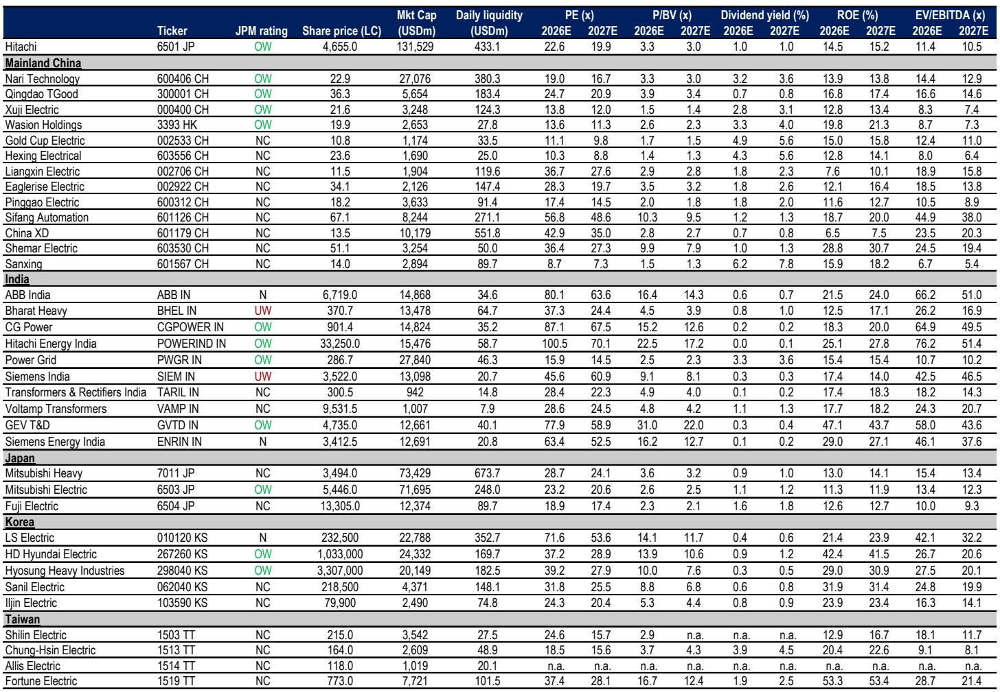
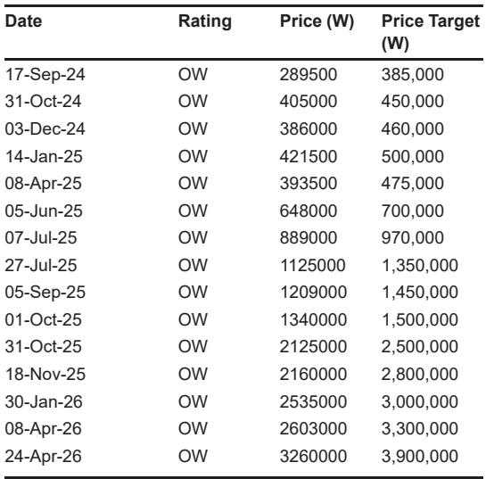
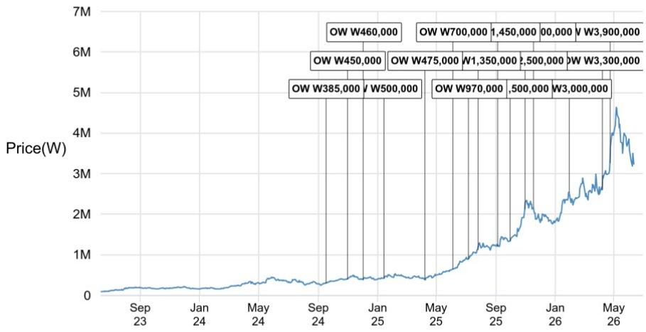

# The Power Equipment Sell-Off Is a Structural Opportunity, Not a Cyclical Trap

The 20-30% decline in Asian power equipment stocks from their April peaks has triggered a predictable response: investors are running for cover, questioning the durability of the entire electrification thesis. This is a mistake. The pullback is not a signal of fundamental deterioration but a correction driven by three transient factors—valuation compression after an overheated run, short-term data center noise, and geopolitical anxiety that is largely mispriced. For investors who can distinguish between cyclical noise and structural demand, the current entry point offers a rare opportunity to acquire quality names at valuations not seen since before the electrification super-cycle began.

The narrative that drove these stocks to record highs in the first quarter was never about data centers alone. It was about a once-in-a-generation rebuild of global power infrastructure: aging grids in developed markets, surging renewable integration, industrial reshoring, and yes, the incremental load from AI data centers. The data center piece, while visible and exciting, accounts for less than 10% of new orders for the heavy electrical equipment makers that dominate the Korean and Chinese power equipment universe. The sell-off has conflated a marginal catalyst with the core driver.

Now, after the correction, valuations have reset to levels that build in a meaningful margin of safety. Korean heavy electricals like Hyosung Heavy trade at roughly 20x 2028 estimated earnings, a discount to global peers despite superior exposure to U.S. utility capex. Chinese names like Wasion Holdings trade at approximately 10x forward earnings with over 20% annual earnings growth. These are not distressed assets; they are compounders being offered at cyclical prices. The question is not whether the electrification theme is intact. It is whether investors have the conviction to look past the noise.

## The Data Center Connection Fears Are Real but Overstated for Heavy Electrical Players

The most immediate trigger for the sell-off was growing concern that data center capacity growth could slow next year due to permitting delays, power constraints, and other bottlenecks. This is a legitimate risk for companies with significant exposure to behind-the-meter generation equipment—think smaller transformers, switchgear, and power conditioning units that sit inside or adjacent to data center facilities. But for the heavy electrical equipment makers that supply large power transformers, circuit breakers, and grid infrastructure, the data center story is a tailwind, not the main engine.

Consider the composition of new orders for Korean heavy electrical companies. For Hyosung Heavy, more than 90% of new orders come from utilities and grid customers in the United States. These are orders tied to transmission and distribution upgrades, renewable integration, and grid hardening—investments that are structurally driven by regulatory mandates, aging infrastructure, and long-term capacity planning. They are not dependent on whether a particular data center gets its permit approved this quarter or next. The same logic applies to Hyundai Electric, where utility and grid orders dominate the backlog.

The data center connection concern, therefore, creates a false symmetry. Investors are treating all power equipment companies as if they share the same revenue profile. They do not. The heavy electrical players are leveraged to a multi-year grid modernization cycle that is independent of data center construction timelines. If data center connections slow, the impact on their order books is marginal. If data center connections accelerate, it is incremental upside. This asymmetry is not priced into current valuations.

## The Valuation Reset Has Created a Divergence Between Price and Fundamentals That Will Not Persist

At their peaks in April, Korean power equipment names traded at roughly 35x one-year forward P/E, a premium that reflected euphoria more than fundamentals. The subsequent 25% correction in a single month, against a flat KOSPI, was partly a mean-reversion trade. But mean reversion can overshoot, and it has. Current valuations for several names now imply that earnings growth will decelerate sharply or that margins will compress. Neither outcome is supported by the underlying data.

Hyosung Heavy, for example, trades at approximately 20x 2028 estimated P/E, making it the cheapest among Korean electrical equipment companies on a forward basis. This valuation embeds a significant discount to global peers like Hitachi or Siemens Energy, despite Hyosung Heavy's advantaged exposure to U.S. utility capex. The discount is even more striking when compared to Indian power equipment names, which trade at 60-100x forward earnings despite facing similar demand dynamics. The Korean discount reflects country-specific factors—geopolitical risk, currency concerns, and local market structure—but the magnitude of the discount has become excessive relative to the underlying business quality.

For Chinese names, the valuation story is even more compelling. Wasion Holdings trades at roughly 10x one-year forward P/E with more than 20% annual earnings growth. This is a growth-at-a-reasonable-price profile that would attract attention in any sector, but in power equipment—where demand visibility extends multiple years—it is extraordinary. The sell-off in Chinese names has been exacerbated by fund rotation into AI-related stocks, a tactical shift that has created a valuation opportunity in a sector with superior structural tailwinds.

## The Geopolitical Risk to Chinese Power Equipment Is Overpriced by the Market

A significant overhang for Chinese power equipment stocks has been the fear that the European Union will impose trade tariffs on Chinese electrical equipment, following the playbook used for Chinese EVs and solar panels. This fear is understandable but analytically weak. The EU's measures on Chinese EVs were driven by a combination of market share dynamics and strategic concerns about domestic industrial capacity. Neither condition applies to power equipment.

Chinese players' market share in the EU power equipment market remains below 10%. This is not a level that threatens the market position of domestic players like Siemens Energy. Furthermore, Chinese exports to the EU are concentrated in primary electrical equipment—transformers, switchgear, and cables—rather than in software, systems integration, or high-value services. The competitive threat to European incumbents is minimal. The EU's own energy transition targets require massive grid investment, and domestic capacity is already constrained. European utilities will need Chinese equipment to meet their build-out timelines, tariff or no tariff.

The market is pricing in a tail risk that is unlikely to materialize. If anything, the geopolitical noise creates a buying opportunity for investors who can differentiate between headline risk and actual commercial exposure. Chinese power equipment companies with strong domestic and emerging market franchises are even less exposed to EU tariff risk. Their growth is driven by China's own grid modernization and by demand from Southeast Asia, the Middle East, and Africa—markets where Chinese equipment is competitively advantaged.

## The Report Leaves an Unanswered Question About the Timing of the Next Catalyst

The report is persuasive on the structural case for power equipment, but it leaves one critical question unresolved: what will be the catalyst that turns sentiment? The sell-off has been driven partly by a lack of high-frequency data between quarterly results. Investors who rely on order announcements and earnings beats to validate their thesis have been left without fresh information. The next quarterly results cycle is months away, and in the interim, the sector is vulnerable to macro noise and fund flows.

This creates a timing dilemma. The fundamental case is strong, but the path to re-rating is unclear. Will the next catalyst come from a surprise upward revision to U.S. utility capex plans? From a major grid contract award in Europe or Asia? From a data center announcement that reignites the AI infrastructure narrative? Or will the re-rating happen gradually, as earnings growth catches up with depressed valuations? The report does not specify a timeline, and that uncertainty is itself a source of risk for near-term-oriented investors.

For long-term investors, this question is secondary. The compounding opportunity is clear. But for those who need a near-term trigger to justify entry, the absence of a clear catalyst is a legitimate concern. It suggests that the sector may remain range-bound until the next earnings season, and that investors should size their positions accordingly.

## A Decision Framework for Navigating the Power Equipment Pullback

For investors trying to decide whether and how to act on the current opportunity, a structured framework is more useful than a list of stock picks. The following three-part filter can help distinguish between value traps and genuine opportunities in the current environment.

First, assess revenue exposure to grid versus data centers. Companies that derive the majority of their revenue from utility and grid customers are structurally insulated from data center connection delays. Their order books are driven by multi-year transmission and distribution programs, not by the permitting timeline of a single hyperscaler. Korean heavy electricals pass this test. Some Chinese and Indian names with higher data center exposure may not.

Second, evaluate the geopolitical risk profile. For Chinese names, the key question is not whether the EU will impose tariffs, but what proportion of revenue comes from EU markets. If EU exposure is below 10%, the tariff risk is negligible. If it is higher, the risk requires a deeper dive into product mix and customer relationships. For Korean names, geopolitical risk is more about the broader Korea discount than about trade policy, and the discount may persist regardless of fundamentals.

Third, compare forward P/E to earnings growth. A simple rule of thumb: if the forward P/E is below the expected earnings growth rate, the stock is attractively valued. Wasion Holdings, with a forward P/E of approximately 10x and earnings growth above 20%, passes this test easily. Hyosung Heavy, with a 2028 P/E of 20x and earnings growth driven by U.S. grid capex, is also attractive but requires more patience. Names trading at 30x forward earnings with single-digit growth should be avoided, regardless of the electrification theme.

## Join the Community to Read the Full Report and Review the Original Charts

The analysis above draws on a detailed institutional report that includes valuation comps across Korean, Chinese, Indian, Japanese, and Taiwanese power equipment companies, as well as proprietary data on order trends and fund flows. The original report contains charts that illustrate the valuation dispersion across the sector, the fund rotation dynamics that have weighed on Chinese names, and the share price weakness across global power equipment companies since May. These visuals are essential for understanding the full picture and for making informed investment decisions.

Join the community to read the full report and review the original charts.

*This article is for learning and discussion only and does not constitute investment advice.*

Personal reading notes and learning share only. Not investment advice.

