## Agribusiness | Latin America

# Because You Asked: What If We Have a Super El Niño This Year?

NOAA has confirmed an El Niño for this year & raised the probability of a very strong event to 63%. It could rank among the strongest El Niños ever, with especially large implications for commodities, inflation, growth, FX, equities & regional economies. We take a first look at what may be ahead.

## Key Takeaways

NOAA's probability of a very strong El Nino during Nov-Jan has increased significantly, to 63% (from 37%); it could rank among the strongest such events ever.  
Tail risk has increased ... but some experts caution about extrapolating to “super El Niño” as confidence declines further out the curve.  
As we gain clarity on the scale of El Niño, we intend to work with our global colleagues to address the implications for commodities, FX, equities & economies.  
Commodity implications mixed: Upside risk is clearest for sugar, palm oil, cotton (El Niño drought tightening supply); timing should be key for corn and soy.  
Equity implications vary meaningfully: Possible beneficiaries SMTO3 and ADECO; higher risks for SLCE3 and RAIL3.

El Niño has officially formed. NOAA's US Climate Prediction Center issued an El Niño Advisory this morning, confirming that Pacific Ocean surface temperatures have warmed sufficiently to trigger an atmospheric response while the strength distribution has shifted toward stronger outcomes.

El Niño is moving from weather noise to investment signal. According to NOAA's latest framework there is a $63\%$ chance it evolves into a very strong event — potentially one of the strongest on record. The market is asking the right question — not simply whether El Niño will form, but whether it will strengthen early enough to hit the crop windows that matter for sugar, soybeans, corn, logistics volumes, and listed agribusiness equities.

Recent rapid ocean warming explains more extreme model outputs, and tail risk has increased, though the probability-weighted guidance does not predict a record event yet and some experts caution about extrapolating to super El Niño as confidence declines further out the curve. As we gain clarity on the scale of El Niño, we intend to work with our global colleagues to address the implications for commodities, FX, equities, and regional economies.

MS C.T.V.M. S.A.+

## Julia Rizzo

Equity Analyst and Commodities Strategist

Julia.Rizzo@morganstanley.com

+55 11 3048-6114

## Julia Habermann

Research Associate

Julia.Habermann.Oliveira@morganstanley.com

+55 11 3048-6096

## LATAM AGRIBUSINESS

## Latin America

Industry View

In-Line

Exhibit 3: The event is still in its early stages, but forecasters broadly expect conditions to worsen materially through late 2026.

<table><tr><td>Segment</td><td>Implication</td><td>Investor Takeaway</td></tr><tr><td>Ag (Softs)</td><td>Analogues point to tighter sugar/palm supply (dryness), with more mixed coffee dynamics.</td><td>Bullish softs skew, led by sugar/palm; coffee more path-dependent.</td></tr><tr><td>India Monsoon</td><td>Downside rainfall risk; tighter supply.</td><td>Support for sugar prices. India is world&#x27;s 2nd largest sugar producer.</td></tr><tr><td>Food</td><td>Adds to already elevated food inflation (supply + tariff backdrop).</td><td>Upward pressure on grocery prices into 2027.</td></tr><tr><td>Fishing (Peru)</td><td>Warming waters disrupting anchovy harvest.</td><td>Fishmeal supply risk, feeds into livestock costs.</td></tr><tr><td>Shipping (Panama Canal)</td><td>Risk of renewed water constraints; contingency planning underway.</td><td>Tail risk to trade flows/freight costs.</td></tr><tr><td>Ag (South Africa)</td><td>Drought risk into key planting window.</td><td>Incremental upside to global crop prices.</td></tr><tr><td>Wildfires</td><td>Already elevated activity; conditions likely to worsen. Brazil CS sugar crop.</td><td>Rising physical risk exposure across assets.</td></tr></table>

Source: MS.

MS does and seeks to do business with companies covered in MS. As a result, investors should be aware that the firm may have a conflict of interest that could affect the objectivity of MS. Investors should consider MS as only a single factor in making their investment decision.

## For analyst certification and other important disclosures, refer to the Disclosure Section, located at the end of this report.

+= Analysts employed by non-U.S. affiliates are not registered with FINRA, may not be associated persons of the member and may not be subject to FINRA restrictions on communications with a subject company, public appearances and trading securities held by a research analyst account.

Exhibit 1: Central/eastern Pacific SST anomalies are now clearly positive, confirming the ocean-side setup for a likely very strong El Niño  
Relative SST Anomalies (°C)  
03 JUN 2026  
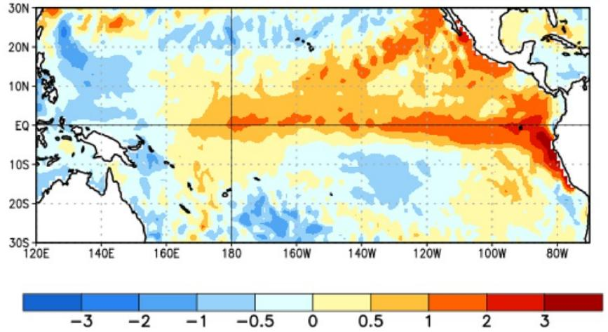

heatmap

| Latitude | Longitude | Value |
| -------- | --------- | ----- |
| 30N      | 120E      | -3    |
| 30N      | 140E      | -2    |
| 30N      | 160E      | -1    |
| 30N      | 180E      | 0     |
| 30N      | 160W      | 0.5   |
| 30N      | 140W      | 1     |
| 30N      | 120W      | 2     |
| 30N      | 100W      | 3     |
| 30N      | 80W       | 3     |
| 20N      | 120E      | -3    |
| 20N      | 140E      | -2    |
| 20N      | 160E      | -1    |
| 20N      | 180E      | 0     |
| 20N      | 160W      | 0.5   |
| 20N      | 140W      | 1     |
| 20N      | 120W      | 2     |
| 20N      | 100W      | 3     |
| 20N      | 80W       | 3     |
| 10N      | 120E      | -3    |
| 10N      | 140E      | -2    |
| 10N      | 160E      | -1    |
| 10N      | 180E      | 0     |
| 10N      | 160W      | 0.5   |
| 10N      | 140W      | 1     |
| 10N      | 120W      | 2     |
| 10N      | 100W      | 3     |
| 10N      | 80W       | 3     |
| EQ       | 120E      | -3    |
| EQ       | 140E      | -2    |
| EQ       | 160E      | -1    |
| EQ       | 180E      | 0     |
| EQ       | 160W      | 0.5   |
| EQ       | 140W      | 1     |
| EQ       | 120W      | 2     |
| EQ       | 100W      | 3     |
| EQ       | 80W       | 3     |
| 10S      | 120E      | -3    |
| 10S      | 140E      | -2    |
| 10S      | 160E      | -1    |
| 10S      | 180E      | 0     |
| 10S      | 160W      | 0.5   |
| 10S      | 140W      | 1     |
| 10S      | 120W      | 2     |
| 10S      | 100W      | 3     |
| 10S      | 80W       | 3     |
| 20S      | 120E      | -3    |
| 20S      | 140E      | -2    |
| 20S      | 160E      | -1    |
| 20S      | 180E      | 0     |
| 20S      | 160W      | 0.5   |
| 20S      | 140W      | 1     |
| 20S      | 120W      | 2     |
| 20S      | 100W      | 3     |
| 20S      | 80W       | 3     |
| 30S      | 120E      | -3    |
| 30S      | 140E      | -2    |
| 30S      | 160E      | -1    |
| 30S      | 180E      | 0     |
| 30S      | 160W      | 0.5   |
| 30S      | 140W      | 1     |
| 30S      | 120W      | 2     |
| 30S      | 100W      | 3     |
| 30S      | 80W       | 3     |

Source: NOAA.

The current setup points to a strong to very strong event that peaks in late 2026 / early 2027 (ONDJ), similar to very strong events analogs in 1982/83, 1997/98, and 2015/16. Tail risk has increased, but the historical “super” comparison still requires confirmation through summer ocean-atmosphere coupling, observed Niño 3.4 warming, and model convergence after the spring predictability barrier. A key open question is whether the event can exceed a +2.5°C anomaly and surpass past extremes; by definition, El Niño reflects sustained warming in the central equatorial Pacific, with global spillovers via shifts in rainfall patterns and temperature distributions

Early signals point to meaningful weather disruption in Brazil — excess rainfall in the South/Center-South and irregular precipitation elsewhere — creating downside risk to crop timing and yields (soy delays, second-crop corn vulnerability) and early evidence of quality losses in key crops (sugar, coffee, cotton) as out-of-season rains persist.

Sugar is the most sensitive to El Nino effects. In theory, sugar has the clearest upside skew because potential drought in Asia — down the curve (27/28), since in the short-term prices may still be pressured by ample supply from ongoing Brazilian harvest. Soybeans are more complicated: In Brazil, 26/27 Mato Grosso and MATOPIBA carry downside risk, while Rio Grande do Sul and Argentina often benefit. Corn is a timing trade on Brazil safrinha (second corn harvest; 80% of national production) compression and US summer stress.

Equity implications vary meaningfully: All else equal, El Niño can be constructive for São Martinho (higher sugar prices) and Adecoagro (improved Argentina rainfall), while more challenging for Rumo and a weather-risk factor for SLC Agrícola. For Rumo and SLC, investors should closely monitor Mato Grosso / MATOPIBA rainfall, planting pace, and the safrinha setup.

What to watch for? Three things. First, whether the event keeps strengthening through the North Hemisphere summer. Second, whether sugar supply risk starts to materialize through India/SE Asia crop stress or weaker Brazil crush execution. Third, whether grain risk becomes tangible through US summer stress and Brazil planting delays

Exhibit 2: NOAA/CPC now assigns a 63% (up from 37%) probability to a very strong El Niño in Nov-Jan, making intensity the key watchpoint  
NOAA CPC ENSO Strength Probabilities (issued June 2026)  
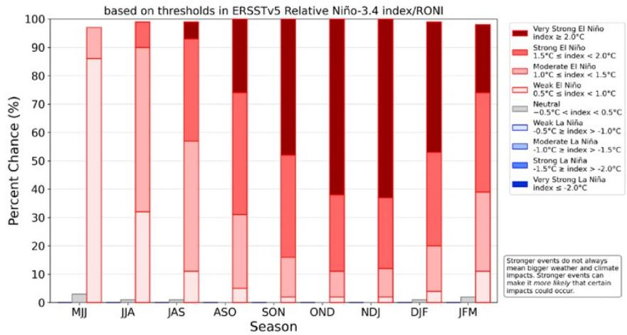

stacked bar chart

based on thresholds in ERSSTv5 Relative Niño-3.4 index/RONI
| Season | Very Strong El Niño index ≥ 2.0°C (%) | Strong El Niño 1.5°C ≤ index < 2.0°C (%) | Moderate El Niño 1.0°C ≤ index < 1.5°C (%) | Weak El Niño 0.5°C ≤ index < 1.0°C (%) | Neutral -0.5°C < index < 0.5°C (%) | Weak La Niña -0.5°C ≥ index > -1.0°C (%) | Moderate La Niña -1.0°C ≥ index > -1.5°C (%) | Strong La Niña -1.5°C ≥ index > -2.0°C (%) | Very Strong La Niña Index ≤ -2.0°C (%) |
|---|---|---|---|---|---|---|---|---|---|
| MJJ | 0 | 0 | 86 | 13 | 3 | 0 | 0 | 0 | 0 |
| JJA | 0 | 0 | 90 | 27 | 0 | 0 | 0 | 0 | 0 |
| JAS | 0 | 0 | 92 | 28 | 0 | 0 | 0 | 0 | 0 |
| ASO | 0 | 0 | 73 | 19 | 5 | 0 | 0 | 0 | 0 |
| SON | 48 | 34 | 16 | 14 | 0 | 0 | 0 | 0 | 0 |
| OND | 68 | 24 | 11 | 6 | 0 | 0 | 0 | 0 | 0 |
| NDJ | 78 | 27 | 12 | 6 | 0 | 0 | 0 | 0 | 0 |
| DJF | 78 | 34 | 16 | 6 | 0 | 0 | 0 | 0 | 0 |
| JFM | 28 | 37 | 11 | 6 | 1 | 0 | 0 | 0 | 0 |
Stronger events can make it more likely that certain impacts could occur.

Source: NOAA.

## What investors will find inside

- Why Markets Are Talking About a “Super El Niño” Now: stronger NOAA probabilities, higher subsurface heat, aggressive model tails, and memories of 2015/16.  
- Analog years commodity implications.  
• What to Watch Next.

## Why Markets Are Talking About a 'Super El Niño' Now

The market is reacting to a fatter upper tail risk. NOAA's strength distribution now assigns meaningful odds to strong or very strong El Niño outcomes later this year. That has pushed "super El Niño" language into the market conversation, even though official guidance remains probability-weighted and does not yet confirm a record event.

## The trigger is the combination of probability, subsurface heat, and model dispersion.

The internal work highlights rapid Pacific warming, high subsurface heat, and improving atmospheric alignment as reasons some dynamic models have moved toward more aggressive outcomes. The same work also stresses that spring forecasts are less reliable, keeping the “super” outcome as tail risk rather than central case.

The recent precedent is 2015/16, but the comparison may also include the 2023/24 — and even the 1877/78 event that is considered the most extreme El Niño ever. The 2015/16 event matters because it generated a powerful sugar-price cycle and meaningful agricultural disruption. But the internal analog work suggests current conditions also look closer to the gradual 2023/24 trajectory versus a confirmed 2015/16-style extreme.

The market likely prices El Niño probability, but not the crop-window distribution. Investors already know El Niño can alter rainfall patterns. What is less fully priced is whether the event hits the exact windows that matter: India's monsoon, Brazil's Center-South cane crush, Mato Grosso / MATOPIBA soybean planting, and the safrinha corn calendar.

Exhibit 4: El Niño is now confirmed, while very-strong odds increased to 63% in Nov-Jan from 37% in the prior update

<table><tr><td>Topic</td><td>Prior update</td><td>June update</td><td>Implication</td></tr><tr><td>ENSO status</td><td>El Niño Watch / transition risk rising</td><td>El Niño Advisory / conditions now present</td><td>Formation risk is largely de-risked</td></tr><tr><td>El Niño probability</td><td>82% in MJJ; 96% in DJF</td><td>97% in MJJ; 99% in DJF; 99–100% JJA–NDJ</td><td>Persistence into winter is now high confidence</td></tr><tr><td>Strength</td><td>37% very strong in Nov-Jan; 33% in Oct-Dec; 31% in Dec-Feb</td><td>63% very strong in Nov-Jan; 62% in Oct-Dec; 46% in Dec-Feb</td><td>Very strong scenario is now material</td></tr><tr><td>Ocean signal</td><td>Niño 3.4 +0.4°C; Niño 4 +0.5°C; Niño 1+2 +1.0°C</td><td>Niño 3.4 +0.7°C; Niño 4 +0.7°C; Niño 1+2 +2.1°C</td><td>Warming has broadened and intensified</td></tr><tr><td>Atmosphere</td><td>Coupling still pending</td><td>Westerly low-level wind anomalies, negative SOI and convection changes</td><td>Ocean-atmosphere coupling now supports advisory</td></tr><tr><td>Commodity read-through</td><td>Sugar cleanest channel; grains conditional</td><td>Same hierarchy, but stronger ENSO backdrop</td><td>Sugar remains first monitor; grains still need local weather confirmation</td></tr></table>

Source: MS.

Exhibit 5: El Niño strength distribution remains wide  
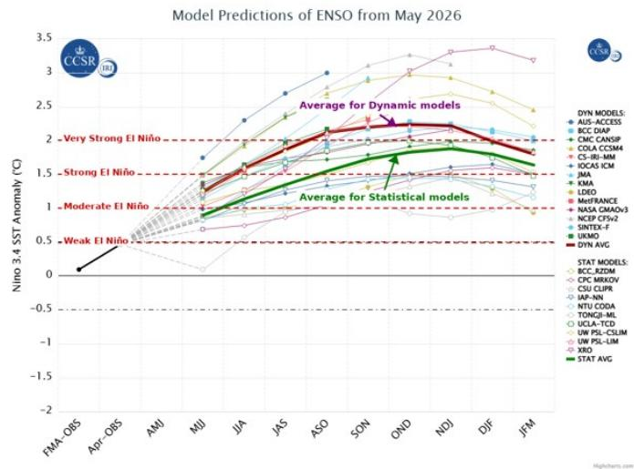

line chart

|  |  |  | Statistic Model Values |
| --- | --- | --- | --- |
|  |  |  | Statistic Model Values |
|  |  |  | Statistic Model Values |
|  |  |  | Statistic Model Values |
|  |  |  | Statistic Model Values |
|  |  |  | Statistic Model Values |
|  |  |  | Statistic Model Values |
|  |  |  | Statistic Model Values |
|  |  |  | Statistic Model Values |
|  |  |  | Statistic Model Values |
|  |  |  | Statistic Model Values |
|  |  |  | Statistic Model Values |
|  |  |  | Statistic Model Values |
|  |  |  | Statistic Model Values |
|  |  |  | Statistic Model Values |
|  |  |  | Statistic Model Values |
|  |  |  | Statistic Model Values |
|  |  |  | Statistic Models |
|  |  |  | Statistic Models |
|  |  |  | Statistic Models |
|  |  |  | Statistic Models |
|  |  |  | Statistic Models |
|  |  |  | Statistic Models |
|  |  |  | Statistic Models |
|  |  |  | Statistic Models |
|  |  |  | Statistic Models |
|  |  |  | Statistic Models |
|  |  |  | Statistic Models |
|  |  |  | Statistic Models |
|  |  |  | Statistic Models |
|  |  |  | Statistic Models |
|  |  |  | Statistic Models |
|  |  |  | Statistic Models |
|  |  |  | Statistic Models |
|  |  |  | Statistic Models |
|  |  |  | Statistic Models |
|  |  |  | Statistic Models |
|  |  |  | Statistic Model Values |
|  |  |  | Statistic Model Values |
|  |  |  | Statistic Model Values |
|  |  |  | Statistic Model Values |
|  |  |  | Statistic Model Values |
|  |  |  | Statistic Model Values |
|  |  |  | Statistic Model Values |
|  |  |  | Statistic Model Values |
|  |  |  | Statistic Model Values |
|  |  |  | Statistic Model Values |
|  |  |  | Statistic Model Values |
|  |  |  | Statistic Model Values |
|  |  |  | Statistic Model Values |
|  |  |  | Statistic Model Values |
|  |  |  | Statistic Model Values |
|  |  |  | Statistic Model Values |
|  |  |  | Statastic Model Values |
|  |  |  | Statistic Model Values |
|  |  |  | Statistic Model Values |
|  |  |  | Statistic Model Values |
|  |  |  | Statistic Model Values |
|  |  |  | Statistic Model Values |
|  |  |  | Statistic Model Values |
|  |  |  | Statistic Model Values |
|  |  |  | Statistic Model Values |
|  |  |  | Statistic Model Values |
|  |  |  | Statistic Model Values |
|  |  |  | Statistic Model Values |
|  |  |  | Statistic Model Values |
|  |  |  | Statistic Model Values |
|  |  |  | Statistic Model Values |
|  |  |  | Statistic Model Values |
|  |  |  | Statistic Model Values |
| ) |  | Value* |  |
|  |  |  | Statistic Model Values(1) |
|  |  |  | Statistic Model Values(2) |
|  |  |  | Statistic Model Values(3) |
|  |  |  | Statistic Model Values(4) |
|  |  |  | Statistic Model Values(5) |
|  |  |  | Statistic Model Values(6) |
|  |  |  | Statistic Model Values(7) |
|  |  |  | Statistic Model Values(8) |
|  |  |  | Statistic Model Values(9) |
|  |  |  | Statistic Model Values(10) |
|  |  |  | Statistic Model Values(11) |
|  |  |  | Statistic Model Values(12) |
|  |  |  | Statistic Model Values(13) |
|  |  |  | Statistic Model Values(14) |
|  |  |  | Statistic Model Values(15) |
|  |  |  | Statistic Model Values(16) |
|  |  |  | Statistic Model Values(17) |
|  |  |  | Statistic Model Values(18) |
|  |  |  | Statistic Model Values(19) |
|  |  |  | Statistic Model Values(20) |
|  |  |  | Statistic Model Values(21) |
|  |  |  | Statistic Model Values(22) |
|  |  |  | Statistic Model Values(23) |
|  |  |  | Statistic Model Values(24) |
|  |  |  | Statistic Model Values(25) |
|  |  |  | Statistic Model Values(26) |
|  |  |  | Statistic Model Values(27) |
|  |  |  | Statistic Model Values(28) |
|  |  |  | Statistic Model Values(29) |
|  |  |  | Statistic Model Values(30) |
|  |  |  | Statistic Model Values(31) |
|  |  |  | Statistic Model Values(32) |
|  |  |  | Statistic Model Values(33) |
|  |  |  | Statistic Model Values(34) |
|  |  |  | Statistic Model Values(35) |
|  |  |  | Statistic Model Values(36) |
|  |  |  | Statistic Model Values(37) |
|  |  |  | Statistic Model Values(38) |
|  |  |  | Statistic Model Values(39) |
|  |  |  | Statistic Model Values(40) |
|  |  |  | Statistic Model Values(41) |
|  |  |  | Statistic Model Values(42) |
|  |  |  | Statistic Model Values(43) |
|  |  |  | Statistic Model Values(44) |
|  |  |  | Statistic Model Values(45) |
|  |  |  | Statistic Model Values(46) |
|  |  |  | Statistic Model Values(47) |
|  |  |  | Statistic Model Values(48) |
|  |  |  | Statistic Model Values(49) |
|  |  |  | Statistic Model Values(50) |
| ) |  | Value* |  |
| ) |  | Value* |  |
| ) |  | Value* |  |
| ) |  | Value* |  |
| ) |  | Value* |  |
| ) |  | Value* |  |
| ) |  | Value* |  |
| ) |  | Value* |  |
| ) |  | Value* |  |
| ) |  | Value* |  |
| ) |  | Value* |  |
| ) |  | Value* |  |
| ) |  | Value* |  |
| ) |  | Value* |  |
| ) |  | Value* |  |
| ) |  | Value* |  |
| ) |  | Value* |  |
| ) |  | Value* |  |
| ) |  | Value* |  |
| ) |  | Value* |  |
| ) |  | Value* |  |

\*Data as of May-2026. Source: NOAA.

Exhibit 7: ENSO Follows Seasonal Pattern: Peaking in Nov-Feb  
Oceanic Nino Index (ONI) by Season - 2000 to Latest Available
NOAA CPC ONI v5; cells use simple thresholds: >= +0.5 warm, <= -0.5 cold; blanks are not yet available.

<table><tr><td>Year</td><td>DJF</td><td>JFM</td><td>FMA</td><td>MAM</td><td>AMJ</td><td>MJJ</td><td>JJA</td><td>JAS</td><td>ASO</td><td>SON</td><td>OND</td><td>NDJ</td></tr><tr><td>2000</td><td>-1.7</td><td>-1.4</td><td>-1.1</td><td>-0.8</td><td>-0.7</td><td>-0.6</td><td>-0.6</td><td>-0.5</td><td>-0.5</td><td>-0.6</td><td>-0.7</td><td>-0.7</td></tr><tr><td>2001</td><td>-0.7</td><td>-0.5</td><td>-0.4</td><td>-0.3</td><td>-0.3</td><td>-0.1</td><td>-0.1</td><td>-0.1</td><td>-0.2</td><td>-0.3</td><td>-0.3</td><td>-0.3</td></tr><tr><td>2002</td><td>-0.1</td><td>0.0</td><td>0.1</td><td>0.2</td><td>0.4</td><td>0.7</td><td>0.8</td><td>0.9</td><td>1.0</td><td>1.2</td><td>1.3</td><td>1.1</td></tr><tr><td>2003</td><td>0.9</td><td>0.6</td><td>0.4</td><td>0.0</td><td>-0.3</td><td>-0.2</td><td>0.1</td><td>0.2</td><td>0.3</td><td>0.3</td><td>0.4</td><td>0.4</td></tr><tr><td>2004</td><td>0.4</td><td>0.3</td><td>0.2</td><td>0.2</td><td>0.2</td><td>0.3</td><td>0.5</td><td>0.6</td><td>0.7</td><td>0.7</td><td>0.7</td><td>0.7</td></tr><tr><td>2005</td><td>0.6</td><td>0.6</td><td>0.4</td><td>0.4</td><td>0.3</td><td>0.1</td><td>-0.1</td><td>-0.1</td><td>-0.1</td><td>-0.3</td><td>-0.6</td><td>-0.8</td></tr><tr><td>2006</td><td>-0.9</td><td>-0.8</td><td>-0.6</td><td>-0.4</td><td>-0.1</td><td>0.0</td><td>0.1</td><td>0.3</td><td>0.5</td><td>0.8</td><td>0.9</td><td>0.9</td></tr><tr><td>2007</td><td>0.7</td><td>0.2</td><td>-0.1</td><td>-0.3</td><td>-0.4</td><td>-0.5</td><td>-0.6</td><td>-0.8</td><td>-1.1</td><td>-1.3</td><td>-1.5</td><td>-1.6</td></tr><tr><td>2008</td><td>-1.6</td><td>-1.5</td><td>-1.3</td><td>-1.0</td><td>-0.8</td><td>-0.6</td><td>-0.4</td><td>-0.2</td><td>-0.2</td><td>-0.4</td><td>-0.6</td><td>-0.7</td></tr><tr><td>2009</td><td>-0.8</td><td>-0.8</td><td>-0.6</td><td>-0.3</td><td>0.0</td><td>0.3</td><td>0.5</td><td>0.6</td><td>0.7</td><td>1.0</td><td>1.4</td><td>1.6</td></tr><tr><td>2010</td><td>1.5</td><td>1.2</td><td>0.8</td><td>0.4</td><td>-0.2</td><td>-0.7</td><td>-1.0</td><td>-1.3</td><td>-1.6</td><td>-1.6</td><td>-1.6</td><td>-1.5</td></tr><tr><td>2011</td><td>-1.3</td><td>-1.0</td><td>-0.8</td><td>-0.6</td><td>-0.5</td><td>-0.4</td><td>-0.4</td><td>-0.6</td><td>-0.8</td><td>-1.0</td><td>-1.0</td><td>-0.9</td></tr><tr><td>2012</td><td>-0.7</td><td>-0.6</td><td>-0.5</td><td>-0.4</td><td>-0.2</td><td>0.1</td><td>0.3</td><td>0.4</td><td>0.4</td><td>0.3</td><td>0.1</td><td>-0.1</td></tr><tr><td>2013</td><td>-0.3</td><td>-0.3</td><td>-0.2</td><td>-0.2</td><td>-0.3</td><td>-0.3</td><td>-0.4</td><td>-0.3</td><td>-0.2</td><td>-0.1</td><td>-0.1</td><td>-0.2</td></tr><tr><td>2014</td><td>-0.3</td><td>-0.3</td><td>-0.1</td><td>0.2</td><td>0.3</td><td>0.2</td><td>0.1</td><td>0.1</td><td>0.3</td><td>0.5</td><td>0.7</td><td>0.8</td></tr><tr><td>2015</td><td>0.7</td><td>0.6</td><td>0.7</td><td>0.8</td><td>1.0</td><td>1.3</td><td>1.6</td><td>1.9</td><td>2.2</td><td>2.5</td><td>2.6</td><td>2.8</td></tr><tr><td>2016</td><td>2.6</td><td>2.3</td><td>1.7</td><td>1.0</td><td>0.5</td><td>0.0</td><td>-0.3</td><td>-0.5</td><td>-0.6</td><td>-0.6</td><td>-0.6</td><td>-0.5</td></tr><tr><td>2017</td><td>-0.2</td><td>0.0</td><td>0.2</td><td>0.3</td><td>0.4</td><td>0.4</td><td>0.2</td><td>-0.1</td><td>-0.3</td><td>-0.6</td><td>-0.8</td><td>-0.9</td></tr><tr><td>2018</td><td>-0.8</td><td>-0.7</td><td>-0.6</td><td>-0.4</td><td>-0.1</td><td>0.1</td><td>0.1</td><td>0.3</td><td>0.5</td><td>0.8</td><td>1.0</td><td>0.9</td></tr><tr><td>2019</td><td>0.9</td><td>0.9</td><td>0.8</td><td>0.8</td><td>0.6</td><td>0.5</td><td>0.3</td><td>0.2</td><td>0.2</td><td>0.4</td><td>0.6</td><td>0.7</td></tr><tr><td>2020</td><td>0.6</td><td>0.6</td><td>0.5</td><td>0.3</td><td>0.0</td><td>-0.2</td><td>-0.4</td><td>-0.5</td><td>-0.8</td><td>-1.1</td><td>-1.2</td><td>-1.1</td></tr><tr><td>2021</td><td>-0.9</td><td>-0.8</td><td>-0.7</td><td>-0.5</td><td>-0.4</td><td>-0.3</td><td>-0.3</td><td>-0.4</td><td>-0.6</td><td>-0.8</td><td>-0.9</td><td>-0.9</td></tr><tr><td>2022</td><td>-0.8</td><td>-0.8</td><td>-0.9</td><td>-1.0</td><td>-0.9</td><td>-0.8</td><td>-0.8</td><td>-0.9</td><td>-1.0</td><td>-0.9</td><td>-0.8</td><td>-0.7</td></tr><tr><td>2023</td><td>-0.5</td><td>-0.3</td><td>0.0</td><td>0.3</td><td>0.6</td><td>0.8</td><td>1.1</td><td>1.4</td><td>1.6</td><td>1.8</td><td>2.0</td><td>2.1</td></tr><tr><td>2024</td><td>1.9</td><td>1.6</td><td>1.3</td><td>0.8</td><td>0.5</td><td>0.2</td><td>0.1</td><td>-0.1</td><td>-0.2</td><td>-0.2</td><td>-0.3</td><td>-0.4</td></tr><tr><td>2025</td><td>-0.4</td><td>-0.2</td><td>-0.1</td><td>0.0</td><td>0.0</td><td>0.0</td><td>-0.1</td><td>-0.3</td><td>-0.4</td><td>-0.5</td><td>-0.6</td><td>-0.5</td></tr><tr><td>2026</td><td>-0.4</td><td>-0.1</td><td>0.1</td><td>0.5</td><td></td><td></td><td></td><td></td><td></td><td></td><td></td><td></td></tr></table>

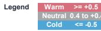  
Source: NOAA.

Exhibit 6: El Niño is now officially confirmed, with NOAA/CPC moving to El Niño Advisory as ocean and atmospheric indicators point to a coupled event  
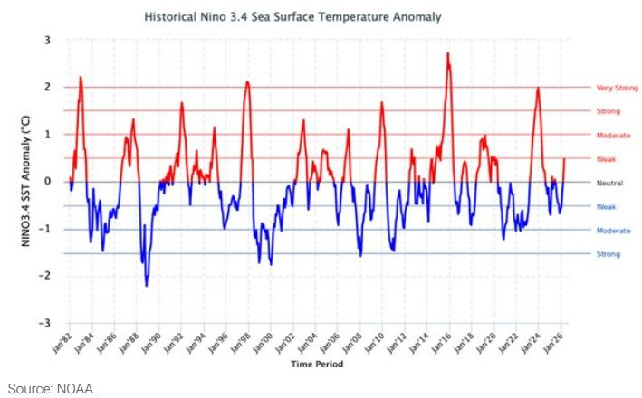

line chart

| Time Period | NINO 3.4 SST Anomaly (°C) |
| ----------- | -------------------------- |
| Jan-92      | ~0                         |
| Jan-84      | ~2.2                       |
| Jan-86      | ~-1.5                      |
| Jan-88      | ~-2.0                      |
| Jan-90      | ~-0.5                      |
| Jan-92      | ~1.5                       |
| Jan-94      | ~0                         |
| Jan-96      | ~1.0                       |
| Jan-98      | ~2.0                       |
| Jan-00      | ~-1.5                      |
| Jan-02      | ~-0.5                      |
| Jan-04      | ~1.0                       |
| Jan-06      | ~0                         |
| Jan-08      | ~1.0                       |
| Jan-10      | ~1.5                       |
| Jan-12      | ~0                         |
| Jan-14      | ~0.5                       |
| Jan-16      | ~2.5                       |
| Jan-18      | ~0                         |
| Jan-20      | ~1.0                       |
| Jan-22      | ~-1.0                      |
| Jan-24      | ~2.0                       |
| Jan-26      | ~0                         |

Exhibit 8: CFSv2 points to continued Niño 3.4 strengthening into OND/NDJ, with several ensemble members near or above the +2.0°C very strong threshold  
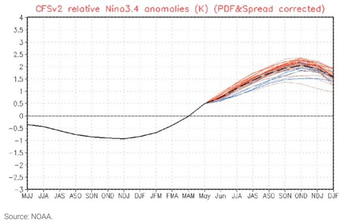

line chart

| Month | Relative Nino3.4 anomalies (K) |
|-------|--------------------------------|
| MJJ   | -0.5                           |
| JJA   | -0.6                           |
| JAS   | -0.7                           |
| ASO   | -0.8                           |
| SON   | -0.9                           |
| OND   | -1.0                           |
| NDJ   | -1.1                           |
| DJF   | -1.2                           |
| JFM   | -0.8                           |
| FMA   | -0.5                           |
| MAM   | 0.0                            |
| May   | 0.5                            |
| Jun   | 1.0                            |
| JJA   | 1.5                            |
| JAS   | 1.8                            |
| ASO   | 2.0                            |
| SON   | 2.2                            |
| OND   | 2.3                            |
| NDJ   | 2.1                            |
| DJF   | 1.9                            |

NOAA now expects El Niño to strengthen into late 2026/early 2027, with a material risk of a very strong event. El Niño conditions have already developed, with Niño 3.4 around +0.7°C and clear signs of ocean-atmosphere coupling. The latest outlook points to continued intensification into year-end, with \~60%+ probability of a very strong event during Nov–Jan, supported by elevated subsurface heat and persistent westerly wind anomalies.

For markets, this raises the likelihood that weather risk will be priced earlier and more aggressively, even if realized crop losses remain uncertain. That said, the setup still requires confirmation through sustained coupling and realized SST anomalies into 3Q. A weaker outcome remains possible if forecasts converge lower, which would moderate weather risk premia. The key nuance is that even a non-extreme event can still move prices materially if it overlaps with sensitive crop windows — particularly for sugar (Asia dryness/Brazil disruption) and for soybeans (which depend on the balance between Center-West losses and Southern zone gains).

Exhibit 9: Historical Super El Niño Episodes: Onset, peak intensity and duration of the three strongest historical analogues

<table><tr><td colspan="2">1982–83 “Super El Niño”</td><td colspan="2">1997–98 “Super El Niño”</td></tr><tr><td>Onset</td><td>mid-1982; moderate by late Q3</td><td>Onset</td><td>late spring 1997; rapid intensification</td></tr><tr><td>Peak</td><td>~2.2°C above norm in NDJ 1982/83</td><td>Peak</td><td>~2.4°C in NDJ 1997/98</td></tr><tr><td>Duration</td><td>~12–15 months ≥1.0°C; ~6–7 months ≥1.5°C</td><td>Duration</td><td>~12 months ≥1.0°C; ~8–9 months ≥1.5°C; fast rise &amp; fall</td></tr><tr><td colspan="4">2015–16 “Super El Niño”</td></tr><tr><td>Onset</td><td colspan="3">spring 2015; gradual build from 2014</td></tr><tr><td>Peak</td><td colspan="3">~2.6°C, record, in NDJ 2015/16</td></tr><tr><td>Duration</td><td colspan="3">~15 months ≥1.0°C; ~9 months ≥1.5°C; extended event</td></tr></table>

Source: NOAA CPC ONI, MS.

## Why Past El Niño Events Should Be Used — but Carefully

Past El Niño events are essential because crop impact depends on timing, not just intensity. Exhibit 5 shows that major events usually strengthen through the second half of the year and peak around November-February. That timing overlaps with Brazil soybean planting, Argentina crop establishment, Brazil cane crush tail risk, and the start of the safrinha setup.

The 1982/83, 1997/98, and 2015/16 analogs define the tail scenario. These events were extreme because they combined high Niño 3.4 anomalies with sustained ocean-atmosphere feedback. They are useful to understand what a “super” case could do, but they should not be treated as the base case for 2026.

The 2023/24 analog is useful because it shows offset risk is not guaranteed. In 2015/16, MT/MATOPIBA losses were largely offset by RS/PR/Argentina gains. In 2023/24, the offset was much weaker, and the net shortfall was larger. This matters because today's acreage mix, logistics footprint, and input-cost conditions differ from prior cycles.

Analogs should guide probabilities, not dictate outcomes. The same ONI peak can generate different crop outcomes depending on the rainfall distribution, planting pace, local soil moisture, input use, and export logistics. That is why we use past events as a framework, then map them to today's acreage and company exposure.

Exhibit 10: El Niño is now officially confirmed, with NOAA/CPC moving to El Niño Advisory as ocean and atmospheric indicators point to a coupled event  
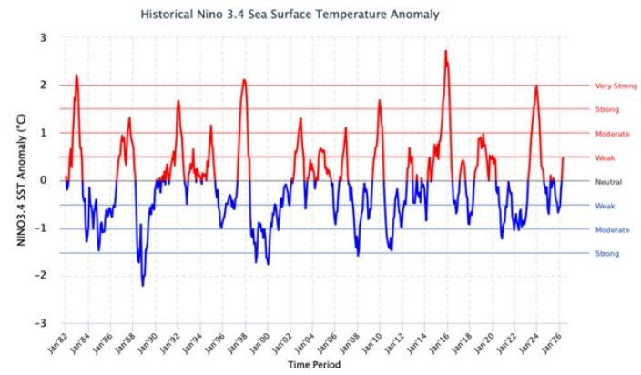

line chart

| Time Period | NINO3.4 SST Anomaly (°C) |
| ----------- | ------------------------ |
| Jun-82      | ~0.5                     |
| Jan-84      | ~2.2                     |
| Jan-86      | ~-1.5                    |
| Jan-88      | ~1.2                     |
| Jan-90      | ~-2.5                    |
| Jan-92      | ~0.8                     |
| Jan-94      | ~1.7                     |
| Jan-96      | ~0.2                     |
| Jan-98      | ~2.1                     |
| Jan-100     | ~-1.8                    |
| Jan-102     | ~0.5                     |
| Jan-104     | ~1.3                     |
| Jan-106     | ~0.8                     |
| Jan-108     | ~1.1                     |
| Jan-110     | ~1.7                     |
| Jan-112     | ~0.5                     |
| Jan-114     | ~0.8                     |
| Jan-116     | ~2.7                     |
| Jan-118     | ~0.5                     |
| Jan-120     | ~0.9                     |
| Jan-122     | ~-1.2                    |
| Jan-124     | ~0.2                     |
| Jan-126     | ~0.5                     |

Source: NOAA.

Exhibit 11: Current conditions look closer to 2023 than to a more extreme 2015/16 setup

<table><tr><td colspan="4">Past El Niño Years</td></tr><tr><td>Weak</td><td>Moderate</td><td>Strong</td><td>Very Strong</td></tr><tr><td>1952-53</td><td>1951-52</td><td>1957-58</td><td>1982-83</td></tr><tr><td>1953-54</td><td>1963-64</td><td>1965-66</td><td>1997-98</td></tr><tr><td>1958-59</td><td>1968-69</td><td>1972-73</td><td>2015-16</td></tr><tr><td>1969-70</td><td>1986-87</td><td>1987-88</td><td></td></tr><tr><td>1976-77</td><td>1994-95</td><td>1991-92</td><td></td></tr><tr><td>1977-78</td><td>2002-03</td><td>2023-24</td><td></td></tr><tr><td>1979-80</td><td>2009-10</td><td></td><td></td></tr><tr><td>2004-05</td><td></td><td></td><td></td></tr><tr><td>2006-07</td><td></td><td></td><td></td></tr><tr><td>2014-15</td><td></td><td></td><td></td></tr><tr><td>2018-19</td><td></td><td></td><td></td></tr></table>

Source: NOAA.

## Commodity Implications

Sugar remains the preferred commodity exposure. It has the clearest weather channel, the strongest trade-flow transmission, and the most direct historical price sensitivity in the internal work. The risk is not just lower production; it is lower export availability from Asia and potentially weaker crush execution in Brazil.

Soybeans need proof of net South American loss. A Mato Grosso or MATOPIBA yield problem is not enough if Argentina and southern Brazil outperform. The investable signal is the net balance across MT, MATOPIBA, RS, PR, and Argentina.

Corn is a timing option. The market should become more constructive if Brazil soybean delays compress safrinha planting or if US July-August weather turns adverse. Without those triggers, corn should trade more on balance-sheet fundamentals than on El Niño headlines.

Softs are higher-beta, trigger-dependent exposures. Palm oil, robusta coffee, cotton, and fishmeal can all respond strongly, but each requires confirmation from regional weather and production data.

Exhibit 12: India usually receives below-normal rainfall during El Niño years. India is the world second largest sugar producer and below normal monsoon may reduce its sugar output potential  
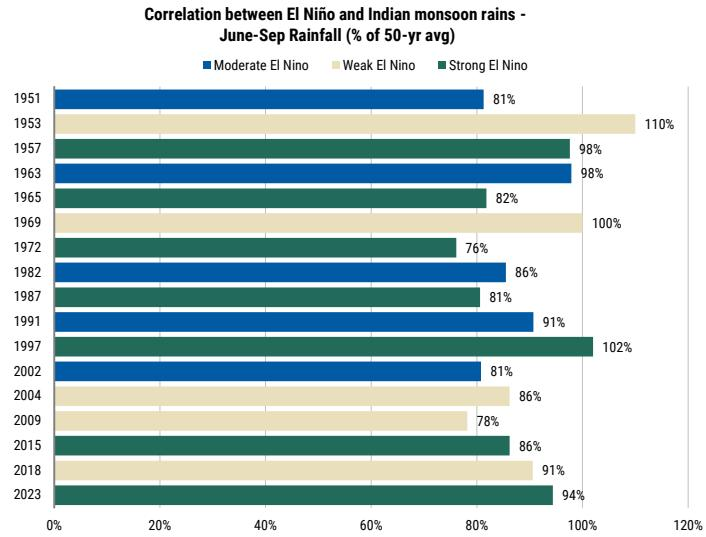

bar chart

Correlation between El Niño and Indian monsoon rains - June-Sep Rainfall (% of 50-yr avg)
| Year | Moderate El Nino (%) | Weak El Nino (%) | Strong El Nino (%) |
|---|---|---|---|
| 1951 | 81 | | |
| 1953 | | 110 | |
| 1957 | | | 98 |
| 1963 | 98 | | |
| 1965 | | | 82 |
| 1969 | | 100 | |
| 1972 | | | 76 |
| 1982 | 86 | | |
| 1987 | | | 81 |
| 1991 | 91 | | |
| 1997 | | | 102 |
| 2002 | 81 | | |
| 2004 | | 86 | |
| 2009 | | 78 | |
| 2015 | | | 86 |
| 2018 | | 91 | |
| 2023 | | | 94 |

Source: Reuters, Indian Meteorological Department (100% = normal rainfall. Below 100% = weaker-than-normal monsoon. Above 100% = stronger-than-normal monsoon).

Exhibit 14: Strong El Niño historically leads to soybean yield losses in MT, which is the largest producing state with 29% of national output  
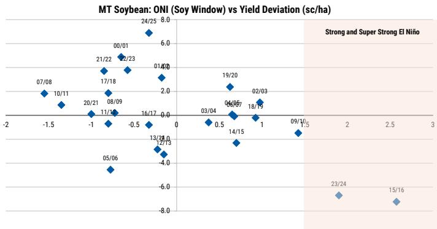

scatter plot

| Date     | Value |
| -------- | ----- |
| 07/08    | 1.0   |
| 10/11    | 0.5   |
| 20/21    | -0.5  |
| 08/09    | -0.5  |
| 11/14    | -0.5  |
| 21/22    | 1.5   |
| 00/01    | 2.0   |
| 22/23    | 2.5   |
| 17/18    | 1.5   |
| 24/25    | 8.0   |
| 01/09    | 2.0   |
| 16/17    | -0.5  |
| 13/18    | -4.0  |
| 12/13    | -4.5  |
| 03/04    | -0.5  |
| 04/07    | 2.0   |
| 14/15    | -4.0  |
| 18/19    | 1.5   |
| 19/20    | 2.5   |
| 02/03    | 1.5   |
| 09/10    | -2.0  |
| 23/24    | -6.0  |
| 15/16    | -8.0  |

Source: NOAA, Conab, IMEA, MS Estimates.

Exhibit 13: Sugar remains the cleanest bullish El Niño trade  
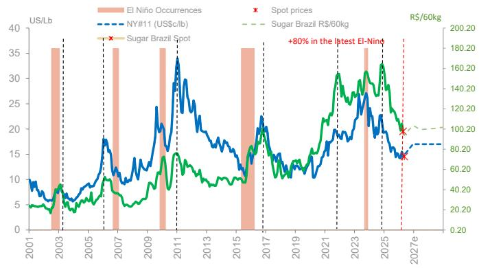

line chart

| Year | El Niño Occurrences (US/Lb) | NY#11 (US$/c/lb) | Sugar Brazil Spot (R$/60kg) |
|------|-----------------------------|------------------|-----------------------------|
| 2001 | ~10                         | ~8               | ~40                         |
| 2003 | ~35                         | ~6               | ~20                         |
| 2005 | ~15                         | ~10              | ~40                         |
| 2007 | ~35                         | ~18              | ~60                         |
| 2009 | ~15                         | ~15              | ~40                         |
| 2011 | ~35                         | ~30              | ~80                         |
| 2013 | ~15                         | ~15              | ~60                         |
| 2015 | ~35                         | ~15              | ~40                         |
| 2017 | ~15                         | ~15              | ~60                         |
| 2019 | ~15                         | ~15              | ~80                         |
| 2021 | ~15                         | ~15              | ~100                        |
| 2023 | ~15                         | ~15              | ~140                        |
| 2025 | ~15                         | ~15              | ~160                        |
| 2027e| ~15                         | ~15              | ~80                         |

Source: Eikon Workspace, MS.

Exhibit 15: and to yield pressure in Matopiba, important grain frontier formed by Maranhão, Tocantins, Piauí and Bahia  
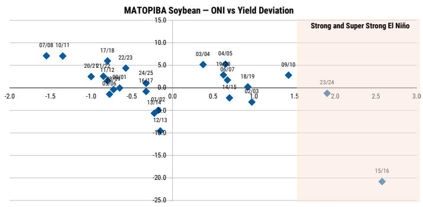

scatter plot

| Date     | MATOPIBA Soybean – ONI vs Yield Deviation |
| -------- | ------------------------------------------ |
| 07/08    | 7.0                                        |
| 10/11    | 7.0                                        |
| 20/21    | 2.0                                        |
| 17/18    | 5.0                                        |
| 22/23    | 4.0                                        |
| 03/04    | 5.0                                        |
| 04/05    | 4.0                                        |
| 05/07    | 3.0                                        |
| 14/15    | -1.0                                       |
| 18/19    | 2.0                                        |
| 02/03    | -1.0                                       |
| 09/10    | 3.0                                        |
| 12/13    | -10.0                                      |
| 12/14    | -15.0                                      |
| 15/16    | -20.0                                      |
| 23/24    | -1.0                                       |

Source: NOAA, Conab, IMEA, MS Estimates.

Exhibit 16: But, El Niño has historically supported higher soybean yields in Rio Grande do Sul...  
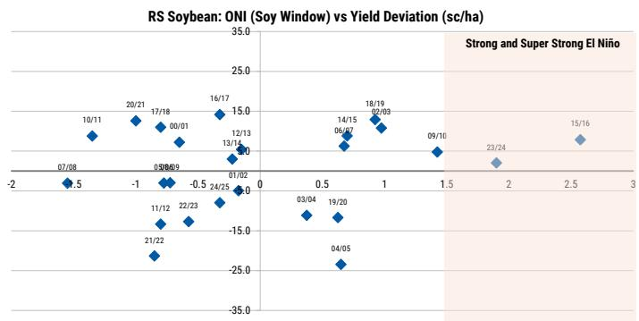

scatter plot

| Date     | Value |
| -------- | ----- |
| 07/08    | -1.5  |
| 10/11    | 1.0   |
| 20/21    | 1.5   |
| 17/18    | 1.5   |
| 00/01    | 1.5   |
| 03/08    | -0.5  |
| 04/09    | -0.5  |
| 05/08    | -0.5  |
| 06/07    | 1.0   |
| 16/17    | 1.5   |
| 12/13    | 1.5   |
| 13/14    | 1.5   |
| 01/02    | -1.0  |
| 02/24    | -1.0  |
| 03/04    | -1.5  |
| 04/05    | -2.5  |
| 05/22    | -2.5  |
| 06/23    | -2.5  |
| 07/22    | -2.5  |
| 08/23    | -2.5  |
| 09/10    | -2.5  |
| 10/11    | -2.5  |
| 14/15    | 1.0   |
| 18/19    | 1.5   |
| 23/24    | -2.5  |
| 24/25    | -2.5  |
| 25/24    | -2.5  |
| 26/24    | -2.5  |
| 27/24    | -2.5  |
| 28/24    | -2.5  |
| 29/24    | -2.5  |
| 30/24    | -2.5  |
| 31/24    | -2.5  |
| 32/24    | -2.5  |
| 33/24    | -2.5  |
| 34/24    | -2.5  |
| 35/24    | -2.5  |
| 36/24    | -2.5  |
| 37/24    | -2.5  |
| 38/24    | -2.5  |
| 39/24    | -2.5  |
| 40/24    | -2.5  |
| 41/24    | -2.5  |
| 42/24    | -2.5  |
| 43/24    | -2.5  |
| 44/24    | -2.5  |
| 45/24    | -2.5  |
| 46/24    | -2.5  |
| 47/24    | -2.5  |
| 48/24    | -2.5  |
| 49/24    | -2.5  |
| 50/24    | -2.5  |
| 51/24    | -2.5  |
| 52/24    | -2.5  |
| 53/24    | -2.5  |
| 54/24    | -2.5  |
| 55/24    | -2.5  |
| 56/24    | -2.5  |
| 57/24    | -2.5  |
| 58/24    | -2.5  |
| 59/24    | -2.5  |
| 60/24    | -2.5  |
| 61/24    | -2.5  |
| 62/24    | -2.5  |
| 63/24    | -2.5  |
| 64/24    | -2.5  |
| 65/24    | -2.5  |
| 66/24    | -2.5  |
| 67/24    | -2.5  |
| 68/24    | -2.5  |
| 69/24    | -2.5  |
| 70/24    | -2.5  |
| 71/24    | -2.5  |
| 72/24    | -2.5  |
| 73/24    | -2.5  |
| 74/24    | -2.5  |
| 75/24    | -2.5  |
| 76/24    | -2.5  |
| 77/24    | -2.5  |
| 78/24    | -2.5  |
| 79/24    | -2.5  |
| 80/24    | -2.5  |
| 81/24    | -2.5  |
| 82/24    | -2.5  |
| 83/24    | -2.5  |
| 84/24    | -2.5  |
| 85/24    | -2.5  |
| 86/24    | -2.5  |
| 87/24    | -2.5  |
| 88/24    | -2.5  |
| 89/24    | -2.5  |
| 90/24    | -2.5  |
| 91/24    | -2.5  |
| 92/24    | -2.5  |
| 93/24    | -2.5  |
| 94/24    | -2.5  |
| 95/24    | -2.5  |
| 96/24    | -2.5  |
| 97/24    | -2.5  |
| 98/24    | -2.5  |
| 99/24    | -2.5  |
| 100/24   | -3.0% |
|
| The chart displays 'Strong and Super Strong El Niño' labels above the x-axis, but the y-axis is labeled 'Value' and the data points are not explicitly provided in the code.

Source: NOAA, Conab, IMEA, MS Estimates.

Exhibit 17: ...and better yields in Argentina  
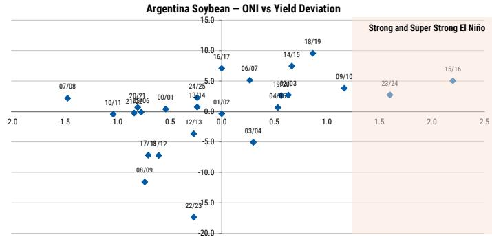

scatter plot

| Date   | Value |
|--------|-------|
| 07/08  | -1.5  |
| 10/11  | -1.0  |
| 20/21  | -0.5  |
| 21/02  | -0.5  |
| 00/01  | -0.5  |
| 12/13  | -5.0  |
| 13/14  | -5.0  |
| 14/15  | 5.0   |
| 16/17  | 10.0  |
| 01/02  | 0.0   |
| 03/04  | -5.0  |
| 04/05  | -5.0  |
| 06/07  | 5.0   |
| 09/10  | 5.0   |
| 14/15  | 10.0  |
| 18/19  | 10.0  |
| 23/24  | 5.0   |
| 22/23  | -20.0 |
| 24/25  | -5.0  |
| 27/12  | -5.0  |
| 28/09  | -15.0 |
| 31/12  | -5.0  |

Source: NOAA, USDA, Bolsa de Cereales, MS Estimates.

Exhibit 18: Tempo OK Forecast Summary

<table><tr><td>Período</td><td>Trigo</td><td>Milho/Soja</td><td>Cana de açúcar</td><td>Café</td></tr><tr><td>Jun-ago
Invero
Início do El Niño</td><td>Chuva excessiva e falta de frio frequente penalizam o trigo no Sul.</td><td>Maior estrago na 2° safra de milho por conta do atraso do plantio da soja na primavera passada. EUA com chuva frequente.</td><td>Chuva excessiva na colheita do PR, MS e oeste e sudoeste de SP. Tempo seco prolongado em GO, MG e norte de SP.</td><td>Eventuais precipitações podem piorar qualidade do grão.</td></tr><tr><td>Set-out
Início da primavera
Intensificação do El Niño</td><td>Chuva excessiva e falta de frio frequente penalizam o trigo no Sul.</td><td>Calor excessivo e chuva irregular no Sudeste e Centro-Oeste. Chuva frequente no Sul.</td><td>Muito calor e risco de queimadas em GO, MG e norte de SP.</td><td>Atenção ao calor excessivo.</td></tr><tr><td>Nov-dez
Primavera
El Niño
moderado/forte</td><td>Dificuldade na colheita. Na média, a perda oscila entre 10% e 15% em anos de El Niño comparado com a safra anterior (Conab).</td><td>Atraso no plantio no Matopiba. Chuva regulariza no Sudeste e Centro-Oeste. Risco de estiagem menor no Sul.</td><td>Chuva abaixo da média, porém mais regular no Centro e Sul do Brasil.</td><td>Chuva abaixo da média e eventuais estiagens na Zona da Mata de MG e, principalmente, no ES.</td></tr><tr><td>Jan-mar
Verão
Continuidade do El Niño</td><td>-</td><td>Quebra na safra do Matopiba, porém melhor desempenho no Sul. Atenção para perdas na 2° safra de milho. Em média, em anos de El Niño, as perdas variam entre 10% e 12% (Conab).</td><td>Atenção às quebras de produtividade na India. No Brasil, chuva corta mais cedo no início do outono.</td><td>Nos anos anteriores, com El Niño, o café Robusta teve maior quebra de produção comparado ao Arábica (Estiagem no ES).</td></tr></table>

Source:  
Tempo OK

Exhibit 19: Marcus Weather Risk Outlook Summary  

## 2026 Weather Risk Outlook

May 6, 2026

## Regional Crop Impact Matrix by ENSO Phase

Typical yield impact direction and severity across major producing regions

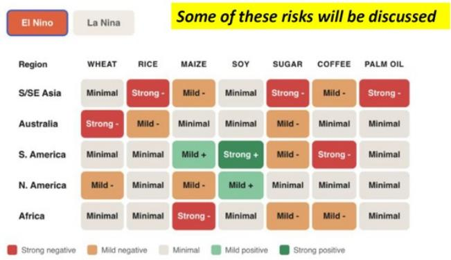

heatmap

Some of these risks will be discussed
| Region | WHEAT | RICE | MAIZE | SOY | SUGAR | COFFEE | PALM OIL |
|---|---|---|---|---|---|---|---|
| S/SE Asia | Minimal | Strong - | Mild - | Minimal | Strong - | Mild - | Strong - |
| Australia | Strong - | Mild - | Minimal | Minimal | Mild - | Minimal | Minimal |
| S. America | Minimal | Minimal | Mild + | Strong + | Mild - | Strong - | Minimal |
| N. America | Mild - | Minimal | Mild - | Mild + | Minimal | Minimal | Minimal |
| Africa | Minimal | Minimal | Strong - | Minimal | Mild - | Mild - | Minimal |

Source: Marcus Weather

## What to Watch Next

Ocean-atmosphere coupling is the first confirmation test. Previous super El Niños required sustained feedback between the ocean and atmosphere through summer. Weak or reversed Pacific trade winds into June-August would raise the odds of a very strong event; a recovery in trade winds would reduce the tail risk.

Observed SSTs should be tested against model forecasts by late 3Q. If Niño 3.4 warming lags aggressive forecasts by August-

September, the “super” narrative should fade. If observed anomalies converge toward +2.0°C or higher, the tail becomes more investable.

Asia rainfall is the first commodity trigger. India, Thailand, Indonesia, Malaysia, and Vietnam are the key watchpoints for sugar, palm oil, cotton, and robusta coffee.

Brazil execution is the second commodity trigger. For sugar, watch Brazil Center-South crush days, ATR, and cane carryover. For grains, watch Mato Grosso / MATOPIBA soybean planting, January-March rainfall, and safrinha corn timing.

Company exposure should be monitored through local data, not ENSO headlines. For Rumo, monitor Mato Grosso export flows and corn/soy volumes. For AGRO, monitor Argentina crop ratings and rainfall. For SLCE, monitor Center-West / Bahia rainfall and planting progress.

Exhibit 20:  
The confirmation checklist: coupling, SSTs, Asia rainfall, Brazil execution, equity exposure

<table><tr><td>Metric</td><td>Key monitor</td><td>Trigger</td><td>What it changes</td><td>Investment read-through</td></tr><tr><td>ENSO coupling</td><td>Pacific trade winds; ocean-atmosphere feedback through Jun-Aug</td><td>Weak or reversed trade winds; sustained coupling</td><td>Raises odds of very strong El Nino; weather risk becomes more investable</td><td>Raises monitoring intensity across sugar, grains and ag equities</td></tr><tr><td>Nino 3.4</td><td>Observed SST anomalies vs model forecasts by Aug-Sep</td><td>Observed anomalies converge toward +2C degrees or higher</td><td>Confirms stronger El Nino tail; validates risk premium</td><td>If warming lags forecasts, super El Nino narrative should fade</td></tr><tr><td>Asia rainfall</td><td>India, Thailand, Indonesia, Malaysia, Vietnam rainfall</td><td>Below-normal monsoon or persistent SE Asia dryness</td><td>First commodity trigger; tightens sugar and softs balance</td><td>Bullish sugar; supportive for palm oil, cotton and robusta coffee</td></tr><tr><td>Brazil crop execution</td><td>CS Brazil crush days, ATR, cane carryover; MT/MATOPIBA planting, Jan-Mar rainfall, safrinha timing</td><td>Excess rain disrupts crush; dryness delays soybean planting or compresses safrinha window</td><td>Second commodity trigger; shifts risk from weather narrative to realized crop loss</td><td>Sugar supported if crush execution weakens; grains turn bullish if MT/MATOPIBA stress materializes</td></tr><tr><td>Company indicators</td><td>Rumo MT export flows and grain volumes; AGRO Argentina rainfall/crop ratings; SLCE Center-West/Bahia rainfall and planting progress</td><td>Local data confirms volume risk, rainfall benefit, or crop stress</td><td>Separates commodity price upside from company operating risk</td><td>Rumo: volume/timing risk; AGRO: Argentina rainfall beneficiary; SLCE: MT/Bahia/MATOPIBA downside risk</td></tr></table>

Source: NOAA CPC, IMD, Conab, IMEA, Eikon Workspace, MS..

## El Nino Weather Impact

Exhibit 21: El Niño Impacts on Global Weather  
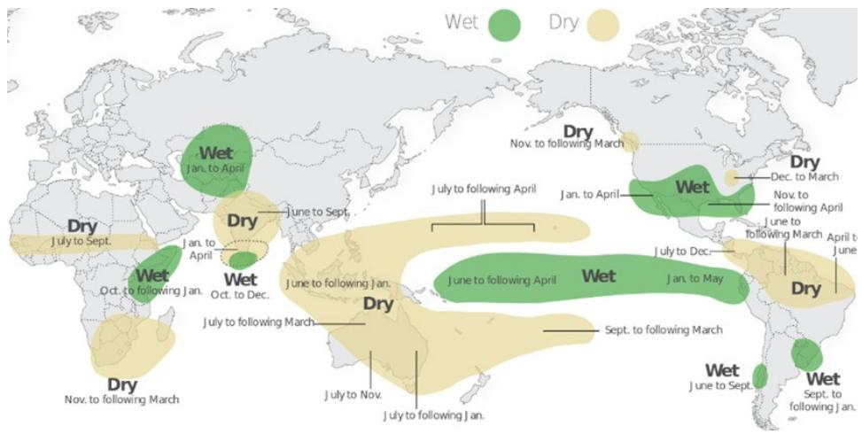

text_image

Wet
Dry
Dry
Oct. to following Jan.
Dry
July to Sept.
Wet
Dry
Oct. to following Jan.
Dry
July to Sept.
Wet
Dry
Oct. to following Jan.
Dry
July to Sept.
Wet
Dry
Oct. to following Jan.
Dry
July to Sept.
Wet
Dry
Oct. to following Jan.
Dry
July to Sept.
Wet
Dry
Oct. to following Jan.
Dry
July to Sept.
Wet
Dry
Oct. to following Jan.
Wet
Dry
Sept. to following March
Wet
Dry
Oct. to following Jan.
Wet
Dry
Sept. to following Jan.

Source: NOAA.

Exhibit 22: Crop Calendar  
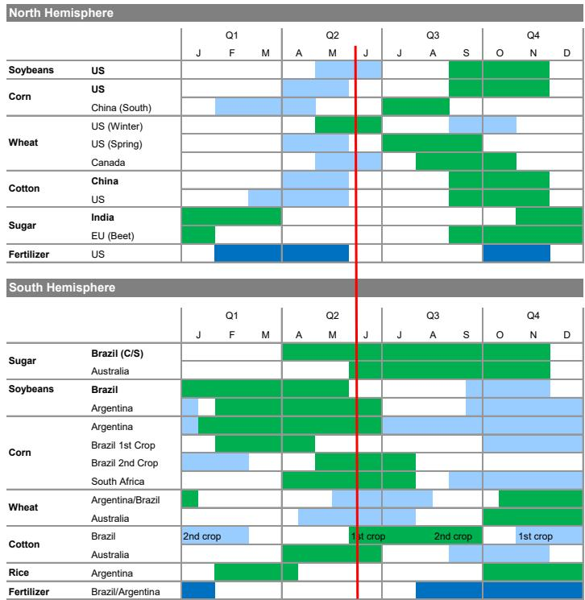

bar chart

North Hemisphere
| Category | Country | Q1<lcel><lcel><fcel>Q2<lcel><lcel><fcel>Q3<lcel><lcel><fcel>Q4<lcel><lcel><nl>
<ucel><ucel><fcel>J<fcel>F<fcel>M<fcel>A<fcel>M<fcel>J<fcel>J<fcel>A<fcel>S<fcel>O<fcel>N<fcel>D<nl>
<fcel>Soybeans<fcel>US<ecel><ecel><ecel><ecel><ecel><ecel><ecel><ecel><ecel><ecel><ecel><ecel><nl>
<fcel>Corn<fcel>US<ecel><ecel><ecel><ecel><ecel><ecel><ecel><ecel><ecel><ecel><ecel><ecel><nl>
<ucel><fcel>China (South)<ecel><ecel><ecel><ecel><ecel><ecel><ecel><ecel><ecel><ecel><ecel><ecel><nl>
<fcel>Wheat<fcel>US (Winter)<ecel><ecel><ecel><ecel><ecel><ecel><ecel><ecel><ecel><ecel><ecel><ecel><nl>
<ucel><fcel>US (Spring)<ecel><ecel><ecel><ecel><ecel><ecel><ecel><ecel><ecel><ecel><ecel><ecel><nl>
<ucel><fcel>Canada<ecel><ecel><ecel><ecel><ecel><ecel><ecel><ecel><ecel><ecel><ecel><ecel><nl>
<fcel>Cotton<fcel>China<ecel><ecel><ecel><ecel><ecel><ecel><ecel><ecel><ecel><ecel><ecel><ecel><nl>
<ucel><fcel>US<ecel><ecel><ecel><ecel><ecel><ecel><ecel><ecel><ecel><ecel><ecel><ecel><nl>
<fcel>Sugar<fcel>India<ecel><lcel><lcel><lcel><lcel><lcel><lcel><lcel><lcel><lcel><lcel><lcel><nl>
<ucel><fcel>EU (Beet)<ucel><xcel><xcel><xcel><xcel><xcel><xcel><xcel><xcel><xcel><xcel><xcel><nl>
<fcel>Fertilizer<fcel>US<ucel><xcel><xcel><xcel><xcel><xcel><xcel><xcel><xcel><xcel><xcel><xcel><nl>
<fcel>South Hemisphere<lcel><lcel><lcel><lcel><lcel><lcel><lcel><lcel><lcel><lcel><lcel><lcel><lcel><nl>
<fcel>Soybean<fcel>Brazil (C/S) Australia<ecel><lcel><lcel><lcel><lcel><lcel><lcel><lcel><lcel><lcel><lcel><lcel><nl>
<ucel><ucel><ucel><xcel><xcel><xcel><xcel><xcel><xcel><xcel><xcel><xcel><xcel><xcel><nl>
<fcel>Soybeans<fcel>Brazil Argentina<ucel><xcel><xcel><xcel><xcel><xcel><xcel><xcel><xcel><xcel><xcel><xcel><nl>
<ucel><ucel><ucel><xcel><xcel><xcel><xcel><xcel><xcel><xcel><xcel><xcel><xcel><xcel><nl>
<fcel>Corn<fcel>Argentina Brazil 1st Crop Brazil 2nd Crop South Africa<ucel><xcel><xcel><xcel><xcel><xcel><xcel><xcel><xcel><xcel><xcel><xcel><nl>
<ucel><ucel><ucel><xcel><xcel><xcel><xcel><xcel><xcel><xcel><xcel><xcel><xcel><xcel><nl>
<ucel><ucel><ucel><xcel><xcel><xcel><xcel><xcel><xcel><xcel><xcel><xcel><xcel><xcel><nl>
<fcel>Wheat<fcel>Argentina/Brazil Australia<ucel><xcel><xcel><xcel><xcel><xcel><xcel><xcel><xcel><xcel><xcel><xcel><nl>
<ucel><ucel><ucel><xcel><xcel><xcel><xcel><xcel><xcel><xcel><xcel><xcel><xcel><xcel><nl>
<fcel>Cotton<fcel>Brazil Australia<fcel>2nd crop<lcel><lcel><lcel><lcel><fcel>1st crop<lcel><fcel>2nd crop<lcel><lcel><fcel>1st crop<lcel><nl>
<ucel><ucel><ucel><xcel><xcel><xcel><xcel><ucel><xcel><ucel><xcel><xcel><ucel><xcel><nl>
<fcel>Rice<fcel>Argentina Brazil/Argentina<ucel><xcel><xcel><xcel><xcel><ucel><xcel><ucel><xcel><xcel><ucel><xcel><nl>
<ucel><ucel><ucel><xcel><xcel><xcel><xcel><ucel><xcel><ucel><xcel><xcel><ucel><xcel><nl>
<fcel>Fertilizer<ucel><ucel><xcel><xcel><xcel><xcel><ucel><xcel><ucel><xcel><xcel><ucel><xcel><nl>

## Focus

1-2Q: corn/soy/wheat planting  
1Q: sugar harvest  
3Q: cotton harvest

  
Harvest:

Application:  

## Focus

1-2Q: soy harvest  
2-4Q: sugar harvest  
3-4Q: cotton planting  
4Q: soy/corn planting

  
Harvest:

Application:  
  
Source: Eikon, MS.

## Commodity prices and El Niño

Exhibit 23: Sugar remains the cleanest bullish El Niño trade.  
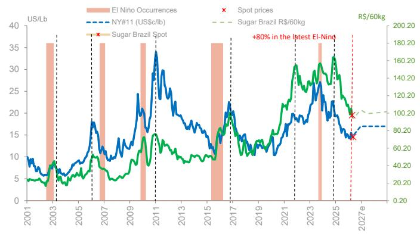

line chart

| Year | Spot prices (R$/60kg) | NY#11 (US$c/lb) | Sugar Brazil Spot (US$c/lb) | Sugar Brazil Spot (US$c/lb) |
|------|------------------------|------------------|------------------------------|------------------------------|
| 2001 | ~5.0                   | ~10              | ~5                           | ~5                           |
| 2003 | ~5.0                   | ~15              | ~5                           | ~5                           |
| 2005 | ~5.0                   | ~18              | ~5                           | ~5                           |
| 2007 | ~5.0                   | ~20              | ~5                           | ~5                           |
| 2009 | ~5.0                   | ~25              | ~5                           | ~5                           |
| 2011 | ~5.0                   | ~35              | ~15                          | ~15                          |
| 2013 | ~5.0                   | ~25              | ~10                          | ~10                          |
| 2015 | ~5.0                   | ~20              | ~10                          | ~10                          |
| 2017 | ~5.0                   | ~22              | ~15                          | ~15                          |
| 2019 | ~5.0                   | ~15              | ~10                          | ~10                          |
| 2021 | ~5.0                   | ~20              | ~15                          | ~15                          |
| 2023 | ~5.0                   | ~25              | ~20                          | ~20                          |
| 2025 | ~5.0                   | ~20              | ~15                          | ~15                          |
| 2027e| ~5.0                   | ~18              | ~10                          | ~10                          |

Source: Eikon Workspace, MS.

Exhibit 24: We expect prices impact to Soybeans to be more balanced  
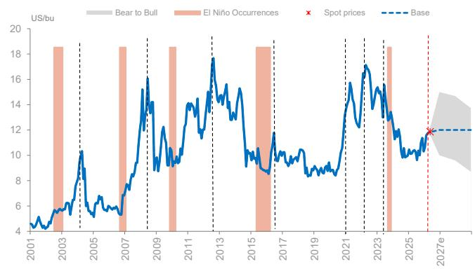

line chart

| Year | Bear to Bull (US/bu) | El Niño Occurrences (US/bu) | Spot prices (US/bu) |
|------|----------------------|------------------------------|---------------------|
| 2001 | ~4.5                 | ~4.5                         | -                   |
| 2003 | ~6.0                 | ~18.5                        | -                   |
| 2005 | ~5.5                 | ~18.5                        | -                   |
| 2007 | ~7.0                 | ~18.5                        | -                   |
| 2009 | ~14.0                | ~18.5                        | -                   |
| 2011 | ~13.0                | ~18.5                        | -                   |
| 2013 | ~15.0                | ~18.5                        | -                   |
| 2015 | ~10.0                | ~18.5                        | -                   |
| 2017 | ~9.0                 | ~18.5                        | -                   |
| 2019 | ~8.5                 | ~18.5                        | -                   |
| 2021 | ~14.0                | ~18.5                        | -                   |
| 2023 | ~16.0                | ~18.5                        | -                   |
| 2025 | ~12.0                | ~18.5                        | -                   |
| 2027e| ~12.0                | ~18.5                        | 12.0                |

Source: Eikon Workspace, MS.

Exhibit 25: While Corn Could face upside risk, due to shorter planting windows  
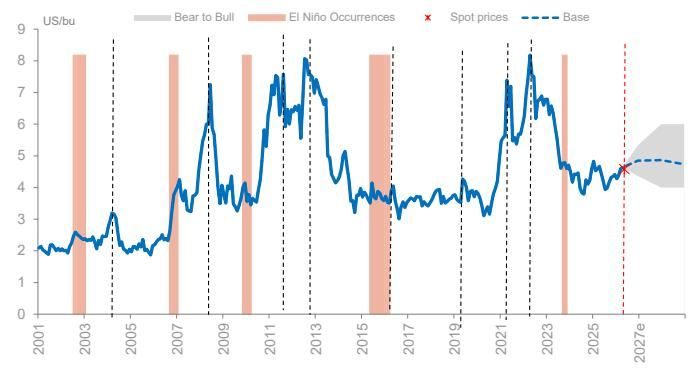

line chart

| Year | Bear to Bull | El Niño Occurrences | Spot prices | Base |
|------|--------------|---------------------|-----------|------|
| 2001 | ~2.0         | ~2.0                | -         | -    |
| 2003 | ~2.5         | ~8.0                | -         | -    |
| 2005 | ~2.0         | ~8.0                | -         | -    |
| 2007 | ~3.0         | ~8.0                | -         | -    |
| 2009 | ~4.0         | ~8.0                | -         | -    |
| 2011 | ~6.0         | ~8.0                | -         | -    |
| 2013 | ~7.0         | ~8.0                | -         | -    |
| 2015 | ~4.0         | ~8.0                | -         | -    |
| 2017 | ~3.5         | ~8.0                | -         | -    |
| 2019 | ~3.5         | ~8.0                | -         | -    |
| 2021 | ~5.0         | ~8.0                | -         | -    |
| 2023 | ~6.0         | ~8.0                | -         | -    |
| 2025 | ~4.5         | ~8.0                | -         | -    |
| 2027e| ~4.5         | ~8.0                | ~4.5      | ~4.5 |

Source: Eikon Workspace, MS.

## Analog Years

Exhibit 26: ENSO Follows Seasonal Pattern: Peaking in Nov-Feb Current conditions look closer to 2023 than to a more extreme 2015/16 setup  
Oceanic Nino Index (ONI) by Season - 2000 to Latest Available  
NOAA CPC ONI v5; cells use simple thresholds: >= +0.5 warm, <= -0.5 cold; blanks are not yet available.

<table><tr><td>Year</td><td>DJF</td><td>JFM</td><td>FMA</td><td>MAM</td><td>AMJ</td><td>MJJ</td><td>JJA</td><td>JAS</td><td>ASO</td><td>SON</td><td>OND</td><td>NDJ</td></tr><tr><td>2000</td><td>-1.7</td><td>-1.4</td><td>-1.1</td><td>-0.8</td><td>-0.7</td><td>-0.6</td><td>-0.6</td><td>-0.5</td><td>-0.5</td><td>-0.6</td><td>-0.7</td><td>-0.7</td></tr><tr><td>2001</td><td>-0.7</td><td>-0.5</td><td>-0.4</td><td>-0.3</td><td>-0.3</td><td>-0.1</td><td>-0.1</td><td>-0.1</td><td>-0.2</td><td>-0.3</td><td>-0.3</td><td>-0.3</td></tr><tr><td>2002</td><td>-0.1</td><td>0.0</td><td>0.1</td><td>0.2</td><td>0.4</td><td>0.7</td><td>0.8</td><td>0.9</td><td>1.0</td><td>1.2</td><td>1.3</td><td>1.1</td></tr><tr><td>2003</td><td>0.9</td><td>0.6</td><td>0.4</td><td>0.0</td><td>-0.3</td><td>-0.2</td><td>0.1</td><td>0.2</td><td>0.3</td><td>0.3</td><td>0.4</td><td>0.4</td></tr><tr><td>2004</td><td>0.4</td><td>0.3</td><td>0.2</td><td>0.2</td><td>0.2</td><td>0.3</td><td>0.5</td><td>0.6</td><td>0.7</td><td>0.7</td><td>0.7</td><td>0.7</td></tr><tr><td>2005</td><td>0.6</td><td>0.6</td><td>0.4</td><td>0.4</td><td>0.3</td><td>0.1</td><td>-0.1</td><td>-0.1</td><td>-0.1</td><td>-0.3</td><td>-0.6</td><td>-0.8</td></tr><tr><td>2006</td><td>-0.9</td><td>-0.8</td><td>-0.6</td><td>-0.4</td><td>-0.1</td><td>0.0</td><td>0.1</td><td>0.3</td><td>0.5</td><td>0.8</td><td>0.9</td><td>0.9</td></tr><tr><td>2007</td><td>0.7</td><td>0.2</td><td>-0.1</td><td>-0.3</td><td>-0.4</td><td>-0.5</td><td>-0.6</td><td>-0.8</td><td>-1.1</td><td>-1.3</td><td>-1.5</td><td>-1.6</td></tr><tr><td>2008</td><td>-1.6</td><td>-1.5</td><td>-1.3</td><td>-1.0</td><td>-0.8</td><td>-0.6</td><td>-0.4</td><td>-0.2</td><td>-0.2</td><td>-0.4</td><td>-0.6</td><td>-0.7</td></tr><tr><td>2009</td><td>-0.8</td><td>-0.8</td><td>-0.6</td><td>-0.3</td><td>0.0</td><td>0.3</td><td>0.5</td><td>0.6</td><td>0.7</td><td>1.0</td><td>1.4</td><td>1.6</td></tr><tr><td>2010</td><td>1.5</td><td>1.2</td><td>0.8</td><td>0.4</td><td>-0.2</td><td>-0.7</td><td>-1.0</td><td>-1.3</td><td>-1.6</td><td>-1.6</td><td>-1.6</td><td>-1.5</td></tr><tr><td>2011</td><td>-1.3</td><td>-1.0</td><td>-0.8</td><td>-0.6</td><td>-0.5</td><td>-0.4</td><td>-0.4</td><td>-0.6</td><td>-0.8</td><td>-1.0</td><td>-1.0</td><td>-0.9</td></tr><tr><td>2012</td><td>-0.7</td><td>-0.6</td><td>-0.5</td><td>-0.4</td><td>-0.2</td><td>0.1</td><td>0.3</td><td>0.4</td><td>0.4</td><td>0.3</td><td>0.1</td><td>-0.1</td></tr><tr><td>2013</td><td>-0.3</td><td>-0.3</td><td>-0.2</td><td>-0.2</td><td>-0.3</td><td>-0.3</td><td>-0.4</td><td>-0.3</td><td>-0.2</td><td>-0.1</td><td>-0.1</td><td>-0.2</td></tr><tr><td>2014</td><td>-0.3</td><td>-0.3</td><td>-0.1</td><td>0.2</td><td>0.3</td><td>0.2</td><td>0.1</td><td>0.1</td><td>0.3</td><td>0.5</td><td>0.7</td><td>0.8</td></tr><tr><td>2015</td><td>0.7</td><td>0.6</td><td>0.7</td><td>0.8</td><td>1.0</td><td>1.3</td><td>1.6</td><td>1.9</td><td>2.2</td><td>2.5</td><td>2.6</td><td>2.8</td></tr><tr><td>2016</td><td>2.6</td><td>2.3</td><td>1.7</td><td>1.0</td><td>0.5</td><td>0.0</td><td>-0.3</td><td>-0.5</td><td>-0.6</td><td>-0.6</td><td>-0.6</td><td>-0.5</td></tr><tr><td>2017</td><td>-0.2</td><td>0.0</td><td>0.2</td><td>0.3</td><td>0.4</td><td>0.4</td><td>0.2</td><td>-0.1</td><td>-0.3</td><td>-0.6</td><td>-0.8</td><td>-0.9</td></tr><tr><td>2018</td><td>-0.8</td><td>-0.7</td><td>-0.6</td><td>-0.4</td><td>-0.1</td><td>0.1</td><td>0.1</td><td>0.3</td><td>0.5</td><td>0.8</td><td>1.0</td><td>0.9</td></tr><tr><td>2019</td><td>0.9</td><td>0.9</td><td>0.8</td><td>0.8</td><td>0.6</td><td>0.5</td><td>0.3</td><td>0.2</td><td>0.2</td><td>0.4</td><td>0.6</td><td>0.7</td></tr><tr><td>2020</td><td>0.6</td><td>0.6</td><td>0.5</td><td>0.3</td><td>0.0</td><td>-0.2</td><td>-0.4</td><td>-0.5</td><td>-0.8</td><td>-1.1</td><td>-1.2</td><td>-1.1</td></tr><tr><td>2021</td><td>-0.9</td><td>-0.8</td><td>-0.7</td><td>-0.5</td><td>-0.4</td><td>-0.3</td><td>-0.3</td><td>-0.4</td><td>-0.6</td><td>-0.8</td><td>-0.9</td><td>-0.9</td></tr><tr><td>2022</td><td>-0.8</td><td>-0.8</td><td>-0.9</td><td>-1.0</td><td>-0.9</td><td>-0.8</td><td>-0.8</td><td>-0.9</td><td>-1.0</td><td>-0.9</td><td>-0.8</td><td>-0.7</td></tr><tr><td>2023</td><td>-0.5</td><td>-0.3</td><td>0.0</td><td>0.3</td><td>0.6</td><td>0.8</td><td>1.1</td><td>1.4</td><td>1.6</td><td>1.8</td><td>2.0</td><td>2.1</td></tr><tr><td>2024</td><td>1.9</td><td>1.6</td><td>1.3</td><td>0.8</td><td>0.5</td><td>0.2</td><td>0.1</td><td>-0.1</td><td>-0.2</td><td>-0.2</td><td>-0.3</td><td>-0.4</td></tr><tr><td>2025</td><td>-0.4</td><td>-0.2</td><td>-0.1</td><td>0.0</td><td>0.0</td><td>0.0</td><td>-0.1</td><td>-0.3</td><td>-0.4</td><td>-0.5</td><td>-0.6</td><td>-0.5</td></tr><tr><td>2026</td><td>-0.4</td><td>-0.1</td><td>0.1</td><td>0.5</td><td></td><td></td><td></td><td></td><td></td><td></td><td></td><td></td></tr></table>

Legend

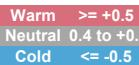

Source: NOAA.

## Valuation Methodology and Risks

## ADECOAGRO S.A. (AGRO.N)

In our bull case, we assume Profertil generates US\$335 million in EBITDA, supported by a urea price of US\$490/ton and gas costs of US\$4.33/mmbtu. For the Sugar & Ethanol (S&E) segment, we assume sugar at 22¢/lb and value the business at US\$70 EV/ton. These upside assumptions imply valuation multiples of 4.3x EV/EBITDA and 8.5x P/E in 2026

## Risks to Upside

■ Lower Gas prices in Argentina  
■ Higher Ammonia Prices  
■ Weather disruptions in India can maintain sugar prices high.  
■ Higher Oil prices can increase ethanol price.

## Risks to Downside

■ Fuel policies in Brazil: lower ethanol prices  
■ Further macro deterioration in Argentina.  
■ Higher production costs for sugar in Brazil.  
■ Weather impact on yields.  
■ Lower Brent for longer.  
FX  
■ Higher Gas prices in Argentina

## Rumo SA (RAIL3.SA)

Our price target is based on a full DCF Model (WACC: 12.5%; g: 1%).

## Risks to Upside

■ Bigger Crop  
■ Market share gains  
■ Higher yields for longer  
■ LRV project surprises positively

## Risks to Downside

■ Lower Brazilian Crop  
■ Disappointing volumes  
■ Adverse Weather that could affect crops and export volumes  
■ Lower pricing power  
■ Lower Yields  
■ Regulatory changes and lawsuits  
■ New competing projects  
■ More Investment in infrastructure that decreases existing bottlenecks

## SLC Agricola S.A. (SLCE3.SA)

Derived from our DCF methodology assuming a 14.1% WACC and a 3.0% terminal growth rate (in R\$).

## Risks to Upside

■ La Niña could increase yields  
■ Extraordinary dividends.  
■ Productivity and profitability gains.  
■ Weaker BRL.

## Risks to Downside

■ Cotton demand and prices.  
■ Weaker demand for feed could pressure grain prices.  
■ Crop failure: Weather disruptions  
■ Stronger BRL.

## Sao Martinho SA (SMTO3.SA)

Derived from our sum-of-the-parts valuation using US\$60/ton for the S/E business with sugar prices at \$17c/lb and Corn Ethanol Operations at 6x EBITDA of R\$360

## Risks to Upside

■ Stronger results, if ethanol prices becomes more attractive than Sugar. Higher Oil prices, weaker FX  
■ Corn ethanol plant could affect shares if results (margins) exceed expectations  
■ Global Supply Disruptions: India below expected

## Risks to Downside

■ Fuel policies in Brazil: changes could keep ethanol prices low  
■ Sugar prices: lower oil prices, Weather events may affect yield  
■ Stronger BRL reducing export revenues

## Disclosure Section

The information and opinions in MS were prepared by MS & Co. LLC, and/or MS C.T.V.M. S.A., and/or MS Mexico, Casa de Bolsa, S.A. de C.V., and/or MS Canada Limited. As used in this disclosure section, "MS" includes MS & Co. LLC, MS C.T.V.M. S.A., MS Mexico, Casa de Bolsa, S.A. de C.V., MS Canada Limited and their affiliates as necessary.

For important disclosures, stock price charts and equity rating histories regarding companies that are the subject of this report, please see the MS Disclosure Website at www.morganstanley.com/eqr/disclosures/webapp/generalresearch, or contact your investment representative or MS at 1585 Broadway, (Attention: Research Management), New York, NY, 10036 USA.

For valuation methodology and risks associated with any recommendation, rating or price target referenced in this research report, please contact the Client Support Team as follows: US/Canada +1 800 303-2495; Hong Kong +852 2848-5999; Latin America +1 718 754-5444 (U.S.); London +44 (0)20-7425-8169; Singapore +65 6834-6860; Sydney +61 (0)2-9770-1505; Tokyo +81 (0)3-6836-9000. Alternatively you may contact your investment representative or MS at 1585 Broadway, (Attention: Research Management), New York, NY 10036 USA.

## Analyst Certification

The following analysts hereby certify that their views about the companies and their securities discussed in this report are accurately expressed and that they have not received and will not receive direct or indirect compensation in exchange for expressing specific recommendations or views in this report: Julia Rizzo.

## Global Research Conflict Management Policy

MS has been published in accordance with our conflict management policy, which is available at www.morganstanley.com/institutional/research/conflictpolicies. A Portuguese version of the policy can be found at www.morganstanley.com.br

## Important Regulatory Disclosures on Subject Companies

The following Analyst's or Strategist's spouse or domestic partner may be directly or indirectly involved in the acquisition, sale or trading of securities subject to this Research Report: Julia Rizzo - SLC Agricola S.A.; Julia Rizzo - Rumo SA; Julia Rizzo - Sao Martinho SA; Julia Rizzo - ADECOAGRO S.A..

As of May 29, 2026, MS beneficially owned 1% or more of a class of common equity securities of the following companies covered in MS: Rumo SA, Sao Martinho SA, Sociedad Quimica y Minera de Chile S.A..

Within the last 12 months, MS managed or co-managed a public offering (or 144A offering) of securities of ADECOAGRO S.A..

In the next 3 months, MS expects to receive or intends to seek compensation for investment banking services from Rumo SA, Sao Martinho SA, SLC Agricola S.A., Sociedad Quimica y Minera de Chile S.A..

Within the last 12 months, MS has received compensation for products and services other than investment banking services from Sao Martinho SA, SLC Agricola S.A., Sociedad Quimica y Minera de Chile S.A..

Within the last 12 months, MS has provided or is providing investment banking services to, or has an investment banking client relationship with, the following company: ADECOAGRO S.A., Rumo SA, Sao Martinho SA, SLC Agricola S.A., Sociedad Quimica y Minera de Chile S.A..

Within the last 12 months, MS has either provided or is providing non-investment banking, securities-related services to and/or in the past has entered into an agreement to provide services or has a client relationship with the following company: ADECOAGRO S.A., Rumo SA, Sao Martinho SA, SLC Agricola S.A., Sociedad Quimica y Minera de Chile S.A..

MS & Co. LLC makes a market in the securities of ADECOAGRO S.A..

The equity research analysts or strategists principally responsible for the preparation of MS have received compensation based upon various factors, including quality of research, investor client feedback, stock picking, competitive factors, firm revenues and overall investment banking revenues. Equity Research analysts' or strategists' compensation is not linked to investment banking or capital markets transactions performed by MS or the profitability or revenues of particular trading desks.

MS and its affiliates do business that relates to companies/instruments covered in MS, including market making, providing liquidity, fund management, commercial banking, extension of credit, investment services and investment banking. MS sells to and buys from customers the securities/instruments of companies covered in MS on a principal basis. MS may have a position in the debt of the Company or instruments discussed in this report. MS trades or may trade as principal in the debt securities (or in related derivatives) that are the subject of the debt research report.

Certain disclosures listed above are also for compliance with applicable regulations in non-US jurisdictions.

## STOCK RATINGS

MS uses a relative rating system using terms such as Overweight, Equal-weight, Not-Rated or Underweight (see definitions below). MS does not assign ratings of Buy, Hold or Sell to the stocks we cover. Overweight, Equal-weight, Not-Rated and Underweight are not the equivalent of buy, hold and sell. Investors should carefully read the definitions of all ratings used in MS. In addition, since MS contains more complete information concerning the analyst's views, investors should carefully read MS, in its entirety, and not infer the contents from the rating alone. In any case, ratings (or research) should not be used or relied upon as investment advice. An investor's decision to buy or sell a stock should depend on individual circumstances (such as the investor's existing holdings) and other considerations.

## Global Stock Ratings Distribution

(as of May 31, 2026)

The Stock Ratings described below apply to MS's Fundamental Equity Research and do not apply to Debt Research produced by the Firm.

For disclosure purposes only (in accordance with FINRA requirements), we include the category headings of Buy, Hold, and Sell alongside our ratings of Overweight, Equal-weight, Not-Rated and Underweight. MS does not assign ratings of Buy, Hold or Sell to the stocks we cover. Overweight, Equal-weight, Not-Rated and Underweight are not the equivalent of buy, hold, and sell but represent recommended relative weightings (see definitions below). To satisfy regulatory requirements, we correspond Overweight, our most positive stock rating, with a buy recommendation; we correspond Equal-weight and Not-Rated to hold and Underweight to sell recommendations, respectively.

<table><tr><td></td><td colspan="2">Coverage Universe</td><td colspan="3">Investment Banking Clients (IBC)</td><td colspan="2">Other Material Investment ServicesClients (MISC)</td></tr><tr><td>Stock RatingCategory</td><td>Count</td><td>% of Total</td><td>Count</td><td>% of Total IBC</td><td>% of RatingCategory</td><td>Count</td><td>% of Total OtherMISC</td></tr><tr><td>Overweight/Buy</td><td>1542</td><td>42%</td><td>465</td><td>51%</td><td>30%</td><td>707</td><td>43%</td></tr><tr><td>Equal-weight/Hold</td><td>1571</td><td>43%</td><td>369</td><td>40%</td><td>23%</td><td>723</td><td>44%</td></tr><tr><td>Not-Rated/Hold</td><td>3</td><td>0%</td><td>0</td><td>0%</td><td>0%</td><td>1</td><td>0%</td></tr><tr><td>Underweight/Sell</td><td>551</td><td>15%</td><td>86</td><td>9%</td><td>16%</td><td>201</td><td>12%</td></tr><tr><td>Total</td><td>3,667</td><td></td><td>920</td><td></td><td></td><td>1632</td><td></td></tr></table>

Data include common stock and ADRs currently assigned ratings. Investment Banking Clients are companies from whom MS received investment banking compensation in the last 12 months. Due to rounding off of decimals, the percentages provided in the "% of total" column may not add up to exactly 100 percent.

## Analyst Stock Ratings

Overweight (O or Over) - The stock's total return is expected to exceed the total return of the relevant country MSCI Index, on a risk-adjusted basis over the next 12-18 months.

Equal-weight (E or Equal) - The stock's total return is expected to be in line with the total return of the relevant country MSCI Index, on a risk-adjusted basis over the next 12-18 months.

Not-Rated (NR) - Currently the analyst does not have adequate conviction about the stock's total return relative to the relevant country MSCI Index on a risk-adjusted basis, over the next 12-18 months.

Underweight (U or Under) - The stock's total return is expected to be below the total return of the relevant country MSCI Index, on a risk-adjusted basis, over the next 12-18 months.

Unless otherwise specified, the time frame for price targets included in MS is 12 to 18 months.

## Analyst Industry Views

Attractive (A): The analyst expects the performance of his or her industry coverage universe over the next 12-18 months to be attractive vs. the relevant broad market benchmark, as indicated below.

In-Line (I): The analyst expects the performance of his or her industry coverage universe over the next 12-18 months to be in line with the relevant broad market benchmark, as indicated below. Cautious (C): The analyst views the performance of his or her industry coverage universe over the next 12-18 months with caution vs. the relevant broad market benchmark, as indicated below. Benchmarks for each region are as follows: North America - S&P 500; Latin America - relevant MSCI country index or MSCI Latin America Index; Europe - MSCI Europe; Japan - TOPIX; Asia - relevant MSCI country index or MSCI sub-regional index or MSCI AC Asia Pacific ex Japan Index.

## Stock Price, Price Target and Rating History (See Rating Definitions)

ADECOAGRO S.A. (AGRO.N) - As of 06/11/26 GMT in USD

Industry : LatAm Agribusiness

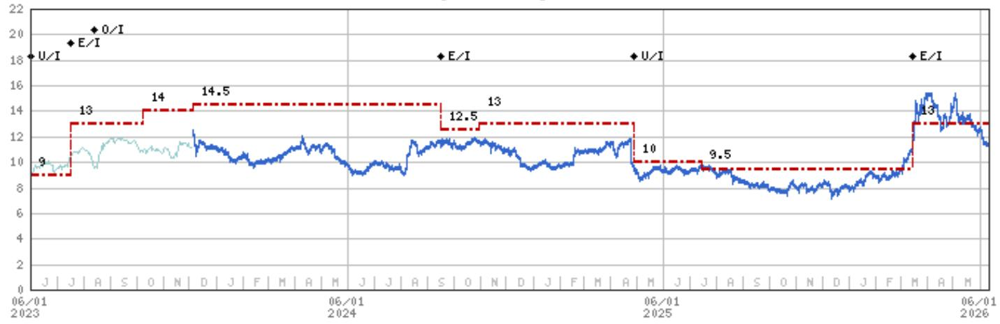

line chart

| Date       | Value |
| ---------- | ----- |
| 06/01 2023 | 9     |
| 06/01 2024 | 13    |
| 06/01 2025 | 14.5  |
| 06/01 2026 | 13    |
| 06/01 2027 | 12.5  |
| 06/01 2028 | 10    |
| 06/01 2029 | 9.5   |
| 06/01 2030 | 13    |

Stock Rating History: 6/1/21 : E/I; 10/18/21 : 0/I; 12/14/22 : E/I; 2/6/23 : U/I; 7/17/23 : E/I; 8/14/23 : 0/I; 9/17/24 : E/I;

4/28/25 : U/I; 3/16/26 : E/I

Price Target History: 1/12/21 : 9; 10/18/21 : 12; 12/14/21 : 11.5; 5/27/22 : 12.5; 8/3/22 : 11; 11/7/22 : 11.5; 12/14/22 : 10;

2/6/23 : 9; 7/17/23 : 13; 10/9/23 : 14; 12/5/23 : 14.5; 9/17/24 : 12.5; 10/31/24 : 13; 4/28/25 : 10; 7/15/25 : 9.5; 3/16/26 : 13

Source: MS

Date Format: MM/DD/YY

Price Target —

No Price Target Assigned (NA)

Stock Price (Not Covered by Current Analyst) — Stock Price (Covered by Current Analyst)

Stock and Industry Ratings (abbreviations below) appear as ♦ Stock Rating/Industry View

Stock Ratings: Overweight (O) Equal-weight (E) Underweight (U) Not-Rated (NR) No Rating Available (NA)

Industry View: Attractive (A) In-line (I) Cautious (C) No Rating (NR)

Effective January 13, 2014, the stocks covered by MS Asia Pacific will be rated relative to the analyst's industry (or industry team's) coverage.

Effective January 13, 2014, the industry view benchmarks for MS Asia Pacific are as follows: relevant MSCI country index or MSCI sub-regional index or MSCI AC Asia Pacific ex Japan Index.

Rumo SA (RAIL3.SA) - As of 06/11/26 GMT in BRL Industry : LatAm Agribusiness  
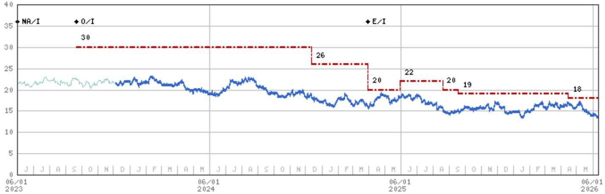

line chart

| Date       | Value |
| ---------- | ----- |
| 06/01 2023 | NA/I  |
| 06/01 2024 | 30    |
| 06/01 2025 | 26    |
| 06/01 2026 | 18    |

Stock Rating History: 6/1/21 : 0/I; 5/24/23 : NA/I; 9/21/23 : 0/I; 3/30/25 : E/I  
Price Target History: 3/7/21 : 24.5; 10/28/21 : 24; 11/19/21 : 25; 2/4/22 : 22; 8/19/22 : 25; 12/2/22 : 24; 5/24/23 : NA;  
9/21/23 : 30; 12/12/24 : 26; 3/30/25 : 20; 5/30/25 : 22; 8/19/25 : 20; 9/17/25 : 19; 4/15/26 : 18  
Source: MS Date Format : MM/DD/YY Price Target = No Price Target Assigned (NA)  
Stock Price (Not Covered by Current Analyst) — Stock Price (Covered by Current Analyst)  
Stock and Industry Ratings (abbreviations below) appear as ♦ Stock Rating/Industry View  
Stock Ratings: Overweight (O) Equal-weight (E) Underweight (U) Not-Rated (NR) No Rating Available (NA)  
Industry View: Attractive (A) In-line (I) Cautious (C) No Rating (NR)  
Effective January 13, 2014, the stocks covered by MS Asia Pacific will be rated relative to the analyst's industry (or industry team's) coverage.  
Effective January 13, 2014, the industry view benchmarks for MS Asia Pacific are as follows: relevant MSCI country index or MSCI sub-regional index or MSCI AC Asia Pacific ex Japan Index.

Sao Martinho SA (SMT03.SA) - As of 06/11/26 GMT in BRL Industry : LatAm Agribusiness  
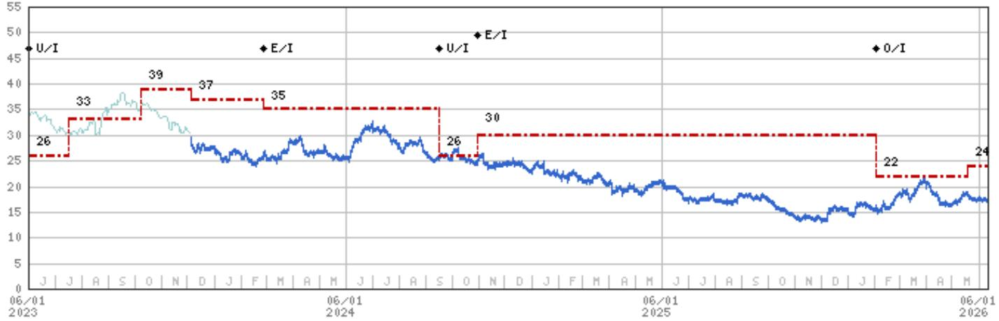

line chart

| Date       | Value |
| ---------- | ----- |
| 06/01 2023 | 26    |
| 06/01 2024 | 33    |
| 06/01 2024 | 39    |
| 06/01 2024 | 37    |
| 06/01 2024 | 35    |
| 06/01 2024 | 26    |
| 06/01 2024 | 30    |
| 06/01 2024 | 22    |
| 06/01 2024 | 24    |

Stock Rating History: 6/1/21 : E/I; 12/14/22 : U/I; 2/27/24 : E/I; 9/17/24 : U/I; 10/31/24 : E/I; 2/2/26 : O/I  
Price Target History: 3/28/21 : 31; 10/18/21 : 42; 5/27/22 : 48; 8/3/22 : 42; 12/14/22 : 26; 7/17/23 : 33; 10/9/23 : 39;  
12/5/23 : 37; 2/27/24 : 35; 9/17/24 : 26; 10/31/24 : 30; 2/2/26 : 22; 5/19/26 : 24  
Source: MS Date Format : MM/DD/YY Price Target = No Price Target Assigned (NA)  
Stock Price (Not Covered by Current Analyst) — Stock Price (Covered by Current Analyst)  
Stock and Industry Ratings (abbreviations below) appear as ♦ Stock Rating/Industry View  
Stock Ratings: Overweight (O) Equal-weight (E) Underweight (U) Not-Rated (NR) No Rating Available (NA)  
Industry View: Attractive (A) In-line (I) Cautious (C) No Rating (NR)  
Effective January 13, 2014, the stocks covered by MS Asia Pacific will be rated relative to the analyst's industry (or industry team's) coverage.  
Effective January 13, 2014, the industry view benchmarks for MS Asia Pacific are as follows: relevant MSCI country index or MSCI sub-regional index or MSCI AC Asia Pacific ex Japan Index.

SLC Agricola S.A. (SLCE3.SA) - As of 06/11/26 GMT in BRL Industry : LatAm Agribusiness  
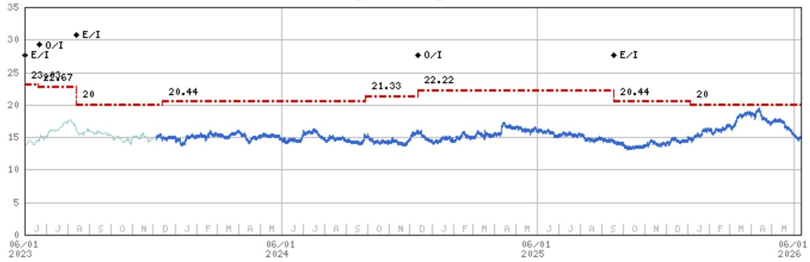

line chart

| Date       | Value  |
| ---------- | ------ |
| 06/01 2023 | 23.28  |
| 06/01 2024 | 27.67  |
| 06/01 2025 | 20.00  |
| 06/01 2026 | 20.44  |
| 06/01 2027 | 21.33  |
| 06/01 2028 | 22.22  |
| 06/01 2029 | 20.44  |
| 06/01 2030 | 20.00  |

Stock Rating History: 6/1/21 : NA/I; 6/22/21 : NA/I; 9/24/21 : U/I; 2/6/23 : E/I; 6/22/23 : 0/I; 8/14/23 : E/I; 12/12/24 : 0/I; 9/17/25 : E/I  
Price Target History: 5/24/21 : NA; 6/22/21 : NA; 9/24/21 : 13.59; 12/14/21 : 12.86; 8/3/22 : 15.76; 11/7/22 : 20.61; 2/6/23 : 23.03; 6/19/23 : 22.67; 8/14/23 : 20; 12/14/23 : 20.44; 9/29/24 : 21.33; 12/12/24 : 22.22; 9/17/25 : 20.44; 1/5/26 : 20  
Source: MS Date Format : MM/DD/YY Price Target = No Price Target Assigned (NA)  
Stock Price (Not Covered by Current Analyst) — Stock Price (Covered by Current Analyst)  
Stock and Industry Ratings (abbreviations below) appear as ♦ Stock Rating/Industry View  
Stock Ratings: Overweight (O) Equal-weight (E) Underweight (U) Not-Rated (NR) No Rating Available (NA)  
Industry View: Attractive (A) In-line (I) Cautious (C) No Rating (NR)  
Effective January 13, 2014, the stocks covered by MS Asia Pacific will be rated relative to the analyst's industry (or industry team's) coverage.  
Effective January 13, 2014, the industry view benchmarks for MS Asia Pacific are as follows: relevant MSCI country index or MSCI sub-regional index or MSCI AC Asia Pacific ex Japan Index.

## Important Disclosures for MS Smith Barney LLC Customers

Important disclosures regarding any material conflict of interest that can reasonably be expected to have influenced MS Smith Barney LLC's choice of a third-party research provider or the subject company of a third-party research report, are available on the MS Wealth Management disclosure website at www.morganstanley.com/online/researchdisclosures. For MS specific disclosures, you may refer to https://www.morganstanley.com/eqr/disclosures/webapp/generalresearch.

Each MS report is reviewed and approved on behalf of MS Smith Barney LLC. This review and approval is conducted by the same person who reviews the research report on behalf of MS. This could create a conflict of interest.

## Other Important Disclosures

MS policy is to update research reports as and when the Research Analyst and Research Management deem appropriate, based on developments with the issuer, the sector, or the market that may have a material impact on the research views or opinions stated therein. In addition, certain Research publications are intended to be updated on a regular periodic basis (weekly/monthly/quarterly/annual) and will ordinarily be updated with that frequency, unless the Research Analyst and Research Management determine that a different publication schedule is appropriate based on current conditions.

MS is not acting as a municipal advisor and the opinions or views contained herein are not intended to be, and do not constitute, advice within the meaning of Section 975 of the Dodd-Frank Wall Street Reform and Consumer Protection Act.

MS produces an equity research product called a "Tactical Idea." Views contained in a "Tactical Idea" on a particular stock may be contrary to the recommendations or views expressed in research on the same stock. This may be the result of differing time horizons, methodologies, market events, or other factors. For all research available on a particular stock, please contact your sales representative or go to Matrix at http://www.morganstanley.com/matrix.

MS is provided to our clients through our proprietary research portal on Matrix and also distributed electronically by MS to clients. Certain, but not all, MS products are also made available to clients through third-party vendors or redistributed to clients through alternate electronic means as a convenience. For access to all available MS, please contact your sales representative or go to Matrix at http://www.morganstanley.com/matrix.

Any access and/or use of MS is subject to MS's Terms of Use (http://www.morganstanley.com/terms.html). By accessing and/or using MS, you are indicating that you have read and agree to be bound by our Terms of Use (http://www.morganstanley.com/terms.html). In addition you consent to MS processing your personal data and using cookies in accordance with our Privacy Policy and our Global Cookies Policy (http://www.morganstanley.com/privacy\_pledge.html), including for the purposes of setting your preferences and to collect readership data so that we can deliver better and more personalized service and products to you. To find out more information about how MS processes personal data, how we use cookies and how to reject cookies see our Privacy Policy and our Global Cookies Policy (http://www.morganstanley.com/privacy\_pledge.html). Please use the provided link to review the Terms and Conditions and Most Important Terms and Conditions for MS India Company Private Limited (https://www.morganstanley.com/assets/pdfs/about-us-global-offices/india/Terms\_and\_conditions.pdf) and the following link to review the audit report (https://ny.matrix.ms.com/eqr/research/webapp/researchdocs/MSICPL\_Morgan\_Stanley\_Research\_Audit\_Report.pdf).

If you do not agree to our Terms of Use and/or if you do not wish to provide your consent to MS processing your personal data or using cookies please do not access our research. The recommendations of Julia Habermann; Julia Rizzo in this report reflect solely and exclusively the analyst's personal views and have been developed independently, including from the

institution for which the analyst works.

MS does not provide individually tailored investment advice. MS has been prepared without regard to the circumstances and objectives of those who receive it. MS recommends that investors independently evaluate particular investments and strategies, and encourages investors to seek the advice of a financial adviser. The appropriateness of an investment or strategy will depend on an investor's circumstances and objectives. The securities, instruments, or strategies discussed in MS may not be suitable for all investors, and certain investors may not be eligible to purchase or participate in some or all of them. MS is not an offer to buy or sell or the solicitation of an offer to buy or sell any security/instrument or to participate in any particular trading strategy. The value of and income from your investments may vary because of changes in interest rates, foreign exchange rates, default rates, prepayment rates, securities/instruments prices, market indexes, operational or financial conditions of companies or other factors. There may be time limitations on the exercise of options or other rights in securities/instruments transactions. Past performance is not necessarily a guide to future performance. Estimates of future performance are based on assumptions that may not be realized. If provided, and unless otherwise stated, the closing price on the cover page is that of the primary exchange for the subject company's securities/instruments.

The fixed income research analysts, strategists or economists principally responsible for the preparation of MS have received compensation based upon various factors, including quality, accuracy and value of research, firm profitability or revenues (which include fixed income trading and capital markets profitability or revenues), client feedback and competitive factors. Fixed Income Research analysts', strategists' or economists' compensation is not linked to investment banking or capital markets transactions performed by MS or the profitability or revenues of particular trading desks.

The "Important Regulatory Disclosures on Subject Companies" section in MS lists all companies mentioned where MS owns 1% or more of a class of common equity securities of the companies. For all other companies mentioned in MS, MS may have an investment of less than 1% in securities/instruments or derivatives of securities/instruments of companies and may trade them in ways different from those discussed in MS. Employees of MS not involved in the preparation of MS may have investments in securities/instruments or derivatives of securities/instruments of companies mentioned and may trade them in ways different from those discussed in MS. Derivatives may be issued by MS or associated persons.

With the exception of information regarding MS, MS is based on public information. MS makes every effort to use reliable, comprehensive information, but we make no representation that it is accurate or complete. We have no obligation to tell you when opinions or information in MS change apart from when we intend to discontinue equity research coverage of a subject company. Facts and views presented in MS have not been reviewed by, and may not reflect information known to, professionals in other MS business areas, including investment banking personnel.

MS personnel may participate in company events such as site visits and are generally prohibited from accepting payment by the company of associated expenses unless pre-approved by authorized members of Research management.

MS may make investment decisions that are inconsistent with the recommendations or views in this report.

To our readers based in Taiwan or trading in Taiwan securities/instruments: Information on securities/instruments that trade in Taiwan is distributed by MS Taiwan Limited ("MSTL"). Such information is for your reference only. The reader should independently evaluate the investment risks and is solely responsible for their investment decisions. MS may not be distributed to the public media or quoted or used by the public media without the express written consent of MS. Any non-customer reader within the scope of Article 7-1 of the Taiwan Stock Exchange Recommendation Regulations accessing and/or receiving MS is not permitted to provide MS to any third party (including but not limited to related parties, affiliated companies and any other third parties) or engage in any activities regarding MS which may create or give the appearance of creating a conflict of interest. Information on securities/instruments that do not trade in Taiwan is for informational purposes only and is not to be construed as a recommendation or a solicitation to trade in such securities/instruments. MSTL may not execute transactions for clients in these securities/instruments.

MS is not incorporated under PRC law and the research in relation to this report is conducted outside the PRC. MS does not constitute an offer to sell or the solicitation of an offer to buy any securities in the PRC. PRC investors shall have the relevant qualifications to invest in such securities and shall be responsible for obtaining all relevant approvals, licenses, verifications and/or registrations from the relevant governmental authorities themselves. Neither this report nor any part of it is intended as, or shall constitute, provision of any consultancy or advisory service of securities investment as defined under PRC law. Such information is provided for your reference only.

MS is disseminated in Brazil by MS C.T.V.M. S.A. located at Av. Brigadeiro Faria Lima, 3600, 6th floor, São Paulo - SP, Brazil; and is regulated by the Comissão de Valores Mobiliários; in Mexico by MS México, Casa de Bolsa, S.A. de C.V which is regulated by Comision Nacional Bancaria y de Valores. Paseo de los Tamarindos 90, Torre 1, Col. Bosques de las Lomas Floor 29, 05120 Mexico City; in Japan by MS MUFG Securities Co., Ltd. and, for Commodities related research reports only, MS Capital Group Japan Co., Ltd; in Hong Kong by MS Asia Limited (which accepts responsibility for its contents) and by MS Bank Asia Limited; in Singapore by MS Asia (Singapore) Pte. (Registration number 199206298Z) and/or MS Asia (Singapore) Securities Pte Ltd (Registration number 200008434H), regulated by the Monetary Authority of Singapore (which accepts legal responsibility for its contents and should be contacted with respect to any matters arising from, or in connection with, MS) and by MS Bank Asia Limited, Singapore Branch (Registration number T14FC0118J); in Australia to "wholesale clients" within the meaning of the Australian Corporations Act by MS Australia Limited A.B.N. 67 003 734 576, holder of Australian financial services license No. 233742, which accepts responsibility for its contents; in Australia to "wholesale clients" and "retail clients" within the meaning of the Australian Corporations Act by MS Wealth Management Australia Pty Ltd (A.B.N. 19 009 145 555, holder of Australian financial services license No. 240813, which accepts responsibility for its contents; in Korea by MS & Co International plc, Seoul Branch; in India by MS India Company Private Limited having Corporate Identification No (CIN) U22990MH1998PTC115305, regulated by the Securities and Exchange Board of India ("SEBI") and holder of licenses as a Research Analyst (SEBI Registration No. INH000001105); Stock Broker (SEBI Stock Broker Registration No. INZ000244438), Merchant Banker (SEBI Registration No. INM000011203), and depository participant with National Securities Depository Limited (SEBI Registration No. IN-DP-NSDL-567-2021) having registered office at Altimus, Level 39 & 40, Pandurang Budhkar Marg, Worli, Mumbai 400018, India; Telephone no. +91-22-61181000; Compliance Officer Details: Mr. Tejarshi Hardas, Tel. No.: +91-22-61181000 or Email: tejarshi.hardas@morganstanley.com; Grievance officer details: Mr. Tejarshi Hardas, Tel. No.: +91-22-61181000 or Email: msic-compliance@morganstanley.com. MS India Company Private Limited (MSICPL) may use AI tools in providing research services. All recommendations contained herein are made by the duly qualified research analysts; in Canada by MS Canada Limited; in Germany and the European Economic Area where required by MS Europe S.E., authorised and regulated by Bundesanstalt fuer Finanzdienstleistungsaufsicht (BaFin) under the reference number 149169; in the US by MS & Co. LLC, which accepts responsibility for its contents. MS & Co. International plc, authorized by the Prudential Regulation Authority and regulated by the Financial Conduct Authority and the Prudential Regulation Authority, disseminates in the UK research that it has prepared, and research which has been prepared by any of its affiliates, only to persons who (i) are investment professionals falling within Article 19(5) of the Financial Services and Markets Act 2000 (Financial Promotion) Order 2005 (as amended, the "Order"); (ii) are persons who are high net worth entities falling within Article 49(2)(a) to (d) of the Order; or (iii) are persons to whom an invitation or inducement to engage in investment activity (within the meaning of section 21 of the Financial Services and Markets Act 2000, as amended) may otherwise lawfully be communicated or caused to be communicated. RMB MS Proprietary Limited is a member of the JSE Limited and A2X (Pty) Ltd. RMB MS Proprietary Limited is a joint venture owned equally by MS International Holdings Inc. and RMB Investment Advisory (Proprietary) Limited, which is wholly owned by FirstRand Limited. The information in MS is being disseminated by MS Saudi Arabia, regulated by the Capital

Market Authority in the Kingdom of Saudi Arabia, and is directed at Sophisticated investors only.

The information in MS is being communicated by MS & Co. International plc (DIFC Branch), regulated by the Dubai Financial Services Authority (the DFSA) or by MS & Co. International plc (ADGM Branch), regulated by the Financial Services Regulatory Authority Abu Dhabi (the FSRA), and is directed at Professional Clients only, as defined by the DFSA or the FSRA, respectively. The financial products or financial services to which this research relates will only be made available to a customer who we are satisfied meets the regulatory criteria of a Professional Client. A distribution of the different MS Research ratings or recommendations, in percentage terms for Investments in each sector covered, is available upon request from your sales representative.

The information in MS is being communicated by MS & Co. International plc (QFC Branch), regulated by the Qatar Financial Centre Regulatory Authority (the QFCRA), and is directed at business customers and market counterparties only and is not intended for Retail Customers as defined by the QFCRA.

As required by the Capital Markets Board of Turkey, investment information, comments and recommendations stated here, are not within the scope of investment advisory activity. Investment advisory service is provided exclusively to persons based on their risk and income preferences by the authorized firms. Comments and recommendations stated here are general in nature. These opinions may not fit to your financial status, risk and return preferences. For this reason, to make an investment decision by relying solely to this information stated here may not bring about outcomes that fit your expectations.

The trademarks and service marks contained in MS are the property of their respective owners. Third-party data providers make no warranties or representations relating to the accuracy, completeness, or timeliness of the data they provide and shall not have liability for any damages relating to such data. The Global Industry Classification Standard (GICS) was developed by and is the exclusive property of MSCI and S&P.

MS, or any portion thereof may not be reprinted, sold or redistributed without the written consent of MS.

Indicators and trackers referenced in MS may not be used as, or treated as, a benchmark under Regulation EU 2016/1011, or any other similar framework.

The issuers and/or fixed income products recommended or discussed in certain fixed income research reports may not be continuously followed. Accordingly, investors should regard those fixed income research reports as providing stand-alone analysis and should not expect continuing analysis or additional reports relating to such issuers and/or individual fixed income products. MS may hold, from time to time, material financial and commercial interests regarding the company subject to the Research report.

Registration granted by SEBI and certification from the National Institute of Securities Markets (NISM) in no way guarantee performance of the intermediary or provide any assurance of returns to investors. Investment in securities market are subject to market risks. Read all the related documents carefully before investing.

INDUSTRY COVERAGE: LatAm Agribusiness

<table><tr><td>COMPANY (TICKER)</td><td>RATING (AS OF)</td><td>PRICE* (06/10/2026)</td></tr><tr><td colspan="3">Javier Martinez de Olcoz Cerdan</td></tr><tr><td>Sociedad Quimica y Minera de Chile S.A. (SQM.N)</td><td></td><td>US$80.44</td></tr><tr><td colspan="3">Julia Rizzo</td></tr><tr><td>ADECOAGRO S.A. (AGRO.N)</td><td>E (03/16/2026)</td><td>US$11.69</td></tr><tr><td>Rumo SA (RAIL3.SA)</td><td>E (03/30/2025)</td><td>R$13.30</td></tr><tr><td>Sao Martinho SA (SMTO3.SA)</td><td>O (02/02/2026)</td><td>R$16.90</td></tr><tr><td>SLC Agricola S.A. (SLCE3.SA)</td><td>E (09/17/2025)</td><td>R$14.89</td></tr></table>

Stock Ratings are subject to change. Please see latest research for each company.  
\* Historical prices are not split adjusted.

© 2026 MS