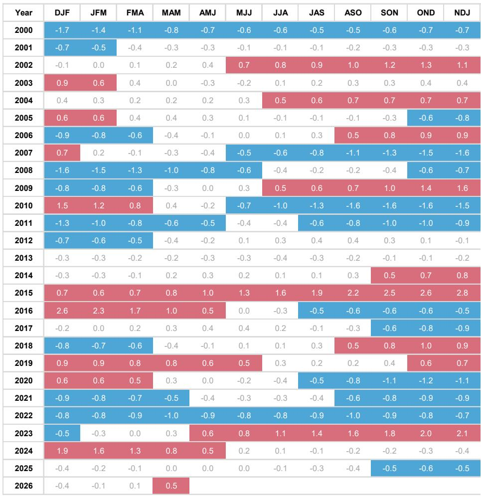
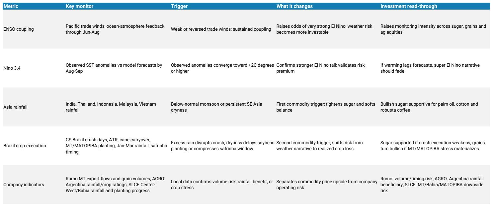
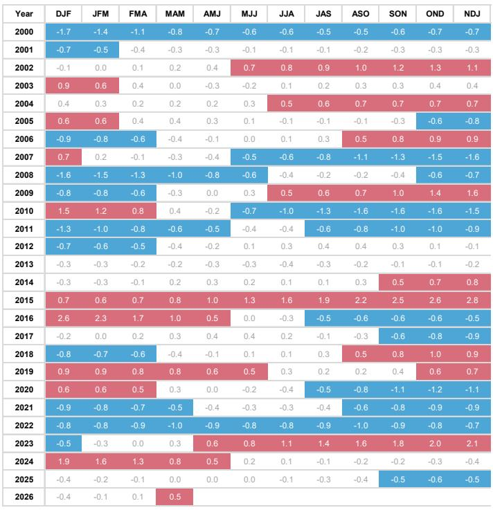

# A Super El Niño Is No Longer Tail Risk: It Is the New Base Case for Commodity and Equity Investors

The probability that the current El Niño evolves into a very strong event has jumped to 63 percent, up from 37 percent in the prior forecast window. This is not a marginal shift. It is a structural repricing of weather risk that demands immediate strategic attention from any investor with exposure to Latin American agribusiness, soft commodities, or emerging market equities.

NOAA has confirmed that Pacific Ocean surface temperatures have warmed sufficiently to trigger an atmospheric response. The ocean-atmosphere coupling that was still pending in prior months is now clearly present. Westerly low-level wind anomalies, a negative Southern Oscillation Index, and convection changes have all aligned. The question is no longer whether El Niño will form. It has formed. The question is whether it will intensify into one of the strongest events on record, and what that means for the specific crop windows, logistics corridors, and equity valuations that depend on predictable rainfall.

Three historical analogs dominate the discussion: 1982/83, 1997/98, and 2015/16. Each generated profound disruptions in agricultural supply chains, food inflation, and regional economic performance. But the current setup also carries echoes of the 2023/24 trajectory, which was more gradual in its intensification. The market is pricing El Niño probability. What it has not yet priced is the distribution of that probability across the specific crop calendars that matter most.

This article makes a single argument: the shift from a 37 percent to a 63 percent probability of a very strong event is not just a weather update. It is a portfolio signal. Investors who treat it as such will have time to position. Those who wait for confirmation from crop damage or price spikes will be late.

---

## Sugar and Palm Oil Have the Clearest Upside, But the Timing Requires Precision

Not all commodities respond to El Niño in the same way. The report's analysis makes clear that soft commodities, particularly sugar and palm oil, have the most direct and historically reliable upside exposure. The mechanism is straightforward: El Niño typically induces drought conditions in key producing regions of Asia, including India and Southeast Asia, which constrains supply. India is the world's second-largest sugar producer, and any disruption to its monsoon season has immediate global price implications.

The report's analog framework points to tighter sugar and palm supply as the highest-conviction outcome. Coffee dynamics are more mixed and path-dependent, depending on the precise timing and location of rainfall anomalies. But for sugar, the signal is unambiguous. The report identifies sugar as the most sensitive commodity to El Niño effects, with potential drought in Asia creating supply tightness that would manifest primarily in the 2027/28 crop year.

The critical nuance, however, is timing. In the short term, sugar prices may remain pressured by ample supply from the ongoing Brazilian harvest. The bullish case for sugar is not immediate. It is a forward curve trade. Investors need to distinguish between current spot market dynamics and the forward supply risk that builds as the El Niño event matures. The report's implication is clear: the sugar trade is about patience and curve positioning, not about chasing a spot rally.

Palm oil follows a similar logic. El Niño-driven dryness in Southeast Asia reduces yield potential with a lag. The supply response is not instantaneous. It compounds over multiple quarters. Investors who understand this lag structure can position ahead of the consensus, which tends to react only after visible supply data deteriorates.

---

## Grains Are a Conditional Trade: Soybeans and Corn Depend on Which Hemisphere Gets Hit

Grains present a more complex picture. The report does not offer a single directional call on soybeans or corn. Instead, it provides a conditional framework that depends on the geographic distribution of rainfall anomalies.

For soybeans, the report identifies a clear asymmetry within Brazil. In the 2026/27 season, Mato Grosso and the MATOPIBA region carry downside risk from excess rainfall that could delay planting and reduce yields. But Rio Grande do Sul and Argentina often benefit from improved rainfall during El Niño events. The net effect on global soybean prices depends on which effect dominates. If the southern Brazil and Argentina benefit outweighs the central Brazil disruption, prices could actually decline. If the disruption in Mato Grosso is severe enough to offset southern gains, prices rise.

This is not a binary trade. It is a relative value trade between different regional production estimates. The report's framework suggests that investors should monitor Mato Grosso and MATOPIBA rainfall, planting pace, and the safrinha setup as the key leading indicators. The market will not wait for harvest data. It will react to planting delays and satellite vegetation indices.

Corn is even more conditional. The report describes it as a timing trade on two distinct risks: Brazil's safrinha (second corn harvest), which accounts for approximately 80 percent of national production, and potential summer stress in the United States. The safrinha window is particularly vulnerable because it follows the soybean harvest. Any delay in soybean planting pushes the safrinha planting window later, increasing the risk that it encounters dry conditions during its critical pollination phase.

The report's analysis suggests that the corn trade is not about a single directional bet. It is about monitoring the inter-crop calendar and positioning for the compression of planting windows. Investors who understand the sequential dependency between soybean and corn planting in Brazil will have an edge over those who treat corn as an independent variable.

---

## Equity Implications Are Highly Differentiated: Sugar and Argentina Exposure Benefit, Logistics and Selective Grains Face Headwinds

The report translates its commodity analysis into specific equity implications, and the differentiation is striking. Not all Latin American agribusiness equities respond to El Niño in the same direction.

The clearest beneficiaries are sugar-focused companies. The report identifies São Martinho as a possible beneficiary, driven by higher sugar prices. The logic is direct: if El Niño tightens global sugar supply, integrated sugar and ethanol producers with Brazilian operations stand to capture the price upside. The report's rating on São Martinho reflects this constructive view.

Adecoagro also emerges as a potential beneficiary, but for a different reason. Adecoagro has significant exposure to Argentina, and El Niño typically brings improved rainfall to Argentine agricultural regions. For a company that has faced drought-related headwinds in recent years, improved moisture conditions could drive a meaningful operational recovery. The report's framework suggests that Adecoagro's Argentina exposure is a differentiating factor that investors should weigh positively.

On the other side of the trade, the report identifies higher risks for Rumo and SLC Agrícola. Rumo is Brazil's largest logistics operator focused on agricultural exports. Its volumes depend on the flow of grain from Mato Grosso and MATOPIBA to ports. If El Niño disrupts planting and reduces harvest volumes, or if excess rainfall damages rail and road infrastructure, Rumo's throughput could decline. The report's analysis suggests that Rumo investors should closely monitor Mato Grosso and MATOPIBA rainfall and the safrinha setup as leading indicators of volume risk.

SLC Agrícola, a large-scale grain producer, faces weather risk directly. The report describes it as a weather-risk factor. If El Niño disrupts its core production regions, the impact on earnings could be material. The report's conditional framework suggests that SLC's risk profile is asymmetric: the downside from adverse weather is larger than the upside from favorable conditions, given the company's geographic concentration.

The key insight is that El Niño creates winners and losers within the same sector. A portfolio that is long sugar and Argentina-exposed equities and short logistics and central Brazil grain producers would be expressing a coherent El Niño view. A portfolio that treats all Latin American agribusiness equities as a single trade would be missing the most important differentiation.

---

## What the Report Does Not Fully Answer: The Interaction Between El Niño and Structural Inflation

The report provides a rigorous framework for commodity and equity implications. But it leaves one critical question open: how does a very strong El Niño interact with the current structural inflation backdrop?

The report notes that El Niño adds to already elevated food inflation, driven by supply constraints and tariff dynamics. It projects upward pressure on grocery prices into 2027. But it does not fully explore the second-order implications for monetary policy, interest rates, and currency markets.

If El Niño drives food inflation higher at a time when central banks are already struggling to bring headline inflation back to target, the policy response could be more aggressive than current market pricing suggests. Higher interest rates would strengthen currencies in net commodity-exporting economies, creating a headwind for exporters whose revenues are in dollars but costs are in local currency. Conversely, higher food inflation in net-importing economies could weaken currencies and exacerbate fiscal pressures.

The report also does not fully address the potential for El Niño to disrupt the Panama Canal, which it identifies as a tail risk to trade flows and freight costs. If water constraints force further reductions in canal transit capacity, the impact on global shipping costs and trade routes could be significant. The report flags this risk but does not quantify it or integrate it into the commodity price forecasts.

These open questions are not weaknesses in the analysis. They are invitations for further research. Investors who can build on the report's framework and develop their own views on the inflation-policy-currency nexus will have an additional layer of analytical advantage.

---

## A Decision Framework for Investors: Three Questions to Determine Your Exposure

The report's analysis can be distilled into a practical decision framework. Every investor with exposure to Latin American agribusiness should ask three questions:

First, what is your time horizon? The commodity implications of El Niño are not simultaneous. Sugar risk builds into 2027/28. Soybean and corn risk is concentrated in the 2026/27 planting and harvest windows. Equity implications depend on the timing of operational impacts. A short-term trader should focus on different signals than a long-term allocator.

Second, what is your geographic exposure? El Niño creates winners and losers by region. Mato Grosso and MATOPIBA face downside risk. Rio Grande do Sul and Argentina face potential upside. Southeast Asia faces drought risk. The United States faces summer stress risk. Your portfolio's geographic footprint determines which risks and opportunities are most relevant.

Third, what is your instrument? Commodities, equities, currencies, and fixed income all respond to El Niño, but through different channels and with different timing. A sugar futures position expresses a different view than an equity position in a sugar producer. A long position in the Brazilian real expresses a different view than a long position in Argentine government bonds. The report provides a framework for thinking about commodity and equity implications. Investors need to extend that framework to the instruments they actually trade.

These three questions time horizon, geography, and instrument provide a structured approach to integrating El Niño risk into portfolio construction. Investors who can answer them with precision will be better positioned than those who rely on generic directional views.

---

## The Window for Positioning Is Open, But It Will Not Stay Open Indefinitely

The report makes clear that the current El Niño event is still in its early stages. Forecasters broadly expect conditions to worsen materially through late 2026. But the spring predictability barrier means that confidence in the exact trajectory remains limited. The report's own analysis cautions that confidence declines further out the curve.

This creates a strategic window. The market has recognized the elevated probability of a very strong event, but it has not yet fully priced the specific crop-window implications. Sugar futures may not yet reflect the full extent of the 2027/28 supply risk. Brazilian grain equities may not yet reflect the asymmetric downside from planting delays. Logistics stocks may not yet reflect the volume risk from disrupted harvests.

The window will close as the event matures and the impacts become visible. By the time sugar supply data deteriorates or grain planting delays are confirmed, the market will have repriced. The opportunity is in the gap between the probability shift that has already occurred and the specific impacts that have not yet been recognized.

Join the community to read the full report and review the original charts.

*This article is for learning and discussion only and does not constitute investment advice.*

Personal reading notes and learning share only. Not investment advice.

