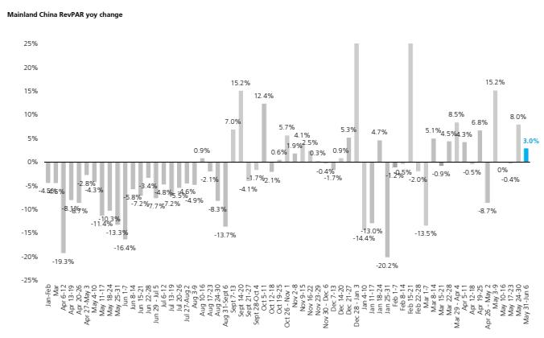
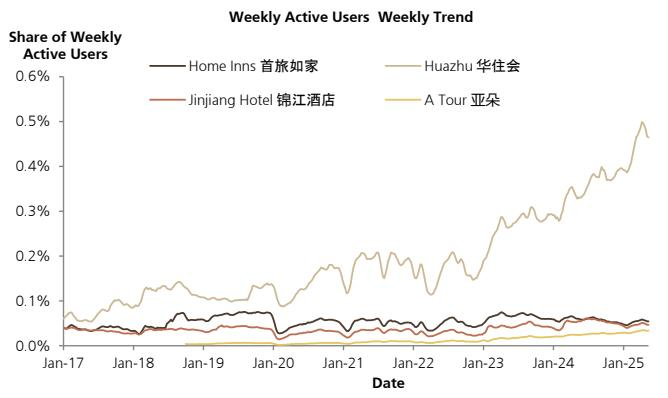

# China’s Travel Market Is Splitting in Two: The Strategic Divergence Between Premium and Mass Segments Has Begun

The latest weekly data from China’s hotel and airline markets reveals something far more consequential than a simple recovery snapshot. During the week of May 31 to June 6, mainland China hotel RevPAR grew 3% year-on-year, while domestic airfares surged 23% — yet passenger traffic dropped 13%. These headline numbers, taken together, tell a story of a market that is no longer recovering uniformly. It is fracturing along lines of income, purpose of travel, and pricing power. The critical insight for investors is this: the midscale and upper-midscale hotel segments, which form the backbone of domestic business and leisure travel, are now actively cutting Average Daily Rate (ADR) to prop up occupancy. This is not a blip. It represents a structural shift in pricing strategy that began in the second quarter, and it signals that demand elasticity in these segments is far higher than many models assumed.

The luxury and upscale segments, by contrast, are showing resilience. Their RevPAR growth of 3.5% and 3.1% respectively, driven by limited incremental supply and rising inbound travel, suggests that premium travelers are behaving differently. They are less price-sensitive and more responsive to quality and experience. The implication is clear: the Chinese travel market is bifurcating. Companies that rely on volume-driven, price-sensitive demand in the middle of the market face a fundamentally different competitive environment than those serving the premium end. Investors need to understand which side of this divide their portfolio holdings sit on, because the strategic requirements for success are diverging rapidly.

This is not merely a cyclical observation. The data from STR and Flight Master, analyzed through the lens of a major global investment bank, points to a real-time rebalancing of supply and demand dynamics. Hotel groups in the midscale and upper-midscale segments have shifted from a first-quarter strategy of maintaining ADR to a second-quarter strategy of sacrificing rate for occupancy. This is a rational response to changing market conditions, but it carries second-order implications for margins, brand positioning, and competitive dynamics that extend well beyond the current quarter.

## Midscale and Upper-Midscale Hotel Operators Are Making a Strategic Trade-Off: They Are Sacrificing Rate to Defend Volume, and That Changes the Profit Equation

The most telling data point in the report is not the aggregate RevPAR figure. It is the decomposition by segment. The midscale segment saw RevPAR decline 3.4% year-on-year, while the upper-midscale segment managed only 2.6% growth. Compare this to the prior week, and the deceleration is evident. But the real story lies beneath the top line. STR data reveals that in both segments, the improvement in RevPAR — such as it is — has been achieved by lowering ADR to boost occupancy. This is a deliberate strategic pivot. In the first quarter, hotel operators were more focused on maintaining pricing power. Now, they are prioritizing filling rooms.

This trade-off has direct implications for profitability. A hotel’s operating leverage works in two directions: high occupancy spreads fixed costs across more rooms, but lower ADR compresses contribution margin per room. The net effect on EBITDA depends on the elasticity of demand. The data suggests that in the current environment, demand is elastic enough that a cut in ADR generates a meaningful occupancy lift, but not elastic enough to fully offset the rate decline. The result is that RevPAR growth, when it occurs, comes at the expense of margin quality.

For investors, this means that top-line RevPAR growth in the midscale and upper-midscale segments is a less reliable signal of underlying business health than it was a year ago. Two hotels can report the same RevPAR growth, but one achieves it through rate and the other through occupancy. The former generates higher incremental profit; the latter does not. The current data suggests that the midscale segment is firmly in the latter camp. The upper-midscale segment is partially there as well, though its absolute RevPAR growth is positive.

The strategic question is whether this price-cutting behavior is temporary or structural. If it is a short-term response to a soft patch in demand, then margins should recover as the cycle turns. But if it reflects a permanent shift in consumer behavior — where midscale travelers have become more price-sensitive due to economic uncertainty or changed spending priorities — then the industry may need to reset its cost structures and brand value propositions. The report does not answer this question definitively, but the data from the airline side provides a useful cross-check.

## Air Travel Data Confirms a Demand Elasticity Problem: A 23% Fare Increase Crushes Passenger Volume by 13%, Revealing the Fragility of Mass-Market Pricing Power

The airline data from Flight Master is arguably more revealing than the hotel data, because it isolates the price-demand relationship with greater clarity. Domestic airfares rose 23% year-on-year during the week of June 1-7. The response from passengers was unambiguous: traffic fell 13% year-on-year, a sharp acceleration from the 7% decline in the prior week. Revenue growth slowed to just 7%, down from 18% the week before. This is a textbook demonstration of elastic demand. When prices rise, volume drops disproportionately.

The implication for the broader travel ecosystem is significant. Airlines and hotels serve overlapping customer bases, especially in the business and leisure travel segments that rely on midscale accommodations. If air travelers are this sensitive to price increases, it is reasonable to assume that hotel guests in the same income brackets are similarly sensitive. The hotel data showing ADR cuts in the midscale segment is therefore not an isolated phenomenon. It is a consistent response to the same underlying demand environment.

There is also a potential substitution effect at work. When airfares rise, some travelers may choose to shorten trips, cancel non-essential travel, or shift to closer destinations that do not require flying. This would reduce demand for hotels in destinations that are primarily served by air travel, while potentially boosting demand for hotels in drive-to locations. The report does not break down hotel performance by geography, but this is a logical second-order implication worth monitoring. Hotel operators with a higher proportion of drive-to properties may be relatively insulated from the airfare shock, while those dependent on air-served destinations may face additional headwinds.

The airline data also raises a question about capacity discipline. If airlines are raising fares by 23% year-on-year, they are presumably operating with relatively tight capacity. But the demand response suggests that they may have overestimated the market’s willingness to pay. This is a classic pricing error in a demand-elastic environment. The risk for airlines is that they will be forced to reverse course and cut fares to restore volume, which would compress margins. The hotel industry, by contrast, appears to have already learned this lesson: midscale operators are cutting rates proactively rather than waiting for demand to collapse.

## Luxury and Upscale Hotels Are Operating in a Different Economy: Limited Supply Growth and Inbound Travel Create a Protective Moat

The contrast with the luxury and upscale segments could not be starker. Luxury-upper upscale hotels posted RevPAR growth of 3.5%, and upscale hotels posted 3.1%. These segments are not cutting ADR to fill rooms. In fact, ADR in the luxury-upper upscale segment was roughly flat, while occupancy improved by 2.0 percentage points. The upscale segment saw ADR decline modestly, but occupancy jumped by 3.0 percentage points, more than offsetting the rate softness. The result is genuine, margin-accretive RevPAR growth.

The report identifies two drivers for this divergence. First, incremental supply in the high-end and luxury segment has been relatively limited. This is a structural advantage. When new supply is constrained, existing operators have more pricing power and face less competitive pressure to cut rates. Second, inbound travel is increasing, and international travelers tend to favor premium accommodations. This is a demand-side tailwind that is largely absent from the midscale segment, which relies more heavily on domestic business and leisure travel.

The implication for investors is that luxury and upscale hotel operators are playing a different game. Their competitive dynamics are driven by supply constraints and inbound demand, not by price-sensitive domestic consumers. This makes them less vulnerable to the macroeconomic uncertainties that are weighing on the mass market. It also means that their valuation multiples should be assessed against a different set of comparables. A luxury hotel operator trading at a premium to a midscale operator may be justified if the former’s earnings are structurally more resilient.

However, there is a caveat. The luxury segment’s advantage is partly a function of supply discipline, and that discipline could break if developers see the current returns and rush to build new properties. The report does not provide data on the pipeline of new luxury hotel projects, but this is a critical variable to watch. If supply growth accelerates, the pricing power differential between luxury and midscale could narrow.

## What the Report Does Not Fully Answer: The Sustainability of the Midscale Pricing Strategy and the Role of Corporate Travel Demand

For all its insight, the report leaves several important questions open. The most pressing is whether the midscale segment’s strategy of cutting ADR to boost occupancy is sustainable. If it works — if occupancy rises enough to offset the rate cuts and generate acceptable margins — then it may become a permanent feature of the competitive landscape. But if it fails to restore profitability, the industry may face a wave of margin compression and consolidation.

A second open question concerns the composition of demand. The report notes that the shift in strategy began in the second quarter, suggesting that hotel groups are responding to changes in both business trip and leisure travel markets. But it does not break down demand by purpose of travel. Are business travelers returning to the road, or are they still relying on virtual meetings? Are leisure travelers trading down from upper-midscale to economy? The answers to these questions would significantly affect the outlook for each segment.

A third question is about the role of corporate travel budgets. If companies are tightening travel policies in response to economic uncertainty, that would disproportionately impact midscale and upper-midscale hotels, which cater to corporate travelers on standard budgets. Luxury hotels, by contrast, may be more insulated because their corporate clients tend to be senior executives with less constrained budgets. The report does not address corporate travel trends directly, but the data pattern is consistent with a corporate travel slowdown.

Finally, there is the question of how long the inbound travel boost to luxury hotels will last. Inbound travel is recovering from a low base, but its trajectory depends on visa policies, international relations, and global economic conditions. If inbound growth slows, luxury hotels may lose their demand tailwind and face the same elastic demand dynamics that are now pressuring the midscale segment.

## A Decision Framework for Investors: How to Assess Hotel and Airline Exposure in a Bifurcated Market

Given the evidence of market bifurcation, investors need a structured way to evaluate their exposure to Chinese travel and lodging companies. The following framework is designed to help distinguish between companies that are structurally advantaged and those that are cyclically vulnerable.

First, assess the segment mix. Companies with a high proportion of luxury and upscale properties are likely to benefit from supply constraints and inbound demand. Companies concentrated in midscale and upper-midscale are more exposed to domestic demand elasticity and pricing pressure. The ideal portfolio would overweight the former and underweight the latter, unless valuations already reflect the risk.

Second, evaluate pricing strategy. For midscale operators, the key question is whether they are cutting ADR defensively or strategically. Defensive cuts signal that demand is weaker than expected and that margins will compress. Strategic cuts, if accompanied by cost restructuring or brand repositioning, could be a prelude to market share gains. The report’s data suggests the cuts are defensive, but investors should look for evidence of cost actions in company disclosures.

Third, monitor supply dynamics. The luxury segment’s advantage depends on limited new supply. Investors should track hotel construction pipelines, zoning approvals, and developer sentiment. If luxury supply accelerates, the premium segment’s relative resilience will erode. Conversely, if midscale supply growth slows, the pricing pressure in that segment may ease.

Fourth, watch the airline data as a leading indicator. The 23% fare increase and 13% traffic decline is a stark signal of demand elasticity. If airlines reverse course and cut fares, that would be a positive for hotel demand, especially in midscale segments that overlap with air travel. If they hold fares and accept lower volume, it suggests that demand is structurally weaker than expected.

Fifth, consider the margin trajectory. RevPAR growth is not enough. Investors should look at EBITDA margins and unit-level economics. A hotel that grows RevPAR by cutting ADR will show lower margins than one that grows through rate increases. The market may not immediately distinguish between the two, but the divergence will become apparent in earnings reports.

## The Full Report Contains the Charts and Data That Make This Analysis Actionable

The data and insights discussed here are drawn from a detailed weekly report produced by a global investment bank’s research team. The original report includes charts on RevPAR trends by segment, ADR and occupancy decomposition, domestic airfare and passenger traffic dynamics, and hotel booking app usage trends. These visuals are essential for investors who want to track the divergence in real time and calibrate their positions accordingly.

Join the community to read the full report and review the original charts.

*This article is for learning and discussion only and does not constitute investment advice.*

Personal reading notes and learning share only. Not investment advice.

