# Greater China Technology Hardware | Asia Pacific

# Optics Drives the Board: PCB Beneficiaries of the AI Interconnect Build-out

Although incumbent suppliers, including Unimicron and Shennan Circuits, will likely benefit from the growth in transceiver PCB demand and content expansion, we view ZDT as the most compelling beneficiary, given its potential to capture meaningful share as the industry transitions to higher speeds.

The AI investment cycle is entering a new phase in which optical connectivity is becoming as critical as compute. As hyperscalers scale AI clusters from tens of thousands to hundreds of thousands of GPUs, the number of optical transceivers required to connect these systems is growing rapidly. While investors have largely focused on beneficiaries such as GPUs, networking chips, and optical module vendors, we believe there are also opportunities further down the supply chain: printed circuit board (PCB) manufacturers. These companies provide a differentiated way to participate in the secular growth of AI infrastructure spend.

The opportunity is not solely driven by unit growth; content is also rising. As the industry migrates from 400G to 800G and eventually 1.6T optical transceivers, PCB complexity is increasing materially. Higher layer counts (10L to 16L), higher grade CCL (M6 to M8), and the adoption of advanced manufacturing technologies (HDI to mSAP) are driving a step-function increase in PCB content per module (US\$10 to US \$25). As a result, we expect the optical transceiver PCB market to grow substantially faster (83% CAGR) than underlying transceiver shipments (60% CAGR) from CY25-28. We are forecasting AI transceiver PCB TAM growing from \~US \$620M in CY25 to \~US\$3,773M by CY28, and this content-driven growth should also translate into improved profitability and expanding returns for suppliers with the requisite technological capabilities.

ZDT is best positioned to capture share: We expect incumbent leaders to benefit from both volume and content growth; however, we believe the most attractive investment opportunity is Zhen Ding (ZDT). The transition to 1.6T and beyond is raising qualification barriers and increasing the importance of advanced manufacturing know-how, particularly in mSAP processes. As the market expands and customers seek additional qualified suppliers, companies with proven high-end PCB capabilities are positioned to capture disproportionate growth. In our view, this combination of secular AI demand, rising content intensity, and market share gains creates a compelling angle for ZDT, hence we raise our PT to NT\$666, implying 20x CY28 P/E (0.5x PEG). We reiterate our OW on Unimicron, with a raised PT of NT \$1,285, implying 25x CY28 P/E (0.25x PEG), but stay EW on Shennan with a raised PT of Rmb400, implying 25x CY28 P/E (0.6x PEG). We prefer ZDT (15x CY28 P/E) and Unimicron (17x CY28 P/E) but are EW Shennan (25x CY28 P/E) on valuation.

MS TAIWAN LIMITED+

## Howard Kao

Equity Analyst

Howard.Kao@morganstanley.com +886 2 2730-2989

## Irene Yen

Research Associate

Irene.Yen@morganstanley.com +886 2 2730-2869

## Sharon Shih

Equity Analyst

Sharon.Shih@morganstanley.com +886 2 2730-2865

## Asia Summer School 2026

## GREATER CHINA TECHNOLOGY HARDWARE

## Asia Pacific

Industry View

In-Line

Exhibit 1: What's changed?

<table><tr><td rowspan="2">Company</td><td rowspan="2">Ticker</td><td colspan="2">Rating</td><td colspan="2">PT</td><td rowspan="2">Last close</td><td rowspan="2">Upside (%)</td><td colspan="3">EPS change (%)</td><td colspan="3">PEG</td></tr><tr><td>New</td><td>Old</td><td>New</td><td>Old</td><td>26e</td><td>27e</td><td>28e</td><td>26e</td><td>27e</td><td>28e</td></tr><tr><td>Unimicron</td><td>3037.TW</td><td>OW</td><td>OW</td><td>1,285.0</td><td>1,225.0</td><td>884.0</td><td>45%</td><td>2%</td><td>5%</td><td>4%</td><td>0.63</td><td>0.45</td><td>0.25</td></tr><tr><td>Zhen Ding</td><td>4958.TW</td><td>OW</td><td>OW</td><td>660.0</td><td>570.0</td><td>502.0</td><td>31%</td><td>5%</td><td>15%</td><td>17%</td><td>0.42</td><td>0.40</td><td>0.52</td></tr><tr><td>Shennan Circuits</td><td>002916.SZ</td><td>EW</td><td>EW</td><td>400.0</td><td>320.0</td><td>383.1</td><td>4%</td><td>9%</td><td>17%</td><td>24%</td><td>1.21</td><td>0.63</td><td>0.63</td></tr></table>

Source: Bloomberg, MS estimates. Pricing as of the close on June 10, 2026.

MS does and seeks to do business with companies covered in MS. As a result, investors should be aware that the firm may have a conflict of interest that could affect the objectivity of MS. Investors should consider MS as only a single factor in making their investment decision.

## For analyst certification and other important disclosures, refer to the Disclosure Section, located at the end of this report.

+= Analysts employed by non-U.S. affiliates are not registered with FINRA, may not be associated persons of the member and may not be subject to FINRA restrictions on communications with a subject company, public appearances and trading securities held by a research analyst account.

## Contextualizing the AI Transceiver PCB Opportunity

To put the opportunity into perspective, we forecast the global AI transceiver PCB TAM to expand from approximately US\$620mn in CY25 to \~US\$3.8bn by CY28. For comparison, we estimate that Apple (covered by Erik Woodring) – currently the world's largest consumer of HDI PCBs – accounts for roughly US\$3.0-3.5B of annual HDI PCB demand. On our estimates, the AI transceiver PCB market will grow from a niche, sub-US \$1B segment today to a market comparable in size to Apple's HDI PCB demand by CY27, before surpassing it by CY28.

The significance of this comparison extends beyond the absolute market size. For years, Apple has been the primary driver of technology advancement, capacity investment, and profitability within the HDI PCB industry. We believe AI optical connectivity is emerging as the next major demand engine, creating a new growth vector for PCB suppliers and potentially reshaping the industry's competitive landscape.

Given the pace of market expansion, increasing technology requirements, and improving economics associated with next-generation transceiver PCBs, we believe AI transceiver PCBs are rapidly evolving into one of the most compelling structural growth opportunities within the global PCB sector.

Viewed from another angle, Prismark estimates the global HDI PCB market at approximately US\$16.2bn. Based on our forecast of a \~US\$3.8bn AI transceiver PCB market by CY28, AI optical connectivity alone could generate incremental demand equivalent to roughly 23% of the current global HDI market, underscoring the significance of this emerging growth driver for the PCB industry

In February 2026, our global team highlighted that the AI transceiver market is entering an 'exponential' growth phase, driven by scale-out, scale-up and even scale-across in AI datacenters (report link: AI Transceivers: Growth Dominates Disruption).

While CPO (co-packaged optics) remains a fundamental architectural shift and a legitimate long-term risk to pluggable transceivers, the impact on transceivers vendors and their supply chains is limited in the medium term, as large-scale adoption of CPO is unlikely before 2027-28, considering its manufacturing yield, thermal complexity, cost, ecosystem, and serviceability. Thus, our global team expects AI transceiver growth to dominate the disruption from CPO in the medium term, and that transceivers and CPO will coexist through the 3.2T transition expected in CY28.

Our Global team expects strong optical transceiver volumes in CY26-28: In May 2026, our global team raised (link) its CY26-28 AI transceiver shipments forecast from 53 / 71 / 80mn units to 73 / 141 / 158 M units, respectively, within which 29 / 79 / 87M are 1.6T optical transceivers, with 8mn 3.2T optical transceivers expected in CY28 (Exhibit 1). This translates into a \~99% CAGR over CY25-28, creating a significant surge in demand for supply chain capacity. This signal a robust growth prospect not only for the optical transceivers vendors but also for the entire supply chain, including the PCB manufacturers. This is because within each optical transceiver module, there is 1 PCB, so it is a one-for-one opportunity for PCB manufacturers.

Exhibit 2: Our Global team raised forecasts for 800G and 1.6T optical transceiver shipments

<table><tr><td colspan="4">(mn units)</td></tr><tr><td>New Estimates</td><td>2026E</td><td>2027E</td><td>2028E</td></tr><tr><td>800G</td><td>44</td><td>63</td><td>64</td></tr><tr><td>1.6T</td><td>29</td><td>79</td><td>87</td></tr><tr><td>3.2T</td><td>0</td><td>0</td><td>8</td></tr><tr><td>Total</td><td>73</td><td>141</td><td>158</td></tr><tr><td>Previous Estimates</td><td>2026E</td><td>2027E</td><td>2028E</td></tr><tr><td>800G</td><td>34</td><td>48</td><td>54</td></tr><tr><td>1.6T</td><td>19</td><td>24</td><td>27</td></tr><tr><td>3.2T</td><td>0</td><td>0</td><td>5</td></tr><tr><td>Total</td><td>53</td><td>71</td><td>85</td></tr><tr><td>Pct. of change</td><td>2026E</td><td>2027E</td><td>2028E</td></tr><tr><td>800G</td><td>29%</td><td>31%</td><td>19%</td></tr><tr><td>1.6T</td><td>52%</td><td>233%</td><td>226%</td></tr><tr><td>3.2T</td><td>--</td><td>--</td><td>60%</td></tr><tr><td>Total</td><td>38%</td><td>98%</td><td>86%</td></tr></table>

Source: Company data, MS estimates.

Exhibit 3: Our Global team estimates AI optical transceivers growing at \~60% CAGR from 2025-28E  
We estimate AI transceivers growing at 60% CAGR from 2025-28E  
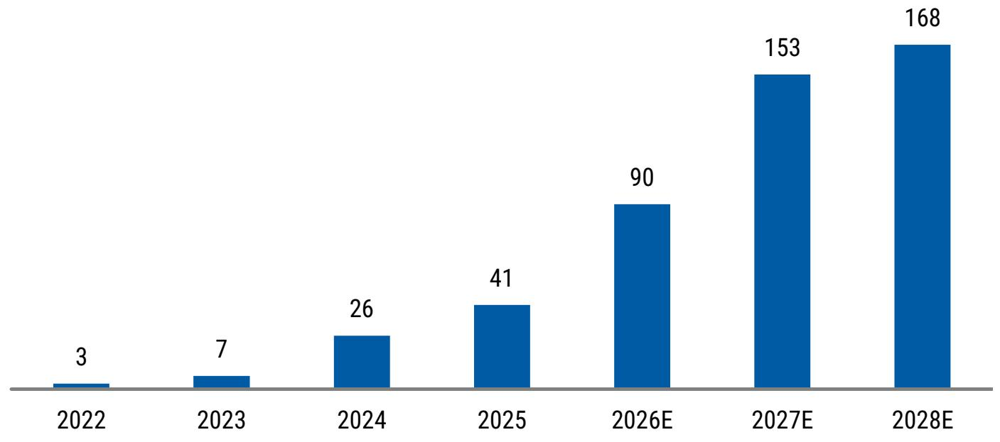

bar chart

| Year | Value |
| :--- | :--- |
| 2022 | 3 |
| 2023 | 7 |
| 2024 | 26 |
| 2025 | 41 |
| 2026E | 90 |
| 2027E | 153 |
| 2028E | 168 |

Source: MS estimates.

## Aside from volume growth, optical transceiver PCB is also seeing content growth...

Our industry checks suggest optical transceiver PCBs will see content growth mainly coming from three aspects.

1. Upgrades in CCL material (M6 to M8): The migration from 400G to 800G and 1.6T transceivers is driving increased adoption of higher-specification CCL materials. Whereas 400G modules generally utilized M6-grade CCL, next-generation transceivers increasingly require M7- or M8-grade CCL to meet more demanding signal integrity requirements, supporting higher PCB ASPs.  
2. Increased layer count (10L to 16L): Increasing PCB layer counts represent another tailwind for ASP growth. Layer requirements rise from 10–12 layers in 400G transceivers to 12-14 layers in 800G and 14-16 layers in 1.6T modules, reflecting greater design complexity and supporting higher PCB ASPs.  
3. More complex manufacturing process (HDI to mSAP): The adoption of more advanced fabrication technologies is another driver of PCB ASP expansion. While 400G transceivers typically rely on HDI (high density interconnect) processes, next-generation 800G and 1.6T modules increasingly require mSAP (modified semi-additive process), reflecting higher design complexity and supporting higher ASPs.

The combination of the three drivers mentioned above is driving a strong growth of the overall PCB market for optical transceiver modules. The reason why mSAP is required is that it saves space by allowing denser conducting path layouts, which makes it the perfect material for optical transceivers. This is commonly found in compact devices, such as smartphone mainboards and smartphone camera modules. Apple is one of the first companies to start using mSAP technology in its smartphone PCB, going back to 2017, for the iPhone 8/X generation. Which is why today, a lot of the optical transceiver modules makers are also companies that have been HDI/SLP PCB suppliers for Apple iPhone, including Unimicron, ZDT, and Compeq.

...why is why we estimate PCB ASP per transceiver module will rise from US\$5-15 for a 400G transceiver to US\$20-30 for a 1.6T transceiver. We expect the transition from 400G to 1.6T transceivers to drive a substantial increase in PCB content and complexity. PCB designs are likely to upgrade from 10- to 12-layer HDI structures with 2-3 lamination cycles and M6-grade CCL to 14- to 16-layer mSAP-based architectures with 6-10 mSAP layers and M8-grade CCL. Consequently, we estimate PCB ASPs could rise \~2.5x, from approximately US\$10 to US\$25 per unit. Moreover, the higher technical barriers and value-add should drive gross margins from 20-30% to 40-50%+, approaching those of ABF substrates. The combination of strong volume growth and rising PCB content per transceiver is expected to drive AI transceiver PCB TAM growth well ahead of underlying module shipments. We estimate the global AI transceiver PCB market will grow at an 83% CAGR over CY25-28E, versus a 60% CAGR growth in AI transceiver unit volumes, reflecting increasing PCB complexity and higher content per module as the industry migrates to 800G and 1.6T transceivers.

Simply put, as the AI transceiver speeds migrate from 400G to 1.6T or 3.2T, the electrical signals needs to travel at much higher speeds, and the PCB traces start to make a difference, where signal loss, reflections, crosstalk, and timing variations become major challenges. To preserve signal integrity, the PCB needs to be designed with lower-loss

laminate materials are required (M8 grade CCL), tighter impedance control, more sophisticated routing, optimized vias, etc. As a result, each generation of faster optical transceivers increases the technical complexity and value-added content of the PCB, creating a structural tailwind for advanced PCB suppliers with expertise in mSAP capability.

Exhibit 4: Optical transceiver PCB specs

<table><tr><td></td><td>400G</td><td>800G</td><td>1.6T</td></tr><tr><td>Layers</td><td>10-12L2-3 press HDI</td><td>12-14L, 4-8L mSAP or HDI</td><td>14-16L6-10L mSAP</td></tr><tr><td>Process</td><td>HDI</td><td>HDI or mSAP</td><td>mSAP</td></tr><tr><td>CCL Spec</td><td>M6</td><td>M7(LDK1) / M7+ (LDK2)</td><td>M7+ / M8 (LDK2)</td></tr><tr><td>ASP (US$)</td><td>$5-15</td><td>$15-25</td><td>$20-30</td></tr><tr><td>GM Est.</td><td>20-30%</td><td>30-40%</td><td>40-50%+</td></tr><tr><td>Suppliers</td><td>Unmicron, Shennan, WUS, other smaller suppliers.</td><td>Unimicron, Shennan, Zhen Ding, WUS, Compeq, etc.</td><td>Unimicron, Shennan, Zhen Ding, Compeq, WUS, etc.</td></tr></table>

Source: MS.

Exhibit 5: We estimate Global AI Transceiver PCB TAM to grow at 83% CAGR from 2025-28E  
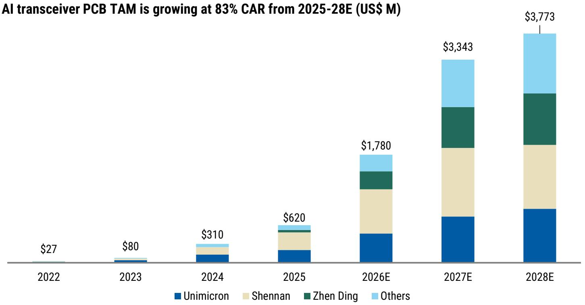

stacked bar chart

AI transceiver PCB TAM is growing at 83% CAR from 2025-28E (US$ M)
| Year | Unimicron | Shennan | Zhen Ding | Others |
| :--- | :--- | :--- | :--- | :--- |
| 2022 | $27 | | | |
| 2023 | $80 | | | |
| 2024 | $310 | | | |
| 2025 | $620 | | | |
| 2026E | $1,780 | Shennan | Zhen Ding | Others |
| 2027E | $3,343 | Shennan | Zhen Ding | Others |
| 2028E | $3,773 | Shennan | Zhen Ding | Others |

Source: MS estimates.

Exhibit 6: TAM comparison: AI transceiver vs. AI transceiver PCB  
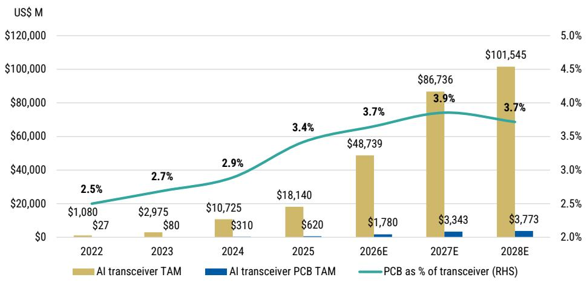

bar-line hybrid

| Year | AI transceiver TAM (US$ M) | AI transceiver PCB TAM (US$ M) | PCB as % of transceiver (RHS) (%) |
| :--- | :--- | :--- | :--- |
| 2022 | 1,080 | 27 | 2.5 |
| 2023 | 2,975 | 80 | 2.7 |
| 2024 | 10,725 | 310 | 2.9 |
| 2025 | 18,140 | 620 | 3.4 |
| 2026E | 48,739 | 1,780 | 3.7 |
| 2027E | 86,736 | 3,343 | 3.9 |
| 2028E | 101,545 | 3,773 | 3.7 |

Source: MS estimates.

Incumbents like Unimicron and Shennan should continue to do well in the optical transceiver market, but we see ZDT as being aggressive and gaining share: We believe incumbent optical transceiver PCB suppliers, including Shennan and Unimicron, are well positioned to benefit from both volume growth and rising PCB content per transceiver over CY26-28. At the same time, the expanding addressable market is creating opportunities for new entrants, as existing industry capacity appears insufficient to meet anticipated demand.

Our channel checks indicate that ZDT and Compeq (2313.TW, not covered) are actively expanding capacity to support the ramp of 800G and 1.6T optical transceiver PCBs. We believe ZDT's share gains began with the initial ramp-up of 800G transceivers in CY25, and we estimate its supply share increased to approximately 7.5% in CY25, with the potential to reach \~20% by CY28. In the 1.6T segment, we estimate that ZDT entered the market with roughly 5% share in CY25 and could expand its position to \~25% by CY28E.

We expect ZDT's share gains to accelerate with the industry's migration toward 1.6T transceivers and beyond, where PCB technology requirements become increasingly demanding. Specifically, 1.6T+ transceiver PCBs are expected to require mSAP manufacturing processes, raising both technical barriers and qualification requirements. We believe ZDT is particularly well positioned to capitalize on this transition, given its extensive experience with mSAP technology, developed and refined through its participation in Apple's iPhone mainboard supply chain since the adoption of mSAP-based SLP architectures in 2017.

Exhibit 7: AI transceiver PCB value contribution to suppliers - we expect suppliers to see 50-176% CAGR over CY25-28E  
AI Transceiver PCB value by supplier (US\$M)  
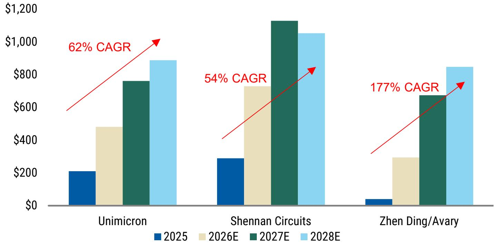

bar chart

| Company           | 2025  | 2026E | 2027E | 2028E |
| ----------------- | ----- | ----- | ----- | ----- |
| Unimicron         | $200  | $480  | $760  | $890  |
| Shennan Circuits  | $290  | $730  | $1140 | $1050 |
| Zhen Ding/Avary   | $30   | $300  | $670  | $850  |

Source: MS estimates.

## MSe vs. Consensus

Our 2026-28 revenue estimates are 1%, 2% and -3% different from Consensus, while our net income estimates are 0%, 3% and 4% higher than Consensus. We think the variance comes from our incorporation of higher AI transceiver PCB supply share assumptions for ZDT at 17%/20%/22% for 2026/2027/2028. The stock has rallied \~145% since April 1, vs. TAIEX +26% over the same period, driven primarily by the progress of its ABF substrate business and its potential share gains in the transceiver PCB market. Our global team raised its AI transceiver volume forecasts on May 15; thus, we are adjusting our model for ZDT accordingly to reflect the transceiver volume higher estimates.

Although our estimates are not materially above Street expectations, we see scope for further upward revisions as AI demand continues to exceed expectations. We believe technological leadership in mSAP processes, financial capacity to support aggressive expansion, and a willingness to invest ahead of demand will be key differentiators. On these metrics, ZDT appears well positioned to capture outsized share gains as the AI transceiver PCB market develops.

Exhibit 8: Zhen Ding: MSe vs. Consensus

<table><tr><td rowspan="2">Zhen Ding</td><td colspan="3">MSe</td><td colspan="3">Consensus</td><td colspan="3">Variance</td></tr><tr><td>2026</td><td>2027</td><td>2028</td><td>2026</td><td>2027</td><td>2028</td><td>2026</td><td>2027</td><td>2028</td></tr><tr><td>Revenue</td><td>226,287</td><td>291,591</td><td>337,349</td><td>223,059</td><td>285,120</td><td>346,952</td><td>1%</td><td>2%</td><td>-3%</td></tr><tr><td>GM</td><td>24.4%</td><td>26.7%</td><td>28.8%</td><td>23.8%</td><td>25.6%</td><td>26.9%</td><td>1%</td><td>1%</td><td>2%</td></tr><tr><td>OpM</td><td>11.5%</td><td>14.9%</td><td>17.9%</td><td>11.2%</td><td>14.3%</td><td>16.2%</td><td>0%</td><td>1%</td><td>2%</td></tr><tr><td>Net income</td><td>15,470</td><td>25,909</td><td>35,713</td><td>15,413</td><td>25,150</td><td>34,349</td><td>0%</td><td>3%</td><td>4%</td></tr><tr><td>EPS</td><td>14.46</td><td>24.21</td><td>33.37</td><td>14.40</td><td>23.50</td><td>32.10</td><td>0%</td><td>3%</td><td>4%</td></tr></table>

Source: Visible Alpha, MS estimates.

Our 2026-28 revenue estimates are 2%, 4% and 8% above Consensus, while our net income estimates are 20%, 17% and 8% below Consensus. We think the variance comes from our lower price hikes assumptions for its ABF substrate business compared to the Street's, which resulted in lower margins and profits. We are still of the view that price hikes this year for ABF substrates are primarily to reflect the raw material shortages and cost increases, but heading into 2027, the pricing upsides will be driven by undersupply of substrate capacity itself.

Exhibit 9: Unimicron: MSe vs. Consensus

<table><tr><td rowspan="2">Unimicron</td><td colspan="3">MSe</td><td colspan="3">Consensus</td><td colspan="3">Variance</td></tr><tr><td>2026</td><td>2027</td><td>2028</td><td>2026</td><td>2027</td><td>2028</td><td>2026</td><td>2027</td><td>2028</td></tr><tr><td>Revenue</td><td>184,777</td><td>262,464</td><td>354,693</td><td>181,665</td><td>252,649</td><td>328,690</td><td>2%</td><td>4%</td><td>8%</td></tr><tr><td>GM</td><td>20.0%</td><td>26.2%</td><td>34.1%</td><td>22.7%</td><td>31.3%</td><td>35.3%</td><td>-3%</td><td>-5%</td><td>-1%</td></tr><tr><td>OpM</td><td>10.4%</td><td>18.6%</td><td>27.9%</td><td>13.7%</td><td>23.4%</td><td>27.9%</td><td>-3%</td><td>-5%</td><td>0%</td></tr><tr><td>Net income</td><td>18,220</td><td>38,875</td><td>78,482</td><td>22,804</td><td>47,008</td><td>72,397</td><td>-20%</td><td>-17%</td><td>8%</td></tr><tr><td>EPS</td><td>11.84</td><td>25.26</td><td>50.99</td><td>14.82</td><td>30.54</td><td>47.04</td><td>-20%</td><td>-17%</td><td>8%</td></tr></table>

Source: Visible Alpha, MS estimates.

Our 2026-28 revenue estimates are 4%, 7% and 13% above Consensus, while our net income estimates are 5% below Consensus for 2026 and 5%/15% above Consensus for 2027/2028. We think the variance comes from our higher assumptions for revenue contribution and profitability from the AI transceiver business, for which Shennan is a share leader. It is primarily valuation that keeps us EW on Shennan.

Exhibit 10: Shennan Circuits: MSe vs. Consensus

<table><tr><td rowspan="2">Shennan Circuits</td><td colspan="3">MSe</td><td colspan="3">Consensus</td><td colspan="3">Variance</td></tr><tr><td>2026</td><td>2027</td><td>2028</td><td>2026</td><td>2027</td><td>2028</td><td>2026</td><td>2027</td><td>2028</td></tr><tr><td>Revenue</td><td>32,234</td><td>42,154</td><td>53,710</td><td>30,853</td><td>39,416</td><td>47,667</td><td>4%</td><td>7%</td><td>13%</td></tr><tr><td>GM</td><td>29.9%</td><td>32.1%</td><td>33.1%</td><td>30.9%</td><td>32.2%</td><td>32.9%</td><td>-3%</td><td>-1%</td><td>1%</td></tr><tr><td>OpM</td><td>18.0%</td><td>20.7%</td><td>22.3%</td><td>18.4%</td><td>20.2%</td><td>21.3%</td><td>-2%</td><td>3%</td><td>5%</td></tr><tr><td>Net income</td><td>4,785</td><td>7,493</td><td>10,496</td><td>5,020</td><td>7,138</td><td>9,150</td><td>-5%</td><td>5%</td><td>15%</td></tr><tr><td>EPS</td><td>7.18</td><td>11.24</td><td>15.74</td><td>7.53</td><td>10.71</td><td>13.72</td><td>-5%</td><td>5%</td><td>15%</td></tr></table>

Source: Visible Alpha, MS estimates.

## Risks to our call

- Weaker demand for general and AI servers;  
- Meaningful capacity expansion plans;  
- Faster-than-expected adoption of CPO.

## ZDT: Estimate Changes

We raise our CY2026, 2027 and 2028 EPS estimates by 5%, 15%, and 17%, respectively. Our earnings increases are driven by our raised demand, pricing, and margin assumptions on AI optical transceiver PCBs.

Exhibit 11: Estimate Changes

<table><tr><td rowspan="2">NT$mn</td><td colspan="3">2026E</td><td colspan="3">2027E</td><td colspan="3">2028E</td></tr><tr><td>New</td><td>Old</td><td>Variance</td><td>New</td><td>Old</td><td>Variance</td><td>New</td><td>Old</td><td>Variance</td></tr><tr><td>Net sales</td><td>226,287</td><td>220,957</td><td>2%</td><td>291,591</td><td>272,268</td><td>7%</td><td>337,349</td><td>312,343</td><td>8%</td></tr><tr><td>COGS</td><td>-170,996</td><td>-167,319</td><td>2%</td><td>-213,614</td><td>-201,052</td><td>6%</td><td>-240,162</td><td>-224,876</td><td>7%</td></tr><tr><td>Gross profit</td><td>55,291</td><td>53,638</td><td>3%</td><td>77,976</td><td>71,216</td><td>9%</td><td>97,187</td><td>87,467</td><td>11%</td></tr><tr><td>Operating expenses</td><td>-29,376</td><td>-29,024</td><td>1%</td><td>-34,573</td><td>-33,545</td><td>3%</td><td>-36,776</td><td>-36,126</td><td>2%</td></tr><tr><td>Operating income</td><td>25,914</td><td>24,614</td><td>5%</td><td>43,403</td><td>37,671</td><td>15%</td><td>60,411</td><td>51,341</td><td>18%</td></tr><tr><td>Non-operating income</td><td>1,039</td><td>1,039</td><td>0%</td><td>1,406</td><td>1,406</td><td>0%</td><td>1,406</td><td>1,406</td><td>0%</td></tr><tr><td>Pre-tax income</td><td>26,953</td><td>25,652</td><td>5%</td><td>44,809</td><td>39,077</td><td>15%</td><td>61,817</td><td>52,747</td><td>17%</td></tr><tr><td>Net income</td><td>15,470</td><td>14,729</td><td>5%</td><td>25,909</td><td>22,596</td><td>15%</td><td>35,713</td><td>30,487</td><td>17%</td></tr><tr><td>EPS (NT$)</td><td>14.46</td><td>13.76</td><td>5%</td><td>24.21</td><td>21.11</td><td>15%</td><td>33.37</td><td>28.49</td><td>17%</td></tr><tr><td>Margins (%)</td><td></td><td></td><td>ppt</td><td></td><td></td><td>ppt</td><td></td><td></td><td>ppt</td></tr><tr><td>Gross margin</td><td>24.4%</td><td>24.3%</td><td>0.2</td><td>26.7%</td><td>26.2%</td><td>0.6</td><td>28.8%</td><td>28.0%</td><td>0.8</td></tr><tr><td>Operating margin</td><td>11.5%</td><td>11.1%</td><td>0.3</td><td>14.9%</td><td>13.8%</td><td>1.0</td><td>17.9%</td><td>16.4%</td><td>1.5</td></tr><tr><td>Pre-tax margin</td><td>11.9%</td><td>11.6%</td><td>0.3</td><td>15.4%</td><td>14.4%</td><td>1.0</td><td>18.3%</td><td>16.9%</td><td>1.4</td></tr><tr><td>Net margin</td><td>6.8%</td><td>6.7%</td><td>0.2</td><td>8.9%</td><td>8.3%</td><td>0.6</td><td>10.6%</td><td>9.8%</td><td>0.8</td></tr></table>

Source: MS (E) estimates.

## Price Target and Valuation Methodology

Our base-case value/price target rises \~17% to NT\$666: It is derived from our multi-stage residual income (RI) model. We use the company's beginning equity plus the present value of all expected residual income of earnings in excess of the cost of capital.

We use the company's beginning equity plus the present value of all expected residual income of earnings in excess of the cost of capital. The RI is positive when ROAE is above the cost of capital and negative when it is below the cost of capital. We assume a cost of equity of 10%, a medium-term growth rate of 15% and a terminal growth rate of 3% (all unchanged).

Our bull- and bear-case values also rises by similar magnitudes to NT\$946 and NT \$386, respectively.

Exhibit 12: Residual income (RI) model

<table><tr><td>NT$ mn</td><td></td><td>2026E</td><td>2027E</td><td>2028E</td><td>2029E</td><td>2030E</td><td>2031E</td><td>2032E</td><td>2033E</td><td>2034E</td><td>2035E</td><td>2036E</td></tr><tr><td>Total Equity</td><td></td><td>182,543</td><td>201,499</td><td>225,567</td><td>236,401</td><td>248,860</td><td>263,189</td><td>279,666</td><td>298,615</td><td>320,407</td><td>345,467</td><td>374,286</td></tr><tr><td>Core Net Profit</td><td></td><td>15,470</td><td>25,909</td><td>35,713</td><td>41,070</td><td>47,230</td><td>54,315</td><td>62,462</td><td>71,831</td><td>82,606</td><td>94,997</td><td>109,246</td></tr><tr><td>Return on Equity</td><td></td><td>9.1%</td><td>14.2%</td><td>17.7%</td><td>18.2%</td><td>20.0%</td><td>21.8%</td><td>23.7%</td><td>25.7%</td><td>27.7%</td><td>29.6%</td><td>31.6%</td></tr><tr><td>Beta (Last 60 Mths)</td><td>1.20</td><td></td><td></td><td></td><td></td><td></td><td></td><td></td><td></td><td></td><td></td><td></td></tr><tr><td>Equity Risk Premium (Rm-Rf)</td><td>6%</td><td></td><td></td><td></td><td></td><td></td><td></td><td></td><td></td><td></td><td></td><td></td></tr><tr><td>Risk Free Rate (Rf)</td><td>3%</td><td></td><td></td><td></td><td></td><td></td><td></td><td></td><td></td><td></td><td></td><td></td></tr><tr><td>Cost of Equity</td><td>10%</td><td></td><td></td><td></td><td></td><td></td><td></td><td></td><td></td><td></td><td></td><td></td></tr><tr><td>Terminal Growth Rate</td><td>3%</td><td></td><td></td><td></td><td></td><td></td><td></td><td></td><td></td><td></td><td></td><td></td></tr><tr><td>Continuing Value Spread</td><td>-2%</td><td></td><td></td><td></td><td></td><td></td><td></td><td></td><td></td><td></td><td></td><td></td></tr><tr><td>Medium-term growth rate</td><td>15.0%</td><td></td><td></td><td></td><td></td><td></td><td></td><td></td><td></td><td></td><td></td><td></td></tr><tr><td>Residual Income</td><td></td><td>-1,089</td><td>8,202</td><td>16,167</td><td>19,190</td><td>24,299</td><td>30,175</td><td>36,933</td><td>44,704</td><td>53,640</td><td>63,917</td><td>75,736</td></tr><tr><td>Spread</td><td></td><td>-1%</td><td>4%</td><td>8%</td><td>9%</td><td>10%</td><td>12%</td><td>14%</td><td>16%</td><td>18%</td><td>20%</td><td>22%</td></tr><tr><td>Beginning Equity Capital</td><td></td><td>182,543</td><td></td><td></td><td></td><td></td><td></td><td></td><td></td><td></td><td></td><td></td></tr><tr><td>PV of Forecast Period</td><td></td><td>165,498</td><td></td><td></td><td></td><td></td><td></td><td></td><td></td><td></td><td></td><td></td></tr><tr><td>PV of Continuing Value</td><td></td><td>364,731</td><td></td><td></td><td></td><td></td><td></td><td></td><td></td><td></td><td></td><td></td></tr><tr><td>Equity Value</td><td></td><td>712,772</td><td></td><td></td><td></td><td></td><td></td><td></td><td></td><td></td><td></td><td></td></tr><tr><td>No. of Shares</td><td></td><td>1,070</td><td></td><td></td><td></td><td></td><td></td><td></td><td></td><td></td><td></td><td></td></tr><tr><td>Projected Price (EoY)</td><td></td><td>666.0</td><td></td><td></td><td></td><td></td><td></td><td></td><td></td><td></td><td></td><td></td></tr><tr><td>Implied 2027 P/E (x)</td><td></td><td>27.5</td><td></td><td></td><td></td><td></td><td></td><td></td><td></td><td></td><td></td><td></td></tr><tr><td>Implied 2028 P/E (x)</td><td></td><td>20.0</td><td></td><td></td><td></td><td></td><td></td><td></td><td></td><td></td><td></td><td></td></tr></table>

Source: MS estimates.

Exhibit 13: ZDT P/E  
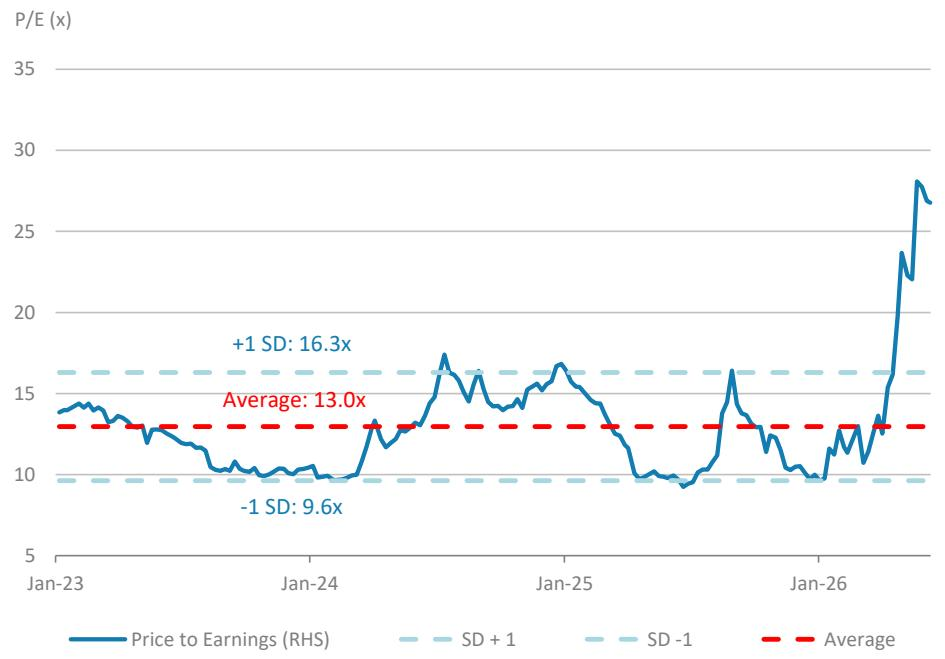

line chart

| Date    | Price to Earnings (RHS) |
|---------|--------------------------|
| Jan-23  | ~14.0x                   |
| Jan-24  | ~10.0x                   |
| Jan-25  | ~17.0x                   |
| Jan-26  | ~13.0x                   |

Source: TEJ, MS estimates.

## Financials

Exhibit 14: Quarterly Estimates

<table><tr><td>NT$ mn</td><td>1Q25</td><td>2Q25</td><td>3Q25</td><td>4Q25</td><td>1Q26</td><td>2Q26E</td><td>3Q26E</td><td>4Q26E</td><td>2025</td><td>2026E</td><td>2027E</td><td>2028E</td></tr><tr><td>Sales</td><td>40,082</td><td>38,203</td><td>47,366</td><td>56,870</td><td>40,728</td><td>48,174</td><td>64,781</td><td>72,604</td><td>182,522</td><td>226,287</td><td>291,591</td><td>337,349</td></tr><tr><td>COGS</td><td>-34,197</td><td>-31,193</td><td>-36,956</td><td>-44,040</td><td>-31,917</td><td>-37,150</td><td>-48,224</td><td>-53,706</td><td>-146,385</td><td>-170,996</td><td>-213,614</td><td>-240,162</td></tr><tr><td>Gross profit</td><td>5,885</td><td>7,011</td><td>10,410</td><td>12,830</td><td>8,812</td><td>11,024</td><td>16,556</td><td>18,899</td><td>36,136</td><td>55,291</td><td>77,976</td><td>97,187</td></tr><tr><td>Operating expenses</td><td>-4,829</td><td>-4,586</td><td>-5,880</td><td>-6,909</td><td>-6,308</td><td>-7,165</td><td>-7,801</td><td>-8,103</td><td>-22,205</td><td>-29,376</td><td>-34,573</td><td>-36,776</td></tr><tr><td>- Promotion</td><td>-486</td><td>-493</td><td>-630</td><td>-744</td><td>-616</td><td>-692</td><td>-838</td><td>-845</td><td>-2,352</td><td>-2,990</td><td>-3,781</td><td>-4,152</td></tr><tr><td>- ADM</td><td>-1,781</td><td>-1,483</td><td>-2,270</td><td>-2,512</td><td>-2,147</td><td>-2,489</td><td>-2,677</td><td>-2,791</td><td>-8,046</td><td>-10,104</td><td>-12,171</td><td>-13,367</td></tr><tr><td>- R&amp;D</td><td>-2,563</td><td>-2,611</td><td>-2,981</td><td>-3,653</td><td>-3,545</td><td>-3,984</td><td>-4,286</td><td>-4,467</td><td>-11,807</td><td>-16,282</td><td>-18,621</td><td>-19,256</td></tr><tr><td>Operating profit</td><td>1,056</td><td>2,425</td><td>4,530</td><td>5,921</td><td>2,503</td><td>3,859</td><td>8,756</td><td>10,796</td><td>13,932</td><td>25,914</td><td>43,403</td><td>60,411</td></tr><tr><td>Non-operating income</td><td>401</td><td>-153</td><td>131</td><td>-248</td><td>-103</td><td>314</td><td>414</td><td>414</td><td>131</td><td>1,039</td><td>1,406</td><td>1,406</td></tr><tr><td>Interest income</td><td>119</td><td>91</td><td>49</td><td>95</td><td>64</td><td>64</td><td>64</td><td>64</td><td>355</td><td>256</td><td>256</td><td>256</td></tr><tr><td>Investment income</td><td>-97</td><td>203</td><td>242</td><td>53</td><td>2</td><td>100</td><td>200</td><td>200</td><td>401</td><td>502</td><td>550</td><td>550</td></tr><tr><td>Disposal of investment</td><td>0</td><td>0</td><td>0</td><td>0</td><td>0</td><td>0</td><td>0</td><td>0</td><td>0</td><td>0</td><td>0</td><td>0</td></tr><tr><td>Disposal of fixed assets</td><td>16</td><td>58</td><td>-258</td><td>-102</td><td>0</td><td>0</td><td>0</td><td>0</td><td>-286</td><td>0</td><td>0</td><td>0</td></tr><tr><td>Exchange gain</td><td>103</td><td>-103</td><td>0</td><td>0</td><td>-930</td><td>0</td><td>0</td><td>0</td><td>0</td><td>-930</td><td>0</td><td>0</td></tr><tr><td>Other</td><td>259</td><td>-401</td><td>98</td><td>-294</td><td>761</td><td>150</td><td>150</td><td>150</td><td>-338</td><td>1,211</td><td>600</td><td>600</td></tr><tr><td>Pre-tax profit</td><td>1,457</td><td>2,272</td><td>4,661</td><td>5,673</td><td>2,400</td><td>4,173</td><td>9,170</td><td>11,210</td><td>14,063</td><td>26,953</td><td>44,809</td><td>61,817</td></tr><tr><td>Income tax</td><td>-431</td><td>-885</td><td>-1,072</td><td>-1,070</td><td>-353</td><td>-918</td><td>-1,724</td><td>-1,345</td><td>-3,458</td><td>-4,340</td><td>-6,944</td><td>-9,605</td></tr><tr><td>Net profit</td><td>632</td><td>605</td><td>2,392</td><td>3,161</td><td>1,426</td><td>2,121</td><td>4,954</td><td>6,970</td><td>6,791</td><td>15,470</td><td>25,909</td><td>35,713</td></tr><tr><td>EPS (NT$)</td><td>0.66</td><td>0.63</td><td>2.46</td><td>3.22</td><td>1.33</td><td>1.98</td><td>4.63</td><td>6.51</td><td>6.91</td><td>14.46</td><td>24.21</td><td>33.37</td></tr><tr><td colspan="13">Margins</td></tr><tr><td>Gross margin</td><td>15%</td><td>18%</td><td>22%</td><td>23%</td><td>22%</td><td>23%</td><td>26%</td><td>26%</td><td>20%</td><td>24%</td><td>27%</td><td>29%</td></tr><tr><td>Operating margin</td><td>3%</td><td>6%</td><td>10%</td><td>10%</td><td>6%</td><td>8%</td><td>14%</td><td>15%</td><td>8%</td><td>11%</td><td>15%</td><td>18%</td></tr><tr><td>Pre-tax margin</td><td>4%</td><td>6%</td><td>10%</td><td>10%</td><td>6%</td><td>9%</td><td>14%</td><td>15%</td><td>8%</td><td>12%</td><td>15%</td><td>18%</td></tr><tr><td>Net margin</td><td>2%</td><td>2%</td><td>5%</td><td>6%</td><td>4%</td><td>4%</td><td>8%</td><td>10%</td><td>4%</td><td>7%</td><td>9%</td><td>11%</td></tr><tr><td colspan="13">QoQ Growth</td></tr><tr><td>Sales</td><td>-29%</td><td>-5%</td><td>24%</td><td>20%</td><td>-28%</td><td>18%</td><td>34%</td><td>12%</td><td></td><td></td><td></td><td></td></tr><tr><td>Gross profit</td><td>-49%</td><td>19%</td><td>48%</td><td>23%</td><td>-31%</td><td>25%</td><td>50%</td><td>14%</td><td></td><td></td><td></td><td></td></tr><tr><td>Operating profit</td><td>-81%</td><td>130%</td><td>87%</td><td>31%</td><td>-58%</td><td>54%</td><td>127%</td><td>23%</td><td></td><td></td><td></td><td></td></tr><tr><td>Pre-tax profit</td><td>-81%</td><td>56%</td><td>105%</td><td>22%</td><td>-58%</td><td>74%</td><td>120%</td><td>22%</td><td></td><td></td><td></td><td></td></tr><tr><td>Net profit</td><td>-86%</td><td>-4%</td><td>295%</td><td>32%</td><td>-55%</td><td>49%</td><td>134%</td><td>41%</td><td></td><td></td><td></td><td></td></tr><tr><td colspan="13">YoY Growth</td></tr><tr><td>Sales</td><td>23%</td><td>18%</td><td>-6%</td><td>1%</td><td>2%</td><td>26%</td><td>37%</td><td>28%</td><td>6%</td><td>24%</td><td>29%</td><td>16%</td></tr><tr><td>Gross profit</td><td>10%</td><td>65%</td><td>-9%</td><td>12%</td><td>50%</td><td>57%</td><td>59%</td><td>47%</td><td>11%</td><td>53%</td><td>41%</td><td>25%</td></tr><tr><td>Operating profit</td><td>42%</td><td>-477%</td><td>-24%</td><td>7%</td><td>137%</td><td>59%</td><td>93%</td><td>82%</td><td>20%</td><td>86%</td><td>67%</td><td>39%</td></tr><tr><td>Pre-tax profit</td><td>-3%</td><td>346%</td><td>-12%</td><td>-27%</td><td>65%</td><td>84%</td><td>97%</td><td>98%</td><td>-7%</td><td>92%</td><td>66%</td><td>38%</td></tr><tr><td>Net profit</td><td>-35%</td><td>25%</td><td>-29%</td><td>-28%</td><td>125%</td><td>251%</td><td>107%</td><td>120%</td><td>-26%</td><td>128%</td><td>67%</td><td>38%</td></tr></table>

Source: Company data, MS (E) estimates.

Exhibit 15: Consolidated Financial Summary  
Income Statement

<table><tr><td>NT$ mn</td><td>2025</td><td>2026E</td><td>2027E</td><td>2028E</td></tr><tr><td>Net sales</td><td>182,522</td><td>226,287</td><td>291,591</td><td>337,349</td></tr><tr><td>COGS</td><td>-146,385</td><td>-170,996</td><td>-213,614</td><td>-240,162</td></tr><tr><td>Gross profit</td><td>36,136</td><td>55,291</td><td>77,976</td><td>97,187</td></tr><tr><td>Operating expenses</td><td>-22,205</td><td>-29,376</td><td>-34,573</td><td>-36,776</td></tr><tr><td>- Promotion</td><td>-2,352</td><td>-2,990</td><td>-3,781</td><td>-4,152</td></tr><tr><td>- ADM</td><td>-8,046</td><td>-10,104</td><td>-12,171</td><td>-13,367</td></tr><tr><td>- R&amp;D</td><td>-11,807</td><td>-16,282</td><td>-18,621</td><td>-19,256</td></tr><tr><td>Operating income</td><td>13,932</td><td>25,914</td><td>43,403</td><td>60,411</td></tr><tr><td>Non-operating income</td><td>131</td><td>1,039</td><td>1,406</td><td>1,406</td></tr><tr><td>Interest income</td><td>355</td><td>256</td><td>256</td><td>256</td></tr><tr><td>Investment income</td><td>401</td><td>502</td><td>550</td><td>550</td></tr><tr><td>Disposal of investment</td><td>0</td><td>0</td><td>0</td><td>0</td></tr><tr><td>Disposal of fixed assets</td><td>-286</td><td>0</td><td>0</td><td>0</td></tr><tr><td>Exchange gain</td><td>0</td><td>-930</td><td>0</td><td>0</td></tr><tr><td>Other</td><td>-338</td><td>1,211</td><td>600</td><td>600</td></tr><tr><td>Pre-tax income</td><td>14,063</td><td>26,953</td><td>44,809</td><td>61,817</td></tr><tr><td>Income tax</td><td>-7,272</td><td>-11,483</td><td>-18,900</td><td>-26,104</td></tr><tr><td>Net income</td><td>6,791</td><td>15,470</td><td>25,909</td><td>35,713</td></tr><tr><td>EPS (NT$)</td><td>6.91</td><td>14.46</td><td>24.21</td><td>33.37</td></tr></table>

Balance Sheet

<table><tr><td>NT$ mn</td><td>2025</td><td>2026E</td><td>2027E</td><td>2028E</td></tr><tr><td>Cash</td><td>71,116</td><td>61,840</td><td>73,189</td><td>88,287</td></tr><tr><td>Mkt securities</td><td>36</td><td>36</td><td>36</td><td>36</td></tr><tr><td>Accounts/Notes receivables</td><td>31,412</td><td>38,944</td><td>50,183</td><td>58,058</td></tr><tr><td>Inventory</td><td>19,616</td><td>22,914</td><td>28,625</td><td>32,183</td></tr><tr><td>Other current assets</td><td>5,460</td><td>5,460</td><td>5,460</td><td>5,460</td></tr><tr><td>Current Assets</td><td>127,641</td><td>129,195</td><td>157,494</td><td>184,024</td></tr><tr><td>Long-term investments</td><td>9,866</td><td>10,367</td><td>10,917</td><td>11,467</td></tr><tr><td>Fixed assets</td><td>123,737</td><td>145,693</td><td>148,605</td><td>152,383</td></tr><tr><td>Other assets</td><td>18,799</td><td>18,799</td><td>18,799</td><td>18,799</td></tr><tr><td>Total Assets</td><td>280,043</td><td>304,054</td><td>335,815</td><td>366,673</td></tr><tr><td>S/T borrowings</td><td>23,839</td><td>23,839</td><td>23,839</td><td>23,839</td></tr><tr><td>AP/NP</td><td>23,501</td><td>27,452</td><td>34,295</td><td>38,557</td></tr><tr><td>Other ST liabilities</td><td>25,481</td><td>33,710</td><td>39,674</td><td>42,202</td></tr><tr><td>Other liabilities</td><td>21,151</td><td>21,151</td><td>21,151</td><td>21,151</td></tr><tr><td>L/T debt</td><td>15,359</td><td>15,359</td><td>15,359</td><td>15,359</td></tr><tr><td>Total Liabilities</td><td>109,330</td><td>121,511</td><td>134,316</td><td>141,106</td></tr><tr><td>Common shares</td><td>10,706</td><td>10,706</td><td>10,706</td><td>10,706</td></tr><tr><td>Capital Collection</td><td>0</td><td>0</td><td>0</td><td>0</td></tr><tr><td>APIC</td><td>52,902</td><td>52,902</td><td>52,902</td><td>52,902</td></tr><tr><td>Retained earnings</td><td>61,549</td><td>73,328</td><td>92,283</td><td>116,351</td></tr><tr><td>Treasury Stock</td><td>-52</td><td>0</td><td>0</td><td>0</td></tr><tr><td>Other shareholders&#x27; equity</td><td>45607</td><td>45607</td><td>45607</td><td>45607</td></tr><tr><td>Shareholders&#x27; equity</td><td>170,713</td><td>182,543</td><td>201,499</td><td>225,567</td></tr><tr><td>Total Liab./Shrhldr&#x27;s Equity</td><td>280,043</td><td>304,054</td><td>335,815</td><td>366,673</td></tr></table>

Cash Flow Statement

<table><tr><td>NT$ mn</td><td>2025</td><td>2026E</td><td>2027E</td><td>2028E</td></tr><tr><td>Cashflow from operations</td><td>27,617</td><td>24,364</td><td>28,302</td><td>36,742</td></tr><tr><td>Net Profits</td><td>10,605</td><td>15,470</td><td>25,909</td><td>35,713</td></tr><tr><td>Depreciation</td><td>18,552</td><td>8,044</td><td>7,088</td><td>6,222</td></tr><tr><td>Equity investment losses (income)</td><td>0</td><td>-502</td><td>-550</td><td>-550</td></tr><tr><td>Other adjustments</td><td>-1,541</td><td>1,351</td><td>-4,145</td><td>-4,643</td></tr><tr><td>Cashflow from investing</td><td>-31,960</td><td>-30,000</td><td>-10,000</td><td>-10,000</td></tr><tr><td>(Purchases) sale of FA (capex)</td><td>-32,673</td><td>-30,000</td><td>-10,000</td><td>-10,000</td></tr><tr><td>(Purchases) sale of L/T investment</td><td>342</td><td>0</td><td>0</td><td>0</td></tr><tr><td>(Purchases) sale of S/T investment</td><td>-601</td><td>0</td><td>0</td><td>0</td></tr><tr><td>Other adjustments</td><td>972</td><td>0</td><td>0</td><td>0</td></tr><tr><td>Cashflow from financing</td><td>-1,865</td><td>-3,640</td><td>-6,953</td><td>-11,645</td></tr><tr><td>Increase in L/T debt</td><td>6,344</td><td>0</td><td>0</td><td>0</td></tr><tr><td>Increase in S/T debt</td><td>2,191</td><td>0</td><td>0</td><td>0</td></tr><tr><td>Issuance of stock</td><td>730</td><td>0</td><td>0</td><td>0</td></tr><tr><td>Cash dividends</td><td>-7,221</td><td>-3,692</td><td>-6,953</td><td>-11,645</td></tr><tr><td>Dir.&amp; Emp. Bonus</td><td>0</td><td>0</td><td>0</td><td>0</td></tr><tr><td>Changes in Treasury Stocks</td><td>288</td><td>52</td><td>0</td><td>0</td></tr><tr><td>Other adjustments</td><td>-4,196</td><td>0</td><td>0</td><td>0</td></tr><tr><td>Exchange rate adjustment</td><td>-2,177</td><td>0</td><td>0</td><td>0</td></tr><tr><td>Net change in cash</td><td>-8,386</td><td>-9,276</td><td>11,349</td><td>15,097</td></tr></table>

Financial Ratios

<table><tr><td></td><td>2025</td><td>2026E</td><td>2027E</td><td>2028E</td></tr><tr><td colspan="5">Margins</td></tr><tr><td>Gross margin</td><td>19.8%</td><td>24.4%</td><td>26.7%</td><td>28.8%</td></tr><tr><td>Operating margin</td><td>7.6%</td><td>11.5%</td><td>14.9%</td><td>17.9%</td></tr><tr><td>Pretax margin</td><td>7.7%</td><td>11.9%</td><td>15.4%</td><td>18.3%</td></tr><tr><td>Net margin</td><td>3.7%</td><td>6.8%</td><td>8.9%</td><td>10.6%</td></tr><tr><td colspan="5">YoY growth</td></tr><tr><td>Sales</td><td>6.3%</td><td>24.0%</td><td>28.9%</td><td>15.7%</td></tr><tr><td>Operating profits</td><td>20.2%</td><td>86.0%</td><td>67.5%</td><td>39.2%</td></tr><tr><td>Pretax profits</td><td>-6.5%</td><td>91.7%</td><td>66.2%</td><td>38.0%</td></tr><tr><td>Net profits</td><td>-26.0%</td><td>127.8%</td><td>67.5%</td><td>37.8%</td></tr><tr><td>EPS</td><td>-28.6%</td><td>109.3%</td><td>67.5%</td><td>37.8%</td></tr><tr><td>Net Debt/Equity (Net of mkt secs.)</td><td>-19%</td><td>-12%</td><td>-17%</td><td>-22%</td></tr><tr><td>Net Debt/Equity</td><td>-19%</td><td>-12%</td><td>-17%</td><td>-22%</td></tr><tr><td>Liabilities/Equity</td><td>64%</td><td>67%</td><td>67%</td><td>63%</td></tr><tr><td>Liabilities/Assets</td><td>39%</td><td>40%</td><td>40%</td><td>38%</td></tr><tr><td>ROAE</td><td>4.2%</td><td>8.8%</td><td>13.5%</td><td>16.7%</td></tr><tr><td>ROAA</td><td>2.5%</td><td>5.3%</td><td>8.1%</td><td>10.2%</td></tr><tr><td>AR/NR Turnover (days)</td><td>62</td><td>57</td><td>56</td><td>59</td></tr><tr><td>AP/NP Turnover (days)</td><td>56</td><td>54</td><td>53</td><td>55</td></tr><tr><td>Inventory Turnover (days)</td><td>47</td><td>45</td><td>44</td><td>46</td></tr><tr><td>Cash conversion cycle (days)</td><td>52</td><td>48</td><td>47</td><td>49</td></tr></table>

Source: Company data, MS (E) estimates.

# Unimicron: Estimate Changes

We raise our 2026, 2027 and 2028 EPS estimates by 2%, 5% and 4%, respectively, primarily driven by higher assumptions for AI optical transceiver PCBs.

Exhibit 16: Estimate Changes

<table><tr><td rowspan="2">Year to Dec. 31 (NT$m)</td><td colspan="3">2026E</td><td colspan="3">2027E</td><td colspan="3">2028E</td></tr><tr><td>New</td><td>Old</td><td>% diff</td><td>New</td><td>Old</td><td>% diff</td><td>New</td><td>Old</td><td>% diff</td></tr><tr><td colspan="10">P&amp;L Summary</td></tr><tr><td>Net sales</td><td>184,777</td><td>186,189</td><td>-1%</td><td>262,464</td><td>260,849</td><td>1%</td><td>354,693</td><td>352,349</td><td>1%</td></tr><tr><td>COGS</td><td>(147,780)</td><td>(149,522)</td><td></td><td>(193,803)</td><td>(194,590)</td><td></td><td>(233,768)</td><td>(235,051)</td><td></td></tr><tr><td>Gross profit</td><td>36,997</td><td>36,667</td><td>1%</td><td>68,660</td><td>66,260</td><td>4%</td><td>120,924</td><td>117,299</td><td>3%</td></tr><tr><td>Operating expenses</td><td>(17,713)</td><td>(17,794)</td><td></td><td>(19,966)</td><td>(19,966)</td><td></td><td>(21,971)</td><td>(22,086)</td><td></td></tr><tr><td>Operating income</td><td>19,284</td><td>18,872</td><td>2%</td><td>48,695</td><td>46,293</td><td>5%</td><td>98,953</td><td>95,212</td><td>4%</td></tr><tr><td>Non-operating income</td><td>5,027</td><td>5,027</td><td></td><td>2,180</td><td>2,180</td><td></td><td>2,180</td><td>2,180</td><td></td></tr><tr><td>Pre-tax income</td><td>24,311</td><td>23,899</td><td>2%</td><td>50,874</td><td>48,473</td><td>5%</td><td>101,133</td><td>97,392</td><td>4%</td></tr><tr><td>Net income</td><td>18,220</td><td>17,879</td><td>2%</td><td>38,875</td><td>36,979</td><td>5%</td><td>78,482</td><td>75,534</td><td>4%</td></tr><tr><td>Diluted EPS (NT$)</td><td>11.84</td><td>11.62</td><td>2%</td><td>25.26</td><td>24.03</td><td>5%</td><td>50.99</td><td>49.08</td><td>4%</td></tr><tr><td>Margins</td><td></td><td></td><td>ppt</td><td></td><td></td><td>ppt</td><td></td><td></td><td>ppt</td></tr><tr><td>Gross margin</td><td>20.0%</td><td>19.7%</td><td>0.3</td><td>26.2%</td><td>25.4%</td><td>0.8</td><td>34.1%</td><td>33.3%</td><td>0.8</td></tr><tr><td>Operating margin</td><td>10.4%</td><td>10.1%</td><td>0.3</td><td>18.6%</td><td>17.7%</td><td>0.8</td><td>27.9%</td><td>27.0%</td><td>0.9</td></tr><tr><td>Pretax margin</td><td>13.2%</td><td>12.8%</td><td>0.3</td><td>19.4%</td><td>18.6%</td><td>0.8</td><td>28.5%</td><td>27.6%</td><td>0.9</td></tr><tr><td>Net margin</td><td>9.9%</td><td>9.6%</td><td>0.3</td><td>14.8%</td><td>14.2%</td><td>0.6</td><td>22.1%</td><td>21.4%</td><td>0.7</td></tr></table>

Source: MS (E) estimates.

## Price Target and Valuation Methodology

Our 12-month price target increases \~5% to NT\$1,285 (from NT\$1,225), driven by our increased earnings estimates for CY26-28e: We believe the company's earnings have returned to a growth track from 2026 onwards and will see stronger earnings growth in 2027, driven by the high-end ABF substrate market's reversion to undersupply and Unimicron's dominant supply share in AI ASICs and also server CPUs, which puts it in a favorable position to benefit from rising AI investments.

We believe the overall ABF substrate market bottomed in 2H24, and growth will accelerate from 2H26 onwards with the ramp of multiple next-generation, large body size ABF substrates for new server GPUs, CPUs, ASICs, and networking chips. New technologies, such as embedded passives and Intel's EMIB-T, will also increase the manufacturing complexity of the package substrates, which adds to the under-capacity as usable output decreases.

Similar to our analysis of other tech hardware companies within our coverage, we use a residual income (RI) valuation model to value Unimicron – we think it derives the most accurate value of the firm as it takes into account cost of equity. Key assumptions are all unchanged, including:

• Cost of equity of 9.2%;  
- Risk-free rate of 1% (10-year Taiwan government note yield);  
• Equity risk premium of 8.7%;  
- Beta of 1.0;  
• Medium-term growth rate of 15%  
- Terminal growth rate of 3% (similar to the rest of the companies under our tech hardware coverage).

Our bull and bear case values increase by similar magnitudes, to NT\$2,190 and NT \$430, respectively.

Exhibit 17: Unimicron residual income (RI) model

<table><tr><td></td><td>2027E</td><td>2028E</td><td>2029E</td><td>2030E</td><td>2031E</td><td>2032E</td><td>2033E</td><td>2034E</td><td>2035E</td><td>2036E</td><td>2037E</td></tr><tr><td>Total Equity</td><td>152,160</td><td>212,630</td><td>246,731</td><td>285,946</td><td>331,044</td><td>382,906</td><td>442,548</td><td>511,136</td><td>590,012</td><td>680,719</td><td>756,223</td></tr><tr><td>Net Profit</td><td>38,875</td><td>78,482</td><td>90,254</td><td>103,792</td><td>119,361</td><td>137,265</td><td>157,855</td><td>181,533</td><td>208,763</td><td>240,077</td><td>247,280</td></tr><tr><td>Return on Equity</td><td>28.4%</td><td>43.0%</td><td>39.3%</td><td>39.0%</td><td>38.7%</td><td>38.5%</td><td>38.2%</td><td>38.1%</td><td>37.9%</td><td>37.8%</td><td>34.4%</td></tr><tr><td>Beta</td><td>1.0</td><td>1.0</td><td>1.0</td><td>1.0</td><td>1.0</td><td>1.0</td><td>1.0</td><td>1.0</td><td>1.0</td><td>1.0</td><td>1.0</td></tr><tr><td>Equity Risk Premium (Rm-Rf)</td><td>8.7%</td><td>8.7%</td><td>8.7%</td><td>8.7%</td><td>8.7%</td><td>8.7%</td><td>8.7%</td><td>8.7%</td><td>8.7%</td><td>8.7%</td><td>8.7%</td></tr><tr><td>Risk Free Rate (Rf)</td><td>1.0%</td><td>1.0%</td><td>1.0%</td><td>1.0%</td><td>1.0%</td><td>1.0%</td><td>1.0%</td><td>1.0%</td><td>1.0%</td><td>1.0%</td><td>1.0%</td></tr><tr><td>Cost of Equity</td><td>9.2%</td><td>9.2%</td><td>9.2%</td><td>9.2%</td><td>9.2%</td><td>9.2%</td><td>9.2%</td><td>9.2%</td><td>9.2%</td><td>9.2%</td><td>9.2%</td></tr><tr><td>Residual Income</td><td>23,387</td><td>51,508</td><td>64,040</td><td>73,507</td><td>84,394</td><td>96,912</td><td>111,308</td><td>127,863</td><td>146,900</td><td>168,792</td><td>171,813</td></tr><tr><td>Spread</td><td>19.2%</td><td>33.9%</td><td>30.1%</td><td>29.8%</td><td>29.5%</td><td>29.3%</td><td>29.1%</td><td>28.9%</td><td>28.7%</td><td>28.6%</td><td>25.2%</td></tr><tr><td>Beginning Equity Capital</td><td>152,160</td><td></td><td></td><td></td><td></td><td></td><td></td><td></td><td></td><td></td><td></td></tr><tr><td>PV of Forecast Period</td><td>634,902</td><td></td><td></td><td></td><td></td><td></td><td></td><td></td><td></td><td></td><td></td></tr><tr><td>PV of Continuing Value</td><td>1,190,556</td><td></td><td></td><td></td><td></td><td></td><td></td><td></td><td></td><td></td><td></td></tr><tr><td>Equity Value</td><td>1,977,619</td><td></td><td></td><td></td><td></td><td></td><td></td><td></td><td></td><td></td><td></td></tr><tr><td>No. of Shares</td><td>1,539</td><td></td><td></td><td></td><td></td><td></td><td></td><td></td><td></td><td></td><td></td></tr><tr><td>Projected Price</td><td>1,285.0</td><td></td><td></td><td></td><td></td><td></td><td></td><td></td><td></td><td></td><td></td></tr></table>

Source: MS estimates.

Exhibit 18: Unimicron P/E  
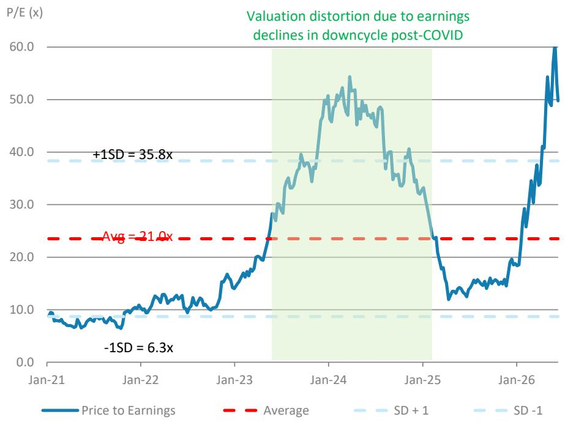

line chart

| Date    | Price to Earnings | Average | SD + 1 | SD -1 |
|---------|-------------------|---------|--------|-------|
| Jan-21  | ~9.0x             | 21.0x   | -      | -     |
| Jan-22  | ~10.0x            | 21.0x   | -      | -     |
| Jan-23  | ~15.0x            | 21.0x   | -      | -     |
| Jan-24  | ~50.0x            | 21.0x   | -      | -     |
| Jan-25  | ~30.0x            | 21.0x   | -      | -     |
| Jan-26  | ~60.0x            | 21.0x   | -      | -     |

Source: TEJ, MS estimates.

## Financials

Exhibit 19: Quarterly Estimates

<table><tr><td>NT$ mn</td><td>1Q25</td><td>2Q25</td><td>3Q25</td><td>4Q25</td><td>1Q26E</td><td>2Q26E</td><td>3Q26E</td><td>4Q26E</td><td>2025</td><td>2026E</td><td>2027E</td><td>2028E</td></tr><tr><td>Sales</td><td>30,090</td><td>32,466</td><td>33,994</td><td>34,691</td><td>37,446</td><td>43,621</td><td>51,100</td><td>52,609</td><td>131,241</td><td>184,777</td><td>262,464</td><td>354,693</td></tr><tr><td>Cost of goods sold</td><td>-26,063</td><td>-28,221</td><td>-29,446</td><td>-29,219</td><td>-30,720</td><td>-35,125</td><td>-40,558</td><td>-41,377</td><td>-112,949</td><td>-147,780</td><td>-193,803</td><td>-233,768</td></tr><tr><td>Gross profit</td><td>4,026</td><td>4,246</td><td>4,549</td><td>5,472</td><td>6,726</td><td>8,497</td><td>10,542</td><td>11,232</td><td>18,292</td><td>36,997</td><td>68,660</td><td>120,924</td></tr><tr><td>Operating expenses</td><td>-2,759</td><td>-2,736</td><td>-3,016</td><td>-3,106</td><td>-3,969</td><td>-4,331</td><td>-4,696</td><td>-4,717</td><td>-11,618</td><td>-17,713</td><td>-19,966</td><td>-21,971</td></tr><tr><td>Operating profit</td><td>1,267</td><td>1,509</td><td>1,533</td><td>2,366</td><td>2,757</td><td>4,166</td><td>5,846</td><td>6,516</td><td>6,674</td><td>19,284</td><td>48,695</td><td>98,953</td></tr><tr><td>Interest income (loss)</td><td>103</td><td>62</td><td>-7</td><td>25</td><td>25</td><td>25</td><td>25</td><td>25</td><td>183</td><td>100</td><td>100</td><td>100</td></tr><tr><td>Investment income (loss)</td><td>32</td><td>-13</td><td>-1</td><td>-10</td><td>20</td><td>20</td><td>20</td><td>20</td><td>8</td><td>80</td><td>80</td><td>80</td></tr><tr><td>Gains (Losses) from investment disposal</td><td>0</td><td>0</td><td>0</td><td>3</td><td>0</td><td>0</td><td>0</td><td>0</td><td>3</td><td>0</td><td>0</td><td>0</td></tr><tr><td>Gains from FAs disposal</td><td>3</td><td>337</td><td>-29</td><td>507</td><td>0</td><td>0</td><td>0</td><td>0</td><td>817</td><td>0</td><td>0</td><td>0</td></tr><tr><td>Exchange gain</td><td>452</td><td>-1,281</td><td>487</td><td>349</td><td>300</td><td>0</td><td>0</td><td>0</td><td>7</td><td>300</td><td>0</td><td>0</td></tr><tr><td>Others</td><td>-483</td><td>-257</td><td>964</td><td>910</td><td>3,197</td><td>450</td><td>450</td><td>450</td><td>1,134</td><td>4,547</td><td>2,000</td><td>2,000</td></tr><tr><td>Pre-tax profit</td><td>1,373</td><td>357</td><td>2,947</td><td>4,150</td><td>6,299</td><td>4,661</td><td>6,341</td><td>7,010</td><td>8,827</td><td>24,311</td><td>50,874</td><td>101,133</td></tr><tr><td>Net Income for Minority</td><td>9</td><td>231</td><td>256</td><td>381</td><td>338</td><td>338</td><td>338</td><td>338</td><td>877</td><td>1,351</td><td>1,351</td><td>1,351</td></tr><tr><td>Income tax</td><td>-450</td><td>-97</td><td>-496</td><td>-235</td><td>-918</td><td>-1,165</td><td>-1,395</td><td>-1,262</td><td>-1,277</td><td>-4,740</td><td>-10,648</td><td>-21,300</td></tr><tr><td>Net profit</td><td>915</td><td>30</td><td>2,194</td><td>3,535</td><td>5,043</td><td>3,158</td><td>4,608</td><td>5,411</td><td>6,673</td><td>18,220</td><td>38,875</td><td>78,482</td></tr><tr><td>EPS (NT$)</td><td>0.59</td><td>0.02</td><td>1.43</td><td>2.30</td><td>3.28</td><td>2.05</td><td>2.99</td><td>3.52</td><td>4.34</td><td>11.84</td><td>25.26</td><td>50.99</td></tr><tr><td colspan="13">Margins (%)</td></tr><tr><td>Gross margin</td><td>13.4%</td><td>13.1%</td><td>13.4%</td><td>15.8%</td><td>18.0%</td><td>19.5%</td><td>20.6%</td><td>21.4%</td><td>13.9%</td><td>20.0%</td><td>26.2%</td><td>34.1%</td></tr><tr><td>Operating margin</td><td>4.2%</td><td>4.6%</td><td>4.5%</td><td>6.8%</td><td>7.4%</td><td>9.6%</td><td>11.4%</td><td>12.4%</td><td>5.1%</td><td>10.4%</td><td>18.6%</td><td>27.9%</td></tr><tr><td>Pre-tax margin</td><td>4.6%</td><td>1.1%</td><td>8.7%</td><td>12.0%</td><td>16.8%</td><td>10.7%</td><td>12.4%</td><td>13.3%</td><td>6.7%</td><td>13.2%</td><td>19.4%</td><td>28.5%</td></tr><tr><td>Net margin</td><td>3.0%</td><td>0.1%</td><td>6.5%</td><td>10.2%</td><td>13.5%</td><td>7.2%</td><td>9.0%</td><td>10.3%</td><td>5.1%</td><td>9.9%</td><td>14.8%</td><td>22.1%</td></tr><tr><td colspan="13">QoQ Growth</td></tr><tr><td>Sales</td><td>2%</td><td>8%</td><td>5%</td><td>2%</td><td>8%</td><td>16%</td><td>17%</td><td>3%</td><td></td><td></td><td></td><td></td></tr><tr><td>Gross profit</td><td>18%</td><td>5%</td><td>7%</td><td>20%</td><td>23%</td><td>26%</td><td>24%</td><td>7%</td><td></td><td></td><td></td><td></td></tr><tr><td>Operating profit</td><td>86%</td><td>19%</td><td>2%</td><td>54%</td><td>17%</td><td>51%</td><td>40%</td><td>11%</td><td></td><td></td><td></td><td></td></tr><tr><td>Pre-tax profit</td><td>331%</td><td>-74%</td><td>726%</td><td>41%</td><td>52%</td><td>-26%</td><td>36%</td><td>11%</td><td></td><td></td><td></td><td></td></tr><tr><td>Net profit</td><td>1531%</td><td>-97%</td><td>7310%</td><td>61%</td><td>43%</td><td>-37%</td><td>46%</td><td>17%</td><td></td><td></td><td></td><td></td></tr><tr><td colspan="13">YoY Growth</td></tr><tr><td>Sales</td><td>14%</td><td>16%</td><td>7%</td><td>18%</td><td>24%</td><td>34%</td><td>50%</td><td>52%</td><td>14%</td><td>41%</td><td>42%</td><td>35%</td></tr><tr><td>Gross profit</td><td>-6%</td><td>15%</td><td>-8%</td><td>61%</td><td>67%</td><td>100%</td><td>132%</td><td>105%</td><td>12%</td><td>102%</td><td>86%</td><td>76%</td></tr><tr><td>Operating profit</td><td>-20%</td><td>68%</td><td>-22%</td><td>248%</td><td>118%</td><td>176%</td><td>281%</td><td>175%</td><td>30%</td><td>189%</td><td>153%</td><td>103%</td></tr><tr><td>Pre-tax profit</td><td>-59%</td><td>-83%</td><td>95%</td><td>1201%</td><td>359%</td><td>1207%</td><td>115%</td><td>69%</td><td>21%</td><td>175%</td><td>109%</td><td>99%</td></tr><tr><td>Net profit</td><td>-62%</td><td>-98%</td><td>120%</td><td>6204%</td><td>451%</td><td>10567%</td><td>110%</td><td>53%</td><td>31%</td><td>173%</td><td>113%</td><td>102%</td></tr></table>

Source: Company data, MS (E) estimates.

Exhibit 20: Consolidated Financial Summary  
Income Statement

<table><tr><td>NT$ mn; FY End Dec</td><td>2025</td><td>2026E</td><td>2027E</td><td>2028E</td></tr><tr><td>Net sales</td><td>131,241</td><td>184,777</td><td>262,464</td><td>354,693</td></tr><tr><td>Cost of goods sold</td><td>-112,949</td><td>-147,780</td><td>-193,803</td><td>-233,768</td></tr><tr><td>Gross profit</td><td>18,292</td><td>36,997</td><td>68,660</td><td>120,924</td></tr><tr><td>Operating expenses</td><td>-11,618</td><td>-17,713</td><td>-19,966</td><td>-21,971</td></tr><tr><td>Sales &amp; Marketing</td><td>-1,607</td><td>-2,514</td><td>-3,249</td><td>-3,994</td></tr><tr><td>G&amp;A</td><td>-5,012</td><td>-7,806</td><td>-8,136</td><td>-8,550</td></tr><tr><td>R&amp;D</td><td>-4,999</td><td>-7,392</td><td>-8,581</td><td>-9,428</td></tr><tr><td>Operating profit</td><td>6,674</td><td>19,284</td><td>48,695</td><td>98,953</td></tr><tr><td>Interest income</td><td>183</td><td>100</td><td>100</td><td>100</td></tr><tr><td>Investment income</td><td>8</td><td>80</td><td>80</td><td>80</td></tr><tr><td>Gains from investment disposal</td><td>3</td><td>0</td><td>0</td><td>0</td></tr><tr><td>Gains from fixed assets disposal</td><td>817</td><td>0</td><td>0</td><td>0</td></tr><tr><td>Exchange gain</td><td>7</td><td>300</td><td>0</td><td>0</td></tr><tr><td>Other non-operating income</td><td>1,134</td><td>4,547</td><td>2,000</td><td>2,000</td></tr><tr><td>Net non-operating profit</td><td>2,153</td><td>5,027</td><td>2,180</td><td>2,180</td></tr><tr><td>Pre-tax profit</td><td>8,827</td><td>24,311</td><td>50,874</td><td>101,133</td></tr><tr><td>Net Income for Minority</td><td>-877</td><td>-1,351</td><td>-1,351</td><td>-1,351</td></tr><tr><td>Income tax</td><td>-1,277</td><td>-4,740</td><td>-10,648</td><td>-21,300</td></tr><tr><td>Net profit</td><td>6,673</td><td>18,220</td><td>38,875</td><td>78,482</td></tr><tr><td>Reported EPS (NT$)</td><td>4.34</td><td>11.84</td><td>25.26</td><td>50.99</td></tr></table>

Balance Sheet

<table><tr><td>NT$ mn; FY End Dec</td><td>2025</td><td>2026E</td><td>2027E</td><td>2028E</td></tr><tr><td>Cash</td><td>54,872</td><td>81,793</td><td>141,429</td><td>229,011</td></tr><tr><td>Mkt Securities</td><td>38</td><td>38</td><td>38</td><td>38</td></tr><tr><td>AR/NR</td><td>27,570</td><td>38,816</td><td>55,136</td><td>74,511</td></tr><tr><td>Inventory</td><td>17,802</td><td>23,292</td><td>30,545</td><td>36,844</td></tr><tr><td>Others</td><td>5,016</td><td>7,062</td><td>10,031</td><td>13,556</td></tr><tr><td>Current Assets</td><td>105,298</td><td>151,001</td><td>237,179</td><td>353,960</td></tr><tr><td>Long-term Investments</td><td>836</td><td>836</td><td>836</td><td>836</td></tr><tr><td>Fixed Assets</td><td>125,866</td><td>129,535</td><td>121,838</td><td>114,413</td></tr><tr><td>Other Assets</td><td>23,792</td><td>23,792</td><td>23,792</td><td>23,792</td></tr><tr><td>Total Assets</td><td>255,792</td><td>305,164</td><td>383,645</td><td>493,001</td></tr><tr><td>S-t Borrowings</td><td>10,845</td><td>10,845</td><td>10,845</td><td>10,845</td></tr><tr><td>AP/NP</td><td>17,494</td><td>22,889</td><td>30,018</td><td>36,208</td></tr><tr><td>Other S-T Liabilities</td><td>47,115</td><td>61,645</td><td>80,843</td><td>97,514</td></tr><tr><td>Other LT Liabilities</td><td>38,457</td><td>54,144</td><td>76,908</td><td>103,934</td></tr><tr><td>L-t Debt</td><td>34,873</td><td>33,872</td><td>32,871</td><td>31,870</td></tr><tr><td>Total Liabilities</td><td>148,785</td><td>183,395</td><td>231,485</td><td>280,371</td></tr><tr><td>Common Shares</td><td>15,296</td><td>15,296</td><td>15,296</td><td>15,296</td></tr><tr><td>Other Shareholders&#x27; Equity</td><td>91,711</td><td>106,473</td><td>136,864</td><td>197,334</td></tr><tr><td>Total Equity</td><td>107,007</td><td>121,769</td><td>152,160</td><td>212,630</td></tr><tr><td>Total Liab./Shrhldr&#x27;s Equity</td><td>255,792</td><td>305,164</td><td>383,645</td><td>493,001</td></tr></table>

Cash Flow Statement

<table><tr><td>NT$ mn; FY End Dec</td><td>2025</td><td>2026E</td><td>2027E</td><td>2028E</td></tr><tr><td>Cashflow from Operations</td><td>14,967</td><td>39,169</td><td>58,657</td><td>90,949</td></tr><tr><td>Net Profits</td><td>6,673</td><td>18,220</td><td>38,875</td><td>78,482</td></tr><tr><td>Depreciation</td><td>18,773</td><td>19,887</td><td>20,078</td><td>18,885</td></tr><tr><td>Investment losses (income)</td><td>0</td><td>-80</td><td>-80</td><td>-80</td></tr><tr><td>Investment Disposal Loss</td><td>-3</td><td>0</td><td>0</td><td>0</td></tr><tr><td>Change in Working Capital</td><td>-2,943</td><td>3,188</td><td>2,753</td><td>-2,812</td></tr><tr><td>Other adjustments</td><td>-7,533</td><td>-2,046</td><td>-2,969</td><td>-3,525</td></tr><tr><td>Cashflow from Investing</td><td>-23,018</td><td>-23,556</td><td>-12,381</td><td>-11,460</td></tr><tr><td>(Purchases) Sale of fixed asset</td><td>-24,307</td><td>-23,556</td><td>-12,381</td><td>-11,460</td></tr><tr><td>(Purchases) Sale of LT investment</td><td>-77</td><td>0</td><td>0</td><td>0</td></tr><tr><td>Other adjustments</td><td>1,367</td><td>0</td><td>0</td><td>0</td></tr><tr><td>Cashflow from financing</td><td>19,073</td><td>11,608</td><td>13,359</td><td>8,093</td></tr><tr><td>Increase in L-T debt</td><td>9,950</td><td>-1,001</td><td>-1,001</td><td>-1,001</td></tr><tr><td>Increase in S-T debt</td><td>4,331</td><td>0</td><td>0</td><td>0</td></tr><tr><td>Issuance of stock</td><td>0</td><td>0</td><td>0</td><td>0</td></tr><tr><td>Other adjustments</td><td>7,087</td><td>15,687</td><td>22,764</td><td>27,025</td></tr><tr><td>Exchange Rate Adjustment</td><td>96</td><td>-300</td><td>0</td><td>0</td></tr><tr><td>Net change in cash</td><td>11,118</td><td>26,921</td><td>59,636</td><td>87,582</td></tr></table>

Financial Ratios

<table><tr><td></td><td>2025</td><td>2026E</td><td>2027E</td><td>2028E</td></tr><tr><td colspan="5">Margins</td></tr><tr><td>Gross margin</td><td>13.9%</td><td>20.0%</td><td>26.2%</td><td>34.1%</td></tr><tr><td>Operating expenses/sales</td><td>-8.9%</td><td>-9.6%</td><td>-7.6%</td><td>-6.2%</td></tr><tr><td>Operating margin</td><td>5.1%</td><td>10.4%</td><td>18.6%</td><td>27.9%</td></tr><tr><td>Tax rate</td><td>14.5%</td><td>19.5%</td><td>20.9%</td><td>21.1%</td></tr><tr><td>Pre-tax margin</td><td>6.7%</td><td>13.2%</td><td>19.4%</td><td>28.5%</td></tr><tr><td>Net Margin</td><td>5.1%</td><td>9.9%</td><td>14.8%</td><td>22.1%</td></tr><tr><td colspan="5">YoY Growth</td></tr><tr><td>Turnover</td><td>13.8%</td><td>40.8%</td><td>42.0%</td><td>35.1%</td></tr><tr><td>Gross Profit</td><td>12.1%</td><td>102.3%</td><td>85.6%</td><td>76.1%</td></tr><tr><td>Operating Profits</td><td>30.4%</td><td>188.9%</td><td>152.5%</td><td>103.2%</td></tr><tr><td>Pretax Profits</td><td>20.6%</td><td>175.4%</td><td>109.3%</td><td>98.8%</td></tr><tr><td>Net Profits</td><td>31.3%</td><td>173.0%</td><td>113.4%</td><td>101.9%</td></tr><tr><td>Adjusted Cash Dividend (NT$)</td><td>2.00</td><td>5.46</td><td>11.65</td><td>23.52</td></tr><tr><td>Net Debt/Equity</td><td>-8.6%</td><td>-30.5%</td><td>-64.2%</td><td>-87.6%</td></tr><tr><td>Liabilities/Equity</td><td>139.0%</td><td>150.6%</td><td>152.1%</td><td>131.9%</td></tr><tr><td>Liabilities/Assets</td><td>58.2%</td><td>60.1%</td><td>60.3%</td><td>56.9%</td></tr><tr><td>ROAE</td><td>6.5%</td><td>15.9%</td><td>28.4%</td><td>43.0%</td></tr><tr><td>ROAA</td><td>2.7%</td><td>6.5%</td><td>11.3%</td><td>17.9%</td></tr><tr><td>A/R Turnover (days)</td><td>71.2</td><td>65.6</td><td>65.3</td><td>66.7</td></tr><tr><td>A/P Turnover (days)</td><td>52.7</td><td>49.9</td><td>49.8</td><td>51.7</td></tr><tr><td>Inventory Turnover (days)</td><td>52.8</td><td>50.7</td><td>50.7</td><td>52.6</td></tr><tr><td>Cash conversion (days)</td><td>71.3</td><td>66.4</td><td>66.2</td><td>67.6</td></tr></table>

Source: Company data, MS (E) estimates.

# Shennan Circuits: Estimate Changes

We raise our 2026, 2027 and 2028 EPS estimates by 9%, 17% and 24%, respectively, primarily driven by higher assumptions for AI optical transceiver PCBs.

Exhibit 21: Estimate Changes

<table><tr><td rowspan="2">Year to Dec. 31(RMB mn)</td><td colspan="3">2026E</td><td colspan="3">2027E</td><td colspan="3">2028E</td></tr><tr><td>New</td><td>Old</td><td>% diff</td><td>New</td><td>Old</td><td>% diff</td><td>New</td><td>Old</td><td>% diff</td></tr><tr><td colspan="10">P&amp;L Summary</td></tr><tr><td>Net sales</td><td>32,234</td><td>30,721</td><td>5%</td><td>42,154</td><td>37,580</td><td>12%</td><td>53,710</td><td>44,952</td><td>19%</td></tr><tr><td>COGS</td><td>(22,602)</td><td>(21,691)</td><td></td><td>(28,642)</td><td>(25,773)</td><td></td><td>(35,954)</td><td>(30,356)</td><td></td></tr><tr><td>Gross profit</td><td>9,632</td><td>9,030</td><td>7%</td><td>13,512</td><td>11,807</td><td>14%</td><td>17,756</td><td>14,596</td><td>22%</td></tr><tr><td>Operating expenses</td><td>(3,843)</td><td>(3,664)</td><td></td><td>(4,794)</td><td>(4,277)</td><td></td><td>(5,752)</td><td>(4,821)</td><td></td></tr><tr><td>Operating income</td><td>5,789</td><td>5,366</td><td>8%</td><td>8,717</td><td>7,530</td><td>16%</td><td>12,004</td><td>9,775</td><td>23%</td></tr><tr><td>Non-operating income</td><td>(531)</td><td>(531)</td><td></td><td>(515)</td><td>(515)</td><td></td><td>(515)</td><td>(515)</td><td></td></tr><tr><td>Pre-tax income</td><td>5,258</td><td>4,835</td><td>9%</td><td>8,202</td><td>7,015</td><td>17%</td><td>11,489</td><td>9,260</td><td>24%</td></tr><tr><td>Income tax</td><td>(472)</td><td>(435)</td><td></td><td>(710)</td><td>(606)</td><td></td><td>(993)</td><td>(799)</td><td></td></tr><tr><td>Minority interest</td><td>(1)</td><td>(1)</td><td></td><td>-</td><td>-</td><td></td><td>-</td><td>-</td><td></td></tr><tr><td>Net income</td><td>4,785</td><td>4,399</td><td>9%</td><td>7,493</td><td>6,409</td><td>17%</td><td>10,496</td><td>8,461</td><td>24%</td></tr><tr><td>EPS (RMB)</td><td>7.18</td><td>6.60</td><td>9%</td><td>11.24</td><td>9.61</td><td>17%</td><td>15.74</td><td>12.69</td><td>24%</td></tr><tr><td>Margins</td><td></td><td></td><td>ppt</td><td></td><td></td><td>ppt</td><td></td><td></td><td>ppt</td></tr><tr><td>Gross margin</td><td>29.9%</td><td>29.4%</td><td>0.5</td><td>32.1%</td><td>31.4%</td><td>0.6</td><td>33.1%</td><td>32.5%</td><td>0.6</td></tr><tr><td>Operating margin</td><td>18.0%</td><td>17.5%</td><td>0.5</td><td>20.7%</td><td>20.0%</td><td>0.6</td><td>22.3%</td><td>21.7%</td><td>0.6</td></tr><tr><td>Pretax margin</td><td>16.3%</td><td>15.7%</td><td>0.6</td><td>19.5%</td><td>18.7%</td><td>0.8</td><td>21.4%</td><td>20.6%</td><td>0.8</td></tr><tr><td>Net margin</td><td>14.8%</td><td>14.3%</td><td>0.5</td><td>17.8%</td><td>17.1%</td><td>0.7</td><td>19.5%</td><td>18.8%</td><td>0.7</td></tr></table>

Source: MS (E) estimates.

## Price Target and Valuation Methodology

We raise our 12-month price target to Rmb400 (implies 36x 2027e EPS or 25x 2028e EPS), up from Rmb320, primarily driven by the increases in our earnings estimates for CY26, CY27 and CY28: Our base case scenario value is derived from a residual income (RI) model.

Our key assumptions are all unchanged, including a cost of equity of 6.7% (beta of 1.1, equity risk premium 5.0%, and risk-free rate of 1.3%), a medium-term growth rate of 7.0%, and a terminal growth rate of 4.0%.

Our bull and bear case values increase to Rmb555 and Rmb230, respectively: This is in line with the magnitude of increase in our base case value.

Exhibit 22: Shennan Circuits residual income (RI) model

<table><tr><td>RMB mn</td><td>2026E</td><td>2027E</td><td>2028E</td><td>2029E</td><td>2030E</td><td>2031E</td><td>2032E</td><td>2033E</td><td>2034E</td><td>2035E</td><td>2036E</td></tr><tr><td>Total Equity</td><td>20,731</td><td>26,645</td><td>34,668</td><td>43,604</td><td>53,164</td><td>63,394</td><td>74,340</td><td>86,053</td><td>98,585</td><td>111,994</td><td>126,342</td></tr><tr><td>Net Profit</td><td>4,785</td><td>7,493</td><td>10,496</td><td>11,231</td><td>12,017</td><td>12,858</td><td>13,758</td><td>14,721</td><td>15,752</td><td>16,854</td><td>18,034</td></tr><tr><td>Return on Equity</td><td>25.2%</td><td>31.6%</td><td>34.2%</td><td>28.7%</td><td>24.8%</td><td>22.1%</td><td>20.0%</td><td>18.4%</td><td>17.1%</td><td>16.0%</td><td>15.1%</td></tr><tr><td>Beta</td><td>1.1</td><td>1.1</td><td>1.1</td><td>1.1</td><td>1.1</td><td>1.1</td><td>1.1</td><td>1.1</td><td>1.1</td><td>1.1</td><td>1.1</td></tr><tr><td>Equity Risk Premium (Rm-Rf)</td><td>5.0%</td><td>5.0%</td><td>5.0%</td><td>5.0%</td><td>5.0%</td><td>5.0%</td><td>5.0%</td><td>5.0%</td><td>5.0%</td><td>5.0%</td><td>5.0%</td></tr><tr><td>Risk Free Rate (Rf)</td><td>1.3%</td><td>1.3%</td><td>1.3%</td><td>1.3%</td><td>1.3%</td><td>1.3%</td><td>1.3%</td><td>1.3%</td><td>1.3%</td><td>1.3%</td><td>1.3%</td></tr><tr><td>Cost of Equity</td><td>6.7%</td><td>6.7%</td><td>6.7%</td><td>6.7%</td><td>6.7%</td><td>6.7%</td><td>6.7%</td><td>6.7%</td><td>6.7%</td><td>6.7%</td><td>6.7%</td></tr><tr><td>Beginning Equity Capital</td><td>20,731</td><td></td><td></td><td></td><td></td><td></td><td></td><td></td><td></td><td></td><td></td></tr><tr><td>PV of Forecast Period</td><td>56,125</td><td></td><td></td><td></td><td></td><td></td><td></td><td></td><td></td><td></td><td></td></tr><tr><td>PV of Continuing Value</td><td>189,872</td><td></td><td></td><td></td><td></td><td></td><td></td><td></td><td></td><td></td><td></td></tr><tr><td>Equity Value</td><td>266,727</td><td></td><td></td><td></td><td></td><td></td><td></td><td></td><td></td><td></td><td></td></tr><tr><td>No. of Shares</td><td>667</td><td></td><td></td><td></td><td></td><td></td><td></td><td></td><td></td><td></td><td></td></tr><tr><td>Projected Price (RMB)</td><td>400.0</td><td></td><td></td><td></td><td></td><td></td><td></td><td></td><td></td><td></td><td></td></tr></table>

Source: MS estimates.

Exhibit 23: Shennan Circuits 5Y P/E Band  
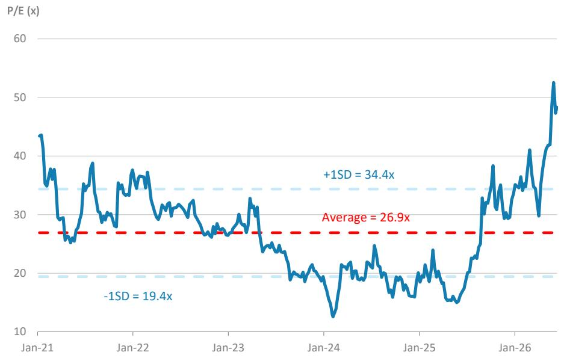

line chart

| Date    | P/E (x) |
|---------|---------|
| Jan-21  | 43.0    |
| Jan-22  | 38.0    |
| Jan-23  | 28.0    |
| Jan-24  | 13.0    |
| Jan-25  | 20.0    |
| Jan-26  | 52.0    |

Source: TEJ, MS estimates.

## Financials

Exhibit 24: Quarterly Estimates

<table><tr><td>RMB mn</td><td>1Q25</td><td>2Q25</td><td>3Q25</td><td>4Q25</td><td>1Q26</td><td>2Q26E</td><td>3Q26E</td><td>4Q26E</td><td>2025A</td><td>2026E</td><td>2027E</td><td>2028E</td></tr><tr><td>Net sales</td><td>4,783</td><td>5,671</td><td>6,301</td><td>6,893</td><td>6,596</td><td>7,780</td><td>8,612</td><td>9,247</td><td>23,647</td><td>32,234</td><td>42,154</td><td>53,710</td></tr><tr><td>COGS</td><td>(3,621)</td><td>(4,144)</td><td>(4,364)</td><td>(4,947)</td><td>(4,706)</td><td>(5,478)</td><td>(5,986)</td><td>(6,432)</td><td>(17,076)</td><td>(22,602)</td><td>(28,642)</td><td>(35,954)</td></tr><tr><td>Gross profit</td><td>1,162</td><td>1,527</td><td>1,937</td><td>1,946</td><td>1,889</td><td>2,301</td><td>2,627</td><td>2,815</td><td>6,571</td><td>9,632</td><td>13,512</td><td>17,756</td></tr><tr><td>Operating expenses</td><td>(622)</td><td>(668)</td><td>(860)</td><td>(887)</td><td>(804)</td><td>(934)</td><td>(1,033)</td><td>(1,073)</td><td>(3,038)</td><td>(3,843)</td><td>(4,794)</td><td>(5,752)</td></tr><tr><td>SG&amp;A, R&amp;D exp.</td><td>(622)</td><td>(668)</td><td>(860)</td><td>(887)</td><td>(804)</td><td>(934)</td><td>(1,033)</td><td>(1,073)</td><td>(3,038)</td><td>(3,843)</td><td>(4,794)</td><td>(5,752)</td></tr><tr><td>Employee bonus</td><td>13</td><td>14</td><td>15</td><td>16</td><td>17</td><td>18</td><td>19</td><td>20</td><td>1</td><td>2</td><td>3</td><td>4</td></tr><tr><td>Operating income</td><td>540</td><td>858</td><td>1,077</td><td>1,058</td><td>1,085</td><td>1,368</td><td>1,593</td><td>1,743</td><td>3,533</td><td>5,789</td><td>8,717</td><td>12,004</td></tr><tr><td>Non-operating income</td><td>(17)</td><td>117</td><td>(17)</td><td>6</td><td>(145)</td><td>(129)</td><td>(129)</td><td>(129)</td><td>91</td><td>(531)</td><td>(515)</td><td>(515)</td></tr><tr><td>Interest income</td><td>(131)</td><td>(93)</td><td>(116)</td><td>(82)</td><td>(179)</td><td>(179)</td><td>(179)</td><td>(179)</td><td>(422)</td><td>(715)</td><td>(715)</td><td>(715)</td></tr><tr><td>Investment income</td><td>3</td><td>0</td><td>(0)</td><td>0</td><td>(0)</td><td>(0)</td><td>(0)</td><td>(0)</td><td>3</td><td>(0)</td><td>(0)</td><td>(0)</td></tr><tr><td>Disposal of investment</td><td>0</td><td>0</td><td>0</td><td>0</td><td>0</td><td>0</td><td>0</td><td>0</td><td>0</td><td>0</td><td>0</td><td>0</td></tr><tr><td>Exchange gain</td><td>0</td><td>0</td><td>0</td><td>0</td><td>0</td><td>0</td><td>0</td><td>0</td><td>0</td><td>0</td><td>0</td><td>0</td></tr><tr><td>Other</td><td>111</td><td>210</td><td>100</td><td>88</td><td>34</td><td>50</td><td>50</td><td>50</td><td>509</td><td>184</td><td>200</td><td>200</td></tr><tr><td>Pre-tax income</td><td>523</td><td>976</td><td>1,060</td><td>1,065</td><td>941</td><td>1,239</td><td>1,464</td><td>1,614</td><td>3,624</td><td>5,258</td><td>8,202</td><td>11,489</td></tr><tr><td>Income tax</td><td>(31)</td><td>(106)</td><td>(93)</td><td>(114)</td><td>(89)</td><td>(136)</td><td>(117)</td><td>(129)</td><td>(345)</td><td>(472)</td><td>(710)</td><td>(993)</td></tr><tr><td>Minority interest</td><td>(1)</td><td>(0)</td><td>(1)</td><td>(0)</td><td>(1)</td><td>0</td><td>0</td><td>0</td><td>(3)</td><td>(1)</td><td>0</td><td>0</td></tr><tr><td>Net income</td><td>491</td><td>869</td><td>966</td><td>950</td><td>850</td><td>1,103</td><td>1,347</td><td>1,485</td><td>3,276</td><td>4,785</td><td>7,493</td><td>10,496</td></tr><tr><td>Adj.wtd.avg.shrs (mn)</td><td>667</td><td>667</td><td>667</td><td>667</td><td>667</td><td>667</td><td>667</td><td>667</td><td>667</td><td>667</td><td>667</td><td>667</td></tr><tr><td>EPS (RMB)</td><td>0.74</td><td>1.30</td><td>1.45</td><td>1.42</td><td>1.28</td><td>1.65</td><td>2.02</td><td>2.23</td><td>4.91</td><td>7.18</td><td>11.24</td><td>15.74</td></tr><tr><td>Fully diluted shares (mn)</td><td>667</td><td>667</td><td>667</td><td>667</td><td>667</td><td>667</td><td>667</td><td>667</td><td>667</td><td>667</td><td>667</td><td>667</td></tr><tr><td>Diluted EPS (RMB)</td><td>0.74</td><td>1.30</td><td>1.45</td><td>1.42</td><td>1.28</td><td>1.65</td><td>2.02</td><td>2.23</td><td>4.91</td><td>7.18</td><td>11.24</td><td>15.74</td></tr><tr><td>Margins (%)</td><td></td><td></td><td></td><td></td><td></td><td></td><td></td><td></td><td></td><td></td><td></td><td></td></tr><tr><td>Gross Margin</td><td>24.3</td><td>26.9</td><td>30.7</td><td>28.2</td><td>28.6</td><td>29.6</td><td>30.5</td><td>30.4</td><td>27.8</td><td>29.9</td><td>32.1</td><td>33.1</td></tr><tr><td>Operating Margin</td><td>11.3</td><td>15.1</td><td>17.1</td><td>15.4</td><td>16.5</td><td>17.6</td><td>18.5</td><td>18.8</td><td>14.9</td><td>18.0</td><td>20.7</td><td>22.3</td></tr><tr><td>Pretax Margin</td><td>10.9</td><td>17.2</td><td>16.8</td><td>15.4</td><td>14.3</td><td>15.9</td><td>17.0</td><td>17.5</td><td>15.3</td><td>16.3</td><td>19.5</td><td>21.4</td></tr><tr><td>Net Margin</td><td>10.3</td><td>15.3</td><td>15.3</td><td>13.8</td><td>12.9</td><td>14.2</td><td>15.6</td><td>16.1</td><td>13.9</td><td>14.8</td><td>17.8</td><td>19.5</td></tr><tr><td>QoQ Growth (%)</td><td></td><td></td><td></td><td></td><td></td><td></td><td></td><td></td><td></td><td></td><td></td><td></td></tr><tr><td>Sales</td><td>-2</td><td>19</td><td>11</td><td>9</td><td>-4</td><td>18</td><td>11</td><td>7</td><td></td><td></td><td></td><td></td></tr><tr><td>Gross Profit</td><td>12</td><td>31</td><td>27</td><td>0</td><td>-3</td><td>22</td><td>14</td><td>7</td><td></td><td></td><td></td><td></td></tr><tr><td>Operating Profit</td><td>47</td><td>59</td><td>25</td><td>-2</td><td>3</td><td>26</td><td>16</td><td>9</td><td></td><td></td><td></td><td></td></tr><tr><td>Pretax Profit</td><td>24</td><td>86</td><td>9</td><td>0</td><td>-12</td><td>32</td><td>18</td><td>10</td><td></td><td></td><td></td><td></td></tr><tr><td>Net Profit</td><td>26</td><td>77</td><td>11</td><td>-2</td><td>-10</td><td>30</td><td>22</td><td>10</td><td></td><td></td><td></td><td></td></tr><tr><td>YoY Growth (%)</td><td></td><td></td><td></td><td></td><td></td><td></td><td></td><td></td><td></td><td></td><td></td><td></td></tr><tr><td>Sales</td><td>21</td><td>30</td><td>33</td><td>42</td><td>38</td><td>37</td><td>37</td><td>34</td><td>32</td><td>36</td><td>31</td><td>27</td></tr><tr><td>Gross Profit</td><td>20</td><td>33</td><td>66</td><td>87</td><td>63</td><td>51</td><td>36</td><td>45</td><td>52</td><td>47</td><td>40</td><td>31</td></tr><tr><td>Operating Profit</td><td>30</td><td>41</td><td>73</td><td>188</td><td>101</td><td>59</td><td>48</td><td>65</td><td>75</td><td>64</td><td>51</td><td>38</td></tr><tr><td>Pretax Profit</td><td>29</td><td>46</td><td>102</td><td>151</td><td>80</td><td>27</td><td>38</td><td>52</td><td>79</td><td>45</td><td>56</td><td>40</td></tr><tr><td>Net Profit</td><td>29</td><td>43</td><td>93</td><td>144</td><td>73</td><td>27</td><td>39</td><td>56</td><td>74</td><td>46</td><td>57</td><td>40</td></tr></table>

Source: Company data, MS (E) estimates.

Exhibit 25: Consolidated Financial Summary  
Consolidated Income Statement

<table><tr><td>RMBmn (Year End Dec 31)</td><td>2025A</td><td>2026E</td><td>2027E</td><td>2028E</td></tr><tr><td>Net sales</td><td>23,647</td><td>32,234</td><td>42,154</td><td>53,710</td></tr><tr><td>COGS</td><td>(17,076)</td><td>(22,602)</td><td>(28,642)</td><td>(35,954)</td></tr><tr><td>Gross profit</td><td>6,571</td><td>9,632</td><td>13,512</td><td>17,756</td></tr><tr><td>Operating expenses</td><td>(3,038)</td><td>(3,843)</td><td>(4,794)</td><td>(5,752)</td></tr><tr><td>Operating income</td><td>3,533</td><td>5,789</td><td>8,717</td><td>12,004</td></tr><tr><td>Non-operating income</td><td>91</td><td>(531)</td><td>(515)</td><td>(515)</td></tr><tr><td>Interest income</td><td>(422)</td><td>(715)</td><td>(715)</td><td>(715)</td></tr><tr><td>Investment income</td><td>3</td><td>(0)</td><td>(0)</td><td>(0)</td></tr><tr><td>Disposal of investment</td><td>-</td><td>-</td><td>-</td><td>-</td></tr><tr><td>Exchange gain</td><td>-</td><td>-</td><td>-</td><td>-</td></tr><tr><td>Other</td><td>509</td><td>184</td><td>200</td><td>200</td></tr><tr><td>Pre-tax income</td><td>3,624</td><td>5,258</td><td>8,202</td><td>11,489</td></tr><tr><td>Income tax</td><td>(345)</td><td>(472)</td><td>(710)</td><td>(993)</td></tr><tr><td>Minority interests</td><td>(3)</td><td>(1)</td><td>-</td><td>-</td></tr><tr><td>Net income</td><td>3,276</td><td>4,785</td><td>7,493</td><td>10,496</td></tr><tr><td>Adj. wtd. Avg. shrs (m)</td><td>667</td><td>667</td><td>667</td><td>667</td></tr><tr><td>Reported EPS (Rmb)</td><td>4.91</td><td>7.18</td><td>11.24</td><td>15.74</td></tr><tr><td>Diluted shrs (m)</td><td>667</td><td>667</td><td>667</td><td>667</td></tr><tr><td>Diluted EPS (Rmb)</td><td>4.91</td><td>7.18</td><td>11.24</td><td>15.74</td></tr></table>

Consolidated Cash Flow Statement

<table><tr><td>RMBmn (Year End Dec 31)</td><td>2025A</td><td>2026E</td><td>2027E</td><td>2028E</td></tr><tr><td>Operating Cashflow</td><td>3,838</td><td>9,303</td><td>7,842</td><td>10,971</td></tr><tr><td>Net Profits</td><td>3,276</td><td>4,785</td><td>7,493</td><td>10,496</td></tr><tr><td>Depreciation &amp; Amort.</td><td>0</td><td>0</td><td>0</td><td>0</td></tr><tr><td>Investment losses/(income)</td><td>(3)</td><td>0</td><td>0</td><td>0</td></tr><tr><td>Working capital change</td><td>(802)</td><td>3,830</td><td>399</td><td>533</td></tr><tr><td>Other adjustments</td><td>1,368</td><td>688</td><td>(50)</td><td>(58)</td></tr><tr><td>Investing Cashflow</td><td>(3,756)</td><td>(5,125)</td><td>(6,702)</td><td>(8,539)</td></tr><tr><td>Capex</td><td>(3,765)</td><td>(5,133)</td><td>(6,712)</td><td>(8,553)</td></tr><tr><td>Change of L/T investment</td><td>0</td><td>0</td><td>0</td><td>0</td></tr><tr><td>Change of S/T investment</td><td>0</td><td>0</td><td>0</td><td>0</td></tr><tr><td>Other adjustments</td><td>4</td><td>0</td><td>0</td><td>0</td></tr><tr><td>Financing Cashflow</td><td>(650)</td><td>(481)</td><td>(786)</td><td>(1,631)</td></tr><tr><td>Increase in L/T debt</td><td>207</td><td>0</td><td>0</td><td>0</td></tr><tr><td>Increase in S/T debt</td><td>0</td><td>500</td><td>500</td><td>500</td></tr><tr><td>Issuance of stock</td><td>0</td><td>(154)</td><td>0</td><td>0</td></tr><tr><td>Cash dividends</td><td>(846)</td><td>(1,081)</td><td>(1,579)</td><td>(2,473)</td></tr><tr><td>Other adjustments</td><td>(11)</td><td>254</td><td>293</td><td>342</td></tr><tr><td>FX adjustment</td><td>12</td><td>0</td><td>0</td><td>0</td></tr><tr><td>Net change in cash</td><td>(555)</td><td>3,697</td><td>355</td><td>801</td></tr></table>

Consolidated Balance Sheet

<table><tr><td>RMBmn (Year End Dec 31)</td><td>2025A</td><td>2026E</td><td>2027E</td><td>2028E</td></tr><tr><td>Cash</td><td>997</td><td>4,694</td><td>5,048</td><td>5,850</td></tr><tr><td>Mkt securities</td><td>-</td><td>-</td><td>-</td><td>-</td></tr><tr><td>AR/NR</td><td>6,669</td><td>3,546</td><td>4,637</td><td>5,908</td></tr><tr><td>Inventory</td><td>5,140</td><td>3,390</td><td>4,296</td><td>5,393</td></tr><tr><td>Others</td><td>849</td><td>161</td><td>211</td><td>269</td></tr><tr><td>Current Assets</td><td>13,654</td><td>11,791</td><td>14,192</td><td>17,419</td></tr><tr><td>Long-term investments</td><td>3</td><td>3</td><td>3</td><td>3</td></tr><tr><td>Fixed assets</td><td>15,190</td><td>20,315</td><td>27,017</td><td>35,556</td></tr><tr><td>Other assets</td><td>1,736</td><td>1,736</td><td>1,736</td><td>1,736</td></tr><tr><td>Total Assets</td><td>30,583</td><td>33,845</td><td>42,948</td><td>54,714</td></tr><tr><td>S/T borrowings</td><td>15</td><td>515</td><td>1,015</td><td>1,515</td></tr><tr><td>AP/NP</td><td>5,625</td><td>3,164</td><td>4,010</td><td>5,033</td></tr><tr><td>Other ST liabilities</td><td>4,384</td><td>5,803</td><td>7,353</td><td>9,230</td></tr><tr><td>Total Current Liabilities</td><td>10,024</td><td>9,482</td><td>12,378</td><td>15,779</td></tr><tr><td>L/T debt</td><td>2,679</td><td>2,679</td><td>2,679</td><td>2,679</td></tr><tr><td>Other LT liabilities</td><td>699</td><td>953</td><td>1,246</td><td>1,588</td></tr><tr><td>Total Liabilities</td><td>13,402</td><td>13,114</td><td>16,303</td><td>20,046</td></tr><tr><td>Common shares</td><td>667</td><td>513</td><td>513</td><td>513</td></tr><tr><td>Retained Earnings</td><td>10,024</td><td>13,728</td><td>19,642</td><td>27,666</td></tr><tr><td>Other SH&#x27; Equity</td><td>6,490</td><td>6,490</td><td>6,490</td><td>6,490</td></tr><tr><td>Total Shareholders&#x27; Equity</td><td>17,181</td><td>20,731</td><td>26,645</td><td>34,668</td></tr><tr><td>Total Liab./SH&#x27;s Equity</td><td>30,583</td><td>33,845</td><td>42,948</td><td>54,714</td></tr></table>

Consolidated Financial Ratios

<table><tr><td></td><td>2025A</td><td>2026E</td><td>2027E</td><td>2028E</td></tr><tr><td colspan="5">Margins (%)</td></tr><tr><td>Gross margin</td><td>27.8</td><td>29.9</td><td>32.1</td><td>33.1</td></tr><tr><td>Operating margin</td><td>14.9</td><td>18.0</td><td>20.7</td><td>22.3</td></tr><tr><td>Pretax margin</td><td>15.3</td><td>16.3</td><td>19.5</td><td>21.4</td></tr><tr><td>Net margin</td><td>13.9</td><td>14.8</td><td>17.8</td><td>19.5</td></tr><tr><td colspan="5">YoY growth (%)</td></tr><tr><td>Sales</td><td>32.1</td><td>36.3</td><td>30.8</td><td>27.4</td></tr><tr><td>Operating profits</td><td>75.4</td><td>63.8</td><td>50.6</td><td>37.7</td></tr><tr><td>Pretax profits</td><td>79.1</td><td>45.1</td><td>56.0</td><td>40.1</td></tr><tr><td>Net profits</td><td>74.5</td><td>46.1</td><td>56.6</td><td>40.1</td></tr><tr><td colspan="5">Others</td></tr><tr><td>Cash dividend payout (%)</td><td>33</td><td>33</td><td>33</td><td>-</td></tr><tr><td>Cash div (Rmb)</td><td>1.6</td><td>2.4</td><td>3.7</td><td>5.2</td></tr><tr><td>Yield (%)</td><td>1</td><td>1</td><td>2</td><td>3</td></tr><tr><td>Net Debt/Equity (%)</td><td>10</td><td>(7)</td><td>(5)</td><td>(5)</td></tr><tr><td>Liabilities/Equity (%)</td><td>78</td><td>63</td><td>61</td><td>58</td></tr><tr><td>Liabilities/Assets (%)</td><td>44</td><td>39</td><td>38</td><td>37</td></tr><tr><td>ROAE (%)</td><td>21</td><td>25</td><td>32</td><td>34</td></tr><tr><td>ROAA (%)</td><td>12</td><td>15</td><td>20</td><td>21</td></tr><tr><td>AR/NR Turnover (days)</td><td>91</td><td>58</td><td>35</td><td>36</td></tr><tr><td>Inventory Turnover (days)</td><td>91</td><td>69</td><td>49</td><td>49</td></tr><tr><td>AP/NP Turnover (days)</td><td>107</td><td>71</td><td>46</td><td>46</td></tr><tr><td>Cash conversion cycle</td><td>75</td><td>56</td><td>39</td><td>39</td></tr></table>

Source: Company data, MS (E) estimates.

## Risk Reward – Zhen Ding (4958.TW)

Growing China & International AI chip substrate and PCB vendor

## PRICE TARGET NT\$666.00

Base case, residual income model. Key assumptions include a cost of equity of 10%, a medium-term growth rate of 15% and a terminal growth rate of 3%.

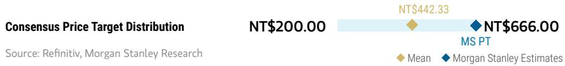

bar-line hybrid chart

| Category | Value     |
| -------- | --------- |
| NT$200.00 | 200.00    |
| NT$442.33 | 442.33    |
| NT$666.00 | 666.00    |

RISK REWARD CHART  
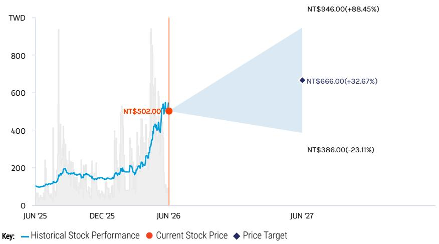

line chart

| Date    | Historical Stock Performance | Current Stock Price | Price Target |
|---------|-------------------------------|---------------------|--------------|
| Jun '25 | ~100                          | -                   | -            |
| Dec '25 | ~150                          | -                   | -            |
| Jun '26 | NT$502.00                     | NT$502.00           | -            |
| Jun '27 | -                             | -                   | NT$666.00     |
| Jun '27 | -                             | -                   | NT$946.00     |

Source: Refinitiv, MS

## OVERWEIGHT THESIS

■ iPhone volumes are more resilient than Android given Apple's advantages on securing memory.  
■ ZDT is one of the key ABF substrate suppliers for China AI chips, which is expected to grow meaningfully over the next few years.  
■ ZDT is growing its ABF exposure to International clients as well, including Google TPU.  
■ AI optical transceiver module PCB is a meaningful growth driver for ZDT, with very good margins (GM 40%+).  
■ Shenzhen ABF fab 1 continues to ramp and has turned profitable in 1Q26, and fab 2 is now under construction. Kaohsiung fab is on track to enter mass production in 2H26.  
■ Our PT implies 27x/20x CY27e/28e P/E.

Consensus Rating Distribution  
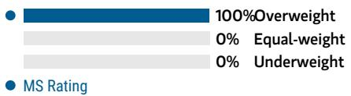

bar chart

| Metric       | Value |
| ------------ | ----- |
| Overweight   | 100%  |
| Equal-weight | 0%    |
| Underweight  | 0%    |

Source: Refinitiv, MS

## Risk Reward Themes

Pricing Power: Negative

View descriptions of Risk Rewards Themes here

## BULL CASE

## 37x 2027e P/E

Greater share gains and better earnings contribution from new projects in ABF and AI Server PCBs: In the bull case, we assume ZDT is able to do Google TPU substrate extremely well and uses it to approach other ASIC/GPU customers, expanding its international client base. Additionally, we also assume ZDT expands Nvidia AI PCB share to 20-30% share on good execution and yield.

## NT\$946.00

## BASE CASE

## 27.5x 2027e P/E

Stable demand for F-PCB and SLP, with share gains in BT/ABF substrates, and AI server PCBs: Zhen Ding is one of the main ABF substrate suppliers for China AI chips, while growing its share for international clients, potentially starting with Google TPU. At the same time, it continues to grow its AI server PCB share with Nvidia and other hyperscalers, and grows its exposure to optical module transceivers.

## NT\$666.00

## BEAR CASE

## 16x 2027e P/E

Weaker iPhone demand with share loss and ZDT does not execute on Google TPU substrates: iPhone demand misses market expectations, Zhen Ding loses share in F-PCB to Chinese peers, and SLP demand is also weak. We also assume here that ZDT fails to execute on TPU substrates and only continues to have exposure to China AI chips, with less than 5% share for Nvidia AI PCBs.

## NT\$386.00

## Risk Reward – Zhen Ding (4958.TW)

KEY EARNINGS INPUTS

<table><tr><td>Drivers</td><td>2025</td><td>2026e</td><td>2027e</td><td>2028e</td></tr><tr><td>F-PCB sales y/y (%)</td><td>5.0</td><td>1.2</td><td>14.6</td><td>7.3</td></tr><tr><td>F-PCB GM (%)</td><td>21.3</td><td>24.2</td><td>24.6</td><td>25.6</td></tr><tr><td>F-PCB ASP per sq ft (NT$)</td><td>59.5</td><td>60.4</td><td>63.1</td><td>65.3</td></tr></table>

## INVESTMENT DRIVERS

- iPhone, MacBook, iPad demand  
• F-PCB content per iPhone, MacBook, iPad  
- F-PCB ASP  
• Yield rate for ABF/BT substrates

## GLOBAL REVENUE EXPOSURE

0-10%

APAC, ex Japan, Mainland China and India

0-10%

Latin America

10-20%

Mainland China

70-80%

North America

Source: MS Estimate View explanation of regional hierarchies here

## MS ALPHA MODELS

3/5 MOST

3 Month Horizon

Source: Refinitiv, FactSet, MS; 1 is the highest favored Quintile and 5 is the least favored Quintile

## RISKS TO PT/RATING

## RISKS TO UPSIDE

- Higher-than-expected F-PCB content increase for iPhones  
- Better-than-expected production yield/share allocation for SLP  
- Share gains on higher margin F-PCB pieces

## RISKS TO DOWNSIDE

- Worse-than-expected iPhone sell-through  
- Lower-than-expected F-PCB content increase for iPhones  
- Worse-than-expected production yield/share allocation for SLP  
- Increasing competition from Chinese peers, intensifying pricing pressure

## OWNERSHIP POSITIONING

Inst. Owners, % Active

65.6%

Source: Refinitiv, MS

## MS ESTIMATES VS. CONSENSUS

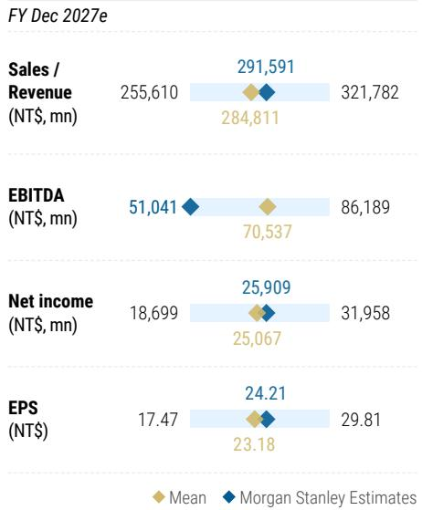

bar-line hybrid chart

FY Dec 2027e
| Metric | Mean (NT$ mn) | MS Estimates (NT$ mn) |
| :--- | :--- | :--- |
| Sales / Revenue | 255,610 | 284,811 |
| EBITDA | 51,041 | 70,537 |
| Net income | 18,699 | 25,067 |
| EPS | 17.47 | 23.18 |
| Sales / Revenue (MS Estimates) | 291,591 | 321,782 |
| EBITDA (MS Estimates) | 86,189 | - |
| Net income (MS Estimates) | 25,909 | 31,958 |
| EPS (MS Estimates) | 24.21 | 29.81 |

Source: Refinitiv, MS

## Risk Reward – Unimicron (3037.TW)

Price hikes and spec upgrades to support higher earnings estimates; OW

## PRICE TARGET NT\$1,285.00

Base case, residual income (RI) valuation model, which we think derives the most accurate value of the firm given that it takes into account cost of equity. We use a cost of equity of 9.2% [risk-free rate of 1% (10-year Taiwan government note yield), equity risk premium of 8.7%, and a beta of 1.0], a medium-term growth rate of 15%, and a terminal growth rate of 3%.

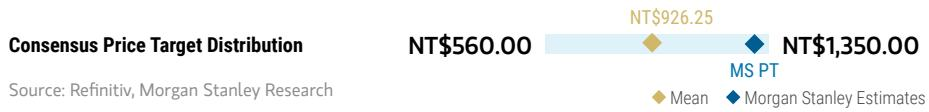

bar-line hybrid chart

| Consensus Price Target Distribution | NT$560.00 | NT$926.25 | NT$1,350.00 |
| --- | --- | --- | --- |
| Source: Refinitiv, MS |  |  |  |
|  |  |  |  |
|  |  |  |  |
|  |  |  |  |
|  |  |  |  |
|  |  |  |  |
|  |  |  |  |
|  |  |  |  |
|  |  |  |  |
|  |  |  |  |
|  |  |  |  |
|  |  |  |  |
| - Mean |  |  |  |
| - MS Estimates |  |  |  |
| - MS PT |  |  |  |
| - |  |  |  |
| - |  |  |  |
| - |  |  |  |
| - |  |  |  |
| - |  |  |  |
| - |  |  |  |
| - |  |  |  |
| - |  |  |  |
| - |  |  |  |

RISK REWARD CHART  
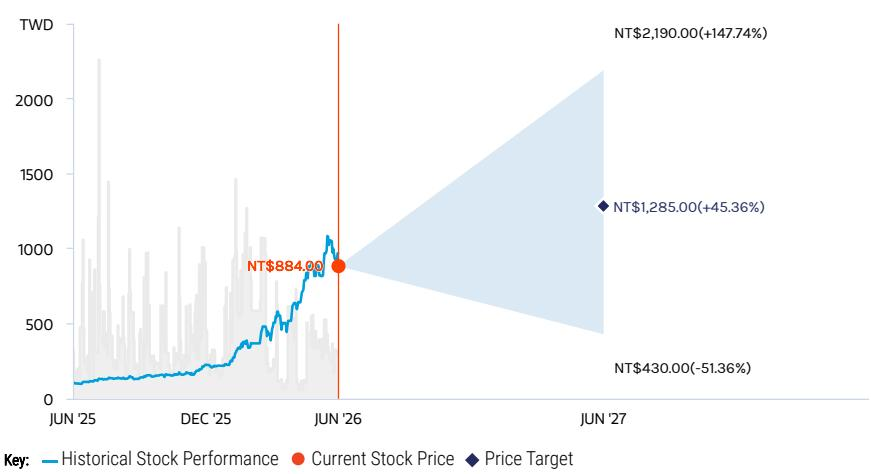

line chart

| Date       | Historical Stock Performance | Current Stock Price | Price Target |
| ---------- | ----------------------------- | ------------------- | ------------ |
| Jun '26    | NT$884.00                     | -                   | -            |
| Jun '27    | NT$1,285.00                  | +45.36%             | NT$2,190.00  |

Source: Refinitiv, MS

## OVERWEIGHT THESIS

■ We expect the ABF substrate market to revert to undersupply from 2027 onwards, with the undersupply gap reaching 5-10% by 2030.  
■ This is primarily driven by AI demand, with next-gen AI/networking chips adopting larger body size ABF substrates.  
In the near to medium term, the short supply of T-glass will be a key watch point, but we believe this will mainly affect low-end ABF and BT substrates, as suppliers prioritize supply to the AI chip vendors.

\- Our price target implies 51x 2027e P/E or 25x 2028e P/E, above the 10-20x range at which it traded in the previous upcycle. We deem this fair, given AI chip substrate spec upgrades and suppliers' ability to raise prices.

Consensus Rating Distribution  
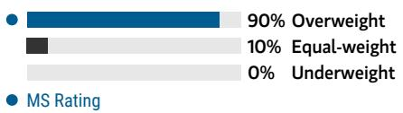

bar chart

| Category      | Value |
| ------------- | ----- |
| Overweight    | 90%   |
| Equal-weight  | 10%   |
| Underweight   | 0%    |

Source: Refinitiv, MS

## Risk Reward Themes

Pricing Power: Positive

Secular Growth: Positive

View descriptions of Risk Rewards Themes here

## BULL CASE

## 87x 2027e P/E

Demand for AI servers, general servers and PCs is much stronger than expected: Pricing increases more than expected, 30%+ in 2026-27, driving stronger margin expansion for Unimicron.

## NT\$2,190.00

## BASE CASE

## 51x 2027e P/E

Entering up-cycle driven by AI chip upgrades: Robust demand for AI GPUs and ASICs, supported by continued data center infrastructure investments by CSPs and neo cloud, leads to undersupply in the high-end ABF market from 2027e onwards. PC demand is sluggish, while general servers still show double-digit unit growth in 2026e. ASP has bottomed and started to inflect upwards, driven by raw material price hikes and substrate spec upgrades.

## NT\$1,285.00

## BEAR CASE

## 17x 2027e P/E

Demand for AI servers and general servers weakens, with PC demand weakening further: The result is greater ABF oversupply; thus, there are pricing declines of \~15-20% in 2026-27, leading to weaker margins for Unimicron over the next two years.

## NT\$430.00

## Risk Reward – Unimicron (3037.TW)

KEY EARNINGS INPUTS

<table><tr><td>Drivers</td><td>2025</td><td>2026e</td><td>2027e</td><td>2028e</td></tr><tr><td>IC substrate ASP YoY (%)</td><td>7.5</td><td>29.7</td><td>33.5</td><td>29.3</td></tr><tr><td>IC substrate GM (%)</td><td>15.2</td><td>22.3</td><td>28.6</td><td>37.1</td></tr></table>

## INVESTMENT DRIVERS

- 5G smartphone demand  
- 5G base station demand  
• Automotive demand

## GLOBAL REVENUE EXPOSURE

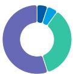

0-10% Latin America  
0-10% North America  
30-40% APAC, ex Japan, Mainland China and India  
50-60% Mainland China

Source: MS Estimate View explanation of regional hierarchies here

## MS ALPHA MODELS

4/5

MOST

3 Month

Horizon

Source: Refinitiv, FactSet, MS; 1 is the highest favored Quintile and 5 is the least favored Quintile

## RISKS TO PT/RATING

## RISKS TO UPSIDE

- Better-than-expected ABF substrate demand from PC and server customers  
- Capex cuts; halt to its capacity expansion plan  
- Continued yield issues of alternative technology that doesn't require substrate (e.g., CoWoP)

## RISKS TO DOWNSIDE

- Sudden demand shortfall  
- Technological change that would not require ABF substrates  
- Intensifying competition  
- Yield issues or production hiccups when ramping new capacity

## OWNERSHIP POSITIONING

Inst. Owners, % Active

68.8%

Source: Refinitiv, MS

MS ESTIMATES VS. CONSENSUS

<table><tr><td colspan="3">FY Dec 2027e</td></tr><tr><td rowspan="2">Sales / Revenue (NT$, mn)</td><td rowspan="2">192,100</td><td>262,464</td></tr><tr><td>241,969</td></tr><tr><td rowspan="2">Net income (NT$, mn)</td><td rowspan="2">28,608</td><td>38,875</td></tr><tr><td>43,767</td></tr><tr><td rowspan="2">EPS (NT$)</td><td rowspan="2">15.89</td><td>25.26</td></tr><tr><td>27.56</td></tr></table>

Source: Refinitiv, MS

## Risk Reward – Shennan Circuits Co Ltd (002916.SZ)

Beneficiary of supply chain localization; EW on valuation

## PRICE TARGET Rmb400.00

Base case, derived from a residual income (RI) model. Key assumptions include a cost of equity of 6.7% (beta of 1.1, equity premium of 5%, and risk-free rate of 1.3%), 7% medium-term growth rate, and 4% terminal growth rate.

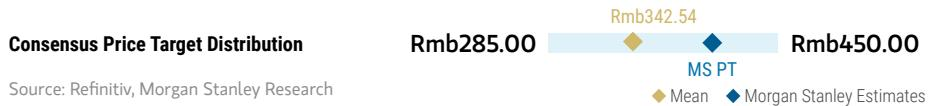

bar-line hybrid chart

| Price Target | Value     |
| ------------ | --------- |
| Rmb285.00    | Rmb342.54 |
| Rmb450.00    | Rmb450.00 |

RISK REWARD CHART  
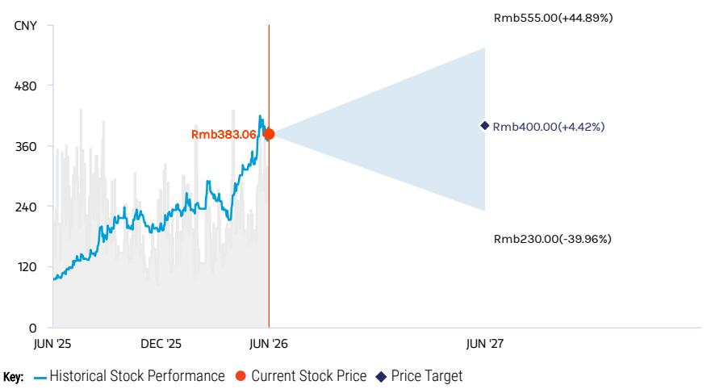

line chart

| Date     | Historical Stock Performance | Current Stock Price | Price Target |
| -------- | ----------------------------- | ------------------- | ------------ |
| JUN '25  | ~120                          | -                   | -            |
| DEC '25  | ~240                          | -                   | -            |
| JUN '26  | ~383.06                       | Rmb383.06           | -            |
| JUN '27  | -                             | -                   | Rmb555.00    |
| -        | -                             | -                   | Rmb400.00    |
| -        | -                             | -                   | Rmb230.00    |

Source: Refinitiv, MS

## EQUAL-WEIGHT THESIS

■ We view the stock as fairly valued based on current demand indicators, with expectations for rising automotive and data center PCB already elevated for 2026-27.  
■ Shennan's "China localization" story should continue to play out in the longer term for PCB and IC substrates, and it should be the main beneficiary amid China's semiconductor self-sufficiency drive.  
■ Demand for 5G base station PCB was slow in 2025, and has remained slow in 2026, with limited visibility on the trajectory of demand improvement (both domestic and overseas).  
■ Server/Optical transceiver PCB demand is improving for cloud in China, and new platform penetration rate continues to rise.

Consensus Rating Distribution  
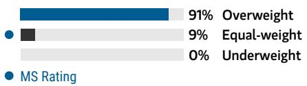

bar chart

| Category     | Value |
| ------------ | ----- |
| Overweight   | 91%   |
| Equal-weight | 9%    |
| Underweight  | 0%    |

Source: Refinitiv, MS

## Risk Reward Themes

Electric Vehicles: Positive

New Data Era: Positive

Pricing Power: Negative

View descriptions of Risk Rewards Themes here

## BULL CASE

## 50x 2027e EPS

Shennan's share of the 5G base station market expands to 20-25% (vs. base case scenario of 15-20%), while its automotive and server PCB business doubles over the next two years and its IC substrate business grows 40-50% YoY in 2026 (vs. base case scenario of \~30%). This results in a 55-65% revenue CAGR in 2025-28e.

## Rmb555.00

## BASE CASE

## 36x 2027e EPS

We expect Shennan's share of the 5G base station market to be stable at 15-20%, while its server and automotive PCB continues to rise steadily and its IC substrate business continues to outgrow the market in 2026e as they gain share, especially in the domestic market. This results in a 30-35% revenue CAGR in 2025-28e.

## Rmb400.00

## BEAR CASE

## Rmb230.00

## 21x 2027e EPS

Shennan's share of the 5G base station market falls to 5-10% (vs. base case scenario of 15-20%), while its server and automotive PCB fails to continue to grow and its IC substrate business grows only slightly above the market in 2026. This results in a 0-15% revenue CAGR in 2025-28e.

## Risk Reward – Shennan Circuits Co Ltd (002916.SZ)

KEY EARNINGS INPUTS

<table><tr><td>Drivers</td><td>2025</td><td>2026e</td><td>2027e</td><td>2028e</td></tr><tr><td>PCB revenue y/y (%)</td><td>37</td><td>38</td><td>31</td><td>31</td></tr><tr><td>IC substrate revenue y/y (%)</td><td>31</td><td>69</td><td>36</td><td>27</td></tr><tr><td>PCB GM (%)</td><td>35.5</td><td>34.7</td><td>37.0</td><td>37.8</td></tr><tr><td>IC substrate GM (%)</td><td>22.6</td><td>30.7</td><td>33.6</td><td>33.6</td></tr></table>

## INVESTMENT DRIVERS

- 5G base station deployment schedule  
• Supplier share allocation  
• China's data center demand  
• China's semiconductor localization schedule

## GLOBAL REVENUE EXPOSURE

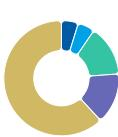

0-10% Latin America  
0-10% North America  
10-20% APAC, ex Japan, Mainland  
10 26% China and India  
10-20% Europe ex UK  
60-70% Mainland China

Source: MS Estimate View explanation of regional hierarchies here

## MS ALPHA MODELS

3/5

MOST

3 Month

Horizon

Source: Refinitiv, FactSet, MS; 1 is the highest favored Quintile and 5 is the least favored Quintile

## RISKS TO PT/RATING

## RISKS TO UPSIDE

- Rising demand for 5G and data center PCB.  
• Further share gain for 5G and data center PCB.  
- Rising IC substrate demand driven by acceleration in China's semiconductor localization.

## RISKS TO DOWNSIDE

- Rising competition for 5G and data center PCB.  
- Delay in 5G network deployment.  
- Escalating US-China trade tensions.

## OWNERSHIP POSITIONING

Inst. Owners, % Active

85.3%

Source: Refinitiv, MS

## MS ESTIMATES VS. CONSENSUS

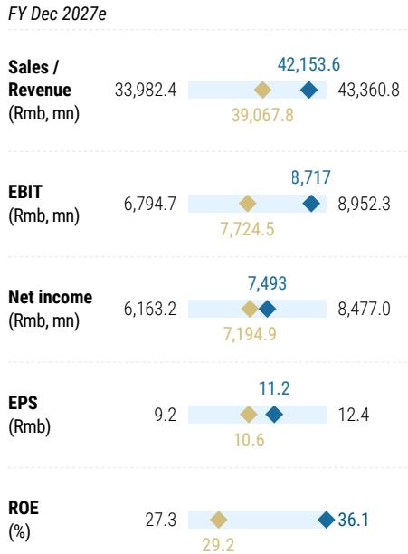

bar-line hybrid chart

FY Dec 2027e
| Metric | Value (Rmb, mn) | Diamond Value | Circle Value |
| :--- | :--- | :--- | :--- |
| Sales / Revenue | 33,982.4 | 42,153.6 | 39,067.8 |
| EBIT (Rmb, mn) | 6,794.7 | 8,717 | 7,724.5 |
| Net income (Rmb, mn) | 6,163.2 | 7,493 | 7,194.9 |
| EPS (Rmb) | 9.2 | 11.2 | 10.6 |
| ROE (%) | 27.3 | 36.1 | 29.2 |
| Sales / Revenue (Rmb, mn) | 43,360.8 | 42,153.6 | 39,067.8 |
| EBIT (Rmb, mn) | 8,952.3 | 8,717 | 7,724.5 |
| Net income (Rmb, mn) | 8,477.0 | 7,493 | 7,194.9 |
| EPS (Rmb) | 12.4 | 11.2 | 10.6 |
The chart displays a single data point for the 'ROE (%)' series at the bottom of the bar chart.

Source: Refinitiv, MS

## Risk Reward Reference links

1. View explanation of Options Probabilities methodology -  
Options\_Probabilities\_Exhibit\_Link.pdf  
2. View descriptions of Risk Rewards Themes - RR\_Themes\_Exhibit\_Link.pdf  
3. View explanation of regional hierarchies - GEG\_Exhibit\_Link.pdf  
4. View explanation of Theme/Exposure methodology -  
ESG\_Sustainable\_Solutions\_External\_Link.pdf  
5. View explanation of HERS methodology - ESG\_HERS\_External\_Link.pdf

## Disclosure Section

The information and opinions in MS were prepared or are disseminated by MS Asia Limited (which accepts the responsibility for its contents) and/or MS Asia (Singapore) Pte. (Registration number 199206298Z) and/or MS Asia (Singapore) Securities Pte Ltd (Registration number 200008434H), regulated by the Monetary Authority of Singapore (which accepts legal responsibility for its contents and should be contacted with respect to any matters arising from, or in connection with, MS), and/or MS Taiwan Limited and/or MS & Co International plc, Seoul Branch, and/or MS Australia Limited (A.B.N. 67 003 734 576, holder of Australian financial services license No. 233742, which accepts responsibility for its contents), and/or MS Wealth Management Australia Pty Ltd (A.B.N. 19 009 145 555, holder of Australian financial services license No. 240813, which accepts responsibility for its contents), and/or MS India Company Private Limited having Corporate Identification No (CIN) U22990MH1998PTC115305, regulated by the Securities and Exchange Board of India ("SEBI") and holder of licenses as a Research Analyst (SEBI Registration No. INH000001105); Stock Broker (SEBI Stock Broker Registration No. INZ000244438), Merchant Banker (SEBI Registration No. INM000011203), and depository participant with National Securities Depository Limited (SEBI Registration No. IN-DP-NSDL-567-2021) having registered office at Altimus, Level 39 & 40, Pandurang Budhkar Marg, Worli, Mumbai 400018, India; Telephone no. +91-22-61181000; Compliance Officer Details: Mr. Tejarshi Hardas, Tel. No.: +91-22-61181000 or Email: tejarshi.hardas@morganstanley.com; Grievance officer details: Mr. Tejarshi Hardas, Tel. No.: +91-22-61181000 or Email: msic-compliance@morganstanley.com which accepts the responsibility for its contents and should be contacted with respect to any matters arising from, or in connection with, MS, and their affiliates (collectively, "MS"). MS India Company Private Limited (MSICPL) may use AI tools in providing research services. All recommendations contained herein are made by the duly qualified research analysts.

For important disclosures, stock price charts and equity rating histories regarding companies that are the subject of this report, please see the MS Disclosure Website at www.morganstanley.com/eqr/disclosures/webapp/generalresearch, or contact your investment representative or MS at 1585 Broadway, (Attention: Research Management), New York, NY, 10036 USA.

For valuation methodology and risks associated with any recommendation, rating or price target referenced in this research report, please contact the Client Support Team as follows: US/Canada +1 800 303-2495; Hong Kong +852 2848-5999; Latin America +1 718 754-5444 (U.S.); London +44 (0)20-7425-8169; Singapore +65 6834-6860; Sydney +61 (0)2-9770-1505; Tokyo +81 (0)3-6836-9000. Alternatively you may contact your investment representative or MS at 1585 Broadway, (Attention: Research Management), New York, NY 10036 USA.

## Analyst Certification

The following analysts hereby certify that their views about the companies and their securities discussed in this report are accurately expressed and that they have not received and will not receive direct or indirect compensation in exchange for expressing specific recommendations or views in this report: Howard Kao; Sharon Shih.

## Global Research Conflict Management Policy

MS has been published in accordance with our conflict management policy, which is available at www.morganstanley.com/institutional/research/conflictpolicies. A Portuguese version of the policy can be found at www.morganstanley.com.br

## Important Regulatory Disclosures on Subject Companies

As of May 29, 2026, MS beneficially owned 1% or more of a class of common equity securities of the following companies covered in MS: AAC Technologies Holdings, Accelink Technologies Co. Ltd., Acer Inc., AirTAC International, Asia Vital Components Co. Ltd., AU Optronics, Auras Technology Co Ltd, Bizlink, Catcher Technology, Chenbro, Compal Electronics, Delta Electronics Inc., E Ink Holdings Inc., Eoptolink Technology Inc Ltd, Fositek Corp, Genius Electronic Optical Co. Ltd., Giga-Byte Technology Co. Ltd., Gold Circuit Electronics Ltd., Hiwin Technologies Corp., Innolux, LandMark Optoelectronics Corporation, Lite-On Technology, Nan Ya PCB, Pegatron Corporation, Sunny Optical, Sunonwealth Electric Machine Industry Co, Suzhou TFC Optical Communication Co Ltd., TCL Corp., Tong Hsing, Unimicron, Visual Photonics Epitaxy Co Ltd, Wistron Corporation, Wiwynn Corp, Wuhan Jingce Electronic Group Co Ltd, Xiaomi Corp, Yageo Corp., Zhejiang Crystal-Optech Co Ltd, Zhen Ding, Zhongji Innolight Co Ltd, ZTE Corporation.

Within the last 12 months, MS managed or co-managed a public offering (or 144A offering) of securities of Wistron Corporation, Wiwynn Corp, Zhen Ding.

Within the last 12 months, MS has received compensation for investment banking services from Lenovo, Wistron Corporation, Wiwynn Corp, Xiaomi Corp, Yageo Corp., Zhen Ding. In the next 3 months, MS expects to receive or intends to seek compensation for investment banking services from AAC Technologies Holdings, Accton Technology Corporation, Acer Inc., Advantech, AirTAC International, Asia Vital Components Co. Ltd., Asustek Computer Inc., AU Optronics, Bizlink, Catcher Technology, Chenbro, Compal Electronics, Delta Electronics Inc., E Ink Holdings Inc., Ennostar Inc, Eoptolink Technology Inc Ltd, FIT Hon Teng Ltd, Giga-Byte Technology Co. Ltd., GoerTek Inc, Gold Circuit Electronics Ltd., Hon Hai Precision, Innolux, Lenovo, Lens Technology, Lingyi Itech Guangdong Co, Lite-On Technology, Luxshare Precision Industry Co., Ltd., Pegatron Corporation, Q Technology (Group) Company Ltd, Quanta Computer Inc., Sanan Optoelectronics, Shenzhen Transsion Holdings Co Ltd, Suzhou TFC Optical Communication Co Ltd., TCL Corp., Unimicron, Wistron Corporation, Wiwynn Corp, Xiaomi Corp, Yageo Corp., Yangtze Optical Fibre and Cable JSC Ltd, Zhen Ding, Zhongji Innolight Co Ltd.

Within the last 12 months, MS has received compensation for products and services other than investment banking services from AAC Technologies Holdings, Accton Technology Corporation, Acer Inc., Asustek Computer Inc., AU Optronics, BYD Electronics, Compal Electronics, E Ink Holdings Inc., Eoptolink Technology Inc Ltd, Foxconn Technology, Giga-Byte Technology Co. Ltd., GoerTek Inc, Hon Hai Precision, Innolux, Lenovo, Lingyi Itech Guangdong Co, Quanta Computer Inc., Xiaomi Corp, Yageo Corp..

Within the last 12 months, MS has provided or is providing investment banking services to, or has an investment banking client relationship with, the following company: AAC Technologies Holdings, Accton Technology Corporation, Acer Inc., Advantech, AirTAC International, Asia Vital Components Co. Ltd., Asustek Computer Inc., AU Optronics, Bizlink, Catcher Technology, Chenbro, Compal Electronics, Delta Electronics Inc., E Ink Holdings Inc., Ennostar Inc, Eoptolink Technology Inc Ltd, FIT Hon Teng Ltd, Giga-Byte Technology Co. Ltd., GoerTek Inc, Gold Circuit Electronics Ltd., Hon Hai Precision, Innolux, Lenovo, Lens Technology, Lingyi Itech Guangdong Co, Lite-On Technology, Luxshare Precision Industry Co., Ltd., Pegatron Corporation, Q Technology (Group) Company Ltd, Quanta Computer Inc., Sanan Optoelectronics, Shenzhen Transsion Holdings Co Ltd, Suzhou TFC Optical Communication Co Ltd., TCL Corp., Unimicron, Wistron Corporation, Wiwynn Corp, Xiaomi Corp, Yageo Corp., Yangtze Optical Fibre and Cable JSC Ltd, Zhen Ding, Zhongji Innolight Co Ltd.

Within the last 12 months, MS has either provided or is providing non-investment banking, securities-related services to and/or in the past has entered into an agreement to provide services or has a client relationship with the following company: AAC Technologies Holdings, Accton Technology Corporation, Acer Inc., Asustek Computer Inc., AU Optronics, BYD Electronics, Compal Electronics, E Ink Holdings Inc., Eoptolink Technology Inc Ltd, Foxconn Technology, Giga-Byte Technology Co. Ltd., GoerTek Inc, Hon Hai Precision, Innolux, Lenovo, Lingyi Itech Guangdong Co, Quanta Computer Inc., Xiaomi Corp, Yageo Corp., Zhen Ding.

The equity research analysts or strategists principally responsible for the preparation of MS have received compensation based upon various factors, including quality of research, investor client feedback, stock picking, competitive factors, firm revenues and overall investment banking revenues. Equity Research analysts' or strategists' compensation is not linked to investment banking or capital markets transactions performed by MS or the profitability or revenues of particular trading desks.

MS and its affiliates do business that relates to companies/instruments covered in MS, including market making, providing liquidity, fund management, commercial banking, extension of credit, investment services and investment banking. MS sells to and buys from customers the securities/instruments of companies covered in MS on a principal basis. MS may have a position in the debt of the Company or instruments discussed in this report. MS trades or may trade as principal in the debt securities (or in related derivatives) that are the subject of the debt research report.

Certain disclosures listed above are also for compliance with applicable regulations in non-US jurisdictions.

## STOCK RATINGS

MS uses a relative rating system using terms such as Overweight, Equal-weight, Not-Rated or Underweight (see definitions below). MS does not assign ratings of Buy, Hold or Sell to the stocks we cover. Overweight, Equal-weight, Not-Rated and Underweight are not the equivalent of buy, hold and sell. Investors should carefully read the definitions of all ratings used in MS. In addition, since MS contains more complete information concerning the analyst's views, investors should carefully read MS, in its entirety, and not infer the contents from the rating alone. In any case, ratings (or research) should not be used or relied upon as investment advice. An investor's decision to buy or sell a stock should depend on individual circumstances (such as the investor's existing holdings) and other considerations.

## Global Stock Ratings Distribution

(as of May 31, 2026)

The Stock Ratings described below apply to MS's Fundamental Equity Research and do not apply to Debt Research produced by the Firm.

For disclosure purposes only (in accordance with FINRA requirements), we include the category headings of Buy, Hold, and Sell alongside our ratings of Overweight, Equal-weight, Not-Rated and Underweight. MS does not assign ratings of Buy, Hold or Sell to the stocks we cover. Overweight, Equal-weight, Not-Rated and Underweight are not the equivalent of buy, hold, and sell but represent recommended relative weightings (see definitions below). To satisfy regulatory requirements, we correspond Overweight, our most positive stock rating, with a buy recommendation; we correspond Equal-weight and Not-Rated to hold and Underweight to sell recommendations, respectively.

<table><tr><td></td><td colspan="2">Coverage Universe</td><td colspan="3">Investment Banking Clients (IBC)</td><td colspan="2">Other Material Investment ServicesClients (MISC)</td></tr><tr><td>Stock RatingCategory</td><td>Count</td><td>% of Total</td><td>Count</td><td>% of Total IBC</td><td>% of RatingCategory</td><td>Count</td><td>% of Total OtherMISC</td></tr><tr><td>Overweight/Buy</td><td>1542</td><td>42%</td><td>465</td><td>51%</td><td>30%</td><td>707</td><td>43%</td></tr><tr><td>Equal-weight/Hold</td><td>1571</td><td>43%</td><td>369</td><td>40%</td><td>23%</td><td>723</td><td>44%</td></tr><tr><td>Not-Rated/Hold</td><td>3</td><td>0%</td><td>0</td><td>0%</td><td>0%</td><td>1</td><td>0%</td></tr><tr><td>Underweight/Sell</td><td>551</td><td>15%</td><td>86</td><td>9%</td><td>16%</td><td>201</td><td>12%</td></tr><tr><td>Total</td><td>3,667</td><td></td><td>920</td><td></td><td></td><td>1632</td><td></td></tr></table>

Data include common stock and ADRs currently assigned ratings. Investment Banking Clients are companies from whom MS received investment banking compensation in the last 12 months. Due to rounding off of decimals, the percentages provided in the "% of total" column may not add up to exactly 100 percent.

## Analyst Stock Ratings

Overweight (O). The stock's total return is expected to exceed the average total return of the analyst's industry (or industry team's) coverage universe, on a risk-adjusted basis, over the next 12-18 months.

Equal-weight (E). The stock's total return is expected to be in line with the average total return of the analyst's industry (or industry team's) coverage universe, on a risk-adjusted basis, over the next 12-18 months.

Not-Rated (NR). Currently the analyst does not have adequate conviction about the stock's total return relative to the average total return of the analyst's industry (or industry team's) coverage universe, on a risk-adjusted basis, over the next 12-18 months.

Underweight (U). The stock's total return is expected to be below the average total return of the analyst's industry (or industry team's) coverage universe, on a risk-adjusted basis, over the next 12-18 months.

Unless otherwise specified, the time frame for price targets included in MS is 12 to 18 months.

## Analyst Industry Views

Attractive (A): The analyst expects the performance of his or her industry coverage universe over the next 12-18 months to be attractive vs. the relevant broad market benchmark, as indicated below.

In-Line (I): The analyst expects the performance of his or her industry coverage universe over the next 12-18 months to be in line with the relevant broad market benchmark, as indicated below. Cautious (C): The analyst views the performance of his or her industry coverage universe over the next 12-18 months with caution vs. the relevant broad market benchmark, as indicated below. Benchmarks for each region are as follows: North America - S&P 500; Latin America - relevant MSCI country index or MSCI Latin America Index; Europe - MSCI Europe; Japan - TOPIX; Asia - relevant MSCI country index or MSCI sub-regional index or MSCI AC Asia Pacific ex Japan Index.

## Stock Price, Price Target and Rating History (See Rating Definitions)

Shennan Circuits Co Ltd (002916.SZ) - As of 06/11/26 GMT in CNY Industry : Greater China Technology Hardware  
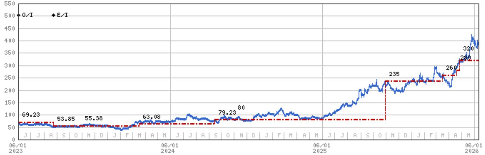

line chart

| Date       | E/I   | O/I   |
| ---------- | ----- | ----- |
| 06/01 2023 | 69.23 | 69.23 |
| 06/01 2024 | 53.85 | 53.85 |
| 06/01 2024 | 55.38 | 55.38 |
| 06/01 2024 | 63.08 | 63.08 |
| 06/01 2024 | 79.23 | 79.23 |
| 06/01 2024 | 80    | 80    |
| 06/01 2025 | 235   | 235   |
| 06/01 2025 | 260   | 260   |
| 06/01 2025 | 320   | 320   |

Stock Rating History: 6/1/21 : 0/I; 8/24/23 : E/I  
Price Target History: 10/29/20 : 111.54; 6/4/21 : 96.15; 8/22/22 : 88.46; 10/31/22 : 76.92; 12/21/22 : 69.23; 8/24/23 : 53.85; 10/30/23 : 55.38; 3/17/24 : 63.08; 9/15/24 : 79.23; 10/31/24 : 80; 10/31/25 : 235; 3/16/26 : 260; 4/20/26 : 280; 4/27/26 : 320  
Source: MS Date Format : MM/DD/YY Price Target No Price Target Assigned (NA)  
Stock Price (Not Covered by Current Analyst) — Stock Price (Covered by Current Analyst)  
Stock and Industry Ratings (abbreviations below) appear as ♦ Stock Rating/Industry View  
Stock Ratings: Overweight (O) Equal-weight (E) Underweight (U) Not-Rated (NR) No Rating Available (NA)  
Industry View: Attractive (A) In-line (I) Cautious (C) No Rating (NR)  
Effective January 13, 2014, the stocks covered by MS Asia Pacific will be rated relative to the analyst's industry (or industry team's) coverage.  
Effective January 13, 2014, the industry view benchmarks for MS Asia Pacific are as follows: relevant MSCI country index or MSCI sub-regional index or MSCI AC Asia Pacific ex Japan Index.

Unimicron (3037.TW) - As of 06/11/26 GMT in TWD Industry : Greater China Technology Hardware  
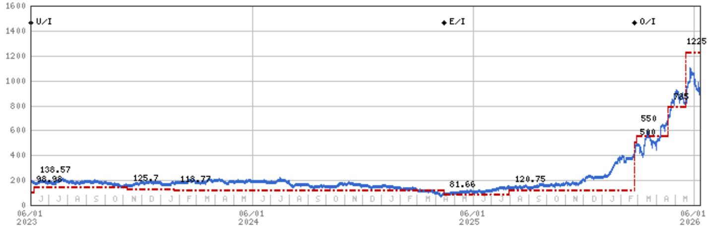

line chart

| Date       | Value  |
| ---------- | ------ |
| 06/01 2023 | 98.98  |
| 06/01 2024 | 138.57 |
| 06/01 2025 | 81.66  |
| 06/01 2026 | 1225   |

Stock Rating History: 6/1/21 : NA/I; 10/22/21 : 0/I; 6/1/22 : E/I; 2/22/23 : U/I; 4/15/25 : E/I; 2/23/26 : 0/I  
Price Target History: 10/22/21 : 188.06; 10/27/21 : 237.55; 2/9/22 : 267.24; 2/24/22 : 366.22; 6/1/22 : 237.55; 8/23/22 : 178.16;  
10/27/22 : 133.62; 12/21/22 : 123.72; 2/2/23 : 116.79; 2/22/23 : 98.98; 6/7/23 : 138.57; 11/7/23 : 125.7; 1/24/24 : 118.77;  
4/15/25 : 81.66; 7/30/25 : 120.75; 2/23/26 : 500; 2/26/26 : 550; 4/20/26 : 785; 5/18/26 : 1225  
Source: MS Date Format : MM/DD/YY Price Target = No Price Target Assigned (NA)  
Stock Price (Not Covered by Current Analyst) — Stock Price (Covered by Current Analyst)  
Stock and Industry Ratings (abbreviations below) appear as ♦ Stock Rating/Industry View  
Stock Ratings: Overweight (O) Equal-weight (E) Underweight (U) Not-Rated (NR) No Rating Available (NA)  
Industry View: Attractive (A) In-line (I) Cautious (C) No Rating (NR)  
Effective January 13, 2014, the stocks covered by MS Asia Pacific will be rated relative to the analyst's industry (or industry team's) coverage.  
Effective January 13, 2014, the industry view benchmarks for MS Asia Pacific are as follows: relevant MSCI country index or MSCI sub-regional index or MSCI AC Asia Pacific ex Japan Index.

Zhen Ding (4958.TW) - As of 06/11/26 GMT in TWD  
Industry : Greater China Technology Hardware  
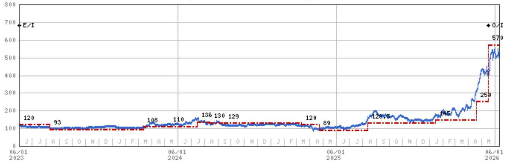

line chart

| Date       | Value |
| ---------- | ----- |
| 06/01 2023 | 120   |
| 06/01 2023 | 93    |
| 06/01 2024 | 108   |
| 06/01 2024 | 110   |
| 06/01 2024 | 136   |
| 06/01 2024 | 130   |
| 06/01 2024 | 129   |
| 06/01 2024 | 120   |
| 06/01 2024 | 89    |
| 06/01 2025 | 128   |
| 06/01 2025 | 145   |
| 06/01 2025 | 250   |
| 06/01 2026 | 570   |

Stock Rating History: 6/1/21 : U/I; 8/2/22 : E/I; 5/18/26 : 0/I  
Price Target History: 3/30/21 : 105; 8/2/22 : 124; 11/4/22 : 126; 3/14/23 : 120; 8/10/23 : 93; 3/13/24 : 108; 5/11/24 : 110;  
7/15/24 : 136; 8/13/24 : 130; 9/15/24 : 129; 3/12/25 : 120; 4/23/25 : 89; 8/13/25 : 128.5; 1/16/26 : 145; 4/20/26 : 250;  
5/18/26 : 570  
Source: MS Date Format : MM/DD/YY Price Target = No Price Target Assigned (NA)  
Stock Price (Not Covered by Current Analyst) — Stock Price (Covered by Current Analyst)  
Stock and Industry Ratings (abbreviations below) appear as ♦ Stock Rating/Industry View  
Stock Ratings: Overweight (O) Equal-weight (E) Underweight (U) Not-Rated (NR) No Rating Available (NA)  
Industry View: Attractive (A) In-line (I) Cautious (C) No Rating (NR)  
Effective January 13, 2014, the stocks covered by MS Asia Pacific will be rated relative to the analyst's industry (or industry team's) coverage.  
Effective January 13, 2014, the industry view benchmarks for MS Asia Pacific are as follows: relevant MSCI country index or MSCI sub-regional index or MSCI AC Asia Pacific ex Japan Index.

## Important Disclosures for MS Smith Barney LLC Customers

Important disclosures regarding any material conflict of interest that can reasonably be expected to have influenced MS Smith Barney LLC's choice of a third-party research provider or the subject company of a third-party research report, are available on the MS Wealth Management disclosure website at www.morganstanley.com/online/researchdisclosures. For MS specific disclosures, you may refer to https://www.morganstanley.com/eqr/disclosures/webapp/generalresearch.

Each MS report is reviewed and approved on behalf of MS Smith Barney LLC. This review and approval is conducted by the same person who reviews the research report on behalf of MS. This could create a conflict of interest.

## Other Important Disclosures

MS policy is to update research reports as and when the Research Analyst and Research Management deem appropriate, based on developments with the issuer, the sector, or the market that may have a material impact on the research views or opinions stated therein. In addition, certain Research publications are intended to be updated on a regular periodic basis (weekly/monthly/quarterly/annual) and will ordinarily be updated with that frequency, unless the Research Analyst and Research Management determine that a different publication schedule is appropriate based on current conditions.

MS is not acting as a municipal advisor and the opinions or views contained herein are not intended to be, and do not constitute, advice within the meaning of Section 975 of the Dodd-Frank Wall Street Reform and Consumer Protection Act.

MS produces an equity research product called a "Tactical Idea." Views contained in a "Tactical Idea" on a particular stock may be contrary to the recommendations or views expressed in research on the same stock. This may be the result of differing time horizons, methodologies, market events, or other factors. For all research available on a particular stock, please contact your sales representative or go to Matrix at http://www.morganstanley.com/matrix.

MS is provided to our clients through our proprietary research portal on Matrix and also distributed electronically by MS to clients. Certain, but not all, MS products are also made available to clients through third-party vendors or redistributed to clients through alternate electronic means as a convenience. For access to all available MS, please contact your sales representative or go to Matrix at http://www.morganstanley.com/matrix.

Any access and/or use of MS is subject to MS's Terms of Use (http://www.morganstanley.com/terms.html). By accessing and/or using MS, you are indicating that you have read and agree to be bound by our Terms of Use (http://www.morganstanley.com/terms.html). In addition you consent to MS processing your personal data and using cookies in accordance with our Privacy Policy and our Global Cookies Policy (http://www.morganstanley.com/privacy\_pledge.html), including for the purposes of setting your preferences and to collect readership data so that we can deliver better and more personalized service and products to you. To find out more information about how MS processes personal data, how we use cookies and how to reject cookies see our Privacy Policy and our Global Cookies Policy (http://www.morganstanley.com/privacy\_pledge.html). Please use the provided link to review the Terms and Conditions and Most Important Terms and Conditions for MS India Company Private Limited (https://www.morganstanley.com/assets/pdfs/about-us-global-offices/india/Terms\_and\_conditions.pdf) and the following link to review the audit report (https://ny.matrix.ms.com/eqr/research/webapp/researchdocs/MSICPL\_Morgan\_Stanley\_Research\_Audit\_Report.pdf).

If you do not agree to our Terms of Use and/or if you do not wish to provide your consent to MS processing your personal data or using cookies please do not access our research. MS does not provide individually tailored investment advice. MS has been prepared without regard to the circumstances and objectives of those who receive it. MS recommends that investors independently evaluate particular investments and strategies, and encourages investors to seek the advice of a financial adviser. The appropriateness of an investment or strategy will depend on an investor's circumstances and objectives. The securities, instruments, or strategies discussed in MS may not be suitable for all investors, and certain investors may not be eligible to purchase or participate in some or all of them. MS is not an offer to buy or sell or the solicitation of an offer to buy or sell any security/instrument or to participate in any particular trading strategy. The value of and income from your investments may vary because of changes in interest rates, foreign exchange rates, default rates, prepayment rates, securities/instruments prices, market indexes, operational or financial conditions of companies or other factors. There may be time limitations on the exercise of options or other rights in securities/instruments transactions. Past performance is not necessarily a guide to future performance. Estimates of future performance are based on assumptions that may not be realized. If provided, and unless otherwise stated, the closing price on the cover page is that of the primary exchange for the subject company's securities/instruments.

The fixed income research analysts, strategists or economists principally responsible for the preparation of MS have received compensation based upon various factors, including quality, accuracy and value of research, firm profitability or revenues (which include fixed income trading and capital markets profitability or revenues), client feedback and competitive factors. Fixed Income Research analysts', strategists' or economists' compensation is not linked to investment banking or capital markets transactions performed by MS or the profitability or revenues of particular trading desks.

The "Important Regulatory Disclosures on Subject Companies" section in MS lists all companies mentioned where MS owns 1% or more of a class of common equity securities of the companies. For all other companies mentioned in MS, MS may have an investment of less than 1% in securities/instruments or derivatives of securities/instruments of companies and may trade them in ways different from those discussed in MS. Employees of MS not involved in the preparation of MS may have investments in securities/instruments or derivatives of securities/instruments of companies mentioned and may trade them in ways different from those discussed in MS. Derivatives may be issued by MS or associated persons.

With the exception of information regarding MS, MS is based on public information. MS makes every effort to use reliable, comprehensive information, but we make no representation that it is accurate or complete. We have no obligation to tell you when opinions or information in MS change apart from when we intend to discontinue equity research coverage of a subject company. Facts and views presented in MS have not been reviewed by, and may not reflect information known to, professionals in other MS business areas, including investment banking personnel.

MS personnel may participate in company events such as site visits and are generally prohibited from accepting payment by the company of associated expenses unless pre-approved by authorized members of Research management.

MS may make investment decisions that are inconsistent with the recommendations or views in this report.

To our readers based in Taiwan or trading in Taiwan securities/instruments: Information on securities/instruments that trade in Taiwan is distributed by MS Taiwan Limited ("MSTL"). Such information is for your reference only. The reader should independently evaluate the investment risks and is solely responsible for their investment decisions. MS may not be distributed to the public media or quoted or used by the public media without the express written consent of MS. Any non-customer reader within the scope of Article 7-1 of the Taiwan Stock Exchange Recommendation Regulations accessing and/or receiving MS is not permitted to provide MS to any third party (including but not limited to related parties, affiliated companies and any other third parties) or engage in any activities regarding MS which may create or give the appearance of creating a conflict of interest. Information on securities/instruments that do not trade in Taiwan is for informational purposes only and is not to be construed as a recommendation or a solicitation to trade in such securities/instruments. MSTL may not execute transactions for clients in these securities/instruments.

Certain information in MS was sourced by employees of the Shanghai Representative Office of MS Asia Limited for the use of MS Asia Limited. MS is not incorporated under PRC law and the research in relation to this report is conducted outside the PRC. MS does not constitute an offer to sell or the solicitation of an offer to buy any securities in the PRC. PRC investors shall have the relevant qualifications to invest in such securities and shall be responsible for obtaining all relevant approvals, licenses, verifications and/or registrations from the relevant governmental authorities themselves. Neither this report nor any part of it is intended as, or shall constitute, provision of any consultancy or advisory service of securities investment as defined under PRC law. Such information is provided for your reference only.

MS is disseminated in Brazil by MS C.T.V.M. S.A. located at Av. Brigadeiro Faria Lima, 3600, 6th floor, São Paulo - SP, Brazil; and is regulated by the Comissão de Valores Mobiliários; in Mexico by MS México, Casa de Bolsa, S.A. de C.V which is regulated by Comision Nacional Bancaria y de Valores. Paseo de los Tamarindos 90, Torre 1, Col. Bosques de las Lomas Floor 29, 05120 Mexico City; in Japan by MS MUFG Securities Co., Ltd. and, for Commodities related research reports only, MS Capital Group Japan Co., Ltd; in Hong Kong by MS Asia Limited (which accepts responsibility for its contents) and by MS Bank Asia Limited; in Singapore by MS Asia (Singapore) Pte. (Registration number 199206298Z) and/or MS Asia (Singapore) Securities Pte Ltd (Registration number 200008434H), regulated by the Monetary Authority of Singapore (which accepts legal responsibility for its contents and should be contacted with respect to any matters arising from, or in connection with, MS) and by MS Bank Asia Limited, Singapore Branch (Registration number T14FC0118); in Australia to "wholesale clients" within the meaning of the Australian Corporations Act by MS Australia Limited A.B.N. 67 003 734 576, holder of Australian financial services license No. 233742, which accepts responsibility for its contents; in Australia to "wholesale clients" and "retail clients" within the meaning of the Australian Corporations Act by MS Wealth Management Australia Pty Ltd (A.B.N. 19 009 145 555, holder of Australian financial services license No. 240813, which accepts responsibility for its contents; in Korea by MS & Co International plc, Seoul Branch; in India by MS India Company Private Limited having Corporate Identification No (CIN) U22990MH1998PTC115305, regulated by the Securities and Exchange Board of India ("SEBI") and holder of licenses as a Research Analyst (SEBI Registration No. INH000001105); Stock Broker (SEBI Stock Broker Registration No. INZ000244438), Merchant Banker (SEBI Registration No. INM000011203), and depository participant with National Securities Depository Limited (SEBI Registration No. IN-DP-NSDL-567-2021) having registered office at Altimus, Level 39 & 40, Pandurang Budhkar Marg, Worli, Mumbai 400018, India; Telephone no. +91-22-61181000; Compliance Officer Details: Mr. Tejarshi Hardas, Tel. No.: +91-22-61181000 or Email: tejarshi.hardas@morganstanley.com; Grievance officer details: Mr. Tejarshi Hardas, Tel. No.: +91-22-61181000 or Email: msic-compliance@morganstanley.com. MS India Company Private Limited (MSICPL) may use AI tools in providing research services. All recommendations contained herein are made by the duly qualified research analysts; in Canada by MS Canada Limited; in Germany and the European Economic Area where required by MS Europe S.E., authorised and regulated by Bundesanstalt fuer Finanzdienstleistungsaufsicht (BaFin) under the reference number 149169; in the US by MS & Co. LLC, which accepts responsibility for its contents. MS & Co. International plc, authorized by the Prudential Regulation Authority and regulated by the Financial Conduct Authority and the Prudential Regulation Authority, disseminates in the UK research that it has prepared, and research which has been prepared by any of its affiliates, only to persons who (i) are investment professionals falling within Article 19(5) of the Financial Services and Markets Act 2000 (Financial Promotion) Order 2005 (as amended, the "Order"); (ii) are persons who are high net worth entities falling within Article 49(2)(a) to (d) of the Order; or (iii) are persons to whom an invitation or inducement to engage in investment activity (within the meaning of section 21 of the Financial Services and Markets Act 2000, as amended) may otherwise lawfully be communicated or caused to be communicated. RMB MS Proprietary Limited is a member of the JSE Limited and A2X (Pty) Ltd. RMB MS Proprietary Limited is a joint venture owned equally by MS International Holdings Inc. and RMB Investment Advisory (Proprietary) Limited, which is wholly owned by FirstRand Limited. The information in MS is being disseminated by MS Saudi Arabia, regulated by the Capital Market Authority in the Kingdom of Saudi Arabia, and is directed at Sophisticated investors only.

MS Hong Kong Securities Limited is the liquidity provider/market maker for securities of AAC Technologies Holdings, BYD Electronics, FIT Hon Teng Ltd, Hon Hai Precision, Lenovo, Lens Technology, Sunny Optical, Xiaomi Corp, Yangtze Optical Fibre and Cable JSC Ltd, ZTE Corporation listed on the Stock Exchange of Hong Kong Limited. An updated list can be found on HKEx website: http://www.hkex.com.hk.

The information in MS is being communicated by MS & Co. International plc (DIFC Branch), regulated by the Dubai Financial Services Authority (the DFSA) or by MS & Co. International plc (ADGM Branch), regulated by the Financial Services Regulatory Authority Abu Dhabi (the FSRA), and is directed at Professional Clients only, as defined by the DFSA or the FSRA, respectively. The financial products or financial services to which this research relates will only be made available to a customer who we are satisfied meets the regulatory criteria of a Professional Client. A distribution of the different MS Research ratings or recommendations, in percentage terms for Investments in each sector covered, is available upon request from your sales representative.

The information in MS is being communicated by MS & Co. International plc (QFC Branch), regulated by the Qatar Financial Centre Regulatory Authority (the QFCRA), and is directed at business customers and market counterparties only and is not intended for Retail Customers as defined by the QFCRA.

As required by the Capital Markets Board of Turkey, investment information, comments and recommendations stated here, are not within the scope of investment advisory activity. Investment advisory service is provided exclusively to persons based on their risk and income preferences by the authorized firms. Comments and recommendations stated here are general in nature. These opinions may not fit to your financial status, risk and return preferences. For this reason, to make an investment decision by relying solely to this information stated here may not bring about outcomes that fit your expectations.

The trademarks and service marks contained in MS are the property of their respective owners. Third-party data providers make no warranties or representations relating to the accuracy, completeness, or timeliness of the data they provide and shall not have liability for any damages relating to such data. The Global Industry Classification Standard (GICS) was developed by and is the exclusive property of MSCI and S&P.

MS, or any portion thereof may not be reprinted, sold or redistributed without the written consent of MS.

Indicators and trackers referenced in MS may not be used as, or treated as, a benchmark under Regulation EU 2016/1011, or any other similar framework.

The issuers and/or fixed income products recommended or discussed in certain fixed income research reports may not be continuously followed. Accordingly, investors should regard those fixed income research reports as providing stand-alone analysis and should not expect continuing analysis or additional reports relating to such issuers and/or individual fixed income products. MS may hold, from time to time, material financial and commercial interests regarding the company subject to the Research report.

Registration granted by SEBI and certification from the National Institute of Securities Markets (NISM) in no way guarantee performance of the intermediary or provide any assurance of returns to investors. Investment in securities market are subject to market risks. Read all the related documents carefully before investing.

INDUSTRY COVERAGE: Greater China Technology Hardware

<table><tr><td>COMPANY (TICKER)</td><td>RATING (AS OF)</td><td>PRICE* (06/11/2026)</td></tr><tr><td colspan="3">Andy Meng, CFA</td></tr><tr><td>AAC Technologies Holdings (2018.HK)</td><td>O (01/29/2024)</td><td>HK$42.60</td></tr><tr><td>Accelink Technologies Co. Ltd. (002281.SZ)</td><td>U (05/12/2022)</td><td>Rmb205.40</td></tr><tr><td>BYD Electronics (0285.HK)</td><td>O (04/28/2023)</td><td>HK$24.50</td></tr><tr><td>China TransInfo Technology Co Ltd (002373.SZ)</td><td>E (07/18/2023)</td><td>Rmb7.22</td></tr><tr><td>Dahua Technology Co. Ltd. (002236.SZ)</td><td>E (12/12/2024)</td><td>Rmb15.84</td></tr><tr><td>Eoptolink Technology Inc Ltd (300502.SZ)</td><td>O (02/27/2026)</td><td>Rmb526.00</td></tr><tr><td>Genius Electronic Optical Co. Ltd. (3406.TW)</td><td>E (04/23/2025)</td><td>NT$693.00</td></tr><tr><td>Gosuncn Technology Group Co Ltd (300098.SZ)</td><td>U (11/07/2022)</td><td>Rmb4.90</td></tr><tr><td>HIKVision Digital Technology (002415.SZ)</td><td>E (12/12/2024)</td><td>Rmb29.98</td></tr><tr><td>Largan Precision (3008.TW)</td><td>E (10/17/2025)</td><td>NT$4,165.00</td></tr><tr><td>LianChuang Electronic Technology Co Ltd (002036.SZ)</td><td>U (06/12/2024)</td><td>Rmb7.96</td></tr><tr><td>OFILM Group Co Ltd (002456.SZ)</td><td>U (06/12/2024)</td><td>Rmb8.67</td></tr><tr><td>Q Technology (Group) Company Ltd (1478.HK)</td><td>U (03/23/2026)</td><td>HK$7.98</td></tr><tr><td>Quectel Wireless Solutions Co Ltd (603236.SS)</td><td>E (10/09/2024)</td><td>Rmb56.15</td></tr><tr><td>Shanghai Conant Optical Co Ltd (2276.HK)</td><td>O (04/10/2026)</td><td>HK$38.40</td></tr><tr><td>Shenzhen Transsion Holdings Co Ltd (688036.SS)</td><td>E (03/23/2026)</td><td>Rmb53.17</td></tr><tr><td>Sunny Optical (2382.HK)</td><td>E (03/23/2026)</td><td>HK$70.95</td></tr><tr><td>Suzhou TFC Optical Communication Co Ltd. (300394.SZ)</td><td>E (11/06/2025)</td><td>Rmb412.30</td></tr><tr><td>Wingtech Technology Co Ltd (600745.SS)</td><td>U (05/18/2026)</td><td>Rmb17.94</td></tr><tr><td>Xiaomi Corp (1810.HK)</td><td>O (04/14/2021)</td><td>HK$25.84</td></tr><tr><td>Yangtze Optical Fibre and Cable JSC Ltd (601869.SS)</td><td>U (10/13/2021)</td><td>Rmb442.51</td></tr><tr><td>Yangtze Optical Fibre and Cable JSC Ltd (6869.HK)</td><td>E (04/20/2023)</td><td>HK$230.60</td></tr><tr><td>Yongxin Optics Co Ltd (603297.SS)</td><td>E (11/15/2022)</td><td>Rmb117.96</td></tr><tr><td>Zhejiang Crystal-Optech Co Ltd (002273.SZ)</td><td>O (11/15/2022)</td><td>Rmb33.18</td></tr><tr><td>Zhongji Innolight Co Ltd (300308.SZ)</td><td>++</td><td>Rmb1,124.00</td></tr><tr><td>ZTE Corporation (0763.HK)</td><td>O (06/04/2026)</td><td>HK$26.20</td></tr><tr><td>ZTE Corporation (000063.SZ)</td><td>E (06/04/2026)</td><td>Rmb37.81</td></tr><tr><td colspan="3">Derrick Yang</td></tr><tr><td>Accton Technology Corporation (2345.TW)</td><td>O (06/06/2024)</td><td>NT$2,275.00</td></tr><tr><td>Advantech (2395.TW)</td><td>O (01/20/2021)</td><td>NT$464.00</td></tr><tr><td>AirTAC International (1590.TW)</td><td>O (04/16/2025)</td><td>NT$1,265.00</td></tr><tr><td>AU Optronics (2409.TW)</td><td>E (02/10/2026)</td><td>NT$23.15</td></tr><tr><td>Bizlink (3665.TW)</td><td>O (03/10/2025)</td><td>NT$2,160.00</td></tr><tr><td>BOE Technology (000725.SZ)</td><td>O (09/06/2019)</td><td>Rmb5.83</td></tr><tr><td>Chenbro (8210.TW)</td><td>O (07/23/2025)</td><td>NT$1,440.00</td></tr><tr><td>Chroma Ate Inc. (2360.TW)</td><td>O (10/05/2021)</td><td>NT$2,190.00</td></tr><tr><td>E Ink Holdings Inc. (8069.TWO)</td><td>O (05/11/2026)</td><td>NT$190.50</td></tr><tr><td>Ennostar Inc (3714.TW)</td><td>U (09/23/2022)</td><td>NT$63.50</td></tr><tr><td>Hiwin Technologies Corp. (2049.TW)</td><td>O (03/30/2026)</td><td>NT$318.50</td></tr><tr><td>Innolux (3481.TW)</td><td>E (04/07/2025)</td><td>NT$46.95</td></tr><tr><td>King Slide Works Co. Ltd. (2059.TW)</td><td>O (11/08/2023)</td><td>NT$6,400.00</td></tr><tr><td>Lens Technology (300433.SZ)</td><td>E (07/22/2020)</td><td>Rmb42.68</td></tr><tr><td>Radiant Opto-Electronics Corporation (6176.TW)</td><td>E (03/01/2024)</td><td>NT$91.70</td></tr><tr><td>Sanan Optoelectronics (600703.SS)</td><td>U (08/21/2023)</td><td>Rmb15.26</td></tr><tr><td>TCL Corp. (000100.SZ)</td><td>E (04/07/2025)</td><td>Rmb4.51</td></tr><tr><td>Tianma Microelectronics (000050.SZ)</td><td>U (01/24/2018)</td><td>Rmb7.66</td></tr><tr><td>Wuhan Jingce Electronic Group Co Ltd (300567.SZ)</td><td>E (11/26/2021)</td><td>Rmb192.90</td></tr><tr><td colspan="3">Howard Kao</td></tr><tr><td>Acer Inc. (2353.TW)</td><td>U (04/23/2025)</td><td>NT$36.90</td></tr><tr><td>Asustek Computer Inc. (2357.TW)</td><td>U (11/16/2025)</td><td>NT$784.00</td></tr><tr><td>Compal Electronics (2324.TW)</td><td>U (04/23/2025)</td><td>NT$36.15</td></tr><tr><td>FIT Hon Teng Ltd (6088.HK)</td><td>O (11/03/2025)</td><td>HK$7.30</td></tr><tr><td>Giga-Byte Technology Co. Ltd. (2376.TW)</td><td>E (11/16/2025)</td><td>NT$340.00</td></tr><tr><td>Gold Circuit Electronics Ltd. (2368.TW)</td><td>O (10/06/2022)</td><td>NT$1,345.00</td></tr><tr><td>Inspur Electronic Information (000977.SZ)</td><td>E (08/28/2023)</td><td>Rmb57.84</td></tr><tr><td>Lenovo (0992.HK)</td><td>E (11/16/2025)</td><td>HK$22.88</td></tr><tr><td>Lotes Co. Ltd. (3533.TW)</td><td>E (05/12/2025)</td><td>NT$2,145.00</td></tr><tr><td>Nan Ya PCB (8046.TW)</td><td>O (02/23/2026)</td><td>NT$807.00</td></tr><tr><td>Pegatron Corporation (4938.TW)</td><td>E (03/25/2026)</td><td>NT$95.40</td></tr><tr><td>Quanta Computer Inc. (2382.TW)</td><td>O (05/01/2023)</td><td>NT$370.00</td></tr><tr><td>Shengyi Technology Co Ltd. (600183.SS)</td><td>E (05/26/2022)</td><td>Rmb149.73</td></tr><tr><td>Shennan Circuits Co Ltd (002916.SZ)</td><td>E (08/24/2023)</td><td>Rmb376.16</td></tr><tr><td>Unimicron (3037.TW)</td><td>O (02/23/2026)</td><td>NT$854.00</td></tr><tr><td>Wistron Corporation (3231.TW)</td><td>O (07/12/2023)</td><td>NT$152.50</td></tr><tr><td>Wiwynn Corp (6669.TW)</td><td>O (11/10/2025)</td><td>NT$4,900.00</td></tr><tr><td>Yageo Corp. (2327.TW)</td><td>O (10/28/2025)</td><td>NT$842.00</td></tr><tr><td>Zhen Ding (4958.TW)</td><td>O (05/18/2026)</td><td>NT$529.00</td></tr><tr><td colspan="3">Sharon Shih</td></tr><tr><td>Asia Vital Components Co. Ltd. (3017.TW)</td><td>O (07/30/2024)</td><td>NT$2,335.00</td></tr><tr><td>Auras Technology Co Ltd (3324.TWO)</td><td>E (05/04/2023)</td><td>NT$998.00</td></tr><tr><td>Catcher Technology (2474.TW)</td><td>U (11/17/2025)</td><td>NT$205.50</td></tr><tr><td>Delta Electronics Inc. (2308.TW)</td><td>O (07/13/2017)</td><td>NT$2,160.00</td></tr><tr><td>Fositek Corp (6805.TW)</td><td>O (06/25/2025)</td><td>NT$1,750.00</td></tr><tr><td>Foxconn Industrial Internet Co. Ltd. (601138.SS)</td><td>O (07/10/2019)</td><td>Rmb69.52</td></tr><tr><td>Foxconn Technology (2354.TW)</td><td>U (04/23/2025)</td><td>NT$56.20</td></tr><tr><td>GoerTek Inc (002241.SZ)</td><td>U (04/23/2025)</td><td>Rmb22.72</td></tr><tr><td>Hon Hai Precision (2317.TW)</td><td>O (03/15/2024)</td><td>NT$258.50</td></tr><tr><td>LandMark Optoelectronics Corporation (3081.TWO)</td><td>E (03/26/2026)</td><td>NT$2,165.00</td></tr><tr><td>Lingyi Itech Guangdong Co (002600.SZ)</td><td>U (04/23/2025)</td><td>Rmb13.63</td></tr><tr><td>Lite-On Technology (2301.TW)</td><td>E (01/15/2025)</td><td>NT$208.50</td></tr><tr><td>Luxshare Precision Industry Co., Ltd. (002475.SZ)</td><td>O (10/24/2016)</td><td>Rmb64.58</td></tr><tr><td>Sunonwealth Electric Machine Industry Co (2421.TW)</td><td>E (02/23/2024)</td><td>NT$142.00</td></tr><tr><td>Tong Hsing (6271.TW)</td><td>E (03/18/2019)</td><td>NT$217.00</td></tr><tr><td>Visual Photonics Epitaxy Co Ltd (2455.TW)</td><td>E (09/11/2023)</td><td>NT$320.00</td></tr></table>

Stock Ratings are subject to change. Please see latest research for each company.  
\* Historical prices are not split adjusted.

© 2026 MS