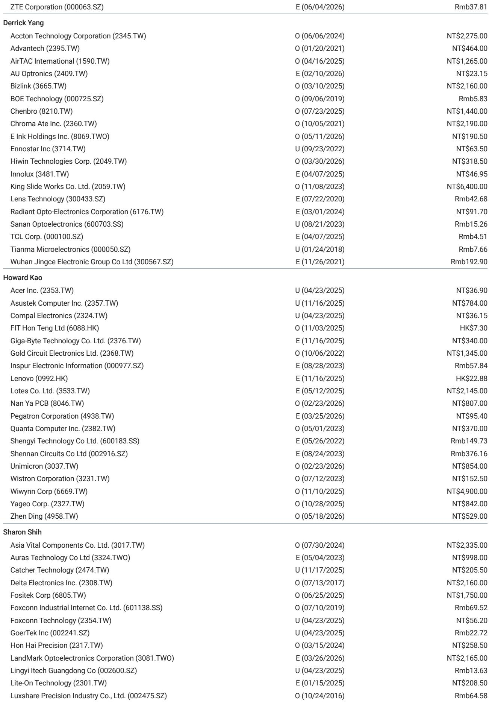
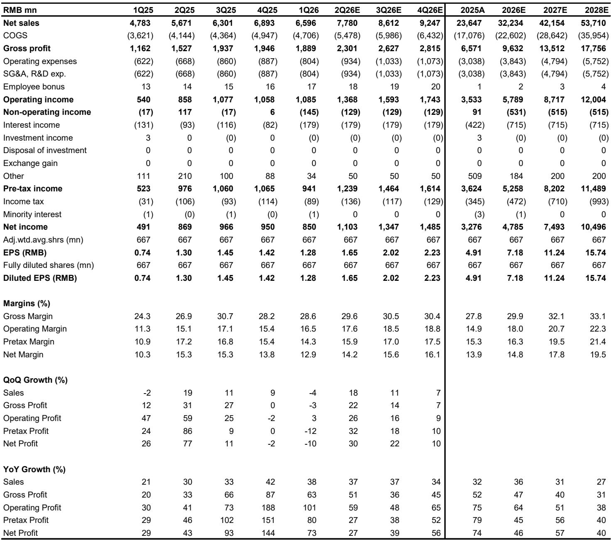
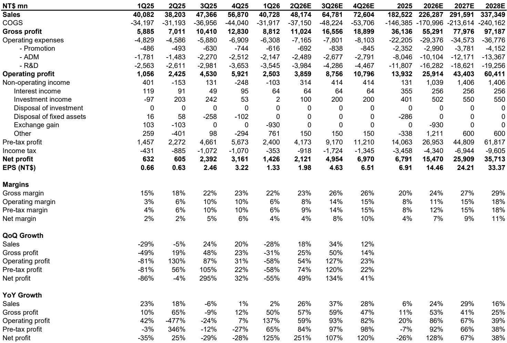

# 摩根斯坦利：AI光互连的下一波赢家不在光模块，而在电路板

当市场将全部注意力集中在GPU、网络芯片和光模块供应商时，一份来自摩根斯坦利的深度报告揭示了一个被低估的结构性机会：光收发器PCB。这并非简单的配套逻辑，而是一个正在经历“量价齐升”式重估的细分市场。

这份报告的核心判断是：AI投资周期正进入新阶段，光互连的重要性正与算力本身持平。当超大规模云厂商将AI集群从数万GPU扩展至数十万GPU时，连接这些系统的光收发器数量正在指数级增长。但摩根斯坦利团队看到的，不仅是收发器数量的增长，更是每块电路板价值的跃迁。

这意味着，传统意义上被视为“被动配套”的PCB制造商，正在成为AI基础设施支出的结构性受益者。而其中最值得关注的，并非当前市场份额最大的玩家，而是一家正在加速追赶的挑战者。

## 1. 光收发器PCB市场正在以83%的复合增速成为全球PCB行业最强劲的增长引擎

摩根斯坦利预测，全球AI光收发器PCB市场规模将从2025年的约6.2亿美元增长至2028年的约37.7亿美元，复合年增长率高达83%。这一增速远超同期光收发器出货量的60%复合增速，背后是“量”与“价”双重驱动。

从绝对规模来看，这一市场正在快速逼近全球最大的HDI PCB需求方——苹果。报告估算，苹果每年对HDI PCB的需求约为30至35亿美元。而到2027年，AI光收发器PCB市场将成长至与苹果需求相当的规模，并在2028年超越它。

这一对比的意义不仅在于市场体量。多年来，苹果一直是HDI PCB行业技术进步、产能投资和盈利能力的核心驱动力。而现在，AI光互连正在成为下一个主要需求引擎，这可能重塑PCB行业的竞争格局。

根据Prismark的估算，全球HDI PCB市场约为162亿美元。到2028年，仅AI光互连一项就能创造相当于当前全球HDI市场约23%的增量需求。这不是一个边缘机会，而是PCB行业未来几年最清晰的结构性增长主线。

## 2. 从400G到1.6T的迁移正在推动每块PCB的价值量翻倍以上

光收发器PCB市场的增长并非仅由出货量驱动，更关键的是单模块PCB价值的显著提升。摩根斯坦利详细拆解了三个驱动因素：

第一，CCL材料升级。从400G模块常用的M6级CCL，向800G和1.6T模块所需的M7或M8级CCL迁移，直接推高了PCB的单价。

第二，层数增加。400G模块的PCB层数为10至12层，800G升至12至14层，1.6T则达到14至16层，设计复杂度的提升带来了更高的附加值。

第三，制造工艺升级。从传统的HDI工艺向mSAP工艺迁移，是PCB价值跃升的最关键因素。mSAP工艺能够实现更密集的导线布局，原本主要应用于智能手机主板和摄像头模组。苹果从2017年的iPhone 8/X开始率先采用mSAP技术，而如今，这一技术正在成为1.6T光收发器PCB的标配。

综合这些因素，摩根斯坦利估算，单块PCB的平均售价将从400G时代的约10美元，提升至1.6T时代的约25美元，增长约2.5倍。更重要的是，随着技术壁垒的提高，毛利率将从20%至30%跃升至40%至50%以上，接近ABF载板的盈利水平。

这一变化意味着，PCB供应商正在从“配套角色”转变为“技术驱动型参与者”，其盈利能力将随着产品迭代而结构性改善。

## 3. 现有供应商将继续受益，但真正的超额收益来自市场份额的再分配

在现有供应商中，摩根斯坦利维持对欣兴电子和深南电路的看好评级，但认为两者已部分反映在估值中。真正具有超额收益潜力的，是一家正在加速追赶的公司——臻鼎科技。

报告指出，光收发器PCB市场正在经历供应格局的变化。随着市场快速扩张，现有产能难以满足需求，客户需要寻找更多合格的供应商。臻鼎科技凭借其在苹果iPhone供应链中积累的mSAP工艺经验，正处于切入这一市场的绝佳位置。

摩根斯坦利估算，臻鼎科技在800G收发器PCB领域的供应份额已从2025年的约7.5%起步，有望在2028年提升至约20%。在1.6T领域，其份额有望从2025年的约5%扩大至2028年的约25%。

值得注意的是，臻鼎科技的目标价被上调至新台币666元，对应2028年20倍市盈率（PEG为0.5倍）。而欣兴电子的目标价为1285元，对应2028年25倍市盈率（PEG为0.25倍）。从估值角度看，臻鼎科技当前15倍的2028年市盈率，相较于欣兴电子的17倍和深南电路的25倍，提供了更具吸引力的风险回报比。

## 4. 报告尚未完全回答的关键问题：CPO的长期威胁与产能扩张的节奏

摩根斯坦利在报告中坦率地讨论了CPO技术的潜在影响，认为其是“根本性的架构转变”和“对可插拔收发器的长期风险”。但报告给出的判断是，CPO的大规模采用在2027至2028年之前可能性有限，主要受制于制造良率、热管理复杂性、成本、生态系统和可维护性等因素。

这里存在一个尚未完全解答的问题：如果CPO的进展快于预期，当前对PCB供应商的投资逻辑将如何调整？报告认为，在3.2T过渡期（预计2028年），可插拔收发器和CPO将共存，但这一判断依赖于对技术成熟度的假设。这些假设仍需持续验证。

另一个值得关注的问题是产能扩张的节奏。报告指出，现有行业产能不足以满足预期需求，这正是新进入者获得份额的机会。但产能扩张本身需要大量资本支出，且存在良率爬坡的不确定性。臻鼎科技和台光电子等公司正在积极扩产，但能否以预期的速度和效率完成产能建设，将直接影响其份额提升的节奏。

## 5. 投资者的观察框架：从“量”到“质”的转变意味着需要重新评估PCB公司的估值逻辑

对于关注这一领域的投资者，摩根斯坦利的报告提供了一个清晰的观察框架：

第一，关注技术能力而非规模。在1.6T及更高速率的时代，mSAP工艺能力将成为区分赢家与输家的关键。拥有苹果供应链经验的公司在这一领域具有天然优势。

第二，关注毛利率趋势而非收入增长。报告明确指出，随着产品从400G向1.6T迁移，毛利率将从20%至30%提升至40%至50%以上。那些能够证明这一趋势正在发生的公司，其估值逻辑应被重新审视。

第三，关注份额变化而非绝对规模。当前市场份额最大的供应商不一定是未来几年增长最快的。在快速扩张的市场中，份额提升带来的增速溢价可能远超行业平均增速。

第四，关注估值比较而非绝对数字。报告对不同公司给出了不同的2028年PEG倍数，从0.25倍到0.63倍不等。理解这些差异背后的增长预期，比单纯看市盈率更有意义。

---

这份报告揭示了一个正在被重新定价的细分市场。但正如报告所坦承的，CPO的长期威胁、产能扩张的执行力、以及技术路线的演进方向，都是需要持续跟踪的关键变量。这些问题的答案，可能决定当前的投资逻辑是否能够贯穿整个AI投资周期。

欢迎来星球微信群里继续讨论。我们将围绕这份报告的完整内容，拆解三家核心公司的竞争壁垒、估值差异的合理性，以及那些报告没有完全展开的二阶影响。

Personal reading notes and learning share only. Not investment advice.

