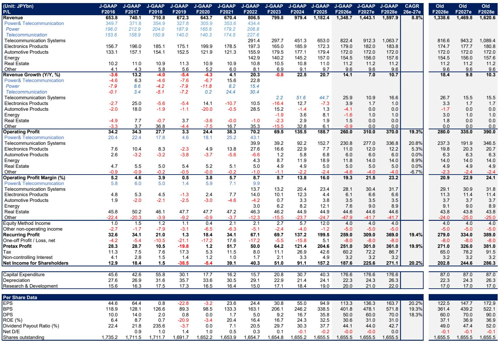
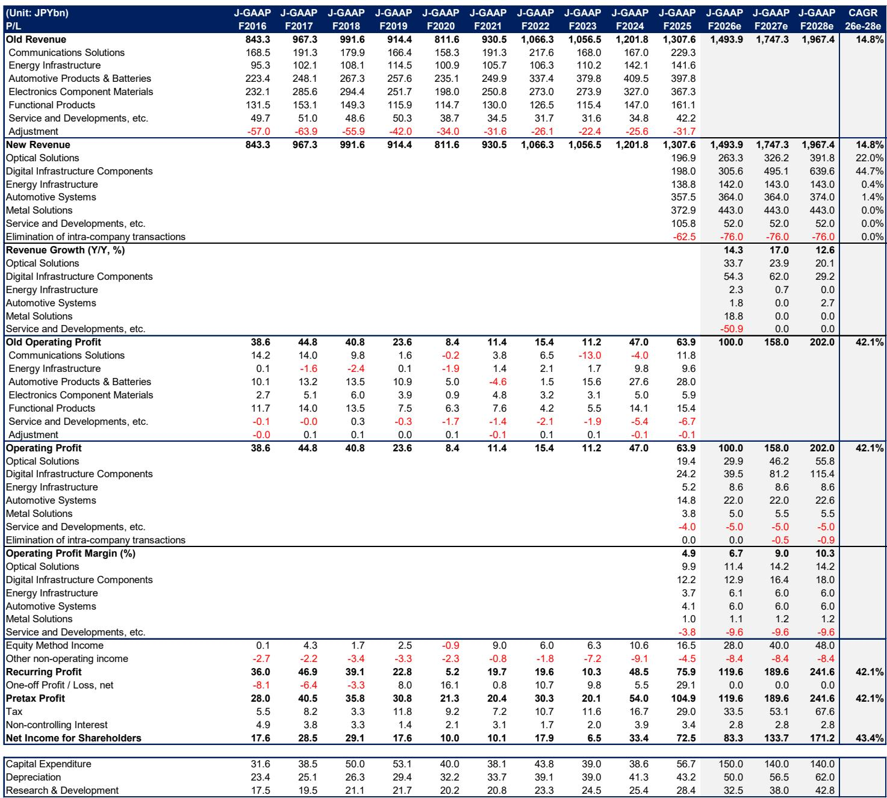
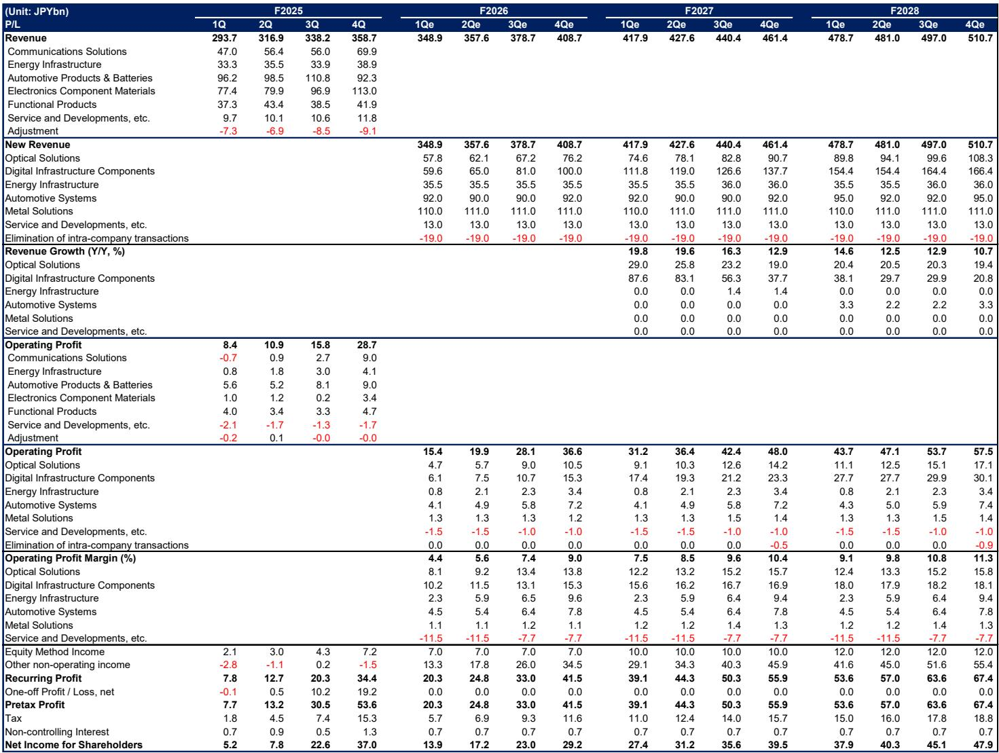

# The AI Data Center Buildout Is Reshaping Japan's Wire & Cable Industry—But Not All Players Are Positioned Equally

The recent share price correction across Japan's wire and cable sector has created a natural moment for investors to reassess which companies are genuinely positioned for the next phase of AI-driven demand, and which are riding momentum that may not sustain. While the macro environment remains uncertain and the recent pullback in AI and semiconductor stocks has rattled sentiment, the underlying fundamentals for data center-related products have never been stronger. A global investment bank report projects hyperscaler capital expenditure growth of 87% year-over-year in 2026, a dramatic acceleration that directly benefits the three dominant Japanese wire and cable names. The critical insight, however, is that this rising tide will not lift all boats equally. The divergence in production capacity, product certification timelines, and margin improvement trajectories will create clear winners and laggards over the next three fiscal years.

The report makes a compelling case that Furukawa Electric stands out as the most attractive opportunity, with an Overweight rating and a projected operating profit compound annual growth rate of 42.1% from fiscal 2027 to 2029. Sumitomo Electric and Fujikura receive Equal-weight ratings, but for fundamentally different reasons. Sumitomo Electric benefits from greater confidence in optical product expansion and surplus preform production capacity, yet consensus expectations have already risen sharply following recent results, limiting further upside. Fujikura, despite maintaining high profitability, faces a production capacity bottleneck that is likely to constrain volume growth in key products like optical cables. This ranking reveals a strategic framework: the market is rewarding companies that can demonstrate both earnings growth and the production infrastructure to support it, while penalizing those where capacity constraints create execution risk.

The timing of this analysis matters because the sector is at an inflection point. Share prices have corrected as a pullback from prior rapid gains, compounded by receding expectations for US interest rate cuts. Yet the report expects bullish industry sentiment to rebuild after the correction and heading into hyperscaler earnings in late July. For investors, the question is not whether the AI data center theme is real—it is. The question is which companies have the operational capacity, product mix, and margin expansion potential to convert this secular demand into sustainable earnings growth.

## Furukawa Electric's Earnings Trajectory Outpaces Peers, Driven by a Diversified Product Portfolio for AI Infrastructure

The most striking finding in the report is Furukawa Electric's projected operating profit growth. The company is expected to deliver operating profit of ¥100 billion in fiscal 2027, up 56.6% year-over-year, followed by ¥158 billion in fiscal 2028 and ¥202 billion in fiscal 2029. This translates to a three-year compound annual growth rate of 42.1%, the highest among the three names. The drivers are specific and measurable: optical solutions are forecast to contribute ¥29.9 billion in operating profit in fiscal 2027, a ¥19.2 billion increase year-over-year, while digital infrastructure components are expected to add ¥39.5 billion, up ¥23.6 billion.

What makes this growth profile particularly compelling is the product-level specificity. Furukawa Electric's growth is not a vague function of "AI demand." It is driven by increased sales of ultra-high fiber count cables, MT ferrules, and liquid cooling modules. The report forecasts liquid cooling module sales at ¥50 billion in fiscal 2027, ramping to ¥190 billion in fiscal 2028 and ¥300 billion in fiscal 2029. This product mix shift toward high-value-added items is exactly the kind of earnings driver that can sustain margin expansion even if overall volume growth moderates. The company's medium-term plan of ¥170 billion operating profit for fiscal 2029 appears conservative relative to the report's forecast of ¥202 billion, suggesting that management itself may be underestimating the pace of AI-related demand.

The strategic implication is clear: Furukawa Electric is not merely a beneficiary of hyperscaler spending, but a direct play on specific AI infrastructure components that are seeing accelerating adoption. The risk, however, is that product certification by hyperscalers could be delayed more than expected, which would slow the revenue ramp. Investors need to monitor certification timelines closely, as this is the single biggest potential derailer of the growth story.

## Sumitomo Electric's Competitive Edge in Preform Production and Optical Devices Creates a More Balanced Risk-Reward Profile

Sumitomo Electric's story is different. The report raises its operating profit forecasts across all three fiscal years, with fiscal 2027 now expected at ¥445 billion, fiscal 2028 at ¥555 billion, and fiscal 2029 at ¥635 billion. The upward revision reflects greater confidence in the pace of expansion in optical-related products for data centers, including optical connectors, optical cables, and optical devices. The company's surplus capacity in preform production is a genuine competitive advantage, as tight supply-demand dynamics in the optical products market make production capacity a key differentiator.

The most interesting element of Sumitomo Electric's positioning is its role in the emerging Co-Packaged Optics (CPO) market. The report suggests that NVIDIA's next-generation Rubin GPU, expected from fiscal 2027, is likely to incorporate CPO technology. This integration of optical components and semiconductor chips within the same package dramatically increases the number of optical fiber cores and cable connection points per switch. Sumitomo Electric's continuous-wave laser diodes (CW-LDs) have a high market share and benefit from vertically integrated production on an indium phosphide platform. If CPO adoption accelerates as expected, Sumitomo Electric could see a step-change in unit demand for its optical devices.

However, the report also highlights a critical constraint: consensus expectations have already jumped after the company's recent fiscal 2026 results, limiting upside from current levels. The risk-reward skew is 6.6, the highest among the three names, reflecting a bull case of ¥18,500 per share (80% upside) and a bear case of ¥9,000 (12% downside). This skew suggests that while the downside is relatively contained, the upside requires significant positive surprises to materialize. The key variable to watch is whether CPO adoption happens faster than anticipated, which would likely drive upward revisions to Sumitomo Electric's optical device revenue.

## Fujikura's Production Capacity Bottleneck Limits Near-Term Growth Despite High Profitability

Fujikura presents the most nuanced case. The company's high profitability is sustainable, but the report explicitly flags production capacity as a likely bottleneck. The report lowers its operating profit forecasts across all three fiscal years, with fiscal 2027 now at ¥260 billion, fiscal 2028 at ¥310 billion, and fiscal 2029 at ¥370 billion. The reduction is driven by newly factored risks around optical fiber production constraints due to hydrogen shortages, which could reduce SWR/WTC (Spider Web Ribbon/Wrapping Tube Cable) sales volumes by approximately 10% versus previous forecasts.

The hydrogen shortage issue is particularly instructive. The company is procuring additional liquid and compressed hydrogen and expanding in-house hydrogen generation facilities, and the report believes these risks will be resolved from fiscal 2028. But the near-term impact is real: optical fiber production constraints are expected to slow SWR/WTC sales volume growth to +10% year-over-year in fiscal 2028. Even with capacity expansion plans already announced—¥45 billion for preforms and ¥40 billion for optical fiber and cables domestically, plus up to ¥260 billion in capex in the United States—the benefits will not fully materialize until the second half of fiscal 2029.

The risk-reward skew for Fujikura is the lowest among the three names at 1.5, with a bull case of ¥6,400 per share (55% upside) and a bear case of ¥2,600 (37% downside). This asymmetry reflects the reality that capacity constraints create downside risk that is not fully offset by the potential for faster-than-expected capacity expansion. The critical question for Fujikura is whether its US investment execution can be accelerated. If the company brings forward its capacity expansion timeline and starts operations earlier than anticipated, the share price could see significant upside. But this remains an unproven variable.

## What the Report Does Not Fully Answer: The Margin Improvement Puzzle and the Power Infrastructure Constraint

Despite the detailed analysis, the report leaves several important questions unresolved. The most significant is the margin improvement story. The report notes that supply and demand in optical products remains tight, and that price hikes could drive margin expansion. However, no material margin improvement attributable to price increases has been confirmed at this stage. The report's forecasts are based on conservative assumptions about related margin improvement, which means any materialization of price-driven margin gains would represent upside to earnings. But how much margin improvement is realistic? And at what point does tight supply-demand translate into pricing power?

The second unresolved question is the power and infrastructure constraint. The report acknowledges that if hyperscaler capital expenditure were to decelerate due to power or infrastructure constraints, multiples could contract more than any downward revisions to forecasts. This is a genuine risk, but the report does not quantify the probability or potential magnitude of such a scenario. The AI data center buildout requires enormous amounts of electricity, and grid constraints in key markets like Northern Virginia and parts of Asia could slow the pace of new data center construction. Investors need to assess whether the 87% hyperscaler capex growth forecast is achievable given these physical constraints.

The third open question relates to the competitive dynamics within the CPO ecosystem. The report identifies Sumitomo Electric as the biggest potential beneficiary, but CPO is an emerging technology, and the competitive landscape is still forming. Which companies will capture the most value in the CPO supply chain? How will the unit economics compare to traditional pluggable modules? These questions are not fully addressed and will be critical for long-term positioning.

## A Decision Framework for Investors: Three Variables to Evaluate

For investors looking to act on this analysis, three variables should guide the decision framework.

First, evaluate production capacity as a leading indicator of earnings growth. The report makes clear that capacity constraints are the primary differentiator between companies. Furukawa Electric's ability to ramp liquid cooling module production from ¥50 billion to ¥300 billion over three years suggests a capacity advantage. Sumitomo Electric's surplus preform capacity provides a buffer. Fujikura's hydrogen-related constraints create near-term risk. Investors should monitor capacity expansion announcements and execution timelines as the most reliable signal of future earnings potential.

Second, assess the product mix toward high-value-added items. All three companies benefit from AI data center demand, but the margin profile depends on the specific products. Furukawa Electric's focus on liquid cooling modules and ultra-high fiber count cables, Sumitomo Electric's optical devices and CW-LDs, and Fujikura's SWR/WTC cables each have different margin characteristics. The report implies that products with higher technical complexity and customization have better pricing power and margin potential. Investors should track product-level revenue disclosures to validate this thesis.

Third, compare consensus expectations versus the report's forecasts. The report explicitly identifies gaps versus consensus as a key criterion for stock selection. For Furukawa Electric, the report's fiscal 2027 operating profit forecast of ¥158 billion is 9% above consensus, and the fiscal 2029 forecast of ¥202 billion is 15% above consensus. This gap suggests that the market has not fully priced in the company's growth trajectory. For Sumitomo Electric, the report's forecasts are closer to consensus, limiting upside. For Fujikura, the report's forecasts are below consensus, implying potential downward revisions. Investors should prioritize names where the report's proprietary analysis identifies a meaningful gap versus market expectations.

## The Unresolved Analytical Questions That Make the Full Report Essential

The report raises more questions than it answers on several fronts. How will the transition from pluggable optics to CPO affect the total addressable market for optical components? What is the realistic timeline for CPO adoption given the complexity of integrating optical and semiconductor technologies? How will yen depreciation or appreciation affect the relative competitiveness of Japanese wire and cable companies versus global peers? And most importantly, what is the probability that hyperscaler capex growth decelerates due to power constraints, and how would that change the earnings trajectories for each company?

These are not minor details. They are the analytical gaps that separate a superficial understanding of the sector from a genuinely informed investment thesis. The full report contains detailed charts showing operating profit estimates versus consensus, product-level revenue breakdowns, and the specific assumptions behind each company's forecast. For investors who want to build conviction in their positioning, these details are indispensable.

Join the community to read the full report and review the original charts.

*This article is for learning and discussion only and does not constitute investment advice.*

Personal reading notes and learning share only. Not investment advice.

