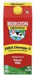
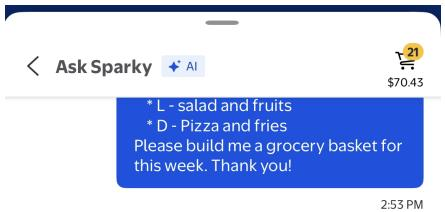
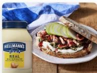
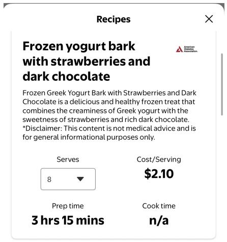
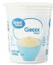
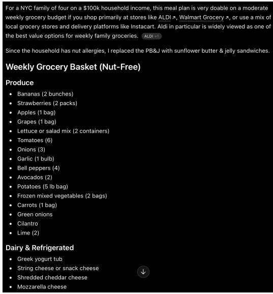
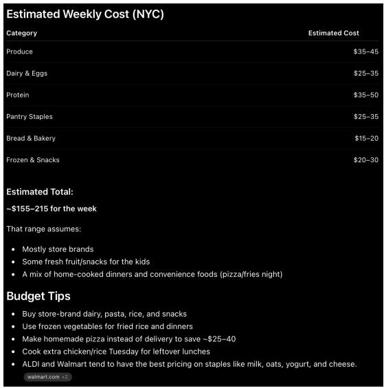
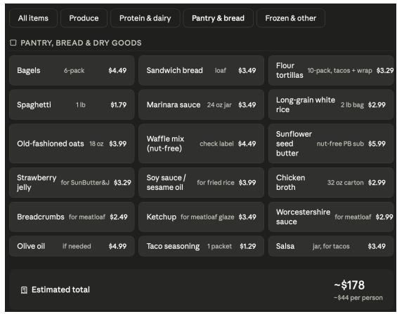

# Weekend Consumer Blast: How "agentic" is AI shopping today? We tested 5 models...

Zhihan Ma, CFA +1 917 344 8303 zhihan.ma@bernsteinsg.com

Alexia Howard +1 917 344 8453 alexia.howard@bernsteinsg.com

Aneesha Sherman +1 917 344 8457 aneesha.sherman@bernsteinsg.com

Callum Elliott, CFA, ACA +44 20 7676 7183 callum.elliott@bernsteinsg.com

Danilo Gargiulo +1 917 344 8475 danilo.gargiulo@bernsteinsg.com

Euan McLeish +81 3 5962 9611 euan.mcleish@bernsteinsg.com

Ian Moore +1 917 344 8434 ian.moore@bernsteinsg.com

Jignanshu Gor +91 226 842 1494 jignanshu.gor@bernsteinsg.com

Luca Solca +41 582 723 126 luca.solca@bernsteinsg.com

Melinda Hu +852 2123 2643 melinda.hu@bernsteinsg.com

Nadine Sarwat, CFA +44 20 7676 6849 nadine.sarwat@bernsteinsg.com

Richard J. Clarke, FCA +44 20 7676 6850 richard.clarke@bernsteinsg.com

Trevor Stirling +44 20 7676 7521 trevor.stirling@bernsteinsg.com

William Woods +44 20 7676 6806 william.woods@bernsteinsg.com

Agentic shopping burst onto the US Retail scene last October after Walmart announced its partnership with ChatGPT. $^{1}$ More than six months later, how agentic is shopping today?

We tested five different tools. Three are foundational AI models - ChatGPT, Gemini, and Claude - with broad capabilities. The other two, Amazon's Alexa and Walmart's Sparky, are retail-native AI tools built directly on top of retail ecosystems. The goal was to see how each approaches the shopping funnel: from identifying the right product, to validating pricing, and actually enabling a purchase. More importantly, we assess where each tool breaks down and how far we are from a true end-to-end agentic e-commerce experience. While human interaction is still needed at every stage, payment is where the whole experience unravels. Even in the simplest case - buying a single, generic item - the hand off from “AI found it” to “I bought it” still requires the user to engage. Until payment is embedded directly into the experience, AI remains one step removed from making shopping decisions on behalf of users.

Underpinning that is a tension between general and retailer-integrated systems. The foundational AI models feel powerful because they can roam freely, comparing products, surfacing deals, and stitching together options across a fragmented retail landscape. However, they are doing so without direct access to the structured catalog data, real-time pricing, inventory, or delivery options. Meanwhile, those retail ecosystems have the opposite problem: they are highly precise and almost-transaction-ready, but confined to their own assortment (1P and/or 3P). Bridging this gap, from either end, will be key as the technology evolves.

## BUYING ONE ITEM - REQUIRES INTEGRATION!

We evaluated how effective each AI assistant is through each step of the basic e-commerce process for one item, from product discovery to final transaction execution: I want to make scrambled eggs, but I've run out of milk. Could you please find me a 64 fl oz carton of organic whole milk? How soon can it be delivered to me in ZIP 22201 (Arlington, VA)? Exhibit 1 shows each AI tool's performance at each stage.

EXHIBIT 1: Amazon Alexa and Walmart Sparky currently maintain an advantage in real-time pricing accuracy, total cost estimation, and transaction execution.

<table><tr><td></td><td>Identifies Category</td><td>Identifies SKU</td><td>Identifies Pricing</td><td>Estimates Full Cost</td><td>Add to Cart</td><td>Payment</td></tr><tr><td>ChatGPT</td><td>●</td><td>●</td><td>●</td><td>●</td><td>●</td><td>●</td></tr><tr><td>Claude</td><td>●</td><td>●</td><td>●</td><td>●</td><td>●</td><td>●</td></tr><tr><td>Gemini</td><td>●</td><td>●</td><td>●</td><td>●</td><td>●</td><td>●</td></tr><tr><td>Amazon Alexa</td><td>●</td><td>●</td><td>●</td><td>●</td><td>●</td><td>●</td></tr><tr><td>Walmart Sparky</td><td>●</td><td>●</td><td>●</td><td>●</td><td>●</td><td>●</td></tr></table>

Definitions - Identifies Category: Ability to correctly determine the relevant product category; Identifies SKU: Ability to accurately identify the specific item, including its brand, size, and variant; Identifies Pricing: Ability to correctly determine the exact price of the selected item; Estimate Full Cost: Ability to accurately calculate the total order cost, including fulfillment, taxes, and any additional fees; Add to Cart: Ability to successfully add selected items to the shopping cart; Payment: Ability to complete the checkout process and successfully execute the order.

Source: Bernstein analysis

There is currently no agentic shopping tool capable of buying a product in an unsupervised fashion. Human engagement is needed at many steps.

ChatGPT, Claude, and Gemini are primarily research and recommendation tools. Because they lack direct access to retailers' assortment (unless shared by retailers directly), they seem to rely on workarounds such as web scraping or third-party articles (Exhibit 2). Therefore, they sometimes struggle with SKU identification and pricing accuracy. In addition, they are incapable of handling fulfillment and payment (in so far as they lack a connection). As a result, these are product discovery tools. However, they are partnering with retailers to bridge the gap. ChatGPT, for example, has introduced its Agentic Commerce Protocol (ACP), and Claude integrates with Uber Eats to enable grocery and food delivery (Exhibit 6). Still, users need to follow links to retailers' websites to complete transactions.

In contrast, Amazon and Walmart operate fundamentally differently. Their AI assistants have access to the real time inventory data. This allows them to manage the entire purchase funnel within their ecosystems, from product discovery through payment. Amazon's implementation illustrates both the potential and the limitations of this approach. Alexa can add non-perishable items to a cart (Exhibit 7) but currently excludes Amazon Fresh and Whole Foods products (Exhibit 8). There are still limitations at the final step. The payment process is not fully integrated within either Sparky or Alexa, so users cannot complete the transaction directly within the assistant.

## EXHIBIT 2: ChatGPT can identify the SKU and estimate an approximate price range, but appears to rely on web scraping at times.

Whole Foods link, in exhibit, directs to an article on Whole Foods delivery policy.

I want to make scrambled eggs, but I've run out of milk. Could you please find me a 64 fl oz carton of organic whole milk? How soon can it be delivered to me in zip 22201 (Arlington, VA)?

Here are the best quick options I found for a 64 fl oz organic whole milk delivery to Arlington, VA 22201:

## Fastest + Cheapest Likely Option

• Great Value Organic Whole Vitamin D Milk, Half Gallon, 64 fl oz  
Price: about \$3.98 at Walmart ↗  
Delivery: typically same-day within 1–3 hours through Walmart delivery in Arlington if slots are  
available.  
Whole Foods

## Best Premium Organic Brand

• Organic Valley Organic Whole Milk Half Gallon Carton 64 oz

Price: about \$4.96-\$6.26 at Walmart ↗

Delivery: generally same-day in your ZIP if ordered soon. Whole Foods ...

## Whole Foods Option

• Organic Valley Organic Whole Milk 64 Oz

Price: usually around \$6–7 at Whole Foods Market ↗

Delivery: often under 2 hours via Amazon/Whole Foods delivery depending on availability.

Whole Foods.

Source: ChatGPT (OpenAI), Bernstein analysis

## EXHIBIT 3: With the initial prompt, Gemini suggests relevant product and delivery options but does not identify items at the SKU level.

It also appears to rely on online scraping to generate its responses.

For your immediate cooking needs in zip code 22201 (Arlington, VA), you have a few highly efficient options to secure a 64 fl oz carton of organic whole milk (commonly available from trusted organic brands like Horizon Organic, Organic Valley, or Stonyfield):

## On-Demand & Instant Delivery (Fastest)

If you are mid-recipe and need it immediately, delivery apps are your best option:

Instacart, DoorDash, or Uber Eats: You can order a 64 oz carton directly from local stores right in your neighborhood (such as the Safeway on Wilson Blvd or the Whole Foods Market in Clarendon).  
Delivery Speed: These services typically offer on-demand rush delivery that can arrive at your door in 30 to 60 minutes.

## Same-Day Store Services

If you have a bit more flexibility later in the day:

Safeway Flash / DriveUp & Go: The Safeway location at 1525 Wilson Blvd handles rapid fulfillment online, often preparing "Flash" delivery orders or window pickups in 30 minutes or less. Safeway  
Amazon Fresh / Whole Foods Market: Standard same-day delivery slots for the Arlington area are usually available within a 2-hour window depending on current courier availability. Dragonfly

To get it fastest, checking DoorDash or Instacart mapped to your exact street address will show you the precise real-time courier ETA, which should easily be under an hour.

Source: Google Gemini, Bernstein analysis

## EXHIBIT 4: This is not due to a lack of capability. When prompted further, such as asking for the price of the milk, Gemini is able to retrieve SKU-level product information.

what's the price of the milk

In the Arlington, VA area (zip 22201), a 64 fl oz carton of organic whole milk generally ranges between \$4.69 and \$7.49 depending on the store brand and specific label:

Store Brands (Most Affordable):  
Whole Foods (365 Brand): \$4.69 per 64 oz carton. Whole Foods Market  
- Premium National Brands:  
Organic Valley: \$6.29 per 64 oz carton. Whole Foods Market  
- Horizon Organic: \$6.99 (Standard Whole Milk) to \$7.49 (DHA Omega-3 formula) per 64 oz carton.

Note: If you order through a third-party application like Instacart or DoorDash, the base price may be slightly marked up by \$0.50 to \$1.00, and standard delivery fees/service tips will apply.

Source: Google Gemini, Bernstein analysis

## EXHIBIT 5: Similar to Gemini, Claude initially presents delivery options along with item recommendations and approximate delivery times.

I want to make scrambled eggs, but I've run out of milk. Could you please find me a 64 fl oz carton of organic whole milk? How soon can it be delivered to me in zip 22201 (Arlington, VA)?

Shopping and grocery delivery isn't something I can search directly, but here are some great options for getting organic whole milk delivered quickly to Arlington, VA (22201):

## Same-day or fast delivery options:

- Instacart (instacart.com) — connects to local stores like Whole Foods, Safeway, Giant, and more. Often delivers in 1-2 hours.  
- Amazon Fresh — if you're a Prime member, same-day or next-day delivery is common in Arlington.  
• Whole Foods (via Amazon) — Prime members often get free 2-hour delivery.  
- DoorDash / Uber Eats — both partner with grocery stores and can deliver in under an hour from nearby locations.

For a 64 fl oz carton of organic whole milk, brands like Organic Valley, Horizon Organic, or 365 by Whole Foods are widely available through all of the above.

Arlington is very well-served by these services, so same-day delivery within 1-2 hours is very likely. In the meantime, for your scrambled eggs — a small splash of water or a bit of cream cheese actually works wonderfully as a milk substitute!

Source: Claude (Anthropic), Bernstein analysis

## EXHIBIT 6: Through its partnership with Uber Eats, Claude enables users to complete purchases via Uber Eats directly within the interface.

I don't have a grocery delivery connector available to place orders directly. Let me see if there's one I can suggest for you!

Searching connectors >

Unfortunately there's no grocery delivery connector (like Instacart or Amazon Fresh) available to connect right now. The closest option I found is Uber Eats, which does partner with some grocery stores:

Your connectors

Beta

Uber Eats Connected

Looking for something else? Browse all connectors

None of these

Uber Eats is one option — would you like to connect it to search for grocery stores near you? Otherwise, your quickest bet would be heading directly to instacart.com or Amazon Fresh to search for that 64 fl oz organic whole milk — both should have it to you in Arlington within an hour or two.

Source: Claude (Anthropic), Bernstein analysis

## EXHIBIT 7: Amazon provides product recommendations at the SKU level, presenting users with a range of options to choose from.

I want to make scrambled eggs, but I've run out of milk. Could you please find me a 64 fl oz carton of organic whole milk? How soon can it be delivered to me in zip 22201 (Arlington, VA)?

Great news! I found some 64 fl oz organic whole milk options that can be delivered today between 1 PM – 3 PM in Arlington, VA (22201):

## 64 fl oz Organic Whole Milk - Delivered Today See more

365 by Whole Foods Market, Organic Whole Milk, 64 oz

4.7 ★★★★★☆ (12,677)

10K+ bought in past month

\$479 (\$0.07/fluid ounce)

FREE delivery Today 1 PM - 3 PM on orders over \$25.00

365 by Whole Foods Market – USDA Organic, pasture-raised, GMO-free, fortified with Vitamin D3. \$4.79

## More details

Organic Valley, Organic Whole Milk, 64 Oz (Half Gallon)

Source: Amazon Alexa, Bernstein analysis

## EXHIBIT 8: Alexa is unable to do so for Amazon Fresh and Whole Foods products; it directs the user to an external link.

All four options qualify for free delivery today (1 PM – 3 PM) on qualifying orders. The 365 by Whole Foods Market option is the most budget-friendly at \$4.79. Would you like me to add one to your cart?

Add the 365 Whole Foods milk to my cart

I wasn't able to add this item directly to your cart — Fresh/Whole Foods products need to be added from the product page. You can do so here:

365 by Whole Foods Market Organic Whole Milk, 64 fl oz — \$4.79

Just tap the link to go to the product page and add it to your cart from there!

Source: Amazon Alexa, Bernstein analysis

## EXHIBIT 9: Sparky is capable of handling the full flow from product discovery through to building a basket (or cart).

Great news — two of these options show delivery as soon as 18 minutes to 22201 (Arlington, VA). Here are your 64 fl oz organic whole milk options:

## Sparky's Picks

## Best seller, most affordable at \$3.97

Great Value Organic
Whole Vitamin D Milk, Hal...

★★★★★ (3329)

Best seller

\+ Add

## ♦ Added DHA Omega-3, also a best seller

Horizon Organic DHA Omega-3 Whole Milk, DH...

★★★★★ (2524)

Best seller

\+ Add

## Organic Valley, currently on rollback

Source: Walmart Sparky, Bernstein analysis

## BUILDING A GROCERY BASKET - DESIGN CHOICES GUIDE LLM'S

Beyond finding and buying a single item, we tested AI agents' ability to build a grocery basket. It requires translating a multi-day meal plan into a complete grocery basket, estimating appropriate quantities for a family of four, and accounting for constraints such as a nut allergy. In addition, it assesses the ability to demonstrate contextual awareness, organize items and avoid duplication. The prompt is:

Household description: family of four (two adults and two children, ages 6 and 10) living in New York City, with a total household income of \$100,000. This family has nut allergies. [Inserted Exhibit 10 as list]. Please build me a grocery basket for this week. Thank you!

## EXHIBIT 10: We fed this meal plan as text into the prompt.

We kept meal choices rudimentary, this isn't a culinary exercise.

<table><tr><td>Meal / Day</td><td>Monday</td><td>Tuesday</td><td>Wednesday</td><td>Thursday</td><td>Friday</td></tr><tr><td>Breakfast</td><td>Yogurt</td><td>Scrambled eggs</td><td>Oatmeal</td><td>Waffles</td><td>Bagels with cream cheese</td></tr><tr><td>Lunch</td><td>Turkey sandwich</td><td>Chicken and rice</td><td>Ham wrap and snacks</td><td>PB&amp;J</td><td>Salad and fruit</td></tr><tr><td>Dinner</td><td>Tacos</td><td>Spaghetti</td><td>Meat loaf and mash potatoes</td><td>Fried rice with eggs and vegetables</td><td>Pizza and Fries</td></tr></table>

Source: Bernstein analysis

## EXHIBIT 11: Foundational LLMs are better at understanding context while retail-integrated models provide SKU-level detail.

<table><tr><td></td><td>Is it a list?</td><td>Is it a basket?</td><td>Pricing</td><td>Add to cart</td></tr><tr><td>ChatGPT</td><td>●</td><td>●</td><td>●</td><td>●</td></tr><tr><td>Gemini</td><td>●</td><td>●</td><td>●</td><td>●</td></tr><tr><td>Claude</td><td>●</td><td>●</td><td>●</td><td>●</td></tr><tr><td>Amazon Alexa</td><td>●</td><td>●</td><td>●</td><td>●</td></tr><tr><td>Walmart Sparky</td><td>●</td><td>●</td><td>●</td><td>●</td></tr></table>

Definitions - List: A set of relevant product suggestions based on the user's request; Basket: A structured collection of specific SKUs selected for purchase; Pricing: The accuracy and reasonableness of the price information provided for each item; Add to Cart: The capability of a shopping tool to add selected items directly into a virtual cart for purchase.

Source: Bernstein analysis

Design choices guide performance in this task. The foundational LLM's understand the complexity in full, and are able to provide detailed answers. However, there is no clear link down the funnel, so the output is (for now) more akin to a shopping list. Alexa operates best within Amazon's shelf-stable assortment, while Fresh items are not yet available. This could be by choice, or for a lack of wiring in the back end. Sparky takes a completely different approach and provides product recommendations in the context of recipes. Is this computationally more efficient? It generates recipes that loosely align with the requested meals. Each recipe can be opened in detail, and from there, users can add all required ingredients to their cart with accurate pricing, creating a smooth path from idea to purchase. Once again, human engagement is required.

ChatGPT, Gemini, and Claude generate comprehensive shopping lists that operate at the ingredient level, not at SKU-level. These platforms understand the full scope of the request: processing the five-day meal plan, accounting for family size, and flagging the nut allergy constraint to suggest appropriate substitutions. They can infer that "tacos" require tortillas, ground meat, cheese, lettuce, and salsa, then aggregate ingredients across multiple meals to avoid duplication. Eggs purchased for Tuesday's breakfast could also cover Thursday's fried rice. However, this output resembles a traditional handwritten shopping list, rather than a stoppable basket. Users must still translate these ingredient-level recommendations into specific brand and size selections when actually purchasing, whether through manual shopping or searching within a grocery app. This again reflects the lack of integration into a retail ecosystem.

Amazon's Alexa provides SKU-level specificity with direct add-to-cart functionality but sacrificing meal planning comprehensiveness. When the assistant suggests only pizza dough for Friday's "pizza and fries" dinner, Amazon's AI appears optimized to identify concrete product requests and map them to its catalog, but struggles with the inferential leap required to understand that "pizza" implies not just dough but also sauce, cheese, and toppings, while "fries" requires frozen fries or potatoes and oil. Alexa's advantage is its ability to check out across part of Amazon's shelf-stable assortment. For fresh items, it is also easily directed to the page and the item, although checkout is not integrated in the AI tool

yet.

Sparky appears to operate as a content recommendation engine pulling from a recipe database. For instance, it treats allergy information as context rather than a hard filter. Similarly, the absence of basket consolidation (suggesting items meal-by-meal rather than creating a week-long shopping list) indicates the system is optimized for individual transaction moments rather than comprehensive planning.

## EXHIBIT 12: While Amazon Alexa takes allergies into account, it falls short of assembling complete meals.

Got it! Here's a full grocery basket for your 5-day meal plan, tailored for a family of 4 with a nut allergy. I've flagged the Thursday PB&J — since peanut butter is a nut product, I've swapped it with SunButter (sunflower seed butter), which is 100% nut-free and a perfect kid-friendly alternative! All items with same-day delivery are available in NYC today.

! Nut Allergy Note: Please double-check all packaged product labels, especially the sliced ham (Wellshire Farms notes it may be processed on shared equipment with tree nuts) and other deli items, to confirm they're safe for your family.

## Breakfast

## See more

Chobani® Whole Milk Plain Greek Yogurt 32oz

4.7 ★★★★★☆ (3,406)

20K+ bought in past month

\$699 (\$0.22/ounce)

FREE delivery Today 4 PM - 6 PM on orders over \$25.00

Greek yogurt for Monday — great family-size container, high protein (★17)

More details

Source: Amazon Alexa, Bernstein analysis

## EXHIBIT 13: Of the 15 meals listed, Sparky was able to match 14 to existing recipes in its database.

Recipes seem to come from the American Diabetes Association (ADA).

text_image

Ask Sparky
*L - salad and fruits
* D - Pizza and fries
Please build me a grocery basket for
this week. Thank you!
2:53 PM

Here's a full 5-day grocery basket built around your meal plan — covering all 3 meals per day, Monday through Friday. I matched 14 recipes from Walmart's library spanning breakfast, lunch, and dinner. Tap any card to see the full ingredient list and add everything to your cart.

American Diabetes Associati...
Frozen yogurt bark with strawberries and dark c..

Prep time: 3 hrs 15 mins  
Cook time: n/a  
Est. per serving

\$0.39

Hellmann's
Leftover turkey sandwich

Prep time: 10 mins
Cook time: n/a
Est. per serving

\$0.58

Tap any recipe card to open the full ingredient list and add it to your cart. Many ingredients overlap across meals (eggs, chicken, rice, onions) so you'll likely need fewer items than it looks!

Source: Walmart Sparky, Bernstein analysis

EXHIBIT 14: Users can open recipes within the Sparky interface, adjust the serving size, and add the relevant SKUs to cart.  

text_image

Recipes
Frozen yogurt bark
with strawberries and
dark chocolate
Frozen Greek Yogurt Bark with Strawberries and Dark
Chocolate is a delicious and healthy frozen treat that
combines the creaminess of Greek yogurt with the
sweetness of strawberries and rich dark chocolate.
*Disclaimer: This content is not medical advice and is
for general informational purposes only.
Serves
8
Prep time
3 hrs 15 mins
Cost/Serving
$2.10
Cook time
n/a

Ingredients you will need  
Deselect all

\$328

10.3 ¢/oz

Great Value Plain Nonfat Greek Yogurt, 32 oz Tub

2 cup low-fat plain Greek yogurt

Replace

Qty needed:

\$484

40.3 ¢/oz

Est. total \$16.78

5 items selected

Add to cart

Source: Walmart Sparky, Bernstein analysis

EXHIBIT 15: Gemini manages the allergy, but its list lacks quantitative budgeting and retailer optimization.

<table><tr><td>I have built a budget-conscious, family-sized grocery basket tailored for a family of four in NYC. Given the severe nut allergies, I have completely swapped the Thursday &quot;PB&amp;J&quot; for SunButter (Sunflower Seed Butter) and selected everyday budget staples to keep costs down.</td></tr><tr><td>Critical Allergy Safety Swaps</td></tr><tr><td>○ Sunflower Seed Butter (SunButter): Used as a direct 1:1 swap for Peanut Butter. It tastes incredibly similar, bakes the same, and is safe for schools and homes with nut allergies.</td></tr><tr><td>○ Bread &amp; Waffles: Always check labels to ensure they are made in a dedicated peanut/tree-nut-free facility.</td></tr><tr><td>The Weekly Grocery Basket</td></tr><tr><td>Produce (Fruits &amp; Veggies)</td></tr><tr><td>○ [ ] Bananas (2 bunches): Great for oatmeal toppings, snacks, or waffle sides.</td></tr><tr><td>○ [ ] Apples or Oranges (3-4 lb bag): Fruit for Friday&#x27;s lunch and kid snacks.</td></tr><tr><td>○ [ ] Romaine Lettuce or Salad Mix (2 packs): Friday&#x27;s lunch salad.</td></tr><tr><td>○ [ ] Cucumbers &amp; Tomatoes (2 each): To top the Friday salad.</td></tr><tr><td>○ [ ] Yellow Onions (3 lb bag): For tacos, meatloaf, and fried rice.</td></tr><tr><td>○ [ ] Russet Potatoes (5 lb bag): For Wednesday&#x27;s mashed potatoes and Friday&#x27;s homemade fries.</td></tr><tr><td>○ [ ] Frozen Peas &amp; Carrots (1 bag): For Thursday&#x27;s veggie fried rice.</td></tr><tr><td>○ [ ] Garlic (1 head): Base flavor for dinners.</td></tr><tr><td>Meat, Poultry &amp; Deli</td></tr><tr><td>○ [ ] Ground Beef or Turkey (2.5 lbs): 1 lb for Monday&#x27;s tacos, 1.5 lbs for Wednesday&#x27;s meatloaf.</td></tr><tr><td>○ [ ] Chicken Breasts or Thighs (2 lbs): For Tuesday&#x27;s chicken and rice.</td></tr></table>

Source: Google Gemini, Bernstein analysis

EXHIBIT 16: Unlike Gemini, ChatGPT provides a more extensive product list from different retailers, while recognizing allergies / substitutions.  

text_image

For a NYC family of four on a $100k household income, this meal plan is very doable on a moderate weekly grocery budget if you shop primarily at stores like ALDI >, Walmart Grocery >, or use a mix of local grocery stores and delivery platforms like Instacart. Aldi in particular is widely viewed as one of the best value options for weekly family groceries. ALDI
Since the household has nut allergies, I replaced the PB&J with sunflower butter & jelly sandwiches.
Weekly Grocery Basket (Nut-Free)
Produce
• Bananas (2 bunches)
• Strawberries (2 packs)
• Apples (1 bag)
• Grapes (1 bag)
• Lettuce or salad mix (2 containers)
• Tomatoes (6)
• Onions (3)
• Garlic (1 bulb)
• Bell peppers (4)
• Avocados (2)
• Potatoes (5 lb bag)
• Frozen mixed vegetables (2 bags)
• Carrots (1 bag)
• Green onions
• Cilantro
• Lime (2)
Dairy & Refrigerated
• Greek yogurt tub
• String cheese or snack cheese
• Shredded cheddar cheese
• Mozzarella cheese

Source: ChatGPT (OpenAI), Bernstein analysis

EXHIBIT 17: Estimated weekly cost provides a useful benchmark, helping shoppers plan.  

text_image

Estimated Weekly Cost (NYC)
Category	Estimated Cost
Produce	$35–45
Dairy & Eggs	$25–35
Protein	$35–50
Pantry Staples	$25–35
Bread & Bakery	$15–20
Frozen & Snacks	$20–30
Estimated Total:
~$155–215 for the week
That range assumes:
• Mostly store brands
• Some fresh fruit/snacks for the kids
• A mix of home-cooked dinners and convenience foods (pizza/fries night)
Budget Tips
• Buy store-brand dairy, pasta, rice, and snacks
• Use frozen vegetables for fried rice and dinners
• Make homemade pizza instead of delivery to save ~$25–40
• Cook extra chicken/rice Tuesday for leftover lunches
• ALDI and Walmart tend to have the best pricing on staples like milk, oats, yogurt, and cheese.
walmart.com +>

Source: ChatGPT (OpenAI), Bernstein analysis

## EXHIBIT 18: Claude's HTML interface creates a visually polished and engaging experience, but lacks shoppability.

Pricing is somewhat consistent with that of other models.

table

□ PANTRY, BREAD & DRY GOODS
| Item | Category | Price ($) |
| :--- | :--- | :--- |
| Bagels | All Items | 6.49 |
| Bagels | Produce | 4.49 |
| Bagels | Protein & dairy | 3.49 |
| Bagels | Pantry & bread | 3.49 |
| Bagels | Frozen & other | 3.29 |
| Spaghetti | All Items | 1.79 |
| Spaghetti | Produce | 1.79 |
| Spaghetti | Protein & dairy | 1.79 |
| Spaghetti | Pantry & bread | 1.79 |
| Spaghetti | Frozen & other | 1.79 |
| Old-fashioned oats | All Items | 18 oz |
| Old-fashioned oats | Produce | 18 oz |
| Old-fashioned oats | Protein & dairy | 18 oz |
| Old-fashioned oats | Pantry & bread | 18 oz |
| Old-fashioned oats | Frozen & other | 18 oz |
| Strawberry jelly | All Items | 3.29 |
| Strawberry jelly | Produce | 3.29 |
| Strawberry jelly | Protein & dairy | 3.29 |
| Strawberry jelly | Pantry & bread | 3.29 |
| Strawberry jelly | Frozen & other | 3.29 |
| Breadcrumbs | All Items | 2.49 |
| Breadcrumbs | Produce | 2.49 |
| Breadcrumbs | Protein & dairy | 2.49 |
| Breadcrumbs | Pantry & bread | 2.49 |
| Breadcrumbs | Frozen & other | 2.49 |
| Olive oil | All Items | 4.99 |
| Olive oil | Produce | 4.99 |
| Olive oil | Protein & dairy | 4.99 |
| Olive oil | Pantry & bread | 4.99 |
| Olive oil | Frozen & other | 4.99 |
| Walley's Best BREADS (BREAD) | All Items | 3.49 |
| Walley's Best BREADS (BREAD) | Produce | 3.49 |
| Walley's Best BREADS (BREAD) | Protein & dairy | 3.49 |
| Walley's Best BREADS (BREAD) | Pantry & bread | 3.49 |
| Walley's Best BREADS (BREAD) | Frozen & other | 3.49 |
| Walley's Best BREADS (BREAD) - Flour tortillas (10-pack, tacos + wrap) | All Items | 3.29 |
| Walley's Best BREADS (BREAD) - Long-grain white rice (2 lb bag) | All Items | 2.99 |
| Walley's Best BREADS (BREAD) - Sunflower seed butter (nut-free PB sub) | All Items | 5.99 |
| Walley's Best BREADS (BREAD) - Chicken broth (32 oz carton) | All Items | 2.99 |
| Walley's Best BREADS (BREAD) - Worcestershire sauce (for meatloaf) | All Items | 2.99 |
| Walley's Best BREADS (BREAD) - Salsa jar, for tacos (3 pcs) | All Items | 3.49 |
The estimated total is ~$178
~$44 per person

Source: Claude (Anthropic), Bernstein analysis

## EXHIBIT 19: It also includes budgeting tips, recommending options like Trader Joe's and local supermarkets.

## A few notes on this basket:

Allergy swap: PB&J became SunButter & J — sunflower seed butter is widely available at NYC grocery stores (Trader Joe's, Whole Foods, most Key Foods) and kids generally love it. Always double-check the label, as some brands are made in facilities that also process tree nuts.

Stretching ingredients across meals: The ground beef covers both tacos (Monday) and meatloaf (Wednesday). The chicken works for Tuesday's lunch and can be batch-cooked. Rice is used both Tuesday and Thursday. The 18-pack of eggs covers scrambled eggs, meatloaf binding, and fried rice.

Where to shop in NYC to stay on budget: A mix of Trader Joe's (great for pantry staples), a local Key Food or Associated Supermarket, and possibly Costco for bulk items like eggs and rice will keep costs near that \~\$178 estimate. NYC grocery prices run 20–30% higher than the national average, so this estimate already reflects that.

Pantry items you may already have: Salt, pepper, cooking spray, basic spices, and sugar aren't included — if you have those, your actual spend will be a touch lower.

Want me to order this through Uber Eats grocery delivery, or would you like a printable version?

Source: Claude (Anthropic), Bernstein analysis

## EXACT PRICE DISCOVERY FOR TWO DISCRETIONARY PRODUCTS - THE MARKETPLACE PLAY

How about leveraging AI agents to find the best pricing for a product you already have in mind? We tested various AI agents by asking them to find the best available price for a Longchamp Le Pliage Original Tote Bag in Large/Black and Sony WH-1000XM5 headphones in Black. The exact prompt used is:

Please find the best available price for these two discretionary products across major retailers in the New York area or online - a Longchamp Le Pliage Original Tote Bag in Size Large, Color Black, and Sony WH-1000XM5 Wireless Noise Canceling Headphones in Black.

For each item, identify the lowest currently available price for the exact product and specify the retailer or platform offering it.

The challenge goes well beyond simply identifying the correct SKU. A truly effective AI agent must also navigate fragmented digital marketplaces to uncover the best promotional environment and pricing. In practice, none of the tools fully delivered on this. It is also worth noting that Amazon's Alexa and Walmart's Sparky were not able to handle both product requests at once, requiring the task to be broken down into individual queries to get usable results. For these tools, we split the task into two separate prompts — “please find the best available price for a Longchamp Le Pliage Original Tote Bag in size large, color black” and “please find the best available price for Sony WH-1000XM5 wireless noise-canceling headphones in black” — to obtain usable results.

Among the group, ChatGPT and Gemini stand out by identifying accurate pricing along with promotions. Claude has an incorrect SKU matching, which undermines its pricing accuracy. Amazon's Alexa takes a more flexible approach, directing users to alternative retailers when an item is not available on Amazon, and presenting product variations clearly within its interface when it is. Walmart's Sparky follows a similar pattern, but when an item is unavailable, it keeps the user within its ecosystem by recommending close substitutes, often sourced from its third-party marketplace. It was notable that the foundational models could not access Amazon's marketplace.

## EXHIBIT 20: ChatGPT and Gemini are consistently stronger at true price discovery, including on promotions.

<table><tr><td></td><td>Product Accuracy</td><td>Pricing Accuracy</td><td>Identifying Lowest Price</td></tr><tr><td>ChatGPT</td><td>●</td><td>●</td><td>●</td></tr><tr><td>Gemini</td><td>●</td><td>●</td><td>●</td></tr><tr><td>Claude</td><td>●</td><td>●</td><td>●</td></tr><tr><td>Amazon Alexa</td><td>●</td><td>●</td><td>●</td></tr><tr><td>Walmart Sparky</td><td>●</td><td>●</td><td>●</td></tr></table>

Definitions - Product Accuracy - if AI agent can identify the correct product; Pricing Accuracy - is the pricing consistent with the product offering; Identifying Lowest Price - is the AI agent surfacing the lowest price available across the retailers.
Source: Bernstein analysis

## EXHIBIT 21: Gemini is the only AI model that identifies Nordstrom's availability and Bloomingdale's loyalist promotion.

## 1. Longchamp Le Pliage Original Tote Bag (Large, Black)

○ Lowest Price: \$180.00 Nordstrom  
Retailers: Multiple major retailers are currently matching the standard MSRP on this highly controlled-price item. You can purchase it for this price online or in-store in the New York area at:

Longchamp Official Store / Website (Free ground shipping or free Click & Collect at local NYC boutiques) Longchamp  
Nordstrom (Available online and for pickup at NYC locations like the flagship on W 57th St)
Nordstrom  
Bloomingdale's (Available online and at NY area locations; Bloomingdale's is also offering a "Loyallists" reward bonus of \$50 for every \$200 spent if you are adding other items to your cart).

(Note: While unauthorized third-party platforms or resale sites like eBay or Poshmark list lower prices, \$180.00 is the lowest verified price from an authorized major retailer ensuring product authenticity).

Source: Gemini, Bernstein analysis

## EXHIBIT 22: ChatGPT is the only one that pulled the cheaper Costco pricing for the Sony headphones.

This excludes Amazon's marketplace offering, which it cannot seem to access.

<table><tr><td>Product</td><td>Best current price</td><td>Retailer / Platform</td><td>Notes</td></tr><tr><td>Longchamp Le PliageLarge Tote Bag</td><td>$180.00</td><td>Longchamp USA ,Nordstrom,Bloomingdale&#x27;s</td><td>Exact Large Black &quot;Le Pliage Original&quot; tote appears consistently priced at $180 across authorized retailers. (longc...</td></tr><tr><td>Sony WH-1000XM5Wireless NoiseCancelingHeadphones</td><td>$232.99</td><td>Costco.com</td><td>Lowest reputable new-condition price currently available online. Best Buy is at $248 and Sony/Target at $249.99. Best...</td></tr></table>

Source: ChatGPT (OpenAI), Bernstein analysis

## EXHIBIT 23: Claude is displaying the wrong price for the Longchamp bag at \$170, with the actual price being \$180.

1. Longchamp Le Pliage Original Tote — Large, Black

Best available price (new): \~\$170 Retailer: Bloomingdale's (online + in-store pickup available in NYC area)

Bloomingdale's is currently listing the Longchamp Le Pliage at \$170, which is the standard market price across all major authorized retailers. Nordstrom also carries the Large Le Pliage Tote with free shipping and returns, and Longchamp's own website carries it as well — but none of these authorized retailers are discounting below \$170 at this time, as Longchamp tightly controls pricing across its distribution network. Bloomingdale's Nordstrom

A few notes:

- The Longchamp boutique at SoHo or the Longchamp shop-in-shop at Bloomingdale's 59th St. (both NYC) would carry this in-store at the same price.  
- If you're open to pre-owned, platforms like Poshmark have listings for significantly less, but condition varies.  
- There is no meaningful discount available at authorized retailers for this item right now.

Source: Claude (Anthropic), Bernstein analysis

## EXHIBIT 24: Amazon Alexa identified a retail price of \$175 instead of the correct \$180, showing a slight miss on pricing accuracy.

Longchamp.com US price is \$180.

▼ alexa for shopping

⑦ :

Unfortunately, the Longchamp Le Pliage Original Large Tote in Black doesn't appear to be available directly through Amazon at this time. Longchamp is typically sold through their own website and select retail partners.

Here's where you can find the best available prices:

- Longchamp.com – Official retail price is approximately \$175 for the Large Le Pliage Original Tote. Shopping directly ensures authenticity and the full color/size selection.  
- Nordstrom (nordstrom.com) – Often carries it at the same retail price (\~\$175), sometimes with free shipping and returns.  
- Saks Fifth Avenue (saksfifthavenue.com) – Occasionally offers it at the same price; worth checking for any promotions.

Source: Amazon Alexa, Bernstein analysis

## EXHIBIT 25: For the Sony headphones, since the product is listed on Amazon, Alexa is able to present multiple purchase options clearly and conveniently.

▼ alexa for shopping

⑦ :

Please find the best available price for the Sony WH-1000XM5 Wireless Noise Canceling Headphones in Black

Here's a breakdown of the best available prices for the Sony WH-1000XM5 Wireless Noise Canceling Headphones in Black:

Best Price - Certified Refurbished

See more

Sony WH-1000XM5/B Wireless Industry Leading Noise Cance...

4.3 ★★★★☆ (1,234)
100+ bought in past month

\$19895
\$248.00
FREE delivery Tomorrow, Jun 2

Add to cart

Source: Amazon Alexa, Bernstein analysis

## EXHIBIT 26: Walmart doesn't stock Longchamp (1P), similar to its absence on Amazon. However, Sparky still provides alternatives from its third-party marketplace.

Here's what's available for the Longchamp Le Pliage Original large tote in black. Note: the first result is a new canvas travel bag variant — confirm the exact colorway on the product page, as black isn't explicitly listed in the title.

Sparky's Picks

New condition, lowest price, free shipping included

\$169 $^{99}$ Le Pliage Original Large
Canvas Travel Bag

Other Options

\$280 $^{00}$ Pre-Owned Longchamp
Le ↓ Je Nylon Tote Bag...

Source: Walmart Sparky, Bernstein analysis

## OUR RECENT RESEARCH

\- US Broadlines Retail: Artificial intelligence...sooner or later...WMT best positioned in an AI era

- The Age of Agents: Agentic shopping and the future of retail media  
- The Age of Agents: Insights from our Inaugural Agentic Commerce Day

BERNSTEIN TICKER TABLE

<table><tr><td rowspan="2">Ticker</td><td rowspan="2">Rating</td><td colspan="3">11 Jun 2026</td><td>TTMRel.</td><td colspan="4">Adjusted EPS</td><td colspan="3">Adjusted P/E (x)</td></tr><tr><td>Cur</td><td>Closing Price</td><td>Price Target</td><td>Perf.</td><td>Cur</td><td>2026A</td><td>2027E</td><td>2028E</td><td>2026A</td><td>2027E</td><td>2028E</td></tr><tr><td>WMT (Walmart)</td><td>O</td><td>USD</td><td>120.50</td><td>145.00</td><td>3.0%</td><td>USD</td><td>2.64</td><td>3.09</td><td>3.60</td><td>45.6</td><td>39.0</td><td>33.5</td></tr><tr><td>TGT (Target)</td><td>M</td><td>USD</td><td>132.64</td><td>124.00</td><td>12.4%</td><td>USD</td><td>7.57</td><td>8.37</td><td>8.43</td><td>17.5</td><td>15.9</td><td>15.7</td></tr><tr><td>SPX</td><td></td><td></td><td>7,394.30</td><td></td><td></td><td></td><td></td><td></td><td></td><td></td><td></td><td></td></tr></table>

O - Outperform, M - Market-Perform, U - Underperform, NR - Not Rated, CS - Coverage Suspended  
TGT base year is 2025;  
Source: Bloomberg, Bernstein estimates and analysis.

## I. REQUIRED DISCLOSURES

References to "Bernstein" or the "Firm" in these disclosures relate to the following entities: Bernstein Institutional Services LLC (April 1, 2024 onwards), Bernstein & Co., LLC (pre April 1, 2024), Bernstein Autonomous LLP, BSG France S.A. (April 1, 2024 onwards), Bernstein (Hong Kong) Limited 盛博香港有限公司, Bernstein (Canada) Limited, Bernstein (India) Private Limited (SEBI registration no. INH000006378), Bernstein (Singapore) Private Limited, Bernstein Japan KK (サンフォード・C・バーンスタイン株式会社) and analysts employed by SG Africa Technologies & Services to produce Bernstein under a Global Services Agreement in place between Bernstein and SG.

Bernstein is part of a joint venture between SG (SG) and AllianceBernstein, L.P. (AB). Unless specifically noted otherwise, for purposes of these disclosures, references to Bernstein's “affiliates” relate to both SG and AB and their respective affiliates.

## VALUATION METHODOLOGY

## Walmart Inc

We set a \$145 target price using a P/E multiple of 39.0x against our forward Q5-Q8 EPS estimate of \$3.71.

## Target Corp

We set a \$124 target price using a P/E multiple of 14.5x against our forward Q5-Q8 EPS estimate of \$8.54.

## RISKS

## Walmart Inc

Our WMT price target is subject to several macroeconomic and company-specific risks. Downside risks include:

- An unexpected softening of the consumer environment in the US or in large international markets could result in weaker comps and expense deleverage.  
- Walmart could fail in new business ventures, including e-commerce and advertising, which would threaten its ability to achieve long-term revenue and margin targets.  
- Increased regulatory scrutiny in the US given Walmart's leading position in US grocery.

## Target Corp

Our TGT price target is subject to several macroeconomic and company-specific risks. Upside risks include:

- Relaunches in the apparel and home categories work, with growth and gross margins inflecting.  
- Target could benefit from a rebound in consumer demand for discretionary products (e.g. from stimulus) and experience less share loss than in recent years, which could lead to stronger than expected sales growth and margin recovery.  
- Target's e-commerce business could see profitability improve faster than expected, which could pose upside risks to our forecast.

Downside risks include:

- Productivity measures don't materialize as expected, and EBIT margins suffer near-term.  
• Strong momentum seen at the beginning of Q1 fades, putting the broader turnaround into question.  
- Ancillary revenue growth slows, particularly in Roundel (advertising).

## RATINGS DEFINITIONS, BENCHMARKS AND DISTRIBUTION

## EQUITY RATINGS DEFINITIONS

## Bernstein brand

The Bernstein brand rates stocks based on forecasts of relative performance for the next 12 months versus the S&P 500 for stocks listed on the U.S. and Canadian exchanges, versus the Bloomberg Europe Developed Markets Large and Mid Cap Price Return Index EUR (EDME) for stocks listed on the European exchanges and emerging markets exchanges outside of the Asia Pacific region, versus the Bloomberg Japan Large and Mid Cap Price Return Index USD (JPL) for stocks listed on the Japanese exchanges, and versus the Bloomberg Asia ex-Japan Large and Mid Cap Price Return Index (ASIAX) for stocks listed on the Asian (ex-Japan) exchanges -unless otherwise specified.

The Bernstein brand has three categories of ratings:

\- Outperform: Stock will outpace the market index by more than 15 pp

• Market-Perform: Stock will perform in line with the market index to within +/-15 pp

• Underperform: Stock will trail the performance of the market index by more than 15 pp

Coverage Suspended: Coverage of a company under the Bernstein brand has been suspended. Ratings and price targets are suspended temporarily, are no longer current, and should therefore not be relied upon.

Not Rated: A rating assigned when the stock cannot be accurately valued, or the performance of the company accurately predicted, at the present time. The covering analyst may continue to publish research reports on the company to update investors on events and developments.

Not Covered (NC) denotes companies that are not under coverage.

Bernstein brand stock ratings are based on a 12-month time horizon.

## Autonomous brand – common stocks

The Autonomous brand rates common stocks as indicated below. As our benchmarks we use the Bloomberg Europe 500 Banks And Financial Services Index (BEBANKS) and Bloomberg Europe Dev Mkt Financials Large and Mid Cap Price Ret Index EUR (EDMFI) index for developed European banks and Payments, the Bloomberg Europe 500 Insurance Index (BEINSUR) for European insurers, the S&P 500 and S&P Financials for US banks and Payments coverage, S5LIFE for US Insurance, the S&P Insurance Select Industry (SPSIINS) for US Non-Life Insurers coverage, and the Bloomberg Emerging Markets Financials Large, Mid and Small Cap Price Return Index (EMLSF) for emerging market banks and insurers and Payments. Ratings are stated relative to the sector (not the market).

The Autonomous brand has three categories of common stock ratings:

\- Outperform (OP): Stock will outpace the relevant index by more than 10 pp

\- Neutral (N): Stock will perform in line with the market index to within +/-10 pp

• Underperform (UP): Stock will trail the performance of the relevant index by more than 10 pp

Coverage Suspended: Coverage of a company under the Autonomous research brand has been suspended. Ratings and price targets are suspended temporarily, are no longer current, and should therefore not be relied upon.

Not Rated: A rating assigned when the stock cannot be accurately valued, or the performance of the company accurately predicted, at the present time. The covering analyst may continue to publish research reports on the company to update investors on events and developments.

Those denoted as ‘Feature’ (e.g., Feature Outperform FOP, Feature Under Outperform FUP) are our core ideas.

Not Covered (NC) denotes companies that are not under coverage.

Autonomous brand common stock ratings are based on a 12-month time horizon.

## Autonomous brand – preferred stocks

The Autonomous brand has three categories of preferred stock ratings:

- Outperform (OP): The total return of the preferred instrument is expected to outperform preferred securities of other issuers operating in similar sectors or rating categories over the next six months.  
- Neutral (N): The total return of the preferred instrument is expected to perform in line with preferred securities of other issuers operating in similar sectors or rating categories over the next six months.  
- Underperform (UP): The total return of the preferred instrument is expected to underperform preferred securities of other issuers operating in similar sectors or rating categories over the next six months.

Autonomous preferred stock ratings are based on a 6-month time horizon.

## AUTONOMOUS CREDIT RESEARCH

Where this report contains investment recommendations for credit instruments, as defined in article 3(1)(35) of the Market Abuse Regulation, the information below is presented to comply with its disclosure requirements.

The report may also include reference(s) to published opinions by other Autonomous or Bernstein analysts covering the equity securities of the issuer(s) referenced herein. Please note an investment recommendation for credit instruments published by the author(s) of this report may differ from the published view of the analyst covering equity securities for the issuer(s) contained in this report and vice versa.

## CREDIT RATINGS DEFINITIONS

The Autonomous brand has three categories of credit ratings:

- Credit Outperform (C-OP): The total return of the Reference Credit Instrument is expected to outperform the credit spread of bonds of other issuers operating in similar sectors or rating categories over the next six months.  
- Credit Neutral (C-N): The total return of the Reference Credit Instrument is expected to perform in line with the credit spread of bonds of other issuers operating in similar sectors or rating categories over the next six months.  
- Credit Underperform (C-UP): The total return of the Reference Credit Instrument is expected to underperform the credit spread of bonds of other issuers operating in similar sectors or rating categories over the next six months.

Autonomous credit ratings are based on a 6-month time horizon.

A list of all investment recommendations produced by the author(s) of this report alongside credit ratings history are available upon request.

It is at the sole discretion of the Firm as to when to initiate, update and cease research coverage. The Firm has established, maintains and relies on information barriers to control the flow of information contained in one or more areas (i.e. the private side) within the Firm, and into other areas, units, groups or affiliates (i.e. public side) of the Firm

DISTRIBUTION OF EQUITY RATINGS/INVESTMENT BANKING SERVICES

<table><tr><td>Equity Rating</td><td>Market Abuse Regulation (MAR) and FINRA Rating Category</td><td>Global Rating Distribution</td><td>Investment Banking Relationships*</td></tr><tr><td>Outperform</td><td>BUY</td><td>51.1%</td><td>16.5%</td></tr><tr><td>Market-Perform (Bernstein Brand) Neutral (Autonomous Brand)</td><td>HOLD</td><td>36.3%</td><td>17.8%</td></tr><tr><td>Underperform</td><td>SELL</td><td>12.6%</td><td>14.9%</td></tr></table>

\* These figures represent the percentage of companies within each equity rating category for which affiliates of Bernstein have provided investment banking services within the previous 12 months.  
As of March 31, 2026. All figures are updated quarterly.

## PRICE CHARTS / RATINGS AND PRICE TARGET HISTORY

Walmart Inc (WMT) Rating History for Bernstein as of 06/11/2026  

line chart

| Date       | Closing Price | Price Target |
|------------|---------------|--------------|
| 08/18/2023 | $55.00        | -            |
| 01/08/2024 | $58.33        | -            |
| 01/29/2024 | $58.33        | -            |
| 02/12/2024 | -             | -            |
| 06/05/2024 | -             | $58.33       |
| 10/21/2024 | -             | $95.00       |
| 11/08/2024 | -             | $98.00       |
| 11/20/2024 | -             | $102.00      |
| 01/07/2025 | -             | $106.00      |
| 02/11/2025 | -             | $117.00      |
| 02/21/2025 | -             | $113.00      |
| 04/10/2025 | -             | $107.00      |
| 05/05/2025 | -             | $108.00      |
| 08/04/2025 | -             | $113.00      |
| 08/22/2025 | -             | $117.00      |
| 11/04/2025 | -             | $118.00      |
| 11/21/2025 | -             | $122.00      |
| 01/05/2026 | -             | $129.00      |
| 02/20/2026 | -             | $134.00      |
| 05/12/2026 | -             | $145.00      |

Target Corp (TGT) Rating History for Bernstein as of 06/11/2026  

line chart

| Date       | Closing Price | Price Target |
|------------|---------------|--------------|
| 08/17/2023 | $150.00       | $150.00      |
| 11/16/2023 | $145.00       | $145.00      |
| 01/08/2024 | $160.00       | $160.00      |
| 01/29/2024 | $160.00       | $160.00      |
| 10/21/2024 | $168.00       | $168.00      |
| 11/08/2024 | $167.00       | $167.00      |
| 11/21/2024 | $120.00       | $120.00      |
| 01/07/2025 | $139.00       | $139.00      |
| 01/28/2025 | $142.00       | $142.00      |
| 03/05/2025 | $124.00       | $124.00      |
| 05/05/2025 | $97.00        | $97.00       |
| 05/12/2025 | $82.00        | $82.00       |
| 05/22/2025 | $80.00        | $80.00       |
| 08/04/2025 | $86.00        | $86.00       |
| 08/21/2025 | $87.00        | $87.00       |
| 11/20/2025 | $80.00        | $80.00       |
| 02/26/2026 | $91.00        | $91.00       |
| 03/04/2026 | $116.00       | $116.00      |
| 04/24/2026 | $124.00       | $124.00      |

All price target and closing price data in the chart(s) above are denominated in the currency noted in the Ticker Table of this report.

## CONFLICTS OF INTEREST

Certain affiliates of Bernstein act as market maker or liquidity provider in the debt securities of: Walmart Inc and Target Corp.

Certain affiliates of Bernstein act as market maker or liquidity provider in the equities securities of: Target Corp.

## OTHER MATTERS

The legal entity(ies) employing the analyst(s) listed in this report, and their location, can be determined by the country code of their phone number, as follows:

+1 Bernstein Institutional Services LLC; New York, New York, USA  
+44 Bernstein Autonomous LLP; London UK  
+212 SG Africa Technologies & Services; Casablanca, Morocco  
+33 BSG France S.A.; Paris, France  
+34 BSG France S.A.; Madrid, Spain  
+41 Bernstein Autonomous LLP; Geneva, Switzerland  
+49 BSG France S.A.; Frankfurt, Germany  
+91 Bernstein (India) Private Limited; Mumbai, India  
+852 Bernstein (Hong Kong) Limited 盛博香港有限公司; Hong Kong, China  
+65 Bernstein (Singapore) Private Limited; Singapore  
+81 Bernstein Japan KK; Tokyo, Japan

Where this report has been prepared by research analyst(s) employed by a non-US affiliate, such analyst(s), is/are (unless otherwise expressly noted below) not registered as associated persons of Bernstein Institutional Services LLC or any other SEC-registered broker-dealer and are not licensed or qualified as research analysts with FINRA. Accordingly, such analyst(s) may not be subject to FINRA's restrictions regarding (among other things) communications by research analysts with a subject company, interactions between research analysts and investment banking personnel, participation by research analysts in solicitation and marketing activities relating to investment banking transactions, public appearances by research analysts, and trading securities held by a research analyst account.

Where this report has been prepared by research analyst(s) employed by SG Africa Technologies & Services (part of the SG group of companies), it has been prepared on behalf of a Bernstein company under a Global Services Agreement in place between Bernstein and SG.

## CERTIFICATION

Each research analyst listed in this report, who is primarily responsible for the preparation of the content of this report, certifies that all of the views expressed in this publication accurately reflect that analyst's personal views about any and all of the subject securities or issuers and that no part of that analyst's compensation was, is, or will be, directly or indirectly, related to the specific recommendations or views in this publication.

## II. ADDITIONAL GLOBAL CONFLICT DISCLOSURES

It is at the sole discretion of the Firm as to when to initiate, update and cease research coverage. The Firm has established, maintains and relies on information barriers to control the flow of information contained in one or more areas (i.e., the private side) within the Firm, and into other areas, units, groups or affiliates (i.e., public side) of the Firm.

## III. OTHER IMPORTANT INFORMATION AND DISCLOSURES

Separate branding is maintained for “Bernstein” and “Autonomous” research products.

- Bernstein produces a number of different types of research products including, among others, fundamental analysis and quantitative analysis under both the “Autonomous” and “Bernstein” brands. Recommendations contained within one type of research product may differ from recommendations contained within other types of research products, whether as a result of differing time horizons, methodologies or otherwise. Furthermore, views or recommendations within a research product issued under one brand may differ from views or recommendations under the same type of research product issued under the other brand. The Research Ratings System for the two brands and other information related to those Rating Systems are included in the previous section.  
- Autonomous operates as a separate business unit within the following entities: Bernstein Institutional Services LLC, Bernstein Autonomous LLP, Bernstein (Hong Kong) Limited 盛博香港有限公司 and Bernstein (India) Private Limited. For information relating to “Autonomous” branded products (including certain Sales materials) please visit: www.autonomous.com. For information relating to Bernstein branded products please visit: www.bernsteinresearch.com.

Analysts are compensated based on aggregate contributions to the research franchise as measured by account penetration, productivity and proactivity of investment ideas. No analysts are compensated based on performance in, or contributions to, generating investment banking revenues.

This report has been produced by an independent analyst as defined in Article 3 (1)(34)(i) of EU 596/2014 Market Abuse Regulation (“MAR”) and the same article of MAR as it forms part of United Kingdom domestic law by virtue of the European Union (Withdrawal) Act 2018.

To our readers in the United States: Bernstein Institutional Services LLC, a broker-dealer registered with the U.S. Securities and Exchange Commission (“SEC”) and a member of the U.S. Financial Industry Regulatory Authority, Inc. (“FINRA”) is distributing this publication in the United States and accepts responsibility for its contents. Where this material contains an analysis of debt product(s), such material is intended only for institutional investors and is not subject to the US independence and disclosure standards applicable to debt research prepared for retail investors.

Bernstein Institutional Services LLC may act as principal for its own account or as agent for another person (including an affiliate) in sales or purchases of any security which is a subject of this report. This report does not purport to meet the objectives or needs of any specific individuals, entities or accounts.

To our readers in Canada: If this publication pertains to a Canadian domiciled company, it is being distributed in Canada by Bernstein (Canada) Limited, which is licensed and regulated by the Canadian Investment Regulatory Organization. If the publication pertains to a non-Canadian domiciled company, it is being distributed by Bernstein Institutional Services LLC, which is licensed and regulated by both the SEC and FINRA, into Canada under the International Dealers Exemption.

This document may not be passed onto any person in Canada unless that person qualifies as "permitted client" as defined in Section 1.1 of NI 31-103.

To our readers in Brazil: This report has been prepared by Bernstein Institutional Services LLC, and Banco BTG Pactual S.A. ("BTG") is responsible for the distribution of this report in Brazil.

To readers in the United Kingdom: This publication has been issued or approved for issue in the United Kingdom by Bernstein Autonomous LLP, authorised and regulated by the Financial Conduct Authority and located at 60 London Wall, London EC2M 5SH, +44 (0)20-7170-5000. Registered in England & Wales No OC343985.

This document is for distribution only to persons who (i) have professional experience in matters relating to investments falling within Article 19(5) of the Financial Services and Markets Act 2000 (Financial Promotion) Order 2005 (as amended, the “Financial Promotion Order”), (ii) are persons falling within Article 49(2)(a) to (d) (“high net worth companies, unincorporated associations, etc.”) of the Financial Promotion Order, (iii) are outside the United Kingdom, or (iv) are persons to whom an invitation or inducement to engage in investment activity (within the meaning of section 21 of the FSMA) in connection with the issue or sale of any securities may otherwise lawfully be communicated or caused to be communicated (all such persons together being referred to as “relevant persons”). This document is directed only at relevant persons and must not be acted on or relied on by persons who are not relevant persons. Any investment or investment activity to which this document relates is available only to relevant persons and will be engaged in only with relevant persons.

To our readers in the member states of the EEA: This publication is being distributed by BSG France SA, which is authorised and regulated by the Autorité de Contrôle Prudentiel et de Résolution (ACPR) and Autorité des Marchés Financiers (AMF).

To our readers in Hong Kong: This publication is being distributed in Hong Kong by Bernstein (Hong Kong) Limited 盛博香港有限公司, which is licensed and regulated by the Hong Kong Securities and Futures Commission (Central Entity No. AXC846) to carry out Type 4 (Advising on Securities) regulated activities and subject to the licensing conditions mentioned in the SFC Public Register (https://www.sfc.hk/publicregWeb/corp/AXC846/details)). This publication is solely for professional investors, as defined in the Securities and Futures Ordinance (Cap. 571). The purpose of this report is solely to provide an analysis of the issuers referred to in this report and is not intended for any purpose contrary to the laws of Hong Kong.

To our readers in Singapore: This publication is being distributed in Singapore by Bernstein (Singapore) Private Limited, only to accredited investors or institutional investors, as defined in the Securities and Futures Act 2001 of Singapore ("SFA"). Recipients in Singapore should contact Bernstein (Singapore) Private Limited in respect of matters arising from, or in connection with, this publication. Bernstein (Singapore) Private Limited is regulated by the Monetary Authority of Singapore and licensed under the SFA as a capital markets services licence holder for dealing in capital markets products that are securities and collective investment schemes and an exempt financial adviser for advising on, issuing and promulgating analyses and reports on securities. Bernstein (Singapore) Private Limited is registered in Singapore with Company Registration No. 20213710W and located at 8 Marina Boulevard, #12-01, Marina Bay Financial Centre, Singapore 018981, +65-6326-7000.

To our readers in the People's Republic of China: The securities referred to in this document are not being offered or sold and may not be offered or sold, directly or indirectly, in the People's Republic of China (for such purposes, not including the Hong Kong and Macau Special Administrative Regions or Taiwan, the "PRC") in contravention of any applicable laws of the PRC.

This document does not constitute an offer to sell or the solicitation of an offer to buy any securities in the PRC to any person to whom it is unlawful to make the offer or solicitation in the PRC.

We do not represent that this document may be lawfully distributed, or that any securities may be lawfully offered, in compliance with any applicable registration or other requirements in the PRC, or pursuant to an exemption available thereunder, or assume any responsibility for facilitating any such distribution or offering. In particular, no action has been taken by us which would permit a public offering of any securities or distribution of this document in the PRC. Accordingly, the securities are not being offered or sold within the PRC by means of this document or any other document. Neither this document nor any advertisement or other offering material may be distributed or published in the PRC, except under circumstances that will result in compliance with any applicable laws and regulations.

To our readers in Japan: This publication is being distributed in Japan by Bernstein Japan KK (サンフォード・C・バーンスタイン株式会社), which is registered in Japan as a Financial Instruments Business Operator with the Kanto Local Finance Bureau (registration number: The Director-General of Kanto Local Finance Bureau (FIBO) No.3387) and regulated by the Financial Services Agency. It is also a member of Investment Management Association of Japan. This publication is solely for qualified institutional investors in Japan only, as defined in Article 2, paragraph (3), items (i) of the Financial Instruments and Exchange Act.

For the institutional client readers in Japan who have been granted access to the Bernstein website by Daiwa Group Inc. ("Daiwa"), your access to this document should not be construed as meaning that Bernstein is providing you with investment advice for any purposes. Whilst Bernstein has prepared this document, your relationship is, and will remain with, Daiwa, and Bernstein has neither any contractual relationship with you nor any obligations towards you.

To our readers in Australia: Bernstein (Hong Kong) Limited 盛博香港有限公司 is responsible for distributing research in Australia. It is regulated by the Securities and Exchange Commission under U.S. laws, by the Financial Conduct Authority under U.K. laws, which differs from Australian laws. Bernstein (Hong Kong) Limited 盛博香港有限公司 is exempt from the requirement to hold an Australian financial services license under the Corporations Act 2001 in respect of the provision of the following financial services to wholesale clients:

• providing financial product advice;  
• dealing in a financial product;  
- making a market for a financial product; and

• providing a custodial or depository service.

To our readers in India: This publication is being distributed in India by Bernstein (India) Private Limited (SCB India) which is licensed and regulated by Securities and Exchange Board of India ("SEBI") as a research analyst entity under the SEBI (Research Analyst) Regulations, 2014, having registration no. INH000006378 and as a stock broker having registration no. INZ000213537. SCB India is currently engaged in the business of providing research and stock broking services. Please refer to www.bernsteinresearch.in for more information.

- SCB India is a Private limited company incorporated under the Companies Act, 2013, on April 12, 2017 bearing corporate identification number U65999MH2017FTC293762, and registered office at Level 3A, 4th Floor, First International Financial Centre, Plot Nos C-54 and C-55, G Block, Near CBI Office, Bandra Kurla Complex, Bandra (East), Mumbai 400098, Maharashtra, India (Phone No: +91-22-68421401).  
- For details of Associates (i.e., affiliates/group companies) of SCB India, kindly email MUM-BERNSTEIN-InCompliance@bernsteinsg.com.  
• SCB India does not have any disciplinary history as on the date of this report.  
- Except as noted above, SCB India and/or its Associates (i.e., affiliates/group companies), the Research Analysts authoring this report, and their relatives

• do not have any financial interest in the subject company  
• do not have actual/beneficial ownership of one percent or more in securities of the subject company;  
• is not engaged in any investment banking activities for Indian companies, as such;  
• have not managed or co-managed a public offering in the past twelve months for any Indian companies;  
- have not received any compensation for investment banking services or merchant banking services from the subject company in the past 12 months;  
• have not received compensation for brokerage services from the subject company in the past twelve months;  
- have not received any compensation or other benefits from the subject company or third party related to the specific recommendations or views in this report; and  
- do not currently, but may in the future, act as a market maker in the financial instruments of the companies covered in the report.  
- do not have any conflict of interest in the subject company as of the date of this report.

- Except as noted above, the subject company has not been a client of SCB India during twelve months preceding the date of distribution of this research report. Neither SCB India nor its Associates (i.e., affiliates/group companies) have received compensation for products or services other than investment banking, merchant banking or brokerage services from the subject company in the past twelve months.  
- The principal research analyst(s) who prepared this report, members of the analysts' team, and members of their households are not an officer, director, employee or advisory board member of the companies covered in the report.  
- Our Compliance officer / Grievance officer is Ms. Rupal Talati, who can be reached at +91-22-68421451, or MUM-BERNSTEIN-InCompliance@bernsteinsg.com / Scbin-investorgrievance@bernsteinsg.com  
- The Research investor charter and Terms & Conditions of SCB India are available on its website and may be accessed at Bernstein (India) Private Limited (https://bernsteinresearch.in/) for your reference.  
- Disclaimer: Registration granted by SEBI, and certification from NISM, is in no way a guarantee of performance of the intermediary or provide any assurance of returns to investors. Investments in securities market are subject to market risks. Read all the related documents carefully before investing.

To our readers in Switzerland: This document is provided in Switzerland by or through Bernstein Autonomous LLP, and is provided only to qualified investors as defined in article 10 of the Swiss Collective Investment Scheme Act (“CISA”) and related provisions of the Collective Investment Scheme Ordinance and in strict compliance with applicable Swiss law and regulations. The products mentioned in this document may not be suitable for all types of investors. This document is based on the Directives on the Independence of Financial Research issued by the Swiss Bankers Association (SBA) in January 2008.

To our readers in the Middle East: Bernstein Autonomous LLP, DIFC branch has its principal office at Gate Village 06, DIFC, Dubai, UAE. Bernstein Autonomous LLP, DIFC branch is regulated by the Dubai Financial Services Authority (DFSA) with the registration number CL10040 and is provisioned for Arranging Deals in Investments and Advising on Financial Products. All communications and services are directed at Professional Clients and Market Counterparties only (as defined in the DFSA rulebook). Persons other than Professional Clients and Market Counterparties, such as Retail Clients, are not the intended recipients of our communications or services.

## LEGAL

All research publications are disseminated to our clients through posting on the firm's password protected websites, bernsteinresearch.com and autonomous.com. Certain, but not all, research publications are also made available to clients through third-party vendors or redistributed to clients through alternate electronic means as a convenience.

This publication has been published and distributed in accordance with the Firm's policy for management of conflicts of interest in investment research, a copy of which is available from Bernstein Institutional Services LLC, Director of Compliance, 245 Park Avenue, New York, NY 10167. Additional disclosures and information regarding Bernstein's business are available on our website www.bernsteinresearch.com.

The securities described herein may not be eligible for sale in all jurisdictions or to certain categories of investors where that permission profile is not consistent with the licenses held by the entities noted herein. This document is for distribution only as may be permitted by law. This publication is not directed to, or intended for distribution to or use by, any person or entity who is a citizen or resident of, or located in any locality, state, country or other jurisdiction where such distribution, publication, availability or use would be contrary to law or regulation or which would subject any of the entities referenced herein or any of their subsidiaries or affiliates to any registration or licensing requirement within such jurisdiction. This publication is based upon public sources we believe to be reliable, but no representation is made by us that the publication is accurate or complete. We do not undertake to advise you of any change in the reported information or in the opinions herein. This publication was prepared and issued by entity referred to herein for distribution to eligible counterparties or professional clients. This publication is not an offer to buy or sell any security, and it does not constitute investment, legal or tax advice. The investments referred to herein may not be suitable for you. Investors must make their own investment decisions in consultation with their professional advisors in light of their specific circumstances. The value of investments may fluctuate, and investments that are denominated in foreign currencies may fluctuate in value as a result of exposure to exchange rate movements. Information about past performance of an investment is not necessarily a guide to, indicator of, or assurance of, future performance.

This report is directed to and intended only for our clients who are “eligible counterparties”, “professional clients”, “institutional investors” and/or “professional investors” as defined by the aforementioned regulators, and must not be redistributed to retail clients as defined by the aforementioned regulators. Retail clients who receive this report should note that the services of the entities noted herein are not available to them and should not rely on the material herein to make an investment decision. The result of such act will not hold the entities noted herein liable for any loss thus incurred as the entities noted herein are not registered/authorised/licensed to deal with retail clients and will not enter into any contractual agreement/arrangement with retail clients. This report is provided subject to the terms and conditions of any agreement that the clients may have entered into with the entities noted herein. All research reports are disseminated on a simultaneous basis to eligible clients through electronic publication to our client portal.

The information in this report was prepared by Bernstein solely for the internal business use of our clients. Clients may store, display, analyze, reformat and print the information in this report for this limited use only. Clients may not copy, alter, create derivative works, resell, reverse engineer, commercially exploit, share or distribute any part of the information contained herein for any purpose without Bernstein's express written consent. These restrictions include extracting data or using the content to develop indices or other products. Further, you may not use this report, or any portion of this report, to train or finetune any third-party machine learning or artificial intelligence system, or as a prompt or input into any such system. You also may not, without Bernstein's express written consent, do any of the foregoing in connection with your own internal machine learning or artificial intelligence system.

Bernstein may use artificial intelligence tools in the preparation of its materials. Any such materials are reviewed by Bernstein's research analysts prior to publication.

This report has been prepared for information purposes only and is based on current public information that we consider reliable, but the entities noted herein do not warrant or represent (express or implied) as to the sources of information or data contained herein are accurate, complete, not misleading or as to its fitness for the purpose intended even though the entities noted herein rely on reputable or trustworthy data providers, it should not be relied upon as such. Opinions expressed are the author(s)' current opinions as of the date appearing on the material only and we do not undertake to advise you of any change in the reported information or in the opinions herein.

Any references to SG herein are purely factual, based upon publicly available information, and included for comparative purposes only. They do not constitute an opinion or recommendation with respect to the securities of SG.

This publication was prepared and issued by the entity referred to herein for distribution to eligible counterparties or professional clients. The information in this report is intended for general circulation and does not constitute an offer to buy or sell any security, investment, legal or tax advice nor a personal recommendation, as defined by any of the aforementioned regulators. It does not take into account the particular investment objectives, financial situations, or needs of individual investors. The report has not been reviewed by any of the aforementioned regulators and does not represent any official recommendation from the aforementioned regulators. The investments referred to herein may not be suitable for you. Investors must make their own investment decisions in consultation with advice sought from a financial adviser regarding the suitability of the investment product, taking into account the specific investment objectives, financial situation or particular needs of any recipient of the recommendation, before the recipient makes a commitment to purchase the investment product.

The analysis contained herein is based on numerous assumptions. Different assumptions could result in materially different results. The information in this report does not constitute, or form part of, any offer to sell or issue, or any offer to purchase or subscribe for shares, or to induce engagement in any other investment activity. The value of any securities or financial instruments mentioned in this report may fluctuate subject to market conditions. Information about past performance of an investment is not necessarily a guide to, indicative of, or assurance of future performance. Estimates of future performance mentioned by the research analyst in this report are based on assumptions that may not be realized due to unforeseen factors like market volatility/fluctuation. In relation to securities or financial instruments denominated in a foreign currency other than the clients' home currency, movements in exchange rates will have an effect on the value, either favorable or unfavorable. Before acting on any recommendations in this report, recipients should consider the appropriateness of investing in the subject securities or financial instruments mentioned in this report and, if necessary, seek independent professional advice.

The securities described herein may not be eligible for sale in all jurisdictions or to certain categories of investors where that permission profile is not consistent with the licenses held by the entities noted herein. This document is for distribution only as may be permitted by law. It is not directed to, or intended for distribution to or use by, any person or entity who is a citizen or resident of or located in any locality, state, country or other jurisdiction where such distribution, publication, availability or use would be contrary to law or regulation or would subject the entities noted herein to any regulation or licensing requirement within such jurisdiction.

Source: Bloomberg Index Services Limited. BLOOMBERG® is a trademark and service mark of Bloomberg Finance L.P. and its affiliates (collectively “Bloomberg”). Bloomberg or Bloomberg’s licensors own all proprietary rights in the Bloomberg Indices. Neither Bloomberg nor Bloomberg’s licensors approves or endorses this material, or guarantees the accuracy or completeness of any information herein, or makes any warranty, express or implied, as to the results to be obtained therefrom and, to the maximum extent allowed by law, neither shall have any liability or responsibility for injury or damages arising in connection therewith.

No part of this material may be reproduced, distributed or transmitted or otherwise made available without prior consent of the entities noted herein. Copyright Bernstein Institutional Services LLC Bernstein Autonomous LLP, BSG France S.A., Bernstein (Hong Kong) Limited 盛博香港有限公司, Bernstein (Canada) Limited, Bernstein (India) Private Limited (SEBI registration no. INH000006378), Bernstein (Singapore) Private Limited and Bernstein Japan KK (サンフォード・C・バーンスタイン株式会社). All rights reserved. The trademarks and service marks contained herein are the property of their respective owners. Any unauthorized use or disclosure is strictly prohibited. The entities noted herein may pursue legal action if the unauthorized use results in any defamation and/or reputational risk to the entities noted herein and research published under the Bernstein and Autonomous brands.