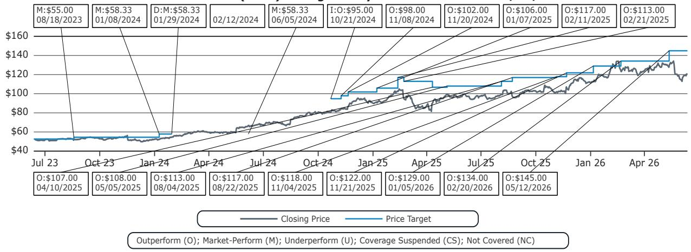
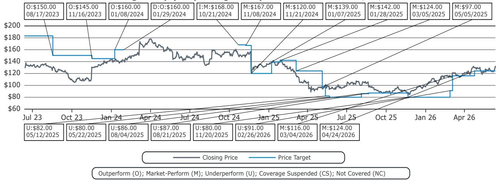
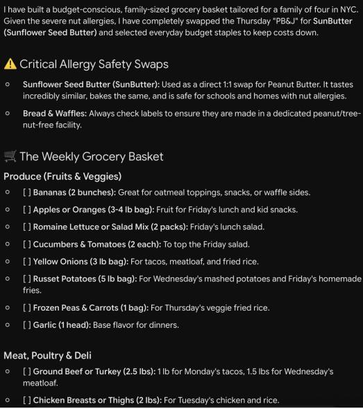

# Bernstein：AI购物离“自主决策”还差一个支付环节

过去六个月，从沃尔玛宣布与ChatGPT合作开始，“Agentic Shopping”成为美国零售业最热的关键词。但喧嚣之下，一个根本问题始终悬而未决：AI到底能在多大程度上替代人类的购物决策？

Bernstein（Bernstein）最近发布了一份极具实操性的研报。研究团队没有停留在概念推演，而是直接上手测试了五款AI工具——ChatGPT、Gemini、Claude三大基础模型，以及亚马逊Alexa和沃尔玛Sparky两个零售原生系统。测试任务简单到近乎朴素：为一家人买一盒牛奶，为一周备餐搭建购物篮。

结果却揭示了一个被市场严重低估的核心矛盾。AI在“发现商品”环节已经展现出令人印象深刻的潜力，但在“完成交易”这一最终步骤上，所有工具无一例外地败下阵来。这份报告的核心判断并不在于AI购物何时到来，而在于：**真正决定AI购物能否从“玩具”变成“工具”的关键，并非模型能力，而是支付环节的深度嵌入。**

这不是一个技术问题，而是一个商业模式和竞争格局的问题。谁先打通支付闭环，谁就掌握了下一代零售的入口。

## 1. 从“发现”到“购买”的断层，是所有AI购物工具的阿克琉斯之踵

Bernstein的测试设计精准地抓住了购物漏斗的六个关键环节：品类识别、SKU识别、定价、总成本估算、加入购物车、支付。结果一目了然：在“加入购物车”和“支付”这两个环节，所有工具都亮起了红灯。

基础模型（ChatGPT、Gemini、Claude）在信息检索和推荐上表现尚可，但一旦涉及交易执行，它们立刻暴露出“手不够长”的致命缺陷。它们可以告诉你“这盒牛奶在Whole Foods卖4.79美元”，但无法帮你下单。它们依赖网络爬虫和第三方文章来获取信息，导致SKU识别和实时定价经常出现偏差。最典型的是，当被问及具体价格时，Gemini需要用户进一步追问才能给出精确的SKU级信息，而Claude则直接承认“无法直接搜索购物和配送信息”。

零售原生系统（Alexa和Sparky）则呈现出截然不同的面貌。它们拥有实时库存和定价数据的直接访问权，因此在SKU识别和定价准确性上显著优于基础模型。Alexa能够精准推荐“365 by Whole Foods Market Organic Whole Milk, 64 oz”，并给出“4.79美元，今天下午1点到3点送达”的完整信息。Sparky甚至可以直接将商品加入购物车。

但问题出在了最后一步。Alexa无法处理Amazon Fresh和Whole Foods的生鲜产品，当用户要求将商品加入购物车时，它只能提供一个外部链接。Sparky虽然能完成从发现到建篮的全流程，但支付环节仍需用户手动操作。**没有一个工具能够实现“无监督”的自主购买。**

这意味着，当前所有AI购物工具的“自主性”都停留在“推荐”层面，而非“决策”层面。它们可以帮你找到商品，但无法替你完成交易。这个断层的背后，是AI系统与零售生态之间尚未弥合的鸿沟。

## 2. 基础模型与零售生态的“双向困境”：自由与精准不可兼得

Bernstein的测试揭示了一个核心张力：基础模型和零售原生系统各自拥有对方无法企及的优势，但也面临着对方不存在的短板。

基础模型（ChatGPT、Gemini、Claude）的“自由”是它们最大的武器。它们可以跨越不同零售商、不同平台，进行横向比较和跨生态推荐。当用户需要“一盒64盎司的有机全脂牛奶”时，ChatGPT能同时推荐沃尔玛的Great Value、Whole Foods的365、以及Organic Valley等多个选项，并给出价格区间和配送时间估算。这种“游牧式”的搜索能力，让用户能够获得最全面的市场信息。

然而，这种自由是有代价的。由于缺乏对零售商结构化目录数据的直接访问，基础模型的信息来源不可靠，定价和库存信息常常滞后或错误。它们本质上是一个“高级搜索引擎”，而非“购物助手”。

零售原生系统（Alexa、Sparky）则走向了另一个极端。它们拥有“精准”的绝对优势——实时库存、精确价格、无缝的购物车整合。Sparky在搭建一周购物篮的测试中，甚至能够根据食谱直接生成包含所有食材的购物清单，并一键加入购物车。这种“端到端”的体验，在单个零售商生态内几乎无可挑剔。

但精准的代价是“封闭”。Alexa无法推荐沃尔玛的商品，Sparky也无法触及亚马逊的库存。用户的购物决策被牢牢锁定在单一零售商的围墙花园内。当用户的需求跨出这个花园时，AI助手就立刻变得“失明”。

**这个“双向困境”意味着，未来AI购物的真正赢家，可能不是模型能力最强的公司，也不是库存最丰富的零售商，而是那个能够同时解决“自由”和“精准”问题的玩家。** 这需要基础模型与零售商之间建立更深的合作关系，比如ChatGPT与Uber Eats的整合，或者Claude与Instacart的潜在合作。但目前的合作深度，还远不足以打通支付闭环。

## 3. 搭建购物篮：设计哲学的分野暴露了AI的“理解力”与“执行力”之间的鸿沟

如果说购买单一商品测试的是AI的“执行力”，那么搭建一周购物篮测试的则是AI的“理解力”。Bernstein设计的任务包含一个五天的家庭餐单、一个四口之家的需求、一个10万美元的年收入约束、以及一个坚果过敏的限制条件。

在这个任务中，基础模型的表现令人惊讶。ChatGPT、Gemini和Claude都能生成一份结构完整、逻辑自洽的购物清单。它们能够理解“家庭四口人”意味着需要估算食材数量，能够识别“坚果过敏”并自动排除含有坚果的产品，甚至能够根据“年收入10万美元”的家庭预算，推荐性价比较高的商品。这份清单，更像是一份“购物计划”，而非简单的“购物列表”。

但问题在于，这份“计划”无法落地。基础模型生成的清单缺乏具体的SKU、精确的定价和购买链接。它们提供了“买什么”的洞察，却无法回答“去哪里买”和“多少钱”的问题。这就像一份没有地址的导航地图，方向正确却无法抵达。

零售原生系统则走向了另一个方向。Sparky的解决方案极具启发性：它没有像基础模型那样生成一个抽象清单，而是直接根据餐单推荐了具体的食谱，每个食谱都附带完整的食材列表和购买链接。用户点击一个“Tacos”食谱，就能看到所有需要的食材，并一键将所有食材加入购物车。这种“食谱驱动”的购物体验，将“理解需求”和“执行购买”无缝衔接，是目前所有测试工具中体验最流畅的。

但这背后反映的是一种更深刻的设计哲学分歧。**基础模型追求的是“通用理解”，它们试图理解用户的复杂意图并给出最优解；零售原生系统追求的是“场景转化”，它们将用户的需求简化为一个可执行的、封闭的交易流程。** 前者更聪明，但后者更实用。在AI购物的早期阶段，“实用”可能比“聪明”更能赢得用户。

## 4. 报告尚未完全回答的关键问题：支付闭环的“最后一公里”由谁来建？

Bernstein的报告精准地指出了当前AI购物的核心瓶颈——支付。但报告并没有深入探讨一个更关键的问题：**这个支付闭环，究竟应该由谁来建设？**

可能性一：由基础模型公司直接建设。这意味着ChatGPT或Gemini需要与支付服务商（如Stripe、Adyen）直接整合，建立自己的支付网关。这将是革命性的，但挑战巨大。它需要AI公司从“信息中介”转变为“交易中介”，不仅需要获得用户的支付授权，还需要承担交易风险、处理退款、管理合规等一系列复杂的金融基础设施。目前来看，这是最不现实的一条路。

可能性二：由零售商开放支付接口。亚马逊和沃尔玛完全有能力将Alexa和Sparky的支付能力向第三方开放。这意味着用户可以在Alexa的界面内，直接完成对沃尔玛或Target的支付。但这对零售商来说，无异于“开门揖盗”。一旦支付接口开放，用户的交易数据将不再被零售商独占，而AI助手将成为新的流量入口和交易枢纽。零售商将失去对用户购物体验的最终控制权。这是零售商最不愿看到的结果。

可能性三：由第三方聚合平台（如Instacart、DoorDash）来充当这个角色。这些平台本身已经聚合了多家零售商的库存和配送能力，并且拥有成熟的支付系统。它们与Claude、ChatGPT等基础模型的合作，是目前最可行的路径。但问题在于，这些平台的覆盖范围有限，且自身也在追求更高的利润率和用户粘性。它们能否成为中立、开放的支付枢纽，仍是一个巨大的问号。

**支付闭环的“最后一公里”，本质上是一场关于“用户关系”和“数据所有权”的终极博弈。** 谁控制了支付，谁就控制了用户购物的数字身份。这场博弈的最终结果，将决定未来十年零售业的权力格局。

## 5. 给读者的观察框架：如何判断AI购物何时进入“实用阶段”

基于Bernstein报告的洞察，我们建议读者建立一个更务实的观察框架，用来判断AI购物技术是否真正进入了“实用阶段”。这个框架不关注模型参数或技术演示，只关注三个可验证的信号。

第一个信号：支付的“无感化”。当用户可以在AI对话界面内，直接完成支付，而无需跳转到任何外部网站或应用时，这才是真正的“Agentic Shopping”。目前，没有任何一个工具做到了这一点。关注这个信号，比关注任何技术演示都更重要。

第二个信号：跨生态的“无缝化”。当用户可以在一个AI对话中，同时从沃尔玛购买牛奶、从亚马逊购买书籍、从Target购买日用品，并且所有交易都能在一个界面内完成时，AI购物才真正具备了“替代”人类决策的能力。目前，所有工具都还停留在单一生态内。跨生态的整合，是下一个关键里程碑。

第三个信号：决策的“个性化”。当AI不仅能够理解用户“买什么”，还能理解用户“为什么买”、“在哪里买”、“花多少钱买”时，AI购物才从“工具”进化到了“助手”。这意味着AI需要整合用户的消费历史、预算约束、口味偏好、甚至当天的情绪状态。Bernstein的测试中，AI能够识别“坚果过敏”，但无法理解一个年收入10万美元的家庭对“性价比”的敏感度。真正的个性化，还需要更多的数据融合和模型迭代。

这三个信号，构成了一个清晰的观察框架。当这三个信号同时出现时，AI购物就不再是实验室里的概念，而是可以改变零售业格局的实用技术。在此之前，所有关于“AI购物爆发”的讨论，都只是提前的乐观。

---

**写在最后**

Bernstein这份报告的价值，不在于它预测了AI购物何时到来，而在于它清晰地指出了“还差什么”。支付闭环的缺失，不是一个技术问题，而是一个商业模式和利益分配的问题。谁能够在不破坏现有零售生态的前提下，优雅地嵌入支付环节，谁就拿到了下一代零售的入场券。

关于支付环节的“最后一公里”究竟由谁来建，以及基础模型与零售生态之间更深层的利益博弈，我们在完整研报解读中展开了更详细的讨论。欢迎来到我们的星球微信群里继续探讨，我们会在那里分享更多关于AI购物竞争格局的深度分析和独家图表。

Personal reading notes and learning share only. Not investment advice.

