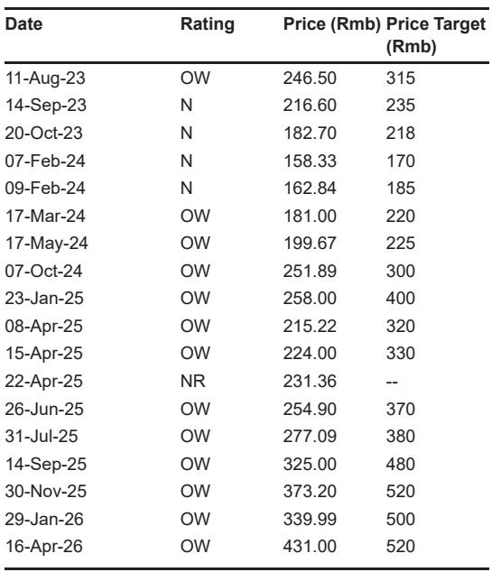
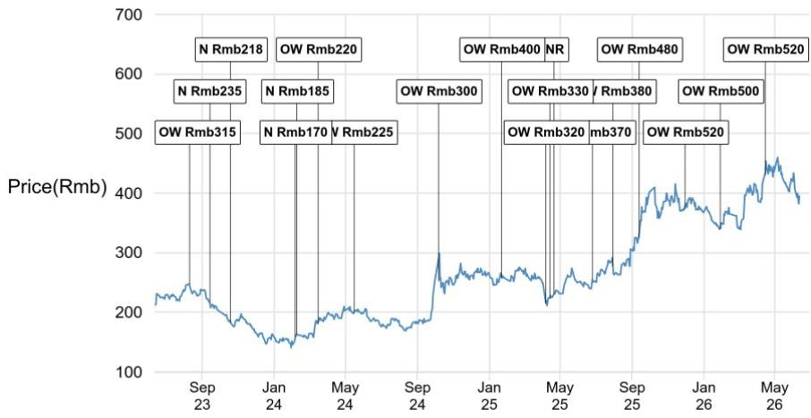
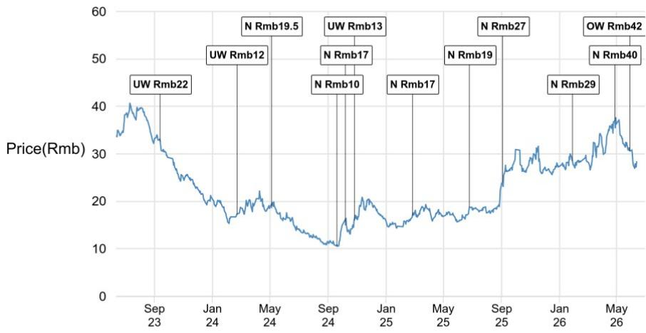

# China’s Battery Supply-Side Reform Is the Real Story—Not Trade Wars

The market has been fixated on the wrong narrative. Since early May 2026, China’s battery supply chain stocks have corrected 15–40%, and the dominant explanation has been EU-China trade tensions, rising lithium costs, and a rotation into AI and tech names. But this framing misses the structural catalyst that will define the sector for the next three years: China’s domestic capacity-control policies. These are not marginal tweaks. They represent a coordinated, multi-agency effort to reshape the industry’s supply-demand dynamics, raise entry barriers, and concentrate market power among a few technology leaders. The trade headlines are noise; the policy framework is signal.

Investors should understand that the battery sector is entering a new phase. The era of unlimited capacity expansion, irrational price competition, and government-subsidized low-end production is ending. In its place, a disciplined supply-growth regime is emerging—one that will structurally improve profitability for incumbents while squeezing out marginal players. The market has not fully priced this shift. The correction offers an entry point for those who can distinguish between cyclical noise and structural change.

This article distills the key insights from a major global investment bank report on China’s battery sector, focusing on four policy developments that will shape the industry’s trajectory. We will argue why capacity controls matter more than trade disputes, how the outbound investment framework creates a new compliance layer, and why the market’s neutral view on trade tensions may be too complacent. Finally, we will identify what the report does not fully answer and offer a decision framework for investors navigating this complex landscape.

## China’s Capacity Controls Are a Structural Positive That the Market Underappreciates

The most important development in China’s battery sector is not a tariff or a trade dispute—it is the tightening of domestic capacity expansion approvals. Multiple ministries, including MIIT, NDRC, NEA, and SAMR, have introduced coordinated measures to centralize approval authority, introduce quota-based allocation, and raise technical barriers for new projects. This is not a one-off intervention. It is the culmination of a policy trajectory that began in 2024 with the revised Lithium Battery Industry Standard and the Fair Competition Review Regulations.

The key mechanism is simple but powerful: future capacity additions will be assessed based on capacity utilization rates, R&D intensity, environmental compliance, and financial health. Policy resources—land, energy quotas, expansion permits—will be allocated preferentially to leading manufacturers. Smaller players without technological differentiation or relying on low-end products will face significant barriers to obtaining new approvals. The policy effectively grandfathers existing projects, meaning the impact will become visible from the second half of 2027 onward, with full effects by 2028.

Why this matters: The industry has been plagued by overcapacity since 2023, with utilization rates falling from 76% in 2022 to 58% in 2023–2024. This drove irrational price competition and deteriorating returns. The new framework directly addresses this by slowing effective supply growth. It is a supply-side reform for the battery sector, analogous to what China did in steel and coal in previous cycles. The beneficiaries are clear: companies with strong technology platforms, capital resources, and operational track records. The losers are tier-two and tier-three manufacturers that relied on government subsidies and low-cost expansion.

The market’s focus on trade tensions has obscured this domestic structural improvement. While EU and US trade actions create headline risk, they do not alter the fundamental improvement in China’s domestic supply-demand balance. Investors should overweight exposure to industry leaders that will gain market share as capacity becomes a scarce resource.

## The Anti-Involution Campaign Is More Than Rhetoric—It Is Changing Pricing Behavior

China’s “anti-involution” push, framed as an 18-month policy theme, has translated into concrete industry coordination. Channel checks and company discussions reveal closed-door, industry-association-led coordination across multiple battery and material subsectors, including LFP cathode, separators, and copper foil. The language is consistent: maintain pricing above cost, slow or pause incremental capacity expansion, and link expansion plans to utilization-rate thresholds.

Early results are visible. Dry separator prices have recovered and stabilized after coordination meetings. Company feedback indicates a broad expectation that pricing “will not deteriorate from here,” with some anticipating further increases into 2026 as capacity expansion remains constrained. This is not a government-mandated cartel; it is industry self-discipline supported by a regulatory environment that makes non-compliance costly.

The implication for investors is that the margin compression cycle may be bottoming. For companies that have weathered the 2023–2024 downturn, the operating environment is improving. The anti-involution campaign provides a floor under pricing, while capacity controls limit future supply. This combination is structurally positive for profitability, especially for leaders with pricing power and diversified product portfolios.

However, the effectiveness of these measures depends on each subsector’s supply-demand balance and concentration. Highly fragmented subsectors may see less discipline. Investors must differentiate between segments where coordination is credible and those where it is not. The report suggests that subsectors with higher concentration and clearer technology differentiation are more likely to sustain pricing improvements.

## The New Outbound Investment Framework Creates a Compliance Layer That Will Slow Overseas Expansion

State Council Order No. 837, effective July 1, 2026, represents a significant upgrade in the legal framework governing outbound investment. For battery companies, the primary risk is not that overseas projects will be blocked, but that the compliance burden will increase execution complexity and timelines. The regulation embeds export-control discipline into the outbound investment process, covering technology transfers, data flows, and personnel deployments.

For operating overseas projects, the continuity of technical support becomes a compliance issue. Expatriate engineer deployments, remote technical services, and operational support may become subject to additional review. For projects under construction, national security review requirements will add approval complexity. For future projects, regulatory considerations will become part of the initial investment decision, potentially slowing the pace of overseas expansion.

The report takes a neutral view on this policy, arguing that it aligns with existing export controls. But the neutrality may be too benign. The regulation gives policymakers a structured mechanism to respond to rising external restrictions from the EU and US. If trade tensions escalate, the outbound investment framework could become a tool for retaliation or negotiation. Companies with significant overseas exposure, particularly in Hungary and other EU markets, face increased regulatory risk that is not fully priced.

Investors should monitor how this framework interacts with EU and US trade actions. The combination of domestic capacity controls and tighter outbound investment rules could create a “barbell” effect: strong domestic profitability but constrained international growth. This favors companies that can generate returns within China’s protected market while managing overseas exposure carefully.

## EU-China Trade Tensions: The Market May Be Underestimating Escalation Risk

The report rates EU-China trade tensions as “neutral” for the battery sector, arguing that the EU’s Industrial Accelerator Act and potential trade measures are still under discussion and may take years to implement. But this assessment may be too sanguine. The European Commission’s statement that trade relations with China have become “unsustainable” signals a shift in political will. The EU is considering import quotas, additional tariffs, and anti-coercion instruments targeting sectors linked to the green transition, including batteries, solar, and electric vehicles.

The risk is not just direct tariffs on Chinese battery imports. It is the uncertainty around capacity expansions in Hungary, where CATL and BYD have major projects. Regulatory reviews in Hungary could delay or restrict these projects, affecting the growth trajectories of China’s largest battery manufacturers. The report acknowledges this risk but does not quantify it.

For investors, the key question is whether the EU’s actions will be targeted or broad-based. Targeted measures against specific products or companies would be manageable. Broad-based tariffs or quotas on Chinese batteries would be more damaging. The outcome likely depends on the EU’s internal political dynamics and the effectiveness of China’s diplomatic response. This is a binary risk that the market has not fully priced, and it warrants a premium for companies with high EU exposure.

## What the Report Does Not Fully Answer: The Interaction Between Capacity Controls and Trade Policy

The report provides a thorough analysis of each policy development in isolation, but it does not fully address how these forces interact. What happens when domestic capacity controls limit supply growth while trade tensions restrict export markets? The answer is not straightforward.

One scenario: capacity controls improve domestic profitability, but trade restrictions reduce export volumes. The net effect could be positive for domestic-focused players but negative for export-oriented companies. Another scenario: capacity controls and trade tensions create a bifurcated market, with strong domestic demand absorbing supply while export markets become more contested. The report’s pecking order favors leaders with technology platforms, but it does not explicitly rank companies by geographic exposure or export dependence.

Investors should ask: which companies have the most to gain from domestic capacity consolidation and the least to lose from trade restrictions? The answer likely favors companies with diversified customer bases, strong domestic market positions, and the ability to localize production in key overseas markets. The report’s top pick, CATL, fits this profile, but the analysis could be deeper on the specific trade-exposure risks for each company.

## A Decision Framework for Investors Navigating the New Battery Landscape

To make sense of the complex policy environment, investors should use a three-dimensional framework:

First, assess domestic capacity exposure. Companies with high capacity utilization, strong R&D pipelines, and financial health will benefit from the new approval framework. Companies with low utilization and weak balance sheets face structural headwinds. The report provides capacity utilization data for the top eight players, showing utilization rates above 100% for 2025–2026, indicating that leaders are running at full capacity while smaller players struggle.

Second, evaluate overseas exposure and compliance risk. Companies with large overseas projects, particularly in Hungary and other EU markets, face increased regulatory risk from both the EU’s trade measures and China’s new outbound investment framework. The compliance burden will be higher for companies with complex global supply chains. Investors should prefer companies with diversified geographic footprints and the ability to localize production.

Third, monitor pricing discipline in each subsector. The anti-involution campaign is most effective in concentrated subsectors with clear technology differentiation. Investors should favor subsectors where coordination is credible and avoid those where fragmentation undermines discipline. The report’s early read-throughs on dry separator pricing are encouraging, but other subsectors may not follow suit.

This framework allows investors to identify companies that score well on all three dimensions: strong domestic positioning, manageable overseas risk, and favorable subsector dynamics. These are the companies most likely to compound value through the policy transition.

## Join the Community to Read the Full Report and Review the Original Charts

The analysis above is based on a detailed research report that includes proprietary capacity utilization data, green loan trends, and policy timelines that are essential for understanding the sector’s trajectory. The original charts show the evolution of China’s battery capacity utilization from 2019 through 2027, the decline in green lending support, and the capacity utilization rates of the top eight players. These data points are critical for making informed investment decisions.

Join the community to read the full report and review the original charts. The report provides granular company-level analysis, including the rationale for upgrading CALB and Putailai to Overweight, and a detailed assessment of how each policy development affects individual stocks. The community also offers access to ongoing updates as policies evolve and trade tensions develop.

*This article is for learning and discussion only and does not constitute investment advice.*

Personal reading notes and learning share only. Not investment advice.

