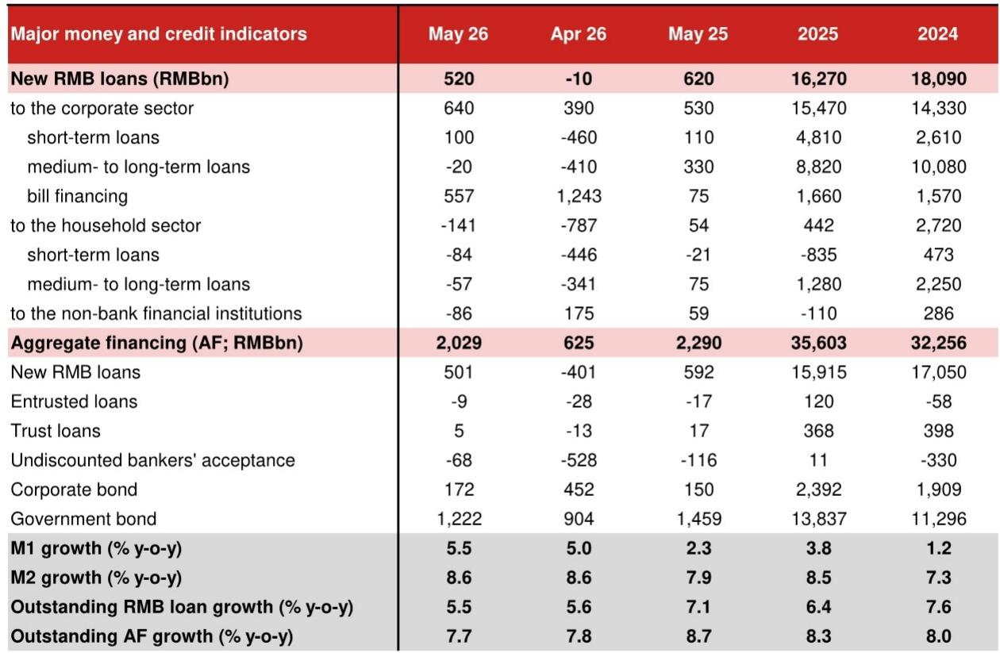
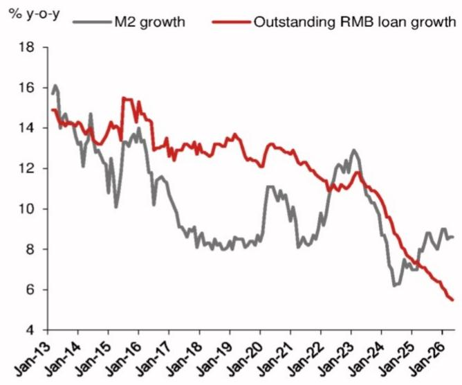
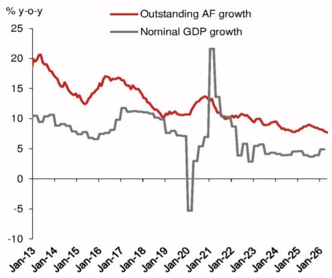

# NOM：中国信贷收缩的“新常态”正在重塑资产定价逻辑

这份NOM研报的核心判断并不复杂，但它的冲击力在于数据背后的结构性含义：中国5月信贷增速降至7.7%，创历史新低，且这种放缓并非短期波动，而是需求端结构性收缩与供给端政策主动调控共同作用的结果。市场如果只将其解读为“经济复苏乏力”的又一个证据，可能低估了这场信贷收缩对资产定价、企业盈利与政策框架的深远影响。

NOM的数据显示，5月新增社融2.03万亿元，远低于市场预期的2.32万亿元，也低于去年同期的2.29万亿元。人民币贷款余额增速降至5.5%，同样是历史最低。但真正值得注意的是，这些数字背后隐藏着三个相互关联的结构性变化：居民部门持续去杠杆、企业贷款依赖票据融资“注水”、以及央行主动收紧流动性以修复利率信号机制。

这不是一次简单的周期性放缓。它可能标志着中国信用扩张模式正在从“量宽价低”转向“量稳价韧”，而这一转变对股票、债券和房地产的定价含义，远比表面数据更深远。

## 1. 居民部门去杠杆已从“短期波动”演变为“长期趋势”

NOM报告中最令人不安的数据来自居民贷款。5月新增居民贷款为负1410亿元，而去年同期为正值540亿元。更关键的是，无论是短期贷款还是中长期贷款，双双录得负增长：短期贷款减少840亿元，中长期贷款减少570亿元。这在历史上极为罕见。

这意味着居民部门不仅在减少借贷，还在主动偿还存量债务。居民存款数据同样印证了这一点：5月新增居民存款为负1100亿元，而去年同期为4700亿元。这是自2015年以来首次出现5月居民存款负增长。居民并非没有钱，而是钱正在从银行体系流向其他领域——可能是消费、可能是理财，也可能是偿还负债。

对投资者而言，居民去杠杆意味着什么？它直接抑制了消费类资产的盈利预期，尤其是与可选消费、房地产相关的板块。更深远的影响在于，它改变了中国经济增长的内生动能结构。过去十年，居民加杠杆是支撑房地产和消费升级的核心动力，现在这个动力正在逆转。任何依赖居民信贷扩张的商业模式，都需要重新审视其增长天花板。

## 2. 企业贷款“表面繁荣”掩盖了真实信贷需求的持续萎缩

企业贷款数据看起来并不差：5月新增企业贷款6400亿元，高于去年同期的5300亿元。但NOM的分析揭示了一个关键扭曲——票据融资规模异常庞大。5月新增票据融资5570亿元，而去年同期仅为750亿元。如果剔除票据融资，企业实际贷款需求可能远低于表面数字。

票据融资通常被视为企业短期流动性管理工具，而非真实投资需求的信号。当企业大量依赖票据而非中长期贷款时，说明它们对未来投资回报缺乏信心，或者银行在信贷额度压力下用票据“凑数”。NOM报告指出，企业中长期贷款5月新增为负200亿元，而去年同期为3300亿元。这是一个鲜明的对比：企业不是在借钱投资，而是在减少长期负债。

这意味着什么？企业部门的资本开支意愿依然低迷。对于工业品、设备制造、工程建设等依赖企业投资的行业，这预示着需求端将持续承压。同时，它也暗示着银行体系面临的资产荒可能比市场想象的更为严重——银行有钱，但找不到优质贷款项目，只能通过票据和债券市场消化资金。

## 3. 央行收紧流动性并非“加息前奏”，而是修复利率信号机制

5月信贷数据发布前，市场已经注意到央行在主动收紧流动性。NOM报告详细描述了这一过程：央行通过缩减每日逆回购操作规模、窗口指导国有银行减少同业拆借，将DR007从5月低点1.3%以下推回至1.4%以上。10年期国债收益率也从1.7%左右的低位有所回升。

市场容易将央行的这一操作解读为“货币政策转向收紧”的信号，进而担忧利率上行和流动性紧缩。但NOM的判断更为精细：央行的目标不是为降息或降准腾挪空间，而是修复利率走廊的信号功能，防止债券市场形成自我强化的下跌螺旋，并遏制金融空转风险。

NOM明确表示，维持2026年不降息、不降准的基准判断。这意味着央行当前的操作并非短期对冲，而是对货币政策框架的长期调整。如果这一判断成立，那么市场需要适应一个“流动性充裕但利率不降”的新环境。对于债券投资者而言，这意味着利率下行空间有限，久期策略需要更加谨慎。对于股票投资者，这意味着估值扩张的流动性支撑正在减弱，盈利增长将成为更核心的定价因素。

## 4. 政府债券发行滞后，但下半年可能成为信用扩张的“唯一引擎”

5月社融数据中，政府债券净发行1.22万亿元，低于去年同期的1.46万亿元。在居民和企业部门同时收缩的背景下，政府债券本应是信用扩张的主要抓手，但其发行节奏反而低于预期。NOM认为，这可能是暂时的，因为北京需要支持收缩中的固定资产投资，后续政府债券发行有望加速。

如果政府债券发行在下半年提速，它将部分对冲居民和企业部门的信贷收缩，但无法完全弥补。政府债券资金主要流向基础设施和公共服务，其对经济拉动效应的传导链条较长，且对私人部门投资的溢出效应有限。这意味着信用扩张的“总量”可能企稳，但“结构”将更加依赖公共部门。

对投资者而言，这意味着与政府支出相关的领域（如基建、新能源、公用事业）可能获得相对稳定的需求支撑，而与私人消费和投资相关的领域将继续面临压力。同时，政府债券供给增加也可能对债券市场利率形成上行压力，进一步压缩信用利差。

## 5. 货币供应量M1回升的“含金量”需要谨慎解读

5月M1同比增长5.5%，高于4月的5.0%，也显著高于去年同期的2.3%。M1通常被视为企业活期存款的代表，其回升往往被解读为企业流动性改善或经营活动回暖。但结合信贷数据看，这一回升可能更多是财政存款减少的统计效应，而非企业主动增加活期存款。

5月财政存款增加7100亿元，低于去年同期的8800亿元。财政存款减少意味着资金从政府账户流向企业或居民账户，这会推高M1。但企业活期存款增加的原因可能是政府支出加快，而非企业自身经营现金流改善。如果企业真实信贷需求依然疲弱，M1回升的可持续性就值得怀疑。

对于宏观分析而言，M1回升如果缺乏企业投资意愿的配合，其对经济复苏的指示意义将大打折扣。投资者应更多关注企业中长期贷款和资本开支计划等领先指标，而非仅仅依赖M1的短期波动。

## 报告尚未完全回答的关键问题：信用收缩何时会触及政策底线？

NOM报告提供了详尽的数据和精炼的分析，但有一个问题它没有完全展开：信用收缩到什么程度，会触发政策的系统性转向？目前央行的操作是在“稳信用”和“防风险”之间寻找平衡，但如果居民和企业部门去杠杆加速，导致经济下行压力超出预期，政策框架是否会从“结构性收紧”转向“全面宽松”？

报告提到政府债券发行有望加速，但这更多是“对冲”而非“逆转”。真正的逆转需要居民和企业部门重新加杠杆，而这需要信心恢复、收入预期改善和资产价格企稳。目前来看，这些条件尚不成熟。

另一个未解问题是：票据融资的持续高企，是否意味着银行体系的资产质量问题正在恶化？当银行不得不依赖票据融资来满足信贷额度时，说明正常贷款需求严重不足。如果经济持续低迷，这些票据融资的信用风险是否会逐步暴露？报告没有深入讨论，但这可能是未来需要密切跟踪的风险点。

## 顺着这些未解问题继续读完整报告

NOM这份报告的价值不仅在于它提供了5月信贷数据的详细拆解，更在于它揭示了信用收缩背后的结构性力量——居民去杠杆、企业投资意愿低迷、央行主动修复利率信号。这些力量正在共同塑造一个新的宏观环境，其影响将远远超出月度数据的波动。

但报告的篇幅和格式限制了许多更深层次的讨论：信用收缩对不同行业的差异化影响如何量化？央行流动性管理的“新框架”对资产配置的具体含义是什么？票据融资高企是否预示着银行体系的风险累积？这些问题在完整报告中有所涉及，但更深入的讨论需要结合更多数据和历史对比。

欢迎来星球微信群里继续讨论，我们可以一起拆解NOM报告中的图表细节，探讨信用收缩对不同资产类别的定价含义，以及下半年可能出现的政策拐点信号。在群里，你还能看到其他机构对同一数据的交叉验证，以及我们基于这些数据构建的观察框架。

Personal reading notes and learning share only. Not investment advice.

