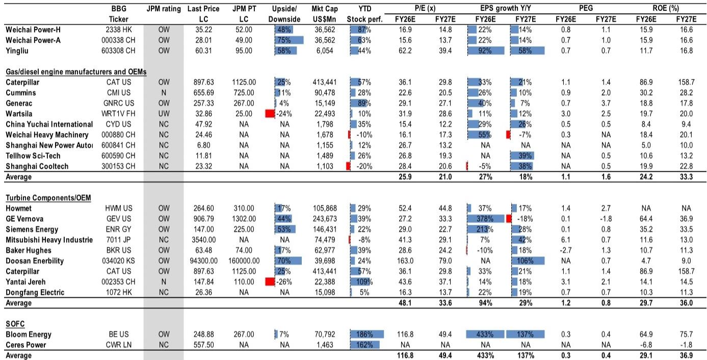
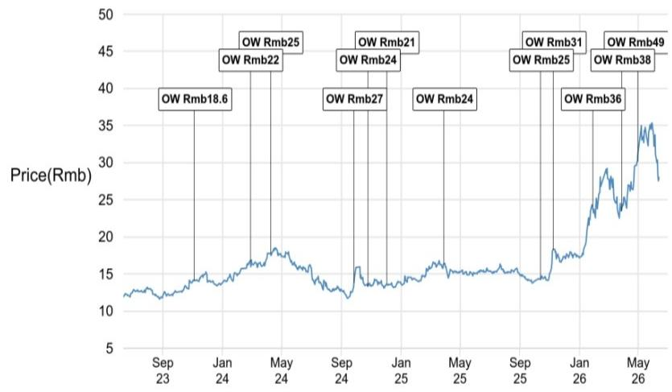
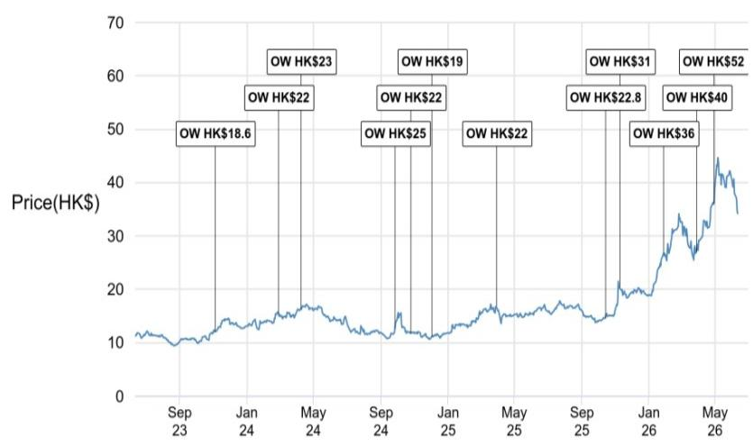

# The Grid Has Reached Its Limit: Why Onsite Power, Not the Utility, Will Define the Next Phase of AI Infrastructure

The single most important fact shaping the future of data center investment is not the pace of AI model improvement, the cost of GPUs, or the availability of fiber. It is this: the electrical grid is no longer a reliable partner in the buildout of AI infrastructure. For years, data center operators assumed that power would be available when and where they needed it. That assumption has broken down. Interconnection delays now stretch for years in key markets across the United States and globally. Energy shortages are no longer theoretical risks; they are the primary bottleneck delaying project timelines and altering investment decisions.

This structural constraint is not a temporary nuisance. It is a permanent shift in the operating reality of the industry. The market is now forced to confront a fundamental question: if the grid cannot deliver, who will? The answer is reshaping the entire data center power supply chain and creating a new class of winners. The era of relying almost exclusively on utility-scale grid power for AI data centers is giving way to a new paradigm in which onsite power generation—gas turbines, gas engines, and solid oxide fuel cells (SOFC)—becomes the primary solution for new capacity.

The implications are profound. A global investment bank report, based on a recent expert call, argues that the addressable market for onsite power solutions is expanding rapidly, and that the competitive dynamics favor a specific set of players. The thesis is clear: the grid constraint is the catalyst, but the long-term opportunity is defined by technology differentiation, cost curve improvements, and the ability to deliver integrated solutions at scale. This is not merely a story about backup power; it is a story about the re-architecting of how the world's most critical computing infrastructure gets its energy.

## Grid Interconnection Delays Have Transformed Onsite Power from a Contingency to a Core Requirement

The most significant structural change in the data center industry over the past two years is the migration of onsite power from a backup function to a primary power source. According to the expert cited in the report, approximately 60 percent of US data centers still rely on the grid for their primary power. But the direction of travel is unmistakable. Over 20 percent now use gas turbines as their primary power source, and the share of gas engines and SOFC is rising quickly. This is not an incremental shift; it is a redefinition of the power architecture itself.

The driver is straightforward. Grid interconnection queues are overwhelmed. In many regions, the timeline to secure new utility-scale power has stretched beyond the planning horizons of hyperscale operators. When a data center project faces a three-to-five-year wait for grid connection, onsite generation becomes not a luxury but a necessity. The expert noted that power shortages are now a primary driver of demand for onsite solutions in the US and globally. This is a supply-constrained market, and the constraint is not capital or technology; it is the physical capacity of the electrical infrastructure.

The "so what" for investors is that the total addressable market for onsite power has expanded permanently. Previously, this market was defined by backup power requirements for existing facilities. Now, it encompasses primary power for new builds. The report estimates that global SOFC demand alone could reach 20 to 30 gigawatts by 2030. To put that in perspective, that is a market size that rivals entire national power grids. The growth trajectory is not cyclical; it is structural, driven by a fundamental mismatch between AI power demand growth and grid infrastructure investment.

## SOFC Is Emerging as the Technology with the Most Favorable Policy Tailwinds and Cost Trajectory

Within the onsite power landscape, not all technologies are created equal. The report makes a compelling case that solid oxide fuel cells are emerging as a highly competitive solution with an expanded total addressable market and rising policy support, particularly in China. The expert highlighted that SOFC's lifecycle cost is currently in the range of $0.08 to $0.15 per kilowatt-hour, assuming an eight-to-ten-year lifecycle. This is already competitive with grid power in many markets, and the cost is expected to decline further as capacity scales and localization increases.

The policy dimension is critical. The report draws a direct parallel between the current support for SOFC in China and the early days of the lithium battery and solar industries. If that analogy holds, the implications are significant. Both lithium batteries and solar power experienced dramatic cost reductions and market expansion driven by policy support, scale, and supply chain localization. SOFC appears to be on a similar trajectory. The Chinese government is actively supporting capacity buildout and cost-down initiatives, which could accelerate the technology's adoption curve faster than many investors currently anticipate.

What makes SOFC particularly attractive for data center applications is not just cost but operational characteristics. The expert noted that SOFC offers flexibility, lower operating temperatures, and rapid start-stop capability. These features are increasingly valued by data center operators who need power solutions that can ramp up and down quickly to match variable loads. Gas turbines, while efficient at steady-state operation, are less flexible. The ability to integrate SOFC with gas engines and storage creates a hybrid solution that can optimize for cost, reliability, and responsiveness. This is not a one-size-fits-all market; it is a market that rewards providers who can tailor solutions to specific site requirements.

## Integrated Solution Providers with Full-Stack Capabilities Will Capture the Largest Share of Value

A critical insight from the report is that the competitive landscape is shifting away from component suppliers toward integrated solution providers. The expert observed that as SOFC and gas engine technologies scale, their cost curves are improving, but the real differentiator is the ability to offer a full-stack solution that combines generation, storage, and control systems. Data center operators do not want to manage multiple vendor relationships for power equipment. They want a single provider who can guarantee performance, manage integration risk, and deliver a turnkey solution.

This has direct implications for which companies are best positioned. The report highlights Weichai Power as a standout, citing its rapid AIDC engine and SOFC capacity ramp, its US distribution strategy, and its integrated technology leadership. The expert noted that Weichai's AIDC engine shipments are poised to reach 3,500 to 4,000 units in 2026, with a clear focus on scaling both domestic and export capacity. On the SOFC front, the company's capacity ramp-up plan is ambitious: 30 megawatts in 2026, 200 megawatts in 2027, 600 megawatts in 2028, and one gigawatt by 2030. These are not incremental targets; they represent a multi-hundred-fold increase in capacity over five years.

The integrated approach is not just about having multiple products. It is about combining them in ways that create superior value for the customer. Weichai's SOFC technology, with lower operating temperature and faster response, is seen as a key differentiator. When combined with gas engines and storage, the company can offer a solution that addresses the full spectrum of a data center's power needs, from baseload to peaking to backup. This integrated capability is resonating with customers globally, according to the expert. For Yingliu Electromechanical, the near-term growth driver is overseas gas turbine demand, with order visibility improving across major global OEMs. But the domestic market also provides upside as localization and state procurement increase.

## The Competitive Threat from Non-Chinese Suppliers Is Limited by Cost, Lead Time, and Supply Chain Constraints

One of the more counterintuitive findings from the report is that the competitive threat from ship engine and Korean suppliers is limited. This matters because investors have been concerned that the ramp in AIDC power demand would attract a wave of new entrants, compressing margins and limiting the upside for current leaders. The expert's assessment suggests otherwise. While Korean ship engine makers have won some data center orders, their impact is limited due to higher costs, longer lead times, and less flexible supply chains.

The report argues that the global power shortage through 2030 will create enough demand for multiple players. This is not a zero-sum game in the near term. But the structural advantages of China-based suppliers—cost, supply chain depth, and delivery speed—position them to capture the largest share of the growth. The expert believes that these advantages are durable and not easily replicated by competitors who lack the scale and ecosystem that Chinese manufacturers have built over decades.

This has important implications for margin expectations. If the competitive environment remains benign for the established leaders, the revenue growth from the AIDC power cycle should translate into strong margin expansion. The report's valuation tables show that Weichai Power trades at 16.9 times FY26E earnings on the H-share and 15.6 times on the A-share, with EPS growth of 22 percent expected in FY26E. Yingliu trades at a higher multiple of 62.2 times FY26E, but with EPS growth of 92 percent. These multiples are not cheap, but they reflect the market's recognition of the structural growth opportunity. The key question for investors is whether the growth trajectory is sustainable enough to justify current valuations.

## What the Report Does Not Fully Answer: The Path Dependency of SOFC Scaling and the Risk of Technology Displacement

For all its analytical rigor, the report leaves several important questions unanswered. The most significant is the path dependency of SOFC scaling. The report cites ambitious capacity targets from Weichai, but it does not fully address the execution risk inherent in scaling a complex electro-chemical technology from 30 megawatts to one gigawatt in five years. Scaling manufacturing for SOFC is fundamentally different from scaling for gas engines. The supply chain for ceramic materials, the quality control requirements, and the system integration challenges are all more demanding. The report's bullish case assumes that the cost curve will follow a similar trajectory to lithium batteries, but that analogy may be imperfect. The learning rates for fuel cells have historically been slower than for batteries, and the technology is still evolving.

A second unresolved question is the risk of technology displacement. The report treats SOFC, gas engines, and gas turbines as complementary solutions that will coexist. But what if a breakthrough in battery storage or a new generation of nuclear small modular reactors changes the economics? The report does not address the potential for competing technologies to disrupt the onsite power thesis. The current environment favors SOFC and gas engines because of grid constraints, but if grid investment accelerates or if alternative power sources become more cost-effective, the demand profile could shift.

A third question is the regulatory and permitting risk for onsite power installations. Data center operators may want onsite generation, but local communities and environmental regulators may not approve. The report does not discuss the potential for permitting delays or opposition to onsite fossil fuel generation in environmentally sensitive areas. This is a real risk that could slow the adoption of gas turbines and engines, even if the grid cannot deliver.

These unresolved questions do not invalidate the thesis, but they do suggest that the investment case is more nuanced than a simple extrapolation of current trends. Investors need to monitor execution risk, technology evolution, and regulatory developments closely.

## A Decision Framework for Investors Assessing the AIDC Power Opportunity

For readers trying to translate the report's insights into actionable investment decisions, a structured framework is more useful than a list of stock picks. The following decision framework can help investors evaluate opportunities in the AIDC power supply chain.

First, assess the technology exposure. Not all AIDC power plays are created equal. Companies with exposure to SOFC have the most favorable policy tailwinds and the largest potential TAM expansion, but they also carry the highest execution risk. Companies with exposure to gas turbines have clearer near-term visibility, as the demand is already materializing, but the growth may be more cyclical. Companies with exposure to gas engines offer a middle ground, with strong demand from both backup and primary power applications.

Second, evaluate the business model. The report makes clear that integrated solution providers have a competitive advantage over component suppliers. Investors should favor companies that can offer a full-stack solution combining generation, storage, and controls. The ability to serve as a single point of accountability for the data center operator is a significant moat.

Third, analyze the supply chain position. China-based players have structural advantages in cost, scale, and delivery speed. But not all Chinese players are equal. Investors should look for companies with established relationships with global data center operators, a track record of scaling production, and a clear strategy for navigating export markets.

Fourth, consider the valuation trajectory. The market has already priced in significant growth for the leaders. The question is whether the growth will exceed expectations or fall short. Investors should focus on the companies where the risk-reward is most favorable, considering both the upside from the AIDC power cycle and the downside from execution risk or competitive disruption.

## The Full Report Contains the Data and Charts That Support This Thesis

The analysis above is based on a detailed expert call and proprietary research from a global investment bank. The full report contains the original charts, valuation tables, and company-specific analysis that underpin the arguments presented here. For investors who want to move beyond the strategic framework and into the specific numbers, the original material provides the depth necessary for informed decision-making.

The report identifies Weichai Power and Yingliu Electromechanical as the two most compelling opportunities in the space, with clear paths to scale, technology leadership, and strong order momentum. But the full report also includes a comprehensive competitive analysis, a detailed breakdown of the cost curves for each technology, and a discussion of the risks that could derail the thesis.

Join the community to read the full report and review the original charts.

*This article is for learning and discussion only and does not constitute investment advice.*

Personal reading notes and learning share only. Not investment advice.

