## US Economics Weekly | North America

# Reassessing risks to our Fed call after the latest data

Last week's data suggest that, on net, the balance of risks is shifting toward firmer inflation rather than weaker hiring. The labor market continues to firm, and while the tariff impulse appears to be nearing completion, sustained disinflation ahead depends on a resolution of the conflict.

## Key Takeaways

The labor market has strengthened, reducing downside risks and shifting the Fed's focus back toward inflation.  
CPI came in line with expectations, suggesting the payback in core goods is underway.  
However, a strong core PCE translation following PPI (0.36% m/m in May) indicates that the oil impulse to core persists—primarily through airfares.  
The extent of airfare payback—and broader core disinflation—will depend on how long the Strait of Hormuz remains disrupted.  
Consumption has been running slightly above wealth-implied levels, and we expect limited upside risks to real spending growth.

Exhibit 1: The longer oil prices remain elevated, the greater the risk of second-round effects on core inflation.  
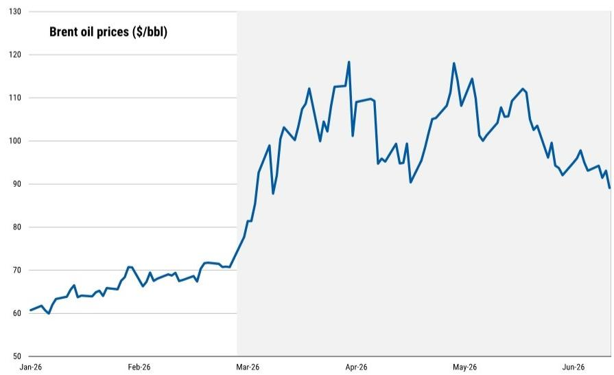

line chart

| Date   | Brent oil prices ($/bbl) |
|--------|--------------------------|
| Jan-26 | 60                       |
| Feb-26 | 70                       |
| Mar-26 | 80                       |
| Apr-26 | 110                      |
| May-26 | 115                      |
| Jun-26 | 90                       |

Source: Bloomberg, MS

MS & CO. LLC

## Michael T Gapen

Chief US Economist

Michael.Gapen@morganstanley.com +1 212 761-0571

## Sam D Coffin

Economist

Sam.Coffin@morganstanley.com +1 212 761-4630

## Diego Anzoategui

Economist

Diego.Anzoategui@morganstanley.com +1 212 761-8573

## Arunima Sinha

Global Economist

Arunima.Sinha@morganstanley.com +1 212 761-4125

## Heather Berger

Economist

Heather.Berger@morganstanley.com +1 212 761-2296

## Lingdi Xu

Economist

Lingdi.Xu@morganstanley.com +1 212 761-2957

2026 EXTEL

ALL-AMERICA

RESEARCH POLL

May 26 – June 12, 2026

VIEW OUR

ANALYSTS >

# Reassessing risks to our Fed call after the latest data

When we wrote our outlook, we highlighted two scenarios under which inflation would run higher and the Fed would either remain on hold for longer or potentially hike rates: a demand push scenario, and one featuring a persistent oil premium stemming from a prolonged US-Iran conflict.

In the demand push scenario, stronger consumption and business investment—supported by elevated wealth and improving confidence—drive a reacceleration in growth and tighter labor market conditions. As a result, inflation pressures remain firm even as oil dynamics normalize, with tighter labor markets reinforcing persistence in core inflation and ultimately prompting the Fed to begin hiking once it becomes clear that the strength reflects demand rather than productivity. By contrast, in the permanent oil premium scenario, oil prices remain structurally elevated, leading to sustained supply side pressures and gradual pass through into core prices. While growth is somewhat softer, inflation remains persistently above target, keeping the Fed cautious and on hold with a high bar for easing.

The recent developments in the Middle East, together with last week's employment report and this week's inflation data, suggest that both scenarios may be becoming more likely than we initially anticipated.

On net, the data indicate that the balance of risks is shifting in the direction of firmer inflation over weak hiring. This is different from a year ago when the Fed said downside risk to labor markets outweighed inflation concerns and cut its policy rate by 75bp,

The employment report pointed to a labor market that continues to firm. Payroll growth has reaccelerated, with the three month average rising to around 188k, a clear improvement relative to last year and stronger than both our expectations and likely those of the Fed. This strength should alleviate concerns about downside risks to the labor market and reinforce the shift in the balance of risks toward inflation.

At the same time, the unemployment rate remains low and broadly stable at around 4.3%. The key question is whether labor markets will tighten further, as in our demand push scenario. That, in turn, depends on the extent to which higher energy prices weigh on activity. The impact of oil shocks typically happens with a lag, suggesting some risk of a slowdown ahead. However, if that deceleration does not materialize and payroll growth remains around 100k—well above our estimated breakeven pace of roughly 50k—we would expect continued downward pressure on the unemployment rate. If sustained, this dynamic would move the labor market closer to our demand push scenario, raising the likelihood that the Fed shifts from a hold to a hiking stance.

On inflation, the May CPI data broadly aligned with our expectations but PPI data and our translation to PCE inflation surprised us to the upside. Core CPI came in at 0.21% m/m, with signs that the payback from earlier goods inflation has started. Tariff pass through appears to be nearing completion, with core goods prices turning negative on the month, and there were limited signs of broader spillovers from AI or oil into goods categories.

However, the translation into core PCE following the PPI release was stronger than expected. We now estimate core PCE increased $0.36\%$ m/m in May, implying a y/y pace of $3.4\%$ . This upward revision was driven in part by stronger than expected services components, including a notable pickup in airfares—particularly international fares—suggesting that oil related pressures continue.

While the oil impulse to core remains relatively narrow for now, the sharper than expected acceleration in airfares highlights potential upside risks. We continue to expect some of this strength to unwind over time, generating a payback in services inflation. However, in the absence of a near term resolution to the conflict—consistent with our permanent oil premium scenario—it would become increasingly difficult to see core PCE ending the year below 3%y/y, fast disinflation and Fed cuts in 2027.

Exhibit 2: A broad-based acceleration in payrolls so far this year  
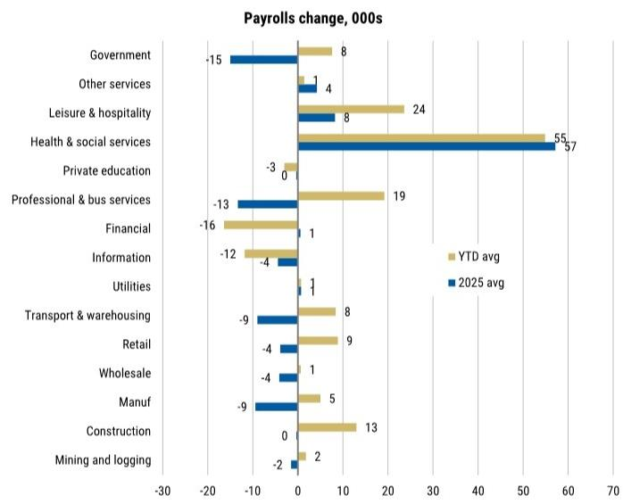

bar chart

Payrolls change, 000s
| Category | YTD avg (in 000s) | 2025 avg (in 000s) |
|---|---|---|
| Government | 8 | -15 |
| Other services | 1 | 4 |
| Leisure & hospitality | 24 | 8 |
| Health & social services | 55 | 57 |
| Private education | -3 | 0 |
| Professional & bus services | 19 | -13 |
| Financial | -16 | 1 |
| Information | -12 | -4 |
| Utilities | 1 | 1 |
| Transport & warehousing | 8 | -9 |
| Retail | 9 | -4 |
| Wholesale | 1 | -4 |
| Manuf | 5 | -9 |
| Construction | 13 | 0 |
| Mining and logging | 2 | -2 |

Source: BLS, MS.

Exhibit 3: The tariff pass-through may be near completion, but a prolonged conflict adds upside risks  
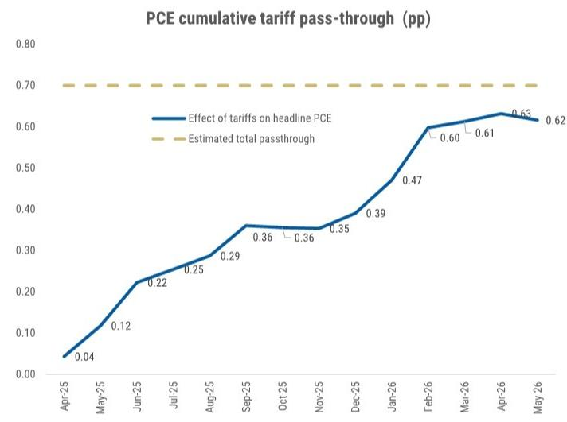

line chart

PCE cumulative tariff pass-through (pp)
| Date | Effect of tariffs on headline PCE (pp) |
|---|---|
| Apr-25 | 0.04 |
| May-25 | 0.12 |
| Jun-25 | 0.22 |
| Jul-25 | 0.25 |
| Aug-25 | 0.29 |
| Sep-25 | 0.36 |
| Oct-25 | 0.36 |
| Nov-25 | 0.35 |
| Dec-25 | 0.39 |
| Jan-26 | 0.47 |
| Feb-26 | 0.60 |
| Mar-26 | 0.61 |
| Apr-26 | 0.63 |
| May-26 | 0.62 |
Estimated total passthrough

Source: BEA, BLS, MS forecasts.

## Consumption support from a low saving rate has limits

In our 2026 outlook, we expected that real consumer spending growth would take a backseat in driving headline real GDP growth for much of the year. The drag is largely cyclical and front loaded: tariff effects weighed on real purchasing power in 1Q, while the subsequent oil disruption is acting as an effective tax on households through 2Q and 3Q. In that environment, growth has rotated away from consumption toward other components, even as underlying demand has remained broadly intact.

Taking stock of incoming data, the pace of spending is tracking close to expectations. Real consumption growth had slowed to 1.4% q/q saar in 1Q26. Beneath the surface, the drivers of spending have improved modestly. Recent labor market gains imply that the nominal payroll proxy for production and non-supervisory workers is running a solid pace: 5.5% in April and May over the 1Q average (2m/3m % saar), and 4.4% for all employees. However, headline PCE growth in 2Q will continue to pressure real labor market income; a further acceleration in the labor market this summer could lead to real wage growth closer to flat, rather than slightly negative, and could incrementally support near-term consumption momentum.

At the same time, while the overall balance sheet of the consumer continues to be healthy, there could be some headwinds. Nominal household wealth gains slowed in 1Q26 with implications for how much upside risk there could be for consumption going forward. Our wealth model indicates that consumption has been running above levels implied by household wealth for the last year, suggesting some upside risk to the saving rate and, correspondingly, downside risk to spending. So, while income dynamics are likely stabilizing, the upside risk to consumption growth from wealth effects is much less likely.

Our view then is that real consumption growth is so far evolving largely in line with our baseline: a slower pace of growth most of this year, with some acceleration in 4Q26 onwards, but not a primary driver of growth. Risks around this profile remain skewed slightly to the downside if cyclical factors turn less favorable due to an extended oil disruption, particularly from slower income growth or asset market volatility. Absent a more durable acceleration in labor market momentum and “animal spirits,” we see limited scope for a material upside surprise to consumer spending from here.

Exhibit 4: The pace of net wealth gains for households have slowed, and nominal consumption has been overshooting wealth-implied target levels  
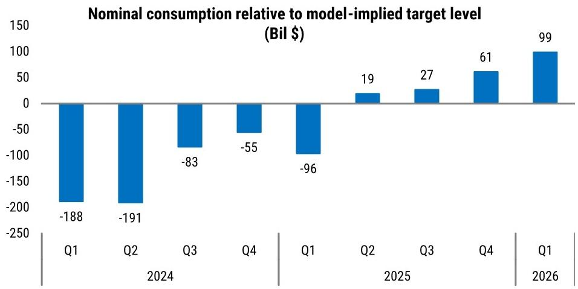

bar chart

Nominal consumption relative to model-implied target level (Bil $)
| Period | Nominal consumption relative to model-implied target level (Bil $) |
|---|---|
| Q1 2024 | -188 |
| Q2 2024 | -191 |
| Q3 2024 | -83 |
| Q4 2024 | -55 |
| Q1 2025 | -96 |
| Q2 2025 | 19 |
| Q3 2025 | 27 |
| Q4 2025 | 61 |
| Q1 2026 | 99 |

Source: Federal Reserve Board, BEA, Haver Analytics, MS

Exhibit 5: There could be some upside risk to the saving rate, if the cyclical factors in the economy turn less supportive in 2H26  
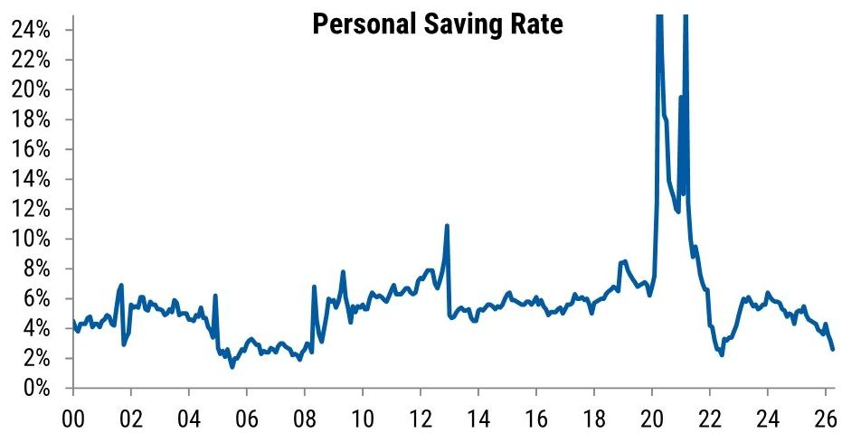

line chart

| Year | Personal Saving Rate |
| ---- | --------------------- |
| 00   | 4%                    |
| 01   | 5%                    |
| 02   | 6%                    |
| 03   | 5%                    |
| 04   | 5%                    |
| 05   | 4%                    |
| 06   | 2%                    |
| 07   | 3%                    |
| 08   | 2%                    |
| 09   | 6%                    |
| 10   | 7%                    |
| 11   | 6%                    |
| 12   | 8%                    |
| 13   | 11%                   |
| 14   | 5%                    |
| 15   | 6%                    |
| 16   | 5%                    |
| 17   | 6%                    |
| 18   | 7%                    |
| 19   | 8%                    |
| 20   | 24%                   |
| 21   | 19%                   |
| 22   | 2%                    |
| 23   | 6%                    |
| 24   | 5%                    |
| 25   | 4%                    |
| 26   | 3%                    |

Source: BEA, Haver Analytics, MS

# Oil Tracker: US ending stocks of crude oil edge lower amid increased exports and unchanged production

We continue to track the evolution of inventory and production amid the ongoing Middle East conflict. US ending inventory stocks of crude oil and petroleum products, which represents the EIA's estimate of how many barrels of oil and petroleum products are physically sitting in US storage at period end, continue to move lower. Inclusive of the SPR, inventory stocks are falling by about 2mn barrels a day. The spot price of oil for immediate purchase and delivery in the physical market remains elevated, despite futures prices moving lower on prospects for a near-term agreement between the US and Iran.

US domestic crude production has edged modestly higher in recent weeks, but it remains about in line with pre-conflict production. Net imports of oil (imports - exports) are declining because of increased oil exports.

Exhibit 6: US ending stocks of crude oil continue to move lower  
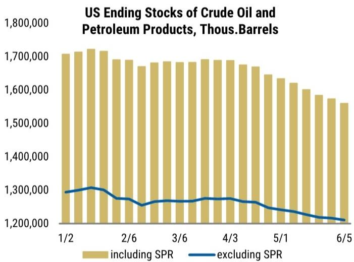

bar-line hybrid

US Ending Stocks of Crude Oil and Petroleum Products, Thousands.Barrels
| Date | including SPR (Thousand Barrels) | excluding SPR (Thousand Barrels) |
|---|---|---|
| 1/2 | 1,700,000 | 1,300,000 |
| 2/6 | 1,710,000 | 1,280,000 |
| 3/6 | 1,690,000 | 1,275,000 |
| 4/3 | 1,695,000 | 1,285,000 |
| 5/1 | 1,640,000 | 1,255,000 |
| 6/5 | 1,560,000 | 1,215,000 |

Source: Energy Information Administration, Haver Analytics, MS

Exhibit 7: Prices of oil in the physical market remain elevated  
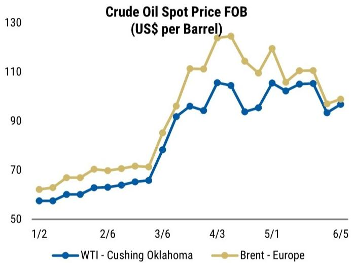

line chart

Crude Oil Spot Price FOB (US$ per Barrel)
| Date | WTI - Cushing Oklahoma (US$ per Barrel) | Brent - Europe (US$ per Barrel) |
|---|---|---|
| 1/2 | 53.0 | 66.0 |
| 1/3 | 53.5 | 67.0 |
| 1/4 | 54.5 | 68.5 |
| 1/5 | 55.0 | 69.0 |
| 1/6 | 56.0 | 70.0 |
| 1/7 | 56.5 | 70.0 |
| 1/8 | 57.0 | 70.5 |
| 1/9 | 57.5 | 70.5 |
| 1/10 | 58.0 | 71.0 |
| 1/11 | 58.5 | 71.0 |
| 1/12 | 59.0 | 71.5 |
| 1/13 | 60.0 | 72.0 |
| 1/14 | 62.0 | 74.0 |
| 1/15 | 64.0 | 76.0 |
| 1/16 | 66.0 | 78.0 |
| 1/17 | 68.0 | 80.0 |
| 1/18 | 70.0 | 82.0 |
| 1/19 | 72.0 | 84.0 |
| 1/20 | 74.0 | 86.0 |
| 1/21 | 76.0 | 88.0 |
| 1/22 | 78.0 | 90.0 |
| 1/23 | 80.0 | 92.0 |
| 1/24 | 82.0 | 94.0 |
| 1/25 | 84.0 | 96.0 |
| 1/26 | 86.0 | 98.0 |
| 1/27 | 88.0 | 100.0 |
| 1/28 | 90.0 | 102.0 |
| 1/29 | 92.0 | 104.0 |
| 1/30 | 94.0 | 106.0 |
| 2/2 | 96.0 | 108.0 |
| 2/3 | 98.0 | 110.0 |
| 2/4 | 100.0 | 112.0 |
| 2/5 | 102.0 | 114.0 |
| 2/6 | 104.0 | 116.0 |
| 2/7 | 106.0 | 118.0 |
| 2/8 | 108.0 | 120.0 |
| 2/9 | 110.0 | 122.0 |
| 2/10 | 112.0 | 124.0 |
| 2/11 | 114.0 | 126.0 |
| 2/12 | 116.0 | 128.0 |
| 3/4 | 118.0 | 130.0 |
| 3/5 | 120.0 | 132.0 |
| 3/6 | 122.0 | 134.0 |
| 3/7 | 124.0 | 136.0 |
| 3/8 | 126.0 | 138.0 |
| 3/9 | 128.0 | 140.0 |
| 3/10 | 130.0 | 142.0 |
| 3/11 | 132.0 | 144.0 |
| 3/12 | 134.0 | 146.0 |
| 3/13 | 136.0 | 148.0 |
| 3/14 | 138.0 | 150.0 |
| 3/15 | 140.0 | 152.0 |
| 3/16 | 142.0 | 154.0 |
| 3/17 | 144.0 | 156.0 |
| 3/18 | 146.0 | 158.0 |
| 3/19 | 148.0 | 160.0 |
| 3/20 | 150.0 | 162.0 |
| 3/21 | 152.0 | 164.0 |
| 3/22 | 154.0 | 166.0 |
| 3/23 | 156.0 | 168.0 |
| 3/24 | 158.0 | 170.0 |
| 3/25 | 160.0 | 172.0 |
| 3/26 | 162.0 | 174.0 |
| 3/27 | 164.0 | 176.0 |
| 3/28 | 166.0 | 178.0 |
| 3/29 | 168.0 | 180.0 |
| 3/30 | 170.0 | 182.0 |
| April-End: Cushing Oklahoma (US$ per Barrel) vs Brent-Europe (US$ per Barrel) (US$ per Barrel) (Note: The values in the image are estimated based on the formula, so they do not correspond to the actual values).) (Figure: Figure I).)

Source: Energy Information Administration, Haver Analytics, MS

Exhibit 8: Including the SPR, US oil stocks are falling about 2mn barrels per day  
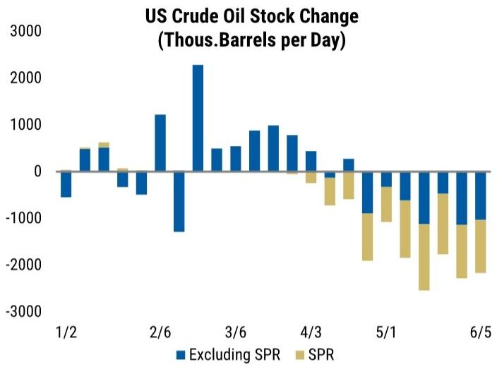

bar chart

| Date   | Excluding SPR | SPR    |
|--------|---------------|--------|
| 1/2    | -500          | 0      |
| 2/6    | 1200          | 0      |
| 3/6    | 500           | 0      |
| 4/3    | 400           | -500   |
| 5/1    | -800          | -1000  |
| 6/5    | -1000         | -1500  |

Source: Energy Information Administration, Haver Analytics, MS

Exhibit 10: US exports of oil and petroleum products have risen, pushing down net imports of these energy goods  
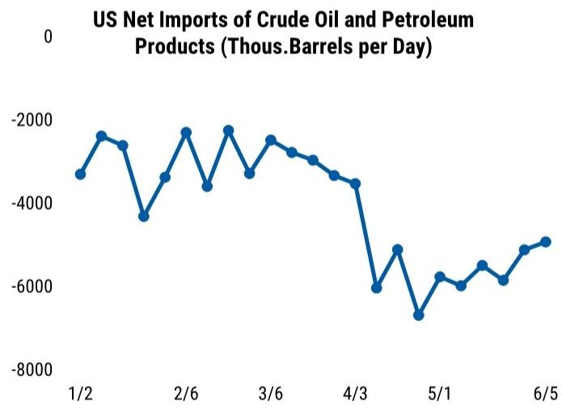

line chart

| Date | Net Imports (thousands of barrels per day) |
| --- | --- |
| 1/2 | -3200 |
| 1/3 | -2600 |
| 1/4 | -2800 |
| 1/5 | -4400 |
| 1/6 | -2400 |
| 1/7 | -3600 |
| 1/8 | -2200 |
| 1/9 | -2600 |
| 1/10 | -3200 |
| 1/11 | -3600 |
| 1/12 | -3800 |
| 1/13 | -4000 |
| 1/14 | -4200 |
| 1/15 | -4400 |
| 1/16 | -4600 |
| 1/17 | -4800 |
| 1/18 | -5000 |
| 1/19 | -5200 |
| 1/20 | -5400 |
| 1/21 | -5600 |
| 1/22 | -5800 |
| 1/23 | -6000 |
| 1/24 | -6200 |
| 1/25 | -6400 |
| 1/26 | -6600 |
| 1/27 | -6800 |
| 1/28 | -7000 |
| 1/29 | -7200 |
| 1/30 | -7400 |
| 1/31 | -7600 |
| 2/1 | -7800 |
| 2/2 | -8000 |
| 2/3 | -8200 |
| 2/4 | -8400 |
| 2/5 | -8600 |
| 2/6 | -8800 |
| 2/7 | -9000 |
| 2/8 | -9200 |
| 2/9 | -9400 |
| 2/10 | -9600 |
| 2/11 | -9800 |
| 2/12 | -10000 |
| 2/13 | -10200 |
| 2/14 | -10400 |
| 2/15 | -10600 |
| 2/16 | -10800 |
| 2/17 | -11000 |
| 2/18 | -11200 |
| 2/19 | -11400 |
| 2/20 | -11600 |
| 2/21 | -11800 |
| 2/22 | -12000 |
| 2/23 | -12200 |
| 2/24 | -12400 |
| 2/25 | -12600 |
| 2/26 | -12800 |
| 2/27 | -13000 |
| 2/28 | -13200 |
| 3/4 | -13400 |
| 3/5 | -13600 |
| 3/6 | -13800 |
| 3/7 | -14000 |
| 3/8 | -14200 |
| 3/9 | -14400 |
| 3/10 | -14600 |
| 3/11 | -14800 |
| 3/12 | -15000 |
| 3/13 | -15200 |
| 3/14 | -15400 |
| 3/15 | -15600 |
| 3/16 | -15800 |
| 3/17 | -16000 |
| 3/18 | -16200 |
| 3/19 | -16400 |
| 3/20 | -16600 |
| 3/21 | -16800 |
| 3/22 | -17000 |
| 3/23 | -17200 |
| 3/24 | -17400 |
| 3/25 | -17600 |
| 3/26 | -17800 |
| 3/27 | -18000 |
| 3/28 | -18200 |
| 3/29 | -18400 |
| 4/4 | -6888 |
| 4/5 | -5488 |
| 4/6 | -5888 |
| 4/7 | -6288 |
| 4/8 | -6688 |
| 4/9 | -7188 |
| 4/10 | -7688 |
| 4/11 | -7988 |
| 4/12 | -7888 |
| 4/13 | -7788 |
| 4/14 | -7688 |
| 4/15 | -7588 |
| 4/16 | -7488 |
| 4/17 | -7388 |
| 4/18 | -7288 |
| 4/19 | -7188 |
| 4/20 | -7588 |
| 4/21 | -7988 |
| 4/22 | -7988 |
| 4/23 | -7988 |
| 4/24 | -7988 |
| 4/25 | -7988 |
| 4/26 | -7988 |
| 4/27 | -7988 |
| 4/28 | -7988 |
| 5/5 | -7988 |
| 5/6 | -7988 |
| 5/7 | -7988 |
| 5/8 | -7988 |
| 5/9 | -7988 |
| 5/10 | -7988 |
| 5/11 | -7988 |
| 5/12 | -7988 |
| 5/13 | -7988 |
| 5/14 | -7988 |
| 5/15 | -7988 |
| 5/16 | -7988 |
| 5/17 | -7988 |
| 5/18 | -7988 |
| 5/19 | -7988 |
| 5/20 | -7988 |

Source: Energy Information Administration, Haver Analytics, MS

Exhibit 9: US domestic oil production remains broadly unchanged  
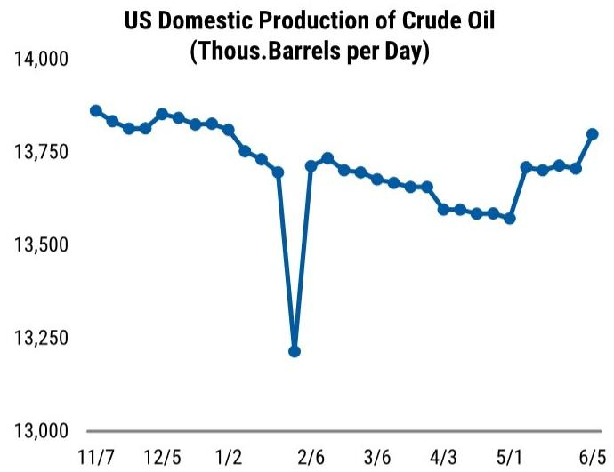

line chart

US Domestic Production of Crude Oil (Thous.Barrels per Day)
| Date | Domestic Production (Thousand Barrels per Day) |
|---|---|
| 11/7 | 13,850 |
| 12/1 | 13,800 |
| 12/5 | 13,850 |
| 1/2 | 13,800 |
| 2/6 | 13,200 |
| 3/6 | 13,700 |
| 4/3 | 13,600 |
| 5/1 | 13,550 |
| 6/5 | 13,800 |

Source: Energy Information Administration, Haver Analytics, MS

Exhibit 11: US imports of oil have decelerated a little while exports have picked up  
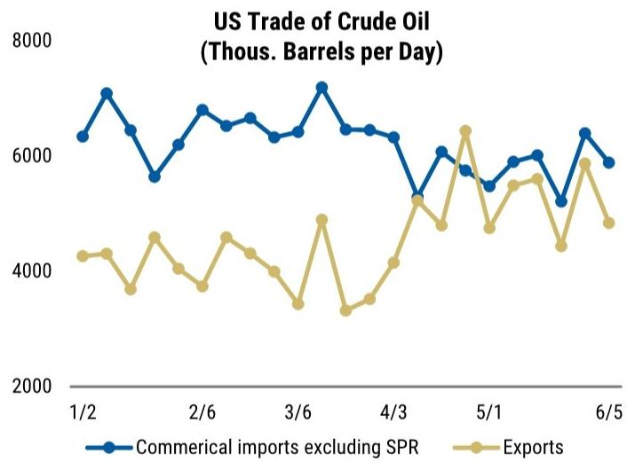

line chart

| Date  | Commerical imports excluding SPR | Exports |
|-------|----------------------------------|---------|
| 1/2   | 6300                             | 4200    |
| 2/6   | 5600                             | 3700    |
| 3/6   | 6800                             | 4800    |
| 4/3   | 6400                             | 3300    |
| 5/1   | 5500                             | 6400    |
| 6/5   | 5900                             | 4800    |

Source: Energy Information Administration, Haver Analytics, MS

# Financial Conditions: A near-reversal following the April 7 ceasefire

Following the conflict in the Middle East and the uncertainty it brings to the next steps for monetary policy, we include the evolution of our FRB/US-based model of financial conditions, which aims to capture how changes in asset prices weigh on future economic activity. The index includes five daily variables: the 10-year Treasury yield, S&P 500 returns, the corporate BBB credit spread, the valuation of the U.S. dollar, and the price of oil. These are aggregated based on their estimated growth elasticities relative to the federal funds rate, using the Federal Reserve's FRB/US model. As a result, the index can be interpreted as the equivalent change in the federal funds rate, expressed in basis points, required to generate a similar effect on economic activity.

Since hostilities in the Middle East began on February 28, the tightening in financial conditions is equivalent to about a 28bp rise in the federal funds rate. Since the April 7 ceasefire announcement, however, financial conditions have eased by 44bps. The tightening reversed all of the easing seen earlier this year, most of which occurred between the December and January FOMC meetings and was primarily driven by a weaker U.S. dollar. The net tightening since February 28 has been driven mainly by higher 10-year U.S. Treasury yields, with dollar appreciation and higher oil prices playing a secondary role. Buoyant equity markets and tighter credit spreads have offset some of the tightening.

Exhibit 12: Financial conditions have tightened following the conflict in the Middle East  
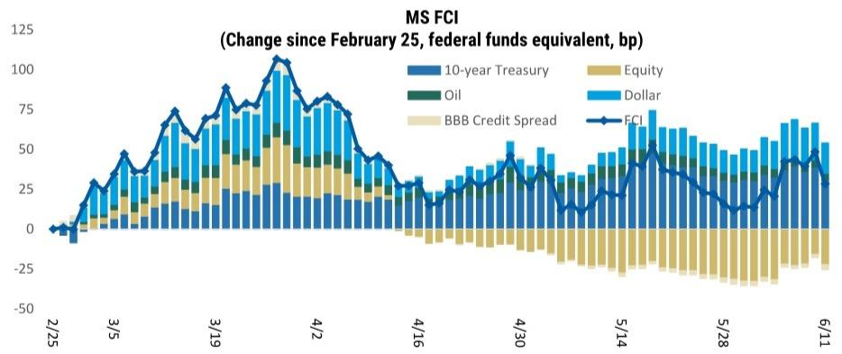

bar-line hybrid

MS FCI (Change since February 25, federal funds equivalent, bp)
| Date | 10-year Treasury (%) | Equity (%) | Oil (%) | Dollar (%) | BBB Credit Spread (%) | FCI (%) |
|---|---|---|---|---|---|---|
| 2/25 | -5 | 0 | 0 | 0 | 0 | 0 |
| 3/5 | 10 | 5 | 5 | 10 | 5 | 15 |
| 3/19 | 20 | 10 | 10 | 20 | 10 | 40 |
| 4/2 | 25 | 15 | 15 | 25 | 15 | 60 |
| 4/16 | 15 | -5 | -5 | 10 | -5 | 20 |
| 4/30 | 20 | -10 | -10 | 20 | -10 | 30 |
| 5/14 | 25 | -15 | -15 | 25 | -15 | 40 |
| 5/28 | 20 | -20 | -20 | 20 | -20 | 30 |
| 6/11 | 25 | -25 | -25 | 25 | -25 | 40 |

Source: Bloomberg, MS

## The effective tariff rate, tariff receipts and refunds

## The tariff rate on US imports has fallen to $8.3\%$ in 1Q26 data

On February 20, 2026, the Supreme Court struck down the President's authority to impose tariffs under IEEPA. Section 122 tariffs will replace IEEPA tariffs in the short term, though uncertainty rises after the 150-day period when Congress would need to extend those tariffs. Replacing IEEPA with Section 122 tariffs of 15% and considering composition effects of US imports, we estimate baseline tariffs near 11%. Our estimate of "core" tariffs (ex fuels, gold and AI-related imports) remains closer to 13-14%. In our view, near-term tariffs are likely capped below 'Liberation Day' levels, at least until Section 232 and 301 investigations are complete. In the April 2026 data, the effective tariff rate is estimated at \~6.9%, and the 1Q26 tariff rate averages to 8.3%.

Exhibit 13: US effective tariff rate  
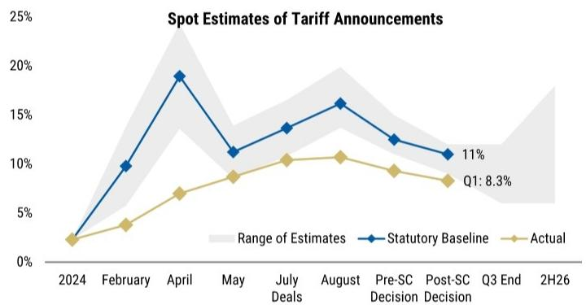

line chart

Spot Estimates of Tariff Announcements
| Period | Actual (%) | Statutory Baseline (%) |
|---|---|---|
| 2024 | 2.5 | 2.5 |
| February | 4.0 | 10.0 |
| April | 7.0 | 19.0 |
| May | 8.5 | 11.5 |
| July Deals | 10.5 | 13.5 |
| August | 10.8 | 16.2 |
| Pre-SC Decision | 9.5 | 12.5 |
| Post-SC Decision | 8.5 | 11.0 |
| Q3 End | 8.3 | 10.5 |
| 2H26 | - | - |
Q1: 8.3%

Source: US Census, US HTS, USITC, MS

Exhibit 14: US Treasury: Customs and excise deposits from tariffs  
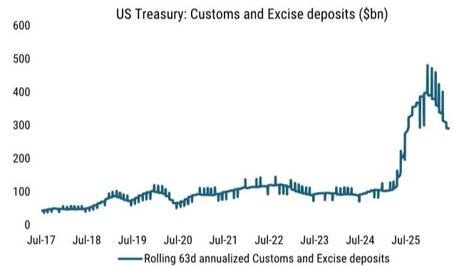

line chart

| Date   | Rolling 63d annualized Customs and Excise deposits ($bn) |
|--------|----------------------------------------------------------|
| Jul-17 | ~40                                                      |
| Jul-18 | ~60                                                      |
| Jul-19 | ~100                                                     |
| Jul-20 | ~80                                                      |
| Jul-21 | ~100                                                     |
| Jul-22 | ~120                                                     |
| Jul-23 | ~100                                                     |
| Jul-24 | ~100                                                     |
| Jul-25 | ~450                                                     |

Source: US Treasury, Bloomberg, MS

Exhibit 15: Cash withdrawals from the DHS - CBP, as a proxy for tariff refunds  
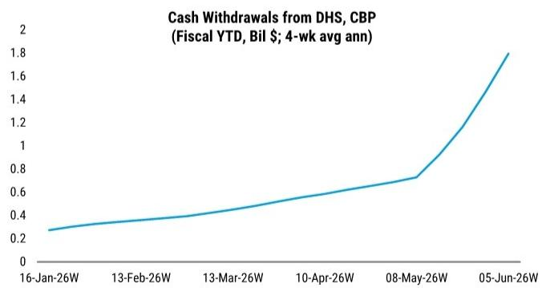

line chart

Cash Withdrawals from DHS, CBP (Fiscal YTD, Bil $; 4-wk avg ann)
| Date | Cash Withdrawals (Bil $; 4-wk avg ann) |
|---|---|
| 16-Jan-26W | 0.25 |
| 13-Feb-26W | 0.35 |
| 13-Mar-26W | 0.40 |
| 10-Apr-26W | 0.55 |
| 08-May-26W | 0.70 |
| 05-Jun-26W | 1.80 |

Source: US Treasury, Haver Analytics, MS

Tariff refunds represent cash returned to importers when customs duties were previously overpaid or later determined to be refundable, for different reasons including a tariff exclusion or court-ordered refund, or a drawback claim tied to goods that are exported or destroyed. The process generally runs through CBP, where importers or brokers submit the relevant claim and supporting documentation; CBP then reviews eligibility, confirms the entry and status, and certifies approved refunds for payment. In Treasury cash-flow data, we monitor these payments at high frequency through CBP-related withdrawals in the Daily Treasury Statement. We interpret this as a tariff-refund proxy.

## 2Q GDP Tracking at 2.8%

Trade data pushed our tracking estimate of 2Q real GDP growth up by 0.1 pct pt to a $2.8\%$ q/q annual rate. The pace exceeds the $2.3\%$ baseline estimate that we published our US Economics Mid-Year Outlook because of consumption and exports.

The Atlanta Fed tracking rose to 3.3% from to 3.0% on factory shipments and existing home sales. They include larger drags from trade and inventories than we are estimating but stronger consumption, business investment, and residential investment. The New York Fed 2Q GDP nowcast rose two tenths to 2.7%.

Exhibit 16: The effect of incoming data on our US GDP tracking estimate

<table><tr><td colspan="14">Details of Q2 2026 US GDP tracking (% q/q saar unless indicated)</td></tr><tr><td rowspan="2">Date</td><td rowspan="2">Data release</td><td rowspan="2"></td><td colspan="9">Final</td><td>NX (level)</td><td rowspan="2">CIPI (level)</td></tr><tr><td>GDP</td><td>sales</td><td>PCE</td><td>Res</td><td>Equip</td><td>Struct</td><td>IPP</td><td>Gov</td><td>X</td><td>M</td></tr><tr><td>12-May</td><td>Baseline</td><td></td><td>2.3</td><td>2.3</td><td>1.7</td><td>1.0</td><td>8.0</td><td>-3.0</td><td>8.0</td><td>1.4</td><td>0.0</td><td>-0.1</td><td>-1067</td></tr><tr><td rowspan="2">14-May</td><td>Retail sales</td><td>Apr</td><td>2.4</td><td>2.4</td><td>1.8</td><td>1.0</td><td>8.0</td><td>-3.0</td><td>8.0</td><td>1.4</td><td>0.0</td><td>-0.1</td><td>-1067</td></tr><tr><td>Adjustments</td><td></td><td>2.6</td><td>2.8</td><td>2.5</td><td>1.0</td><td>8.0</td><td>-3.0</td><td>8.0</td><td>1.4</td><td>0.0</td><td>-0.1</td><td>-1067</td></tr><tr><td>21-May</td><td>Quarterly Services Survey</td><td>1Q</td><td>2.4</td><td>2.6</td><td>2.2</td><td>1.0</td><td>8.0</td><td>-3.0</td><td>8.0</td><td>1.4</td><td>0.0</td><td>-0.1</td><td>-1067</td></tr><tr><td>28-May</td><td>Post GDP revision</td><td>1Q</td><td>2.4</td><td>2.6</td><td>2.2</td><td>1.0</td><td>8.0</td><td>-3.0</td><td>8.0</td><td>1.4</td><td>0.0</td><td>-0.1</td><td>-1063</td></tr><tr><td>29-May</td><td>Trade &amp; trade effects on business investment</td><td>Apr</td><td>2.7</td><td>3.0</td><td>2.2</td><td>1.0</td><td>8.0</td><td>-3.0</td><td>8.0</td><td>1.4</td><td>13.0</td><td>7.5</td><td>-1048</td></tr><tr><td>4-June</td><td>Motor vehicle sales, PCE price estimates</td><td>May</td><td>2.7</td><td>3.0</td><td>2.2</td><td>1.0</td><td>8.0</td><td>-3.0</td><td>8.0</td><td>1.4</td><td>13.0</td><td>7.5</td><td>-1048</td></tr><tr><td>9-June</td><td>Trade &amp; trade effects on business investment</td><td>Apr</td><td>2.8</td><td>3.1</td><td>2.2</td><td>1.0</td><td>8.0</td><td>-3.0</td><td>8.0</td><td>1.4</td><td>13.0</td><td>6.5</td><td>-1039</td></tr><tr><td rowspan="3"></td><td>GDP tracking</td><td></td><td>2.8</td><td>3.1</td><td>2.2</td><td>1.0</td><td>8.0</td><td>-3.0</td><td>8.0</td><td>1.4</td><td>13.0</td><td>6.5</td><td>-1039</td></tr><tr><td>Contribution to GDP growth (pp)</td><td></td><td></td><td>3.1</td><td>1.5</td><td>0.0</td><td>0.4</td><td>-0.1</td><td>0.5</td><td>0.2</td><td>1.4</td><td>-0.9</td><td>0.5</td></tr><tr><td>MS official forecast</td><td></td><td>2.3</td><td>2.3</td><td>1.7</td><td>1.0</td><td>8.0</td><td>-3.0</td><td>8.0</td><td>1.4</td><td>0.0</td><td>-0.1</td><td>-1067</td></tr></table>

Note: Our GDP tracking estimate is distinct from our official published GDP forecast. It reflects the mechanical aggregation of monthly activity data that feed directly into the BEA's calculation. Where data releases have implications for the tracking components, cells have been bolded. Final sales is GDP less inventories. Source: MS

Exhibit 17: GDP nowcasts  
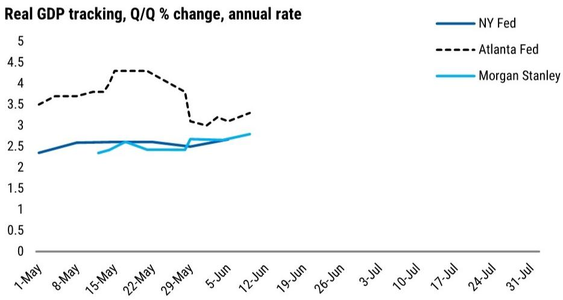

line chart

| Date     | NY Fed | Atlanta Fed | MS |
| -------- | ------ | ----------- | -------------- |
| 1-May    | 2.3    | 3.5         | 2.4            |
| 8-May    | 2.5    | 3.7         | 2.3            |
| 15-May   | 2.6    | 4.3         | 2.5            |
| 22-May   | 2.5    | 4.3         | 2.4            |
| 29-May   | 2.4    | 3.8         | 2.6            |
| 5-Jun    | 2.5    | 3.0         | 2.7            |
| 12-Jun   | 2.6    | 3.3         | 2.8            |
| 19-Jun   | 2.6    | -           | -              |
| 26-Jun   | 2.6    | -           | -              |
| 3-Jul    | 2.6    | -           | -              |
| 10-Jul   | 2.6    | -           | -              |
| 17-Jul   | 2.6    | -           | -              |
| 24-Jul   | 2.6    | -           | -              |
| 31-Jul   | 2.6    | -           | -              |

Source: Federal Reserve Banks of New York and Atlanta, MS

## Data review & preview

## Review of past week's data

Exhibit 18:

<table><tr><td>Monday 08 June</td><td>Data</td><td>Period</td><td>Forecast</td><td>Consensus</td><td>Prev</td><td>Actual</td></tr><tr><td>11:00 AM</td><td>NY Fed 3-Yr Inflation Expectations</td><td>May</td><td></td><td>3.7</td><td>3.2</td><td>3.5</td></tr><tr><td>Tuesday 09 June</td><td>Data</td><td>Period</td><td>Forecast</td><td>Consensus</td><td>Prev</td><td>Actual</td></tr><tr><td>6:00 AM</td><td>NFIB Small Business Optimism</td><td>May</td><td></td><td>96.0</td><td>95.9</td><td>95.3</td></tr><tr><td>8:15 AM</td><td>ADP Weekly Employment Change</td><td>23-May</td><td></td><td></td><td>36</td><td>31</td></tr><tr><td>8:30 AM</td><td>Trade Balance</td><td>Apr</td><td>-57.5</td><td>-56.1</td><td>-60.3</td><td>-55.9</td></tr><tr><td>10:00 AM</td><td>Existing Home Sales</td><td>May</td><td>4.10</td><td>4.07</td><td>4.02</td><td>4.2</td></tr><tr><td>10:00 AM</td><td>Existing Home Sales m/m</td><td>May</td><td>2.0</td><td>1.1</td><td>0.2</td><td>3.2</td></tr><tr><td>10:00 AM</td><td>Wholesale Inventories m/m</td><td>Apr F</td><td></td><td>0.6</td><td>0.5</td><td>0.6</td></tr><tr><td>10:00 AM</td><td>Wholesale Trade Sales m/m</td><td>Apr</td><td></td><td>1.2</td><td>2.8</td><td>2.0</td></tr><tr><td>Wednesday 10 June</td><td>Data</td><td>Period</td><td>Forecast</td><td>Consensus</td><td>Prev</td><td>Actual</td></tr><tr><td>7:00 AM</td><td>MBA Mortgage Applications</td><td>5-Jun</td><td></td><td></td><td>0.0</td><td>10.8</td></tr><tr><td>8:30 AM</td><td>CPI m/m</td><td>May</td><td>0.56</td><td>0.5</td><td>0.6</td><td>0.5</td></tr><tr><td>8:30 AM</td><td>Core CPI m/m</td><td>May</td><td>0.22</td><td>0.3</td><td>0.4</td><td>0.2</td></tr><tr><td>8:30 AM</td><td>CPI y/y</td><td>May</td><td>4.3</td><td>4.2</td><td>3.8</td><td>4.2</td></tr><tr><td>8:30 AM</td><td>Core CPI y/y</td><td>May</td><td>2.8</td><td>2.9</td><td>2.8</td><td>2.9</td></tr><tr><td>8:30 AM</td><td>CPI Index NSA</td><td>May</td><td>335.250</td><td>335.143</td><td>333.020</td><td>335.1</td></tr><tr><td>2:00 PM</td><td>Federal Budget Balance</td><td>May</td><td></td><td>-283.1</td><td>215.0</td><td>-292.6</td></tr><tr><td>Thursday 11 June</td><td>Data</td><td>Period</td><td>Forecast</td><td>Consensus</td><td>Prev</td><td>Actual</td></tr><tr><td>8:30 AM</td><td>Initial Jobless Claims</td><td>6-Jun</td><td>220</td><td>220.0</td><td>225</td><td>229</td></tr><tr><td>8:30 AM</td><td>Continuing Claims</td><td>30-May</td><td>1785</td><td>1785.0</td><td>1777</td><td>1795</td></tr><tr><td>8:30 AM</td><td>PPI Final Demand m/m</td><td>May</td><td></td><td>0.7</td><td>1.4</td><td>1.1</td></tr><tr><td>8:30 AM</td><td>PPI Ex Food, Energy, Trade m/m</td><td>May</td><td></td><td>0.4</td><td>0.6</td><td>0.8</td></tr><tr><td>8:30 AM</td><td>PPI Final Demand y/y</td><td>May</td><td></td><td>6.4</td><td>6.0</td><td>6.5</td></tr><tr><td>8:30 AM</td><td>PPI Ex Food, Energy, Trade y/y</td><td>May</td><td></td><td>4.8</td><td>4.4</td><td>5.1</td></tr><tr><td>10:00 AM</td><td>Quarterly Services Survey</td><td></td><td></td><td></td><td></td><td></td></tr><tr><td>12:00 PM</td><td>Household Change in Net Worth</td><td>1Q</td><td>-1500</td><td></td><td>2173</td><td>113</td></tr><tr><td>4:30 PM</td><td>Fed balance sheet (H.4.1)</td><td></td><td></td><td></td><td></td><td></td></tr><tr><td>Friday 12 June</td><td>Data</td><td>Period</td><td>Forecast</td><td>Consensus</td><td>Prev</td><td>Actual</td></tr><tr><td>10:00 AM</td><td>U. of Mich. Sentiment</td><td>Jun P</td><td></td><td>46.0</td><td>44.8</td><td></td></tr><tr><td>10:00 AM</td><td>U. of Mich. 5-10 Yr Inflation</td><td>Jun P</td><td></td><td>3.9</td><td>3.9</td><td></td></tr><tr><td>4:15 PM</td><td>Commercial bank balance sheets (H.8)</td><td>29-May</td><td></td><td></td><td></td><td></td></tr></table>

Source: Bloomberg, MS forecasts

## Preview of upcoming data

Exhibit 19: Monday

<table><tr><td>Monday 15 June</td><td>Data</td><td>Period</td><td>Forecast</td><td>Consensus</td><td>Prev</td></tr><tr><td>8:30 AM</td><td>Empire Manufacturing</td><td>Jun</td><td></td><td>12.5</td><td>19.6</td></tr><tr><td>9:15 AM</td><td>Industrial Production m/m</td><td>May</td><td>-0.1</td><td>0.2</td><td>0.7</td></tr><tr><td>9:15 AM</td><td>Manufacturing Production m/m</td><td>May</td><td>-0.1</td><td>0.3</td><td>0.6</td></tr><tr><td>9:15 AM</td><td>Capacity Utilization</td><td>May</td><td></td><td>76.2</td><td>76.1</td></tr><tr><td>10:00 AM</td><td>NAHB Housing Market Index</td><td>Jun</td><td></td><td>36.0</td><td>37.0</td></tr></table>

Source: Bloomberg, MS forecasts

Industrial production likely slipped $0.1\%$ m/m in May. Motor vehicle output was likely a slight drag, and we forecast stalled nonauto manufacturing output. This looks like a temporary pause: growth has been solid, and the factory surveys do not suggest a change in trend.

National Assoc. of Homebuilders builder confidence index has risen from mid-2025 lows

but remains unusually depressed.

Empire manufacturing. The May ISM manufacturing PMI was stronger than expected. Both the national and regional surveys show strong production and demand, while employment remained soft. We also see price deceleration in some areas and acceleration in others. We expect the manufacturing sector to remain resilient in June, and we initiate our June ISM manufacturing PMI tracking estimate at 53.8.

Exhibit 20: Tuesday

<table><tr><td>Tuesday 16 June</td><td>Data</td><td>Period</td><td>Forecast</td><td>Consensus</td><td>Prev</td></tr><tr><td>8:15 AM</td><td>ADP Weekly Employment Change</td><td>30-May</td><td></td><td></td><td>29.0</td></tr><tr><td>8:30 AM</td><td>Import Price Index m/m</td><td>May</td><td></td><td></td><td>2</td></tr><tr><td>8:30 AM</td><td>Import Price Index y/y</td><td>May</td><td></td><td></td><td>4</td></tr><tr><td>8:30 AM</td><td>Export Price Index m/m</td><td>May</td><td></td><td></td><td>3</td></tr><tr><td>8:30 AM</td><td>New York Fed Services Business Activity</td><td>Jun</td><td></td><td></td><td>-5.8</td></tr><tr><td>8:30 AM</td><td>Export Price Index y/y</td><td>May</td><td></td><td></td><td>8.8</td></tr><tr><td>8:30 AM</td><td>Housing Starts</td><td>May</td><td>1395</td><td>1430</td><td>1465</td></tr><tr><td>8:30 AM</td><td>Housing Starts m/m</td><td>May</td><td>-4.8</td><td>-1.7</td><td>-2.8</td></tr><tr><td>8:30 AM</td><td>Building Permits</td><td>May P</td><td>1437</td><td>1435</td><td>1423</td></tr><tr><td>8:30 AM</td><td>Building Permits m/m</td><td>May P</td><td>1.0</td><td></td><td>4.4</td></tr></table>

Source: Bloomberg, MS forecasts

Housing starts. Single-family starts are running high relative to permits. We expect further payback in May, with a slight decline to 915k. The housing market index rose slightly in May but remains weak; we expect just a slight pickup in single-family permits to 895k. We expect multifamily permits are unchanged but starts decline after a strong April.

Exhibit 21: Wednesday

<table><tr><td>Wednesday 17 June</td><td>Data</td><td>Period</td><td>Forecast</td><td>Consensus</td><td>Prev</td></tr><tr><td>7:00 AM</td><td>MBA Mortgage Applications</td><td>12-Jun</td><td></td><td></td><td>10.8</td></tr><tr><td>8:30 AM</td><td>Retail Sales Advance m/m</td><td>May</td><td>0.5</td><td>0.5</td><td>0.5</td></tr><tr><td>8:30 AM</td><td>Retail Sales Ex Auto m/m</td><td>May</td><td>0.6</td><td>0.4</td><td>0.7</td></tr><tr><td>8:30 AM</td><td>Retail Sales Control Group</td><td>May</td><td>0.2</td><td>0.4</td><td>0.5</td></tr><tr><td>10:00 AM</td><td>Business Inventories</td><td>Apr</td><td></td><td></td><td>0.9</td></tr><tr><td>10:00 AM</td><td>Pending Home Sales m/m</td><td>May</td><td></td><td></td><td>1.4</td></tr><tr><td>10:00 AM</td><td>Pending Home Sales NSA y/y</td><td>May</td><td></td><td></td><td>3.3</td></tr><tr><td>2:00 PM</td><td>FOMC Rate Decision (Upper Bound)</td><td>17-Jun</td><td>3.750</td><td>3.750</td><td>3.750</td></tr></table>

Source: Bloomberg, MS forecasts

Retail sales. We forecast that headline retail sales rose 0.5%m/m for the month of May, boosted by another strong month of sales at gasoline stations. We expect that control group retail sales were up 0.2%m/m, auto sales rose 0.4%, and sales at restaurants were up 0.5%. Sales of building materials are expected to have decelerated in May (-0.3%). For the control group, growth in nominal labor market income is supportive, and credit/debit card transactions May data show some recovery after a very soft April. We estimate the growth of control group prices for May is -0.1%.

Pending home sales. Pending home sales have risen the past few months, and the recent pickup in existing home sales in May brought the two measures back in-line. Home sales overall are still within their low range of the past few years.

FOMC meeting, Chairman Warsh's first. We expect the Fed to hold rates unchanged in June, with no dissents. In the statement, we expect new recognition of faster payroll gains. We also expect the FOMC to drop the easing bias, instead saying something like "in considering any adjustments to the target range..."

In the SEP, we expect the median dot to show no cuts this year, one cut in 2027, and one

cut in 2028.

First press conferences can be uneven. There's a greater chance of miscommunication and subsequent correction. We expect Warsh to describe an uncertain economic outlook, to point out that heightened uncertainty argues for patience in policymaking, and to say that the FOMC believes the current stance of policy is appropriate.

How much guidance he is willing to give is an important question, as he has leaned against guidance in commentary in the past.

Exhibit 22: Thursday

<table><tr><td>Thursday 18 June</td><td>Data</td><td>Period</td><td>Forecast</td><td>Consensus</td><td>Prev</td></tr><tr><td>8:30 AM</td><td>Initial Jobless Claims</td><td>13-Jun</td><td>226</td><td></td><td>0.0</td></tr><tr><td>8:30 AM</td><td>Philadelphia Fed Business Outlook</td><td>Jun</td><td></td><td>12.0</td><td>-0.4</td></tr><tr><td>8:30 AM</td><td>Continuing Claims</td><td>6-Jun</td><td>1875</td><td></td><td>0.0</td></tr><tr><td>10:00 AM</td><td>Leading Index</td><td>May</td><td></td><td></td><td>0.1</td></tr><tr><td>4:00 PM</td><td>Total Net TIC Flows</td><td>Apr</td><td></td><td></td><td>150.7</td></tr><tr><td>4:00 PM</td><td>Net Long-term TIC Flows</td><td>Apr</td><td></td><td></td><td>81.3</td></tr></table>

Source: Bloomberg, MS

Jobless claims. The four-week average of jobless claims has risen 10k from a month ago. Some of the rise looks like distortion from seasonal factors: the sum of state claims has not risen as much and it diverged similarly last year at this time. We do not yet forecast retracement.

Exhibit 23: Friday

<table><tr><td>Friday 19 June</td><td>Data</td><td>Period</td><td>Forecast</td><td>Consensus</td><td>Prev</td></tr><tr><td></td><td>No scheduled data or Fedspeak</td><td></td><td></td><td></td><td></td></tr></table>

Source: Bloomberg, MS

## Data calendar

Exhibit 24: June 15 - June 26

<table><tr><td>Monday</td><td>TUESDAY</td><td>WEDNESDAY</td><td>THURSDAY</td><td>FRIDAY</td></tr><tr><td>15</td><td>16</td><td>17</td><td>18</td><td>19</td></tr><tr><td>Empire Manufacturing (Jun, 8:30 AM)</td><td>ADP Weekly Employment Change (Wk of 5/30, 8:15 AM)</td><td>MBA Mortgage Applications (Wk of 6/12, 7 AM)</td><td>Jobless Claims (Wk of 6/13, 8:30 AM)</td><td></td></tr><tr><td>Industrial Production (May, 9:15 AM)</td><td>Import &amp; Export Prices (May, 8:30 AM)</td><td>Retail Sales (May, 8:30 AM)</td><td>Philadelphia Fed Manufacturing (Jun, 8:30 AM)</td><td></td></tr><tr><td rowspan="3">NAHB Housing Market Index (Jun, 10 AM)</td><td>NY Fed Services Business Activity (Jun, 8:30 AM)</td><td>Business Inventories (Apr, 10 AM)</td><td>Leading Index (May, 10 AM)</td><td></td></tr><tr><td>Housing Starts &amp; Building Permits (May, 8:30 AM)</td><td>Pending Home Sales (May, 10 AM)</td><td>5-Year TIPS Auction (1 PM)</td><td></td></tr><tr><td>20-Year Bond Auction (1 PM)</td><td>FOMC Rate Decision (2 PM)</td><td>TIC data (Apr, 4 PM)</td><td></td></tr><tr><td>22</td><td>23</td><td>24</td><td>25</td><td>26</td></tr><tr><td rowspan="6"></td><td>ADP Weekly Employment Change (Wk of 6/6, 8:15 AM)</td><td>MBA Mortgage Applications (Wk of 6/19, 7 AM)</td><td>Personal Income and Outlays (May, 8:30 AM)</td><td>Bloomberg June United States Economic Survey (6 AM)</td></tr><tr><td>Philadelphia Fed Non-Manufacturing Activity (Jun, 8:30 AM)</td><td>Current Account Balance (1Q, 8:30 AM)</td><td>Chicago Fed Nat Activity Index (May, 8:30 AM)</td><td>Advance Goods Trade Balance (May, 8:30 AM)</td></tr><tr><td>S&amp;P Flash Manuf. (Jun P, 9:45 AM)</td><td>New Home Sales (May, 10 AM)</td><td>Durable Orders (May P, 8:30 AM)</td><td>Wholesale and Retail Inventories (May, 8:30 AM)</td></tr><tr><td>S&amp;P Services PMI (Jun P, 9:45 AM)</td><td>2-Year FRN Auction (11:30 AM)</td><td>Jobless Claims (Wk of 6/20, 8:30 AM)</td><td>U. of Mich. Consumer Sentiment (Jun F, 10 AM)</td></tr><tr><td>Richmond Fed Manuf. Index (Jun, 10 AM)</td><td>5-Year Notes Auction (1 PM)</td><td>GDP (1Q T, 8:30 AM)</td><td>Kansas City Fed Services Activity (Jun, 11 AM)</td></tr><tr><td>2-Year Notes Auction (1 PM)</td><td></td><td>Kansas City Fed Manf. Activity (Jun, 11 AM)</td><td></td></tr></table>

Note: For updates post-publication of the Treasury Auction Schedule, see here. Source: Bloomberg, MS

## US economic outlook

Exhibit 25: MS forecasts

<table><tr><td></td><td colspan="3">4Q/4Q % change</td><td colspan="10">Quarterly % change, annual rate (unless otherwise noted)</td></tr><tr><td></td><td>2025A</td><td>2026E</td><td>2027E</td><td>3Q25A</td><td>4Q25A</td><td>1Q26A</td><td>2Q26E</td><td>3Q26E</td><td>4Q26E</td><td>1Q27E</td><td>2Q27E</td><td>3Q27E</td><td>4Q27E</td></tr><tr><td>Real GDP</td><td>2.0</td><td>2.2</td><td>2.6</td><td>4.4</td><td>0.5</td><td>1.6</td><td>2.3</td><td>2.3</td><td>2.5</td><td>2.4</td><td>2.6</td><td>2.6</td><td>2.6</td></tr><tr><td>Final Sales $^{1}$ </td><td>2.2</td><td>2.1</td><td>2.3</td><td>4.5</td><td>0.3</td><td>1.5</td><td>2.3</td><td>2.2</td><td>2.4</td><td>2.1</td><td>2.4</td><td>2.4</td><td>2.4</td></tr><tr><td>Final Domestic Demand $^{2}$ </td><td>1.8</td><td>2.4</td><td>2.8</td><td>2.8</td><td>0.6</td><td>2.7</td><td>2.2</td><td>2.3</td><td>2.3</td><td>2.6</td><td>2.8</td><td>2.8</td><td>2.8</td></tr><tr><td>Final Private Domestic Demand $^{3}$ </td><td>2.4</td><td>2.5</td><td>3.1</td><td>2.9</td><td>1.8</td><td>2.4</td><td>2.4</td><td>2.5</td><td>2.5</td><td>2.8</td><td>3.1</td><td>3.1</td><td>3.2</td></tr><tr><td>Personal Consumption Expenditures</td><td>2.1</td><td>1.7</td><td>2.1</td><td>3.5</td><td>1.9</td><td>1.4</td><td>1.7</td><td>1.9</td><td>1.9</td><td>1.8</td><td>2.2</td><td>2.2</td><td>2.2</td></tr><tr><td>- Goods</td><td>1.4</td><td>0.7</td><td>1.6</td><td>3.0</td><td>0.3</td><td>0.4</td><td>0.5</td><td>1.0</td><td>1.0</td><td>1.2</td><td>1.7</td><td>1.7</td><td>1.7</td></tr><tr><td>- Services</td><td>2.4</td><td>2.2</td><td>2.3</td><td>3.6</td><td>2.7</td><td>1.8</td><td>2.3</td><td>2.3</td><td>2.3</td><td>2.1</td><td>2.4</td><td>2.4</td><td>2.4</td></tr><tr><td>Nonresidential Fixed Investment</td><td>5.6</td><td>6.9</td><td>7.9</td><td>3.2</td><td>2.4</td><td>10.1</td><td>5.8</td><td>5.9</td><td>5.9</td><td>7.9</td><td>7.9</td><td>8.0</td><td>8.0</td></tr><tr><td>- Structures</td><td>-5.5</td><td>-3.6</td><td>2.0</td><td>-5.0</td><td>-6.5</td><td>-5.4</td><td>-3.0</td><td>-3.0</td><td>-3.0</td><td>2.0</td><td>2.0</td><td>2.0</td><td>2.0</td></tr><tr><td>- Equipment</td><td>9.6</td><td>10.2</td><td>10.5</td><td>5.2</td><td>4.3</td><td>17.2</td><td>8.0</td><td>8.0</td><td>8.0</td><td>10.5</td><td>10.5</td><td>10.5</td><td>10.5</td></tr><tr><td>- IPP</td><td>8.0</td><td>8.9</td><td>8.0</td><td>5.6</td><td>5.4</td><td>11.6</td><td>8.0</td><td>8.0</td><td>8.0</td><td>8.0</td><td>8.0</td><td>8.0</td><td>8.0</td></tr><tr><td>Residential Investment</td><td>-3.8</td><td>-0.9</td><td>1.5</td><td>-7.1</td><td>-1.7</td><td>-6.2</td><td>1.0</td><td>1.0</td><td>1.0</td><td>1.5</td><td>1.5</td><td>1.5</td><td>1.5</td></tr><tr><td>Exports</td><td>1.1</td><td>4.2</td><td>1.8</td><td>9.6</td><td>-3.2</td><td>13.1</td><td>0.0</td><td>1.0</td><td>2.5</td><td>1.8</td><td>1.8</td><td>1.8</td><td>1.8</td></tr><tr><td>Imports</td><td>-1.9</td><td>6.2</td><td>5.0</td><td>-4.4</td><td>-1.0</td><td>21.1</td><td>-0.1</td><td>2.0</td><td>2.0</td><td>5.0</td><td>5.0</td><td>5.0</td><td>5.0</td></tr><tr><td>Government</td><td>-1.2</td><td>2.2</td><td>1.3</td><td>2.2</td><td>-5.6</td><td>4.4</td><td>1.4</td><td>1.4</td><td>1.4</td><td>1.3</td><td>1.3</td><td>1.3</td><td>1.3</td></tr><tr><td>Inventory contribution (pct pts, a.r.)</td><td>-0.2</td><td>0.1</td><td>0.2</td><td>-0.1</td><td>0.1</td><td>0.1</td><td>0.0</td><td>0.0</td><td>0.0</td><td>0.2</td><td>0.2</td><td>0.2</td><td>0.2</td></tr><tr><td>Trade contribution (pct pts, a.r.)</td><td>0.4</td><td>-0.4</td><td>-0.4</td><td>1.6</td><td>-0.2</td><td>-1.3</td><td>0.0</td><td>-0.2</td><td>0.0</td><td>-0.5</td><td>-0.5</td><td>-0.5</td><td>0.0</td></tr><tr><td>Nominal GDP (Current $)</td><td>5.4</td><td>5.3</td><td>4.7</td><td>8.3</td><td>4.2</td><td>5.1</td><td>7.5</td><td>4.3</td><td>4.4</td><td>4.9</td><td>4.5</td><td>4.6</td><td>4.9</td></tr><tr><td>Nominal Consumption</td><td>5.0</td><td>5.1</td><td>4.3</td><td>6.3</td><td>4.9</td><td>6.0</td><td>7.1</td><td>3.7</td><td>3.6</td><td>4.5</td><td>3.9</td><td>4.0</td><td>4.5</td></tr><tr><td colspan="4">Employment &amp; Personal Income</td><td colspan="10"></td></tr><tr><td>Civilian Unemployment Rate (%)</td><td>4.5</td><td>4.3</td><td>4.1</td><td>4.3</td><td>4.5</td><td>4.3</td><td>4.3</td><td>4.3</td><td>4.3</td><td>4.3</td><td>4.2</td><td>4.2</td><td>4.1</td></tr><tr><td>Civilian Labor Force Participation Rate (%)</td><td>62.5</td><td>61.8</td><td>61.7</td><td>62.3</td><td>62.5</td><td>62.0</td><td>61.9</td><td>61.8</td><td>61.8</td><td>61.8</td><td>61.7</td><td>61.7</td><td>61.7</td></tr><tr><td>Employment to Population Ratio (%)</td><td>59.7</td><td>59.2</td><td>59.1</td><td>59.6</td><td>59.7</td><td>59.3</td><td>59.2</td><td>59.2</td><td>59.2</td><td>59.1</td><td>59.1</td><td>59.1</td><td>59.1</td></tr><tr><td>Average Monthly Change in Nonfarm Payrolls (Thous.)</td><td>10</td><td>43</td><td>60</td><td>23</td><td>-39</td><td>68</td><td>42</td><td>30</td><td>30</td><td>60</td><td>60</td><td>60</td><td>60</td></tr><tr><td>Real DPI</td><td>1.0</td><td>1.2</td><td>1.7</td><td>1.0</td><td>-0.9</td><td>0.8</td><td>-0.4</td><td>1.8</td><td>2.4</td><td>1.3</td><td>1.4</td><td>2.2</td><td>2.0</td></tr><tr><td>Saving rate (%)</td><td>3.8</td><td>3.3</td><td>2.9</td><td>4.4</td><td>3.8</td><td>3.7</td><td>3.1</td><td>3.1</td><td>3.3</td><td>3.1</td><td>2.9</td><td>3.0</td><td>2.9</td></tr><tr><td colspan="14">Business Indicators</td></tr><tr><td>Industrial Production</td><td>1.5</td><td>2.4</td><td>2.5</td><td>2.1</td><td>-2.0</td><td>7.5</td><td>0.3</td><td>0.9</td><td>1.1</td><td>2.4</td><td>2.5</td><td>2.5</td><td>2.5</td></tr><tr><td>Productivity</td><td>2.5</td><td>1.7</td><td>2.1</td><td>5.2</td><td>1.6</td><td>1.1</td><td>2.0</td><td>1.7</td><td>1.9</td><td>1.9</td><td>2.2</td><td>2.2</td><td>2.2</td></tr><tr><td colspan="4">Inflation (quarterly % change, a.r.)</td><td colspan="10"></td></tr><tr><td>Consumer Price Index</td><td></td><td></td><td></td><td>3.1</td><td>2.5</td><td>3.6</td><td>6.9</td><td>1.8</td><td>1.7</td><td>2.6</td><td>1.5</td><td>1.7</td><td>2.7</td></tr><tr><td>CPI ex Food &amp; Energy</td><td></td><td></td><td></td><td>3.2</td><td>2.0</td><td>2.8</td><td>3.2</td><td>2.4</td><td>2.3</td><td>3.0</td><td>1.9</td><td>2.3</td><td>2.8</td></tr><tr><td>PCE Price Index</td><td></td><td></td><td></td><td>2.8</td><td>2.9</td><td>4.6</td><td>5.2</td><td>1.8</td><td>1.7</td><td>2.7</td><td>1.7</td><td>1.8</td><td>2.3</td></tr><tr><td>PCE ex Food &amp; Energy</td><td></td><td></td><td></td><td>2.9</td><td>2.7</td><td>4.4</td><td>3.2</td><td>2.2</td><td>2.0</td><td>2.9</td><td>2.0</td><td>2.1</td><td>2.4</td></tr><tr><td colspan="4">Inflation (4-quarter % change)</td><td colspan="10"></td></tr><tr><td>Consumer Price Index</td><td>2.7</td><td>3.4</td><td>2.1</td><td>2.9</td><td>2.7</td><td>2.7</td><td>4.0</td><td>3.7</td><td>3.4</td><td>3.2</td><td>1.9</td><td>1.9</td><td>2.1</td></tr><tr><td>CPI ex Food &amp; Energy</td><td>2.7</td><td>2.7</td><td>2.5</td><td>3.1</td><td>2.7</td><td>2.5</td><td>2.8</td><td>2.6</td><td>2.7</td><td>2.7</td><td>2.4</td><td>2.4</td><td>2.5</td></tr><tr><td>PCE Price Index</td><td>2.8</td><td>3.3</td><td>2.1</td><td>2.7</td><td>2.8</td><td>3.1</td><td>3.9</td><td>3.6</td><td>3.3</td><td>2.8</td><td>2.0</td><td>2.0</td><td>2.1</td></tr><tr><td>PCE ex Food &amp; Energy</td><td>2.9</td><td>2.9</td><td>2.4</td><td>2.9</td><td>2.9</td><td>3.1</td><td>3.3</td><td>3.1</td><td>2.9</td><td>2.6</td><td>2.3</td><td>2.3</td><td>2.4</td></tr><tr><td colspan="4">Monetary Policy</td><td colspan="10"></td></tr><tr><td>Fed Funds Target (%, midpoint of target range)</td><td>3.625</td><td>3.625</td><td>3.125</td><td>4.125</td><td>3.625</td><td>3.625</td><td>3.625</td><td>3.625</td><td>3.625</td><td>3.375</td><td>3.125</td><td>3.125</td><td>3.125</td></tr><tr><td colspan="4">Fiscal Policy</td><td colspan="10"></td></tr><tr><td>Federal Budget balance (% of GDP)</td><td>-5.4</td><td>-6.3</td><td>-6.1</td><td></td><td></td><td></td><td></td><td></td><td></td><td></td><td></td><td></td><td></td></tr></table>

1) GDP less contribution from inventory investment  
2) GDP less contributions from inventory investment and trade  
3) GDP less contributions from inventory investment, trade, and the government sector. (Private final consumption plus investment.)  
Source: Bureau of Economic Analysis, Bureau of Labor Statistics, Federal Reserve, Census Bureau, Treasury Dep't, MS forecasts

Exhibit 26: Monthly inflation forecasts

<table><tr><td rowspan="2"></td><td colspan="4">% Change - Year-over-Year</td><td colspan="5">% Change - Month-over-Month</td><td rowspan="2">Headline CPI NSA Index</td></tr><tr><td>Headline PCE</td><td>Core PCE</td><td>Headline CPI</td><td>Core CPI</td><td></td><td>Headline PCE</td><td>Core PCE</td><td>Headline CPI</td><td>Core CPI</td></tr><tr><td>Jan-25</td><td>2.6</td><td>2.8</td><td>3.0</td><td>3.3</td><td>Jan-25</td><td>0.37</td><td>0.31</td><td>0.43</td><td>0.43</td><td>317.671</td></tr><tr><td>Feb-25</td><td>2.7</td><td>3.0</td><td>2.8</td><td>3.1</td><td>Feb-25</td><td>0.40</td><td>0.45</td><td>0.23</td><td>0.25</td><td>319.082</td></tr><tr><td>Mar-25</td><td>2.4</td><td>2.7</td><td>2.4</td><td>2.8</td><td>Mar-25</td><td>0.02</td><td>0.10</td><td>0.03</td><td>0.07</td><td>319.799</td></tr><tr><td>Apr-25</td><td>2.3</td><td>2.6</td><td>2.3</td><td>2.8</td><td>Apr-25</td><td>0.17</td><td>0.19</td><td>0.16</td><td>0.24</td><td>320.795</td></tr><tr><td>May-25</td><td>2.5</td><td>2.8</td><td>2.4</td><td>2.8</td><td>May-25</td><td>0.18</td><td>0.23</td><td>0.10</td><td>0.13</td><td>321.465</td></tr><tr><td>Jun-25</td><td>2.6</td><td>2.8</td><td>2.7</td><td>2.9</td><td>Jun-25</td><td>0.29</td><td>0.26</td><td>0.25</td><td>0.23</td><td>322.561</td></tr><tr><td>Jul-25</td><td>2.6</td><td>2.9</td><td>2.7</td><td>3.1</td><td>Jul-25</td><td>0.17</td><td>0.25</td><td>0.23</td><td>0.31</td><td>323.048</td></tr><tr><td>Aug-25</td><td>2.7</td><td>2.9</td><td>2.9</td><td>3.1</td><td>Aug-25</td><td>0.26</td><td>0.22</td><td>0.35</td><td>0.31</td><td>323.976</td></tr><tr><td>Sep-25</td><td>2.8</td><td>2.8</td><td>3.0</td><td>3.0</td><td>Sep-25</td><td>0.26</td><td>0.19</td><td>0.30</td><td>0.22</td><td>324.800</td></tr><tr><td>Oct-25</td><td>2.7</td><td>2.8</td><td>2.9</td><td>2.8</td><td>Oct-25</td><td>0.19</td><td>0.23</td><td>0.13</td><td>0.09</td><td>#N/A</td></tr><tr><td>Nov-25</td><td>2.8</td><td>2.8</td><td>2.7</td><td>2.6</td><td>Nov-25</td><td>0.22</td><td>0.18</td><td>0.13</td><td>0.09</td><td>324.122</td></tr><tr><td>Dec-25</td><td>2.9</td><td>3.0</td><td>2.7</td><td>2.6</td><td>Dec-25</td><td>0.33</td><td>0.33</td><td>0.30</td><td>0.23</td><td>324.054</td></tr><tr><td>Jan-26</td><td>2.9</td><td>3.1</td><td>2.4</td><td>2.5</td><td>Jan-26</td><td>0.36</td><td>0.46</td><td>0.17</td><td>0.30</td><td>325.252</td></tr><tr><td>Feb-26</td><td>2.9</td><td>3.1</td><td>2.4</td><td>2.5</td><td>Feb-26</td><td>0.40</td><td>0.40</td><td>0.27</td><td>0.22</td><td>326.785</td></tr><tr><td>Mar-26</td><td>3.6</td><td>3.3</td><td>3.3</td><td>2.6</td><td>Mar-26</td><td>0.66</td><td>0.30</td><td>0.87</td><td>0.20</td><td>330.213</td></tr><tr><td>Apr-26</td><td>3.8</td><td>3.3</td><td>3.8</td><td>2.7</td><td>Apr-26</td><td>0.40</td><td>0.23</td><td>0.64</td><td>0.38</td><td>333.020</td></tr><tr><td>May-26</td><td>4.1</td><td>3.4</td><td>4.2</td><td>2.8</td><td>May-26</td><td>0.49</td><td>0.36</td><td>0.47</td><td>0.21</td><td>335.123</td></tr><tr><td>Jun-26</td><td>3.8</td><td>3.3</td><td>3.9</td><td>2.8</td><td>Jun-26</td><td>0.03</td><td>0.17</td><td>-0.05</td><td>0.19</td><td>335.248</td></tr><tr><td>Jul-26</td><td>3.8</td><td>3.3</td><td>3.7</td><td>2.7</td><td>Jul-26</td><td>0.10</td><td>0.18</td><td>0.06</td><td>0.19</td><td>335.183</td></tr><tr><td>Aug-26</td><td>3.7</td><td>3.2</td><td>3.5</td><td>2.5</td><td>Aug-26</td><td>0.17</td><td>0.17</td><td>0.20</td><td>0.21</td><td>335.657</td></tr><tr><td>Sep-26</td><td>3.6</td><td>3.2</td><td>3.5</td><td>2.5</td><td>Sep-26</td><td>0.20</td><td>0.18</td><td>0.25</td><td>0.21</td><td>336.343</td></tr><tr><td>Oct-26</td><td>3.5</td><td>3.1</td><td>3.3</td><td>2.6</td><td>Oct-26</td><td>0.04</td><td>0.14</td><td>-0.01</td><td>0.18</td><td>335.773</td></tr><tr><td>Nov-26</td><td>3.4</td><td>3.1</td><td>3.4</td><td>2.7</td><td>Nov-26</td><td>0.13</td><td>0.15</td><td>0.15</td><td>0.18</td><td>335.257</td></tr><tr><td>Dec-26</td><td>3.2</td><td>2.9</td><td>3.3</td><td>2.7</td><td>Dec-26</td><td>0.20</td><td>0.15</td><td>0.27</td><td>0.18</td><td>335.085</td></tr><tr><td>Jan-27</td><td>3.2</td><td>2.8</td><td>3.4</td><td>2.7</td><td>Jan-27</td><td>0.30</td><td>0.37</td><td>0.24</td><td>0.35</td><td>336.565</td></tr><tr><td>Feb-27</td><td>2.9</td><td>2.6</td><td>3.3</td><td>2.7</td><td>Feb-27</td><td>0.15</td><td>0.21</td><td>0.13</td><td>0.23</td><td>337.687</td></tr><tr><td>Mar-27</td><td>2.5</td><td>2.5</td><td>2.6</td><td>2.7</td><td>Mar-27</td><td>0.20</td><td>0.16</td><td>0.24</td><td>0.15</td><td>339.112</td></tr><tr><td>Apr-27</td><td>2.2</td><td>2.4</td><td>2.0</td><td>2.5</td><td>Apr-27</td><td>0.10</td><td>0.16</td><td>0.06</td><td>0.15</td><td>340.022</td></tr><tr><td>May-27</td><td>1.8</td><td>2.2</td><td>1.6</td><td>2.4</td><td>May-27</td><td>0.12</td><td>0.15</td><td>0.09</td><td>0.14</td><td>340.864</td></tr><tr><td>Jun-27</td><td>1.9</td><td>2.2</td><td>1.8</td><td>2.3</td><td>Jun-27</td><td>0.14</td><td>0.15</td><td>0.13</td><td>0.13</td><td>341.598</td></tr><tr><td>Jul-27</td><td>1.9</td><td>2.2</td><td>1.8</td><td>2.3</td><td>Jul-27</td><td>0.10</td><td>0.18</td><td>0.06</td><td>0.20</td><td>341.533</td></tr><tr><td>Aug-27</td><td>1.9</td><td>2.2</td><td>1.9</td><td>2.4</td><td>Aug-27</td><td>0.20</td><td>0.20</td><td>0.24</td><td>0.23</td><td>342.138</td></tr><tr><td>Sep-27</td><td>1.9</td><td>2.2</td><td>1.9</td><td>2.4</td><td>Sep-27</td><td>0.22</td><td>0.20</td><td>0.28</td><td>0.23</td><td>342.960</td></tr><tr><td>Oct-27</td><td>2.0</td><td>2.3</td><td>2.0</td><td>2.4</td><td>Oct-27</td><td>0.13</td><td>0.20</td><td>0.11</td><td>0.23</td><td>342.793</td></tr><tr><td>Nov-27</td><td>2.1</td><td>2.3</td><td>2.1</td><td>2.5</td><td>Nov-27</td><td>0.20</td><td>0.20</td><td>0.24</td><td>0.23</td><td>342.576</td></tr><tr><td>Dec-27</td><td>2.2</td><td>2.4</td><td>2.2</td><td>2.5</td><td>Dec-27</td><td>0.27</td><td>0.20</td><td>0.36</td><td>0.23</td><td>342.729</td></tr></table>

Source: BLS, BEA, MS forecasts

## US Outlook Scenarios

Exhibit 27: MS US Economics baseline and alternative outlooks for the US Economy: 2026, and 2027

<table><tr><td></td><td>Aggregate Demand Shock: Animal Spirits (15%)</td><td>AI Productivity Boost with Labor Displacement (10%)</td><td>De-escalation: Mild Energy Headwind (40%)</td><td>Permanent Oil Premium Regime (20%)</td><td>Global Oil-Led Recession (15%)</td></tr><tr><td colspan="6">Key Forecasts</td></tr><tr><td>GDP growth</td><td>The oil shock abates. Elevated wealth supports consumption and &quot;animal spirits&quot; keep business spending elevated. GDP grows 2.9% in 2026 and 3.1% in 2027, 0.5-1.0pp faster than the baseline.</td><td>GDP growth is steady, rising 2.2% 4Q/4Q in 2026 and 2.1% in 2027. Strong business spending is offset somewhat by weaker labor markets and low consumer confidence. Despite softer inflation in 2027, consumer spending stays sluggish as labor displacement mounts.</td><td>High oil prices act as a tax on consumption, neutralizing stimulus from higher tax refunds in the OBBBA. AI capex spending remains robust. Real growth held back to 2.3% (4Q/4Q) in 2026 before rebounding to 2.6% in 2027.</td><td>Oil prices average $120/bbl in 2026 and $100/bbl in 2027. Strategic stockpiling occurs amid a repricing of geopolitical risk in oil logistics. Mild demand destruction occurs. Real GDP grows in 3Q and 4Q 2026. Real GDP rises 2.0% in 2026 (4Q/4Q) before a 2.4% rebound in 2027.</td><td>Oil prices average $140-160/bbl through 3Q and end the year at $100/bbl. Supply shortages ensue, and demand destruction occurs. The result: mild recession with two quarters of negative GDP growth in in 3Q and 4Q 2026. Real GDP rises only 0.1% in 2026 (4Q/4Q) before a 2.5% rebound in 2027.</td></tr><tr><td>Labor markets</td><td>Stronger demand results in tighter labor markets. The unemployment rate falls to 3.9% in 2026 and 3.5% in 2027.</td><td>The economy experiences a prolonged period of net zero job creation. The separation rate edges higher, but widespread layoffs are avoided. The unemployment rate creeps higher, rising to 4.8% in 2027, 0.8pp above our baseline outlook.</td><td>The &quot;curious balance&quot; continues. Average monthly payroll gains slow to 43k this year and firm modestly to 60k next year. Labor demand remains soft on geopolitical uncertainty. Less immigration means a lower breakeven rate of hiring. The unemployment rate finishes 2026 at 4.3% and 2027 at 4.1%.</td><td>The &quot;curious balance&quot; continues. Average monthly payroll gains slow to 30k this year and firm modestly to 50k next year. Labor demand remains soft on geopolitical uncertainty. Less immigration means a lower breakeven rate of hiring. The unemployment rate finishes 2026 at 4.3% and 2027 at 4.2%.</td><td>Payrolls fall an average of 30k per month in 2026 with declines near 200k in Q4. In 2027, payrolls rebound, but bring the unemployment rate down slowly. The unemployment rate rises to 5.5% this year and 5.3% next year.</td></tr><tr><td>Inflation</td><td>Even with the oil shock dissipating, inflation pressures step-up. Headline inflation is 3.7% in 2026 and 2.7% in 2027. Core PCE inflation firms through Q1 27, prompting Fed hikes, which subsequently slow inflation.</td><td>Inflation rises on account of higher energy prices, but weak labor markets and slow wage growth provide offset. Headline inflation peaks at 3.8% y/y in 2Q 2026 - similar to the baseline - and finishes the year at 3.3%. Inflation falls back to the 2.0% target in 2027.</td><td>High inflation in 2026 dissipates in 2027. Energy prices push headline PCE inflation to 3.2% 4Q/4Q in 2026. Headline and core PCE decelerate to 2.0% and 2.3% 4Q/4Q in 2027 as the oil shock fades. Energy is a headline story with no second-round effects on core.</td><td>Two more years of above-target inflation. Energy prices push headline PCE inflation to 3.8% 4Q/4Q in 2026, while core moves sideways at 3.1% on tariff push and second round effects from the oil shock. Headline and core PCE decelerate to 2.2% and 2.8% 4Q/4Q in 2027 as the oil shock fades.</td><td>Headline inflation surges to 5.1% y/y in 3Q 2026 and 4.5% at year-end on elevated oil prices. On weaker demand, inflation decelerates to 1.1% in 2027.</td></tr><tr><td>Federal reserve policy</td><td>Hikes to counter inflation. The Fed raises rates by 100bp beginning in 4Q 2026 to 4.50-4.75%, more than reversing the 75bp in preemptive cuts to support the labor market in 2025.</td><td>Labor displacement leads to cuts. Above-target inflation keeps the Fed on the sidelines in 2026, but a rising unemployment rate leads the Fed to cut by 75bp in 2027 to a target range of 2.75-3.0%.</td><td>Normalization continues in 2027. Above-target inflation keeps the Fed on the sidelines in 2026, but falling y/y rates of inflation toward 2.0% leads the Fed to cut by 50bp in 2027 to a target range of 3.0-3.25%.</td><td>A prolonged pause. Inflation persistence means a high bar for cuts. Tariff effects must prove transitory, and energy-driven inflation must show a clear reversal before cuts are considered. The Fed maintains the target range of 3.50-3.75% through the end of 2027.</td><td>The Fed shifts to cuts as downside risks to growth mount. 200bp in 2026 and a terminal of 1.50-1.75%. 100bp of hikes in 2027 for a target range of 2.50-2.75% in 4Q 2027. No QE.</td></tr><tr><td colspan="6">Key Forecasts</td></tr><tr><td>Consumer spending</td><td>Better than expected equity market returns and a rebound in labor markets boost consumption to around 3.0% in 2026 and back to near 2.0% in 2027. Upper-income consumers drive much of the spending, but nominal wage growth supports low- and middle-income spending.</td><td>Consumption rises 1.6% in 2026 and 1.5% in 2026. High gas prices weaken goods consumption in 2026. Soft labor market conditions and fears of AI displacement make consumers turn cautious in 2027 despite improving real spending power from decelerating inflation.</td><td>Consumption slows to 1.8% in 2026 as high gasoline prices weigh on goods spending. A resilient economy supports wealth effects from upper income consumers. In 2027, consumption rebounds to 2.1% 4Q/4Q as inflation decelerates.</td><td>Consumption slows to 1.4% in 2026 as high gasoline prices weigh on goods spending. In 2027, consumption rebounds to 2.2% 4Q/4Q as inflation decelerates and a recession is avoided.</td><td>Consumption falls from 3Q 2026 to 4Q 2026 before a gradual reacceleration. Households cut back on durable goods spending. Negative wealth effects lead upper-income consumers to pull back, with spillover into broader spending.</td></tr><tr><td>Nonresidential fixed investment</td><td>Business spending broadens out beyond AI, due to animal spirits and fiscal support.</td><td>Similar to the baseline. AI-related spending remains robust, leading nonresidential fixed investment to rise 7.0% in 2026 and 8.0% in 2027. AI adoption rates rise and firms realize productivity gains</td><td>AI-related spending remains robust, leading nonresidential fixed investment to rise 7.0% in 2026 and 8.0% in 2027. Sentiment around AI capex is not dented by geopolitical concerns.</td><td>AI-related spending remains strong, leading nonresidential fixed investment to rise 6.0% in 2026 and 7.0% in 2027. Sentiment is somewhat dented by geopolitical concerns and elevated energy costs.</td><td>A retrenching business sector cuts employment and capex. Investment declines throughout 2H and into Q1 2027, followed by recovery.</td></tr><tr><td>Residential investment</td><td>Stronger growth is balanced by higher rates in 2026, resulting in still limited housing activity over the forecast horizon.</td><td>Housing activity remains sluggish in both 2026 and 2027, despite lower interest rates. Improved affordability is offset by softening labor market conditions.</td><td>Housing remains &quot;stuck&quot; due to low affordability and limited inventory. Residential investment falls 1.3% in 2026 and rises 1.5% in 2027.</td><td>Housing remains &quot;stuck&quot; due to low affordability and limited inventory. High inflation and no Fed cuts mean higher mortgage rates. Residential investment falls 1.8% in 2026 and is flat in 2027.</td><td>Housing activity is weak in 2026 on the back of slower growth and weak labor markets. Activity picks up in 2027 as growth recovers and low rates spur demand.</td></tr><tr><td>Net trade</td><td>Imports are strong with strong demand, resulting in a larger drag on GDP and a wider trade deficit.</td><td>Relative to the baseline, imports are softer. AI-related imports are robust, but imports of consumer goods are more muted on the back of softer household spending. Net trade subtracts 0.2pp from growth in 2026 and 2027.</td><td>Imports are strong with strong demand, thus a larger drag on GDP. Imports rise 6.3% in 2026 and 5.0% in 2027. Exports rise 4.1% and 1.8%. After adding 0.4pp to growth in 2025, net trade subtracts 0.4pp from growth in 2026 and 2027.</td><td>Imports rise 5.3% in 2026 and 4.0% in 2027. Exports rise 3.0% and 1.0%. Net trade subtracts 0.4pp from growth in 2026 and 2027.</td><td>Imports and exports both fall over the next few quarters as demand falls and slow global growth limits export demand. Net trade contributes positively to growth in 2026.</td></tr><tr><td>Fiscal policy</td><td>Fiscal multipliers are higher than in the baseline, resulting in higher contribution to growth. With stronger growth, fiscal deficits decline. The deficit as a percent of GDP is 5.7% in 2026 and 5.6% in 2027.</td><td>Similar to the baseline. A softer labor market means slightly less revenue growth and more automatic stabilizers. The deficit is 6.3% of GDP in 2026 and 2027.</td><td>The fiscal impulse in the OBBBA is neutralized by higher gasoline prices. The midterm elections bring divided government, leading to budget gridlock and large deficits at about 6.0% of GDP</td><td>Higher gas prices more than offset the growth effects of the OBBBA. The midterm elections bring divided government, leading to budget gridlock and large deficits at about 6.3% of GDP</td><td>Deficits rise further as tax receipts decelerate and automatic stabilizers boost transfer payments. Defense spending picks up. The deficit as a percent of GDP is 6.9% in 2026 and 6.7% in 2027</td></tr><tr><td>Credit conditions</td><td>Credit conditions loosen somewhat on the heels of stronger growth and animal spirits. Bank lending accelerates.</td><td>Credit conditions bifurcate, with willingness to lend to consumers worsening amid solid growth in C&amp;I lending.</td><td>The pace of tightening in lending standards has slowed. Geopolitical uncertainty keeps conditions tighter over the course of the year, though we see modest easing over the forecast horizon.</td><td>Geopolitical uncertainty keeps conditions modestly tighter over the forecast horizon.</td><td>Credit conditions tighten further as the economy contracts. By late this year, the Fed has eased policy enough to encourage some new credit supply but demand remains weak.</td></tr><tr><td>Productivity growth</td><td>Similar productivity growth as the baseline, even with stronger employment growth.</td><td>Similar productivity growth as the baseline, only with greater labor displacement.</td><td>Productivity rises 2.1% in 2027. AI capex keeps output per hour elevated in high-tech industries. Productivity gains are from higher output, not less employment.</td><td>Productivity rises 1.7% in 2027. Less robust AI-related spending limits productivity growth in the short-run.</td><td>With rapid declines in output, productivity falls over the next few quarters. Productivity then begins to recover in 2027.</td></tr><tr><td>Consumer and business confidence</td><td>Confidence rebounds across the course of the year, and further in 2027.</td><td>Labor displacement pushes consumer confidence down further, testing new lows. Business optimism remains elevated.</td><td>Confidence of households and business remains near 2022-2023 lows on account of low labor demand, high inflation, and elevated uncertainty.</td><td>Confidence of households and business remains near 2022-2023 lows on account of low labor demand, high inflation, and elevated uncertainty.</td><td>Recession pushes confidence down further, testing new lows.</td></tr></table>

Source: MS forecasts

## Disclosure Section

The information and opinions in MS were prepared by MS & Co. LLC, and/or MS C.T.V.M. S.A., and/or MS Mexico, Casa de Bolsa, S.A. de C.V., and/or MS Canada Limited. As used in this disclosure section, "MS" includes MS & Co. LLC, MS C.T.V.M. S.A., MS Mexico, Casa de Bolsa, S.A. de C.V., MS Canada Limited and their affiliates as necessary.

For important disclosures, stock price charts and equity rating histories regarding companies that are the subject of this report, please see the MS Disclosure Website at www.morganstanley.com/eqr/disclosures/webapp/generalresearch, or contact your investment representative or MS at 1585 Broadway, (Attention: Research Management), New York, NY, 10036 USA.

For valuation methodology and risks associated with any recommendation, rating or price target referenced in this research report, please contact the Client Support Team as follows: US/Canada +1 800 303-2495; Hong Kong +852 2848-5999; Latin America +1 718 754-5444 (U.S.); London +44 (0)20-7425-8169; Singapore +65 6834-6860; Sydney +61 (0)2-9770-1505; Tokyo +81 (0)3-6836-9000. Alternatively you may contact your investment representative or MS at 1585 Broadway, (Attention: Research Management), New York, NY 10036 USA.

## Global Research Conflict Management Policy

MS has been published in accordance with our conflict management policy, which is available at www.morganstanley.com/institutional/research/conflictpolicies. A Portuguese version of the policy can be found at www.morganstanley.com.br

## Important Disclosures

MS is not acting as a municipal advisor and the opinions or views contained herein are not intended to be, and do not constitute, advice within the meaning of Section 975 of the Dodd-Frank Wall Street Reform and Consumer Protection Act.

MS does not provide individually tailored investment advice. MS has been prepared without regard to the circumstances and objectives of those who receive it. MS recommends that investors independently evaluate particular investments and strategies, and encourages investors to seek the advice of a financial adviser. The appropriateness of an investment or strategy will depend on an investor's circumstances and objectives. The securities, instruments, or strategies discussed in MS may not be suitable for all investors, and certain investors may not be eligible to purchase or participate in some or all of them. MS is not an offer to buy or sell or the solicitation of an offer to buy or sell any security/instrument or to participate in any particular trading strategy. The value of and income from your investments may vary because of changes in interest rates, foreign exchange rates, default rates, prepayment rates, securities/instruments prices, market indexes, operational or financial conditions of companies or other factors. There may be time limitations on the exercise of options or other rights in securities/instruments transactions. Past performance is not necessarily a guide to future performance. Estimates of future performance are based on assumptions that may not be realized. If provided, and unless otherwise stated, the closing price on the cover page is that of the primary exchange for the subject company's securities/instruments.

The fixed income research analysts, strategists or economists principally responsible for the preparation of MS have received compensation based upon various factors, including quality, accuracy and value of research, firm profitability or revenues (which include fixed income trading and capital markets profitability or revenues), client feedback and competitive factors. Fixed Income Research analysts', strategists' or economists' compensation is not linked to investment banking or capital markets transactions performed by MS or the profitability or revenues of particular trading desks.

With the exception of information regarding MS, MS is based on public information. MS makes every effort to use reliable, comprehensive information, but we make no representation that it is accurate or complete. We have no obligation to tell you when opinions or information in MS change apart from when we intend to discontinue equity research coverage of a subject company. Facts and views presented in MS have not been reviewed by, and may not reflect information known to, professionals in other MS business areas, including investment banking personnel.

MS may make investment decisions that are inconsistent with the recommendations or views in this report.

To our readers based in Taiwan or trading in Taiwan securities/instruments: Information on securities/instruments that trade in Taiwan is distributed by MS Taiwan Limited ("MSTL"). Such information is for your reference only. The reader should independently evaluate the investment risks and is solely responsible for their investment decisions. MS may not be distributed to the public media or quoted or used by the public media without the express written consent of MS. Any non-customer reader within the scope of Article 7-1 of the Taiwan Stock Exchange Recommendation Regulations accessing and/or receiving MS is not permitted to provide MS to any third party (including but not limited to related parties, affiliated companies and any other third parties) or engage in any activities regarding MS which may create or give the appearance of creating a conflict of interest. Information on securities/instruments that do not trade in Taiwan is for informational purposes only and is not to be construed as a recommendation or a solicitation to trade in such securities/instruments. MSTL may not execute transactions for clients in these securities/instruments.

MS is not incorporated under PRC law and the research in relation to this report is conducted outside the PRC. MS does not constitute an offer to sell or the solicitation of an offer to buy any securities in the PRC. PRC investors shall have the relevant qualifications to invest in such securities and shall be responsible for obtaining all relevant approvals, licenses, verifications and/or registrations from the relevant governmental authorities themselves. Neither this report nor any part of it is intended as, or shall constitute, provision of any consultancy or advisory service of securities investment as defined under PRC law. Such information is provided for your reference only.

MS is disseminated in Brazil by MS C.T.V.M. S.A. located at Av. Brigadeiro Faria Lima, 3600, 6th floor, São Paulo - SP, Brazil; and is regulated by the Comissão de Valores Mobiliários; in Mexico by MS México, Casa de Bolsa, S.A. de C.V which is regulated by Comision Nacional Bancaria y de Valores. Paseo de los Tamarindos 90, Torre 1, Col. Bosques de las Lomas Floor 29, 05120 Mexico City; in Japan by MS MUFG Securities Co., Ltd. and, for Commodities related research reports only, MS Capital Group Japan Co., Ltd; in Hong Kong by MS Asia Limited (which accepts responsibility for its contents) and by MS Bank Asia Limited; in Singapore by MS Asia (Singapore) Pte. (Registration number 199206298Z) and/or MS Asia (Singapore) Securities Pte Ltd (Registration number 200008434H), regulated by the Monetary Authority of Singapore (which accepts legal responsibility for its contents and should be contacted with respect to any matters arising from, or in connection with, MS) and by MS Bank Asia Limited, Singapore Branch (Registration number T14FC0118); in Australia to "wholesale clients" within the meaning of the Australian Corporations Act by MS Australia Limited A.B.N. 67 003 734 576, holder of Australian financial services license No. 233742, which accepts responsibility for its contents; in Australia to "wholesale clients" and "retail clients" within the meaning of the Australian Corporations Act by MS Wealth Management Australia Pty Ltd (A.B.N. 19 009 145 555, holder of Australian financial services license No. 240813, which accepts responsibility for its contents; in Korea by MS & Co International plc, Seoul Branch; in India by MS India Company Private Limited having Corporate Identification No (CIN) U22990MH1998PTC115305, regulated by the Securities and Exchange Board of India ("SEBI") and holder of licenses as a Research Analyst (SEBI Registration No. INH000001105); Stock Broker (SEBI Stock Broker Registration No. INZ000244438), Merchant Banker (SEBI Registration No. INM000011203), and depository participant with National Securities Depository Limited (SEBI Registration No. IN-DP-NSDL-567-2021) having registered office at Altimus, Level 39 & 40, Pandurang Budhkar Marg, Worli, Mumbai 400018, India; Telephone no. +91-22-61181000; Compliance Officer Details: Mr. Tejarshi Hardas, Tel. No.: +91-22-61181000 or Email: tejarshi.hardas@morganstanley.com; Grievance officer details: Mr. Tejarshi

Hardas, Tel. No.: +91-22-61181000 or Email: msic-compliance@morganstanley.com. MS India Company Private Limited (MSICPL) may use AI tools in providing research services. All recommendations contained herein are made by the duly qualified research analysts; in Canada by MS Canada Limited; in Germany and the European Economic Area where required by MS Europe S.E., regulated by Bundesanstalt fuer Finanzdienstleistungsaufsicht (BaFin) under the reference number 149169; in the United States by MS & Co. LLC, which accepts responsibility for its contents. MS & Co. International plc, authorized by the Prudential Regulation Authority and regulated by the Financial Conduct Authority and the Prudential Regulation Authority, disseminates in the UK research that it has prepared, and research which has been prepared by any of its affiliates, only to persons who (i) are investment professionals falling within Article 19(5) of the Financial Services and Markets Act 2000 (Financial Promotion) Order 2005 (as amended, the "Order"); (ii) are persons who are high net worth entities falling within Article 49(2)(a) to (d) of the Order; or (iii) are persons to whom an invitation or inducement to engage in investment activity (within the meaning of section 21 of the Financial Services and Markets Act 2000, as amended) may otherwise lawfully be communicated or caused to be communicated. RMB MS Proprietary Limited is a member of the JSE Limited and A2X (Pty) Ltd. RMB MS Proprietary Limited is a joint venture owned equally by MS International Holdings Inc. and RMB Investment Advisory (Proprietary) Limited, which is wholly owned by FirstRand Limited. The information in MS is being disseminated by MS Saudi Arabia, regulated by the Capital Market Authority in the Kingdom of Saudi Arabia, and is directed at Sophisticated investors only.

The trademarks and service marks contained in MS are the property of their respective owners. Third-party data providers make no warranties or representations relating to the accuracy, completeness, or timeliness of the data they provide and shall not have liability for any damages relating to such data. The Global Industry Classification Standard (GICS) was developed by and is the exclusive property of MSCI and S&P.

MS, or any portion thereof may not be reprinted, sold or redistributed without the written consent of MS.

Indicators and trackers referenced in MS may not be used as, or treated as, a benchmark under Regulation EU 2016/1011, or any other similar framework.

The information in MS is being communicated by MS & Co. International plc (DIFC Branch), regulated by the Dubai Financial Services Authority (the DFSA) or by MS & Co. International plc (ADGM Branch), regulated by the Financial Services Regulatory Authority Abu Dhabi (the FSRA), and is directed at Professional Clients only, as defined by the DFSA or the FSRA, respectively. The financial products or financial services to which this research relates will only be made available to a customer who we are satisfied meets the regulatory criteria of a Professional Client. A distribution of the different MS Research ratings or recommendations, in percentage terms for Investments in each sector covered, is available upon request from your sales representative.

The information in MS is being communicated by MS & Co. International plc (QFC Branch), regulated by the Qatar Financial Centre Regulatory Authority (the QFCRA), and is directed at business customers and market counterparties only and is not intended for Retail Customers as defined by the QFCRA.

As required by the Capital Markets Board of Turkey, investment information, comments and recommendations stated here, are not within the scope of investment advisory activity. Investment advisory service is provided exclusively to persons based on their risk and income preferences by the authorized firms. Comments and recommendations stated here are general in nature. These opinions may not fit to your financial status, risk and return preferences. For this reason, to make an investment decision by relying solely to this information stated here may not bring about outcomes that fit your expectations.

Registration granted by SEBI and certification from the National Institute of Securities Markets (NISM) in no way guarantee performance of the intermediary or provide any assurance of returns to investors. Investment in securities market are subject to market risks. Read all the related documents carefully before investing.

© 2026 MS