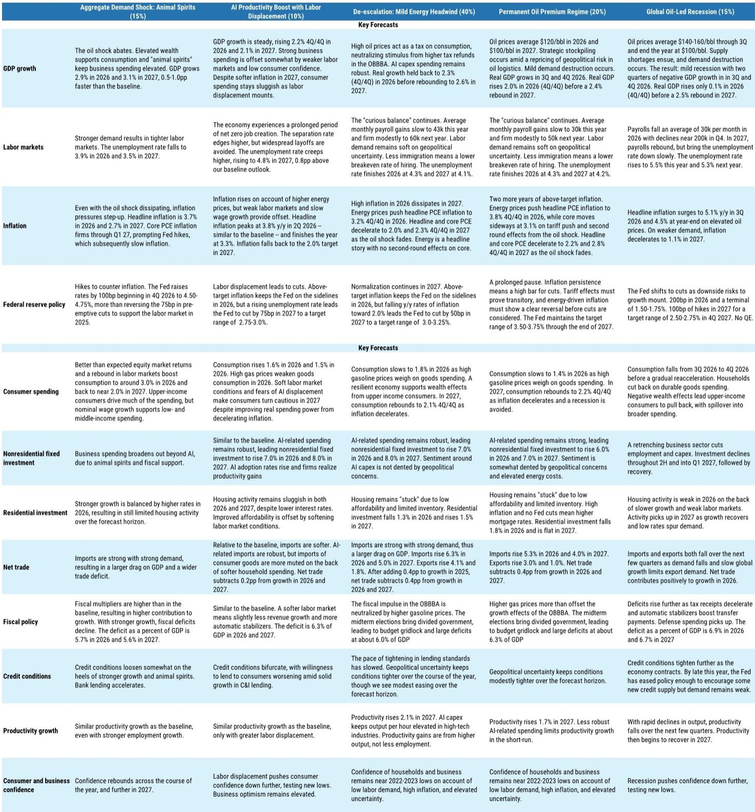
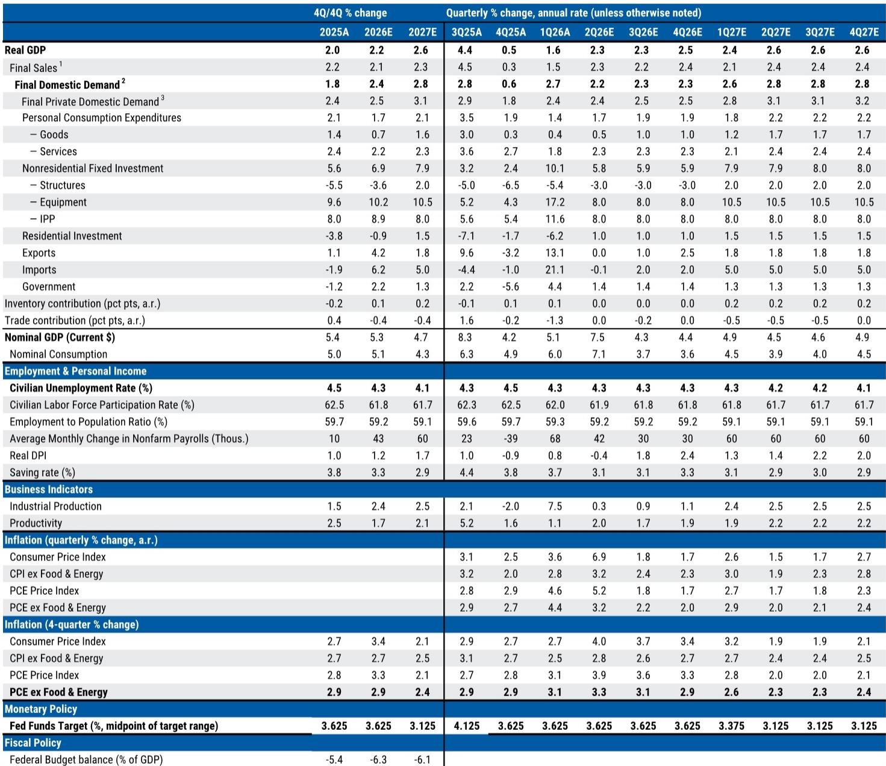
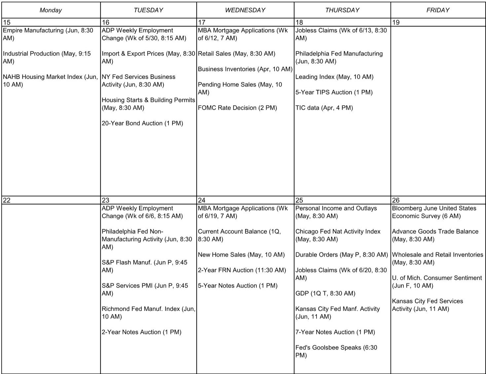

# The Fed's Next Move Is No Longer About Recession Risk—It Is About Whether Inflation Becomes Sticky Again

The balance of risks has shifted. For much of the past year, the dominant concern for the Federal Reserve was the possibility that the labor market would crack under the weight of tariff uncertainty and slowing global demand. That concern justified the 75-basis-point rate cut delivered in late 2025, and it kept the door open for further easing through early 2026. But the incoming data are telling a different story. The labor market is not weakening. It is firming. And inflation, far from settling back toward target, is showing signs of renewed pressure from channels that are only partially understood.

The implication is straightforward but uncomfortable: the Fed may soon face a scenario in which it must choose between holding rates higher for longer and actively tightening into a geopolitical oil shock. Neither option is attractive. But the data are pushing in that direction. The question is not whether the Fed will cut again in the near term. It is whether the next policy move will be a hike.

## The Labor Market Is No Longer a Downside Risk—It Is an Upside Risk to Inflation

The most important development in recent weeks is not the CPI print or the PPI surprise. It is the sustained acceleration in payroll growth. The three-month average has risen to approximately 188,000 jobs per month, a clear step up from the pace observed through most of 2025. This is not a bounce-back from a temporary disruption. It is a reacceleration that has now persisted long enough to demand a reassessment of the Fed's reaction function.

The unemployment rate remains stable at roughly 4.3 percent. That alone is not alarming. But the context matters. The breakeven pace of payroll growth needed to keep the unemployment rate steady is estimated at around 50,000 per month. Current job creation is running nearly four times that level. If this pace continues, the unemployment rate will drift lower, and labor market slack will diminish further. That is precisely the dynamic that, in the absence of a productivity boom, tends to generate upward pressure on wages and, eventually, on core services inflation.

The risk is not that the labor market will collapse. It is that it will tighten enough to reinforce the inflation persistence that the oil shock is already creating. The Fed's dual mandate is becoming unbalanced. The employment side no longer requires accommodation. The inflation side increasingly requires restraint.

## The Oil Impulse to Core Inflation Is Narrow but Persistent—and the Payback Is Not Guaranteed

The May CPI data appeared to offer some relief. Core goods prices turned negative on the month, suggesting that the passthrough of tariff increases is nearing completion. That is consistent with the report's estimate that the cumulative tariff effect on headline PCE has plateaued at roughly 0.62 percentage points. For those hoping that inflation would fade on its own, this was a welcome signal.

But the PCE translation from the PPI data told a more troubling story. Core PCE is now estimated to have risen 0.36 percent month over month in May, pushing the year-over-year pace to 3.4 percent. The upside surprise was concentrated in services, particularly airfares. International airfares in particular showed a notable acceleration, and this is directly linked to the ongoing disruption in the Strait of Hormuz.

The oil impulse to core inflation remains narrow for now. It is not yet broad-based. But that is precisely the point at which central banks must decide whether to act preemptively or wait for second-round effects to materialize. The longer oil prices remain elevated, the greater the risk that these narrow pressures bleed into broader categories—through transportation costs, through input prices, through inflation expectations. The report flags this explicitly: in the absence of a near-term resolution to the conflict, it becomes increasingly difficult to see core PCE ending the year below 3 percent year over year.

This is the critical analytical fork. A temporary oil spike that reverses within a quarter or two can be looked through. A persistent oil premium that lasts six months or more begins to embed itself into the inflation process. The data do not yet tell us which scenario we are in. But the balance of evidence is tilting toward the latter.

## Consumption Is Running Above Wealth-Implied Levels—and That Creates a Hidden Vulnerability

The consumer sector has been a source of resilience throughout this cycle, and that remains true. Real consumption growth slowed to 1.4 percent quarter over quarter annualized in the first quarter of 2026, but the labor income backdrop has improved modestly since then. The nominal payroll proxy for production and non-supervisory workers is running at 5.5 percent above the first-quarter average, and the broader measure for all employees is at 4.4 percent. These are solid numbers.

But the wealth channel tells a different story. Household wealth gains slowed in the first quarter, and the report's wealth model indicates that nominal consumption has been running above the level implied by household wealth for the past year. The gap is now about $99 billion. That suggests that the saving rate, which has been trending lower, may have limited room to fall further. If anything, the risk is that the saving rate rises as households adjust to slower wealth accumulation, which would act as a drag on spending.

This is not a near-term crisis. But it does mean that the upside risk to consumption is limited. The consumer is not about to collapse, but neither is it about to accelerate in a way that would drive growth above trend. The implication for the Fed is that the demand side of the economy is unlikely to generate a self-reinforcing boom. The inflation risk comes from the supply side—from oil, from trade disruptions, from sticky services prices—not from overheating demand.

This distinction matters because it shapes the policy response. If inflation were demand-driven, the Fed would have a clear mandate to tighten. If it is supply-driven, the case for tightening is weaker, because higher rates do not resolve geopolitical disruptions. But the Fed cannot afford to ignore persistent supply-side inflation either, because it can become embedded in expectations. The dilemma is real.

## The Two Scenarios That Matter Are Both Becoming More Likely

The report outlines two scenarios under which the Fed would be forced to shift from a hold to a tightening stance. The first is a demand-push scenario, in which stronger consumption and business investment drive a reacceleration in growth and tighter labor market conditions. The second is a permanent oil premium scenario, in which oil prices remain structurally elevated and gradually pass through into core prices.

Until recently, both scenarios seemed like tail risks. The latest data suggest they are becoming more probable. The labor market is strengthening in a way that is consistent with the demand-push narrative. The oil disruption is persisting in a way that is consistent with the permanent premium narrative. Neither scenario has fully materialized, but the probability distribution has shifted.

The critical unknown is how the conflict in the Middle East evolves. The report notes that the spot price of oil for immediate delivery remains elevated, even as futures prices have moved lower on hopes of a diplomatic resolution. That divergence between physical and financial markets is itself a signal. It suggests that the market is pricing in a resolution, but the physical reality is one of continued disruption. If the conflict drags on, the futures curve will eventually have to adjust, and the oil premium will become more entrenched.

This is the variable that the Fed cannot control. It can set interest rates. It cannot reopen the Strait of Hormuz. That means the central bank is in a reactive posture, waiting for clarity that may not come quickly. In the meantime, the data are moving in a direction that reduces the scope for patience.

## What the Report Does Not Fully Answer: The Threshold for a Hike

For all its analytical rigor, the report leaves one question deliberately open: what is the exact threshold at which the Fed would move from a hold to a hike? The report describes the scenarios and the probabilities, but it does not specify the trigger. That is not a failure of analysis. It is a reflection of genuine uncertainty.

The answer depends on at least three factors that the report acknowledges but does not resolve. First, how long can the Fed look through supply-driven inflation before it begins to affect expectations? Second, how much further can the labor market tighten before wage pressures become visible in the data? Third, how much tolerance does the Fed have for a prolonged period of above-target inflation if growth remains moderate?

These are judgment calls, not algorithmic outputs. The report provides the framework. The reader must decide where they sit on each of these dimensions. That is precisely why the full report is worth reading in detail. The charts on oil stocks, on wealth-implied consumption, on tariff passthrough are not decorative. They are the raw material for making that judgment.

## A Decision Framework for Readers: Three Questions to Ask Yourself

Rather than summarizing the report's conclusions, it is more useful to offer a framework for thinking about the path ahead. Every reader of this analysis should ask themselves three questions.

First, what is your baseline for oil prices six months from now? If you believe the conflict will be resolved and oil will fall back to pre-crisis levels, then the inflation impulse is temporary and the Fed will remain on hold. If you believe the disruption will persist, then the inflation problem is structural and the Fed will eventually have to respond.

Second, how much weight do you put on the labor market data? If you see the recent payroll acceleration as a genuine re-tightening of labor market conditions, then the demand-push scenario is in play. If you see it as a statistical artifact or a temporary catch-up, then the risk is lower.

Third, what is your view on the wealth effect? If you believe that consumption will continue to run above wealth-implied levels, then the saving rate will fall further and demand will remain resilient. If you believe the gap will close, then consumption will slow and the inflation pressure from the demand side will ease.

There is no single right answer to any of these questions. But the quality of your investment and policy decisions depends on being explicit about where you stand. The report gives you the data. The framework gives you the structure. The judgment is yours.

## The Full Report Contains the Charts That Make This Analysis Actionable

The argument laid out here is based on a careful reading of the data and the scenario analysis in the original report. But no written summary can fully substitute for seeing the exhibits firsthand. The oil inventory trajectory, the consumption-wealth gap, the tariff passthrough estimates, and the labor market breakdowns are all essential for forming a conviction. The charts tell a story that numbers alone cannot.

Join the community to read the full report and review the original charts. The data are moving fast. The scenarios are shifting. The stakes are high. Having the full analytical toolkit at your disposal is not a luxury. It is a necessity.

*This article is for learning and discussion only and does not constitute investment advice.*

Personal reading notes and learning share only. Not investment advice.

