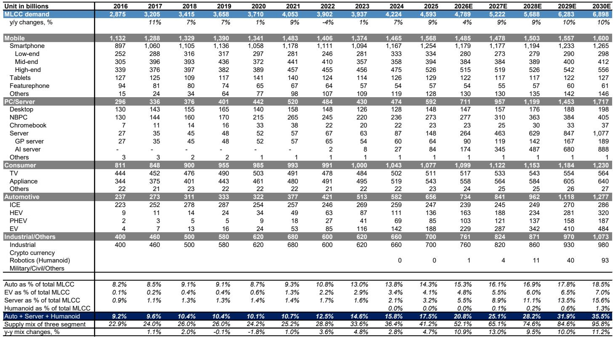
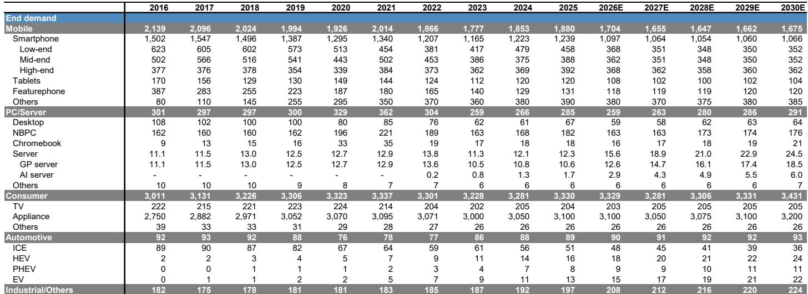
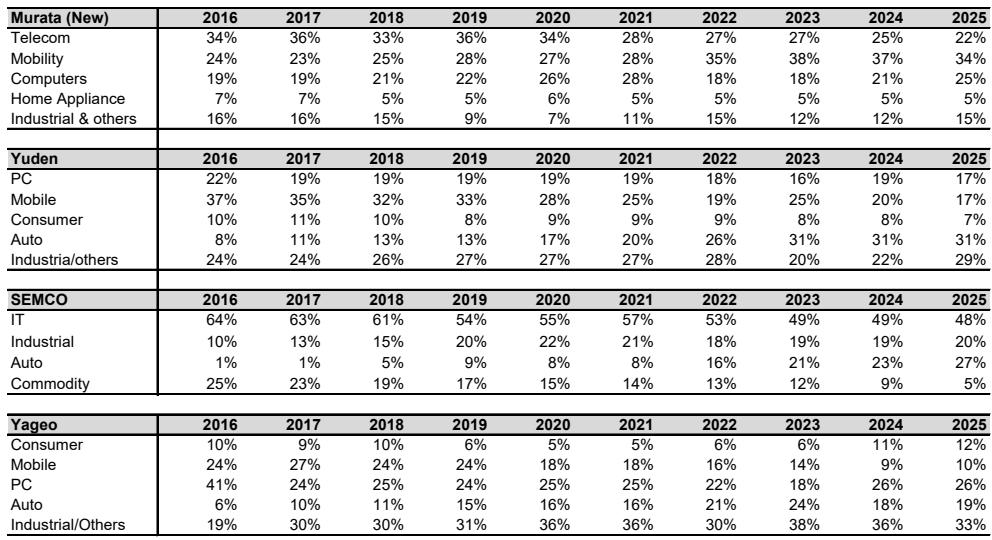

# JPM：MLCC市场低估的不是需求增长，而是有效供给的结构性收缩

这份JPM的最新研报做了一件多数投资者尚未完成的事：它不仅给出了一个MLCC（多层陶瓷电容）行业到2028年的供需模型，更在模型背后揭示了一个被忽视的底层逻辑——真正驱动行业进入新一轮上行周期的，不是AI服务器带来的需求增量本身，而是需求结构变化引发的有效供给收缩。当市场还在用“周期品”的框架审视这些被动元件厂商时，供给端的结构性变化正在重塑整个行业的盈利曲线。

报告的核心判断清晰而有力：MLCC行业将从2025年的10%供给过剩，在2028年转为6%的供给短缺。这个转折的力度，按报告作者的测算，将超过2017-2018年的超级周期。而更值得深思的是，这份判断背后的逻辑链条，指向了一个与市场共识截然不同的方向。

## 1. 真正改变供给曲线的不是产能扩张，而是产品结构升级带来的“有效产能”损耗

理解这份报告，首先要理解一个关键概念：有效产能。MLCC行业的名义产能过去十年保持了约10%的年增长，但这份研报明确指出，真正决定市场供需平衡的，是经过生产损耗和良率调整后的有效产能。而后者正在经历一个加速下滑的过程。

原因在于AI服务器和汽车电子所需的MLCC，与消费电子所用的产品有本质区别。AI服务器需要的是大尺寸、高电容、高电压规格的MLCC，例如1005-47uf这类超高容值产品。这些产品的制造工艺要求使用侧隙构造法，其装配良率比普通MLCC低3到6倍。报告估计，这种产能惩罚对名义产能增长的负面冲击，在未来三年将从过去五年的低至中个位数百分比，加速至双位数百分比。

这意味着什么？当市场看到MLCC厂商宣布扩产计划时，实际可用的产能增量可能远低于预期。这不是一个临时性的良率爬坡问题，而是由产品结构永久性升级带来的有效供给收缩。每一颗用于AI服务器的MLCC，其占用的产能资源可能是普通消费级产品的数倍。在需求结构快速向高端迁移的过程中，有效供给的弹性正在被系统性压缩。

## 2. 服务器需求的结构性跃迁，正在将MLCC从一个“被动跟随”的行业变为“主动定价”的行业

报告中的需求预测数据揭示了这一变化的幅度。以单台设备的MLCC用量来看，通用服务器的用量从2016年的约2500颗增长到2025年的约12000颗，而AI服务器在2025年已经达到每台50000颗，到2030年预计将接近148000颗。仅服务器这一个应用领域，其占MLCC总需求的比重将从2025年的3.2%跃升至2028年的11.1%。

JPM预测，2025至2028年间MLCC行业TAM（可寻址市场）的年复合增长率将达到24%，远超2016至2019年的16%。更重要的是，这一轮增长的驱动力主要来自ASP（平均销售价格）的上行，而非单纯的数量增长。

这里有一个关键的市场理解偏差。许多人认为MLCC是典型的“量增价跌”的被动元件——随着技术成熟和规模扩大，单价会自然下降。但这份报告揭示的图景恰恰相反：在高端应用领域，由于有效供给受限，价格正在成为主动变量。报告预计，2025至2028年间MLCC行业ASP将累计增长超过50%，其幅度与2016至2018年的超级周期相当。但这一次的驱动力不是阶段性的备货恐慌，而是需求结构的永久性升级。

## 3. 行业盈利能力正在经历一次结构性的中枢上移

如果只看行业历史，MLCC的利润率波动极大。2018年行业OPM（营业利润率）达到36%的峰值后，在2023年回落至15%。但这份研报预测，行业OPM将在2028年达到38%，超越2018年的高点。

这背后的逻辑不是简单的涨价周期，而是产品结构变化带来的利润率重置。高端MLCC的单价更高、技术壁垒更深、客户粘性更强，而能够量产这些产品的供应商极为有限。报告提到，AI服务器级MLCC的供应商只有少数几家能够规模化生产，这本质上构成了一个供给寡头格局。在这种格局下，定价权从下游客户向供应商转移，行业利润率的中枢自然上移。

JPM对全球前五大MLCC厂商的利润率预测更为激进：从2025年的17%升至2028年的38%。这与整个行业平均利润率的重合，暗示了头部厂商正在获取不成比例的份额和定价权。

## 4. 日本和台湾厂商将比韩国同行享有更大的估值弹性

报告在投资建议层面给出了明确的地区偏好：日本（村田、太阳诱电、TDK）和台湾（国巨）优于韩国（三星电机）。这个判断的落脚点在于估值，而非基本面差异。

目前亚洲主要MLCC厂商的总市值已达3540亿美元，交易在2026至2028年共识EPS的61倍、40倍和30倍。这个估值水平看似不低，但报告认为，考虑到行业正处于向AI生态转型的早期阶段，共识盈利预测往往滞后于实际增长。只要增长动能持续，股价动力可能在整个2026年下半年保持强劲。

日本和台湾厂商的估值相对更具吸引力，而韩国同业在经历了更大幅度的上涨后，估值弹性空间已经收窄。这个判断的逻辑是：当行业处于盈利上修的早期阶段时，估值对增长的反应是非线性的，低估值起点往往意味着更大的重估空间。

## 5. 报告尚未完全回答的关键问题：AI服务器MLCC的良率拐点何时到来？

尽管报告对供需缺口的预测非常清晰，但有一个关键变量尚未被充分讨论：AI服务器MLCC的良率改善路径。报告承认，这类产品的装配良率比普通MLCC低3到6倍，且只有少数供应商能够规模化生产。但良率改善的速度将直接影响有效供给的释放节奏。

如果主要供应商在未来12至18个月内成功将良率提升至接近传统产品的水平，那么有效供给的约束将被大幅缓解，供需缺口可能比预测的更小。反之，如果良率改善慢于预期，供给短缺的程度和持续时间都可能超出当前模型。

这个问题的答案取决于技术突破的速度，而报告对此没有给出明确的判断。这恰恰是投资者需要持续跟踪的核心变量——它将决定当前估值所隐含的盈利预期是否合理。

## 6. 一个值得持续跟踪的观察框架：从二级市场价格到合同价格的传导链条

报告提供了一个非常实用的观察框架：二级市场价格历来是合同定价情绪的先导指标。这意味着，与其盯着季度财报中的合同价格变化，不如关注现货市场的价格波动。当二级市场价格开始加速上涨时，合同价格的上调往往只是时间问题。

另一个值得关注的指标是客户采购行为的变化。报告提到，尽管消费电子终端需求仍然疲软，但采购活动已经开始出现微妙变化——客户和分销渠道开始注意到供给趋紧。这种“感知到短缺”的行为变化，往往比实际数据更能预示价格拐点的到来。

对于产业决策者而言，这份报告传递的信号是清晰的：MLCC正在从一个“成本项”变为“战略物资”。那些能够提前锁定高端MLCC供应的企业，将在AI基础设施的竞争中占据更有利的位置。而对于投资者而言，核心问题不是“MLCC是不是周期股”，而是“这一轮周期的驱动力有多少已经被市场定价”。

报告中的供需模型、ASP预测和利润率展望，提供了足够多的数据支撑来形成自己的判断。但正如报告所揭示的，真正决定回报的，可能不是这些数字本身，而是对这些数字背后结构性变化的认知深度。

欢迎来星球微信群里继续讨论：当MLCC的供给约束遇上AI资本开支的持续扩张，哪些关键假设可能被打破？哪些未被定价的二阶效应值得深入拆解？

Personal reading notes and learning share only. Not investment advice.

