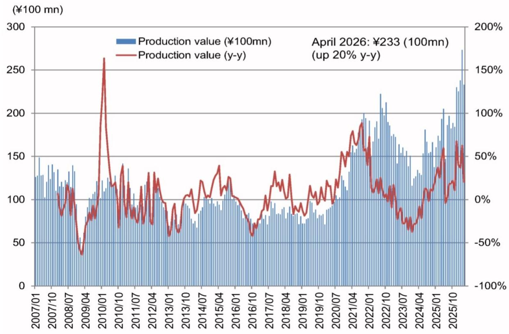
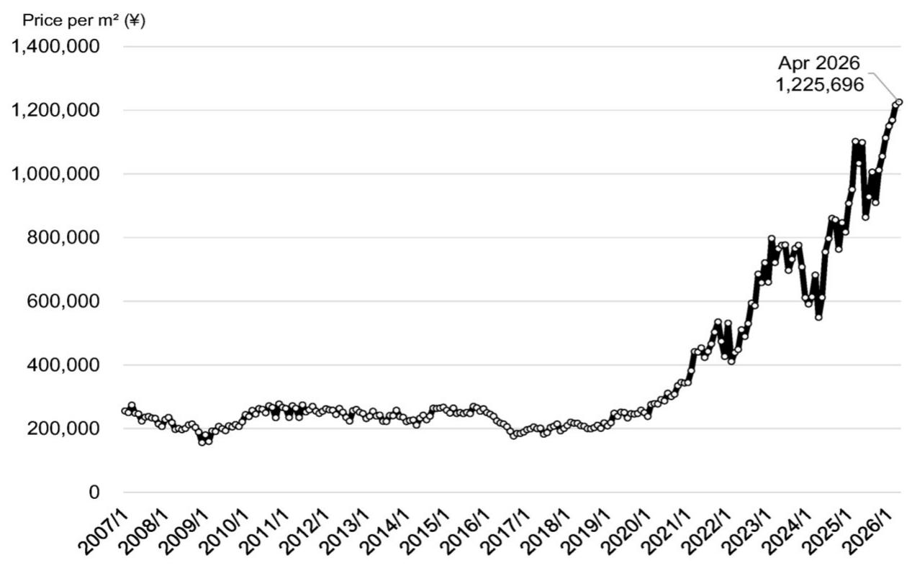

# NOM：3.5D封装竞争序幕拉开，真正的赢家不是台积电或英特尔，而是供应链的再组织者

这份NOM研报的核心判断，并非关于某个季度出货量的波动，而是指向一个更根本的结构性变化：半导体先进封装正在从“台积电主导的单一技术路线”转向“多技术路线竞争”格局。报告以4月封装基板出货数据为引子，但真正的洞察在于2028年将启动的3.5D封装量产竞争，以及这一竞争对供应链权力格局的深层含义。

对于关注半导体产业链的投资者而言，当前市场可能过度聚焦于AI芯片本身的算力竞赛，而低估了后端封装技术路线分化所带来的供应链重构机会。NOM这份报告提供了一个关键的观察框架：谁能在3.5D封装时代成为供应链的再组织者，谁就将获得这一轮技术升级中最大的价值增量。

## 1. 4月封装基板出货回落是暂时扰动，暑期的真正放量才是观察窗口

NOM报告披露的4月数据看似矛盾：出货金额同比增20%，但环比从3月的273亿日元降至233亿日元。按面积计算，出货量仅同比增1%，而每平米均价同比大涨19%至122.6万日元的历史新高。

这一组合信号指向两个关键点：其一，价格持续上行说明高端封装基板的供需依然紧张；其二，量的环比回落可能与Rubin处理器的封装出货节奏有关——NOM判断，由于服务器生产被推迟，Rubin封装出货暂时放缓。报告明确指出，2025年4月正是Blackwell封装进入全速生产的时期，基数效应明显。

更值得关注的是NOM对时间节点的判断：Rubin封装出货将在2026年夏季进入全速期，最早6月，最晚8月。这意味着当前的市场预期可能尚未充分计入这一轮放量带来的供应链压力。对于关注Ibiden等封装基板供应商的投资者，二季度末到三季度初的数据将是验证这一判断的关键窗口。

## 2. 3.5D封装不是技术升级，而是后端供应链权力格局的重新洗牌

NOM报告最核心的洞察在于对3.5D封装技术路线的分析。3.5D封装不同于传统的2.5D或3D封装，它通过混合键合技术将加速器、HBM和小型推理处理器直接键合在同一封装上。这不仅是技术参数的提升，更是对整个后端供应链组织方式的根本性改变。

当前，台积电通过其3DFabric Alliance平台主导着先进封装的生态。但NOM指出，2028年将启动量产的3.5D封装正在形成两条并行路线：台积电的CoPoS（面板级封装）+玻璃核心基板路线，以及英特尔的EMIB-T技术路线。

这一分化的意义在于：它打破了台积电在先进封装领域的垄断地位，为供应链参与者创造了新的选择空间。对于基板供应商、设备厂商、散热方案提供商而言，不再只有台积电一个客户和标准制定者。这种竞争格局的变化，往往意味着供应链利润分配的重构。

## 3. 英特尔EMIB-T获得谷歌订单，但产能瓶颈才是真正约束

NOM报告引用了The Information在6月8日的报道：谷歌已向英特尔下单，计划在2028年用EMIB-T技术封装至少300万颗TPU。同时，英伟达也在考虑采用该技术。尽管NOM表示未确认报道的准确性，但这则信息本身已经说明了市场对技术路线分化的预期正在形成。

然而，NOM提出了一个关键的约束条件：Ibiden目前没有能力为EMIB-T技术每年供应300万颗TPU所需的基板。因此，这一消息短期内不会反映在Ibiden的盈利预测中。但报告同时指出，值得关注的是Ibiden是否会宣布产能扩张计划。

这意味着，即便技术路线选择存在不确定性，产能瓶颈本身就是一个值得追踪的投资主题。谁能率先突破产能限制，谁就能在3.5D封装竞争中占据先机。对于投资者而言，关注基板供应商的资本开支计划，可能比关注技术路线选择更具可操作性。

## 4. 台积电的CoPoS与玻璃基板：时间表清晰，但技术挑战仍未完全解决

NOM报告详细梳理了台积电在年度股东大会上的表态：计划2026年6月启动面板级封装（CoPoS）试产线，2028年经过验证后启动量产；同时准备在未来两到三年内与Ibiden等合作伙伴推进玻璃核心基板的量产。

NOM据此推断，台积电的3.5D封装技术组合将是：SoIC进行芯片堆叠、CoPoS进行面板级封装、FC-BGA采用玻璃核心基板。但报告也明确指出，玻璃核心基板的采用将在CoPoS之后。

这里有一个尚未完全回答的关键问题：玻璃核心基板的开发目前仍存在挑战，台积电在股东大会上承认了这一点。这意味着CoPoS的量产时间表可能相对可靠，但玻璃基板的引入时间仍存在不确定性。对于依赖玻璃基板性能提升的设计方案，这一不确定性可能影响其产品路线图。

## 5. 从台积电平台迁移到英特尔EMIB-T：这不是简单的替代，而是生态系统的重建

NOM报告点出了一个容易被忽视的技术壁垒：在台积电3DFabric Alliance平台上开发加速器的公司，转向EMIB-T并非易事。原因在于3.5D封装包含了供电和热管理等关键功能，这些功能与后端工艺设计平台深度绑定。

具体而言，供电方面需要与合作伙伴共同开发垂直供电或集成电压调节器（iVRs）；热管理方面需要针对每个芯片优化的微通道冷板。这意味着，任何想要采用英特尔EMIB-T技术的公司，要么依赖英特尔的平台，要么自行建立后端半导体工艺供应链。

这一判断的深层含义是：技术路线的切换不仅是成本问题，更是时间和能力问题。对于谷歌这样拥有足够规模和自研能力的公司，建立自己的后端供应链是可行的。但对于大多数AI芯片设计公司，这种切换可能面临巨大的工程挑战和时间成本。因此，3.5D封装竞争的实际格局，可能比简单的“台积电vs英特尔”二分法更为复杂。

## 6. 报告尚未完全回答的关键问题：供应链组织者的价值如何定价

NOM报告在分析技术路线时，提出了一个重要的观察点：3.5D封装竞争将推动企业间的合作加速。但报告没有完全展开的是，在这一轮合作中，谁将成为供应链的组织者，以及这种组织者角色能获得多少价值。

在台积电主导的时代，台积电本身就是供应链的组织者，它制定标准、选择合作伙伴、分配利润。但在多技术路线竞争的格局下，供应链的组织权可能分散。例如，谷歌如果选择英特尔EMIB-T路线，它可能需要自行组织供电和散热解决方案的供应商网络。这意味着，系统厂商（如谷歌、英伟达）可能不得不承担更多的供应链组织职能。

这一趋势对投资的意义在于：那些能够帮助系统厂商降低供应链组织复杂度的公司——无论是提供标准化接口的IP厂商、提供模块化散热方案的公司，还是能够整合多种封装技术的OSAT——都可能获得超出其当前市场地位的价值重估。NOM报告虽然没有直接讨论这一点，但从其对“企业间合作将加速”的判断可以推导出这一逻辑。

## 7. 给读者的观察框架：如何追踪3.5D封装竞争中的价值信号

基于NOM报告的分析，我们建议读者从以下三个维度建立自己的观察框架：

第一，跟踪产能扩张信号。无论是Ibiden是否会宣布产能扩张计划，还是台积电CoPoS试产线的进展，产能数据是比技术路线更可靠的先行指标。

第二，关注生态系统绑定程度。哪些公司同时出现在台积电和英特尔的技术平台名单中？哪些公司开始与多家客户共同开发供电或散热方案？这些信号可能预示着供应链组织权的转移。

第三，留意系统厂商的自研动作。谷歌选择英特尔的EMIB-T，可能只是一个开始。如果更多大型系统厂商开始建立自己的后端供应链，这意味着传统OSAT和基板供应商的议价能力可能被削弱，而专注于特定模块（如微通道冷板、iVR）的供应商可能受益。

这些观察框架的建立，将帮助投资者在3.5D封装竞争真正爆发前，提前识别出那些可能被重新定价的资产。

---

3.5D封装竞争的核心，不在于谁先量产，而在于谁能最有效地组织起一条能够同时满足性能、成本和可靠性要求的供应链。NOM报告为我们提供了一个清晰的起点，但关于供应链组织者的价值如何被市场定价、玻璃基板的技术挑战何时能够解决、以及系统厂商自建供应链的边际成本等关键问题，仍需要更深入的讨论。

欢迎来星球微信群里继续探讨这些问题——我们已经在群内分享了NOM这份报告的完整图表和我们的详细解读，也期待听到你对3.5D封装竞争格局的判断。

Personal reading notes and learning share only. Not investment advice.

